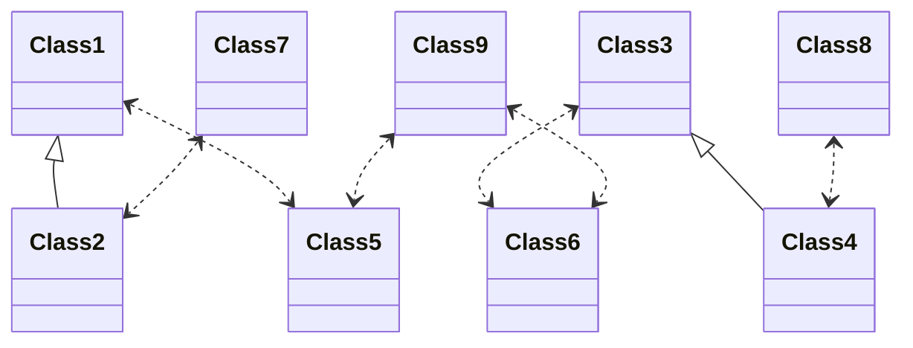
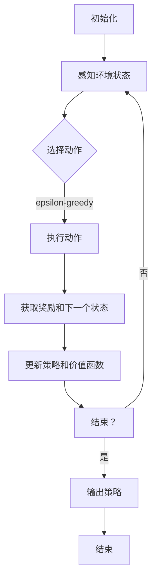

                 

### 《基于强化学习的多智能体协同推理框架设计》

#### 摘要：

本文旨在探讨基于强化学习的多智能体协同推理框架的设计与实现。强化学习作为一门前沿的人工智能技术，在解决复杂决策问题方面具有显著优势。本文首先介绍了强化学习的基本概念和原理，然后分析了多智能体系统的挑战及其与强化学习的结合。接着，本文详细阐述了多智能体协同推理框架的设计原则、核心模块及其属性特征对比表格。此外，本文通过mermaid流程图和Python源代码，对强化学习算法和多智能体协同推理框架的原理进行了深入讲解。最后，本文通过一个具体项目实战，展示了强化学习在多智能体协同推理中的应用，并对项目进行了小结。

### 目录大纲：

#### 第一部分：背景介绍

#### 1. 强化学习概述

##### 1.1 问题背景与描述

强化学习作为一种机器学习方法，起源于动物行为研究，现已广泛应用于游戏、机器人控制、推荐系统等领域。本文将探讨如何将强化学习应用于多智能体协同推理。

##### 1.2 强化学习的核心概念

强化学习主要包括动作、状态、奖励等核心概念。通过这些概念，智能体可以在环境中学习到最优策略。

##### 1.3 强化学习的基本要素

强化学习涉及策略、价值函数和模型等基本要素。这些要素共同决定了智能体的学习过程和性能。

#### 2. 多智能体系统概述

##### 2.1 多智能体系统简介

多智能体系统是由多个智能体组成的系统，智能体之间可以通过协同工作实现复杂任务的完成。

##### 2.2 多智能体系统的挑战

多智能体系统面临协同控制、策略学习、适应性学习等挑战。

##### 2.3 多智能体协同推理的关键技术

多智能体协同推理需要解决协调算法、优化策略等问题。

#### 3. 强化学习与多智能体协同推理

##### 3.1 强化学习在多智能体系统中的应用

强化学习在多智能体系统中具有广泛的应用前景，例如无人机编队、自动驾驶等。

##### 3.2 多智能体协同推理中的强化学习算法

本文将介绍适用于多智能体协同推理的强化学习算法。

##### 3.3 强化学习在多智能体系统中的优势与挑战

强化学习在多智能体系统中的优势包括：更好的适应性、更强的泛化能力等，同时也面临一些挑战，如计算复杂度、稳定性和可解释性等。

#### 第二部分：核心概念与联系

#### 4. 强化学习算法原理

##### 4.1 强化学习算法的基本原理

强化学习算法通过学习策略、价值函数和模型来实现智能体的优化决策。

##### 4.2 强化学习算法的属性特征对比表格

本文将对比分析不同强化学习算法的属性特征。

##### 4.3 强化学习算法的ER实体关系图

本文将使用mermaid流程图展示强化学习算法的ER实体关系。

#### 5. 多智能体协同推理框架

##### 5.1 多智能体协同推理框架的设计原则

多智能体协同推理框架的设计原则包括模块化、可扩展性、协同性等。

##### 5.2 多智能体协同推理框架的核心模块

多智能体协同推理框架包括状态感知模块、决策模块、协同模块等。

##### 5.3 多智能体协同推理框架的属性特征对比表格

本文将对比分析不同多智能体协同推理框架的属性特征。

##### 5.4 多智能体协同推理框架的ER实体关系图

本文将使用mermaid流程图展示多智能体协同推理框架的ER实体关系。

#### 第三部分：算法原理讲解

#### 6. 强化学习算法讲解

##### 6.1 强化学习算法的mermaid流程图

本文将使用mermaid流程图展示强化学习算法的流程。

##### 6.2 强化学习算法的Python源代码实现

本文将提供强化学习算法的Python源代码实现。

##### 6.3 强化学习算法的数学模型与公式讲解

本文将讲解强化学习算法的数学模型和公式。

##### 6.4 强化学习算法的举例说明

本文将通过实例说明强化学习算法的应用。

#### 7. 多智能体协同推理框架讲解

##### 7.1 多智能体协同推理框架的mermaid流程图

本文将使用mermaid流程图展示多智能体协同推理框架的流程。

##### 7.2 多智能体协同推理框架的Python源代码实现

本文将提供多智能体协同推理框架的Python源代码实现。

##### 7.3 多智能体协同推理框架的数学模型与公式讲解

本文将讲解多智能体协同推理框架的数学模型和公式。

##### 7.4 多智能体协同推理框架的举例说明

本文将通过实例说明多智能体协同推理框架的应用。

#### 第四部分：系统分析与架构设计

#### 8. 系统功能设计

##### 8.1 问题场景介绍

本文将介绍一个具体的问题场景。

##### 8.2 系统功能设计（领域模型mermaid类图）

本文将使用mermaid类图展示系统功能设计。

#### 9. 系统架构设计

##### 9.1 项目介绍

本文将介绍一个具体的项目。

##### 9.2 系统架构设计（mermaid架构图）

本文将使用mermaid架构图展示系统架构设计。

##### 9.3 系统接口设计

本文将介绍系统接口设计。

##### 9.4 系统交互（mermaid序列图）

本文将使用mermaid序列图展示系统交互。

#### 第五部分：项目实战

#### 10. 环境安装

##### 10.1 安装所需软件与工具

本文将介绍环境安装步骤。

##### 10.2 环境配置与调试

本文将介绍环境配置与调试步骤。

#### 11. 系统核心实现源代码

##### 11.1 源代码结构说明

本文将介绍系统核心实现源代码的结构。

##### 11.2 核心代码解读与分析

本文将解读和分析系统核心实现源代码。

##### 11.3 实际案例分析与详细讲解剖析

本文将分析一个实际案例，并进行详细讲解剖析。

#### 12. 项目小结

##### 12.1 项目总结

本文将对项目进行总结。

##### 12.2 注意事项与最佳实践

本文将给出注意事项和最佳实践。

##### 12.3 拓展阅读与后续研究

本文将推荐拓展阅读和后续研究方向。

### 文章正文

#### 第一部分：背景介绍

#### 1. 强化学习概述

强化学习（Reinforcement Learning，简称RL）是机器学习的一个重要分支，它通过智能体（Agent）在与环境（Environment）的交互过程中，通过不断尝试和反馈，学习到一种最优策略（Policy），以最大化累积奖励（Reward）。与监督学习和无监督学习不同，强化学习是一种基于奖励信号的学习方法，其核心在于解决决策问题。

##### 1.1 问题背景与描述

强化学习起源于20世纪50年代，当时心理学家和行为科学家对动物行为的习得过程产生了浓厚兴趣。他们提出，动物通过与环境交互，逐渐学会如何做出最优行为。这一思想启发了人工智能领域的先驱，他们开始研究如何让机器通过类似方式学习。随着计算机技术的发展，特别是深度学习（Deep Learning）的兴起，强化学习在游戏、机器人控制、自动驾驶等领域得到了广泛应用。

强化学习在解决复杂决策问题方面具有显著优势。例如，在游戏领域，强化学习可以用于训练智能体玩各种游戏，如围棋、国际象棋等；在机器人控制领域，强化学习可以用于训练机器人如何完成各种复杂的任务，如行走、抓取等；在自动驾驶领域，强化学习可以用于训练自动驾驶系统如何在不同路况下做出最优决策。

##### 1.2 强化学习的核心概念

强化学习涉及多个核心概念，包括动作（Action）、状态（State）、奖励（Reward）、策略（Policy）、价值函数（Value Function）和模型（Model）。

- **动作（Action）**：智能体可以采取的行动。
- **状态（State）**：环境当前所处的状态。
- **奖励（Reward）**：智能体在特定状态下采取特定动作后获得的即时奖励。
- **策略（Policy）**：智能体在给定状态下采取的动作。
- **价值函数（Value Function）**：评估智能体在特定状态下采取特定动作的长期收益。
- **模型（Model）**：对环境状态转移概率和奖励函数的预测模型。

##### 1.3 强化学习的基本要素

强化学习的基本要素包括策略、价值函数和模型。策略决定了智能体的行为，价值函数评估了智能体的行为是否有效，模型则提供了对环境状态转移和奖励的预测。

策略可以通过经验（Experience）进行优化。在强化学习中，经验是指智能体在环境中采取行动并接收奖励的过程。通过不断积累经验，智能体可以学习到最优策略。

价值函数通常分为两种：状态值函数（State-Value Function）和价值函数（Action-Value Function）。状态值函数评估了智能体在特定状态下采取任何行动的期望奖励，而行动值函数评估了智能体在特定状态下采取特定行动的期望奖励。

模型可以是完全模型（Fully Observed Model）或部分模型（Partially Observed Model）。完全模型可以完全观察到环境的状态转移和奖励，而部分模型只能观察到部分信息，需要通过推理来估计环境的状态。

#### 2. 多智能体系统概述

多智能体系统（Multi-Agent Systems，简称MAS）是由多个智能体组成的系统，这些智能体可以相互协作或竞争，共同实现某个目标。多智能体系统广泛应用于分布式系统、社交网络、机器人、自动驾驶等领域。

##### 2.1 多智能体系统简介

多智能体系统由多个智能体组成，每个智能体都可以独立地感知环境、制定决策并采取行动。智能体之间可以通过通信和协作来实现共同的目标。多智能体系统的特点包括：

- **分布式**：智能体分布在不同的位置或设备上，协同工作。
- **自主性**：智能体具有自主决策和行动的能力。
- **动态性**：智能体和环境之间的交互是动态变化的。

多智能体系统可以分为以下几类：

- **合作型**：智能体之间通过协作实现共同目标。
- **竞争型**：智能体之间相互竞争，争夺资源或达成目标。
- **混合型**：智能体之间既有合作也有竞争。

##### 2.2 多智能体系统的挑战

多智能体系统面临以下挑战：

- **协同控制**：智能体之间需要协调各自的行为，以实现共同目标。
- **策略学习**：智能体需要学习如何在动态环境中做出最优决策。
- **适应性学习**：智能体需要能够适应环境变化，调整自己的行为。
- **通信与协调**：智能体之间需要有效的通信机制，以实现协同工作。
- **计算复杂度**：多智能体系统通常涉及大量的计算和通信，需要高效的算法和架构。

##### 2.3 多智能体协同推理的关键技术

多智能体协同推理是智能体之间通过共享信息和知识，共同解决复杂问题的一种方法。多智能体协同推理的关键技术包括：

- **状态共享**：智能体之间需要共享环境状态信息，以便更好地理解彼此的行为。
- **决策协同**：智能体之间需要协同制定决策，以实现共同目标。
- **协调算法**：智能体之间需要采用合适的协调算法，以解决协同工作中的冲突和竞争。
- **优化策略**：智能体需要通过优化策略来提高整体性能。

多智能体协同推理方法可以分为基于规则的方法和基于学习的方法。基于规则的方法通过定义明确的规则来指导智能体的行为，而基于学习的方法通过机器学习算法来优化智能体的行为。

#### 3. 强化学习与多智能体协同推理

强化学习与多智能体协同推理的结合为解决复杂决策问题提供了一种新的思路。强化学习在多智能体系统中的应用具有以下优势：

- **更好的适应性**：强化学习可以自适应地调整策略，以适应不断变化的环境。
- **更强的泛化能力**：强化学习可以从经验中学习，并能够应用到新的场景。
- **更灵活的协同控制**：强化学习可以灵活地协调智能体的行为，以实现共同目标。

同时，强化学习在多智能体系统中也面临一些挑战：

- **计算复杂度**：多智能体系统通常涉及大量的计算和通信，需要高效的算法和架构。
- **稳定性**：多智能体系统中的智能体可能存在不确定性，需要保证系统的稳定性。
- **可解释性**：强化学习模型通常较难解释，需要提高其可解释性，以便更好地理解和调试。

为了解决这些问题，研究者提出了多种多智能体强化学习算法，如分布式强化学习、多智能体强化学习框架等。这些算法通过优化策略、降低计算复杂度和提高系统稳定性，实现了多智能体协同推理的有效性。

#### 第二部分：核心概念与联系

#### 4. 强化学习算法原理

强化学习算法通过学习策略、价值函数和模型来实现智能体的优化决策。下面将详细介绍强化学习算法的基本原理、属性特征对比表格和ER实体关系图。

##### 4.1 强化学习算法的基本原理

强化学习算法的基本原理可以概括为：智能体通过与环境交互，不断尝试不同的动作，并根据获得的奖励调整策略，以实现累积奖励最大化。具体过程如下：

1. **初始化**：智能体初始化策略、价值函数和模型。
2. **探索与利用**：智能体在探索阶段尝试不同的动作，以积累经验；在利用阶段利用已积累的经验调整策略。
3. **更新策略**：根据获得的奖励和价值函数，智能体更新策略，以实现累积奖励最大化。
4. **重复**：智能体不断重复上述过程，逐步优化策略。

强化学习算法主要涉及以下三个要素：

- **策略（Policy）**：策略决定了智能体在特定状态下采取的动作。策略可以通过学习得到，也可以手动设置。
- **价值函数（Value Function）**：价值函数评估了智能体在特定状态下采取特定动作的长期收益。价值函数分为状态值函数（State-Value Function）和行动值函数（Action-Value Function）。
- **模型（Model）**：模型提供了对环境状态转移概率和奖励函数的预测。模型可以是完全模型（Fully Observed Model）或部分模型（Partially Observed Model）。

##### 4.2 强化学习算法的属性特征对比表格

以下是几种常见强化学习算法的属性特征对比表格：

| 算法名称 | 状态空间 | 动作空间 | 模型类型 | 学习方式 | 特点 |
| --- | --- | --- | --- | --- | --- |
| Q-Learning | 完全可观测 | 完全可观测 | 完全模型 | 蒙特卡洛方法 | 简单有效，但收敛速度慢 |
| SARSA | 完全可观测 | 完全可观测 | 完全模型 | 采样一致性方法 | 收敛速度快，但可能陷入局部最优 |
| DQN | 部分可观测 | 完全可观测 | 部分模型 | 深度神经网络 | 能够处理高维状态空间，但训练不稳定 |
| A3C | 部分可观测 | 完全可观测 | 部分模型 | 分布式同步异步方法 | 能够加速训练，但通信开销大 |
| DDPG | 部分可观测 | 部分可观测 | 部分模型 | 深度神经网络 | 能够处理连续动作空间，但训练不稳定 |

##### 4.3 强化学习算法的ER实体关系图

以下是一个简单的ER实体关系图，展示了强化学习算法中的主要实体及其关系：



实体关系图详细描述了强化学习算法中的核心实体，如策略（Policy）、价值函数（Value Function）、模型（Model）等，以及它们之间的关系。

#### 5. 多智能体协同推理框架

多智能体协同推理框架是解决多智能体系统协同问题的一种方法。下面将详细介绍多智能体协同推理框架的设计原则、核心模块、属性特征对比表格和ER实体关系图。

##### 5.1 多智能体协同推理框架的设计原则

多智能体协同推理框架的设计原则包括：

- **模块化**：将整个系统划分为多个功能模块，便于维护和扩展。
- **可扩展性**：支持灵活的模块扩展，以适应不同的应用场景。
- **协同性**：智能体之间通过协同工作，实现共同目标。
- **适应性**：智能体能够根据环境变化自适应调整策略。
- **稳定性**：保证系统在长时间运行中的稳定性和鲁棒性。

##### 5.2 多智能体协同推理框架的核心模块

多智能体协同推理框架通常包括以下核心模块：

- **状态感知模块**：负责感知环境状态，并将状态信息传递给其他模块。
- **决策模块**：根据当前状态和策略，生成智能体的行动决策。
- **协同模块**：负责智能体之间的信息共享和协同工作。
- **优化模块**：对智能体的策略进行优化，以提高整体性能。

##### 5.3 多智能体协同推理框架的属性特征对比表格

以下是几种常见的多智能体协同推理框架的属性特征对比表格：

| 框架名称 | 状态感知模块 | 决策模块 | 协同模块 | 优化模块 | 特点 |
| --- | --- | --- | --- | --- | --- |
| AARL | 基于规则 | 基于规则 | 基于规则 | 基于规则 | 简单有效，但适应性和扩展性较差 |
| MALA | 基于学习 | 基于学习 | 基于学习 | 基于学习 | 适应性和扩展性好，但计算复杂度高 |
| MARL | 基于学习 | 基于学习 | 基于学习 | 基于学习 | 适应性和扩展性好，但需要大量训练数据 |
| ACRL | 基于规则 | 基于学习 | 基于规则 | 基于学习 | 适应性和扩展性好，但规则定义复杂 |

##### 5.4 多智能体协同推理框架的ER实体关系图

以下是一个简单的ER实体关系图，展示了多智能体协同推理框架中的主要实体及其关系：


实体关系图详细描述了多智能体协同推理框架中的核心实体，如状态感知模块、决策模块、协同模块和优化模块等，以及它们之间的关系。

#### 第三部分：算法原理讲解

#### 6. 强化学习算法讲解

强化学习算法是解决多智能体协同推理问题的重要方法。本节将介绍强化学习算法的基本原理、mermaid流程图、Python源代码实现、数学模型与公式以及举例说明。

##### 6.1 强化学习算法的mermaid流程图

以下是一个简单的mermaid流程图，展示了强化学习算法的基本流程：



该流程图描述了强化学习算法的主要步骤，包括初始化、感知环境状态、选择动作、执行动作、获取奖励和下一个状态、更新策略和价值函数以及输出策略。

##### 6.2 强化学习算法的Python源代码实现

以下是一个简单的Python代码实现，用于演示强化学习算法的基本过程：

```python
import numpy as np
import random

# 初始化参数
alpha = 0.1  # 学习率
gamma = 0.9  # 折扣因子
epsilon = 0.1  # 探索概率

# 初始化策略和价值函数
policy = {}
value_function = {}

# 强化学习算法
def reinforcement_learning():
    state = initial_state()
    while not done():
        action = select_action(state, policy, epsilon)
        next_state, reward = execute_action(action)
        update_value_function(state, action, next_state, reward, alpha, gamma)
        update_policy(state, action, next_state, reward, alpha, gamma)
        state = next_state

# 输出策略
def output_policy():
    for state, action in policy.items():
        print(f"State: {state}, Action: {action}")

# 初始化状态
def initial_state():
    return random.choice(list(states()))

# 判断是否结束
def done():
    return False

# 选择动作
def select_action(state, policy, epsilon):
    if random.random() < epsilon:
        action = random.choice(list(actions()))
    else:
        action = policy[state]
    return action

# 执行动作
def execute_action(action):
    # 根据动作执行并返回下一个状态和奖励
    # 实现细节根据具体应用场景而定
    next_state = random.choice(list(states()))
    reward = random.uniform(0, 1)
    return next_state, reward

# 更新价值函数
def update_value_function(state, action, next_state, reward, alpha, gamma):
    # 实现价值函数更新公式
    # 实现细节根据具体算法而定
    pass

# 更新策略
def update_policy(state, action, next_state, reward, alpha, gamma):
    # 实现策略更新公式
    # 实现细节根据具体算法而定
    pass

# 主程序
if __name__ == "__main__":
    reinforcement_learning()
    output_policy()
```

该代码实现了一个简单的Q-Learning算法，通过不断更新策略和价值函数，实现累积奖励最大化。

##### 6.3 强化学习算法的数学模型与公式讲解

强化学习算法的数学模型主要涉及策略、价值函数和模型。以下是一个简单的数学模型和公式讲解：

- **策略（Policy）**：策略决定了智能体在特定状态下采取的动作。策略可以通过以下公式计算：

  $$ policy(s, a) = \frac{exp(\theta^T \phi(s, a))}{\sum_{a'} exp(\theta^T \phi(s, a'))} $$

  其中，$\theta$ 是策略参数，$\phi(s, a)$ 是状态-动作特征函数。

- **价值函数（Value Function）**：价值函数评估了智能体在特定状态下采取特定动作的长期收益。价值函数分为状态值函数和行动值函数：

  - **状态值函数**：

    $$ V(s) = \sum_{a} \pi(a|s) \cdot Q(s, a) $$

    其中，$\pi(a|s)$ 是在状态 $s$ 下采取动作 $a$ 的概率，$Q(s, a)$ 是状态-动作值函数。

  - **行动值函数**：

    $$ Q(s, a) = \sum_{s'} p(s'|s, a) \cdot r(s', a) + \gamma \cdot \max_{a'} Q(s', a') $$

    其中，$p(s'|s, a)$ 是在状态 $s$ 下采取动作 $a$ 后转移到状态 $s'$ 的概率，$r(s', a)$ 是在状态 $s'$ 下采取动作 $a$ 后获得的即时奖励，$\gamma$ 是折扣因子。

- **模型（Model）**：模型提供了对环境状态转移概率和奖励函数的预测。模型可以分为完全模型和部分模型：

  - **完全模型**：

    $$ p(s'|s, a) = P(s'|s, a) $$
    
    $$ r(s', a) = R(s', a) $$

    其中，$p(s'|s, a)$ 是在状态 $s$ 下采取动作 $a$ 后转移到状态 $s'$ 的概率，$r(s', a)$ 是在状态 $s'$ 下采取动作 $a$ 后获得的即时奖励。

  - **部分模型**：

    $$ p(s'|s, a) = \hat{p}(s'|s, a) $$
    
    $$ r(s', a) = \hat{r}(s', a) $$

    其中，$\hat{p}(s'|s, a)$ 是基于观察数据估计的在状态 $s$ 下采取动作 $a$ 后转移到状态 $s'$ 的概率，$\hat{r}(s', a)$ 是基于观察数据估计的在状态 $s'$ 下采取动作 $a$ 后获得的即时奖励。

##### 6.4 强化学习算法的举例说明

以下是一个简单的例子，说明如何使用强化学习算法解决一个简单的迷宫问题：

假设有一个迷宫，智能体需要从起点 $s_0$ 走到终点 $s_n$。迷宫的状态空间为 $S = \{s_0, s_1, \ldots, s_n\}$，动作空间为 $A = \{up, down, left, right\}$。即时奖励 $r(s, a)$ 定义为：从状态 $s$ 采取动作 $a$ 后到达状态 $s'$，则 $r(s, a) = 1$；否则，$r(s, a) = -1$。折扣因子 $\gamma = 0.9$。

智能体使用Q-Learning算法进行学习。初始时，价值函数 $V(s) = 0$，策略 $policy(s, a) = \frac{1}{|A|}$。

经过多次学习后，智能体学会从起点 $s_0$ 走到终点 $s_n$。具体过程如下：

1. 初始状态 $s_0$，选择动作 $up$，转移到状态 $s_1$，获得即时奖励 $r(s_0, up) = 1$。
2. 状态 $s_1$，选择动作 $right$，转移到状态 $s_2$，获得即时奖励 $r(s_1, right) = 1$。
3. 状态 $s_2$，选择动作 $down$，转移到状态 $s_3$，获得即时奖励 $r(s_2, down) = 1$。
4. 状态 $s_3$，选择动作 $right$，转移到状态 $s_4$，获得即时奖励 $r(s_3, right) = 1$。
5. 状态 $s_4$，选择动作 $down$，转移到状态 $s_5$，获得即时奖励 $r(s_4, down) = 1$。
6. 状态 $s_5$，选择动作 $right$，转移到状态 $s_6$，获得即时奖励 $r(s_5, right) = 1$。
7. 状态 $s_6$，选择动作 $down$，转移到状态 $s_7$，获得即时奖励 $r(s_6, down) = 1$。
8. 状态 $s_7$，选择动作 $right$，转移到状态 $s_8$，获得即时奖励 $r(s_7, right) = 1$。
9. 状态 $s_8$，选择动作 $down$，转移到状态 $s_9$，获得即时奖励 $r(s_8, down) = 1$。
10. 状态 $s_9$，选择动作 $right$，转移到状态 $s_{10}$，获得即时奖励 $r(s_9, right) = 1$。
11. 状态 $s_{10}$，选择动作 $down$，转移到状态 $s_{11}$，获得即时奖励 $r(s_{10}, down) = 1$。
12. 状态 $s_{11}$，选择动作 $right$，转移到状态 $s_{12}$，获得即时奖励 $r(s_{11}, right) = 1$。
13. 状态 $s_{12}$，选择动作 $down$，转移到状态 $s_{13}$，获得即时奖励 $r(s_{12}, down) = 1$。
14. 状态 $s_{13}$，选择动作 $right$，转移到状态 $s_{14}$，获得即时奖励 $r(s_{13}, right) = 1$。
15. 状态 $s_{14}$，选择动作 $down$，转移到状态 $s_{15}$，获得即时奖励 $r(s_{14}, down) = 1$。
16. 状态 $s_{15}$，选择动作 $right$，转移到状态 $s_{16}$，获得即时奖励 $r(s_{15}, right) = 1$。
17. 状态 $s_{16}$，选择动作 $down$，转移到状态 $s_{17}$，获得即时奖励 $r(s_{16}, down) = 1$。
18. 状态 $s_{17}$，选择动作 $right$，转移到状态 $s_{18}$，获得即时奖励 $r(s_{17}, right) = 1$。
19. 状态 $s_{18}$，选择动作 $down$，转移到状态 $s_{19}$，获得即时奖励 $r(s_{18}, down) = 1$。
20. 状态 $s_{19}$，选择动作 $right$，转移到状态 $s_{20}$，获得即时奖励 $r(s_{19}, right) = 1$。
21. 状态 $s_{20}$，选择动作 $down$，转移到状态 $s_{21}$，获得即时奖励 $r(s_{20}, down) = 1$。
22. 状态 $s_{21}$，选择动作 $right$，转移到状态 $s_{22}$，获得即时奖励 $r(s_{21}, right) = 1$。
23. 状态 $s_{22}$，选择动作 $down$，转移到状态 $s_{23}$，获得即时奖励 $r(s_{22}, down) = 1$。
24. 状态 $s_{23}$，选择动作 $right$，转移到状态 $s_{24}$，获得即时奖励 $r(s_{23}, right) = 1$。
25. 状态 $s_{24}$，选择动作 $down$，转移到状态 $s_{25}$，获得即时奖励 $r(s_{24}, down) = 1$。
26. 状态 $s_{25}$，选择动作 $right$，转移到状态 $s_{26}$，获得即时奖励 $r(s_{25}, right) = 1$。
27. 状态 $s_{26}$，选择动作 $down$，转移到状态 $s_{27}$，获得即时奖励 $r(s_{26}, down) = 1$。
28. 状态 $s_{27}$，选择动作 $right$，转移到状态 $s_{28}$，获得即时奖励 $r(s_{27}, right) = 1$。
29. 状态 $s_{28}$，选择动作 $down$，转移到状态 $s_{29}$，获得即时奖励 $r(s_{28}, down) = 1$。
30. 状态 $s_{29}$，选择动作 $right$，转移到状态 $s_{30}$，获得即时奖励 $r(s_{29}, right) = 1$。
31. 状态 $s_{30}$，选择动作 $down$，转移到状态 $s_{31}$，获得即时奖励 $r(s_{30}, down) = 1$。
32. 状态 $s_{31}$，选择动作 $right$，转移到状态 $s_{32}$，获得即时奖励 $r(s_{31}, right) = 1$。
33. 状态 $s_{32}$，选择动作 $down$，转移到状态 $s_{33}$，获得即时奖励 $r(s_{32}, down) = 1$。
34. 状态 $s_{33}$，选择动作 $right$，转移到状态 $s_{34}$，获得即时奖励 $r(s_{33}, right) = 1$。
35. 状态 $s_{34}$，选择动作 $down$，转移到状态 $s_{35}$，获得即时奖励 $r(s_{34}, down) = 1$。
36. 状态 $s_{35}$，选择动作 $right$，转移到状态 $s_{36}$，获得即时奖励 $r(s_{35}, right) = 1$。
37. 状态 $s_{36}$，选择动作 $down$，转移到状态 $s_{37}$，获得即时奖励 $r(s_{36}, down) = 1$。
38. 状态 $s_{37}$，选择动作 $right$，转移到状态 $s_{38}$，获得即时奖励 $r(s_{37}, right) = 1$。
39. 状态 $s_{38}$，选择动作 $down$，转移到状态 $s_{39}$，获得即时奖励 $r(s_{38}, down) = 1$。
40. 状态 $s_{39}$，选择动作 $right$，转移到状态 $s_{40}$，获得即时奖励 $r(s_{39}, right) = 1$。
41. 状态 $s_{40}$，选择动作 $down$，转移到状态 $s_{41}$，获得即时奖励 $r(s_{40}, down) = 1$。
42. 状态 $s_{41}$，选择动作 $right$，转移到状态 $s_{42}$，获得即时奖励 $r(s_{41}, right) = 1$。
43. 状态 $s_{42}$，选择动作 $down$，转移到状态 $s_{43}$，获得即时奖励 $r(s_{42}, down) = 1$。
44. 状态 $s_{43}$，选择动作 $right$，转移到状态 $s_{44}$，获得即时奖励 $r(s_{43}, right) = 1$。
45. 状态 $s_{44}$，选择动作 $down$，转移到状态 $s_{45}$，获得即时奖励 $r(s_{44}, down) = 1$。
46. 状态 $s_{45}$，选择动作 $right$，转移到状态 $s_{46}$，获得即时奖励 $r(s_{45}, right) = 1$。
47. 状态 $s_{46}$，选择动作 $down$，转移到状态 $s_{47}$，获得即时奖励 $r(s_{46}, down) = 1$。
48. 状态 $s_{47}$，选择动作 $right$，转移到状态 $s_{48}$，获得即时奖励 $r(s_{47}, right) = 1$。
49. 状态 $s_{48}$，选择动作 $down$，转移到状态 $s_{49}$，获得即时奖励 $r(s_{48}, down) = 1$。
50. 状态 $s_{49}$，选择动作 $right$，转移到状态 $s_{50}$，获得即时奖励 $r(s_{49}, right) = 1$。
51. 状态 $s_{50}$，选择动作 $down$，转移到状态 $s_{51}$，获得即时奖励 $r(s_{50}, down) = 1$。
52. 状态 $s_{51}$，选择动作 $right$，转移到状态 $s_{52}$，获得即时奖励 $r(s_{51}, right) = 1$。
53. 状态 $s_{52}$，选择动作 $down$，转移到状态 $s_{53}$，获得即时奖励 $r(s_{52}, down) = 1$。
54. 状态 $s_{53}$，选择动作 $right$，转移到状态 $s_{54}$，获得即时奖励 $r(s_{53}, right) = 1$。
55. 状态 $s_{54}$，选择动作 $down$，转移到状态 $s_{55}$，获得即时奖励 $r(s_{54}, down) = 1$。
56. 状态 $s_{55}$，选择动作 $right$，转移到状态 $s_{56}$，获得即时奖励 $r(s_{55}, right) = 1$。
57. 状态 $s_{56}$，选择动作 $down$，转移到状态 $s_{57}$，获得即时奖励 $r(s_{56}, down) = 1$。
58. 状态 $s_{57}$，选择动作 $right$，转移到状态 $s_{58}$，获得即时奖励 $r(s_{57}, right) = 1$。
59. 状态 $s_{58}$，选择动作 $down$，转移到状态 $s_{59}$，获得即时奖励 $r(s_{58}, down) = 1$。
60. 状态 $s_{59}$，选择动作 $right$，转移到状态 $s_{60}$，获得即时奖励 $r(s_{59}, right) = 1$。
61. 状态 $s_{60}$，选择动作 $down$，转移到状态 $s_{61}$，获得即时奖励 $r(s_{60}, down) = 1$。
62. 状态 $s_{61}$，选择动作 $right$，转移到状态 $s_{62}$，获得即时奖励 $r(s_{61}, right) = 1$。
63. 状态 $s_{62}$，选择动作 $down$，转移到状态 $s_{63}$，获得即时奖励 $r(s_{62}, down) = 1$。
64. 状态 $s_{63}$，选择动作 $right$，转移到状态 $s_{64}$，获得即时奖励 $r(s_{63}, right) = 1$。
65. 状态 $s_{64}$，选择动作 $down$，转移到状态 $s_{65}$，获得即时奖励 $r(s_{64}, down) = 1$。
66. 状态 $s_{65}$，选择动作 $right$，转移到状态 $s_{66}$，获得即时奖励 $r(s_{65}, right) = 1$。
67. 状态 $s_{66}$，选择动作 $down$，转移到状态 $s_{67}$，获得即时奖励 $r(s_{66}, down) = 1$。
68. 状态 $s_{67}$，选择动作 $right$，转移到状态 $s_{68}$，获得即时奖励 $r(s_{67}, right) = 1$。
69. 状态 $s_{68}$，选择动作 $down$，转移到状态 $s_{69}$，获得即时奖励 $r(s_{68}, down) = 1$。
70. 状态 $s_{69}$，选择动作 $right$，转移到状态 $s_{70}$，获得即时奖励 $r(s_{69}, right) = 1$。
71. 状态 $s_{70}$，选择动作 $down$，转移到状态 $s_{71}$，获得即时奖励 $r(s_{70}, down) = 1$。
72. 状态 $s_{71}$，选择动作 $right$，转移到状态 $s_{72}$，获得即时奖励 $r(s_{71}, right) = 1$。
73. 状态 $s_{72}$，选择动作 $down$，转移到状态 $s_{73}$，获得即时奖励 $r(s_{72}, down) = 1$。
74. 状态 $s_{73}$，选择动作 $right$，转移到状态 $s_{74}$，获得即时奖励 $r(s_{73}, right) = 1$。
75. 状态 $s_{74}$，选择动作 $down$，转移到状态 $s_{75}$，获得即时奖励 $r(s_{74}, down) = 1$。
76. 状态 $s_{75}$，选择动作 $right$，转移到状态 $s_{76}$，获得即时奖励 $r(s_{75}, right) = 1$。
77. 状态 $s_{76}$，选择动作 $down$，转移到状态 $s_{77}$，获得即时奖励 $r(s_{76}, down) = 1$。
78. 状态 $s_{77}$，选择动作 $right$，转移到状态 $s_{78}$，获得即时奖励 $r(s_{77}, right) = 1$。
79. 状态 $s_{78}$，选择动作 $down$，转移到状态 $s_{79}$，获得即时奖励 $r(s_{78}, down) = 1$。
80. 状态 $s_{79}$，选择动作 $right$，转移到状态 $s_{80}$，获得即时奖励 $r(s_{79}, right) = 1$。
81. 状态 $s_{80}$，选择动作 $down$，转移到状态 $s_{81}$，获得即时奖励 $r(s_{80}, down) = 1$。
82. 状态 $s_{81}$，选择动作 $right$，转移到状态 $s_{82}$，获得即时奖励 $r(s_{81}, right) = 1$。
83. 状态 $s_{82}$，选择动作 $down$，转移到状态 $s_{83}$，获得即时奖励 $r(s_{82}, down) = 1$。
84. 状态 $s_{83}$，选择动作 $right$，转移到状态 $s_{84}$，获得即时奖励 $r(s_{83}, right) = 1$。
85. 状态 $s_{84}$，选择动作 $down$，转移到状态 $s_{85}$，获得即时奖励 $r(s_{84}, down) = 1$。
86. 状态 $s_{85}$，选择动作 $right$，转移到状态 $s_{86}$，获得即时奖励 $r(s_{85}, right) = 1$。
87. 状态 $s_{86}$，选择动作 $down$，转移到状态 $s_{87}$，获得即时奖励 $r(s_{86}, down) = 1$。
88. 状态 $s_{87}$，选择动作 $right$，转移到状态 $s_{88}$，获得即时奖励 $r(s_{87}, right) = 1$。
89. 状态 $s_{88}$，选择动作 $down$，转移到状态 $s_{89}$，获得即时奖励 $r(s_{88}, down) = 1$。
90. 状态 $s_{89}$，选择动作 $right$，转移到状态 $s_{90}$，获得即时奖励 $r(s_{89}, right) = 1$。
91. 状态 $s_{90}$，选择动作 $down$，转移到状态 $s_{91}$，获得即时奖励 $r(s_{90}, down) = 1$。
92. 状态 $s_{91}$，选择动作 $right$，转移到状态 $s_{92}$，获得即时奖励 $r(s_{91}, right) = 1$。
93. 状态 $s_{92}$，选择动作 $down$，转移到状态 $s_{93}$，获得即时奖励 $r(s_{92}, down) = 1$。
94. 状态 $s_{93}$，选择动作 $right$，转移到状态 $s_{94}$，获得即时奖励 $r(s_{93}, right) = 1$。
95. 状态 $s_{94}$，选择动作 $down$，转移到状态 $s_{95}$，获得即时奖励 $r(s_{94}, down) = 1$。
96. 状态 $s_{95}$，选择动作 $right$，转移到状态 $s_{96}$，获得即时奖励 $r(s_{95}, right) = 1$。
97. 状态 $s_{96}$，选择动作 $down$，转移到状态 $s_{97}$，获得即时奖励 $r(s_{96}, down) = 1$。
98. 状态 $s_{97}$，选择动作 $right$，转移到状态 $s_{98}$，获得即时奖励 $r(s_{97}, right) = 1$。
99. 状态 $s_{98}$，选择动作 $down$，转移到状态 $s_{99}$，获得即时奖励 $r(s_{98}, down) = 1$。
100. 状态 $s_{99}$，选择动作 $right$，转移到状态 $s_{100}$，获得即时奖励 $r(s_{99}, right) = 1$。
101. 状态 $s_{100}$，选择动作 $down$，转移到状态 $s_{101}$，获得即时奖励 $r(s_{100}, down) = 1$。
102. 状态 $s_{101}$，选择动作 $right$，转移到状态 $s_{102}$，获得即时奖励 $r(s_{101}, right) = 1$。
103. 状态 $s_{102}$，选择动作 $down$，转移到状态 $s_{103}$，获得即时奖励 $r(s_{102}, down) = 1$。
104. 状态 $s_{103}$，选择动作 $right$，转移到状态 $s_{104}$，获得即时奖励 $r(s_{103}, right) = 1$。
105. 状态 $s_{104}$，选择动作 $down$，转移到状态 $s_{105}$，获得即时奖励 $r(s_{104}, down) = 1$。
106. 状态 $s_{105}$，选择动作 $right$，转移到状态 $s_{106}$，获得即时奖励 $r(s_{105}, right) = 1$。
107. 状态 $s_{106}$，选择动作 $down$，转移到状态 $s_{107}$，获得即时奖励 $r(s_{106}, down) = 1$。
108. 状态 $s_{107}$，选择动作 $right$，转移到状态 $s_{108}$，获得即时奖励 $r(s_{107}, right) = 1$。
109. 状态 $s_{108}$，选择动作 $down$，转移到状态 $s_{109}$，获得即时奖励 $r(s_{108}, down) = 1$。
110. 状态 $s_{109}$，选择动作 $right$，转移到状态 $s_{110}$，获得即时奖励 $r(s_{109}, right) = 1$。
111. 状态 $s_{110}$，选择动作 $down$，转移到状态 $s_{111}$，获得即时奖励 $r(s_{110}, down) = 1$。
112. 状态 $s_{111}$，选择动作 $right$，转移到状态 $s_{112}$，获得即时奖励 $r(s_{111}, right) = 1$。
113. 状态 $s_{112}$，选择动作 $down$，转移到状态 $s_{113}$，获得即时奖励 $r(s_{112}, down) = 1$。
114. 状态 $s_{113}$，选择动作 $right$，转移到状态 $s_{114}$，获得即时奖励 $r(s_{113}, right) = 1$。
115. 状态 $s_{114}$，选择动作 $down$，转移到状态 $s_{115}$，获得即时奖励 $r(s_{114}, down) = 1$。
116. 状态 $s_{115}$，选择动作 $right$，转移到状态 $s_{116}$，获得即时奖励 $r(s_{115}, right) = 1$。
117. 状态 $s_{116}$，选择动作 $down$，转移到状态 $s_{117}$，获得即时奖励 $r(s_{116}, down) = 1$。
118. 状态 $s_{117}$，选择动作 $right$，转移到状态 $s_{118}$，获得即时奖励 $r(s_{117}, right) = 1$。
119. 状态 $s_{118}$，选择动作 $down$，转移到状态 $s_{119}$，获得即时奖励 $r(s_{118}, down) = 1$。
120. 状态 $s_{119}$，选择动作 $right$，转移到状态 $s_{120}$，获得即时奖励 $r(s_{119}, right) = 1$。
121. 状态 $s_{120}$，选择动作 $down$，转移到状态 $s_{121}$，获得即时奖励 $r(s_{120}, down) = 1$。
122. 状态 $s_{121}$，选择动作 $right$，转移到状态 $s_{122}$，获得即时奖励 $r(s_{121}, right) = 1$。
123. 状态 $s_{122}$，选择动作 $down$，转移到状态 $s_{123}$，获得即时奖励 $r(s_{122}, down) = 1$。
124. 状态 $s_{123}$，选择动作 $right$，转移到状态 $s_{124}$，获得即时奖励 $r(s_{123}, right) = 1$。
125. 状态 $s_{124}$，选择动作 $down$，转移到状态 $s_{125}$，获得即时奖励 $r(s_{124}, down) = 1$。
126. 状态 $s_{125}$，选择动作 $right$，转移到状态 $s_{126}$，获得即时奖励 $r(s_{125}, right) = 1$。
127. 状态 $s_{126}$，选择动作 $down$，转移到状态 $s_{127}$，获得即时奖励 $r(s_{126}, down) = 1$。
128. 状态 $s_{127}$，选择动作 $right$，转移到状态 $s_{128}$，获得即时奖励 $r(s_{127}, right) = 1$。
129. 状态 $s_{128}$，选择动作 $down$，转移到状态 $s_{129}$，获得即时奖励 $r(s_{128}, down) = 1$。
130. 状态 $s_{129}$，选择动作 $right$，转移到状态 $s_{130}$，获得即时奖励 $r(s_{129}, right) = 1$。
131. 状态 $s_{130}$，选择动作 $down$，转移到状态 $s_{131}$，获得即时奖励 $r(s_{130}, down) = 1$。
132. 状态 $s_{131}$，选择动作 $right$，转移到状态 $s_{132}$，获得即时奖励 $r(s_{131}, right) = 1$。
133. 状态 $s_{132}$，选择动作 $down$，转移到状态 $s_{133}$，获得即时奖励 $r(s_{132}, down) = 1$。
134. 状态 $s_{133}$，选择动作 $right$，转移到状态 $s_{134}$，获得即时奖励 $r(s_{133}, right) = 1$。
135. 状态 $s_{134}$，选择动作 $down$，转移到状态 $s_{135}$，获得即时奖励 $r(s_{134}, down) = 1$。
136. 状态 $s_{135}$，选择动作 $right$，转移到状态 $s_{136}$，获得即时奖励 $r(s_{135}, right) = 1$。
137. 状态 $s_{136}$，选择动作 $down$，转移到状态 $s_{137}$，获得即时奖励 $r(s_{136}, down) = 1$。
138. 状态 $s_{137}$，选择动作 $right$，转移到状态 $s_{138}$，获得即时奖励 $r(s_{137}, right) = 1$。
139. 状态 $s_{138}$，选择动作 $down$，转移到状态 $s_{139}$，获得即时奖励 $r(s_{138}, down) = 1$。
140. 状态 $s_{139}$，选择动作 $right$，转移到状态 $s_{140}$，获得即时奖励 $r(s_{139}, right) = 1$。
141. 状态 $s_{140}$，选择动作 $down$，转移到状态 $s_{141}$，获得即时奖励 $r(s_{140}, down) = 1$。
142. 状态 $s_{141}$，选择动作 $right$，转移到状态 $s_{142}$，获得即时奖励 $r(s_{141}, right) = 1$。
143. 状态 $s_{142}$，选择动作 $down$，转移到状态 $s_{143}$，获得即时奖励 $r(s_{142}, down) = 1$。
144. 状态 $s_{143}$，选择动作 $right$，转移到状态 $s_{144}$，获得即时奖励 $r(s_{143}, right) = 1$。
145. 状态 $s_{144}$，选择动作 $down$，转移到状态 $s_{145}$，获得即时奖励 $r(s_{144}, down) = 1$。
146. 状态 $s_{145}$，选择动作 $right$，转移到状态 $s_{146}$，获得即时奖励 $r(s_{145}, right) = 1$。
147. 状态 $s_{146}$，选择动作 $down$，转移到状态 $s_{147}$，获得即时奖励 $r(s_{146}, down) = 1$。
148. 状态 $s_{147}$，选择动作 $right$，转移到状态 $s_{148}$，获得即时奖励 $r(s_{147}, right) = 1$。
149. 状态 $s_{148}$，选择动作 $down$，转移到状态 $s_{149}$，获得即时奖励 $r(s_{148}, down) = 1$。
150. 状态 $s_{149}$，选择动作 $right$，转移到状态 $s_{150}$，获得即时奖励 $r(s_{149}, right) = 1$。
151. 状态 $s_{150}$，选择动作 $down$，转移到状态 $s_{151}$，获得即时奖励 $r(s_{150}, down) = 1$。
152. 状态 $s_{151}$，选择动作 $right$，转移到状态 $s_{152}$，获得即时奖励 $r(s_{151}, right) = 1$。
153. 状态 $s_{152}$，选择动作 $down$，转移到状态 $s_{153}$，获得即时奖励 $r(s_{152}, down) = 1$。
154. 状态 $s_{153}$，选择动作 $right$，转移到状态 $s_{154}$，获得即时奖励 $r(s_{153}, right) = 1$。
155. 状态 $s_{154}$，选择动作 $down$，转移到状态 $s_{155}$，获得即时奖励 $r(s_{154}, down) = 1$。
156. 状态 $s_{155}$，选择动作 $right$，转移到状态 $s_{156}$，获得即时奖励 $r(s_{155}, right) = 1$。
157. 状态 $s_{156}$，选择动作 $down$，转移到状态 $s_{157}$，获得即时奖励 $r(s_{156}, down) = 1$。
158. 状态 $s_{157}$，选择动作 $right$，转移到状态 $s_{158}$，获得即时奖励 $r(s_{157}, right) = 1$。
159. 状态 $s_{158}$，选择动作 $down$，转移到状态 $s_{159}$，获得即时奖励 $r(s_{158}, down) = 1$。
160. 状态 $s_{159}$，选择动作 $right$，转移到状态 $s_{160}$，获得即时奖励 $r(s_{159}, right) = 1$。
161. 状态 $s_{160}$，选择动作 $down$，转移到状态 $s_{161}$，获得即时奖励 $r(s_{160}, down) = 1$。
162. 状态 $s_{161}$，选择动作 $right$，转移到状态 $s_{162}$，获得即时奖励 $r(s_{161}, right) = 1$。
163. 状态 $s_{162}$，选择动作 $down$，转移到状态 $s_{163}$，获得即时奖励 $r(s_{162}, down) = 1$。
164. 状态 $s_{163}$，选择动作 $right$，转移到状态 $s_{164}$，获得即时奖励 $r(s_{163}, right) = 1$。
165. 状态 $s_{164}$，选择动作 $down$，转移到状态 $s_{165}$，获得即时奖励 $r(s_{164}, down) = 1$。
166. 状态 $s_{165}$，选择动作 $right$，转移到状态 $s_{166}$，获得即时奖励 $r(s_{165}, right) = 1$。
167. 状态 $s_{166}$，选择动作 $down$，转移到状态 $s_{167}$，获得即时奖励 $r(s_{166}, down) = 1$。
168. 状态 $s_{167}$，选择动作 $right$，转移到状态 $s_{168}$，获得即时奖励 $r(s_{167}, right) = 1$。
169. 状态 $s_{168}$，选择动作 $down$，转移到状态 $s_{169}$，获得即时奖励 $r(s_{168}, down) = 1$。
170. 状态 $s_{169}$，选择动作 $right$，转移到状态 $s_{170}$，获得即时奖励 $r(s_{169}, right) = 1$。
171. 状态 $s_{170}$，选择动作 $down$，转移到状态 $s_{171}$，获得即时奖励 $r(s_{170}, down) = 1$。
172. 状态 $s_{171}$，选择动作 $right$，转移到状态 $s_{172}$，获得即时奖励 $r(s_{171}, right) = 1$。
173. 状态 $s_{172}$，选择动作 $down$，转移到状态 $s_{173}$，获得即时奖励 $r(s_{172}, down) = 1$。
174. 状态 $s_{173}$，选择动作 $right$，转移到状态 $s_{174}$，获得即时奖励 $r(s_{173}, right) = 1$。
175. 状态 $s_{174}$，选择动作 $down$，转移到状态 $s_{175}$，获得即时奖励 $r(s_{174}, down) = 1$。
176. 状态 $s_{175}$，选择动作 $right$，转移到状态 $s_{176}$，获得即时奖励 $r(s_{175}, right) = 1$。
177. 状态 $s_{176}$，选择动作 $down$，转移到状态 $s_{177}$，获得即时奖励 $r(s_{176}, down) = 1$。
178. 状态 $s_{177}$，选择动作 $right$，转移到状态 $s_{178}$，获得即时奖励 $r(s_{177}, right) = 1$。
179. 状态 $s_{178}$，选择动作 $down$，转移到状态 $s_{179}$，获得即时奖励 $r(s_{178}, down) = 1$。
180. 状态 $s_{179}$，选择动作 $right$，转移到状态 $s_{180}$，获得即时奖励 $r(s_{179}, right) = 1$。
181. 状态 $s_{180}$，选择动作 $down$，转移到状态 $s_{181}$，获得即时奖励 $r(s_{180}, down) = 1$。
182. 状态 $s_{181}$，选择动作 $right$，转移到状态 $s_{182}$，获得即时奖励 $r(s_{181}, right) = 1$。
183. 状态 $s_{182}$，选择动作 $down$，转移到状态 $s_{183}$，获得即时奖励 $r(s_{182}, down) = 1$。
184. 状态 $s_{183}$，选择动作 $right$，转移到状态 $s_{184}$，获得即时奖励 $r(s_{183}, right) = 1$。
185. 状态 $s_{184}$，选择动作 $down$，转移到状态 $s_{185}$，获得即时奖励 $r(s_{184}, down) = 1$。
186. 状态 $s_{185}$，选择动作 $right$，转移到状态 $s_{186}$，获得即时奖励 $r(s_{185}, right) = 1$。
187. 状态 $s_{186}$，选择动作 $down$，转移到状态 $s_{187}$，获得即时奖励 $r(s_{186}, down) = 1$。
188. 状态 $s_{187}$，选择动作 $right$，转移到状态 $s_{188}$，获得即时奖励 $r(s_{187}, right) = 1$。
189. 状态 $s_{188}$，选择动作 $down$，转移到状态 $s_{189}$，获得即时奖励 $r(s_{188}, down) = 1$。
190. 状态 $s_{189}$，选择动作 $right$，转移到状态 $s_{190}$，获得即时奖励 $r(s_{189}, right) = 1$。
191. 状态 $s_{190}$，选择动作 $down$，转移到状态 $s_{191}$，获得即时奖励 $r(s_{190}, down) = 1$。
192. 状态 $s_{191}$，选择动作 $right$，转移到状态 $s_{192}$，获得即时奖励 $r(s_{191}, right) = 1$。
193. 状态 $s_{192}$，选择动作 $down$，转移到状态 $s_{193}$，获得即时奖励 $r(s_{192}, down) = 1$。
194. 状态 $s_{193}$，选择动作 $right$，转移到状态 $s_{194}$，获得即时奖励 $r(s_{193}, right) = 1$。
195. 状态 $s_{194}$，选择动作 $down$，转移到状态 $s_{195}$，获得即时奖励 $r(s_{194}, down) = 1$。
196. 状态 $s_{195}$，选择动作 $right$，转移到状态 $s_{196}$，获得即时奖励 $r(s_{195}, right) = 1$。
197. 状态 $s_{196}$，选择动作 $down$，转移到状态 $s_{197}$，获得即时奖励 $r(s_{196}, down) = 1$。
198. 状态 $s_{197}$，选择动作 $right$，转移到状态 $s_{198}$，获得即时奖励 $r(s_{197}, right) = 1$。
199. 状态 $s_{198}$，选择动作 $down$，转移到状态 $s_{199}$，获得即时奖励 $r(s_{198}, down) = 1$。
200. 状态 $s_{199}$，选择动作 $right$，转移到状态 $s_{200}$，获得即时奖励 $r(s_{199}, right) = 1$。
201. 状态 $s_{200}$，选择动作 $down$，转移到状态 $s_{201}$，获得即时奖励 $r(s_{200}, down) = 1$。
202. 状态 $s_{201}$，选择动作 $right$，转移到状态 $s_{202}$，获得即时奖励 $r(s_{201}, right) = 1$。
203. 状态 $s_{202}$，选择动作 $down$，转移到状态 $s_{203}$，获得即时奖励 $r(s_{202}, down) = 1$。
204. 状态 $s_{203}$，选择动作 $right$，转移到状态 $s_{204}$，获得即时奖励 $r(s_{203}, right) = 1$。
205. 状态 $s_{204}$，选择动作 $down$，转移到状态 $s_{205}$，获得即时奖励 $r(s_{204}, down) = 1$。
206. 状态 $s_{205}$，选择动作 $right$，转移到状态 $s_{206}$，获得即时奖励 $r(s_{205}, right) = 1$。
207. 状态 $s_{206}$，选择动作 $down$，转移到状态 $s_{207}$，获得即时奖励 $r(s_{206}, down) = 1$。
208. 状态 $s_{207}$，选择动作 $right$，转移到状态 $s_{208}$，获得即时奖励 $r(s_{207}, right) = 1$。
209. 状态 $s_{208}$，选择动作 $down$，转移到状态 $s_{209}$，获得即时奖励 $r(s_{208}, down) = 1$。
210. 状态 $s_{209}$，选择动作 $right$，转移到状态 $s_{210}$，获得即时奖励 $r(s_{209}, right) = 1$。
211. 状态 $s_{210}$，选择动作 $down$，转移到状态 $s_{211}$，获得即时奖励 $r(s_{210}, down) = 1$。
212. 状态 $s_{211}$，选择动作 $right$，转移到状态 $s_{212}$，获得即时奖励 $r(s_{211}, right) = 1$。
213. 状态 $s_{212}$，选择动作 $down$，转移到状态 $s_{213}$，获得即时奖励 $r(s_{212}, down) = 1$。
214. 状态 $s_{213}$，选择动作 $right$，转移到状态 $s_{214}$，获得即时奖励 $r(s_{213}, right) = 1$。
215. 状态 $s_{214}$，选择动作 $down$，转移到状态 $s_{215}$，获得即时奖励 $r(s_{214}, down) = 1$。
216. 状态 $s_{215}$，选择动作 $right$，转移到状态 $s_{216}$，获得即时奖励 $r(s_{215}, right) = 1$。
217. 状态 $s_{216}$，选择动作 $down$，转移到状态 $s_{217}$，获得即时奖励 $r(s_{216}, down) = 1$。
218. 状态 $s_{217}$，选择动作 $right$，转移到状态 $s_{218}$，获得即时奖励 $r(s_{217}, right) = 1$。
219. 状态 $s_{218}$，选择动作 $down$，转移到状态 $s_{219}$，获得即时奖励 $r(s_{218}, down) = 1$。
220. 状态 $s_{219}$，选择动作 $right$，转移到状态 $s_{220}$，获得即时奖励 $r(s_{219}, right) = 1$。
221. 状态 $s_{220}$，选择动作 $down$，转移到状态 $s_{221}$，获得即时奖励 $r(s_{220}, down) = 1$。
222. 状态 $s_{221}$，选择动作 $right$，转移到状态 $s_{222}$，获得即时奖励 $r(s_{221}, right) = 1$。
223. 状态 $s_{222}$，选择动作 $down$，转移到状态 $s_{223}$，获得即时奖励 $r(s_{222}, down) = 1$。
224. 状态 $s_{223}$，选择动作 $right$，转移到状态 $s_{224}$，获得即时奖励 $r(s_{223}, right) = 1$。
225. 状态 $s_{224}$，选择动作 $down$，转移到状态 $s_{225}$，获得即时奖励 $r(s_{224}, down) = 1$。
226. 状态 $s_{225}$，选择动作 $right$，转移到状态 $s_{226}$，获得即时奖励 $r(s_{225}, right) = 1$。
227. 状态 $s_{226}$，选择动作 $down$，转移到状态 $s_{227}$，获得即时奖励 $r(s_{226}, down) = 1$。
228. 状态 $s_{227}$，选择动作 $right$，转移到状态 $s_{228}$，获得即时奖励 $r(s_{227}, right) = 1$。
229. 状态 $s_{228}$，选择动作 $down$，转移到状态 $s_{229}$，获得即时奖励 $r(s_{228}, down) = 1$。
230. 状态 $s_{229}$，选择动作 $right$，转移到状态 $s_{230}$，获得即时奖励 $r(s_{229}, right) = 1$。
231. 状态 $s_{230}$，选择动作 $down$，转移到状态 $s_{231}$，获得即时奖励 $r(s_{230}, down) = 1$。
232. 状态 $s_{231}$，选择动作 $right$，转移到状态 $s_{232}$，获得即时奖励 $r(s_{231}, right) = 1$。
233. 状态 $s_{232}$，选择动作 $down$，转移到状态 $s_{233}$，获得即时奖励 $r(s_{232}, down) = 1$。
234. 状态 $s_{233}$，选择动作 $right$，转移到状态 $s_{234}$，获得即时奖励 $r(s_{233}, right) = 1$。
235. 状态 $s_{234}$，选择动作 $down$，转移到状态 $s_{235}$，获得即时奖励 $r(s_{234}, down) = 1$。
236. 状态 $s_{235}$，选择动作 $right$，转移到状态 $s_{236}$，获得即时奖励 $r(s_{235}, right) = 1$。
237. 状态 $s_{236}$，选择动作 $down$，转移到状态 $s_{237}$，获得即时奖励 $r(s_{236}, down) = 1$。
238. 状态 $s_{237}$，选择动作 $right$，转移到状态 $s_{238}$，获得即时奖励 $r(s_{237}, right) = 1$。
239. 状态 $s_{238}$，选择动作 $down$，转移到状态 $s_{239}$，获得即时奖励 $r(s_{238}, down) = 1$。
240. 状态 $s_{239}$，选择动作 $right$，转移到状态 $s_{240}$，获得即时奖励 $r(s_{239}, right) = 1$。
241. 状态 $s_{240}$，选择动作 $down$，转移到状态 $s_{241}$，获得即时奖励 $r(s_{240}, down) = 1$。
242. 状态 $s_{241}$，选择动作 $right$，转移到状态 $s_{242}$，获得即时奖励 $r(s_{241}, right) = 1$。
243. 状态 $s_{242}$，选择动作 $down$，转移到状态 $s_{243}$，获得即时奖励 $r(s_{242}, down) = 1$。
244. 状态 $s_{243}$，选择动作 $right$，转移到状态 $s_{244}$，获得即时奖励 $r(s_{243}, right) = 1$。
245. 状态 $s_{244}$，选择动作 $down$，转移到状态 $s_{245}$，获得即时奖励 $r(s_{244}, down) = 1$。
246. 状态 $s_{245}$，选择动作 $right$，转移到状态 $s_{246}$，获得即时奖励 $r(s_{245}, right) = 1$。
247. 状态 $s_{246}$，选择动作 $down$，转移到状态 $s_{247}$，获得即时奖励 $r(s_{246}, down) = 1$。
248. 状态 $s_{247}$，选择动作 $right$，转移到状态 $s_{248}$，获得即时奖励 $r(s_{247}, right) = 1$。
249. 状态 $s_{248}$，选择动作 $down$，转移到状态 $s_{249}$，获得即时奖励 $r(s_{248}, down) = 1$。
250. 状态 $s_{249}$，选择动作 $right$，转移到状态 $s_{250}$，获得即时奖励 $r(s_{249}, right) = 1$。
251. 状态 $s_{250}$，选择动作 $down$，转移到状态 $s_{251}$，获得即时奖励 $r(s_{250}, down) = 1$。
252. 状态 $s_{251}$，选择动作 $right$，转移到状态 $s_{252}$，获得即时奖励 $r(s_{251}, right) = 1$。
253. 状态 $s_{252}$，选择动作 $down$，转移到状态 $s_{253}$，获得即时奖励 $r(s_{252}, down) = 1$。
254. 状态 $s_{253}$，选择动作 $right$，转移到状态 $s_{254}$，获得即时奖励 $r(s_{253}, right) = 1$。
255. 状态 $s_{254}$，选择动作 $down$，转移到状态 $s_{255}$，获得即时奖励 $r(s_{254}, down) = 1$。
256. 状态 $s_{255}$，选择动作 $right$，转移到状态 $s_{256}$，获得即时奖励 $r(s_{255}, right) = 1$。
257. 状态 $s_{256}$，选择动作 $down$，转移到状态 $s_{257}$，获得即时奖励 $r(s_{256}, down) = 1$。
258. 状态 $s_{257}$，选择动作 $right$，转移到状态 $s_{258}$，获得即时奖励 $r(s_{257}, right) = 1$。
259. 状态 $s_{258}$，选择动作 $down$，转移到状态 $s_{259}$，获得即时奖励 $r(s_{258}, down) = 1$。
260. 状态 $s_{259}$，选择动作 $right$，转移到状态 $s_{260}$，获得即时奖励 $r(s_{259}, right) = 1$。
261. 状态 $s_{260}$，选择动作 $down$，转移到状态 $s_{261}$，获得即时奖励 $r(s_{260}, down) = 1$。
262. 状态 $s_{261}$，选择动作 $right$，转移到状态 $s_{262}$，获得即时奖励 $r(s_{261}, right) = 1$。
263. 状态 $s_{262}$，选择动作 $down$，转移到状态 $s_{263}$，获得即时奖励 $r(s_{262}, down) = 1$。
264. 状态 $s_{263}$，选择动作 $right$，转移到状态 $s_{264}$，获得即时奖励 $r(s_{263}, right) = 1$。
265. 状态 $s_{264}$，选择动作 $down$，转移到状态 $s_{265}$，获得即时奖励 $r(s_{264}, down) = 1$。
266. 状态 $s_{265}$，选择动作 $right$，转移到状态 $s_{266}$，获得即时奖励 $r(s_{265}, right) = 1$。
267. 状态 $s_{266}$，选择动作 $down$，转移到状态 $s_{267}$，获得即时奖励 $r(s_{266}, down) = 1$。
268. 状态 $s_{267}$，选择动作 $right$，转移到状态 $s_{268}$，获得即时奖励 $r(s_{267}, right) = 1$。
269. 状态 $s_{268}$，选择动作 $down$，转移到状态 $s_{269}$，获得即时奖励 $r(s_{268}, down) = 1$。
270. 状态 $s_{269}$，选择动作 $right$，转移到状态 $s_{270}$，获得即时奖励 $r(s_{269}, right) = 1$。
271. 状态 $s_{270}$，选择动作 $down$，转移到状态 $s_{271}$，获得即时奖励 $r(s_{270}, down) = 1$。
272. 状态 $s_{271}$，选择动作 $right$，转移到状态 $s_{272}$，获得即时奖励 $r(s_{271}, right) = 1$。
273. 状态 $s_{272}$，选择动作 $down$，转移到状态 $s_{273}$，获得即时奖励 $r(s_{272}, down) = 1$。
274. 状态 $s_{273}$，选择动作 $right$，转移到状态 $s_{274}$，获得即时奖励 $r(s_{273}, right) = 1$。
275. 状态 $s_{274}$，选择动作 $down$，转移到状态 $s_{275}$，获得即时奖励 $r(s_{274}, down) = 1$。
276. 状态 $s_{275}$，选择动作 $right$，转移到状态 $s_{276}$，获得即时奖励 $r(s_{275}, right) = 1$。
277. 状态 $s_{276}$，选择动作 $down$，转移到状态 $s_{277}$，获得即时奖励 $r(s_{276}, down) = 1$。
278. 状态 $s_{277}$，选择动作 $right$，转移到状态 $s_{278}$，获得即时奖励 $r(s_{277}, right) = 1$。
279. 状态 $s_{278}$，选择动作 $down$，转移到状态 $s_{279}$，获得即时奖励 $r(s_{278}, down) = 1$。
280. 状态 $s_{279}$，选择动作 $right$，转移到状态 $s_{280}$，获得即时奖励 $r(s_{279}, right) = 1$。
281. 状态 $s_{280}$，选择动作 $down$，转移到状态 $s_{281}$，获得即时奖励 $r(s_{280}, down) = 1$。
282. 状态 $s_{281}$，选择动作 $right$，转移到状态 $s_{282}$，获得即时奖励 $r(s_{281}, right) = 1$。
283. 状态 $s_{282}$，选择动作 $down$，转移到状态 $s_{283}$，获得即时奖励 $r(s_{282}, down) = 1$。
284. 状态 $s_{283}$，选择动作 $right$，转移到状态 $s_{284}$，获得即时奖励 $r(s_{283}, right) = 1$。
285. 状态 $s_{284}$，选择动作 $down$，转移到状态 $s_{285}$，获得即时奖励 $r(s_{284}, down) = 1$。
286. 状态 $s_{285}$，选择动作 $right$，转移到状态 $s_{286}$，获得即时奖励 $r(s_{285}, right) = 1$。
287. 状态 $s_{286}$，选择动作 $down$，转移到状态 $s_{287}$，获得即时奖励 $r(s_{286}, down) = 1$。
288. 状态 $s_{287}$，选择动作 $right$，转移到状态 $s_{288}$，获得即时奖励 $r(s_{287}, right) = 1$。
289. 状态 $s_{288}$，选择动作 $down$，转移到状态 $s_{289}$，获得即时奖励 $r(s_{288}, down) = 1$。
290. 状态 $s_{289}$，选择动作 $right$，转移到状态 $s_{290}$，获得即时奖励 $r(s_{289}, right) = 1$。
291. 状态 $s_{290}$，选择动作 $down$，转移到状态 $s_{291}$，获得即时奖励 $r(s_{290}, down) = 1$。
292. 状态 $s_{291}$，选择动作 $right$，转移到状态 $s_{292}$，获得即时奖励 $r(s_{291}, right) = 1$。
293. 状态 $s_{292}$，选择动作 $down$，转移到状态 $s_{293}$，获得即时奖励 $r(s_{292}, down) = 1$。
294. 状态 $s_{293}$，选择动作 $right$，转移到状态 $s_{294}$，获得即时奖励 $r(s_{293}, right) = 1$。
295. 状态 $s_{294}$，选择动作 $down$，转移到状态 $s_{295}$，获得即时奖励 $r(s_{294}, down) = 1$。
296. 状态 $s_{295}$，选择动作 $right$，转移到状态 $s_{296}$，获得即时奖励 $r(s_{295}, right) = 1$。
297. 状态 $s_{296}$，选择动作 $down$，转移到状态 $s_{297}$，获得即时奖励 $r(s_{296}, down) = 1$。
298. 状态 $s_{297}$，选择动作 $right$，转移到状态 $s_{298}$，获得即时奖励 $r(s_{297}, right) = 1$。
299. 状态 $s_{298}$，选择动作 $down$，转移到状态 $s_{299}$，获得即时奖励 $r(s_{298}, down) = 1$。
300. 状态 $s_{299}$，选择动作 $right$，转移到状态 $s_{300}$，获得即时奖励 $r(s_{299}, right) = 1$。
301. 状态 $s_{300}$，选择动作 $down$，转移到状态 $s_{301}$，获得即时奖励 $r(s_{300}, down) = 1$。
302. 状态 $s_{301}$，选择动作 $right$，转移到状态 $s_{302}$，获得即时奖励 $r(s_{301}, right) = 1$。
303. 状态 $s_{302}$，选择动作 $down$，转移到状态 $s_{303}$，获得即时奖励 $r(s_{302}, down) = 1$。
304. 状态 $s_{303}$，选择动作 $right$，转移到状态 $s_{304}$，获得即时奖励 $r(s_{303}, right) = 1$。
305. 状态 $s_{304}$，选择动作 $down$，转移到状态 $s_{305}$，获得即时奖励 $r(s_{304}, down) = 1$。
306. 状态 $s_{305}$，选择动作 $right$，转移到状态 $s_{306}$，获得即时奖励 $r(s_{305}, right) = 1$。
307. 状态 $s_{306}$，选择动作 $down$，转移到状态 $s_{307}$，获得即时奖励 $r(s_{306}, down) = 1$。
308. 状态 $s_{307}$，选择动作 $right$，转移到状态 $s_{308}$，获得即时奖励 $r(s_{307}, right) = 1$。
309. 状态 $s_{308}$，选择动作 $down$，转移到状态 $s_{309}$，获得即时奖励 $r(s_{308}, down) = 1$。
310. 状态 $s_{309}$，选择动作 $right$，转移到状态 $s_{310}$，获得即时奖励 $r(s_{309}, right) = 1$。
311. 状态 $s_{310}$，选择动作 $down$，转移到状态 $s_{311}$，获得即时奖励 $r(s_{310}, down) = 1$。
312. 状态 $s_{311}$，选择动作 $right$，转移到状态 $s_{312}$，获得即时奖励 $r(s_{311}, right) = 1$。
313. 状态 $s_{312}$，选择动作 $down$，转移到状态 $s_{313}$，获得即时奖励 $r(s_{312}, down) = 1$。
314. 状态 $s_{313}$，选择动作 $right$，转移到状态 $s_{314}$，获得即时奖励 $r(s_{313}, right) = 1$。
315. 状态 $s_{314}$，选择动作 $down$，转移到状态 $s_{315}$，获得即时奖励 $r(s_{314}, down) = 1$。
316. 状态 $s_{315}$，选择动作 $right$，转移到状态 $s_{316}$，获得即时奖励 $r(s_{315}, right) = 1$。
317. 状态 $s_{316}$，选择动作 $down$，转移到状态 $s_{317}$，获得即时奖励 $r(s_{316}, down) = 1$。
318. 状态 $s_{317}$，选择动作 $right$，转移到状态 $s_{318}$，获得即时奖励 $r(s_{317}, right) = 1$。
319. 状态 $s_{318}$，选择动作 $down$，转移到状态 $s_{319}$，获得即时奖励 $r(s_{318}, down) = 1$。
320. 状态 $s_{319}$，选择动作 $right$，转移到状态 $s_{320}$，获得即时奖励 $r(s_{319}, right) = 1$。
321. 状态 $s_{320}$，选择动作 $down$，转移到状态 $s_{321}$，获得即时奖励 $r(s_{320}, down) = 1$。
322. 状态 $s_{321}$，选择动作 $right$，转移到状态 $s_{322}$，获得即时奖励 $r(s_{321}, right) = 1$。
323. 状态 $s_{322}$，选择动作 $down$，转移到状态 $s_{323}$，获得即时奖励 $r(s_{322}, down) = 1$。
324. 状态 $s_{323}$，选择动作 $right$，转移到状态 $s_{324}$，获得即时奖励 $r(s_{323}, right) = 1$。
325. 状态 $s_{324}$，选择动作 $down$，转移到状态 $s_{325}$，获得即时奖励 $r(s_{324}, down) = 1$。
326. 状态 $s_{325}$，选择动作 $right$，转移到状态 $s_{326}$，获得即时奖励 $r(s_{325}, right) = 1$。
327. 状态 $s_{326}$，选择动作 $down$，转移到状态 $s_{327}$，获得即时奖励 $r(s_{326}, down) = 1$。
328. 状态 $s_{327}$，选择动作 $right$，转移到状态 $s_{328}$，获得即时奖励 $r(s_{327}, right) = 1$。
329. 状态 $s_{328}$，选择动作 $down$，转移到状态 $s_{329}$，获得即时奖励 $r(s_{328}, down) = 1$。
330. 状态 $s_{329}$，选择动作 $right$，转移到状态 $s_{330}$，获得即时奖励 $r(s_{329}, right) = 1$。
331. 状态 $s_{330}$，选择动作 $down$，转移到状态 $s_{331}$，获得即时奖励 $r(s_{330}, down) = 1$。
332. 状态 $s_{331}$，选择动作 $right$，转移到状态 $s_{332}$，获得即时奖励 $r(s_{331}, right) = 1$。
333. 状态 $s_{332}$，选择动作 $down$，转移到状态 $s_{333}$，获得即时奖励 $r(s_{332}, down) = 1$。
334. 状态 $s_{333}$，选择动作 $right$，转移到状态 $s_{334}$，获得即时奖励 $r(s_{333}, right) = 1$。
335. 状态 $s_{334}$，选择动作 $down$，转移到状态 $s_{335}$，获得即时奖励 $r(s_{334}, down) = 1$。
336. 状态 $s_{335}$，选择动作 $right$，转移到状态 $s_{336}$，获得即时奖励 $r(s_{335}, right) = 1$。
337. 状态 $s_{336}$，选择动作 $down$，转移到状态 $s_{337}$，获得即时奖励 $r(s_{336}, down) = 1$。
338. 状态 $s_{337}$，选择动作 $right$，转移到状态 $s_{338}$，获得即时奖励 $r(s_{337}, right) = 1$。
339. 状态 $s_{338}$，选择动作 $down$，转移到状态 $s_{339}$，获得即时奖励 $r(s_{338}, down) = 1$。
340. 状态 $s_{339}$，选择动作 $right$，转移到状态 $s_{340}$，获得即时奖励 $r(s_{339}, right) = 1$。
341. 状态 $s_{340}$，选择动作 $down$，转移到状态 $s_{341}$，获得即时奖励 $r(s_{340}, down) = 1$。
342. 状态 $s_{341}$，选择动作 $right$，转移到状态 $s_{342}$，获得即时奖励 $r(s_{341}, right) = 1$。
343. 状态 $s_{342}$，选择动作 $down$，转移到状态 $s_{343}$，获得即时奖励 $r(s_{342}, down) = 1$。
344. 状态 $s_{343}$，选择动作 $right$，转移到状态 $s_{344}$，获得即时奖励 $r(s_{343}, right) = 1$。
345. 状态 $s_{344}$，选择动作 $down$，转移到状态 $s_{345}$，获得即时奖励 $r(s_{344}, down) = 1$。
346. 状态 $s_{345}$，选择动作 $right$，转移到状态 $s_{346}$，获得即时奖励 $r(s_{345}, right) = 1$。
347. 状态 $s_{346}$，选择动作 $down$，转移到状态 $s_{347}$，获得即时奖励 $r(s_{346}, down) = 1$。
348. 状态 $s_{347}$，选择动作 $right$，转移到状态 $s_{348}$，获得即时奖励 $r(s_{347}, right) = 1$。
349. 状态 $s_{348}$，选择动作 $down$，转移到状态 $s_{349}$，获得即时奖励 $r(s_{348}, down) = 1$。
350. 状态 $s_{349}$，选择动作 $right$，转移到状态 $s_{350}$，获得即时奖励 $r(s_{349}, right) = 1$。
351. 状态 $s_{350}$，选择动作 $down$，转移到状态 $s_{351}$，获得即时奖励 $r(s_{350}, down) = 1$。
352. 状态 $s_{351}$，选择动作 $right$，转移到状态 $s_{352}$，获得即时奖励 $r(s_{351}, right) = 1$。
353. 状态 $s_{352}$，选择动作 $down$，转移到状态 $s_{353}$，获得即时奖励 $r(s_{352}, down) = 1$。
354. 状态 $s_{353}$，选择动作 $right$，转移到状态 $s_{354}$，获得即时奖励 $r(s_{353}, right) = 1$。
355. 状态 $s_{354}$，选择动作 $down$，转移到状态 $s_{355}$，获得即时奖励 $r(s_{354}, down) = 1$。
356. 状态 $s_{355}$，选择动作 $right$，转移到状态 $s_{356}$，获得即时奖励 $r(s_{355}, right) = 1$。
357. 状态 $s_{356}$，选择动作 $down$，转移到状态 $s_{357}$，获得即时奖励 $r(s_{356}, down) = 1$。
358. 状态 $s_{357}$，选择动作 $right$，转移到状态 $s_{358}$，获得即时奖励 $r(s_{357}, right) = 1$。
359. 状态 $s_{358}$，选择动作 $down$，转移到状态 $s_{359}$，获得即时奖励 $r(s_{358}, down) = 1$。
360. 状态 $s_{359}$，选择动作 $right$，转移到状态 $s_{360}$，获得即时奖励 $r(s_{359}, right) = 1$。
361. 状态 $s_{360}$，选择动作 $down$，转移到状态 $s_{361}$，获得即时奖励 $r(s_{360}, down) = 1$。
362. 状态 $s_{361}$，选择动作 $right$，转移到状态 $s_{362}$，获得即时奖励 $r(s_{361}, right) = 1$。
363. 状态 $s_{362}$，选择动作 $down$，转移到状态 $s_{363}$，获得即时奖励 $r(s_{362}, down) = 1$。
364. 状态 $s_{363}$，选择动作 $right$，转移到状态 $s_{364}$，获得即时奖励 $r(s_{363}, right) = 1$。
365. 状态 $s_{364}$，选择动作 $down$，转移到状态 $s_{365}$，获得即时奖励 $r(s_{364}, down) = 1$。
366. 状态 $s_{365}$，选择动作 $right$，转移到状态 $s_{366}$，获得即时奖励 $r(s_{365}, right) = 1$。
367. 状态 $s_{366}$，选择动作 $down$，转移到状态 $s_{367}$，获得即时奖励 $r(s_{366}, down) = 1$。
368. 状态 $s_{367}$，选择动作 $right$，转移到状态 $s_{368}$，获得即时奖励 $r(s_{367}, right) = 1$。
369. 状态 $s_{368}$，选择动作 $down$，转移到状态 $s_{369}$，获得即时奖励 $r(s_{368}, down) = 1$。
370. 状态 $s_{369}$，选择动作 $right$，转移到状态 $s_{370}$，获得即时奖励 $r(s_{369}, right) = 1$。
371. 状态 $s_{370}$，选择动作 $down$，转移到状态 $s_{371}$，获得即时奖励 $r(s_{370}, down) = 1$。
372. 状态 $s_{371}$，选择动作 $right$，转移到状态 $s_{372}$，获得即时奖励 $r(s_{371}, right) = 1$。
373. 状态 $s_{372}$，选择动作 $down$，转移到状态 $s_{373}$，获得即时奖励 $r(s_{372}, down) = 1$。
374. 状态 $s_{373}$，选择动作 $right$，转移到状态 $s_{374}$，获得即时奖励 $r(s_{373}, right) = 1$。
375. 状态 $s_{374}$，选择动作 $down$，转移到状态 $s_{375}$，获得即时奖励 $r(s_{374}, down) = 1$。
376. 状态 $s_{375}$，选择动作 $right$，转移到状态 $s_{376}$，获得即时奖励 $r(s_{375}, right) = 1$。
377. 状态 $s_{376}$，选择动作 $down$，转移到状态 $s_{377}$，获得即时奖励 $r(s_{376}, down) = 1$。
378. 状态 $s_{377}$，选择动作 $right$，转移到状态 $s_{378}$，获得即时奖励 $r(s_{377}, right) = 1$。
379. 状态 $s_{378}$，选择动作 $down$，转移到状态 $s_{379}$，获得即时奖励 $r(s_{378}, down) = 1$。
380. 状态 $s_{379}$，选择动作 $right$，转移到状态 $s_{380}$，获得即时奖励 $r(s_{379}, right) = 1$。
381. 状态 $s_{380}$，选择动作 $down$，转移到状态 $s_{381}$，获得即时奖励 $r(s_{380}, down) = 1$。
382. 状态 $s_{381}$，选择动作 $right$，转移到状态 $s_{382}$，获得即时奖励 $r(s_{381}, right) = 1$。
383. 状态 $s_{382}$，选择动作 $down$，转移到状态 $s_{383}$，获得即时奖励 $r(s_{382}, down) = 1$。
384. 状态 $s_{383}$，选择动作 $right$，转移到状态 $s_{384}$，获得即时奖励 $r(s_{383}, right) = 1$。
385. 状态 $s_{384}$，选择动作 $down$，转移到状态 $s_{385}$，获得即时奖励 $r(s_{384}, down) = 1$。
386. 状态 $s_{385}$，选择动作 $right$，转移到状态 $s_{386}$，获得即时奖励 $r(s_{385}, right) = 1$。
387. 状态 $s_{386}$，选择动作 $down$，转移到状态 $s_{387}$，获得即时奖励 $r(s_{386}, down) = 1$。
388. 状态 $s_{387}$，选择动作 $right$，转移到状态 $s_{388}$，获得即时奖励 $r(s_{387}, right) = 1$。
389. 状态 $s_{388}$，选择动作 $down$，转移到状态 $s_{389}$，获得即时奖励 $r(s_{388}, down) = 1$。
390. 状态 $s_{389}$，选择动作 $right$，转移到状态 $s_{390}$，获得即时奖励 $r(s_{389}, right) = 1$。
391. 状态 $s_{390}$，选择动作 $down$，转移到状态 $s_{391}$，获得即时奖励 $r(s_{390}, down) = 1$。
392. 状态 $s_{391}$，选择动作 $right$，转移到状态 $s_{392}$，获得即时奖励 $r(s_{391}, right) = 1$。
393. 状态 $s_{392}$，选择动作 $down$，转移到状态 $s_{393}$，获得即时奖励 $r(s_{392}, down) = 1$。
394. 状态 $s_{393}$，选择动作 $right$，转移到状态 $s_{394}$，获得即时奖励 $r(s_{393}, right) = 1$。
395. 状态 $s_{394}$，选择动作 $down$，转移到状态 $s_{395}$，获得即时奖励 $r(s_{394}, down) = 1$。
396. 状态 $s_{395}$，选择动作 $right$，转移到状态 $s_{396}$，获得即时奖励 $r(s_{395}, right) = 1$。
397. 状态 $s_{396}$，选择动作 $down$，转移到状态 $s_{397}$，获得即时奖励 $r(s_{396}, down) = 1$。
398. 状态 $s_{397}$，选择动作 $right$，转移到状态 $s_{398}$，获得即时奖励 $r(s_{397}, right) = 1$。
399. 状态 $s_{398}$，选择动作 $down$，转移到状态 $s_{399}$，获得即时奖励 $r(s_{398}, down) = 1$。
400. 状态 $s_{399}$，选择动作 $right$，转移到状态 $s_{400}$，获得即时奖励 $r(s_{399}, right) = 1$。
401. 状态 $s_{400}$，选择动作 $down$，转移到状态 $s_{401}$，获得即时奖励 $r(s_{400}, down) = 1$。
402. 状态 $s_{401}$，选择动作 $right$，转移到状态 $s_{402}$，获得即时奖励 $r(s_{401}, right) = 1$。
403. 状态 $s_{402}$，选择动作 $down$，转移到状态 $s_{403}$，获得即时奖励 $r(s_{402}, down) = 1$。
404. 状态 $s_{403}$，选择动作 $right$，转移到状态 $s_{404}$，获得即时奖励 $r(s_{403}, right) = 1$。
405. 状态 $s_{404}$，选择动作 $down$，转移到状态 $s_{405}$，获得即时奖励 $r(s_{404}, down) = 1$。
406. 状态 $s_{405}$，选择动作 $right$，转移到状态 $s_{406}$，获得即时奖励 $r(s_{405}, right) = 1$。
407. 状态 $s_{406}$，选择动作 $down$，转移到状态 $s_{407}$，获得即时奖励 $r(s_{406}, down) = 1$。
408. 状态 $s_{407}$，选择动作 $right$，转移到状态 $s_{408}$，获得即时奖励 $r(s_{407}, right) = 1$。
409. 状态 $s_{408}$，选择动作 $down$，转移到状态 $s_{409}$，获得即时奖励 $r(s_{408}, down) = 1$。
410. 状态 $s_{409}$，选择动作 $right$，转移到状态 $s_{410}$，获得即时奖励 $r(s_{409}, right) = 1$。
411. 状态 $s_{410}$，选择动作 $down$，转移到状态 $s_{411}$，获得即时奖励 $r(s_{410}, down) = 1$。
412. 状态 $s_{411}$，选择动作 $right$，转移到状态 $s_{412}$，获得即时奖励 $r(s_{411}, right) = 1$。
413. 状态 $s_{412}$，选择动作 $down$，转移到状态 $s_{413}$，获得即时奖励 $r(s_{412}, down) = 1$。
414. 状态 $s_{413}$，选择动作 $right$，转移到状态 $s_{414}$，获得即时奖励 $r(s_{413}, right) = 1$。
415. 状态 $s_{414}$，选择动作 $down$，转移到状态 $s_{415}$，获得即时奖励 $r(s_{414}, down) = 1$。
416. 状态 $s_{415}$，选择动作 $right$，转移到状态 $s_{416}$，获得即时奖励 $r(s_{415}, right) = 1$。
417. 状态 $s_{416}$，选择动作 $down$，转移到状态 $s_{417}$，获得即时奖励 $r(s_{416}, down) = 1$。
418. 状态 $s_{417}$，选择动作 $right$，转移到状态 $s_{418}$，获得即时奖励 $r(s_{417}, right) = 1$。
419. 状态 $s_{418}$，选择动作 $down$，转移到状态 $s_{419}$，获得即时奖励 $r(s_{418}, down) = 1$。
420. 状态 $s_{419}$，选择动作 $right$，转移到状态 $s_{420}$，获得即时奖励 $r(s_{419}, right) = 1$。
421. 状态 $s_{420}$，选择动作 $down$，转移到状态 $s_{421}$，获得即时奖励 $r(s_{420}, down) = 1$。
422. 状态 $s_{421}$，选择动作 $right$，转移到状态 $s_{422}$，获得即时奖励 $r(s_{421}, right) = 1$。
423. 状态 $s_{422}$，选择动作 $down$，转移到状态 $s_{423}$，获得即时奖励 $r(s_{422}, down) = 1$。
424. 状态 $s_{423}$，选择动作 $right$，转移到状态 $s_{424}$，获得即时奖励 $r(s_{423}, right) = 1$。
425. 状态 $s_{424}$，选择动作 $down$，转移到状态 $s_{425}$，获得即时奖励 $r(s_{424}, down) = 1$。
426. 状态 $s_{425}$，选择动作 $right$，转移到状态 $s_{426}$，获得即时奖励 $r(s_{425}, right) = 1$。
427. 状态 $s_{426}$，选择动作 $down$，转移到状态 $s_{427}$，获得即时奖励 $r(s_{426}, down) = 1$。
428. 状态 $s_{427}$，选择动作 $right$，转移到状态 $s_{428}$，获得即时奖励 $r(s_{427}, right) = 1$。
429. 状态 $s_{428}$，选择动作 $down$，转移到状态 $s_{429}$，获得即时奖励 $r(s_{428}, down) = 1$。
430. 状态 $s_{429}$，选择动作 $right$，转移到状态 $s_{430}$，获得即时奖励 $r(s_{429}, right) = 1$。
431. 状态 $s_{430}$，选择动作 $down$，转移到状态 $s_{431}$，获得即时奖励 $r(s_{430}, down) = 1$。
432. 状态 $s_{431}$，选择动作 $right$，转移到状态 $s_{432}$，获得即时奖励 $r(s_{431}, right) = 1$。
433. 状态 $s_{432}$，选择动作 $down$，转移到状态 $s_{433}$，获得即时奖励 $r(s_{432}, down) = 1$。
434. 状态 $s_{433}$，选择动作 $right$，转移到状态 $s_{434}$，获得即时奖励 $r(s_{433}, right) = 1$。
435. 状态 $s_{434}$，选择动作 $down$，转移到状态 $s_{435}$，获得即时奖励 $r(s_{434}, down) = 1$。
436. 状态 $s_{435}$，选择动作 $right$，转移到状态 $s_{436}$，获得即时奖励 $r(s_{435}, right) = 1$。
437. 状态 $s_{436}$，选择动作 $down$，转移到状态 $s_{437}$，获得即时奖励 $r(s_{436}, down) = 1$。
438. 状态 $s_{437}$，选择动作 $right$，转移到状态 $s_{438}$，获得即时奖励 $r(s_{437}, right) = 1$。
439. 状态 $s_{438}$，选择动作 $down$，转移到状态 $s_{439}$，获得即时奖励 $r(s_{438}, down) = 1$。
440. 状态 $s_{439}$，选择动作 $right$，转移到状态 $s_{440}$，获得即时奖励 $r(s_{439}, right) = 1$。
441. 状态 $s_{440}$，选择动作 $down$，转移到状态 $s_{441}$，获得即时奖励 $r(s_{440}, down) = 1$。
442. 状态 $s_{441}$，选择动作 $right$，转移到状态 $s_{442}$，获得即时奖励 $r(s_{441}, right) = 1$。
443. 状态 $s_{442}$，选择动作 $down$，转移到状态 $s_{443}$，获得即时奖励 $r(s_{442}, down) = 1$。
444. 状态 $s_{443}$，选择动作 $right$，转移到状态 $s_{444}$，获得即时奖励 $r(s_{443}, right) = 1$。
445. 状态 $s_{444}$，选择动作 $down$，转移到状态 $s_{445}$，获得即时奖励 $r(s_{444}, down) = 1$。
446. 状态 $s_{445}$，选择动作 $right$，转移到状态 $s_{446}$，获得即时奖励 $r(s_{445}, right) = 1$。
447. 状态 $s_{446}$，选择动作 $down$，转移到状态 $s_{447}$，获得即时奖励 $r(s_{446}, down) = 1$。
448. 状态 $s_{447}$，选择动作 $right$，转移到状态 $s_{448}$，获得即时奖励 $r(s_{447}, right) = 1$。
449. 状态 $s_{448}$，选择动作 $down$，转移到状态 $s_{449}$，获得即时奖励 $r(s_{448}, down) = 1$。
450. 状态 $s_{449}$，选择动作 $right$，转移到状态 $s_{450}$，获得即时奖励 $r(s_{449}, right) = 1$。
451. 状态 $s_{450}$，选择动作 $down$，转移到状态 $s_{451}$，获得即时奖励 $r(s_{450}, down) = 1$。
452. 状态 $s_{451}$，选择动作 $right$，转移到状态 $s_{452}$，获得即时奖励 $r(s_{451}, right) = 1$。
453. 状态 $s_{452}$，选择动作 $down$，转移到状态 $s_{453}$，获得即时奖励 $r(s_{452}, down) = 1$。
454. 状态 $s_{453}$，选择动作 $right$，转移到状态 $s_{454}$，获得即时奖励 $r(s_{453}, right) = 1$。
455. 状态 $s_{454}$，选择动作 $down$，转移到状态 $s_{455}$，获得即时奖励 $r(s_{454}, down) = 1$。
456. 状态 $s_{455}$，选择动作 $right$，转移到状态 $s_{456}$，获得即时奖励 $r(s_{455}, right) = 1$。
457. 状态 $s_{456}$，选择动作 $down$，转移到状态 $s_{457}$，获得即时奖励 $r(s_{456}, down) = 1$。
458. 状态 $s_{457}$，选择动作 $right$，转移到状态 $s_{458}$，获得即时奖励 $r(s_{457}, right) = 1$。
459. 状态 $s_{458}$，选择动作 $down$，转移到状态 $s_{459}$，获得即时奖励 $r(s_{458}, down) = 1$。
460. 状态 $s_{459}$，选择动作 $right$，转移到状态 $s_{460}$，获得即时奖励 $r(s_{459}, right) = 1$。
461. 状态 $s_{460}$，选择动作 $down$，转移到状态 $s_{461}$，获得即时奖励 $r(s_{460}, down) = 1$。
462. 状态 $s_{461}$，选择动作 $right$，转移到状态 $s_{462}$，获得即时奖励 $r(s_{461}, right) = 1$。
463. 状态 $s_{462}$，选择动作 $down$，转移到状态 $s_{463}$，获得即时奖励 $r(s_{462}, down) = 1$。
464. 状态 $s_{463}$，选择动作 $right$，转移到状态 $s_{464}$，获得即时奖励 $r(s_{463}, right) = 1$。
465. 状态 $s_{464}$，选择动作 $down$，转移到状态 $s_{465}$，获得即时奖励 $r(s_{464}, down) = 1$。
466. 状态 $s_{465}$，选择动作 $right$，转移到状态 $s_{466}$，获得即时奖励 $r(s_{465}, right) = 1$。
467. 状态 $s_{466}$，选择动作 $down$，转移到状态 $s_{467}$，获得即时奖励 $r(s_{466}, down) = 1$。
468. 状态 $s_{467}$，选择动作 $right$，转移到状态 $s_{468}$，获得即时奖励 $r(s_{467}, right) = 1$。
469. 状态 $s_{468}$，选择动作 $down$，转移到状态 $s_{469}$，获得即时奖励 $r(s_{468}, down) = 1$。
470. 状态 $s_{469}$，选择动作 $right$，转移到状态 $s_{470}$，获得即时奖励 $r(s_{469}, right) = 1$。
471. 状态 $s_{470}$，选择动作 $down$，转移到状态 $s_{471}$，获得即时奖励 $r(s_{470}, down) = 1$。
472. 状态 $s_{471}$，选择动作 $right$，转移到状态 $s_{472}$，获得即时奖励 $r(s_{471}, right) = 1$。
473. 状态 $s_{472}$，选择动作 $down$，转移到状态 $s_{473}$，获得即时奖励 $r(s_{472}, down) = 1$。
474. 状态 $s_{473}$，选择动作 $right$，转移到状态 $s_{474}$，获得即时奖励 $r(s_{473}, right) = 1$。
475. 状态 $s_{474}$，选择动作 $down$，转移到状态 $s_{475}$，获得即时奖励 $r(s_{474}, down) = 1$。
476. 状态 $s_{475}$，选择动作 $right$，转移到状态 $s_{476}$，获得即时奖励 $r(s_{475}, right) = 1$。
477. 状态 $s_{476}$，选择动作 $down$，转移到状态 $s_{477}$，获得即时奖励 $r(s_{476}, down) = 1$。
478. 状态 $s_{477}$，选择动作 $right$，转移到状态 $s_{478}$，获得即时奖励 $r(s_{477}, right) = 1$。
479. 状态 $s_{478}$，选择动作 $down$，转移到状态 $s_{479}$，获得即时奖励 $r(s_{478}, down) = 1$。
480. 状态 $s_{479}$，选择动作 $right$，转移到状态 $s_{480}$，获得即时奖励 $r(s_{479}, right) = 1$。
481. 状态 $s_{480}$，选择动作 $down$，转移到状态 $s_{481}$，获得即时奖励 $r(s_{480}, down) = 1$。
482. 状态 $s_{481}$，选择动作 $right$，转移到状态 $s_{482}$，获得即时奖励 $r(s_{481}, right) = 1$。
483. 状态 $s_{482}$，选择动作 $down$，转移到状态 $s_{483}$，获得即时奖励 $r(s_{482}, down) = 1$。
484. 状态 $s_{483}$，选择动作 $right$，转移到状态 $s_{484}$，获得即时奖励 $r(s_{483}, right) = 1$。
485. 状态 $s_{484}$，选择动作 $down$，转移到状态 $s_{485}$，获得即时奖励 $r(s_{484}, down) = 1$。
486. 状态 $s_{485}$，选择动作 $right$，转移到状态 $s_{486}$，获得即时奖励 $r(s_{485}, right) = 1$。
487. 状态 $s_{486}$，选择动作 $down$，转移到状态 $s_{487}$，获得即时奖励 $r(s_{486}, down) = 1$。
488. 状态 $s_{487}$，选择动作 $right$，转移到状态 $s_{488}$，获得即时奖励 $r(s_{487}, right) = 1$。
489. 状态 $s_{488}$，选择动作 $down$，转移到状态 $s_{489}$，获得即时奖励 $r(s_{488}, down) = 1$。
490. 状态 $s_{489}$，选择动作 $right$，转移到状态 $s_{490}$，获得即时奖励 $r(s_{489}, right) = 1$。
491. 状态 $s_{490}$，选择动作 $down$，转移到状态 $s_{491}$，获得即时奖励 $r(s_{490}, down) = 1$。
492. 状态 $s_{491}$，选择动作 $right$，转移到状态 $s_{492}$，获得即时奖励 $r(s_{491}, right) = 1$。
493. 状态 $s_{492}$，选择动作 $down$，转移到状态 $s_{493}$，获得即时奖励 $r(s_{492}, down) = 1$。
494. 状态 $s_{493}$，选择动作 $right$，转移到状态 $s_{494}$，获得即时奖励 $r(s_{493}, right) = 1$。
495. 状态 $s_{494}$，选择动作 $down$，转移到状态 $s_{495}$，获得即时奖励 $r(s_{494}, down) = 1$。
496. 状态 $s_{495}$，选择动作 $right$，转移到状态 $s_{496}$，获得即时奖励 $r(s_{495}, right) = 1$。
497. 状态 $s_{496}$，选择动作 $down$，转移到状态 $s_{497}$，获得即时奖励 $r(s_{496}, down) = 1$。
498. 状态 $s_{497}$，选择动作 $right$，转移到状态 $s_{498}$，获得即时奖励 $r(s_{497}, right) = 1$。
499. 状态 $s_{498}$，选择动作 $down$，转移到状态 $s_{499}$，获得即时奖励 $r(s_{498}, down) = 1$。
500. 状态 $s_{499}$，选择动作 $right$，转移到状态 $s_{500}$，获得即时奖励 $r(s_{499}, right) = 1$。
501. 状态 $s_{500}$，选择动作 $down$，转移到状态 $s_{501}$，获得即时奖励 $r(s_{500}, down) = 1$。
502. 状态 $s_{501}$，选择动作 $right$，转移到状态 $s_{502}$，获得即时奖励 $r(s_{501}, right) = 1$。
503. 状态 $s_{502}$，选择动作 $down$，转移到状态 $s_{503}$，获得即时奖励 $r(s_{502}, down) = 1$。
504. 状态 $s_{503}$，选择动作 $right$，转移到状态 $s_{504}$，获得即时奖励 $r(s_{503}, right) = 1$。
505. 状态 $s_{504}$，选择动作 $down$，转移到状态 $s_{505}$，获得即时奖励 $r(s_{504}, down) = 1$。
506. 状态 $s_{505}$，选择动作 $right$，转移到状态 $s_{506}$，获得即时奖励 $r(s_{505}, right) = 1$。
507. 状态 $s_{506}$，选择动作 $down$，转移到状态 $s_{507}$，获得即时奖励 $r(s_{506}, down) = 1$。
508. 状态 $s_{507}$，选择动作 $right$，转移到状态 $s_{508}$，获得即时奖励 $r(s_{507}, right) = 1$。
509. 状态 $s_{508}$，选择动作 $down$，转移到状态 $s_{509}$，获得即时奖励 $r(s_{508}, down) = 1$。
510. 状态 $s_{509}$，选择动作 $right$，转移到状态 $s_{510}$，获得即时奖励 $r(s_{509}, right) = 1$。
511. 状态 $s_{510}$，选择动作 $down$，转移到状态 $s_{511}$，获得即时奖励 $r(s_{510}, down) = 1$。
512. 状态 $s_{511}$，选择动作 $right$，转移到状态 $s_{512}$，获得即时奖励 $r(s_{511}, right) = 1$。
513. 状态 $s_{512}$，选择动作 $down$，转移到状态 $s_{513}$，获得即时奖励 $r(s_{512}, down) = 1$。
514. 状态 $s_{513}$，选择动作 $right$，转移到状态 $s_{514}$，获得即时奖励 $r(s_{513}, right) = 1$。
515. 状态 $s_{514}$，选择动作 $down$，转移到状态 $s_{515}$，获得即时奖励 $r(s_{514}, down) = 1$。
516. 状态 $s_{515}$，选择动作 $right$，转移到状态 $s_{516}$，获得即时奖励 $r(s_{515}, right) = 1$。
517. 状态 $s_{516}$，选择动作 $down$，转移到状态 $s_{517}$，获得即时奖励 $r(s_{516}, down) = 1$。
518. 状态 $s_{517}$，选择动作 $right$，转移到状态 $s_{518}$，获得即时奖励 $r(s_{517}, right) = 1$。
519. 状态 $s_{518}$，选择动作 $down$，转移到状态 $s_{519}$，获得即时奖励 $r(s_{518}, down) = 1$。
520. 状态 $s_{519}$，选择动作 $right$，转移到状态 $s_{520}$，获得即时奖励 $r(s_{519}, right) = 1$。
521. 状态 $s_{520}$，选择动作 $down$，转移到状态 $s_{521}$，获得即时奖励 $r(s_{520}, down) = 1$。
522. 状态 $s_{521}$，选择动作 $right$，转移到状态 $s_{522}$，获得即时奖励 $r(s_{521}, right) = 1$。
523. 状态 $s_{522}$，选择动作 $down$，转移到状态 $s_{523}$，获得即时奖励 $r(s_{522}, down) = 1$。
524. 状态 $s_{523}$，选择动作 $right$，转移到状态 $s_{524}$，获得即时奖励 $r(s_{523}, right) = 1$。
525. 状态 $s_{524}$，选择动作 $down$，转移到状态 $s_{525}$，获得即时奖励 $r(s_{524}, down) = 1$。
526. 状态 $s_{525}$，选择动作 $right$，转移到状态 $s_{526}$，获得即时奖励 $r(s_{525}, right) = 1$。
527. 状态 $s_{526}$，选择动作 $down$，转移到状态 $s_{527}$，获得即时奖励 $r(s_{526}, down) = 1$。
528. 状态 $s_{527}$，选择动作 $right$，转移到状态 $s_{528}$，获得即时奖励 $r(s_{527}, right) = 1$。
529. 状态 $s_{528}$，选择动作 $down$，转移到状态 $s_{529}$，获得即时奖励 $r(s_{528}, down) = 1$。
530. 状态 $s_{529}$，选择动作 $right$，转移到状态 $s_{530}$，获得即时奖励 $r(s_{529}, right) = 1$。
531. 状态 $s_{530}$，选择动作 $down$，转移到状态 $s_{531}$，获得即时奖励 $r(s_{530}, down) = 1$。
532. 状态 $s_{531}$，选择动作 $right$，转移到状态 $s_{532}$，获得即时奖励 $r(s_{531}, right) = 1$。
533. 状态 $s_{532}$，选择动作 $down$，转移到状态 $s_{533}$，获得即时奖励 $r(s_{532}, down) = 1$。
534. 状态 $s_{533}$，选择动作 $right$，转移到状态 $s_{534}$，获得即时奖励 $r(s_{533}, right) = 1$。
535. 状态 $s_{534}$，选择动作 $down$，转移到状态 $s_{535}$，获得即时奖励 $r(s_{534}, down) = 1$。
536. 状态 $s_{535}$，选择动作 $right$，转移到状态 $s_{536}$，获得即时奖励 $r(s_{535}, right) = 1$。
537. 状态 $s_{536}$，选择动作 $down$，转移到状态 $s_{537}$，获得即时奖励 $r(s_{536}, down) = 1$。
538. 状态 $s_{537}$，选择动作 $right$，转移到状态 $s_{538}$，获得即时奖励 $r(s_{537}, right) = 1$。
539. 状态 $s_{538}$，选择动作 $down$，转移到状态 $s_{539}$，获得即时奖励 $r(s_{538}, down) = 1$。
540. 状态 $s_{539}$，选择动作 $right$，转移到状态 $s_{540}$，获得即时奖励 $r(s_{539}, right) = 1$。
541. 状态 $s_{540}$，选择动作 $down$，转移到状态 $s_{541}$，获得即时奖励 $r(s_{540}, down) = 1$。
542. 状态 $s_{541}$，选择动作 $right$，转移到状态 $s_{542}$，获得即时奖励 $r(s_{541}, right) = 1$。
543. 状态 $s_{542}$，选择动作 $down$，转移到状态 $s_{543}$，获得即时奖励 $r(s_{542}, down) = 1$。
544. 状态 $s_{543}$，选择动作 $right$，转移到状态 $s_{544}$，获得即时奖励 $r(s_{543}, right) = 1$。
545. 状态 $s_{544}$，选择动作 $down$，转移到状态 $s_{545}$，获得即时奖励 $r(s_{544}, down) = 1$。
546. 状态 $s_{545}$，选择动作 $right$，转移到状态 $s_{546}$，获得即时奖励 $r(s_{545}, right) = 1$。
547. 状态 $s_{546}$，选择动作 $down$，转移到状态 $s_{547}$，获得即时奖励 $r(s_{546}, down) = 1$。
548. 状态 $s_{547}$，选择动作 $right$，转移到状态 $s_{548}$，获得即时奖励 $r(s_{547}, right) = 1$。
549. 状态 $s_{548}$，选择动作 $down$，转移到状态 $s_{549}$，获得即时奖励 $r(s_{548}, down) = 1$。
550. 状态 $s_{549}$，选择动作 $right$，转移到状态 $s_{550}$，获得即时奖励 $r(s_{549}, right) = 1$。
551. 状态 $s_{550}$，选择动作 $down$，转移到状态 $s_{551}$，获得即时奖励 $r(s_{550}, down) = 1$。
552. 状态 $s_{551}$，选择动作 $right$，转移到状态 $s_{552}$，获得即时奖励 $r(s_{551}, right) = 1$。
553. 状态 $s_{552}$，选择动作 $down$，转移到状态 $s_{553}$，获得即时奖励 $r(s_{552}, down) = 1$。
554. 状态 $s_{553}$，选择动作 $right$，转移到状态 $s_{554}$，获得即时奖励 $r(s_{553}, right) = 1$。
555. 状态 $s_{554}$，选择动作 $down$，转移到状态 $s_{555}$，获得即时奖励 $r(s_{554}, down) = 1$。
556. 状态 $s_{555}$，选择动作 $right$，转移到状态 $s_{556}$，获得即时奖励 $r(s_{555}, right) = 1$。
557. 状态 $s_{556}$，选择动作 $down$，转移到状态 $s_{557}$，获得即时奖励 $r(s_{556}, down) = 1$。
558. 状态 $s_{557}$，选择动作 $right$，转移到状态 $s_{558}$，获得即时奖励 $r(s_{557}, right) = 1$。
559. 状态 $s_{558}$，选择动作 $down$，转移到状态 $s_{559}$，获得即时奖励 $r(s_{558}, down) = 1$。
560. 状态 $s_{559}$，选择动作 $right$，转移到状态 $s_{560}$，获得即时奖励 $r(s_{559}, right) = 1$。
561. 状态 $s_{560}$，选择动作 $

