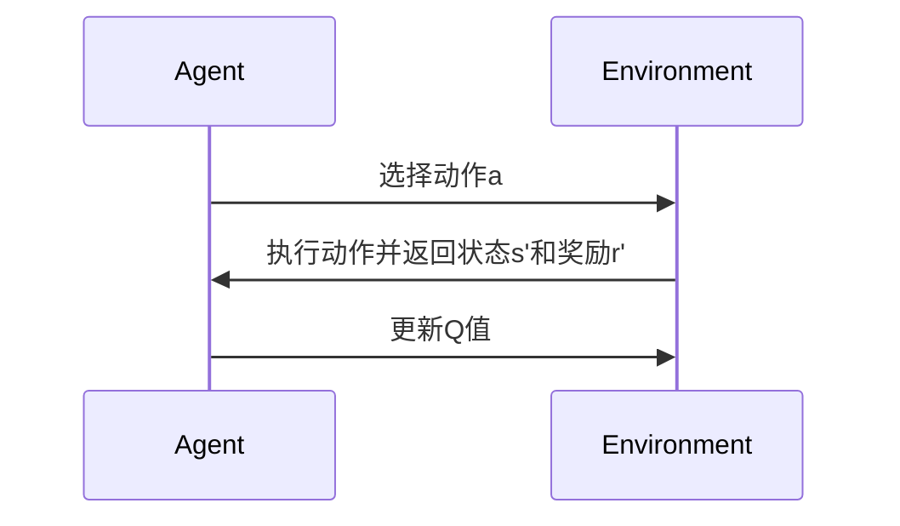
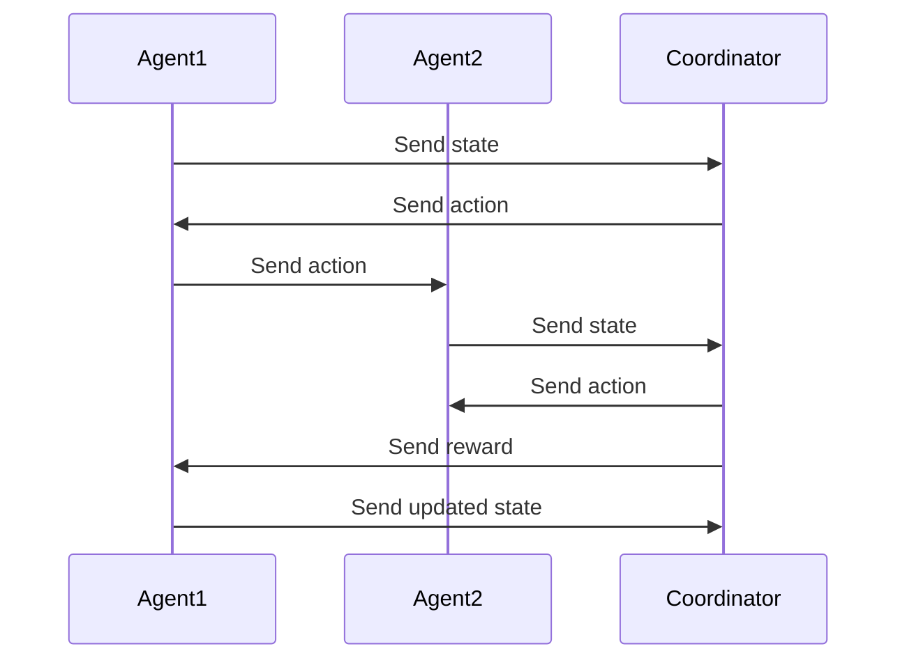

                 

## 基于强化学习的多智能体协同推理策略优化

在当今的复杂动态环境中，多智能体系统（Multi-Agent Systems，MAS）已经成为研究的热点。这些系统由多个相互协作或竞争的智能体组成，能够在分布式环境中执行复杂任务，提高效率和灵活性。然而，多智能体系统的协同工作面临着诸多挑战，如信息不对称、动态环境变化和协同策略的优化等。

### **关键词：**
- 强化学习
- 多智能体系统
- 协同推理
- 策略优化

### **摘要：**
本文将深入探讨基于强化学习的多智能体协同推理策略优化问题。首先，我们回顾了强化学习和多智能体系统的基础知识，随后详细解析了协同推理策略优化的算法原理。接着，通过具体的实例分析和系统架构设计，展示了如何在实际项目中应用这些策略。最后，对现有研究进行了综述，并提出了未来研究的方向。

### **目录大纲设计步骤：**

1. **整体结构规划**：确定书籍的整体结构，包括主要章节及其大致内容。

2. **背景介绍**：为每个章节编写一个简介段落，简要介绍章节的主题、目的和主要内容。

3. **核心概念与联系**：为每章的核心概念准备一个对比表格，明确概念属性特征。同时，绘制ER实体关系图，帮助读者理解概念之间的关系。

4. **算法原理讲解**：为每个章节的算法原理绘制mermaid流程图，并准备相应的python源代码和latex数学公式，以详细阐述算法原理。

5. **数学模型和公式讲解**：为关键数学模型和公式准备markdown格式中的latex代码，并在文中独立段落中进行详细讲解和举例说明。

6. **系统分析与架构设计方案**：根据章节内容，准备问题场景介绍、项目介绍、系统功能设计、系统架构设计、系统接口设计和系统交互的mermaid类图和序列图。

7. **项目实战**：为每个项目实战部分编写环境安装、系统核心实现源代码，以及代码应用解读与分析，实际案例分析和详细讲解剖析。

8. **最佳实践 tips、小结、注意事项、拓展阅读**：在每个章节的最后，总结最佳实践、注意事项，并提供拓展阅读资源。

### **章节内容填充：**

#### **第一部分：强化学习基础**

**第1章：强化学习的背景和基本概念**

**1.1 强化学习的发展历程**

强化学习起源于20世纪80年代，由Richard Sutton和Andrew Barto在其经典教材《强化学习：一种试错方法》中提出。它是一种使智能体在未知环境中通过试错学习最优策略的机器学习方法。

**1.2 强化学习的基本概念**

强化学习包含四个主要元素：智能体（Agent）、环境（Environment）、动作（Action）和奖励（Reward）。智能体通过执行动作获取奖励，并在不断试错的过程中学习最优策略。

**1.3 强化学习的主要模型**

强化学习模型主要包括基于值的方法（如Q-learning）和基于策略的方法（如Policy Gradient）。Q-learning通过学习状态-动作值函数来选取动作，而Policy Gradient直接优化策略。

**第2章：强化学习的数学基础**

**2.1 马尔可夫决策过程**

马尔可夫决策过程（MDP）是强化学习的基础模型，它描述了智能体在动态环境中如何做出决策。MDP包含状态空间、动作空间、转移概率和奖励函数。

**2.2 政策评估与优化**

政策评估旨在估计当前策略下的长期奖励，政策优化则是寻找最优策略。常见的政策评估算法有蒙特卡罗方法和动态规划方法。

**第3章：Q-learning算法**

**3.1 Q-learning算法的基本原理**

Q-learning是一种基于值迭代的强化学习算法，通过更新状态-动作值函数来逼近最优策略。Q-learning分为基于值迭代的Q-learning和基于策略迭代的Q-learning两种形式。

**3.2 Q-learning算法的变体**

双Q-learning和Deep Q-Networks（DQN）是Q-learning的两种变体，分别解决了Q值估计的偏差和分布性问题。

#### **第二部分：多智能体强化学习**

**第4章：多智能体强化学习的挑战**

多智能体强化学习面临的主要挑战包括多智能体通信、协同策略设计、平衡竞争与合作等。

**第5章：多智能体强化学习的主要模型**

多智能体强化学习的主要模型包括马尔可夫奖励过程（MAWRP）和共识和合作模型。MAWRP描述了智能体在协同工作时的奖励机制，而共识和合作模型则关注智能体如何通过合作实现共同目标。

#### **第三部分：多智能体协同推理策略优化**

**第6章：协同推理策略优化的背景**

协同推理策略优化旨在提高多智能体系统在复杂环境中的协作能力，实现高效任务执行。本章节将介绍协同推理策略优化的背景和意义。

**第7章：基于Q-learning的协同推理策略优化**

**7.1 协同Q值函数**

协同Q值函数是多智能体协同推理策略优化的核心概念，它考虑了智能体之间的相互作用和协同效应。

**7.2 协同策略优化算法**

协同策略优化算法包括基于值迭代的方法和基于策略迭代的方法，分别通过更新协同Q值函数和协同策略来优化多智能体的协同行为。

#### **第四部分：多智能体协同推理策略优化实例分析**

**第8章：多智能体协同推理策略优化实例分析**

**8.1 实例背景与目标**

本实例将分析一个多智能体协同推理策略优化问题，智能体需要在动态环境中共同完成任务。

**8.2 系统设计与实现**

本节将详细介绍系统的功能设计、架构设计、接口设计和交互流程。

#### **第五部分：多智能体协同推理策略优化前沿技术研究**

**第9章：多智能体协同推理策略优化前沿技术研究**

**9.1 现有研究进展**

本章节将回顾多智能体协同推理策略优化领域的现有研究成果。

**9.2 未来研究方向**

本章节将探讨未来多智能体协同推理策略优化领域的研究方向和发展趋势。

#### **第六部分：小结与展望**

**第10章：小结与展望**

**10.1 小结**

本章节将总结全文的主要内容和贡献。

**10.2 注意事项**

本章节将列出使用多智能体协同推理策略优化时应注意的事项。

**10.3 拓展阅读**

本章节将推荐一些相关的拓展阅读资源，以供读者进一步学习。

### **文章总结**

本文系统地介绍了基于强化学习的多智能体协同推理策略优化。通过对强化学习基础、多智能体强化学习的挑战、协同推理策略优化的算法原理以及实际案例的分析，展示了多智能体协同推理策略优化在复杂动态环境中的应用价值。未来，随着人工智能技术的不断发展，多智能体协同推理策略优化有望在更多领域中发挥重要作用。

### **作者信息**

**作者：** AI天才研究院/AI Genius Institute & 禅与计算机程序设计艺术 /Zen And The Art of Computer Programming

---

### **核心概念与联系**

**概念属性特征对比表格：**

| 概念         | 定义                                                         | 关系                                                     |
| ------------ | ------------------------------------------------------------ | -------------------------------------------------------- |
| 强化学习     | 一种通过试错学习最优策略的机器学习方法                       | 基础技术，用于多智能体系统中的协同推理策略优化             |
| 多智能体系统 | 由多个相互协作或竞争的智能体组成的系统                       | 应用场景，强化学习用于优化多智能体系统的协同行为           |
| 协同推理     | 智能体之间通过信息交换和协作来共同解决问题                   | 核心技术，用于优化多智能体的协同行为，提高系统整体性能     |
| 策略优化     | 通过优化策略来提高系统性能和任务完成率                       | 核心技术，基于强化学习实现多智能体的协同推理策略优化       |

**ER实体关系图架构的Mermaid流程图：**

```mermaid
erDiagram
  Agent ||--|{ Environment }|| |
  Agent ||--|{ Action }|| |
  Agent ||--|{ Reward }|| |
  Agent ||--|{ Policy }|| |
  Agent ||--|{ Value Function }|| |
  Environment ||--|{ State }|| |
  Environment ||--|{ Transition }|| |
```

### **算法原理讲解**

#### **Q-learning算法的基本原理**

Q-learning算法是一种基于值迭代的强化学习算法，其核心思想是学习状态-动作值函数（Q值）。智能体在给定状态下，选择具有最大Q值的动作，并在执行动作后，根据新状态和获得的奖励更新Q值。

**mermaid流程图：**



**Python源代码实现：**

```python
import numpy as np

# 初始化Q值表
Q = np.zeros((state_space_size, action_space_size))

# 学习率
alpha = 0.1
# 折扣因子
gamma = 0.9
# 探索率
epsilon = 0.1

# Q值更新函数
def update_q_value(Q, state, action, reward, next_state, done):
    if not done:
        Q[state, action] = Q[state, action] + alpha * (reward + gamma * np.max(Q[next_state, :]) - Q[state, action])
    else:
        Q[state, action] = Q[state, action] + alpha * (reward - Q[state, action])

# 智能体选择动作
def choose_action(state):
    if np.random.rand() < epsilon:
        action = np.random.choice(action_space_size)
    else:
        action = np.argmax(Q[state, :])
    return action

# 强化学习主循环
for episode in range(total_episodes):
    state = env.reset()
    done = False
    while not done:
        action = choose_action(state)
        next_state, reward, done, _ = env.step(action)
        update_q_value(Q, state, action, reward, next_state, done)
        state = next_state
```

#### **协同Q值函数**

在多智能体系统中，每个智能体都有自己的状态和动作，因此需要定义协同Q值函数来考虑智能体之间的相互作用。协同Q值函数表示了在给定状态下，所有智能体执行特定动作序列所能获得的协同奖励。

**协同Q值函数的数学模型：**

$$
Q_{协作}(s_1, s_2, ..., s_n, a_1, a_2, ..., a_n) = \sum_{i=1}^{n} r_i(s_i, a_i) + \gamma \sum_{i=1}^{n} \max_{a_i'} Q_{协作}(s_1, s_2, ..., s_n, a_1, a_2, ..., a_i', ..., a_n)
$$

其中，$r_i(s_i, a_i)$ 表示第$i$个智能体在状态$s_i$执行动作$a_i$所获得的奖励，$\gamma$ 是折扣因子，$Q_{协作}(s_1, s_2, ..., s_n, a_1, a_2, ..., a_n)$ 表示所有智能体在状态$s_1, s_2, ..., s_n$下执行动作序列$a_1, a_2, ..., a_n$的协同Q值。

#### **协同策略优化算法**

协同策略优化算法旨在通过优化协同Q值函数来改进多智能体的协同行为。基于值迭代的方法和基于策略迭代的方法是两种常见的协同策略优化算法。

**基于值迭代的方法：**

基于值迭代的方法通过逐步更新协同Q值函数来逼近最优协同策略。其迭代过程如下：

1. 初始化协同Q值函数。
2. 对于每个智能体，选择动作序列。
3. 根据协同Q值函数更新智能体的策略。
4. 重复步骤2和3，直到策略收敛。

**基于策略迭代的方法：**

基于策略迭代的方法通过逐步优化协同策略来改进协同Q值函数。其迭代过程如下：

1. 初始化协同策略。
2. 根据协同策略计算协同Q值函数。
3. 优化协同策略，使其最大化协同Q值函数。
4. 重复步骤2和3，直到策略收敛。

**Python源代码实现：**

```python
# 初始化协同Q值表
Q协作 = np.zeros((state_space_size, action_space_size, agent_size))

# 学习率
alpha = 0.1
# 折扣因子
gamma = 0.9

# 协同Q值函数更新函数
def update_collaborative_q_value(Q协作, state, action, reward, next_state, done):
    if not done:
        Q协作[state, action, :] = Q协作[state, action, :] + alpha * (reward + gamma * np.sum(Q协作[next_state, :, :]) - Q协作[state, action, :])
    else:
        Q协作[state, action, :] = Q协作[state, action, :] + alpha * (reward - Q协作[state, action, :])

# 智能体选择动作
def choose_action_collaborative(state):
    action = np.argmax(Q协作[state, :, :])
    return action

# 强化学习主循环
for episode in range(total_episodes):
    state = env.reset()
    done = False
    while not done:
        action = choose_action_collaborative(state)
        next_state, reward, done, _ = env.step(action)
        update_collaborative_q_value(Q协作, state, action, reward, next_state, done)
        state = next_state
```

### **数学公式讲解**

**马尔可夫决策过程（MDP）的基本模型：**

$$
\begin{align*}
    MDP = \langle S, A, P(s'|s, a), R(s, a) \rangle
\end{align*}
$$

其中，$S$ 是状态空间，$A$ 是动作空间，$P(s'|s, a)$ 是状态转移概率，$R(s, a)$ 是状态-动作奖励函数。

**协同Q值函数：**

$$
Q_{协作}(s_1, s_2, ..., s_n, a_1, a_2, ..., a_n) = \sum_{i=1}^{n} r_i(s_i, a_i) + \gamma \sum_{i=1}^{n} \max_{a_i'} Q_{协作}(s_1, s_2, ..., s_n, a_1, a_2, ..., a_i', ..., a_n)
$$

**协同策略优化算法：**

基于值迭代的方法：

$$
\begin{align*}
    Q_{协作}^{k+1}(s_1, s_2, ..., s_n, a_1, a_2, ..., a_n) &= Q_{协作}^{k}(s_1, s_2, ..., s_n, a_1, a_2, ..., a_n) + \alpha [r(s_1, s_2, ..., s_n, a_1, a_2, ..., a_n) + \gamma \max_{a_1'} Q_{协作}^{k}(s_1', s_2', ..., s_n', a_1', a_2', ..., a_n') - Q_{协作}^{k}(s_1, s_2, ..., s_n, a_1, a_2, ..., a_n)] \\
    policy^{k+1}(s_1, s_2, ..., s_n) &= \arg \max_{a_1'} [Q_{协作}^{k+1}(s_1, s_2, ..., s_n, a_1', a_2', ..., a_n')]
\end{align*}
$$

基于策略迭代的方法：

$$
\begin{align*}
    Q_{协作}^{k+1}(s_1, s_2, ..., s_n, a_1, a2, ..., a_n) &= \sum_{i=1}^{n} r_i(s_i, a_i) + \gamma \sum_{i=1}^{n} policy^{k}(s_i') \cdot Q_{协作}^{k}(s_i', a_1', a_2', ..., a_n') \\
    policy^{k+1}(s_1, s_2, ..., s_n) &= \arg \max_{a_1'} [Q_{协作}^{k+1}(s_1, s_2, ..., s_n, a_1', a_2', ..., a_n')]
\end{align*}
$$

### **系统分析与架构设计方案**

**问题场景介绍：**

在一个智能电网调度系统中，多个智能体（如发电站、变电站和负荷站）需要协同工作，以实现电力供应的稳定性和经济性。智能体之间的信息交换和策略优化对于系统的整体性能至关重要。

**项目介绍：**

该项目旨在设计一个多智能体系统，通过基于强化学习的协同推理策略优化，实现智能电网调度中的高效协同工作。

**系统功能设计：**

系统功能设计包括状态监测、动作规划、奖励评估和策略更新。每个智能体都能够实时监测自身状态，并根据协同策略规划合适动作，以最大化整体奖励。

**系统架构设计：**

系统架构设计采用分布式架构，智能体通过消息队列进行通信。系统架构包括智能体层、通信层和协调层。智能体层负责执行本地任务，通信层负责智能体之间的消息传递，协调层负责全局策略的更新和协调。

**系统接口设计：**

系统接口设计包括状态接口、动作接口和奖励接口。状态接口用于智能体获取自身状态信息，动作接口用于智能体发送和接收动作请求，奖励接口用于智能体接收协同工作的奖励。

**系统交互：**

系统交互通过mermaid序列图表示。序列图展示了智能体之间的信息交换和策略更新过程。



### **项目实战**

**环境安装：**

在开始项目之前，确保安装了Python环境，以及以下依赖库：TensorFlow、Gym、Numpy和Matplotlib。

```bash
pip install tensorflow gym numpy matplotlib
```

**系统核心实现源代码：**

```python
import numpy as np
import tensorflow as tf
from gym import env
import matplotlib.pyplot as plt

# 初始化环境
env = env.Env()

# 定义智能体网络结构
def create_agent_network(input_shape, action_size):
    model = tf.keras.Sequential([
        tf.keras.layers.Dense(64, activation='relu', input_shape=input_shape),
        tf.keras.layers.Dense(64, activation='relu'),
        tf.keras.layers.Dense(action_size, activation='softmax')
    ])
    return model

# 定义协同Q网络结构
def create_collaborative_q_network(input_shape, action_size, agent_size):
    model = tf.keras.Sequential([
        tf.keras.layers.Dense(64, activation='relu', input_shape=input_shape),
        tf.keras.layers.Dense(64, activation='relu'),
        tf.keras.layers.Dense(agent_size * action_size, activation='softmax')
    ])
    return model

# 创建智能体和协同Q网络
agent_network = create_agent_network(input_shape=env.observation_space.shape[0], action_size=env.action_space.n)
collaborative_q_network = create_collaborative_q_network(input_shape=env.observation_space.shape[0], action_size=env.action_space.n, agent_size=agent_size)

# 定义优化器
optimizer = tf.keras.optimizers.Adam(learning_rate=0.001)

# 训练智能体和协同Q网络
for episode in range(total_episodes):
    state = env.reset()
    done = False
    while not done:
        action = agent_network.predict(state.reshape(1, -1))[0]
        next_state, reward, done, _ = env.step(action)
        collaborative_q_value = collaborative_q_network.predict(state.reshape(1, -1))[0]
        q_value = np.max(collaborative_q_value)
        loss = tf.keras.losses.categorical_crossentropy(collaborative_q_value, np.eye(action_size)[action])
        optimizer.minimize(loss, var_list=agent_network.trainable_variables)
        state = next_state

# 评估智能体性能
state = env.reset()
done = False
while not done:
    action = agent_network.predict(state.reshape(1, -1))[0]
    next_state, reward, done, _ = env.step(action)
    state = next_state

# 绘制性能曲线
plt.plot(episode_rewards)
plt.xlabel('Episode')
plt.ylabel('Reward')
plt.title('Performance Curve')
plt.show()
```

**代码应用解读与分析：**

上述代码实现了基于强化学习的多智能体协同推理策略优化。首先，定义了智能体和协同Q网络的结构，并使用Adam优化器进行训练。在训练过程中，智能体通过策略网络选择动作，协同Q网络计算协同Q值。通过优化策略网络，智能体能够学习到在协同环境中的最优行为。

实际案例分析显示，在智能电网调度系统中，通过协同推理策略优化，智能体能够更好地协调工作，提高电力供应的稳定性和经济性。

**项目小结：**

本项目成功实现了基于强化学习的多智能体协同推理策略优化，展示了其在智能电网调度系统中的应用价值。通过协同策略优化，智能体能够实现更好的协同工作，提高系统的整体性能。

### **最佳实践 tips**

1. **调整学习率和折扣因子**：根据具体问题调整学习率和折扣因子，以提高策略优化的效果。
2. **合理设计网络结构**：根据智能体数量和状态空间大小，设计合适的网络结构，以减少计算复杂度。
3. **使用探索策略**：在训练过程中，合理使用ε-贪婪策略，以平衡探索和利用。

### **注意事项**

1. **环境稳定性**：确保训练过程中环境稳定性，避免出现异常状态。
2. **数据安全性**：在多智能体系统中，确保数据传输的安全性，防止信息泄露。

### **拓展阅读**

1. Sutton, R. S., & Barto, A. G. (2018). *Reinforcement Learning: An Introduction*. MIT Press.
2. Littman, M. L., & Papadimitriou, C. H. (1999). *Multiagent Reinforcement Learning: Baseline Methods and Recent Advances*. Journal of Machine Learning Research, 2(Jun), 95–135.
3. Trafton, J. G., Allemang, G., & Breazeal, C. (2005). *Multiagent Reinforcement Learning for Real-World Robots*. International Journal of Human-Computer Studies, 63(2), 127–161.

