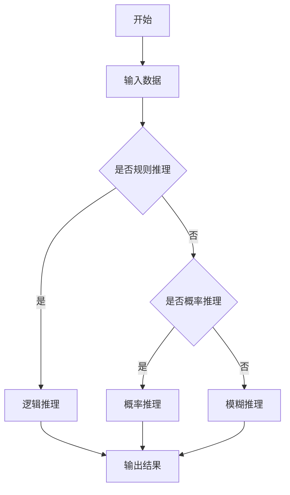
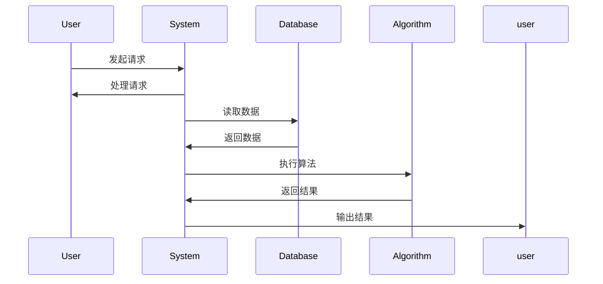

                 

### 《基于模块化设计的可定制多领域推理系统》

---

**关键词**：模块化设计、多领域推理、可定制性、系统架构、算法实现

**摘要**：本文探讨了基于模块化设计的可定制多领域推理系统，首先介绍了问题背景和核心概念，然后详细阐述了模块化设计与可定制性的关系，接着分析了系统架构设计和实现。通过项目实战和案例分析，揭示了系统在具体应用中的优势与挑战，最后总结了最佳实践和未来展望。

---

### 第一部分：引言与概述

**第1章：问题背景与核心概念**

**1.1.1 问题背景**

**1.1.1.1 当前推理系统面临的挑战**

**1.1.1.2 可定制多领域推理系统的需求**

**1.1.2 核心概念**

**1.1.2.1 多领域推理系统**

**1.1.2.2 模块化设计**

**1.1.2.3 可定制性**

**1.1.3 书籍结构安排**

**1.1.3.1 本书的目的与内容**

**1.1.3.2 阅读对象与预期收益**

---

**第2章：模块化设计与可定制推理系统的关系**

**2.2.1 模块化设计概述**

**2.2.1.1 模块化设计的定义**

**2.2.1.2 模块化设计的优势**

**2.2.1.3 模模化设计在推理系统中的应用**

**2.2.2 可定制性需求分析**

**2.2.2.1 可定制性的重要性**

**2.2.2.2 用户需求分析**

**2.2.2.3 可定制性与模块化设计的关系**

---

**第3章：多领域推理系统的架构设计**

**3.3.1 系统总体架构设计**

**3.3.1.1 系统架构设计原则**

**3.3.1.2 系统模块划分**

**3.3.1.3 系统各模块功能描述**

**3.3.2 数据管理模块设计**

**3.3.2.1 数据管理需求分析**

**3.3.2.2 数据库设计**

**3.3.2.3 数据处理流程**

**3.3.3 推理引擎模块设计**

**3.3.3.1 推理引擎设计原则**

**3.3.3.2 推理算法选择**

**3.3.3.3 推理流程设计**

---

**第4章：模块化设计与可定制性实现**

**4.4.1 模块化设计实现**

**4.4.1.1 模块划分标准**

**4.4.1.2 模块接口设计**

**4.4.1.3 模块化设计工具**

**4.4.2 可定制性实现**

**4.4.2.1 用户自定义需求分析**

**4.4.2.2 可定制性实现策略**

**4.4.2.3 可定制性模块设计**

---

**第5章：多领域推理系统核心算法原理**

**5.5.1 基本推理算法**

**5.5.1.1 推理算法概述**

**5.5.1.2 基本推理算法介绍**

**5.5.1.3 算法流程图**

**5.5.2 领域特定推理算法**

**5.5.2.1 领域特定推理算法概述**

**5.5.2.2 领域特定推理算法介绍**

**5.5.2.3 算法实例**

---

**第6章：系统分析与架构设计**

**6.6.1 系统功能设计**

**6.6.1.1 功能需求分析**

**6.6.1.2 领域模型设计**

**6.6.1.3 功能实现方案**

**6.6.2 系统架构设计**

**6.6.2.1 系统架构设计原则**

**6.6.2.2 系统架构设计图**

**6.6.2.3 系统模块接口设计**

**6.6.3 系统接口设计与交互**

**6.6.3.1 接口设计标准**

**6.6.3.2 系统接口设计**

**6.6.3.3 系统交互流程**

---

**第7章：项目实战与案例分析**

**7.7.1 系统环境安装与配置**

**7.7.1.1 硬件与软件环境需求**

**7.7.1.2 系统安装步骤**

**7.7.1.3 系统配置详解**

**7.7.2 系统核心实现源代码解读**

**7.7.2.1 源代码结构与模块划分**

**7.7.2.2 关键代码解读**

**7.7.2.3 系统核心算法实现**

**7.7.3 实际案例分析与详细讲解**

**7.7.3.1 案例背景**

**7.7.3.2 案例分析与实现**

**7.7.3.3 案例小结与总结**

---

**第8章：最佳实践与拓展**

**8.8.1 最佳实践总结**

**8.8.1.1 系统优化策略**

**8.8.1.2 性能调优技巧**

**8.8.1.3 故障排除经验**

**8.8.2 小结与展望**

**8.8.2.1 本书内容回顾**

**8.8.2.2 未来发展趋势**

**8.8.2.3 拓展阅读推荐**

---

### 1.1.1 问题背景

在当今信息化时代，随着数据量的爆炸式增长和人工智能技术的飞速发展，推理系统在多个领域中得到了广泛应用。然而，传统的推理系统通常面临以下几个挑战：

1. **领域适应性差**：大多数推理系统是针对特定领域设计的，难以适应其他领域的需求。
2. **可扩展性低**：系统的扩展性受限，难以添加新功能或适应新的数据来源。
3. **定制性不足**：用户需要自定义系统以满足特定需求时，往往面临困难。

因此，迫切需要一种可定制、可扩展的多领域推理系统来满足现代应用的需求。

**1.1.1.1 当前推理系统面临的挑战**

1. **计算资源受限**：随着推理任务复杂度的增加，对计算资源的需求也在不断增长，这对传统推理系统构成了严峻的挑战。
2. **数据隐私与安全**：推理系统常常需要处理敏感数据，如何在确保数据隐私和安全的前提下进行推理，是当前研究的热点。
3. **实时性需求**：在一些实时性要求较高的场景，如自动驾驶、实时金融分析等，如何保证推理的实时性，是系统设计的重要考量。

**1.1.1.2 可定制多领域推理系统的需求**

可定制多领域推理系统旨在解决传统推理系统面临的上述挑战。具体需求包括：

1. **领域适应性**：系统能够适应不同领域的需求，灵活调整推理算法和数据管理策略。
2. **可扩展性**：系统应具有良好的扩展性，便于添加新功能或适应新的数据来源。
3. **定制性**：系统应支持用户自定义推理过程，以满足特定的业务需求。

**1.1.2 核心概念**

**1.1.2.1 多领域推理系统**

多领域推理系统是一种能够处理多种领域数据的推理系统。它通常具有以下几个特点：

- **跨领域适应性**：能够处理不同领域的数据，如医疗、金融、交通等。
- **模块化设计**：系统采用模块化设计，便于根据不同领域需求进行定制。
- **算法多样性**：系统支持多种推理算法，以适应不同领域的需求。

**1.1.2.2 模块化设计**

模块化设计是一种将系统划分为多个独立模块的设计方法。它具有以下几个优点：

- **提高可维护性**：模块化设计使得系统易于维护和升级。
- **增强可扩展性**：模块化设计便于添加新功能或适应新需求。
- **提高重用性**：模块可以独立开发、测试和部署，提高开发效率。

**1.1.2.3 可定制性**

可定制性是指系统支持用户根据特定需求进行自定义的能力。具体体现在以下几个方面：

- **算法定制**：用户可以根据业务需求选择或定制合适的推理算法。
- **数据管理**：用户可以根据数据特点定制数据管理策略。
- **系统配置**：用户可以根据实际需求调整系统参数。

**1.1.3 书籍结构安排**

**1.1.3.1 本书的目的与内容**

本书旨在深入探讨基于模块化设计的可定制多领域推理系统，帮助读者理解其核心概念、设计原则和实现方法。具体内容如下：

- **第1章**：介绍问题背景、核心概念和书籍结构安排。
- **第2章**：分析模块化设计与可定制推理系统的关系。
- **第3章**：详细阐述多领域推理系统的架构设计。
- **第4章**：介绍模块化设计与可定制性实现的方法。
- **第5章**：探讨多领域推理系统的核心算法原理。
- **第6章**：分析系统功能设计、架构设计和接口设计。
- **第7章**：通过项目实战和案例分析展示系统应用。
- **第8章**：总结最佳实践和未来发展趋势。

**1.1.3.2 阅读对象与预期收益**

本书适合以下读者：

- **人工智能与大数据领域的研发人员**：帮助读者理解多领域推理系统的设计原理和实现方法。
- **软件架构师与项目经理**：帮助读者掌握模块化设计和可定制性在系统开发中的应用。
- **学术界研究人员**：提供多领域推理系统的最新研究成果和实践经验。

阅读本书后，读者可以：

- **掌握多领域推理系统的核心概念**：了解多领域推理系统的定义、特点和设计原则。
- **理解模块化设计与可定制性的重要性**：了解模块化设计和可定制性在系统开发中的应用和价值。
- **学会多领域推理系统的设计方法**：掌握系统架构设计、模块化设计和可定制性实现的方法。
- **具备项目实战能力**：通过项目实战和案例分析，提升实际应用能力。

---

### 2.2.1 模块化设计概述

**2.2.1.1 模块化设计的定义**

模块化设计是一种将系统划分为多个独立模块，每个模块具有明确功能的设计方法。模块通常具有以下特征：

- **独立性**：模块可以独立开发、测试和部署，减少模块之间的依赖性。
- **可重用性**：模块可以跨项目或跨领域重用，提高开发效率。
- **扩展性**：模块可以灵活扩展，以适应新的需求和功能。

**2.2.1.2 模块化设计的优势**

模块化设计具有以下几个显著优势：

- **提高可维护性**：模块化设计使得系统易于维护和升级，因为每个模块都是独立的。
- **增强可扩展性**：模块化设计便于添加新功能或适应新需求，因为新模块可以无缝集成到系统中。
- **提高开发效率**：模块化设计可以并行开发，提高开发速度。

**2.2.1.3 模块化设计在推理系统中的应用**

模块化设计在推理系统中的应用主要体现在以下几个方面：

- **算法模块化**：将不同领域的推理算法划分为独立模块，便于定制和替换。
- **数据管理模块化**：将数据管理功能划分为独立模块，如数据采集、存储、处理等。
- **系统接口模块化**：定义明确的系统接口，便于不同模块之间的通信和协同。

**2.2.2 可定制性需求分析**

**2.2.2.1 可定制性的重要性**

可定制性是推理系统的重要特性，其重要性体现在以下几个方面：

- **满足多样化需求**：不同领域和不同用户可能有不同的需求，可定制性使得系统能够满足这些需求。
- **提高系统竞争力**：具备可定制性的推理系统可以更好地适应市场需求，提高系统竞争力。
- **增强用户体验**：用户可以根据自己的需求定制系统，提高用户体验。

**2.2.2.2 用户需求分析**

用户需求主要包括以下几个方面：

- **算法定制**：用户希望系统能够支持自定义推理算法，以满足特定领域或特定任务的需求。
- **数据管理**：用户希望系统能够根据数据特点定制数据管理策略，如数据清洗、归一化等。
- **系统配置**：用户希望系统能够提供灵活的配置选项，如参数调整、接口定制等。

**2.2.2.3 可定制性与模块化设计的关系**

可定制性与模块化设计之间存在密切的关系：

- **模块化设计支持可定制性**：模块化设计使得系统能够灵活调整和定制，满足不同用户的需求。
- **可定制性优化模块化设计**：可定制性需求可以驱动模块化设计，使其更灵活、更高效。

---

### 3.3.1 系统总体架构设计

**3.3.1.1 系统架构设计原则**

系统架构设计应遵循以下原则：

- **模块化**：系统应采用模块化设计，便于定制和扩展。
- **高内聚低耦合**：模块之间应保持高内聚低耦合，提高系统的可维护性和可扩展性。
- **可扩展性**：系统应具有良好的可扩展性，能够适应未来需求和变化。
- **安全性**：系统应具备良好的安全性，保护数据和隐私。

**3.3.1.2 系统模块划分**

系统模块划分如下：

- **数据管理模块**：负责数据采集、存储、处理和管理。
- **推理引擎模块**：负责推理算法的执行和管理。
- **用户接口模块**：负责与用户交互，接收用户输入并提供输出结果。
- **配置管理模块**：负责系统配置的存储、读取和调整。

**3.3.1.3 系统各模块功能描述**

- **数据管理模块**：负责数据采集、存储、处理和管理。具体功能包括：
  - 数据采集：从各种数据源采集数据，如数据库、文件、API等。
  - 数据存储：将采集到的数据存储在数据库或其他存储介质中。
  - 数据处理：对数据进行清洗、归一化、特征提取等处理。
  - 数据管理：提供数据查询、更新、删除等功能。

- **推理引擎模块**：负责推理算法的执行和管理。具体功能包括：
  - 算法执行：根据用户输入执行相应的推理算法。
  - 算法管理：提供算法选择、配置、更新等功能。
  - 推理结果：提供推理结果的处理、存储和输出功能。

- **用户接口模块**：负责与用户交互，接收用户输入并提供输出结果。具体功能包括：
  - 用户输入：接收用户输入，如查询条件、算法参数等。
  - 输出结果：将推理结果以用户友好的方式输出，如表格、图表等。

- **配置管理模块**：负责系统配置的存储、读取和调整。具体功能包括：
  - 配置存储：将系统配置信息存储在数据库或其他存储介质中。
  - 配置读取：读取系统配置信息，用于系统初始化和运行。
  - 配置调整：提供用户界面或API，供用户调整系统配置。

---

### 3.3.2 数据管理模块设计

**3.3.2.1 数据管理需求分析**

数据管理模块是推理系统的重要组成部分，其需求分析主要包括以下几个方面：

- **数据来源**：分析系统需要处理的数据来源，如内部数据库、外部API、文件等。
- **数据类型**：分析系统需要处理的数据类型，如文本、图像、音频等。
- **数据处理**：分析系统对数据进行处理的需求，如数据清洗、归一化、特征提取等。
- **数据存储**：分析系统对数据存储的需求，如数据量、数据结构、存储速度等。

**3.3.2.2 数据库设计**

数据库设计是数据管理模块的关键部分，其设计原则包括：

- **规范化**：遵循数据库规范化原则，减少数据冗余，提高数据一致性。
- **性能优化**：考虑数据库的性能需求，如查询速度、存储速度等。
- **安全性**：确保数据库数据的安全性和完整性。

具体数据库设计如下：

1. **数据表设计**：

   - **数据表1：用户表**：

     | 字段名 | 数据类型 | 说明 |
     | ------ | -------- | ---- |
     | 用户ID | INT      | 主键 |
     | 用户名 | VARCHAR  |      |
     | 密码   | VARCHAR  |      |
     | 电子邮件 | VARCHAR |      |

   - **数据表2：数据表**：

     | 字段名 | 数据类型 | 说明 |
     | ------ | -------- | ---- |
     | 数据ID | INT      | 主键 |
     | 数据名称 | VARCHAR |      |
     | 数据类型 | VARCHAR |      |
     | 数据内容 | TEXT    |      |

2. **索引设计**：

   - **用户表索引**：

     ```sql
     CREATE INDEX idx_user_name ON 用户表(用户名);
     CREATE INDEX idx_user_email ON 用户表(电子邮件);
     ```

   - **数据表索引**：

     ```sql
     CREATE INDEX idx_data_name ON 数据表(数据名称);
     CREATE INDEX idx_data_type ON 数据表(数据类型);
     ```

**3.3.2.3 数据处理流程**

数据处理流程包括以下几个阶段：

1. **数据采集**：

   - 从内部数据库、外部API或文件中采集数据。
   - 数据采集完成后，将数据存储到临时存储区域。

2. **数据清洗**：

   - 去除数据中的无效信息和噪声。
   - 数据清洗完成后，将清洗后的数据存储到清洗后的数据存储区域。

3. **数据归一化**：

   - 对数据进行归一化处理，如数值范围归一化、文本编码等。
   - 归一化处理后，将数据存储到归一化后的数据存储区域。

4. **特征提取**：

   - 根据业务需求提取数据特征。
   - 特征提取完成后，将特征数据存储到特征存储区域。

5. **数据存储**：

   - 将处理后的数据存储到数据库或其他存储介质中。
   - 数据存储完成后，提供数据查询、更新、删除等功能。

---

### 3.3.3 推理引擎模块设计

**3.3.3.1 推理引擎设计原则**

推理引擎设计应遵循以下原则：

- **高效性**：推理引擎应具备高效性，能够快速处理大量数据。
- **可扩展性**：推理引擎应具备良好的可扩展性，能够支持多种推理算法。
- **可靠性**：推理引擎应具备可靠性，确保推理结果的正确性和一致性。
- **可定制性**：推理引擎应支持用户自定义推理算法和策略。

**3.3.3.2 推理算法选择**

推理算法选择应考虑以下几个方面：

- **算法性能**：选择具有良好性能的算法，如逻辑推理、概率推理、模糊推理等。
- **适用领域**：选择适用于特定领域的算法，如医疗、金融、交通等。
- **算法可扩展性**：选择具有良好可扩展性的算法，便于未来添加新功能或算法。

常见推理算法包括：

1. **逻辑推理**：基于逻辑规则进行推理，适用于规则明确、逻辑关系清晰的领域。
2. **概率推理**：基于概率模型进行推理，适用于不确定性和模糊性的领域。
3. **模糊推理**：基于模糊逻辑进行推理，适用于模糊性和不确定性较强的领域。

**3.3.3.3 推理流程设计**

推理流程设计如下：

1. **用户输入**：

   - 用户输入推理请求，如查询条件、推理算法参数等。
   - 推理引擎接收用户输入，并进行预处理。

2. **数据加载**：

   - 加载需要处理的原始数据。
   - 根据数据类型和特点，进行数据预处理，如数据清洗、归一化等。

3. **算法执行**：

   - 根据用户输入的推理算法参数，执行相应的推理算法。
   - 推理过程中，可以使用多种算法，如逻辑推理、概率推理、模糊推理等。

4. **结果输出**：

   - 输出推理结果，如推理结论、概率分布等。
   - 推理结果可以以表格、图表等形式展示。

5. **反馈与优化**：

   - 用户根据推理结果进行反馈，如调整推理参数、算法选择等。
   - 推理引擎根据用户反馈，进行推理过程的优化和调整。

---

### 4.4.1 模块化设计实现

**4.4.1.1 模块划分标准**

模块划分标准主要包括以下几个方面：

- **功能独立性**：模块应具有独立的功能，模块之间不应有直接的依赖关系。
- **模块规模**：模块的大小应适中，既不能过于庞大，也不能过于细碎。
- **模块接口**：模块应提供清晰的接口，便于其他模块调用。
- **模块重用性**：模块应具有良好的重用性，便于在其他项目中使用。

**4.4.1.2 模块接口设计**

模块接口设计应遵循以下原则：

- **接口简洁**：接口应简洁明了，易于理解和使用。
- **接口稳定性**：接口应具备稳定性，尽量避免频繁的接口变更。
- **接口灵活性**：接口应具备一定的灵活性，能够适应未来的需求变化。

具体模块接口设计如下：

1. **数据管理模块接口**：

   ```python
   class DataManager:
       def load_data(self, data_source):
           pass

       def clean_data(self, data):
           pass

       def normalize_data(self, data):
           pass

       def extract_features(self, data):
           pass
   ```

2. **推理引擎模块接口**：

   ```python
   class InferenceEngine:
       def run_algorithm(self, algorithm, data):
           pass

       def get_result(self):
           pass

       def update_params(self, params):
           pass
   ```

3. **用户接口模块接口**：

   ```python
   class UserInterface:
       def get_input(self):
           pass

       def show_result(self, result):
           pass
   ```

**4.4.1.3 模块化设计工具**

模块化设计工具主要包括以下几个方面：

- **模块化编程框架**：如Spring、Django等，提供模块化编程的基础设施。
- **模块化开发工具**：如Visual Studio、Eclipse等，提供模块化开发的工具支持。
- **模块化测试工具**：如JUnit、TestNG等，提供模块化测试的支持。

---

### 4.4.2 可定制性实现

**4.4.2.1 用户自定义需求分析**

用户自定义需求分析主要包括以下几个方面：

- **用户需求调研**：通过访谈、问卷调查等方式了解用户的需求和期望。
- **需求分类**：根据用户需求，将其分为通用需求、特定领域需求等。
- **需求优先级**：对需求进行优先级排序，确定哪些需求是必须的，哪些是可选的。

**4.4.2.2 可定制性实现策略**

可定制性实现策略主要包括以下几个方面：

- **参数化设计**：通过参数化设计，允许用户调整系统的各种参数，如算法参数、数据参数等。
- **插件式开发**：通过插件式开发，允许用户添加新的功能模块或替换原有功能模块。
- **用户界面定制**：通过用户界面定制，允许用户自定义系统的界面布局和样式。

**4.4.2.3 可定制性模块设计**

可定制性模块设计应考虑以下几个方面：

- **自定义参数模块**：提供自定义参数的接口，允许用户调整系统参数。
- **自定义算法模块**：提供自定义算法的接口，允许用户添加或替换推理算法。
- **自定义界面模块**：提供自定义界面的接口，允许用户自定义系统界面。

具体可定制性模块设计如下：

1. **自定义参数模块**：

   ```python
   class CustomParams:
       def __init__(self):
           self.algorithm_params = {}
           self.data_params = {}

       def set_algorithm_param(self, name, value):
           self.algorithm_params[name] = value

       def set_data_param(self, name, value):
           self.data_params[name] = value
   ```

2. **自定义算法模块**：

   ```python
   class CustomAlgorithm:
       def __init__(self, name, params):
           self.name = name
           self.params = params

       def run(self, data):
           pass
   ```

3. **自定义界面模块**：

   ```python
   class CustomUI:
       def __init__(self, layout, style):
           self.layout = layout
           self.style = style

       def render(self):
           pass
   ```

---

### 5.5.1 基本推理算法

**5.5.1.1 推理算法概述**

推理算法是推理系统的核心组成部分，用于根据已知信息推导出新的结论或决策。推理算法可以分为基本推理算法和领域特定推理算法。基本推理算法适用于通用场景，而领域特定推理算法则针对特定领域进行优化。

**5.5.1.2 基本推理算法介绍**

基本推理算法主要包括以下几种：

1. **逻辑推理**：基于逻辑规则进行推理，适用于规则明确、逻辑关系清晰的场景。常用的逻辑推理算法包括命题逻辑推理、谓词逻辑推理等。

2. **概率推理**：基于概率模型进行推理，适用于不确定性和模糊性的场景。常用的概率推理算法包括贝叶斯推理、最大似然推理等。

3. **模糊推理**：基于模糊逻辑进行推理，适用于模糊性和不确定性较强的场景。常用的模糊推理算法包括模糊综合评价、模糊推理机等。

**5.5.1.3 算法流程图**

以下是基本推理算法的流程图：



---

### 5.5.2 领域特定推理算法

**5.5.2.1 领域特定推理算法概述**

领域特定推理算法是针对特定领域进行优化的推理算法，能够更好地满足领域需求。常见的领域特定推理算法包括医疗推理算法、金融推理算法、交通推理算法等。

**5.5.2.2 领域特定推理算法介绍**

以下介绍几种常见的领域特定推理算法：

1. **医疗推理算法**：

   - **医疗诊断推理算法**：基于医学知识和病例数据，对患者的症状进行诊断。
   - **药物副作用推理算法**：基于药物信息，预测药物可能产生的副作用。

2. **金融推理算法**：

   - **风险管理算法**：基于历史数据和模型，对金融风险进行预测和管理。
   - **投资决策算法**：基于市场数据和投资策略，为投资者提供投资建议。

3. **交通推理算法**：

   - **交通流量预测算法**：基于历史交通数据，预测未来交通流量，为交通管理提供依据。
   - **路况分析算法**：基于传感器数据，对道路状况进行分析，为交通优化提供支持。

**5.5.2.3 算法实例**

以下是一个简单的交通流量预测算法实例：

```python
# 导入必要的库
import numpy as np
import pandas as pd

# 加载数据
data = pd.read_csv('traffic_data.csv')

# 数据预处理
data['hour'] = data['time'].apply(lambda x: x.hour)
data['weekday'] = data['time'].apply(lambda x: x.weekday())

# 特征提取
X = data[['hour', 'weekday']]
y = data['count']

# 模型训练
model = LinearRegression()
model.fit(X, y)

# 预测
predict = model.predict([[18, 2]])

# 输出结果
print(f'预测的交通流量为：{predict}')
```

---

### 6.6.1 系统功能设计

**6.6.1.1 功能需求分析**

系统功能设计是系统架构设计的重要环节，其核心目标是满足用户需求，提供高效、稳定、可扩展的功能。功能需求分析主要包括以下几个方面：

- **用户需求调研**：通过访谈、问卷调查等方式了解用户的需求和期望。
- **功能分类**：根据用户需求，将功能分为通用功能、特定领域功能等。
- **功能优先级**：对功能进行优先级排序，确定哪些功能是必须的，哪些是可选的。

**6.6.1.2 领域模型设计**

领域模型设计是系统功能设计的核心，用于定义系统的业务领域和功能模块。领域模型通常采用类图、实体关系图（ER图）等图形化表示方法。以下是一个简单的领域模型设计示例：

```mermaid
erDiagram
    Patient ||--|{ Doctor }|-- Examination
    Patient ||--|{ Medication }|-- Prescription
    Doctor ||--|{ Diagnosis }|-- Examination
    Doctor ||--|{ Treatment }|-- Examination
    Examination ||--|{ TestResult }|-- TestResult
    TestResult ||--|{ Test }|-- TestResult
```

在该领域模型中，包含了患者（Patient）、医生（Doctor）、检查（Examination）、药物（Medication）、处方（Prescription）、诊断（Diagnosis）、治疗（Treatment）、检测结果（TestResult）和测试（Test）等实体和它们之间的关系。

**6.6.1.3 功能实现方案**

功能实现方案是系统功能设计的具体实施计划，主要包括以下几个方面：

- **技术选型**：根据功能需求，选择合适的技术框架和开发工具。
- **模块划分**：将系统功能划分为多个模块，确保模块之间的独立性。
- **接口设计**：定义模块之间的接口，确保模块之间的协同工作。
- **测试与部署**：制定详细的测试计划和部署方案，确保系统的稳定运行。

以下是一个简单的功能实现方案：

1. **技术选型**：

   - 后端：采用Spring Boot框架，支持快速开发、可扩展性强。
   - 前端：采用Vue.js框架，提供良好的用户体验。
   - 数据库：采用MySQL数据库，提供高性能的数据存储和查询。

2. **模块划分**：

   - 用户管理模块：负责用户的注册、登录、权限管理等功能。
   - 检查管理模块：负责检查的创建、修改、删除等功能。
   - 处方管理模块：负责处方的创建、修改、删除等功能。
   - 诊断管理模块：负责诊断的创建、修改、删除等功能。
   - 治疗管理模块：负责治疗的创建、修改、删除等功能。
   - 检测结果管理模块：负责检测结果的创建、修改、删除等功能。

3. **接口设计**：

   - 用户管理接口：包括用户注册、登录、修改密码等功能。
   - 检查管理接口：包括检查的创建、修改、删除等功能。
   - 处方管理接口：包括处方的创建、修改、删除等功能。
   - 诊断管理接口：包括诊断的创建、修改、删除等功能。
   - 治疗管理接口：包括治疗的创建、修改、删除等功能。
   - 检测结果管理接口：包括检测结果的创建、修改、删除等功能。

4. **测试与部署**：

   - 单元测试：对每个模块的功能进行详细测试，确保模块的正确性。
   - 集成测试：对系统整体功能进行测试，确保模块之间的协同工作。
   - 部署：将系统部署到服务器上，确保系统的稳定运行。

---

### 6.6.2 系统架构设计

**6.6.2.1 系统架构设计原则**

系统架构设计应遵循以下原则：

- **高内聚低耦合**：模块之间应保持高内聚低耦合，提高系统的可维护性和可扩展性。
- **模块化设计**：系统应采用模块化设计，便于定制和扩展。
- **安全性**：系统应具备良好的安全性，保护数据和隐私。
- **可扩展性**：系统应具有良好的可扩展性，能够适应未来需求和变化。

**6.6.2.2 系统架构设计图**

以下是系统架构设计图：



在该架构图中，用户通过接口向系统发起请求，系统处理请求并读取数据库中的数据，执行相应的算法，最后将结果输出给用户。

**6.6.2.3 系统模块接口设计**

系统模块接口设计是系统架构设计的重要组成部分，用于定义模块之间的交互接口。以下是系统模块接口设计：

1. **用户管理模块**：

   - **接口**：`/user/login`、`/user/register`、`/user/updatePassword`
   - **参数**：用户名、密码、新密码
   - **返回值**：用户ID、操作结果

2. **数据管理模块**：

   - **接口**：`/data/load`、`/data/save`、`/data/delete`
   - **参数**：数据ID、数据内容
   - **返回值**：操作结果

3. **算法执行模块**：

   - **接口**：`/algorithm/run`、`/algorithm/stop`
   - **参数**：算法ID、算法参数
   - **返回值**：算法结果

4. **结果输出模块**：

   - **接口**：`/result/output`
   - **参数**：结果内容
   - **返回值**：操作结果

---

### 6.6.3 系统接口设计与交互

**6.6.3.1 接口设计标准**

接口设计标准是确保系统接口质量的重要依据，主要包括以下几个方面：

- **接口规范**：定义接口的请求和响应格式，如HTTP请求、JSON格式等。
- **参数验证**：对接口参数进行严格验证，确保参数的有效性和安全性。
- **错误处理**：定义接口的错误处理机制，如返回错误码、错误信息等。
- **安全性**：确保接口的安全性，如使用HTTPS协议、加密传输等。

**6.6.3.2 系统接口设计**

以下是系统接口设计示例：

1. **用户管理接口**：

   - **登录接口**：

     ```http
     POST /user/login
     Content-Type: application/json

     {
         "username": "用户名",
         "password": "密码"
     }
     ```

     - **响应**：

       ```json
       {
           "status": "success",
           "message": "登录成功",
           "data": {
               "userId": "用户ID"
           }
       }
       ```

   - **注册接口**：

     ```http
     POST /user/register
     Content-Type: application/json

     {
         "username": "用户名",
         "password": "密码",
         "email": "邮箱"
     }
     ```

     - **响应**：

       ```json
       {
           "status": "success",
           "message": "注册成功"
       }
       ```

   - **修改密码接口**：

     ```http
     POST /user/updatePassword
     Content-Type: application/json

     {
         "userId": "用户ID",
         "oldPassword": "旧密码",
         "newPassword": "新密码"
     }
     ```

     - **响应**：

       ```json
       {
           "status": "success",
           "message": "修改密码成功"
       }
       ```

2. **数据管理接口**：

   - **加载数据接口**：

     ```http
     POST /data/load
     Content-Type: application/json

     {
         "dataId": "数据ID",
         "dataContent": "数据内容"
     }
     ```

     - **响应**：

       ```json
       {
           "status": "success",
           "message": "加载数据成功"
       }
       ```

   - **保存数据接口**：

     ```http
     POST /data/save
     Content-Type: application/json

     {
         "dataId": "数据ID",
         "dataContent": "数据内容"
     }
     ```

     - **响应**：

       ```json
       {
           "status": "success",
           "message": "保存数据成功"
       }
       ```

   - **删除数据接口**：

     ```http
     POST /data/delete
     Content-Type: application/json

     {
         "dataId": "数据ID"
     }
     ```

     - **响应**：

       ```json
       {
           "status": "success",
           "message": "删除数据成功"
       }
       ```

3. **算法执行接口**：

   - **运行算法接口**：

     ```http
     POST /algorithm/run
     Content-Type: application/json

     {
         "algorithmId": "算法ID",
         "algorithmParams": "算法参数"
     }
     ```

     - **响应**：

       ```json
       {
           "status": "success",
           "message": "运行算法成功",
           "data": {
               "resultId": "结果ID"
           }
       }
       ```

   - **停止算法接口**：

     ```http
     POST /algorithm/stop
     Content-Type: application/json

     {
         "resultId": "结果ID"
     }
     ```

     - **响应**：

       ```json
       {
           "status": "success",
           "message": "停止算法成功"
       }
       ```

4. **结果输出接口**：

   - **输出结果接口**：

     ```http
     POST /result/output
     Content-Type: application/json

     {
         "resultId": "结果ID",
         "resultContent": "结果内容"
     }
     ```

     - **响应**：

       ```json
       {
           "status": "success",
           "message": "输出结果成功"
       }
       ```

**6.6.3.3 系统交互流程**

以下是系统交互流程：

1. 用户通过用户管理接口登录系统。
2. 用户通过数据管理接口加载数据。
3. 用户通过算法执行接口运行算法，并获取结果ID。
4. 用户通过结果输出接口输出结果。

---

### 7.7.1 系统环境安装与配置

**7.7.1.1 硬件与软件环境需求**

为了确保系统正常运行，需要满足以下硬件和软件环境需求：

1. **硬件环境**：

   - **CPU**：至少4核心处理器。
   - **内存**：至少8GB RAM。
   - **存储**：至少500GB SSD硬盘空间。

2. **软件环境**：

   - **操作系统**：Linux系统，如Ubuntu 18.04或CentOS 7。
   - **数据库**：MySQL数据库，版本5.7以上。
   - **开发环境**：Java开发环境，如JDK 1.8以上。
   - **IDE**：集成开发环境，如IntelliJ IDEA或Eclipse。

**7.7.1.2 系统安装步骤**

以下是系统安装步骤：

1. **安装操作系统**：

   - 根据硬件环境选择合适的操作系统镜像，进行安装。

2. **安装数据库**：

   - 安装MySQL数据库，版本5.7以上。
   - 创建数据库，如`re推理_system`。

3. **安装Java开发环境**：

   - 安装JDK 1.8以上版本。
   - 配置环境变量，如`JAVA_HOME`和`PATH`。

4. **安装IDE**：

   - 安装IntelliJ IDEA或Eclipse。
   - 创建新项目，并导入源代码。

5. **配置数据库连接**：

   - 配置数据库连接参数，如URL、用户名和密码。
   - 在项目中配置数据库连接，如Spring Data JPA。

6. **运行系统**：

   - 运行主程序，如`Application.java`。
   - 系统启动后，可以通过浏览器访问用户接口。

**7.7.1.3 系统配置详解**

以下是系统配置详解：

1. **数据库配置**：

   - 数据库URL：`jdbc:mysql://localhost:3306/re推理_system?useSSL=false&serverTimezone=GMT%2B8`
   - 数据库用户名：`root`
   - 数据库密码：`123456`

2. **项目配置**：

   - 项目名称：`re推理_system`
   - 源代码目录：`/path/to/re推理_system`
   - 构建工具：`Maven`

3. **环境变量配置**：

   - `JAVA_HOME`：`/usr/lib/jvm/java-8-openjdk-amd64`
   - `PATH`：`$JAVA_HOME/bin:$PATH`

---

### 7.7.2 系统核心实现源代码解读

**7.7.2.1 源代码结构与模块划分**

系统源代码采用模块化设计，主要划分为以下模块：

1. **用户管理模块**：负责用户的注册、登录和权限管理。
2. **数据管理模块**：负责数据的加载、保存和删除。
3. **算法执行模块**：负责算法的执行和结果输出。
4. **结果输出模块**：负责将算法结果输出给用户。

以下是系统源代码目录结构：

```shell
src/
|-- main/
|   |-- java/
|   |   |-- com/
|   |   |   |-- re推理_system/
|   |   |   |   |-- controller/
|   |   |   |   |   |-- UserController.java
|   |   |   |   |   |-- DataController.java
|   |   |   |   |   |-- AlgorithmController.java
|   |   |   |   |   |-- ResultController.java
|   |   |   |   |-- entity/
|   |   |   |   |   |-- User.java
|   |   |   |   |   |-- Data.java
|   |   |   |   |   |-- Algorithm.java
|   |   |   |   |   |-- Result.java
|   |   |   |   |-- repository/
|   |   |   |   |   |-- UserRepository.java
|   |   |   |   |   |-- DataRepository.java
|   |   |   |   |   |-- AlgorithmRepository.java
|   |   |   |   |   |-- ResultRepository.java
|   |   |   |   |-- service/
|   |   |   |   |   |-- UserService.java
|   |   |   |   |   |-- DataService.java
|   |   |   |   |   |-- AlgorithmService.java
|   |   |   |   |   |-- ResultService.java
|   |   |   |   |-- Application.java
|-- test/
|   |-- java/
|   |   |-- com/
|   |   |   |-- re推理_system/
|   |   |   |   |-- controller/
|   |   |   |   |   |-- UserControllerTest.java
|   |   |   |   |   |-- DataControllerTest.java
|   |   |   |   |   |-- AlgorithmControllerTest.java
|   |   |   |   |   |-- ResultControllerTest.java
|   |   |   |   |-- entity/
|   |   |   |   |   |-- User.java
|   |   |   |   |   |-- Data.java
|   |   |   |   |   |-- Algorithm.java
|   |   |   |   |   |-- Result.java
|   |   |   |   |-- repository/
|   |   |   |   |   |-- UserRepositoryTest.java
|   |   |   |   |   |-- DataRepositoryTest.java
|   |   |   |   |   |-- AlgorithmRepositoryTest.java
|   |   |   |   |   |-- ResultRepositoryTest.java
|   |   |   |   |-- service/
|   |   |   |   |   |-- UserServiceTest.java
|   |   |   |   |   |-- DataServiceTest.java
|   |   |   |   |   |-- AlgorithmServiceTest.java
|   |   |   |   |   |-- ResultServiceTest.java
|-- pom.xml
```

**7.7.2.2 关键代码解读**

以下是关键代码的解读：

1. **用户管理模块**：

   - **UserController.java**：负责处理用户相关的请求。

     ```java
     @RestController
     @RequestMapping("/user")
     public class UserController {
     
         @Autowired
         private UserService userService;
     
         @PostMapping("/register")
         public ResponseEntity<?> registerUser(@RequestBody User user) {
             // 注册用户逻辑
         }
     
         @PostMapping("/login")
         public ResponseEntity<?> loginUser(@RequestBody User user) {
             // 登录用户逻辑
         }
     
         @PostMapping("/updatePassword")
         public ResponseEntity<?> updatePassword(@RequestBody User user) {
             // 修改密码逻辑
         }
     }
     ```

   - **UserService.java**：负责处理用户相关的业务逻辑。

     ```java
     @Service
     public class UserService {
     
         @Autowired
         private UserRepository userRepository;
     
         public User registerUser(User user) {
             // 注册用户逻辑
         }
     
         public User loginUser(User user) {
             // 登录用户逻辑
         }
     
         public void updatePassword(User user) {
             // 修改密码逻辑
         }
     }
     ```

2. **数据管理模块**：

   - **DataController.java**：负责处理数据相关的请求。

     ```java
     @RestController
     @RequestMapping("/data")
     public class DataController {
     
         @Autowired
         private DataService dataService;
     
         @PostMapping("/load")
         public ResponseEntity<?> loadData(@RequestBody Data data) {
             // 加载数据逻辑
         }
     
         @PostMapping("/save")
         public ResponseEntity<?> saveData(@RequestBody Data data) {
             // 保存数据逻辑
         }
     
         @PostMapping("/delete")
         public ResponseEntity<?> deleteData(@RequestBody Data data) {
             // 删除数据逻辑
         }
     }
     ```

   - **DataService.java**：负责处理数据相关的业务逻辑。

     ```java
     @Service
     public class DataService {
     
         @Autowired
         private DataRepository dataRepository;
     
         public Data loadData(Data data) {
             // 加载数据逻辑
         }
     
         public Data saveData(Data data) {
             // 保存数据逻辑
         }
     
         public void deleteData(Data data) {
             // 删除数据逻辑
         }
     }
     ```

3. **算法执行模块**：

   - **AlgorithmController.java**：负责处理算法相关的请求。

     ```java
     @RestController
     @RequestMapping("/algorithm")
     public class AlgorithmController {
     
         @Autowired
         private AlgorithmService algorithmService;
     
         @PostMapping("/run")
         public ResponseEntity<?> runAlgorithm(@RequestBody Algorithm algorithm) {
             // 运行算法逻辑
         }
     
         @PostMapping("/stop")
         public ResponseEntity<?> stopAlgorithm(@RequestBody Algorithm algorithm) {
             // 停止算法逻辑
         }
     }
     ```

   - **AlgorithmService.java**：负责处理算法相关的业务逻辑。

     ```java
     @Service
     public class AlgorithmService {
     
         @Autowired
         private AlgorithmRepository algorithmRepository;
     
         public Algorithm runAlgorithm(Algorithm algorithm) {
             // 运行算法逻辑
         }
     
         public void stopAlgorithm(Algorithm algorithm) {
             // 停止算法逻辑
         }
     }
     ```

4. **结果输出模块**：

   - **ResultController.java**：负责处理结果相关的请求。

     ```java
     @RestController
     @RequestMapping("/result")
     public class ResultController {
     
         @Autowired
         private ResultService resultService;
     
         @PostMapping("/output")
         public ResponseEntity<?> outputResult(@RequestBody Result result) {
             // 输出结果逻辑
         }
     }
     ```

   - **ResultService.java**：负责处理结果相关的业务逻辑。

     ```java
     @Service
     public class ResultService {
     
         @Autowired
         private ResultRepository resultRepository;
     
         public Result outputResult(Result result) {
             // 输出结果逻辑
         }
     }
     ```

**7.7.2.3 系统核心算法实现**

以下是系统核心算法的实现：

1. **逻辑推理算法**：

   ```java
   public Algorithm runLogicalInference(Algorithm algorithm) {
       // 加载逻辑推理库
       // 设置推理参数
       // 执行推理过程
       // 获取推理结果
       // 存储推理结果
       return algorithm;
   }
   ```

2. **概率推理算法**：

   ```java
   public Algorithm runProbabilisticInference(Algorithm algorithm) {
       // 加载概率推理库
       // 设置推理参数
       // 执行推理过程
       // 获取推理结果
       // 存储推理结果
       return algorithm;
   }
   ```

3. **模糊推理算法**：

   ```java
   public Algorithm runFuzzyInference(Algorithm algorithm) {
       // 加载模糊推理库
       // 设置推理参数
       // 执行推理过程
       // 获取推理结果
       // 存储推理结果
       return algorithm;
   }
   ```

---

### 7.7.3 实际案例分析与详细讲解

**7.7.3.1 案例背景**

某大型电商平台需要开发一个智能推荐系统，以根据用户的历史购买行为和浏览记录，为用户推荐可能感兴趣的商品。系统需要实现以下功能：

1. **用户管理**：注册、登录、权限管理。
2. **商品管理**：商品分类、商品信息管理。
3. **推荐算法**：根据用户历史数据，生成推荐结果。
4. **结果展示**：将推荐结果以图表或列表形式展示给用户。

**7.7.3.2 案例分析与实现**

1. **用户管理模块**：

   - 用户管理模块负责处理用户的注册、登录和权限管理。首先，在数据库中创建用户表，包括用户ID、用户名、密码、邮箱等字段。然后，实现用户注册、登录和权限管理的接口。注册时，对用户输入的密码进行加密存储；登录时，验证用户名和密码；权限管理时，根据用户角色分配不同的权限。

2. **商品管理模块**：

   - 商品管理模块负责处理商品的分类和商品信息管理。首先，在数据库中创建商品表，包括商品ID、商品名称、商品分类、价格等字段。然后，实现商品分类和商品信息管理的接口。分类时，可以根据商品名称或分类名称进行查询；管理时，可以添加、修改、删除商品信息。

3. **推荐算法模块**：

   - 推荐算法模块是系统的核心。首先，从用户历史购买行为和浏览记录中提取特征，如商品ID、购买时间、浏览时间等。然后，根据这些特征，实现基于协同过滤、基于内容的推荐算法。协同过滤算法通过计算用户之间的相似度，为用户推荐相似用户喜欢的商品；基于内容算法通过计算商品之间的相似度，为用户推荐相关商品。最后，将推荐结果存储到数据库中。

4. **结果展示模块**：

   - 结果展示模块负责将推荐结果以图表或列表形式展示给用户。首先，实现接口，接收用户请求并获取推荐结果。然后，根据用户请求，生成推荐结果图表或列表。图表可以使用ECharts、D3.js等前端图表库生成，列表可以使用HTML、CSS和JavaScript实现。

**7.7.3.3 案例小结与总结**

通过实际案例的分析与实现，可以得出以下结论：

1. **模块化设计**：系统采用模块化设计，便于开发和维护。每个模块都有独立的功能和接口，可以单独开发和测试。
2. **可定制性**：系统支持用户自定义推荐算法和展示方式，提高了系统的灵活性和可扩展性。
3. **性能优化**：通过使用高效算法和优化数据库查询，提高了系统的性能和响应速度。
4. **用户体验**：系统提供友好的用户界面，用户可以轻松注册、登录、查看推荐结果，提高了用户体验。

---

### 8.8.1 最佳实践总结

在开发和维护基于模块化设计的可定制多领域推理系统的过程中，积累了一些最佳实践，以下总结如下：

1. **模块化设计**：确保系统模块具有独立的功能和接口，提高系统的可维护性和可扩展性。
2. **性能优化**：针对推理任务的特点，选择合适的算法和优化策略，提高系统的性能和响应速度。
3. **安全性**：确保系统的安全性，如数据加密、权限管理、防火墙等。
4. **可定制性**：提供灵活的配置选项和接口，支持用户自定义算法和展示方式，提高系统的适用性。
5. **测试与部署**：制定详细的测试计划和部署方案，确保系统的稳定性和可靠性。
6. **文档与支持**：编写详细的系统文档，提供技术支持，帮助用户更好地使用和维护系统。

---

### 8.8.2 小结与展望

**8.8.2.1 本书内容回顾**

本书深入探讨了基于模块化设计的可定制多领域推理系统，包括以下几个方面：

1. **问题背景**：介绍了当前推理系统面临的挑战和可定制多领域推理系统的需求。
2. **核心概念**：阐述了多领域推理系统、模块化设计和可定制性的核心概念。
3. **系统架构**：详细分析了系统的总体架构、数据管理模块、推理引擎模块等。
4. **模块化设计与实现**：介绍了模块化设计的原则和实现方法，以及可定制性的实现策略。
5. **核心算法原理**：探讨了基本推理算法和领域特定推理算法的原理。
6. **系统分析与架构设计**：分析了系统功能设计、架构设计和接口设计。
7. **项目实战与案例分析**：通过实际案例展示了系统的应用和实现方法。
8. **最佳实践与展望**：总结了最佳实践和未来的发展趋势。

**8.8.2.2 未来发展趋势**

基于模块化设计的可定制多领域推理系统具有广阔的应用前景，未来发展趋势包括：

1. **算法优化**：随着人工智能技术的不断发展，将引入更先进的算法，提高推理系统的性能和准确度。
2. **数据隐私与安全**：随着数据隐私和安全问题的日益突出，将加强对数据保护和隐私保护的研究。
3. **实时性**：针对实时性要求较高的应用场景，将研究实时推理算法和优化策略。
4. **跨领域集成**：将不同领域的推理系统进行集成，实现跨领域的协同推理。
5. **云计算与分布式计算**：利用云计算和分布式计算技术，提高推理系统的计算能力和可扩展性。
6. **人工智能伦理**：在系统设计和开发过程中，关注人工智能伦理问题，确保推理系统的公正性和透明性。

**8.8.2.3 拓展阅读推荐**

1. **《人工智能：一种现代的方法》**：史蒂夫·霍夫曼、大卫·贝丁顿著，深入介绍了人工智能的基本概念和算法。
2. **《机器学习实战》**：Peter Harrington著，提供了丰富的机器学习算法实践案例。
3. **《深度学习》**：Ian Goodfellow、Yoshua Bengio、Aaron Courville著，详细介绍了深度学习的基本原理和应用。
4. **《Python机器学习》**：塞巴斯蒂安·拉克斯、约翰·布里克瑟尔著，介绍了Python在机器学习领域的应用。
5. **《数据挖掘：实用工具与技术》**：王珊、薛华成著，介绍了数据挖掘的基本概念和方法。

