                 

### 《基于模块化设计的可定制跨领域推理系统》

#### 关键词：模块化设计、跨领域推理、可定制性、系统架构、数据预处理、推理引擎、结果后处理

#### 摘要：

本文深入探讨了基于模块化设计的可定制跨领域推理系统。在复杂的信息处理与决策支持系统中，跨领域推理的重要性日益凸显。然而，传统的推理系统往往缺乏灵活性、可扩展性和可定制性，难以满足多样化的应用需求。本文首先介绍了模块化设计的基本概念和在跨领域推理中的应用，然后详细阐述了可定制跨领域推理系统的架构设计、数据预处理、推理引擎和结果后处理等模块，并通过一个实际项目案例进行了深入分析。最后，文章总结了最佳实践与未来展望，为读者提供了在跨领域推理系统开发中的实用建议。

### 目录

----------------------------------------------------------------

# 《基于模块化设计的可定制跨领域推理系统》

> 关键词：模块化设计、跨领域推理、可定制性、系统架构、数据预处理、推理引擎、结果后处理

> 摘要：本文深入探讨了基于模块化设计的可定制跨领域推理系统，阐述了其在复杂信息处理与决策支持系统中的应用与优势。

## 第一部分：问题背景与概念介绍

### 第1章 问题背景与定义

### 第2章 模块化设计概述

## 第二部分：系统设计与实现

### 第3章 可定制跨领域推理系统架构设计

### 第4章 数据预处理模块设计

### 第5章 推理引擎模块设计

### 第6章 结果后处理模块设计

## 第三部分：项目实践与案例分析

### 第7章 项目实践：基于模块化设计的可定制跨领域推理系统

### 第8章 最佳实践与未来展望

## 附录

附录A：参考资料

附录B：相关工具与技术指南

----------------------------------------------------------------

### 第一部分：问题背景与概念介绍

#### 第1章 问题背景与定义

##### 1.1 问题背景

在当今的信息化社会中，跨领域推理系统已成为各类复杂系统的重要组成部分。跨领域推理不仅涉及多个知识领域，还需要处理不同领域的数据、模型和算法。传统的推理系统往往基于特定领域的设计，缺乏灵活性和通用性，难以应对多样化的跨领域需求。例如，在医疗领域，需要融合生物医学、临床医学和人工智能技术，以实现对疾病的诊断和治疗方案的推荐；在金融领域，需要结合经济、统计和机器学习技术，以实现风险控制和投资决策。

##### 1.1.1 跨领域推理的需求与挑战

跨领域推理的需求主要包括以下几点：

1. **多源异构数据融合**：不同领域的数据格式、结构和质量各异，如何有效地整合这些数据是一个挑战。

2. **知识融合与共享**：不同领域的专业知识需要通过统一的语义框架进行整合，以实现知识的共享和利用。

3. **模型互操作性与重用**：不同领域的模型需要具备较高的互操作性，以实现算法的共享和重用。

4. **实时性与鲁棒性**：跨领域推理系统需要具备实时处理能力和鲁棒性，以适应不同应用场景的需求。

##### 1.1.2 模块化设计在跨领域推理中的应用

模块化设计通过将系统分解为一系列功能模块，提高了系统的灵活性、可扩展性和可维护性。在跨领域推理系统中，模块化设计可以实现以下优势：

1. **可定制性**：用户可以根据具体需求，灵活配置和定制不同模块的功能。

2. **可重用性**：模块化设计使得系统中的通用模块可以被不同领域应用复用，降低了开发成本。

3. **互操作性**：模块化设计促进了不同领域模型和算法的集成，增强了系统的互操作性。

4. **可维护性**：通过模块化设计，系统故障点和维护点明确，便于快速修复和升级。

##### 1.2 可定制跨领域推理系统的定义

可定制跨领域推理系统是指通过模块化设计方法，实现具有高灵活性和可定制性的跨领域推理系统。该系统具备以下特点：

1. **模块化架构**：系统由多个功能模块组成，每个模块具有独立的功能和接口。

2. **可定制接口**：用户可以通过配置文件或图形界面，自定义模块的功能和参数。

3. **知识融合**：系统能够整合不同领域的知识，通过统一的语义框架实现知识的共享和利用。

4. **算法互操作**：系统支持多种算法的集成和重用，实现了模型互操作性和算法的灵活切换。

##### 1.2.1 跨领域推理的基本概念

跨领域推理是指在不同领域之间进行推理和知识整合的过程。其主要概念包括：

1. **领域**：指特定的知识领域，如医学、金融、地理等。

2. **知识**：指特定领域的概念、规则和事实。

3. **推理**：指基于已知信息和知识规则，推导出新信息或结论的过程。

4. **跨领域**：指不同领域之间的知识和信息交换和整合。

##### 1.2.2 可定制性的内涵与实现方式

可定制性是指系统可以根据用户需求，灵活调整和配置功能模块。实现可定制性的方式包括：

1. **配置文件**：通过配置文件定义模块的功能和参数。

2. **图形界面**：提供图形界面，使用户可以直观地配置模块。

3. **API接口**：提供API接口，允许用户通过编程方式定制模块功能。

#### 第2章 模块化设计概述

##### 2.1 模块化设计的概念与原理

模块化设计是一种将系统分解为若干独立模块的设计方法，每个模块具有独立的功能和接口。模块化设计的核心思想是将复杂系统分解为若干个简单模块，通过模块之间的组合实现系统的整体功能。

模块化设计的基本要素包括：

1. **模块**：具有独立功能的小系统，是模块化设计的基本单元。

2. **接口**：模块之间的连接方式，包括输入、输出和数据传输等。

3. **组合**：模块之间通过接口组合，实现系统的整体功能。

模块化设计的基本原理如下：

1. **分解与组合**：将复杂系统分解为多个简单模块，然后通过组合实现系统功能。

2. **独立性**：模块之间具有较高的独立性，模块内部变化不会影响其他模块。

3. **可重用性**：模块可以跨项目、跨领域复用，提高了系统的开发效率。

##### 2.1.1 模块化设计的基本要素

模块化设计的基本要素包括：

1. **功能明确**：每个模块应具有明确的功能，实现特定的业务需求。

2. **接口规范**：模块之间的接口应具有清晰的规范，包括输入、输出和数据传输等。

3. **独立运行**：模块应能够独立运行，模块内部的变化不会影响其他模块。

4. **可扩展性**：模块应具备可扩展性，以适应未来业务需求的变化。

##### 2.1.2 模块化设计的方法与流程

模块化设计的方法与流程如下：

1. **需求分析**：明确系统的功能需求，分析系统需要实现的核心业务。

2. **模块划分**：根据需求分析结果，将系统功能划分为多个模块。

3. **模块定义**：为每个模块定义功能、接口和运行环境。

4. **模块实现**：实现每个模块的功能，并确保模块之间的接口规范。

5. **模块测试**：对每个模块进行单元测试，确保模块功能的正确性。

6. **系统集成**：将模块组合成完整的系统，并进行系统测试。

##### 2.2 模块化设计在计算机科学中的应用

模块化设计在计算机科学中的应用广泛，主要包括以下方面：

1. **软件工程**：模块化设计在软件工程中广泛应用，提高了软件开发的效率和质量。

2. **硬件设计**：模块化设计在硬件设计中应用，实现了复杂电路系统的简洁和高效。

3. **数据库设计**：模块化设计在数据库设计中应用，提高了数据库系统的可扩展性和可维护性。

4. **网络架构**：模块化设计在网络架构中应用，实现了网络的灵活性和可扩展性。

##### 2.2.1 模块化设计在软件工程中的应用

模块化设计在软件工程中的应用主要包括以下几个方面：

1. **模块化软件开发**：通过模块化设计，将复杂的软件系统划分为多个简单模块，降低了开发难度。

2. **模块化架构**：采用模块化架构，提高软件系统的可扩展性和可维护性。

3. **组件复用**：通过组件复用，降低软件开发成本，提高开发效率。

4. **代码管理**：模块化设计使得代码管理更加简洁和高效。

##### 2.2.2 模块化设计在硬件设计中的应用

模块化设计在硬件设计中的应用主要包括以下几个方面：

1. **模块化电路**：通过模块化设计，将复杂的电路系统划分为多个简单模块，降低了设计难度。

2. **模块化组装**：模块化设计使得硬件设备可以快速组装和拆卸，提高了生产效率。

3. **模块化测试**：模块化设计便于对每个模块进行单独测试，提高了测试效率。

4. **模块化升级**：模块化设计使得硬件设备可以方便地进行升级和扩展，提高了系统的生命周期。

##### 2.3 模块化设计在计算机科学中的未来发展

模块化设计在计算机科学中的未来发展主要表现在以下几个方面：

1. **智能模块化**：通过引入人工智能技术，实现模块的智能配置和优化。

2. **模块化计算**：通过模块化设计，实现分布式计算和云计算的优化。

3. **模块化网络**：通过模块化设计，实现网络架构的灵活性和可扩展性。

4. **模块化系统**：通过模块化设计，实现系统级的多领域融合和智能优化。

### 第二部分：系统设计与实现

#### 第3章 可定制跨领域推理系统架构设计

##### 3.1 系统架构设计原则

在可定制跨领域推理系统的架构设计过程中，应遵循以下原则：

1. **模块化原则**：将系统功能划分为多个独立模块，每个模块具有独立的功能和接口。

2. **可定制性原则**：系统应具备高可定制性，用户可以根据需求自定义模块的功能和参数。

3. **可扩展性原则**：系统应具备可扩展性，以适应未来业务需求的变化。

4. **互操作性原则**：系统中的模块应具备较高的互操作性，以实现不同领域模型的集成和重用。

5. **鲁棒性原则**：系统应具备较强的鲁棒性，能够应对各种异常情况和数据质量。

##### 3.1.1 可扩展性与灵活性的平衡

在可定制跨领域推理系统的架构设计过程中，需要平衡可扩展性和灵活性。一方面，系统需要具备较高的可扩展性，以满足不同领域的应用需求；另一方面，系统需要保持灵活性，以适应多样化的应用场景。为此，可以采用以下策略：

1. **模块化扩展**：通过增加模块，实现系统的功能扩展，确保模块之间的独立性和互操作性。

2. **参数化设计**：通过参数化设计，实现系统功能的高可定制性，用户可以根据需求调整模块的参数。

3. **动态组合**：通过动态组合不同模块，实现系统的灵活配置，以适应不同应用场景。

##### 3.1.2 可重用性与互操作性的考虑

在可定制跨领域推理系统的架构设计过程中，需要考虑模块的可重用性和互操作性。模块的可重用性可以降低系统开发成本，提高开发效率；互操作性可以确保不同领域模型和算法的集成和重用。为此，可以采用以下策略：

1. **标准化接口**：为模块定义统一的接口规范，确保模块之间的互操作性。

2. **组件化设计**：将系统功能划分为多个组件，组件之间通过标准化接口进行通信，实现模块的可重用性。

3. **知识融合框架**：引入知识融合框架，将不同领域的知识进行整合和抽象，实现模块的互操作性。

##### 3.2 系统功能模块划分

可定制跨领域推理系统可以分为以下功能模块：

1. **数据预处理模块**：负责数据清洗、转换和预处理，为后续推理过程提供高质量的数据。

2. **推理引擎模块**：负责跨领域推理算法的执行，根据用户需求实现推理过程的自动化。

3. **结果后处理模块**：负责对推理结果进行解释、可视化、评估和优化，为用户提供直观的决策支持。

4. **用户界面模块**：提供用户交互界面，用户可以通过界面自定义推理任务、配置模块参数等。

5. **知识库模块**：存储和管理跨领域知识，包括领域知识、推理规则和模型等。

##### 3.2.1 数据预处理模块

数据预处理模块是可定制跨领域推理系统的核心模块之一，其主要功能包括：

1. **数据收集**：从不同数据源收集原始数据，包括文本、图像、音频、视频等。

2. **数据清洗**：对原始数据进行清洗，包括去除重复数据、处理缺失值、纠正错误等。

3. **数据转换**：将原始数据转换为统一的数据格式，如XML、JSON等，以便于后续处理。

4. **特征提取**：从数据中提取关键特征，用于后续的推理过程。

5. **数据存储**：将预处理后的数据存储到数据库或数据仓库中，以便于后续访问和使用。

##### 3.2.2 推理引擎模块

推理引擎模块是可定制跨领域推理系统的核心模块，其主要功能包括：

1. **推理算法选择**：根据用户需求选择合适的推理算法，如基于规则的推理、机器学习推理、混合推理等。

2. **算法执行**：执行选定的推理算法，对预处理后的数据进行分析和推理，生成推理结果。

3. **推理过程监控**：监控推理过程的进展，包括算法执行时间、资源消耗等。

4. **推理结果存储**：将推理结果存储到数据库或数据仓库中，以便于后续分析和可视化。

5. **推理结果优化**：对推理结果进行优化，包括结果解释、可视化、评估和调整等。

##### 3.2.3 结果后处理模块

结果后处理模块是可定制跨领域推理系统的关键模块，其主要功能包括：

1. **结果解释**：对推理结果进行解释，生成易于理解的文本描述或图表。

2. **结果可视化**：将推理结果可视化，以直观的方式展示推理结果。

3. **结果评估**：评估推理结果的准确性、可靠性等指标，以判断推理结果的质量。

4. **结果优化**：根据评估结果对推理过程进行调整和优化，提高推理结果的准确性。

5. **用户反馈**：收集用户对推理结果的反馈，用于改进系统性能和用户体验。

##### 3.2.4 用户界面模块

用户界面模块是可定制跨领域推理系统的重要组成部分，其主要功能包括：

1. **任务定义**：用户可以通过界面定义推理任务，包括数据源、推理算法、参数设置等。

2. **参数配置**：用户可以通过界面配置模块参数，如数据预处理参数、推理算法参数、结果后处理参数等。

3. **任务执行**：用户可以通过界面启动推理任务，监控任务执行状态，查看任务执行结果。

4. **结果分析**：用户可以通过界面查看推理结果，对结果进行分析和评估，做出决策。

5. **交互反馈**：用户可以通过界面与系统进行交互，提供反馈意见，帮助系统改进性能。

##### 3.2.5 知识库模块

知识库模块是可定制跨领域推理系统的核心组件，其主要功能包括：

1. **知识收集**：从不同数据源收集领域知识，包括概念、规则、事实等。

2. **知识存储**：将收集到的领域知识存储到知识库中，实现知识的共享和利用。

3. **知识更新**：定期更新知识库中的知识，保持知识的准确性和时效性。

4. **知识检索**：提供知识检索功能，用户可以通过关键词或分类快速查找所需知识。

5. **知识融合**：将不同领域的知识进行融合和抽象，形成统一的知识框架。

##### 3.3 系统架构设计

可定制跨领域推理系统的架构设计采用分层架构，主要包括以下层次：

1. **数据层**：负责数据收集、清洗、转换和存储，为系统提供高质量的数据支持。

2. **推理层**：负责跨领域推理算法的执行，实现推理过程的自动化。

3. **结果层**：负责对推理结果进行解释、可视化、评估和优化，为用户提供直观的决策支持。

4. **用户层**：提供用户交互界面，用户可以通过界面定义任务、配置参数、查看结果等。

5. **知识层**：负责知识收集、存储、更新和检索，实现知识的共享和利用。

##### 3.3.1 数据层

数据层是可定制跨领域推理系统的底层，其主要功能包括：

1. **数据收集**：从不同数据源收集原始数据，包括内部数据和外部数据。

2. **数据清洗**：对原始数据进行清洗，去除重复数据、处理缺失值、纠正错误等。

3. **数据转换**：将原始数据转换为统一的数据格式，如XML、JSON等。

4. **数据存储**：将预处理后的数据存储到数据库或数据仓库中，实现数据的持久化存储。

##### 3.3.2 推理层

推理层是可定制跨领域推理系统的核心，其主要功能包括：

1. **推理算法选择**：根据用户需求选择合适的推理算法，如基于规则的推理、机器学习推理等。

2. **算法执行**：执行选定的推理算法，对预处理后的数据进行分析和推理，生成推理结果。

3. **推理过程监控**：监控推理过程的进展，包括算法执行时间、资源消耗等。

4. **推理结果存储**：将推理结果存储到数据库或数据仓库中，实现推理结果的持久化存储。

##### 3.3.3 结果层

结果层是可定制跨领域推理系统的上层，其主要功能包括：

1. **结果解释**：对推理结果进行解释，生成易于理解的文本描述或图表。

2. **结果可视化**：将推理结果可视化，以直观的方式展示推理结果。

3. **结果评估**：评估推理结果的准确性、可靠性等指标，以判断推理结果的质量。

4. **结果优化**：根据评估结果对推理过程进行调整和优化，提高推理结果的准确性。

5. **用户反馈**：收集用户对推理结果的反馈，用于改进系统性能和用户体验。

##### 3.3.4 用户层

用户层是可定制跨领域推理系统的用户界面，其主要功能包括：

1. **任务定义**：用户可以通过界面定义推理任务，包括数据源、推理算法、参数设置等。

2. **参数配置**：用户可以通过界面配置模块参数，如数据预处理参数、推理算法参数、结果后处理参数等。

3. **任务执行**：用户可以通过界面启动推理任务，监控任务执行状态，查看任务执行结果。

4. **结果分析**：用户可以通过界面查看推理结果，对结果进行分析和评估，做出决策。

5. **交互反馈**：用户可以通过界面与系统进行交互，提供反馈意见，帮助系统改进性能。

##### 3.3.5 知识层

知识层是可定制跨领域推理系统的知识管理模块，其主要功能包括：

1. **知识收集**：从不同数据源收集领域知识，包括概念、规则、事实等。

2. **知识存储**：将收集到的领域知识存储到知识库中，实现知识的共享和利用。

3. **知识更新**：定期更新知识库中的知识，保持知识的准确性和时效性。

4. **知识检索**：提供知识检索功能，用户可以通过关键词或分类快速查找所需知识。

5. **知识融合**：将不同领域的知识进行融合和抽象，形成统一的知识框架。

##### 3.4 系统架构图

图3-1展示了可定制跨领域推理系统的架构图，其中包含了数据层、推理层、结果层、用户层和知识层的各个模块及其之间的关系。

```mermaid
graph TB

subgraph 数据层
    数据收集[数据收集]
    数据清洗[数据清洗]
    数据转换[数据转换]
    数据存储[数据存储]
    subgraph 预处理模块
        数据收集 --> 数据清洗
        数据清洗 --> 数据转换
        数据转换 --> 数据存储
    end
end

subgraph 推理层
    推理算法选择[推理算法选择]
    算法执行[算法执行]
    推理过程监控[推理过程监控]
    推理结果存储[推理结果存储]
    subgraph 推理引擎模块
        推理算法选择 --> 算法执行
        算法执行 --> 推理过程监控
        推理过程监控 --> 推理结果存储
    end
end

subgraph 结果层
    结果解释[结果解释]
    结果可视化[结果可视化]
    结果评估[结果评估]
    结果优化[结果优化]
    用户反馈[用户反馈]
    subgraph 结果后处理模块
        结果解释 --> 结果可视化
        结果可视化 --> 结果评估
        结果评估 --> 结果优化
        结果优化 --> 用户反馈
    end
end

subgraph 用户层
    任务定义[任务定义]
    参数配置[参数配置]
    任务执行[任务执行]
    结果分析[结果分析]
    交互反馈[交互反馈]
    subgraph 用户界面模块
        任务定义 --> 参数配置
        参数配置 --> 任务执行
        任务执行 --> 结果分析
        结果分析 --> 交互反馈
    end
end

subgraph 知识层
    知识收集[知识收集]
    知识存储[知识存储]
    知识更新[知识更新]
    知识检索[知识检索]
    知识融合[知识融合]
    subgraph 知识库模块
        知识收集 --> 知识存储
        知识存储 --> 知识更新
        知识更新 --> 知识检索
        知识检索 --> 知识融合
    end
end

数据层 --> 推理层
推理层 --> 结果层
结果层 --> 用户层
用户层 --> 知识层
```



#### 第4章 数据预处理模块设计

##### 4.1 数据源收集与整合

数据预处理模块的首要任务是数据源收集与整合。不同领域的数据通常来源于多种渠道，包括内部数据库、外部数据源、公共数据集等。收集的数据可能包括结构化数据（如关系型数据库）、半结构化数据（如XML、JSON）、非结构化数据（如文本、图像、音频等）。

1. **数据收集策略**：
   - **内部数据源**：从企业内部数据库、日志文件、应用程序中提取数据。
   - **外部数据源**：通过API、爬虫等方式从互联网、公共数据平台、专业数据库等获取数据。
   - **公共数据集**：利用公共数据集（如UCI机器学习数据库、Kaggle数据集等）作为补充。

2. **数据整合方法**：
   - **数据清洗**：去除重复数据、处理缺失值、纠正错误。
   - **数据转换**：将不同格式的数据转换为统一的格式，如将XML转换为JSON。
   - **数据归一化**：对数值型数据进行归一化处理，如将数据范围映射到[0, 1]之间。
   - **数据融合**：将来自不同源的数据整合到一个统一的数据集中，包括数据格式的转换和内容整合。

##### 4.1.1 多源数据的获取与清洗

1. **多源数据获取**：
   - **API访问**：通过RESTful API接口获取数据，可以使用Python的requests库实现。
   - **Web爬虫**：利用爬虫技术从网页中获取数据，如使用Scrapy框架。
   - **数据库连接**：使用数据库连接库（如SQLAlchemy、PyMySQL）直接从数据库中提取数据。

2. **数据清洗策略**：
   - **去除重复数据**：使用去重算法（如哈希表）去除重复数据。
   - **处理缺失值**：根据数据的重要性和缺失值情况，使用填充策略（如平均值、中位数、插值法）处理缺失值。
   - **纠正错误**：使用数据验证技术（如数据校验规则、数据匹配）纠正数据中的错误。

##### 4.1.2 数据整合的方法与策略

数据整合的目的是将来自不同源、不同格式的数据进行统一处理，以方便后续的推理过程。

1. **数据转换**：
   - **格式转换**：将不同格式的数据转换为统一的格式，如将CSV转换为JSON。
   - **数据结构转换**：将关系型数据库中的数据转换为适用于机器学习算法的数据结构，如将SQL查询结果转换为Python数据结构（如DataFrame）。

2. **数据融合策略**：
   - **基于规则的数据融合**：使用预先定义的规则将不同数据源中的数据合并，如基于时间戳合并日志数据。
   - **基于机器学习的数据融合**：使用机器学习方法（如聚类、关联规则挖掘）自动发现数据之间的关系，进行数据融合。

3. **数据归一化与标准化**：
   - **数值型数据归一化**：使用最小-最大缩放、Z-score标准化等方法将数值型数据归一化。
   - **类别型数据编码**：使用独热编码、标签编码等方法将类别型数据转换为数值型数据。

##### 4.2 特征提取与选择

特征提取与选择是数据预处理模块的核心任务之一，它直接影响推理引擎的性能和效果。

1. **特征提取方法**：
   - **基于统计的特征提取**：使用统计方法（如均值、方差、相关性分析）提取数据中的关键特征。
   - **基于信息的特征提取**：使用信息增益、特征重要性等方法提取对目标变量有较高影响的关键特征。
   - **基于领域的特征提取**：根据领域知识提取与任务相关的特征，如文本领域的词频、TF-IDF特征，图像领域的边缘、纹理特征。

2. **特征选择策略**：
   - **过滤式特征选择**：先对所有特征进行评估，然后排除不重要的特征。
   - **包裹式特征选择**：逐步选择特征，通过评估特征组合的全局性能进行优化。
   - **嵌入式特征选择**：在特征提取过程中同时进行特征选择，如L1正则化、树模型特征选择等。

3. **特征评估与选择**：
   - **特征评估指标**：使用特征评估指标（如信息增益、Gini指数、F1分数等）评估特征的重要性。
   - **交叉验证**：使用交叉验证方法评估特征选择的性能，以避免过拟合。
   - **特征组合优化**：通过特征组合优化方法（如网格搜索、贝叶斯优化等）找到最优特征组合。

##### 4.2.1 特征提取的方法

特征提取的方法根据数据类型和领域特点可以分为以下几类：

1. **数值型数据特征提取**：
   - **统计特征**：计算数据的统计量，如均值、方差、标准差等。
   - **变换特征**：对数据进行变换，如归一化、标准化、对数变换等。

2. **文本数据特征提取**：
   - **词频（TF）**：计算每个词在文本中出现的次数。
   - **逆文档频率（IDF）**：计算每个词在整个文档集中出现的频率。
   - **TF-IDF**：将TF和IDF结合，用于衡量词的重要性。

3. **图像数据特征提取**：
   - **边缘检测**：使用Sobel、Canny等算法提取图像的边缘特征。
   - **纹理特征**：使用Gabor滤波器、Haralick纹理特征等方法提取图像的纹理特征。
   - **颜色特征**：使用RGB颜色空间、HSV颜色空间等提取图像的颜色特征。

4. **音频数据特征提取**：
   - **时域特征**：使用时域分析方法提取音频的时域特征，如幅度、频率等。
   - **频域特征**：使用傅里叶变换提取音频的频域特征，如频谱、梅尔频谱等。

##### 4.2.2 特征选择的策略

特征选择是数据预处理中的重要步骤，可以有效减少模型复杂度，提高推理性能。以下是几种常见的特征选择策略：

1. **过滤式特征选择**：
   - **基于统计的特征选择**：使用统计指标（如方差、互信息等）评估特征的重要性，排除重要性较低的特征。
   - **基于信息的特征选择**：使用信息增益、Gini指数等指标评估特征的重要性，排除贡献较小的特征。

2. **包裹式特征选择**：
   - **递归特征消除（RFE）**：通过递归地选择最重要的特征，逐步减少特征数量。
   - **逐步回归（Stepwise Regression）**：通过迭代增加或减少特征，选择最佳特征组合。

3. **嵌入式特征选择**：
   - **L1正则化**：在回归模型中添加L1正则项，通过优化过程自动筛选特征。
   - **随机森林特征选择**：使用随机森林模型评估特征的重要性，排除不重要特征。

4. **基于模型的特征选择**：
   - **模型评估**：通过交叉验证评估不同特征组合的模型性能，选择最佳特征组合。
   - **特征重要性**：使用决策树、随机森林等模型计算特征的重要性，选择重要特征。

##### 4.2.3 特征评估与选择

特征评估与选择是数据预处理的关键环节，直接影响后续模型的性能。以下介绍几种常用的特征评估与选择方法：

1. **特征评估指标**：
   - **信息增益**：特征对目标变量提供的信息量，信息增益越高的特征越重要。
   - **Gini指数**：特征将数据集分割后的纯度，Gini指数越低，特征分割效果越好。
   - **F1分数**：特征选择后模型准确率与召回率的调和平均值，用于综合评估特征的重要性。

2. **交叉验证**：
   - **K折交叉验证**：将数据集划分为K个子集，每次使用其中一个子集作为验证集，其余作为训练集，重复K次取平均值。
   - **留一法验证**：每次用剩余数据作为验证集，单独使用一个样本作为训练集，评估特征的重要性。

3. **特征组合优化**：
   - **网格搜索**：通过遍历所有特征组合，找到最佳特征组合。
   - **贝叶斯优化**：使用贝叶斯优化算法（如树结构帕累托前端）找到最优特征组合。

#### 第5章 推理引擎模块设计

##### 5.1 推理算法的选择与实现

推理引擎模块的核心任务是选择合适的推理算法，并实现其高效执行。推理算法的选择依赖于具体的应用场景和需求，常见的推理算法包括基于规则的推理、基于统计的推理、基于机器学习的推理以及混合推理。

1. **基于规则的推理**：
   - **规则表示**：使用产生式规则或模糊规则表示领域知识，如`IF A THEN B`。
   - **推理机**：构建推理机，实现规则的匹配和推理过程，如正向推理机、逆向推理机。
   - **实现细节**：使用编程语言（如Prolog、Python）实现规则引擎，处理输入数据，匹配规则并生成推理结果。

2. **基于统计的推理**：
   - **统计模型**：使用统计模型（如贝叶斯网络、隐马尔可夫模型等）表示领域知识。
   - **推理过程**：根据统计模型进行概率推理，如条件概率计算、状态转移概率计算。
   - **实现细节**：使用统计编程库（如Pomegranate、Python的scikit-learn）实现统计模型推理。

3. **基于机器学习的推理**：
   - **机器学习模型**：使用机器学习模型（如决策树、支持向量机、神经网络等）表示领域知识。
   - **训练与预测**：训练机器学习模型，使用训练数据集优化模型参数，然后使用测试数据集进行预测。
   - **实现细节**：使用机器学习框架（如TensorFlow、PyTorch）实现模型训练和预测。

4. **混合推理**：
   - **混合模型**：结合规则推理和机器学习推理的优点，构建混合推理模型。
   - **推理流程**：先使用规则推理生成初始推理结果，然后使用机器学习模型对结果进行优化和调整。
   - **实现细节**：结合规则引擎和机器学习框架，实现混合推理过程。

##### 5.1.1 基于规则的方法

基于规则的方法是推理引擎中常用的一种方法，它通过定义一组规则来表示领域知识，并使用推理机执行推理过程。

1. **规则表示**：
   - **产生式规则**：形式为`IF 条件 THEN 结论`，用于描述条件与结论之间的因果关系。
   - **模糊规则**：使用模糊逻辑表示不确定性和模糊性，形式为`IF 条件 THEN 结论 WITH 概率`。

2. **推理机**：
   - **正向推理机**：从已知事实出发，应用规则推导出新的结论。
   - **逆向推理机**：从目标结论出发，反向搜索满足条件的已知事实。

3. **推理过程**：
   - **规则匹配**：将输入数据与规则进行匹配，找出符合规则的实例。
   - **推理扩展**：将匹配的规则应用于输入数据，扩展推导出新的结论。
   - **冲突解决**：在推理过程中，解决冲突和冗余问题，确保推理结果的唯一性和正确性。

4. **实现细节**：
   - **规则库**：存储和管理领域知识规则，支持规则的添加、删除、修改等操作。
   - **推理引擎**：实现规则的匹配和推理过程，支持正向推理和逆向推理。

##### 5.1.2 基于机器学习的方法

基于机器学习的方法是推理引擎中另一种重要方法，它通过训练机器学习模型来表示领域知识，并使用模型进行推理。

1. **机器学习模型**：
   - **监督学习模型**：如决策树、支持向量机（SVM）、随机森林等，通过已标记的训练数据训练模型。
   - **无监督学习模型**：如聚类、降维等，通过未标记的数据发现数据中的模式和结构。
   - **强化学习模型**：如Q-learning、DQN等，通过交互和反馈训练模型，实现决策和优化。

2. **训练与预测**：
   - **数据准备**：将输入数据进行预处理，包括数据清洗、特征提取等。
   - **模型训练**：使用训练数据集训练机器学习模型，优化模型参数。
   - **模型评估**：使用测试数据集评估模型性能，包括准确率、召回率、F1分数等。
   - **模型部署**：将训练好的模型部署到推理引擎中，用于实时推理和预测。

3. **实现细节**：
   - **机器学习框架**：如TensorFlow、PyTorch等，提供丰富的模型构建和训练工具。
   - **推理引擎**：实现模型加载、输入数据预处理、模型推理和结果输出等功能。

##### 5.2 模块化推理算法的设计与实现

模块化推理算法的设计与实现旨在提高推理系统的灵活性和可扩展性，通过将算法分解为多个独立模块，每个模块负责特定的功能，从而实现算法的灵活组合和定制。

1. **算法模块划分**：
   - **输入模块**：负责接收输入数据，并进行预处理。
   - **特征提取模块**：负责从输入数据中提取关键特征。
   - **推理模块**：负责执行具体的推理算法，如基于规则的推理、机器学习推理等。
   - **结果处理模块**：负责对推理结果进行后处理，包括结果解释、可视化等。

2. **模块接口设计**：
   - **输入接口**：定义输入数据格式和预处理方法，确保数据的一致性和可处理性。
   - **输出接口**：定义输出数据格式和后处理方法，确保结果的准确性和可解释性。
   - **配置接口**：定义模块的配置参数，如算法参数、特征参数等，支持模块的灵活配置和定制。

3. **模块组合与定制**：
   - **组合方式**：通过组合不同模块，实现多样化的推理算法，如规则推理+机器学习推理的混合算法。
   - **定制策略**：提供用户自定义模块组合和配置的功能，支持用户根据需求灵活调整系统功能。

##### 5.2.1 算法模块的划分

算法模块的划分是实现模块化推理算法的基础，通过将复杂的推理过程分解为若干独立且功能单一的模块，可以提高系统的灵活性、可维护性和可扩展性。以下是算法模块划分的具体步骤：

1. **需求分析**：
   - **确定推理任务**：明确系统需要解决的问题和目标。
   - **需求描述**：详细描述推理任务的需求，包括输入数据、输出结果和预期效果。

2. **功能分解**：
   - **识别核心功能**：根据需求分析结果，识别推理过程中的核心功能模块，如输入处理、特征提取、推理算法、结果处理等。
   - **细化功能模块**：对每个核心功能进一步细化，划分为更细粒度的子模块，如数据清洗、特征选择、模型训练、结果解释等。

3. **模块定义**：
   - **功能定义**：为每个模块定义具体的功能，明确模块的输入、输出和操作过程。
   - **接口定义**：为每个模块定义接口，包括输入接口、输出接口和配置接口，确保模块之间的高内聚和低耦合。

4. **模块组合**：
   - **组合逻辑**：根据需求分析结果，将不同的模块按照逻辑关系组合成一个完整的推理流程。
   - **组合验证**：通过模拟数据或实际数据进行验证，确保模块组合的正确性和高效性。

##### 5.2.2 算法模块的接口设计

算法模块的接口设计是模块化推理系统的关键环节，它决定了模块之间的高效通信和协同工作。以下是算法模块接口设计的关键步骤：

1. **输入接口设计**：
   - **数据格式**：定义输入数据的格式，如JSON、XML、CSV等，确保输入数据的一致性和可处理性。
   - **预处理方法**：定义输入数据的预处理方法，如数据清洗、归一化、编码等，确保输入数据的质量。

2. **输出接口设计**：
   - **数据格式**：定义输出数据的格式，如JSON、XML、CSV等，确保输出数据的一致性和可解释性。
   - **后处理方法**：定义输出数据的后处理方法，如结果解释、可视化、评估等，确保输出数据的准确性和实用性。

3. **配置接口设计**：
   - **参数配置**：定义模块的配置参数，如算法参数、特征参数、阈值参数等，支持模块的灵活配置和调整。
   - **配置文件**：定义配置文件格式，如JSON、YAML等，便于用户和管理员进行配置管理。

##### 5.3 推理过程的模块化设计

推理过程的模块化设计旨在实现推理系统的灵活性和可扩展性，通过将推理过程划分为多个独立模块，每个模块负责特定的功能，从而实现推理过程的灵活组合和定制。

1. **模块划分**：
   - **输入模块**：负责接收用户输入的数据，包括原始数据和配置参数。
   - **预处理模块**：负责对输入数据进行清洗、转换和特征提取。
   - **推理模块**：负责执行具体的推理算法，生成推理结果。
   - **后处理模块**：负责对推理结果进行解释、可视化和评估。

2. **模块接口设计**：
   - **输入接口**：定义输入数据的格式和预处理方法，确保数据的一致性和可处理性。
   - **输出接口**：定义输出数据的格式和后处理方法，确保结果的一致性和可解释性。
   - **配置接口**：定义模块的配置参数，如算法参数、特征参数等，支持模块的灵活配置和调整。

3. **模块组合**：
   - **组合逻辑**：根据用户需求，将不同的模块按照逻辑关系组合成一个完整的推理流程。
   - **组合验证**：通过模拟数据或实际数据进行验证，确保模块组合的正确性和高效性。

##### 5.3.1 推理引擎的设计与实现

推理引擎是跨领域推理系统的核心组件，负责执行各种推理算法，生成推理结果。以下是推理引擎的设计与实现步骤：

1. **需求分析**：
   - **确定推理任务**：明确系统需要解决的问题和目标。
   - **需求描述**：详细描述推理任务的需求，包括输入数据、输出结果和预期效果。

2. **模块设计**：
   - **输入模块**：负责接收用户输入的数据和配置参数。
   - **预处理模块**：负责对输入数据进行清洗、转换和特征提取。
   - **推理模块**：负责执行具体的推理算法，生成推理结果。
   - **后处理模块**：负责对推理结果进行解释、可视化和评估。

3. **接口设计**：
   - **输入接口**：定义输入数据的格式和预处理方法。
   - **输出接口**：定义输出数据的格式和后处理方法。
   - **配置接口**：定义模块的配置参数。

4. **实现细节**：
   - **输入处理**：读取用户输入的数据，进行预处理。
   - **特征提取**：从输入数据中提取关键特征。
   - **算法执行**：根据用户配置的算法执行推理过程。
   - **结果生成**：生成推理结果，并进行后处理。

5. **测试与优化**：
   - **单元测试**：对每个模块进行单元测试，确保模块功能的正确性。
   - **集成测试**：对整个系统进行集成测试，确保模块之间的协同工作。
   - **性能优化**：根据测试结果对系统进行性能优化，提高推理效率和准确性。

#### 第6章 结果后处理模块设计

##### 6.1 结果解释与可视化

推理结果后处理模块的目的是将复杂的推理结果以易于理解和解释的方式呈现给用户。这通常包括结果解释和可视化两个关键方面。

1. **结果解释**：
   - **文本解释**：将推理结果以自然语言的形式进行解释，如生成易于理解的报告或说明。
   - **图表解释**：使用图表（如条形图、饼图、折线图等）来展示推理结果的分布、趋势和相关性。
   - **语义解释**：结合领域知识，对推理结果进行语义层面的解释，帮助用户理解结果的含义。

2. **可视化**：
   - **数据可视化**：使用可视化工具（如Matplotlib、Seaborn等）将数据转换为视觉元素，帮助用户直观地理解数据。
   - **交互式可视化**：提供交互式可视化界面，用户可以通过鼠标点击、拖动等方式动态探索数据。
   - **3D可视化**：对于高维数据或复杂结构的数据，使用3D可视化技术展示数据，提高用户的理解能力。

##### 6.1.1 结果解释的方法

1. **文本解释**：
   - **自然语言生成**：使用自然语言处理（NLP）技术，如模板匹配、实体识别等，生成自然语言的解释文本。
   - **模板解释**：使用预定义的模板，根据推理结果填充具体的解释内容，生成解释文本。
   - **规则解释**：基于领域知识规则，对推理结果进行逐条解释，确保解释的准确性和一致性。

2. **图表解释**：
   - **图表类型选择**：根据数据类型和关系选择合适的图表类型，如条形图、饼图、散点图等。
   - **图表标注**：在图表上添加标题、标签、注释等，帮助用户理解图表的内容和关系。
   - **交互式图表**：提供交互式功能，如缩放、过滤、高亮等，使用户能够更深入地探索数据。

3. **语义解释**：
   - **知识图谱**：使用知识图谱技术，将推理结果映射到领域知识体系，生成语义解释。
   - **本体论**：结合本体论方法，对推理结果进行语义层面的解释，确保解释的准确性和一致性。
   - **推理路径**：展示推理过程中使用的规则和事实，帮助用户理解推理的完整路径。

##### 6.1.2 结果可视化的工具与技术

1. **数据可视化工具**：
   - **Matplotlib**：Python的常用数据可视化库，支持多种图表类型和自定义功能。
   - **Seaborn**：基于Matplotlib的统计数据可视化库，提供丰富的统计图表和美观的默认样式。
   - **Plotly**：支持交互式可视化的库，提供丰富的图表类型和交互功能。

2. **交互式可视化技术**：
   - **D3.js**：JavaScript的可视化库，支持复杂和高交互的图表。
   - **Bokeh**：Python的交互式可视化库，支持Web和Jupyter Notebook环境。
   - **Plotly.js**：基于D3.js的交互式可视化库，支持丰富的图表类型和交互功能。

3. **3D可视化技术**：
   - **Mayavi**：Python的3D数据可视化库，支持多种3D图表和交互功能。
   - **VTK**：C++的3D数据可视化库，支持复杂的数据结构和高级功能。
   - **PyVista**：Python的VTK封装库，提供简单易用的3D数据可视化接口。

##### 6.2 结果评估与优化

推理结果的评估与优化是确保系统性能和准确性的关键步骤。通过评估推理结果的质量，可以识别系统的优势和不足，进而进行优化和改进。

1. **评估指标**：
   - **准确率（Accuracy）**：预测正确的样本数占总样本数的比例，适用于分类任务。
   - **召回率（Recall）**：预测正确的正样本数占所有正样本数的比例，适用于二分类任务。
   - **精确率（Precision）**：预测正确的正样本数占所有预测为正样本的样本数的比例。
   - **F1分数（F1 Score）**：精确率和召回率的调和平均值，用于综合评估模型的性能。
   - **ROC曲线（Receiver Operating Characteristic Curve）**：评估分类器的性能，通过计算真阳性率与假阳性率的关系曲线。
   - **AUC（Area Under Curve）**：ROC曲线下方的面积，用于评估分类器的区分能力。

2. **评估方法**：
   - **交叉验证**：通过将数据集划分为多个子集，每次使用其中一个子集作为验证集，其余作为训练集，评估模型性能。
   - **K折交叉验证**：将数据集划分为K个子集，每次使用K-1个子集作为训练集，1个子集作为验证集，重复K次取平均值。
   - **留一法验证**：每次使用一个样本作为验证集，其余样本作为训练集，评估模型性能。

3. **优化策略**：
   - **参数调优**：通过网格搜索、贝叶斯优化等方法，调整模型参数，提高模型性能。
   - **特征选择**：使用特征选择技术，选择对模型性能有显著影响的关键特征，减少特征维度。
   - **模型选择**：尝试不同的模型结构，选择性能最佳的模型，如线性模型、树模型、神经网络等。

##### 6.2.1 评估指标的选择

选择合适的评估指标是确保推理结果评估准确性和可靠性的关键。以下是一些常用的评估指标及其适用场景：

1. **准确率（Accuracy）**：
   - **适用场景**：分类任务，特别是二分类任务。
   - **计算公式**：$$\text{Accuracy} = \frac{\text{预测正确的样本数}}{\text{总样本数}}$$
   - **优缺点**：简单直观，但在类别不平衡的情况下可能不够准确。

2. **召回率（Recall）**：
   - **适用场景**：二分类任务，特别是关注正样本召回率的情况。
   - **计算公式**：$$\text{Recall} = \frac{\text{预测正确的正样本数}}{\text{所有正样本数}}$$
   - **优缺点**：关注正样本的召回，但在错误分类的成本较高时可能不够理想。

3. **精确率（Precision）**：
   - **适用场景**：二分类任务，特别是关注正样本精确率的情况。
   - **计算公式**：$$\text{Precision} = \frac{\text{预测正确的正样本数}}{\text{预测为正样本的样本数}}$$
   - **优缺点**：关注正样本的精确度，但在假阳性成本较高时可能不够理想。

4. **F1分数（F1 Score）**：
   - **适用场景**：分类任务，特别是需要平衡精确率和召回率的情况。
   - **计算公式**：$$\text{F1 Score} = 2 \times \frac{\text{Precision} \times \text{Recall}}{\text{Precision} + \text{Recall}}$$
   - **优缺点**：综合考虑精确率和召回率，是评估分类模型性能的常用指标。

5. **ROC曲线与AUC（Area Under Curve）**：
   - **适用场景**：分类任务，特别是需要评估分类器区分能力的情况。
   - **计算公式**：ROC曲线下的面积，用于评估分类器的性能。
   - **优缺点**：适用于多分类任务，能够直观地展示分类器的性能。

##### 6.2.2 结果优化的策略

推理结果的优化是提升系统性能和准确性的重要手段。以下是一些常用的优化策略：

1. **参数调优**：
   - **网格搜索**：通过遍历所有可能的参数组合，找到最优参数组合。
   - **贝叶斯优化**：使用贝叶斯优化算法，根据历史数据选择最优参数组合。

2. **特征选择**：
   - **过滤式特征选择**：根据特征的重要性筛选出关键特征。
   - **包裹式特征选择**：逐步选择特征，通过评估特征组合的全局性能进行优化。

3. **模型选择**：
   - **比较不同模型**：尝试使用不同的模型（如线性模型、树模型、神经网络等），选择性能最佳者。
   - **集成模型**：结合多个模型的优势，构建集成模型，如随机森林、梯度提升树等。

4. **数据预处理**：
   - **数据清洗**：去除噪声数据，提高数据质量。
   - **数据增强**：通过增加数据样本或调整数据分布，提高模型性能。

5. **模型融合**：
   - **基于规则的模型融合**：结合规则推理和机器学习模型的优点，构建融合模型。
   - **基于模型的模型融合**：结合多个机器学习模型的预测结果，提高预测准确性。

### 第三部分：项目实践与案例分析

#### 第7章 项目实践：基于模块化设计的可定制跨领域推理系统

##### 7.1 项目介绍

在本章中，我们将介绍一个基于模块化设计的可定制跨领域推理系统的项目实践。该项目的目标是构建一个能够处理多领域数据、提供定制化推理服务的系统，以支持实际应用场景中的复杂决策问题。

##### 7.1.1 项目背景与目标

随着信息技术的快速发展，跨领域数据融合和推理需求日益增长。例如，在金融领域，需要对大量金融数据和市场信息进行融合推理，以支持投资决策和风险管理。在医疗领域，需要整合临床数据、基因组数据和患者病史，以实现精准医疗和疾病预测。本项目旨在开发一个可定制跨领域推理系统，能够应对这些多样化的需求。

项目的目标包括：

1. **可定制性**：系统应具备高可定制性，用户可以根据需求自定义模块的功能和参数。
2. **灵活性**：系统能够灵活配置和扩展，适应不同领域的应用场景。
3. **高效性**：系统应具备较高的处理效率和推理速度，能够满足实时性需求。
4. **鲁棒性**：系统应具备较强的鲁棒性，能够处理各种异常数据和噪声数据。

##### 7.1.2 项目团队与分工

本项目由一个跨学科团队共同完成，团队成员包括数据科学家、软件工程师、领域专家和项目经理。具体分工如下：

1. **数据科学家**：负责数据预处理、特征提取和模型训练。
2. **软件工程师**：负责系统架构设计、模块开发和技术支持。
3. **领域专家**：负责领域知识的收集和融合，提供专业指导。
4. **项目经理**：负责项目进度管理、资源调配和风险控制。

##### 7.2 系统核心实现源代码

在本项目中，系统核心实现包括数据预处理模块、推理引擎模块和结果后处理模块。以下是各模块的核心实现源代码及其解读。

###### 7.2.1 数据预处理模块代码解析

数据预处理模块负责收集、清洗、转换和特征提取，以下是核心代码片段：

```python
import pandas as pd
from sklearn.preprocessing import StandardScaler
from sklearn.impute import SimpleImputer

# 读取数据
data = pd.read_csv('data.csv')

# 数据清洗
# 去除重复数据
data.drop_duplicates(inplace=True)

# 填补缺失值
imputer = SimpleImputer(strategy='mean')
data_filled = imputer.fit_transform(data)

# 数据转换
scaler = StandardScaler()
data_scaled = scaler.fit_transform(data_filled)

# 特征提取
# 基于统计的特征提取
mean_values = data_scaled.mean(axis=0)
var_values = data_scaled.std(axis=0)
data['mean'] = mean_values
data['var'] = var_values

# 输出预处理后的数据
data.to_csv('preprocessed_data.csv', index=False)
```

解读：
- **数据读取**：使用pandas库读取CSV格式的数据。
- **数据清洗**：去除重复数据，使用SimpleImputer填补缺失值。
- **数据转换**：使用StandardScaler进行标准化处理，将数据范围映射到[-1, 1]之间。
- **特征提取**：基于统计方法提取均值和方差作为特征，增强数据的表达能力。

###### 7.2.2 推理引擎模块代码解析

推理引擎模块负责执行具体的推理算法，以下是核心代码片段：

```python
from sklearn.ensemble import RandomForestClassifier
from sklearn.model_selection import train_test_split

# 读取预处理后的数据
data = pd.read_csv('preprocessed_data.csv')

# 分割数据集
X = data.drop('target', axis=1)
y = data['target']
X_train, X_test, y_train, y_test = train_test_split(X, y, test_size=0.2, random_state=42)

# 训练模型
clf = RandomForestClassifier(n_estimators=100, random_state=42)
clf.fit(X_train, y_train)

# 预测
y_pred = clf.predict(X_test)

# 输出预测结果
with open('predictions.csv', 'w') as f:
    f.write('id,target\n')
    for i, pred in enumerate(y_pred):
        f.write(f'{i},{pred}\n')
```

解读：
- **数据读取**：使用pandas库读取预处理后的数据。
- **数据分割**：使用train_test_split函数将数据集分为训练集和测试集。
- **模型训练**：使用RandomForestClassifier训练随机森林模型。
- **预测**：使用训练好的模型对测试集进行预测，输出预测结果。

###### 7.2.3 结果后处理模块代码解析

结果后处理模块负责对推理结果进行解释和可视化，以下是核心代码片段：

```python
import matplotlib.pyplot as plt
from sklearn.metrics import classification_report

# 读取预测结果
predictions = pd.read_csv('predictions.csv')

# 计算评估指标
report = classification_report(y_test, predictions['target'])

# 输出评估报告
print(report)

# 可视化预测结果
plt.figure(figsize=(8, 4))
plt.bar(predictions['target'], predictions['predicted_target'])
plt.xlabel('Actual Label')
plt.ylabel('Predicted Label')
plt.title('Prediction Distribution')
plt.show()
```

解读：
- **评估报告**：使用classification_report函数计算分类报告，输出评估指标。
- **可视化**：使用matplotlib绘制条形图，展示预测结果的分布。

##### 7.3 项目案例分析

在本节中，我们将通过一个实际案例，展示基于模块化设计的可定制跨领域推理系统的应用。

**案例背景**：

某金融机构需要构建一个智能风险监控系统，以评估客户的信用风险。系统需要整合客户的财务数据、历史信用记录和市场信息，通过跨领域推理生成信用风险评估报告。

**应用流程**：

1. **数据收集**：从金融机构内部数据库、第三方数据源和市场数据平台收集相关数据。
2. **数据预处理**：使用数据预处理模块对数据进行清洗、转换和特征提取。
3. **推理过程**：使用推理引擎模块执行信用风险评估算法，生成初步评估结果。
4. **结果后处理**：对评估结果进行解释和可视化，生成信用风险评估报告。

**案例分析**：

- **数据收集**：收集的客户财务数据包括收入、负债、信用记录等，市场数据包括经济指标、行业趋势等。
- **数据预处理**：使用数据预处理模块对数据进行清洗，去除重复和缺失值，并进行特征提取，如计算收入与负债比、信用评分等。
- **推理过程**：使用基于随机森林的推理算法，对预处理后的数据进行信用风险评估，生成初步评估结果。
- **结果后处理**：将评估结果进行可视化，生成信用风险评估报告，包括风险得分、风险等级和风险评估建议。

**总结**：

通过实际案例，展示了基于模块化设计的可定制跨领域推理系统在信用风险评估中的应用。系统实现了数据预处理、推理和结果后处理的自动化，提高了风险评估的准确性和效率。

##### 7.4 项目小结

在本项目中，我们成功构建了一个基于模块化设计的可定制跨领域推理系统，实现了以下成果：

1. **高可定制性**：系统具备高可定制性，用户可以根据需求自定义模块的功能和参数。
2. **灵活性**：系统具有灵活性，能够适应不同领域的应用场景。
3. **高效性**：系统具有较高的处理效率和推理速度，能够满足实时性需求。
4. **鲁棒性**：系统具备较强的鲁棒性，能够处理各种异常数据和噪声数据。

项目的成功得益于模块化设计的灵活性和可扩展性，为跨领域推理系统的开发提供了有益的参考。未来，我们将进一步优化系统性能，扩展应用领域，推动跨领域推理技术的发展。

### 第四部分：最佳实践与未来展望

#### 第8章 最佳实践与未来展望

##### 8.1 最佳实践

在开发基于模块化设计的可定制跨领域推理系统时，以下最佳实践可以显著提高系统的性能和可维护性：

1. **模块化设计**：采用模块化设计，将系统分解为独立的功能模块，每个模块具有独立的功能和接口，确保系统的灵活性和可扩展性。
2. **标准化接口**：为模块定义统一的接口规范，确保模块之间的互操作性，降低模块间的耦合度。
3. **可定制性**：实现系统的可定制性，允许用户根据需求自定义模块的功能和参数，提高系统的适应能力。
4. **数据质量**：确保数据的质量，进行有效的数据预处理，去除噪声数据和缺失值，提高推理的准确性和可靠性。
5. **算法优化**：选择合适的算法，并针对具体应用场景进行优化，提高推理效率和准确性。
6. **性能监控**：实时监控系统的性能，包括处理速度、资源消耗等，及时发现和解决性能瓶颈。
7. **用户反馈**：收集用户对推理结果的反馈，不断优化系统，提高用户体验。

##### 8.1.1 模块化设计的优化策略

模块化设计在跨领域推理系统中具有显著的优势，以下是模块化设计的优化策略：

1. **模块内优化**：针对每个模块进行优化，提高模块的执行效率，如优化算法实现、代码优化等。
2. **模块间优化**：优化模块之间的通信和协作，减少数据传输的开销，如采用高效的数据传输协议、优化模块接口设计等。
3. **模块重构**：根据应用需求和系统性能，对模块进行重构，提高系统的灵活性和可扩展性。
4. **模块复用**：通过模块复用，降低系统开发成本，提高开发效率，如将通用模块应用于多个领域。
5. **模块测试**：对每个模块进行充分的单元测试和集成测试，确保模块功能的正确性和稳定性。

##### 8.1.2 可定制跨领域推理系统的应用技巧

在应用可定制跨领域推理系统时，以下技巧可以帮助用户更好地利用系统功能：

1. **需求分析**：深入了解用户需求，明确系统需要解决的问题和目标，确保系统的定制方向与用户需求一致。
2. **模块配置**：根据需求，灵活配置和调整模块的功能和参数，实现系统的可定制性。
3. **数据准备**：确保数据的质量和完整性，进行有效的数据预处理，为推理过程提供高质量的数据输入。
4. **算法选择**：根据应用场景和需求，选择合适的算法，并针对具体问题进行优化。
5. **用户界面**：设计直观易用的用户界面，提供自定义任务定义、参数配置和结果分析等功能。
6. **实时监控**：实时监控系统的运行状态，及时发现和解决潜在问题，确保系统的稳定性和可靠性。

##### 8.2 未来展望

随着信息技术的不断进步，基于模块化设计的可定制跨领域推理系统将在多个领域发挥重要作用。以下是未来发展的几个方向：

1. **智能化**：引入人工智能技术，实现模块的智能配置和优化，提高系统的自适应能力和智能化水平。
2. **云计算与分布式计算**：利用云计算和分布式计算技术，实现跨领域推理系统的弹性扩展和高效处理。
3. **知识融合**：深化领域知识融合，构建统一的知识框架，提高跨领域推理的准确性和可靠性。
4. **实时推理**：通过优化算法和系统架构，实现实时推理，满足实时性要求，支持动态决策。
5. **边缘计算**：结合边缘计算技术，将推理过程下沉到边缘设备，实现低延迟、高响应的推理服务。
6. **跨领域应用**：探索跨领域应用场景，如智能医疗、智慧金融、智能制造等，推动跨领域推理技术的广泛应用。

在未来，基于模块化设计的可定制跨领域推理系统将在人工智能、大数据、物联网等领域的深度融合中发挥关键作用，推动信息化社会的智能化发展。

### 附录

#### 附录A：参考资料

1. **《模块化软件设计》** - 作者：Maurice Halstead，介绍了模块化设计的基本原理和方法。
2. **《跨领域推理系统》** - 作者：John F. Sowa，详细探讨了跨领域推理的理论和方法。
3. **《机器学习实战》** - 作者：Peter Harrington，提供了机器学习算法的实战应用。
4. **《数据可视化》** - 作者：Karl M.антаст，介绍了数据可视化的基本概念和技术。
5. **《Python数据科学手册》** - 作者：Jake VanderPlas，涵盖了Python在数据科学中的应用。

#### 附录B：相关工具与技术指南

1. **Python数据预处理库**：pandas、NumPy、SciPy等，用于数据清洗、转换和特征提取。
2. **机器学习框架**：scikit-learn、TensorFlow、PyTorch等，用于模型训练和预测。
3. **可视化工具**：Matplotlib、Seaborn、Plotly等，用于数据可视化和结果解释。
4. **模块化编程框架**：Python的包管理工具（如pip、conda）、模块化设计模式（如MVC、MVVM）。
5. **云计算平台**：AWS、Azure、Google Cloud等，提供计算资源和分布式处理能力。

### 结束语

基于模块化设计的可定制跨领域推理系统为复杂信息处理与决策支持提供了有效解决方案。本文从问题背景、模块化设计、系统架构、数据预处理、推理引擎和结果后处理等多个角度进行了深入分析，并通过实际项目案例展示了系统的应用效果。未来，随着技术的不断发展，基于模块化设计的可定制跨领域推理系统将在更多领域得到广泛应用，为信息化社会的智能化发展贡献力量。

### 作者信息

**作者：AI天才研究院/AI Genius Institute & 禅与计算机程序设计艺术 /Zen And The Art of Computer Programming**

