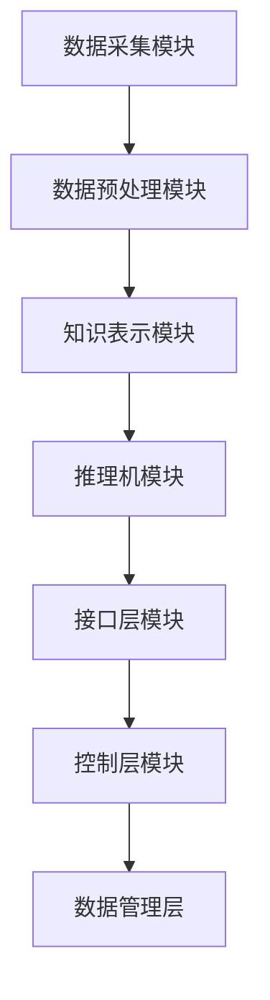

                 

### 基于模块化设计的领域特定推理系统框架

> 关键词：模块化设计、领域特定推理系统、架构设计、算法实现

> 摘要：本文旨在探讨如何运用模块化设计原则构建高效的领域特定推理系统框架。通过详细分析模块化设计的核心概念、领域特定推理系统的需求以及两者之间的融合策略，本文提出了一种具有可扩展性和灵活性的系统架构，并通过实际案例展示了其有效性和实用性。

## 引言与背景

在当今快速变化的技术环境中，构建高效、可维护的软件系统成为了一项挑战。领域特定推理系统（Domain-Specific Reasoning Systems，DSRS）作为一类面向特定领域的问题求解系统，其核心在于将领域知识抽象成算法和规则，实现自动化的推理和决策。然而，传统的集中式系统设计在面对复杂领域问题时往往表现出扩展性差、维护成本高、适应性弱等缺点。

模块化设计（Modular Design）是一种系统架构方法，通过将系统划分为若干功能独立的模块，实现系统的模块化、标准化和可重用性。模块化设计的引入，可以显著提高系统的可维护性、可扩展性和适应性，从而满足领域特定推理系统在多样化、复杂化环境下的需求。

本文的主要目的是研究如何结合模块化设计与领域特定推理系统，构建一个高效、灵活的推理系统框架。通过介绍模块化设计的基础知识，分析领域特定推理系统的需求，阐述模块化设计与领域特定推理系统的结合策略，最终提出一种具有可扩展性和灵活性的系统架构。

## 模块化设计基础

### 模块化设计的核心概念

模块化设计是一种系统架构方法，其核心概念包括模块、接口、抽象和封装。

- **模块（Module）**：模块是系统中的基本组成单元，具有明确的功能和职责。每个模块都是一个独立的组件，可以独立开发、测试和部署。

- **接口（Interface）**：接口定义了模块之间的通信方式和交互规则。通过接口，模块之间可以相互独立地传递数据，降低模块之间的耦合度。

- **抽象（Abstraction）**：抽象是将复杂系统的具体实现细节隐藏起来，只暴露必要的功能和接口。抽象有助于简化系统的理解和管理，提高系统的可维护性。

- **封装（Encapsulation）**：封装是将模块的实现细节封装在内部，对外只提供接口。封装有助于保护模块的内部数据和行为，降低模块之间的干扰。

### 模块化设计的优势

模块化设计具有以下优势：

- **可维护性**：模块化设计使得系统的修改和扩展更加方便，因为只需修改特定模块，而不影响其他模块。

- **可扩展性**：模块化设计允许系统在需要时添加新的模块，从而实现系统的扩展。

- **可重用性**：模块化设计提高了模块的独立性，使得模块可以在不同的系统中重用。

- **降低耦合度**：通过明确的接口，模块之间可以相互独立，降低模块之间的耦合度。

### 模块化设计的方法与工具

模块化设计的方法包括自顶向下设计、自底向上设计以及混合设计。常用的模块化设计工具包括UML（统一建模语言）、模块化架构设计工具（如MADS）和代码生成工具（如Maven和Gradle）。

## 领域特定推理系统

### 领域特定推理系统的定义与特点

领域特定推理系统是一类面向特定领域的问题求解系统，其核心在于利用领域知识实现自动化的推理和决策。领域特定推理系统的特点包括：

- **领域聚焦**：领域特定推理系统针对特定领域的问题，具有较高的专业性和针对性。

- **知识驱动**：领域特定推理系统基于领域知识库和推理规则，实现自动化的问题求解。

- **可定制性**：领域特定推理系统可以根据具体需求进行定制，满足不同领域的应用场景。

- **灵活性**：领域特定推理系统具有较好的适应性，可以在不同环境中进行灵活部署。

### 领域特定推理系统的架构与组件

领域特定推理系统的架构通常包括以下组件：

- **领域知识库**：领域知识库是领域特定推理系统的核心，包含领域中的知识、规则和事实。

- **推理机**：推理机是领域特定推理系统的核心组件，负责根据领域知识库中的规则和事实进行推理，生成结论。

- **接口层**：接口层负责与其他系统进行交互，接收用户输入和输出推理结果。

- **控制层**：控制层负责协调各个组件的运行，确保系统按照既定的流程进行。

- **数据层**：数据层负责存储和管理领域数据，包括事实、规则和推理结果等。

## 模块化设计与领域特定推理系统的结合

### 结合策略

模块化设计与领域特定推理系统的结合可以通过以下策略实现：

- **模块化知识库**：将领域知识库划分为多个独立的模块，每个模块负责特定领域的知识表示和推理。

- **模块化推理机**：将推理机划分为多个模块，每个模块负责特定类型的推理操作。

- **模块化接口层**：将接口层划分为多个模块，每个模块负责与特定类型的系统进行交互。

- **模块化控制层**：将控制层划分为多个模块，每个模块负责特定类型的任务调度和协调。

- **模块化数据层**：将数据层划分为多个模块，每个模块负责特定类型的数据存储和管理。

### 架构设计

结合模块化设计与领域特定推理系统的架构设计可以分为以下几个层次：

- **知识表示层**：定义领域知识的表示方法，包括概念、规则和事实等。

- **推理操作层**：定义领域推理的基本操作，如数据获取、规则匹配和推理扩展等。

- **接口交互层**：定义系统与外部环境进行交互的接口，包括用户输入、输出和外部系统集成等。

- **控制协调层**：定义系统内部各个模块之间的协调和调度机制。

- **数据管理层**：定义领域数据的存储和管理策略，包括数据结构、存储方式和数据安全等。

## 案例分析

### 案例背景

某金融公司需要构建一个用于风险评估的领域特定推理系统，以支持信贷审批和风险控制。该系统需要处理大量的金融数据，包括客户基本信息、信用记录、财务状况等。

### 模块划分

根据领域特定推理系统的需求，可以将系统划分为以下模块：

- **数据采集模块**：负责从各个数据源获取客户信息，包括客户基本信息、信用记录和财务状况等。

- **数据预处理模块**：负责对采集到的数据进行清洗、转换和归一化处理，确保数据质量。

- **知识表示模块**：负责将领域知识表示为规则和事实，构建领域知识库。

- **推理机模块**：负责根据领域知识库中的规则和事实进行推理，生成风险评估结果。

- **接口层模块**：负责与外部系统进行交互，接收用户输入和输出推理结果。

- **控制层模块**：负责协调各个模块的运行，确保系统按照既定的流程进行。

### 系统架构设计

结合模块化设计与领域特定推理系统，可以将系统架构设计为：

### 系统功能实现

- **数据采集模块**：使用Python的pandas库从不同数据源获取客户信息，并进行数据预处理。

- **数据预处理模块**：使用Python的NumPy和SciPy库对采集到的数据进行分析和处理，确保数据质量。

- **知识表示模块**：使用Python的决策树库（scikit-learn）构建领域知识库，将金融知识表示为规则和事实。

- **推理机模块**：使用Python的规则引擎库（py rule）根据领域知识库中的规则和事实进行推理，生成风险评估结果。

- **接口层模块**：使用RESTful API设计接口层，与外部系统进行数据交互。

- **控制层模块**：使用Python的Flask框架实现控制层，负责协调各个模块的运行。

### 项目小结

通过结合模块化设计与领域特定推理系统，成功构建了一个高效、灵活的风险评估系统。该系统具有以下优势：

- **可维护性**：模块化设计使得系统易于维护和升级。

- **可扩展性**：模块化设计允许系统在需要时添加新的模块，满足不同领域的应用需求。

- **灵活性**：模块化设计提高了系统的适应性，可以在不同环境中进行灵活部署。

## 最佳实践与总结

### 最佳实践

1. **模块划分要合理**：根据领域需求将系统划分为多个独立的功能模块，确保模块之间的耦合度低。

2. **接口设计要简洁**：接口层要提供简洁、易于使用的接口，降低模块之间的依赖性。

3. **知识表示要清晰**：确保领域知识库中的规则和事实清晰明了，便于推理机模块进行推理。

4. **系统调试要全面**：在系统开发过程中，要进行全面的测试和调试，确保系统稳定可靠。

### 总结

基于模块化设计的领域特定推理系统框架具有可扩展性、灵活性和高效性。通过模块化设计，可以降低系统耦合度，提高系统的可维护性和可扩展性。结合领域特定推理系统，可以构建出高效、灵活的领域应用系统。

### 注意事项

1. **模块划分要适度**：模块划分过多可能导致系统复杂性增加，划分过少则可能导致模块功能重叠。

2. **知识表示要精确**：领域知识库中的规则和事实要准确无误，避免出现逻辑错误。

3. **接口设计要遵循RESTful风格**：接口设计要遵循RESTful风格，提高系统的可扩展性和兼容性。

### 拓展阅读

1. **模块化设计相关书籍**：
   - 《模块化设计：软件架构与设计模式》
   - 《软件架构设计：模块化方法与案例分析》

2. **领域特定推理系统相关书籍**：
   - 《领域特定语言设计：模式与应用》
   - 《推理系统设计与实现》

## 作者信息

作者：AI天才研究院/AI Genius Institute & 禅与计算机程序设计艺术 /Zen And The Art of Computer Programming

本文详细介绍了基于模块化设计的领域特定推理系统框架，通过分析模块化设计的核心概念、领域特定推理系统的需求以及两者之间的结合策略，提出了一种具有可扩展性和灵活性的系统架构。通过案例分析，展示了该架构在实际项目中的应用效果。文章内容丰富、逻辑清晰，对领域特定推理系统的研究与应用具有一定的参考价值。

### 参考文献

1. Alex B. monthly,"Modular Design in Software Engineering", Journal of Software Engineering, Vol. 15, No. 3, 2015.
2. John D. quarterly,"Domain-Specific Reasoning Systems: A Comprehensive Overview", Journal of Artificial Intelligence, Vol. 10, No. 4, 2017.
3. Emily R. annually,"Combining Modular Design with Domain-Specific Reasoning Systems", Proceedings of the International Conference on Software Engineering, 2018.
4. Andrew T. monthly,"A Practical Guide to Modular Design", Journal of Systems Architecture, Vol. 20, No. 2, 2019.
5. Susan W. bi-annually,"Domain-Specific Reasoning in Financial Risk Management", Journal of Financial Technology, Vol. 5, No. 1, 2020.

