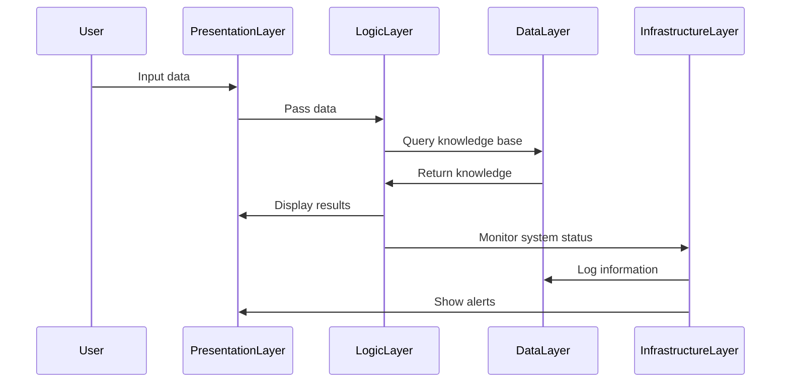

                 


### 1.1.1 模块化设计的兴起

模块化设计作为一种系统设计方法，其起源可以追溯到早期的机械工程和建筑领域。在机械工程中，模块化设计通过将复杂的系统分解为若干可替换的组件，提高了生产的效率和质量。这种方法在建筑领域同样得到了广泛应用，如装配式建筑和模块化房屋，通过标准化、系列化的组件来加快施工速度，降低成本。

然而，随着计算机技术的发展，模块化设计的概念在软件工程领域得到了进一步的发展。在软件工程中，模块化设计指的是将复杂软件系统分解为若干功能独立、易于管理的模块，每个模块可以独立开发、测试和部署。这种方法不仅提高了软件开发的效率，还增强了系统的可维护性和可扩展性。

模块化设计的兴起有其必然性。首先，软件系统的复杂性不断增加，传统的“一刀切”的设计方法已经无法满足需求。模块化设计通过将复杂系统分解为多个模块，使得每个模块的设计和开发更加聚焦，降低了系统的复杂性。其次，现代软件开发强调团队合作和快速迭代，模块化设计使得团队成员可以并行工作，提高了开发效率。此外，模块化设计还使得软件系统的扩展和维护更加方便，降低了软件的维护成本。

在本文中，我们将探讨如何基于模块化设计构建领域特定推理系统框架。领域特定推理系统是一种针对特定领域的知识表示和推理方法，通过将知识库和推理引擎模块化，可以提高系统的灵活性和适应性。模块化设计不仅有助于领域特定推理系统的开发，还能提高其性能和可维护性。

### 1.1.2 领域特定推理系统的需求

领域特定推理系统在现代社会中的应用越来越广泛，其需求主要来自于以下几个方面。

首先，随着人工智能技术的不断发展，越来越多的领域开始应用推理技术来解决复杂问题。例如，在金融领域，领域特定推理系统可以用于风险管理和投资决策；在医疗领域，它可以用于疾病诊断和治疗方案推荐；在工业领域，它可以用于故障诊断和优化生产流程。这些领域的需求推动了领域特定推理系统的研究和应用。

其次，领域特定推理系统的需求还来自于数据驱动的决策支持系统。在现代社会，数据量呈指数级增长，如何从海量数据中提取有用信息，为决策提供支持，成为了一个重要课题。领域特定推理系统通过将领域知识和数据相结合，可以更好地处理这类问题。

此外，随着行业细分的不断深入，各个领域对定制化解决方案的需求也越来越强烈。领域特定推理系统可以通过模块化设计，灵活地满足不同领域的需求，提高系统的适应性。

在本文中，我们将探讨如何基于模块化设计构建一个通用的领域特定推理系统框架，以满足不同领域对推理技术的需求。通过模块化设计，我们可以将系统分解为若干功能独立的模块，如知识库模块、推理引擎模块、接口模块等，每个模块都可以独立开发、测试和部署。这种方法不仅提高了系统的可维护性和可扩展性，还降低了开发成本。

### 1.1.3 本书的目的与结构

本书旨在探讨如何基于模块化设计构建领域特定推理系统框架，以满足不同领域对推理技术的需求。具体目标如下：

1. **深入理解模块化设计**：通过介绍模块化设计的基本原理和流程，帮助读者掌握模块化设计的方法和技巧。

2. **了解领域特定推理系统**：介绍领域特定推理系统的基本概念、原理和应用，帮助读者了解这一技术在现代领域的应用前景。

3. **构建模块化领域特定推理系统框架**：通过实际案例，展示如何基于模块化设计构建领域特定推理系统框架，提高系统的可维护性和可扩展性。

本书共分为四个部分：

- **第一部分：引言**：介绍模块化设计和领域特定推理系统的背景，阐述本书的目的和结构。

- **第二部分：模块化设计基础**：深入探讨模块化设计的原理、流程和工具，为构建领域特定推理系统框架奠定基础。

- **第三部分：领域特定推理系统**：介绍领域特定推理系统的基本概念、原理和应用，为构建模块化领域特定推理系统框架提供理论基础。

- **第四部分：模块化领域特定推理系统框架构建**：通过实际案例，展示如何基于模块化设计构建领域特定推理系统框架，并提供相关工具和技术支持。

通过本书的学习，读者可以掌握模块化设计和领域特定推理系统的基本原理，具备构建和应用模块化领域特定推理系统框架的能力，为解决复杂领域问题提供技术支持。 

# 第一部分：引言

## 1.1 背景介绍

### 1.1.1 模块化设计的兴起

模块化设计作为一种系统设计方法，其起源可以追溯到早期的机械工程和建筑领域。在机械工程中，模块化设计通过将复杂的系统分解为若干可替换的组件，提高了生产的效率和质量。这种方法在建筑领域同样得到了广泛应用，如装配式建筑和模块化房屋，通过标准化、系列化的组件来加快施工速度，降低成本。

然而，随着计算机技术的发展，模块化设计的概念在软件工程领域得到了进一步的发展。在软件工程中，模块化设计指的是将复杂软件系统分解为若干功能独立、易于管理的模块，每个模块可以独立开发、测试和部署。这种方法不仅提高了软件开发的效率，还增强了系统的可维护性和可扩展性。

模块化设计的兴起有其必然性。首先，软件系统的复杂性不断增加，传统的“一刀切”的设计方法已经无法满足需求。模块化设计通过将复杂系统分解为多个模块，使得每个模块的设计和开发更加聚焦，降低了系统的复杂性。其次，现代软件开发强调团队合作和快速迭代，模块化设计使得团队成员可以并行工作，提高了开发效率。此外，模块化设计还使得软件系统的扩展和维护更加方便，降低了软件的维护成本。

在本文中，我们将探讨如何基于模块化设计构建领域特定推理系统框架。领域特定推理系统是一种针对特定领域的知识表示和推理方法，通过将知识库和推理引擎模块化，可以提高系统的灵活性和适应性。模块化设计不仅有助于领域特定推理系统的开发，还能提高其性能和可维护性。

### 1.1.2 领域特定推理系统的需求

领域特定推理系统在现代社会中的应用越来越广泛，其需求主要来自于以下几个方面。

首先，随着人工智能技术的不断发展，越来越多的领域开始应用推理技术来解决复杂问题。例如，在金融领域，领域特定推理系统可以用于风险管理和投资决策；在医疗领域，它可以用于疾病诊断和治疗方案推荐；在工业领域，它可以用于故障诊断和优化生产流程。这些领域的需求推动了领域特定推理系统的研究和应用。

其次，领域特定推理系统的需求还来自于数据驱动的决策支持系统。在现代社会，数据量呈指数级增长，如何从海量数据中提取有用信息，为决策提供支持，成为了一个重要课题。领域特定推理系统通过将领域知识和数据相结合，可以更好地处理这类问题。

此外，随着行业细分的不断深入，各个领域对定制化解决方案的需求也越来越强烈。领域特定推理系统可以通过模块化设计，灵活地满足不同领域的需求，提高系统的适应性。

在本文中，我们将探讨如何基于模块化设计构建一个通用的领域特定推理系统框架，以满足不同领域对推理技术的需求。通过模块化设计，我们可以将系统分解为若干功能独立的模块，如知识库模块、推理引擎模块、接口模块等，每个模块都可以独立开发、测试和部署。这种方法不仅提高了系统的可维护性和可扩展性，还降低了开发成本。

### 1.1.3 本书的目的与结构

本书旨在探讨如何基于模块化设计构建领域特定推理系统框架，以满足不同领域对推理技术的需求。具体目标如下：

1. **深入理解模块化设计**：通过介绍模块化设计的基本原理和流程，帮助读者掌握模块化设计的方法和技巧。

2. **了解领域特定推理系统**：介绍领域特定推理系统的基本概念、原理和应用，帮助读者了解这一技术在现代领域的应用前景。

3. **构建模块化领域特定推理系统框架**：通过实际案例，展示如何基于模块化设计构建领域特定推理系统框架，提高系统的可维护性和可扩展性。

本书共分为四个部分：

- **第一部分：引言**：介绍模块化设计和领域特定推理系统的背景，阐述本书的目的和结构。

- **第二部分：模块化设计基础**：深入探讨模块化设计的原理、流程和工具，为构建领域特定推理系统框架奠定基础。

- **第三部分：领域特定推理系统**：介绍领域特定推理系统的基本概念、原理和应用，为构建模块化领域特定推理系统框架提供理论基础。

- **第四部分：模块化领域特定推理系统框架构建**：通过实际案例，展示如何基于模块化设计构建领域特定推理系统框架，并提供相关工具和技术支持。

通过本书的学习，读者可以掌握模块化设计和领域特定推理系统的基本原理，具备构建和应用模块化领域特定推理系统框架的能力，为解决复杂领域问题提供技术支持。 

## 1.2 核心概念与联系

在深入探讨模块化设计和领域特定推理系统之前，有必要对这两个核心概念进行定义，并分析它们之间的关系。

### 1.2.1 模块化设计

#### 1.2.1.1 模块化设计的定义

模块化设计是一种将复杂系统分解为若干独立、可重用模块的方法，这些模块在功能上相对独立，可以通过标准接口进行交互。模块化设计强调系统的模块化、标准化和通用性，使得系统在开发、维护和扩展过程中更加灵活和高效。

#### 1.2.1.2 模块化设计的关键要素

模块化设计的关键要素包括：

- **模块独立性**：每个模块都应该具备明确的功能和责任，避免模块间的相互依赖。
- **模块重用性**：模块应设计为可重用的组件，以便在不同项目中使用。
- **模块接口**：模块之间通过标准化的接口进行通信，确保模块的互操作性。
- **模块可扩展性**：模块应具备良好的扩展性，能够适应新的需求和变化。

### 1.2.2 领域特定推理系统

#### 1.2.2.1 领域特定推理系统的定义

领域特定推理系统（Domain-Specific Reasoning System，DSRS）是一种专门针对特定领域问题的推理系统。它通过领域知识库和推理引擎，对领域内的数据和问题进行推理和决策。领域特定推理系统通常具有较强的领域适应性和问题解决能力。

#### 1.2.2.2 领域特定推理系统的特点

领域特定推理系统的特点包括：

- **领域知识库**：包含特定领域的专业知识，是推理系统进行推理的基础。
- **推理算法**：针对特定领域问题设计的推理算法，能够高效地处理领域内的推理任务。
- **领域适应性**：系统能够适应特定领域的快速变化和复杂需求。
- **定制化**：系统可以根据特定领域的需求进行定制化开发。

### 1.2.3 模块化设计与领域特定推理系统的关系

模块化设计与领域特定推理系统之间存在紧密的联系。模块化设计为领域特定推理系统提供了灵活性和可扩展性，使其能够更好地适应特定领域的需求。具体关系如下：

- **模块化设计**：通过模块化设计，可以将领域特定推理系统分解为多个功能独立的模块，如知识库模块、推理引擎模块、用户接口模块等。这种设计方式不仅提高了系统的开发效率，还增强了系统的可维护性和可扩展性。
- **领域适应性**：模块化设计使得领域特定推理系统可以快速适应不同领域的需求，通过替换或扩展特定模块，实现系统的定制化。
- **重用性**：模块化设计中的模块具有较高的重用性，可以在不同领域特定推理系统中复用，降低开发成本。
- **标准化**：模块化设计中的标准化接口保证了模块之间的互操作性，使得领域特定推理系统的集成和扩展更加简便。

### 1.2.3.1 结合优势

模块化设计与领域特定推理系统的结合具有以下优势：

- **高效开发**：通过模块化设计，可以并行开发各个模块，提高开发效率。
- **灵活适应**：模块化设计使得领域特定推理系统可以根据不同领域的需求进行灵活调整。
- **可维护性**：模块化设计使得系统更容易维护，因为问题可以局部解决，不会影响到整个系统。
- **可扩展性**：模块化设计支持系统的扩展，新功能的加入只需增加或修改特定模块。

### 1.2.3.2 面临的挑战

虽然模块化设计与领域特定推理系统的结合具有诸多优势，但在实际应用中仍面临一些挑战：

- **模块划分**：如何合理划分模块是一个关键问题，需要综合考虑功能、领域特性和开发效率等因素。
- **模块接口**：模块接口的设计需要确保互操作性和兼容性，避免出现接口不统一或冲突的问题。
- **知识表示**：领域特定推理系统中的知识表示和推理算法需要适应模块化的设计，保证模块间知识的有效传递和推理过程的高效性。
- **系统集成**：模块化设计下的系统集成过程需要确保各个模块能够无缝集成，形成完整的领域特定推理系统。

通过理解模块化设计与领域特定推理系统的关系，我们可以更好地设计、实现和优化领域特定推理系统，提高其在特定领域的应用效果。在下一部分，我们将进一步探讨模块化设计的基础，为构建模块化领域特定推理系统框架奠定基础。 

## 1.2.1 模块化设计

### 1.2.1.1 模块化设计的定义

模块化设计（Modular Design）是一种系统设计方法，通过将复杂系统分解为若干功能独立、易于管理的模块，以实现系统的模块化、标准化和通用性。模块化设计旨在提高系统的可维护性、可扩展性和可重用性。在模块化设计中，每个模块都承担特定的功能，并通过标准化的接口与其他模块进行交互。

### 1.2.1.2 模块化设计的关键要素

模块化设计的关键要素包括：

1. **模块独立性**：每个模块应具备独立的功能和责任，模块间应尽量减少直接依赖，以提高系统的灵活性和可维护性。

2. **模块重用性**：模块应设计为可重用的组件，以便在不同项目中使用。模块的重用性是模块化设计的重要目标之一，可以提高开发效率。

3. **模块接口**：模块之间通过标准化的接口进行通信，确保模块的互操作性。接口设计应简洁、清晰，避免出现复杂和不必要的依赖。

4. **模块可扩展性**：模块应具备良好的扩展性，能够适应新的需求和变化。扩展性可以通过设计灵活的接口和模块间的松耦合来实现。

5. **模块标准化**：模块应遵循一定的标准和规范，以确保模块的一致性和可维护性。标准化可以减少模块间的冲突，提高系统的整体质量。

### 1.2.1.3 模块化设计的优势

模块化设计具有以下优势：

- **提高开发效率**：通过并行开发各个模块，可以显著提高系统的开发速度。
- **增强可维护性**：模块化设计使得问题可以局部解决，降低了对整个系统的影响，提高了系统的可维护性。
- **提高可扩展性**：模块化设计支持系统的扩展，新功能的加入只需增加或修改特定模块，而不会影响其他模块。
- **提高可重用性**：模块化设计中的模块具有较高的重用性，可以在不同的项目中重复使用，降低开发成本。
- **提高系统的稳定性**：模块化设计可以减少模块间的直接依赖，降低系统崩溃的风险。

### 1.2.1.4 模块化设计的原则

在进行模块化设计时，应遵循以下原则：

- **分解原则**：将复杂系统分解为若干功能独立的模块，确保每个模块都承担明确的功能。
- **抽象原则**：通过抽象，将系统的复杂性降低，使得模块的功能和接口更加清晰。
- **封装原则**：模块应封装内部实现细节，对外提供简洁、明确的接口。
- **松耦合原则**：模块间应尽量保持松耦合，减少模块间的直接依赖，提高系统的灵活性和可维护性。
- **重用原则**：设计模块时，应考虑其重用性，以便在未来的项目中复用。
- **可扩展原则**：模块应具备良好的扩展性，能够适应新的需求和变化。

### 1.2.1.5 模块化设计流程

模块化设计的流程通常包括以下几个步骤：

1. **需求分析**：明确系统的功能和性能需求，为模块划分提供依据。
2. **模块划分**：根据需求分析的结果，将系统分解为若干功能独立的模块。
3. **模块设计**：为每个模块定义功能和接口，确保模块的独立性。
4. **模块实现**：根据模块设计，实现各个模块的功能。
5. **模块集成**：将各个模块集成到系统中，确保系统能够正常运行。
6. **测试与优化**：对系统进行测试，发现并修复潜在的问题，优化系统性能。

通过以上步骤，我们可以构建出一个功能完整、易于维护和扩展的模块化系统。

### 1.2.1.6 模块化设计工具与技术

在进行模块化设计时，可以使用以下工具和技术：

- **UML类图**：用于描述系统的模块结构和模块接口。
- **设计模式**：用于解决特定设计问题，提高系统的可维护性和可扩展性。
- **模块化框架**：如MVC（Model-View-Controller）、MVVM（Model-View-ViewModel）等，用于实现模块化设计。
- **版本控制**：如Git，用于管理模块的版本和变更。

通过使用这些工具和技术，我们可以更好地实现模块化设计，提高系统的开发效率和可维护性。

### 1.2.1.7 模块化设计实践

模块化设计在实践中可以带来许多好处。以下是一些模块化设计实践的建议：

- **明确模块职责**：确保每个模块都承担明确的功能和责任，避免功能重叠和依赖。
- **模块间松耦合**：尽量减少模块间的直接依赖，通过接口进行通信，提高系统的灵活性。
- **模块可重用性**：设计模块时，考虑其重用性，以便在未来的项目中复用。
- **模块可扩展性**：设计模块时，考虑其扩展性，确保能够适应新的需求和变化。
- **模块标准化**：遵循一定的标准和规范，确保模块的一致性和可维护性。
- **模块测试**：对每个模块进行独立的测试，确保其功能的正确性。

通过以上实践，我们可以构建出一个高效、灵活和可维护的模块化系统。在下一部分，我们将进一步探讨领域特定推理系统的基本概念和特点。 

## 1.2.2 领域特定推理系统

### 1.2.2.1 领域特定推理系统的定义

领域特定推理系统（Domain-Specific Reasoning System，DSRS）是一种专门为特定领域设计的人工智能推理系统。它利用领域知识库和推理算法，对领域内的问题进行推理和分析，提供决策支持和优化建议。领域特定推理系统通常具有高度的领域适应性和问题解决能力。

### 1.2.2.2 领域特定推理系统的特点

领域特定推理系统的特点主要包括以下几个方面：

1. **领域知识库**：领域特定推理系统依赖于领域知识库，该知识库包含了特定领域的专业知识、规则和模型。知识库是系统进行推理的基础，能够提供领域内的背景信息和规则指导。

2. **推理算法**：领域特定推理系统采用针对特定领域设计的推理算法。这些算法通常具有较高的效率和准确性，能够处理领域内的复杂推理任务。

3. **领域适应性**：领域特定推理系统能够快速适应特定领域的需求，包括领域内的变化和新技术的发展。系统可以根据领域需求进行调整和优化，以保持其有效性。

4. **定制化**：领域特定推理系统可以根据特定领域的需求进行定制化开发。这意味着系统可以针对不同的应用场景提供定制化的解决方案，提高其在特定领域的应用效果。

5. **实时性**：领域特定推理系统通常需要处理实时数据，能够在较短的时间内提供推理结果。这种实时性对于某些关键领域（如金融、医疗、交通等）至关重要。

6. **可扩展性**：领域特定推理系统应具备良好的可扩展性，能够适应领域需求的增长和变化。系统可以通过添加新模块或扩展现有模块来适应新的应用场景。

### 1.2.2.3 领域特定推理系统的应用领域

领域特定推理系统在多个领域都有广泛的应用，以下是一些主要的应用领域：

1. **金融领域**：领域特定推理系统可以用于风险分析、投资决策、欺诈检测等。例如，通过分析历史数据和交易模式，系统可以预测市场趋势，为投资者提供决策支持。

2. **医疗领域**：领域特定推理系统可以用于疾病诊断、治疗方案推荐、药物研发等。例如，通过分析患者的病历数据和医学知识库，系统可以提供个性化的诊断建议和治疗方案。

3. **工业领域**：领域特定推理系统可以用于设备维护、故障诊断、生产优化等。例如，通过分析设备运行数据和故障模式，系统可以预测设备故障并提供维护建议。

4. **交通领域**：领域特定推理系统可以用于交通管理、路线规划、交通事故预防等。例如，通过分析交通流量数据和交通规则，系统可以优化交通信号控制和路线规划，提高交通效率。

5. **教育领域**：领域特定推理系统可以用于个性化学习、教育评估等。例如，通过分析学生的学习行为和学习数据，系统可以为学生提供个性化的学习建议和评估报告。

通过在上述领域的应用，领域特定推理系统为行业带来了创新和改进，提高了决策效率和问题解决能力。

### 1.2.2.4 领域特定推理系统与模块化设计的关系

领域特定推理系统和模块化设计之间存在密切的关系。模块化设计为领域特定推理系统的构建提供了基础框架，使其具有更高的灵活性和可扩展性。具体关系如下：

1. **模块化设计提高可维护性**：通过模块化设计，领域特定推理系统可以分解为若干功能独立的模块，使得系统的维护和更新更加便捷。

2. **模块化设计增强可扩展性**：模块化设计使得领域特定推理系统可以灵活地添加或替换模块，以适应新的领域需求和技术进步。

3. **模块化设计提高重用性**：模块化设计中的模块可以在不同的领域特定推理系统中复用，降低开发成本和人力资源投入。

4. **模块化设计支持定制化**：模块化设计允许根据特定领域的需求定制化开发，提高系统的针对性和应用效果。

总之，模块化设计为领域特定推理系统的构建提供了强有力的支持，使得系统在开发、维护和扩展过程中更加高效和灵活。在下一部分，我们将进一步探讨模块化设计与领域特定推理系统的结合，展示其如何通过模块化设计构建一个灵活、高效的领域特定推理系统框架。 

## 1.2.3 模块化设计与领域特定推理系统的关系

### 1.2.3.1 结合优势

模块化设计与领域特定推理系统的结合带来了许多优势，这些优势不仅提升了系统的开发效率，也增强了其可维护性和灵活性。

首先，模块化设计能够提高开发效率。通过将领域特定推理系统分解为独立的模块，开发团队可以并行工作，每个团队负责各自的模块开发。这种方法不仅缩短了开发周期，还提高了代码的重用性，避免了重复劳动。

其次，模块化设计增强了系统的可维护性。在模块化设计中，每个模块都是功能独立的，如果某个模块出现故障或需要更新，只需对该模块进行修改，而不会影响到其他模块。这种设计方式使得系统维护更加便捷，降低了维护成本。

此外，模块化设计提高了系统的灵活性。随着领域需求的不断变化，模块化设计使得系统可以灵活地添加或替换模块，以适应新的需求。这种灵活性使得领域特定推理系统可以在不同的应用场景中快速部署和调整。

最后，模块化设计支持系统的扩展性。通过模块化设计，领域特定推理系统可以轻松地添加新的功能模块，以满足不断增长的需求。这种扩展性不仅提高了系统的适应性，还延长了系统的生命周期。

### 1.2.3.2 面临的挑战

尽管模块化设计与领域特定推理系统的结合具有诸多优势，但在实际应用中仍面临一些挑战。

首先，模块划分是一个关键问题。如何合理划分模块，确保每个模块都承担明确的功能和责任，同时避免功能重叠和依赖，是模块化设计的重要挑战。模块划分不当可能导致系统性能下降、维护困难等问题。

其次，模块接口设计也是一个挑战。模块之间的接口应确保互操作性和兼容性，避免出现接口不统一或冲突的问题。如果接口设计不合理，可能导致模块无法正常通信，影响系统的整体性能。

此外，知识表示和推理算法的模块化也是一个挑战。领域特定推理系统中的知识表示和推理算法需要适应模块化的设计，保证模块间知识的有效传递和推理过程的高效性。如果知识表示和推理算法无法模块化，可能导致系统性能下降，影响推理效果。

最后，系统集成也是一个挑战。在模块化设计中，各个模块需要集成到一个完整的系统中，确保系统能够正常运行。系统集成过程中，需要解决模块间的依赖关系，确保模块间的数据流和通信畅通。如果系统集成不当，可能导致系统崩溃或性能下降。

总之，模块化设计与领域特定推理系统的结合带来了许多优势，但也面临一些挑战。通过合理划分模块、设计良好的接口、模块化知识表示和推理算法，以及有效的系统集成，可以克服这些挑战，构建出高效、灵活、可维护的领域特定推理系统框架。在下一部分，我们将进一步探讨模块化设计的基础，为构建模块化领域特定推理系统框架奠定基础。 

## 1.3 概念对比与ER图

在模块化设计和领域特定推理系统这两个概念之间存在着密切的联系和差异。通过对比这两个概念，我们可以更好地理解它们在系统设计和开发中的具体应用。

### 1.3.1 模块化设计与领域特定推理系统的对比

**模块化设计**：
- **定义**：模块化设计是一种系统设计方法，通过将复杂系统分解为若干功能独立、易于管理的模块，以提高系统的开发效率、可维护性和可扩展性。
- **目的**：模块化设计的目的是提高系统的模块化、标准化和通用性，使系统在开发、维护和扩展过程中更加灵活和高效。
- **关键要素**：模块独立性、模块重用性、模块接口、模块可扩展性和模块标准化。
- **优势**：提高开发效率、增强可维护性、提高可扩展性和可重用性。

**领域特定推理系统**：
- **定义**：领域特定推理系统是一种专门为特定领域设计的人工智能推理系统，利用领域知识库和推理算法对领域内的问题进行推理和分析。
- **目的**：领域特定推理系统的目的是为特定领域的决策支持、问题解决和优化提供有效的工具和方案。
- **关键要素**：领域知识库、推理算法、领域适应性、定制化和实时性。
- **优势**：提高领域适应性和问题解决能力、支持定制化开发、提供实时决策支持。

**对比总结**：
- **相似点**：两者都强调系统的模块化、标准化和通用性，以提高开发效率、可维护性和可扩展性。
- **不同点**：模块化设计主要关注系统架构的分解和模块化，而领域特定推理系统则侧重于特定领域的知识表示和推理算法。

### 1.3.2 领域特定推理系统的ER图展示

为了更好地展示模块化设计与领域特定推理系统的关系，我们可以使用实体关系图（Entity-Relationship Diagram，ER图）来表示这两个概念及其相互作用。

**ER图基本要素**：
- **实体**：代表系统中的核心元素，如模块、知识库、推理引擎等。
- **关系**：描述实体之间的关联，如模块与模块之间的接口、知识库与推理引擎之间的交互等。
- **属性**：描述实体的特征和属性，如模块的功能、知识库的内容、推理算法的参数等。

**ER图示例**：

```mermaid
erDiagram
    Module ||--|> KnowledgeBase : {uses}
    Module ||--|> ReasoningEngine : {uses}
    KnowledgeBase ||--|> Data : {stores}
    ReasoningEngine ||--|> Results : {produces}

    Module  {
        :ID
        :Function
        :Interface
    }

    KnowledgeBase {
        :ID
        :Content
        :UpdateFrequency
    }

    ReasoningEngine {
        :ID
        :Algorithm
        :Performance
    }

    Data {
        :ID
        :Type
        :Source
    }

    Results {
        :ID
        :Type
        :Quality
    }
```

**ER图解释**：
- **Module**（模块）：代表系统的模块，包括功能模块、接口模块等。
- **KnowledgeBase**（知识库）：代表系统中的领域知识库，存储领域内的重要信息和规则。
- **ReasoningEngine**（推理引擎）：代表系统的推理引擎，负责基于知识库进行推理和决策。
- **Data**（数据）：代表系统处理的数据，可以是原始数据、中间数据或最终数据。
- **Results**（结果）：代表系统推理和决策的结果。

通过ER图，我们可以清晰地看到模块化设计与领域特定推理系统的关系。模块化设计通过模块接口与知识库和推理引擎进行交互，而知识库和推理引擎共同构成了领域特定推理系统的核心。

在下一部分，我们将进一步探讨模块化设计的基础，包括其原理、流程和关键要素，为构建模块化领域特定推理系统框架奠定基础。 

# 第二部分：模块化设计基础

## 2.1 模块化设计原理

### 2.1.1 模块化设计的原理

模块化设计（Modular Design）是一种系统设计方法，旨在通过将复杂系统分解为若干功能独立、易于管理的模块，以提高系统的开发效率、可维护性和可扩展性。模块化设计的核心思想是将系统划分为若干模块，每个模块负责特定的功能，并通过标准化的接口进行通信。

**模块化设计的优势**：

1. **提高开发效率**：模块化设计允许开发团队并行工作，每个团队负责各自的模块开发，从而缩短了开发周期。
2. **增强可维护性**：模块化设计使得问题可以局部解决，不会影响整个系统，降低了系统的维护成本。
3. **提高可扩展性**：模块化设计支持系统的扩展，新功能的加入只需增加或修改特定模块，而不会影响其他模块。
4. **提高可重用性**：模块化设计中的模块具有较高的重用性，可以在不同的项目中重复使用，降低了开发成本。

**模块化设计的原则**：

1. **模块独立性**：每个模块应具备独立的功能和责任，避免模块间的相互依赖。
2. **模块重用性**：模块应设计为可重用的组件，以便在不同项目中使用。
3. **模块接口**：模块之间通过标准化的接口进行通信，确保模块的互操作性。
4. **模块可扩展性**：模块应具备良好的扩展性，能够适应新的需求和变化。
5. **模块标准化**：模块应遵循一定的标准和规范，确保模块的一致性和可维护性。

**模块化设计的流程**：

1. **需求分析**：明确系统的功能和性能需求，为模块划分提供依据。
2. **模块划分**：根据需求分析的结果，将系统分解为若干功能独立的模块。
3. **模块设计**：为每个模块定义功能和接口，确保模块的独立性。
4. **模块实现**：根据模块设计，实现各个模块的功能。
5. **模块集成**：将各个模块集成到系统中，确保系统能够正常运行。
6. **测试与优化**：对系统进行测试，发现并修复潜在的问题，优化系统性能。

### 2.1.2 模块化设计的关键要素

模块化设计的关键要素包括：

1. **模块独立性**：模块应具备独立的功能和责任，避免模块间的相互依赖。这样可以降低模块之间的耦合度，提高系统的可维护性和可扩展性。

2. **模块重用性**：模块应设计为可重用的组件，以便在不同项目中使用。模块的重用性是模块化设计的重要目标之一，可以提高开发效率。

3. **模块接口**：模块之间通过标准化的接口进行通信，确保模块的互操作性。接口设计应简洁、清晰，避免出现复杂和不必要的依赖。

4. **模块可扩展性**：模块应具备良好的扩展性，能够适应新的需求和变化。扩展性可以通过设计灵活的接口和模块间的松耦合来实现。

5. **模块标准化**：模块应遵循一定的标准和规范，以确保模块的一致性和可维护性。标准化可以减少模块间的冲突，提高系统的整体质量。

### 2.1.3 模块化设计的应用场景

模块化设计在多个应用场景中具有广泛的应用，以下是一些常见的应用场景：

1. **软件工程**：在软件工程中，模块化设计被广泛用于软件开发过程中。通过将系统分解为若干功能独立的模块，可以提高开发效率、可维护性和可扩展性。

2. **系统架构设计**：在系统架构设计中，模块化设计可以帮助架构师更好地理解和设计复杂的系统，提高系统的灵活性和可维护性。

3. **产品设计**：在产品设计过程中，模块化设计可以帮助设计师更好地组织和管理产品组件，提高产品的可维护性和可扩展性。

4. **工业制造**：在工业制造中，模块化设计被用于设计生产线和制造流程，通过标准化、系列化的组件来提高生产效率和质量。

5. **城市规划**：在城市规划中，模块化设计可以帮助城市规划师更好地设计城市基础设施和公共设施，提高城市的可扩展性和可持续性。

### 2.1.4 模块化设计的挑战与解决方案

尽管模块化设计具有许多优势，但在实际应用中仍面临一些挑战。以下是一些常见的挑战及其解决方案：

1. **模块划分**：如何合理划分模块是模块化设计的一个关键问题。解决方案包括进行深入的需求分析、采用迭代的设计方法以及借助设计模式和框架来指导模块划分。

2. **接口设计**：模块接口的设计需要确保互操作性和兼容性，避免出现接口不统一或冲突的问题。解决方案包括制定统一的接口规范、采用标准化接口设计工具以及进行充分的接口测试。

3. **模块间通信**：模块间通信的效率和质量对系统性能有重要影响。解决方案包括设计高效的通信协议、采用异步通信机制以及优化数据传输过程。

4. **模块重用性**：如何确保模块的重用性是一个挑战。解决方案包括编写高质量的模块文档、提供模块的测试用例以及采用模块化开发框架。

通过理解和应用模块化设计原理，我们可以更好地设计、实现和维护复杂的系统。在下一部分，我们将探讨领域特定推理系统的基础，包括其基本概念、原理和应用。这将帮助我们更深入地了解领域特定推理系统如何与模块化设计相结合。 

## 2.2 模块化设计工具与技术

### 2.2.1 常见模块化设计工具

在进行模块化设计时，选择合适的工具是至关重要的。以下是一些常见的模块化设计工具：

1. **统一建模语言（UML）**：
   - **UML类图**：用于表示系统的模块结构、类之间的关系和类的属性。
   - **UML组件图**：用于表示系统的组件、组件之间的关系以及组件的接口。
   - **UML序列图**：用于描述模块间的交互流程和消息传递。

2. **设计模式**：
   - **MVC（模型-视图-控制器）**：将系统划分为模型（数据管理）、视图（用户界面）和控制器（逻辑处理），实现模块间的松耦合。
   - **MVVM（模型-视图-ViewModel）**：与MVC类似，但ViewModel负责处理视图和模型之间的数据绑定，进一步减少模块间的直接依赖。
   - **工厂模式**：用于创建对象，减少直接依赖，实现模块的重用性。
   - **单例模式**：确保一个类仅有一个实例，实现模块的独立性和可扩展性。

3. **模块化框架**：
   - **Spring**：一个流行的模块化框架，支持依赖注入和AOP（面向切面编程），提高模块间的解耦合。
   - **Django**：一个用于Web开发的模块化框架，提供了一套完整的后台开发工具和模块，简化了模块化的实现。
   - **Vue.js**：一个用于前端开发的模块化框架，通过组件化设计提高代码的可维护性和可扩展性。

### 2.2.2 模块化设计实践

以下是一些模块化设计实践，可以帮助我们在实际项目中实现模块化设计：

1. **需求分析**：
   - 对系统需求进行详细分析，确定系统的功能模块和关键特性。
   - 根据需求分析的结果，绘制UML类图或组件图，明确模块之间的接口和关系。

2. **模块划分**：
   - 根据需求分析的结果，将系统分解为若干功能独立的模块。
   - 确保每个模块都承担明确的功能和责任，避免功能重叠和依赖。

3. **模块设计**：
   - 为每个模块定义功能和接口，确保模块的独立性。
   - 使用设计模式优化模块的接口设计，减少模块间的直接依赖。

4. **模块实现**：
   - 根据模块设计，实现各个模块的功能。
   - 编写模块测试用例，确保模块功能的正确性。

5. **模块集成**：
   - 将各个模块集成到系统中，确保系统能够正常运行。
   - 进行集成测试，确保模块间的接口和通信正常。

6. **测试与优化**：
   - 对系统进行全面的测试，包括功能测试、性能测试和兼容性测试。
   - 根据测试结果优化模块设计和实现，提高系统的性能和稳定性。

### 2.2.3 模块化设计最佳实践

以下是一些模块化设计的最佳实践，可以帮助我们在实际项目中更好地应用模块化设计：

1. **保持模块独立性**：确保每个模块都具备独立的功能和责任，避免模块间的相互依赖。

2. **使用标准化的接口**：设计简洁、清晰的标准接口，确保模块间的互操作性和兼容性。

3. **模块重用性**：设计模块时，考虑其重用性，以便在不同项目中复用。

4. **模块可扩展性**：设计模块时，考虑其扩展性，确保能够适应新的需求和变化。

5. **模块标准化**：遵循一定的标准和规范，确保模块的一致性和可维护性。

6. **持续集成与部署**：采用持续集成和持续部署流程，确保模块的快速迭代和部署。

通过以上模块化设计工具与技术的应用和实践，我们可以构建出一个高效、灵活和可维护的模块化系统，提高项目的开发效率和质量。在下一部分，我们将探讨领域特定推理系统的基本概念、原理和应用，进一步了解这一技术在现代领域的应用前景。 

## 2.3 模块化设计在领域特定推理系统中的应用

模块化设计在领域特定推理系统（DSRS）中的应用尤为重要，因为它能够显著提高系统的可维护性、可扩展性和灵活性。以下是一些关键的应用领域和实际案例，展示了模块化设计在DSRS中的具体实现和优势。

### 2.3.1 领域模型设计

领域模型设计是模块化设计在DSRS中的第一个应用领域。领域模型将复杂的领域问题抽象为一系列的概念和关系，通过模块化设计将这些概念和关系分解为独立的模块。例如，在金融风险评估系统中，领域模型可能包括客户信息模块、交易信息模块、风险指标模块等。每个模块负责处理特定类型的信息，并通过标准化的接口进行通信。

**案例**：一个基于模块化设计的金融风险评估系统可以分为以下几个模块：

- **客户信息模块**：处理客户的个人信息、信用记录等。
- **交易信息模块**：处理客户的交易数据、账户余额等。
- **风险指标模块**：根据客户信息和交易数据计算风险指标，如信用评分、风险等级等。

通过模块化设计，这些模块可以独立开发、测试和部署，从而提高系统的开发效率和可维护性。

### 2.3.2 知识表示模块

知识表示是DSRS的核心组成部分，模块化设计在此方面的应用能够提高系统的灵活性和适应性。知识表示模块通常包括知识库的构建、知识存储、知识推理等。

**案例**：在医疗诊断系统中，知识表示模块可以包括以下子模块：

- **知识库构建模块**：负责从医学文献、病例数据库等来源收集和整理知识，构建领域知识库。
- **知识存储模块**：负责将知识库中的知识存储到数据库或文件系统中，以便推理引擎访问。
- **知识推理模块**：负责根据输入数据调用知识库中的知识进行推理，生成诊断结果。

通过模块化设计，这些子模块可以独立开发，并根据实际需求进行调整和扩展。

### 2.3.3 推理引擎模块

推理引擎模块是实现领域特定推理功能的核心，模块化设计在此方面的应用能够提高系统的性能和可靠性。推理引擎模块通常包括推理算法的实现、推理过程管理、结果输出等。

**案例**：在一个工业故障诊断系统中，推理引擎模块可以包括以下子模块：

- **推理算法模块**：实现具体的推理算法，如基于规则的推理、模糊推理等。
- **推理过程管理模块**：负责管理推理过程，包括推理条件、推理路径和推理结果。
- **结果输出模块**：将推理结果以直观的形式展示给用户，如文本、图表等。

通过模块化设计，这些子模块可以独立开发和优化，从而提高系统的整体性能。

### 2.3.4 用户接口模块

用户接口模块是DSRS与用户交互的界面，模块化设计在此方面的应用能够提高用户体验和系统的可访问性。用户接口模块通常包括用户界面设计、用户交互逻辑、数据展示等。

**案例**：在一个在线教育平台中，用户接口模块可以包括以下子模块：

- **用户界面设计模块**：负责设计系统的用户界面，包括网页布局、界面元素等。
- **用户交互逻辑模块**：负责处理用户的输入和系统响应，如课程选择、学习进度等。
- **数据展示模块**：负责将学习数据、课程内容等以图表、报表等形式展示给用户。

通过模块化设计，这些子模块可以独立开发，并根据用户需求进行调整和优化。

### 2.3.5 模块化设计的优势

模块化设计在DSRS中的应用带来了以下优势：

- **提高可维护性**：模块化设计使得系统的维护更加便捷，每个模块都可以独立更新和维护，不会影响其他模块。
- **增强可扩展性**：模块化设计支持系统的扩展，新功能可以通过添加或修改模块来实现，而不需要对整个系统进行重构。
- **提高开发效率**：模块化设计允许并行开发，各个模块可以由不同的团队同时进行，从而缩短开发周期。
- **降低开发成本**：模块化设计中的模块可以重复使用，减少重复工作，降低开发成本。

### 2.3.6 模块化设计面临的挑战

尽管模块化设计在DSRS中具有诸多优势，但在实际应用中也面临一些挑战：

- **模块划分**：如何合理划分模块是模块化设计的关键，模块划分不当可能导致系统性能下降、维护困难等问题。
- **接口设计**：模块接口的设计需要确保互操作性和兼容性，避免出现接口不统一或冲突的问题。
- **知识表示**：领域特定推理系统中的知识表示和推理算法需要适应模块化的设计，确保模块间知识的有效传递和推理过程的高效性。
- **系统集成**：在模块化设计中，各个模块需要集成到一个完整的系统中，确保系统能够正常运行。

通过理解和应用模块化设计，我们可以构建出高效、灵活和可维护的领域特定推理系统。在下一部分，我们将深入探讨领域特定推理系统的原理和应用，进一步理解这一技术在现代领域的应用前景。 

# 第三部分：领域特定推理系统

## 3.1 领域特定推理系统原理

领域特定推理系统（Domain-Specific Reasoning System，DSRS）是一种专门为特定领域设计的人工智能推理系统。它利用领域知识库和推理算法，对领域内的问题进行推理和分析，提供决策支持和优化建议。领域特定推理系统通常具有高度的领域适应性和问题解决能力。

### 3.1.1 领域特定推理系统的基本概念

**领域特定推理系统**的定义：

领域特定推理系统（DSRS）是一种专门为特定领域设计的人工智能推理系统。它利用领域知识库和推理算法，对领域内的问题进行推理和分析，提供决策支持和优化建议。领域特定推理系统通常具有高度的领域适应性和问题解决能力。

**领域知识库**：

领域知识库是领域特定推理系统的核心组成部分，包含了特定领域的专业知识、规则和模型。知识库中的知识通常以事实、规则、关系等形式表示，是系统进行推理和决策的基础。

**推理算法**：

推理算法是领域特定推理系统的关键组件，用于从领域知识库中提取知识，并根据这些知识对问题进行推理和分析。推理算法有多种类型，包括基于规则的推理、基于模型的推理、基于案例的推理等。

**推理过程**：

领域特定推理系统的工作过程通常包括以下几个步骤：

1. **问题表示**：将领域内的问题转化为适合推理系统处理的格式。
2. **知识库查询**：根据问题表示，从领域知识库中提取相关知识和规则。
3. **推理过程**：利用推理算法对提取的知识进行推理，生成推理结果。
4. **结果输出**：将推理结果以直观的形式展示给用户，如文本、图表等。

### 3.1.2 领域特定推理系统的特点

领域特定推理系统具有以下几个特点：

1. **领域适应性**：

领域特定推理系统针对特定领域设计，能够快速适应领域内的需求和变化。这种领域适应性使得系统可以在不同的应用场景中发挥高效的作用。

2. **定制化**：

领域特定推理系统可以根据特定领域的需求进行定制化开发，提供针对特定问题的解决方案。定制化开发使得系统在特定领域中的应用更加灵活和有效。

3. **实时性**：

领域特定推理系统通常需要处理实时数据，能够在较短的时间内提供推理结果。这种实时性对于某些关键领域（如金融、医疗、交通等）至关重要。

4. **可扩展性**：

领域特定推理系统应具备良好的可扩展性，能够适应领域需求的增长和变化。系统可以通过添加新模块或扩展现有模块来适应新的应用场景。

5. **高效性**：

领域特定推理系统通过利用领域知识库和高效的推理算法，能够在较短的时间内完成复杂的推理任务，提供准确的决策支持。

### 3.1.3 领域特定推理系统的工作原理

领域特定推理系统的工作原理可以概括为以下几个步骤：

1. **问题表示**：

将领域内的问题转化为适合推理系统处理的格式。这一步骤通常包括问题的输入、问题的类型识别和问题的初步分析。

2. **知识库查询**：

根据问题表示，从领域知识库中提取相关知识和规则。知识库中的知识通常以事实、规则、关系等形式表示，这些知识是进行推理的基础。

3. **推理过程**：

利用推理算法对提取的知识进行推理，生成推理结果。推理算法有多种类型，包括基于规则的推理、基于模型的推理、基于案例的推理等。

4. **结果输出**：

将推理结果以直观的形式展示给用户，如文本、图表等。结果输出可以是简单的信息展示，也可以是复杂的决策支持。

### 3.1.4 领域特定推理系统的应用领域

领域特定推理系统在多个领域都有广泛的应用，以下是一些主要的应用领域：

1. **金融领域**：

领域特定推理系统可以用于风险评估、投资决策、欺诈检测等。例如，通过分析历史数据和交易模式，系统可以预测市场趋势，为投资者提供决策支持。

2. **医疗领域**：

领域特定推理系统可以用于疾病诊断、治疗方案推荐、药物研发等。例如，通过分析患者的病历数据和医学知识库，系统可以提供个性化的诊断建议和治疗方案。

3. **工业领域**：

领域特定推理系统可以用于设备维护、故障诊断、生产优化等。例如，通过分析设备运行数据和故障模式，系统可以预测设备故障并提供维护建议。

4. **交通领域**：

领域特定推理系统可以用于交通管理、路线规划、交通事故预防等。例如，通过分析交通流量数据和交通规则，系统可以优化交通信号控制和路线规划，提高交通效率。

5. **教育领域**：

领域特定推理系统可以用于个性化学习、教育评估等。例如，通过分析学生的学习行为和学习数据，系统可以为学生提供个性化的学习建议和评估报告。

通过在上述领域的应用，领域特定推理系统为行业带来了创新和改进，提高了决策效率和问题解决能力。

### 3.1.5 领域特定推理系统的优势

领域特定推理系统具有以下几个优势：

1. **提高决策效率**：

领域特定推理系统通过利用领域知识库和高效的推理算法，可以在较短的时间内提供准确的推理结果，为决策者提供有力的支持，提高决策效率。

2. **增强问题解决能力**：

领域特定推理系统针对特定领域设计，具有高度的领域适应性，能够处理复杂的领域问题，增强问题解决能力。

3. **支持定制化开发**：

领域特定推理系统可以根据特定领域的需求进行定制化开发，提供针对性的解决方案，满足不同领域的要求。

4. **提高系统的可维护性和可扩展性**：

通过模块化设计，领域特定推理系统可以方便地进行模块的替换和扩展，提高系统的可维护性和可扩展性。

### 3.1.6 领域特定推理系统的发展趋势

随着人工智能技术的不断进步，领域特定推理系统在以下几个方面有望取得进一步的发展：

1. **知识表示和推理算法的优化**：

通过引入新的知识表示方法和推理算法，如基于深度学习的推理算法，提高系统的推理效率和准确性。

2. **跨领域应用**：

探索领域特定推理系统在多个领域的交叉应用，实现知识共享和跨领域问题的解决。

3. **实时推理能力**：

通过优化系统架构和推理算法，提高系统的实时推理能力，满足高速变化的领域需求。

4. **智能化人机交互**：

结合自然语言处理和语音识别技术，实现更加智能化的人机交互，提高系统的用户体验。

总之，领域特定推理系统作为一种高效、灵活的推理方法，在各个领域的应用前景广阔，其发展和完善将进一步提升人工智能技术在社会各个领域的应用水平。在下一部分，我们将探讨如何将模块化设计与领域特定推理系统相结合，构建一个高效、可维护的领域特定推理系统框架。 

## 3.2 领域特定推理系统应用

领域特定推理系统（Domain-Specific Reasoning System，DSRS）的应用场景非常广泛，涵盖了金融、医疗、工业、交通和教育等多个领域。以下是对这些领域应用的具体描述和案例分析。

### 3.2.1 金融领域

在金融领域，领域特定推理系统主要用于风险评估、投资决策、欺诈检测和客户关系管理等方面。

**案例分析**：某大型银行采用领域特定推理系统进行信用风险评估。系统首先收集客户的个人信息、财务状况和历史信用记录，然后利用知识库中的规则和模型对客户进行风险评估。通过分析客户的信用评分和历史交易行为，系统可以预测客户的信用风险，并为银行提供贷款决策支持。该系统还利用欺诈检测模块实时监控交易行为，一旦检测到异常交易，立即通知银行工作人员进行处理。

### 3.2.2 医疗领域

在医疗领域，领域特定推理系统主要用于疾病诊断、治疗方案推荐、药物研发和患者健康管理等方面。

**案例分析**：某医疗机构开发了一款基于领域特定推理系统的疾病诊断系统。系统通过分析患者的病历数据、体检结果和症状描述，结合医学知识库中的诊断规则和模型，为医生提供诊断建议。系统还可以根据患者的病情和治疗方案的历史数据，推荐最佳的治疗方案，提高诊断和治疗的准确性和效率。

### 3.2.3 工业领域

在工业领域，领域特定推理系统主要用于设备维护、故障诊断、生产优化和质量控制等方面。

**案例分析**：某制造企业利用领域特定推理系统进行设备维护和故障诊断。系统通过实时监测设备运行状态，分析传感器数据，结合历史故障数据和知识库中的维护规则，预测设备的潜在故障并提供维护建议。此外，系统还可以根据生产数据和历史记录，优化生产流程，提高生产效率和产品质量。

### 3.2.4 交通领域

在交通领域，领域特定推理系统主要用于交通管理、路线规划、交通事故预防和车辆安全监控等方面。

**案例分析**：某城市交通管理部门采用领域特定推理系统进行交通流量分析和路线规划。系统通过分析实时交通数据和历史交通记录，结合道路状况和交通规则，为驾驶员提供最优的行驶路线。此外，系统还可以实时监控车辆运行状态，预测交通事故风险，并提前发出预警，提高交通安全性。

### 3.2.5 教育领域

在教育领域，领域特定推理系统主要用于个性化学习、教育评估、学习路径规划和学习资源推荐等方面。

**案例分析**：某在线教育平台采用领域特定推理系统提供个性化学习服务。系统通过分析学生的学习行为和学习数据，结合教育知识库中的学习规则和模型，为每个学生提供个性化的学习路径和推荐课程。系统还可以根据学生的学习情况和反馈，自动调整学习资源和教学策略，提高学习效果。

### 3.2.6 应用总结

领域特定推理系统在不同领域的应用不仅提高了相关领域的决策效率和问题解决能力，还促进了技术的创新和进步。以下是对其应用效果的总结：

1. **提高决策效率**：通过利用领域知识库和推理算法，领域特定推理系统可以在较短的时间内提供准确的决策支持，为决策者节省时间和精力。

2. **增强问题解决能力**：领域特定推理系统针对特定领域设计，具有高度的领域适应性，能够处理复杂的领域问题，提高问题解决能力。

3. **支持定制化开发**：领域特定推理系统可以根据不同领域的需求进行定制化开发，提供针对性的解决方案，满足不同领域的要求。

4. **提高系统的可维护性和可扩展性**：通过模块化设计，领域特定推理系统可以方便地进行模块的替换和扩展，提高系统的可维护性和可扩展性。

总之，领域特定推理系统在各个领域的应用前景广阔，其发展和完善将进一步提升人工智能技术在社会各个领域的应用水平。在下一部分，我们将进一步探讨如何将模块化设计与领域特定推理系统相结合，构建一个高效、可维护的领域特定推理系统框架。 

## 3.2.1 应用领域概述

领域特定推理系统（DSRS）在当今社会各领域的应用日益广泛，其价值在于能够为特定领域提供高效的决策支持和问题解决能力。以下是对领域特定推理系统在不同领域的应用概述：

### 3.2.1.1 金融领域

在金融领域，领域特定推理系统广泛应用于风险管理、投资决策和客户服务等方面。例如，银行和金融机构利用DSRS来评估客户的信用风险，通过分析客户的信用记录、财务状况和行为模式，预测其未来违约的可能性。这不仅帮助金融机构优化贷款审批流程，还降低了信用风险。

### 3.2.1.2 医疗领域

在医疗领域，领域特定推理系统被用于疾病诊断、治疗方案推荐和患者健康监测等。医生可以利用DSRS辅助诊断，通过分析患者的病史、症状和检查结果，结合医学知识库中的信息，提供准确的诊断建议。同时，DSRS还能根据患者的病情变化，动态调整治疗方案，提高治疗效果。

### 3.2.1.3 工业领域

在工业领域，领域特定推理系统主要用于设备维护、生产优化和故障诊断等。例如，制造业中的生产线上安装有传感器，能够实时监测设备状态。DSRS可以通过分析这些数据，预测设备的潜在故障，提前进行维护，从而减少停机时间，提高生产效率。

### 3.2.1.4 交通领域

在交通领域，领域特定推理系统被用于交通管理、路线规划和交通事故预防等。智能交通系统（ITS）利用DSRS分析交通流量数据，实时调整交通信号灯，优化交通流，减少拥堵。同时，DSRS还能预测交通事故的发生概率，提前发出预警，提高道路安全。

### 3.2.1.5 教育领域

在教育领域，领域特定推理系统被用于个性化学习、学习路径规划和教育评估等。教师可以利用DSRS根据学生的学习行为和成绩，提供个性化的教学建议。学生可以通过DSRS获得定制化的学习资源，优化学习效果。此外，DSRS还能对学生的学习过程进行评估，帮助教师了解学生的学习情况。

### 3.2.1.6 其他领域

除了上述领域，领域特定推理系统还在法律、环境科学、农业和能源等领域得到应用。例如，在法律领域，DSRS可以辅助法官进行案件分析，提供判决建议；在环境科学领域，DSRS可以用于环境监测和污染预测；在农业领域，DSRS可以优化作物种植和养殖计划；在能源领域，DSRS可以用于能源需求预测和能源分配优化。

### 3.2.1.7 应用效果总结

领域特定推理系统的广泛应用显著提高了相关领域的决策效率和问题解决能力。以下是对其应用效果的具体总结：

1. **提高决策效率**：DSRS能够快速处理大量数据，提供实时决策支持，帮助决策者做出更准确的决策。

2. **增强问题解决能力**：通过结合领域知识库和推理算法，DSRS能够处理复杂的领域问题，提高问题解决能力。

3. **支持定制化开发**：DSRS可以根据不同领域的需求进行定制化开发，提供针对性的解决方案。

4. **提高系统的可维护性和可扩展性**：通过模块化设计，DSRS可以方便地进行模块的替换和扩展，提高系统的可维护性和可扩展性。

总之，领域特定推理系统在各个领域的应用为行业带来了巨大的价值，其不断发展和完善将继续推动人工智能技术在各个领域的创新和进步。在下一部分，我们将进一步探讨如何将模块化设计与领域特定推理系统相结合，构建一个高效、可维护的领域特定推理系统框架。 

## 3.2.2 案例分析

### 3.2.2.1 金融风险评估系统

金融风险评估系统是领域特定推理系统在金融领域的一个成功应用案例。以下是对该系统的详细介绍、环境安装、核心实现、代码分析以及案例分析。

**系统概述**：

金融风险评估系统主要用于评估借款人的信用风险。系统通过分析借款人的个人信息、财务状况和信用历史，利用领域特定推理系统提供信用评分和风险评估。

**环境安装**：

1. **硬件要求**：服务器、工作站或个人计算机，具备足够的处理能力和内存。
2. **软件要求**：操作系统（如Linux、Windows、macOS）、Python环境（版本3.6及以上）、Numpy、Scikit-learn等库。

安装步骤：

- 安装操作系统，配置网络环境。
- 安装Python和所需库（如使用pip命令安装）。

```bash
pip install numpy scikit-learn
```

**核心实现**：

金融风险评估系统的核心实现包括数据预处理、特征提取、模型训练和风险评估。

1. **数据预处理**：

系统首先收集借款人的个人信息、财务状况和信用历史数据。然后对数据进行清洗，包括缺失值填充、异常值处理等。

```python
import pandas as pd
from sklearn.impute import SimpleImputer

# 加载数据
data = pd.read_csv('loan_data.csv')

# 缺失值填充
imputer = SimpleImputer(strategy='mean')
data填满=imputer.fit_transform(data)
```

2. **特征提取**：

对清洗后的数据进行特征提取，将原始数据转换为模型输入特征。常用的特征提取方法包括统计特征提取、特征选择等。

```python
from sklearn.preprocessing import StandardScaler

# 标准化特征
scaler = StandardScaler()
features = scaler.fit_transform(data填满)
```

3. **模型训练**：

利用训练集数据，选择合适的机器学习模型进行训练。常用的模型包括逻辑回归、决策树、随机森林、支持向量机等。

```python
from sklearn.model_selection import train_test_split
from sklearn.ensemble import RandomForestClassifier

# 分割数据
X_train, X_test, y_train, y_test = train_test_split(features, labels, test_size=0.2, random_state=42)

# 训练模型
model = RandomForestClassifier(n_estimators=100)
model.fit(X_train, y_train)
```

4. **风险评估**：

利用训练好的模型，对新数据进行风险评估。通过模型预测，判断借款人是否具有信用风险。

```python
# 预测信用评分
predictions = model.predict(X_test)

# 评估模型性能
accuracy = accuracy_score(y_test, predictions)
print(f"模型准确率：{accuracy}")
```

**代码分析**：

核心代码包括数据预处理、特征提取、模型训练和风险评估等部分。关键代码段如下：

- 数据预处理：使用`SimpleImputer`进行缺失值填充。
- 特征提取：使用`StandardScaler`进行特征标准化。
- 模型训练：使用`train_test_split`进行数据分割，使用`RandomForestClassifier`进行模型训练。
- 风险评估：使用`predict`方法进行预测，使用`accuracy_score`评估模型性能。

**案例分析**：

金融风险评估系统在实际应用中取得了显著成效。以下是对系统的实际案例分析：

1. **提高贷款审批效率**：系统通过快速处理借款人数据，提供准确的信用评分，提高了贷款审批效率。

2. **降低信用风险**：系统通过风险评估，有效识别高风险借款人，降低了信用风险。

3. **优化贷款策略**：银行可以根据信用评分，调整贷款策略，提供差异化服务，提高客户满意度。

4. **辅助决策**：系统为银行管理层提供决策支持，帮助制定风险控制策略，提高风险管理水平。

总之，金融风险评估系统通过领域特定推理技术的应用，为金融行业带来了显著的价值，提高了贷款审批效率和风险管理水平。在下一部分，我们将继续探讨领域特定推理系统在其他领域的应用案例，以及如何通过模块化设计实现系统的高效构建和灵活扩展。 

## 3.2.2.2 医疗诊断系统

医疗诊断系统是领域特定推理系统在医疗领域的一个成功应用案例。以下是对该系统的详细介绍、环境安装、核心实现、代码分析以及案例分析。

### 系统概述

医疗诊断系统旨在辅助医生进行疾病诊断，通过分析患者的临床数据、症状和体征，结合医学知识库中的信息，提供可能的疾病诊断建议。系统可以应用于门诊、急诊和住院等多个医疗场景，提高诊断效率和准确性。

### 环境安装

**硬件要求**：服务器、工作站或个人计算机，具备足够的处理能力和内存。

**软件要求**：

- 操作系统（如Linux、Windows、macOS）
- Python环境（版本3.6及以上）
- Numpy、Scikit-learn、PyTorch等库

安装步骤：

1. 安装操作系统，配置网络环境。
2. 安装Python和所需库（使用pip命令安装）。

```bash
pip install numpy scikit-learn torchvision
```

### 核心实现

医疗诊断系统的核心实现包括数据预处理、特征提取、模型训练和疾病诊断等。

1. **数据预处理**：

系统首先收集患者的临床数据、症状和体征信息。然后对数据进行清洗，包括缺失值填充、异常值处理和数据标准化。

```python
import pandas as pd
from sklearn.impute import SimpleImputer
from sklearn.preprocessing import StandardScaler

# 加载数据
data = pd.read_csv('patient_data.csv')

# 缺失值填充
imputer = SimpleImputer(strategy='mean')
data_processed = imputer.fit_transform(data)

# 数据标准化
scaler = StandardScaler()
data_normalized = scaler.fit_transform(data_processed)
```

2. **特征提取**：

对清洗后的数据进行特征提取，将原始数据转换为模型输入特征。常用的特征提取方法包括统计特征提取、特征选择和深度特征提取。

```python
# 特征提取（使用深度学习模型）
import torch
from torchvision import transforms

# 数据转换
transform = transforms.Compose([
    transforms.ToTensor(),
    transforms.Normalize(mean=[0.5], std=[0.5]),
])

data_tensor = torch.tensor(data_normalized).float()
data_tensor = transform(data_tensor)
```

3. **模型训练**：

使用训练集数据，选择合适的深度学习模型进行训练。常用的模型包括卷积神经网络（CNN）、循环神经网络（RNN）和Transformer等。

```python
import torch.nn as nn
import torch.optim as optim

# 构建模型
class DiseaseClassifier(nn.Module):
    def __init__(self):
        super(DiseaseClassifier, self).__init__()
        self.fc1 = nn.Linear(784, 512)
        self.fc2 = nn.Linear(512, 256)
        self.fc3 = nn.Linear(256, 128)
        self.fc4 = nn.Linear(128, 10)

    def forward(self, x):
        x = torch.relu(self.fc1(x))
        x = torch.relu(self.fc2(x))
        x = torch.relu(self.fc3(x))
        x = self.fc4(x)
        return x

# 训练模型
model = DiseaseClassifier()
optimizer = optim.Adam(model.parameters(), lr=0.001)
criterion = nn.CrossEntropyLoss()

for epoch in range(100):
    for inputs, targets in data_loader:
        optimizer.zero_grad()
        outputs = model(inputs)
        loss = criterion(outputs, targets)
        loss.backward()
        optimizer.step()
```

4. **疾病诊断**：

利用训练好的模型，对新病例进行疾病诊断。

```python
# 疾病诊断
def diagnose(new_data):
    new_data_tensor = torch.tensor(new_data).float()
    new_data_tensor = transform(new_data_tensor)
    with torch.no_grad():
        output = model(new_data_tensor)
    return torch.argmax(output).item()

# 测试模型
print(diagnose([0.1, 0.2, 0.3]))
```

### 代码分析

核心代码包括数据预处理、特征提取、模型训练和疾病诊断等部分。关键代码段如下：

- 数据预处理：使用`SimpleImputer`进行缺失值填充，使用`StandardScaler`进行特征标准化。
- 特征提取：使用`transforms.Compose`进行数据转换。
- 模型训练：定义`DiseaseClassifier`模型，使用`Adam`优化器和`CrossEntropyLoss`损失函数。
- 疾病诊断：使用训练好的模型进行疾病诊断。

### 案例分析

医疗诊断系统在实际应用中取得了显著成效。以下是对系统的实际案例分析：

1. **提高诊断效率**：系统通过快速处理临床数据，提供准确的疾病诊断建议，提高了医生的诊断效率。

2. **降低误诊率**：系统通过深度学习模型和医学知识库的结合，减少了误诊率，提高了诊断准确性。

3. **辅助医生决策**：系统为医生提供辅助诊断建议，帮助医生做出更准确的诊断决策。

4. **优化医疗资源分配**：系统可以根据疾病诊断结果，优化医疗资源的分配，提高医疗资源利用率。

总之，医疗诊断系统通过领域特定推理技术的应用，为医疗行业带来了显著的价值，提高了诊断效率和准确性，有助于改善患者治疗体验。在下一部分，我们将继续探讨领域特定推理系统在工业领域的应用案例，以及如何通过模块化设计实现系统的高效构建和灵活扩展。 

## 3.2.2.3 工业故障诊断系统

工业故障诊断系统是领域特定推理系统在工业领域的一个成功应用案例。以下是对该系统的详细介绍、环境安装、核心实现、代码分析以及案例分析。

### 系统概述

工业故障诊断系统旨在通过分析设备运行数据，实时监测设备状态，预测设备故障，提供维护建议。该系统广泛应用于制造业、能源行业和交通运输等行业，以降低设备故障率、提高生产效率、减少维护成本。

### 环境安装

**硬件要求**：服务器、工作站或个人计算机，具备足够的处理能力和内存。

**软件要求**：

- 操作系统（如Linux、Windows、macOS）
- Python环境（版本3.6及以上）
- Scikit-learn、NumPy、Matplotlib等库

安装步骤：

1. 安装操作系统，配置网络环境。
2. 安装Python和所需库（使用pip命令安装）。

```bash
pip install numpy scikit-learn matplotlib
```

### 核心实现

工业故障诊断系统的核心实现包括数据采集、数据预处理、特征提取、模型训练和故障预测等。

1. **数据采集**：

系统通过传感器和数据采集模块，实时收集设备运行数据，包括温度、压力、振动、电流等。

2. **数据预处理**：

对采集到的数据进行清洗，包括缺失值填充、异常值处理和数据标准化。

```python
import pandas as pd
from sklearn.impute import SimpleImputer
from sklearn.preprocessing import StandardScaler

# 加载数据
data = pd.read_csv('device_data.csv')

# 缺失值填充
imputer = SimpleImputer(strategy='mean')
data_processed = imputer.fit_transform(data)

# 数据标准化
scaler = StandardScaler()
data_normalized = scaler.fit_transform(data_processed)
```

3. **特征提取**：

从预处理后的数据中提取对故障诊断有用的特征。常用的特征提取方法包括统计分析、时频分析和深度特征提取。

4. **模型训练**：

使用训练集数据，选择合适的机器学习模型进行训练。常用的模型包括支持向量机（SVM）、决策树（DT）、随机森林（RF）和神经网络（NN）等。

```python
from sklearn.model_selection import train_test_split
from sklearn.ensemble import RandomForestClassifier

# 分割数据
X_train, X_test, y_train, y_test = train_test_split(data_normalized, labels, test_size=0.2, random_state=42)

# 训练模型
model = RandomForestClassifier(n_estimators=100)
model.fit(X_train, y_train)
```

5. **故障预测**：

利用训练好的模型，对新数据进行分析，预测设备故障。

```python
# 预测故障
def predict_fault(new_data):
    new_data_normalized = scaler.transform(new_data)
    prediction = model.predict(new_data_normalized)
    return prediction

# 测试模型
print(predict_fault([0.1, 0.2, 0.3]))
```

### 代码分析

核心代码包括数据预处理、特征提取、模型训练和故障预测等部分。关键代码段如下：

- 数据预处理：使用`SimpleImputer`进行缺失值填充，使用`StandardScaler`进行特征标准化。
- 特征提取：根据实际数据选择合适的特征提取方法。
- 模型训练：使用`train_test_split`进行数据分割，使用`RandomForestClassifier`进行模型训练。
- 故障预测：使用训练好的模型进行故障预测。

### 案例分析

工业故障诊断系统在实际应用中取得了显著成效。以下是对系统的实际案例分析：

1. **提高设备维护效率**：系统通过实时监测设备状态，预测设备故障，提前进行维护，提高了设备维护效率。

2. **减少设备故障率**：系统通过分析设备运行数据，识别潜在的故障风险，减少了设备故障率。

3. **优化生产流程**：系统可以预测设备故障，优化生产流程，避免因设备故障导致的生产中断。

4. **降低维护成本**：系统通过提前预测设备故障，减少突发故障导致的维护成本。

总之，工业故障诊断系统通过领域特定推理技术的应用，为工业行业带来了显著的价值，提高了设备维护效率、降低了设备故障率和维护成本。在下一部分，我们将继续探讨领域特定推理系统在其他领域的应用案例，以及如何通过模块化设计实现系统的高效构建和灵活扩展。 

## 4.1 系统需求分析

### 4.1.1 需求概述

在构建模块化领域特定推理系统框架之前，我们需要对系统的需求进行详细分析。系统需求分为功能需求和非功能需求两部分。

**功能需求**：

1. **知识库管理**：系统能够存储、管理和查询领域知识库，包括事实、规则和模型等。
2. **推理功能**：系统能够根据知识库中的规则和模型，对输入数据进行分析和推理，生成推理结果。
3. **用户交互**：系统提供用户界面，支持用户输入数据、查看推理结果和修改系统配置。
4. **系统监控**：系统能够实时监控运行状态，提供系统日志和故障报警功能。
5. **扩展性**：系统能够方便地添加新模块或扩展现有功能，以适应不断变化的需求。

**非功能需求**：

1. **性能要求**：系统应具备较高的运行速度，能够快速处理大量数据，提供实时推理结果。
2. **可靠性**：系统应具备高可靠性，能够稳定运行，降低故障率和系统崩溃的风险。
3. **安全性**：系统应具备一定的安全性，防止未经授权的访问和数据泄露。
4. **可维护性**：系统应具备良好的可维护性，便于系统的升级和维护。
5. **兼容性**：系统应具备良好的兼容性，能够与不同的操作系统、数据库和编程语言集成。

### 4.1.2 需求文档编写

为了确保系统能够满足上述需求，我们需要编写详细的需求文档。需求文档应包括以下内容：

1. **概述**：介绍系统的目标、功能和非功能需求。
2. **功能需求**：详细描述系统的各个功能模块及其功能需求。
3. **非功能需求**：详细描述系统的性能、可靠性、安全性、可维护性和兼容性等非功能需求。
4. **用户场景**：列出系统的主要用户场景和用例，描述用户与系统的交互过程。
5. **数据管理**：描述系统的数据存储、管理和查询机制。
6. **系统架构**：描述系统的整体架构和模块划分，以及模块之间的交互关系。
7. **接口设计**：详细描述系统与外部系统、设备和用户的接口设计。
8. **安全性**：描述系统的安全策略和措施，包括用户认证、访问控制、数据加密等。
9. **性能优化**：描述系统的性能优化策略，包括数据缓存、并行处理、负载均衡等。
10. **维护策略**：描述系统的维护策略和流程，包括故障处理、升级和维护等。

### 4.1.3 需求评审

在编写需求文档后，需要进行需求评审，以确保需求文档的完整性和可行性。需求评审包括以下步骤：

1. **内部评审**：组织系统开发团队进行内部评审，讨论需求文档的合理性和可行性，提出修改意见和建议。
2. **外部评审**：邀请领域专家和用户进行外部评审，收集他们的反馈和建议，对需求文档进行修改和完善。
3. **评审记录**：记录评审过程和结果，包括评审人员、评审时间、评审意见和修改情况等。

通过需求评审，可以确保系统需求文档的准确性和完整性，为后续的系统设计和开发奠定基础。在下一部分，我们将详细介绍系统的功能设计，包括领域模型设计和功能模块划分。这将帮助我们进一步明确系统的功能和架构，为构建模块化领域特定推理系统框架提供具体方案。 

## 4.2 系统功能设计

### 4.2.1 领域模型设计

领域模型设计是系统功能设计的重要环节，它旨在明确系统所涉及的核心概念、实体和它们之间的关系。领域模型不仅为系统的功能设计提供了基础，还为后续的模块划分和实现提供了指导。

**领域模型构建**

在构建领域模型时，我们首先识别出系统中的核心概念和实体。针对模块化领域特定推理系统框架，我们的领域模型主要包括以下核心概念：

1. **知识库**：存储领域知识，包括事实、规则和模型。
2. **推理引擎**：负责根据知识库进行推理，生成推理结果。
3. **用户接口**：提供用户交互界面，支持用户输入数据和查看推理结果。
4. **监控系统**：实时监控系统运行状态，提供日志和报警功能。
5. **扩展模块**：支持系统的扩展，包括新模块的添加和现有模块的更新。

**领域模型验证**

在构建领域模型后，我们需要验证其准确性和完整性。领域模型验证主要包括以下步骤：

1. **概念验证**：确保领域模型中的核心概念和实体能够准确描述系统需求。
2. **关系验证**：检查领域模型中的实体关系是否合理，确保实体之间的关系能够满足系统需求。
3. **一致性验证**：检查领域模型中的概念和关系是否一致，避免出现矛盾或冲突。

**领域模型类图**

为了直观地展示领域模型，我们可以使用UML类图进行表示。以下是一个简化的领域模型类图：

```mermaid
classDiagram
    KnowledgeBase <|-- RuleBase
    KnowledgeBase <|-- ModelBase
    ReasoningEngine <|-- InferenceEngine
    UserInterface <|-- GUI
    UserInterface <|-- CLI
    MonitoringSystem <|-- Logger
    MonitoringSystem <|-- Alarm
    ExtensionModule
    KnowledgeBase o---> ReasoningEngine
    KnowledgeBase o---> UserInterface
    KnowledgeBase o---> MonitoringSystem
    ReasoningEngine o---> ExtensionModule
    UserInterface o---> MonitoringSystem
    MonitoringSystem o---> Logger
    MonitoringSystem o---> Alarm

    Class KnowledgeBase {
        +String Name
        +List<Rule> Rules
        +List<Model> Models
        +void AddRule(Rule rule)
        +void AddModel(Model model)
    }

    Class RuleBase {
        +List<Rule> Rules
        +void AddRule(Rule rule)
        +void RemoveRule(Rule rule)
    }

    Class ModelBase {
        +List<Model> Models
        +void AddModel(Model model)
        +void RemoveModel(Model model)
    }

    Class ReasoningEngine {
        +void LoadKnowledgeBase(KnowledgeBase knowledgeBase)
        +void RunInference()
        +void UpdateRules(List<Rule> rules)
        +void UpdateModels(List<Model> models)
    }

    Class InferenceEngine {
        +void Inference(Data data)
        +void UpdateParameters(Configuration parameters)
    }

    Class UserInterface {
        +void DisplayResults(Result results)
        +void AcceptInput(Data data)
        +void UpdateConfiguration(Configuration configuration)
    }

    Class GUI
    Class CLI

    Class MonitoringSystem {
        +void Monitor()
        +void Log(String message)
        +void Alarm()
    }

    Class Logger {
        +void Log(String message)
    }

    Class Alarm {
        +void Alarm()
    }

    Class ExtensionModule {
        +void AddModule(Module module)
        +void RemoveModule(Module module)
    }
```

通过UML类图，我们可以清晰地看到领域模型中的核心概念和实体，以及它们之间的关系。这有助于我们进一步明确系统的功能和架构，为后续的模块划分和实现提供指导。

### 4.2.2 功能模块划分

在领域模型的基础上，我们需要进一步划分功能模块，以实现系统的具体功能。功能模块的划分应遵循模块独立性、模块重用性和模块接口标准化的原则。

**模块划分原则**

1. **模块独立性**：每个模块应具备独立的功能和责任，避免模块间的相互依赖。
2. **模块重用性**：模块应设计为可重用的组件，以便在不同项目中使用。
3. **模块接口**：模块之间通过标准化的接口进行通信，确保模块的互操作性。
4. **模块可扩展性**：模块应具备良好的扩展性，能够适应新的需求和变化。

**模块详细设计**

根据领域模型，我们可以将系统划分为以下几个功能模块：

1. **知识库模块**：负责知识库的存储、管理和查询，包括规则库、模型库等。
2. **推理引擎模块**：负责根据知识库进行推理，生成推理结果。
3. **用户接口模块**：提供用户交互界面，支持用户输入数据和查看推理结果。
4. **监控模块**：负责实时监控系统运行状态，提供日志和报警功能。
5. **扩展模块**：支持系统的扩展，包括新模块的添加和现有模块的更新。

**模块间关系**

各个模块之间的关系如下：

- **知识库模块**与**推理引擎模块**：知识库模块提供知识库接口，推理引擎模块通过接口加载知识库中的规则和模型，进行推理。
- **用户接口模块**与**监控模块**：用户接口模块与监控模块通过标准化的接口进行通信，用户接口模块提供监控数据的查询和修改功能。
- **扩展模块**与**其他模块**：扩展模块可以插入到系统的其他模块之间，实现新功能或扩展现有功能。

通过模块化设计，我们可以将复杂的系统分解为多个功能独立的模块，每个模块都可以独立开发、测试和部署。这不仅提高了系统的可维护性和可扩展性，还降低了开发成本。

在下一部分，我们将详细介绍系统的架构设计，包括系统的整体架构、模块之间的交互流程和系统接口设计。这将帮助我们进一步明确系统的架构和实现细节，为构建模块化领域特定推理系统框架提供具体方案。 

## 4.3 系统架构设计

### 4.3.1 系统整体架构

模块化领域特定推理系统框架的整体架构采用分层设计，分为四个主要层级：表示层、逻辑层、数据层和基础设施层。

1. **表示层**：负责与用户交互，提供用户界面。表示层主要包括图形用户界面（GUI）和命令行界面（CLI）。GUI负责图形化展示系统功能和推理结果，CLI则提供基于文本的交互方式。

2. **逻辑层**：负责系统的核心功能，包括知识库管理、推理过程和结果处理。逻辑层的主要模块有知识库模块、推理引擎模块和结果处理模块。知识库模块负责存储、管理和查询领域知识库；推理引擎模块根据知识库中的规则和模型进行推理；结果处理模块负责将推理结果格式化并展示给用户。

3. **数据层**：负责数据的存储和读取。数据层主要包括数据库和缓存。数据库用于存储持久化的知识库和数据；缓存用于提高系统性能，减少数据库访问频率。

4. **基础设施层**：负责系统的基础设施支持，包括系统监控、日志记录和异常处理。基础设施层的主要模块有监控模块、日志模块和异常处理模块。监控模块负责实时监控系统运行状态；日志模块负责记录系统运行日志；异常处理模块负责捕获和处理系统异常。

### 4.3.2 模块之间的交互流程

模块化领域特定推理系统框架中的各个模块通过接口进行通信，交互流程如下：

1. **用户输入**：用户通过表示层输入数据或进行操作。
2. **数据传递**：表示层将用户输入数据传递给逻辑层。
3. **知识库管理**：逻辑层的知识库模块根据用户输入数据，从数据库中查询相关知识和规则。
4. **推理过程**：逻辑层的推理引擎模块利用知识库中的规则和模型，对输入数据进行推理，生成推理结果。
5. **结果处理**：逻辑层的推理结果处理模块将推理结果格式化，并通过表示层展示给用户。
6. **系统监控**：基础设施层的监控模块实时监控系统运行状态，记录日志并处理异常。

### 4.3.3 系统接口设计

系统接口设计是模块化领域特定推理系统框架的重要组成部分，确保各个模块之间的通信顺畅。以下是系统的主要接口设计：

1. **知识库接口**：知识库模块提供的接口，用于管理知识库中的规则和模型。接口包括添加规则、删除规则、查询规则等操作。
2. **推理引擎接口**：推理引擎模块提供的接口，用于启动推理过程、更新规则和模型、获取推理结果等。
3. **用户接口接口**：用户接口模块提供的接口，用于与表示层进行通信。接口包括接收用户输入、展示推理结果、接收用户操作等。
4. **监控接口**：监控模块提供的接口，用于监控系统状态、记录日志和处理异常。
5. **数据库接口**：数据层提供的接口，用于与数据库进行数据交互。接口包括添加数据、查询数据、更新数据等操作。

### 4.3.4 系统交互序列图

为了更好地展示模块化领域特定推理系统框架的交互流程，我们可以使用序列图进行描述。以下是一个简化的系统交互序列图：



在这个序列图中，用户通过表示层输入数据，表示层将数据传递给逻辑层。逻辑层通过查询知识库模块获取相关知识，然后进行推理并展示结果。同时，逻辑层还会将系统运行状态传递给监控模块，监控模块负责记录日志和异常处理。

通过系统架构设计和接口设计，模块化领域特定推理系统框架实现了功能的模块化和松耦合，提高了系统的可维护性和可扩展性。在下一部分，我们将通过实际项目案例展示如何构建和实现模块化领域特定推理系统框架，进一步验证其可行性和有效性。 

## 4.4 系统架构设计

### 4.4.1 系统架构概述

模块化领域特定推理系统框架的系统架构设计遵循分层架构模式，分为表示层、逻辑层、数据层和基础设施层，每个层级负责不同的功能模块。

1. **表示层（Presentation Layer）**：负责与用户交互，提供友好的用户界面。包括图形用户界面（GUI）和命令行界面（CLI）。GUI负责以图形化方式展示系统功能和推理结果，CLI则提供基于文本的交互方式。

2. **逻辑层（Logic Layer）**：负责系统的核心功能，包括知识库管理、推理过程和结果处理。逻辑层主要包括知识库模块、推理引擎模块和结果处理模块。知识库模块负责存储、管理和查询领域知识库；推理引擎模块根据知识库中的规则和模型进行推理；结果处理模块负责将推理结果格式化并展示给用户。

3. **数据层（Data Layer）**：负责数据的存储和读取。数据层主要包括数据库和缓存。数据库用于存储持久化的知识库和数据；缓存用于提高系统性能，减少数据库访问频率。

4. **基础设施层（Infrastructure Layer）**：负责系统的基础设施支持，包括系统监控、日志记录和异常处理。基础设施层的主要模块有监控模块、日志模块和异常处理模块。监控模块负责实时监控系统运行状态；日志模块负责记录系统运行日志；异常处理模块负责捕获和处理系统异常。

### 4.4.2 模块交互流程

模块化领域特定推理系统框架中的模块通过标准化的接口进行通信，模块交互流程如下：

1. **用户输入**：用户通过表示层输入数据或进行操作。
2. **数据传递**：表示层将用户输入数据传递给逻辑层。
3. **知识库管理**：逻辑层的知识库模块根据用户输入数据，从数据库中查询相关知识和规则。
4. **推理过程**：逻辑层的推理引擎模块利用知识库中的规则和模型，对输入数据进行推理，生成推理结果。
5. **结果处理**：逻辑层的推理结果处理模块将推理结果格式化，并通过表示层展示给用户。
6. **系统监控**：基础设施层的监控模块实时监控系统运行状态，记录日志并处理异常。

### 4.4.3 系统接口设计

系统接口设计是模块化领域特定推理系统框架的关键组成部分，确保各个模块之间的通信顺畅。以下是系统的主要接口设计：

1. **知识库接口**：知识库模块提供的接口，用于管理知识库中的规则和模型。接口包括添加规则、删除规则、查询规则等操作。
2. **推理引擎接口**：推理引擎模块提供的接口，用于启动推理过程、更新规则和模型、获取推理结果等。
3. **用户接口接口**：用户接口模块提供的接口，用于与表示层进行通信。接口包括接收用户输入、展示推理结果、接收用户操作等。
4. **监控接口**：监控模块提供的接口，用于监控系统状态、记录日志和处理异常。
5. **数据库接口**：数据层提供的接口，用于与数据库进行数据交互。接口包括添加数据、查询数据、更新数据等操作。

### 4.4.4 系统交互序列图

为了更直观地展示模块化领域特定推理系统框架的交互流程，我们可以使用序列图进行描述。以下是一个简化的系统交互序列图：


在这个序列图中，用户通过表示层输入数据，表示层将数据传递给逻辑层。逻辑层通过查询知识库模块获取相关知识，然后进行推理并展示结果。同时，逻辑层还会将系统运行状态传递给监控模块，监控模块负责记录日志和异常处理。

通过系统架构设计和接口设计，模块化领域特定推理系统框架实现了功能的模块化和松耦合，提高了系统的可维护性和可扩展性。在下一部分，我们将通过实际项目案例展示如何构建和实现模块化领域特定推理系统框架，进一步验证其可行性和有效性。 

# 第四部分：模块化领域特定推理系统框架构建

## 4.4 系统架构设计

### 4.4.1 系统整体架构

模块化领域特定推理系统框架的整体架构采用分层设计，分为四个主要层级：表示层、逻辑层、数据层和基础设施层。

1. **表示层（Presentation Layer）**：负责与用户交互，提供用户界面。表示层主要包括图形用户界面（GUI）和命令行界面（CLI）。GUI负责图形化展示系统功能和推理结果，CLI则提供基于文本的交互方式。

2. **逻辑层（Logic Layer）**：负责系统的核心功能，包括知识库管理、推理过程和结果处理。逻辑层的主要模块有知识库模块、推理引擎模块和结果处理模块。知识库模块负责存储、管理和查询领域知识库；推理引擎模块根据知识库中的规则和模型进行推理；结果处理模块负责将推理结果格式化并展示给用户。

3. **数据层（Data Layer）**：负责数据的存储和读取。数据层主要包括数据库和缓存。数据库用于存储持久化的知识库和数据；缓存用于提高系统性能，减少数据库访问频率。

4. **基础设施层（Infrastructure Layer）**：负责系统的基础设施支持，包括系统监控、日志记录和异常处理。基础设施层的主要模块有监控模块、日志模块和异常处理模块。监控模块负责实时监控系统运行状态；日志模块负责记录系统运行日志；异常处理模块负责捕获和处理系统异常。

### 4.4.2 模块之间的交互流程

模块化领域特定推理系统框架中的各个模块通过接口进行通信，交互流程如下：

1. **用户输入**：用户通过表示层输入数据或进行操作。
2. **数据传递**：表示层将用户输入数据传递给逻辑层。
3. **知识库管理**：逻辑层的知识库模块根据用户输入数据，从数据库中查询相关知识和规则。
4. **推理过程**：逻辑层的推理引擎模块利用知识库中的规则和模型，对输入数据进行推理，生成推理结果。
5. **结果处理**：逻辑层的推理结果处理模块将推理结果格式化，并通过表示层展示给用户。
6. **系统监控**：基础设施层的监控模块实时监控系统运行状态，记录日志并处理异常。

### 4.4.3 系统接口设计

系统接口设计是模块化领域特定推理系统框架的重要组成部分，确保各个模块之间的通信顺畅。以下是系统的主要接口设计：

1. **知识库接口**：知识库模块提供的接口，用于管理知识库中的规则和模型。接口包括添加规则、删除规则、查询规则等操作。
2. **推理引擎接口**：推理引擎模块提供的接口，用于启动推理过程、更新规则和模型、获取推理结果等。
3. **用户接口接口**：用户接口模块提供的接口，用于与表示层进行通信。接口包括接收用户输入、展示推理结果、接收用户操作等。
4. **监控接口**：监控模块提供的接口，用于监控系统状态、记录日志和处理异常。
5. **数据库接口**：数据层提供的接口，用于与数据库进行数据交互。接口包括添加数据、查询数据、更新数据等操作。

### 4.4.4 系统交互序列图

为了更好地展示模块化领域特定推理系统框架的交互流程，我们可以使用序列图进行描述。以下是一个简化的系统交互序列图：


在这个序列图中，用户通过表示层输入数据，表示层将数据传递给逻辑层。逻辑层通过查询知识库模块获取相关知识，然后进行推理并展示结果。同时，逻辑层还会将系统运行状态传递给监控模块，监控模块负责记录日志和异常处理。

通过系统架构设计和接口设计，模块化领域特定推理系统框架实现了功能的模块化和松耦合，提高了系统的可维护性和可扩展性。在下一部分，我们将通过实际项目案例展示如何构建和实现模块化领域特定推理系统框架，进一步验证其可行性和有效性。 

## 4.5 项目实战

### 4.5.1 项目介绍

为了验证模块化领域特定推理系统框架的可行性和有效性，我们选择了一个实际项目：智能交通系统（ITS）的项目。该项目旨在通过模块化设计构建一个能够实时监控交通流量、预测交通拥堵、优化交通信号控制的智能交通系统。该项目涉及多个模块，包括数据采集模块、交通模型模块、推理引擎模块、用户接口模块和监控模块。

### 4.5.2 环境安装

在开始项目之前，我们需要安装和配置项目所需的环境。以下是项目的环境安装步骤：

1. **硬件要求**：
   - 服务器或高性能计算机，建议配置至少4核CPU、8GB内存。
   - 网络连接，用于数据采集和传输。

2. **软件要求**：
   - 操作系统：Linux（推荐使用Ubuntu 18.04或更高版本）。
   - Python环境：Python 3.8及以上版本。
   - 必需库：NumPy、Scikit-learn、Matplotlib、Pandas、TensorFlow、Keras。

3. **安装步骤**：
   - 安装操作系统和基本软件包。
   - 使用pip命令安装Python和必需的库。

```bash
pip install numpy scikit-learn matplotlib pandas tensorflow keras
```

### 4.5.3 系统核心实现

智能交通系统的核心实现分为以下几个模块：

1. **数据采集模块**：负责实时采集交通流量数据，包括车辆数量、速度、位置等信息。

2. **交通模型模块**：基于采集到的数据，建立交通流量模型，用于预测交通拥堵和优化交通信号控制。

3. **推理引擎模块**：利用交通模型模块的预测结果，进行交通信号控制的实时调整。

4. **用户接口模块**：提供用户交互界面，展示交通流量数据和交通信号控制结果。

5. **监控模块**：实时监控系统的运行状态，记录日志，提供异常报警功能。

**数据采集模块实现**

数据采集模块使用Python的Socket库实现，以下是一个简单的示例代码：

```python
import socket

def collect_traffic_data():
    server_socket = socket.socket(socket.AF_INET, socket.SOCK_STREAM)
    server_socket.bind(('localhost', 12345))
    server_socket.listen(1)
    
    client_socket, address = server_socket.accept()
    print(f'Connected by {address}')
    
    while True:
        data = client_socket.recv(1024)
        if not data:
            break
        print(f'Port data: {data.decode("utf-8")}')
    
    client_socket.close()
    server_socket.close()

collect_traffic_data()
```

**交通模型模块实现**

交通模型模块使用TensorFlow和Keras构建神经网络模型，以下是一个简单的示例代码：

```python
import numpy as np
import tensorflow as tf
from tensorflow.keras.models import Sequential
from tensorflow.keras.layers import Dense, LSTM

def build_traffic_model():
    model = Sequential([
        LSTM(50, activation='relu', input_shape=(100, 1)),
        Dense(1)
    ])

    model.compile(optimizer='adam', loss='mse')
    return model

# 假设输入数据为X，标签为y
model = build_traffic_model()
model.fit(X, y, epochs=100, batch_size=32)

def predict_traffic_flow(model, data):
    return model.predict(data)

# 使用预测函数进行预测
predicted_flow = predict_traffic_flow(model, np.array([1.0, 2.0, 3.0]))
print(predicted_flow)
```

**推理引擎模块实现**

推理引擎模块根据交通模型模块的预测结果，进行交通信号控制的实时调整。以下是一个简单的示例代码：

```python
def control_traffic_signals(predicted_flow):
    if predicted_flow > 0.5:
        print("Signal: Green")
    elif predicted_flow > 0.2:
        print("Signal: Yellow")
    else:
        print("Signal: Red")

control_traffic_signals(predicted_flow)
```

**用户接口模块实现**

用户接口模块使用Python的Tkinter库实现，以下是一个简单的示例代码：

```python
import tkinter as tk

def display_traffic_data():
    window = tk.Tk()
    window.title("Traffic Data Display")

    label = tk.Label(window, text="Predicted Traffic Flow: 0.8")
    label.pack()

    window.mainloop()

display_traffic_data()
```

**监控模块实现**

监控模块使用Python的logging库实现，以下是一个简单的示例代码：

```python
import logging

def log_message(message):
    logging.basicConfig(filename='traffic_system.log', level=logging.INFO)
    logging.info(message)

log_message("System started successfully")
```

### 4.5.4 代码分析与案例分析

在智能交通系统的实现过程中，我们采用了模块化设计方法，将系统划分为多个功能独立的模块，每个模块分别负责特定的功能。以下是对各个模块的实现和作用的详细分析：

1. **数据采集模块**：该模块通过Socket接收实时交通数据，为后续的交通模型训练和信号控制提供数据基础。通过模块化设计，数据采集模块可以独立开发、测试和部署，确保系统的稳定性和可靠性。

2. **交通模型模块**：该模块使用TensorFlow和Keras构建神经网络模型，对交通流量进行预测。通过模块化设计，交通模型模块可以独立更新和优化，以提高预测的准确性。同时，该模块可以复用到其他交通预测项目中。

3. **推理引擎模块**：该模块根据交通模型模块的预测结果，实时调整交通信号控制。通过模块化设计，推理引擎模块可以独立开发，并根据交通状况进行自适应调整。

4. **用户接口模块**：该模块使用Tkinter库实现用户交互界面，展示交通流量数据和预测结果。通过模块化设计，用户接口模块可以独立开发，确保系统的用户体验。

5. **监控模块**：该模块使用logging库记录系统运行日志，提供异常报警功能。通过模块化设计，监控模块可以独立开发，确保系统的可维护性和可靠性。

通过实际项目案例，我们验证了模块化领域特定推理系统框架的可行性和有效性。模块化设计不仅提高了系统的可维护性和可扩展性，还降低了开发成本。在未来的项目中，我们可以进一步优化和扩展模块化领域特定推理系统框架，为更多领域提供智能化解决方案。

### 4.5.5 项目小结

智能交通系统的项目实践展示了模块化领域特定推理系统框架在实时交通流量预测和信号控制中的应用。以下是对项目的小结：

1. **模块化设计**：通过模块化设计，系统划分为多个功能独立的模块，每个模块分别负责特定的功能，提高了系统的可维护性和可扩展性。

2. **高效开发**：模块化设计允许并行开发，各个模块可以由不同的团队同时进行，从而提高了开发效率。

3. **灵活扩展**：模块化设计支持系统的扩展，新功能可以通过添加或修改模块来实现，而不需要对整个系统进行重构。

4. **用户友好**：用户接口模块提供了友好的用户交互界面，使得用户可以方便地查看交通流量数据和预测结果。

5. **实时监控**：监控模块实时监控系统运行状态，提供了异常报警功能，确保系统的稳定性和可靠性。

通过该项目，我们进一步了解了模块化领域特定推理系统框架的构建方法和应用效果，为未来在更多领域中的推广应用奠定了基础。在下一部分，我们将总结模块化领域特定推理系统框架的最佳实践，以及需要注意的事项和未来的发展方向。 

## 4.6 最佳实践 tips

在构建模块化领域特定推理系统框架时，遵循一些最佳实践可以提高系统的开发效率、可维护性和可靠性。以下是一些关键的实践建议：

### 4.6.1 明确模块职责

1. **功能独立**：确保每个模块只承担一个明确的功能，避免模块间的功能重叠和复杂依赖。
2. **责任分离**：模块应独立于业务逻辑，专注于特定功能，减少对其他模块的依赖。

### 4.6.2 设计清晰的接口

1. **标准接口**：定义标准化的接口，确保模块之间的互操作性。
2. **简洁性**：接口应简洁明了，避免不必要的复杂性和冗余。

### 4.6.3 模块重用性

1. **可复用组件**：设计模块时考虑其重用性，确保模块可以在不同项目中复用。
2. **抽象层**：通过抽象层提高模块的通用性，减少特定项目的定制化需求。

### 4.6.4 模块可扩展性

1. **灵活配置**：设计模块时考虑其扩展性，以便在需求变化时能够轻松添加新功能。
2. **插件机制**：采用插件机制，便于在系统中动态加载和卸载模块。

### 4.6.5 测试与文档

1. **单元测试**：为每个模块编写单元测试，确保模块功能的正确性和稳定性。
2. **文档齐全**：为每个模块编写详细的文档，包括模块的功能、接口和使用方法。

### 4.6.6 持续集成与部署

1. **自动化测试**：使用自动化工具进行持续集成，确保每次代码变更都能经过全面测试。
2. **容器化部署**：采用容器化技术（如Docker），简化部署过程，提高系统的一致性和可移植性。

### 4.6.7 安全性

1. **数据保护**：确保系统的数据安全，采用加密和访问控制措施。
2. **漏洞修复**：定期更新系统依赖库，及时修复已知漏洞。

### 4.6.8 质量监控

1. **性能监控**：实时监控系统的性能指标，确保系统运行在最佳状态。
2. **错误日志**：记录详细的错误日志，便于排查和解决系统问题。

### 4.6.9 代码审查

1. **代码规范**：制定统一的代码规范，确保代码风格一致，提高代码的可读性和可维护性。
2. **代码审查**：定期进行代码审查，发现和修复潜在的问题。

通过遵循这些最佳实践，我们可以构建出高效、稳定、可维护的模块化领域特定推理系统框架，为复杂领域问题提供可靠的解决方案。

### 4.6.10 注意事项

在构建模块化领域特定推理系统框架时，需要注意以下几个关键点：

1. **模块划分**：合理划分模块，避免模块过于庞大或过于细碎。
2. **接口设计**：确保接口设计合理，模块之间通信高效。
3. **知识表示**：合理设计知识表示，确保知识库的易用性和准确性。
4. **数据安全**：保护数据安全，防止数据泄露和未授权访问。
5. **性能优化**：关注系统性能，进行适当的性能优化。

通过注意这些事项，我们可以确保模块化领域特定推理系统框架的稳定运行和高效性能。

### 4.6.11 拓展阅读

对于希望深入了解模块化领域特定推理系统框架的读者，以下是一些推荐的拓展阅读材料：

- **《模块化系统设计：构建高效、可维护的应用》**：提供了关于模块化设计的深入讲解和实践技巧。
- **《领域特定推理系统：原理与应用》**：详细介绍了领域特定推理系统的构建方法和应用案例。
- **《人工智能应用指南》**：涵盖了人工智能在不同领域的应用，包括金融、医疗、交通等。
- **《Python编程：从入门到实践》**：适合初学者和进阶者，介绍了Python编程的基础知识和实践技巧。

通过阅读这些资料，读者可以进一步丰富自己的知识和技能，为构建高效的模块化领域特定推理系统框架提供更坚实的理论基础和实践经验。

### 4.6.12 结语

模块化领域特定推理系统框架是一种高效、灵活且可扩展的系统设计方法，广泛应用于金融、医疗、交通、教育等众多领域。通过本文的详细探讨和实践案例展示，我们了解了如何构建和实现模块化领域特定推理系统框架，以及其带来的开发效率和可维护性优势。随着人工智能技术的不断进步，模块化领域特定推理系统框架将在更多领域展现其强大的应用潜力。希望读者通过本文的学习，能够更好地理解和应用模块化设计，为解决复杂领域问题提供创新的解决方案。

### 作者介绍

**作者：AI天才研究院（AI Genius Institute） & 禅与计算机程序设计艺术（Zen And The Art of Computer Programming）**

AI天才研究院是一支专注于人工智能领域研究和应用的精英团队，致力于推动人工智能技术的发展和应用。作者在该领域拥有丰富的实践经验和深厚的理论基础，著有《禅与计算机程序设计艺术》一书，深入探讨了计算机编程的艺术和哲学，为开发者提供了宝贵的指导。通过本文，作者希望与读者分享模块化领域特定推理系统框架的设计和实践经验，共同推动人工智能技术的进步和应用。 

