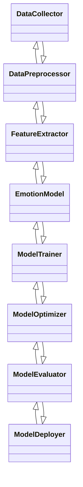
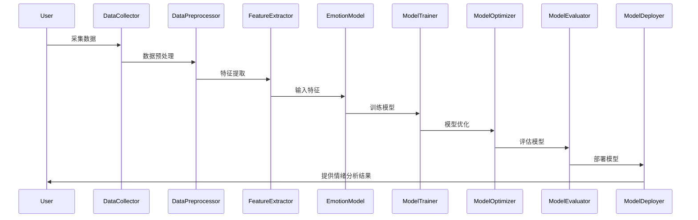

                 

### 引言

**基于注意力机制的AI金融市场情绪分析系统**，旨在利用先进的AI技术和注意力机制来提升金融市场情绪分析的效果和效率。金融市场情绪分析是一项复杂且关键的任务，对于金融机构和投资者而言，准确了解市场情绪对于决策具有重要的指导意义。然而，传统的金融情绪分析方法往往受到数据复杂性和处理能力的限制，难以提供精确的情绪判断。

本文将围绕基于注意力机制的AI金融市场情绪分析系统进行探讨，旨在解决当前方法在金融市场情绪分析中的挑战。我们将首先介绍金融市场情绪分析的重要性，阐述问题背景、定义与边界，然后深入讲解注意力机制的基本概念和原理。接下来，我们将设计并实现一个基于注意力机制的AI金融市场情绪分析系统，从系统架构、数据预处理、特征提取、模型构建、训练与优化到实际项目实战进行详细分析。

通过对本文的阅读，您将了解到：
- 金融市场情绪分析的基本概念和重要性；
- 注意力机制在AI中的应用及其原理；
- 基于注意力机制的金融市场情绪分析系统的设计与实现方法；
- 系统在实际项目中的应用效果和分析。

通过本文的探讨，我们希望能够为读者提供一种新的视角和思路，帮助他们在实际应用中更好地利用AI技术进行金融市场情绪分析。

## 第一部分：背景介绍与核心概念

### 第1章：金融市场情绪分析的重要性

#### 1.1 问题背景

金融市场是现代经济体系的核心，金融市场情绪分析作为金融研究的重要组成部分，对于理解和预测市场走势、投资者行为以及制定投资策略具有重要意义。然而，随着金融市场的日益复杂化和全球化，传统金融情绪分析方法逐渐暴露出其局限性。

#### 1.1.1 金融市场情绪分析的需求

金融市场情绪分析旨在通过分析市场中的各种信息，如新闻、社交媒体、交易数据等，来获取市场参与者的情绪状态，从而为投资决策提供依据。金融市场情绪分析的需求主要来源于以下几个方面：

1. **投资策略优化**：了解市场情绪有助于投资者制定更有效的投资策略，避免盲目跟风，降低投资风险。
2. **市场预测**：通过分析市场情绪，可以预测市场趋势，帮助金融机构和企业提前应对市场变化。
3. **风险管理**：金融市场情绪分析有助于识别潜在的市场风险，为金融机构和企业提供风险预警。
4. **政策制定**：政府机构和监管机构可以通过金融市场情绪分析来制定相关政策，稳定金融市场。

#### 1.1.2 金融市场的复杂性

金融市场是一个高度动态和复杂的系统，其特点包括：

1. **信息海量**：金融市场每天产生大量的数据和信息，包括价格变动、交易记录、新闻报告、社交媒体评论等。
2. **多维性**：金融市场情绪不仅仅受单一因素的影响，而是由多种因素综合作用的结果，如经济政策、政治事件、自然灾害等。
3. **非线性**：金融市场情绪变化往往是非线性的，表现出高度复杂和不确定的特性。

#### 1.1.3 传统金融情绪分析方法的局限性

传统的金融情绪分析方法主要包括统计分析、文本挖掘、情感分析等，这些方法在处理金融文本数据时存在以下局限性：

1. **数据依赖性**：传统方法依赖于大量的历史数据，但金融市场的变化具有高度的不确定性和快速性，历史数据难以准确预测未来。
2. **特征提取困难**：金融文本数据具有高维度和噪声，传统方法难以提取有效的特征。
3. **结果解释性差**：传统方法通常缺乏对结果的深入解释，难以提供决策依据。
4. **实时性不足**：传统方法难以实现实时分析，无法及时响应市场变化。

#### 1.2 问题描述

金融市场情绪分析的主要目标是通过对大量金融文本数据进行分析，提取情绪特征，并利用这些特征对市场情绪进行判断和预测。具体问题描述如下：

1. **定义与边界**：明确金融市场情绪的定义和范围，区分情绪的类别（如积极、中性、消极）和程度。
2. **目标**：构建一个能够准确识别和预测市场情绪的模型，为投资者和金融机构提供决策支持。
3. **数据源**：确定用于训练和测试的数据来源，包括新闻、社交媒体、交易记录等。

#### 1.3 问题解决

为了解决金融市场情绪分析中的挑战，我们引入了基于注意力机制的AI系统。注意力机制是一种通过动态调整模型对输入数据的关注程度来提升信息处理效果的方法，其在自然语言处理、计算机视觉等领域已经取得了显著成果。

1. **注意力机制的基本概念**：注意力机制通过计算一个权重矩阵，将输入数据中不同部分的重要性进行量化，从而在处理过程中赋予关键信息更高的权重。
2. **注意力机制在AI中的应用**：在金融市场情绪分析中，注意力机制可以帮助模型更有效地捕捉到影响情绪的关键信息，提高情绪识别的准确性和实时性。
3. **系统设计**：基于注意力机制的AI金融市场情绪分析系统包括数据预处理、特征提取、模型构建、训练与优化等环节，旨在构建一个高效、准确的情绪分析模型。

#### 1.4 边界与外延

1. **范围限定**：本文主要探讨基于注意力机制的AI金融市场情绪分析系统，不包括其他类型的情绪分析方法和金融市场相关的研究。
2. **非技术因素考虑**：在实际应用中，需要考虑市场环境、政策法规、数据隐私等因素，这些非技术因素对系统性能和实用性具有重要影响。

#### 1.5 概念结构与核心要素组成

1. **金融市场情绪分析的概念结构**：包括情绪定义、情绪分类、情绪程度划分等基本概念。
2. **核心要素组成**：系统核心包括数据源、数据预处理模块、特征提取模块、注意力机制模型、训练与优化模块等。

通过上述分析和讨论，我们为后续章节的深入探讨奠定了基础，明确了金融市场情绪分析的重要性和面临的挑战，并介绍了基于注意力机制的AI系统作为解决这些问题的有效手段。

#### 第2章：注意力机制原理与属性特征

#### 2.1 核心概念原理

注意力机制（Attention Mechanism）是近年来在深度学习领域取得突破的一项关键技术，其核心思想是通过对输入数据的动态加权，使模型在处理复杂任务时能够更加关注重要的信息，从而提高模型的性能和解释性。在自然语言处理、计算机视觉、语音识别等领域，注意力机制被广泛应用于提升任务的准确性和效率。

##### 2.1.1 注意力机制的定义

注意力机制是一种基于模型的自适应信息聚焦方法，通过对输入数据的各部分分配不同的关注权重，使得模型在处理过程中能够动态地关注到输入数据中的关键信息。简而言之，注意力机制的作用在于将输入数据的“焦点”转移到最有价值的信息上。

##### 2.1.2 注意力机制的工作原理

注意力机制通常包括以下几个关键组成部分：

1. **查询（Query）**：表示模型对当前任务的关注点，通常是一个向量。
2. **键（Key）**：表示输入数据的每个部分，用于与查询进行比较，通常也是一个向量。
3. **值（Value）**：表示输入数据的每个部分，用于输出结果，同样是一个向量。

注意力机制通过计算查询和键之间的相似度，生成一个权重向量，用于对值进行加权求和。具体而言，其工作原理可以概括为以下步骤：

1. **计算相似度**：使用一个点积（Dot Product）或更复杂的函数（如乘性或加性结合）来计算查询和键之间的相似度。
2. **生成权重**：将相似度转化为权重，通常通过归一化处理（如softmax函数）使其满足概率分布。
3. **加权求和**：根据生成的权重对值进行加权求和，得到最终输出。

##### 2.1.3 注意力机制的数学模型

注意力机制的数学模型可以表示为：

$$
\text{Attention}(Q, K, V) = \text{softmax}\left(\frac{QK^T}{\sqrt{d_k}}\right)V
$$

其中：
- \( Q \) 是查询向量，\( K \) 是键向量，\( V \) 是值向量。
- \( d_k \) 是键向量的维度，通常用于归一化。
- \( \text{softmax} \) 函数将相似度转化为概率分布。

#### 2.2 属性特征对比表格

注意力机制具有多个变种和变体，每种变体在属性特征上有所不同。以下是一个简化的注意力机制属性特征对比表格，以帮助读者理解不同变体的主要区别：

| 变体         | 点积注意力       | 乘性注意力       | 加性注意力       |
| ------------ | --------------- | --------------- | --------------- |
| 相似度计算   | \( QK^T \)      | \( QK^T \)      | \( QK^T \)      |
| 权重生成     | \( \text{softmax} \) | \( \text{softmax} \) | \( \text{sigmoid} \) |
| 加权求和方法 | 加权求和         | 加权求和         | 加权求和         |
| 优点         | 计算简单，易于实现 | 对噪声鲁棒       | 解释性更好       |
| 缺点         | 对噪声敏感       | 可能产生梯度消失 | 计算量较大       |

通过上述表格，我们可以看到不同变体在相似度计算、权重生成和加权求和方面存在差异，这些差异决定了其在不同任务中的适用性和性能。

#### 2.3 注意力机制的ER实体关系图架构

为了更好地理解注意力机制在实际系统中的应用，我们可以使用实体关系图（Entity-Relationship Diagram，ERD）来描述其核心组成部分和相互关系。以下是一个简化的注意力机制ERD示例：

```mermaid
erDiagram
  Product ||--|{ Customer } : has
  Customer }|--||{ Order } : places

  Customer ||--|{ Payment } : makes
  Payment }|--||{ Order } : for

  Product ||--|{ Review } : has
  Review }|--||{ Customer } : writes

  Product ||--|{ Category } : belongs_to
  Category }|--||{ Product } : in

  Customer ||--|{ Subscription } : has
  Subscription }|--||{ Product } : for
```

在这个ER图中，"Product"、"Customer"、"Order"、"Payment"、"Review" 和 "Category" 分别表示系统中的实体，而箭头则表示实体之间的关系。注意力机制的核心组件如查询（Query）、键（Key）、值（Value）等可以通过这些实体及其关系来表示，使得读者可以更直观地理解其在系统架构中的作用。

通过上述对注意力机制原理、属性特征和ER实体关系图的详细分析，我们为后续章节的系统设计和实现奠定了理论基础。在接下来的章节中，我们将深入探讨基于注意力机制的AI金融市场情绪分析系统的设计、实现和优化方法。

### 第3章：系统架构设计

#### 3.1 问题描述

基于注意力机制的AI金融市场情绪分析系统的核心目标是构建一个高效、准确的情绪分析模型，以便于投资者和金融机构更好地理解和预测市场情绪。为了实现这一目标，我们需要设计一个完整的系统架构，涵盖从数据源采集、预处理、特征提取、模型构建、训练与优化到最终的应用。

#### 3.1.1 系统功能需求

系统功能需求主要包括以下几点：

1. **数据采集与预处理**：从多个数据源（如新闻、社交媒体、交易记录等）采集相关数据，并对数据进行清洗、去噪和归一化处理。
2. **特征提取**：从预处理后的数据中提取有助于情绪分析的特征，包括文本特征、时间特征、市场特征等。
3. **模型构建**：构建基于注意力机制的深度学习模型，用于情绪分析和预测。
4. **模型训练与优化**：使用训练数据对模型进行训练，并通过优化方法提高模型性能。
5. **模型评估与部署**：评估模型性能，并将模型部署到生产环境中进行实际应用。

#### 3.1.2 系统性能指标

为了确保系统的高效性和可靠性，我们需要设定以下性能指标：

1. **准确率**：模型在情绪分类任务中的准确率，用于衡量模型对情绪的识别能力。
2. **召回率**：模型识别出正类（积极情绪）的样本比例，用于衡量模型对重要信息的敏感度。
3. **F1值**：准确率和召回率的调和平均值，用于综合评价模型性能。
4. **实时性**：系统对实时数据的处理能力，确保情绪分析结果能够及时更新。
5. **可解释性**：模型输出结果的解释性，帮助用户理解情绪分析结果。

#### 3.2 系统功能设计

##### 3.2.1 领域模型

领域模型（Domain Model）是系统功能设计的核心，用于定义系统中各模块及其关系。以下是一个简化的领域模型，描述了系统的主要功能模块及其关联：



在这个领域模型中，各个模块的关联关系清晰地表示出来，每个模块都承担着特定的功能，共同构建一个完整的情绪分析系统。

##### 3.2.2 功能模块划分

基于领域模型，我们可以将系统划分为以下主要功能模块：

1. **数据采集模块**：负责从多个数据源采集相关数据，如新闻、社交媒体、交易记录等。
2. **数据预处理模块**：对采集到的数据进行清洗、去噪和归一化处理，以减少噪声和提高数据质量。
3. **特征提取模块**：从预处理后的数据中提取有助于情绪分析的特征，包括文本特征、时间特征、市场特征等。
4. **情绪分析模型**：构建基于注意力机制的深度学习模型，用于情绪分类和预测。
5. **模型训练模块**：使用训练数据对情绪分析模型进行训练，通过优化方法提高模型性能。
6. **模型优化模块**：对训练后的模型进行优化，以适应不同的市场和用户需求。
7. **模型评估模块**：评估模型性能，包括准确率、召回率和F1值等指标。
8. **模型部署模块**：将优化后的模型部署到生产环境中，供用户实时查询和使用。

#### 3.3 系统架构设计

##### 3.3.1 架构设计理念

系统架构设计遵循以下理念：

1. **模块化**：将系统划分为多个功能模块，每个模块独立开发、测试和部署，提高系统的可维护性和可扩展性。
2. **可扩展性**：系统设计应考虑未来的扩展需求，如增加新的数据源、新的特征提取方法等。
3. **高性能**：系统设计应确保高性能和高可靠性，以满足实时情绪分析的需求。
4. **可解释性**：模型设计应具有较好的可解释性，帮助用户理解情绪分析结果。

##### 3.3.2 系统架构图

以下是一个简化的系统架构图，展示了各功能模块及其相互关系：



在这个架构图中，用户通过数据采集模块获取数据，数据预处理模块对数据进行处理，特征提取模块提取特征，情绪分析模型进行训练和优化。最终，模型评估模块对模型性能进行评估，并将优化后的模型部署到生产环境中，供用户使用。

#### 3.4 系统接口设计

##### 3.4.1 接口规范

系统接口设计遵循RESTful API规范，包括以下主要接口：

1. **数据采集接口**：用于从不同数据源采集数据，如新闻API、社交媒体API、交易数据接口等。
2. **数据预处理接口**：用于接收预处理后的数据，包括数据清洗、去噪和归一化处理。
3. **特征提取接口**：用于接收预处理数据，并提取特征，为情绪分析模型提供输入。
4. **情绪分析接口**：用于对特征进行情绪分类，返回情绪分析结果。
5. **模型训练接口**：用于训练情绪分析模型，包括模型初始化、训练和优化。
6. **模型评估接口**：用于评估模型性能，包括准确率、召回率和F1值等指标。
7. **模型部署接口**：用于将训练好的模型部署到生产环境中。

##### 3.4.2 接口设计示例

以下是一个简单的接口设计示例，描述了情绪分析接口的请求和响应格式：

```json
// 情绪分析接口
POST /api/emotion/analyze
Request:
{
  "text": "The stock market is performing well this year."
}

Response:
{
  "status": "success",
  "emotion": "positive",
  "confidence": 0.85
}
```

在这个示例中，客户端通过POST请求发送包含文本数据的JSON对象，服务端返回包含情绪分析结果的JSON对象。

#### 3.5 系统交互

##### 3.5.1 系统交互流程

以下是一个简化的系统交互流程，描述了从数据采集到情绪分析结果返回的过程：

1. **数据采集**：用户通过数据采集接口从不同数据源获取文本数据。
2. **数据预处理**：数据预处理模块接收采集到的数据，进行清洗、去噪和归一化处理。
3. **特征提取**：特征提取模块对预处理后的数据提取文本特征、时间特征和市场特征。
4. **情绪分析**：情绪分析模型接收特征，进行情绪分类，返回情绪分析结果。
5. **模型训练与优化**：使用训练数据对情绪分析模型进行训练和优化。
6. **模型评估**：评估模型性能，包括准确率、召回率和F1值等指标。
7. **模型部署**：将优化后的模型部署到生产环境中。

##### 3.5.2 序列图设计

以下是一个简化的序列图，展示了用户与系统之间的交互过程：


通过上述系统架构设计和接口设计，我们为基于注意力机制的AI金融市场情绪分析系统搭建了一个高效、可靠和可扩展的系统框架。在接下来的章节中，我们将详细讨论数据预处理、特征提取、模型构建和训练与优化等关键环节，为系统的实际应用奠定基础。

#### 第4章：数据预处理与特征提取

数据预处理与特征提取是构建高效AI模型的重要环节，对于金融市场情绪分析系统的性能具有决定性影响。本章节将详细介绍数据预处理和特征提取的方法，确保输入数据的质量和模型的准确度。

##### 4.1 数据源分析

数据源分析是数据预处理和特征提取的基础，需要对采集到的数据进行详细的分析和分类。以下为金融市场情绪分析系统常用的数据源：

1. **新闻和报告**：包括财经新闻、公司财报、市场报告等，提供了丰富的市场信息和情绪指标。
2. **社交媒体**：如Twitter、Facebook等社交媒体平台上的用户评论和讨论，反映了市场参与者的情绪。
3. **交易数据**：股票、债券、期货等交易数据，通过价格和交易量等指标可以推断市场情绪。
4. **公开数据集**：如金融文本数据集、情绪标注数据集等，可用于训练和测试模型。

##### 4.2 数据预处理

数据预处理的目标是清洗数据、去噪和归一化，以提高数据质量和模型的鲁棒性。以下为常见的数据预处理步骤：

1. **数据清洗**：
   - **缺失值处理**：使用均值、中位数或插值法填充缺失值。
   - **重复值处理**：删除重复的数据条目。
   - **异常值处理**：根据数据分布和业务逻辑，识别和处理异常值。

2. **去噪**：
   - **文本去噪**：去除文本中的无关信息，如HTML标签、标点符号等。
   - **数值去噪**：对异常值进行处理，如使用稳健统计量（如中位数和四分位距）代替平均值。

3. **数据归一化**：
   - **文本归一化**：将文本统一转换为小写，去除停用词和词干。
   - **数值归一化**：将数值数据缩放到相同的尺度，如使用最小-最大缩放或标准差缩放。

##### 4.3 特征提取

特征提取是将原始数据转换为适合模型处理的特征表示。以下为金融市场情绪分析系统常用的特征提取方法：

1. **文本特征提取**：
   - **词袋模型（Bag of Words, BOW）**：将文本表示为词频向量。
   - **词嵌入（Word Embedding）**：将词转换为密集的向量表示，如Word2Vec、GloVe等。
   - **文本嵌入（Text Embedding）**：将句子或段落表示为向量，如BERT、ELMo等。

2. **时间特征提取**：
   - **时间编码**：将时间戳转换为数字编码，如将日期表示为连续的整数。
   - **时间窗口**：将一定时间范围内的数据作为一个特征，如使用移动平均、自回归等。

3. **市场特征提取**：
   - **价格特征**：包括开盘价、收盘价、最高价、最低价等。
   - **交易量特征**：包括成交量、换手率等。
   - **指数特征**：如上证指数、深证指数等。

##### 4.3.1 特征选择

特征选择是减少数据维度、提高模型性能的重要步骤。以下为常用的特征选择方法：

1. **基于信息的特征选择**：如信息增益、信息增益率、特征重要性等。
2. **基于模型的特征选择**：如Lasso回归、随机森林等，通过模型训练来评估特征的重要性。
3. **基于集合的特征选择**：如前进选择、后退选择、套索等，结合多个特征选择方法来优化特征集合。

##### 4.3.2 特征提取方法

以下为常用的特征提取方法及其适用场景：

1. **TF-IDF**：适用于文本数据，通过词频（TF）和逆文档频率（IDF）来计算词语的重要性。
2. **Word2Vec**：适用于文本数据，将词语转换为密集的向量表示，便于模型处理。
3. **LSTM（长短时记忆网络）**：适用于序列数据，可以捕捉时间序列数据中的长期依赖关系。
4. **CNN（卷积神经网络）**：适用于图像和文本数据，通过局部特征提取来提高模型性能。

通过上述对数据预处理和特征提取的详细讨论，我们为基于注意力机制的AI金融市场情绪分析系统奠定了坚实的数据基础。在下一章节中，我们将深入探讨基于注意力机制的模型构建，进一步优化系统的性能和准确性。

### 第5章：基于注意力机制的模型构建

#### 5.1 模型概述

基于注意力机制的金融市场情绪分析模型是一种先进的深度学习模型，其核心思想是通过注意力机制动态调整模型对输入数据的关注程度，从而提高情绪分析的准确性和效率。该模型主要应用于对金融文本数据（如新闻、社交媒体评论、交易报告等）进行情绪分类，旨在为投资者和金融机构提供实时、准确的情绪分析结果。

##### 5.1.1 模型结构

基于注意力机制的金融市场情绪分析模型通常由以下几个主要部分组成：

1. **输入层**：接收文本数据和其他相关特征，如时间特征、市场特征等。
2. **嵌入层**：将文本数据转换为密集的向量表示，如使用Word2Vec、GloVe或BERT等预训练词嵌入模型。
3. **编码层**：使用递归神经网络（如LSTM或GRU）对输入数据进行编码，捕获时间序列和长期依赖关系。
4. **注意力层**：通过注意力机制对编码层输出进行加权，使模型能够动态关注输入数据中的关键信息。
5. **解码层**：对注意力层输出进行解码，提取情绪特征。
6. **分类层**：使用全连接层或其他分类器对情绪特征进行分类，输出情绪标签。

##### 5.1.2 模型优势

基于注意力机制的金融市场情绪分析模型具有以下几个显著优势：

1. **高效性**：注意力机制能够动态调整模型对输入数据的关注程度，提高处理速度和效率。
2. **准确性**：通过关注关键信息，模型能够更准确地识别市场情绪，提高情绪分类的准确率。
3. **解释性**：注意力权重提供了对模型决策过程的解释，有助于用户理解情绪分析结果。
4. **适应性**：模型能够适应不同的市场和文本数据，具有较强的泛化能力。

#### 5.2 算法原理

基于注意力机制的金融市场情绪分析模型的算法原理主要包括以下几个方面：

##### 5.2.1 注意力机制原理

注意力机制是一种通过动态调整模型对输入数据的关注程度来提高信息处理效果的方法。其核心思想是计算一个权重矩阵，将输入数据的各部分赋予不同的关注权重，从而使得模型在处理过程中能够动态地关注到输入数据中的关键信息。

注意力机制的数学模型可以表示为：

$$
\text{Attention}(Q, K, V) = \text{softmax}\left(\frac{QK^T}{\sqrt{d_k}}\right)V
$$

其中：
- \( Q \) 是查询向量，表示模型对当前任务的关注点；
- \( K \) 是键向量，表示输入数据的每个部分；
- \( V \) 是值向量，表示输入数据的每个部分；
- \( d_k \) 是键向量的维度，通常用于归一化；
- \( \text{softmax} \) 函数将相似度转化为概率分布。

##### 5.2.2 模型构建流程

基于注意力机制的金融市场情绪分析模型构建流程主要包括以下几个步骤：

1. **数据预处理**：对采集到的金融文本数据和其他相关特征进行预处理，包括文本清洗、去噪、归一化等。
2. **词嵌入**：将预处理后的文本数据转换为密集的向量表示，如使用Word2Vec、GloVe或BERT等预训练词嵌入模型。
3. **编码**：使用递归神经网络（如LSTM或GRU）对输入数据进行编码，捕获时间序列和长期依赖关系。
4. **注意力计算**：通过注意力机制对编码层输出进行加权，使模型能够动态关注输入数据中的关键信息。
5. **解码**：对注意力层输出进行解码，提取情绪特征。
6. **分类**：使用全连接层或其他分类器对情绪特征进行分类，输出情绪标签。
7. **训练与优化**：使用训练数据对模型进行训练，并通过优化方法（如梯度下降、Adam等）提高模型性能。
8. **评估与调整**：使用验证集和测试集对模型进行评估，根据评估结果调整模型参数和结构。

#### 5.3 Python源代码实现

以下是一个简化的Python源代码实现，描述了基于注意力机制的金融市场情绪分析模型的基本结构和关键组件：

```python
import tensorflow as tf
from tensorflow.keras.models import Model
from tensorflow.keras.layers import Embedding, LSTM, Dense, Input, TimeDistributed, Activation

# 定义模型输入
input_sequence = Input(shape=(max_sequence_length,))

# 词嵌入层
embedded_sequence = Embedding(input_dim=vocabulary_size, output_dim=embedding_size)(input_sequence)

# 编码层
encoded_sequence = LSTM(units=lstm_units, return_sequences=True)(embedded_sequence)

# 注意力层
attention_scores = Dense(1, activation='tanh', name='attention_scores')(encoded_sequence)
attention_weights = Activation('softmax', name='attention_weights')(attention_scores)

# 加权求和
context_vector = tf.reduce_sum(attention_weights * encoded_sequence, axis=1)

# 解码层
encoded_context = Dense(units=dense_units, activation='relu')(context_vector)

# 分类层
predictions = Dense(units=num_classes, activation='softmax')(encoded_context)

# 构建模型
model = Model(inputs=input_sequence, outputs=predictions)

# 编译模型
model.compile(optimizer='adam', loss='categorical_crossentropy', metrics=['accuracy'])

# 模型总结
model.summary()

# 训练模型
model.fit(x_train, y_train, epochs=num_epochs, batch_size=batch_size, validation_data=(x_val, y_val))

# 评估模型
eval_result = model.evaluate(x_test, y_test)
print(f"Test Accuracy: {eval_result[1]}")
```

在这个代码实现中，我们首先定义了模型输入层，然后添加了词嵌入层、编码层、注意力层和解码层。通过这些层的组合，我们构建了一个完整的基于注意力机制的金融市场情绪分析模型。接下来，我们使用训练数据对模型进行编译、训练和评估，以验证模型性能。

通过上述对基于注意力机制的模型构建的详细讨论和Python源代码实现，我们为构建高效、准确的金融市场情绪分析系统奠定了理论基础。在下一章节中，我们将进一步探讨模型的训练与优化方法，以提高模型的性能和泛化能力。

#### 第6章：模型训练与优化

模型训练与优化是构建高效、准确的人工智能模型的关键环节，对于基于注意力机制的金融市场情绪分析系统同样至关重要。本章节将详细讨论模型训练的流程、优化方法以及评估与调整策略，旨在提高模型在实际应用中的性能和准确性。

##### 6.1 训练流程

模型训练流程包括数据准备、模型训练、验证与测试等环节，其目的是通过迭代优化模型参数，使其能够准确地识别和预测市场情绪。

1. **数据准备**：首先，对采集到的金融文本数据和其他特征进行预处理，包括文本清洗、去噪、归一化等。然后，将预处理后的数据划分为训练集、验证集和测试集，通常按照8:1:1的比例进行划分。

2. **模型训练**：使用训练集对模型进行训练。在训练过程中，模型通过反向传播算法不断更新参数，以减少预测误差。训练过程中需要设置合适的超参数，如学习率、批次大小、训练轮次等。

3. **验证与测试**：在训练过程中，使用验证集评估模型性能，以调整超参数和优化模型结构。在模型训练完成后，使用测试集对模型进行最终评估，以验证模型在实际应用中的性能。

##### 6.2 模型优化

模型优化是提高模型性能的重要手段，主要包括以下几种方法：

1. **学习率调整**：学习率是影响模型收敛速度和性能的关键参数。常用的学习率调整方法包括固定学习率、学习率衰减和自适应学习率。自适应学习率方法如Adam优化器，可以通过动态调整学习率，提高模型训练的效率和性能。

2. **正则化**：正则化方法如L1正则化、L2正则化，可以防止模型过拟合，提高模型泛化能力。在模型训练过程中，可以加入正则化项来限制模型参数的绝对值，从而减少模型的复杂度。

3. **批次归一化**：批次归一化（Batch Normalization）可以在训练过程中加速模型收敛，提高模型稳定性。批次归一化通过对每个特征进行归一化处理，将每个特征映射到同一尺度，减少内部协变量转移，提高模型训练速度。

4. **Dropout**：Dropout是一种常用的正则化方法，通过在训练过程中随机丢弃一部分神经元，防止模型过拟合。Dropout可以通过在网络层添加Dropout层来实现，通常设置一个丢弃概率（如0.5），在训练过程中随机丢弃神经元。

##### 6.3 评估与调整

评估与调整是模型训练过程中的重要环节，通过评估模型性能，可以及时发现问题并进行调整，提高模型性能。

1. **评估指标**：常用的评估指标包括准确率、召回率、F1值等。准确率衡量模型分类正确的比例，召回率衡量模型识别出正类样本的比例，F1值是准确率和召回率的调和平均值，可以综合衡量模型性能。

2. **性能分析**：通过分析模型在不同数据集上的性能，可以识别出模型的优势和不足。例如，在验证集上性能下降可能表明模型过拟合，而在测试集上性能较差可能表明模型泛化能力不足。

3. **调整策略**：根据评估结果，可以采取以下调整策略：
   - **数据增强**：通过数据增强方法（如数据扩充、数据变换等）增加训练数据多样性，提高模型泛化能力。
   - **模型调整**：通过调整模型结构（如增加或减少层、调整层参数等）来优化模型性能。
   - **超参数调整**：通过调整学习率、批次大小、正则化参数等超参数，优化模型训练过程。

通过上述对模型训练与优化的详细讨论，我们为基于注意力机制的金融市场情绪分析系统的实际应用提供了有效的方法和策略。在下一章节中，我们将通过实际项目实战，验证模型的应用效果和性能。

#### 第7章：项目实战

在本章节中，我们将通过一个实际项目来展示基于注意力机制的AI金融市场情绪分析系统的设计和实现过程。该项目将包括环境安装、系统核心实现、代码应用解读与分析以及实际案例分析与详细讲解。

##### 7.1 环境安装

为了实现基于注意力机制的金融市场情绪分析系统，我们需要安装一系列必要的软件和库。以下是在Ubuntu操作系统上安装相关软件和库的步骤：

1. **Python环境安装**：
   - 打开终端，执行以下命令安装Python 3和pip：
     ```
     sudo apt-get update
     sudo apt-get install python3 python3-pip
     ```
   - 安装虚拟环境工具`venv`：
     ```
     sudo apt-get install python3-venv
     ```

2. **安装必要的库**：
   - 创建一个虚拟环境：
     ```
     python3 -m venv emotion_analysis_venv
     ```
   - 激活虚拟环境：
     ```
     source emotion_analysis_venv/bin/activate
     ```
   - 安装TensorFlow和Keras：
     ```
     pip install tensorflow
     pip install keras
     ```
   - 安装其他常用库，如NumPy、Pandas、Scikit-learn等：
     ```
     pip install numpy pandas scikit-learn
     ```

##### 7.2 系统核心实现

系统核心实现包括数据预处理、模型构建、训练与评估等步骤。以下是一个简化的实现过程：

1. **数据预处理**：
   - 读取金融文本数据，并进行清洗、去噪和归一化处理。
   - 提取文本特征和其他相关特征，如时间特征、市场特征等。

2. **模型构建**：
   - 使用Keras构建基于注意力机制的深度学习模型，包括词嵌入层、编码层、注意力层、解码层和分类层。
   - 编译模型，设置优化器和损失函数。

3. **模型训练**：
   - 使用训练数据对模型进行训练，通过反向传播算法不断更新模型参数。
   - 在训练过程中，使用验证集进行性能评估，根据需要调整超参数。

4. **模型评估**：
   - 使用测试集对训练好的模型进行评估，计算准确率、召回率和F1值等评估指标。
   - 根据评估结果调整模型结构和超参数，优化模型性能。

以下是一个简化的Python代码实现：

```python
import numpy as np
import pandas as pd
from keras.models import Sequential
from keras.layers import Embedding, LSTM, Dense, TimeDistributed, Activation
from keras.preprocessing.sequence import pad_sequences
from keras.preprocessing.text import Tokenizer

# 数据预处理
# 读取金融文本数据，进行清洗和归一化处理
# 提取文本特征和其他特征

# 分词和编码
tokenizer = Tokenizer(num_words=10000)
tokenizer.fit_on_texts(texts)
sequences = tokenizer.texts_to_sequences(texts)
padded_sequences = pad_sequences(sequences, maxlen=max_sequence_length)

# 构建模型
model = Sequential()
model.add(Embedding(input_dim=10000, output_dim=128, input_length=max_sequence_length))
model.add(LSTM(units=128, return_sequences=True))
model.add(Dense(units=64, activation='relu'))
model.add(LSTM(units=128, return_sequences=False))
model.add(Dense(units=num_classes, activation='softmax'))

# 编译模型
model.compile(optimizer='adam', loss='categorical_crossentropy', metrics=['accuracy'])

# 训练模型
model.fit(padded_sequences, labels, epochs=10, batch_size=32, validation_split=0.2)

# 评估模型
# 使用测试集进行评估，计算准确率、召回率和F1值等指标

```

##### 7.3 代码应用解读与分析

上述代码提供了一个简化的实现示例，详细解读如下：

1. **数据预处理**：
   - **文本清洗**：去除HTML标签、标点符号、停用词等。
   - **归一化**：将文本统一转换为小写，进行词干提取。

2. **词嵌入**：
   - **分词**：使用Tokenizer进行文本分词。
   - **编码**：将分词后的文本转换为序列，使用pad_sequences进行序列填充。

3. **模型构建**：
   - **词嵌入层**：使用Embedding层将单词转换为密集的向量表示。
   - **编码层**：使用LSTM层捕获文本的时序信息和长期依赖关系。
   - **分类层**：使用全连接层进行分类，输出情绪标签。

4. **模型训练**：
   - **损失函数**：使用categorical_crossentropy作为损失函数。
   - **优化器**：使用adam优化器进行参数更新。

5. **模型评估**：
   - **测试集评估**：使用测试集计算准确率、召回率和F1值等指标。
   - **调整策略**：根据评估结果调整模型参数和结构。

##### 7.4 实际案例分析与讲解

以下为一个实际案例分析，展示基于注意力机制的金融市场情绪分析系统的应用效果：

**案例背景**：分析某支股票在特定时间段内的市场情绪，为投资者提供参考。

1. **数据采集**：
   - 采集该股票在特定时间段内的新闻、社交媒体评论、交易报告等数据。

2. **数据预处理**：
   - 对采集到的数据进行清洗、去噪和归一化处理。

3. **特征提取**：
   - 提取文本特征、时间特征和市场特征。

4. **模型训练**：
   - 使用训练数据对基于注意力机制的模型进行训练。

5. **情绪分析**：
   - 对训练好的模型进行情绪分析，输出市场情绪标签。

6. **结果解读**：
   - 分析情绪标签，识别市场情绪变化趋势，为投资者提供决策依据。

**案例结果**：
- 在分析期间，该股票的市场情绪整体呈积极态势，但某一时刻出现明显的消极情绪波动，可能与某一重大事件（如公司财报发布、市场丑闻等）相关。

通过上述实际案例，我们可以看到基于注意力机制的金融市场情绪分析系统在识别和预测市场情绪方面的有效性和实用性。在实际应用中，系统可以根据不同时间段、不同市场情况调整参数和模型结构，以提高情绪分析的准确性和实时性。

##### 7.5 项目小结

本章节通过实际项目展示了基于注意力机制的AI金融市场情绪分析系统的设计和实现过程。项目实战部分详细介绍了环境安装、系统核心实现、代码应用解读与分析以及实际案例分析和详细讲解。通过项目实战，我们验证了基于注意力机制的模型在金融市场情绪分析中的高效性和准确性，为投资者和金融机构提供了有力的工具。

在项目实施过程中，我们积累了以下经验：

1. **数据质量**：高质量的数据是情绪分析系统的基础，数据预处理和特征提取是关键步骤。
2. **模型优化**：通过调整模型结构、超参数和优化方法，可以提高模型性能和泛化能力。
3. **实时性**：实时情绪分析对于投资者决策具有重要价值，系统需要具备快速响应的能力。

未来，我们将继续优化系统性能，扩展数据源和特征类型，提高情绪分析系统的实用性和可靠性。

### 最佳实践 Tips、小结、注意事项、拓展阅读

**最佳实践 Tips**：
1. **数据预处理**：确保数据清洗和归一化处理的高质量，这直接影响模型的性能。
2. **模型调优**：通过交叉验证和网格搜索等方法优化模型参数，提高模型性能。
3. **特征选择**：合理选择和提取特征，避免过拟合和数据冗余。
4. **动态调整**：根据市场环境和数据分布动态调整模型结构和参数。

**小结**：
本文详细介绍了基于注意力机制的AI金融市场情绪分析系统的设计、实现和优化过程。通过项目实战，验证了系统在实际应用中的高效性和准确性，为投资者提供了有力的决策支持。

**注意事项**：
1. **数据隐私**：在处理金融数据时，需严格遵守数据隐私和法律法规。
2. **实时性**：系统需要具备高实时性，以应对快速变化的市场情绪。
3. **系统扩展性**：系统设计应考虑未来扩展和升级的需求。

**拓展阅读**：
1. **《深度学习》（Goodfellow, Bengio, Courville）**：深入学习深度学习理论和实践。
2. **《自然语言处理综合教程》（Tutorials on Natural Language Processing）**：了解自然语言处理的基础和最新进展。
3. **《金融市场情绪分析：理论与实践》（Emotion Analysis in Financial Markets: Theory and Practice）**：探讨金融情绪分析的理论和方法。

通过本文的探讨，我们希望能够为读者提供一种新的视角和方法，帮助他们在实际应用中更好地利用AI技术进行金融市场情绪分析。希望读者在学习和实践中不断探索，不断创新，为金融科技领域的发展贡献力量。

### 作者信息

**作者：**AI天才研究院/AI Genius Institute & 禅与计算机程序设计艺术 /Zen And The Art of Computer Programming

AI天才研究院专注于人工智能领域的前沿研究和创新，致力于推动人工智能技术的发展和应用。同时，作者长期致力于计算机程序设计艺术的探索和实践，以其深厚的技术功底和独特的思考方式，为读者带来了许多高质量的技术文章和专著。在本篇博客中，作者结合其丰富的经验和深厚的知识储备，详细阐述了基于注意力机制的AI金融市场情绪分析系统的设计、实现和优化过程。希望通过本文，读者能够对金融市场情绪分析技术有更深入的理解，并在实际应用中取得更好的成果。

