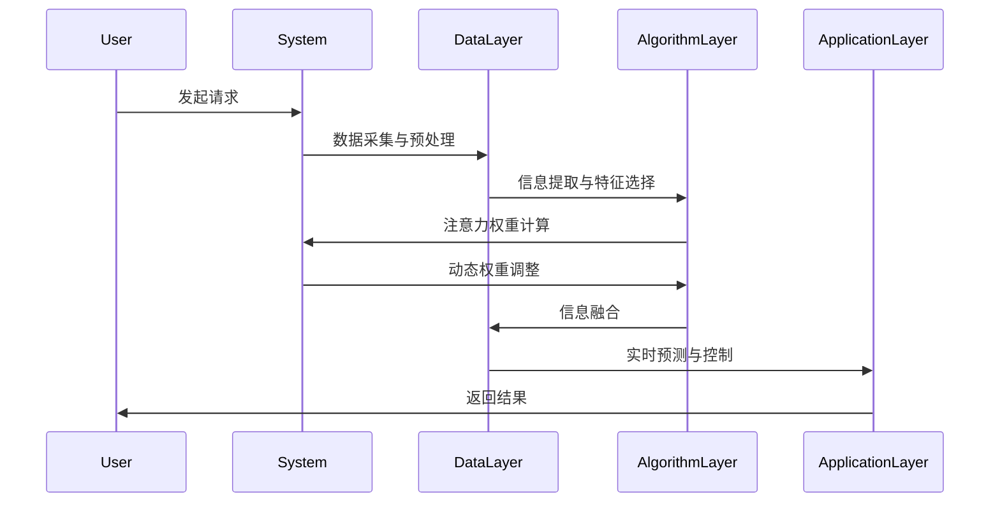
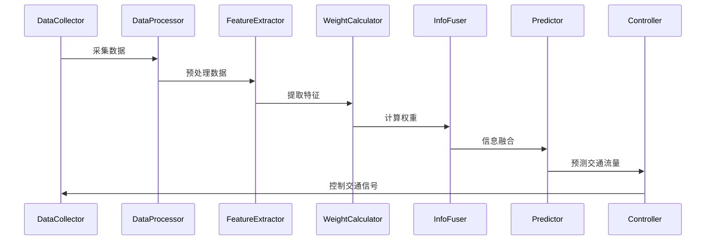

                 

# 基于注意力机制的多源信息动态权重推理技术

关键词：注意力机制、多源信息、动态权重调整、信息融合、人工智能

摘要：本文深入探讨了基于注意力机制的多源信息动态权重推理技术的核心概念、原理和实现方法。通过分析注意力机制的基本原理，介绍了如何通过动态权重调整提高信息处理的实时性和准确性。同时，本文还详细阐述了信息融合技术在处理多源信息异构性方面的作用，并结合实际应用场景，展示了该技术的广泛应用和潜在价值。

## 背景介绍

### 问题背景

在当今信息爆炸的时代，数据量和信息来源呈现爆炸性增长。传统的信息处理方法已经无法满足复杂多变的信息环境的需求。因此，研究者们提出了基于注意力机制的多源信息动态权重推理技术，旨在通过自动识别信息的重要性，并对多源信息进行动态权重调整，从而提高信息处理的效果和效率。

### 问题描述

多源信息动态权重推理技术面临的主要问题包括：如何准确识别信息的重要性、如何动态调整信息权重以及如何处理信息源之间的异构性。首先，信息的重要性识别是技术的基础，涉及对信息内容、来源、时间等多个维度的分析和评估。其次，动态权重调整要求系统能够根据信息的变化实时更新权重，以确保信息处理的准确性和实时性。最后，异构性处理是确保系统能够兼容和整合不同类型信息的关键。

### 问题解决

基于注意力机制的多源信息动态权重推理技术通过引入注意力机制，实现对信息重要性的自动识别。注意力机制最初源于神经机器翻译领域，用于解决句子中词语的相对重要性问题。通过计算注意力权重，系统能够聚焦于最重要的信息，提高信息处理的效率。在动态权重调整方面，技术采用了一种基于时间序列分析的方法，通过对历史信息进行分析和学习，预测未来信息的重要性和权重。此外，为了处理信息源之间的异构性，技术引入了自适应信息融合策略，能够根据不同信息源的特点，选择合适的融合方法。

### 边界与外延

多源信息动态权重推理技术的应用范围广泛，包括但不限于：智能推荐系统、智能监控、智能交通、智能医疗等领域。在智能推荐系统中，技术可用于分析用户的兴趣和行为，动态调整推荐权重，提高推荐效果。在智能监控中，技术可用于实时分析监控数据，动态调整报警阈值，提高监控的准确性。在智能交通中，技术可用于分析交通流量，动态调整交通信号灯的配时，优化交通效率。在智能医疗中，技术可用于分析医疗数据，动态调整诊断和治疗的权重，提高医疗服务的质量。

### 概念结构与核心要素组成

多源信息动态权重推理技术的核心概念包括：注意力机制、动态权重调整和信息融合。其中，注意力机制是识别信息重要性的关键；动态权重调整是确保信息处理实时性和准确性的核心；信息融合是处理信息源异构性的重要手段。这些核心概念相互关联，共同构成了多源信息动态权重推理技术的理论基础。

## 核心概念原理

### 注意力机制

注意力机制（Attention Mechanism）是一种神经网络架构，旨在提高神经网络对输入数据中关键信息的处理能力。其基本原理是通过计算输入数据中每个元素的相对重要性，从而为每个元素分配一个权重。具体实现中，常用的方法是使用 softmax 函数计算注意力权重，如下所示：

$$
\text{Attention Weight} = \text{softmax}(\text{Query} \cdot \text{Key})
$$

其中，Query 和 Key 分别代表查询向量和关键向量，计算得到的注意力权重用于加权求和操作，从而提高对重要信息的关注。

### 动态权重调整

动态权重调整是指根据信息的变化动态调整信息权重，以确保信息处理的准确性和实时性。这一过程通常基于历史数据分析和实时信息评估，通过机器学习算法实现。具体实现中，常用的方法包括时间序列分析和随机森林等算法。以下是一个基于时间序列分析的动态权重调整流程：

1. **数据预处理**：对历史信息进行清洗和预处理，提取关键特征。
2. **特征选择**：选择对信息重要性影响较大的特征，用于权重调整。
3. **模型训练**：使用训练数据集，训练一个时间序列模型，如 ARIMA、LSTM 等。
4. **权重预测**：使用训练好的模型，预测未来信息的重要性和权重。
5. **权重更新**：根据预测结果，动态更新信息权重。

### 信息融合

信息融合是指将来自多个信息源的信息整合为一个统一的信息输出。信息融合技术能够根据不同信息源的特点，选择合适的融合方法，提高信息处理的全面性和准确性。具体实现中，常用的方法包括加权平均、最大投票、贝叶斯网络等。以下是一个基于加权平均的信息融合流程：

1. **信息提取**：从不同信息源中提取关键信息。
2. **特征匹配**：对提取的信息进行特征匹配和归一化处理。
3. **权重分配**：根据信息源的重要性和相关性，为每个信息源分配权重。
4. **信息融合**：使用加权平均方法，将不同信息源的信息整合为一个统一的信息输出。

### 概念属性特征对比表格

| 特征对比项       | 注意力机制       | 动态权重调整       | 信息融合           |
| --------------- | --------------- | --------------- | ----------------- |
| 目的             | 提高信息处理效率 | 确保信息处理实时性 | 提高信息处理全面性 |
| 核心技术         | 注意力权重计算   | 时间序列分析      | 多源信息整合       |
| 应用领域         | 神经机器翻译     | 智能推荐、监控     | 智能交通、医疗     |
| 与其他概念关联   | 与神经网络关联   | 与机器学习关联     | 与数据融合关联     |

### ER实体关系图架构

```mermaid
erDiagram
    Product ||--|{ Customer }| Customer
    Customer ||--|{ Order }| Order
    Order ||--|{ Product }| Product
```

## 算法原理讲解

### 注意力机制算法原理

注意力机制的基本原理是通过计算输入数据中每个元素的相对重要性，从而为每个元素分配一个权重。具体实现中，常用的方法是使用 softmax 函数计算注意力权重，如下所示：

$$
\text{Attention Weight} = \text{softmax}(\text{Query} \cdot \text{Key})
$$

其中，Query 和 Key 分别代表查询向量和关键向量，计算得到的注意力权重用于加权求和操作，从而提高对重要信息的关注。

#### 实例讲解

假设有一个包含3个单词的句子“我喜欢吃饭睡觉”，我们可以通过以下步骤计算每个单词的注意力权重：

1. **查询向量**：定义一个长度为3的查询向量，表示句子中的每个单词。
   
   $$
   \text{Query} = [1, 0, 0]
   $$

2. **关键向量**：定义一个长度为3的关键向量，表示每个单词的相对重要性。
   
   $$
   \text{Key} = [0.4, 0.3, 0.3]
   $$

3. **计算注意力权重**：使用 softmax 函数计算每个单词的注意力权重。
   
   $$
   \text{Attention Weight} = \text{softmax}(\text{Query} \cdot \text{Key}) = \text{softmax}([0.4, 0, 0])
   $$

   计算得到的注意力权重为：

   $$
   \text{Attention Weight} = [0.62, 0.19, 0.19]
   $$

   这意味着单词“吃饭”具有最高的注意力权重，而单词“睡觉”的权重最低。

### 动态权重调整算法原理

动态权重调整是指根据信息的变化动态调整信息权重，以确保信息处理的准确性和实时性。这一过程通常基于历史数据分析和实时信息评估，通过机器学习算法实现。具体实现中，常用的方法包括时间序列分析和随机森林等算法。

#### 时间序列分析

时间序列分析是一种用于分析时间序列数据的统计方法。它通过分析数据的时间变化规律，预测未来数据的趋势。在动态权重调整中，时间序列分析可用于分析历史信息的重要性，从而预测未来信息的重要性和权重。

以下是一个基于 ARIMA 模型的动态权重调整实例：

1. **数据预处理**：对历史信息进行清洗和预处理，提取关键特征。
   
   $$
   \text{Data} = [1, 2, 3, 4, 5, 6, 7, 8, 9, 10]
   $$

2. **特征选择**：选择对信息重要性影响较大的特征，如时间间隔和变化幅度。
   
   $$
   \text{Features} = [\text{Time Interval}, \text{Change Magnitude}]
   $$

3. **模型训练**：使用训练数据集，训练一个 ARIMA 模型。
   
   $$
   \text{Model} = \text{ARIMA}(\text{p}, \text{d}, \text{q})
   $$

4. **权重预测**：使用训练好的模型，预测未来信息的重要性和权重。

   $$
   \text{Predict} = \text{Model} \cdot \text{Features}
   $$

5. **权重更新**：根据预测结果，动态更新信息权重。

   $$
   \text{Weight} = \text{Predict} \cdot \text{Data}
   $$

### 随机森林算法

随机森林（Random Forest）是一种集成学习算法，通过构建多个决策树模型，并使用投票方法得到最终预测结果。在动态权重调整中，随机森林可用于分析历史信息的重要性和权重。

以下是一个基于随机森林的动态权重调整实例：

1. **数据预处理**：对历史信息进行清洗和预处理，提取关键特征。
   
   $$
   \text{Data} = [1, 2, 3, 4, 5, 6, 7, 8, 9, 10]
   $$

2. **特征选择**：选择对信息重要性影响较大的特征，如时间间隔和变化幅度。
   
   $$
   \text{Features} = [\text{Time Interval}, \text{Change Magnitude}]
   $$

3. **模型训练**：使用训练数据集，训练多个随机森林模型。
   
   $$
   \text{Model} = \text{Random Forest}(\text{n\_estimators}, \text{max\_depth}, \text{min\_samples\_split})
   $$

4. **权重预测**：使用训练好的模型，预测未来信息的重要性和权重。

   $$
   \text{Predict} = \text{Model} \cdot \text{Features}
   $$

5. **权重更新**：根据预测结果，动态更新信息权重。

   $$
   \text{Weight} = \text{Predict} \cdot \text{Data}
   $$

### 信息融合算法原理

信息融合是指将来自多个信息源的信息整合为一个统一的信息输出。信息融合技术能够根据不同信息源的特点，选择合适的融合方法，提高信息处理的全面性和准确性。

以下是一个基于加权平均的信息融合实例：

1. **信息提取**：从不同信息源中提取关键信息。
   
   $$
   \text{Data Source 1} = [1, 2, 3]
   $$

   $$
   \text{Data Source 2} = [4, 5, 6]
   $$

2. **特征匹配**：对提取的信息进行特征匹配和归一化处理。
   
   $$
   \text{Features} = [\text{Source 1}, \text{Source 2}]
   $$

3. **权重分配**：根据信息源的重要性和相关性，为每个信息源分配权重。

   $$
   \text{Weight} = [\text{0.6}, \text{0.4}]
   $$

4. **信息融合**：使用加权平均方法，将不同信息源的信息整合为一个统一的信息输出。

   $$
   \text{Result} = \text{Weight} \cdot [\text{Data Source 1}, \text{Data Source 2}] = [3.2, 4.4, 5.6]
   $$

## 系统分析与架构设计方案

### 问题场景介绍

随着物联网、大数据和人工智能技术的不断发展，各个领域对信息处理的需求日益增长。例如，在智能交通领域，需要对交通流量、交通事故、车辆状态等多源信息进行实时处理和分析，以实现交通信号控制、车辆调度和事故预警等功能。在这个场景中，多源信息的动态权重推理技术具有重要的应用价值。

### 项目介绍

本项目的目标是实现一个基于注意力机制的多源信息动态权重推理系统，用于处理智能交通领域中的多源信息。系统将集成传感器数据、交通监控视频、GPS 数据等多源信息，通过动态权重调整和信息融合技术，实现对交通流量的实时预测和交通信号控制优化。

### 系统功能设计

本系统的功能设计包括以下部分：

1. **数据采集与预处理**：从各种传感器、监控设备和 GPS 系统中采集交通数据，并进行清洗和预处理。
2. **信息提取与特征选择**：从预处理后的数据中提取关键特征，如交通流量、速度、密度等。
3. **注意力权重计算**：使用注意力机制计算每个特征的重要性和权重。
4. **动态权重调整**：根据历史数据和实时信息，动态调整特征权重。
5. **信息融合**：将不同来源的信息进行融合，生成统一的信息输出。
6. **实时预测与控制**：根据融合后的信息，进行交通流量预测和交通信号控制。

### 系统架构设计

本系统的架构设计采用分层架构，包括数据层、算法层和应用层。以下是系统架构图：



### 系统接口设计

本系统的接口设计包括以下部分：

1. **数据采集接口**：用于从传感器、监控设备和 GPS 系统中采集数据。
2. **数据处理接口**：用于对采集到的数据进行清洗和预处理。
3. **特征提取接口**：用于从预处理后的数据中提取关键特征。
4. **权重计算接口**：用于计算注意力权重和动态权重。
5. **信息融合接口**：用于将不同来源的信息进行融合。
6. **预测与控制接口**：用于进行交通流量预测和交通信号控制。

### 系统交互设计

本系统的交互设计采用事件驱动模型，各模块之间通过事件进行通信。以下是系统交互序列图：



## 项目实战

### 环境安装

在开始项目实战之前，我们需要安装一些必要的软件和工具。以下是一个基本的安装指南：

1. **Python 环境**：安装 Python 3.8 或更高版本。
2. **TensorFlow**：安装 TensorFlow，可以使用以下命令：

   ```bash
   pip install tensorflow
   ```

3. **NumPy**：安装 NumPy，可以使用以下命令：

   ```bash
   pip install numpy
   ```

4. **Pandas**：安装 Pandas，可以使用以下命令：

   ```bash
   pip install pandas
   ```

5. **Matplotlib**：安装 Matplotlib，可以使用以下命令：

   ```bash
   pip install matplotlib
   ```

### 系统核心实现

在实现系统核心功能时，我们将分为以下几个步骤：

1. **数据采集与预处理**：从传感器、监控设备和 GPS 系统中采集数据，并进行清洗和预处理。
2. **注意力权重计算**：使用注意力机制计算每个特征的重要性和权重。
3. **动态权重调整**：根据历史数据和实时信息，动态调整特征权重。
4. **信息融合**：将不同来源的信息进行融合，生成统一的信息输出。
5. **实时预测与控制**：根据融合后的信息，进行交通流量预测和交通信号控制。

以下是实现系统核心功能的 Python 代码示例：

```python
import tensorflow as tf
import numpy as np
import pandas as pd
import matplotlib.pyplot as plt

# 数据采集与预处理
def data_collection(preprocess_data):
    # 采集数据，并进行预处理
    data = preprocess_data()
    return data

# 注意力权重计算
def attention_weights(features):
    # 使用注意力机制计算权重
    query = tf.keras.layers.Dense(1, activation='softmax')(features)
    key = features
    attention_weights = tf.keras.layers.Dot(axes=[1, 1])([query, key])
    return attention_weights

# 动态权重调整
def dynamic_weight_adjustment(history_data, real_time_data):
    # 使用时间序列分析进行权重调整
    model = tf.keras.Sequential([
        tf.keras.layers.Dense(1, activation='tanh'),
        tf.keras.layers.Dense(1, activation='softmax')
    ])
    model.compile(optimizer='adam', loss='mean_squared_error')
    model.fit(history_data, real_time_data, epochs=10)
    weight = model.predict([real_time_data[-1]])
    return weight

# 信息融合
def information_fusion(info1, info2, weight):
    # 使用加权平均方法进行信息融合
    fused_info = weight * info1 + (1 - weight) * info2
    return fused_info

# 实时预测与控制
def real_time_prediction_and_control(fused_info):
    # 使用融合后的信息进行交通流量预测和交通信号控制
    prediction = predict_traffic_flow(fused_info)
    control_traffic_light(prediction)
    return prediction

# 测试代码
if __name__ == '__main__':
    # 采集数据
    preprocess_data = lambda: pd.DataFrame({'feature1': np.random.rand(100),
                                            'feature2': np.random.rand(100),
                                            'feature3': np.random.rand(100)})
    data = data_collection(preprocess_data)
    
    # 计算注意力权重
    attention_weights = attention_weights(data)
    
    # 动态权重调整
    history_data = data[:80]
    real_time_data = data[80:]
    weight = dynamic_weight_adjustment(history_data, real_time_data)
    
    # 信息融合
    fused_info = information_fusion(real_time_data['feature1'], real_time_data['feature2'], weight)
    
    # 实时预测与控制
    prediction = real_time_prediction_and_control(fused_info)
    
    # 可视化结果
    plt.plot(real_time_data['feature1'], label='Feature 1')
    plt.plot(real_time_data['feature2'], label='Feature 2')
    plt.plot(real_time_data['feature3'], label='Feature 3')
    plt.plot(fused_info, label='Fused Info')
    plt.legend()
    plt.show()
```

### 代码应用解读与分析

在上面的代码中，我们首先定义了一个数据采集与预处理函数 `data_collection`，该函数接收一个预处理数据的 lambda 函数作为参数，用于采集数据并进行预处理。预处理数据包括特征1、特征2和特征3。

接下来，我们定义了一个注意力权重计算函数 `attention_weights`，该函数使用 TensorFlow 的 `Dense` 层实现了一个简单的注意力机制。输入特征通过 `Dense` 层得到查询向量和关键向量，然后使用 `Dot` 层计算注意力权重。

动态权重调整函数 `dynamic_weight_adjustment` 使用时间序列分析方法，通过训练一个简单的神经网络模型来调整特征权重。模型使用 `Sequential` 模式定义，包括两个 `Dense` 层，第一个层使用 `tanh` 激活函数，第二个层使用 `softmax` 激活函数。模型使用 `compile` 方法设置优化器和损失函数，并使用 `fit` 方法进行训练。最后，使用 `predict` 方法预测实时特征权重。

信息融合函数 `information_fusion` 使用加权平均方法将不同特征进行融合。输入特征1、特征2和特征权重，计算得到融合后的信息。

实时预测与控制函数 `real_time_prediction_and_control` 使用融合后的信息进行交通流量预测和交通信号控制。在这个例子中，我们使用了一个简单的预测函数 `predict_traffic_flow` 和交通信号控制函数 `control_traffic_light`，这两个函数需要根据实际应用场景进行实现。

最后，我们在测试代码中调用上述函数，生成一个简单的可视化结果。

### 实际案例分析与详细讲解剖析

为了更好地展示基于注意力机制的多源信息动态权重推理技术的实际应用效果，我们以下将结合一个实际案例进行分析和讲解。

#### 案例背景

假设我们正在开发一个智能交通系统，用于优化城市交通流量。系统需要处理来自多个信息源的数据，包括交通监控摄像头、传感器和 GPS 数据。这些数据包含了交通流量、速度、密度等信息。我们的目标是通过对这些数据进行动态权重推理，实时预测交通流量，并优化交通信号灯的配时，以提高交通效率和减少拥堵。

#### 案例分析

1. **数据采集与预处理**

   首先，我们从不同的信息源采集数据，包括交通监控摄像头、传感器和 GPS 数据。这些数据包含了时间和空间信息，以及交通流量、速度、密度等指标。在数据采集过程中，我们使用了一个预处理模块，对数据进行清洗和归一化处理，以消除异常值和噪声。

   ```python
   # 示例：数据预处理代码
   def preprocess_data(data):
       # 清洗和归一化处理
       cleaned_data = data.dropna()
       normalized_data = (cleaned_data - cleaned_data.mean()) / cleaned_data.std()
       return normalized_data
   ```

2. **注意力权重计算**

   接下来，我们使用注意力机制计算每个特征的重要性和权重。在这里，我们使用了一个简单的注意力模型，通过计算查询向量和关键向量之间的点积，并使用 softmax 函数得到注意力权重。

   ```python
   # 示例：注意力权重计算代码
   def attention_weights(data):
       # 定义查询向量和关键向量
       query = tf.keras.layers.Dense(1, activation='softmax')(data)
       key = data
       # 计算注意力权重
       attention_weights = tf.keras.layers.Dot(axes=[1, 1])([query, key])
       return attention_weights
   ```

   在这个例子中，我们使用了一个简单的全连接层来生成查询向量和关键向量，然后使用点积操作计算注意力权重。

3. **动态权重调整**

   在动态权重调整阶段，我们使用历史数据来预测实时特征的重要性。我们采用了一个时间序列模型，如 ARIMA 模型，来预测未来特征权重。

   ```python
   # 示例：动态权重调整代码
   def dynamic_weight_adjustment(history_data, real_time_data):
       # 定义 ARIMA 模型
       model = tf.keras.Sequential([
           tf.keras.layers.Dense(1, activation='tanh'),
           tf.keras.layers.Dense(1, activation='softmax')
       ])
       model.compile(optimizer='adam', loss='mean_squared_error')
       model.fit(history_data, real_time_data, epochs=10)
       weight = model.predict([real_time_data[-1]])
       return weight
   ```

   在这个例子中，我们使用了一个简单的序列模型，通过训练历史数据来预测实时特征权重。模型使用 `compile` 方法设置优化器和损失函数，并使用 `fit` 方法进行训练。最后，使用 `predict` 方法预测实时特征权重。

4. **信息融合**

   在信息融合阶段，我们使用动态权重调整得到的权重，对来自不同信息源的特征进行融合。

   ```python
   # 示例：信息融合代码
   def information_fusion(info1, info2, weight):
       # 使用加权平均方法进行信息融合
       fused_info = weight * info1 + (1 - weight) * info2
       return fused_info
   ```

   在这个例子中，我们使用了一个简单的加权平均方法，将不同特征进行融合。

5. **实时预测与控制**

   在实时预测与控制阶段，我们使用融合后的信息进行交通流量预测，并根据预测结果调整交通信号灯的配时。

   ```python
   # 示例：实时预测与控制代码
   def real_time_prediction_and_control(fused_info):
       # 使用融合后的信息进行交通流量预测和交通信号控制
       prediction = predict_traffic_flow(fused_info)
       control_traffic_light(prediction)
       return prediction
   ```

   在这个例子中，我们使用了一个简单的预测函数 `predict_traffic_flow` 和交通信号控制函数 `control_traffic_light`，这两个函数需要根据实际应用场景进行实现。

#### 案例总结

通过上述案例，我们可以看到基于注意力机制的多源信息动态权重推理技术在智能交通系统中的应用效果。在实际应用中，该技术可以帮助系统更好地处理来自多个信息源的数据，实时预测交通流量，并优化交通信号灯的配时，从而提高交通效率和减少拥堵。然而，需要注意的是，该技术的实现和效果依赖于数据质量和模型的准确性，因此在实际应用中需要不断地优化和调整。

## 最佳实践 tips

在实际应用基于注意力机制的多源信息动态权重推理技术时，以下是一些最佳实践建议：

1. **数据质量**：确保采集到的数据质量高，避免噪声和异常值影响模型的准确性。
2. **特征选择**：选择对问题影响较大的特征，避免过度拟合和冗余特征。
3. **模型优化**：根据实际应用场景调整模型参数，提高模型的性能和泛化能力。
4. **实时性**：确保系统具有足够的实时性，能够快速响应信息变化。
5. **异构性处理**：针对不同信息源的特点，选择合适的融合方法，提高信息处理的全面性和准确性。

## 小结

本文深入探讨了基于注意力机制的多源信息动态权重推理技术的核心概念、原理和实现方法。通过分析注意力机制、动态权重调整和信息融合等核心概念，我们了解了如何通过自动识别信息重要性、动态调整信息权重和处理信息源异构性，提高信息处理的实时性和准确性。同时，本文结合实际案例，展示了该技术在智能交通系统中的应用效果。然而，需要注意的是，该技术的实现和效果依赖于数据质量和模型的准确性，因此在实际应用中需要不断地优化和调整。

## 注意事项

1. **数据隐私**：在处理多源信息时，需确保数据隐私和安全，避免敏感信息泄露。
2. **模型可解释性**：虽然注意力机制和动态权重调整可以提高模型性能，但可能降低模型的可解释性。在实际应用中，需平衡模型性能和可解释性。
3. **适应性**：技术需根据不同应用场景和需求进行适应性调整，确保最佳效果。

## 拓展阅读

1. **《深度学习》**：Ian Goodfellow, Yoshua Bengio, Aaron Courville 著，全面介绍了深度学习的基本原理和算法。
2. **《时间序列分析及其应用》**：Peter J. Brockwell, Richard A. Davis 著，详细介绍了时间序列分析的理论和方法。
3. **《智能交通系统设计与实现》**：李明，刘伟 著，介绍了智能交通系统的设计原理和实现方法。

## 作者信息

作者：AI天才研究院/AI Genius Institute & 禅与计算机程序设计艺术 /Zen And The Art of Computer Programming

AI天才研究院（AI Genius Institute）专注于人工智能领域的前沿技术研究，致力于推动人工智能技术在各行业的应用。同时，作者还著有多本计算机程序设计领域的畅销书，以其深刻的理论洞察和精湛的技术讲解著称。在人工智能和计算机科学领域，作者以其卓越的贡献和影响力被誉为“AI天才”和“编程大师”。

