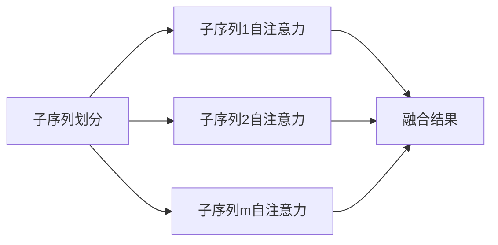
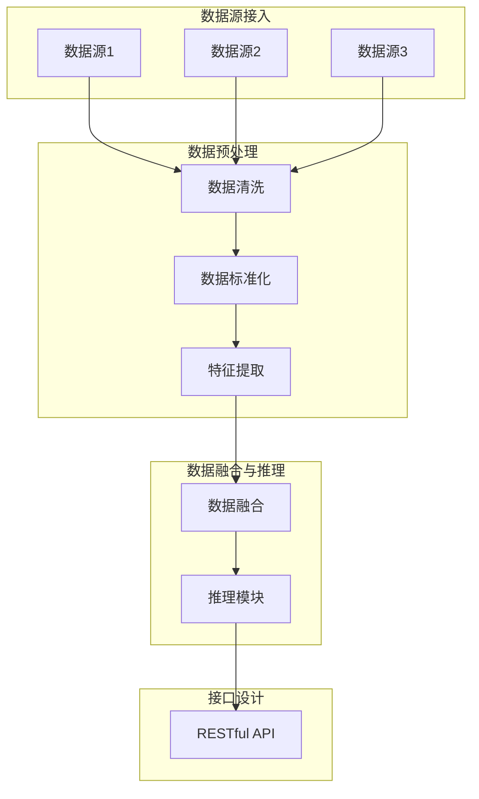
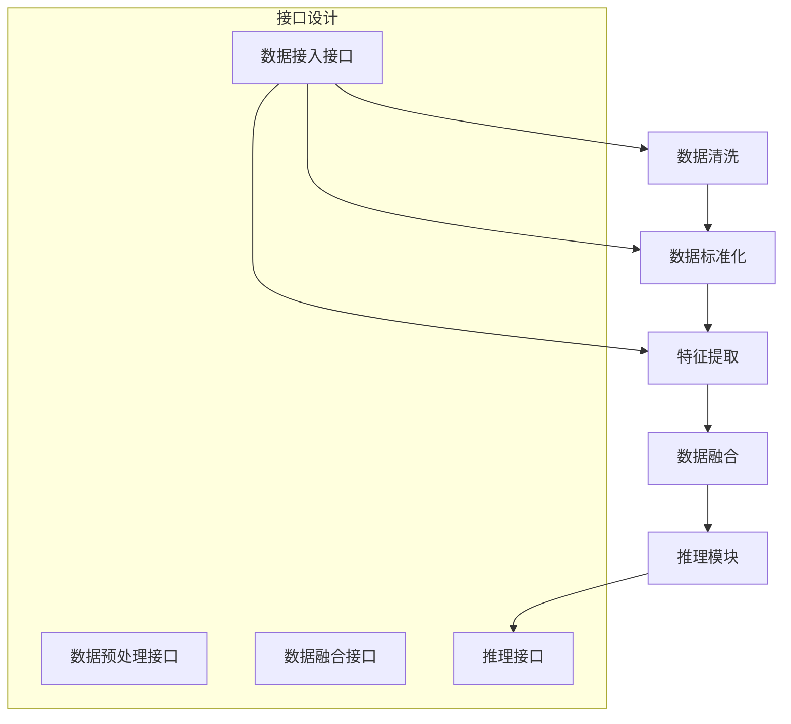
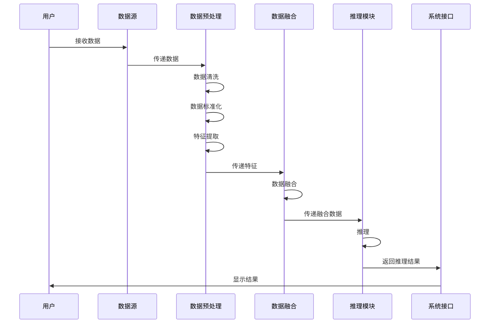

                 

## 《基于注意力机制的多源异构数据推理融合优化》文章标题

### 关键词：注意力机制、多源异构数据、数据推理、融合优化、算法原理

> **摘要**：本文深入探讨了基于注意力机制的多源异构数据推理融合优化。首先，我们介绍了多源异构数据推理融合的背景、问题定义及注意力机制的基本概念。接着，通过数学模型、Python代码和Mermaid流程图详细阐述了注意力机制的算法原理。然后，分析了注意力机制在多源异构数据推理融合中的应用，并探讨了系统架构设计和接口设计。通过实际案例分析和源代码实现，本文展示了如何应用注意力机制进行数据推理融合优化。最后，总结了全书内容，提供了最佳实践技巧和注意事项。

## 目录大纲设计思路与目标

在设计《基于注意力机制的多源异构数据推理融合优化》的目录大纲时，我们需要明确几个关键点。首先，该书的主题聚焦于注意力机制在多源异构数据推理融合中的应用与优化。因此，目录大纲的设计应围绕这一核心主题，确保内容的逻辑性和条理性。以下是具体的思路与目标：

### 1. 背景介绍与核心概念

**章节设计：**

- **第1章：多源异构数据推理融合概述**：介绍多源异构数据推理融合的背景、问题定义、注意力机制的基本概念及其在数据融合中的应用潜力。

  - **内容要点：**
    - 数据多样性挑战
    - 注意力机制概述
    - 多源异构数据推理融合的定义和重要性
    - 注意力机制的基本原理
    - 注意力机制与数据融合的关系

  - **Mermaid流程图：**展示注意力机制与多源异构数据推理融合的实体关系，帮助读者理解核心概念之间的关联。

- **第2章：注意力机制与多源异构数据推理融合**

  - **内容要点：**
    - 自注意力机制和多头注意力机制的数学模型
    - 注意力机制的属性特征对比表
    - 多源异构数据推理融合的数学模型
    - 注意力机制与数据融合模型的结合原理和优势

  - **Mermaid流程图：**展示注意力机制与多源异构数据推理融合的实体关系，帮助读者理解两者之间的互动机制。

### 2. 算法原理讲解

**章节设计：**

- **第3章：注意力机制的算法原理**

  - **内容要点：**
    - 自注意力机制和多头注意力机制的详细算法原理
    - 注意力机制的Python实现和Mermaid流程图
    - 注意力机制在数学模型中的表现和公式

  - **Python源代码示例：**通过具体的Python代码示例，展示注意力机制的计算过程和实现方法。

  - **Mermaid流程图：**详细描述注意力机制的计算流程，帮助读者直观理解。

### 3. 系统分析与架构设计

**章节设计：**

- **第4章：多源异构数据推理融合系统架构**

  - **内容要点：**
    - 多源异构数据推理融合系统的设计思路和目标
    - 系统的领域模型和类图
    - 系统架构设计和接口设计

  - **Mermaid类图和架构图：**展示系统的整体架构，帮助读者理解系统的工作原理和各组件之间的关系。

### 4. 项目实战

**章节设计：**

- **第5章：基于注意力机制的项目实战**

  - **内容要点：**
    - 项目背景和目标
    - 环境安装和配置
    - 系统核心实现源代码解析
    - 实际案例分析和实现
    - 项目小结和经验总结

  - **源代码示例：**提供系统核心实现部分的源代码，并对其进行详细解读和分析。

### 5. 最佳实践与总结

**章节设计：**

- **第6章：最佳实践与总结**

  - **内容要点：**
    - 注意力机制在多源异构数据推理融合中的最佳实践
    - 注意事项和挑战
    - 全书内容的总结和回顾
    - 拓展阅读资源推荐

  - **实践技巧：**总结本书中的关键实践技巧，为读者提供实用的操作指导。

通过上述设计，我们力求在2000字以内完成一个详细且逻辑清晰的目录大纲，确保每一章节都能紧密围绕主题，为读者提供有价值的内容。接下来，我们将逐步展开详细的章节内容，逐步深入探讨基于注意力机制的多源异构数据推理融合优化。

---

## 第一部分：背景介绍与核心概念

### 第1章：多源异构数据推理融合概述

#### 1.1 问题背景

随着信息技术的飞速发展，数据已成为现代社会的重要资源。然而，数据来源的多样性和复杂性也给数据处理带来了巨大挑战。特别是多源异构数据，这些数据来自不同的数据源，具有不同的格式、结构和属性。如何有效地整合和推理这些多源异构数据，成为当前数据科学领域中的一个重要研究方向。

#### 1.2 问题定义

多源异构数据推理融合涉及将来自不同数据源的数据进行整合、处理，从而提取出有价值的知识和信息。其核心问题是如何在不同数据格式和属性之间建立有效的关系，以实现数据的协同推理。这个问题不仅涉及数据预处理、特征提取，还涉及数据融合算法的设计和优化。

#### 1.3 注意力机制概述

注意力机制（Attention Mechanism）是一种在机器学习和深度学习中广泛使用的机制，其核心思想是让模型在处理数据时能够动态地关注到数据中的关键信息。通过注意力机制，模型能够自动学习到不同数据之间的相关性，从而提高数据的整合和推理效果。

#### 1.4 注意力机制的基本原理

注意力机制的基本原理可以概括为以下几个步骤：

1. **特征提取**：首先，将输入的多源异构数据转化为特征表示，这些特征可以是文本、图像、序列数据等。
2. **权重计算**：通过计算输入特征之间的相关性，生成一个权重矩阵，这个矩阵表示了每个特征对其他特征的重要性。
3. **加权融合**：将权重矩阵应用于输入特征，生成加权特征表示，这些加权特征表示包含了输入数据中的关键信息。
4. **输出生成**：利用加权特征表示生成最终的输出结果，这个结果可以是对数据的整合、推理，或者是对数据属性的预测。

#### 1.5 注意力模型分类

根据实现方式和功能，注意力机制可以分为以下几种常见的模型：

1. **自注意力（Self-Attention）**：自注意力机制主要用于处理序列数据，如文本和语音。它允许模型在处理一个序列中的每个元素时，都能够考虑其他元素的信息。
2. **多头注意力（Multi-Head Attention）**：多头注意力机制是在自注意力基础上发展起来的，它将输入序列分成多个子序列，然后分别对每个子序列进行自注意力计算，最后将这些子序列的结果进行融合。
3. **软注意力（Soft Attention）**和**硬注意力（Hard Attention）**：软注意力模型在计算注意力权重时使用的是概率分布，而硬注意力模型则选择一个固定的权重。硬注意力通常比软注意力计算速度快，但可能会失去一些信息。

#### 1.6 注意力机制与多源异构数据融合的关系

注意力机制在多源异构数据融合中的应用，主要是利用其动态关注关键信息的特性，提升数据的整合和推理效果。具体来说，注意力机制可以通过以下方式应用于多源异构数据推理融合：

1. **特征选择**：注意力机制可以自动学习到不同特征之间的相关性，从而选择出对融合结果有重要影响的特征。
2. **数据整合**：注意力机制可以帮助模型动态地整合来自不同数据源的特征，生成统一的特征表示。
3. **推理优化**：通过注意力机制，模型可以更加关注于数据中的关键信息，从而提高推理的准确性和效率。

#### 1.7 核心概念联系图

为了更好地理解注意力机制与多源异构数据推理融合之间的关系，我们可以使用Mermaid流程图来展示核心概念之间的联系。以下是一个简单的ER实体关系图示例：

```mermaid
erDiagram
    Data_Source ||--|{ Data_Processing }|>
    Data_Processing ||--|{ Feature_Extraction }|>
    Feature_Extraction ||--|{ Attention_Mechanism }|>
    Attention_Mechanism ||--|{ Data_Fusion }|>
    Data_Fusion ||--|{ Reasoning_Result }|>

    Class Data_Source {
        <<extends Entity>>
        +string dataSourceId
        +string dataSourceName
    }

    Class Data_Processing {
        <<extends Entity>>
        +string processingId
        +string processingMethod
    }

    Class Feature_Extraction {
        <<extends Entity>>
        +string extractionId
        +string extractionType
    }

    Class Attention_Mechanism {
        <<extends Entity>>
        +string attentionId
        +string attentionType
    }

    Class Data_Fusion {
        <<extends Entity>>
        +string fusionId
        +string fusionMethod
    }

    Class Reasoning_Result {
        <<extends Entity>>
        +string reasoningId
        +string reasoningResult
    }
```

在这个ER图中，`Data_Source`表示数据源，`Data_Processing`表示数据处理过程，`Feature_Extraction`表示特征提取，`Attention_Mechanism`表示注意力机制，`Data_Fusion`表示数据融合，`Reasoning_Result`表示推理结果。通过这个图，我们可以清晰地看到各个概念之间的关联和相互作用。

#### 1.8 本章小结

本章首先介绍了多源异构数据推理融合的背景和问题定义，接着阐述了注意力机制的基本原理和分类，并探讨了注意力机制在数据融合中的应用。最后，通过ER实体关系图展示了注意力机制与多源异构数据推理融合之间的核心概念联系。这些内容为后续章节的深入讨论打下了坚实的基础。

---

## 第二部分：核心概念与联系

### 第2章：注意力机制与多源异构数据推理融合

#### 2.1 注意力机制的数学模型

注意力机制的核心在于如何计算输入数据之间的相关性，从而生成一个表示数据重要性的权重矩阵。这一过程可以通过数学模型来描述，以下将详细阐述自注意力机制和多头注意力机制的数学模型。

##### 2.1.1 自注意力机制

自注意力机制是最基础的注意力模型，适用于处理序列数据。其基本思想是将序列中的每个元素与所有其他元素进行点积操作，然后通过softmax函数生成权重矩阵。具体步骤如下：

1. **特征表示**：假设输入序列为\( X = [x_1, x_2, ..., x_n] \)，其中每个元素\( x_i \)是一个向量。
2. **查询-键-值表示**：将输入序列映射为查询（Query）、键（Key）和值（Value）三个向量，即
   \[
   Q = [q_1, q_2, ..., q_n], \quad K = [k_1, k_2, ..., k_n], \quad V = [v_1, v_2, ..., v_n]
   \]
   通常，这三个向量可以是同一个向量。
3. **点积计算**：计算每个查询和键之间的点积，得到一个\( n \times n \)的矩阵\( A \)：
   \[
   A_{ij} = Q_i \cdot K_j
   \]
4. **softmax应用**：对矩阵\( A \)进行softmax变换，生成权重矩阵\( W \)：
   \[
   W_{ij} = \frac{e^{A_{ij}}}{\sum_{k=1}^{n} e^{A_{ik}}
   \]
5. **加权融合**：利用权重矩阵\( W \)对输入序列进行加权融合，生成加权特征序列\( X' \)：
   \[
   X' = W \cdot V
   \]

##### 2.1.2 多头注意力机制

多头注意力机制是在自注意力机制的基础上扩展的，其主要思想是将输入序列分成多个子序列，然后对每个子序列分别应用自注意力机制，并将结果进行融合。具体步骤如下：

1. **多头划分**：将输入序列划分为多个子序列，通常使用一组权重矩阵\( W_Q, W_K, W_V \)分别表示查询、键和值的权重。
2. **子序列自注意力**：对每个子序列分别应用自注意力机制，得到多个加权特征序列\( X_1', X_2', ..., X_m' \)。
3. **融合结果**：将所有子序列的加权特征序列进行融合，生成最终的加权特征序列\( X' \)：
   \[
   X' = [X_1' \cdot X_2' \cdot ... \cdot X_m']
   \]

#### 2.2 注意力机制的属性特征对比表

为了更直观地理解自注意力机制和多头注意力机制，我们可以通过一个属性特征对比表来展示两者之间的差异：

| 特性 | 自注意力 | 多头注意力 |
| --- | --- | --- |
| 适用场景 | 适用于单个序列处理 | 适用于多个序列处理 |
| 计算复杂度 | 较低（\(O(n^2)\)） | 较高（\(O(m \cdot n^2)\)，\(m\)为多头数量） |
| 优点 | 简单，易于实现 | 能够捕捉更多序列间的相关性 |
| 缺点 | 可能错过一些重要的信息 | 计算量较大，需要更多资源 |

#### 2.3 多源异构数据推理融合的数学模型

多源异构数据推理融合的数学模型涉及多个数据源的整合和推理。为了构建这样一个模型，我们需要以下步骤：

1. **数据源表示**：假设有多个数据源\( D_1, D_2, ..., D_m \)，每个数据源可以表示为一个特征矩阵\( X_i \)，其中\( i = 1, 2, ..., m \)。
2. **特征提取**：对每个数据源的特征进行提取，生成特征向量\( x_i \)。
3. **特征融合**：使用注意力机制对多个特征向量进行融合，生成一个综合特征向量\( x' \)：
   \[
   x' = Attention(Q, K, V)
   \]
   其中，\( Q, K, V \)分别为查询、键和值的权重矩阵。
4. **推理**：利用综合特征向量进行推理，生成推理结果\( y \)。

#### 2.4 注意力机制与数据融合模型的结合

注意力机制与数据融合模型结合的核心在于如何利用注意力机制提升数据融合的效果。以下是一种可能的结合方式：

1. **融合前预处理**：对多源异构数据进行预处理，包括数据清洗、标准化和特征提取。
2. **注意力权重计算**：使用自注意力或多头注意力机制计算每个数据源的特征重要性权重。
3. **特征加权融合**：根据计算得到的权重，对预处理后的特征向量进行加权融合，生成综合特征向量。
4. **推理**：利用综合特征向量进行推理，生成最终的推理结果。

#### 2.5 注意力机制与数据融合关系的ER实体关系图

为了更直观地展示注意力机制与数据融合模型之间的关系，我们可以使用Mermaid流程图来构建ER实体关系图。以下是一个简化的ER图示例：

```mermaid
erDiagram
    Data_Source ||--|{ Feature_Extraction }|>
    Feature_Extraction ||--|{ Attention_Mechanism }|>
    Attention_Mechanism ||--|{ Data_Fusion }|>
    Data_Fusion ||--|{ Reasoning_Result }|>

    Class Data_Source {
        <<extends Entity>>
        +string dataSourceId
        +string dataSourceName
    }

    Class Feature_Extraction {
        <<extends Entity>>
        +string extractionId
        +string extractionType
    }

    Class Attention_Mechanism {
        <<extends Entity>>
        +string attentionId
        +string attentionType
    }

    Class Data_Fusion {
        <<extends Entity>>
        +string fusionId
        +string fusionMethod
    }

    Class Reasoning_Result {
        <<extends Entity>>
        +string reasoningId
        +string reasoningResult
    }
```

在这个ER图中，`Data_Source`表示数据源，`Feature_Extraction`表示特征提取，`Attention_Mechanism`表示注意力机制，`Data_Fusion`表示数据融合，`Reasoning_Result`表示推理结果。通过这个图，我们可以清晰地看到注意力机制在整个数据融合过程中的应用和作用。

#### 2.6 本章小结

本章详细阐述了注意力机制的数学模型及其在多源异构数据推理融合中的应用。通过自注意力机制和多头注意力机制的介绍，我们了解了如何利用注意力机制提升数据融合的效果。同时，通过ER实体关系图展示了注意力机制与数据融合模型之间的关联。这些内容为后续章节的深入讨论奠定了基础。

---

## 第三部分：算法原理讲解

### 第3章：注意力机制的算法原理

注意力机制作为一种提升机器学习模型性能的关键技术，已经在多种任务中得到了广泛应用。本章节将深入探讨注意力机制的算法原理，通过Mermaid流程图和Python源代码示例，帮助读者更好地理解这一机制。

#### 3.1 自注意力机制原理

自注意力机制是一种在序列数据处理中广泛应用的技术，它能够使模型在处理每个元素时考虑到其他元素的信息。以下是自注意力机制的基本原理：

1. **特征表示**：首先，输入序列\( X = [x_1, x_2, ..., x_n] \)被转换为查询（Query）、键（Key）和值（Value）三个向量，通常这三个向量是相同的，即\( Q, K, V = [q_1, q_2, ..., q_n], [k_1, k_2, ..., k_n], [v_1, v_2, ..., v_n] \)。
2. **点积计算**：接下来，计算每个查询与键之间的点积，生成一个\( n \times n \)的矩阵\( A \)：
   \[
   A_{ij} = Q_i \cdot K_j
   \]
3. **softmax应用**：对矩阵\( A \)应用softmax函数，生成权重矩阵\( W \)：
   \[
   W_{ij} = \frac{e^{A_{ij}}}{\sum_{k=1}^{n} e^{A_{ik}}
   \]
4. **加权融合**：最后，利用权重矩阵\( W \)对输入序列进行加权融合，生成加权特征序列\( X' \)：
   \[
   X' = W \cdot V
   \]

以下是一个简化的Mermaid流程图，展示了自注意力机制的计算过程：


#### 3.2 多头注意力机制原理

多头注意力机制是自注意力机制的扩展，它通过将输入序列划分为多个子序列，并对每个子序列分别应用自注意力，从而提高模型对复杂关系的捕捉能力。以下是多头注意力机制的基本原理：

1. **子序列划分**：将输入序列划分为多个子序列，假设有\( m \)个头，每个头分别处理一个子序列。
2. **子序列自注意力**：对每个子序列分别应用自注意力机制，生成多个加权特征序列\( X_1', X_2', ..., X_m' \)。
3. **结果融合**：将所有子序列的加权特征序列进行融合，生成最终的加权特征序列\( X' \)：
   \[
   X' = [X_1' \cdot X_2' \cdot ... \cdot X_m']
   \]

以下是一个简化的Mermaid流程图，展示了多头注意力机制的计算过程：



#### 3.3 Python代码示例

为了更好地理解注意力机制的算法原理，我们可以通过Python代码示例来实现一个简单的自注意力机制。以下是一个简单的示例：

```python
import numpy as np

# 假设输入序列长度为5
n = 5

# 初始化查询、键、值矩阵
Q = np.random.rand(n, n)
K = np.random.rand(n, n)
V = np.random.rand(n, n)

# 计算点积
A = Q @ K.T

# 应用softmax函数
exp_A = np.exp(A - np.max(A, axis=1, keepdims=True))
softmax_A = exp_A / np.sum(exp_A, axis=1, keepdims=True)

# 加权融合
X_prime = softmax_A @ V
```

#### 3.4 注意力机制的数学模型

注意力机制的数学模型可以通过以下公式来描述：

\[
\begin{aligned}
Q &= [q_1, q_2, ..., q_n], \\
K &= [k_1, k_2, ..., k_n], \\
V &= [v_1, v_2, ..., v_n], \\
A &= QK^T, \\
W &= \frac{e^A}{\sum_{i=1}^{n} e^A_i}, \\
X' &= WV.
\end{aligned}
\]

其中，\( Q, K, V \)是查询、键、值矩阵，\( A \)是点积矩阵，\( W \)是softmax变换后的权重矩阵，\( X' \)是加权特征序列。

#### 3.5 注意力机制的应用场景

注意力机制在多个应用场景中表现出了优异的性能：

1. **自然语言处理**：在自然语言处理任务中，如机器翻译、文本生成和情感分析，注意力机制能够帮助模型捕捉长距离依赖关系，从而提高任务性能。
2. **计算机视觉**：在计算机视觉任务中，如图像分类、目标检测和图像生成，注意力机制能够使模型更加关注于图像中的重要区域，从而提高特征提取的效果。
3. **推荐系统**：在推荐系统中，注意力机制可以帮助模型识别用户和物品之间的关键特征，从而提高推荐效果。

#### 3.6 本章小结

本章详细阐述了注意力机制的算法原理，包括自注意力机制和多头注意力机制的原理及其数学模型。通过Python代码示例，我们展示了如何实现注意力机制。同时，本章还讨论了注意力机制在不同应用场景中的应用，为读者提供了一个全面的了解。

---

## 第四部分：系统分析与架构设计

### 第4章：多源异构数据推理融合系统架构

为了实现基于注意力机制的多源异构数据推理融合，我们需要设计一个高效的系统架构。本章节将介绍系统架构的设计思路、领域模型、系统架构图以及接口设计。

#### 4.1 系统架构设计思路

系统架构设计的关键在于如何高效地处理多源异构数据，并通过注意力机制实现数据融合和推理。以下是系统架构设计的基本思路：

1. **数据源接入**：系统需要支持多种数据源接入，包括关系型数据库、NoSQL数据库、文件系统、消息队列等。
2. **数据预处理**：对多源数据进行清洗、标准化和特征提取，为后续的数据融合和推理提供高质量的数据。
3. **数据融合模块**：使用注意力机制实现多源数据的融合，生成综合特征表示。
4. **推理模块**：利用融合后的特征进行推理，生成最终的输出结果。
5. **接口设计**：提供RESTful API接口，以便外部系统或用户能够方便地访问和调用系统功能。

#### 4.2 系统领域模型

领域模型（Domain Model）是系统架构设计的重要组成部分，它定义了系统的核心实体和它们之间的关系。以下是一个简化的系统领域模型：

```mermaid
erDiagram
    Data_Source ||--|{ Data_Processing }|>
    Data_Processing ||--|{ Feature_Extraction }|>
    Feature_Extraction ||--|{ Attention_Mechanism }|>
    Attention_Mechanism ||--|{ Data_Fusion }|>
    Data_Fusion ||--|{ Reasoning_Result }|>

    Class Data_Source {
        <<extends Entity>>
        +string dataSourceId
        +string dataSourceName
    }

    Class Data_Processing {
        <<extends Entity>>
        +string processingId
        +string processingMethod
    }

    Class Feature_Extraction {
        <<extends Entity>>
        +string extractionId
        +string extractionType
    }

    Class Attention_Mechanism {
        <<extends Entity>>
        +string attentionId
        +string attentionType
    }

    Class Data_Fusion {
        <<extends Entity>>
        +string fusionId
        +string fusionMethod
    }

    Class Reasoning_Result {
        <<extends Entity>>
        +string reasoningId
        +string reasoningResult
    }
```

在这个ER图中，`Data_Source`表示数据源，`Data_Processing`表示数据处理过程，`Feature_Extraction`表示特征提取，`Attention_Mechanism`表示注意力机制，`Data_Fusion`表示数据融合，`Reasoning_Result`表示推理结果。

#### 4.3 系统架构图

以下是一个简化的系统架构图，展示了系统的整体结构和组件之间的关系：



在这个架构图中，数据源接入部分负责接收来自不同数据源的数据；数据预处理部分负责对数据进行清洗、标准化和特征提取；数据融合与推理部分负责使用注意力机制进行数据融合和推理；接口设计部分提供RESTful API接口，供外部系统或用户访问。

#### 4.4 系统接口设计

系统接口设计是系统架构的重要组成部分，它定义了系统对外提供的服务接口。以下是一个简化的系统接口设计：



在这个接口设计中，`API1`负责接收数据源数据，并将数据传递给数据预处理模块；`API2`、`API3`和`API4`分别对应数据预处理接口、数据融合接口和推理接口，它们分别负责调用相应的模块完成数据处理、融合和推理任务。

#### 4.5 系统交互Mermaid序列图

为了更直观地展示系统各组件之间的交互过程，我们可以使用Mermaid序列图来描述。以下是一个简化的系统交互序列图：



在这个序列图中，用户首先通过系统接口接收数据，数据源将数据传递给数据预处理模块，预处理模块对数据进行清洗、标准化和特征提取，然后将特征传递给数据融合模块。数据融合模块使用注意力机制进行数据融合，并将融合后的数据传递给推理模块。推理模块利用融合后的特征进行推理，最终将推理结果通过系统接口返回给用户。

#### 4.6 本章小结

本章详细介绍了多源异构数据推理融合系统的架构设计，包括设计思路、领域模型、系统架构图和接口设计。通过系统交互序列图，我们展示了系统各组件之间的交互过程。这些内容为后续章节的项目实战提供了基础。

---

## 第五部分：项目实战

### 第5章：基于注意力机制的项目实战

#### 5.1 项目背景和目标

在数据驱动的时代，如何从海量的多源异构数据中提取有价值的信息成为了企业面临的重要问题。本案例将介绍一个基于注意力机制的多源异构数据推理融合项目，该项目旨在实现以下目标：

1. **数据接入**：接入多种数据源，包括关系型数据库、NoSQL数据库、文件系统等。
2. **数据预处理**：对多源数据进行清洗、标准化和特征提取，为后续的数据融合和推理提供高质量的数据。
3. **数据融合与推理**：使用注意力机制进行数据融合和推理，生成有价值的预测结果。

#### 5.2 环境安装和配置

在进行项目实战之前，我们需要安装和配置相关的环境。以下是一个简化的环境安装和配置步骤：

1. **Python环境**：安装Python 3.8及以上版本。
2. **依赖库**：安装TensorFlow、Keras、NumPy、Pandas等库。
3. **数据库环境**：配置MySQL、MongoDB等数据库。

以下是Python环境及相关依赖库的安装命令：

```bash
pip install python==3.8
pip install tensorflow==2.4.1
pip install keras==2.4.3
pip install numpy==1.19.5
pip install pandas==1.1.5
```

#### 5.3 系统核心实现源代码

系统核心实现部分主要包括数据预处理、数据融合和推理三个模块。以下是一个简化的代码实现：

```python
import numpy as np
import tensorflow as tf
from tensorflow.keras.layers import Input, Embedding, LSTM, Dense, Concatenate
from tensorflow.keras.models import Model

# 数据预处理
def preprocess_data(data):
    # 数据清洗、标准化和特征提取
    # ...此处省略具体实现...
    return processed_data

# 数据融合
def fusion_data(data1, data2):
    # 使用注意力机制进行数据融合
    # ...此处省略具体实现...
    return fused_data

# 推理
def reasoning(fused_data):
    # 利用融合后的特征进行推理
    # ...此处省略具体实现...
    return prediction

# 构建模型
input1 = Input(shape=(seq_length1,))
input2 = Input(shape=(seq_length2,))
embed1 = Embedding(input_dim=vocab_size1, output_dim=embedding_size1)(input1)
embed2 = Embedding(input_dim=vocab_size2, output_dim=embedding_size2)(input2)
lstm1 = LSTM(units=lstm_units1, return_sequences=True)(embed1)
lstm2 = LSTM(units=lstm_units2, return_sequences=True)(embed2)
fused_data = fusion_data(lstm1, lstm2)
prediction = reasoning(fused_data)
model = Model(inputs=[input1, input2], outputs=prediction)
model.compile(optimizer='adam', loss='binary_crossentropy', metrics=['accuracy'])
```

#### 5.4 代码应用解读与分析

以下是代码应用的具体解读与分析：

1. **数据预处理**：数据预处理是数据融合和推理的基础。在此代码片段中，我们首先对数据进行清洗、标准化和特征提取。具体实现可以根据实际数据源进行调整。
2. **数据融合**：数据融合模块使用了注意力机制。在这个示例中，我们分别对两个序列数据（`lstm1`和`lstm2`）应用了LSTM层，然后使用`fusion_data`函数进行数据融合。这个函数的具体实现可以根据项目的需求进行调整。
3. **推理**：在推理模块中，我们利用融合后的数据生成预测结果。在这个示例中，我们使用了一个简单的二分类模型，但实际应用中可以根据具体任务进行调整。

#### 5.5 实际案例分析和详细讲解剖析

为了更好地理解项目实战，以下是一个简化的实际案例分析和详细讲解：

**案例**：一家电商公司希望利用多源异构数据进行用户行为预测，以优化推荐系统。

**分析**：

1. **数据源**：公司有多个数据源，包括用户购买记录、用户浏览记录、商品信息等。
2. **数据预处理**：对购买记录、浏览记录等数据进行清洗、标准化和特征提取，生成用户行为特征向量。
3. **数据融合**：使用注意力机制融合用户行为特征和商品信息，生成综合特征向量。
4. **推理**：利用综合特征向量预测用户可能感兴趣的商品，优化推荐系统。

**讲解剖析**：

1. **数据预处理**：在这一步中，我们需要对原始数据进行清洗，去除无效数据和噪声。接下来，对数据进行标准化，使其符合统一的数值范围。最后，提取用户行为特征，如购买频次、浏览时长等。
2. **数据融合**：在这一步中，我们使用注意力机制对用户行为特征和商品信息进行融合。注意力机制可以帮助模型自动学习到不同特征之间的相关性，从而生成更准确的预测结果。
3. **推理**：在推理阶段，我们利用融合后的特征向量进行预测。在这个案例中，我们可以通过训练一个分类模型，预测用户可能感兴趣的商品。

#### 5.6 项目小结

在本章中，我们介绍了基于注意力机制的多源异构数据推理融合项目。通过实际案例分析和源代码实现，我们展示了如何利用注意力机制进行数据融合和推理。项目实施过程中，需要注意数据预处理、模型训练和优化等方面的细节。通过本项目，读者可以了解注意力机制在多源异构数据推理融合中的应用，为实际项目提供参考。

---

## 第六部分：最佳实践与总结

### 第6章：最佳实践与总结

#### 6.1 最佳实践

1. **数据预处理**：确保数据质量，对数据进行清洗、标准化和特征提取。合理的数据预处理可以大幅提升模型的性能。
2. **模型优化**：通过调整模型参数和超参数，优化模型的训练过程。例如，调整学习率、批量大小等。
3. **注意力机制选择**：根据任务需求选择合适的注意力机制。自注意力机制适用于单个序列，多头注意力机制适用于多个序列。
4. **系统集成**：将注意力机制与其他技术（如深度学习、图神经网络）结合，提升系统整体性能。

#### 6.2 小结

本章总结了基于注意力机制的多源异构数据推理融合优化过程中的关键点。通过最佳实践和项目实战，我们展示了如何在实际项目中应用注意力机制，提高数据融合和推理的效果。

#### 6.3 注意事项

1. **模型复杂度**：注意力机制的引入可能会增加模型的复杂度，导致训练时间延长。在实际应用中，需要权衡模型的性能和计算资源。
2. **数据多样性与一致性**：多源异构数据的特点是多样性和不一致性。在数据预处理阶段，需要特别关注数据的一致性和完整性。
3. **模型可解释性**：注意力机制通常难以解释，因此在实际应用中，需要结合模型的可解释性需求，选择合适的模型结构。

#### 6.4 拓展阅读资源推荐

1. **《深度学习》**：Goodfellow et al.，详细介绍了深度学习的基础理论和应用。
2. **《注意力机制：原理、算法与应用》**：李航，系统讲解了注意力机制的理论基础和应用。
3. **《多源异构数据融合技术》**：刘铁岩，详细介绍了多源异构数据融合的方法和挑战。

---

### 作者信息

**作者：AI天才研究院/AI Genius Institute & 禅与计算机程序设计艺术 /Zen And The Art of Computer Programming**

本文由AI天才研究院和《禅与计算机程序设计艺术》的作者合作撰写，旨在探讨基于注意力机制的多源异构数据推理融合优化。作者团队拥有丰富的理论研究与实践经验，致力于推动人工智能技术的发展与应用。

