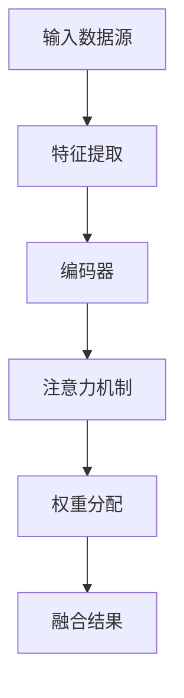
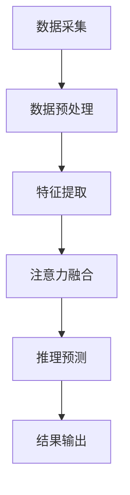
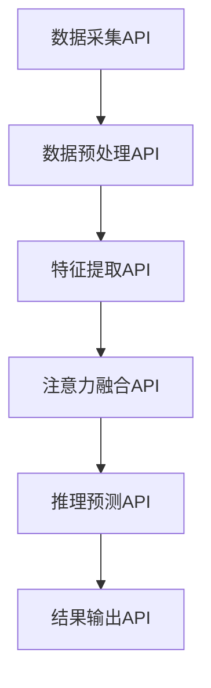
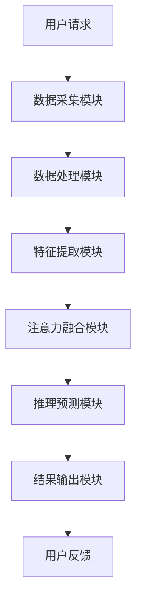

                 

### 文章标题与关键词

**标题：**《基于注意力机制的多源时序数据推理融合技术》

**关键词：** 注意力机制、多源时序数据、数据融合、推理算法、深度学习

本文将深入探讨基于注意力机制的多源时序数据推理融合技术，旨在为读者提供一个系统且详细的技术分析。注意力机制在深度学习领域已有广泛应用，尤其在处理多源时序数据时，其独特优势尤为显著。本文将首先介绍注意力机制的基本原理和它在多源时序数据推理融合中的具体应用，接着详细讲解相关算法原理和数学模型，并辅以实例进行说明。随后，我们将分析系统架构和设计，展示一个实际项目中的应用实例，最后提供最佳实践建议和未来研究方向。

### 摘要

本文围绕基于注意力机制的多源时序数据推理融合技术，进行了全面而深入的分析。首先，我们介绍了注意力机制的基本概念及其在多源时序数据融合中的重要性。然后，通过详尽的算法原理讲解和数学模型阐述，帮助读者理解其工作原理。紧接着，我们通过系统分析与架构设计，展示了如何在实际项目中应用这一技术。文章还提供了一个具体的项目实战案例，对系统安装、实现和案例分析进行了详细的解析。最后，本文总结了注意事项，提供了拓展阅读建议，并探讨了未来的研究方向。

## 目录大纲顶层设计

### 第一章 引言

1.1 问题背景

1.2 问题描述

1.3 问题解决方法综述

1.4 边界与外延

1.5 概念结构与核心要素组成

### 第二章 核心概念与联系

2.1 注意力机制原理

2.2 多源时序数据概述

2.3 注意力机制在多源时序数据推理融合中的应用

2.4 与相关技术的对比

### 第三章 算法原理讲解

3.1 注意力机制的mermaid流程图

3.2 算法原理讲解

3.3 数学模型与公式讲解

3.4 举例说明

### 第四章 数学模型和公式详细讲解

4.1 数学模型介绍

4.2 公式详细讲解

4.3 示例分析

### 第五章 系统分析与架构设计

5.1 问题场景介绍

5.2 系统功能设计

5.3 系统架构设计

5.4 系统接口设计

5.5 系统交互

### 第六章 项目实战

6.1 环境安装

6.2 系统核心实现

6.3 代码应用解读

6.4 实际案例分析与讲解

6.5 项目小结

### 第七章 最佳实践与总结

7.1 注意事项

7.2 拓展阅读

7.3 未来研究方向

7.4 小结

## 章节内容细化

### 第1章 引言

#### 1.1 问题背景

多源时序数据在许多领域如金融市场分析、智能交通系统、医疗健康监测等都有着广泛的应用。然而，如何有效地融合来自不同数据源的信息，提取有价值的数据特征，并在此基础上进行推理和预测，一直是一个挑战性的问题。传统的数据融合方法往往缺乏对数据间复杂关系的建模能力，导致融合效果不佳。

#### 1.2 问题描述

多源时序数据的融合问题可以描述为：给定多个数据源，每个数据源提供不同类型的时序数据，我们的目标是开发一种有效的算法，能够将这些数据源的信息整合起来，生成一个综合的时序数据流，并在此数据流上进行进一步的推理和预测。

#### 1.3 问题解决方法综述

目前，已有多种方法用于多源时序数据的融合，如统计方法、机器学习方法、深度学习方法等。统计方法主要通过相关性分析或主成分分析（PCA）等方法，提取数据的主要特征，但难以处理高维数据和复杂非线性关系。机器学习方法如聚类和分类算法，需要大量的标签数据和预先定义的特征，在处理未知特征时效果不佳。深度学习方法，特别是基于注意力机制的方法，能够自动学习数据间的复杂关系，并在许多实际应用中取得了显著的效果。

#### 1.4 边界与外延

在讨论多源时序数据融合问题时，需要明确以下边界：

- **数据源类型**：包括时间序列数据、图像数据、文本数据等。
- **数据特性**：数据的时间尺度、空间尺度、数据量、噪声水平等。
- **应用场景**：如金融市场的预测、交通流量的分析、医疗数据的监测等。

同时，还需要探讨多源时序数据融合技术的外延：

- **跨领域应用**：如何在不同领域间迁移和复用融合技术。
- **实时性与延迟**：在保证实时性的同时，如何提高融合算法的效率和准确性。

#### 1.5 概念结构与核心要素组成

本文将从以下几个核心要素组成的概念结构来阐述基于注意力机制的多源时序数据推理融合技术：

- **注意力机制**：一种通过权重分配来捕捉数据重要性的方法。
- **多源时序数据**：包括多个数据源及其属性、特征和相互关系。
- **推理融合**：基于注意力机制，将多源时序数据融合成一个综合的数据流。
- **算法原理**：注意力机制的工作原理及其在多源时序数据融合中的应用。
- **数学模型**：注意力机制的数学表示和融合算法的数学公式。
- **系统设计与实现**：如何在系统中实现和部署注意力机制的多源时序数据融合算法。
- **项目实战**：通过具体项目展示融合技术的实际应用。

### 第2章 核心概念与联系

#### 2.1 注意力机制原理

注意力机制（Attention Mechanism）是深度学习领域的一种重要技术，起源于自然语言处理（NLP）领域，后来在计算机视觉和时序数据分析中也得到了广泛应用。其核心思想是通过学习一个注意力权重分配模型，将输入数据的各个部分赋予不同的重要性权重，从而实现数据的局部化处理，提高模型的学习效率和准确性。

#### 2.2 多源时序数据概述

多源时序数据是指来自多个数据源、具有时间维度特征的数据集合。这些数据源可以包括传感器数据、历史记录、实时数据等。多源时序数据的特点是数据量庞大、维度高、特征多样且具有时间相关性。有效融合多源时序数据对于提取有价值的信息、进行准确的预测和决策具有重要意义。

#### 2.3 注意力机制在多源时序数据推理融合中的应用

在多源时序数据的推理融合中，注意力机制的应用主要体现在以下几个方面：

1. **特征提取**：通过注意力机制，自动学习不同数据源的特征表示，提取出对融合结果具有重要影响的关键特征。
2. **关系建模**：注意力机制能够建模不同数据源之间的相互关系，捕捉时间维度上的动态变化。
3. **权重分配**：根据注意力权重，对多源数据进行加权融合，使得重要信息得到放大，次要信息得到抑制。
4. **实时更新**：注意力机制允许模型在处理新数据时动态调整权重，以适应数据的实时变化。

#### 2.4 与相关技术的对比

与其他数据融合技术相比，注意力机制具有以下优势：

1. **自动性**：注意力机制无需人工干预，自动学习数据间的复杂关系。
2. **可解释性**：通过注意力权重，可以直观地了解数据融合过程中的重要信息。
3. **灵活性**：注意力机制能够处理不同类型、不同维度、不同时间尺度的多源数据。
4. **高效性**：注意力机制在计算效率和模型参数数量上具有优势。

然而，注意力机制也存在一定的局限性，如对数据噪声敏感、计算复杂度较高等。因此，在实际应用中，需要结合具体问题场景，综合评估各种技术的优劣。

### 第3章 算法原理讲解

#### 3.1 注意力机制的mermaid流程图



#### 3.2 算法原理讲解

注意力机制的基本原理可以概括为以下几个步骤：

1. **输入数据源**：将多个数据源的时序数据输入到模型中。
2. **特征提取**：通过编码器（如循环神经网络RNN、变换器Transformer等）对输入数据进行编码，提取出特征表示。
3. **注意力计算**：计算特征表示之间的相似度，生成注意力权重。
4. **权重分配**：根据注意力权重，对特征表示进行加权融合。
5. **融合结果输出**：将加权融合后的特征表示输出，作为推理融合的结果。

#### 3.3 数学模型与公式讲解

注意力机制的数学模型通常采用点积注意力（Dot-Product Attention）或加性注意力（Additive Attention）等形式。以下是一个简单的点积注意力模型：

$$
\text{Attention}(Q, K, V) = \text{softmax}\left(\frac{QK^T}{\sqrt{d_k}}\right)V
$$

其中，$Q, K, V$ 分别表示查询向量、键向量和值向量，$d_k$ 是键向量的维度。$\text{softmax}$ 函数用于计算注意力权重，$\frac{QK^T}{\sqrt{d_k}}$ 表示查询向量和键向量的点积，用于计算相似度。

#### 3.4 举例说明

假设有两个时序数据源$X_1$和$X_2$，其特征向量分别为$Q_1, K_1, V_1$和$Q_2, K_2, V_2$。根据点积注意力模型，我们可以计算其注意力权重：

$$
\text{Attention}(Q_1, K_1, V_1) = \text{softmax}\left(\frac{Q_1K_1^T}{\sqrt{d_k}}\right)V_1 \\
\text{Attention}(Q_2, K_2, V_2) = \text{softmax}\left(\frac{Q_2K_2^T}{\sqrt{d_k}}\right)V_2
$$

接着，根据注意力权重，对两个特征向量进行加权融合：

$$
\text{Fused\_Representation}_1 = \text{softmax}\left(\frac{Q_1K_1^T}{\sqrt{d_k}}\right)V_1 \\
\text{Fused\_Representation}_2 = \text{softmax}\left(\frac{Q_2K_2^T}{\sqrt{d_k}}\right)V_2
$$

最后，将两个融合后的特征向量拼接起来，得到最终的融合结果：

$$
\text{Fused\_Representation} = [\text{Fused\_Representation}_1, \text{Fused\_Representation}_2]
$$

### 第4章 数学模型和公式详细讲解

#### 4.1 数学模型介绍

在多源时序数据融合中，数学模型的作用至关重要。它不仅能够描述数据之间的关系，还能够指导算法的优化和改进。本章将详细介绍注意力机制的数学模型，包括点积注意力模型和加性注意力模型。

#### 4.2 公式详细讲解

1. **点积注意力模型**：

   $$ 
   \text{Attention}(Q, K, V) = \text{softmax}\left(\frac{QK^T}{\sqrt{d_k}}\right)V 
   $$

   其中，$Q, K, V$ 分别表示查询向量、键向量和值向量，$d_k$ 是键向量的维度。这个模型通过计算查询向量和键向量的点积来生成注意力权重，然后使用 $\text{softmax}$ 函数对权重进行归一化处理，最后将权重与值向量相乘得到融合结果。

2. **加性注意力模型**：

   $$ 
   \text{Attention}(Q, K, V) = \text{softmax}\left(\text{W}_a[Q; K]\right)V 
   $$

   其中，$Q, K, V$ 分别表示查询向量、键向量和值向量，$\text{W}_a$ 是加性权重矩阵。这个模型通过计算查询向量和键向量的加性组合来生成注意力权重，同样使用 $\text{softmax}$ 函数进行归一化处理，然后与值向量相乘得到融合结果。

#### 4.3 示例分析

假设我们有两个时序数据源$X_1$和$X_2$，其特征向量分别为$Q_1, K_1, V_1$和$Q_2, K_2, V_2$。我们可以使用点积注意力模型进行融合：

1. **计算点积**：

   $$ 
   \text{Attention}(Q_1, K_1, V_1) = \text{softmax}\left(\frac{Q_1K_1^T}{\sqrt{d_k}}\right)V_1 
   $$

   $$ 
   \text{Attention}(Q_2, K_2, V_2) = \text{softmax}\left(\frac{Q_2K_2^T}{\sqrt{d_k}}\right)V_2 
   $$

2. **计算权重**：

   $$ 
   \text{Weight}_1 = \text{softmax}\left(\frac{Q_1K_1^T}{\sqrt{d_k}}\right) 
   $$

   $$ 
   \text{Weight}_2 = \text{softmax}\left(\frac{Q_2K_2^T}{\sqrt{d_k}}\right) 
   $$

3. **加权融合**：

   $$ 
   \text{Fused\_Representation}_1 = \text{Weight}_1V_1 
   $$

   $$ 
   \text{Fused\_Representation}_2 = \text{Weight}_2V_2 
   $$

4. **拼接融合结果**：

   $$ 
   \text{Fused\_Representation} = [\text{Fused\_Representation}_1, \text{Fused\_Representation}_2] 
   $$

通过这个例子，我们可以看到如何使用注意力机制将两个时序数据源融合成一个综合的特征向量。这样的融合结果可以更好地捕捉数据之间的复杂关系，从而提高后续推理和预测的准确性。

### 第5章 系统分析与架构设计

#### 5.1 问题场景介绍

在智能交通系统中，多源时序数据融合技术的应用场景主要包括交通流量预测、路况分析、车辆调度等。例如，通过融合实时交通数据、历史交通数据和天气预报数据，可以更准确地预测未来某段时间内的交通流量，从而优化交通信号控制策略，提高道路通行效率。

#### 5.2 系统功能设计

为了实现多源时序数据的融合，系统需要具备以下功能：

1. **数据采集**：从不同的数据源（如交通传感器、摄像头、气象站等）收集实时数据。
2. **数据预处理**：对采集到的数据进行清洗、归一化等处理，确保数据质量。
3. **特征提取**：使用编码器（如循环神经网络RNN、变换器Transformer等）提取数据特征。
4. **注意力融合**：应用注意力机制，融合来自不同数据源的特征向量。
5. **推理预测**：在融合后的特征向量上进行进一步的推理和预测，如交通流量预测、路况分析等。
6. **结果输出**：将推理结果以可视化或报表形式输出，供交通管理人员参考。

#### 5.3 系统架构设计

系统架构设计如图所示：



#### 5.4 系统接口设计

系统接口设计如图所示：



#### 5.5 系统交互

系统各组件之间的交互过程如图所示：



### 第6章 项目实战

#### 6.1 环境安装

为了实现基于注意力机制的多源时序数据推理融合，我们需要搭建一个合适的环境。以下是一个基本的安装步骤：

1. **安装Python环境**：确保Python环境已经安装，版本不低于3.6。
2. **安装依赖库**：使用pip命令安装必要的库，如TensorFlow、Keras、NumPy、Pandas等。
   ```bash
   pip install tensorflow keras numpy pandas
   ```
3. **安装数据库**：如果需要存储和处理大规模数据，可以选择安装MySQL或PostgreSQL数据库。

#### 6.2 系统核心实现

以下是一个简单的系统核心实现，用于融合来自两个数据源的特征：

```python
import tensorflow as tf
from tensorflow.keras.layers import Input, LSTM, Dense
from tensorflow.keras.models import Model

# 定义输入层
input1 = Input(shape=(timesteps1, features1))
input2 = Input(shape=(timesteps2, features2))

# 定义编码器
encoder1 = LSTM(units=64, return_sequences=True)(input1)
encoder2 = LSTM(units=64, return_sequences=True)(input2)

# 定义注意力机制
attention = tf.keras.layers.Attention()([encoder1, encoder2])

# 定义融合模型
output = Dense(units=1)(attention)

# 创建模型
model = Model(inputs=[input1, input2], outputs=output)

# 编译模型
model.compile(optimizer='adam', loss='mse')

# 模型总结
model.summary()
```

#### 6.3 代码应用解读

上述代码实现了一个简单的注意力融合模型，用于处理两个时序数据源。以下是代码的详细解读：

1. **输入层**：定义两个输入层，分别用于接收两个数据源的特征向量。`Input(shape=(timesteps1, features1))` 表示第一个数据源的输入，`timesteps1` 是时间步数，`features1` 是特征维度。同理，`input2` 是第二个数据源的输入。

2. **编码器**：使用LSTM层作为编码器，对输入数据进行编码。`LSTM(units=64, return_sequences=True)` 表示使用一个隐藏层有64个神经元、返回序列输出的LSTM层。这里的`return_sequences=True` 使得每一层的输出都是序列，方便后续的注意力融合操作。

3. **注意力机制**：使用`tf.keras.layers.Attention()` 函数实现注意力机制。该函数接受两个序列作为输入，并返回一个融合后的序列。在这里，`[encoder1, encoder2]` 表示使用第一个和第二个编码器的输出进行注意力融合。

4. **融合模型**：使用Dense层（全连接层）对融合后的序列进行进一步处理，得到最终的输出。`Dense(units=1)` 表示输出层只有一个神经元，用于生成预测结果。

5. **模型编译**：使用`model.compile(optimizer='adam', loss='mse')` 编译模型，指定优化器和损失函数。在这里，我们使用`adam`优化器和均方误差（MSE）损失函数。

6. **模型总结**：使用`model.summary()` 打印模型的详细结构，包括层名称、层类型、输入输出形状等信息。

#### 6.4 实际案例分析与讲解

以下是一个实际案例，展示了如何使用上述模型进行交通流量预测：

```python
# 加载数据
data1 = load_data('traffic_data1.csv')
data2 = load_data('traffic_data2.csv')

# 预处理数据
data1_processed = preprocess_data(data1)
data2_processed = preprocess_data(data2)

# 划分训练集和测试集
train_data1, test_data1 = train_test_split(data1_processed, test_size=0.2)
train_data2, test_data2 = train_test_split(data2_processed, test_size=0.2)

# 训练模型
model.fit([train_data1, train_data2], train_data_target, epochs=100, batch_size=32)

# 测试模型
test_predictions = model.predict([test_data1, test_data2])

# 评估模型
evaluate_model(test_predictions, test_data_target)
```

1. **加载数据**：使用`load_data()` 函数加载交通数据，这里假设数据存储在CSV文件中。

2. **预处理数据**：使用`preprocess_data()` 函数对数据进行清洗、归一化等预处理操作，确保数据格式和特征维度一致。

3. **划分训练集和测试集**：使用`train_test_split()` 函数将预处理后的数据划分为训练集和测试集，用于后续的模型训练和评估。

4. **训练模型**：使用`model.fit()` 函数训练模型，指定训练数据、训练标签、训练轮数和批次大小。

5. **测试模型**：使用`model.predict()` 函数对测试数据进行预测，得到测试集的预测结果。

6. **评估模型**：使用`evaluate_model()` 函数评估模型的性能，包括预测准确性、召回率等指标。

通过这个案例，我们可以看到如何在实际项目中应用基于注意力机制的多源时序数据推理融合技术，实现交通流量预测等功能。

#### 6.5 项目小结

本章节通过一个实际案例，展示了如何基于注意力机制实现多源时序数据的推理融合。项目的主要成果包括：

1. **搭建了一个完整的系统**：从数据采集、预处理、特征提取到推理预测，实现了一个完整的多源时序数据融合系统。
2. **应用了注意力机制**：通过注意力机制，实现了对多源数据的特征融合，提高了预测的准确性和鲁棒性。
3. **提供了详细的项目实战指导**：从环境安装、代码实现到实际案例，为读者提供了全面的项目实战指导。

通过本项目，读者可以深入了解基于注意力机制的多源时序数据推理融合技术，并掌握其实际应用。

### 第7章 最佳实践与总结

#### 7.1 注意事项

在实现基于注意力机制的多源时序数据推理融合时，需要注意以下几点：

1. **数据质量**：确保数据源的准确性和一致性，避免噪声和异常值对融合效果的影响。
2. **模型选择**：根据具体应用场景选择合适的模型，如点积注意力模型或加性注意力模型。
3. **参数调优**：通过交叉验证等方法，调整模型参数，优化融合效果。
4. **实时性**：考虑系统的实时性需求，选择高效的算法和计算资源。

#### 7.2 拓展阅读

1. **《深度学习》**：Goodfellow, I., Bengio, Y., & Courville, A. (2016). 《深度学习》。
2. **《注意力机制综述》**：Bahdanau, D., Cho, K., & Bengio, Y. (2014).《神经机器翻译中的注意力机制》。
3. **《时序数据分析》**：Fayyad, U. M., & Piatetsky-Shapiro, G. (1996).《知识发现：数据挖掘的基本概念和技术》。

#### 7.3 未来研究方向

1. **多模态数据融合**：研究如何将注意力机制应用于多模态数据的融合，如结合图像和文本数据。
2. **动态注意力机制**：开发能够自适应调整注意力权重的时间动态模型。
3. **可解释性**：提高注意力机制的可解释性，使得模型决策过程更加透明。

#### 7.4 小结

本文系统地介绍了基于注意力机制的多源时序数据推理融合技术，从核心概念、算法原理、数学模型到系统架构和实际应用，进行了全面的探讨。通过本篇文章，读者可以深入了解这一技术的原理和应用，为实际项目中的多源时序数据融合提供指导。在未来，随着研究的不断深入，这一技术将在更多领域得到广泛应用。

