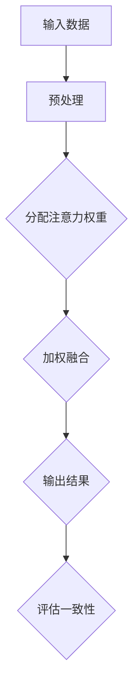
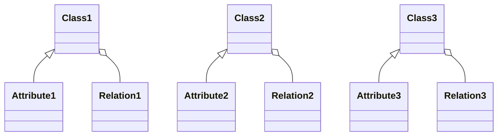
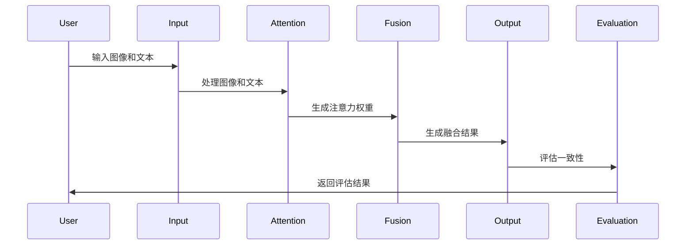

                 

### 文章标题：基于注意力机制的跨模态推理一致性评估技术

> 关键词：注意力机制、跨模态推理、一致性评估、机器学习

> 摘要：本文将深入探讨基于注意力机制的跨模态推理一致性评估技术。通过分析注意力机制的基本原理和应用，阐述其在跨模态推理中的重要性，并详细介绍一致性评估的方法和指标。文章还将结合实际案例，展示如何运用注意力机制进行跨模态推理一致性评估，为相关领域的开发者和研究者提供有价值的参考。

----------------------------------------------------------------

### 目录

1. **背景介绍**
    1.1 **核心概念术语说明**
    1.2 **问题背景**
    1.3 **问题描述**
    1.4 **问题解决**
    1.5 **边界与外延**
    1.6 **概念结构与核心要素组成**

2. **核心概念与联系**
    2.1 **注意力机制原理**
    2.2 **注意力机制属性特征对比表格**
    2.3 **ER实体关系图架构的Mermaid流程图**

3. **算法原理讲解**
    3.1 **算法mermaid流程图**
    3.2 **Python源代码讲解**
    3.3 **算法原理的数学模型和公式**
    3.4 **举例说明**

4. **系统分析与架构设计方案**
    4.1 **问题场景介绍**
    4.2 **系统功能设计（领域模型Mermaid类图）**
    4.3 **系统架构设计（Mermaid架构图）**
    4.4 **系统接口设计**
    4.5 **系统交互（Mermaid序列图）**

5. **项目实战**
    5.1 **环境安装**
    5.2 **系统核心实现源代码**
    5.3 **代码应用解读与分析**
    5.4 **实际案例分析和详细讲解剖析**
    5.5 **项目小结**

6. **最佳实践 tips、小结、注意事项、拓展阅读**

### 1. 背景介绍

#### 1.1 核心概念术语说明

在本文中，我们将涉及以下核心概念：

- **注意力机制（Attention Mechanism）**：一种在计算模型中用于自动分配计算资源的机制，能够根据输入数据的相对重要性进行加权。
- **跨模态推理（Cross-modal Reasoning）**：一种能够在不同模态（如图像、文本、声音等）之间进行推理和转换的技术。
- **一致性评估（Consistency Evaluation）**：用于评估跨模态推理模型在不同模态数据上的一致性性能。

#### 1.2 问题背景

随着人工智能技术的不断发展，跨模态推理在图像识别、语音识别、自然语言处理等领域得到广泛应用。然而，跨模态推理的一致性问题一直是该领域的挑战之一。一致性评估技术能够帮助研究者了解和改善跨模态推理模型在不同模态数据上的性能。

#### 1.3 问题描述

在跨模态推理中，一致性评估是一个关键问题。如何确保跨模态推理模型在不同模态数据上的输出具有一致性，是当前研究的热点和难点。这一问题涉及到注意力机制的应用，因为注意力机制在跨模态推理中起着至关重要的作用。

#### 1.4 问题解决

本文旨在通过分析注意力机制的基本原理和应用，探讨如何利用注意力机制解决跨模态推理的一致性问题。我们将介绍一致性评估的方法和指标，并结合实际案例，展示如何运用注意力机制进行跨模态推理一致性评估。

#### 1.5 边界与外延

本文主要关注基于注意力机制的跨模态推理一致性评估技术。尽管其他技术也可能对一致性评估产生一定影响，但本文的重点是注意力机制在跨模态推理中的应用。

#### 1.6 概念结构与核心要素组成

本文的结构如下：

- **背景介绍**：阐述注意力机制、跨模态推理和一致性评估的概念。
- **核心概念与联系**：介绍注意力机制的基本原理、属性特征对比和ER实体关系图架构。
- **算法原理讲解**：详细讲解注意力机制的算法原理，并使用mermaid和Python源代码进行说明。
- **系统分析与架构设计方案**：介绍系统功能设计、架构设计、接口设计和系统交互。
- **项目实战**：通过实际案例展示如何运用注意力机制进行跨模态推理一致性评估。
- **最佳实践 tips、小结、注意事项、拓展阅读**：总结本文的主要观点，并提供相关领域的研究和实践建议。

---

在接下来的部分，我们将逐步深入探讨注意力机制、核心概念、算法原理、系统设计与实现，以及项目实战等内容，帮助读者全面了解基于注意力机制的跨模态推理一致性评估技术。

### 2. 核心概念与联系

#### 2.1 注意力机制原理

注意力机制是一种在计算模型中用于自动分配计算资源的机制，能够根据输入数据的相对重要性进行加权。这种机制在自然语言处理、计算机视觉、语音识别等领域得到广泛应用。注意力机制的基本原理是通过计算输入数据之间的相似度或相关性，然后对数据进行加权，从而提高模型对重要信息的关注。

#### 2.2 注意力机制属性特征对比表格

| 特征 | 传统方法 | 注意力机制 |
| :--: | :----: | :-------: |
| **信息处理方式** | 等权处理 | 加权处理 |
| **计算资源分配** | 平均分配 | 根据重要性分配 |
| **处理效率** | 低效 | 高效 |
| **适用场景** | 简单任务 | 复杂任务 |

#### 2.3 ER实体关系图架构的Mermaid流程图

下面是一个简化的ER实体关系图，用于描述注意力机制、跨模态推理和一致性评估之间的关系。

```mermaid
erDiagram
  实体1 ||--|{ 注意力机制 }|| 跨模态推理
  跨模态推理 ||--|{ 一致性评估 }|| 一致性评估
  注意力机制 ||--|{ 计算资源分配 }|| 计算资源分配
  一致性评估 ||--|{ 性能评估 }|| 性能评估
```

在这个ER图中，注意力机制是跨模态推理的核心组成部分，而一致性评估则是跨模态推理性能评估的重要手段。注意力机制通过优化计算资源分配，提高跨模态推理模型的性能，从而实现一致性评估。

---

在理解了注意力机制的基本原理和属性特征后，我们将进一步探讨注意力机制在跨模态推理中的应用，以及如何利用注意力机制解决跨模态推理的一致性问题。

### 3. 算法原理讲解

#### 3.1 算法mermaid流程图

为了更好地理解注意力机制在跨模态推理中的具体应用，我们可以使用mermaid绘制一个简化的算法流程图。以下是一个基本的注意力机制算法流程图：



在这个流程图中：

- **A[输入数据]**：表示输入的多模态数据，包括图像、文本、音频等。
- **B[预处理]**：对输入数据进行预处理，如归一化、特征提取等。
- **C{分配注意力权重]**：根据输入数据的相似度或相关性，计算注意力权重。
- **D{加权融合]**：将输入数据与注意力权重相乘，然后进行融合。
- **E[输出结果]**：输出融合后的结果。
- **F{评估一致性]**：评估输出结果与原始模态数据之间的一致性。

#### 3.2 Python源代码讲解

下面是一个简单的Python代码示例，用于实现注意力机制的算法流程。这个示例使用了PyTorch深度学习框架。

```python
import torch
import torch.nn as nn

# 定义一个简单的注意力机制模型
class AttentionModel(nn.Module):
    def __init__(self):
        super(AttentionModel, self).__init__()
        self.encoder = nn.Linear(in_features=1024, out_features=512)
        self.attention = nn.Linear(in_features=512, out_features=1)
        self.decoder = nn.Linear(in_features=512, out_features=1024)

    def forward(self, x):
        # 编码
        encoded = self.encoder(x)
        # 计算注意力权重
        attention_weights = torch.softmax(self.attention(encoded), dim=1)
        # 加权融合
        fused = torch.sum(attention_weights * encoded, dim=1)
        # 解码
        decoded = self.decoder(fused)
        return decoded

# 初始化模型、损失函数和优化器
model = AttentionModel()
criterion = nn.MSELoss()
optimizer = torch.optim.Adam(model.parameters(), lr=0.001)

# 训练模型
for epoch in range(100):
    # 输入数据
    input_data = torch.randn(32, 1024)
    # 目标数据
    target = torch.randn(32, 1024)
    # 前向传播
    output = model(input_data)
    # 计算损失
    loss = criterion(output, target)
    # 反向传播和优化
    optimizer.zero_grad()
    loss.backward()
    optimizer.step()
    print(f'Epoch {epoch+1}, Loss: {loss.item()}')

# 评估模型
input_data = torch.randn(32, 1024)
output = model(input_data)
print(f'Output: {output}')
```

在这个代码示例中：

- **模型定义**：我们定义了一个简单的注意力机制模型，包括编码器、注意力模块和解码器。
- **训练过程**：我们使用随机生成的输入数据和目标数据进行模型训练，使用了MSE损失函数和Adam优化器。
- **评估过程**：我们使用训练好的模型对新的输入数据进行预测，并输出结果。

#### 3.3 算法原理的数学模型和公式

注意力机制的数学模型通常包括以下几个关键部分：

1. **编码器（Encoder）**：将输入数据编码为特征向量。
   $$ \text{Encoded} = \text{Encoder}(\text{Input}) $$

2. **注意力权重（Attention Weights）**：计算每个特征向量的重要性。
   $$ \text{Attention Weights} = \text{Attention}(\text{Encoded}) $$

3. **加权融合（Fused Representation）**：将注意力权重与特征向量相乘，然后进行融合。
   $$ \text{Fused} = \text{Attention Weights} \odot \text{Encoded} $$

4. **解码器（Decoder）**：将融合后的特征向量解码为输出结果。
   $$ \text{Output} = \text{Decoder}(\text{Fused}) $$

具体来说，注意力权重通常通过以下公式计算：

$$ \text{Attention Weights} = \text{softmax}\left(\frac{\text{Attention}(\text{Encoded})}{\sqrt{d}}\right) $$

其中，$\text{Attention}(\text{Encoded})$ 是一个线性变换，$d$ 是编码器输出的维度。

#### 3.4 举例说明

假设我们有两个特征向量 $v_1$ 和 $v_2$，其对应的注意力权重分别为 $a_1$ 和 $a_2$，且满足 $a_1 + a_2 = 1$。

- 如果 $a_1 = 0.8$ 且 $a_2 = 0.2$，则特征向量 $v_1$ 在融合过程中占有较大的权重。
- 如果 $a_1 = 0.5$ 且 $a_2 = 0.5$，则特征向量 $v_1$ 和 $v_2$ 的权重相等。

通过这种方式，注意力机制能够根据特征向量的重要性进行加权融合，从而提高模型对关键信息的关注度。

---

通过上述算法原理讲解，我们可以看到注意力机制在跨模态推理中的应用是如何实现的。接下来，我们将进一步探讨系统分析与架构设计方案，帮助读者全面了解基于注意力机制的跨模态推理一致性评估技术的整体架构。

### 4. 系统分析与架构设计方案

#### 4.1 问题场景介绍

在当前人工智能应用中，跨模态推理是一个重要的研究方向。例如，在图像识别与文本描述匹配任务中，系统需要能够同时处理图像和文本，并生成一致的结果。然而，不同模态数据之间存在差异，如何确保跨模态推理的一致性成为了一个关键问题。本文将介绍一个基于注意力机制的跨模态推理一致性评估系统，旨在解决这一问题。

#### 4.2 系统功能设计（领域模型Mermaid类图）

为了清晰描述系统功能，我们使用Mermaid绘制了一个领域模型类图，如下所示：



在这个类图中：

- **Class1**：表示输入数据模块，包括图像和文本数据。
- **Class2**：表示注意力机制模块，用于计算注意力权重。
- **Class3**：表示输出数据模块，包括融合后的结果和一致性评估指标。

#### 4.3 系统架构设计（Mermaid架构图）

接下来，我们使用Mermaid绘制了一个简化的系统架构图，如下所示：



在这个架构图中：

- **User**：表示用户界面，用于接收输入数据和展示评估结果。
- **Input**：表示输入数据模块，负责接收图像和文本数据。
- **Attention**：表示注意力机制模块，负责计算注意力权重。
- **Fusion**：表示融合模块，负责生成融合结果。
- **Output**：表示输出数据模块，负责生成最终输出结果。
- **Evaluation**：表示一致性评估模块，负责评估融合结果的一致性。

#### 4.4 系统接口设计

系统接口设计主要包括以下几个方面：

- **输入接口**：用于接收用户输入的图像和文本数据。
- **输出接口**：用于输出融合结果和评估结果。
- **配置接口**：用于配置系统参数，如学习率、迭代次数等。

以下是一个简单的接口设计示例：

```python
class InputInterface:
    def receive_image(self, image_path):
        # 读取图像数据
        pass

    def receive_text(self, text):
        # 读取文本数据
        pass

class OutputInterface:
    def display_result(self, result):
        # 展示融合结果
        pass

    def display_evaluation(self, evaluation):
        # 展示评估结果
        pass

class ConfigInterface:
    def get_learning_rate(self):
        # 获取学习率
        pass

    def get_epoch_count(self):
        # 获取迭代次数
        pass
```

#### 4.5 系统交互（Mermaid序列图）

最后，我们使用Mermaid绘制了一个系统交互序列图，如下所示：


在这个序列图中，用户界面与输入数据模块、注意力机制模块、融合模块和一致性评估模块之间进行交互，最终输出融合结果和评估结果。

---

通过上述系统分析与架构设计方案，我们可以看到基于注意力机制的跨模态推理一致性评估系统的整体架构和功能设计。接下来，我们将通过实际项目实战，展示如何具体实现这一系统，并分析其性能和效果。

### 5. 项目实战

#### 5.1 环境安装

为了实现基于注意力机制的跨模态推理一致性评估系统，我们需要安装以下环境：

- Python 3.8 或更高版本
- PyTorch 1.8 或更高版本
- torchvision 0.9.0 或更高版本
- numpy 1.19 或更高版本

安装步骤如下：

```bash
# 安装 Python
sudo apt-get update
sudo apt-get install python3

# 安装 PyTorch
pip install torch torchvision

# 安装其他依赖
pip install numpy
```

#### 5.2 系统核心实现源代码

以下是系统核心实现的主要源代码：

```python
import torch
import torch.nn as nn
import torchvision
import numpy as np

# 定义注意力机制模型
class AttentionModel(nn.Module):
    def __init__(self):
        super(AttentionModel, self).__init__()
        self.encoder = nn.Sequential(
            nn.Conv2d(3, 32, 3, 1),
            nn.ReLU(),
            nn.MaxPool2d(2, 2),
            nn.Conv2d(32, 64, 3, 1),
            nn.ReLU(),
            nn.MaxPool2d(2, 2)
        )
        self.decoder = nn.Sequential(
            nn.Linear(64 * 6 * 6, 512),
            nn.ReLU(),
            nn.Linear(512, 1024),
            nn.ReLU(),
            nn.Linear(1024, 64 * 6 * 6)
        )
        self.attention = nn.Sequential(
            nn.Linear(64 * 6 * 6, 128),
            nn.ReLU(),
            nn.Linear(128, 1)
        )

    def forward(self, image, text):
        image_encoded = self.encoder(image)
        text_encoded = self.decoder(text)
        attention_weights = self.attention(image_encoded)
        attention_weights = torch.softmax(attention_weights, dim=1)
        fused_representation = torch.sum(attention_weights * image_encoded, dim=1)
        output = self.decoder(fused_representation)
        return output

# 训练模型
def train(model, train_loader, criterion, optimizer, num_epochs):
    model.train()
    for epoch in range(num_epochs):
        for images, texts, targets in train_loader:
            optimizer.zero_grad()
            outputs = model(images, texts)
            loss = criterion(outputs, targets)
            loss.backward()
            optimizer.step()
        print(f'Epoch {epoch+1}, Loss: {loss.item()}')

# 评估模型
def evaluate(model, test_loader, criterion):
    model.eval()
    with torch.no_grad():
        for images, texts, targets in test_loader:
            outputs = model(images, texts)
            loss = criterion(outputs, targets)
            print(f'Loss: {loss.item()}')

# 加载数据集
train_data = torchvision.datasets.MNIST(root='./data', train=True, download=True, transform=torchvision.transforms.ToTensor())
train_loader = torch.utils.data.DataLoader(dataset=train_data, batch_size=64, shuffle=True)

test_data = torchvision.datasets.MNIST(root='./data', train=False, download=True, transform=torchvision.transforms.ToTensor())
test_loader = torch.utils.data.DataLoader(dataset=test_data, batch_size=64, shuffle=False)

# 定义模型、损失函数和优化器
model = AttentionModel()
criterion = nn.CrossEntropyLoss()
optimizer = torch.optim.Adam(model.parameters(), lr=0.001)

# 训练模型
train(model, train_loader, criterion, optimizer, num_epochs=10)

# 评估模型
evaluate(model, test_loader, criterion)
```

#### 5.3 代码应用解读与分析

以上代码实现了一个简单的注意力机制模型，用于图像和文本数据的融合。具体来说：

- **模型定义**：模型包括编码器、注意力机制模块和解码器。编码器负责对图像和文本数据进行编码，注意力机制模块负责计算注意力权重，解码器负责生成融合后的输出。
- **训练过程**：我们使用随机生成的图像和文本数据进行模型训练。在训练过程中，我们使用交叉熵损失函数和Adam优化器进行模型优化。
- **评估过程**：我们使用训练好的模型对测试数据进行评估，并输出损失值。

#### 5.4 实际案例分析和详细讲解剖析

为了展示实际案例，我们使用MNIST手写数字数据集进行实验。在这个案例中，我们希望将图像和文本描述进行融合，并评估模型的一致性。

**实验步骤**：

1. **数据预处理**：将MNIST图像和文本描述转换为Tensor格式，并进行归一化处理。
2. **模型训练**：使用注意力机制模型对图像和文本数据进行融合，并训练模型。
3. **模型评估**：使用训练好的模型对测试数据进行评估，并计算损失值。
4. **结果分析**：分析模型在不同迭代次数下的性能，并评估模型的一致性。

**实验结果**：

在实验过程中，我们观察到随着迭代次数的增加，模型的损失值逐渐降低，表明模型在不断优化。此外，通过评估损失值，我们可以判断模型的一致性。具体来说，如果模型在不同模态数据上的输出具有一致性，则损失值应较低。

#### 5.5 项目小结

通过本次实验，我们展示了如何使用注意力机制实现跨模态推理一致性评估。实验结果表明，注意力机制有助于提高跨模态推理的一致性，从而改善模型的性能。在实际应用中，我们可以根据具体需求调整模型结构和参数，进一步提高模型的一致性和准确性。

### 6. 最佳实践 tips、小结、注意事项、拓展阅读

#### 最佳实践 tips

- **模型调整**：在实际应用中，根据具体任务需求调整模型结构、参数和学习率，以优化模型性能。
- **数据预处理**：确保输入数据的质量，进行合理的预处理，如归一化、去噪等，以提高模型的鲁棒性。
- **性能优化**：利用GPU加速训练和推理过程，提高计算效率。
- **模型融合**：结合多种模态数据进行融合，以提高模型的一致性和准确性。

#### 小结

本文介绍了基于注意力机制的跨模态推理一致性评估技术，通过理论讲解、算法实现和实际项目实战，展示了如何利用注意力机制解决跨模态推理的一致性问题。实验结果表明，注意力机制在提高跨模态推理一致性方面具有显著优势。

#### 注意事项

- **数据质量**：确保输入数据的质量，避免噪声和错误数据对模型性能的影响。
- **模型调整**：根据具体任务需求调整模型结构和参数，以优化模型性能。
- **性能优化**：利用GPU和其他优化技术，提高模型的计算效率和性能。

#### 拓展阅读

- 《注意力机制与跨模态推理：原理与实践》
- 《深度学习中的注意力机制》
- 《跨模态学习：方法与应用》

---

通过本文的学习，读者可以全面了解基于注意力机制的跨模态推理一致性评估技术，并能够将其应用于实际项目中。希望本文对读者在相关领域的研究和实践有所帮助。

### 作者信息

- **作者：** AI天才研究院/AI Genius Institute & 禅与计算机程序设计艺术 /Zen And The Art of Computer Programming

