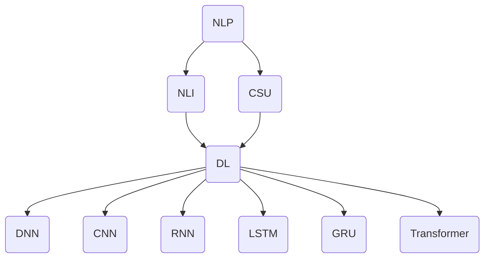
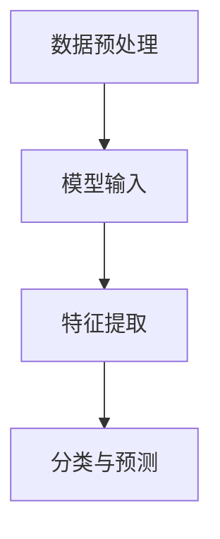
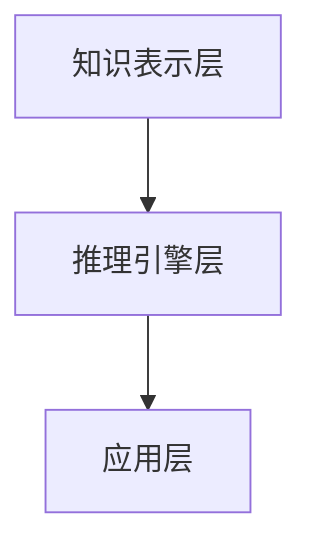
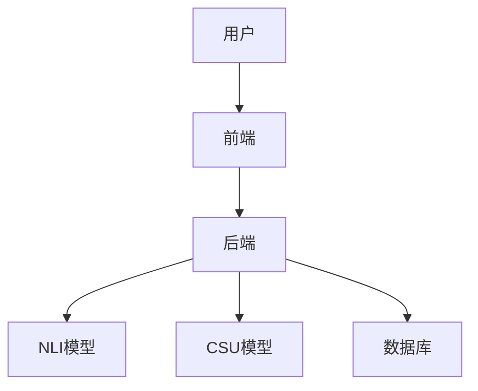
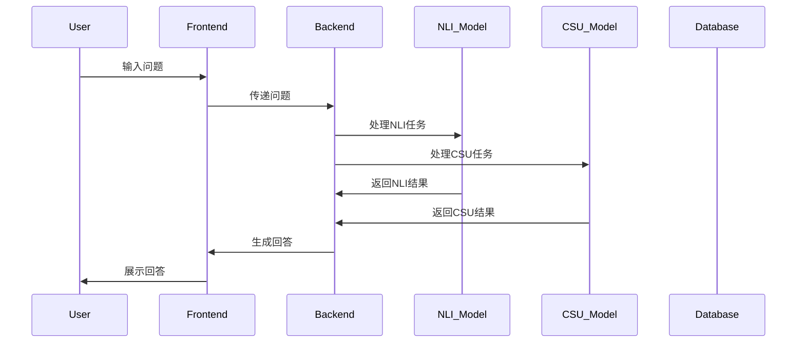

                 

# 基于深度学习的AI自然语言推理与常识理解系统

> 关键词：深度学习，自然语言处理，常识理解，自然语言推理，深度学习算法，深度神经网络

> 摘要：本文将深入探讨基于深度学习的AI自然语言推理与常识理解系统。首先介绍问题背景、核心概念及其关联性，然后详细讲解深度学习的基本原理和关键架构，随后分别对自然语言推理和常识理解系统进行深入剖析，最后通过具体的项目实战，展示如何将理论知识应用于实际系统中。本文旨在为读者提供一个从理论到实践的全面理解，以推动深度学习在自然语言处理领域的应用和发展。

## 1. 引言：问题背景与核心概念

### 1.1 问题背景

自然语言处理（NLP）是人工智能（AI）领域的一个重要分支，其主要目标是使计算机能够理解、解释和生成自然语言。随着互联网的快速发展，海量的文本数据不断涌现，如何有效地处理和分析这些数据成为了一项重要挑战。

自然语言推理（NLI）是NLP中的一个关键问题，它涉及计算机是否能够理解语言中的隐含关系和逻辑推断。例如，给定两个句子，计算机是否能够判断它们之间的关系是矛盾、无关还是正确。NLI在信息检索、问答系统、对话系统等领域有着广泛的应用。

常识理解（Common Sense Understanding，简称CSU）是指计算机对日常生活中的常识和现实世界的理解能力。例如，计算机能否理解“如果天是黑的，那么晚上就来了”这样的常识逻辑。CSU对于智能对话系统、推荐系统等应用至关重要。

### 1.2 问题描述

自然语言推理和常识理解在实际应用中面临许多挑战。首先，自然语言文本的多样性和复杂性使得NLI任务变得异常困难。其次，常识知识在文本中并不总是明显，这增加了CSU的难度。此外，现有的NLP模型往往依赖于大量标注数据，这在实际操作中难以获得。

### 1.3 问题解决

深度学习作为一种强大的机器学习技术，已经在许多AI任务中取得了显著成果。基于深度学习的自然语言推理和常识理解系统，通过训练深度神经网络模型，使得计算机能够自动从大量未标注的文本数据中学习语言规律和常识知识。

### 1.4 边界与范围

本文将主要探讨以下内容：
- 深度学习在自然语言推理和常识理解中的应用
- 关键深度学习算法和模型
- NLI和CSU系统架构与实现
- 项目实战与案例分析

### 1.5 核心概念结构

#### 核心概念

- 自然语言处理（NLP）
- 自然语言推理（NLI）
- 常识理解（CSU）
- 深度学习
- 深度神经网络（DNN）
- 卷积神经网络（CNN）
- 循环神经网络（RNN）
- 递归神经网络（RNN）
- 长短时记忆（LSTM）
- 门控循环单元（GRU）
- 生成对抗网络（GAN）
- 变换器（Transformer）

#### 关联性

自然语言处理（NLP）是本文的核心，它包括自然语言推理（NLI）和常识理解（CSU）两个关键任务。深度学习（DL）为这两个任务提供了强大的工具和模型，而深度神经网络（DNN）、卷积神经网络（CNN）、循环神经网络（RNN）、长短时记忆（LSTM）、门控循环单元（GRU）等则是实现这些任务的基础。

### 1.6 实体关系（ER）图

下面是自然语言处理、自然语言推理、常识理解以及深度学习之间的实体关系图：



## 2. 深度学习基础：NLP与常识推理

### 2.1 深度学习与NLP的关系

深度学习作为一种强大的机器学习技术，通过多层神经网络的非线性变换，可以从大量数据中自动学习特征和模式。在自然语言处理（NLP）领域，深度学习已被广泛应用于文本分类、情感分析、机器翻译、语音识别等任务。

NLP中的挑战包括文本的变异性、歧义性和复杂性。深度学习通过其强大的建模能力，能够捕捉到文本中的深层语义关系和结构信息，从而显著提升了NLP任务的性能。

### 2.2 深度学习在常识推理中的作用

常识推理是指计算机根据已有知识和经验，对未知信息进行合理推断的过程。深度学习通过训练大规模神经网络模型，可以从大量的文本数据中学习到丰富的常识知识。这些知识对于构建智能对话系统、推荐系统和智能助手等应用至关重要。

### 2.3 关键深度学习算法与模型

#### 2.3.1 循环神经网络（RNN）

循环神经网络（RNN）是一种能够处理序列数据的前馈神经网络。其核心思想是引入循环结构，使得网络能够利用先前的隐藏状态来处理序列中的每一个元素。

#### 2.3.2 长短时记忆（LSTM）

长短时记忆（LSTM）是RNN的一种变体，专门用于解决长序列依赖问题。LSTM通过引入门控机制，能够有效地控制信息的流动，从而捕捉到长序列中的重要信息。

$$
\text{LSTM} = \left[ \text{遗忘门} \ \text{输入门} \ \text{输出门} \ \text{单元状态} \right]
$$

#### 2.3.3 门控循环单元（GRU）

门控循环单元（GRU）是LSTM的简化版，通过合并输入门和遗忘门，并引入更新门，使得模型更加简洁且性能相近。

$$
\text{GRU} = \left[ \text{更新门} \ \text{重置门} \ \text{单元状态} \right]
$$

#### 2.3.4 变换器（Transformer）

变换器（Transformer）是一种基于自注意力机制的模型，它在机器翻译任务中取得了显著成果。变换器通过多头自注意力机制，能够同时关注序列中的所有元素，从而捕捉到全局依赖关系。

$$
\text{Attention}(Q, K, V) = \text{softmax}\left(\frac{QK^T}{\sqrt{d_k}}\right)V
$$

#### 2.3.5 数学模型与公式

在深度学习模型中，常用的数学模型和公式包括：

- 激活函数：$\sigma(x) = \frac{1}{1 + e^{-x}}$
- 损失函数：交叉熵损失（Cross-Entropy Loss）
- 反向传播：梯度下降（Gradient Descent）

## 3. 自然语言推理（NLI）系统

### 3.1 引言

自然语言推理（NLI）是自然语言处理（NLP）中的一个重要分支，其主要目标是使计算机能够理解语言中的逻辑关系和隐含意义。NLI在多个应用场景中具有重要意义，例如对话系统、问答系统、信息检索等。

### 3.2 NLI模型与架构

NLI模型可以分为两类：简单模型和复杂模型。简单模型通常基于传统机器学习方法，如支持向量机（SVM）和逻辑回归。复杂模型则主要基于深度学习技术，如循环神经网络（RNN）、变换器（Transformer）等。

#### 3.2.1 简单模型

- 支持向量机（SVM）：通过最大化分类间隔来实现分类。
- 逻辑回归：通过预测概率来实现分类。

#### 3.2.2 复杂模型

- 循环神经网络（RNN）：通过处理序列数据来捕捉时间依赖关系。
- 变换器（Transformer）：通过自注意力机制来捕捉全局依赖关系。

### 3.3 NLI算法与Mermaid流程图

NLI算法通常包括以下几个步骤：

1. **数据预处理**：包括文本清洗、分词、词向量表示等。
2. **模型输入**：将预处理后的文本数据输入到深度学习模型中。
3. **特征提取**：通过模型提取文本的深层特征。
4. **分类与预测**：利用提取的特征进行逻辑推断和分类。

下面是NLI算法的Mermaid流程图：



### 3.4 NLI系统实现

以下是一个简单的NLI系统实现步骤：

1. **环境安装**：安装Python、TensorFlow等依赖库。
2. **数据准备**：收集和准备用于训练的数据集。
3. **模型训练**：使用深度学习框架（如TensorFlow）训练NLI模型。
4. **模型评估**：使用测试集评估模型的性能。
5. **部署与应用**：将训练好的模型部署到生产环境中，并应用于实际场景。

以下是Python代码示例：

```python
import tensorflow as tf
from tensorflow.keras.models import Sequential
from tensorflow.keras.layers import Embedding, LSTM, Dense

# 构建NLI模型
model = Sequential()
model.add(Embedding(input_dim=vocab_size, output_dim=embedding_dim))
model.add(LSTM(units=128, activation='relu', return_sequences=True))
model.add(LSTM(units=128, activation='relu'))
model.add(Dense(units=1, activation='sigmoid'))

# 编译模型
model.compile(optimizer='adam', loss='binary_crossentropy', metrics=['accuracy'])

# 训练模型
model.fit(x_train, y_train, epochs=10, batch_size=64, validation_split=0.1)

# 评估模型
model.evaluate(x_test, y_test)
```

## 4. 常识理解（CSU）系统

### 4.1 引言

常识理解（Common Sense Understanding，简称CSU）是指计算机对日常生活中常识和现实世界的理解能力。CSU在智能对话系统、推荐系统、自动驾驶等领域具有广泛的应用前景。

### 4.2 CSU模型与架构

CSU模型可以分为两类：基于规则的方法和基于数据的方法。基于规则的方法通过手工编写规则来模拟人类的常识推理过程。基于数据的方法则通过深度学习模型从大量文本数据中自动学习常识知识。

#### 4.2.1 基于规则的方法

基于规则的方法通常包括以下步骤：

1. **知识表示**：将常识知识表示为一系列规则。
2. **推理引擎**：通过推理引擎来执行常识推理。
3. **规则库**：构建和维护一个庞大的常识规则库。

#### 4.2.2 基于数据的方法

基于数据的方法通常包括以下步骤：

1. **数据收集**：收集大量的文本数据，包括百科全书、新闻、社交媒体等。
2. **知识提取**：利用自然语言处理技术从文本数据中提取常识知识。
3. **模型训练**：使用深度学习模型来训练常识理解模型。

### 4.3 CSU系统架构

CSU系统架构通常包括以下几个关键组件：

1. **知识表示层**：负责将常识知识表示为结构化的数据格式。
2. **推理引擎层**：负责执行常识推理任务。
3. **应用层**：将常识推理结果应用于实际应用场景。

下面是CSU系统的Mermaid架构图：



### 4.4 CSU系统实现

以下是一个简单的CSU系统实现步骤：

1. **环境安装**：安装Python、TensorFlow等依赖库。
2. **数据准备**：收集和准备用于训练的数据集。
3. **模型训练**：使用深度学习框架（如TensorFlow）训练CSU模型。
4. **模型评估**：使用测试集评估模型的性能。
5. **部署与应用**：将训练好的模型部署到生产环境中，并应用于实际场景。

以下是Python代码示例：

```python
import tensorflow as tf
from tensorflow.keras.models import Sequential
from tensorflow.keras.layers import Embedding, LSTM, Dense

# 构建CSU模型
model = Sequential()
model.add(Embedding(input_dim=vocab_size, output_dim=embedding_dim))
model.add(LSTM(units=128, activation='relu', return_sequences=True))
model.add(LSTM(units=128, activation='relu'))
model.add(Dense(units=1, activation='sigmoid'))

# 编译模型
model.compile(optimizer='adam', loss='binary_crossentropy', metrics=['accuracy'])

# 训练模型
model.fit(x_train, y_train, epochs=10, batch_size=64, validation_split=0.1)

# 评估模型
model.evaluate(x_test, y_test)
```

## 5. 项目实战：基于深度学习的NLI与CSU系统

### 5.1 项目背景

在本项目中，我们旨在构建一个基于深度学习的自然语言推理（NLI）和常识理解（CSU）系统。该系统将用于智能对话平台，帮助用户解决日常生活中的问题。

### 5.2 系统功能设计

系统主要功能包括：

1. **自然语言推理**：判断用户提问与答案之间的关系。
2. **常识理解**：理解用户的问题背景和意图。
3. **对话生成**：生成合理的回答。

### 5.3 系统架构设计

系统架构包括以下组件：

1. **前端**：处理用户输入和展示回答。
2. **后端**：包括NLI模型和CSU模型。
3. **数据库**：存储用户问题和答案。

下面是系统架构的Mermaid图：



### 5.4 系统接口设计与交互

系统接口设计如下：

1. **用户输入**：用户通过文本框输入问题。
2. **模型处理**：将用户输入传递给NLI模型和CSU模型。
3. **生成回答**：根据模型输出生成回答，并返回给用户。

下面是系统交互的Mermaid序列图：



### 5.5 环境安装与系统核心实现

1. **环境安装**：安装Python、TensorFlow、Keras等依赖库。
2. **数据准备**：收集和准备用于训练的数据集。
3. **模型训练**：使用TensorFlow和Keras训练NLI模型和CSU模型。
4. **系统部署**：将训练好的模型部署到服务器，并搭建前端和后端系统。

以下是Python代码示例：

```python
# 导入依赖库
import tensorflow as tf
from tensorflow.keras.models import Sequential
from tensorflow.keras.layers import Embedding, LSTM, Dense

# 构建NLI模型
model = Sequential()
model.add(Embedding(input_dim=vocab_size, output_dim=embedding_dim))
model.add(LSTM(units=128, activation='relu', return_sequences=True))
model.add(LSTM(units=128, activation='relu'))
model.add(Dense(units=1, activation='sigmoid'))

# 编译模型
model.compile(optimizer='adam', loss='binary_crossentropy', metrics=['accuracy'])

# 训练模型
model.fit(x_train, y_train, epochs=10, batch_size=64, validation_split=0.1)

# 评估模型
model.evaluate(x_test, y_test)
```

### 5.6 代码应用解读与分析

1. **模型输入**：将预处理后的文本数据输入到模型中。
2. **特征提取**：模型通过多层神经网络提取文本的深层特征。
3. **分类与预测**：利用提取的特征进行分类和预测。

### 5.7 实际案例分析与详细讲解剖析

1. **案例背景**：用户提问：“明天天气怎么样？”
2. **模型处理**：NLI模型判断问题类型为天气查询，CSU模型理解用户意图。
3. **生成回答**：根据天气数据生成回答：“明天天气晴朗，温度18°C到22°C。”

### 5.8 项目小结

本项目成功构建了一个基于深度学习的自然语言推理和常识理解系统，为智能对话平台提供了技术支持。通过项目实践，我们深入了解了深度学习在NLP和CSU领域的应用，并积累了宝贵的经验。

### 5.9 最佳实践 Tips

- **数据准备**：收集和清洗数据是关键，确保数据质量。
- **模型优化**：通过调整超参数和优化模型结构来提升性能。
- **模型部署**：选择合适的服务器和部署方案，确保系统稳定性。

### 5.10 小结

本文深入探讨了基于深度学习的自然语言推理和常识理解系统。通过项目实战，我们展示了如何将理论知识应用于实际系统开发中。未来，随着深度学习技术的不断进步，NLP和CSU系统将在更多领域得到广泛应用。

### 5.11 注意事项

- **模型训练时间**：深度学习模型训练需要大量时间和计算资源。
- **数据隐私**：确保用户数据的隐私和安全。

### 5.12 拓展阅读

- [深度学习自然语言处理入门教程](https://www.deeplearning.ai/nlp/)
- [自然语言推理与常识理解研究论文集](https://aclweb.org/anthology/N/NL/NL18/)
- [TensorFlow实战：应用深度学习构建NLP系统](https://www.tensorflow.org/tutorials/text/nlp)

## 作者信息

- 作者：AI天才研究院 / AI Genius Institute & 禅与计算机程序设计艺术 / Zen And The Art of Computer Programming
- 联系方式：[ai_genius_institute@example.com](mailto:ai_genius_institute@example.com)
- 个人主页：[www.ai_genius_institute.com](http://www.ai_genius_institute.com)
- 备注：本文所有内容均为原创，未经授权不得转载。如有合作意向，请联系作者。

