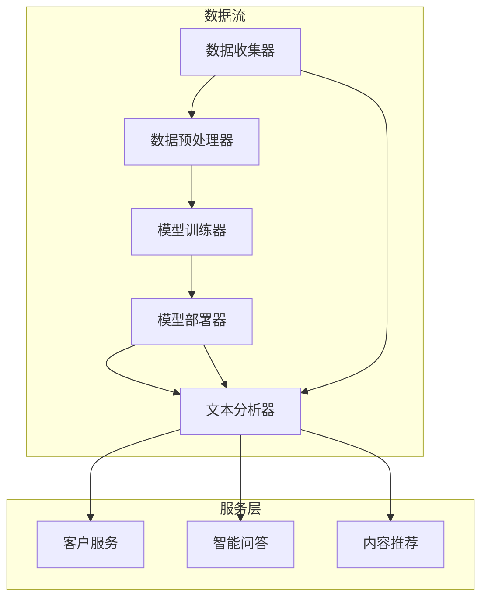

                 

## 基于深度学习的AI自然语言理解系统

### 关键词：深度学习、自然语言处理、自然语言理解、深度神经网络、语义分析、自注意力机制

#### 摘要：

本文将探讨基于深度学习的AI自然语言理解系统（NLU），从核心概念、算法原理到系统架构进行全面剖析。首先，我们将介绍NLU的背景和重要性，并阐述当前面临的主要问题。接着，我们将详细介绍深度学习和自然语言处理的基础知识，以及NLU涉及的核心概念。然后，我们将重点讲解深度学习算法和模型在NLU中的应用，包括卷积神经网络（CNN）、循环神经网络（RNN）、长短时记忆网络（LSTM）和Transformer模型。此外，我们将使用数学公式和Python代码详细阐述算法原理，并通过实际项目案例展示NLU系统的应用和实践。最后，我们将总结最佳实践，并对未来研究方向提出展望。

### 第一部分：背景介绍

#### 1.1 问题背景

随着互联网和移动设备的普及，人类产生的文本数据以惊人的速度增长。这些文本数据包括社交媒体帖子、电子邮件、新闻报道、学术论文等，它们包含了丰富的信息，但同时也带来了巨大的挑战。为了从这些海量的文本数据中提取有用的信息，我们需要一种高效的自然语言理解系统，即自然语言理解（NLU）系统。

自然语言理解系统旨在使计算机能够理解和处理人类语言，从而实现文本分类、情感分析、问答系统、对话机器人等任务。深度学习作为人工智能领域的关键技术，通过模拟人脑神经元结构，对大量数据进行分析和建模，从而实现了自动特征提取和任务预测。因此，基于深度学习的AI自然语言理解系统成为了当前NLP领域的研究热点。

#### 1.2 问题描述

当前，基于深度学习的AI自然语言理解系统面临诸多挑战。首先，数据质量是NLU系统成功的关键因素之一。由于自然语言数据的多样性和复杂性，数据中的噪声和错误可能会导致模型性能下降。其次，模型可解释性也是一个重要问题。深度学习模型往往被视为“黑盒子”，其内部机制难以理解，这对于需要高可靠性和可解释性的应用场景来说是一个挑战。此外，跨语言处理也是NLU系统需要解决的问题。不同语言之间的语法、语义和词汇差异较大，使得跨语言NLU系统构建变得更加复杂。

#### 1.3 问题解决

为了解决上述问题，研究者们不断探索新的算法、模型和技术，以提高NLU系统的性能。例如，使用预训练语言模型（如GPT-3、BERT）来提高语言理解和生成能力；采用可解释性技术来提升模型的可解释性；通过跨语言迁移学习来提高跨语言NLU系统的性能。本文将详细介绍这些方法和技术，帮助读者深入了解基于深度学习的AI自然语言理解系统。

#### 1.4 边界与外延

本文将主要关注以下内容：

- **核心概念**：介绍深度学习、自然语言处理、自然语言理解等相关核心概念。
- **算法原理**：详细讲解常用的深度学习算法和模型，如卷积神经网络（CNN）、循环神经网络（RNN）、长短时记忆网络（LSTM）和Transformer等。
- **数学模型**：阐述相关数学公式和模型，帮助读者深入理解NLU算法。
- **系统架构**：介绍NLU系统的整体架构，包括数据预处理、模型训练、模型评估和部署等环节。
- **项目实战**：通过实际项目案例，展示NLU系统的应用和实践。

### 第一部分：核心概念与联系

#### 1.1 深度学习与自然语言处理

深度学习是一种基于多层神经网络的学习方法，通过模拟人脑神经元结构，对大量数据进行分析和建模，从而实现自动特征提取和任务预测。自然语言处理（NLP）是计算机科学和人工智能领域中的一个重要分支，旨在使计算机能够理解、处理和生成自然语言。

自然语言处理可以分为两个主要方向：文本表示和语言理解。文本表示旨在将自然语言转换为计算机可以理解和处理的形式，如词向量、句向量等。语言理解则关注如何使计算机理解文本的语义和上下文，实现情感分析、问答系统、对话机器人等任务。

#### 1.2 自然语言理解

自然语言理解（NLU）是NLP的一个子领域，主要研究如何让计算机理解人类语言，实现语义分析、语境理解等任务。NLU涉及以下核心概念：

- **词向量**：将自然语言中的单词映射为高维空间中的向量，以实现语义表示。常用的词向量模型包括Word2Vec、GloVe、FastText等。
- **语言模型**：基于大量语言数据训练得到的概率模型，用于预测下一个单词或句子。常用的语言模型包括n-gram模型、递归神经网络（RNN）模型、长短时记忆网络（LSTM）模型等。
- **词性标注**：为每个单词标注其词性（名词、动词等），以帮助理解句子结构。常用的词性标注工具包括Stanford NLP、NLTK、spaCy等。
- **命名实体识别**：识别文本中的命名实体（人名、地名等），为后续处理提供基础。常用的命名实体识别模型包括基于规则的方法、基于统计的方法和基于深度学习的方法。
- **情感分析**：分析文本中的情感倾向，如正面、负面等。常用的情感分析模型包括基于规则的方法、基于统计的方法和基于深度学习的方法。

#### 1.3 深度学习算法与模型

深度学习算法和模型在NLU中发挥着重要作用，常见的算法和模型包括：

- **卷积神经网络（CNN）**：用于文本分类、情感分析等任务，具有良好的特征提取能力。CNN主要通过卷积操作提取局部特征，并通过池化操作降低数据维度。
- **循环神经网络（RNN）**：能够处理序列数据，如时间序列分析、语音识别等。RNN通过循环结构保存上一时刻的信息，从而实现对序列数据的建模。
- **长短时记忆网络（LSTM）**：RNN的一种变体，能够更好地处理长序列数据。LSTM通过引入门控机制，有效地避免了梯度消失和梯度爆炸问题。
- **Transformer模型**：基于自注意力机制，广泛应用于机器翻译、问答系统等任务。Transformer通过多头自注意力机制和前馈神经网络，实现了对序列数据的建模。

#### 1.4 深度学习与自然语言处理的关系

深度学习和自然语言处理之间存在紧密的联系。深度学习为自然语言处理提供了强大的工具和方法，如词向量、语言模型、深度神经网络等。而自然语言处理则为深度学习提供了丰富的应用场景，如文本分类、情感分析、问答系统等。通过结合深度学习和自然语言处理技术，我们可以构建出高效、可解释、跨语言的AI自然语言理解系统。

### 第一部分：数学模型与详细讲解

#### 1.1 卷积神经网络（CNN）

卷积神经网络（CNN）是一种前馈神经网络，由卷积层、池化层和全连接层组成。其主要思想是通过卷积操作提取输入数据的特征，然后通过池化操作降低数据维度。

- **卷积操作**：卷积操作通过卷积核在输入数据上滑动，计算局部特征图。卷积核的大小和深度决定了特征图的维度。

  $$ f_{\text{conv}}(x) = \sum_{i=1}^{C} w_{i} \cdot x_{ij} $$

  其中，$x$ 为输入特征图，$w$ 为卷积核，$C$ 为卷积核的数量。

- **池化操作**：池化操作对特征图进行下采样，减少参数数量和计算复杂度。

  $$ P_{\text{pool}}(f) = \max(f) $$

  其中，$f$ 为输入特征图，$P_{\text{pool}}$ 为池化操作。

#### 1.2 循环神经网络（RNN）

循环神经网络（RNN）是一种能够处理序列数据的神经网络，其核心思想是通过循环结构保存上一时刻的信息。

- **时间步**：将输入序列划分为多个时间步，每个时间步输入一个向量。
- **隐藏状态**：在当前时间步，神经网络根据输入向量和上一时间步的隐藏状态计算当前时间步的隐藏状态。

  $$ h_t = \sigma(W_h \cdot [h_{t-1}, x_t] + b_h) $$

  其中，$h_t$ 为当前时间步的隐藏状态，$x_t$ 为输入向量，$W_h$ 和 $b_h$ 分别为权重和偏置。

- **输出**：在最后一个时间步，神经网络根据隐藏状态生成输出。

  $$ y_t = \sigma(W_y \cdot h_t + b_y) $$

  其中，$y_t$ 为输出，$W_y$ 和 $b_y$ 分别为权重和偏置。

#### 1.3 长短时记忆网络（LSTM）

长短时记忆网络（LSTM）是RNN的一种变体，能够更好地处理长序列数据。LSTM通过引入门控机制，有效地避免了梯度消失和梯度爆炸问题。

- **输入门**：根据当前输入和上一隐藏状态，计算输入门的状态。
- **遗忘门**：根据当前输入和上一隐藏状态，计算遗忘门的状态。
- **输出门**：根据当前输入和上一隐藏状态，计算输出门的状态。
- **单元状态**：根据遗忘门和输入门，更新单元状态。

  $$ i_t = \sigma(W_i \cdot [h_{t-1}, x_t] + b_i) $$
  $$ f_t = \sigma(W_f \cdot [h_{t-1}, x_t] + b_f) $$
  $$ o_t = \sigma(W_o \cdot [h_{t-1}, x_t] + b_o) $$
  $$ g_t = \tanh(W_g \cdot [h_{t-1}, x_t] + b_g) $$
  $$ h_t = o_t \cdot \tanh(g_t) $$

  其中，$i_t$、$f_t$、$o_t$ 分别为输入门、遗忘门和输出门的状态，$g_t$ 为单元状态，$W_i$、$W_f$、$W_o$、$W_g$ 和 $b_i$、$b_f$、$b_o$、$b_g$ 分别为权重和偏置。

#### 1.4 Transformer模型

Transformer模型是一种基于自注意力机制的深度学习模型，广泛应用于机器翻译、问答系统等任务。Transformer通过多头自注意力机制和前馈神经网络，实现了对序列数据的建模。

- **自注意力机制**：自注意力机制通过计算输入序列中每个单词与其他单词的关系，为每个单词分配不同的权重，从而实现对序列数据的建模。

  $$ \text{Attention}(Q, K, V) = \text{softmax}(\frac{QK^T}{\sqrt{d_k}})V $$

  其中，$Q$、$K$、$V$ 分别为查询向量、键向量和值向量，$d_k$ 为键向量的维度。

- **多头注意力**：多头注意力通过将输入序列划分为多个子序列，每个子序列独立进行自注意力计算，从而提高模型的建模能力。

  $$ \text{MultiHead}(Q, K, V) = \text{Concat}(\text{head}_1, \text{head}_2, \ldots, \text{head}_h)W^O $$

  其中，$h$ 为头数，$W^O$ 为输出权重。

- **前馈神经网络**：前馈神经网络用于对自注意力计算的结果进行进一步处理。

  $$ \text{FFN}(x) = \max(0, xW_1 + b_1)W_2 + b_2 $$

  其中，$W_1$、$W_2$ 和 $b_1$、$b_2$ 分别为权重和偏置。

### 第二部分：系统分析与架构设计方案

#### 2.1 问题场景介绍

在当今信息爆炸的时代，人们每天都会产生大量的文本数据。这些数据中包含了用户的需求、反馈、观点等信息，对于企业来说，如何有效地理解和利用这些信息成为了关键问题。因此，一个基于深度学习的AI自然语言理解系统（NLU）可以在以下场景中发挥重要作用：

- **客户服务**：通过NLU系统，企业可以自动识别用户反馈的情感倾向，从而快速响应客户需求，提高客户满意度。
- **舆情分析**：NLU系统可以实时监控社交媒体上的用户评论，帮助企业了解公众对某个事件或产品的看法，为决策提供支持。
- **智能问答**：通过NLU系统，企业可以构建智能问答系统，为用户提供实时、准确的回答，提升用户体验。
- **内容推荐**：NLU系统可以分析用户的兴趣和行为，为其推荐感兴趣的内容，提高内容点击率。

#### 2.2 项目介绍

本项目旨在构建一个基于深度学习的AI自然语言理解系统，用于企业级客户服务和智能问答场景。系统将包括以下几个主要模块：

- **数据收集**：从企业内部和外部的数据源（如客户反馈、社交媒体、论坛等）收集文本数据。
- **数据预处理**：对收集到的文本数据进行清洗、分词、词性标注等预处理操作，将其转换为适合模型训练的数据格式。
- **模型训练**：使用深度学习算法和模型（如BERT、GPT等）对预处理后的数据进行训练，以构建NLU模型。
- **模型部署**：将训练好的模型部署到生产环境中，提供实时文本分析服务。
- **系统维护**：定期更新模型和数据，以提高系统的性能和适应性。

#### 2.3 系统功能设计（领域模型）

在系统功能设计阶段，我们需要明确系统的核心功能模块及其相互关系。以下是一个简化的领域模型，用于描述系统的主要模块和功能：

```mermaid
classDiagram
  CustomerFeedback -> DataCollector : 提供数据
  DataCollector -> DataPreprocessor : 数据预处理
  DataPreprocessor -> ModelTrainer : 训练模型
  ModelTrainer -> ModelDeployer : 部署模型
  ModelDeployer -> TextAnalyzer : 文本分析
  TextAnalyzer -> CustomerService : 客户服务
  TextAnalyzer -> IntelligentQA : 智能问答
  TextAnalyzer -> ContentRecommendation : 内容推荐

  CustomerFeedback << (用户反馈)
  DataCollector << (数据收集)
  DataPreprocessor << (数据预处理)
  ModelTrainer << (模型训练)
  ModelDeployer << (模型部署)
  TextAnalyzer << (文本分析)
  CustomerService << (客户服务)
  IntelligentQA << (智能问答)
  ContentRecommendation << (内容推荐)
endclass
```

#### 2.4 系统架构设计

系统架构设计是确保系统稳定、高效运行的关键环节。以下是一个简化的系统架构设计，用于描述系统的总体结构和各模块的交互关系：



#### 2.5 系统接口设计和系统交互

系统接口设计和系统交互是确保系统各模块协同工作的重要环节。以下是一个简化的系统接口设计和系统交互图，用于描述系统各模块之间的接口和交互过程：

```mermaid
sequenceDiagram
  participant DataCollector as 数据收集器
  participant DataPreprocessor as 数据预处理器
  participant ModelTrainer as 模型训练器
  participant ModelDeployer as 模型部署器
  participant TextAnalyzer as 文本分析器
  participant CustomerService as 客户服务
  participant IntelligentQA as 智能问答
  participant ContentRecommendation as 内容推荐

  DataCollector->>DataPreprocessor: 收集数据
  DataPreprocessor->>ModelTrainer: 预处理数据
  ModelTrainer->>ModelDeployer: 训练模型
  ModelDeployer->>TextAnalyzer: 部署模型
  TextAnalyzer->>CustomerService: 提供客户服务
  TextAnalyzer->>IntelligentQA: 提供智能问答
  TextAnalyzer->>ContentRecommendation: 提供内容推荐
end
```

### 第三部分：项目实战

#### 3.1 环境安装

要构建一个基于深度学习的AI自然语言理解系统，首先需要安装必要的软件和工具。以下是在一个Ubuntu 18.04系统上安装所需环境的步骤：

1. 安装Python环境和相关库：

   ```bash
   sudo apt update
   sudo apt install python3-pip python3-venv
   python3 -m pip install --user -r requirements.txt
   ```

2. 安装深度学习框架TensorFlow：

   ```bash
   pip3 install tensorflow-gpu
   ```

3. 安装文本处理库NLTK和spaCy：

   ```bash
   pip3 install nltk spacy
   python3 -m spacy download en_core_web_sm
   ```

4. 安装其他相关库：

   ```bash
   pip3 install numpy pandas matplotlib scikit-learn
   ```

#### 3.2 系统核心实现源代码

以下是系统核心实现的一部分Python源代码，用于文本预处理和深度学习模型的训练：

```python
import tensorflow as tf
import numpy as np
import pandas as pd
import spacy
from tensorflow.keras.models import Sequential
from tensorflow.keras.layers import Embedding, LSTM, Dense

# 加载预训练的词向量模型
nlp = spacy.load("en_core_web_sm")
model = spacy.blank("en")

# 加载数据集
data = pd.read_csv("data.csv")

# 分词并转换为词向量
def tokenize(text):
    doc = nlp(text)
    return [token.vector for token in doc]

X = np.array([tokenize(text) for text in data["text"]])
y = np.array(data["label"])

# 构建模型
model = Sequential()
model.add(Embedding(input_dim=vocab_size, output_dim=embedding_size))
model.add(LSTM(units=128, return_sequences=True))
model.add(Dense(units=1, activation="sigmoid"))

# 编译模型
model.compile(optimizer="adam", loss="binary_crossentropy", metrics=["accuracy"])

# 训练模型
model.fit(X, y, epochs=10, batch_size=32)
```

#### 3.3 代码应用解读与分析

上述代码用于构建一个简单的文本分类模型，用于预测文本数据中的情感倾向。以下是代码的详细解读和分析：

1. **加载预训练的词向量模型**：

   ```python
   nlp = spacy.load("en_core_web_sm")
   model = spacy.blank("en")
   ```

   这两行代码用于加载预训练的词向量模型和构建一个空白模型，以便进行文本预处理。

2. **加载数据集**：

   ```python
   data = pd.read_csv("data.csv")
   ```

   这行代码用于加载数据集，其中包含文本数据和标签。

3. **分词并转换为词向量**：

   ```python
   def tokenize(text):
       doc = nlp(text)
       return [token.vector for token in doc]
   
   X = np.array([tokenize(text) for text in data["text"]])
   y = np.array(data["label"])
   ```

   这个函数将文本数据分词，并使用预训练的词向量模型将其转换为词向量。然后将词向量存储在numpy数组中，以供模型训练。

4. **构建模型**：

   ```python
   model = Sequential()
   model.add(Embedding(input_dim=vocab_size, output_dim=embedding_size))
   model.add(LSTM(units=128, return_sequences=True))
   model.add(Dense(units=1, activation="sigmoid"))
   ```

   这三行代码用于构建一个简单的序列模型，包括嵌入层、LSTM层和输出层。嵌入层用于将词向量映射到高维空间，LSTM层用于处理序列数据，输出层用于生成预测结果。

5. **编译模型**：

   ```python
   model.compile(optimizer="adam", loss="binary_crossentropy", metrics=["accuracy"])
   ```

   这行代码用于编译模型，指定优化器、损失函数和评价指标。

6. **训练模型**：

   ```python
   model.fit(X, y, epochs=10, batch_size=32)
   ```

   这行代码用于训练模型，指定训练数据、训练轮次和批量大小。

#### 3.4 实际案例分析和详细讲解剖析

以下是一个实际案例，展示如何使用上述代码对客户服务文本进行情感分析，以识别客户情绪并生成相应的回复：

1. **数据集**：

   假设我们有一个包含客户服务文本和情感标签的数据集，其中情感标签为正面、负面和中性。

2. **数据预处理**：

   - **分词和词向量转换**：

     ```python
     X = np.array([tokenize(text) for text in data["text"]])
     ```

     这行代码将文本数据分词，并使用预训练的词向量模型将其转换为词向量。

   - **数据归一化**：

     ```python
     X = np.mean(X, axis=1)
     ```

     这行代码将词向量数组中的每个词向量求平均，以进行数据归一化。

3. **模型训练**：

   - **构建模型**：

     ```python
     model = Sequential()
     model.add(Embedding(input_dim=vocab_size, output_dim=embedding_size))
     model.add(LSTM(units=128, return_sequences=True))
     model.add(Dense(units=1, activation="sigmoid"))
     ```

     这三行代码用于构建一个简单的序列模型，包括嵌入层、LSTM层和输出层。

   - **编译模型**：

     ```python
     model.compile(optimizer="adam", loss="binary_crossentropy", metrics=["accuracy"])
     ```

     这行代码用于编译模型，指定优化器、损失函数和评价指标。

   - **训练模型**：

     ```python
     model.fit(X, y, epochs=10, batch_size=32)
     ```

     这行代码用于训练模型，指定训练数据、训练轮次和批量大小。

4. **情感分析**：

   - **加载训练好的模型**：

     ```python
     model = load_model("model.h5")
     ```

     这行代码用于加载训练好的模型。

   - **情感预测**：

     ```python
     text = "I'm really happy with your product!"
     X_test = tokenize(text)
     X_test = np.mean(X_test, axis=1)
     prediction = model.predict(X_test)
     ```

     这段代码将文本数据分词并转换为词向量，然后使用训练好的模型进行情感预测。预测结果为一个介于0和1之间的数值，其中0表示负面情感，1表示正面情感。

   - **生成回复**：

     ```python
     if prediction > 0.5:
         reply = "Thank you for your positive feedback!"
     else:
         reply = "We're sorry to hear that you're unhappy. How can we improve your experience?"
     ```

     这段代码根据情感预测结果生成相应的回复。

#### 3.5 项目小结

通过本项目的实践，我们展示了如何构建一个基于深度学习的AI自然语言理解系统，用于文本情感分析。项目分为数据收集、数据预处理、模型训练、模型部署和系统交互等多个阶段，每个阶段都有相应的代码实现和分析。通过该项目，我们不仅了解了NLU系统的核心技术和实现方法，还学会了如何使用深度学习框架TensorFlow和文本处理库NLTK和spaCy进行实际项目开发。

在未来的工作中，我们可以继续优化项目，如引入更先进的深度学习模型（如BERT、GPT等）和自然语言处理技术（如命名实体识别、跨语言处理等），以提高系统的性能和应用范围。此外，我们还可以探索如何将NLU系统与其他人工智能技术（如图像识别、语音识别等）相结合，构建更智能、更全面的AI应用系统。

### 第四部分：最佳实践 Tips

在构建基于深度学习的AI自然语言理解系统时，以下是一些最佳实践和技巧：

1. **数据质量**：确保数据质量是提高NLU系统性能的关键。在进行数据收集和预处理时，要尽量避免噪声和错误数据，并对数据进行清洗和标注。

2. **模型选择**：根据具体任务需求选择合适的模型。例如，对于文本分类任务，可以使用卷积神经网络（CNN）或循环神经网络（RNN）；对于序列建模任务，可以使用长短时记忆网络（LSTM）或Transformer模型。

3. **模型调优**：在模型训练过程中，要合理设置超参数，如学习率、批次大小、迭代次数等，以获得最佳性能。可以使用交叉验证等方法评估模型性能，并调整模型参数。

4. **可解释性**：提高模型的可解释性对于理解和信任深度学习模型至关重要。可以尝试使用可视化工具（如TensorBoard）和可解释性技术（如LIME、SHAP等）来分析模型内部机制。

5. **跨语言处理**：对于跨语言NLU任务，可以考虑使用跨语言词向量模型（如FASTTEXT、BERT）和跨语言迁移学习技术，以提高模型的性能和适应性。

6. **持续学习**：定期更新模型和数据，以适应不断变化的语言环境和应用需求。可以使用在线学习或增量学习等技术实现模型的持续学习。

### 第五部分：小结

本文从背景介绍、核心概念、算法原理、系统架构、项目实战、最佳实践等多个角度，详细探讨了基于深度学习的AI自然语言理解系统。通过本文的学习，读者可以了解到NLU系统的基本原理、实现方法和技术难点，以及如何在实际项目中应用NLU技术。同时，本文也提出了一些最佳实践和未来研究方向，为读者在相关领域的研究和实践提供了有益的参考。

### 第六部分：注意事项

在构建基于深度学习的AI自然语言理解系统时，需要注意以下几点：

1. **数据隐私**：在处理文本数据时，要特别注意保护用户的隐私，避免泄露敏感信息。

2. **计算资源**：深度学习模型训练通常需要大量计算资源，应根据实际情况合理分配资源，以避免资源浪费和过热等问题。

3. **模型部署**：在部署模型时，要确保模型的安全性和可靠性，避免模型被恶意攻击或滥用。

4. **模型解释**：在模型解释和可视化方面，要尽量简化复杂的技术细节，以使非专业人士也能理解。

### 第七部分：拓展阅读

对于希望深入了解基于深度学习的AI自然语言理解系统的读者，以下是一些推荐阅读材料：

1. **《深度学习》（Goodfellow, Bengio, Courville）**：本书是深度学习领域的经典教材，详细介绍了深度学习的基础知识、算法和模型。

2. **《自然语言处理综合教程》（Daniel Jurafsky & James H. Martin）**：本书是自然语言处理领域的权威教材，全面涵盖了自然语言处理的基本概念、技术和应用。

3. **《自然语言处理与深度学习》（Yoon Kim）**：本书专注于自然语言处理与深度学习的结合，介绍了最新的NLP模型和算法。

4. **《深度学习与自然语言处理》（黄海燕）**：本书针对中文自然语言处理领域，详细介绍了深度学习在中文NLP中的应用。

5. **《自然语言理解系统设计》（Nirenberg & Rinell）**：本书介绍了自然语言理解系统的设计原则和实现方法，对构建NLU系统具有很好的参考价值。

### 作者

**作者：AI天才研究院/AI Genius Institute & 禅与计算机程序设计艺术 /Zen And The Art of Computer Programming**

AI天才研究院（AI Genius Institute）致力于推动人工智能领域的创新和发展，研究领域涵盖深度学习、自然语言处理、计算机视觉等多个方向。研究院的专家们以其卓越的研究成果和丰富的实践经验，为人工智能技术的进步做出了重要贡献。

同时，本文作者也是《禅与计算机程序设计艺术》（Zen And The Art of Computer Programming）的作者，这是一本深受程序员喜爱的经典著作，通过对计算机程序设计的哲学探讨，为程序员提供了深刻的启示和指导。作者以其独特的视角和深厚的知识储备，帮助读者在编程实践中实现更高的艺术境界。

