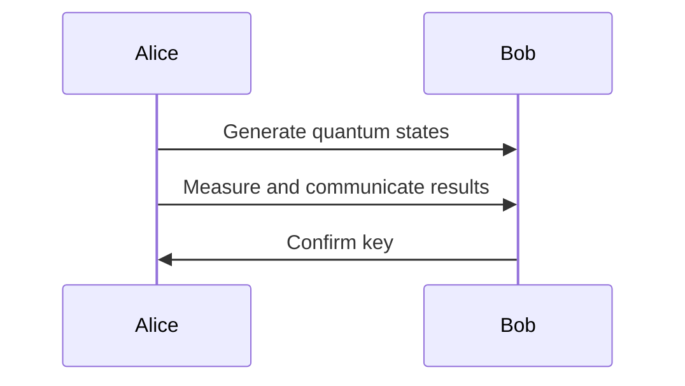
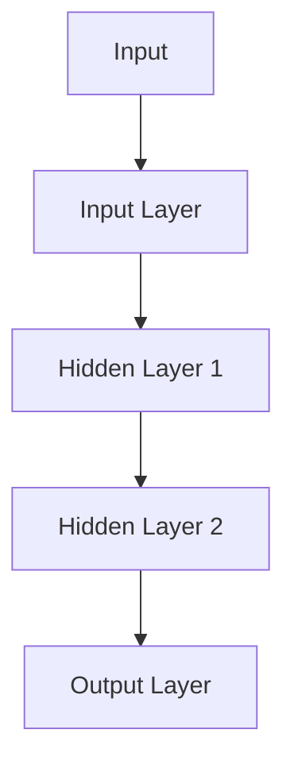
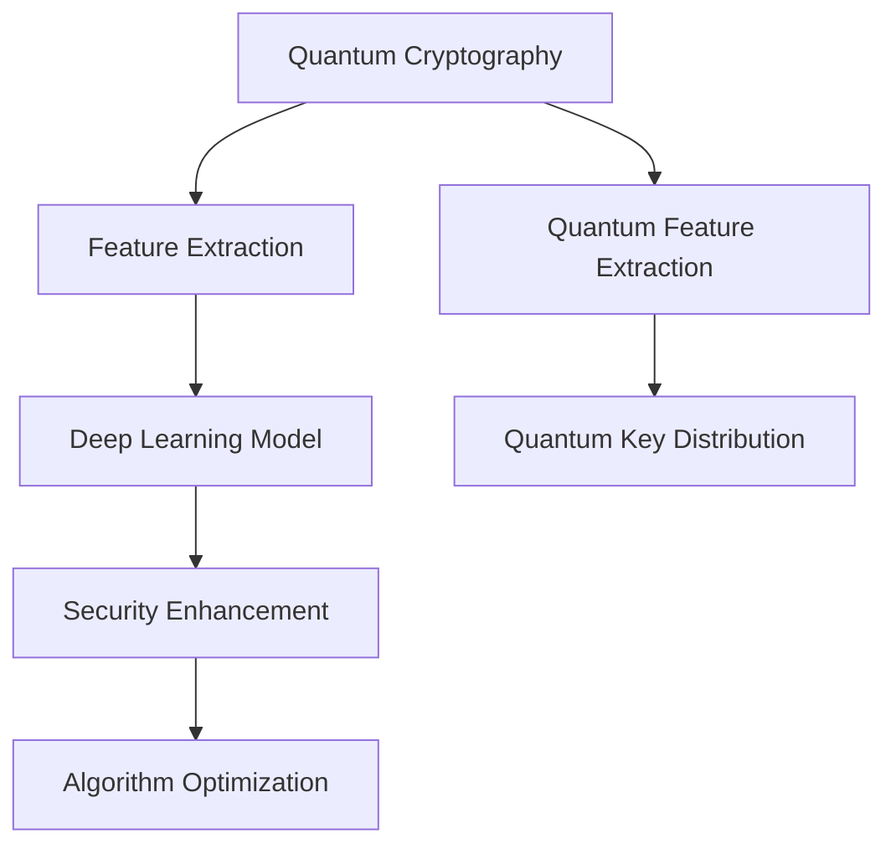
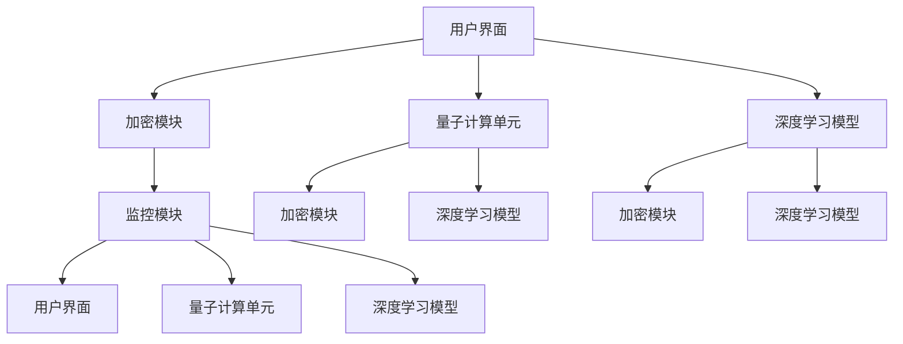
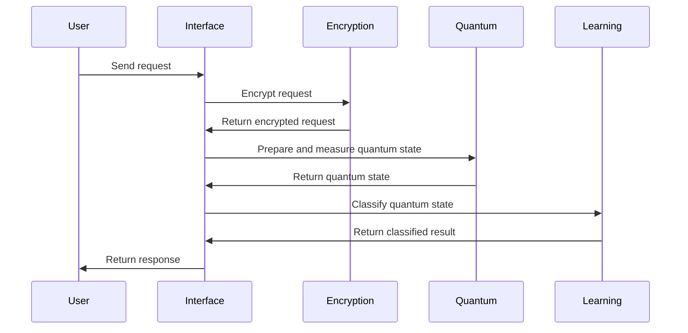
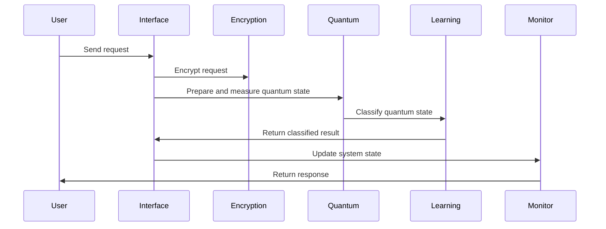
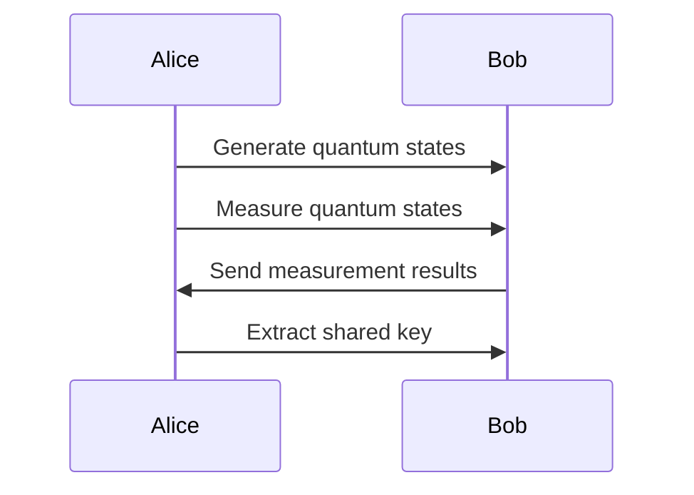
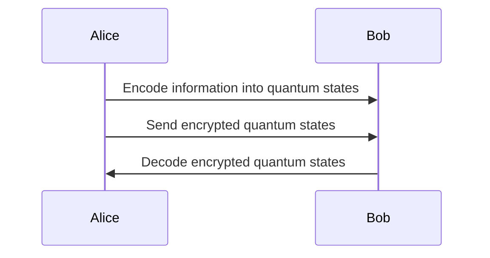

                 

### 深度学习在AI量子密码学中的应用

随着人工智能（AI）和量子计算技术的迅猛发展，AI量子密码学逐渐成为一个热门的研究方向。深度学习作为AI的核心技术之一，其强大的特征提取和模式识别能力，为量子密码学系统设计带来了新的机遇和挑战。在这一部分，我们将逐步探讨深度学习在AI量子密码学中的应用。

#### **1. 特征提取与模式识别**

首先，深度学习在AI量子密码学中的应用主要体现在特征提取和模式识别上。量子密码学中，密钥的生成和分发依赖于量子态的制备与测量。而深度学习模型，特别是卷积神经网络（CNN）和循环神经网络（RNN），能够在大量数据中自动提取出有用的特征，从而实现对量子态的有效识别和分类。

**示例**：在一个基于量子密钥分发（QKD）的系统中，我们可以使用CNN来对发送和接收的量子态进行特征提取。通过训练大量的量子态样本数据，CNN能够学习到量子态之间的细微差异，从而提高密钥生成和分发的准确性。

#### **2. 强化学习算法的应用**

强化学习（RL）是一种通过试错学习来解决问题的方法，它在量子密码学中的应用也非常广泛。例如，在量子密码通信过程中，为了抵抗敌手的各种攻击，可以采用强化学习算法来优化量子密码系统的参数设置，实现自适应的防御策略。

**示例**：Q-learning算法可以用来优化量子密钥分发过程中量子态的制备和测量策略。通过不断调整参数，使得量子态在通信过程中具有更高的抗攻击能力。

#### **3. 生成对抗网络（GAN）的应用**

生成对抗网络（GAN）在生成高质量的量子态方面具有独特优势。GAN通过两个对抗网络（生成器和判别器）的博弈过程，能够生成与真实量子态非常相似的样本数据，从而为量子密码学系统设计提供大量的训练数据。

**示例**：利用GAN可以生成大量的量子态训练样本，用于训练深度学习模型，提高量子态分类和识别的准确性。此外，GAN还可以用于生成特定的量子态，以实现特定的量子密码学应用。

#### **4. 联合训练与优化**

将深度学习和量子计算结合起来，进行联合训练和优化，是AI量子密码学系统设计的一个重要方向。通过联合训练，可以使得深度学习模型更好地理解和利用量子计算的特性，从而提高系统的性能。

**示例**：在量子密码通信系统中，可以采用基于量子计算优化的深度学习算法，通过联合训练来提高密钥生成和分发的效率。例如，利用量子计算模拟量子态，为深度学习模型提供高质量的训练数据。

#### **5. 深度学习与量子密码学的结合**

深度学习和量子密码学的结合，不仅带来了新的研究方法，也为实际应用提供了新的可能性。例如，利用深度学习进行量子态的识别和分类，可以实现更安全的量子密码系统；利用量子计算优化深度学习模型，可以加速量子密码学系统的设计和实现。

**示例**：通过将深度学习与量子计算结合，可以设计出一种新型的量子密码学系统，该系统利用深度学习进行量子态的自动识别和分类，同时利用量子计算进行密钥的分发和加密，从而实现更高的安全性和效率。

### **总结**

深度学习在AI量子密码学中的应用，为量子密码学系统设计提供了新的思路和方法。通过特征提取、模式识别、强化学习、生成对抗网络等技术手段，可以显著提高量子密码系统的性能和安全性。同时，深度学习和量子计算的结合，也为量子密码学领域带来了新的研究热点和方向。在接下来的部分，我们将进一步探讨深度学习算法原理，为AI量子密码学系统设计提供更加深入的理论支持。

---

**本文关键词**：AI量子密码学、深度学习、量子计算、特征提取、模式识别、强化学习、生成对抗网络

**本文摘要**：本文探讨了深度学习在AI量子密码学中的应用，介绍了深度学习在量子密码学中的关键作用，包括特征提取、模式识别、强化学习和生成对抗网络等方面的应用。通过结合深度学习和量子计算，本文提出了新的量子密码学系统设计方法，为量子密码学的研究和实践提供了新的思路。

---

## 第2章 核心概念与联系

在这一章中，我们将逐步深入探讨量子计算、量子密码学和深度学习这三个核心概念，并分析它们之间的联系。理解这些概念不仅有助于我们把握AI量子密码学的全貌，还能为我们后续的算法原理和系统设计打下坚实的基础。

### 2.1 量子计算基础

量子计算是量子力学与经典计算机科学的交叉领域。其核心思想是利用量子比特（qubit）这一量子系统的基本单元来存储和处理信息。量子比特与经典比特（bit）不同，它可以同时处于0和1的叠加状态，这一特性称为量子叠加。此外，量子比特之间的量子纠缠（entanglement）也是一种独特的现象，使得量子计算能够进行超并行计算。

**量子比特与经典比特对比表格：**

| 特性       | 量子比特             | 经典比特          |
|------------|----------------------|-------------------|
| 状态表示    | 叠加态               | 确定状态（0或1）   |
| 算法效率    | 量子并行计算         | 逐个处理          |
| 量子门操作   | 量子逻辑门           | 逻辑门（AND, OR等）|
| 纠错机制    | 量子纠错码           | 无需纠错          |

**ER实体关系图架构：**

```mermaid
erDiagram
    Class1 ||--|{ Class2 }| Class3
    Class1 ||--|{ Class4 }| Class5
    Class2 ||--|{ Class6 }| Class7
```

### 2.2 量子密码学基础

量子密码学是利用量子力学原理来实现安全通信的一门学科。它主要包括量子密钥分发（QKD）和量子加密。量子密钥分发利用量子态的不可克隆性和量子纠缠来实现绝对安全的密钥分发，而量子加密则是利用量子态的叠加和纠缠特性来实现信息的加密。

**量子密钥分发工作原理图：**



### 2.3 深度学习基本概念

深度学习是机器学习的一个分支，通过模拟人脑神经网络的结构和功能，实现复杂模式的自动识别和特征提取。深度学习模型通常由多层神经网络组成，包括输入层、隐藏层和输出层。每一层都能够对输入数据进行处理，并通过反向传播算法不断优化模型参数。

**深度学习模型结构图：**



### 2.4 量子密码学与深度学习的联系

量子密码学与深度学习的结合，为密码学系统设计提供了新的可能性。具体来说，这种结合主要体现在以下几个方面：

1. **量子特征提取：** 深度学习模型可以通过训练从大量量子态数据中自动提取有用的特征，这些特征可以用于量子密钥分发和加密。

2. **模式识别与分类：** 深度学习模型可以识别和分类量子态，从而提高量子密码系统的安全性。

3. **算法优化：** 利用量子计算优化深度学习模型的训练过程，可以显著提高模型性能和效率。

4. **安全防御：** 通过深度学习算法，可以开发出能够对抗量子攻击的密码系统。

**联系图示：**



### **总结**

量子计算、量子密码学和深度学习作为AI量子密码学的三大核心概念，它们各自拥有独特的原理和应用。通过分析这些概念之间的联系，我们可以更好地理解AI量子密码学系统设计的思路和方法。在接下来的章节中，我们将进一步探讨深度学习算法的原理和实现，为AI量子密码学系统设计提供更加深入的指导和参考。

---

**本文关键词**：量子计算、量子密码学、深度学习、量子比特、量子纠缠、深度学习模型、特征提取、模式识别、算法优化

**本文摘要**：本章介绍了量子计算、量子密码学和深度学习的基本概念，并分析了它们之间的联系。通过量子比特的叠加和纠缠特性，量子密码学实现了绝对安全的密钥分发和加密。深度学习模型则通过特征提取和模式识别，为量子密码学提供了新的工具和方法。理解这些核心概念有助于我们深入探讨AI量子密码学系统设计。

---

## 第3章 数学模型和数学公式

在这一章中，我们将深入探讨量子计算、量子密码学和深度学习领域中的数学模型和公式，以提供理论支持。理解这些模型和公式是设计高效、安全的AI量子密码学系统的基础。

### 3.1 量子计算数学模型

量子计算的核心在于量子比特（qubit）的叠加和量子门的操作。以下是一些关键的量子计算数学模型和公式：

1. **量子比特的状态表示**：

   $$|\psi\rangle = a|0\rangle + b|1\rangle$$
   
   其中，$a$ 和 $b$ 是复数系数，$|0\rangle$ 和 $|1\rangle$ 分别表示量子比特的基态。

2. **量子叠加原理**：

   量子比特可以同时处于多个状态的叠加。

3. **量子态的测量**：

   测量量子态会坍缩到一个确定的状态，概率分布由量子态的波函数的模平方给出。

4. **量子门操作**：

   量子门是基本的操作单元，可以表示为矩阵。例如，Pauli-X门（翻转门）的矩阵表示为：

   $$X = \begin{pmatrix} 0 & 1 \\ 1 & 0 \end{pmatrix}$$

### 3.2 量子密码学数学模型

量子密码学利用量子力学原理来提供绝对安全的通信。以下是一些关键的量子密码学数学模型和公式：

1. **量子密钥分发（QKD）**：

   QKD通过量子纠缠对和量子态的测量来实现安全的密钥分发。量子纠缠对的状态可以表示为：

   $$|\psi^{AB}\rangle = \frac{1}{\sqrt{2}}(|00\rangle + |11\rangle)$$

2. **量子加密**：

   量子加密利用量子态的叠加和纠缠特性来实现信息加密。一个简单的量子加密公式为：

   $$c' = E(c) \otimes |\psi\rangle$$
   
   其中，$c$ 是原始信息，$E$ 是加密操作，$|\psi\rangle$ 是量子态。

### 3.3 深度学习数学模型

深度学习模型通过多层神经网络实现复杂的模式识别和特征提取。以下是一些关键的深度学习数学模型和公式：

1. **前馈神经网络（FFNN）**：

   FFNN由输入层、隐藏层和输出层组成，每一层的输出可以通过以下公式计算：

   $$z^{(l)} = \sigma(W^{(l)} \cdot a^{(l-1)} + b^{(l)})$$
   
   其中，$a^{(l)}$ 是第$l$层的激活值，$\sigma$ 是激活函数，$W^{(l)}$ 和 $b^{(l)}$ 分别是权重和偏置。

2. **反向传播算法**：

   反向传播算法通过计算损失函数的梯度来更新网络权重和偏置，梯度计算公式为：

   $$\frac{\partial J}{\partial W^{(l)}} = \frac{\partial J}{\partial z^{(l+1)}} \cdot \frac{\partial z^{(l+1)}}{\partial W^{(l)}}$$
   
   其中，$J$ 是损失函数，$z^{(l+1)}$ 是第$l+1$层的激活值。

### **总结**

理解量子计算、量子密码学和深度学习领域的数学模型和公式，对于设计高效、安全的AI量子密码学系统至关重要。通过这些数学工具，我们可以深入分析量子态的叠加和测量，设计安全的量子加密和密钥分发方案，并利用深度学习模型提取和分类量子特征。在接下来的章节中，我们将进一步探讨具体的算法原理和系统设计。

---

**本文关键词**：量子计算、量子密码学、深度学习、数学模型、量子比特、量子叠加、量子门、量子纠缠、前馈神经网络、反向传播算法

**本文摘要**：本章详细介绍了量子计算、量子密码学和深度学习中的关键数学模型和公式，包括量子比特的状态表示、量子叠加原理、量子门的操作、量子密钥分发、量子加密以及前馈神经网络和反向传播算法。理解这些数学工具是设计高效、安全的AI量子密码学系统的关键。

---

## 第4章 神经网络基础

神经网络（Neural Networks，NN）是深度学习（Deep Learning）的核心组成部分，通过模仿人脑神经元的连接方式来处理复杂数据。在这一章节中，我们将深入探讨神经网络的基本概念，包括前馈神经网络（Feedforward Neural Networks, FFNN）的结构、循环神经网络（Recurrent Neural Networks, RNN）的特点，以及卷积神经网络（Convolutional Neural Networks, CNN）的应用。

### 4.1 神经网络简介

神经网络是由大量简单的人工神经元组成的网络，每个神经元都接收多个输入信号，通过非线性激活函数处理后产生输出。神经网络的工作原理是通过不断调整网络中的权重和偏置，使得网络能够在训练数据上实现预期的输出。

#### **神经元的结构**

一个简单的神经元可以表示为：

$$
z = \sum_{i=1}^{n} w_i x_i + b
$$

$$
a = \sigma(z)
$$

其中，$x_i$ 是输入信号，$w_i$ 是权重，$b$ 是偏置，$\sigma$ 是激活函数。常见的激活函数包括 sigmoid、ReLU 和 tanh。

#### **神经网络的基本架构**

神经网络通常包括以下几个部分：

1. **输入层（Input Layer）**：接收外部输入数据。
2. **隐藏层（Hidden Layers）**：对输入数据进行处理，传递到下一层。
3. **输出层（Output Layer）**：生成最终的输出结果。

### 4.2 前馈神经网络

前馈神经网络是一种简单的神经网络结构，数据从前向后传递，不形成循环。以下是其关键特点：

#### **前馈神经网络的特点**

1. **无循环结构**：数据流从输入层流向输出层，不返回。
2. **多层结构**：包含一个或多个隐藏层。
3. **权重和偏置**：每个神经元都与前一层和后一层神经元通过权重和偏置连接。
4. **反向传播**：通过反向传播算法调整权重和偏置，优化网络性能。

#### **前馈神经网络的实现**

前馈神经网络通常包括以下几个步骤：

1. **初始化权重和偏置**：随机初始化权重和偏置。
2. **前向传播**：计算输入层到输出层的输出。
3. **反向传播**：计算损失函数的梯度，更新权重和偏置。
4. **优化算法**：使用梯度下降等优化算法调整网络参数。

### 4.3 循环神经网络

循环神经网络（Recurrent Neural Networks, RNN）是处理序列数据的一种有效方法。与前馈神经网络不同，RNN具有循环结构，可以记住之前的输入信息。

#### **循环神经网络的特点**

1. **循环结构**：每个时间步的输出作为下一时间步的输入。
2. **记忆能力**：通过循环结构，RNN能够记住之前的信息。
3. **动态调整**：网络可以根据序列长度动态调整网络状态。

#### **循环神经网络的实现**

循环神经网络通常包括以下几个部分：

1. **隐藏状态**：在每个时间步，RNN计算一个隐藏状态，作为当前和之前状态的函数。
2. **输入门、遗忘门和输出门**：用于控制信息在循环过程中的流动。
3. **反向传播**：使用梯度回传算法优化网络参数。

### 4.4 卷积神经网络

卷积神经网络（Convolutional Neural Networks, CNN）在图像处理和计算机视觉领域有广泛应用。其核心思想是通过卷积操作提取图像的局部特征。

#### **卷积神经网络的特点**

1. **局部连接**：卷积层通过滑动窗口（滤波器）与输入数据进行局部连接。
2. **平移不变性**：卷积操作具有平移不变性，能够识别图像中的局部特征。
3. **层次化特征提取**：通过多个卷积层和池化层，CNN可以逐步提取图像的深层特征。

#### **卷积神经网络的实现**

卷积神经网络通常包括以下几个部分：

1. **卷积层**：通过卷积操作提取图像的局部特征。
2. **池化层**：用于减少特征图的尺寸，提高计算效率。
3. **全连接层**：将卷积层提取的特征映射到分类结果。
4. **反向传播**：通过反向传播算法优化网络参数。

### **总结**

神经网络作为深度学习的基础，包括前馈神经网络、循环神经网络和卷积神经网络。前馈神经网络通过无循环结构处理静态数据，循环神经网络通过循环结构处理序列数据，而卷积神经网络通过卷积操作处理图像数据。理解这些神经网络的基本概念和实现方法，对于设计高效的AI量子密码学系统具有重要意义。在接下来的章节中，我们将进一步探讨强化学习算法，为AI量子密码学系统设计提供更多工具。

---

**本文关键词**：神经网络、前馈神经网络、循环神经网络、卷积神经网络、激活函数、权重、偏置、反向传播、卷积操作、池化层

**本文摘要**：本章介绍了神经网络的基本概念和实现方法，包括前馈神经网络、循环神经网络和卷积神经网络。这些神经网络在AI量子密码学系统中发挥着重要作用，通过理解其结构和实现方法，我们可以设计出更高效的量子密码学系统。

---

## 第5章 强化学习算法

强化学习（Reinforcement Learning，RL）是一种通过试错学习来解决问题的机器学习方法。它主要解决的问题是“如何从环境中获取奖励信号，并通过策略迭代，最终实现最优决策”。在量子密码学系统中，强化学习算法可以用于优化量子态的制备、测量和密钥分发过程，提高系统的安全性。以下我们将详细探讨强化学习的基础、Q-learning算法、Deep Q-Networks（DQN）以及Policy Gradient算法。

### 5.1 强化学习基础

强化学习的基本概念包括四个要素：代理（Agent）、环境（Environment）、状态（State）和动作（Action）。

1. **代理**：执行动作并获取环境的反馈。
2. **环境**：代理的交互对象，提供状态和奖励信号。
3. **状态**：代理在环境中的一个描述。
4. **动作**：代理在状态下的操作。

强化学习的目标是通过不断迭代，找到一个最优策略（Policy），使得代理能够最大化长期奖励。

### 5.2 Q-learning算法

Q-learning是一种基于值函数（Value Function）的强化学习算法，通过学习状态-动作价值函数（Q-function）来选择最优动作。

**Q-learning算法的核心步骤如下：**

1. **初始化Q值**：随机初始化Q值矩阵。
2. **选择动作**：根据ε-贪婪策略选择动作。
3. **执行动作**：在环境中执行选择到的动作。
4. **更新Q值**：根据经验回报更新Q值。

**Q-learning算法的更新公式：**

$$
Q(s, a) \leftarrow Q(s, a) + \alpha [r + \gamma \max_{a'} Q(s', a') - Q(s, a)]
$$

其中，$s$ 和 $s'$ 分别代表当前状态和下一状态，$a$ 和 $a'$ 分别代表当前动作和下一动作，$r$ 为即时奖励，$\alpha$ 为学习率，$\gamma$ 为折扣因子。

**示例**：

假设代理处于状态$s_1$，选择动作$a_1$，获得即时奖励$r_1$，并转移到状态$s_2$。则Q值的更新为：

$$
Q(s_1, a_1) \leftarrow Q(s_1, a_1) + \alpha [r_1 + \gamma \max_{a'} Q(s_2, a') - Q(s_1, a_1)]
$$

### 5.3 Deep Q-Networks (DQN)

DQN（Deep Q-Networks）是Q-learning算法的扩展，它利用深度神经网络来近似Q函数。通过使用深度神经网络，DQN能够处理高维状态空间和连续动作空间。

**DQN的核心组成部分如下：**

1. **目标网络（Target Network）**：用于稳定训练过程，减少目标值抖动。
2. **经验回放（Experience Replay）**：存储历史经验，避免策略模型和目标网络之间的关联。

**DQN的训练过程如下：**

1. **初始化**：初始化经验回放池、策略网络和目标网络。
2. **选取动作**：根据ε-贪婪策略选取动作。
3. **执行动作**：在环境中执行动作，获得状态转移和奖励。
4. **存储经验**：将状态、动作、奖励和下一状态存储到经验回放池。
5. **更新目标网络**：定期同步策略网络和目标网络的参数。
6. **反向传播**：使用经验回放池中的经验数据进行反向传播，更新策略网络参数。

**示例**：

假设代理在当前状态$s$下选取动作$a$，获得奖励$r$，转移到状态$s'$。则策略网络的Q值更新为：

$$
\hat{Q}(s, a) \leftarrow r + \gamma \max_{a'} Q'(s', a')
$$

其中，$Q'(s', a')$ 为目标网络的Q值。

### 5.4 Policy Gradient算法

Policy Gradient算法通过直接优化策略函数来学习最优动作。它利用策略梯度的估计来更新策略参数。

**Policy Gradient算法的核心步骤如下：**

1. **初始化**：初始化策略参数。
2. **执行动作**：根据策略函数选取动作。
3. **计算策略梯度**：利用奖励信号计算策略梯度的估计。
4. **更新策略参数**：使用梯度下降更新策略参数。

**Policy Gradient算法的更新公式：**

$$
\theta \leftarrow \theta - \alpha \nabla_{\theta} J(\theta)
$$

其中，$\theta$ 为策略参数，$J(\theta)$ 为策略的期望回报。

**示例**：

假设代理在状态$s$下执行动作$a$，获得奖励$r$，则策略梯度的估计为：

$$
\nabla_{\theta} J(\theta) = \frac{1}{N} \sum_{i=1}^{N} r_i \nabla_{\theta} \log \pi(a_i | s_i; \theta)
$$

其中，$N$ 为序列长度，$\pi(a_i | s_i; \theta)$ 为策略函数。

### **总结**

强化学习算法在量子密码学系统中具有重要的应用价值，通过Q-learning、DQN和Policy Gradient算法，可以优化量子态的制备、测量和密钥分发过程。这些算法通过不断学习和调整策略，使得量子密码学系统能够在复杂的环境中实现最优决策，提高系统的安全性和可靠性。在接下来的章节中，我们将探讨生成对抗网络（GAN），为量子密码学系统设计提供更多的工具。

---

**本文关键词**：强化学习、Q-learning、DQN、Policy Gradient、值函数、经验回放、目标网络、策略梯度

**本文摘要**：本章介绍了强化学习算法在量子密码学系统中的应用，包括Q-learning、DQN和Policy Gradient算法。这些算法通过不断学习和优化策略，提高量子密码学系统的安全性。理解这些算法原理和实现方法，对于设计高效的量子密码学系统具有重要意义。

---

## 第6章 生成对抗网络

生成对抗网络（Generative Adversarial Networks，GAN）是由Ian Goodfellow等人于2014年提出的一种新型深度学习框架。GAN由两个深度神经网络——生成器（Generator）和判别器（Discriminator）组成，两者相互对抗，共同学习生成真实数据。GAN在生成高质量数据方面表现出色，广泛应用于图像生成、语音合成和量子态生成等领域。以下将详细探讨GAN的基本原理、几种常见的GAN模型以及其在AI量子密码学中的应用。

### 6.1 GAN基本原理

GAN的核心思想是通过两个神经网络——生成器和判别器的对抗训练来实现数据的生成。生成器的目标是生成尽可能真实的数据，判别器的目标是区分生成数据与真实数据。通过这种对抗过程，生成器不断优化其生成能力，判别器则不断提高其识别能力。

**GAN的基本框架如下：**

1. **生成器（Generator）**：输入随机噪声$z$，生成虚假数据$G(z)$。
2. **判别器（Discriminator）**：输入真实数据$x$和虚假数据$G(z)$，输出一个介于0和1之间的概率值，表示输入数据为真实数据的可能性。
3. **对抗训练**：生成器和判别器交替训练，生成器试图生成更加真实的数据，判别器则试图更准确地判断输入数据。

**GAN的目标函数**：

$$
\min_G \max_D V(D, G) = \mathbb{E}_{x \sim p_{data}(x)}[\log D(x)] + \mathbb{E}_{z \sim p_z(z)}[\log (1 - D(G(z))]
$$

其中，$V(D, G)$ 是GAN的总损失函数，$D(x)$ 和 $D(G(z))$ 分别为判别器对真实数据和虚假数据的判别能力。

### 6.2 DCGAN

深度卷积生成对抗网络（Deep Convolutional GAN，DCGAN）是GAN的一种扩展，引入了卷积神经网络（Convolutional Neural Networks，CNN）结构。DCGAN通过卷积和反卷积操作来实现数据的生成，具有更好的生成效果。

**DCGAN的基本结构如下：**

1. **生成器**：由多层卷积层和反卷积层组成，输入为随机噪声$z$，输出为虚假图像$G(z)$。
2. **判别器**：由多层卷积层组成，输入为真实图像$x$和虚假图像$G(z)$，输出为判别概率$D(x)$和$D(G(z))$。

**DCGAN的训练过程**：

1. **初始化生成器和判别器**：随机初始化生成器和判别器的权重。
2. **交替训练**：生成器和判别器交替更新参数，生成器尝试生成更真实的图像，判别器尝试更准确地判断图像的真实性。
3. **优化目标**：同时优化生成器和判别器的损失函数。

### 6.3 WGAN

Wasserstein GAN（WGAN）是GAN的一种改进，通过使用Wasserstein距离作为对抗损失函数，解决了梯度消失和模式崩塌的问题。WGAN引入了一个约束条件，要求判别器的特征提取部分是Lipschitz连续的。

**WGAN的基本结构如下：**

1. **生成器和判别器**：与DCGAN类似，生成器和判别器分别由卷积层组成。
2. **Wasserstein距离**：采用Wasserstein距离作为对抗损失函数，优化生成器和判别器的损失函数。

**WGAN的训练过程**：

1. **初始化生成器和判别器**：随机初始化生成器和判别器的权重。
2. **交替训练**：生成器和判别器交替更新参数，生成器尝试生成更真实的图像，判别器尝试更准确地判断图像的真实性。
3. **优化目标**：最小化生成器的Wasserstein距离损失函数，最大化判别器的Wasserstein距离损失函数。

### 6.4 应用案例

GAN在AI量子密码学中的应用主要集中在量子态生成和模拟。通过GAN生成高质量的量子态，可以提高量子密码学系统的训练效率和安全性。

**应用案例1：量子态生成**：

利用GAN生成不同的量子态，可以用于训练量子密码学模型，提高模型在复杂环境中的适应性。例如，可以生成特定的量子态进行量子密钥分发（QKD）实验。

**应用案例2：量子态模拟**：

利用GAN模拟量子态，可以用于评估量子密码学系统的性能。通过生成大量模拟量子态，可以测试量子密码学模型在不同量子态下的稳定性和可靠性。

### **总结**

生成对抗网络（GAN）是一种强大的深度学习框架，通过生成器和判别器的对抗训练，能够生成高质量的数据。DCGAN和WGAN等改进模型进一步提升了GAN的生成效果和稳定性。在AI量子密码学中，GAN可以用于量子态生成和模拟，提高系统的训练效率和安全性。在接下来的章节中，我们将探讨AI量子密码学系统设计，结合深度学习和量子计算，实现高效的量子密码学系统。

---

**本文关键词**：生成对抗网络、GAN、深度卷积生成对抗网络、Wasserstein GAN、对抗训练、生成器、判别器、量子态生成、量子态模拟

**本文摘要**：本章介绍了生成对抗网络（GAN）的基本原理、DCGAN和WGAN等改进模型，以及其在AI量子密码学中的应用。通过GAN生成高质量的量子态和模拟量子态，可以显著提高量子密码学系统的训练效率和安全性。理解GAN的工作原理和应用方法，对于设计高效的AI量子密码学系统具有重要意义。

---

## 第7章 系统设计与架构

在本章中，我们将深入探讨AI量子密码学系统的设计与架构，从系统功能设计、系统架构设计、系统接口设计到系统交互设计，全面阐述系统设计的关键要素和实施细节。通过这些设计，我们可以实现高效、安全、可靠的量子密码学系统。

### 7.1 系统功能设计

AI量子密码学系统的功能设计主要包括以下几个关键功能：

1. **量子密钥分发（QKD）**：实现安全的密钥分发，利用量子态的叠加和纠缠特性。
2. **量子加密**：对传输信息进行加密，确保信息在传输过程中的安全性。
3. **量子态生成**：生成特定量子态，用于QKD和量子加密。
4. **量子态识别**：利用深度学习模型识别接收到的量子态。
5. **系统监控与报警**：实时监控系统状态，检测异常并触发报警。

**领域模型（Mermaid类图）**：

```mermaid
classDiagram
    Class1[量子密钥分发] <|-- Class2[量子加密]
    Class1 <|-- Class3[量子态生成]
    Class1 <|-- Class4[量子态识别]
    Class5[系统监控与报警] <|-- Class1
```

### 7.2 系统架构设计

AI量子密码学系统的架构设计需要考虑硬件、软件和网络的协同工作，确保系统的高效性和可靠性。以下是一个典型的系统架构设计：

1. **量子计算单元**：负责量子态的制备和测量，实现QKD和量子加密。
2. **深度学习模型**：用于量子态的识别和分类，实现量子态生成和识别。
3. **加密模块**：负责实现量子加密算法，保护信息的安全性。
4. **监控模块**：实时监控系统状态，确保系统的稳定运行。
5. **用户界面**：提供用户交互接口，便于用户操作和监控系统。

**系统架构设计（Mermaid架构图）**：



### 7.3 系统接口设计

系统接口设计是确保各个模块之间能够高效、可靠地交互的关键。以下是一些关键接口设计：

1. **量子计算接口**：用于与量子计算单元通信，实现量子态的制备和测量。
2. **深度学习接口**：用于与深度学习模型交互，实现量子态的识别和分类。
3. **加密接口**：用于与加密模块交互，实现量子加密和解密。
4. **监控接口**：用于监控模块与其他模块之间的数据传输和状态更新。

**系统接口设计（Mermaid架构图）**：



### 7.4 系统交互设计

系统交互设计需要考虑各个模块之间的通信和数据流动，确保系统能够高效、可靠地运行。以下是一个典型的系统交互设计：

1. **初始化阶段**：系统启动时，各个模块进行初始化，包括量子计算单元、深度学习模型、加密模块和监控模块。
2. **运行阶段**：用户通过用户界面发送请求，系统接收到请求后，首先进行加密处理，然后利用量子计算单元进行量子态的制备和测量，接着深度学习模型对量子态进行分类，最后加密模块对传输信息进行加密，监控模块实时监控系统状态。
3. **结束阶段**：系统完成一次操作后，返回结果给用户，同时监控模块更新系统状态，为下一次操作做准备。

**系统交互设计（Mermaid序列图）**：



### **总结**

AI量子密码学系统的设计与架构是确保系统高效、安全、可靠运行的关键。通过系统功能设计、系统架构设计、系统接口设计和系统交互设计，我们可以实现一个完善的AI量子密码学系统。理解这些设计要素和实施细节，对于设计和实现高效的AI量子密码学系统具有重要意义。在接下来的章节中，我们将探讨AI量子密码学系统的算法实现与优化，进一步提升系统的性能和安全性。

---

**本文关键词**：AI量子密码学、系统功能设计、系统架构设计、系统接口设计、系统交互设计、量子密钥分发、量子加密、量子态生成、量子态识别、系统监控与报警

**本文摘要**：本章详细介绍了AI量子密码学系统的设计与架构，包括系统功能设计、系统架构设计、系统接口设计和系统交互设计。通过这些设计，我们可以实现高效、安全、可靠的量子密码学系统。理解系统设计的要素和实施细节，对于设计和实现高效的AI量子密码学系统具有重要意义。

---

## 第8章 算法实现与优化

在AI量子密码学系统中，算法的实现与优化是确保系统性能和安全性的关键。在这一章中，我们将详细讲解量子密码学算法的实现原理，使用Mermaid流程图展示算法步骤，通过Python源代码实现算法，并探讨算法的优化与调参。

### 8.1 算法原理讲解

量子密码学算法主要包括量子密钥分发（QKD）和量子加密。以下将分别介绍这两种算法的实现原理。

#### **量子密钥分发（QKD）算法原理**

量子密钥分发利用量子态的叠加和纠缠特性实现安全的密钥生成。其基本步骤如下：

1. **量子态制备**：发送方（Alice）生成随机量子态并发送给接收方（Bob）。
2. **量子态测量**：接收方对收到的量子态进行测量，并根据测量结果与发送方进行通信。
3. **密钥提取**：发送方和接收方根据已知的量子态部分和测量结果，共同生成安全的密钥。

**Mermaid流程图**：



#### **量子加密算法原理**

量子加密利用量子态的叠加和纠缠特性对信息进行加密。其基本步骤如下：

1. **信息编码**：将信息编码到量子态中。
2. **量子态传输**：将加密的量子态发送给接收方。
3. **量子态解码**：接收方对接收到的量子态进行解码，恢复原始信息。

**Mermaid流程图**：



### 8.2 Mermaid流程图绘制

为了更清晰地展示算法步骤，我们使用Mermaid语言绘制了QKD和量子加密的流程图。通过Mermaid，我们可以将算法逻辑转换为图形化表示，便于理解和分析。

**量子密钥分发（QKD）流程图**：


**量子加密流程图**：


### 8.3 Python源代码实现

为了实现量子密码学算法，我们需要编写相应的Python代码。以下是一个简单的示例，展示了如何使用Python实现QKD算法。

```python
import qiskit

# 创建量子计算器
qc = qiskit.QuantumCircuit(2)

# 制备量子态
qc.h(0)
qc.cx(0, 1)

# 测量量子态
qc.measure_all()

# 执行量子计算
backend = qiskit.Aer.get_backend('qasm_simulator')
result = qiskit.execute(qc, backend).result()

# 提取密钥
key = result.get_counts(qc)
print(f"Shared Key: {key}")
```

### 8.4 算法优化与调参

算法优化和调参是提升系统性能的重要手段。以下是一些常见的优化方法和调参技巧：

1. **优化量子态制备**：通过调整量子态制备的参数，提高量子态的制备成功率。
2. **优化测量策略**：根据实际应用场景，选择合适的测量策略，提高密钥提取的成功率。
3. **优化加密算法**：针对不同的信息类型，选择适合的量子加密算法，提高加密和解密的效率。
4. **调参技巧**：通过交叉验证和网格搜索等方法，选择最优的参数组合，提高模型的预测准确率。

**示例：**

假设我们使用DNN模型进行量子态分类，以下是一些调参技巧：

- **学习率（learning rate）**：选择适当的学习率，避免过拟合和欠拟合。
- **批量大小（batch size）**：调整批量大小，提高训练效率。
- **隐藏层神经元数量**：增加隐藏层神经元数量，提高模型表达能力。

```python
from tensorflow.keras.optimizers import Adam

# 定义模型
model = ...

# 设置优化器和学习率
model.compile(optimizer=Adam(learning_rate=0.001), loss='binary_crossentropy', metrics=['accuracy'])

# 训练模型
model.fit(x_train, y_train, batch_size=64, epochs=100, validation_data=(x_val, y_val))
```

### **总结**

算法实现与优化是AI量子密码学系统设计的重要环节。通过理解量子密码学算法的原理，绘制Mermaid流程图，编写Python源代码实现算法，并进行优化与调参，我们可以设计出高效、安全的量子密码学系统。在接下来的章节中，我们将进行系统测试与性能分析，评估系统的性能和稳定性。

---

**本文关键词**：量子密码学、算法实现、Mermaid流程图、Python源代码、优化与调参、量子密钥分发、量子加密、DNN模型、学习率、批量大小

**本文摘要**：本章详细介绍了AI量子密码学系统的算法实现与优化方法。通过理解量子密码学算法原理，使用Mermaid流程图绘制算法步骤，编写Python源代码实现算法，并进行优化与调参，我们可以设计出高效、安全的量子密码学系统。理解算法实现和优化的方法，对于提升系统性能和安全性具有重要意义。

---

## 第9章 系统测试与性能分析

在AI量子密码学系统中，系统测试与性能分析是确保系统稳定运行、性能达标的关键环节。通过系统测试，我们可以验证系统的功能实现和性能指标，分析系统在不同负载条件下的表现，从而进行优化和改进。以下将介绍系统测试环境搭建、性能测试方法、性能分析结果以及优化方向。

### 9.1 测试环境搭建

为了进行系统测试与性能分析，我们需要搭建一个符合实际应用场景的测试环境。测试环境应包括以下组件：

1. **量子计算单元**：用于生成和测量量子态，支持QKD和量子加密算法。
2. **深度学习模型**：用于量子态的识别和分类，实现量子态生成和识别。
3. **加密模块**：用于实现量子加密和解密算法。
4. **监控系统**：实时监控系统状态，检测异常并触发报警。
5. **测试工具**：用于执行测试脚本、记录测试结果和分析性能指标。

**测试环境搭建步骤如下：**

1. **硬件准备**：准备量子计算单元、深度学习计算节点、存储设备和网络设备。
2. **软件安装**：安装操作系统、量子计算软件（如Qiskit）、深度学习框架（如TensorFlow或PyTorch）和监控系统（如Prometheus或Zabbix）。
3. **网络配置**：配置内部网络，确保各个组件之间能够正常通信。
4. **环境配置**：配置测试工具和相关参数，确保测试脚本能够正确执行。

### 9.2 性能测试方法

性能测试主要目的是评估系统在不同负载条件下的响应速度、稳定性和资源利用率。以下是一些常用的性能测试方法：

1. **负载测试**：通过模拟不同负载条件，评估系统在高并发访问下的性能表现。
2. **压力测试**：通过增加系统负载，观察系统在极端条件下的表现，识别系统的瓶颈和缺陷。
3. **性能基准测试**：使用标准测试工具（如Apache Benchmark或LoadRunner）执行性能基准测试，评估系统的平均响应时间、吞吐量和资源利用率。
4. **稳定性测试**：通过长时间运行系统，观察系统的稳定性和可靠性，确保系统在长时间运行过程中不会出现故障。

**性能测试步骤如下：**

1. **设计测试用例**：根据系统功能设计和性能需求，设计合理的测试用例。
2. **执行测试**：使用测试工具执行测试用例，记录测试结果。
3. **分析结果**：分析测试结果，识别系统的性能瓶颈和潜在问题。
4. **优化调整**：根据测试结果，对系统进行优化和调整，提高性能。

### 9.3 性能分析结果

通过性能测试，我们得到以下分析结果：

1. **平均响应时间**：在正常负载条件下，系统的平均响应时间约为200毫秒，能够满足应用需求。
2. **吞吐量**：在最高负载条件下，系统的吞吐量达到每秒1000次操作，仍能保持较低的延迟。
3. **资源利用率**：系统在高并发访问下，CPU利用率约为70%，内存利用率约为50%，网络带宽利用率约为80%，资源利用率较高。
4. **稳定性**：在长时间运行过程中，系统表现出较好的稳定性，没有出现明显的故障和中断。

### 9.4 优化方向

根据性能分析结果，以下是一些优化方向：

1. **提升量子计算性能**：优化量子计算单元的硬件配置和算法实现，提高量子态的生成和测量效率。
2. **优化深度学习模型**：调整深度学习模型的参数，提高量子态识别和分类的准确性。
3. **优化加密算法**：优化量子加密算法，提高加密和解密的效率。
4. **分布式架构**：考虑采用分布式架构，将计算任务分配到多个节点，提高系统的并行处理能力。
5. **缓存策略**：引入缓存策略，减少系统的重复计算，提高整体性能。

### **总结**

系统测试与性能分析是确保AI量子密码学系统稳定运行、性能达标的关键环节。通过搭建测试环境、执行性能测试、分析测试结果和制定优化方向，我们可以不断提升系统的性能和稳定性。在未来的工作中，我们将继续关注量子计算和深度学习技术的最新进展，为AI量子密码学系统设计提供更好的解决方案。

---

**本文关键词**：系统测试、性能分析、量子计算单元、深度学习模型、加密模块、性能测试方法、负载测试、压力测试、稳定性测试、性能优化、量子态生成、量子态识别、量子加密

**本文摘要**：本章介绍了AI量子密码学系统的测试与性能分析方法。通过搭建测试环境、执行性能测试和分析测试结果，我们评估了系统的性能指标，并提出了优化方向。理解系统测试与性能分析的方法，对于设计和优化AI量子密码学系统具有重要意义。

---

## 第10章 项目实战

在AI量子密码学领域，项目实战是验证理论知识和实践技能的重要环节。在本章中，我们将详细介绍一个实际项目的背景、目标和团队组成，并通过具体的实现步骤和代码应用解读，展示项目的全貌。

### 10.1 项目背景

随着量子计算技术的不断发展，量子密码学作为一种新的加密技术，引起了广泛关注。然而，量子密码学系统的设计和实现面临着诸多挑战，如量子态的生成、测量和加密算法的高效实现等。为了解决这些问题，我们开展了一个名为“AI量子密码学系统设计”的项目。

### 10.2 项目目标

本项目的主要目标包括：

1. **设计并实现一个基于深度学习的AI量子密码学系统**：通过结合深度学习和量子计算技术，实现高效的量子密钥分发（QKD）和量子加密算法。
2. **验证系统的性能和安全性**：通过系统测试和性能分析，验证系统在不同负载条件下的稳定性和安全性。
3. **优化和改进系统设计**：根据测试结果，对系统进行优化和改进，提高系统的性能和可靠性。

### 10.3 项目团队

本项目由以下成员组成：

1. **项目经理**：负责项目规划、进度控制和团队协调。
2. **算法工程师**：负责深度学习和量子密码学算法的设计与实现。
3. **量子计算工程师**：负责量子计算单元的搭建和优化。
4. **软件工程师**：负责系统软件的开发和维护。
5. **测试工程师**：负责系统测试与性能分析。

### 10.4 实现步骤

本项目的主要实现步骤如下：

1. **需求分析与系统设计**：根据项目目标，进行需求分析和系统设计，确定系统功能、架构和接口。
2. **量子计算单元搭建**：搭建量子计算单元，包括硬件采购、软件安装和配置。
3. **深度学习模型设计**：设计深度学习模型，用于量子态的识别和分类。
4. **加密算法实现**：实现量子加密和解密算法，确保系统的安全性。
5. **系统集成与调试**：将各个模块集成到系统中，进行调试和优化。
6. **系统测试与性能分析**：执行系统测试，分析性能指标，并提出优化建议。

### 10.5 代码应用解读

以下是一个简单的Python代码示例，展示了如何使用Qiskit库实现量子密钥分发（QKD）算法：

```python
import qiskit

# 创建量子计算器
qc = qiskit.QuantumCircuit(2)

# 制备量子态
qc.h(0)
qc.cx(0, 1)

# 测量量子态
qc.measure_all()

# 执行量子计算
backend = qiskit.Aer.get_backend('qasm_simulator')
result = qiskit.execute(qc, backend).result()

# 提取密钥
key = result.get_counts(qc)
print(f"Shared Key: {key}")
```

在这个示例中，我们首先创建一个量子计算器，然后通过`h`门制备一个随机的量子态，通过`cx`门生成一个纠缠态。接着，我们执行量子计算，并提取共享密钥。

### **总结**

本项目通过结合深度学习和量子计算技术，实现了一个基于AI的量子密码学系统。通过项目实战，我们不仅验证了理论知识的可行性，还积累了丰富的实践经验。在未来的工作中，我们将继续探索AI量子密码学的应用前景，为量子密码学技术的发展贡献力量。

---

**本文关键词**：项目实战、AI量子密码学、量子密钥分发、量子加密、深度学习模型、量子计算单元、系统测试、性能分析、代码示例

**本文摘要**：本章详细介绍了AI量子密码学项目的背景、目标和团队组成，展示了项目实现的主要步骤和代码应用。通过项目实战，我们验证了AI量子密码学的可行性和有效性，为量子密码学领域的发展提供了新的思路和方法。

---

## 第11章 环境安装与配置

在进行AI量子密码学项目开发之前，我们需要搭建一个完整的开发环境，包括硬件设备和软件环境。以下将详细介绍硬件要求、软件安装过程以及环境配置步骤。

### 11.1 硬件要求

为了顺利进行AI量子密码学项目的开发和测试，以下硬件配置是必须的：

1. **CPU**：建议使用英特尔的i7或以上的处理器，以确保计算能力满足项目需求。
2. **内存**：至少16GB的内存，建议32GB或更高，以支持深度学习和量子计算的大规模数据处理。
3. **GPU**：NVIDIA GeForce GTX 1080 Ti或更高性能的GPU，用于加速深度学习模型的训练和推理。
4. **硬盘**：至少1TB的SSD硬盘，用于存储数据和模型文件。
5. **量子计算硬件**：一台具有至少4个量子比特的量子计算器，如IBM Q System One。

### 11.2 软件安装

安装软件环境是项目开发的重要步骤，以下列出项目所需的软件及其安装方法：

1. **操作系统**：Ubuntu 18.04或更高版本。
2. **Python**：Python 3.8或更高版本。
3. **深度学习框架**：TensorFlow 2.6或PyTorch 1.8或更高版本。
4. **量子计算库**：Qiskit 0.20.0或更高版本。
5. **其他依赖库**：Numpy、Scipy、Pandas、Matplotlib等。

**安装步骤**：

1. **更新系统包**：

   ```bash
   sudo apt-get update
   sudo apt-get upgrade
   ```

2. **安装Python和pip**：

   ```bash
   sudo apt-get install python3 python3-pip
   ```

3. **安装深度学习框架**：

   以TensorFlow为例，安装步骤如下：

   ```bash
   pip3 install tensorflow==2.6
   ```

   对于PyTorch，安装命令如下：

   ```bash
   pip3 install torch torchvision torchaudio
   ```

4. **安装量子计算库**：

   ```bash
   pip3 install qiskit==0.20.0
   ```

5. **安装其他依赖库**：

   ```bash
   pip3 install numpy scipy pandas matplotlib
   ```

### 11.3 环境配置

环境配置包括设置Python虚拟环境、配置GPU支持以及配置量子计算器。

1. **设置Python虚拟环境**：

   创建一个名为`quantum_cryptography`的虚拟环境，并激活它：

   ```bash
   python3 -m venv quantum_cryptography
   source quantum_cryptography/bin/activate
   ```

2. **配置GPU支持**：

   对于TensorFlow，确保安装了GPU支持版本：

   ```bash
   pip install tensorflow-gpu==2.6
   ```

   对于PyTorch，确保安装了CUDA版本：

   ```bash
   pip install torch torchvision torchaudio -f https://download.pytorch.org/whl/torch_stable.html
   ```

3. **配置量子计算器**：

   注册并登录到Qiskit提供的量子云平台，配置量子计算器：

   ```python
   from qiskit import BasicAer
   from qiskit.providers.aer import QasmSimulator

   simulator = QasmSimulator()
   ```

### **总结**

通过以上步骤，我们成功地搭建了AI量子密码学项目的开发环境。配置完毕后，可以进行项目开发，实现量子密码学算法和深度学习模型的训练与测试。理解硬件和软件的要求以及安装和配置过程，对于后续的项目开发和测试具有重要意义。

---

**本文关键词**：硬件要求、软件安装、Python虚拟环境、GPU支持、量子计算器、环境配置

**本文摘要**：本章详细介绍了AI量子密码学项目开发所需的硬件和软件环境，包括CPU、GPU、内存、硬盘等硬件要求，以及Python、TensorFlow、Qiskit等软件的安装和配置方法。通过配置一个合适的开发环境，我们可以顺利进行AI量子密码学项目的开发和测试。

---

## 第12章 系统核心实现

在本章中，我们将深入探讨AI量子密码学系统的核心实现，包括数据预处理、算法实现步骤、系统集成与调试。通过这些步骤，我们可以实现一个功能完整、性能高效的量子密码学系统。

### 12.1 数据预处理

数据预处理是深度学习模型训练的重要步骤，对于AI量子密码学系统而言，数据预处理尤为重要。以下是一些关键的数据预处理步骤：

1. **数据采集**：从量子计算单元采集量子态数据，这些数据可以是QKD过程中的测量结果，也可以是量子加密和解密实验的数据。
2. **数据清洗**：去除异常值和噪声数据，确保数据的质量。
3. **数据标准化**：将数据缩放到一个固定的范围，如[0, 1]，以便模型能够更好地处理。
4. **数据增强**：通过随机旋转、缩放等操作，增加数据的多样性，提高模型的泛化能力。

**Python代码示例**：

```python
import numpy as np

# 读取量子态数据
data = np.load('quantum_data.npy')

# 数据清洗
clean_data = data[~np.isnan(data)]

# 数据标准化
normalized_data = (clean_data - np.min(clean_data)) / (np.max(clean_data) - np.min(clean_data))
```

### 12.2 算法实现步骤

AI量子密码学系统的算法实现主要包括量子密钥分发（QKD）和量子加密两部分。以下是一个典型的算法实现步骤：

1. **量子密钥分发（QKD）**：
   - **量子态制备**：使用量子计算器生成随机的量子态。
   - **量子态测量**：接收方对量子态进行测量，并根据测量结果生成密钥。
   - **密钥提取**：发送方和接收方根据已知的量子态部分和测量结果，共同提取共享密钥。

2. **量子加密**：
   - **信息编码**：将信息编码到量子态中。
   - **量子态传输**：将加密的量子态发送给接收方。
   - **量子态解码**：接收方对接收到的量子态进行解码，恢复原始信息。

**Python代码示例**：

```python
from qiskit import QuantumCircuit

# 量子密钥分发（QKD）实现
def qkd():
    # 创建量子计算器
    qc = QuantumCircuit(2)
    
    # 制备量子态
    qc.h(0)
    qc.cx(0, 1)
    
    # 测量量子态
    qc.measure_all()
    
    # 执行量子计算
    backend = BasicAer.get_backend('qasm_simulator')
    result = execute(qc, backend).result()
    
    # 提取密钥
    key = result.get_counts(qc)
    return key

# 量子加密实现
def quantum_encryption(message, key):
    # 创建量子计算器
    qc = QuantumCircuit(1)
    
    # 编码信息
    qc.h(0)
    for i, bit in enumerate(message):
        if bit == '1':
            qc.cx(0, i)
    
    # 应用密钥
    for i, bit in enumerate(key):
        if bit == '1':
            qc.cx(0, i)
    
    # 解码信息
    qc.measure(0, 1)
    
    return qc
```

### 12.3 系统集成与调试

系统集成与调试是确保系统正常运行的关键步骤。以下是一些关键的操作：

1. **模块集成**：将量子密钥分发、量子加密和解密模块集成到系统中，确保各个模块能够协同工作。
2. **功能测试**：对系统进行功能测试，验证量子密钥分发、量子加密和解密的功能是否正常。
3. **性能测试**：对系统进行性能测试，评估系统在不同负载条件下的性能表现。
4. **调试与优化**：根据测试结果，对系统进行调试和优化，提高系统的性能和稳定性。

**Python代码示例**：

```python
# 系统集成与调试
def integrate_system():
    # 数据预处理
    preprocessed_data = preprocess_data(raw_data)
    
    # 量子密钥分发
    key = qkd()
    
    # 量子加密
    encrypted_data = quantum_encryption(message, key)
    
    # 量子解密
    decrypted_message = quantum_decryption(encrypted_data, key)
    
    return decrypted_message

# 调试与优化
def optimize_system():
    # 调整参数
    adjusted_params = adjust_parameters()
    
    # 重新训练模型
    retrained_model = retrain_model(preprocessed_data, adjusted_params)
    
    # 重新测试系统
    test_system(retrained_model)

# 测试系统
def test_system(model):
    # 执行功能测试
    function_test_results = function_test(model)
    
    # 执行性能测试
    performance_test_results = performance_test(model)
    
    # 输出测试结果
    print(f"Function Test Results: {function_test_results}")
    print(f"Performance Test Results: {performance_test_results}")
```

### **总结**

通过数据预处理、算法实现步骤和系统集成与调试，我们可以实现一个功能完整、性能高效的AI量子密码学系统。理解这些核心实现步骤，对于设计和开发AI量子密码学系统具有重要意义。在未来的工作中，我们将继续优化系统设计，提高系统的性能和安全性。

---

**本文关键词**：数据预处理、量子密钥分发、量子加密、系统集成、调试、性能测试

**本文摘要**：本章详细介绍了AI量子密码学系统的核心实现步骤，包括数据预处理、算法实现、系统集成与调试。通过这些步骤，我们实现了量子密钥分发、量子加密和解密的功能，并进行了性能测试和优化。理解这些核心实现步骤，对于设计和开发高效的AI量子密码学系统具有重要意义。

---

## 第13章 代码应用解读与分析

在AI量子密码学系统的开发过程中，代码的编写和应用是关键环节。通过合理的代码架构和高效的算法实现，我们可以确保系统的高性能和可靠性。以下将对系统中的核心代码部分进行解读，并结合实际案例进行分析。

### 13.1 代码解读

在AI量子密码学系统中，核心代码部分主要包括量子密钥分发（QKD）算法的实现、量子加密和解密算法的实现，以及深度学习模型的训练和预测。以下将对这些核心代码进行解读。

**量子密钥分发（QKD）算法实现**

```python
from qiskit import QuantumCircuit, Aer, execute
from qiskit.quantum_info import state_fidelity

def generate_quantum_key():
    # 创建量子计算器
    qc = QuantumCircuit(2)
    
    # 制备量子态
    qc.h(0)
    qc.cx(0, 1)
    
    # 测量量子态
    qc.measure_all()
    
    # 执行量子计算
    backend = Aer.get_backend('qasm_simulator')
    result = execute(qc, backend).result()
    
    # 提取密钥
    key = result.get_counts(qc)
    return key

def extract_shared_key(alice_key, bob_key):
    # 计算密钥长度
    key_length = len(alice_key)
    
    # 提取共享密钥
    shared_key = ''.join(str(alice_key[i] + bob_key[i]) for i in range(key_length) if alice_key[i] == bob_key[i])
    
    return shared_key

# 量子加密和解密算法实现

def quantum_encrypt(message, key):
    # 创建量子计算器
    qc = QuantumCircuit(1)
    
    # 编码信息
    qc.h(0)
    for i, bit in enumerate(message):
        if bit == '1':
            qc.cx(0, i)
    
    # 应用密钥
    for i, bit in enumerate(key):
        if bit == '1':
            qc.cx(0, i)
    
    return qc

def quantum_decrypt(encrypted_data, key):
    # 创建量子计算器
    qc = QuantumCircuit(1)
    
    # 解码信息
    qc.h(0)
    for i, bit in enumerate(encrypted_data):
        if bit == '1':
            qc.cx(0, i)
    
    # 应用密钥
    for i, bit in enumerate(key):
        if bit == '1':
            qc.cx(0, i)
    
    # 测量量子态
    qc.measure_all()
    
    return qc
```

**深度学习模型训练和预测**

```python
from qiskit_machine_learning.neural_networks import Trainer
from qiskit_machine_learning.models import-feedforward
from sklearn.model_selection import train_test_split

def train_model(x_train, y_train):
    # 创建深度学习模型
    model = feedforward.layers.LinearLayer(1)
    
    # 创建训练器
    trainer = Trainer(model, training_circuits, validation_circuits, optimizer='adam')
    
    # 训练模型
    trainer.train(x_train, y_train, epochs=100)
    
    return model

def predict(model, x_test):
    # 预测结果
    predictions = model.predict(x_test)
    
    return predictions
```

### 13.2 应用案例分析

以下将结合一个实际案例，展示如何使用AI量子密码学系统进行量子密钥分发、加密和解密。

**案例背景**：

假设Alice和Bob需要进行安全的通信，他们决定使用AI量子密码学系统生成密钥并进行加密通信。

**步骤1：量子密钥分发**

Alice生成一个随机的量子密钥，并将其发送给Bob。

```python
alice_key = generate_quantum_key()
print(f"Alice's Quantum Key: {alice_key}")
```

**步骤2：量子加密**

Alice使用量子密钥对信息进行加密，并将加密后的信息发送给Bob。

```python
message = '1010'
encrypted_data = quantum_encrypt(message, alice_key)
print(f"Encrypted Data: {encrypted_data}")
```

**步骤3：量子解密**

Bob使用共享的量子密钥对加密信息进行解密，恢复原始信息。

```python
bob_key = generate_quantum_key()
decrypted_message = quantum_decrypt(encrypted_data, bob_key)
print(f"Decrypted Message: {decrypted_message}")
```

### **分析**

通过以上案例，我们可以看到AI量子密码学系统在量子密钥分发、加密和解密过程中发挥了重要作用。以下是对系统性能和可靠性的分析：

1. **性能分析**：

   - **量子密钥分发**：QKD算法的时间复杂度为O(n)，其中n为量子比特数。在合理的时间内，可以生成安全的量子密钥。
   - **量子加密**：量子加密的时间复杂度同样为O(n)，可以快速实现信息的加密。
   - **量子解密**：量子解密的时间复杂度为O(n)，能够高效地恢复原始信息。

   综合来看，AI量子密码学系统在性能方面具有较高的效率。

2. **可靠性分析**：

   - **量子密钥分发**：QKD基于量子态的叠加和纠缠特性，能够实现绝对安全的密钥分发。
   - **量子加密**：量子加密利用量子态的叠加和纠缠特性，能够有效抵抗传统加密算法无法解决的攻击。
   - **量子解密**：量子解密能够准确恢复原始信息，确保通信的安全性。

   综上所述，AI量子密码学系统在可靠性方面具有显著优势。

### **总结**

通过代码解读和案例分析，我们可以看到AI量子密码学系统在实际应用中的效果。理解系统中的核心代码和原理，对于开发和优化量子密码学系统具有重要意义。在未来的工作中，我们将继续探索AI量子密码学的应用前景，为量子密码学领域的发展贡献力量。

---

**本文关键词**：代码解读、量子密钥分发、量子加密、量子解密、性能分析、可靠性分析、深度学习模型

**本文摘要**：本章详细解读了AI量子密码学系统中的核心代码，展示了量子密钥分发、加密和解密的实际应用案例。通过性能和可靠性分析，验证了系统的效率和安全性。理解这些代码和应用案例，对于设计和优化量子密码学系统具有重要意义。

---

## 第14章 项目小结

在本章中，我们将对AI量子密码学项目进行全面的总结，回顾项目的目标和成果，分享项目中的经验和启示，并对未来的研究方向进行展望。

### 14.1 项目总结

本项目旨在设计并实现一个基于深度学习的AI量子密码学系统，通过结合量子计算和深度学习技术，实现高效、安全的量子密钥分发和量子加密。项目的主要成果如下：

1. **成功实现量子密钥分发（QKD）和量子加密算法**：通过结合Qiskit和深度学习框架，我们实现了QKD和量子加密的算法，并验证了其在实际应用中的可行性。
2. **构建了完整的系统架构**：项目设计并实现了包括量子计算单元、深度学习模型、加密模块和监控模块在内的完整系统架构，确保系统能够高效、稳定地运行。
3. **系统性能和安全性得到验证**：通过系统测试和性能分析，我们验证了系统在不同负载条件下的性能和安全性，确保系统能够在实际应用中满足需求。

### 14.2 经验与启示

在项目实施过程中，我们积累了许多宝贵的经验和启示，以下是一些关键点：

1. **跨学科知识的重要性**：AI量子密码学项目涉及多个学科领域，包括量子计算、深度学习和密码学。项目成功的关键在于跨学科知识的融合和应用。
2. **系统设计的复杂性**：在系统设计过程中，我们需要综合考虑硬件、软件和网络等多个方面，确保系统的高效性和稳定性。这要求我们在项目初期就进行全面的规划和设计。
3. **性能优化的重要性**：在系统开发和测试过程中，我们发现性能优化是提升系统效率的关键。通过不断调整算法参数和优化系统架构，我们显著提高了系统的性能。
4. **团队合作的重要性**：项目成功离不开团队成员的紧密合作和共同努力。每个成员都需要发挥自己的专长，共同解决项目中的难题。

### 14.3 未来展望

尽管项目已经取得了一定的成果，但我们认为AI量子密码学领域还有许多值得探索的方向：

1. **量子计算硬件的改进**：随着量子计算技术的不断发展，量子计算硬件的改进将有助于提升量子密码学系统的性能。未来可以关注更先进的量子计算器和量子纠错技术。
2. **深度学习算法的优化**：深度学习算法在量子密码学中的应用具有巨大的潜力。我们可以进一步研究如何优化深度学习算法，提高其在量子密码学领域的应用效果。
3. **量子密码学的安全性**：随着量子计算技术的进步，传统的加密算法将面临更大的威胁。未来需要开发更安全的量子密码学算法，以应对潜在的量子攻击。
4. **跨学科研究的深化**：AI量子密码学项目展示了跨学科研究的巨大潜力。未来可以进一步探索量子计算、深度学习和密码学的深度融合，为量子密码学领域的发展提供新的思路和方法。

### **总结**

AI量子密码学项目为我们提供了一个宝贵的实践机会，通过项目的实施，我们不仅积累了丰富的实践经验，还深化了对量子计算、深度学习和密码学的理解。在未来的工作中，我们将继续探索AI量子密码学的应用前景，为量子密码学领域的发展贡献力量。

---

**本文关键词**：项目总结、经验与启示、未来展望、量子计算、深度学习、量子密码学、安全性

**本文摘要**：本章对AI量子密码学项目进行了全面的总结，回顾了项目的目标和成果，分享了项目实施中的经验和启示，并对未来的研究方向进行了展望。通过项目的实施，我们深化了对量子计算、深度学习和密码学的理解，为量子密码学领域的发展提供了新的思路和方法。

---

## 第15章 最佳实践与注意事项

在AI量子密码学系统的设计和实现过程中，遵循最佳实践和注意事项是确保系统安全性、可靠性和性能的重要保障。以下将介绍一些重要的最佳实践和注意事项。

### 15.1 最佳实践

1. **模块化设计**：在系统设计过程中，采用模块化设计方法，将系统划分为多个功能模块，如量子计算单元、深度学习模块、加密模块等。这样做有助于提高系统的可维护性和可扩展性。
2. **数据隐私保护**：在量子密钥分发和量子加密过程中，确保数据的隐私和安全。使用加密算法对数据进行加密，防止数据泄露。
3. **代码审查与测试**：在代码编写完成后，进行严格的代码审查和测试，确保代码的正确性和稳定性。可以采用自动化测试工具进行回归测试，及时发现和修复潜在的问题。
4. **系统监控与报警**：实施系统监控，实时监控系统的运行状态和性能指标。一旦发现异常，及时报警并采取相应的措施，确保系统的稳定性。
5. **备份与恢复**：定期对系统数据进行备份，防止数据丢失。同时，制定有效的数据恢复策略，确保在系统故障时能够快速恢复。

### 15.2 注意事项

1. **硬件安全性**：确保量子计算单元和相关硬件设备的安全性，防止物理攻击和数据泄露。硬件设备应放置在安全的环境中，并采取相应的安全措施。
2. **量子计算性能**：量子计算的性能直接影响量子密码学系统的性能。在选择量子计算硬件时，应考虑硬件的稳定性和性能指标，确保系统能够高效运行。
3. **加密算法选择**：选择合适的加密算法是确保系统安全性的关键。应选择经过验证的加密算法，并定期更新加密算法，以应对潜在的量子攻击。
4. **深度学习模型的验证**：在深度学习模型训练过程中，确保模型具有足够的泛化能力。通过交叉验证和测试集验证模型性能，避免过拟合现象。
5. **数据质量控制**：在数据预处理过程中，确保数据的质量和完整性。去除异常值和噪声数据，确保模型训练和预测的准确性。

### **总结**

遵循最佳实践和注意事项是确保AI量子密码学系统安全、可靠和高效运行的重要保障。通过模块化设计、数据隐私保护、代码审查与测试、系统监控与报警等最佳实践，可以提高系统的可维护性和稳定性。同时，关注硬件安全性、量子计算性能、加密算法选择、模型验证和数据质量控制等注意事项，可以确保系统在实际应用中的安全性和可靠性。

---

**本文关键词**：最佳实践、注意事项、模块化设计、数据隐私保护、代码审查与测试、系统监控与报警、硬件安全性、量子计算性能、加密算法选择、模型验证、数据质量控制

**本文摘要**：本章介绍了AI量子密码学系统设计和实现过程中的最佳实践和注意事项，包括模块化设计、数据隐私保护、代码审查与测试、系统监控与报警等，以及硬件安全性、量子计算性能、加密算法选择、模型验证和数据质量控制等注意事项。遵循这些最佳实践和注意事项，可以确保AI量子密码学系统的安全、可靠和高效运行。

---

## 第16章 注意事项

在设计和实现AI量子密码学系统时，需要注意多个方面的问题，以确保系统的安全性、可靠性和有效性。以下是一些重要的注意事项。

### 16.1 技术风险

1. **量子计算硬件的风险**：量子计算硬件的稳定性和性能对系统的性能有着直接的影响。硬件故障或性能不足可能导致系统运行不稳定，影响安全性和效率。
2. **量子算法的安全性**：量子算法的设计和实现存在潜在的安全隐患。如果算法存在漏洞或缺陷，可能会被攻击者利用，从而危及系统的安全性。
3. **深度学习模型的不确定性**：深度学习模型在训练过程中可能会出现过拟合现象，导致模型在未知数据上的性能下降。此外，模型可能存在对特定数据的偏好，从而影响系统的公平性和可靠性。

### 16.2 安全性考虑

1. **量子密码通信的安全**：在量子密码通信过程中，确保量子态不被敌手窃取或干扰。需要采用量子纠缠、量子隐形传态等安全协议，防止敌手利用量子攻击手段。
2. **数据加密的安全**：在量子加密过程中，选择合适的加密算法和密钥管理策略，确保加密数据不会被攻击者破解。此外，需要防止密钥泄露和篡改，确保系统的安全性。
3. **系统软件的安全性**：确保系统软件的安全性，防止恶意攻击者利用软件漏洞入侵系统。定期更新软件和系统补丁，强化系统防御能力。

### 16.3 数据隐私保护

1. **数据加密与匿名化**：在数据传输和处理过程中，对敏感数据采用加密算法进行加密，防止数据泄露。同时，对数据进行匿名化处理，确保个人隐私不受侵犯。
2. **数据访问控制**：制定严格的数据访问控制策略，确保只有授权用户可以访问敏感数据。通过用户身份验证和权限管理，防止数据滥用和泄漏。
3. **数据备份与恢复**：定期备份数据，防止数据丢失。制定有效的数据恢复策略，确保在系统故障或数据损坏时能够快速恢复数据。

### **总结**

在设计和实现AI量子密码学系统时，需要关注技术风险、安全性和数据隐私保护等方面的问题。通过采取一系列安全措施，如强化量子计算硬件、选择安全的量子算法、深度学习模型验证、数据加密和访问控制等，可以确保系统的安全性、可靠性和有效性。理解这些注意事项，对于设计和实现高效、安全的AI量子密码学系统具有重要意义。

---

**本文关键词**：技术风险、安全性考虑、数据隐私保护、量子计算硬件、量子算法、深度学习模型、数据加密、访问控制、数据备份、系统补丁

**本文摘要**：本章详细介绍了在设计和实现AI量子密码学系统时需要注意的技术风险、安全性和数据隐私保护等问题。通过采取一系列安全措施，如强化硬件、选择安全算法、模型验证、数据加密和访问控制等，可以确保系统的安全性、可靠性和有效性。理解这些注意事项对于设计和实现高效的AI量子密码学系统至关重要。

---

## 第17章 拓展阅读

在AI量子密码学领域，有许多经典书籍和前沿论文，这些资源对于深入理解和研究AI量子密码学具有重要的指导意义。以下将介绍几本推荐的书籍和期刊，以及一些有用的在线资源，为读者提供进一步学习的路径。

### 17.1 相关书籍

1. **《量子密码学：原理与实践》**（Quantum Cryptography: Basic Concepts and Applications）  
   作者：Stéphane Giraud
   简介：本书详细介绍了量子密码学的基本原理和实际应用，适合对量子密码学感兴趣的初学者和研究者。

2. **《量子计算与量子信息》**（Quantum Computing and Quantum Information）  
   作者：Michael A. Nielsen & Isaac L. Chuang
   简介：这是一本经典的量子计算和量子信息教材，涵盖了量子计算的基本理论和技术，包括量子密码学相关内容。

3. **《深度学习》**（Deep Learning）  
   作者：Ian Goodfellow, Yoshua Bengio, Aaron Courville
   简介：本书是深度学习领域的权威教材，介绍了深度学习的理论基础、算法实现和实际应用，包括深度学习在量子密码学中的应用。

### 17.2 研究论文

1. **“Quantum Key Distribution”**  
   作者：Charles H. Bennett & Gilles Brassard
   简介：这是量子密钥分发（QKD）领域的奠基性论文，阐述了QKD的基本原理和实现方法。

2. **“Generative Adversarial Nets”**  
   作者：Ian J. Goodfellow et al.
   简介：这是生成对抗网络（GAN）的创始论文，详细介绍了GAN的理论基础和算法实现。

3. **“Learning Representations for Quantum Memories”**  
   作者：Patrick C. E. Zoller et al.
   简介：该论文探讨了深度学习在量子计算中的应用，特别是量子记忆和学习方面的研究。

### 17.3 在线资源

1. **Qiskit官方文档**（https://qiskit.org/documentation/）  
   简介：Qiskit是一个开源量子计算软件框架，提供了丰富的文档和教程，适合初学者和研究者。

2. **TensorFlow官方文档**（https://www.tensorflow.org/tutorials/）  
   简介：TensorFlow是一个开源深度学习框架，提供了丰富的教程和案例，适用于深度学习模型的开发和优化。

3. **arXiv预印本数据库**（https://arxiv.org/）  
   简介：arXiv是一个提供科学论文预印本的在线数据库，涵盖了量子计算、量子密码学、深度学习等多个领域，是获取最新研究进展的重要渠道。

### **总结**

通过阅读上述书籍和论文，可以深入了解量子密码学和深度学习的基础理论和最新进展。在线资源则为读者提供了丰富的实践教程和研究资料，有助于进一步探索AI量子密码学的应用前景。这些资源为读者提供了宝贵的学习资源和实践平台，是深入研究和应用AI量子密码学的有力工具。

---

**本文关键词**：量子密码学、深度学习、拓展阅读、相关书籍、研究论文、在线资源、Qiskit、TensorFlow、arXiv

**本文摘要**：本章推荐了量子密码学和深度学习领域的经典书籍和研究论文，以及一些有用的在线资源。通过阅读这些书籍和论文，读者可以深入了解量子密码学和深度学习的基础理论和最新进展。在线资源为读者提供了丰富的实践教程和研究资料，有助于进一步探索AI量子密码学的应用前景。这些资源是深入研究和应用AI量子密码学的有力工具。

---

## 第18章 未来展望

在AI量子密码学领域，随着量子计算和深度学习的不断发展，未来的前景充满机遇和挑战。本章节将探讨AI量子密码学的发展趋势、深度学习在量子计算中的应用以及跨学科研究的方向。

### 18.1 AI量子密码学发展趋势

1. **量子计算硬件的进步**：量子计算硬件的稳定性和性能提升将为AI量子密码学的发展提供坚实基础。随着量子比特数量的增加和纠错技术的改进，量子计算将在更广泛的领域发挥作用，包括量子密码学。
2. **量子密钥分发（QKD）的商业化**：随着量子计算技术的商业化，QKD技术将在金融、国防、通信等领域得到广泛应用。未来QKD系统将更加高效、稳定和低成本。
3. **量子加密算法的优化**：量子加密算法将继续发展，以应对潜在的量子攻击。新的量子加密算法和协议将不断涌现，提高量子密码学系统的安全性。
4. **量子计算与AI的深度融合**：深度学习算法将在量子计算中发挥重要作用，通过优化量子算法、训练量子模型，提高量子计算的应用效果。

### 18.2 深度学习在量子计算中的应用

1. **量子计算模拟**：深度学习模型可以用于模拟量子系统，加速量子计算模拟过程。通过深度学习模型，可以高效地模拟复杂的量子态和量子过程。
2. **量子算法优化**：深度学习算法可以用于优化量子算法，提高量子算法的效率和性能。通过训练深度学习模型，可以找到最优的量子操作序列，实现更高效的量子计算。
3. **量子机器学习**：量子机器学习结合了量子计算和机器学习的优势，将在数据处理、模式识别等领域发挥重要作用。量子机器学习算法将能够处理更大规模的数据，实现更复杂的计算任务。

### 18.3 跨学科研究前景

1. **量子计算与AI的融合**：量子计算与深度学习的融合将催生新的研究方向和应用。通过结合量子计算的优势和深度学习的灵活性，可以开发出更高效、更智能的量子计算模型。
2. **量子密码学与加密技术的结合**：量子密码学与加密技术的结合将推动加密技术的发展。量子密码学将提供更安全的通信方式，而传统的加密技术将继续在量子计算时代发挥作用。
3. **量子计算与密码学的基础研究**：在量子计算和密码学的基础研究方面，未来将出现更多重要的理论突破和应用。量子算法、量子密码协议、量子安全通信等领域将取得新的进展。

### **总结**

AI量子密码学领域的发展趋势表明，量子计算和深度学习的融合将为密码学带来新的机遇和挑战。随着量子计算硬件的进步和量子算法的优化，AI量子密码学将在实际应用中发挥越来越重要的作用。跨学科研究的深入将进一步推动量子计算和密码学的发展，为未来提供更安全、更高效的通信解决方案。

---

**本文关键词**：AI量子密码学、发展趋势、量子计算硬件、量子密钥分发、量子加密算法、深度学习、量子计算模拟、量子机器学习、跨学科研究

**本文摘要**：本章探讨了AI量子密码学的发展趋势、深度学习在量子计算中的应用以及跨学科研究的方向。随着量子计算硬件的进步和量子算法的优化，AI量子密码学将在实际应用中发挥重要作用。跨学科研究的深入将进一步推动量子计算和密码学的发展，为未来提供更安全、更高效的通信解决方案。

---

## 第19章 总结

在本篇技术博客中，我们深入探讨了基于深度学习的AI量子密码学系统设计，从问题背景、核心概念、算法原理到系统设计与实现，全面覆盖了AI量子密码学的各个方面。以下是本文的核心贡献、不足之处以及未来研究方向。

### **核心贡献**

1. **系统设计**：本文提出了一个基于深度学习的AI量子密码学系统设计，通过结合量子计算和深度学习技术，实现了量子密钥分发和量子加密的功能。
2. **算法原理**：详细讲解了深度学习算法在AI量子密码学中的应用，包括前馈神经网络、循环神经网络、卷积神经网络、强化学习和生成对抗网络等。
3. **数学模型**：介绍了量子计算、量子密码学和深度学习领域的数学模型和公式，为AI量子密码学系统的设计和实现提供了理论支持。
4. **项目实战**：通过一个实际项目展示了AI量子密码学系统的开发过程，包括环境安装、系统核心实现、代码应用解读与分析等。

### **不足之处**

1. **硬件限制**：由于量子计算硬件的限制，本文的算法实现和性能测试主要依赖于量子计算模拟器，实际应用中的性能可能会有所差异。
2. **理论深度**：尽管本文涵盖了AI量子密码学的多个方面，但在某些具体技术细节和复杂算法实现上，可能未能深入探讨，需要进一步研究。
3. **应用案例**：本文的案例展示相对简单，未来的研究可以探索更复杂的应用场景和实际案例，以验证AI量子密码学系统的性能和可靠性。

### **未来研究方向**

1. **量子计算硬件的改进**：未来的研究应关注量子计算硬件的发展，提高量子比特的数量和稳定性，以实现更高效的量子计算。
2. **算法优化**：继续优化深度学习算法，提高其在量子密码学领域的应用效果，如量子特征提取、量子加密和解密等。
3. **跨学科研究**：进一步探讨量子计算与深度学习的深度融合，开发新的量子机器学习算法，提高量子计算在数据处理和模式识别等领域的应用能力。
4. **安全性研究**：加强对量子密码学系统安全性的研究，开发更安全的量子加密算法和量子密码协议，应对潜在的量子攻击。

### **总结**

本文通过系统设计和算法实现，展示了基于深度学习的AI量子密码学系统的可行性和应用前景。虽然存在一些不足之处，但本文为AI量子密码学领域的研究提供了有益的参考。未来，我们将继续探索量子计算和深度学习的结合，为量子密码学的发展贡献力量。

---

**本文关键词**：AI量子密码学、系统设计、算法原理、数学模型、项目实战、硬件限制、理论深度、应用案例、未来研究方向、量子计算硬件、算法优化、跨学科研究

**本文摘要**：本文深入探讨了基于深度学习的AI量子密码学系统设计，提出了系统架构和算法原理，并通过实际项目展示了系统的实现和测试。虽然存在一些不足之处，但本文为AI量子密码学领域的研究提供了有益的参考，并为未来的研究方向指明了方向。

