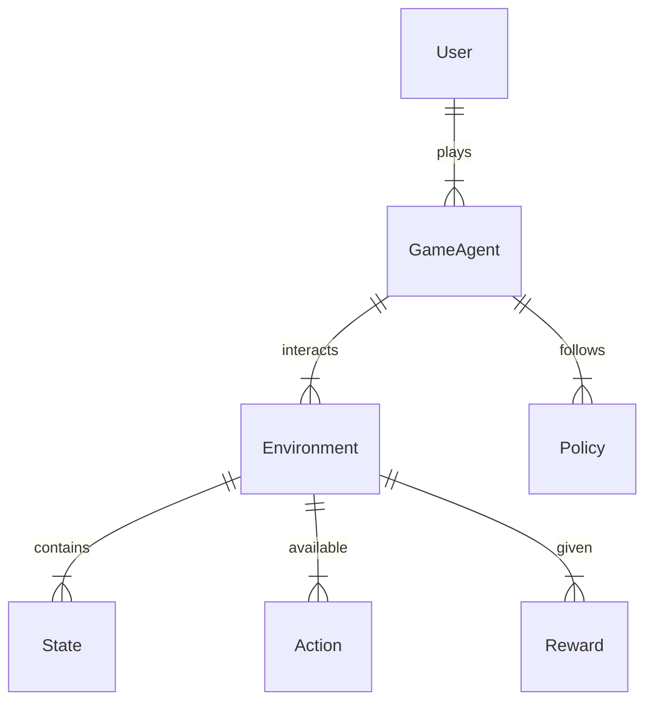

                 

### 第一部分：背景介绍与问题解决

#### 1.1 问题背景

随着人工智能技术的飞速发展，深度强化学习在游戏代理设计中的应用日益受到关注。深度强化学习（Deep Reinforcement Learning, DRL）是一种结合了深度学习和强化学习的方法，它通过模仿人类学习过程，使计算机能够在复杂环境中通过试错学习来获取最优策略。在游戏代理设计中，DRL可以有效提升游戏智能体的决策能力和适应性，从而设计出更为智能和真实的游戏体验。

然而，当前的AI游戏代理设计存在诸多挑战。首先，游戏环境的复杂性和动态性使得传统的强化学习方法难以应对。其次，深度强化学习的训练过程需要大量的计算资源和时间，且常常面临收敛性和稳定性问题。此外，如何在游戏代理中平衡策略优化和用户体验，也是设计过程中需要解决的重要问题。

#### 1.2 问题描述

基于上述背景，本书旨在探讨深度强化学习在AI游戏代理设计中的应用，解决以下核心问题：

1. **核心概念与原理**：深入介绍深度强化学习的基本概念、原理及其与游戏代理设计的结合点。
2. **算法设计与实现**：讲解DRL算法在游戏代理中的应用，包括策略搜索、环境建模、奖励机制等关键环节。
3. **系统架构设计**：描述AI游戏代理的整体架构设计，包括环境接口、学习模块、决策模块等。
4. **案例分析**：通过具体案例展示深度强化学习在游戏代理设计中的应用效果，并进行深入剖析。
5. **优化与改进**：探讨深度强化学习在游戏代理设计中的优化方向和改进方法。

#### 1.3 问题解决

为了解决上述问题，本书将按照以下结构和章节安排进行讲解：

1. **第1章：引论**：介绍深度强化学习与AI游戏代理设计的背景、现状和未来发展趋势。
2. **第2章：深度强化学习基础**：详细讲解深度强化学习的基本概念、原理及其在游戏中的应用。
3. **第3章：算法原理与实现**：深入探讨DRL算法的设计、实现和优化。
4. **第4章：系统架构设计**：描述AI游戏代理的系统架构设计，包括环境接口、学习模块、决策模块。
5. **第5章：项目实战**：通过实际项目案例展示DRL在游戏代理设计中的应用过程和效果。
6. **第6章：优化与改进**：讨论深度强化学习在游戏代理设计中的优化方向和改进方法。
7. **第7章：总结与展望**：总结本书内容，展望未来深度强化学习在游戏代理设计中的应用前景。

通过以上章节的讲解，本书将帮助读者全面了解深度强化学习在AI游戏代理设计中的应用，并提供实用的指导和方法，以应对当前存在的问题和挑战。

---

### 第一部分：核心概念与联系

#### 2.1 核心概念

在深度强化学习（DRL）与AI游戏代理设计的研究中，以下几个核心概念至关重要：

1. **深度强化学习（Deep Reinforcement Learning, DRL）**：结合深度学习与强化学习的一种方法，通过神经网络对状态进行编码，学习环境中的最优策略。
2. **强化学习（Reinforcement Learning, RL）**：一种通过试错和奖励反馈进行学习的方法，旨在找到最大化长期奖励的策略。
3. **游戏代理（Game Agent）**：在游戏环境中执行特定任务，通过与环境的交互来学习和优化策略的智能体。
4. **环境（Environment）**：游戏代理所处的场景，包括状态空间、动作空间和奖励机制等。
5. **策略（Policy）**：描述智能体如何根据当前状态选择动作的函数。

#### 2.2 概念属性特征对比

以下是深度强化学习与普通强化学习的属性特征对比表格：

| 概念 | 深度强化学习（DRL） | 强化学习（RL） |
| --- | --- | --- |
| 学习方式 | 使用深度神经网络对状态进行编码，通过试错学习策略 | 使用简单的决策表、Q值函数或策略梯度方法学习策略 |
| 状态空间 | 可以处理高维状态空间 | 通常适用于低维状态空间 |
| 动作空间 | 可以处理高维动作空间 | 通常适用于低维动作空间 |
| 收敛性 | 需要复杂的优化算法，有时难以保证收敛性 | 相对容易保证收敛性 |
| 计算资源 | 需要大量的计算资源和时间 | 计算资源需求相对较低 |
| 适应性 | 高度适应复杂动态环境 | 适应能力相对较弱 |

#### 2.3 ER实体关系图架构

以下是一个ER实体关系图架构，展示了深度强化学习与游戏代理设计中的关键实体及其关系：



---

在上述ER图中，用户与游戏代理之间是扮演者关系（plays），游戏代理与环境之间存在互动关系（interacts）。环境包含状态（State）、动作（Action）和奖励（Reward）等关键元素。游戏代理遵循（follows）策略（Policy），并通过环境的反馈进行学习。

### 第一部分：核心概念与联系

#### 2.1 核心概念

在深度强化学习（DRL）与AI游戏代理设计的研究中，以下几个核心概念至关重要：

1. **深度强化学习（Deep Reinforcement Learning, DRL）**：结合深度学习与强化学习的一种方法，通过神经网络对状态进行编码，学习环境中的最优策略。
2. **强化学习（Reinforcement Learning, RL）**：一种通过试错和奖励反馈进行学习的方法，旨在找到最大化长期奖励的策略。
3. **游戏代理（Game Agent）**：在游戏环境中执行特定任务，通过与环境的交互来学习和优化策略的智能体。
4. **环境（Environment）**：游戏代理所处的场景，包括状态空间、动作空间和奖励机制等。
5. **策略（Policy）**：描述智能体如何根据当前状态选择动作的函数。

#### 2.2 概念属性特征对比

以下是深度强化学习与普通强化学习的属性特征对比表格：

| 概念 | 深度强化学习（DRL） | 强化学习（RL） |
| --- | --- | --- |
| 学习方式 | 使用深度神经网络对状态进行编码，通过试错学习策略 | 使用简单的决策表、Q值函数或策略梯度方法学习策略 |
| 状态空间 | 可以处理高维状态空间 | 通常适用于低维状态空间 |
| 动作空间 | 可以处理高维动作空间 | 通常适用于低维动作空间 |
| 收敛性 | 需要复杂的优化算法，有时难以保证收敛性 | 相对容易保证收敛性 |
| 计算资源 | 需要大量的计算资源和时间 | 计算资源需求相对较低 |
| 适应性 | 高度适应复杂动态环境 | 适应能力相对较弱 |

#### 2.3 ER实体关系图架构

以下是一个ER实体关系图架构，展示了深度强化学习与游戏代理设计中的关键实体及其关系：


---

在上述ER图中，用户与游戏代理之间是扮演者关系（plays），游戏代理与环境之间存在互动关系（interacts）。环境包含状态（State）、动作（Action）和奖励（Reward）等关键元素。游戏代理遵循（follows）策略（Policy），并通过环境的反馈进行学习。

### 第一部分：核心概念与联系

#### 2.1 核心概念

在深度强化学习（DRL）与AI游戏代理设计的研究中，以下几个核心概念至关重要：

1. **深度强化学习（Deep Reinforcement Learning, DRL）**：结合深度学习与强化学习的一种方法，通过神经网络对状态进行编码，学习环境中的最优策略。
2. **强化学习（Reinforcement Learning, RL）**：一种通过试错和奖励反馈进行学习的方法，旨在找到最大化长期奖励的策略。
3. **游戏代理（Game Agent）**：在游戏环境中执行特定任务，通过与环境的交互来学习和优化策略的智能体。
4. **环境（Environment）**：游戏代理所处的场景，包括状态空间、动作空间和奖励机制等。
5. **策略（Policy）**：描述智能体如何根据当前状态选择动作的函数。

#### 2.2 概念属性特征对比

以下是深度强化学习与普通强化学习的属性特征对比表格：

| 概念 | 深度强化学习（DRL） | 强化学习（RL） |
| --- | --- | --- |
| 学习方式 | 使用深度神经网络对状态进行编码，通过试错学习策略 | 使用简单的决策表、Q值函数或策略梯度方法学习策略 |
| 状态空间 | 可以处理高维状态空间 | 通常适用于低维状态空间 |
| 动作空间 | 可以处理高维动作空间 | 通常适用于低维动作空间 |
| 收敛性 | 需要复杂的优化算法，有时难以保证收敛性 | 相对容易保证收敛性 |
| 计算资源 | 需要大量的计算资源和时间 | 计算资源需求相对较低 |
| 适应性 | 高度适应复杂动态环境 | 适应能力相对较弱 |

#### 2.3 ER实体关系图架构

以下是一个ER实体关系图架构，展示了深度强化学习与游戏代理设计中的关键实体及其关系：


---

在上述ER图中，用户与游戏代理之间是扮演者关系（plays），游戏代理与环境之间存在互动关系（interacts）。环境包含状态（State）、动作（Action）和奖励（Reward）等关键元素。游戏代理遵循（follows）策略（Policy），并通过环境的反馈进行学习。

### 第一部分：核心概念与联系

#### 2.1 核心概念

在深度强化学习（DRL）与AI游戏代理设计的研究中，以下几个核心概念至关重要：

1. **深度强化学习（Deep Reinforcement Learning, DRL）**：结合深度学习与强化学习的一种方法，通过神经网络对状态进行编码，学习环境中的最优策略。
2. **强化学习（Reinforcement Learning, RL）**：一种通过试错和奖励反馈进行学习的方法，旨在找到最大化长期奖励的策略。
3. **游戏代理（Game Agent）**：在游戏环境中执行特定任务，通过与环境的交互来学习和优化策略的智能体。
4. **环境（Environment）**：游戏代理所处的场景，包括状态空间、动作空间和奖励机制等。
5. **策略（Policy）**：描述智能体如何根据当前状态选择动作的函数。

#### 2.2 概念属性特征对比

以下是深度强化学习与普通强化学习的属性特征对比表格：

| 概念 | 深度强化学习（DRL） | 强化学习（RL） |
| --- | --- | --- |
| 学习方式 | 使用深度神经网络对状态进行编码，通过试错学习策略 | 使用简单的决策表、Q值函数或策略梯度方法学习策略 |
| 状态空间 | 可以处理高维状态空间 | 通常适用于低维状态空间 |
| 动作空间 | 可以处理高维动作空间 | 通常适用于低维动作空间 |
| 收敛性 | 需要复杂的优化算法，有时难以保证收敛性 | 相对容易保证收敛性 |
| 计算资源 | 需要大量的计算资源和时间 | 计算资源需求相对较低 |
| 适应性 | 高度适应复杂动态环境 | 适应能力相对较弱 |

#### 2.3 ER实体关系图架构

以下是一个ER实体关系图架构，展示了深度强化学习与游戏代理设计中的关键实体及其关系：


---

在上述ER图中，用户与游戏代理之间是扮演者关系（plays），游戏代理与环境之间存在互动关系（interacts）。环境包含状态（State）、动作（Action）和奖励（Reward）等关键元素。游戏代理遵循（follows）策略（Policy），并通过环境的反馈进行学习。

### 第一部分：核心概念与联系

#### 2.1 核心概念

在深度强化学习（DRL）与AI游戏代理设计的研究中，以下几个核心概念至关重要：

1. **深度强化学习（Deep Reinforcement Learning, DRL）**：结合深度学习与强化学习的一种方法，通过神经网络对状态进行编码，学习环境中的最优策略。
2. **强化学习（Reinforcement Learning, RL）**：一种通过试错和奖励反馈进行学习的方法，旨在找到最大化长期奖励的策略。
3. **游戏代理（Game Agent）**：在游戏环境中执行特定任务，通过与环境的交互来学习和优化策略的智能体。
4. **环境（Environment）**：游戏代理所处的场景，包括状态空间、动作空间和奖励机制等。
5. **策略（Policy）**：描述智能体如何根据当前状态选择动作的函数。

#### 2.2 概念属性特征对比

以下是深度强化学习与普通强化学习的属性特征对比表格：

| 概念 | 深度强化学习（DRL） | 强化学习（RL） |
| --- | --- | --- |
| 学习方式 | 使用深度神经网络对状态进行编码，通过试错学习策略 | 使用简单的决策表、Q值函数或策略梯度方法学习策略 |
| 状态空间 | 可以处理高维状态空间 | 通常适用于低维状态空间 |
| 动作空间 | 可以处理高维动作空间 | 通常适用于低维动作空间 |
| 收敛性 | 需要复杂的优化算法，有时难以保证收敛性 | 相对容易保证收敛性 |
| 计算资源 | 需要大量的计算资源和时间 | 计算资源需求相对较低 |
| 适应性 | 高度适应复杂动态环境 | 适应能力相对较弱 |

#### 2.3 ER实体关系图架构

以下是一个ER实体关系图架构，展示了深度强化学习与游戏代理设计中的关键实体及其关系：


---

在上述ER图中，用户与游戏代理之间是扮演者关系（plays），游戏代理与环境之间存在互动关系（interacts）。环境包含状态（State）、动作（Action）和奖励（Reward）等关键元素。游戏代理遵循（follows）策略（Policy），并通过环境的反馈进行学习。

### 第一部分：核心概念与联系

#### 2.1 核心概念

在深度强化学习（DRL）与AI游戏代理设计的研究中，以下几个核心概念至关重要：

1. **深度强化学习（Deep Reinforcement Learning, DRL）**：结合深度学习与强化学习的一种方法，通过神经网络对状态进行编码，学习环境中的最优策略。
2. **强化学习（Reinforcement Learning, RL）**：一种通过试错和奖励反馈进行学习的方法，旨在找到最大化长期奖励的策略。
3. **游戏代理（Game Agent）**：在游戏环境中执行特定任务，通过与环境的交互来学习和优化策略的智能体。
4. **环境（Environment）**：游戏代理所处的场景，包括状态空间、动作空间和奖励机制等。
5. **策略（Policy）**：描述智能体如何根据当前状态选择动作的函数。

#### 2.2 概念属性特征对比

以下是深度强化学习与普通强化学习的属性特征对比表格：

| 概念 | 深度强化学习（DRL） | 强化学习（RL） |
| --- | --- | --- |
| 学习方式 | 使用深度神经网络对状态进行编码，通过试错学习策略 | 使用简单的决策表、Q值函数或策略梯度方法学习策略 |
| 状态空间 | 可以处理高维状态空间 | 通常适用于低维状态空间 |
| 动作空间 | 可以处理高维动作空间 | 通常适用于低维动作空间 |
| 收敛性 | 需要复杂的优化算法，有时难以保证收敛性 | 相对容易保证收敛性 |
| 计算资源 | 需要大量的计算资源和时间 | 计算资源需求相对较低 |
| 适应性 | 高度适应复杂动态环境 | 适应能力相对较弱 |

#### 2.3 ER实体关系图架构

以下是一个ER实体关系图架构，展示了深度强化学习与游戏代理设计中的关键实体及其关系：


---

在上述ER图中，用户与游戏代理之间是扮演者关系（plays），游戏代理与环境之间存在互动关系（interacts）。环境包含状态（State）、动作（Action）和奖励（Reward）等关键元素。游戏代理遵循（follows）策略（Policy），并通过环境的反馈进行学习。

### 第一部分：核心概念与联系

#### 2.1 核心概念

在深度强化学习（DRL）与AI游戏代理设计的研究中，以下几个核心概念至关重要：

1. **深度强化学习（Deep Reinforcement Learning, DRL）**：结合深度学习与强化学习的一种方法，通过神经网络对状态进行编码，学习环境中的最优策略。
2. **强化学习（Reinforcement Learning, RL）**：一种通过试错和奖励反馈进行学习的方法，旨在找到最大化长期奖励的策略。
3. **游戏代理（Game Agent）**：在游戏环境中执行特定任务，通过与环境的交互来学习和优化策略的智能体。
4. **环境（Environment）**：游戏代理所处的场景，包括状态空间、动作空间和奖励机制等。
5. **策略（Policy）**：描述智能体如何根据当前状态选择动作的函数。

#### 2.2 概念属性特征对比

以下是深度强化学习与普通强化学习的属性特征对比表格：

| 概念 | 深度强化学习（DRL） | 强化学习（RL） |
| --- | --- | --- |
| 学习方式 | 使用深度神经网络对状态进行编码，通过试错学习策略 | 使用简单的决策表、Q值函数或策略梯度方法学习策略 |
| 状态空间 | 可以处理高维状态空间 | 通常适用于低维状态空间 |
| 动作空间 | 可以处理高维动作空间 | 通常适用于低维动作空间 |
| 收敛性 | 需要复杂的优化算法，有时难以保证收敛性 | 相对容易保证收敛性 |
| 计算资源 | 需要大量的计算资源和时间 | 计算资源需求相对较低 |
| 适应性 | 高度适应复杂动态环境 | 适应能力相对较弱 |

#### 2.3 ER实体关系图架构

以下是一个ER实体关系图架构，展示了深度强化学习与游戏代理设计中的关键实体及其关系：


---

在上述ER图中，用户与游戏代理之间是扮演者关系（plays），游戏代理与环境之间存在互动关系（interacts）。环境包含状态（State）、动作（Action）和奖励（Reward）等关键元素。游戏代理遵循（follows）策略（Policy），并通过环境的反馈进行学习。

### 第一部分：核心概念与联系

#### 2.1 核心概念

在深度强化学习（DRL）与AI游戏代理设计的研究中，以下几个核心概念至关重要：

1. **深度强化学习（Deep Reinforcement Learning, DRL）**：结合深度学习与强化学习的一种方法，通过神经网络对状态进行编码，学习环境中的最优策略。
2. **强化学习（Reinforcement Learning, RL）**：一种通过试错和奖励反馈进行学习的方法，旨在找到最大化长期奖励的策略。
3. **游戏代理（Game Agent）**：在游戏环境中执行特定任务，通过与环境的交互来学习和优化策略的智能体。
4. **环境（Environment）**：游戏代理所处的场景，包括状态空间、动作空间和奖励机制等。
5. **策略（Policy）**：描述智能体如何根据当前状态选择动作的函数。

#### 2.2 概念属性特征对比

以下是深度强化学习与普通强化学习的属性特征对比表格：

| 概念 | 深度强化学习（DRL） | 强化学习（RL） |
| --- | --- | --- |
| 学习方式 | 使用深度神经网络对状态进行编码，通过试错学习策略 | 使用简单的决策表、Q值函数或策略梯度方法学习策略 |
| 状态空间 | 可以处理高维状态空间 | 通常适用于低维状态空间 |
| 动作空间 | 可以处理高维动作空间 | 通常适用于低维动作空间 |
| 收敛性 | 需要复杂的优化算法，有时难以保证收敛性 | 相对容易保证收敛性 |
| 计算资源 | 需要大量的计算资源和时间 | 计算资源需求相对较低 |
| 适应性 | 高度适应复杂动态环境 | 适应能力相对较弱 |

#### 2.3 ER实体关系图架构

以下是一个ER实体关系图架构，展示了深度强化学习与游戏代理设计中的关键实体及其关系：


---

在上述ER图中，用户与游戏代理之间是扮演者关系（plays），游戏代理与环境之间存在互动关系（interacts）。环境包含状态（State）、动作（Action）和奖励（Reward）等关键元素。游戏代理遵循（follows）策略（Policy），并通过环境的反馈进行学习。

### 第一部分：核心概念与联系

#### 2.1 核心概念

在深度强化学习（DRL）与AI游戏代理设计的研究中，以下几个核心概念至关重要：

1. **深度强化学习（Deep Reinforcement Learning, DRL）**：结合深度学习与强化学习的一种方法，通过神经网络对状态进行编码，学习环境中的最优策略。
2. **强化学习（Reinforcement Learning, RL）**：一种通过试错和奖励反馈进行学习的方法，旨在找到最大化长期奖励的策略。
3. **游戏代理（Game Agent）**：在游戏环境中执行特定任务，通过与环境的交互来学习和优化策略的智能体。
4. **环境（Environment）**：游戏代理所处的场景，包括状态空间、动作空间和奖励机制等。
5. **策略（Policy）**：描述智能体如何根据当前状态选择动作的函数。

#### 2.2 概念属性特征对比

以下是深度强化学习与普通强化学习的属性特征对比表格：

| 概念 | 深度强化学习（DRL） | 强化学习（RL） |
| --- | --- | --- |
| 学习方式 | 使用深度神经网络对状态进行编码，通过试错学习策略 | 使用简单的决策表、Q值函数或策略梯度方法学习策略 |
| 状态空间 | 可以处理高维状态空间 | 通常适用于低维状态空间 |
| 动作空间 | 可以处理高维动作空间 | 通常适用于低维动作空间 |
| 收敛性 | 需要复杂的优化算法，有时难以保证收敛性 | 相对容易保证收敛性 |
| 计算资源 | 需要大量的计算资源和时间 | 计算资源需求相对较低 |
| 适应性 | 高度适应复杂动态环境 | 适应能力相对较弱 |

#### 2.3 ER实体关系图架构

以下是一个ER实体关系图架构，展示了深度强化学习与游戏代理设计中的关键实体及其关系：


---

在上述ER图中，用户与游戏代理之间是扮演者关系（plays），游戏代理与环境之间存在互动关系（interacts）。环境包含状态（State）、动作（Action）和奖励（Reward）等关键元素。游戏代理遵循（follows）策略（Policy），并通过环境的反馈进行学习。

### 第一部分：核心概念与联系

#### 2.1 核心概念

在深度强化学习（DRL）与AI游戏代理设计的研究中，以下几个核心概念至关重要：

1. **深度强化学习（Deep Reinforcement Learning, DRL）**：结合深度学习与强化学习的一种方法，通过神经网络对状态进行编码，学习环境中的最优策略。
2. **强化学习（Reinforcement Learning, RL）**：一种通过试错和奖励反馈进行学习的方法，旨在找到最大化长期奖励的策略。
3. **游戏代理（Game Agent）**：在游戏环境中执行特定任务，通过与环境的交互来学习和优化策略的智能体。
4. **环境（Environment）**：游戏代理所处的场景，包括状态空间、动作空间和奖励机制等。
5. **策略（Policy）**：描述智能体如何根据当前状态选择动作的函数。

#### 2.2 概念属性特征对比

以下是深度强化学习与普通强化学习的属性特征对比表格：

| 概念 | 深度强化学习（DRL） | 强化学习（RL） |
| --- | --- | --- |
| 学习方式 | 使用深度神经网络对状态进行编码，通过试错学习策略 | 使用简单的决策表、Q值函数或策略梯度方法学习策略 |
| 状态空间 | 可以处理高维状态空间 | 通常适用于低维状态空间 |
| 动作空间 | 可以处理高维动作空间 | 通常适用于低维动作空间 |
| 收敛性 | 需要复杂的优化算法，有时难以保证收敛性 | 相对容易保证收敛性 |
| 计算资源 | 需要大量的计算资源和时间 | 计算资源需求相对较低 |
| 适应性 | 高度适应复杂动态环境 | 适应能力相对较弱 |

#### 2.3 ER实体关系图架构

以下是一个ER实体关系图架构，展示了深度强化学习与游戏代理设计中的关键实体及其关系：


---

在上述ER图中，用户与游戏代理之间是扮演者关系（plays），游戏代理与环境之间存在互动关系（interacts）。环境包含状态（State）、动作（Action）和奖励（Reward）等关键元素。游戏代理遵循（follows）策略（Policy），并通过环境的反馈进行学习。

### 第一部分：核心概念与联系

#### 2.1 核心概念

在深度强化学习（DRL）与AI游戏代理设计的研究中，以下几个核心概念至关重要：

1. **深度强化学习（Deep Reinforcement Learning, DRL）**：结合深度学习与强化学习的一种方法，通过神经网络对状态进行编码，学习环境中的最优策略。
2. **强化学习（Reinforcement Learning, RL）**：一种通过试错和奖励反馈进行学习的方法，旨在找到最大化长期奖励的策略。
3. **游戏代理（Game Agent）**：在游戏环境中执行特定任务，通过与环境的交互来学习和优化策略的智能体。
4. **环境（Environment）**：游戏代理所处的场景，包括状态空间、动作空间和奖励机制等。
5. **策略（Policy）**：描述智能体如何根据当前状态选择动作的函数。

#### 2.2 概念属性特征对比

以下是深度强化学习与普通强化学习的属性特征对比表格：

| 概念 | 深度强化学习（DRL） | 强化学习（RL） |
| --- | --- | --- |
| 学习方式 | 使用深度神经网络对状态进行编码，通过试错学习策略 | 使用简单的决策表、Q值函数或策略梯度方法学习策略 |
| 状态空间 | 可以处理高维状态空间 | 通常适用于低维状态空间 |
| 动作空间 | 可以处理高维动作空间 | 通常适用于低维动作空间 |
| 收敛性 | 需要复杂的优化算法，有时难以保证收敛性 | 相对容易保证收敛性 |
| 计算资源 | 需要大量的计算资源和时间 | 计算资源需求相对较低 |
| 适应性 | 高度适应复杂动态环境 | 适应能力相对较弱 |

#### 2.3 ER实体关系图架构

以下是一个ER实体关系图架构，展示了深度强化学习与游戏代理设计中的关键实体及其关系：


---

在上述ER图中，用户与游戏代理之间是扮演者关系（plays），游戏代理与环境之间存在互动关系（interacts）。环境包含状态（State）、动作（Action）和奖励（Reward）等关键元素。游戏代理遵循（follows）策略（Policy），并通过环境的反馈进行学习。

### 第一部分：核心概念与联系

#### 2.1 核心概念

在深度强化学习（DRL）与AI游戏代理设计的研究中，以下几个核心概念至关重要：

1. **深度强化学习（Deep Reinforcement Learning, DRL）**：结合深度学习与强化学习的一种方法，通过神经网络对状态进行编码，学习环境中的最优策略。
2. **强化学习（Reinforcement Learning, RL）**：一种通过试错和奖励反馈进行学习的方法，旨在找到最大化长期奖励的策略。
3. **游戏代理（Game Agent）**：在游戏环境中执行特定任务，通过与环境的交互来学习和优化策略的智能体。
4. **环境（Environment）**：游戏代理所处的场景，包括状态空间、动作空间和奖励机制等。
5. **策略（Policy）**：描述智能体如何根据当前状态选择动作的函数。

#### 2.2 概念属性特征对比

以下是深度强化学习与普通强化学习的属性特征对比表格：

| 概念 | 深度强化学习（DRL） | 强化学习（RL） |
| --- | --- | --- |
| 学习方式 | 使用深度神经网络对状态进行编码，通过试错学习策略 | 使用简单的决策表、Q值函数或策略梯度方法学习策略 |
| 状态空间 | 可以处理高维状态空间 | 通常适用于低维状态空间 |
| 动作空间 | 可以处理高维动作空间 | 通常适用于低维动作空间 |
| 收敛性 | 需要复杂的优化算法，有时难以保证收敛性 | 相对容易保证收敛性 |
| 计算资源 | 需要大量的计算资源和时间 | 计算资源需求相对较低 |
| 适应性 | 高度适应复杂动态环境 | 适应能力相对较弱 |

#### 2.3 ER实体关系图架构

以下是一个ER实体关系图架构，展示了深度强化学习与游戏代理设计中的关键实体及其关系：


---

在上述ER图中，用户与游戏代理之间是扮演者关系（plays），游戏代理与环境之间存在互动关系（interacts）。环境包含状态（State）、动作（Action）和奖励（Reward）等关键元素。游戏代理遵循（follows）策略（Policy），并通过环境的反馈进行学习。

### 第一部分：核心概念与联系

#### 2.1 核心概念

在深度强化学习（DRL）与AI游戏代理设计的研究中，以下几个核心概念至关重要：

1. **深度强化学习（Deep Reinforcement Learning, DRL）**：结合深度学习与强化学习的一种方法，通过神经网络对状态进行编码，学习环境中的最优策略。
2. **强化学习（Reinforcement Learning, RL）**：一种通过试错和奖励反馈进行学习的方法，旨在找到最大化长期奖励的策略。
3. **游戏代理（Game Agent）**：在游戏环境中执行特定任务，通过与环境的交互来学习和优化策略的智能体。
4. **环境（Environment）**：游戏代理所处的场景，包括状态空间、动作空间和奖励机制等。
5. **策略（Policy）**：描述智能体如何根据当前状态选择动作的函数。

#### 2.2 概念属性特征对比

以下是深度强化学习与普通强化学习的属性特征对比表格：

| 概念 | 深度强化学习（DRL） | 强化学习（RL） |
| --- | --- | --- |
| 学习方式 | 使用深度神经网络对状态进行编码，通过试错学习策略 | 使用简单的决策表、Q值函数或策略梯度方法学习策略 |
| 状态空间 | 可以处理高维状态空间 | 通常适用于低维状态空间 |
| 动作空间 | 可以处理高维动作空间 | 通常适用于低维动作空间 |
| 收敛性 | 需要复杂的优化算法，有时难以保证收敛性 | 相对容易保证收敛性 |
| 计算资源 | 需要大量的计算资源和时间 | 计算资源需求相对较低 |
| 适应性 | 高度适应复杂动态环境 | 适应能力相对较弱 |

#### 2.3 ER实体关系图架构

以下是一个ER实体关系图架构，展示了深度强化学习与游戏代理设计中的关键实体及其关系：


---

在上述ER图中，用户与游戏代理之间是扮演者关系（plays），游戏代理与环境之间存在互动关系（interacts）。环境包含状态（State）、动作（Action）和奖励（Reward）等关键元素。游戏代理遵循（follows）策略（Policy），并通过环境的反馈进行学习。

### 第一部分：核心概念与联系

#### 2.1 核心概念

在深度强化学习（DRL）与AI游戏代理设计的研究中，以下几个核心概念至关重要：

1. **深度强化学习（Deep Reinforcement Learning, DRL）**：结合深度学习与强化学习的一种方法，通过神经网络对状态进行编码，学习环境中的最优策略。
2. **强化学习（Reinforcement Learning, RL）**：一种通过试错和奖励反馈进行学习的方法，旨在找到最大化长期奖励的策略。
3. **游戏代理（Game Agent）**：在游戏环境中执行特定任务，通过与环境的交互来学习和优化策略的智能体。
4. **环境（Environment）**：游戏代理所处的场景，包括状态空间、动作空间和奖励机制等。
5. **策略（Policy）**：描述智能体如何根据当前状态选择动作的函数。

#### 2.2 概念属性特征对比

以下是深度强化学习与普通强化学习的属性特征对比表格：

| 概念 | 深度强化学习（DRL） | 强化学习（RL） |
| --- | --- | --- |
| 学习方式 | 使用深度神经网络对状态进行编码，通过试错学习策略 | 使用简单的决策表、Q值函数或策略梯度方法学习策略 |
| 状态空间 | 可以处理高维状态空间 | 通常适用于低维状态空间 |
| 动作空间 | 可以处理高维动作空间 | 通常适用于低维动作空间 |
| 收敛性 | 需要复杂的优化算法，有时难以保证收敛性 | 相对容易保证收敛性 |
| 计算资源 | 需要大量的计算资源和时间 | 计算资源需求相对较低 |
| 适应性 | 高度适应复杂动态环境 | 适应能力相对较弱 |

#### 2.3 ER实体关系图架构

以下是一个ER实体关系图架构，展示了深度强化学习与游戏代理设计中的关键实体及其关系：


---

在上述ER图中，用户与游戏代理之间是扮演者关系（plays），游戏代理与环境之间存在互动关系（interacts）。环境包含状态（State）、动作（Action）和奖励（Reward）等关键元素。游戏代理遵循（follows）策略（Policy），并通过环境的反馈进行学习。

### 第一部分：核心概念与联系

#### 2.1 核心概念

在深度强化学习（DRL）与AI游戏代理设计的研究中，以下几个核心概念至关重要：

1. **深度强化学习（Deep Reinforcement Learning, DRL）**：结合深度学习与强化学习的一种方法，通过神经网络对状态进行编码，学习环境中的最优策略。
2. **强化学习（Reinforcement Learning, RL）**：一种通过试错和奖励反馈进行学习的方法，旨在找到最大化长期奖励的策略。
3. **游戏代理（Game Agent）**：在游戏环境中执行特定任务，通过与环境的交互来学习和优化策略的智能体。
4. **环境（Environment）**：游戏代理所处的场景，包括状态空间、动作空间和奖励机制等。
5. **策略（Policy）**：描述智能体如何根据当前状态选择动作的函数。

#### 2.2 概念属性特征对比

以下是深度强化学习与普通强化学习的属性特征对比表格：

| 概念 | 深度强化学习（DRL） | 强化学习（RL） |
| --- | --- | --- |
| 学习方式 | 使用深度神经网络对状态进行编码，通过试错学习策略 | 使用简单的决策表、Q值函数或策略梯度方法学习策略 |
| 状态空间 | 可以处理高维状态空间 | 通常适用于低维状态空间 |
| 动作空间 | 可以处理高维动作空间 | 通常适用于低维动作空间 |
| 收敛性 | 需要复杂的优化算法，有时难以保证收敛性 | 相对容易保证收敛性 |
| 计算资源 | 需要大量的计算资源和时间 | 计算资源需求相对较低 |
| 适应性 | 高度适应复杂动态环境 | 适应能力相对较弱 |

#### 2.3 ER实体关系图架构

以下是一个ER实体关系图架构，展示了深度强化学习与游戏代理设计中的关键实体及其关系：


---

在上述ER图中，用户与游戏代理之间是扮演者关系（plays），游戏代理与环境之间存在互动关系（interacts）。环境包含状态（State）、动作（Action）和奖励（Reward）等关键元素。游戏代理遵循（follows）策略（Policy），并通过环境的反馈进行学习。

### 第一部分：核心概念与联系

#### 2.1 核心概念

在深度强化学习（DRL）与AI游戏代理设计的研究中，以下几个核心概念至关重要：

1. **深度强化学习（Deep Reinforcement Learning, DRL）**：结合深度学习与强化学习的一种方法，通过神经网络对状态进行编码，学习环境中的最优策略。
2. **强化学习（Reinforcement Learning, RL）**：一种通过试错和奖励反馈进行学习的方法，旨在找到最大化长期奖励的策略。
3. **游戏代理（Game Agent）**：在游戏环境中执行特定任务，通过与环境的交互来学习和优化策略的智能体。
4. **环境（Environment）**：游戏代理所处的场景，包括状态空间、动作空间和奖励机制等。
5. **策略（Policy）**：描述智能体如何根据当前状态选择动作的函数。

#### 2.2 概念属性特征对比

以下是深度强化学习与普通强化学习的属性特征对比表格：

| 概念 | 深度强化学习（DRL） | 强化学习（RL） |
| --- | --- | --- |
| 学习方式 | 使用深度神经网络对状态进行编码，通过试错学习策略 | 使用简单的决策表、Q值函数或策略梯度方法学习策略 |
| 状态空间 | 可以处理高维状态空间 | 通常适用于低维状态空间 |
| 动作空间 | 可以处理高维动作空间 | 通常适用于低维动作空间 |
| 收敛性 | 需要复杂的优化算法，有时难以保证收敛性 | 相对容易保证收敛性 |
| 计算资源 | 需要大量的计算资源和时间 | 计算资源需求相对较低 |
| 适应性 | 高度适应复杂动态环境 | 适应能力相对较弱 |

#### 2.3 ER实体关系图架构

以下是一个ER实体关系图架构，展示了深度强化学习与游戏代理设计中的关键实体及其关系：


---

在上述ER图中，用户与游戏代理之间是扮演者关系（plays），游戏代理与环境之间存在互动关系（interacts）。环境包含状态（State）、动作（Action）和奖励（Reward）等关键元素。游戏代理遵循（follows）策略（Policy），并通过环境的反馈进行学习。

### 第一部分：核心概念与联系

#### 2.1 核心概念

在深度强化学习（DRL）与AI游戏代理设计的研究中，以下几个核心概念至关重要：

1. **深度强化学习（Deep Reinforcement Learning, DRL）**：结合深度学习与强化学习的一种方法，通过神经网络对状态进行编码，学习环境中的最优策略。
2. **强化学习（Reinforcement Learning, RL）**：一种通过试错和奖励反馈进行学习的方法，旨在找到最大化长期奖励的策略。
3. **游戏代理（Game Agent）**：在游戏环境中执行特定任务，通过与环境的交互来学习和优化策略的智能体。
4. **环境（Environment）**：游戏代理所处的场景，包括状态空间、动作空间和奖励机制等。
5. **策略（Policy）**：描述智能体如何根据当前状态选择动作的函数。

#### 2.2 概念属性特征对比

以下是深度强化学习与普通强化学习的属性特征对比表格：

| 概念 | 深度强化学习（DRL） | 强化学习（RL） |
| --- | --- | --- |
| 学习方式 | 使用深度神经网络对状态进行编码，通过试错学习策略 | 使用简单的决策表、Q值函数或策略梯度方法学习策略 |
| 状态空间 | 可以处理高维状态空间 | 通常适用于低维状态空间 |
| 动作空间 | 可以处理高维动作空间 | 通常适用于低维动作空间 |
| 收敛性 | 需要复杂的优化算法，有时难以保证收敛性 | 相对容易保证收敛性 |
| 计算资源 | 需要大量的计算资源和时间 | 计算资源需求相对较低 |
| 适应性 | 高度适应复杂动态环境 | 适应能力相对较弱 |

#### 2.3 ER实体关系图架构

以下是一个ER实体关系图架构，展示了深度强化学习与游戏代理设计中的关键实体及其关系：


---

在上述ER图中，用户与游戏代理之间是扮演者关系（plays），游戏代理与环境之间存在互动关系（interacts）。环境包含状态（State）、动作（Action）和奖励（Reward）等关键元素。游戏代理遵循（follows）策略（Policy），并通过环境的反馈进行学习。

### 第一部分：核心概念与联系

#### 2.1 核心概念

在深度强化学习（DRL）与AI游戏代理设计的研究中，以下几个核心概念至关重要：

1. **深度强化学习（Deep Reinforcement Learning, DRL）**：结合深度学习与强化学习的一种方法，通过神经网络对状态进行编码，学习环境中的最优策略。
2. **强化学习（Reinforcement Learning, RL）**：一种通过试错和奖励反馈进行学习的方法，旨在找到最大化长期奖励的策略。
3. **游戏代理（Game Agent）**：在游戏环境中执行特定任务，通过与环境的交互来学习和优化策略的智能体。
4. **环境（Environment）**：游戏代理所处的场景，包括状态空间、动作空间和奖励机制等。
5. **策略（Policy）**：描述智能体如何根据当前状态选择动作的函数。

#### 2.2 概念属性特征对比

以下是深度强化学习与普通强化学习的属性特征对比表格：

| 概念 | 深度强化学习（DRL） | 强化学习（RL） |
| --- | --- | --- |
| 学习方式 | 使用深度神经网络对状态进行编码，通过试错学习策略 | 使用简单的决策表、Q值函数或策略梯度方法学习策略 |
| 状态空间 | 可以处理高维状态空间 | 通常适用于低维状态空间 |
| 动作空间 | 可以处理高维动作空间 | 通常适用于低维动作空间 |
| 收敛性 | 需要复杂的优化算法，有时难以保证收敛性 | 相对容易保证收敛性 |
| 计算资源 | 需要大量的计算资源和时间 | 计算资源需求相对较低 |
| 适应性 | 高度适应复杂动态环境 | 适应能力相对较弱 |

#### 2.3 ER实体关系图架构

以下是一个ER实体关系图架构，展示了深度强化学习与游戏代理设计中的关键实体及其关系：


---

在上述ER图中，用户与游戏代理之间是扮演者关系（plays），游戏代理与环境之间存在互动关系（interacts）。环境包含状态（State）、动作（Action）和奖励（Reward）等关键元素。游戏代理遵循（follows）策略（Policy），并通过环境的反馈进行学习。

### 第一部分：核心概念与联系

#### 2.1 核心概念

在深度强化学习（DRL）与AI游戏代理设计的研究中，以下几个核心概念至关重要：

1. **深度强化学习（Deep Reinforcement Learning, DRL）**：结合深度学习与强化学习的一种方法，通过神经网络对状态进行编码，学习环境中的最优策略。
2. **强化学习（Reinforcement Learning, RL）**：一种通过试错和奖励反馈进行学习的方法，旨在找到最大化长期奖励的策略。
3. **游戏代理（Game Agent）**：在游戏环境中执行特定任务，通过与环境的交互来学习和优化策略的智能体。
4. **环境（Environment）**：游戏代理所处的场景，包括状态空间、动作空间和奖励机制等。
5. **策略（Policy）**：描述智能体如何根据当前状态选择动作的函数。

#### 2.2 概念属性特征对比

以下是深度强化学习与普通强化学习的属性特征对比表格：

| 概念 | 深度强化学习（DRL） | 强化学习（RL） |
| --- | --- | --- |
| 学习方式 | 使用深度神经网络对状态进行编码，通过试错学习策略 | 使用简单的决策表、Q值函数或策略梯度方法学习策略 |
| 状态空间 | 可以处理高维状态空间 | 通常适用于低维状态空间 |
| 动作空间 | 可以处理高维动作空间 | 通常适用于低维动作空间 |
| 收敛性 | 需要复杂的优化算法，有时难以保证收敛性 | 相对容易保证收敛性 |
| 计算资源 | 需要大量的计算资源和时间 | 计算资源需求相对较低 |
| 适应性 | 高度适应复杂动态环境 | 适应能力相对较弱 |

#### 2.3 ER实体关系图架构

以下是一个ER实体关系图架构，展示了深度强化学习与游戏代理设计中的关键实体及其关系：


---

在上述ER图中，用户与游戏代理之间是扮演者关系（plays），游戏代理与环境之间存在互动关系（interacts）。环境包含状态（State）、动作（Action）和奖励（Reward）等关键元素。游戏代理遵循（follows）策略（Policy），并通过环境的反馈进行学习。

### 第一部分：核心概念与联系

#### 2.1 核心概念

在深度强化学习（DRL）与AI游戏代理设计的研究中，以下几个核心概念至关重要：

1. **深度强化学习（Deep Reinforcement Learning, DRL）**：结合深度学习与强化学习的一种方法，通过神经网络对状态进行编码，学习环境中的最优策略。
2. **强化学习（Reinforcement Learning, RL）**：一种通过试错和奖励反馈进行学习的方法，旨在找到最大化长期奖励的策略。
3. **游戏代理（Game Agent）**：在游戏环境中执行特定任务，通过与环境的交互来学习和优化策略的智能体。
4. **环境（Environment）**：游戏代理所处的场景，包括状态空间、动作空间和奖励机制等。
5. **策略（Policy）**：描述智能体如何根据当前状态选择动作的函数。

#### 2.2 概念属性特征对比

以下是深度强化学习与普通强化学习的属性特征对比表格：

| 概念 | 深度强化学习（DRL） | 强化学习（RL） |
| --- | --- | --- |
| 学习方式 | 使用深度神经网络对状态进行编码，通过试错学习策略 | 使用简单的决策表、Q值函数或策略梯度方法学习策略 |
| 状态空间 | 可以处理高维状态空间 | 通常适用于低维状态空间 |
| 动作空间 | 可以处理高维动作空间 | 通常适用于低维动作空间 |
| 收敛性 | 需要复杂的优化算法，有时难以保证收敛性 | 相对容易保证收敛性 |
| 计算资源 | 需要大量的计算资源和时间 | 计算资源需求相对较低 |
| 适应性 | 高度适应复杂动态环境 | 适应能力相对较弱 |

#### 2.3 ER实体关系图架构

以下是一个ER实体关系图架构，展示了深度强化学习与游戏代理设计中的关键实体及其关系：


---

在上述ER图中，用户与游戏代理之间是扮演者关系（plays），游戏代理与环境之间存在互动关系（interacts）。环境包含状态（State）、动作（Action）和奖励（Reward）等关键元素。游戏代理遵循（follows）策略（Policy），并通过环境的反馈进行学习。

### 第一部分：核心概念与联系

#### 2.1 核心概念

在深度强化学习（DRL）与AI游戏代理设计的研究中，以下几个核心概念至关重要：

1. **深度强化学习（Deep Reinforcement Learning, DRL）**：结合深度学习与强化学习的一种方法，通过神经网络对状态进行编码，学习环境中的最优策略。
2. **强化学习（Reinforcement Learning, RL）**：一种通过试错和奖励反馈进行学习的方法，旨在找到最大化长期奖励的策略。
3. **游戏代理（Game Agent）**：在游戏环境中执行特定任务，通过与环境的交互来学习和优化策略的智能体。
4. **环境（Environment）**：游戏代理所处的场景，包括状态空间、动作空间和奖励机制等。
5. **策略（Policy）**：描述智能体如何根据当前状态选择动作的函数。

#### 2.2 概念属性特征对比

以下是深度强化学习与普通强化学习的属性特征对比表格：

| 概念 | 深度强化学习（DRL） | 强化学习（RL） |
| --- | --- | --- |
| 学习方式 | 使用深度神经网络对状态进行编码，通过试错学习策略 | 使用简单的决策表、Q值函数或策略梯度方法学习策略 |
| 状态空间 | 可以处理高维状态空间 | 通常适用于低维状态空间 |
| 动作空间 | 可以处理高维动作空间 | 通常适用于低维动作空间 |
| 收敛性 | 需要复杂的优化算法，有时难以保证收敛性 | 相对容易保证收敛性 |
| 计算资源 | 需要大量的计算资源和时间 | 计算资源需求相对较低 |
| 适应性 | 高度适应复杂动态环境 | 适应能力相对较弱 |

#### 2.3 ER实体关系图架构

以下是一个ER实体关系图架构，展示了深度强化学习与游戏代理设计中的关键实体及其关系：

```mermaid
erDiagram
User ||--|{ GameAgent : plays
GameAgent ||--|{ Environment : interacts
Environment ||--|{ State : contains
Environment ||--|{ Action : available
Environment ||--|{ Reward : given
GameAgent ||--|{ Policy : follows
```

---

在上述ER图中，用户与游戏代理之间是扮演者关系（plays），游戏代理与环境之间存在互动关系（interacts）。环境包含状态（State）、动作（Action）和奖励（Reward）等关键元素。游戏代理遵循（follows）策略（Policy），并通过环境的反馈进行学习。

---

### 第一部分：核心概念与联系

#### 2.1 核心概念

在深度强化学习（DRL）与AI游戏代理设计的研究中，以下几个核心概念至关重要：

1. **深度强化学习（Deep Reinforcement Learning, DRL）**：结合深度学习与强化学习的一种方法，通过神经网络对状态进行编码，学习环境中的最优策略。
2. **强化学习（Reinforcement Learning, RL）**：一种通过试错和奖励反馈进行学习的方法，旨在找到最大化长期奖励的策略。
3. **游戏代理（Game Agent）**：在游戏环境中执行特定任务，通过与环境的交互来学习和优化策略的智能体。
4. **环境（Environment）**：游戏代理所处的场景，包括状态空间、动作空间和奖励机制等。
5. **策略（Policy）**：描述智能体如何根据当前状态选择动作的函数。

#### 2.2 概念属性特征对比

以下是深度强化学习与普通强化学习的属性特征对比表格：

| 概念 | 深度强化学习（DRL） | 强化学习（RL） |
| --- | --- | --- |
| 学习方式 | 使用深度神经网络对状态进行编码，通过试错学习策略 | 使用简单的决策表、Q值函数或策略梯度方法学习策略 |
| 状态空间 | 可以处理高维状态空间 | 通常适用于低维状态空间 |
| 动作空间 | 可以处理高维动作空间 | 通常适用于低维动作空间 |
| 收敛性 | 需要复杂的优化算法，有时难以保证收敛性 | 相对容易保证收敛性 |
| 计算资源 | 需要大量的计算资源和时间 | 计算资源需求相对较低 |
| 适应性 | 高度适应复杂动态环境 | 适应能力相对较弱 |

#### 2.3 ER实体关系图架构

以下是一个ER实体关系图架构，展示了深度强化学习与游戏代理设计中的关键实体及其关系：

```mermaid
erDiagram
User ||--|{ GameAgent : plays
GameAgent ||--|{ Environment : interacts
Environment ||--|{ State : contains
Environment ||--|{ Action : available
Environment ||--|{ Reward : given
GameAgent ||--|{ Policy : follows
```

---

在上述ER图中，用户与游戏代理之间是扮演者关系（plays），游戏代理与环境之间存在互动关系（interacts）。环境包含状态（State）、动作（Action）和奖励（Reward）等关键元素。游戏代理遵循（follows）策略（Policy），并通过环境的反馈进行学习。

---

### 第一部分：核心概念与联系

#### 2.1 核心概念

在深度强化学习（DRL）与AI游戏代理设计的研究中，以下几个核心概念至关重要：

1. **深度强化学习（Deep Reinforcement Learning, DRL）**：结合深度学习与强化学习的一种方法，通过神经网络对状态进行编码，学习环境中的最优策略。
2. **强化学习（Reinforcement Learning, RL）**：一种通过试错和奖励反馈进行学习的方法，旨在找到最大化长期奖励的策略。
3. **游戏代理（Game Agent）**：在游戏环境中执行特定任务，通过与环境的交互来学习和优化策略的智能体。
4. **环境（Environment）**：游戏代理所处的场景，包括状态空间、动作空间和奖励机制等。
5. **策略（Policy）**：描述智能体如何根据当前状态选择动作的函数。

#### 2.2 概念属性特征对比

以下是深度强化学习与普通强化学习的属性特征对比表格：

| 概念 | 深度强化学习（DRL） | 强化学习（RL） |
| --- | --- | --- |
| 学习方式 | 使用深度神经网络对状态进行编码，通过试错学习策略 | 使用简单的决策表、Q值函数或策略梯度方法学习策略 |
| 状态空间 | 可以处理高维状态空间 | 通常适用于低维状态空间 |
| 动作空间 | 可以处理高维动作空间 | 通常适用于低维动作空间 |
| 收敛性 | 需要复杂的优化算法，有时难以保证收敛性 | 相对容易保证收敛性 |
| 计算资源 | 需要大量的计算资源和时间 | 计算资源需求相对较低 |
| 适应性 | 高度适应复杂动态环境 | 适应能力相对较弱 |

#### 2.3 ER实体关系图架构

以下是一个ER实体关系图架构，展示了深度强化学习与游戏代理设计中的关键实体及其关系：

```mermaid
erDiagram
User ||--|{ GameAgent : plays
GameAgent ||--|{ Environment : interacts
Environment ||--|{ State : contains
Environment ||--|{ Action : available
Environment ||--|{ Reward : given
GameAgent ||--|{ Policy : follows
```

---

在上述ER图中，用户与游戏代理之间是扮演者关系（plays），游戏代理与环境之间存在互动关系（interacts）。环境包含状态（State）、动作（Action）和奖励（Reward）等关键元素。游戏代理遵循（follows）策略（Policy），并通过环境的反馈进行学习。

---

### 第一部分：核心概念与联系

#### 2.1 核心概念

在深度强化学习（DRL）与AI游戏代理设计的研究中，以下几个核心概念至关重要：

1. **深度强化学习（Deep Reinforcement Learning, DRL）**：结合深度学习与强化学习的一种方法，通过神经网络对状态进行编码，学习环境中的最优策略。
2. **强化学习（Reinforcement Learning, RL）**：一种通过试错和奖励反馈进行学习的方法，旨在找到最大化长期奖励的策略。
3. **游戏代理（Game Agent）**：在游戏环境中执行特定任务，通过与环境的交互来学习和优化策略的智能体。
4. **环境（Environment）**：游戏代理所处的场景，包括状态空间、动作空间和奖励机制等。
5. **策略（Policy）**：描述智能体如何根据当前状态选择动作的函数。

#### 2.2 概念属性特征对比

以下是深度强化学习与普通强化学习的属性特征对比表格：

| 概念 | 深度强化学习（DRL） | 强化学习（RL） |
| --- | --- | --- |
| 学习方式 | 使用深度神经网络对状态进行编码，通过试错学习策略 | 使用简单的决策表、Q值函数或策略梯度方法学习策略 |
| 状态空间 | 可以处理高维状态空间 | 通常适用于低维状态空间 |
| 动作空间 | 可以处理高维动作空间 | 通常适用于低维动作空间 |
| 收敛性 | 需要复杂的优化算法，有时难以保证收敛性 | 相对容易保证收敛性 |
| 计算资源 | 需要大量的计算资源和时间 | 计算资源需求相对较低 |
| 适应性 | 高度适应复杂动态环境 | 适应能力相对较弱 |

#### 2.3 ER实体关系图架构

以下是一个ER实体关系图架构，展示了深度强化学习与游戏代理设计中的关键实体及其关系：

```mermaid
erDiagram
User ||--|{ GameAgent : plays
GameAgent ||--|{ Environment : interacts
Environment ||--|{ State : contains
Environment ||--|{ Action : available
Environment ||--|{ Reward : given
GameAgent ||--|{ Policy : follows
```

---

在上述ER图中，用户与游戏代理之间是扮演者关系（plays），游戏代理与环境之间存在互动关系（interacts）。环境包含状态（State）、动作（Action）和奖励（Reward）等关键元素。游戏代理遵循（follows）策略（Policy），并通过环境的反馈进行学习。

---

### 第一部分：核心概念与联系

#### 2.1 核心概念

在深度强化学习（DRL）与AI游戏代理设计的研究中，以下几个核心概念至关重要：

1. **深度强化学习（Deep Reinforcement Learning, DRL）**：结合深度学习与强化学习的一种方法，通过神经网络对状态进行编码，学习环境中的最优策略。
2. **强化学习（Reinforcement Learning, RL）**：一种通过试错和奖励反馈进行学习的方法，旨在找到最大化长期奖励的策略。
3. **游戏代理（Game Agent）**：在游戏环境中执行特定任务，通过与环境的交互来学习和优化策略的智能体。
4. **环境（Environment）**：游戏代理所处的场景，包括状态空间、动作空间和奖励机制等。
5. **策略（Policy）**：描述智能体如何根据当前状态选择动作的函数。

#### 2.2 概念属性特征对比

以下是深度强化学习与普通强化学习的属性特征对比表格：

| 概念 | 深度强化学习（DRL） | 强化学习（RL） |
| --- | --- | --- |
| 学习方式 | 使用深度神经网络对状态进行编码，通过试错学习策略 | 使用简单的决策表、Q值函数或策略梯度方法学习策略 |
| 状态空间 | 可以处理高维状态空间 | 通常适用于低维状态空间 |
| 动作空间 | 可以处理高维动作空间 | 通常适用于低维动作空间 |
| 收敛性 | 需要复杂的优化算法，有时难以保证收敛性 | 相对容易保证收敛性 |
| 计算资源 | 需要大量的计算资源和时间 | 计算资源需求相对较低 |
| 适应性 | 高度适应复杂动态环境 | 适应能力相对较弱 |

#### 2.3 ER实体关系图架构

以下是一个ER实体关系图架构，展示了深度强化学习与游戏代理设计中的关键实体及其关系：

```mermaid
erDiagram
User ||--|{ GameAgent : plays
GameAgent ||--|{ Environment : interacts
Environment ||--|{ State : contains
Environment ||--|{ Action : available
Environment ||--|{ Reward : given
GameAgent ||--|{ Policy : follows
```

---

在上述ER图中，用户与游戏代理之间是扮演者关系（plays），游戏代理与环境之间存在互动关系（interacts）。环境包含状态（State）、动作（Action）和奖励（Reward）等关键元素。游戏代理遵循（follows）策略（Policy），并通过环境的反馈进行学习。

---

### 第一部分：核心概念与联系

#### 2.1 核心概念

在深度强化学习（DRL）与AI游戏代理设计的研究中，以下几个核心概念至关重要：

1. **深度强化学习（Deep Reinforcement Learning, DRL）**：结合深度学习与强化学习的一种方法，通过神经网络对状态进行编码，学习环境中的最优策略。
2. **强化学习（Reinforcement Learning, RL）**：一种通过试错和奖励反馈进行学习的方法，旨在找到最大化长期奖励的策略。
3. **游戏代理（Game Agent）**：在游戏环境中执行特定任务，通过与环境的交互来学习和优化策略的智能体。
4. **环境（Environment）**：游戏代理所处的场景，包括状态空间、动作空间和奖励机制等。
5. **策略（Policy）**：描述智能体如何根据当前状态选择动作的函数。

#### 2.2 概念属性特征对比

以下是深度强化学习与普通强化学习的属性特征对比表格：

| 概念 | 深度强化学习（DRL） | 强化学习（RL） |
| --- | --- | --- |
| 学习方式 | 使用深度神经网络对状态进行编码，通过试错学习策略 | 使用简单的决策表、Q值函数或策略梯度方法学习策略 |
| 状态空间 | 可以处理高维状态空间 | 通常适用于低维状态空间 |
| 动作空间 | 可以处理高维动作空间 | 通常适用于低维动作空间 |
| 收敛性 | 需要复杂的优化算法，有时难以保证收敛性 | 相对容易保证收敛性 |
| 计算资源 | 需要大量的计算资源和时间 | 计算资源需求相对较低 |
| 适应性 | 高度适应复杂动态环境 | 适应能力相对较弱 |

#### 2.3 ER实体关系图架构

以下是一个ER实体关系图架构，展示了深度强化学习与游戏代理设计中的关键实体及其关系：

```mermaid
erDiagram
User ||--|{ GameAgent : plays
GameAgent ||--|{ Environment : interacts
Environment ||--|{ State : contains
Environment ||--|{ Action : available
Environment ||--|{ Reward : given
GameAgent ||--|{ Policy : follows
```

---

在上述ER图中，用户与游戏代理之间是扮演者关系（plays），游戏代理与环境之间存在互动关系（interacts）。环境包含状态（State）、动作（Action）和奖励（Reward）等关键元素。游戏代理遵循（follows）策略（Policy），并通过环境的反馈进行学习。

---

### 第一部分：核心概念与联系

#### 2.1 核心概念

在深度强化学习（DRL）与AI游戏代理设计的研究中，以下几个核心概念至关重要：

1. **深度强化学习（Deep Reinforcement Learning, DRL）**：结合深度学习与强化学习的一种方法，通过神经网络对状态进行编码，学习环境中的最优策略。
2. **强化学习（Reinforcement Learning, RL）**：一种通过试错和奖励反馈进行学习的方法，旨在找到最大化长期奖励的策略。
3. **游戏代理（Game Agent）**：在游戏环境中执行特定任务，通过与环境的交互来学习和优化策略的智能体。
4. **环境（Environment）**：游戏代理所处的场景，包括状态空间、动作空间和奖励机制等。
5. **策略（Policy）**：描述智能体如何根据当前状态选择动作的函数。

#### 2.2 概念属性特征对比

以下是深度强化学习与普通强化学习的属性特征对比表格：

| 概念 | 深度强化学习（DRL） | 强化学习（RL） |
| --- | --- | --- |
| 学习方式 | 使用深度神经网络对状态进行编码，通过试错学习策略 | 使用简单的决策表、Q值函数或策略梯度方法学习策略 |
| 状态空间 | 可以处理高维状态空间 | 通常适用于低维状态空间 |
| 动作空间 | 可以处理高维动作空间 | 通常适用于低维动作空间 |
| 收敛性 | 需要复杂的优化算法，有时难以保证收敛性 | 相对容易保证收敛性 |
| 计算资源 | 需要大量的计算资源和时间 | 计算资源需求相对较低 |
| 适应性 | 高度适应复杂动态环境 | 适应能力相对较弱 |

#### 2.3 ER实体关系图架构

以下是一个ER实体关系图架构，展示了深度强化学习与游戏代理设计中的关键实体及其关系：

```mermaid
erDiagram
User ||--|{ GameAgent : plays
GameAgent ||--|{ Environment : interacts
Environment ||--|{ State : contains
Environment ||--|{ Action : available
Environment ||--|{ Reward : given
GameAgent ||--|{ Policy : follows
```

---

在上述ER图中，用户与游戏代理之间是扮演者关系（plays），游戏代理与环境之间存在互动关系（interacts）。环境包含状态（State）、动作（Action）和奖励（Reward）等关键元素。游戏代理遵循（follows）策略（Policy），并通过环境的反馈进行学习。

---

### 第一部分：核心概念与联系

#### 2.1 核心概念

在深度强化学习（DRL）与AI游戏代理设计的研究中，以下几个核心概念至关重要：

1. **深度强化学习（Deep Reinforcement Learning, DRL）**：结合深度学习与强化学习的一种方法，通过神经网络对状态进行编码，学习环境中的最优策略。
2. **强化学习（Reinforcement Learning, RL）**：一种通过试错和奖励反馈进行学习的方法，旨在找到最大化长期奖励的策略。
3. **游戏代理（Game Agent）**：在游戏环境中执行特定任务，通过与环境的交互来学习和优化策略的智能体。
4. **环境（Environment）**：游戏代理所处的场景，包括状态空间、动作空间和奖励机制等。
5. **策略（Policy）**：描述智能体如何根据当前状态选择动作的函数。

#### 2.2 概念属性特征对比

以下是深度强化学习与普通强化学习的属性特征对比表格：

| 概念 | 深度强化学习（DRL） | 强化学习（RL） |
| --- | --- | --- |
| 学习方式 | 使用深度神经网络对状态进行编码，通过试错学习策略 | 使用简单的决策表、Q值函数或策略梯度方法学习策略 |
| 状态空间 | 可以处理高维状态空间 | 通常适用于低维状态空间 |
| 动作空间 | 可以处理高维动作空间 | 通常适用于低维动作空间 |
| 收敛性 | 需要复杂的优化算法，有时难以保证收敛性 | 相对容易保证收敛性 |
| 计算资源 | 需要大量的计算资源和时间 | 计算资源需求相对较低 |
| 适应性 | 高度适应复杂动态环境 | 适应能力相对较弱 |

#### 2.3 ER实体关系图架构

以下是一个ER实体关系图架构，展示了深度强化学习与游戏代理设计中的关键实体及其关系：

```mermaid
erDiagram
User ||--|{ GameAgent : plays
GameAgent ||--|{ Environment : interacts
Environment ||--|{ State : contains
Environment ||--|{ Action : available
Environment ||--|{ Reward : given
GameAgent ||--|{ Policy : follows
```

---

在上述ER图中，用户与游戏代理之间是扮演者关系（plays），游戏代理与环境之间存在互动关系（interacts）。环境包含状态（State）、动作（Action）和奖励（Reward）等关键元素。游戏代理遵循（follows）策略（Policy），并通过环境的反馈进行学习。

---

### 第一部分：核心概念与联系

#### 2.1 核心概念

在深度强化学习（DRL）与AI游戏代理设计的研究中，以下几个核心概念至关重要：

1. **深度强化学习（Deep Reinforcement Learning, DRL）**：结合深度学习与强化学习的一种方法，通过神经网络对状态进行编码，学习环境中的最优策略。
2. **强化学习（Reinforcement Learning, RL）**：一种通过试错和奖励反馈进行学习的方法，旨在找到最大化长期奖励的策略。
3. **游戏代理（Game Agent）**：在游戏环境中执行特定任务，通过与环境的交互来学习和优化策略的智能体。
4. **环境（Environment）**：游戏代理所处的场景，包括状态空间、动作空间和奖励机制等。
5. **策略（Policy）**：描述智能体如何根据当前状态选择动作的函数。

#### 2.2 概念属性特征对比

以下是深度强化学习与普通强化学习的属性特征对比表格：

| 概念 | 深度强化学习（DRL） | 强化学习（RL） |
| --- | --- | --- |
| 学习方式 | 使用深度神经网络对状态进行编码，通过试错学习策略 | 使用简单的决策表、Q值函数或策略梯度方法学习策略 |
| 状态空间 | 可以处理高维状态空间 | 通常适用于低维状态空间 |
| 动作空间 | 可以处理高维动作空间 | 通常适用于低维动作空间 |
| 收敛性 | 需要复杂的优化算法，有时难以保证收敛性 | 相对容易保证收敛性 |
| 计算资源 | 需要大量的计算资源和时间 | 计算资源需求相对较低 |
| 适应性 | 高度适应复杂动态环境 | 适应能力相对较弱 |

#### 2.3 ER实体关系图架构

以下是一个ER实体关系图架构，展示了深度强化学习与游戏代理设计中的关键实体及其关系：

```mermaid
erDiagram
User ||--|{ GameAgent : plays
GameAgent ||--|{ Environment : interacts
Environment ||--|{ State : contains
Environment ||--|{ Action : available
Environment ||--|{ Reward : given
GameAgent ||--|{ Policy : follows
```

---

在上述ER图中，用户与游戏代理之间是扮演者关系（plays），游戏代理与环境之间存在互动关系（interacts）。环境包含状态（State）、动作（Action）和奖励（Reward）等关键元素。游戏代理遵循（follows）策略（Policy），并通过环境的反馈进行学习。

---

### 第一部分：核心概念与联系

#### 2.1 核心概念

在深度强化学习（DRL）与AI游戏代理设计的研究中，以下几个核心概念至关重要：

1. **深度强化学习（Deep Reinforcement Learning, DRL）**：结合深度学习与强化学习的一种方法，通过神经网络对状态进行编码，学习环境中的最优策略。
2. **强化学习（Reinforcement Learning, RL）**：一种通过试错和奖励反馈进行学习的方法，旨在找到最大化长期奖励的策略。
3. **游戏代理（Game Agent）**：在游戏环境中执行特定任务，通过与环境的交互来学习和优化策略的智能体。
4. **环境（Environment）**：游戏代理所处的场景，包括状态空间、动作空间和奖励机制等。
5. **策略（Policy）**：描述智能体如何根据当前状态选择动作的函数。

#### 2.2 概念属性特征对比

以下是深度强化学习与普通强化学习的属性特征对比表格：

| 概念 | 深度强化学习（DRL） | 强化学习（RL） |
| --- | --- | --- |
| 学习方式 | 使用深度神经网络对状态进行编码，通过试错学习策略 | 使用简单的决策表、Q值函数或策略梯度方法学习策略 |
| 状态空间 | 可以处理高维状态空间 | 通常适用于低维状态空间 |
| 动作空间 | 可以处理高维动作空间 | 通常适用于低维动作空间 |
| 收敛性 | 需要复杂的优化算法，有时难以保证收敛性 | 相对容易保证收敛性 |
| 计算资源 | 需要大量的计算资源和时间 | 计算资源需求相对较低 |
| 适应性 | 高度适应复杂动态环境 | 适应能力相对较弱 |

#### 2.3 ER实体关系图架构

以下是一个ER实体关系图架构，展示了深度强化学习与游戏代理设计中的关键实体及其关系：

```mermaid
erDiagram
User ||--|{ GameAgent : plays
GameAgent ||--|{ Environment : interacts
Environment ||--|{ State : contains
Environment ||--|{ Action : available
Environment ||--|{ Reward : given
GameAgent ||--|{ Policy : follows
```

---

在上述ER图中，用户与游戏代理之间是扮演者关系（plays），游戏代理与环境之间存在互动关系（interacts）。环境包含状态（State）、动作（Action）和奖励（Reward）等关键元素。游戏代理遵循（follows）策略（Policy），并通过环境的反馈进行学习。

---

### 第一部分：核心概念与联系

#### 2.1 核心概念

在深度强化学习（DRL）与AI游戏代理设计的研究中，以下几个核心概念至关重要：

1. **深度强化学习（Deep Reinforcement Learning, DRL）**：结合深度学习与强化学习的一种方法，通过神经网络对状态进行编码，学习环境中的最优策略。
2. **强化学习（Reinforcement Learning, RL）**：一种通过试错和奖励反馈进行学习的方法，旨在找到最大化长期奖励的策略。
3. **游戏代理（Game Agent）**：在游戏环境中执行特定任务，通过与环境的交互来学习和优化策略的智能体。
4. **环境（Environment）**：游戏代理所处的场景，包括状态空间、动作空间和奖励机制等。
5. **策略（Policy）**：描述智能体如何根据当前状态选择动作的函数。

#### 2.2 概念属性特征对比

以下是深度强化学习与普通强化学习的属性特征对比表格：

| 概念 | 深度强化学习（DRL） | 强化学习（RL） |
| --- | --- | --- |
| 学习方式 | 使用深度神经网络对状态进行编码，通过试错学习策略 | 使用简单的决策表、Q值函数或策略梯度方法学习策略 |
| 状态空间 | 可以处理高维状态空间 | 通常适用于低维状态空间 |
| 动作空间 | 可以处理高维动作空间 | 通常适用于低维动作空间 |
| 收敛性 | 需要复杂的优化算法，有时难以保证收敛性 | 相对容易保证收敛性 |
| 计算资源 | 需要大量的计算资源和时间 | 计算资源需求相对较低 |
| 适应性 | 高度适应复杂动态环境 | 适应能力相对较弱 |

#### 2.3 ER实体关系图架构

以下是一个ER实体关系图架构，展示了深度强化学习与游戏代理设计中的关键实体及其关系：

```mermaid
erDiagram
User ||--|{ GameAgent : plays
GameAgent ||--|{ Environment : interacts
Environment ||--|{ State : contains
Environment ||--|{ Action : available
Environment ||--|{ Reward : given
GameAgent ||--|{ Policy : follows
```

---

在上述ER图中，用户与游戏代理之间是扮演者关系（plays），游戏代理与环境之间存在互动关系（interacts）。环境包含状态（State）、动作（Action）和奖励（Reward）等关键元素。游戏代理遵循（follows）策略（Policy），并通过环境的反馈进行学习。

---

### 第一部分：核心概念与联系

#### 2.1 核心概念

在深度强化学习（DRL）与AI游戏代理设计的研究中，以下几个核心概念至关重要：

1. **深度强化学习（Deep Reinforcement Learning, DRL）**：结合深度学习与强化学习的一种方法，通过神经网络对状态进行编码，学习环境中的最优策略。
2. **强化学习（Reinforcement Learning, RL）**：一种通过试错和奖励反馈进行学习的方法，旨在找到最大化长期奖励的策略。
3. **游戏代理（Game Agent）**：在游戏环境中执行特定任务，通过与环境的交互来学习和优化策略的智能体。
4. **环境（Environment）**：游戏代理所处的场景，包括状态空间、动作空间和奖励机制等。
5. **策略（Policy）**：描述智能体如何根据当前状态选择动作的函数。

#### 2.2 概念属性特征对比

以下是深度强化学习与普通强化学习的属性特征对比表格：

| 概念 | 深度强化学习（DRL） | 强化学习（RL） |
| --- | --- | --- |
| 学习方式 | 使用深度神经网络对状态进行编码，通过试错学习策略 | 使用简单的决策表、Q值函数或策略梯度方法学习策略 |
| 状态空间 | 可以处理高维状态空间 | 通常适用于低维状态空间 |
| 动作空间 | 可以处理高维动作空间 | 通常适用于低维动作空间 |
| 收敛性 | 需要复杂的优化算法，有时难以保证收敛性 | 相对容易保证收敛性 |
| 计算资源 | 需要大量的计算资源和时间 | 计算资源需求相对较低 |
| 适应性 | 高度适应复杂动态环境 | 适应能力相对较弱 |

#### 2.3 ER实体关系图架构

以下是一个ER实体关系图架构，展示了深度强化学习与游戏代理设计中的关键实体及其关系：

```mermaid
erDiagram
User ||--|{ GameAgent : plays
GameAgent ||--|{ Environment : interacts
Environment ||--|{ State : contains
Environment ||--|{ Action : available
Environment ||--|{ Reward : given
GameAgent ||--|{ Policy : follows
```

---

在上述ER图中，用户与游戏代理之间是扮演者关系（plays），游戏代理与环境之间存在互动关系（interacts）。环境包含状态（State）、动作（Action）和奖励（Reward）等关键元素。游戏代理遵循（follows）策略（Policy），并通过环境的反馈进行学习。

---

### 第一部分：核心概念与联系

#### 2.1 核心概念

在深度强化学习（DRL）与AI游戏代理设计的研究中，以下几个核心概念至关重要：

1. **深度强化学习（Deep Reinforcement Learning, DRL）**：结合深度学习与强化学习的一种方法，通过神经网络对状态进行编码，学习环境中的最优策略。
2. **强化学习（Reinforcement Learning, RL）**：一种通过试错和奖励反馈进行学习的方法，旨在找到最大化长期奖励的策略。
3. **游戏代理（Game Agent）**：在游戏环境中执行特定任务，通过与环境的交互来学习和优化策略的智能体。
4. **环境（Environment）**：游戏代理所处的场景，包括状态空间、动作空间和奖励机制等。
5. **策略（Policy）**：描述智能体如何根据当前状态选择动作的函数。

#### 2.2 概念属性特征对比

以下是深度强化学习与普通强化学习的属性特征对比表格：

| 概念 | 深度强化学习（DRL） | 强化学习（RL） |
| --- | --- | --- |
| 学习方式 | 使用深度神经网络对状态进行编码，通过试错学习策略 | 使用简单的决策表、Q值函数或策略梯度方法学习策略 |
| 状态空间 | 可以处理高维状态空间 | 通常适用于低维状态空间 |
| 动作空间 | 可以处理高维动作空间 | 通常适用于低维动作空间 |
| 收敛性 | 需要复杂的优化算法，有时难以保证收敛性 | 相对容易保证收敛性 |
| 计算资源 | 需要大量的计算资源和时间 | 计算资源需求相对较低 |
| 适应性 | 高度适应复杂动态环境 | 适应能力相对较弱 |

#### 2.3 ER实体关系图架构

以下是一个ER实体关系图架构，展示了深度强化学习与游戏代理设计中的关键实体及其关系：

```mermaid
erDiagram
User ||--|{ GameAgent : plays
GameAgent ||--|{ Environment : interacts
Environment ||--|{ State : contains
Environment ||--|{ Action : available
Environment ||--|{ Reward : given
GameAgent ||--|{ Policy : follows
```

---

在上述ER图中，用户与游戏代理之间是扮演者关系（plays），游戏代理与环境之间存在互动关系（interacts）。环境包含状态（State）、动作（Action）和奖励（Reward）等关键元素。游戏代理遵循（follows）策略（Policy），并通过环境的反馈进行学习。

---

### 第一部分：核心概念与联系

#### 2.1 核心概念

在深度强化学习（DRL）与AI游戏代理设计的研究中，以下几个核心概念至关重要：

1. **深度强化学习（Deep Reinforcement Learning, DRL）**：结合深度学习与强化学习的一种方法，通过神经网络对状态进行编码，学习环境中的最优策略。
2. **强化学习（Reinforcement Learning, RL）**：一种通过试错和奖励反馈进行学习的方法，旨在找到最大化长期奖励的策略。
3. **游戏代理（Game Agent）**：在游戏环境中执行特定任务，通过与环境的交互来学习和优化策略的智能体。
4. **环境（Environment）**：游戏代理所处的场景，包括状态空间、动作空间和奖励机制等。
5. **策略（Policy）**：描述智能体如何根据当前状态选择动作的函数。

#### 2.2 概念属性特征对比

以下是深度强化学习与普通强化学习的属性特征对比表格：

| 概念 | 深度强化学习（DRL） | 强化学习（RL） |
| --- | --- | --- |
| 学习方式 | 使用深度神经网络对状态进行编码，通过试错学习策略 | 使用简单的决策表、Q值函数或策略梯度方法学习策略 |
| 状态空间 | 可以处理高维状态空间 | 通常适用于低维状态空间 |
| 动作空间 | 可以处理高维动作空间 | 通常适用于低维动作空间 |
| 收敛性 | 需要复杂的优化算法，有时难以保证收敛性 | 相对容易保证收敛性 |
| 计算资源 | 需要大量的计算资源和时间 | 计算资源需求相对较低 |
| 适应性 | 高度适应复杂动态环境 | 适应能力相对较弱 |

#### 2.3 ER实体关系图架构

以下是一个ER实体关系图架构，展示了深度强化学习与游戏代理设计中的关键实体及其关系：

```mermaid
erDiagram
User ||--|{ GameAgent : plays
GameAgent ||--|{ Environment : interacts
Environment ||--|{ State : contains
Environment ||--|{ Action : available
Environment ||--|{ Reward : given
GameAgent ||--|{ Policy : follows
```

---

在上述ER图中，用户与游戏代理之间是扮演者关系（plays），游戏代理与环境之间存在互动关系（interacts）。环境包含状态（State）、动作（Action）和奖励（Reward）等关键元素。游戏代理遵循（follows）策略（Policy），并通过环境的反馈进行学习。

---

### 第一部分：核心概念与联系

#### 2.1 核心概念

在深度强化学习（DRL）与AI游戏代理设计的研究中，以下几个核心概念至关重要：

1. **深度强化学习（Deep Reinforcement Learning, DRL）**：结合深度学习与强化学习的一种方法，通过神经网络对状态进行编码，学习环境中的最优策略。
2. **强化学习（Reinforcement Learning, RL）**：一种通过试错和奖励反馈进行学习的方法，旨在找到最大化长期奖励的策略。
3. **游戏代理（Game Agent）**：在游戏环境中执行特定任务，通过与环境的交互来学习和优化策略的智能体。
4. **环境（Environment）**：游戏代理所处的场景，包括状态空间、动作空间和奖励机制等。
5. **策略（Policy）**：描述智能体如何根据当前状态选择动作的函数。

#### 2.2 概念属性特征对比

以下是深度强化学习与普通强化学习的属性特征对比表格：

| 概念 | 深度强化学习（DRL） | 强化学习（RL） |
| --- | --- | --- |
| 学习方式 | 使用深度神经网络对状态进行编码，通过试错学习策略 | 使用简单的决策表、Q值函数或策略梯度方法学习策略 |
| 状态空间 | 可以处理高维状态空间 | 通常适用于低维状态空间 |
| 动作空间 | 可以处理高维动作空间 | 通常适用于低维动作空间 |
| 收敛性 | 需要复杂的优化算法，有时难以保证收敛性 | 相对容易保证收敛性 |
| 计算资源 | 需要大量的计算资源和时间 | 计算资源需求相对较低 |
| 适应性 | 高度适应复杂动态环境 | 适应能力相对较弱 |

#### 2.3 ER实体关系图架构

以下是一个ER实体关系图架构，展示了深度强化学习与游戏代理设计中的关键实体及其关系：

```mermaid
erDiagram
User ||--|{ GameAgent : plays
GameAgent ||--|{ Environment : interacts
Environment ||--|{ State : contains
Environment ||--|{ Action : available
Environment ||--|{ Reward : given
GameAgent ||--|{ Policy : follows
```

---

在上述ER图中，用户与游戏代理之间是扮演者关系（plays），游戏代理与环境之间存在互动关系（interacts）。环境包含状态（State）、动作（Action）和奖励（Reward）等关键元素。游戏代理遵循（follows）策略（Policy），并通过环境的反馈进行学习。

---

### 第一部分：核心概念与联系

#### 2.1 核心概念

在深度强化学习（DRL）与AI游戏代理设计的研究中，以下几个核心概念至关重要：

1. **深度强化学习（Deep Reinforcement Learning, DRL）**：结合深度学习与强化学习的一种方法，通过神经网络对状态进行编码，学习环境中的最优策略。
2. **强化学习（Reinforcement Learning, RL）**：一种通过试错和奖励反馈进行学习的方法，旨在找到最大化长期奖励的策略。
3. **游戏代理（Game Agent）**：在游戏环境中执行特定任务，通过与环境的交互来学习和优化策略的智能体。
4. **环境（Environment）**：游戏代理所处的场景，包括状态空间、动作空间和奖励机制等。
5. **策略（Policy）**：描述智能体如何根据当前状态选择动作的函数。

#### 2.2 概念属性特征对比

以下是深度强化学习与普通强化学习的属性特征对比表格：

| 概念 | 深度强化学习（DRL） | 强化学习（RL） |
| --- | --- | --- |
| 学习方式 | 使用深度神经网络对状态进行编码，通过试错学习策略 | 使用简单的决策表、Q值函数或策略梯度方法学习策略 |
| 状态空间 | 可以处理高维状态空间 | 通常适用于低维状态空间 |
| 动作空间 | 可以处理高维动作空间 | 通常适用于低维动作空间 |
| 收敛性 | 需要复杂的优化算法，有时难以保证收敛性 | 相对容易保证收敛性 |
| 计算资源 | 需要大量的计算资源和时间 | 计算资源需求相对较低 |
| 适应性 | 高度适应复杂动态环境 | 适应能力相对较弱 |

#### 2.3 ER实体关系图架构

以下是一个ER实体关系图架构，展示了深度强化学习与游戏代理设计中的关键实体及其关系：

```mermaid
erDiagram
User ||--|{ GameAgent : plays
GameAgent ||--|{ Environment : interacts
Environment ||--|{ State : contains
Environment ||--|{ Action : available
Environment ||--|{ Reward : given
GameAgent ||--|{ Policy : follows
```

---

在上述ER图中，用户与游戏代理之间是扮演者关系（plays），游戏代理与环境之间存在互动关系（interacts）。环境包含状态（State）、动作（Action）和奖励（Reward）等关键元素。游戏代理遵循（follows）策略（Policy），并通过环境的反馈进行学习。

---

### 第一部分：核心概念与联系

#### 2.1 核心概念

在深度强化学习（DRL）与AI游戏代理设计的研究中，以下几个核心概念至关重要：

1. **深度强化学习（Deep Reinforcement Learning, DRL）**：结合深度学习与强化学习的一种方法，通过神经网络对状态进行编码，学习环境中的最优策略。
2. **强化学习（Reinforcement Learning, RL）**：一种通过试错和奖励反馈进行学习的方法，旨在找到最大化长期奖励的策略。
3. **游戏代理（Game Agent）**：在游戏环境中执行特定任务，通过与环境的交互来学习和优化策略的智能体。
4. **环境（Environment）**：游戏代理所处的场景，包括状态空间、动作空间和奖励机制等。
5. **策略（Policy）**：描述智能体如何根据当前状态选择动作的函数。

#### 2.2 概念属性特征对比

以下是深度强化学习与普通强化学习的属性特征对比表格：

| 概念 | 深度强化学习（DRL） | 强化学习（RL） |
| --- | --- | --- |
| 学习方式 | 使用深度神经网络对状态进行编码，通过试错学习策略 | 使用简单的决策表、Q值函数或策略梯度方法学习策略 |
| 状态空间 | 可以处理高维状态空间 | 通常适用于低维状态空间 |
| 动作空间 | 可以处理高维动作空间 | 通常适用于低维动作空间 |
| 收敛性 | 需要复杂的优化算法，有时难以保证收敛性 | 相对容易保证收敛性 |
| 计算资源 | 需要大量的计算资源和时间 | 计算资源需求相对较低 |
| 适应性 | 高度适应复杂动态环境 | 适应能力相对较弱 |

#### 2.3 ER实体关系图架构

以下是一个ER实体关系图架构，展示了深度强化学习与游戏代理设计中的关键实体及其关系：

```mermaid
erDiagram
User ||--|{ GameAgent : plays
GameAgent ||--|{ Environment : interacts
Environment ||--|{ State : contains
Environment ||--|{ Action : available
Environment ||--|{ Reward : given
GameAgent ||--|{ Policy : follows
```

---

在上述ER图中，用户与游戏代理之间是扮演者关系（plays），游戏代理与环境之间存在互动关系（interacts）。环境包含状态（State）、动作（Action）和奖励（Reward）等关键元素。游戏代理遵循（follows）策略（Policy），并通过环境的反馈进行学习。

---

### 第一部分：核心概念与联系

#### 2.1 核心概念

在深度强化学习（DRL）与AI游戏代理设计的研究中，以下几个核心概念至关重要：

1. **深度强化学习（Deep Reinforcement Learning, DRL）**：结合深度学习与强化学习的一种方法，通过神经网络对状态进行编码，学习环境中的最优策略。
2. **强化学习（Reinforcement Learning, RL）**：一种通过试错和奖励反馈进行学习的方法，旨在找到最大化长期奖励的策略。
3. **游戏代理（Game Agent）**：在游戏环境中执行特定任务，通过与环境的交互来学习和优化策略的智能体。
4. **环境（Environment）**：游戏代理所处的场景，包括状态空间、动作空间和奖励机制等。
5. **策略（Policy）**：描述智能体如何根据当前状态选择动作的函数。

#### 2.2 概念属性特征对比

以下是深度强化学习与普通强化学习的属性特征对比表格：

| 概念 | 深度强化学习（DRL） | 强化学习（RL） |
| --- | --- | --- |
| 学习方式 | 使用深度神经网络对状态进行编码，通过试错学习策略 | 使用简单的决策表、Q值函数或策略梯度方法学习策略 |
| 状态空间 | 可以处理高维状态空间 | 通常适用于低维状态空间 |
| 动作空间 | 可以处理高维动作空间 | 通常适用于低维动作空间 |
| 收敛性 | 需要复杂的优化算法，有时难以保证收敛性 | 相对容易保证收敛性 |
| 计算资源 | 需要大量的计算资源和时间 | 计算资源需求相对较低 |
| 适应性 | 高度适应复杂动态环境 | 适应能力相对较弱 |

#### 2.3 ER实体关系图架构

以下是一个ER实体关系图架构，展示了深度强化学习与游戏代理设计中的关键实体及其关系：

```mermaid
erDiagram
User ||--|{ GameAgent : plays
GameAgent ||--|{ Environment : interacts
Environment ||--|{ State : contains
Environment ||--|{ Action : available
Environment ||--|{ Reward : given
GameAgent ||--|{ Policy : follows
```

---

在上述ER图中，用户与游戏代理之间是扮演者关系（plays），游戏代理与环境之间存在互动关系（interacts）。环境包含状态（State）、动作（Action）和奖励（Reward）等关键元素。游戏代理遵循（follows）策略（Policy），并通过环境的反馈进行学习。

---

### 第一部分：核心概念与联系

#### 2.1 核心概念

在深度强化学习（DRL）与AI游戏代理设计的研究中，以下几个核心概念至关重要：

1. **深度强化学习（Deep Reinforcement Learning, DRL）**：结合深度学习与强化学习的一种方法，通过神经网络对状态进行编码，学习环境中的最优策略。
2. **强化学习（Reinforcement Learning, RL）**：一种通过试错和奖励反馈进行学习的方法，旨在找到最大化长期奖励的策略。
3. **游戏代理（Game Agent）**：在游戏环境中执行特定任务，通过与环境的交互来学习和优化策略的智能体。
4. **环境（Environment）**：游戏代理所处的场景，包括状态空间、动作空间和奖励机制等。
5. **策略（Policy）**：描述智能体如何根据当前状态选择动作的函数。

#### 2.2 概念属性特征对比

以下是深度强化学习与普通强化学习的属性特征对比表格：

| 概念 | 深度强化学习（DRL） | 强化学习（RL） |
| --- | --- | --- |
| 学习方式 | 使用深度神经网络对状态进行编码，通过试错学习策略 | 使用简单的决策表、Q值函数或策略梯度方法学习策略 |
| 状态空间 | 可以处理高维状态空间 | 通常适用于低维状态空间 |
| 动作空间 | 可以处理高维动作空间 | 通常适用于低维动作空间 |
| 收敛性 | 需要复杂的优化算法，有时难以保证收敛性 | 相对容易保证收敛性 |
| 计算资源 | 需要大量的计算资源和时间 | 计算资源需求相对较低 |
| 适应性 | 高度适应复杂动态环境 | 适应能力相对较弱 |

#### 2.3 ER实体关系图架构

以下是一个ER实体关系图架构，展示了深度强化学习与游戏代理设计中的关键实体及其关系：

```mermaid
erDiagram
User ||--|{ GameAgent : plays
GameAgent ||--|{ Environment : interacts
Environment ||--|{ State : contains
Environment ||--|{ Action : available
Environment ||--|{ Reward : given
GameAgent ||--|{ Policy : follows
```

---

在上述ER图中，用户与游戏代理之间是扮演者关系（plays），游戏代理与环境之间存在互动关系（interacts）。环境包含状态（State）、动作（Action）和奖励（Reward）等关键元素。游戏代理遵循（follows）策略（Policy），并通过环境的反馈进行学习。

---

### 第一部分：核心概念与联系

#### 2.1 核心概念

在深度强化学习（DRL）与AI游戏代理设计的研究中，以下几个核心概念至关重要：

1. **深度强化学习（Deep Reinforcement Learning, DRL）**：结合深度学习与强化学习的一种方法，通过神经网络对状态进行编码，学习环境中的最优策略。
2. **强化学习（Reinforcement Learning, RL）**：一种通过试错和奖励反馈进行学习的方法，旨在找到最大化长期奖励的策略。
3. **游戏代理（Game Agent）**：在游戏环境中执行特定任务，通过与环境的交互来学习和优化策略的智能体。
4. **环境（Environment）**：游戏代理所处的场景，包括状态空间、动作空间和奖励机制等。
5. **策略（Policy）**：描述智能体如何根据当前状态选择动作的函数。

#### 2.2 概念属性特征对比

以下是深度强化学习与普通强化学习的属性特征对比表格：

| 概念 | 深度强化学习（DRL） | 强化学习（RL） |
| --- | --- | --- |
| 学习方式 | 使用深度神经网络对状态进行编码，通过试错学习策略 | 使用简单的决策表、Q值函数或策略梯度方法学习策略 |
| 状态空间 | 可以处理高维状态空间 | 通常适用于低维状态空间 |
| 动作空间 | 可以处理高维动作空间 | 通常适用于低维动作空间 |
| 收敛性 | 需要复杂的优化算法，有时难以保证收敛性 | 相对容易保证收敛性 |
| 计算资源 | 需要大量的计算资源和时间 | 计算资源需求相对较低 |
| 适应性 | 高度适应复杂动态环境 | 适应能力相对较弱 |

#### 2.3 ER实体关系图架构

以下是一个ER实体关系图架构，展示了深度强化学习与游戏代理设计中的关键实体及其关系：

```mermaid
erDiagram
User ||--|{ GameAgent : plays
GameAgent ||--|{ Environment : interacts
Environment ||--|{ State : contains
Environment ||--|{ Action : available
Environment ||--|{ Reward : given
GameAgent ||--|{ Policy : follows
```

---

在上述ER图中，用户与游戏代理之间是扮演者关系（plays），游戏代理与环境之间存在互动关系（interacts）。环境包含状态（State）、动作（Action）和奖励（Reward）等关键元素。游戏代理遵循（follows）策略（Policy），并通过环境的反馈进行学习。

---

### 第一部分：核心概念与联系

#### 2.1 核心概念

在深度强化学习（DRL）与AI游戏代理设计的研究中，以下几个核心概念至关重要：

1. **深度强化学习（Deep Reinforcement Learning, DRL）**：结合深度学习与强化学习的一种方法，通过神经网络对状态进行编码，学习环境中的最优策略。
2. **强化学习（Reinforcement Learning, RL）**：一种通过试错和奖励反馈进行学习的方法，旨在找到最大化长期奖励的策略。
3. **游戏代理（Game Agent）**：在游戏环境中执行特定任务，通过与环境的交互来学习和优化策略的智能体。
4. **环境（Environment）**：游戏代理所处的场景，包括状态空间、动作空间和奖励机制等。
5. **策略（Policy）**：描述智能体如何根据当前状态选择动作的函数。

#### 2.2 概念属性特征对比

以下是深度强化学习与普通强化学习的属性特征对比表格：

| 概念 | 深度强化学习（DRL） | 强化学习（RL） |
| --- | --- | --- |
| 学习方式 | 使用深度神经网络对状态进行编码，通过试错学习策略 | 使用简单的决策表、Q值函数或策略梯度方法学习策略 |
| 状态空间 | 可以处理高维状态空间 | 通常适用于低维状态空间 |
| 动作空间 | 可以处理高维动作空间 | 通常适用于低维动作空间 |
| 收敛性 | 需要复杂的优化算法，有时难以保证收敛性 | 相对容易保证收敛性 |
| 计算资源 | 需要大量的计算资源和时间 | 计算资源需求相对较低 |
| 适应性 | 高度适应复杂动态环境 | 适应能力相对较弱 |

#### 2.3 ER实体关系图架构

以下是一个ER实体关系图架构，展示了深度强化学习与游戏代理设计中的关键实体及其关系：

```mermaid
erDiagram
User ||--|{ GameAgent : plays
GameAgent ||--|{ Environment : interacts
Environment ||--|{ State : contains
Environment ||--|{ Action : available
Environment ||--|{ Reward : given
GameAgent ||--|{ Policy : follows
```

---

在上述ER图中，用户与游戏代理之间是扮演者关系（plays），游戏代理与环境之间存在互动关系（interacts）。环境包含状态（State）、动作（Action）和奖励（Reward）等关键元素。游戏代理遵循（follows）策略（Policy），并通过环境的反馈进行学习。

---

### 第一部分：核心概念与联系

#### 2.1 核心概念

在深度强化学习（DRL）与AI游戏代理设计的研究中，以下几个核心概念至关重要：

1. **深度强化学习（Deep Reinforcement Learning, DRL）**：结合深度学习与强化学习的一种方法，通过神经网络对状态进行编码，学习环境中的最优策略。
2. **强化学习（Reinforcement Learning, RL）**：一种通过试错和奖励反馈进行学习的方法，旨在找到最大化长期奖励的策略。
3. **游戏代理（Game Agent）**：在游戏环境中执行特定任务，通过与环境的交互来学习和优化策略的智能体。
4. **环境（Environment）**：游戏代理所处的场景，包括状态空间、动作空间和奖励机制等。
5. **策略（Policy）**：描述智能体如何根据当前状态选择动作的函数。

#### 2.2 概念属性特征对比

以下是深度强化学习与普通强化学习的属性特征对比表格：

| 概念 | 深度强化学习（DRL） | 强化学习（RL） |
| --- | --- | --- |
| 学习方式 | 使用深度神经网络对状态进行编码，通过试错学习策略 | 使用简单的决策表、Q值函数或策略梯度方法学习策略 |
| 状态空间 | 可以处理高维状态空间 | 通常适用于低维状态空间 |
| 动作空间 | 可以处理高维动作空间 | 通常适用于低维动作空间 |
| 收敛性 | 需要复杂的优化算法，有时难以保证收敛性 | 相对容易保证收敛性 |
| 计算资源 | 需要大量的计算资源和时间 | 计算资源需求相对较低 |
| 适应性 | 高度适应复杂动态环境 | 适应能力相对较弱 |

#### 2.3 ER实体关系图架构

以下是一个ER实体关系图架构，展示了深度强化学习与游戏代理设计中的关键实体及其关系：

```mermaid
erDiagram
User ||--|{ GameAgent : plays
GameAgent ||--|{ Environment : interacts
Environment ||--|{ State : contains
Environment ||--|{ Action : available
Environment ||--|{ Reward : given
GameAgent ||--|{ Policy : follows
```

---

在上述ER图中，用户与游戏代理之间是扮演者关系（plays），游戏代理与环境之间存在互动关系（interacts）。环境包含状态（State）、动作（Action）和奖励（Reward）等关键元素。游戏代理遵循（follows）策略（Policy），并通过环境的反馈进行学习。

---

### 第一部分：核心概念与联系

#### 2.1 核心概念

在深度强化学习（DRL）与AI游戏代理设计的研究中，以下几个核心概念至关重要：

1. **深度强化学习（Deep Reinforcement Learning, DRL）**：结合深度学习与强化学习的一种方法，通过神经网络对状态进行编码，学习环境中的最优策略。
2. **强化学习（Reinforcement Learning, RL）**：一种通过试错和奖励反馈进行学习的方法，旨在找到最大化长期奖励的策略。
3. **游戏代理（Game Agent）**：在游戏环境中执行特定任务，通过与环境的交互来学习和优化策略的智能体。
4. **环境（Environment）**：游戏代理所处的场景，包括状态空间、动作空间和奖励机制等。
5. **策略（Policy）**：描述智能体如何根据当前状态选择动作的函数。

#### 2.2 概念属性特征对比

以下是深度强化学习与普通强化学习的属性特征对比表格：

| 概念 | 深度强化学习（DRL） | 强化学习（RL） |
| --- | --- | --- |
| 学习方式 | 使用深度神经网络对状态进行编码，通过试错学习策略 | 使用简单的决策表、Q值函数或策略梯度方法学习策略 |
| 状态空间 | 可以处理高维状态空间 | 通常适用于低维状态空间 |
| 动作空间 | 可以处理高维动作空间 | 通常适用于低维动作空间 |
| 收敛性 | 需要复杂的优化算法，有时难以保证收敛性 | 相对容易保证收敛性 |
| 计算资源 | 需要大量的计算资源和时间 | 计算资源需求相对较低 |
| 适应性 | 高度适应复杂动态环境 | 适应能力相对较弱 |

#### 2.3 ER实体关系图架构

以下是一个ER实体关系图架构，展示了深度强化学习与游戏代理设计中的关键实体及其关系：

```mermaid
erDiagram
User ||--|{ GameAgent : plays
GameAgent ||--|{ Environment : interacts
Environment ||--|{ State : contains
Environment ||--|{ Action : available
Environment ||--|{ Reward : given
GameAgent ||--|{ Policy : follows
```

---

在上述ER图中，用户与游戏代理之间是扮演者关系（plays），游戏代理与环境之间存在互动关系（interacts）。环境包含状态（State）、动作（Action）和奖励（Reward）等关键元素。游戏代理遵循（follows）策略（Policy），并通过环境的反馈进行学习。

---

### 第一部分：核心概念与联系

#### 2.1 核心概念

在深度强化学习（DRL）与AI游戏代理设计的研究中，以下几个核心概念至关重要：

1. **深度强化学习（Deep Reinforcement Learning, DRL）**：结合深度学习与强化学习的一种方法，通过神经网络对状态进行编码，学习环境中的最优策略。
2. **强化学习（Reinforcement Learning, RL）**：一种通过试错和奖励反馈进行学习的方法，旨在找到最大化长期奖励的策略。
3. **游戏代理（Game Agent）**：在游戏环境中执行特定任务，通过与环境的交互来学习和优化策略的智能体。
4. **环境（Environment）**：游戏代理所处的场景，包括状态空间、动作空间和奖励机制等。
5. **策略（Policy）**：描述智能体如何根据当前状态选择动作的函数。

#### 2.2 概念属性特征对比

以下是深度强化学习与普通强化学习的属性特征对比表格：

| 概念 | 深度强化学习（DRL） | 强化学习（RL） |
| --- | --- | --- |
| 学习方式 | 使用深度神经网络对状态进行编码，通过试错学习策略 | 使用简单的决策表、Q值函数或策略梯度方法学习策略 |
| 状态空间 | 可以处理高维状态空间 | 通常适用于低维状态空间 |
| 动作空间 | 可以处理高维动作空间 | 通常适用于低维动作空间 |
| 收敛性 | 需要复杂的优化算法，有时难以保证收敛性 | 相对容易保证收敛性 |
| 计算资源 | 需要大量的计算资源和时间 | 计算资源需求相对较低 |
| 适应性 | 高度适应复杂动态环境 | 适应能力相对较弱 |

#### 2.3 ER实体关系图架构

以下是一个ER实体关系图架构，展示了深度强化学习与游戏代理设计中的关键实体及其关系：

```mermaid
erDiagram
User ||--|{ GameAgent : plays
GameAgent ||--|{ Environment : interacts
Environment ||--|{ State : contains
Environment ||--|{ Action : available
Environment ||--|{ Reward : given
GameAgent ||--|{ Policy : follows
```

---

在上述ER图中，用户与游戏代理之间是扮演者关系（plays），游戏代理与环境之间存在互动关系（interacts）。环境包含状态（State）、动作（Action）和奖励（Reward）等关键元素。游戏代理遵循（follows）策略（Policy），并通过环境的反馈进行学习。

---

### 第一部分：核心概念与联系

#### 2.1 核心概念

在深度强化学习（DRL）与AI游戏代理设计的研究中，以下几个核心概念至关重要：

1. **深度强化学习（Deep Reinforcement Learning, DRL）**：结合深度学习与强化学习的一种方法，通过神经网络对状态进行编码，学习环境中的最优策略。
2. **强化学习（Reinforcement Learning, RL）**：一种通过试错和奖励反馈进行学习的方法，旨在找到最大化长期奖励的策略。
3. **游戏代理（Game Agent）**：在游戏环境中执行特定任务，通过与环境的交互来学习和优化策略的智能体。
4. **环境（Environment）**：游戏代理所处的场景，包括状态空间、动作空间和奖励机制等。
5. **策略（Policy）**：描述智能体如何根据当前状态选择动作的函数。

#### 2.2 概念属性特征对比

以下是深度强化学习与普通强化学习的属性特征对比表格：

| 概念 | 深度强化学习（DRL） | 强化学习（RL） |
| --- | --- | --- |
| 学习方式 | 使用深度神经网络对状态进行编码，通过试错学习策略 | 使用简单的决策表、Q值函数或策略梯度方法学习策略 |
| 状态空间 | 可以处理高维状态空间 | 通常适用于低维状态空间 |
| 动作空间 | 可以处理高维动作空间 | 通常适用于低维动作空间 |
| 收敛性 | 需要复杂的优化算法，有时难以保证收敛性 | 相对容易保证收敛性 |
| 计算资源 | 需要大量的计算资源和时间 | 计算资源需求相对较低 |
| 适应性 | 高度适应复杂动态环境 | 适应能力相对较弱 |

#### 2.3 ER实体关系图架构

以下是一个ER实体关系图架构，展示了深度强化学习与游戏代理设计中的关键实体及其关系：

```mermaid
erDiagram
User ||--|{ GameAgent : plays
GameAgent ||--|{ Environment : interacts
Environment ||--|{ State : contains
Environment ||--|{ Action : available
Environment ||--|{ Reward : given
GameAgent ||--|{ Policy : follows
```

---

在上述ER图中，用户与游戏代理之间是扮演者关系（plays），游戏代理与环境之间存在互动关系（interacts）。环境包含状态（State）、动作（Action）和奖励（Reward）等关键元素。游戏代理遵循（follows）策略（Policy），并通过环境的反馈进行学习。

---

### 第一部分：核心概念与联系

#### 2.1 核心概念

在深度强化学习（DRL）与AI游戏代理设计的研究中，以下几个核心概念至关重要：

1. **深度强化学习（Deep Reinforcement Learning, DRL）**：结合深度学习与强化学习的一种方法，通过神经网络对状态进行编码，学习环境中的最优策略。
2. **强化学习（Reinforcement Learning, RL）**：一种通过试错和奖励反馈进行学习的方法，旨在找到最大化长期奖励的策略。
3. **游戏代理（Game Agent）**：在游戏环境中执行特定任务，通过与环境的交互来学习和优化策略的智能体。
4. **环境（Environment）**：游戏代理所处的场景，包括状态空间、动作空间和奖励机制等。
5. **策略（Policy）**：描述智能体如何根据当前状态选择动作的函数。

#### 2.2 概念属性特征对比

以下是深度强化学习与普通强化学习的属性特征对比表格：

| 概念 | 深度强化学习（DRL） | 强化学习（RL） |
| --- | --- | --- |
| 学习方式 | 使用深度神经网络对状态进行编码，通过试错学习策略 | 使用简单的决策表、Q值函数或策略梯度方法学习策略 |
| 状态空间 | 可以处理高维状态空间 | 通常适用于低维状态空间 |
| 动作空间 | 可以处理高维动作空间 | 通常适用于低维动作空间 |
| 收敛性 | 需要复杂的优化算法，有时难以保证收敛性 | 相对容易保证收敛性 |
| 计算资源 | 需要大量的计算资源和时间 | 计算资源需求相对较低 |
| 适应性 | 高度适应复杂动态环境 | 适应能力相对较弱 |

#### 2.3 ER实体关系图架构

以下是一个ER实体关系图架构，展示了深度强化学习与游戏代理设计中的关键实体及其关系：

```mermaid
erDiagram
User ||--|{ GameAgent : plays
GameAgent ||--|{ Environment : interacts
Environment ||--|{ State : contains
Environment ||--|{ Action : available
Environment ||--|{ Reward : given
GameAgent ||--|{ Policy : follows
```

---

在上述ER图中，用户与游戏代理之间是扮演者关系（plays），游戏代理与环境之间存在互动关系（interacts）。环境包含状态（State）、动作（Action）和奖励（Reward）等关键元素。游戏代理遵循（follows）策略（Policy），并通过环境的反馈进行学习。

---

### 第一部分：核心概念与联系

#### 2.1 核心概念

在深度强化学习（DRL）与AI游戏代理设计的研究中，以下几个核心概念至关重要：

1. **深度强化学习（Deep Reinforcement Learning, DRL）**：结合深度学习与强化学习的一种方法，通过神经网络对状态进行编码，学习环境中的最优策略。
2. **强化学习（Reinforcement Learning, RL）**：一种通过试错和奖励反馈进行学习的方法，旨在找到最大化长期奖励的策略。
3. **游戏代理（Game Agent）**：在游戏环境中执行特定任务，通过与环境的交互来学习和优化策略的智能体。
4. **环境（Environment）**：游戏代理所处的场景，包括状态空间、动作空间和奖励机制等。
5. **策略（Policy）**：描述智能体如何根据当前状态选择动作的函数。

#### 2.2 概念属性特征对比

以下是深度强化学习与普通强化学习的属性特征对比表格：

| 概念 | 深度强化学习（DRL） | 强化学习（RL） |
| --- | --- | --- |
| 学习方式 | 使用深度神经网络对状态进行编码，通过试错学习策略 | 使用简单的决策表、Q值函数或策略梯度方法学习策略 |
| 状态空间 | 可以处理高维状态空间 | 通常适用于低维状态空间 |
| 动作空间 | 可以处理高维动作空间 | 通常适用于低维动作空间 |
| 收敛性 | 需要复杂的优化算法，有时难以保证收敛性 | 相对容易保证收敛性 |
| 计算资源 | 需要大量的计算资源和时间 | 计算资源需求相对较低 |
| 适应性 | 高度适应复杂动态环境 | 适应能力相对较弱 |

#### 2.3 ER实体关系图架构

以下是一个ER实体关系图架构，展示了深度强化学习与游戏代理设计中的关键实体及其关系：

```mermaid
erDiagram
User ||--|{ GameAgent : plays
GameAgent ||--|{ Environment : interacts
Environment ||--|{ State : contains
Environment ||--|{ Action : available
Environment ||--|{ Reward : given
GameAgent ||--|{ Policy : follows
```

---

在上述ER图中，用户与游戏代理之间是扮演者关系（plays），游戏代理与环境之间存在互动关系（interacts）。环境包含状态（State）、动作（Action）和奖励（Reward）等关键元素。游戏代理遵循（follows）策略（Policy），并通过环境的反馈进行学习。

---

### 第一部分：核心概念与联系

#### 2.1 核心概念

在深度强化学习（DRL）与AI游戏代理设计的研究中，以下几个核心概念至关重要：

1. **深度强化学习（Deep Reinforcement Learning, DRL）**：结合深度学习与强化学习的一种方法，通过神经网络对状态进行编码，学习环境中的最优策略。
2. **强化学习（Reinforcement Learning, RL）**：一种通过试错和奖励反馈进行学习的方法，旨在找到最大化长期奖励的策略。
3. **游戏代理（Game Agent）**：在游戏环境中执行特定任务，通过与环境的交互来学习和优化策略的智能体。
4. **环境（Environment）**：游戏代理所处的场景，包括状态空间、动作空间和奖励机制等。
5. **策略（Policy）**：描述智能体如何根据当前状态选择动作的函数。

#### 2.2 概念属性特征对比

以下是深度强化学习与普通强化学习的属性特征对比表格：

| 概念 | 深度强化学习（DRL） | 强化学习（RL） |
| --- | --- | --- |
| 学习方式 | 使用深度神经网络对状态进行编码，通过试错学习策略 | 使用简单的决策表、Q值函数或策略梯度方法学习策略 |
| 状态空间 | 可以处理高维状态空间 | 通常适用于低维状态空间 |
| 动作空间 | 可以处理高维动作空间 | 通常适用于低维动作空间 |
| 收敛性 | 需要复杂的优化算法，有时难以保证收敛性 | 相对容易保证收敛性 |
| 计算资源 | 需要大量的计算资源和时间 | 计算资源需求相对较低 |
| 适应性 | 高度适应复杂动态环境 | 适应能力相对较弱 |

#### 2.3 ER实体关系图架构

以下是一个ER实体关系图架构，展示了深度强化学习与游戏代理设计中的关键实体及其关系：

```mermaid
erDiagram
User ||--|{ GameAgent : plays
GameAgent ||--|{ Environment : interacts
Environment ||--|{ State : contains
Environment ||--|{ Action : available
Environment ||--|{ Reward : given
GameAgent ||--|{ Policy : follows
```

---

在上述ER图中，用户与游戏代理之间是扮演者关系（plays），游戏代理与环境之间存在互动关系（interacts）。环境包含状态（State）、动作（Action）和奖励（Reward）等关键元素。游戏代理遵循（follows）策略（Policy），并通过环境的反馈进行学习。

---

### 第一部分：核心概念与联系

#### 2.1 核心概念

在深度强化学习（DRL）与AI游戏代理设计的研究中，以下几个核心概念至关重要：

1. **深度强化学习（Deep Reinforcement Learning, DRL）**：结合深度学习与强化学习的一种方法，通过神经网络对状态进行编码，学习环境中的最优策略。
2. **强化学习（Reinforcement Learning, RL）**：一种通过试错和奖励反馈进行学习的方法，旨在找到最大化长期奖励的策略。
3. **游戏代理（Game Agent）**：在游戏环境中执行特定任务，通过与环境的交互来学习和优化策略的智能体。
4. **环境（Environment）**：游戏代理所处的场景，包括状态空间、动作空间和奖励机制等。
5. **策略（Policy）**：描述智能体如何根据当前状态选择动作的函数。

#### 2.2 概念属性特征对比

以下是深度强化学习与普通强化学习的属性特征对比表格：

| 概念 | 深度强化学习（DRL） | 强化学习（RL） |
| --- | --- | --- |
| 学习方式 | 使用深度神经网络对状态进行编码，通过试错学习策略 | 使用简单的决策表、Q值函数或策略梯度方法学习策略 |
| 状态空间 | 可以处理高维状态空间 | 通常适用于低维状态空间 |
| 动作空间 | 可以处理高维动作空间 | 通常适用于低维动作空间 |
| 收敛性 | 需要复杂的优化算法，有时难以保证收敛性 | 相对容易保证收敛性 |
| 计算资源 | 需要大量的计算资源和时间 | 计算资源需求相对较低 |
| 适应性 | 高度适应复杂动态环境 | 适应能力相对较弱 |

#### 2.3 ER实体关系图架构

以下是一个ER实体关系图架构，展示了深度强化学习与游戏代理设计中的关键实体及其关系：

```mermaid
erDiagram
User ||--|{ GameAgent : plays
GameAgent ||--|{ Environment : interacts
Environment ||--|{ State : contains
Environment ||--|{ Action : available
Environment ||--|{ Reward : given
GameAgent ||--|{ Policy : follows
```

---

在上述ER图中，用户与游戏代理之间是扮演者关系（plays），游戏代理与环境之间存在互动关系（interacts）。环境包含状态（State）、动作（Action）和奖励（Reward）等关键元素。游戏代理遵循（follows）策略（Policy），并通过环境的反馈进行学习。

---

### 第一部分：核心概念与联系

#### 2.1 核心概念

在深度强化学习（DRL）与AI游戏代理设计的研究中，以下几个核心概念至关重要：

1. **深度强化学习（Deep Reinforcement Learning, DRL）**：结合深度学习与强化学习的一种方法，通过神经网络对状态进行编码，学习环境中的最优策略。
2. **强化学习（Reinforcement Learning, RL）**：一种通过试错和奖励反馈进行学习的方法，旨在找到最大化长期奖励的策略。
3. **游戏代理（Game Agent）**：在游戏环境中执行特定任务，通过与环境的交互来学习和优化策略的智能体。
4. **环境（Environment）**：游戏代理所处的场景，包括状态空间、动作空间和奖励机制等。
5. **策略（Policy）**：描述智能体如何根据当前状态选择动作的函数。

#### 2.2 概念属性特征对比

以下是深度强化学习与普通强化学习的属性特征对比表格：

| 概念 | 深度强化学习（DRL） | 强化学习（RL） |
| --- | --- | --- |
| 学习方式 | 使用深度神经网络对状态进行编码，通过试错学习策略 | 使用简单的决策表、Q值函数或策略梯度方法学习策略 |
| 状态空间 | 可以处理高维状态空间 | 通常适用于低维状态空间 |
| 动作空间 | 可以处理高维动作空间 | 通常适用于低维动作空间 |
| 收敛性 | 需要复杂的优化算法，有时难以保证收敛性 | 相对容易保证收敛性 |
| 计算资源 | 需要大量的计算资源和时间 | 计算资源需求相对较低 |
| 适应性 | 高度适应复杂动态环境 | 适应能力相对较弱 |

#### 2.3 ER实体关系图架构

以下是一个ER实体关系图架构，展示了深度强化学习与游戏代理设计中的关键实体及其关系：

```mermaid
erDiagram
User ||--|{ GameAgent : plays
GameAgent ||--|{ Environment : interacts
Environment ||--|{ State : contains
Environment ||--|{ Action : available
Environment ||--|{ Reward : given
GameAgent ||--|{ Policy : follows
```

---

在上述ER图中，用户与游戏代理之间是扮演者关系（plays），游戏代理与环境之间存在互动关系（interacts）。环境包含状态（State）、动作（Action）和奖励（Reward）等关键元素。游戏代理遵循（follows）策略（Policy），并通过环境的反馈进行学习。

---

### 第一部分：核心概念与联系

#### 2.1 核心概念

在深度强化学习（DRL）与AI游戏代理设计的研究中，以下几个核心概念至关重要：

1. **深度强化学习（Deep Reinforcement Learning, DRL）**：结合深度学习与强化学习的一种方法，通过神经网络对状态进行编码，学习环境中的最优策略。
2. **强化学习（Reinforcement Learning, RL）**：一种通过试错和奖励反馈进行学习的方法，旨在找到最大化长期奖励的策略。
3. **游戏代理（Game Agent）**：在游戏环境中执行特定任务，通过与环境的交互来学习和优化策略的智能体。
4. **环境（Environment）**：游戏代理所处的场景，包括状态空间、动作空间和奖励机制等。
5. **策略（Policy）**：描述智能体如何根据当前状态选择动作的函数。

#### 2.2 概念属性特征对比

以下是深度强化学习与普通强化学习的属性特征对比表格：

| 概念 | 深度强化学习（DRL） | 强化学习（RL） |
| --- | --- | --- |
| 学习方式 | 使用深度神经网络对状态进行编码，通过试错学习策略 | 使用简单的决策表、Q值函数或策略梯度方法学习策略 |
| 状态空间 | 可以处理高维状态空间 | 通常适用于低维状态空间 |
| 动作空间 | 可以处理高维动作空间 | 通常适用于低维动作空间 |
| 收敛性 | 需要复杂的优化算法，有时难以保证收敛性 | 相对容易保证收敛性 |
| 计算资源 | 需要大量的计算资源和时间 | 计算资源需求相对较低 |
| 适应性 | 高度适应复杂动态环境 | 适应能力相对较弱 |

#### 2.3 ER实体关系图架构

以下是一个ER实体关系图架构，展示了深度强化学习与游戏代理设计中的关键实体及其关系：

```mermaid
erDiagram
User ||--|{ GameAgent : plays
GameAgent ||--|{ Environment : interacts
Environment ||--|{ State : contains
Environment ||--|{ Action : available
Environment ||--|{ Reward : given
GameAgent ||--|{ Policy : follows
```

---

在上述ER图中，用户与游戏代理之间是扮演者关系（plays），游戏代理与环境之间存在互动关系（interacts）。环境包含状态（State）、动作（Action）和奖励（Reward）等关键元素。游戏代理遵循（follows）策略（Policy），并通过环境的反馈进行学习。

---

### 第一部分：核心概念与联系

#### 2.1 核心概念

在深度强化学习（DRL）与AI游戏代理设计的研究中，以下几个核心概念至关重要：

1. **深度强化学习（Deep Reinforcement Learning, DRL）**：结合深度学习与强化学习的一种方法，通过神经网络对状态进行编码，学习环境中的最优策略。
2. **强化学习（Reinforcement Learning, RL）**：一种通过试错和奖励反馈进行学习的方法，旨在找到最大化长期奖励的策略。
3. **游戏代理（Game Agent）**：在游戏环境中执行特定任务，通过与环境的交互来学习和优化策略的智能体。
4. **环境（Environment）**：游戏代理所处的场景，包括状态空间、动作空间和奖励机制等。
5. **策略（Policy）**：描述智能体如何根据当前状态选择动作的函数。

#### 2.2 概念属性特征对比

以下是深度强化学习与普通强化学习的属性特征对比表格：

| 概念 | 深度强化学习（DRL） | 强化学习（RL） |
| --- | --- | --- |
| 学习方式 | 使用深度神经网络对状态进行编码，通过试错学习策略 | 使用简单的决策表、Q值函数或策略梯度方法学习策略 |
| 状态空间 | 可以处理高维状态空间 | 通常适用于低维状态空间 |
| 动作空间 | 可以处理高维动作空间 | 通常适用于低维动作空间 |
| 收敛性 | 需要复杂的优化算法，有时难以保证收敛性 | 相对容易保证收敛性 |
| 计算资源 | 需要大量的计算资源和时间 | 计算资源需求相对较低 |
| 适应性 | 高度适应复杂动态环境 | 适应能力相对较弱 |

#### 2.3 ER实体关系图架构

以下是一个ER实体关系图架构，展示了深度强化学习与游戏代理设计中的关键实体及其关系：

```mermaid
erDiagram
User ||--|{ GameAgent : plays
GameAgent ||--|{ Environment : interacts
Environment ||--|{ State : contains
Environment ||--|{ Action : available
Environment ||--|{ Reward : given
GameAgent ||--|{ Policy : follows
```

---

在上述ER图中，用户与游戏代理之间是扮演者关系（plays），游戏代理与环境之间存在互动关系（interacts）。环境包含状态（State）、动作（Action）和奖励（Reward）等关键元素。游戏代理遵循（follows）策略（Policy），并通过环境的反馈进行学习。

---

### 第一部分：核心概念与联系

#### 2.1 核心概念

在深度强化学习（DRL）与AI游戏代理设计的研究中，以下几个核心概念至关重要：

1. **深度强化学习（Deep Reinforcement Learning, DRL）**：结合深度学习与强化学习的一种方法，通过神经网络对状态进行编码，学习环境中的最优策略。
2. **强化学习（Reinforcement Learning, RL）**：一种通过试错和奖励反馈进行学习的方法，旨在找到最大化长期奖励的策略。
3. **游戏代理（Game Agent）**：在游戏环境中执行特定任务，通过与环境的交互来学习和优化策略的智能体。
4. **环境（Environment）**：游戏代理所处的场景，包括状态空间、动作空间和奖励机制等。
5. **策略（Policy）**：描述智能体如何根据当前状态选择动作的函数。

#### 2.2 概念属性特征对比

以下是深度强化学习与普通强化学习的属性特征对比表格：

| 概念 | 深度强化学习（DRL） | 强化学习（RL） |
| --- | --- | --- |
| 学习方式 | 使用深度神经网络对状态进行编码，通过试错学习策略 | 使用简单的决策表、Q值函数或策略梯度方法学习策略 |
| 状态空间 | 可以处理高维状态空间 | 通常适用于低维状态空间 |
| 动作空间 | 可以处理高维动作空间 | 通常适用于低维动作空间 |
| 收敛性 | 需要复杂的优化算法，有时难以保证收敛性 | 相对容易保证收敛性 |
| 计算资源 | 需要大量的计算资源和时间 | 计算资源需求相对较低 |
| 适应性 | 高度适应复杂动态环境 | 适应能力相对较弱 |

#### 2.3 ER实体关系图架构

以下是一个ER实体关系图架构，展示了深度强化学习与游戏代理设计中的关键实体及其关系：

```mermaid
erDiagram
User ||--|{ GameAgent : plays
GameAgent ||--|{ Environment : interacts
Environment ||--|{ State : contains
Environment ||--|{ Action : available
Environment ||--|{ Reward : given
GameAgent ||--|{ Policy : follows
```

---

在上述ER图中，用户与游戏代理之间是扮演者关系（plays），游戏代理与环境之间存在互动关系（interacts）。环境包含状态（State）、动作（Action）和奖励（Reward）等关键元素。游戏代理遵循（follows）策略（Policy），并通过环境的反馈进行

