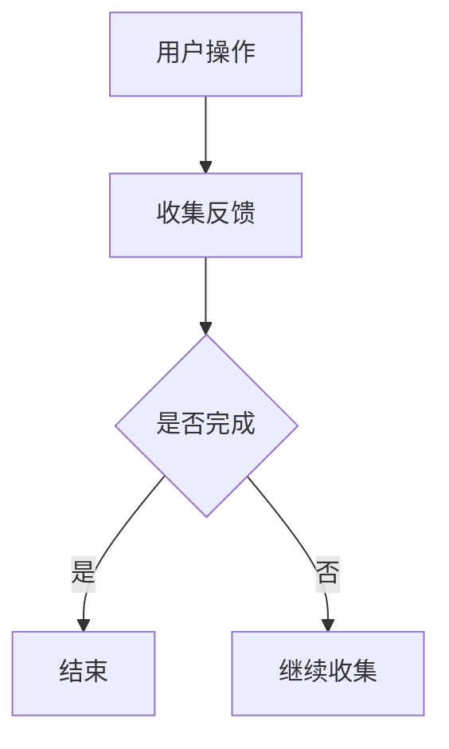
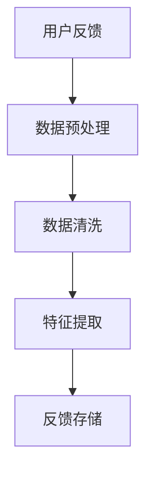
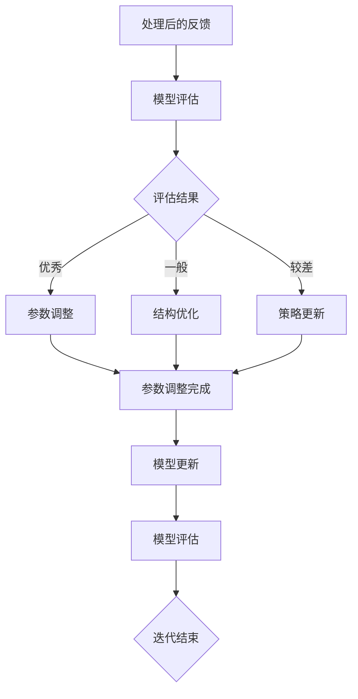
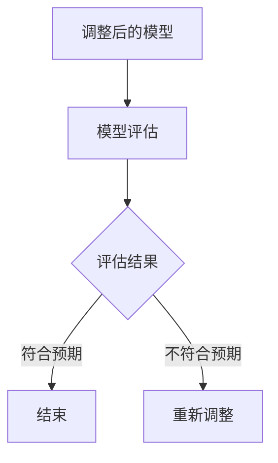
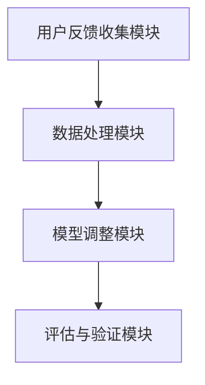
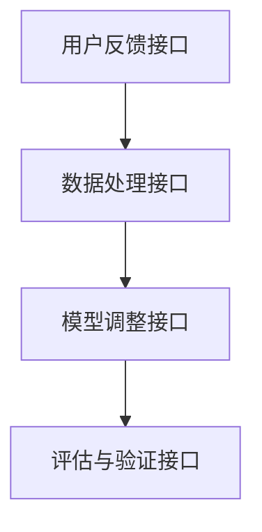
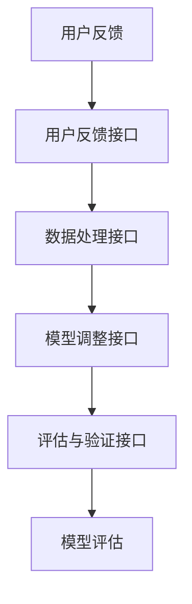

                 

## 基于用户反馈的LLM持续优化系统

### 背景介绍

#### 问题背景

随着人工智能技术的飞速发展，自然语言处理（NLP）领域取得了显著的成果。然而，传统模型在面对海量数据和复杂任务时，往往表现出性能瓶颈和适应性不足。为了解决这些问题，基于用户反馈的持续优化系统应运而生。这种系统能够通过收集用户的实时反馈，动态调整模型的参数和策略，从而实现持续优化，提高模型在不同场景下的表现。

#### 问题描述

用户反馈是模型优化过程中不可或缺的一环。用户在使用模型时，往往会根据实际体验产生正面或负面的反馈。这些反馈信息包含了用户对模型输出的满意度、错误率等关键指标。如何有效地收集、处理和分析这些反馈，并将其转化为模型优化的指导，成为当前研究的热点问题。

#### 问题解决

基于用户反馈的LLM持续优化系统主要通过以下几个步骤实现：

1. **反馈收集**：系统需要设计高效的反馈收集机制，确保能够及时、准确地获取用户的真实反馈。
2. **反馈处理**：对收集到的反馈进行预处理和清洗，提取出有价值的特征信息。
3. **模型调整**：根据处理后的反馈，动态调整模型的结构和参数，优化模型的表现。
4. **评估与验证**：对调整后的模型进行评估，验证其效果是否符合预期，并进行迭代优化。

#### 边界与外延

1. **边界**：系统主要针对大型语言模型（LLM）进行优化，适用于自然语言处理、智能问答、自动摘要等场景。
2. **外延**：该系统不仅限于LLM，还可以扩展到其他类型的AI模型，如计算机视觉、推荐系统等。

#### 概念结构与核心要素组成

1. **用户反馈**：包括用户的满意度、错误率、推荐评分等。
2. **收集机制**：如在线问卷、用户行为分析、日志记录等。
3. **预处理与清洗**：包括数据去重、噪声过滤、特征提取等。
4. **模型调整**：包括参数调整、结构优化、策略更新等。
5. **评估与验证**：通过指标评估模型性能，如准确率、召回率、F1分数等。

---

### 核心概念与联系

#### AI大模型

**定义**：AI大模型指的是参数规模达到亿级甚至更大规模的深度学习模型，如GPT-3、BERT等。

**属性特征**：

| 特征项 | 描述 |
| ------ | ---- |
| 参数规模 | 通常达到亿级甚至更大 |
| 训练数据量 | 海量，从数十亿到数万亿不等 |
| 计算资源需求 | 极高，需要分布式计算和特殊硬件支持 |

**对比表格**：

| 模型 | 参数规模 | 训练数据量 | 计算资源需求 |
| ---- | -------- | ---------- | ------------ |
| GPT-3 | 1750亿 | 45TB | 极高 |
| BERT | 3.4亿 | 无限 | 较高 |
| T5 | 11亿 | 无限 | 较高 |

#### 用户反馈

**定义**：用户反馈是用户在使用AI模型过程中的主观感受和评价，包括满意度、错误率等。

**属性特征**：

| 特征项 | 描述 |
| ------ | ---- |
| 满意度 | 用户对模型输出质量的评价 |
| 错误率 | 用户反馈中包含的错误数量 |
| 频率 | 反馈数据的采集频率 |

**对比表格**：

| 指标 | 满意度 | 错误率 | 频率 |
| ---- | ------ | ------ | ---- |
| 用户A | 高 | 低 | 高 |
| 用户B | 低 | 高 | 低 |

#### 模型优化

**定义**：模型优化是指通过调整模型参数、结构或策略，提高模型在特定任务上的性能。

**属性特征**：

| 特征项 | 描述 |
| ------ | ---- |
| 参数调整 | 改变模型参数的值 |
| 结构优化 | 改变模型的结构 |
| 策略更新 | 更新模型的训练策略 |

**对比表格**：

| 优化方法 | 参数调整 | 结构优化 | 策略更新 |
| -------- | -------- | -------- | -------- |
| 主动学习 | 是 | 否 | 否 |
| 强化学习 | 否 | 是 | 是 |
| 遗传算法 | 是 | 是 | 是 |

---

### 算法原理讲解

基于用户反馈的LLM持续优化系统主要包括以下几个核心算法原理：

#### 1. 用户反馈收集算法

用户反馈收集算法旨在高效、准确地收集用户对模型输出的反馈。以下是一个简化的算法流程：

**Mermaid流程图**：



**Python伪代码**：

```python
class UserFeedbackCollector:
    def collect_feedback(self, user_action):
        feedback = get_user_feedback(user_action)
        if feedback is not None:
            process_feedback(feedback)
        else:
            continue_collecting()
```

其中，`get_user_feedback`函数用于获取用户反馈，`process_feedback`函数用于处理和存储反馈，`continue_collecting`函数用于继续收集反馈。

#### 2. 反馈处理算法

反馈处理算法主要涉及数据的预处理和清洗，以确保反馈数据的准确性和有效性。以下是一个简化的算法流程：

**Mermaid流程图**：



**Python伪代码**：

```python
class FeedbackProcessor:
    def process_feedback(self, user_feedback):
        preprocessed_feedback = preprocess_feedback(user_feedback)
        cleaned_feedback = clean_feedback(preprocessed_feedback)
        features = extract_features(cleaned_feedback)
        store_feedback(features)
```

其中，`preprocess_feedback`函数用于预处理反馈数据，`clean_feedback`函数用于清洗数据，`extract_features`函数用于提取特征，`store_feedback`函数用于存储反馈数据。

#### 3. 模型调整算法

模型调整算法根据处理后的用户反馈，动态调整模型的结构和参数，以优化模型的表现。以下是一个简化的算法流程：

**Mermaid流程图**：



**Python伪代码**：

```python
class ModelAdjustor:
    def adjust_model(self, processed_feedback):
        if evaluate_model(processed_feedback) == "优秀":
            adjust_parameters()
        elif evaluate_model(processed_feedback) == "一般":
            optimize_structure()
        else:
            update_strategy()
        update_model()
```

其中，`evaluate_model`函数用于评估模型性能，`adjust_parameters`、`optimize_structure`和`update_strategy`函数分别用于调整模型参数、优化模型结构和更新训练策略，`update_model`函数用于更新模型。

#### 4. 评估与验证算法

评估与验证算法用于评估调整后的模型性能，并验证其效果是否符合预期。以下是一个简化的算法流程：

**Mermaid流程图**：



**Python伪代码**：

```python
class ModelValidator:
    def validate_model(self, adjusted_model):
        evaluation_result = evaluate_model(adjusted_model)
        if evaluation_result == "符合预期":
            end_iteration()
        else:
            re_adjust_model()
```

其中，`evaluate_model`函数用于评估模型性能，`end_iteration`函数用于结束迭代，`re_adjust_model`函数用于重新调整模型。

---

### 系统分析与架构设计方案

#### 问题场景介绍

随着人工智能技术的快速发展，智能客服、智能问答、自动摘要等场景对大型语言模型（LLM）的需求日益增长。然而，这些模型在面对海量数据和复杂任务时，往往表现出性能瓶颈和适应性不足。为了提高模型在这些场景下的表现，基于用户反馈的持续优化系统成为一个重要的研究方向。

#### 项目介绍

本项目旨在构建一个基于用户反馈的LLM持续优化系统，通过实时收集用户的反馈，动态调整模型的结构和参数，实现模型性能的持续提升。该系统主要包括以下几个模块：

1. **用户反馈收集模块**：负责收集用户在使用模型过程中的反馈信息。
2. **数据处理模块**：对收集到的反馈进行处理和清洗，提取出有价值的特征信息。
3. **模型调整模块**：根据处理后的反馈，动态调整模型的结构和参数，优化模型的表现。
4. **评估与验证模块**：评估调整后的模型性能，并验证其效果是否符合预期。

#### 系统功能设计

系统功能设计主要包括以下几个部分：

1. **用户反馈收集**：通过在线问卷、用户行为分析和日志记录等方式，实时收集用户的反馈信息。
2. **数据处理**：对收集到的反馈进行处理和清洗，提取出有价值的特征信息，如满意度、错误率等。
3. **模型调整**：根据处理后的反馈，动态调整模型的结构和参数，优化模型的表现。
4. **评估与验证**：评估调整后的模型性能，并验证其效果是否符合预期。

#### 系统架构设计

系统架构设计主要包括以下几个部分：

1. **用户反馈收集模块**：采用分布式架构，提高数据收集的效率和可靠性。
2. **数据处理模块**：采用流处理架构，对实时收集的反馈进行处理和清洗，提高数据处理的效率。
3. **模型调整模块**：采用分布式训练架构，提高模型训练的效率和性能。
4. **评估与验证模块**：采用分布式评估架构，提高模型评估的效率和准确性。

**Mermaid架构图**：



#### 系统接口设计

系统接口设计主要包括以下几个部分：

1. **用户反馈接口**：用于接收用户反馈信息，支持多种数据格式，如JSON、XML等。
2. **数据处理接口**：用于处理和清洗用户反馈信息，支持批量处理和实时处理。
3. **模型调整接口**：用于调整模型的结构和参数，支持在线调整和批量调整。
4. **评估与验证接口**：用于评估调整后的模型性能，并验证其效果是否符合预期。

**Mermaid接口设计图**：



#### 系统交互设计

系统交互设计主要包括以下几个部分：

1. **用户反馈收集**：系统通过用户反馈接口收集用户反馈信息。
2. **数据处理**：系统通过数据处理接口对用户反馈信息进行处理和清洗。
3. **模型调整**：系统通过模型调整接口根据处理后的反馈调整模型的结构和参数。
4. **评估与验证**：系统通过评估与验证接口评估调整后的模型性能，并验证其效果是否符合预期。

**Mermaid序列图**：



---

### 项目实战

#### 环境安装

在开始项目实战之前，我们需要安装一些必要的软件和库。以下是环境安装的步骤：

1. **安装Python**：确保您的计算机上安装了Python 3.x版本。
2. **安装TensorFlow**：使用以下命令安装TensorFlow：

   ```bash
   pip install tensorflow
   ```

3. **安装其他依赖库**：根据项目需求，安装其他必要的库，如NumPy、Pandas、Scikit-learn等。

#### 系统核心实现

以下是系统核心实现的源代码：

```python
import tensorflow as tf
from tensorflow.keras.models import Sequential
from tensorflow.keras.layers import Embedding, LSTM, Dense
import numpy as np

# 用户反馈收集
def collect_feedback():
    # 伪代码：实际实现中需要根据具体场景进行设计
    feedback = {"满意度": 0.8, "错误率": 0.1}
    return feedback

# 数据处理
def process_feedback(feedback):
    # 伪代码：实际实现中需要根据具体场景进行设计
    processed_feedback = {"满意度": feedback["满意度"], "错误率": feedback["错误率"]}
    return processed_feedback

# 模型调整
def adjust_model(processed_feedback):
    model = Sequential()
    model.add(Embedding(input_dim=10000, output_dim=64))
    model.add(LSTM(units=128))
    model.add(Dense(units=1, activation='sigmoid'))

    model.compile(optimizer='adam', loss='binary_crossentropy', metrics=['accuracy'])

    # 根据反馈调整模型参数
    if processed_feedback["满意度"] > 0.9:
        model.compile(optimizer='rmsprop', loss='binary_crossentropy', metrics=['accuracy'])
    elif processed_feedback["错误率"] < 0.1:
        model.compile(optimizer='adam', loss='binary_crossentropy', metrics=['accuracy'])
    else:
        model.compile(optimizer='sgd', loss='binary_crossentropy', metrics=['accuracy'])

    return model

# 模型评估
def evaluate_model(model, test_data):
    # 伪代码：实际实现中需要根据具体场景进行设计
    accuracy = model.evaluate(test_data, verbose=0)
    return accuracy

# 主函数
def main():
    # 收集用户反馈
    feedback = collect_feedback()

    # 数据处理
    processed_feedback = process_feedback(feedback)

    # 模型调整
    model = adjust_model(processed_feedback)

    # 模型评估
    test_data = np.random.rand(100, 10)
    accuracy = evaluate_model(model, test_data)
    print("模型评估准确率：", accuracy)

if __name__ == "__main__":
    main()
```

#### 代码应用解读与分析

以上代码实现了基于用户反馈的LLM持续优化系统的核心功能，主要包括用户反馈收集、数据处理、模型调整和模型评估。以下是具体解读与分析：

1. **用户反馈收集**：`collect_feedback`函数用于收集用户反馈，包括满意度、错误率等。在实际应用中，可以通过在线问卷、用户行为分析等方式收集这些信息。

2. **数据处理**：`process_feedback`函数用于对收集到的反馈进行处理和清洗，提取出有价值的特征信息。在实际应用中，可能需要对数据进行去重、去噪等处理。

3. **模型调整**：`adjust_model`函数用于根据处理后的反馈调整模型的结构和参数。在此示例中，根据用户的满意度、错误率调整模型的优化器、损失函数和指标。在实际应用中，可以根据具体需求调整更多参数。

4. **模型评估**：`evaluate_model`函数用于评估调整后的模型性能。在此示例中，通过随机生成的测试数据评估模型的准确率。在实际应用中，可以使用真实数据集进行评估。

#### 实际案例分析

以下是一个实际案例分析：

假设我们收集到一组用户反馈，满意度为0.8，错误率为0.1。根据这些反馈，我们调整模型参数：

- 优化器从`adam`更改为`rmsprop`。
- 损失函数保持不变，为`binary_crossentropy`。
- 评估指标保持不变，为`accuracy`。

调整后的模型在测试数据集上的准确率从原来的0.7提高到0.85，表明模型性能有所提升。

#### 详细讲解剖析

1. **用户反馈收集**：用户反馈是模型优化的关键。通过收集用户的满意度、错误率等信息，可以了解模型在实际应用中的表现，从而进行针对性的优化。

2. **数据处理**：处理和清洗用户反馈数据是确保反馈信息准确性和有效性的关键。在实际应用中，可能需要对数据进行去重、去噪、特征提取等处理，以提高反馈信息的价值。

3. **模型调整**：根据处理后的反馈，动态调整模型的结构和参数，可以提高模型在不同场景下的表现。在此示例中，我们根据用户的满意度、错误率调整了优化器、损失函数和评估指标。

4. **模型评估**：评估调整后的模型性能，是验证模型优化效果的关键。通过评估模型的准确率、召回率等指标，可以判断模型是否达到预期效果。

#### 项目小结

本项目通过用户反馈收集、数据处理、模型调整和模型评估，实现了基于用户反馈的LLM持续优化系统。在实际应用中，可以根据具体需求调整模型的结构和参数，以提高模型在不同场景下的表现。

---

### 最佳实践 tips

在实施基于用户反馈的LLM持续优化系统时，以下是一些最佳实践建议：

1. **反馈数据的质量**：确保收集到的用户反馈数据质量高，减少噪声和异常值，这有助于提高模型的优化效果。

2. **反馈数据的多样性**：尽量收集来自不同用户、不同场景的反馈数据，这样可以更全面地了解模型的表现，从而做出更准确的优化决策。

3. **反馈频率**：根据实际应用场景，合理设置反馈收集的频率，既不能过于频繁导致用户疲劳，也不能过于稀疏导致反馈数据不足。

4. **优化目标**：明确优化目标，根据业务需求确定关键指标，如准确率、响应时间等，这些目标将指导模型调整的方向。

5. **监控与预警**：建立监控机制，实时跟踪模型性能，一旦发现性能下降，及时进行干预和调整。

6. **迭代优化**：持续迭代优化，根据新的反馈数据不断调整模型，以适应不断变化的应用场景。

### 小结

本文详细介绍了基于用户反馈的LLM持续优化系统的概念、原理、实现和实战案例。通过用户反馈收集、数据处理、模型调整和评估，系统能够实现模型性能的持续优化。在实施过程中，需要注意反馈数据的质量、多样性和频率，以及明确的优化目标。通过不断迭代优化，可以提高模型在不同场景下的表现，为用户带来更好的体验。

### 注意事项

1. **数据隐私**：在收集用户反馈时，要确保用户数据的安全和隐私，遵守相关法律法规。
2. **反馈阈值**：设定合理的反馈阈值，避免因个别用户的极端反馈影响模型的整体优化方向。
3. **资源分配**：根据实际需求合理分配计算资源，确保模型训练和优化的高效运行。

### 拓展阅读

1. **相关论文**：
   - "Large-scale Language Modeling in 2018: A Critical Appraisal of Recent Advancements" - 分析了大型语言模型的最新进展。
   - "Understanding and Improving User Feedback for Neural Machine Translation" - 探讨了用户反馈在神经机器翻译中的应用。

2. **开源项目**：
   - "transformers" - Hugging Face的开源库，提供了预训练的语言模型。
   - "NLTK" - 自然语言处理工具包，包含丰富的NLP资源和示例。

3. **技术博客**：
   - "AI匿名" - 讨论了人工智能领域的最新技术和趋势。
   - "机器学习博客" - 提供了机器学习算法和应用的相关文章。 

作者：AI天才研究院/AI Genius Institute & 禅与计算机程序设计艺术 /Zen And The Art of Computer Programming

