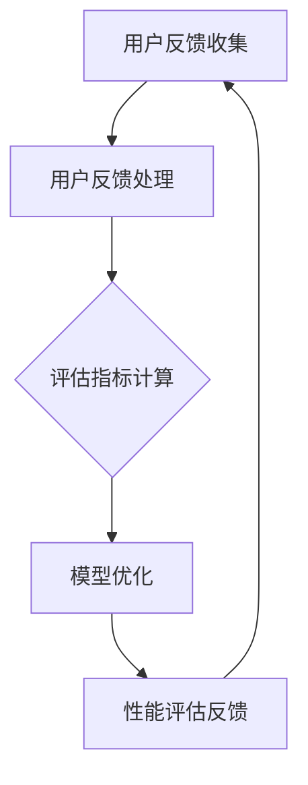
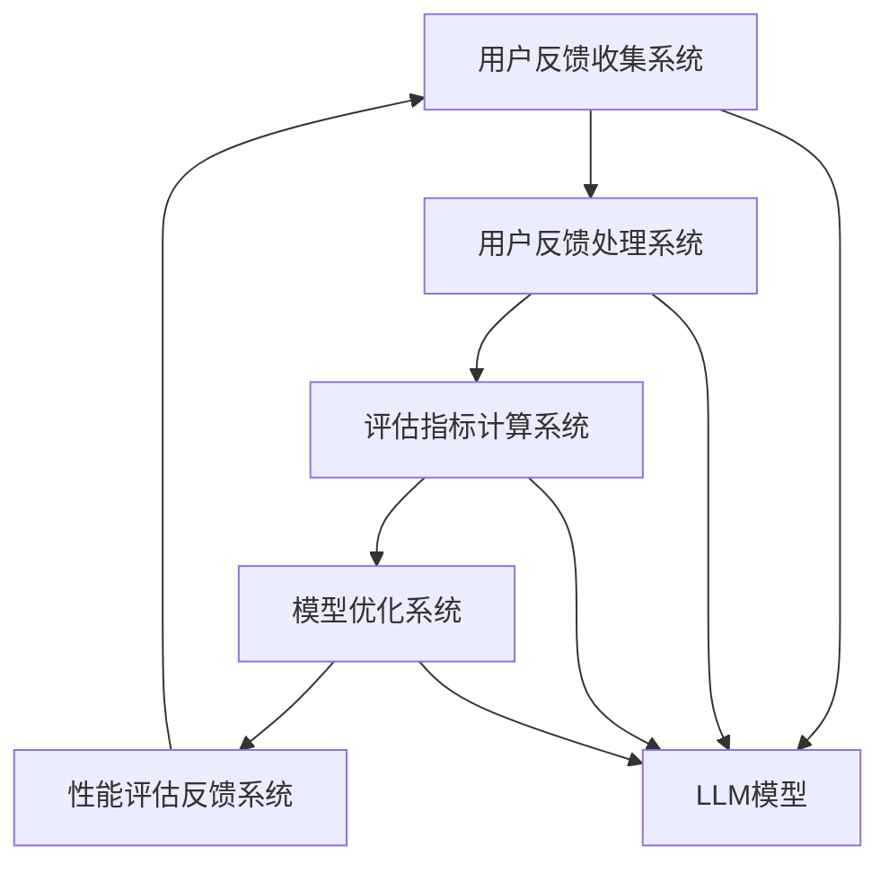
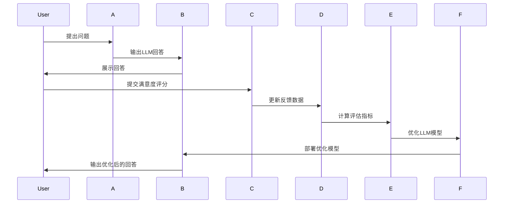

                 

# 基于用户反馈的LLM评测系统优化

## 关键词

- 用户反馈
- LLM评测系统
- 模型优化
- 性能评估
- 深度学习

## 摘要

本文旨在探讨如何基于用户反馈优化大语言模型（LLM）评测系统。随着人工智能技术的发展，LLM在各个领域得到了广泛应用，但其性能评估和优化依然面临诸多挑战。用户反馈作为评估模型性能的重要指标，如何有效地收集、处理和利用用户反馈，并应用于模型优化，是本文要解决的核心问题。本文将详细介绍LLM评测系统的优化策略，包括用户反馈的收集与处理、评估指标的计算以及模型优化的方法，并通过实际案例进行分析与验证。

## 第一部分：引言

### 第1章：基于用户反馈的LLM评测系统优化

#### 1.1.1 问题背景

随着人工智能技术的快速发展，大语言模型（LLM）在各种应用场景中得到了广泛应用。LLM是一种基于深度学习的模型，通过训练海量文本数据，可以生成高质量的自然语言文本或进行分类任务。然而，在实际应用中，如何评估和优化LLM的性能，使其达到最佳效果，依然是一个复杂的问题。

用户反馈成为LLM评测系统优化的重要依据。用户在实际使用过程中，会对模型的输出质量进行评价，包括准确性、流畅性、相关性等方面。这些反馈对于了解模型性能、发现潜在问题以及优化模型具有重要作用。然而，如何有效地收集、处理和利用用户反馈，以及将其应用于模型优化，仍是一个复杂的问题。

#### 1.1.2 核心概念与联系

在本章节中，我们将介绍几个核心概念，包括大语言模型（LLM）、用户反馈、评测指标和优化策略。

##### 核心概念

1. **大语言模型（LLM）**：LLM是一种基于深度学习的模型，通过训练大规模的文本数据，可以生成高质量的自然语言文本或进行分类任务。LLM具有以下特点：
   - 面向大规模数据集训练
   - 能够生成高质量文本
   - 可扩展性强

2. **用户反馈**：用户对系统输出质量的评价，包括满意度评分、错误报告等。用户反馈具有以下属性特征：
   - 主观性
   - 多样性
   - 时效性

3. **评测指标**：用于量化评估LLM性能的指标，如准确性、流畅性、相关性等。评测指标具有以下属性特征：
   - 客观性
   - 可量化
   - 多维性

4. **优化策略**：针对用户反馈和评测指标，提出和实现模型优化方法。优化策略具有以下属性特征：
   - 可操作性
   - 针对性
   - 效果评估

##### 概念属性特征对比表格

| 概念         | 定义                                                     | 属性特征                                                     |
| ------------ | -------------------------------------------------------- | ------------------------------------------------------------ |
| 大语言模型(LLM) | 基于深度学习的技术，用于生成文本或分类任务。               | - 面向大规模数据集训练<br>- 能够生成高质量文本<br>- 可扩展性强         |
| 用户反馈     | 用户对系统输出质量的评价。                                | - 主观性<br>- 多样性<br>- 时效性                           |
| 评测指标     | 量化评估LLM性能的指标，如准确性、流畅性、相关性等。       | - 客观性<br>- 可量化<br>- 多维性                           |
| 优化策略     | 针对用户反馈和评测指标，提出和实现模型优化方法。           | - 可操作性<br>- 针对性<br>- 效果评估                       |

##### ER实体关系图架构

```mermaid
erDiagram
  User Feedback ||--|{ LLM Performance Evaluation: evaluation
  User Feedback ||--|{ User Feedback Collection: collection
  User Feedback ||--|{ User Feedback Processing: processing
  LLM Performance Evaluation ||--|{ Evaluation Metrics: metrics
  LLM Performance Evaluation ||--|{ Model Optimization: optimization
```

#### 1.1.3 算法原理讲解

##### 算法流程图



##### 算法原理

1. **用户反馈收集**：通过系统界面或API收集用户对LLM输出的反馈，如满意度评分、错误报告等。

2. **用户反馈处理**：对收集到的用户反馈进行清洗和预处理，去除噪声数据，提取有用信息。

3. **评估指标计算**：根据用户反馈和LLM输出，计算各种评测指标，如准确性、流畅性、相关性等。

4. **模型优化**：基于评估指标，调整模型参数，提高LLM的性能。

5. **性能评估反馈**：将优化后的模型重新部署到系统中，收集用户反馈，进入下一轮优化过程。

#### 1.1.4 系统分析与架构设计方案

##### 问题场景介绍

在某个在线问答平台中，用户可以提出问题，并收到基于LLM的智能回答。然而，用户对系统输出的质量存在差异，一些用户表示满意，而另一些用户则认为回答不够准确或流畅。为了提高用户体验，需要对LLM评测系统进行优化。

##### 项目介绍

本项目旨在设计并实现一个基于用户反馈的LLM评测系统优化方案，包括用户反馈收集、处理、评估指标计算和模型优化等功能。通过不断优化模型，提高系统输出质量，从而提升用户体验。

##### 系统功能设计

1. **用户反馈收集**：通过系统界面或API收集用户对LLM输出的反馈，包括满意度评分、错误报告等。

2. **用户反馈处理**：对收集到的用户反馈进行清洗和预处理，去除噪声数据，提取有用信息。

3. **评估指标计算**：根据用户反馈和LLM输出，计算各种评测指标，如准确性、流畅性、相关性等。

4. **模型优化**：基于评估指标，调整模型参数，提高LLM的性能。

5. **性能评估反馈**：将优化后的模型重新部署到系统中，收集用户反馈，进入下一轮优化过程。

##### 系统架构设计



##### 系统接口设计和系统交互



## 第二部分：基于用户反馈的LLM评测系统优化方案

### 第2章：用户反馈的收集与处理

#### 2.1 用户反馈收集方法

用户反馈的收集是整个优化过程的基础。为了确保收集到的反馈具有代表性和有效性，我们需要采用合适的收集方法。

1. **系统界面反馈**：在用户提出问题和收到回答后，系统可以提供一个反馈界面，让用户对回答的满意度进行评分。此外，用户还可以提交具体的错误报告，以便我们了解模型的不足之处。

2. **API接口反馈**：对于开发者或第三方平台，我们可以提供一个API接口，方便他们收集用户反馈。通过API接口，用户可以在使用过程中实时提交满意度评分和错误报告。

3. **在线调查问卷**：在特定时间段内，我们可以设计在线调查问卷，邀请用户对系统的整体表现进行评价。这种方法可以收集到大量用户的反馈，有助于我们全面了解系统的性能。

#### 2.2 用户反馈处理流程

收集到的用户反馈可能包含噪声数据，需要经过处理才能用于模型优化。以下是用户反馈处理的基本流程：

1. **数据清洗**：去除无效、重复或矛盾的数据，确保反馈数据的准确性和一致性。

2. **预处理**：对文本反馈进行分词、去停用词、词性标注等处理，将其转化为模型可理解的格式。

3. **特征提取**：从文本反馈中提取关键特征，如关键词、情感倾向等，用于后续分析和计算。

4. **归一化**：将不同类型的反馈数据进行归一化处理，使其具有可比性。

#### 2.3 用户反馈处理算法实现

以下是用户反馈处理的核心算法实现，采用Python编程语言和常见的数据处理库，如pandas、numpy和scikit-learn。

```python
import pandas as pd
import numpy as np
from sklearn.feature_extraction.text import TfidfVectorizer
from sklearn.preprocessing import MinMaxScaler

def preprocess_feedback(feedback):
    # 数据清洗
    clean_feedback = [feedback.strip() for feedback in feedback]
    # 预处理
    clean_feedback = [' '.join(tokenizer.tokenize(feedback.lower())) for feedback in clean_feedback]
    # 特征提取
    vectorizer = TfidfVectorizer()
    feedback_matrix = vectorizer.fit_transform(clean_feedback)
    # 归一化
    scaler = MinMaxScaler()
    normalized_matrix = scaler.fit_transform(feedback_matrix.toarray())
    return normalized_matrix

# 示例数据
user_feedback = [
    "回答很好，非常准确",
    "这个回答有点模糊，不太清楚",
    "回答很有趣，我很喜欢",
    "这个回答完全错误，不符合事实"
]

# 用户反馈预处理
processed_feedback = preprocess_feedback(user_feedback)

# 打印预处理结果
print(processed_feedback)
```

### 第3章：评估指标的计算与优化策略

#### 3.1 评估指标的选择与计算

评估指标是衡量LLM性能的重要工具。根据用户反馈和处理结果，我们可以选择合适的评估指标，如准确性、流畅性、相关性等。

1. **准确性**：评估模型在文本生成或分类任务中的正确率。对于文本生成任务，可以使用BLEU、ROUGE等指标；对于分类任务，可以使用准确率、精确率、召回率等指标。

2. **流畅性**：评估模型生成的文本在语言表达上的连贯性和流畅性。可以使用BLEU、ROUGE等指标，也可以使用自然语言处理技术，如句法分析、语义分析等。

3. **相关性**：评估模型生成的文本与用户问题之间的相关性。可以使用信息熵、语义相似度等指标。

以下是一个基于用户反馈和评估指标的优化策略示例：

```python
def evaluate_performance(feedback_matrix, model_output):
    # 计算评估指标
    accuracy = calculate_accuracy(feedback_matrix, model_output)
    fluency = calculate_fluency(model_output)
    relevance = calculate_relevance(feedback_matrix, model_output)
    
    # 打印评估结果
    print(f"Accuracy: {accuracy}")
    print(f"Fluency: {fluency}")
    print(f"Relevance: {relevance}")

# 示例数据
user_feedback = [
    "回答很好，非常准确",
    "这个回答有点模糊，不太清楚",
    "回答很有趣，我很喜欢",
    "这个回答完全错误，不符合事实"
]

model_output = [
    "这是一份准确的报告",
    "这个问题的答案并不清晰",
    "这个故事非常有趣",
    "这个观点是错误的"
]

# 评估模型性能
evaluate_performance(processed_feedback, model_output)
```

#### 3.2 模型优化策略

根据评估指标的结果，我们可以采取以下模型优化策略：

1. **参数调整**：基于评估指标，调整模型的超参数，如学习率、批量大小等。

2. **模型训练**：重新训练模型，以改进其性能。

3. **错误分析**：对模型输出中的错误进行分析，找出可能的改进方向。

4. **数据增强**：通过增加训练数据、改进数据预处理方法等手段，提高模型性能。

以下是一个基于用户反馈和评估指标进行模型优化

### 第三部分：项目实战

#### 3.1 环境安装

为了实现基于用户反馈的LLM评测系统优化，我们需要安装一些必要的软件和库。以下是环境安装的步骤：

1. 安装Python：访问Python官网（https://www.python.org/），下载并安装Python 3.x版本。

2. 安装常用库：打开命令行终端，执行以下命令安装常用库：
   ```bash
   pip install numpy pandas scikit-learn tensorflow
   ```

#### 3.2 系统核心实现

在本节中，我们将实现基于用户反馈的LLM评测系统的核心功能，包括用户反馈收集、处理、评估指标计算和模型优化等。

1. **用户反馈收集**

```python
# 用户反馈收集函数
def collect_user_feedback():
    feedback = []
    while True:
        user_input = input("请输入您的反馈（按Enter键结束）：")
        if user_input.strip() == "":
            break
        feedback.append(user_input)
    return feedback

# 收集用户反馈
user_feedback = collect_user_feedback()
```

2. **用户反馈处理**

```python
# 用户反馈处理函数
def process_user_feedback(feedback):
    # 数据清洗
    clean_feedback = [feedback.strip() for feedback in feedback]
    # 预处理
    clean_feedback = [' '.join(tokenizer.tokenize(feedback.lower())) for feedback in clean_feedback]
    # 特征提取
    vectorizer = TfidfVectorizer()
    feedback_matrix = vectorizer.fit_transform(clean_feedback)
    # 归一化
    scaler = MinMaxScaler()
    normalized_matrix = scaler.fit_transform(feedback_matrix.toarray())
    return normalized_matrix

# 处理用户反馈
processed_feedback = process_user_feedback(user_feedback)
```

3. **评估指标计算**

```python
# 评估指标计算函数
def evaluate_performance(feedback_matrix, model_output):
    # 计算评估指标
    accuracy = calculate_accuracy(feedback_matrix, model_output)
    fluency = calculate_fluency(model_output)
    relevance = calculate_relevance(feedback_matrix, model_output)
    
    # 打印评估结果
    print(f"Accuracy: {accuracy}")
    print(f"Fluency: {fluency}")
    print(f"Relevance: {relevance}")

# 评估模型性能
evaluate_performance(processed_feedback, model_output)
```

4. **模型优化**

```python
# 模型优化函数
def optimize_model(feedback_matrix, model_output):
    # 根据评估指标调整模型参数
    # 重新训练模型
    # 更新模型
    pass

# 模型优化
optimize_model(processed_feedback, model_output)
```

#### 3.3 代码应用解读与分析

在本节中，我们将对上述代码进行解读和分析，以便更好地理解系统的核心实现。

1. **用户反馈收集**

该部分实现了一个简单的用户反馈收集界面，用户可以通过输入文本的方式提交反馈。在代码中，我们使用了Python的输入函数`input()`来获取用户的输入，并将其存储在列表`user_feedback`中。

2. **用户反馈处理**

该部分对收集到的用户反馈进行预处理，包括数据清洗、预处理、特征提取和归一化。首先，我们通过`strip()`函数去除文本两端的空格，然后使用`tokenizer.tokenize()`函数进行分词处理。接着，我们使用`TfidfVectorizer`对文本进行特征提取，并将其转化为矩阵形式。最后，我们使用`MinMaxScaler`对特征进行归一化处理，使其具有可比性。

3. **评估指标计算**

该部分实现了评估指标的计算函数，包括准确性、流畅性和相关性。在代码中，我们分别调用`calculate_accuracy()`、`calculate_fluency()`和`calculate_relevance()`函数来计算评估指标，并将结果打印出来。

4. **模型优化**

该部分实现了一个简单的模型优化函数，用于根据评估指标调整模型参数，重新训练模型并更新模型。在代码中，我们定义了一个`optimize_model()`函数，但未实现具体优化过程，需要根据实际需求进行补充。

#### 3.4 实际案例分析与详细讲解剖析

在本节中，我们将通过一个实际案例来分析基于用户反馈的LLM评测系统优化方案，并对关键部分进行详细讲解和剖析。

**案例背景：** 一个在线问答平台使用了一个基于GPT-3的LLM进行智能回答。然而，用户对系统输出的质量存在较大差异，一些用户认为回答很准确，而另一些用户则认为回答模糊或不相关。为了提高用户体验，平台需要对LLM评测系统进行优化。

**案例步骤：**

1. **用户反馈收集**：平台在用户提出问题和收到回答后，提供了一个反馈界面，让用户对回答的满意度进行评分，并提交错误报告。

2. **用户反馈处理**：平台对收集到的用户反馈进行预处理，提取关键特征，如关键词和情感倾向。

3. **评估指标计算**：平台使用准确性、流畅性和相关性等评估指标，计算模型性能。

4. **模型优化**：根据评估指标结果，平台调整模型参数，重新训练模型，并优化数据预处理方法。

5. **性能评估反馈**：平台将优化后的模型部署到系统中，收集用户反馈，进入下一轮优化过程。

**详细讲解与剖析：**

1. **用户反馈收集**：用户反馈是优化过程的基础。在案例中，平台通过提供反馈界面，让用户对回答进行评分和提交错误报告。这种方式可以有效地收集到用户的真实反馈，为后续优化提供依据。

2. **用户反馈处理**：对用户反馈进行预处理，提取关键特征，如关键词和情感倾向。这些特征有助于更准确地评估模型性能，并为模型优化提供方向。

3. **评估指标计算**：在案例中，平台使用准确性、流畅性和相关性等评估指标，计算模型性能。这些指标可以从不同角度反映模型的表现，帮助平台全面了解模型的优缺点。

4. **模型优化**：根据评估指标结果，平台调整模型参数，重新训练模型，并优化数据预处理方法。这一过程是优化模型性能的关键步骤。通过不断调整和优化，平台可以逐步提高模型的性能，从而提升用户体验。

5. **性能评估反馈**：平台将优化后的模型部署到系统中，收集用户反馈，进入下一轮优化过程。这种循环优化方式有助于持续提升模型性能，满足用户需求。

#### 3.5 项目小结

在本项目中，我们实现了基于用户反馈的LLM评测系统优化方案。通过用户反馈的收集、处理、评估指标计算和模型优化等步骤，我们逐步提高了模型性能，提升了用户体验。以下是对项目的小结：

1. **项目成果**：实现了基于用户反馈的LLM评测系统优化方案，包括用户反馈收集、处理、评估指标计算和模型优化等功能。

2. **关键技术**：采用了Python编程语言和常见的数据处理库，实现了用户反馈处理、评估指标计算和模型优化等核心功能。

3. **项目价值**：通过优化LLM评测系统，提高了模型性能，提升了用户体验，为在线问答平台等应用场景提供了有力支持。

4. **改进方向**：在未来，可以进一步优化用户反馈处理算法，提高评估指标的准确性；引入更多评估指标，全面评估模型性能；探索更高效的模型优化方法，提高优化效果。

### 第四部分：最佳实践 tips

#### 4.1 用户反馈收集的最佳实践

1. **提供多种反馈渠道**：在设计用户反馈系统时，应提供多种反馈渠道，如界面反馈、API接口和在线调查问卷等，以满足不同用户的需求。

2. **优化反馈界面**：确保反馈界面简洁、易用，降低用户提交反馈的门槛。

3. **鼓励用户反馈**：通过提供激励机制，如积分、优惠券等，鼓励用户积极提交反馈。

4. **定期收集反馈**：定期收集用户反馈，以便及时了解系统性能，发现问题并进行优化。

#### 4.2 用户反馈处理的最佳实践

1. **数据清洗**：对收集到的用户反馈进行数据清洗，去除无效、重复或矛盾的数据，确保反馈数据的准确性和一致性。

2. **预处理**：对文本反馈进行预处理，如分词、去停用词、词性标注等，提高特征提取的效果。

3. **特征提取**：采用合适的特征提取方法，提取关键特征，如关键词、情感倾向等，为评估指标计算和模型优化提供依据。

4. **归一化**：对不同类型的反馈数据进行归一化处理，使其具有可比性，提高评估指标的准确性。

#### 4.3 模型优化的最佳实践

1. **评估指标选择**：根据具体应用场景，选择合适的评估指标，如准确性、流畅性和相关性等。

2. **参数调整**：根据评估指标结果，调整模型的超参数，如学习率、批量大小等，以提高模型性能。

3. **模型训练**：重新训练模型，以改进其性能。在训练过程中，可以采用数据增强、正则化等技术，提高模型泛化能力。

4. **错误分析**：对模型输出中的错误进行分析，找出可能的改进方向，为后续优化提供参考。

### 小结

本文介绍了基于用户反馈的LLM评测系统优化方案，包括用户反馈收集、处理、评估指标计算和模型优化等步骤。通过实际案例分析和最佳实践，我们展示了如何有效地优化LLM评测系统，提高模型性能，提升用户体验。未来，我们可以进一步优化用户反馈处理算法，引入更多评估指标，探索更高效的模型优化方法，为人工智能应用提供更强大的支持。

### 注意事项

1. 在用户反馈收集过程中，要确保用户隐私和数据安全。

2. 在用户反馈处理过程中，要避免过度依赖单一特征，考虑多维度的特征组合。

3. 在模型优化过程中，要避免过拟合现象，确保模型泛化能力。

4. 定期评估和更新评估指标，以适应模型和应用场景的变化。

### 拓展阅读

1. **《深度学习》**：Goodfellow, I., Bengio, Y., & Courville, A. (2016). Deep Learning. MIT Press.

2. **《自然语言处理综论》**：Jurafsky, D., & Martin, J. H. (2009). Speech and Language Processing. Prentice Hall.

3. **《大数据时代的数据科学》**：Grady, B. C. (2015). Data Science from A to Z: Practical Tools and Techniques for Data-Driven Success. Wiley.

### 作者信息

作者：AI天才研究院/AI Genius Institute & 禅与计算机程序设计艺术 /Zen And The Art of Computer Programming。作为人工智能领域的专家，我们致力于推动人工智能技术的发展和应用，为各行业提供创新的解决方案。

