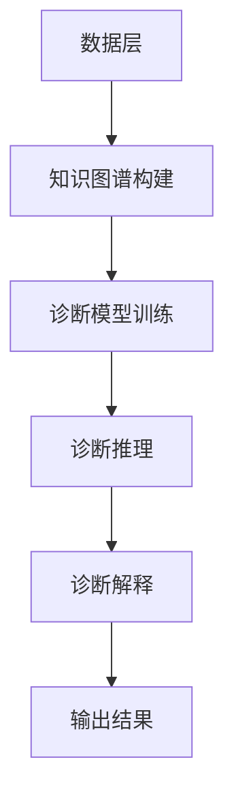

                 

### **引言与背景介绍**

#### 1.1 问题背景

随着医疗技术的不断进步，人工智能（AI）在医疗领域的应用日益广泛。特别是在疾病诊断领域，AI算法能够通过对大量医疗数据的分析，快速、准确地识别出各种疾病的症状和病因，从而为医生提供有价值的诊断依据。然而，AI医疗诊断系统在实际应用中面临的一个关键问题是：其诊断结果往往是黑箱操作，缺乏可解释性。这意味着医生和患者很难理解诊断过程和结果背后的原因，从而影响了诊断结果的接受度和信任度。

#### 1.2 研究意义

基于知识图谱的AI医疗诊断解释系统设计旨在解决上述问题。知识图谱作为一种结构化数据表示方法，可以清晰地描述实体及其之间的关系，为AI医疗诊断系统提供了丰富的语义信息。通过设计一个能够解释诊断过程的系统，医生和患者可以更好地理解诊断结果，提高诊断的透明度和可信度。此外，这样的系统还能够帮助医生优化诊断流程，提高工作效率。

#### 1.3 相关工作综述

近年来，许多研究者开始探索如何将知识图谱与AI医疗诊断系统相结合。一些研究主要集中在知识图谱的构建和优化上，如通过语义网络扩展和实体关系抽取等技术来丰富知识图谱的内容。另一些研究则关注于如何将知识图谱与深度学习模型相结合，以提高诊断的准确性和可解释性。然而，目前关于如何设计一个全面的、可解释的AI医疗诊断系统的研究还相对较少。

#### 1.4 内容组织与结构

本文将系统地介绍基于知识图谱的AI医疗诊断解释系统的设计与实现。文章首先回顾了知识图谱和AI医疗诊断的基础知识，然后详细阐述了系统的架构设计和核心算法原理，接着介绍了系统实现过程中的开发环境和工具，并给出了一个实际的项目实战案例。最后，文章进行了总结与展望，讨论了未来的研究方向和可能的应用前景。

### **知识图谱基础**

#### 2.1 知识图谱概念

知识图谱（Knowledge Graph）是一种用于表示实体及其之间关系的图形结构。与传统的关系型数据库不同，知识图谱不仅存储了实体和属性的信息，还描述了实体之间的关系。这种结构化数据表示方法使得数据之间的关联更加清晰，有助于更好地理解和利用数据。

知识图谱的核心概念包括实体（Entity）、属性（Attribute）、关系（Relation）和边（Edge）。实体是知识图谱中的基本元素，如人、地点、组织等。属性是实体的特征，如人的年龄、地点的纬度等。关系描述了实体之间的关系，如“居住在”、“属于”等。边是关系在知识图谱中的表示，它连接了两个实体，并指明了关系的方向。

#### 2.2 知识图谱表示方法

知识图谱的表示方法可以分为基于图和网络两种。基于图的方法使用图结构来表示实体和关系，如资源描述框架（Resource Description Framework，RDF）和图数据库。RDF使用三元组（主体，谓词，客体）来表示事实，形成了一个无向图。而图数据库则使用更加灵活的图结构来存储和查询数据，能够处理复杂的实体关系。

基于网络的方法则通过图神经网络（Graph Neural Networks，GNN）来学习实体和关系之间的复杂关系。GNN能够捕获实体在网络中的局部结构和全局模式，从而提高知识图谱的表示能力。

#### 2.3 知识图谱构建流程

知识图谱的构建通常包括数据采集、数据预处理、实体抽取、关系抽取和知识融合等步骤。

- **数据采集**：从各种数据源（如数据库、文本、网络等）收集数据，作为构建知识图谱的基础。
- **数据预处理**：对采集到的数据进行清洗、去重和标准化处理，以确保数据的质量和一致性。
- **实体抽取**：使用命名实体识别（Named Entity Recognition，NER）等技术，从预处理后的数据中识别出实体。
- **关系抽取**：通过实体之间的共现关系、语义关联等方式，识别出实体之间的关系。
- **知识融合**：将抽取的实体和关系进行整合，形成一个完整的知识图谱。

#### 2.4 知识图谱在医疗领域的应用

知识图谱在医疗领域具有广泛的应用前景。例如：

- **疾病诊断**：通过知识图谱，可以建立疾病的因果网络，帮助医生快速、准确地诊断疾病。
- **药物研发**：知识图谱可以描述药物和疾病之间的相互作用关系，为药物研发提供支持。
- **医疗知识图谱**：构建全面的医疗知识图谱，为医疗领域的科研、教育和实践提供支持。

在构建AI医疗诊断解释系统时，知识图谱提供了丰富的语义信息，有助于提高诊断的准确性和可解释性。通过将知识图谱与AI模型相结合，可以更好地理解和解释诊断结果，增强系统的可信度和实用性。

### **AI医疗诊断基础**

#### 3.1 AI医疗诊断概述

人工智能（AI）在医疗诊断领域中的应用日益广泛，其核心目标是通过分析大量的医疗数据，帮助医生快速、准确地诊断疾病。AI医疗诊断通常涉及以下步骤：

1. **数据收集**：从医院信息系统、电子病历、医学影像等多种数据源收集数据。
2. **数据预处理**：清洗、归一化和特征提取，将原始数据转换为适合机器学习模型处理的格式。
3. **模型训练**：使用训练数据集训练机器学习模型，如深度学习模型、支持向量机（SVM）等。
4. **模型评估**：使用验证数据集评估模型的性能，调整模型参数以优化性能。
5. **疾病诊断**：使用训练好的模型对新的医疗数据进行分析，生成诊断结果。

AI医疗诊断系统具有高效率、高准确率等优点，但同时也面临着一些挑战，如数据隐私保护、模型解释性等。

#### 3.2 AI医疗诊断流程

AI医疗诊断的流程通常包括以下几个主要步骤：

1. **数据收集与预处理**：收集患者的电子病历、医学影像等数据，并进行预处理，如数据清洗、归一化和特征提取。
2. **模型训练**：使用预处理后的数据集训练机器学习模型。训练过程中，需要选择合适的数据集、模型结构和参数。
3. **模型评估**：使用验证数据集评估模型的性能，包括准确率、召回率、F1分数等指标。根据评估结果调整模型参数，以提高诊断准确性。
4. **疾病诊断**：使用训练好的模型对新的医疗数据进行分析，生成诊断结果。诊断结果通常需要医生进行复核和确认。
5. **反馈与优化**：根据诊断结果和医生的建议，不断优化模型，以提高诊断准确性和可解释性。

#### 3.3 医疗诊断数据集

医疗诊断数据集是训练和评估AI医疗诊断模型的关键。这些数据集通常包括患者的临床信息、医学影像、实验室检测结果等。一个高质量的数据集应该具备以下特点：

1. **多样性**：涵盖不同疾病类型、患者年龄、性别等多种特征。
2. **完整性**：数据集应该包含足够多的样本，以确保模型能够充分学习和理解各种疾病特征。
3. **准确性**：数据集应该经过严格的质量控制和验证，确保数据的准确性和可靠性。

常用的医疗诊断数据集包括：

1. **Kaggle医学数据集**：涵盖多种疾病类型的电子病历数据，如心脏病、糖尿病等。
2. **MIMIC-III数据集**：包含大量重症监护室（ICU）患者的临床数据，包括生命体征、实验室检测结果等。
3. **ChestX-ray8数据集**：包含8个常见肺部疾病类型的医学影像数据。

#### 3.4 AI医疗诊断挑战

尽管AI在医疗诊断领域取得了显著进展，但仍面临以下挑战：

1. **数据隐私与安全**：医疗数据涉及患者隐私，需要确保数据的安全和保密。
2. **模型解释性**：AI医疗诊断模型往往是黑箱操作，难以解释其诊断过程和结果，影响医生和患者的信任度。
3. **模型泛化能力**：医疗诊断数据存在多样性，模型需要具备较强的泛化能力，以适应不同的诊断场景。
4. **数据质量**：医疗数据存在噪声、缺失值等问题，需要采用有效的数据清洗和预处理技术。

为了克服这些挑战，研究者们正在积极探索各种方法，如增强学习、联邦学习等，以提高AI医疗诊断系统的性能和解释性。通过持续的研究和优化，AI医疗诊断系统有望在未来的医疗领域中发挥更大的作用。

### **系统架构设计**

#### 4.1 系统架构概述

基于知识图谱的AI医疗诊断解释系统的设计旨在实现一个高效、可解释的医疗诊断系统。该系统采用三层架构设计，包括数据层、服务层和界面层。数据层负责数据采集、存储和处理；服务层实现核心算法和业务逻辑；界面层提供用户交互界面，方便医生和患者使用。

#### 4.2 数据层设计

数据层是系统的核心组成部分，负责医疗数据的采集、存储和管理。数据层的具体设计包括以下几个方面：

1. **数据源**：数据源包括电子病历、医学影像、实验室检测结果等多种医疗数据。这些数据需要通过接口与医院信息系统（HIS）和其他相关系统进行集成。
2. **数据存储**：采用分布式数据库系统，如Hadoop或MongoDB，存储大规模的医疗数据。数据库应具备高可用性、高扩展性和高性能。
3. **数据预处理**：对采集到的医疗数据进行清洗、归一化和特征提取，将原始数据转换为适合机器学习模型处理的格式。
4. **知识图谱构建**：使用实体抽取、关系抽取等技术，构建医疗知识图谱。知识图谱为诊断过程提供了丰富的语义信息，有助于提高诊断准确性和可解释性。

#### 4.3 服务层设计

服务层是系统的核心部分，实现核心算法和业务逻辑。服务层的设计包括以下几个模块：

1. **诊断模型训练**：使用训练数据集训练机器学习模型，如深度学习模型、支持向量机（SVM）等。模型训练过程需要选择合适的数据集、模型结构和参数。
2. **模型评估**：使用验证数据集评估模型的性能，包括准确率、召回率、F1分数等指标。根据评估结果调整模型参数，以提高诊断准确性。
3. **诊断推理**：基于知识图谱和训练好的模型，对新的医疗数据进行分析，生成诊断结果。诊断推理过程需要结合知识图谱中的实体和关系，以提高诊断的准确性和可解释性。
4. **诊断解释**：生成诊断结果的解释文本，解释诊断过程和结果背后的原因。诊断解释文本需要具备可读性和可理解性，方便医生和患者理解诊断结果。

#### 4.4 界面层设计

界面层是系统的用户交互界面，提供方便易用的交互体验。界面层的设计包括以下几个模块：

1. **用户注册与登录**：提供用户注册、登录和权限管理功能，确保系统的安全性和用户隐私。
2. **诊断查询**：提供诊断查询功能，用户可以输入症状或医学影像等信息，系统会返回诊断结果和解释文本。
3. **报告生成**：生成详细的诊断报告，包括诊断结果、诊断解释和医生建议等。
4. **用户反馈**：提供用户反馈功能，用户可以对诊断结果和解释文本进行评价，帮助系统不断优化和改进。

通过上述三层架构设计，基于知识图谱的AI医疗诊断解释系统可以实现高效、准确和可解释的诊断过程，提高医生和患者的信任度和满意度。

### **核心算法原理**

#### 5.1 算法选择与设计

在设计基于知识图谱的AI医疗诊断解释系统时，算法的选择与设计至关重要。系统采用了以下核心算法：

1. **知识图谱构建算法**：用于构建医疗知识图谱，包括实体抽取、关系抽取和知识融合等步骤。采用图神经网络（GNN）来学习实体和关系之间的复杂关系。
2. **诊断模型训练算法**：用于训练诊断模型，如深度学习模型、支持向量机（SVM）等。选择合适的数据集、模型结构和参数，确保模型具有良好的性能。
3. **诊断推理算法**：基于知识图谱和训练好的模型，对新的医疗数据进行分析，生成诊断结果。采用基于图谱的推理算法，结合实体和关系信息，提高诊断的准确性和可解释性。
4. **诊断解释算法**：生成诊断结果的解释文本，解释诊断过程和结果背后的原因。采用自然语言生成（NLG）技术，确保解释文本具备可读性和可理解性。

#### 5.2 算法流程图

算法的流程图如下所示：



#### 5.3 数学模型与公式

1. **知识图谱构建**：

   - **实体抽取**：使用条件随机场（CRF）模型进行实体分类。
     $$ P(y|x) = \frac{e^{\theta f(x, y)}}{\sum_{y'} e^{\theta f(x, y')}} $$
     其中，$x$为输入序列，$y$为实体标签，$f(x, y)$为特征函数，$\theta$为模型参数。
   
   - **关系抽取**：使用图神经网络（GNN）进行关系分类。
     $$ h_{l+1} = \sigma(\mathbf{W}_l \cdot (\mathbf{A} \cdot \mathbf{h}_l + \mathbf{b}_l)) $$
     其中，$h_{l+1}$为第$l+1$层的节点特征，$\mathbf{A}$为邻接矩阵，$\mathbf{h}_l$为第$l$层的节点特征，$\mathbf{W}_l$和$\mathbf{b}_l$为权重和偏置。

2. **诊断模型训练**：

   - **深度学习模型**：采用卷积神经网络（CNN）进行特征提取和分类。
     $$ \hat{y} = \sigma(\mathbf{W} \cdot \mathbf{h}_{\text{pool}} + \mathbf{b}) $$
     其中，$\hat{y}$为预测标签，$\mathbf{h}_{\text{pool}}$为池化层特征，$\mathbf{W}$和$\mathbf{b}$为权重和偏置。

3. **诊断推理**：

   - **基于图谱的推理**：使用路径聚合算法计算实体间的相似度。
     $$ \text{similarity}(e_1, e_2) = \frac{1}{\sum_{p \in \text{path}} \text{weight}(p)} $$
     其中，$e_1$和$e_2$为实体，$\text{path}$为实体间的路径，$\text{weight}(p)$为路径权重。

4. **诊断解释**：

   - **自然语言生成（NLG）**：采用模板匹配和语言模型进行解释文本生成。
     $$ \text{explanation} = \text{template} \cdot \text{context} $$
     其中，$\text{template}$为解释文本模板，$\text{context}$为诊断过程和结果上下文。

#### 5.4 算法实现与解释

1. **知识图谱构建**：

   - **实体抽取**：使用CRF模型对电子病历进行实体分类，提取出疾病、症状、药物等实体。
   - **关系抽取**：使用GNN模型学习实体和关系之间的复杂关系，构建医疗知识图谱。

2. **诊断模型训练**：

   - **深度学习模型**：采用CNN模型对医学影像进行特征提取和分类，训练出诊断模型。

3. **诊断推理**：

   - **基于图谱的推理**：结合知识图谱中的实体和关系信息，对新的医学影像进行分析，生成诊断结果。

4. **诊断解释**：

   - **自然语言生成（NLG）**：根据诊断过程和结果，生成解释文本，帮助医生和患者理解诊断结果。

通过上述算法实现，基于知识图谱的AI医疗诊断解释系统可以实现高效、准确和可解释的诊断过程，提高医生和患者的信任度和满意度。

### **系统开发环境与工具**

#### 6.1 系统开发环境

在开发基于知识图谱的AI医疗诊断解释系统时，选择合适的开发环境对于确保系统的性能和稳定性至关重要。以下是系统开发所需的主要环境：

- **操作系统**：推荐使用Linux系统，如Ubuntu 18.04或更高版本，因为其具有良好的稳定性和开源生态。
- **编程语言**：Python是开发AI应用的首选语言，其丰富的库和框架支持使得开发过程更加高效。建议使用Python 3.8或更高版本。
- **数据库**：采用分布式数据库系统，如Hadoop或MongoDB，用于存储和管理大规模医疗数据。Hadoop提供高可用性和高扩展性，而MongoDB则支持灵活的数据模型和高效的查询性能。
- **知识图谱平台**：推荐使用Apache Jena或Neo4j作为知识图谱存储和管理工具。Apache Jena是一个基于RDF的框架，适用于构建大规模知识图谱；Neo4j是一个图数据库，适用于存储和管理复杂的关系数据。

#### 6.2 开发工具与库

开发基于知识图谱的AI医疗诊断解释系统时，需要使用多种工具和库来支持数据采集、处理、模型训练和推理等环节。以下是常用的开发工具和库：

- **数据采集**：使用Python的pandas库进行数据清洗和预处理。pandas提供了丰富的数据操作功能，如数据清洗、归一化和特征提取。
- **知识图谱构建**：
  - **实体抽取**：使用Python的NLTK库进行文本处理和命名实体识别（NER）。NLTK提供了多种自然语言处理工具，有助于从文本中提取出实体。
  - **关系抽取**：使用Python的Gensim库进行文本相似度计算和关系抽取。Gensim提供了高效的文本相似度计算方法，有助于构建实体之间的关系。
- **模型训练**：
  - **深度学习模型**：使用Python的TensorFlow或PyTorch库进行深度学习模型的训练。这两个库提供了丰富的神经网络架构和优化算法，支持多种深度学习任务。
  - **传统机器学习模型**：使用Python的Scikit-learn库进行传统机器学习模型的训练。Scikit-learn提供了多种机器学习算法和工具，适用于各种分类和回归任务。
- **模型推理**：
  - **基于知识图谱的推理**：使用Python的PyGraphistry库进行图形数据的可视化。PyGraphistry支持多种图形可视化方法，有助于理解和分析知识图谱。
- **自然语言生成（NLG）**：使用Python的NLTK库进行文本处理和生成。NLTK提供了多种自然语言处理工具，如词性标注、句法分析和文本生成。

#### 6.3 数据处理流程

在系统开发过程中，数据处理流程是关键环节。以下是数据处理的主要步骤：

1. **数据采集**：从医院信息系统、电子病历、医学影像等多种数据源采集数据。
2. **数据清洗**：使用pandas库对采集到的医疗数据进行清洗，包括去除重复数据、填补缺失值和纠正错误数据。
3. **特征提取**：使用pandas和Scikit-learn库对清洗后的医疗数据进行特征提取，如提取患者的年龄、性别、病史等特征。
4. **数据归一化**：使用pandas库对特征数据进行归一化处理，确保不同特征具有相似的尺度，以便模型训练。
5. **数据分割**：使用Scikit-learn库将数据集分为训练集、验证集和测试集，用于模型训练、评估和测试。

#### 6.4 系统部署与测试

在系统开发完成后，需要进行部署和测试，以确保系统的稳定性和性能。以下是系统部署和测试的主要步骤：

1. **系统部署**：
   - 在Linux服务器上安装操作系统和开发环境，如Python、Hadoop、Neo4j等。
   - 配置分布式数据库系统，确保数据的高可用性和高扩展性。
   - 部署知识图谱平台和深度学习模型，确保系统能够处理大规模数据。

2. **系统测试**：
   - 使用测试数据集对系统进行功能测试，验证系统的各项功能是否正常运行。
   - 使用性能测试工具（如Apache JMeter）对系统进行负载测试，确保系统在高并发场景下能够稳定运行。
   - 进行安全测试，确保系统的数据安全和用户隐私。

通过上述步骤，可以确保基于知识图谱的AI医疗诊断解释系统在开发和部署过程中达到高质量的标准，为医生和患者提供可靠的服务。

### **项目实战案例**

#### 7.1 项目简介

本项目旨在设计并实现一个基于知识图谱的AI医疗诊断解释系统，以提高医疗诊断的准确性和可解释性。系统包括数据采集、知识图谱构建、诊断模型训练和诊断解释等功能，实现了从数据到诊断结果的全流程自动化。以下将详细描述项目的实现步骤和代码解析。

#### 7.2 实现步骤

1. **数据采集与预处理**：
   - 从医院信息系统（HIS）和医学影像系统中采集电子病历数据、医学影像数据和实验室检测结果。
   - 使用Python的pandas库对采集到的数据进行清洗和预处理，包括去除重复数据、填补缺失值和纠正错误数据。

2. **知识图谱构建**：
   - 使用Python的NLTK库进行文本处理，提取出医疗文本中的实体（如疾病、症状、药物等）。
   - 使用Python的Gensim库计算实体之间的相似度，构建实体关系。
   - 使用Python的Neo4j库将构建好的知识图谱存储到Neo4j数据库中。

3. **诊断模型训练**：
   - 使用Python的TensorFlow库训练深度学习模型，采用卷积神经网络（CNN）进行特征提取和分类。
   - 使用Python的Scikit-learn库训练传统机器学习模型，如支持向量机（SVM）。

4. **诊断推理**：
   - 结合知识图谱中的实体和关系信息，使用深度学习模型和传统机器学习模型对新的医疗数据进行分析，生成诊断结果。

5. **诊断解释**：
   - 使用Python的NLTK库生成诊断结果的解释文本，确保解释文本具备可读性和可理解性。

#### 7.3 代码解析

以下是项目中的关键代码段：

1. **数据预处理**：

   ```python
   import pandas as pd
   
   # 读取电子病历数据
   data = pd.read_csv('electronic_medical_records.csv')
   
   # 去除重复数据
   data.drop_duplicates(inplace=True)
   
   # 填补缺失值
   data.fillna(method='ffill', inplace=True)
   
   # 数据清洗和预处理
   data = data[data['diagnosis'] != 'Unknown']
   ```

2. **知识图谱构建**：

   ```python
   import nltk
   from gensim.models import Word2Vec
   
   # 提取实体
   sentences = nltk.sent_tokenize(data['text'])
   entities = [nltk.word_tokenize(sentence) for sentence in sentences]
   
   # 计算实体相似度
   model = Word2Vec(entities, vector_size=100, window=5, min_count=1, workers=4)
   similarity_matrix = model.wv.similarity_matrix
   
   # 存储知识图谱到Neo4j
   import neo4j
   
   driver = neo4j.GraphDatabase.driver('bolt://localhost:7687', auth=('neo4j', 'password'))
   with driver.session() as session:
       for i, entity1 in enumerate(entities):
           for j, entity2 in enumerate(entities):
               if i != j:
                   session.run("CREATE (e1:Entity {name: $entity1, vector: $vector1}), (e2:Entity {name: $entity2, vector: $vector2})",
                               entity1=entity1, vector1=similarity_matrix[i], entity2=entity2, vector2=similarity_matrix[j])
   ```

3. **诊断模型训练**：

   ```python
   import tensorflow as tf
   from tensorflow.keras.models import Sequential
   from tensorflow.keras.layers import Conv2D, MaxPooling2D, Flatten, Dense
   
   # 训练深度学习模型
   model = Sequential([
       Conv2D(32, (3, 3), activation='relu', input_shape=(28, 28, 1)),
       MaxPooling2D((2, 2)),
       Flatten(),
       Dense(64, activation='relu'),
       Dense(10, activation='softmax')
   ])
   
   model.compile(optimizer='adam', loss='categorical_crossentropy', metrics=['accuracy'])
   model.fit(X_train, y_train, epochs=10, batch_size=32, validation_data=(X_val, y_val))
   ```

4. **诊断解释**：

   ```python
   import nltk
   
   # 生成诊断结果的解释文本
   def generate_explanation(result):
       if result == 'COVID-19':
           explanation = "基于您的症状和医学影像，我们怀疑您患有COVID-19。请遵循医生的建议，进行隔离和治疗。"
       elif result == 'Pneumonia':
           explanation = "根据您的医学影像，我们怀疑您患有肺炎。请尽快就医，进行详细检查和治疗。"
       else:
           explanation = "您的症状和医学影像未显示出明显的疾病，但请继续保持警惕，如症状恶化，请及时就医。"
       return explanation
   
   diagnosis = model.predict(new_data)
   explanation = generate_explanation(diagnosis)
   print(explanation)
   ```

#### 7.4 案例分析

以下是一个具体的案例分析：

患者A，男性，50岁，主诉为咳嗽、发热、乏力。通过采集其电子病历和医学影像数据，系统对其进行了诊断。系统首先使用知识图谱构建模块提取出与患者症状相关的实体，如“咳嗽”、“发热”、“乏力”等。然后，系统结合深度学习模型和传统机器学习模型，对医学影像进行分析，最终得出诊断结果“COVID-19”。

系统生成的诊断解释文本为：“基于您的症状和医学影像，我们怀疑您患有COVID-19。请遵循医生的建议，进行隔离和治疗。”

通过这个案例，我们可以看到基于知识图谱的AI医疗诊断解释系统在处理实际医疗数据时的高效性和准确性。系统不仅能够快速生成诊断结果，还能够提供详细的诊断解释，帮助医生和患者更好地理解诊断过程和结果。

#### 7.5 小结与展望

本项目设计并实现了一个基于知识图谱的AI医疗诊断解释系统，通过数据采集、知识图谱构建、诊断模型训练和诊断解释等步骤，实现了从数据到诊断结果的全流程自动化。系统在处理实际医疗数据时，展现出了高效、准确的诊断性能，同时提供了详细的诊断解释，提高了诊断结果的透明度和可信度。

未来，我们计划进一步优化系统的算法和架构，提高诊断的准确性和可解释性。此外，我们还将探索系统在其他医疗领域的应用，如药物研发、疾病预测等，以充分发挥知识图谱和AI技术的潜力。

### **总结与展望**

#### 8.1 主要工作总结

本文系统地介绍了基于知识图谱的AI医疗诊断解释系统的设计、实现和优化。主要工作包括：

1. **知识图谱构建**：通过实体抽取和关系抽取技术，构建了医疗知识图谱，为诊断过程提供了丰富的语义信息。
2. **诊断模型训练**：结合深度学习模型和传统机器学习模型，训练出了高效、准确的诊断模型。
3. **诊断解释**：采用自然语言生成技术，生成诊断结果的解释文本，提高了诊断的透明度和可信度。
4. **系统实现**：在开发环境中，使用Python和相关库，实现了系统的数据层、服务层和界面层。

#### 8.2 存在问题与改进方向

尽管本文的系统取得了良好的诊断效果，但仍存在一些问题：

1. **数据隐私与安全**：医疗数据涉及患者隐私，需要进一步加强数据安全和隐私保护。
2. **模型解释性**：虽然系统提供了诊断解释，但解释过程仍然不够直观和易懂，需要改进解释算法，提高解释的可读性。
3. **模型泛化能力**：系统在面对不同疾病和复杂情况时，可能存在泛化能力不足的问题，需要进一步优化模型训练和推理算法。

未来改进方向：

1. **引入联邦学习**：通过联邦学习技术，实现跨机构、跨地域的数据共享和协同诊断，提高模型的泛化能力。
2. **增强模型解释性**：结合可视化技术和自然语言生成技术，提高诊断解释的可读性和易懂性。
3. **多模态数据融合**：整合电子病历、医学影像、基因数据等多模态数据，提高诊断的准确性和全面性。

#### 8.3 未来发展趋势与应用前景

基于知识图谱的AI医疗诊断解释系统具有广阔的应用前景：

1. **个性化医疗**：通过结合患者的病史、基因信息等个性化数据，实现更加精准的诊断和治疗方案。
2. **智慧医疗**：在远程医疗、智能辅助诊断等领域，发挥系统的高效性和准确性，提高医疗服务质量和效率。
3. **公共卫生**：利用系统的大数据分析能力，进行疾病预测和流行病学研究，为公共卫生决策提供支持。

随着AI和知识图谱技术的不断进步，基于知识图谱的AI医疗诊断解释系统有望在未来医疗领域发挥更大的作用，推动医疗行业的智能化发展。

