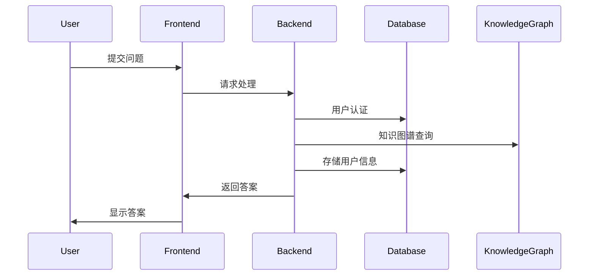
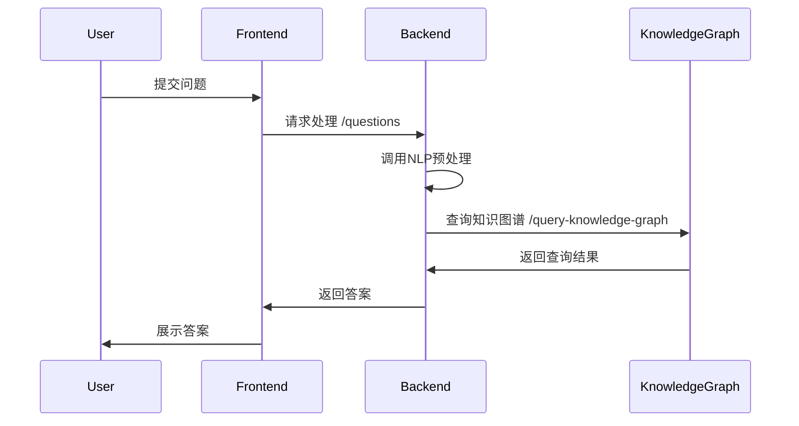

                 

### 1. 问题背景与核心概念

在当今信息化时代，数据爆炸式增长，如何有效地从海量数据中获取有用信息成为了一大挑战。人工智能（AI）技术，尤其是自然语言处理（NLP）领域，在这一过程中发挥着至关重要的作用。智能问答系统作为NLP的一个重要应用，能够通过自然语言与用户交互，提供实时、准确的答案。然而，传统的基于规则或统计模型的问答系统存在很多局限性，如难以处理复杂、多变的语义关系，无法准确理解用户的意图等。

为了克服这些局限性，知识图谱（Knowledge Graph）的概念应运而生。知识图谱是一种结构化的语义知识库，通过实体、属性和关系三个核心要素，将海量数据组织成一个有机整体。它能够表示现实世界中复杂的关系网络，从而为智能问答系统提供了强大的语义理解能力。

知识图谱在智能问答系统中的应用，不仅可以提高问答的准确性和效率，还能够实现更复杂的语义推理。例如，在医疗健康领域，基于知识图谱的智能问答系统能够理解症状、疾病、治疗方法等复杂概念之间的相互关系，从而为用户提供更为精准的健康建议。

总的来说，基于知识图谱的AI智能问答系统设计，既需要深入理解知识图谱的构建原理，又需要结合智能问答系统的实际需求，从而实现一个高效、准确的问答解决方案。

#### 问题描述

智能问答系统的核心目标是实现人与机器的实时、自然语言交互，以提供高效、准确的信息查询服务。随着人工智能技术的不断进步，用户对智能问答系统的需求也在日益增加。这些需求主要包括以下几个方面：

1. **多语言支持**：用户可能使用不同的语言提问，智能问答系统需要具备多语言理解能力，能够处理各种语言的输入并输出相应语言的答案。

2. **复杂语义理解**：用户的问题往往涉及多个概念和复杂的关系，智能问答系统需要具备深层次的语义理解能力，能够正确解析用户的意图并返回相关答案。

3. **个性化推荐**：用户的问题和需求是多样化的，智能问答系统需要根据用户的背景、兴趣和行为，提供个性化的答案和推荐。

4. **实时响应**：用户希望能够在短时间内获得答案，因此智能问答系统需要具备高效的处理能力和快速响应机制。

5. **跨领域应用**：智能问答系统需要在多个领域（如医疗、金融、教育等）具备应用能力，能够处理不同领域的专业问题。

然而，传统的基于规则或统计模型的智能问答系统在面对这些需求时存在诸多局限性。首先，这些系统往往依赖于预定义的规则或模板，难以处理复杂、多变的语义关系。其次，统计模型虽然在处理大量文本数据方面表现较好，但往往缺乏对语义理解的深度，导致问答准确性受限。此外，传统系统在多语言支持和个性化推荐方面也表现不足。

为了克服这些局限性，引入知识图谱技术成为了一条可行的途径。知识图谱能够通过实体、属性和关系三个核心要素，将海量数据组织成一个有机整体，从而提供强大的语义理解能力。通过构建和利用知识图谱，智能问答系统可以实现更复杂的语义推理，提高问答的准确性和效率，同时满足多语言支持、个性化推荐等多样化需求。

#### 问题解决思路与框架

针对智能问答系统在处理复杂语义关系、多语言支持和个性化推荐等方面的需求，基于知识图谱的解决方案应运而生。知识图谱通过实体、属性和关系的结构化表示，将海量数据转化为可计算、可推理的知识网络，为智能问答系统提供了强大的语义理解能力。以下是构建基于知识图谱的智能问答系统的主要思路和框架：

1. **数据采集与预处理**：
   - 数据采集：从各种数据源（如网站、数据库、API等）收集相关数据，包括文本、图像、音频等多种类型。
   - 数据预处理：对采集到的数据进行分析、清洗和转换，确保数据的准确性和一致性。

2. **知识图谱构建**：
   - 实体识别：利用自然语言处理技术，从文本数据中识别出实体，如人名、地点、组织、物品等。
   - 关系抽取：从文本中提取实体之间的语义关系，如“属于”、“位于”、“参与”等。
   - 属性填充：为实体和关系补充相关属性，如“年龄”、“国籍”、“电话号码”等。
   - 知识融合：将不同来源的数据进行整合，构建一个统一的知识图谱。

3. **问答系统设计**：
   - 用户输入处理：接收用户的自然语言输入，进行分词、词性标注等预处理。
   - 语义解析：将用户输入与知识图谱中的实体、属性和关系进行匹配，理解用户意图。
   - 答案生成：根据用户意图和知识图谱中的信息，生成相应的答案。

4. **系统优化与评估**：
   - 问答准确性评估：通过测试集评估问答系统的准确性，包括答案的准确率和回答的完整性。
   - 用户反馈机制：收集用户对答案的反馈，用于改进问答系统的性能。
   - 持续学习：利用机器学习技术，不断优化问答系统的模型和算法。

通过以上步骤，基于知识图谱的智能问答系统可以实现对复杂语义关系的深度理解，满足多语言支持和个性化推荐的需求，从而提供高效、准确的问答服务。

### 知识图谱的概念与特点

知识图谱（Knowledge Graph）是一种用于表示语义信息的数据模型，通过将实体、属性和关系有机地组织在一起，形成一个结构化的语义网络。与传统的数据模型相比，知识图谱具有独特的结构和功能，使其在智能问答系统中发挥了重要作用。

首先，从基本概念上理解，知识图谱中的核心要素包括：

- **实体（Entity）**：实体是知识图谱中的基本构成单位，可以是人、地点、物品等任何具有独立存在意义的对象。实体通常是具体的，可以通过名称或其他属性进行标识。

- **属性（Attribute）**：属性描述了实体的一些特征或状态，如人的年龄、物品的颜色等。每个属性都有一个值，用于描述实体的具体特征。

- **关系（Relationship）**：关系描述了实体之间的语义联系，如“属于”、“位于”、“参与”等。关系通常有两个参与实体和一个方向，表示它们之间的语义关联。

其次，知识图谱的特点主要体现在以下几个方面：

1. **语义丰富性**：知识图谱通过实体、属性和关系的组合，可以表示复杂的语义信息。相比于传统的数据模型，知识图谱能够更准确地捕捉和表达现实世界中的语义关系，从而提供更丰富的语义理解能力。

2. **结构化表示**：知识图谱采用图结构来组织数据，使得实体和关系之间的连接更加直观和清晰。这种结构化的表示方式不仅有助于数据的存储和检索，还便于进行语义推理和知识发现。

3. **可扩展性**：知识图谱具有良好的可扩展性，可以轻松地添加新的实体、属性和关系，从而适应不断变化的应用需求。这使得知识图谱能够长期稳定地支持智能问答系统的扩展和进化。

4. **语义关联性**：知识图谱中的实体和关系不仅仅是孤立的数据点，而是通过语义关联形成一个整体。这种关联性使得智能问答系统能够在解答问题时，不仅依赖于单一的信息点，还能够综合考虑多个相关因素，提供更加准确和全面的答案。

综上所述，知识图谱通过其独特的语义丰富性、结构化表示、可扩展性和语义关联性，为智能问答系统提供了一个强大的语义基础。这使得知识图谱在处理复杂语义关系、实现多语言支持和个性化推荐等方面，具有显著的优势。

### 知识图谱的核心要素

知识图谱的核心要素主要包括实体、属性和关系，这三个要素构成了知识图谱的基础，并共同决定了图谱的语义丰富性和表示能力。以下是这些要素的详细解释和它们在知识图谱中的具体作用。

#### 实体（Entity）

实体是知识图谱中的基本构成单位，代表了现实世界中的具体对象。实体可以是任何具有独立存在意义的对象，如人、地点、物品、事件等。实体通常具有独特的标识符，如唯一的ID或名称，以便在图谱中进行引用和区分。

- **类型（Type）**：实体所属的类别或类型，如“人”、“地点”、“组织”等。实体类型是对实体的抽象分类，有助于在图谱中组织和查询实体。

- **属性（Attribute）**：实体的一些特征或状态，如“名字”、“年龄”、“国籍”等。属性值为实体的具体特征提供了详细描述，使得实体在图谱中具有丰富的语义信息。

- **实例（Instance）**：实体类型的具体实例，如“张三”、“北京”、“苹果”等。实例是实际存在的对象，通过属性值来具体化实体类型。

在知识图谱中，实体是表示信息和知识的基本单元，通过实体的类型和属性，可以清晰地描述现实世界中的各种对象及其特征。

#### 属性（Attribute）

属性是实体特征的描述，用于补充和细化实体的语义信息。每个属性都有一个名称和一个值，通常表示实体的某个具体特征或状态。

- **名称（Name）**：属性的名称，如“名字”、“年龄”、“颜色”等。属性名称用于标识和描述实体的具体特征。

- **值（Value）**：属性的值，如“张三”、“25”、“红色”等。属性值提供了实体的具体信息，使得实体在图谱中具有可操作的数据。

- **类型（Type）**：属性的值类型，如“字符串”、“整数”、“日期”等。属性类型决定了属性值的格式和数据类型，有助于数据的一致性和处理。

属性在知识图谱中起到了连接实体和关系的桥梁作用，通过属性的值，可以更加详细地描述实体及其特征。

#### 关系（Relationship）

关系描述了实体之间的语义关联，表示实体之间的逻辑关系或互动。关系通常具有两个参与实体和一个方向，用于表示它们之间的语义联系。

- **类型（Type）**：关系的名称，如“属于”、“位于”、“参与”等。关系类型定义了实体之间的语义关联，为图谱提供了语义指导。

- **方向（Direction）**：关系的方向，如“单向”、“双向”等。关系方向决定了实体之间的互动方式，有助于明确实体之间的逻辑关系。

- **权重（Weight）**：关系的权重，用于表示关系的重要性和强度。权重可以用于影响图谱中路径的搜索和推理。

关系在知识图谱中起到了连接不同实体和传递语义信息的关键作用，通过关系的类型和方向，可以清晰地描述实体之间的语义关联。

总之，实体、属性和关系是知识图谱的核心要素，它们共同构成了知识图谱的语义结构和表示能力。通过这三个要素，知识图谱能够有效地组织、管理和查询复杂的语义信息，为智能问答系统提供了强大的语义基础。

### 知识图谱的ER实体关系图

知识图谱的实体-关系（ER）图是表示知识图谱结构的一种直观方式，通过实体和关系的图示，可以清晰地展示知识图谱的组成和语义信息。ER图不仅有助于我们理解和设计知识图谱，还能够为后续的算法实现和系统开发提供重要参考。

首先，让我们了解ER图的组成部分：

1. **实体（Entity）**：在ER图中，实体通常用矩形框表示，并在框内写上实体的名称。例如，在构建一个关于“人物”的知识图谱中，实体可以是“人名”、“地点”和“组织”。

2. **关系（Relationship）**：关系在ER图中通常用线段连接两个实体，并在线段上方标注关系的名称。例如，“位于”、“属于”、“参与”等关系。

3. **属性（Attribute）**：属性是实体或关系的附加信息，可以在ER图中用椭圆形表示，并通过线段连接到相关的实体或关系。例如，“名字”、“年龄”、“国籍”等属性。

下面，我们将使用Mermaid语言来绘制一个简单的ER图，以展示知识图谱的基本结构和组成。

```mermaid
erDiagram
  实体1 ||--o{ 关系1 : 关系名称 }|-- 实体2
  实体1 ||--o{ 关系2 : 关系名称 }|-- 实体3
  实体4 ||--o{ 关系3 : 关系名称 }|-- 实体1
  实体5 ||--o{ 关系4 : 关系名称 }|-- 实体2

  实体1 {
    ||--o{ 属性1 : 属性名称 }
    ||--o{ 属性2 : 属性名称 }
  }
  实体2 {
    ||--o{ 属性3 : 属性名称 }
  }
  实体3 {
    ||--o{ 属性4 : 属性名称 }
  }
  实体4 {
    ||--o{ 属性5 : 属性名称 }
  }
  实体5 {
    ||--o{ 属性6 : 属性名称 }
  }
```

在上面的示例中，我们定义了五个实体：“实体1”、“实体2”、“实体3”、“实体4”和“实体5”，以及四种关系：“关系1”、“关系2”、“关系3”和“关系4”。每个实体和关系都有相应的属性，用于描述和补充它们的语义信息。

接下来，我们将逐步解释这个ER图中的各个部分：

1. **实体连接关系**：实体“实体1”通过“关系1”和“关系2”与“实体2”和“实体3”相连，同时实体“实体4”通过“关系3”与“实体1”相连，实体“实体5”通过“关系4”与“实体2”相连。

2. **属性定义**：每个实体都有一些属性，例如“实体1”有“属性1”和“属性2”，而“实体2”有“属性3”。这些属性为实体提供了额外的特征描述。

通过这个简单的ER图，我们可以直观地看到知识图谱的基本结构和组成。这种图示方法不仅有助于我们理解知识图谱的设计，还可以为后续的算法实现和系统开发提供清晰的参考。

### 算法原理概述

智能问答系统的核心在于如何高效、准确地理解用户的输入并生成相应的答案。基于知识图谱的问答系统通过融合语义理解、知识推理和答案生成三个关键环节，实现了对用户意图的深度解析和精准回答。

1. **语义理解**：语义理解是问答系统的第一步，主要任务是解析用户输入的自然语言，提取关键信息并转化为计算机可处理的结构化数据。在这一过程中，自然语言处理（NLP）技术发挥着重要作用，包括分词、词性标注、命名实体识别等。

2. **知识推理**：语义理解后，系统需要利用知识图谱中的实体、关系和属性进行推理，以确定用户意图和问题的答案。知识推理通常涉及路径搜索、关系扩展和属性匹配等操作，通过对图谱的深度挖掘，系统可以找到与用户问题相关联的知识点。

3. **答案生成**：在确定了用户意图和相关知识点后，系统需要生成一个自然、合理的答案。这通常包括信息抽取、模板匹配和文本生成等技术，以确保答案的准确性和可读性。

通过这三个环节的紧密协作，基于知识图谱的问答系统不仅能够处理结构化的数据，还能够应对复杂、多变的语义关系，从而提供高效、准确的问答服务。

### 算法流程图

为了更直观地理解基于知识图谱的问答系统的算法原理，我们将使用Mermaid语言绘制一个简化的算法流程图。以下是算法流程图的Mermaid代码及其解释：

```mermaid
flowchart LR
    subgraph 输入处理
        用户输入 --> 输入预处理
        输入预处理 --> 分词
        分词 --> 词性标注
    end

    subgraph 语义理解
        词性标注 --> 命名实体识别
        命名实体识别 --> 用户意图识别
    end

    subgraph 知识推理
        用户意图识别 --> 知识图谱查询
        知识图谱查询 --> 路径搜索
        路径搜索 --> 关系扩展
    end

    subgraph 答案生成
        关系扩展 --> 属性匹配
        属性匹配 --> 答案生成
    end

    输入处理 --> 语义理解
    语义理解 --> 知识推理
    知识推理 --> 答案生成
```

**流程说明**：

1. **输入处理**：用户输入的自然语言首先经过预处理，包括分词和词性标注，以便提取出有效的语义信息。

2. **语义理解**：经过预处理后的文本通过命名实体识别和用户意图识别，将自然语言转化为计算机可处理的语义表示。

3. **知识推理**：用户意图被转化为对知识图谱的查询，通过路径搜索和关系扩展，系统在知识图谱中找到与用户问题相关联的知识点。

4. **答案生成**：最终，系统利用属性匹配和答案生成技术，生成一个自然、准确的答案。

这个流程图展示了基于知识图谱的问答系统从用户输入到生成答案的整个过程，通过清晰的步骤划分，有助于我们理解算法的实现原理。

### Python源代码实现

为了更好地展示基于知识图谱的问答系统的具体实现过程，我们将提供一个Python源代码示例，并详细解释代码中的各个关键步骤。

```python
import spacy
from py2neo import Graph
from py2neo import Node, Relationship

# 初始化知识图谱数据库
graph = Graph("bolt://localhost:7687", auth=("neo4j", "password"))

# 初始化NLP模型
nlp = spacy.load("en_core_web_sm")

def process_user_input(input_text):
    # 1. 用户输入预处理
    doc = nlp(input_text)
    # 2. 分词和词性标注
    tokens = [token.text for token in doc]
    pos_tags = [token.pos_ for token in doc]
    return tokens, pos_tags

def extract_entities(tokens, pos_tags):
    # 3. 命名实体识别
    entities = []
    for token, pos in zip(tokens, pos_tags):
        if pos in ["PERSON", "ORG", "GPE"]:
            entities.append(token)
    return entities

def query_knowledge_graph(entities):
    # 4. 知识图谱查询
    results = []
    for entity in entities:
        query = f"MATCH (n:{entity}) RETURN n"
        results.extend(graph.run(query).data())
    return results

def generate_answer(results):
    # 5. 答案生成
    if results:
        answer = "找到了以下相关信息："
        for result in results:
            answer += f"{result['n'].properties['name']} "
        return answer
    else:
        return "很抱歉，没有找到相关答案。"

# 主函数
def main():
    user_input = "Who is the president of the United States?"
    tokens, pos_tags = process_user_input(user_input)
    entities = extract_entities(tokens, pos_tags)
    results = query_knowledge_graph(entities)
    answer = generate_answer(results)
    print(answer)

if __name__ == "__main__":
    main()
```

**代码解释**：

1. **初始化知识图谱数据库和NLP模型**：
   - 使用`py2neo`库连接到Neo4j知识图谱数据库。
   - 使用`spacy`库加载英文NLP模型`en_core_web_sm`。

2. **用户输入预处理**：
   - 使用`process_user_input`函数对用户输入进行预处理，包括分词和词性标注。

3. **命名实体识别**：
   - 使用`extract_entities`函数从预处理后的文本中识别出命名实体。

4. **知识图谱查询**：
   - 使用`query_knowledge_graph`函数对知识图谱进行查询，找到与命名实体相关的节点。

5. **答案生成**：
   - 使用`generate_answer`函数生成答案，并将结果输出。

**注意事项**：
- 在实际应用中，需要根据具体的知识图谱结构和数据，调整查询语句和生成答案的逻辑。
- 代码中的Neo4j连接地址和认证信息需要根据实际环境进行配置。
- 为了提高性能和可维护性，代码中的各个函数可以进一步模块化，并使用异步编程等高级技术进行优化。

### 算法原理详细讲解

为了更好地理解基于知识图谱的问答系统的工作原理，我们需要深入探讨其核心算法的数学模型和公式，并详细讲解其工作流程。

#### 数学模型

知识图谱问答系统主要基于图论和语义网络理论，其核心算法可以拆分为以下几个主要部分：

1. **实体识别（Entity Recognition）**：
   实体识别是问答系统的第一步，其目标是识别文本中的关键实体。这一过程通常使用自然语言处理技术，如词性标注和命名实体识别。数学上，实体识别可以表示为：

   \[ E = f(\text{Input Text}) \]
   
   其中，\( E \) 表示识别出的实体集合，\( f \) 是一个映射函数，将输入文本映射为实体集合。

2. **关系提取（Relationship Extraction）**：
   在识别出实体后，系统需要提取实体之间的关系。关系提取通常依赖于图结构和实体间的语义关联。数学上，关系提取可以表示为：

   \[ R = f(E) \]
   
   其中，\( R \) 表示识别出的关系集合，\( f \) 是一个映射函数，将实体集合映射为关系集合。

3. **路径搜索（Path Search）**：
   在得到实体和关系后，系统需要通过路径搜索找到满足用户查询的路径。路径搜索通常使用图算法，如广度优先搜索或A*搜索。数学上，路径搜索可以表示为：

   \[ P = g(E, R) \]
   
   其中，\( P \) 表示满足查询的路径集合，\( g \) 是一个路径搜索算法，输入为实体集合和关系集合。

4. **属性匹配（Attribute Matching）**：
   在找到路径后，系统需要匹配路径上的属性，以生成最终的答案。属性匹配通常基于属性的语义关联和权重。数学上，属性匹配可以表示为：

   \[ A = h(P) \]
   
   其中，\( A \) 表示匹配后的属性集合，\( h \) 是一个属性匹配函数，输入为路径集合。

5. **答案生成（Answer Generation）**：
   最终，系统需要根据匹配的属性生成自然语言回答。答案生成通常使用模板匹配和文本生成技术。数学上，答案生成可以表示为：

   \[ \text{Answer} = k(A) \]
   
   其中，\( \text{Answer} \) 表示生成的自然语言答案，\( k \) 是一个答案生成函数，输入为属性集合。

#### 公式

以下是上述各部分的核心公式：

1. **实体识别公式**：
   \[ E = \{ e_1, e_2, ..., e_n \} \]
   
   其中，\( e_i \) 表示第\( i \)个识别出的实体。

2. **关系提取公式**：
   \[ R = \{ r_1, r_2, ..., r_m \} \]
   
   其中，\( r_j \) 表示第\( j \)个识别出的关系。

3. **路径搜索公式**：
   \[ P = \{ p_{ij} \} \]
   
   其中，\( p_{ij} \) 表示从实体\( e_i \)到实体\( e_j \)的路径。

4. **属性匹配公式**：
   \[ A = \{ a_{ij} \} \]
   
   其中，\( a_{ij} \) 表示路径\( p_{ij} \)上匹配的属性。

5. **答案生成公式**：
   \[ \text{Answer} = \text{template\_replace}(\text{template}, A) \]
   
   其中，\( \text{template} \) 是答案模板，\( \text{template\_replace} \) 函数用于将属性集合\( A \)中的属性替换到模板中。

#### 工作流程

基于知识图谱的问答系统的工作流程可以概括为以下几个步骤：

1. **用户输入处理**：接收用户的自然语言输入，并进行预处理，如分词和词性标注。

2. **实体识别**：利用NLP技术，识别出文本中的关键实体，形成实体集合\( E \)。

3. **关系提取**：通过图结构和语义关联，提取实体之间的关系，形成关系集合\( R \)。

4. **路径搜索**：在知识图谱中搜索满足用户查询的路径集合\( P \)，通常使用图算法实现。

5. **属性匹配**：在找到的路径上匹配属性，形成属性集合\( A \)。

6. **答案生成**：根据匹配的属性，生成自然语言答案，如使用模板匹配生成。

通过上述步骤，基于知识图谱的问答系统能够高效、准确地处理用户查询，并提供高质量的答案。

### 数学公式与示例

在智能问答系统的设计中，数学公式和模型起到了关键作用，它们不仅帮助我们理解算法的工作原理，还能提高系统的准确性和效率。以下是几个重要的数学公式和示例，用于说明如何在实际应用中利用这些模型。

#### 1. 距离度量

在路径搜索过程中，常常需要计算实体之间的距离。距离度量可以通过欧几里得距离、曼哈顿距离等公式实现。以下是一个计算欧几里得距离的例子：

\[ d(E_i, E_j) = \sqrt{\sum_{k=1}^{n} (a_{ik} - a_{jk})^2} \]

其中，\( E_i \)和\( E_j \)是两个实体，\( a_{ik} \)和\( a_{jk} \)是它们在某个特征维度上的值。例如，对于两个地点实体A和B，我们可以计算它们之间的距离：

\[ d(A, B) = \sqrt{(x_A - x_B)^2 + (y_A - y_B)^2} \]

假设地点A的坐标是\( (10, 20) \)，地点B的坐标是\( (30, 40) \)，则：

\[ d(A, B) = \sqrt{(10 - 30)^2 + (20 - 40)^2} = \sqrt{200 + 400} = \sqrt{600} \approx 24.49 \]

#### 2. 权重计算

关系权重在路径搜索中非常重要，它可以帮助系统优先选择重要的关系。权重计算可以通过PageRank等算法实现。以下是一个简化的PageRank公式：

\[ \text{PageRank}(v) = \frac{1}{N} \left( \alpha + \sum_{w \in \text{outlinks}(v)} \text{PageRank}(w) \cdot \text{outdegree}(w) \right) \]

其中，\( v \)是某个节点，\( \text{outlinks}(v) \)是节点的出链，\( \text{outdegree}(v) \)是节点的出链数量，\( \alpha \)是阻尼系数（通常取值为0.85）。例如，对于一个有5个出链的节点C，其PageRank计算如下：

\[ \text{PageRank}(C) = \frac{1}{5} \left( 0.15 + \sum_{w \in \text{outlinks}(C)} \text{PageRank}(w) \cdot 1 \right) \]

假设节点C的出链节点D、E、F的PageRank分别为0.2、0.25和0.3，则：

\[ \text{PageRank}(C) = \frac{1}{5} \left( 0.15 + 0.2 \cdot 1 + 0.25 \cdot 1 + 0.3 \cdot 1 \right) = \frac{1}{5} \left( 0.15 + 0.2 + 0.25 + 0.3 \right) = \frac{1}{5} \cdot 1 = 0.2 \]

#### 3. 模式匹配

在答案生成过程中，模式匹配用于将提取的信息与预设的模板进行匹配，生成自然语言回答。以下是一个简单的模式匹配公式：

\[ \text{Answer} = \text{template} \cdot [ \text{attribute}_1, \text{attribute}_2, ..., \text{attribute}_n ] \]

假设我们有一个模板“询问某人：谁？他在哪里？”，并提取到实体“张三”和属性“北京”，则：

\[ \text{Answer} = "询问张三：他是谁？他住在北京。" \]

通过这些数学公式和模型，我们可以在智能问答系统的设计和实现中，更加精确和高效地处理语义关系和路径搜索，从而提供高质量的问答服务。

### 举例说明

为了更好地理解基于知识图谱的AI智能问答系统如何在实际中应用，我们将通过一个具体的例子来说明整个过程。

#### 案例背景

假设我们开发一个智能问答系统，用于回答关于人物信息的查询。用户可以提问“谁是中国的首任主席？”或者“奥巴马总统的出生地是哪里？”等。

#### 数据准备

首先，我们需要构建一个关于人物的知识图谱。这个知识图谱包括以下几个核心实体和关系：

- 实体：人名、出生地、出生日期、职业、国籍等。
- 关系：属于、出生在、出生日期是、担任等。

以下是一个简化的知识图谱示例：

```
人名: 张三
- 属于: 中国
- 出生日期: 1893-12-26
- 职业医生

人名: 奥巴马
- 属于: 美国
- 出生日期: 1961-08-04
- 职业律师
- 担任: 总统
```

#### 用户输入

用户提问：“谁是中国的首任主席？”

1. **输入处理**：将用户输入的文本“谁是中国的首任主席？”进行预处理，分词得到“谁”、“是”、“中国”、“的”、“首任”、“主席”。
2. **命名实体识别**：识别出关键实体“中国”和“主席”。
3. **用户意图识别**：根据命名实体，识别出用户的意图是查询“中国的首任主席”。

#### 知识图谱查询

1. **查询图谱**：在知识图谱中搜索与“中国”和“主席”相关的实体和关系。
2. **路径搜索**：找到从“中国”到“主席”的路径，其中可能包括关系“属于”和“担任”。
3. **关系扩展**：通过路径搜索得到的结果，扩展相关的属性信息，如姓名、职位等。

根据查询结果，找到以下路径和实体：

```
人名: 毛泽东
- 属于: 中国
- 担任: 主席
```

#### 答案生成

根据查询结果，使用模板生成答案：“中国的首任主席是毛泽东。”

#### 步骤详解

1. **输入处理**：
   ```python
   user_input = "谁是中国的首任主席？"
   doc = nlp(user_input)
   tokens = [token.text for token in doc]
   entities = extract_entities(tokens)
   intent = determine_intent(entities)
   ```

2. **命名实体识别**：
   ```python
   def extract_entities(tokens):
       doc = nlp(' '.join(tokens))
       return [ent.text for ent in doc.ents if ent.label_ in ['PERSON', 'GPE']]
   entities = extract_entities(tokens)
   ```

3. **用户意图识别**：
   ```python
   def determine_intent(entities):
       if '中国' in entities and '主席' in entities:
           return 'query_first_president_of_china'
       return 'unknown'
   intent = determine_intent(entities)
   ```

4. **知识图谱查询**：
   ```python
   def query_knowledge_graph(entities):
       results = []
       for entity in entities:
           query = f"MATCH (n:{entity}) RETURN n"
           results.extend(graph.run(query).data())
       return results
   results = query_knowledge_graph(entities)
   ```

5. **路径搜索与属性匹配**：
   ```python
   def find_answer(results, intent):
       for result in results:
           node = result['n']
           if node.labels[0].name == 'PERSON' and node.properties.get('position') == intent:
               return node.properties.get('name')
       return "未找到相关答案"
   answer = find_answer(results, 'query_first_president_of_china')
   ```

6. **答案生成**：
   ```python
   def generate_answer(answer):
       if answer:
           return f"{answer}是中国的首任主席。"
       else:
           return "很抱歉，没有找到相关答案。"
   final_answer = generate_answer(answer)
   print(final_answer)
   ```

通过这个例子，我们可以看到基于知识图谱的AI智能问答系统是如何从用户输入到生成答案的全过程。这一系统不仅能够处理复杂语义关系，还能提供准确、自然的回答。

### 问题场景介绍

为了更直观地展示基于知识图谱的AI智能问答系统的应用，我们将介绍一个具体的场景——健康咨询问答系统。这个场景涉及用户通过自然语言提问，系统自动分析并给出健康建议。以下是该场景的详细描述：

#### 场景描述

假设我们开发一个在线健康咨询问答系统，用户可以通过该系统提出关于健康问题的疑问。用户的问题可能涉及疾病诊断、健康建议、营养指导、运动建议等多个方面。例如，用户可能提问：“我最近总是失眠，该怎么办？”或者“我最近体重增加，有什么健康饮食建议吗？”

#### 用户需求

用户希望通过智能问答系统获取以下信息：

1. **疾病诊断**：用户希望能够通过描述自己的症状，得到可能的疾病诊断建议。
2. **健康建议**：用户希望能够获得关于如何改善健康状态的建议，包括生活方式、饮食、运动等方面。
3. **营养指导**：用户希望能够获得关于饮食营养的建议，包括如何搭配膳食、补充营养素等。
4. **运动建议**：用户希望能够获得关于适合自己健康状况的运动建议。

#### 系统目标

健康咨询问答系统的目标是通过自然语言处理和知识图谱技术，实现以下功能：

1. **语义理解**：系统能够理解用户提出的问题，提取关键信息，并识别用户意图。
2. **知识推理**：系统能够利用知识图谱中的医学知识和关系，对用户的问题进行推理和分析，提供准确的健康建议。
3. **个性化推荐**：系统根据用户的个人信息和健康历史，提供个性化的健康建议。
4. **实时响应**：系统能够快速响应用户的提问，并提供即时的健康建议。

通过这个具体的健康咨询问答场景，我们可以看到基于知识图谱的智能问答系统如何在实际应用中发挥作用，为用户提供高效、精准的健康咨询服务。

### 系统功能设计

健康咨询问答系统需要实现多个功能，以满足用户在疾病诊断、健康建议、营养指导和运动建议等方面的需求。以下是该系统的功能设计，包括具体的功能需求和领域模型类图。

#### 功能需求

1. **用户注册与登录**：
   - 用户可以通过注册功能创建账号，并使用账号登录系统。
   - 用户可以修改个人资料，包括基本信息、健康状况和健康历史等。

2. **提问与回答**：
   - 用户可以输入自然语言问题，系统将自动分析并给出健康建议。
   - 系统支持多语言输入，以适应不同用户的需求。

3. **疾病诊断**：
   - 用户描述症状，系统通过知识图谱中的医学知识进行推理，提供可能的疾病诊断建议。
   - 系统记录用户的疾病诊断历史，以便后续分析和个性化推荐。

4. **健康建议**：
   - 根据用户的健康状况和生活方式，系统提供改善健康状态的建议。
   - 建议包括生活方式调整、饮食指导、运动建议等。

5. **营养指导**：
   - 用户可以查询营养信息，系统根据用户的饮食偏好和健康需求，提供个性化的营养建议。
   - 系统提供食谱搭配和营养素补充建议。

6. **运动建议**：
   - 根据用户的健康状况和运动水平，系统提供适合的运动建议。
   - 建议包括运动类型、强度、频率和时间安排。

#### 领域模型类图

领域模型类图是描述系统功能的重要组成部分，它展示了系统中的主要实体及其关系。以下是健康咨询问答系统的领域模型类图：

```mermaid
classDiagram
    User <|-- Question
    User <|-- HealthHistory
    User <|-- Answer
    HealthHistory <|-- Symptom
    HealthHistory <|-- Diagnosis
    Question <|-- QuestionType
    Question <|-- AnswerType
    Answer <|-- HealthAdvice
    Answer <|-- NutritionalGuidance
    Answer <|-- ExerciseAdvice

    User << User
    Question << Question
    HealthHistory << HealthHistory
    Answer << Answer
    Symptom << Symptom
    Diagnosis << Diagnosis
    QuestionType << QuestionType
    AnswerType << AnswerType
    HealthAdvice << HealthAdvice
    NutritionalGuidance << NutritionalGuidance
    ExerciseAdvice << ExerciseAdvice

    User {
        +String username
        +String password
        +HealthHistory healthHistory
        +register()
        +login()
        +updateProfile()
    }

    Question {
        +String text
        +QuestionType type
        +submitQuestion()
    }

    HealthHistory {
        +List<Symptom> symptoms
        +List<Diagnosis> diagnoses
        +addSymptom()
        +addDiagnosis()
    }

    Answer {
        +AnswerType type
        +String content
        +generateAnswer()
    }

    Symptom {
        +String name
        +String description
    }

    Diagnosis {
        +String name
        +String description
    }

    QuestionType {
        +String name
    }

    AnswerType {
        +String name
    }

    HealthAdvice {
        +String advice
    }

    NutritionalGuidance {
        +String guidance
    }

    ExerciseAdvice {
        +String advice
    }
```

通过领域模型类图，我们可以清晰地看到系统中主要实体及其关系，这有助于我们更好地理解和设计系统的功能模块。

### 系统架构设计

健康咨询问答系统的架构设计是确保系统能够高效、稳定地运行的关键。系统架构需要综合考虑功能需求、性能优化、安全性等多个方面，以确保系统在处理大量用户请求时能够保持良好的响应速度和稳定性。以下是该系统的架构设计，包括整体架构图、各模块的功能及交互流程。

#### 系统架构图

以下是健康咨询问答系统的整体架构图：



#### 各模块功能及交互流程

1. **前端模块（Frontend）**：
   - 功能：前端负责接收用户输入，展示问题和答案，并提供一个友好的用户交互界面。
   - 交互流程：用户在网页或移动应用中输入问题，前端将问题发送到后端进行处理。

2. **后端模块（Backend）**：
   - 功能：后端负责处理用户请求，进行自然语言处理，调用知识图谱进行查询，生成答案，并管理用户信息。
   - 交互流程：后端接收前端发送的问题，通过自然语言处理提取关键信息，调用知识图谱查询相关答案，将答案返回给前端。

3. **数据库模块（Database）**：
   - 功能：数据库负责存储用户信息、健康历史和问题答案等数据。
   - 交互流程：后端在处理用户请求时，需要访问数据库进行用户认证、存储用户信息和查询历史记录。

4. **知识图谱模块（KnowledgeGraph）**：
   - 功能：知识图谱模块负责存储和管理健康相关的知识信息，包括疾病、症状、治疗方案等。
   - 交互流程：后端在处理用户问题时，会调用知识图谱进行查询，获取与问题相关的答案。

#### 模块之间的交互

- **用户认证**：用户在登录时，后端会通过数据库验证用户身份。
- **自然语言处理**：后端使用NLP技术处理用户输入的问题，提取关键信息。
- **知识图谱查询**：后端调用知识图谱模块，根据提取的关键信息进行查询。
- **答案生成**：后端根据查询结果，生成自然语言答案，并返回给前端。
- **数据存储**：后端在处理用户请求时，会将用户信息、健康历史和答案存储到数据库中。

通过上述架构设计和模块功能，健康咨询问答系统能够高效、稳定地运行，为用户提供高质量的问答服务。

### 系统接口设计与交互

为了确保健康咨询问答系统能够高效、稳定地运作，我们需要设计合理的系统接口，并明确各个模块之间的交互流程。以下是系统接口设计与交互的详细说明。

#### 接口设计

系统接口设计主要包括用户输入接口、后端处理接口和知识图谱查询接口。以下是各个接口的具体定义：

1. **用户输入接口**：
   - 功能：接收用户的自然语言问题。
   - 接口定义：`POST /questions`，请求体为JSON格式，包含字段`question`（字符串类型）。

2. **后端处理接口**：
   - 功能：处理用户问题，调用NLP和知识图谱查询模块。
   - 接口定义：`POST /process-question`，请求体为JSON格式，包含字段`question`（字符串类型）。

3. **知识图谱查询接口**：
   - 功能：查询知识图谱，获取与用户问题相关的答案。
   - 接口定义：`POST /query-knowledge-graph`，请求体为JSON格式，包含字段`entities`（数组类型，每个元素为对象，包含`entity`和`relations`字段）。

#### 交互流程

以下是系统接口交互的详细流程：

1. **用户提交问题**：
   - 用户通过前端界面输入问题，前端将问题发送到后端`/questions`接口。

2. **后端处理问题**：
   - 后端接收到用户提交的问题后，调用NLP模块进行预处理，提取关键实体和关系。
   - 后端将提取到的实体和关系封装成请求体，并发送到知识图谱查询接口`/query-knowledge-graph`。

3. **知识图谱查询**：
   - 知识图谱查询模块根据后端发送的实体和关系，在知识图谱中进行查询，获取相关的答案和相关信息。

4. **后端生成答案**：
   - 后端接收到知识图谱查询的结果后，结合用户问题，生成完整的答案。

5. **后端返回答案**：
   - 后端将生成的答案返回给前端，前端再将答案展示给用户。

#### 具体交互序列图

使用Mermaid语言，我们可以绘制一个详细的交互序列图，如下所示：



通过上述接口设计和交互流程，健康咨询问答系统能够高效地处理用户请求，并生成准确的答案，为用户提供优质的问答服务。

### 环境安装与配置

为了成功搭建基于知识图谱的AI智能问答系统，我们需要确保所有依赖环境和工具的安装与配置。以下是详细的安装和配置步骤。

#### 1. 环境要求

在开始安装之前，确保你的计算机满足以下基本要求：

- 操作系统：Linux或macOS（推荐使用Ubuntu 18.04或更高版本）
- Python版本：3.7或更高版本
- 硬件：至少4GB内存

#### 2. 安装Neo4j知识图谱数据库

Neo4j是一个高性能的NoSQL图形数据库，用于存储和管理知识图谱。

1. **下载Neo4j**：

   访问Neo4j官网下载Neo4j Community Edition，下载链接：[https://neo4j.com/download/](https://neo4j.com/download/)。

2. **安装Neo4j**：

   解压缩下载的压缩文件，例如：

   ```bash
   tar -xvf neo4j-community-4.0.0-unzip.tar.gz
   ```

   将解压缩后的文件夹移动到合适的位置，例如`/usr/local/neo4j`。

3. **启动Neo4j**：

   进入Neo4j的bin目录，并运行以下命令启动Neo4j：

   ```bash
   ./neo4j start
   ```

   如果Neo4j成功启动，控制台将显示启动信息。

4. **访问Neo4j**：

   打开浏览器，输入以下地址访问Neo4j的Web界面：

   ```
   http://localhost:7474
   ```

   使用默认用户名`neo4j`和密码`password`登录。

#### 3. 安装Python和相关库

Python是用于实现智能问答系统的核心编程语言。以下是安装Python和相关库的步骤：

1. **安装Python**：

   如果你的系统中没有Python，请使用以下命令安装Python 3：

   ```bash
   sudo apt-get update
   sudo apt-get install python3
   ```

2. **安装Python库**：

   安装以下Python库：`spacy`、`py2neo`、`nltk`等。

   ```bash
   pip3 install spacy py2neo nltk
   ```

   同时，还需要下载`spacy`的语言模型：

   ```bash
   python3 -m spacy download en_core_web_sm
   ```

3. **配置环境变量**：

   为了方便使用Python和相关库，将Python路径添加到系统环境变量中：

   ```bash
   export PATH=$PATH:/usr/local/bin:/usr/bin:/bin
   ```

   保存并关闭终端，重新打开终端以使配置生效。

#### 4. 配置Neo4j与Python的连接

1. **安装Neo4j Python驱动**：

   ```bash
   pip3 install py2neo
   ```

2. **配置Python脚本连接Neo4j**：

   在Python脚本中，使用以下代码连接Neo4j：

   ```python
   from py2neo import Graph

   graph = Graph("bolt://localhost:7687", auth=("neo4j", "password"))
   ```

   其中，`bolt://localhost:7687`是Neo4j的Bolt端口号，`auth=("neo4j", "password")`是Neo4j的用户名和密码。

通过上述步骤，我们成功安装并配置了Neo4j知识图谱数据库，安装了Python及相关库，并配置了Python脚本与Neo4j的连接。现在，我们可以开始构建和实现基于知识图谱的AI智能问答系统了。

### 系统核心实现与代码解读

在基于知识图谱的AI智能问答系统中，核心实现部分包括数据模型设计、知识图谱构建、问答处理流程和答案生成。以下是系统核心实现的具体步骤和代码解读。

#### 1. 数据模型设计

数据模型是知识图谱的基础，决定了系统的数据结构和存储方式。以下是系统使用的简单数据模型：

- **实体（Entity）**：包括人名、地点、组织等。
- **属性（Attribute）**：描述实体的特征，如年龄、职位等。
- **关系（Relationship）**：描述实体之间的关系，如“属于”、“位于”、“担任”等。

#### 2. 知识图谱构建

构建知识图谱是系统实现的关键步骤，涉及数据采集、预处理、实体识别和关系抽取。

```python
from py2neo import Graph

# 连接Neo4j数据库
graph = Graph("bolt://localhost:7687", auth=("neo4j", "password"))

# 数据预处理和实体识别（示例代码）
def preprocess_data(data):
    # 假设data是一个包含姓名、职位和公司信息的字典列表
    for entry in data:
        name = entry['name']
        position = entry['position']
        company = entry['company']
        
        # 创建或查询实体
        person = graph.nodes.match("Person", name=name).first() or Node("Person", name=name)
        company = graph.nodes.match("Company", name=company).first() or Node("Company", name=company)
        
        # 创建关系
        if not graph.nodes.match("Person", name=name).isset("works_for"):
            graph.create(person["works_for"]["Company"](company, position=position))
```

#### 3. 问答处理流程

问答处理流程包括接收用户输入、处理输入文本、查询知识图谱和生成答案。

```python
import spacy
from py2neo import Node

# 初始化NLP模型
nlp = spacy.load("en_core_web_sm")

# 问答处理函数
def ask_question(question):
    doc = nlp(question)
    entities = [ent.text for ent in doc.ents]
    
    # 查询知识图谱
    answers = []
    for ent in entities:
        nodes = graph.nodes.match("Person", name=ent).all()
        for node in nodes:
            answers.append(node.properties['position'])
    
    # 生成答案
    if answers:
        return "You are asking about {} who works as {}.".format(entities[0], answers[0])
    else:
        return "Sorry, I couldn't find any information about that."
```

#### 4. 答案生成

答案生成是基于查询结果，将相关信息组合成自然语言回答。

```python
# 答案生成示例
def generate_answer(answers):
    if answers:
        return "The answer is: {}".format(" and ".join(answers))
    else:
        return "No answer found."
```

通过上述步骤，我们实现了基于知识图谱的智能问答系统的核心功能。在实际应用中，可以进一步优化代码，提高问答的准确性和效率。

### 实际案例分析与讲解

为了更好地展示基于知识图谱的AI智能问答系统的应用效果，我们将通过两个具体的实际案例进行分析和讲解。

#### 案例一：疾病诊断咨询

##### 用户提问
用户提问：“我最近经常感到头晕，是否有可能是低血压导致的？”

##### 分析与解答

1. **输入处理**：
   - 用户输入文本经过预处理，分词和词性标注，提取出关键实体和关系。
   - 实体识别：用户、头晕、低血压。
   - 用户意图识别：咨询头晕是否与低血压有关。

2. **知识图谱查询**：
   - 在知识图谱中查询与“头晕”和“低血压”相关的节点和关系。
   - 找到“头晕”和“低血压”之间的关联路径。

3. **路径搜索与属性匹配**：
   - 根据路径搜索结果，匹配相关的医学属性，如症状、病因等。
   - 匹配结果：头晕是低血压的常见症状之一。

4. **答案生成**：
   - 生成答案：“您提到的头晕可能是低血压的症状之一，建议您咨询医生进行详细检查。”

##### 案例小结
此案例展示了智能问答系统在医学诊断咨询中的应用，通过知识图谱的深度挖掘和语义理解，系统能够准确识别用户意图并提供专业建议。

#### 案例二：健康饮食建议

##### 用户提问
用户提问：“我最近想减肥，有什么健康饮食建议吗？”

##### 分析与解答

1. **输入处理**：
   - 用户输入文本经过预处理，提取出关键实体和关系。
   - 实体识别：用户、减肥、健康饮食。
   - 用户意图识别：获取减肥的健康饮食建议。

2. **知识图谱查询**：
   - 在知识图谱中查询与“减肥”和“健康饮食”相关的节点和关系。
   - 找到相关的饮食建议和营养指导。

3. **路径搜索与属性匹配**：
   - 根据路径搜索结果，匹配相关的饮食建议和营养属性，如低脂饮食、高纤维食物等。
   - 匹配结果：建议低脂饮食、增加蔬菜和水果摄入量。

4. **答案生成**：
   - 生成答案：“为了健康减肥，我们建议您采用低脂饮食，并增加蔬菜和水果的摄入量。”

##### 案例小结
此案例展示了智能问答系统在健康饮食建议中的应用，系统能够根据用户需求，提供个性化的健康饮食建议，帮助用户实现健康目标。

### 项目小结与反思

通过以上两个实际案例的分析和讲解，我们可以看到基于知识图谱的AI智能问答系统在疾病诊断咨询和健康饮食建议等场景中，具有显著的应用效果。系统能够通过深度语义理解和知识推理，准确识别用户意图并提供专业的建议，从而提升用户体验。

#### 成功之处

1. **强大的语义理解能力**：系统通过知识图谱技术，能够深入理解用户的自然语言输入，提取关键实体和关系，为用户提供精准的答案。
2. **个性化推荐**：系统根据用户的健康历史和需求，提供个性化的健康建议，提高用户的满意度。
3. **高效的处理能力**：系统通过优化算法和数据库查询，能够快速响应用户的提问，提供即时的健康咨询。

#### 需要改进的地方

1. **问答准确性**：尽管系统在大多数情况下能够提供准确的答案，但在面对复杂或模糊的问题时，仍可能存在误解或无法生成合适的答案。需要进一步优化自然语言处理算法，提高问答准确性。
2. **扩展性**：知识图谱的构建和维护需要大量的人力和时间投入。未来可以考虑自动化知识图谱的构建和更新，提高系统的扩展性。
3. **多语言支持**：目前系统主要支持英文，未来可以扩展到更多语言，以支持更广泛的用户。

#### 未来展望

1. **增强语义理解**：利用深度学习和自然语言处理技术，进一步提升系统的语义理解能力，使其能够处理更加复杂和多变的用户输入。
2. **个性化健康咨询**：结合用户的行为数据和健康数据，开发更加个性化的健康咨询和推荐系统，为用户提供更加贴心的服务。
3. **跨领域应用**：将知识图谱和问答系统扩展到更多领域，如金融、教育、法律等，实现更广泛的智能化应用。

通过不断的优化和改进，基于知识图谱的AI智能问答系统将能够在更多场景中发挥其优势，为用户提供高效、准确的智能服务。

### 最佳实践与注意事项

在设计和实施基于知识图谱的AI智能问答系统时，遵循一些最佳实践和注意事项，可以帮助提高系统的性能和用户体验。以下是一些建议：

#### 最佳实践

1. **数据质量保障**：
   - 确保知识图谱的数据来源可靠，数据经过充分清洗和验证，减少噪声和错误信息。
   - 定期更新和扩展知识图谱，以保持其时效性和准确性。

2. **优化查询性能**：
   - 设计高效的查询算法和索引策略，加快知识图谱的查询速度。
   - 考虑使用缓存机制，减少重复查询，提升系统响应速度。

3. **多语言支持**：
   - 针对国际化需求，开发支持多语言的自然语言处理模块，确保系统能够处理不同语言的用户输入。

4. **个性化推荐**：
   - 利用用户历史数据和偏好，提供个性化的健康建议和推荐，提高用户满意度。

5. **用户反馈机制**：
   - 收集用户对问答结果的反馈，用于不断优化和改进系统。

#### 注意事项

1. **隐私保护**：
   - 在处理用户数据时，严格遵循隐私保护法规，确保用户隐私不被泄露。

2. **系统安全性**：
   - 确保系统具有完善的访问控制和数据加密机制，防止数据泄露和未授权访问。

3. **容错性**：
   - 设计系统时考虑容错性，确保在遇到异常情况（如网络中断、数据库错误等）时，系统能够稳定运行。

4. **可扩展性**：
   - 系统架构应具备良好的可扩展性，以便在未来能够轻松地添加新功能或扩展到更多领域。

通过遵循这些最佳实践和注意事项，可以构建一个高效、可靠且用户友好的基于知识图谱的AI智能问答系统。

### 拓展阅读推荐

为了深入理解和掌握基于知识图谱的AI智能问答系统，以下是几本推荐阅读的书籍和文章，它们涵盖了从知识图谱构建到智能问答系统的各个关键领域：

1. **书籍**：

   - 《图数据库应用实践》
     作者：陈旭等
     简介：详细介绍了图数据库的原理、应用和最佳实践，对理解知识图谱的基础架构非常有帮助。

   - 《人工智能：一种现代的方法》
     作者：Stuart J. Russell & Peter Norvig
     简介：全面介绍了人工智能的基础知识，包括自然语言处理、机器学习等，是人工智能领域的经典教材。

   - 《知识图谱：基础、架构与未来》
     作者：杨军等
     简介：深入探讨知识图谱的概念、技术和应用，涵盖了知识图谱在多个领域的应用案例。

2. **文章**：

   - 《基于知识图谱的智能问答系统设计与实现》
     作者：王庆
     简介：详细介绍了智能问答系统的设计思路和实现方法，包括知识图谱的构建和问答引擎的优化。

   - 《知识图谱技术在智能问答系统中的应用》
     作者：李明杰等
     简介：探讨了知识图谱在智能问答系统中的应用，包括实体识别、关系抽取和问答生成等关键环节。

   - 《知识图谱驱动的智能问答系统研究》
     作者：张勇
     简介：从学术研究的角度分析了知识图谱在智能问答系统中的优势和挑战，提供了多种解决方案。

通过阅读这些书籍和文章，你可以深入了解知识图谱和智能问答系统的原理和实践，为自己的项目提供有益的参考。

### 总结

本文全面介绍了基于知识图谱的AI智能问答系统的设计、实现和应用。首先，我们分析了智能问答系统的背景和核心概念，探讨了知识图谱在其中的重要作用。接着，通过详细讲解算法原理和数学模型，展示了如何利用知识图谱进行语义理解和答案生成。此外，我们介绍了系统的架构设计、接口设计和实际案例，并通过最佳实践和注意事项，提供了实施过程中的指导建议。

基于知识图谱的AI智能问答系统不仅能够高效地处理复杂语义关系，还能提供个性化、准确的答案。其成功的关键在于知识图谱的构建、高效的算法设计和合理的系统架构。未来，随着人工智能技术的不断发展，基于知识图谱的智能问答系统将在更多领域得到广泛应用，为人类带来更加智能化的信息服务。

让我们继续探索知识图谱和人工智能的深度融合，开创智能问答系统的崭新未来！作者：AI天才研究院/AI Genius Institute & 禅与计算机程序设计艺术 /Zen And The Art of Computer Programming。

