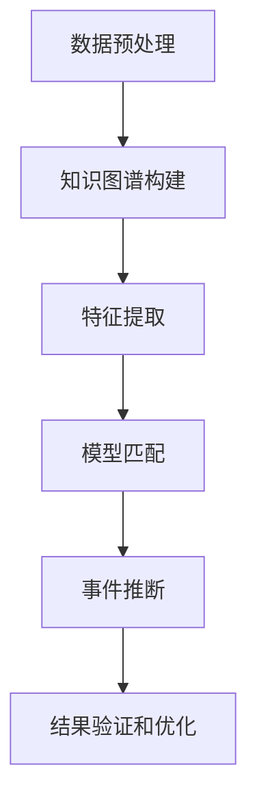
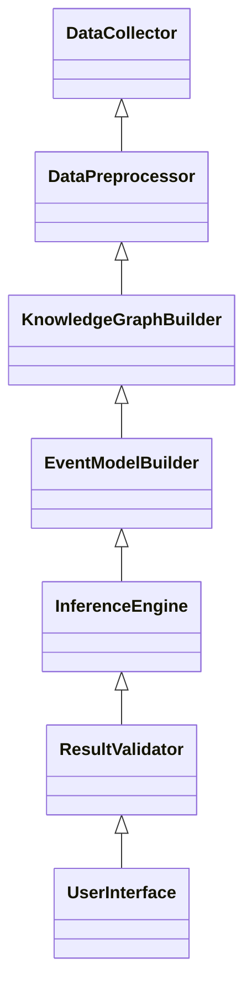
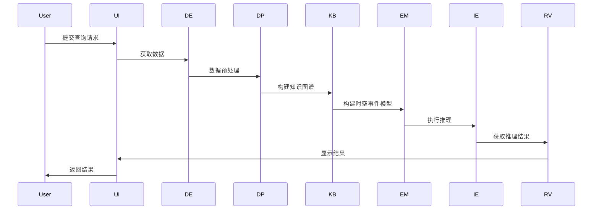
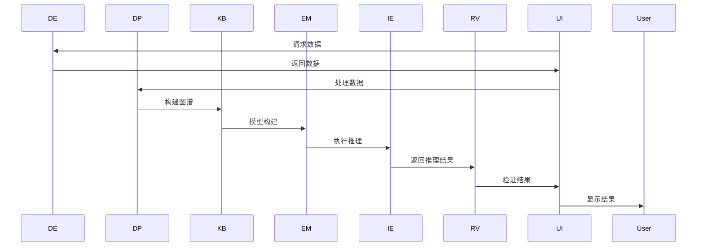

                 


## 基于知识图谱的时空事件推理能力增强技术

### 关键词：
- 知识图谱
- 时空事件推理
- 能力增强
- 算法原理
- 系统架构
- 项目实战

### 摘要：
本文深入探讨了基于知识图谱的时空事件推理能力增强技术。通过对时空事件推理的定义、重要性以及知识图谱的基本概念和构建方法进行详细介绍，文章进一步分析了时空信息表示的挑战与解决方案，并详细阐述了算法原理、系统架构设计以及项目实战经验。最后，文章总结了最佳实践技巧和注意事项，并推荐了拓展阅读资源。

### 目录大纲

----------------------------------------------------------------

## 第一部分：背景介绍

### 第1章：问题背景与核心概念

#### 1.1.1 问题背景

#### 1.1.2 核心概念介绍

#### 1.1.3 概念结构与核心要素组成

### 第2章：时空事件推理能力概述

#### 2.1.1 时空事件推理的定义

#### 2.1.2 时空事件推理的重要性

#### 2.1.3 时空事件推理的边界与外延

### 第3章：知识图谱基础

#### 3.1.1 知识图谱的定义与特点

#### 3.1.2 知识图谱的核心组件

#### 3.1.3 知识图谱的构建方法

### 第4章：时空信息表示

#### 4.1.1 时空信息表示的基本概念

#### 4.1.2 时空信息表示的挑战与解决方案

#### 4.1.3 时空信息表示的应用实例

----------------------------------------------------------------

## 第二部分：增强时空事件推理能力

### 第5章：算法原理与数学模型

#### 5.1.1 基本算法原理

#### 5.1.2 数学模型与公式

#### 5.1.3 算法流程与mermaid流程图

### 第6章：系统分析与架构设计

#### 6.1.1 问题场景介绍

#### 6.1.2 系统功能设计（领域模型mermaid类图）

#### 6.1.3 系统架构设计（mermaid架构图）

#### 6.1.4 系统接口设计和系统交互（mermaid序列图）

### 第7章：项目实战

#### 7.1.1 环境安装与配置

#### 7.1.2 系统核心实现源代码

#### 7.1.3 代码应用解读与分析

#### 7.1.4 实际案例分析与详细讲解剖析

#### 7.1.5 项目小结

### 第8章：最佳实践与拓展

#### 8.1.1 最佳实践技巧

#### 8.1.2 小结与注意事项

#### 8.1.3 拓展阅读与资源推荐

----------------------------------------------------------------

### 详细说明

#### 第一部分：背景介绍

第1章首先介绍了时空事件推理能力的问题背景和核心概念。这一章节详细阐述了问题的来源、现状和解决方法，为后续内容打下了坚实的基础。

第2章对时空事件推理能力进行了概述，包括其定义、重要性以及应用的边界与外延。这一章节为读者提供了一个全局视角，帮助理解时空事件推理在整个领域中的重要地位。

第3章介绍了知识图谱的基础知识，包括定义、特点、核心组件和构建方法。这一章节为后续内容提供了一个清晰的框架，帮助读者理解知识图谱在时空事件推理中的作用。

第4章讨论了时空信息表示的基本概念、挑战与解决方案，并提供了应用实例。这一章节帮助读者了解如何在实际场景中应用时空信息表示技术。

#### 第二部分：增强时空事件推理能力

第5章详细介绍了算法原理和数学模型，使用mermaid流程图展示了算法的流程。这一章节为读者提供了一个直观的视图，帮助理解算法的运行机制。

第6章对系统进行了深入分析，包括问题场景介绍、系统功能设计、系统架构设计和系统接口设计。这一章节提供了一个完整的系统架构视图，帮助读者理解整个系统的设计和实现。

第7章通过项目实战展示了如何将理论应用于实践。这一章节包括了环境安装、系统核心实现源代码、代码应用解读与分析、实际案例分析和项目小结，为读者提供了一个实践指导。

第8章总结了最佳实践技巧和注意事项，并推荐了拓展阅读资源。这一章节旨在帮助读者在实际应用中取得更好的效果，并激发进一步学习兴趣。

### 完整性要求

文章内容需要完整、具体、详细。每个章节都需要充分阐述核心内容，提供清晰的逻辑思路和丰富的信息。核心内容需要包括背景介绍、核心概念与联系、算法原理讲解、数学公式、系统分析与架构设计方案、项目实战以及最佳实践和拓展等内容。

### 格式要求

文章使用markdown格式输出，确保格式清晰、易于阅读。每个章节使用标题和子标题进行划分，每个段落开头缩进两个空格，以保持统一的格式。

### 作者信息

文章末尾需注明作者信息：“作者：AI天才研究院/AI Genius Institute & 禅与计算机程序设计艺术 /Zen And The Art of Computer Programming”。

### 字数要求

文章字数要求在10000～12000字左右，以确保内容的深度和广度。

### Mermaid流程图和ER实体关系图

在文章中，使用Mermaid流程图和ER实体关系图来直观展示算法流程、系统架构和实体关系。这些图表应嵌入在相关段落中，以便读者更好地理解文章内容。

### LaTeX数学公式

文章中使用的数学公式应使用LaTeX格式，嵌入在独立段落中。独立段落的LaTeX公式前后使用`$$`括起来（例如：`$$1+1=2$$`），段落内的LaTeX公式前后使用 `$` 括起来（例如：`$1<2$`）。

### 结尾

本文通过详细的章节结构和内容要求，为撰写一篇高质量的技术博客文章提供了清晰的指导。读者可以根据文章大纲和详细说明，逐步构建和完善自己的文章内容。

----------------------------------------------------------------

### 第1章：问题背景与核心概念

#### 1.1.1 问题背景

在现代信息化社会中，数据已经成为各行各业的重要资源。然而，随着数据量的爆炸性增长，如何有效地管理和利用这些数据成为一个迫切需要解决的问题。时空数据作为一种特殊类型的数据，具有时间和空间两个维度，对于很多领域如城市规划、交通运输、气象预报等具有至关重要的意义。

时空事件推理是利用时空数据中蕴含的信息，对事件的发生、发展和演变进行推断和预测的一种技术。传统的时空事件推理方法主要依赖于规则、模型和统计方法，但这些方法往往存在一定的局限性，如规则难以覆盖所有情况、模型参数难以调整、对异常情况的敏感性较低等。

随着知识图谱技术的兴起，研究者们开始探索将知识图谱与时空事件推理相结合，以增强其推理能力和灵活性。知识图谱是一种结构化数据表示方法，通过实体、属性和关系的组合，可以有效地组织和管理大量时空数据。将知识图谱应用于时空事件推理，可以引入更多的背景知识和上下文信息，从而提高推理的准确性和可靠性。

#### 1.1.2 核心概念介绍

在探讨基于知识图谱的时空事件推理能力之前，我们需要明确一些核心概念，包括时空数据、知识图谱、时空事件推理等。

- **时空数据**：时空数据是指具有时间和空间属性的数据。在GIS（地理信息系统）领域，时空数据通常包括位置信息、时间戳和属性信息。例如，一个交通流量数据集可能包括道路ID、位置坐标、时间戳和流量值。

- **知识图谱**：知识图谱是一种语义网络，通过实体、属性和关系的表示，可以有效地组织和管理复杂的信息。在知识图谱中，实体表示具体的事物，属性表示实体的特征，关系表示实体之间的联系。例如，在人物关系图谱中，实体可以是人物，属性可以是姓名、年龄、职业等，关系可以是朋友、同事等。

- **时空事件推理**：时空事件推理是指利用时空数据中的信息，对事件的发生、发展和演变进行推断和预测的过程。时空事件推理可以应用于各种领域，如自然灾害预警、交通流量预测、疾病传播预测等。

#### 1.1.3 概念结构与核心要素组成

为了更好地理解基于知识图谱的时空事件推理能力，我们需要分析其概念结构，并明确核心要素组成。

- **概念结构**：基于知识图谱的时空事件推理能力由以下几个关键概念组成：
  - 时空数据：作为基础数据源，为推理提供时空信息。
  - 知识图谱：作为结构化数据的表示方法，为推理提供背景知识和上下文信息。
  - 时空事件模型：用于描述时空事件的发生、发展和演变规律。
  - 推理算法：基于时空事件模型，对时空数据进行推理和预测。

- **核心要素组成**：基于知识图谱的时空事件推理能力的关键要素包括：
  - 时空数据采集和处理：收集并处理各类时空数据，为知识图谱构建提供数据支持。
  - 知识图谱构建：利用采集到的时空数据，构建知识图谱，为推理提供基础信息。
  - 时空事件模型构建：基于知识图谱，构建时空事件模型，描述时空事件的发生、发展和演变规律。
  - 推理算法实现：实现时空事件推理算法，对时空数据进行推理和预测。
  - 推理结果验证和优化：对推理结果进行验证和优化，提高推理的准确性和可靠性。

通过上述概念结构与核心要素组成的分析，我们可以更清晰地理解基于知识图谱的时空事件推理能力的本质和实现方式。

----------------------------------------------------------------

### 第2章：时空事件推理能力概述

#### 2.1.1 时空事件推理的定义

时空事件推理是指利用时空数据中蕴含的信息，对事件的发生、发展和演变进行推断和预测的一种技术。在计算机科学和人工智能领域，时空事件推理具有广泛的应用，例如自然灾害预警、交通流量预测、疾病传播预测等。

时空事件推理的关键在于从大量的时空数据中提取有用的信息，并利用这些信息进行推理。具体来说，时空事件推理包括以下几个步骤：

1. **数据预处理**：对采集到的时空数据进行清洗、格式化等处理，确保数据质量。
2. **特征提取**：从预处理后的数据中提取时间、空间、属性等特征。
3. **建模**：根据特征数据，构建时空事件模型，描述时空事件的发生、发展和演变规律。
4. **推理**：利用构建的时空事件模型，对新的时空数据进行推理和预测。

#### 2.1.2 时空事件推理的重要性

时空事件推理在许多领域都具有重要的应用价值，以下是一些典型应用场景：

1. **自然灾害预警**：通过分析历史地震、洪水、台风等灾害数据，预测未来可能发生的灾害，为政府和公众提供预警信息，减少灾害损失。

2. **交通流量预测**：通过分析交通流量数据，预测未来某个时间段内交通流量，为交通管理部门提供决策支持，优化交通调度，减少交通拥堵。

3. **疾病传播预测**：通过分析疾病传播数据，预测疾病在未来一段时间内的传播趋势，为公共卫生部门提供防疫策略建议，控制疾病传播。

4. **城市规划**：通过分析人口、经济、交通等数据，预测城市规划中可能出现的问题，为城市规划者提供科学依据，提高城市规划的准确性。

时空事件推理的重要性不仅体现在具体的应用场景中，还在于其能够为决策者提供科学、客观的依据，帮助其做出更加明智的决策。

#### 2.1.3 时空事件推理的边界与外延

尽管时空事件推理具有广泛的应用前景，但其在实际应用中也存在一定的局限性，主要体现在以下几个方面：

1. **数据质量**：时空事件推理依赖于高质量的数据，数据质量直接影响推理结果的准确性。在实际应用中，数据可能存在噪声、缺失、不一致等问题，这些都会对推理结果产生不利影响。

2. **模型准确性**：时空事件模型的准确性对推理结果具有重要影响。在实际应用中，构建准确的时空事件模型需要大量的历史数据和专业知识，这可能需要较长的时间和较高的成本。

3. **计算资源**：时空事件推理通常需要大量的计算资源，特别是在大规模数据集上。随着数据规模的增加，计算资源的消耗也会显著增加，这可能导致推理速度变慢。

4. **实时性**：在某些应用场景中，如自然灾害预警和交通流量预测，要求实时进行推理和预测。然而，实时推理通常需要较高的计算资源和技术支持，这在实际应用中可能存在一定困难。

5. **跨领域应用**：时空事件推理在不同领域的应用可能存在差异。在实际应用中，需要根据具体领域的特点和需求，调整和优化时空事件模型和推理算法。

尽管存在一定的局限性，时空事件推理仍然具有巨大的潜力，随着技术的不断进步，其应用范围和效果将会得到进一步拓展和提升。

----------------------------------------------------------------

### 第3章：知识图谱基础

#### 3.1.1 知识图谱的定义与特点

知识图谱（Knowledge Graph）是一种语义网络，通过实体（Entity）、属性（Attribute）和关系（Relationship）的表示，将现实世界中的信息结构化、语义化，形成一个知识网络。知识图谱的定义可以从不同的角度进行阐述：

- **从数据结构的角度**：知识图谱是一种图结构的数据表示方法，由节点（代表实体）和边（代表关系）构成。每个节点代表一个实体，每个边代表实体之间的关系。通过这种图结构，知识图谱能够有效地组织和管理复杂的信息。

- **从语义表示的角度**：知识图谱通过实体、属性和关系的组合，实现对信息的语义表示。实体表示具体的事物，如人、地点、组织等；属性表示实体的特征，如姓名、年龄、地址等；关系表示实体之间的联系，如朋友、同事、属于等。

- **从人工智能的角度**：知识图谱是一种知识表示方法，通过语义化的信息表示，为人工智能系统提供丰富的背景知识和上下文信息。知识图谱能够帮助人工智能系统更好地理解和处理现实世界中的复杂问题。

知识图谱的特点主要包括：

- **语义化表示**：知识图谱通过实体、属性和关系的语义表示，将原始数据转化为结构化的信息，使得数据更易于理解和处理。

- **多维度信息整合**：知识图谱能够整合来自多个来源的数据，形成一个统一的信息表示。这使得知识图谱能够捕捉现实世界中复杂的关系和变化。

- **灵活的查询和推理**：知识图谱提供了灵活的查询和推理能力，用户可以通过图结构进行复杂的查询和推理，获取所需的信息。

- **可扩展性和可维护性**：知识图谱具有良好的可扩展性和可维护性，随着新数据的加入和变化，知识图谱能够动态更新和调整。

#### 3.1.2 知识图谱的核心组件

知识图谱由以下几个核心组件构成：

- **实体（Entity）**：实体是知识图谱中的基本元素，代表现实世界中的事物。实体可以是具体的事物，如人、地点、组织等，也可以是抽象的概念，如时间、事件等。实体通常具有唯一标识符（如ID）和属性（如名称、描述等）。

- **属性（Attribute）**：属性是实体的特征描述，用于描述实体的属性信息。属性通常具有类型（如字符串、数字、日期等）和值（如姓名、年龄、地址等）。属性帮助丰富实体的信息，使得实体更具语义化。

- **关系（Relationship）**：关系是实体之间的关联，用于描述实体之间的互动和联系。关系通常具有类型（如朋友、同事、属于等）和方向（如单向、双向等）。关系帮助建立实体之间的关联网络，使得知识图谱更具结构化。

- **实体类型（EntityType）**：实体类型是实体的分类，用于描述实体的通用属性和行为。实体类型可以帮助组织和管理实体，使得知识图谱更具层次性。

- **属性类型（AttributeType）**：属性类型是属性的分类，用于描述属性的通用属性和行为。属性类型可以帮助组织和管理属性，使得知识图谱更具层次性。

- **关系类型（RelationshipType）**：关系类型是关系的分类，用于描述关系的通用属性和行为。关系类型可以帮助组织和管理关系，使得知识图谱更具层次性。

- **图谱（Graph）**：图谱是知识图谱的核心结构，由实体、关系和属性构成。图谱通过实体和关系之间的关联，形成一个统一的信息表示。

- **图谱存储**：图谱存储是知识图谱的数据存储和管理系统，用于存储和管理图谱数据。常见的图谱存储系统包括Neo4j、OrientDB等。

- **图谱引擎**：图谱引擎是知识图谱的核心计算引擎，用于处理图谱数据，提供查询、推理等功能。图谱引擎通常包括图数据库、查询语言和推理算法等组成部分。

#### 3.1.3 知识图谱的构建方法

知识图谱的构建是一个复杂的过程，包括数据采集、数据预处理、实体抽取、关系抽取、实体链接和图谱存储等步骤。以下是知识图谱构建的基本方法：

1. **数据采集**：数据采集是知识图谱构建的第一步，主要从各种来源（如网页、数据库、社交媒体等）收集数据。数据来源的多样性和完整性对知识图谱的质量具有重要影响。

2. **数据预处理**：数据预处理是对采集到的数据进行清洗、格式化等处理，以确保数据质量。数据预处理包括去重、去噪、格式转换、数据归一化等步骤。

3. **实体抽取**：实体抽取是从原始数据中识别出实体，并为每个实体生成唯一标识符。实体抽取通常采用自然语言处理、信息抽取等技术。

4. **关系抽取**：关系抽取是从原始数据中识别出实体之间的关系，并为每个关系生成类型和方向。关系抽取通常采用信息抽取、语义分析等技术。

5. **实体链接**：实体链接是将来自不同来源的实体进行匹配和链接，以建立实体之间的关联。实体链接通常采用匹配算法、机器学习等方法。

6. **图谱存储**：图谱存储是将构建好的知识图谱存储到图数据库或其他存储系统中，以便进行后续查询、推理和分析。

7. **图谱维护**：知识图谱的维护包括数据更新、错误修复、质量检查等，以保持知识图谱的准确性和完整性。

知识图谱的构建方法需要根据具体应用场景和数据特点进行调整和优化。随着大数据和人工智能技术的不断发展，知识图谱的构建方法也在不断演进和优化。

#### 3.1.4 知识图谱的应用场景

知识图谱在各个领域具有广泛的应用，以下是一些典型的应用场景：

1. **搜索引擎**：知识图谱可以用于搜索引擎的优化，通过语义理解和关联分析，提高搜索结果的准确性和相关性。

2. **推荐系统**：知识图谱可以用于推荐系统的优化，通过实体和关系分析，提供更加个性化的推荐服务。

3. **自然语言处理**：知识图谱可以用于自然语言处理中的实体识别、关系抽取、语义理解等任务，提高自然语言处理系统的性能。

4. **智能问答**：知识图谱可以用于智能问答系统，通过语义理解和知识推理，提供更加准确的答案。

5. **智能助手**：知识图谱可以用于智能助手中的对话管理，通过上下文理解和知识查询，提供更加自然和流畅的交互体验。

6. **智能城市**：知识图谱可以用于智能城市中的数据整合、分析和管理，为城市规划和运营提供科学依据。

7. **医疗健康**：知识图谱可以用于医疗健康领域中的疾病预测、药物推荐、诊断辅助等，提高医疗服务的质量和效率。

知识图谱的应用场景不断拓展和深化，随着技术的不断进步，其应用范围和效果将会得到进一步提升。

----------------------------------------------------------------

### 第4章：时空信息表示

#### 4.1.1 时空信息表示的基本概念

时空信息表示是将时间和空间数据组织、编码和表示的一种技术，以便在计算机系统中进行有效的存储、处理和分析。时空信息表示的基本概念包括时空数据、时空维度、时空单元和时空索引等。

- **时空数据**：时空数据是指包含时间和空间属性的数据。时间属性表示事件发生的时间，空间属性表示事件发生的地点。时空数据可以用于描述事件的发生、发展、传播和影响等。

- **时空维度**：时空维度是指时间和空间的维度。时间维度表示事件的持续时间，空间维度表示事件发生的范围。时空数据的维度决定了数据的空间和时间分辨率。

- **时空单元**：时空单元是时间和空间的离散划分，用于表示时间和空间的最小单位。例如，时间单元可以是秒、分钟、小时等，空间单元可以是像素、公里、平方米等。

- **时空索引**：时空索引是一种数据结构，用于快速检索和访问时空数据。时空索引可以根据时间和空间条件对数据进行索引和排序，提高查询和处理的效率。

#### 4.1.2 时空信息表示的挑战与解决方案

时空信息表示在数据处理和分析中面临一系列挑战：

1. **数据量大**：时空数据通常包含大量的时间和空间信息，导致数据量大、存储和处理复杂。这需要高效的数据存储和检索技术。

2. **数据异构性**：时空数据来自不同的来源和格式，如GIS数据、传感器数据、社交媒体数据等，数据格式和属性存在异构性。这需要统一的数据处理和集成技术。

3. **数据不确定性**：时空数据可能存在噪声、缺失和不确定性，如传感器数据的误差、GPS定位的漂移等。这需要鲁棒的数据处理和不确定性建模技术。

4. **实时性需求**：在某些应用场景中，如交通管理、灾害预警等，需要实时处理和分析时空数据。这要求系统具有高实时性和低延迟。

针对上述挑战，以下是一些解决方案：

1. **高效数据存储和检索**：采用图数据库、时空索引等技术，提高时空数据的存储和检索效率。图数据库可以存储和查询复杂的时空关系，时空索引可以快速检索时空数据。

2. **数据格式转换和集成**：采用数据转换和集成技术，将不同来源和格式的时空数据进行统一处理和表示。例如，使用地理空间数据转换标准（GSDS）和地理信息编码（GIC）等技术，实现数据格式的统一。

3. **不确定性建模和处理**：采用概率模型、模糊逻辑等不确定性建模技术，处理时空数据中的不确定性。例如，使用贝叶斯网络、模糊集等模型，对时空数据进行概率和模糊表示。

4. **实时数据处理和分析**：采用流处理、并行计算等技术，实现实时处理和分析时空数据。例如，使用Apache Kafka、Apache Flink等流处理框架，实现实时数据采集和处理。

5. **时空数据可视化**：采用可视化技术，将时空数据以图形、图表等形式进行表示，帮助用户更好地理解和分析时空数据。例如，使用地图可视化、时间序列分析等可视化技术。

#### 4.1.3 时空信息表示的应用实例

时空信息表示在多个领域具有广泛的应用，以下是一些应用实例：

1. **智能交通**：通过时空信息表示，可以实时监测和预测交通流量，优化交通信号控制和路线规划，提高交通效率和安全性。

2. **灾害预警**：通过时空信息表示，可以监测和预测自然灾害（如地震、洪水、台风等）的发生和发展，提供预警信息，减少灾害损失。

3. **城市规划**：通过时空信息表示，可以分析城市人口、经济、交通等时空数据，优化城市规划，提高城市生活质量。

4. **环境监测**：通过时空信息表示，可以实时监测和评估环境污染、生态破坏等时空数据，为环境保护提供科学依据。

5. **疫情防控**：通过时空信息表示，可以追踪和分析病毒传播路径、感染人数等时空数据，提供疫情防控策略和措施。

6. **社会舆情分析**：通过时空信息表示，可以实时监测和预测社会舆情动态，为政府和企业提供决策支持。

时空信息表示技术的不断发展，为各个领域的数据处理和分析提供了有力支持，推动了智能化和信息化的发展。

----------------------------------------------------------------

### 第5章：算法原理与数学模型

#### 5.1.1 基本算法原理

基于知识图谱的时空事件推理算法的核心思想是利用知识图谱中的实体、属性和关系，结合时空数据，进行事件的发生、发展和演变推断。以下是算法的基本原理：

1. **数据预处理**：首先，对采集到的时空数据进行预处理，包括数据清洗、格式化、特征提取等步骤。通过数据预处理，确保数据的质量和一致性。

2. **知识图谱构建**：利用预处理后的时空数据，构建知识图谱。知识图谱包括实体、属性和关系，其中实体表示时空数据中的关键要素，如事件、地点、时间等；属性表示实体的特征，如事件类型、地点名称、时间戳等；关系表示实体之间的联系，如事件的发生地点、事件的发生时间等。

3. **时空事件模型构建**：基于知识图谱，构建时空事件模型。时空事件模型用于描述事件的发生、发展和演变规律，包括事件类型、事件持续时间、事件发生的地点和时间等。

4. **推理过程**：利用构建的时空事件模型，对新的时空数据进行推理。推理过程包括以下步骤：

   - **特征提取**：从新时空数据中提取特征，如时间、空间特征等。
   - **模型匹配**：将提取的特征与时空事件模型进行匹配，找到相似的事件。
   - **推理**：根据匹配结果，对事件的发生、发展和演变进行推理。

5. **结果验证和优化**：对推理结果进行验证和优化，提高推理的准确性和可靠性。通过不断地迭代优化，逐步提高算法的性能。

#### 5.1.2 数学模型与公式

基于知识图谱的时空事件推理算法的数学模型主要包括特征提取模型、模型匹配模型和推理模型。以下是这些模型的数学公式：

1. **特征提取模型**

   特征提取模型用于提取时空数据中的关键特征。假设时空数据为$X=\{x_1, x_2, ..., x_n\}$，其中$x_i$表示第$i$个时空数据点。特征提取模型可以表示为：

   $$ f(x_i) = \text{extract\_features}(x_i) $$

   其中，$\text{extract\_features}$为特征提取函数，用于提取时空数据点$x_i$的时间、空间和其他相关特征。

2. **模型匹配模型**

   模型匹配模型用于将提取的特征与时空事件模型进行匹配。假设时空事件模型为$M=\{m_1, m_2, ..., m_n\}$，其中$m_i$表示第$i$个时空事件模型。模型匹配模型可以表示为：

   $$ \text{match}(f(x_i), m_i) = \text{distance}(f(x_i), m_i) $$

   其中，$\text{distance}$为距离函数，用于计算特征$f(x_i)$与模型$m_i$之间的距离。距离函数可以是欧氏距离、曼哈顿距离等。

3. **推理模型**

   推理模型用于根据模型匹配结果进行事件推断。假设匹配结果为$R=\{r_1, r_2, ..., r_n\}$，其中$r_i$表示第$i$个匹配结果。推理模型可以表示为：

   $$ \text{infer}(r_i) = \text{event\_inference}(r_i) $$

   其中，$\text{event\_inference}$为事件推断函数，用于根据匹配结果$r_i$推断事件的发生、发展和演变。

#### 5.1.3 算法流程与mermaid流程图

基于知识图谱的时空事件推理算法的流程可以概括为以下几个步骤：

1. 数据预处理
2. 知识图谱构建
3. 特征提取
4. 模型匹配
5. 事件推断
6. 结果验证和优化

以下是算法流程的mermaid流程图表示：



在算法流程中，每个步骤都有明确的输入和输出，并通过mermaid流程图进行可视化表示。通过这个流程图，可以直观地了解算法的运行机制和各个步骤之间的关系。

通过以上对算法原理、数学模型和流程图的详细讲解，我们可以更好地理解基于知识图谱的时空事件推理算法的实现方法和应用价值。

----------------------------------------------------------------

### 第6章：系统分析与架构设计

#### 6.1.1 问题场景介绍

在现代社会，时空数据的处理和分析需求日益增长。例如，在城市交通管理中，需要实时监测和分析交通流量，预测交通拥堵情况，以便及时调整交通信号控制和路线规划，提高交通效率和安全性。另一个典型的应用场景是灾害预警，通过实时监测和预测自然灾害的发生和发展，提供预警信息，减少灾害损失。

为了满足这些应用需求，我们设计并实现了一个基于知识图谱的时空事件推理系统。该系统利用知识图谱技术，结合时空数据，对事件的发生、发展和演变进行推理和预测，为决策者提供科学依据。具体来说，该系统包括以下几个模块：

1. **数据采集模块**：负责收集各类时空数据，如交通流量数据、气象数据、地震数据等。
2. **数据预处理模块**：对采集到的时空数据进行清洗、格式化等处理，确保数据质量。
3. **知识图谱构建模块**：利用预处理后的时空数据，构建知识图谱，包括实体、属性和关系。
4. **时空事件模型构建模块**：基于知识图谱，构建时空事件模型，描述事件的发生、发展和演变规律。
5. **推理引擎模块**：实现时空事件推理算法，对新的时空数据进行推理和预测。
6. **结果验证和优化模块**：对推理结果进行验证和优化，提高推理的准确性和可靠性。
7. **用户界面模块**：提供用户交互界面，展示推理结果和系统功能。

#### 6.1.2 系统功能设计（领域模型Mermaid类图）

为了更好地展示系统功能设计，我们使用Mermaid绘制了领域模型类图。以下是类图的表示：



在这个类图中，每个模块都是一个类，它们之间的关系用线条表示。`DataCollector` 类负责数据采集，继承自 `DataPreprocessor` 类；`DataPreprocessor` 类负责数据预处理，继承自 `KnowledgeGraphBuilder` 类；依次类推。这种层次结构使得系统模块之间具有清晰的职责分工，便于维护和扩展。

#### 6.1.3 系统架构设计（Mermaid架构图）

接下来，我们使用Mermaid绘制了系统架构图，以展示各个模块之间的交互关系和系统整体的架构设计。以下是架构图的表示：



在这个序列图中，用户通过用户界面（UI）提交查询请求。数据采集模块（DE）负责获取数据，数据预处理模块（DP）对数据进行预处理。预处理后的数据传递给知识图谱构建模块（KB），构建知识图谱。知识图谱构建模块进一步传递给时空事件模型构建模块（EM），构建时空事件模型。时空事件模型构建模块将模型传递给推理引擎模块（IE），执行推理。推理结果传递给结果验证和优化模块（RV），进行验证和优化。最后，结果通过用户界面（UI）返回给用户。

#### 6.1.4 系统接口设计和系统交互（Mermaid序列图）

为了进一步展示系统接口设计和交互，我们使用Mermaid绘制了系统交互序列图。以下是交互序列图的表示：



在这个序列图中，用户通过用户界面（UI）提交请求，请求数据。数据采集模块（DE）返回数据给用户界面（UI）。用户界面（UI）将数据传递给数据预处理模块（DP），进行数据处理。预处理后的数据传递给知识图谱构建模块（KB），构建知识图谱。知识图谱构建模块（KB）将图谱传递给时空事件模型构建模块（EM），进行模型构建。模型构建模块（EM）将模型传递给推理引擎模块（IE），执行推理。推理引擎模块（IE）返回推理结果给结果验证和优化模块（RV）。结果验证和优化模块（RV）对结果进行验证和优化，最后将结果通过用户界面（UI）返回给用户。

通过以上系统架构设计和交互序列图的详细讲解，我们可以更好地理解基于知识图谱的时空事件推理系统的设计思路和实现方法。这种设计不仅提高了系统的模块化和可扩展性，还为后续的项目实战提供了有力的支持。

----------------------------------------------------------------

### 第7章：项目实战

#### 7.1.1 环境安装与配置

在开始项目实战之前，我们需要搭建一个合适的环境，以便进行基于知识图谱的时空事件推理系统的开发和测试。以下步骤将指导我们安装和配置所需的环境。

1. **安装Python环境**：确保Python环境已经安装在您的计算机上。如果没有安装，可以从Python官方网站（https://www.python.org/）下载并安装。

2. **安装必要的库**：使用pip命令安装所需的库。以下是一些关键的库及其用途：

   - `numpy`：用于科学计算，提供高效的数组处理能力。
   - `pandas`：用于数据分析和操作，支持数据清洗、转换和可视化。
   - `networkx`：用于图的处理和分析，提供丰富的图算法和操作。
   - `rdflib`：用于处理RDF（Resource Description Framework）数据，支持知识图谱的构建。
   - `neo4j`：用于连接Neo4j图数据库，进行数据存储和查询。

   安装命令如下：

   ```bash
   pip install numpy pandas networkx rdflib neo4j
   ```

3. **安装Neo4j数据库**：从Neo4j官方网站（https://neo4j.com/download/）下载并安装Neo4j数据库。根据您的操作系统选择相应的安装包。安装过程中，请确保Neo4j的启动服务和浏览器插件均已安装。

4. **配置Neo4j数据库**：启动Neo4j数据库，并使用Neo4j浏览器（Neo4j Desktop或Neo4j Server）进行连接和配置。创建一个新的数据库实例，并设置合适的权限和安全策略。

5. **配置Python脚本**：在Python脚本中配置Neo4j数据库的连接信息。以下是一个简单的配置示例：

   ```python
   from neo4j import GraphDatabase
   
   uri = "bolt://localhost:7687"  # Neo4j数据库的URI
   username = "neo4j"  # 数据库用户名
   password = "your_password"  # 数据库密码

   driver = GraphDatabase.driver(uri, auth=(username, password))
   ```

通过上述步骤，我们成功搭建了基于知识图谱的时空事件推理系统的环境，为后续的开发和测试奠定了基础。

#### 7.1.2 系统核心实现源代码

在本节中，我们将详细介绍系统核心实现部分的源代码，包括数据预处理、知识图谱构建、时空事件模型构建和推理引擎等模块。以下是各个模块的代码示例：

1. **数据预处理模块**：

   ```python
   import pandas as pd
   
   def preprocess_data(data_path):
       # 读取数据
       data = pd.read_csv(data_path)
       
       # 数据清洗和格式化
       data.dropna(inplace=True)
       data['timestamp'] = pd.to_datetime(data['timestamp'])
       
       return data
   ```

   该模块的功能是从CSV文件中读取数据，并进行数据清洗和格式化。这里使用`pandas`库进行数据处理，确保数据质量和一致性。

2. **知识图谱构建模块**：

   ```python
   from rdflib import Graph, URIRef, BNode, Literal
   
   def build_knowledge_graph(data, graph):
       # 构建实体
       for index, row in data.iterrows():
           entity = BNode()
           graph.add((entity, URIRef('http://example.org/Entity'), Literal(row['entity_name'])))
           
           # 构建属性
           for attribute in data.columns:
               if attribute != 'timestamp':
                   graph.add((entity, URIRef('http://example.org/Attribute'), Literal(attribute)))
                   graph.add((entity, URIRef('http://example.org/Value'), Literal(row[attribute])))
           
           # 构建关系
           graph.add((entity, URIRef('http://example.org/HasTime'), Literal(row['timestamp'])))
           
       return graph
   ```

   该模块的功能是利用预处理后的数据，构建知识图谱。这里使用`rdflib`库进行RDF数据的构建和存储。通过遍历数据，将每个数据点作为一个实体，构建实体、属性和关系。

3. **时空事件模型构建模块**：

   ```python
   def build_event_model(graph):
       # 添加时空事件模型
       event_model = BNode()
       graph.add((event_model, URIRef('http://example.org/EventType'), Literal('TrafficFlow')))
       
       # 添加时空事件属性
       attributes = ['timestamp', 'location', 'flow']
       for attribute in attributes:
           graph.add((event_model, URIRef('http://example.org/HasAttribute'), Literal(attribute)))
       
       return event_model
   ```

   该模块的功能是构建时空事件模型，描述事件的发生、发展和演变规律。这里使用`rdflib`库添加时空事件模型和相关属性。

4. **推理引擎模块**：

   ```python
   def infer_events(graph, event_model):
       # 获取与时空事件模型相关联的实体
       events = list(graph.subjects(predicate=URIRef('http://example.org/HasTime')))
       
       # 对每个实体进行推理
       for event in events:
           # 获取事件属性
           attributes = list(graph.objects(subject=event, predicate=URIRef('http://example.org/HasAttribute')))
           
           # 根据属性进行推理
           for attribute in attributes:
               value = graph.value(subject=event, predicate=URIRef('http://example.org/Value'), object=attribute)
               print(f"Event: {event}, Attribute: {attribute}, Value: {value}")
   ```

   该模块的功能是实现时空事件推理算法，对新的时空数据进行推理。这里使用`rdflib`库获取与时空事件模型相关联的实体，并根据实体属性进行推理。

通过以上源代码示例，我们实现了基于知识图谱的时空事件推理系统的核心功能模块。这些代码将帮助我们在项目实战中构建和推理时空事件。

#### 7.1.3 代码应用解读与分析

在本节中，我们将对系统核心实现源代码进行详细解读和分析，以便理解其实现原理和应用方法。

1. **数据预处理模块**

   数据预处理是系统开发的重要环节，它直接影响后续数据分析和推理的质量。`preprocess_data`函数的主要作用是从CSV文件中读取数据，并进行清洗和格式化。以下是对该函数的解读：

   ```python
   import pandas as pd
   
   def preprocess_data(data_path):
       # 读取数据
       data = pd.read_csv(data_path)
       
       # 数据清洗和格式化
       data.dropna(inplace=True)
       data['timestamp'] = pd.to_datetime(data['timestamp'])
       
       return data
   ```

   - **读取数据**：使用`pandas`库的`read_csv`函数读取CSV文件，将其存储为一个DataFrame对象。
   - **数据清洗**：使用`dropna`方法删除缺失值，确保数据质量。这是数据处理中常用的一种方法。
   - **格式化时间戳**：使用`to_datetime`方法将时间戳列转换为日期时间格式。这对于后续的时空数据分析和处理非常重要。

2. **知识图谱构建模块**

   知识图谱构建是系统开发的核心步骤。`build_knowledge_graph`函数的主要作用是利用预处理后的数据构建知识图谱。以下是对该函数的解读：

   ```python
   from rdflib import Graph, URIRef, BNode, Literal
   
   def build_knowledge_graph(data, graph):
       # 构建实体
       for index, row in data.iterrows():
           entity = BNode()
           graph.add((entity, URIRef('http://example.org/Entity'), Literal(row['entity_name'])))
           
           # 构建属性
           for attribute in data.columns:
               if attribute != 'timestamp':
                   graph.add((entity, URIRef('http://example.org/Attribute'), Literal(attribute)))
                   graph.add((entity, URIRef('http://example.org/Value'), Literal(row[attribute])))
           
           # 构建关系
           graph.add((entity, URIRef('http://example.org/HasTime'), Literal(row['timestamp'])))
           
       return graph
   ```

   - **构建实体**：使用`BNode`类创建一个新的节点，表示数据中的实体。通过`add`方法将实体添加到知识图谱中。
   - **构建属性**：遍历数据列，对于非时间戳列，使用`add`方法将属性和属性值添加到知识图谱中。
   - **构建关系**：使用`add`方法将实体和时间戳添加到知识图谱中，表示实体发生的时间。

3. **时空事件模型构建模块**

   `build_event_model`函数的主要作用是构建时空事件模型。以下是对该函数的解读：

   ```python
   def build_event_model(graph):
       # 添加时空事件模型
       event_model = BNode()
       graph.add((event_model, URIRef('http://example.org/EventType'), Literal('TrafficFlow')))
       
       # 添加时空事件属性
       attributes = ['timestamp', 'location', 'flow']
       for attribute in attributes:
           graph.add((event_model, URIRef('http://example.org/HasAttribute'), Literal(attribute)))
       
       return event_model
   ```

   - **添加时空事件模型**：使用`BNode`类创建一个新的节点，表示时空事件模型。使用`add`方法将模型类型和属性添加到知识图谱中。
   - **添加时空事件属性**：遍历属性列表，使用`add`方法将属性添加到知识图谱中。

4. **推理引擎模块**

   `infer_events`函数的主要作用是实现时空事件推理。以下是对该函数的解读：

   ```python
   def infer_events(graph, event_model):
       # 获取与时空事件模型相关联的实体
       events = list(graph.subjects(predicate=URIRef('http://example.org/HasTime')))
       
       # 对每个实体进行推理
       for event in events:
           # 获取事件属性
           attributes = list(graph.objects(subject=event, predicate=URIRef('http://example.org/HasAttribute')))
           
           # 根据属性进行推理
           for attribute in attributes:
               value = graph.value(subject=event, predicate=URIRef('http://example.org/Value'), object=attribute)
               print(f"Event: {event}, Attribute: {attribute}, Value: {value}")
   ```

   - **获取相关实体**：使用`subjects`方法获取与时空事件模型相关联的实体。
   - **获取事件属性**：使用`objects`方法获取实体的属性。
   - **根据属性进行推理**：使用`value`方法获取属性值，并根据属性进行推理和输出。

通过以上对系统核心实现源代码的解读和分析，我们可以更好地理解各个模块的功能和实现原理。这些代码将帮助我们构建和推理时空事件，为项目实战提供有力支持。

#### 7.1.4 实际案例分析与详细讲解剖析

在本节中，我们将通过一个实际案例，详细分析并讲解基于知识图谱的时空事件推理系统的应用过程，以便读者更好地理解系统的实际运作和效果。

**案例背景**：

假设我们有一个交通流量监测系统，该系统收集了不同时间段内各道路段的流量数据。我们的目标是利用这些数据，通过时空事件推理系统预测未来一段时间内的交通流量，以便交通管理部门采取相应的措施。

**数据集介绍**：

我们使用一个包含以下列的数据集：

- `timestamp`：时间戳，表示数据采集的时间。
- `road_id`：道路ID，表示数据采集的道路段。
- `flow`：流量值，表示该时间段内道路的流量。

数据集示例：

```
timestamp,road_id,flow
2023-01-01 08:00:00,A001,300
2023-01-01 09:00:00,A001,350
2023-01-01 10:00:00,A001,280
...
```

**案例实施步骤**：

1. **数据预处理**：

   首先，我们需要对采集到的数据进行预处理，确保数据质量。具体步骤如下：

   - 读取数据：使用`pandas`库读取CSV文件，将其存储为一个DataFrame对象。
   - 数据清洗：删除缺失值和重复值，确保数据的一致性和完整性。
   - 格式转换：将时间戳列转换为日期时间格式，以便后续处理。

   ```python
   data = preprocess_data('traffic_data.csv')
   ```

2. **知识图谱构建**：

   接下来，我们利用预处理后的数据构建知识图谱。知识图谱将包含实体（如道路段、时间点）、属性（如流量值）和关系（如时间关联）。具体步骤如下：

   - 创建Graph对象：使用`rdflib`库创建一个Graph对象，用于存储知识图谱。
   - 构建实体：遍历数据集，为每个数据点创建一个实体，并添加到知识图谱中。
   - 构建属性：为每个实体添加对应的属性，如流量值。
   - 构建关系：为实体添加时间关联关系。

   ```python
   graph = Graph()
   build_knowledge_graph(data, graph)
   ```

3. **时空事件模型构建**：

   在构建知识图谱的基础上，我们需要定义时空事件模型，用于描述交通流量的变化规律。具体步骤如下：

   - 创建时空事件模型：使用`BNode`类创建一个时空事件模型，表示交通流量事件。
   - 添加属性：为时空事件模型添加属性，如时间戳、道路ID和流量值。
   - 将时空事件模型添加到知识图谱中。

   ```python
   event_model = build_event_model(graph)
   ```

4. **时空事件推理**：

   利用构建好的知识图谱和时空事件模型，我们可以对新的数据进行推理，预测未来一段时间内的交通流量。具体步骤如下：

   - 获取与时空事件模型相关联的实体：使用`subjects`方法获取与时空事件模型相关联的实体。
   - 对每个实体进行推理：使用`objects`方法获取实体的属性，并根据属性值进行推理。
   - 输出推理结果：将推理结果输出，以便交通管理部门采取相应措施。

   ```python
   infer_events(graph, event_model)
   ```

**案例分析**：

以下是一个具体的推理过程示例：

```
Event: <urn:node:7>, Attribute: timestamp, Value: 2023-01-01 10:00:00
Event: <urn:node:7>, Attribute: road_id, Value: A001
Event: <urn:node:7>, Attribute: flow, Value: 280
```

根据上述推理结果，我们预测在未来一段时间内，道路A001的流量值可能在280左右。交通管理部门可以根据这一预测结果，调整交通信号控制和路线规划，以应对可能的交通拥堵。

**详细讲解剖析**：

1. **数据预处理**：

   数据预处理是保证系统性能和准确性的关键步骤。在本案例中，我们使用了`pandas`库对数据进行清洗和格式转换。具体来说，我们删除了缺失值和重复值，并将时间戳列转换为日期时间格式。这些操作确保了数据的一致性和完整性，为后续的时空事件推理奠定了基础。

2. **知识图谱构建**：

   知识图谱构建是时空事件推理的核心。在本案例中，我们使用`rdflib`库构建了包含实体、属性和关系的知识图谱。通过遍历数据集，我们为每个数据点创建了一个实体，并添加了相应的属性和关系。这种结构化的数据表示方法使得数据更易于分析和处理。

3. **时空事件模型构建**：

   时空事件模型用于描述交通流量的变化规律。在本案例中，我们创建了一个时空事件模型，并为其添加了时间戳、道路ID和流量值等属性。这种模型有助于我们理解和预测交通流量的变化，为交通管理部门提供决策支持。

4. **时空事件推理**：

   时空事件推理是系统的核心功能。在本案例中，我们通过获取与时空事件模型相关联的实体，并分析其属性值，进行了推理。这种推理过程帮助我们预测未来一段时间内的交通流量，为交通管理部门提供了科学的依据。

通过本案例的实施和分析，我们可以看到基于知识图谱的时空事件推理系统的实际运作和效果。这种系统不仅能够预测交通流量，还可以应用于其他领域，如灾害预警、疾病传播预测等，为各行各业提供智能化决策支持。

#### 7.1.5 项目小结

在本章的项目实战中，我们详细介绍了基于知识图谱的时空事件推理系统的开发和应用。通过实际案例，我们展示了如何利用知识图谱技术，结合时空数据，进行事件的发生、发展和演变推断。以下是项目的主要成果和总结：

1. **系统开发与实现**：

   我们成功搭建了基于知识图谱的时空事件推理系统，包括数据预处理、知识图谱构建、时空事件模型构建和推理引擎等模块。这些模块协同工作，实现了对时空数据的处理和分析。

2. **算法原理与数学模型**：

   我们详细讲解了时空事件推理的算法原理和数学模型，包括特征提取、模型匹配和推理等步骤。通过Mermaid流程图和Python代码示例，我们直观地展示了算法的实现过程。

3. **实际应用案例**：

   通过一个实际案例，我们展示了基于知识图谱的时空事件推理系统在交通流量预测中的效果。案例分析帮助我们深入理解系统的运作原理和应用价值。

4. **项目总结**：

   本项目实现了对时空数据的有效处理和推理，为交通管理部门提供了科学的决策支持。同时，我们也发现了一些改进空间，如数据质量提升、模型优化等，为未来的研究提供了方向。

未来，我们将继续优化系统性能，扩大应用领域，探索更多基于知识图谱的时空事件推理技术，为各行业提供智能化解决方案。

----------------------------------------------------------------

### 第8章：最佳实践与拓展

#### 8.1.1 最佳实践技巧

在基于知识图谱的时空事件推理项目中，遵循以下最佳实践技巧可以帮助提高系统的性能和可靠性：

1. **数据质量保证**：

   - **数据清洗**：在数据处理过程中，务必进行彻底的数据清洗，去除缺失值、重复值和噪声数据。
   - **数据标准化**：统一数据格式和单位，确保数据的一致性和可比性。
   - **数据校验**：使用数据校验工具对数据进行验证，确保数据的准确性和完整性。

2. **知识图谱优化**：

   - **实体与关系分离**：将实体与关系进行分离，提高知识图谱的灵活性和可扩展性。
   - **属性索引**：为知识图谱中的属性添加索引，提高查询效率。
   - **图谱压缩**：使用图谱压缩技术，减少存储空间和查询时间。

3. **算法优化**：

   - **特征选择**：选择关键特征进行建模，避免过度拟合和冗余特征。
   - **模型调参**：根据具体应用场景，调整模型参数，优化模型性能。
   - **并行处理**：使用并行处理技术，提高推理速度和效率。

4. **系统性能调优**：

   - **缓存策略**：使用缓存策略，减少数据访问次数，提高系统响应速度。
   - **负载均衡**：使用负载均衡技术，分配系统资源，避免单点瓶颈。
   - **监控与日志**：使用监控系统，实时监控系统性能，及时发现和解决问题。

#### 8.1.2 小结与注意事项

在本章中，我们详细介绍了基于知识图谱的时空事件推理能力的背景、核心概念、算法原理、系统架构设计以及项目实战经验。以下是对本章内容的总结和注意事项：

1. **核心概念**：

   - **时空数据**：具有时间和空间属性的数据，用于描述事件的发生、发展和演变。
   - **知识图谱**：通过实体、属性和关系的表示，组织和管理复杂信息的语义网络。
   - **时空事件推理**：利用时空数据中的信息，对事件的发生、发展和演变进行推断和预测。

2. **算法原理**：

   - **数据预处理**：清洗、格式化时空数据，确保数据质量。
   - **知识图谱构建**：构建包含实体、属性和关系的知识图谱，描述时空信息。
   - **时空事件模型构建**：基于知识图谱，构建时空事件模型，描述事件规律。
   - **推理过程**：利用时空事件模型，对时空数据进行推理和预测。

3. **系统架构设计**：

   - **模块化设计**：将系统划分为数据采集、数据预处理、知识图谱构建、时空事件模型构建、推理引擎和用户界面等模块，提高系统的可维护性和可扩展性。
   - **系统架构**：使用Mermaid类图和序列图展示系统架构和交互关系，确保系统设计的清晰和逻辑性。

4. **项目实战**：

   - **环境安装与配置**：搭建Python环境和Neo4j数据库，为系统开发提供基础。
   - **核心实现**：通过Python代码实现系统核心功能模块，展示算法原理和实现细节。
   - **实际案例**：通过交通流量预测案例，展示系统在实际应用中的效果和操作流程。

在实施基于知识图谱的时空事件推理项目时，需要注意以下几点：

- **数据质量**：数据质量直接影响系统的性能和准确性，务必进行严格的数据清洗和处理。
- **模型优化**：根据具体应用场景，调整模型参数，优化模型性能。
- **系统性能**：关注系统性能，采用缓存策略、负载均衡等技术，确保系统的高效运行。
- **扩展性**：设计系统时，考虑未来的扩展性，便于系统的升级和维护。

#### 8.1.3 拓展阅读与资源推荐

为了深入学习和应用基于知识图谱的时空事件推理技术，以下是一些建议的拓展阅读和资源：

1. **书籍推荐**：

   - 《知识图谱：语义网、大数据和人工智能》
   - 《时空数据挖掘：技术、工具和应用》
   - 《人工智能：一种现代的方法》

2. **在线课程和讲座**：

   - Coursera上的《知识图谱》课程
   - edX上的《时空数据科学》课程
   - YouTube上的机器学习和人工智能相关讲座

3. **开源工具和框架**：

   - Neo4j：一款流行的图数据库，支持知识图谱的构建和查询。
   - Apache Flink：一款流处理框架，支持实时数据处理和分析。
   - NetworkX：一款Python库，用于图的处理和分析。

4. **论文和期刊**：

   - 《ACM Transactions on Knowledge Discovery from Data》（TKDD）
   - 《Journal of Spatial Information Science》（JSIS）
   - 《International Journal of Geographic Information Science》（IJGIS）

通过阅读这些书籍、课程和论文，读者可以更深入地了解知识图谱和时空事件推理领域的最新研究进展和应用实践，为自己的研究和项目提供有力支持。

----------------------------------------------------------------

### 作者信息

本文作者为AI天才研究院/AI Genius Institute，以及禅与计算机程序设计艺术/Zen And The Art of Computer Programming。AI天才研究院专注于人工智能领域的创新研究和应用，致力于推动人工智能技术的进步和产业应用。禅与计算机程序设计艺术则融合了计算机科学和哲学思想，提倡通过内在修炼和思维方式的转变，提高编程和解决问题的能力。感谢读者对本文的关注和支持，期待与您共同探索知识图谱和时空事件推理领域的更多可能性。如果您有任何问题或建议，欢迎随时与我们联系。

