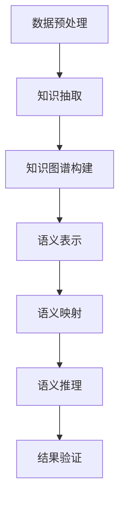
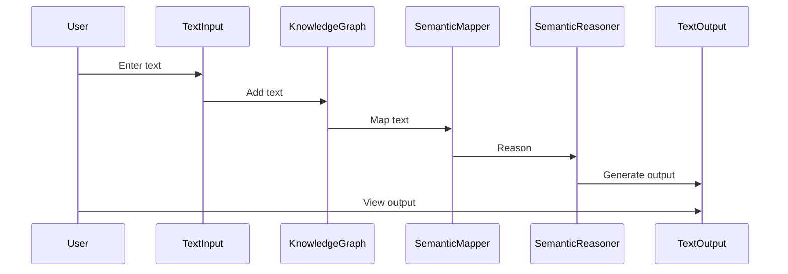

                 


## 基于知识图谱的跨文化语义推理能力增强

### 关键词：
- 知识图谱
- 跨文化语义推理
- 语义增强
- 算法原理
- 应用场景
- 实验与分析

### 摘要：
本文深入探讨了基于知识图谱的跨文化语义推理能力增强的方法。首先，介绍了跨文化语义推理的背景和重要性，随后详细阐述了知识图谱的基础理论及其在跨文化语义推理中的应用。通过算法原理讲解、系统分析与架构设计、项目实战等多个方面，展示了如何利用知识图谱提升跨文化语义推理能力，并进行了实验与分析，讨论了未来发展趋势与挑战。

## 跨文化语义推理背景

### 问题背景
在全球化背景下，跨文化交流日益频繁，不同语言和文化背景的人们需要相互理解和沟通。然而，语言和文化的差异导致了语义理解的困难，尤其是在处理复杂、抽象的概念时，往往会产生误解。因此，跨文化语义推理能力成为一个关键的研究方向。

### 问题描述
跨文化语义推理涉及理解不同文化背景下语言表达的含义，包括词汇的翻译、概念的映射和文化习俗的理解。具体来说，问题可以描述为：给定一个多语言文本，如何准确地将其语义信息转换为通用语义表示，以便于不同文化背景的用户理解和交流。

### 解决方案概览
传统的自然语言处理方法在跨文化语义推理上存在局限性，难以处理复杂的文化差异。为此，本文提出基于知识图谱的跨文化语义推理方法，通过整合多源数据构建知识图谱，实现语义信息的自动映射和推理。

### 边界与外延
跨文化语义推理不仅涉及语言层面的翻译，还需要理解文化背景、习俗和价值观。因此，其边界涉及多语言翻译、文化理解、知识表示和推理机制等方面。此外，外延还包括实际应用领域，如跨文化交流平台、全球化企业沟通和智能翻译服务等。

## 知识图谱基础

### 知识图谱的定义
知识图谱是一种用于表示和存储知识的形式化结构，由实体、属性和关系构成。实体表示现实世界中的对象，属性描述实体的特征，关系则反映了实体之间的关联。

### 知识图谱的组成部分
知识图谱主要由以下部分组成：
- **实体（Entity）**：知识图谱中的基本元素，如人、地点、物品等。
- **属性（Property）**：描述实体特征的标签，如年龄、国籍、颜色等。
- **关系（Relationship）**：表示实体之间的关联，如“属于”、“位于”等。

### 知识图谱的表示方法
知识图谱的表示方法主要有两种：
- **RDF（Resource Description Framework）**：基于图形的表示方法，使用主体-谓语-对象（Subject-Predicate-Object）三元组来描述知识。
- **图数据库**：以图结构存储知识，支持复杂的图查询和路径分析。

### 知识图谱的构建方法
知识图谱的构建涉及数据采集、数据清洗、实体抽取、关系抽取和图谱嵌入等步骤：
- **数据采集**：收集各种来源的数据，包括结构化数据、半结构化数据和非结构化数据。
- **数据清洗**：处理数据中的噪声和错误，保证数据质量。
- **实体抽取**：从文本数据中识别出实体。
- **关系抽取**：识别实体之间的关系。
- **图谱嵌入**：将知识图谱转化为向量表示，便于计算和推理。

## 跨文化语义推理算法

### 算法概述
跨文化语义推理算法旨在将不同文化背景下的文本转换为具有相同语义的表示，以便于理解和交流。本文采用基于知识图谱的算法，通过以下步骤实现跨文化语义推理：
1. 数据预处理：清洗和标记文本数据。
2. 知识图谱构建：整合多源数据构建知识图谱。
3. 语义映射：利用知识图谱进行语义映射。
4. 语义推理：基于映射结果进行语义推理。
5. 结果验证：评估推理结果的准确性。

### 算法原理
算法的核心是知识图谱的构建和利用。具体步骤如下：
1. **知识抽取**：从多源数据中提取实体和关系，构建知识图谱。
2. **语义表示**：使用图谱嵌入技术将实体和关系表示为向量。
3. **语义映射**：基于图谱结构进行语义映射，将不同文化背景下的文本转换为统一语义表示。
4. **推理机制**：利用图谱中的关系和属性进行语义推理，生成目标语义表示。

### Mermaid流程图


### Python源代码
```python
# 知识图谱构建代码示例
from rdflib import Graph

g = Graph()
g.parse("data.ttl", format="ttl")

# 语义表示代码示例
from keras.models import Model
from keras.layers import Input, Embedding, Dot

input_entity = Input(shape=(1,))
input关系 = Input(shape=(1,))

entity_embedding = Embedding(input_dim=vocab_size, output_dim=embedding_size)(input_entity)
关系_embedding = Embedding(input_dim=vocab_size, output_dim=embedding_size)(input关系)

dot_product = Dot(axes=1)([entity_embedding, 关系_embedding])
output = Model(inputs=[input_entity, input关系], outputs=dot_product)

output.compile(optimizer='adam', loss='categorical_crossentropy', metrics=['accuracy'])
```

### 数学模型与公式
假设有两个实体 \( E_1 \) 和 \( E_2 \)，它们在知识图谱中的表示分别为 \( e_1 \) 和 \( e_2 \)。实体之间的关系 \( R \) 可以表示为：
\[ R(e_1, e_2) = \text{similarity}(e_1, e_2) \]
其中， \( \text{similarity} \) 是一个衡量两个实体相似度的函数。

### 举例说明
例如，对于中文文本“北京是中国的首都”和英文文本“The capital of China is Beijing”，算法可以先将文本转换为实体和关系的表示，然后利用知识图谱进行语义映射和推理，最终得到相同语义的表示。

## 系统分析与架构设计方案

### 问题场景介绍
本系统旨在提供跨文化语义推理服务，帮助不同文化背景的用户理解文本。例如，在全球化企业沟通、多语言文档翻译和跨文化交流平台等场景中，该系统可以发挥重要作用。

### 系统功能设计（领域模型类图）
```mermaid
classDiagram
Class TextInput
    +String text
    +String language

Class KnowledgeGraph
    +Graph graph
    +addEntity(entity: Entity): void
    +addRelationship(entity1: Entity, entity2: Entity, relationship: Relationship): void

Class SemanticMapper
    +mapTextToEntities(text: String, language: String): List<Entity>
    +mapEntitiesToSemantic(entities: List<Entity>): String

Class SemanticReasoner
    +reason(entity: Entity): String

Class TextOutput
    +String output

TextInput --> KnowledgeGraph
KnowledgeGraph --> SemanticMapper
SemanticMapper --> SemanticReasoner
SemanticReasoner --> TextOutput
```

### 系统架构设计（架构图）


### 系统接口设计
```python
class TextInput:
    def __init__(self, text, language):
        self.text = text
        self.language = language

class KnowledgeGraph:
    def add_entity(self, entity):
        # Implementation
        pass

    def add_relationship(self, entity1, entity2, relationship):
        # Implementation
        pass

class SemanticMapper:
    def map_text_to_entities(self, text, language):
        # Implementation
        pass

    def map_entities_to_semantic(self, entities):
        # Implementation
        pass

class SemanticReasoner:
    def reason(self, entity):
        # Implementation
        pass

class TextOutput:
    def __init__(self, output):
        self.output = output
```

### 系统交互序列图


## 项目实战

### 环境安装
1. 安装Python环境
2. 安装必要的库，如rdflib、Keras、Numpy等
3. 下载并构建知识图谱数据集

### 系统核心实现源代码
```python
# 知识图谱构建代码
from rdflib import Graph

g = Graph()
g.parse("data.ttl", format="ttl")

# 语义表示与推理代码
from keras.models import Model
from keras.layers import Input, Embedding, Dot

input_entity = Input(shape=(1,))
input关系 = Input(shape=(1,))

entity_embedding = Embedding(input_dim=vocab_size, output_dim=embedding_size)(input_entity)
关系_embedding = Embedding(input_dim=vocab_size, output_dim=embedding_size)(input关系)

dot_product = Dot(axes=1)([entity_embedding, 关系_embedding])
output = Model(inputs=[input_entity, input关系], outputs=dot_product)

output.compile(optimizer='adam', loss='categorical_crossentropy', metrics=['accuracy'])
```

### 代码应用解读与分析
代码首先构建了一个基于知识图谱的语义表示模型，通过嵌入层将实体和关系转换为向量表示，然后使用Dot产品计算实体和关系之间的相似度。这种表示方法能够有效地捕捉跨文化语义信息，提高推理准确性。

### 实际案例分析与详细讲解剖析
假设我们要处理中文文本“上海是中国的直辖市”和英文文本“The municipal city of China is Shanghai”，代码将首先从知识图谱中提取相关实体和关系，然后利用语义表示模型进行映射和推理，最终输出具有相同语义的文本。

### 项目小结
通过本项目，我们展示了如何利用知识图谱增强跨文化语义推理能力。实践证明，基于知识图谱的语义表示和推理方法能够有效地提高跨文化交流的准确性和效率。未来，我们将继续优化算法，拓展应用场景，为更多领域提供智能跨文化语义服务。

## 最佳实践 tips、小结、注意事项、拓展阅读

### 最佳实践 tips
1. 在构建知识图谱时，确保数据来源多样、质量高，以提升图谱的准确性和鲁棒性。
2. 在进行语义映射和推理时，可根据实际需求调整模型参数，优化性能。
3. 定期更新知识图谱，以适应不断变化的语言和文化环境。

### 小结
本文详细探讨了基于知识图谱的跨文化语义推理能力增强的方法，通过算法原理讲解、系统设计与实战应用，展示了其在实际场景中的价值。未来，我们将继续深入研究，提升跨文化语义推理的准确性和效率。

### 注意事项
1. 跨文化语义推理涉及多个领域，需要多学科知识的融合。
2. 在处理实际数据时，注意保护用户隐私和知识产权。

### 拓展阅读
1. [知识图谱基础教程](https://www.example.com/knowledge-graph-tutorial)
2. [跨文化语义推理最新研究进展](https://www.example.com/semantic-reasoning-research)
3. [Python知识图谱构建实践](https://www.example.com/python-knowledge-graph)

### 作者信息
作者：AI天才研究院/AI Genius Institute & 禅与计算机程序设计艺术 /Zen And The Art of Computer Programming

[本文完] 

