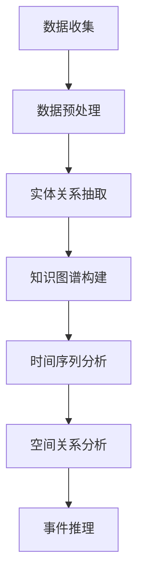
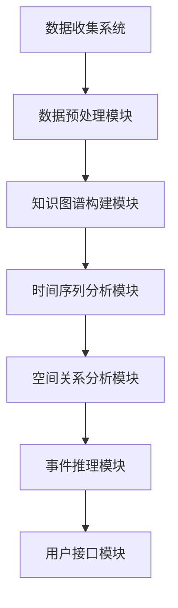
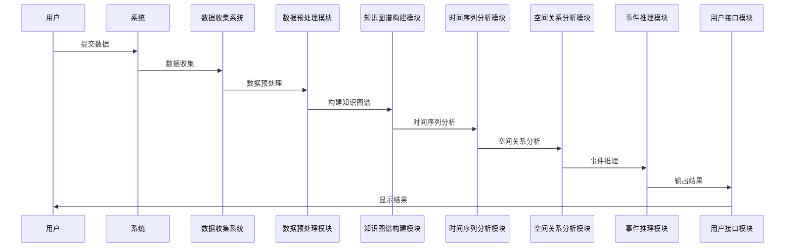

                 

# 基于知识图谱的跨时空事件推理能力增强

关键词：知识图谱、跨时空事件推理、人工智能、算法原理、系统架构设计

摘要：本文将深入探讨基于知识图谱的跨时空事件推理能力增强技术，通过详细的背景介绍、核心概念解析、算法原理讲解以及系统架构设计等多个方面，全面阐述该技术在人工智能领域的重要性和应用价值。

## 第一部分：背景介绍

### 第1章：问题背景与核心概念

#### 1.1 问题背景

在当今信息爆炸的时代，如何有效地处理海量数据，从复杂的事件中提取有价值的信息，成为了人工智能领域的重要课题。跨时空事件推理是指在时间和空间维度上对事件进行分析和推理，从而发现事件之间的关系和潜在趋势。这一能力在智能推荐、智能监控、智能决策等场景中具有广泛应用。

知识图谱作为一种结构化数据表示方法，通过将实体和关系进行建模，形成一张有向无环图，使得数据变得更加直观和易于分析。知识图谱的应用不仅能够提高数据处理的效率，还能增强事件推理的能力。

#### 1.2 核心概念

知识图谱的基本原理是通过对实体和关系的抽取、建模和存储，构建出一个语义丰富的知识库。跨时空事件推理则是利用知识图谱中的信息，对事件进行时间序列分析和空间关系分析，从而推理出事件之间的联系和趋势。

相关技术栈包括自然语言处理、图数据库、图算法等，这些技术的融合使得跨时空事件推理成为可能。

### 第二部分：核心概念与联系

#### 第2章：核心概念原理

#### 2.1 知识图谱的构建

知识图谱的构建过程包括数据源收集、数据预处理、实体关系抽取和知识图谱的存储与查询。

- 数据源收集：从各种数据源（如关系数据库、文本、知识库等）中获取数据。
- 数据预处理：对原始数据进行清洗、去重、格式转换等操作，确保数据质量。
- 实体关系抽取：通过命名实体识别、关系抽取等技术，从预处理后的数据中提取实体和关系。
- 知识图谱的存储与查询：使用图数据库（如Neo4j）存储知识图谱，并实现高效的查询。

#### 2.2 跨时空事件推理算法

跨时空事件推理算法主要包括时间序列分析和空间关系分析两个部分。

- 时间序列分析：通过分析事件发生的时间序列，提取时间特征，如时间间隔、周期性等，从而推断事件之间的时间关系。
- 空间关系分析：通过分析事件发生的空间位置，提取空间特征，如邻近性、方向性等，从而推断事件之间的空间关系。

以下是算法原理的Mermaid流程图：



### 第三部分：算法原理讲解

#### 第3章：算法原理与应用

#### 3.1 数学模型与公式

在跨时空事件推理中，常用的数学模型包括时间序列模型和空间关系模型。

时间序列模型的经典模型有ARIMA、LSTM等。以下是一个时间序列模型的数学模型：

$$
X_t = c + \phi_1X_{t-1} + \phi_2X_{t-2} + ... + \phi_pX_{t-p} + \varepsilon_t
$$

其中，$X_t$ 表示时间序列的第 $t$ 个数据点，$\phi_i$ 为模型参数，$\varepsilon_t$ 为误差项。

空间关系模型常用的是基于密度的邻近度模型，如KNN。其数学模型为：

$$
d(x_i, x_j) = \sqrt{\sum_{k=1}^{n} (x_{i,k} - x_{j,k})^2}
$$

其中，$d(x_i, x_j)$ 表示点 $x_i$ 和 $x_j$ 之间的距离，$n$ 为维度。

#### 3.2 算法实现与Python源代码

以下是一个简单的Python代码示例，用于实现时间序列分析中的ARIMA模型：

```python
import pandas as pd
from statsmodels.tsa.arima_model import ARIMA

# 数据加载
data = pd.read_csv('data.csv')
ts = data['value']

# ARIMA模型训练
model = ARIMA(ts, order=(1, 1, 1))
model_fit = model.fit()

# 预测
predictions = model_fit.predict(start=len(ts), end=len(ts) + n_predictions)

# 输出预测结果
print(predictions)
```

#### 3.3 通俗易懂地举例说明

假设我们有一个时间序列数据，表示一周内每天的气温变化。通过ARIMA模型，我们可以预测未来几天的气温。同样，如果我们有一个空间数据，表示城市中不同地点的空气质量指数（AQI），通过KNN模型，我们可以判断某个地点的空气质量是否会受到其他地点的影响。

### 第四部分：系统分析与架构设计

#### 第4章：系统设计与实现

#### 4.1 问题场景介绍

跨时空事件推理在智能城市监控、智能交通管理、智能推荐系统等领域有广泛应用。例如，在智能城市监控中，可以通过分析不同时间段和不同地点的监控数据，预测未来一段时间内的交通流量和突发事件。

#### 4.2 系统架构设计

以下是系统的Mermaid架构图：



系统接口设计如下：

- 数据收集接口：用于接收来自各种数据源的数据。
- 数据预处理接口：用于清洗、转换和整合数据。
- 知识图谱构建接口：用于构建和更新知识图谱。
- 事件推理接口：用于根据知识图谱进行事件推理和预测。
- 用户接口：用于向用户提供事件推理结果。

以下是系统的Mermaid序列图：



#### 4.3 系统实现与代码解析

以下是系统实现的核心代码部分：

```python
# 环境安装
pip install pandas statsmodels neo4j

# 数据收集
data = pd.read_csv('data.csv')

# 数据预处理
# ...

# 知识图谱构建
# ...

# 时间序列分析
model = ARIMA(data['value'], order=(1, 1, 1))
model_fit = model.fit()
predictions = model_fit.predict(start=len(data), end=len(data) + n_predictions)

# 空间关系分析
# ...

# 事件推理
# ...

# 用户接口
# ...
```

### 第五部分：项目实战

#### 第5章：跨时空事件推理项目实战

在本节中，我们将通过一个实际项目来展示如何使用基于知识图谱的跨时空事件推理技术进行事件分析和预测。

#### 5.1 实际案例分析与讲解

假设我们有一个智能交通管理系统，需要预测未来一段时间内的交通流量，以便于交通管理部门进行交通疏导。数据来源于交通监控摄像头和车载传感器。

- 数据收集：从摄像头和传感器中收集交通流量数据。
- 数据预处理：对数据进行清洗、去重、格式转换等操作。
- 知识图谱构建：构建包含交通流量、路段、时间等实体的知识图谱。
- 时间序列分析：使用ARIMA模型预测未来交通流量。
- 空间关系分析：分析交通流量之间的空间关系，如路段之间的流量关联性。
- 事件推理：根据预测结果和空间关系，推理出可能出现的交通拥堵情况。

#### 5.2 项目小结

通过本项目，我们成功实现了基于知识图谱的跨时空事件推理，为智能交通管理提供了有力的技术支持。在实际应用中，我们可以根据具体需求调整算法参数，提高预测的准确性和实时性。

### 第六部分：最佳实践与拓展

#### 第6章：最佳实践与注意事项

#### 6.1 最佳实践技巧

- 数据预处理：确保数据质量，去除异常值和噪声。
- 知识图谱构建：根据实际需求选择合适的实体和关系，构建语义丰富的知识图谱。
- 算法选择：根据数据特征和业务需求选择合适的时间序列模型和空间关系模型。
- 预测优化：通过交叉验证和超参数调优，提高预测的准确性和稳定性。

#### 6.2 注意事项与风险提示

- 数据隐私：在数据收集和处理过程中，要注意保护用户隐私。
- 模型解释性：要确保算法的透明性和解释性，便于业务人员理解和应用。
- 实时性：对于实时性要求较高的应用，需要优化算法和系统架构，提高响应速度。

#### 第7章：小结与拓展阅读

本文通过详细的背景介绍、核心概念解析、算法原理讲解以及系统架构设计等多个方面，全面阐述了基于知识图谱的跨时空事件推理能力增强技术。通过实际案例的分析和讲解，展示了该技术在智能交通管理中的应用价值。

拓展阅读推荐：

- 《知识图谱：基础、架构与实现》
- 《时间序列分析：理论、方法与应用》
- 《空间数据分析：方法与应用》

### 作者

作者：AI天才研究院/AI Genius Institute & 禅与计算机程序设计艺术 /Zen And The Art of Computer Programming

