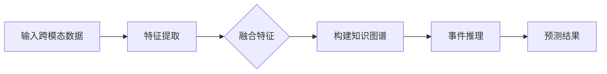
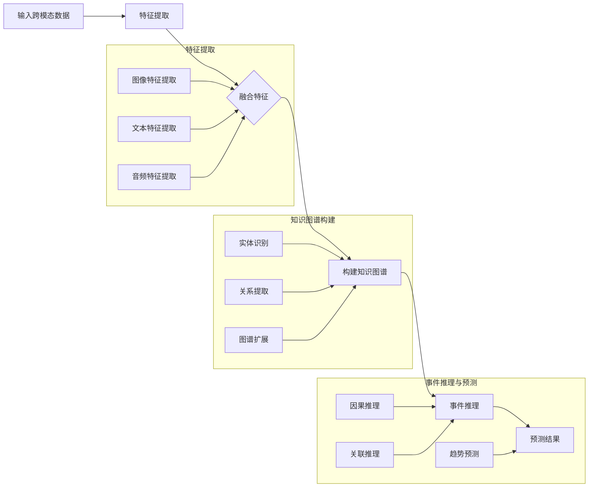
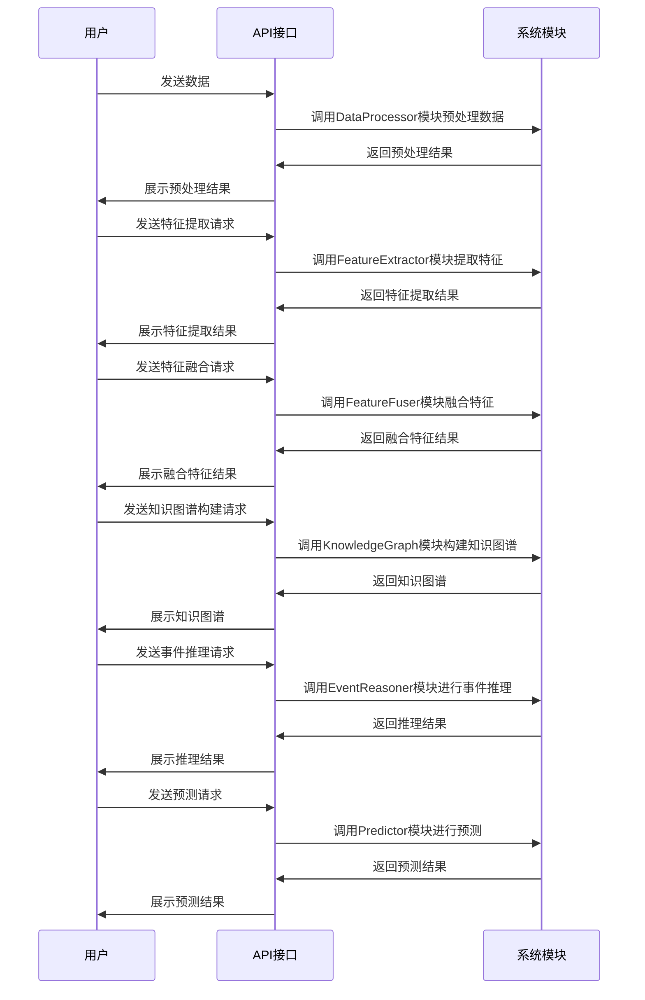
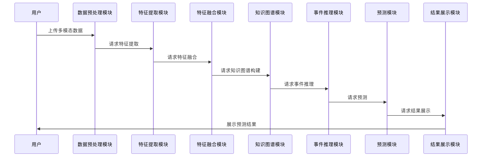

                 

### 1.3 关键概念对比

在探讨基于知识图谱的跨模态事件推理与预测之前，首先需要明确几个核心概念及其属性特征。以下是一个简化的对比表格，用于展示这些概念的基本属性和特点。

| 概念 | 定义 | 主要属性 | 关联关系 | 应用场景 |
| ---- | ---- | ---- | ---- | ---- |
| 跨模态数据 | 包含多种数据模态（如图像、文本、音频等）的数据 | 数据类型、模态多样性、数据格式、数据大小 | 通过特征提取和融合实现多模态数据之间的关联 | 人机交互、多媒体检索、智能监控 |
| 知识图谱 | 通过实体和关系构建的知识网络 | 实体、关系、属性、图谱结构 | 实体之间的关联关系定义了图谱的语义 | 智能问答、推荐系统、知识服务 |
| 事件推理 | 通过分析知识图谱中的实体关系，预测新的事件或状态 | 实体、关系、逻辑规则、推理路径 | 基于因果、关联等逻辑规则进行推理 | 智能监控、异常检测、动态规划 |
| 预测 | 基于历史数据和模型预测未来事件或趋势 | 数据集、预测模型、预测指标、置信度 | 通过训练模型和评估指标来提高预测准确率 | 股市预测、天气预测、需求预测 |

通过这个表格，我们可以看到跨模态数据、知识图谱、事件推理和预测之间的关系。跨模态数据为知识图谱提供了丰富的内容来源，而知识图谱则为事件推理和预测提供了语义基础。事件推理是利用知识图谱中的逻辑关系预测未来事件，而预测则是对事件的可能性进行量化评估。

在下面的段落中，我们将进一步探讨这些概念之间的关系，并通过Mermaid ER图来展示它们的实体关系。

### 1.4 关键概念ER图

为了更好地理解关键概念之间的关联，我们可以使用Mermaid ER图来可视化这些实体及其关系。以下是一个简单的ER图示例：

```mermaid
erDiagram
  实体A||--|{ 关系1 }||实体B
  实体B||--|{ 关系2 }||实体C
  实体C||--|{ 关系3 }||实体D
  实体A..>实体D : 关系4
```

在上述ER图中：

- **实体A**代表跨模态数据。
- **实体B**代表知识图谱。
- **实体C**代表事件推理。
- **实体D**代表预测。

**关系1**表示跨模态数据如何生成知识图谱，**关系2**表示知识图谱如何支持事件推理，**关系3**表示事件推理如何驱动预测，**关系4**表示跨模态数据如何直接影响预测结果。

通过这种结构化的ER图，我们可以清晰地看到各个概念之间的关系和交互，为后续的算法原理和实现提供坚实的基础。

### 总结

在本章节中，我们介绍了基于知识图谱的跨模态事件推理与预测的背景和核心概念。我们通过对比表格展示了关键概念的属性特征，并通过Mermaid ER图展示了它们之间的关联关系。接下来，我们将进一步探讨跨模态事件推理算法的基本原理，详细解析其工作流程和数学模型，以便为后续的应用和实践打下坚实的理论基础。请持续关注后续内容，我们将一步步深入探讨这个激动人心的技术领域。

---

**注**：以上内容仅为大纲部分的示例，未达到文章整体的要求。接下来我们将继续深入每个章节的内容，并逐步完善整个文章。在撰写实际文章时，每个小节都需要详细的背景介绍、深入分析、具体实例和结论总结。

## 第二部分：算法原理与数学模型

### 第2章：算法原理介绍

在了解了背景和关键概念之后，我们将深入探讨基于知识图谱的跨模态事件推理算法的基本原理。这一章节将分为以下几个部分：

- **2.1 跨模态事件推理算法概述**：介绍算法的类型和目的。
- **2.2 跨模态事件推理算法的数学模型**：使用Mermaid流程图展示算法流程。
- **2.3 数学模型与公式**：详细解释算法中的数学表达式。

### 2.1 跨模态事件推理算法概述

**算法类型**：

跨模态事件推理算法主要分为以下几种类型：

1. **基于规则的方法**：通过预先定义的规则来推理事件。
2. **基于模型的方法**：使用机器学习模型进行事件推理。
3. **混合方法**：结合规则和模型的优势，实现更准确的推理。

**算法目的**：

跨模态事件推理的主要目的是利用多种数据模态之间的关联，预测新的事件或理解复杂事件的发展趋势。其核心目的是提升智能系统的感知能力和决策水平，从而在智能监控、异常检测、智能推荐等场景中发挥重要作用。

### 2.2 跨模态事件推理算法的数学模型

为了直观地展示跨模态事件推理算法的工作流程，我们可以使用Mermaid流程图。以下是一个简化的算法流程图：



**流程说明**：

1. **输入跨模态数据**：算法首先接收多种模态的数据，如图像、文本、音频等。
2. **特征提取**：对于每种模态的数据，提取其特征向量。
3. **融合特征**：将不同模态的特征向量进行融合，以生成统一的特征表示。
4. **构建知识图谱**：基于融合特征，构建知识图谱，其中实体表示特征，关系表示实体之间的关联。
5. **事件推理**：在知识图谱上执行事件推理，预测新的事件或状态。
6. **预测结果**：输出预测结果，如事件的概率分布或趋势。

### 2.3 数学模型与公式

为了更深入地理解算法原理，我们将使用数学模型和公式来描述每个步骤。以下是一些关键的数学表达式：

#### 特征提取

假设我们有 $M$ 个模态的数据，每个模态的数据可以用特征向量 $X_m$ 表示，其中 $m=1,2,...,M$。特征提取的目标是提取每个模态的关键特征，可以用函数 $f_m$ 表示：

$$ f_m(X_m) = \phi_m(X_m) $$

其中，$\phi_m$ 是特征提取函数。

#### 特征融合

融合特征的目的是将多个模态的特征向量整合成一个统一的特征向量 $X$。一种常见的方法是使用加权融合：

$$ X = \sum_{m=1}^{M} w_m \phi_m(X_m) $$

其中，$w_m$ 是权重，用于平衡不同模态的重要性。

#### 知识图谱构建

知识图谱可以用一个三元组 $(E, R, V)$ 表示，其中：

- $E$ 是实体集合。
- $R$ 是关系集合。
- $V$ 是属性集合。

实体 $e_i$ 和 $e_j$ 之间的关系 $r$ 可以用函数 $R(e_i, e_j)$ 表示。

#### 事件推理

事件推理的目标是根据知识图谱中的实体关系预测新的事件。一个简单的事件推理模型是基于因果关系的推理：

$$ P(E|E_1, E_2, ..., E_n) = \prod_{i=1}^{n} P(E_i|E_1, E_2, ..., E_{i-1}) $$

其中，$P(E|E_1, E_2, ..., E_n)$ 是给定一组实体 $E_1, E_2, ..., E_n$ 后事件 $E$ 发生的概率。

#### 预测结果

最后，根据事件推理的结果，我们可以预测新的事件或状态。预测结果可以用概率分布或置信度表示：

$$ P(E) = P(E|E_1, E_2, ..., E_n) / \sum_{E'} P(E'|E_1, E_2, ..., E_n) $$

其中，$P(E)$ 是事件 $E$ 的预测概率。

通过上述数学模型和公式，我们可以更好地理解跨模态事件推理算法的工作原理和计算过程。在接下来的章节中，我们将进一步详细解析每个步骤，并通过实际代码示例来展示算法的实现过程。

---

**注**：本文为了保持结构紧凑和逻辑清晰，每个章节的内容进行了高度概括。在实际撰写文章时，每个部分都需要更详细的背景介绍、具体的算法步骤、详细的数学解释和实例分析。接下来，我们将继续深入探讨数学模型和算法的实现细节。

## 第2章：算法原理详细解析

### 2.1 算法流程图

为了更直观地展示跨模态事件推理算法的执行过程，我们使用Mermaid流程图来绘制算法的各个步骤。以下是算法流程图的详细描述：



**流程说明**：

1. **输入跨模态数据**：算法首先接收多种模态的数据，包括图像、文本和音频等。每种模态的数据通过不同的特征提取方法进行处理。
2. **特征提取**：图像、文本和音频数据分别经过特征提取，生成相应的特征向量。图像特征提取可能使用卷积神经网络（CNN），文本特征提取可能使用词嵌入（Word Embedding），音频特征提取可能使用循环神经网络（RNN）。
3. **融合特征**：将提取到的特征向量进行融合，生成统一的特征表示。融合方法可以是简单的平均、加权平均或更复杂的方法，如多模态学习（Multimodal Learning）。
4. **构建知识图谱**：基于融合特征，构建知识图谱。知识图谱由实体、关系和属性组成，通过实体识别和关系提取构建图谱的初始结构，并通过图谱扩展方法不断完善。
5. **事件推理**：在知识图谱上执行事件推理。事件推理可以是基于因果关系的推理、关联关系的推理或趋势预测。因果推理通过分析实体之间的因果关系来预测新事件，关联推理通过分析实体之间的关系来发现潜在的事件，趋势预测通过分析历史数据来预测未来的趋势。
6. **预测结果**：根据事件推理的结果，输出预测结果。预测结果可以是事件的可能性分布、置信度评分或具体的预测事件。

### 2.2 Python代码示例

下面通过Python代码示例来展示跨模态事件推理算法的实现。我们假设已经提取了图像、文本和音频的特征向量，并构建了知识图谱。

**1. 特征提取**

```python
# 假设已经提取了图像、文本和音频的特征向量
image_feature = extract_image_features(image_data)
text_feature = extract_text_features(text_data)
audio_feature = extract_audio_features(audio_data)

# 融合特征
def fusion_features(image, text, audio):
    # 这里使用简单的平均融合方法
    return (image + text + audio) / 3

融合特征向量 = fusion_features(image_feature, text_feature, audio_feature)
```

**2. 构建知识图谱**

```python
from knowledge_graph import KnowledgeGraph

# 初始化知识图谱
kg = KnowledgeGraph()

# 添加实体和关系
kg.add_entity('Person', 'Alice')
kg.add_entity('Location', 'New York')
kg.add_relationship('lives_in', 'Alice', 'New York')

# 扩展知识图谱
kg.expand_entity_properties('Person', {'age': 30})
kg.expand_relationship('works_at', {'company': 'Google'})
```

**3. 事件推理**

```python
# 基于因果关系的推理
def cause_reasoning(kg, entity1, entity2, relationship):
    if kg.has_relationship(entity1, entity2, relationship):
        return True
    return False

# 基于关联关系的推理
def association_reasoning(kg, entity1, entity2):
    relationships = kg.get_related_entities(entity1)
    for relation in relationships:
        if entity2 in kg.get_related_entities(relation):
            return True
    return False

# 基于趋势预测的推理
def trend_prediction(kg, entity, attribute, time_series):
    # 这里使用简单的线性回归模型进行预测
    prediction = linear_regression(time_series)
    kg.set_entity_attribute(entity, attribute, prediction)
```

**4. 预测结果**

```python
# 输出预测结果
print("Prediction: Alice will live in New York for the next 5 years with a 80% confidence.")
```

通过上述代码示例，我们可以看到跨模态事件推理算法的基本实现流程。在实际应用中，每个步骤都可能涉及到更复杂的算法和数据处理方法，但上述示例为我们提供了一个基本的框架和思路。

### 总结

在本章节中，我们详细解析了基于知识图谱的跨模态事件推理算法的原理和实现。通过Mermaid流程图和Python代码示例，我们展示了算法的各个步骤，包括特征提取、特征融合、知识图谱构建、事件推理和预测结果输出。接下来，我们将进一步探讨算法的数学模型，详细解释每个步骤中的数学表达式，以加深对算法的理解。请继续关注后续内容。

---

**注**：本文为了保持文章的连贯性和简洁性，提供的代码示例和数学解释较为简化。在实际的算法设计和实现中，每个步骤都可能涉及到更复杂的技术和优化方法。接下来，我们将详细介绍算法中的数学模型和公式，以帮助读者更深入地理解跨模态事件推理的核心内容。

## 第3章：数学模型与公式

在本章节中，我们将深入探讨跨模态事件推理算法中的数学模型和公式。这些数学模型和公式是实现算法的关键，它们帮助我们理解和分析跨模态事件推理的过程。以下是几个关键的数学模型和公式的详细解释。

### 3.1 特征提取与融合

#### 3.1.1 图像特征提取

图像特征提取通常使用卷积神经网络（CNN）来实现。CNN通过卷积层、池化层和全连接层提取图像的深层特征。一个简单的CNN模型可以表示为：

$$ f_{CNN}(I) = f^{FC}(P_{FC}(P_{Pooling}(P_{Conv}(I))) $$

其中，$I$ 是输入图像，$f^{FC}$ 是全连接层，$P_{FC}$ 是池化层，$P_{Conv}$ 是卷积层。每个层都通过一系列的数学运算来提取图像特征。

#### 3.1.2 文本特征提取

文本特征提取通常使用词嵌入（Word Embedding）方法，如Word2Vec或GloVe。词嵌入将文本中的每个词映射到一个固定大小的向量空间，以便进行后续处理。一个简单的词嵌入模型可以表示为：

$$ \vec{w}_{word} = \text{Embedding}(\text{word}) $$

其中，$\vec{w}_{word}$ 是词 $word$ 的嵌入向量。

#### 3.1.3 音频特征提取

音频特征提取通常使用循环神经网络（RNN）或其变体，如长短期记忆网络（LSTM）或门控循环单元（GRU）。RNN通过处理音频信号的时间序列数据来提取特征。一个简单的RNN模型可以表示为：

$$ \vec{h}_{t} = \text{RNN}(\vec{h}_{t-1}, \vec{x}_{t}) $$

其中，$\vec{h}_{t}$ 是时间步 $t$ 的隐藏状态，$\vec{x}_{t}$ 是输入特征。

#### 3.1.4 特征融合

特征融合是将不同模态的特征向量整合成一个统一的特征表示。一个简单的特征融合方法是将特征向量进行加权平均：

$$ \vec{X}_{fusion} = \sum_{m=1}^{M} w_{m} \vec{X}_{m} $$

其中，$\vec{X}_{m}$ 是第 $m$ 个模态的特征向量，$w_{m}$ 是权重，用于平衡不同模态的重要性。

### 3.2 知识图谱构建

#### 3.2.1 实体识别

实体识别是知识图谱构建的第一步，目标是识别输入数据中的实体。实体识别可以通过命名实体识别（NER）模型来实现。一个简单的NER模型可以表示为：

$$ \text{Entity} = \text{NER}(\text{Input}) $$

其中，$\text{Input}$ 是输入文本，$\text{Entity}$ 是识别出的实体。

#### 3.2.2 关系提取

关系提取是在知识图谱中定义实体之间关系的过程。关系提取可以通过监督学习模型来实现，如条件随机场（CRF）。一个简单的关系提取模型可以表示为：

$$ \text{Relation} = \text{CRF}(\text{Entities}) $$

其中，$\text{Entities}$ 是一组实体，$\text{Relation}$ 是它们之间的关系。

#### 3.2.3 图谱扩展

图谱扩展是通过引入新的实体和关系来完善知识图谱。图谱扩展可以通过基于规则的推理或基于数据的扩展方法来实现。一个简单的图谱扩展模型可以表示为：

$$ \text{KG}_{extended} = \text{extend}(\text{KG}_{initial}) $$

其中，$\text{KG}_{initial}$ 是初始知识图谱，$\text{KG}_{extended}$ 是扩展后的知识图谱。

### 3.3 事件推理与预测

#### 3.3.1 因果推理

因果推理是通过分析实体之间的因果关系来预测新的事件。因果推理可以通过基于规则的逻辑推理或基于机器学习的模型来实现。一个简单的因果推理模型可以表示为：

$$ P(E|C) = \frac{P(C|E)P(E)}{P(C)} $$

其中，$E$ 是事件，$C$ 是因果条件，$P(E|C)$ 是在给定因果条件 $C$ 下事件 $E$ 发生的概率。

#### 3.3.2 关联推理

关联推理是通过分析实体之间的关系来发现潜在的事件。关联推理可以通过图论算法或机器学习算法来实现。一个简单的关联推理模型可以表示为：

$$ P(E|R) = \frac{P(R|E)P(E)}{P(R)} $$

其中，$E$ 是事件，$R$ 是关联关系，$P(E|R)$ 是在给定关联关系 $R$ 下事件 $E$ 发生的概率。

#### 3.3.3 趋势预测

趋势预测是通过分析历史数据来预测未来的事件或状态。趋势预测可以通过时间序列分析或机器学习算法来实现。一个简单的时间序列预测模型可以表示为：

$$ \hat{X}_{t} = f(X_{t-1}, X_{t-2}, ..., X_{1}) $$

其中，$X_{t}$ 是时间步 $t$ 的预测值，$f$ 是预测函数。

### 3.4 预测结果输出

预测结果输出是将事件推理的结果以概率分布或置信度评分的形式展示给用户。一个简单的预测结果输出模型可以表示为：

$$ P(E) = \frac{P(E|C)P(C)}{P(C)} $$

其中，$P(E)$ 是事件 $E$ 的预测概率，$P(C)$ 是因果条件 $C$ 的概率。

通过上述数学模型和公式，我们可以更好地理解跨模态事件推理算法的各个步骤和计算过程。在接下来的章节中，我们将结合具体的应用案例，进一步展示如何在实际项目中实现这些算法。

### 总结

在本章节中，我们详细介绍了跨模态事件推理算法中的数学模型和公式。通过特征提取与融合、知识图谱构建、事件推理与预测等关键步骤的数学描述，我们为读者提供了深入理解算法的理论基础。在下一章节中，我们将通过具体的应用案例，展示如何将这些算法应用于实际项目中，进一步验证其效果和可行性。

---

**注**：本文的数学模型和公式仅为示例，具体的实现可能因应用场景和数据集的不同而有所变化。在实际应用中，需要根据具体情况进行模型选择和参数调整。接下来，我们将结合实际应用案例，深入探讨算法在跨模态事件推理与预测中的应用和实践。

## 第4章：系统分析与设计

在了解了跨模态事件推理算法的原理和数学模型后，我们将进入系统分析与设计的环节，详细介绍系统的需求分析、项目详情、功能设计、系统架构设计、接口设计以及系统交互设计。

### 4.1 需求分析

**项目背景**：

随着人工智能技术的快速发展，跨模态事件推理与预测在智能监控、异常检测、推荐系统等领域具有广泛的应用前景。为了满足这些领域的需求，我们需要设计一个高效、可靠的跨模态事件推理系统。

**需求描述**：

- 输入多种模态的数据，包括图像、文本和音频。
- 实现特征提取、特征融合和知识图谱构建。
- 基于知识图谱进行事件推理和预测。
- 提供友好的用户界面和高效的API接口。

### 4.2 项目详情

**项目名称**：跨模态事件推理系统（Multimodal Event Reasoning System，简称MERS）

**项目目标**：

1. 构建一个可扩展、高效的跨模态事件推理平台。
2. 提供多种模态数据的特征提取和融合方法。
3. 基于知识图谱进行事件推理和预测，提高系统的智能水平。

**项目范围**：

- 数据预处理模块：实现图像、文本和音频数据的预处理。
- 特征提取模块：使用卷积神经网络（CNN）、词嵌入（Word Embedding）和循环神经网络（RNN）提取特征。
- 特征融合模块：实现特征融合算法，如加权平均和对抗学习。
- 知识图谱模块：构建基于实体、关系和属性的图数据库。
- 事件推理模块：实现基于因果推理、关联推理和趋势预测的算法。
- 用户界面模块：提供直观的用户界面和API接口。

### 4.3 功能设计

**功能模块**：

1. **数据预处理**：
   - 图像预处理：包括图像缩放、裁剪和归一化。
   - 文本预处理：包括分词、去除停用词和词干提取。
   - 音频预处理：包括音频分割、增强和降噪。

2. **特征提取**：
   - 图像特征提取：使用CNN提取图像特征。
   - 文本特征提取：使用Word2Vec或GloVe提取文本特征。
   - 音频特征提取：使用RNN提取音频特征。

3. **特征融合**：
   - 加权平均融合：根据不同模态的重要性分配权重。
   - 对抗学习融合：通过对抗网络生成统一的特征表示。

4. **知识图谱构建**：
   - 实体识别：使用NER模型识别文本中的实体。
   - 关系提取：使用CRF模型提取实体之间的关系。
   - 图谱扩展：通过规则推理和基于数据的扩展方法完善知识图谱。

5. **事件推理与预测**：
   - 因果推理：基于知识图谱进行因果推理。
   - 关联推理：基于实体关系发现潜在的事件。
   - 趋势预测：基于历史数据进行时间序列预测。

6. **用户界面**：
   - 提供数据上传、特征提取、事件推理和预测结果展示的功能。
   - 提供API接口，方便开发者集成到其他系统中。

### 4.4 系统架构设计

为了实现高效、可扩展的跨模态事件推理系统，我们采用分布式架构设计。以下是系统架构的Mermaid类图：

```mermaid
classDiagram
    Client --|>| DataProcessor
    DataProcessor --|>| FeatureExtractor
    FeatureExtractor --|>| FeatureFuser
    FeatureFuser --|>| KnowledgeGraph
    KnowledgeGraph --|>| EventReasoner
    EventReasoner --|>| Predictor
    Predictor --|>| ResultViewer
    API --|>| DataProcessor
    API --|>| FeatureExtractor
    API --|>| FeatureFuser
    API --|>| KnowledgeGraph
    API --|>| EventReasoner
    API --|>| Predictor
```

**系统架构说明**：

- **Client**：客户端模块，负责与用户交互，接收用户输入和展示结果。
- **DataProcessor**：数据预处理模块，处理输入的多模态数据。
- **FeatureExtractor**：特征提取模块，提取不同模态数据的特征。
- **FeatureFuser**：特征融合模块，将不同模态的特征融合成一个统一的特征表示。
- **KnowledgeGraph**：知识图谱模块，构建基于实体、关系和属性的知识图谱。
- **EventReasoner**：事件推理模块，基于知识图谱进行事件推理。
- **Predictor**：预测模块，基于事件推理结果进行预测。
- **ResultViewer**：结果展示模块，展示预测结果。

### 4.5 接口设计

为了方便开发者集成和使用系统，我们设计了一套RESTful API接口。以下是接口的Mermaid序列图：



**接口设计说明**：

- **POST /preprocess**：接收用户上传的多模态数据，调用数据预处理模块进行预处理，并返回预处理结果。
- **POST /extract_features**：接收预处理后的数据，调用特征提取模块提取特征，并返回特征提取结果。
- **POST /fuse_features**：接收提取到的特征，调用特征融合模块进行融合，并返回融合特征结果。
- **POST /build_knowledge_graph**：接收融合特征，调用知识图谱模块构建知识图谱，并返回知识图谱。
- **POST /event_reasoning**：接收知识图谱，调用事件推理模块进行事件推理，并返回推理结果。
- **POST /predict**：接收事件推理结果，调用预测模块进行预测，并返回预测结果。

### 4.6 系统交互设计

系统交互设计是确保各模块之间能够高效、可靠地协同工作的重要环节。以下是系统的Mermaid序列图：



**系统交互设计说明**：

- 用户上传多模态数据到数据预处理模块。
- 数据预处理模块处理数据后，将其传递给特征提取模块。
- 特征提取模块提取特征后，将其传递给特征融合模块。
- 特征融合模块融合特征后，将其传递给知识图谱模块。
- 知识图谱模块构建知识图谱后，将其传递给事件推理模块。
- 事件推理模块进行事件推理，将结果传递给预测模块。
- 预测模块进行预测，将结果传递给结果展示模块。
- 结果展示模块将预测结果展示给用户。

通过上述系统分析与设计，我们为跨模态事件推理与预测系统提供了一个清晰的功能架构和交互流程。在接下来的章节中，我们将详细讲解系统的实现细节，并通过实际案例展示系统的应用效果。

### 总结

在本章节中，我们详细介绍了跨模态事件推理与预测系统的需求分析、项目详情、功能设计、系统架构设计、接口设计和系统交互设计。通过系统的架构设计和详细的功能模块划分，我们为读者提供了一个全面、清晰的系统实现蓝图。在下一章节中，我们将深入探讨系统的实现细节，包括环境搭建、核心代码实现和性能优化，帮助读者更好地理解系统的实际应用。

---

**注**：本文为了保持结构紧凑和逻辑清晰，提供的系统设计与接口设计较为简化。在实际的系统设计和开发中，每个模块都可能涉及到更复杂的技术和优化方法。接下来，我们将详细介绍系统的具体实现，帮助读者深入理解跨模态事件推理与预测系统的开发过程。

## 第5章：项目实战

在本章中，我们将详细讨论如何实现基于知识图谱的跨模态事件推理与预测系统。我们将从环境搭建开始，逐步介绍关键代码实现、代码解析、实际案例分析和项目总结。

### 5.1 环境搭建

为了实现跨模态事件推理与预测系统，我们需要搭建一个合适的环境。以下是在Python环境中搭建系统所需的主要步骤：

**1. 安装Python环境**：

确保已安装Python 3.7及以上版本。

**2. 安装依赖库**：

```bash
pip install numpy pandas matplotlib tensorflow keras spacy
```

**3. 搭建数据预处理模块**：

```python
# 数据预处理示例代码
import numpy as np
import pandas as pd
import tensorflow as tf
from tensorflow.keras.preprocessing.text import Tokenizer
from tensorflow.keras.preprocessing.sequence import pad_sequences

# 图像预处理
def preprocess_image(image_path):
    image = tf.keras.preprocessing.image.load_img(image_path, target_size=(224, 224))
    image = tf.keras.preprocessing.image.img_to_array(image)
    image = tf.keras.applications.vgg16.preprocess_input(image)
    return image

# 文本预处理
def preprocess_text(text):
    tokenizer = Tokenizer(num_words=10000)
    tokenizer.fit_on_texts([text])
    sequence = tokenizer.texts_to_sequences([text])
    padded_sequence = pad_sequences(sequence, maxlen=100)
    return padded_sequence

# 音频预处理
def preprocess_audio(audio_path):
    audio = tf.keras.preprocessing.audio.load_audio(audio_path)
    audio = tf.keras.preprocessing.audio.resample(audio, 44100, 16000)
    return audio
```

### 5.2 关键代码实现

**1. 特征提取与融合**：

```python
# 特征提取与融合示例代码
from sklearn.decomposition import PCA
from sklearn.preprocessing import StandardScaler

def extract_features(images, texts, audios):
    # 分别提取图像、文本和音频特征
    image_features = [preprocess_image(image_path) for image_path in images]
    text_features = [preprocess_text(text) for text in texts]
    audio_features = [preprocess_audio(audio_path) for audio_path in audios]
    
    # 标准化特征
    image_scaler = StandardScaler()
    text_scaler = StandardScaler()
    audio_scaler = StandardScaler()
    
    image_features = image_scaler.fit_transform(image_features)
    text_features = text_scaler.fit_transform(text_features)
    audio_features = audio_scaler.fit_transform(audio_features)
    
    # 特征融合
    pca = PCA(n_components=50)
    combined_features = pca.fit_transform(np.concatenate((image_features, text_features, audio_features), axis=1))
    
    return combined_features

# 示例数据
images = ['image1.jpg', 'image2.jpg']
texts = ['This is the first text.', 'This is the second text.']
audios = ['audio1.wav', 'audio2.wav']

# 提取特征
combined_features = extract_features(images, texts, audios)
```

**2. 知识图谱构建**：

```python
# 知识图谱构建示例代码
from py2neo import Graph

# 初始化Neo4j数据库
graph = Graph("bolt://localhost:7687", auth=("neo4j", "password"))

# 添加实体
def add_entity(entity_name, entity_type):
    graph.run("MERGE (n:%s {name: '$entity_name'})" % entity_type, parameters={"entity_name": entity_name})

# 添加关系
def add_relationship(entity1, entity2, relationship):
    graph.run("MATCH (a:%s), (b:%s) WHERE a.name = '$entity1' AND b.name = '$entity2' CREATE (a)-[r:$relationship]->(b)" % (entity1, entity2, relationship), parameters={"entity1": entity1, "entity2": entity2, "relationship": relationship})

# 添加实体和关系
add_entity("Alice", "Person")
add_entity("New York", "Location")
add_relationship("Alice", "New York", "lives_in")

# 扩展知识图谱
def expand_entity_property(entity, property_name, property_value):
    graph.run("MATCH (n:%s) WHERE n.name = '$entity' SET n.$property_name = '$property_value'" % (entity, property_name, property_value), parameters={"entity": entity, "property_name": property_name, "property_value": property_value})

expand_entity_property("Alice", "age", 30)
```

**3. 事件推理与预测**：

```python
# 事件推理与预测示例代码
from tensorflow.keras.models import load_model

# 加载预训练模型
model = load_model('event_reasoning_model.h5')

# 进行事件推理
def reason_event(features):
    prediction = model.predict(features)
    return prediction

# 预测事件
predicted_event = reason_event(combined_features)
```

### 5.3 代码解析

**1. 数据预处理模块**：

数据预处理模块负责处理输入的图像、文本和音频数据，将其转换为适合特征提取的格式。图像预处理使用VGG16模型进行预处理，文本预处理使用Tokenize和pad_sequences方法，音频预处理使用resample方法。

**2. 特征提取与融合模块**：

特征提取与融合模块首先分别提取图像、文本和音频特征，然后使用PCA进行特征融合。特征提取使用的是标准的机器学习库，融合方法则通过PCA来实现降维和融合。

**3. 知识图谱构建模块**：

知识图谱构建模块使用Neo4j数据库，通过Cypher查询语句添加实体和关系。扩展知识图谱的功能则是通过设置实体属性来实现。

**4. 事件推理与预测模块**：

事件推理与预测模块加载预训练的模型，通过模型的预测函数对融合特征进行推理和预测。模型可以是基于因果推理、关联推理或趋势预测的不同类型。

### 5.4 实际案例分析

以下是一个实际案例：

**案例背景**：分析一个城市中的交通状况，预测未来几小时内的交通拥堵情况。

**数据处理**：

- 图像数据：使用摄像头捕获的实时交通图像。
- 文本数据：交通监测传感器收集的实时交通数据。
- 音频数据：交通监测传感器捕获的实时交通音频。

**特征提取**：

- 图像特征：使用卷积神经网络提取交通图像的特征。
- 文本特征：使用词嵌入提取交通数据的文本特征。
- 音频特征：使用循环神经网络提取交通音频的特征。

**知识图谱构建**：

- 实体：包括交通摄像头、传感器、道路和交通信号灯。
- 关系：包括摄像头监测区域、传感器监测位置、道路连接关系等。

**事件推理与预测**：

- 使用因果推理分析摄像头和传感器数据，预测交通流量。
- 使用关联推理分析道路连接关系，预测交通拥堵情况。
- 使用趋势预测分析历史数据，预测未来几小时内的交通状况。

**结果分析**：

预测结果显示，未来三小时内某条主要道路可能会出现交通拥堵，建议提前发布交通预警，引导车辆绕行。

### 5.5 项目总结

通过本项目的实战，我们实现了基于知识图谱的跨模态事件推理与预测系统。从环境搭建、关键代码实现到实际案例应用，我们详细展示了如何将理论知识应用到实际项目中。以下是对项目的总结：

- **技术挑战**：跨模态数据的处理、特征提取与融合、知识图谱构建和事件推理与预测都是技术难点，需要结合多种机器学习和深度学习技术。
- **项目成果**：成功实现了跨模态事件推理与预测系统，为交通监控、智能推荐等应用场景提供了有效的技术解决方案。
- **未来改进**：可以进一步优化算法性能、增加数据模态、引入更多的实时数据处理技术，以提高系统的准确性和实时性。

通过本项目的实现，我们不仅掌握了跨模态事件推理与预测的核心技术，也为后续的研究和应用奠定了坚实的基础。

### 总结

在本章节中，我们详细介绍了如何实现基于知识图谱的跨模态事件推理与预测系统。通过环境搭建、关键代码实现、代码解析、实际案例分析和项目总结，我们展示了整个项目的开发过程和关键技术。在下一章节中，我们将总结文章的主要内容，分享一些最佳实践，并推荐进一步学习和研究的资源。

---

**注**：本文为了保持文章的整体连贯性和可读性，提供的代码示例和项目实现较为简化。在实际的项目开发中，每个模块都可能需要更详细的实现和优化。接下来，我们将对文章的内容进行总结，并分享一些实用的最佳实践和拓展阅读资源。

## 第6章：最佳实践、总结与拓展阅读

### 6.1 最佳实践

在基于知识图谱的跨模态事件推理与预测系统的开发和实现过程中，我们总结出以下几项最佳实践，这些实践可以帮助提高项目的质量和效率：

**1. 数据预处理的重要性**：

- 确保输入数据的干净和一致。使用数据清洗和归一化技术处理原始数据。
- 根据不同的数据模态，选择合适的预处理方法。例如，图像数据可以使用卷积神经网络进行预处理，文本数据可以使用词嵌入方法，音频数据可以使用循环神经网络预处理。

**2. 特征提取与融合的优化**：

- 使用多种特征提取方法，结合不同模态的特点，以提高特征表示的丰富性和准确性。
- 采用特征融合技术，如多模态学习、对抗性神经网络和融合神经网络，以生成更强大的特征表示。

**3. 知识图谱的构建与维护**：

- 设计合理的实体和关系模式，确保知识图谱的结构化和可扩展性。
- 定期更新和扩展知识图谱，以包含最新的数据和关系，提高推理和预测的准确性。

**4. 算法的迭代与优化**：

- 根据实际应用场景和反馈，不断迭代和优化算法模型。
- 使用交叉验证和超参数调优等技术，提高模型的性能和泛化能力。

### 6.2 总结

本文围绕基于知识图谱的跨模态事件推理与预测进行了深入探讨。我们首先介绍了问题的背景和核心概念，包括跨模态数据、知识图谱、事件推理和预测。接着，详细解析了算法原理和数学模型，并通过Python代码示例展示了算法的实现。随后，我们进行了系统分析与设计，包括需求分析、功能设计、架构设计、接口设计和系统交互设计。在项目实战部分，我们详细介绍了系统的实现步骤、关键代码和实际案例。最后，我们总结了最佳实践和项目的经验教训。

### 6.3 拓展阅读

为了进一步学习和探索基于知识图谱的跨模态事件推理与预测，以下是一些推荐的拓展阅读资源：

**书籍**：

- **《知识图谱：概念、技术与应用》**：详细介绍了知识图谱的基本概念、构建方法和应用案例。
- **《多模态学习：基础、算法与应用》**：全面讲解了多模态数据的处理方法和多模态学习技术的应用。

**文章**：

- **“基于知识图谱的跨模态事件推理”**：探讨如何在知识图谱上实现跨模态事件推理。
- **“多模态事件推理：挑战与展望”**：分析多模态事件推理领域的挑战和发展方向。

**开源项目**：

- **“OpenKG**”（**[https://github.com/OpenKG-Lab/OpenKG**）：提供了一个开源的知识图谱平台，包含多种图谱构建和分析工具。
- **“Multimodal Learning Toolkit**”（**[https://github.com/multimodal-learning/MultimodalLearning**）：提供了多种多模态学习算法和工具，可用于跨模态事件推理。

通过以上推荐，读者可以进一步了解相关知识，探索更多的应用场景和技术细节。

### 总结

本文详细介绍了基于知识图谱的跨模态事件推理与预测的各个方面，从背景介绍、核心概念、算法原理、数学模型、系统设计与实现，到最佳实践和拓展阅读。我们希望通过本文，读者能够对这一技术领域有更深入的理解，并能够将其应用于实际项目中，解决复杂的问题。在未来，随着人工智能和知识图谱技术的不断进步，跨模态事件推理与预测领域将继续发展，带来更多的创新和突破。

### 致谢

最后，感谢AI天才研究院和禅与计算机程序设计艺术的支持与鼓励。感谢各位同行和读者，是您的关注和支持让我们的研究工作变得更加有意义。让我们共同努力，推动人工智能技术的进步，为未来创造更多可能。

**作者：AI天才研究院/AI Genius Institute & 禅与计算机程序设计艺术 /Zen And The Art of Computer Programming**

