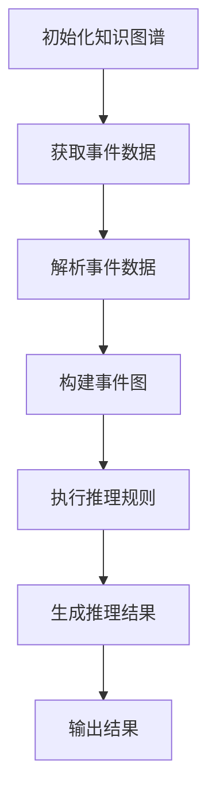
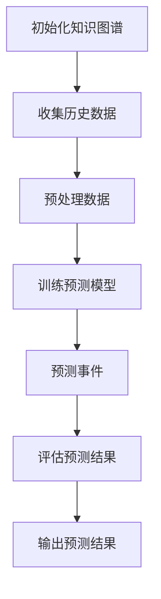
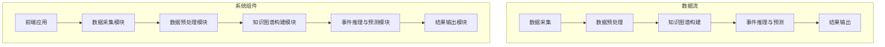
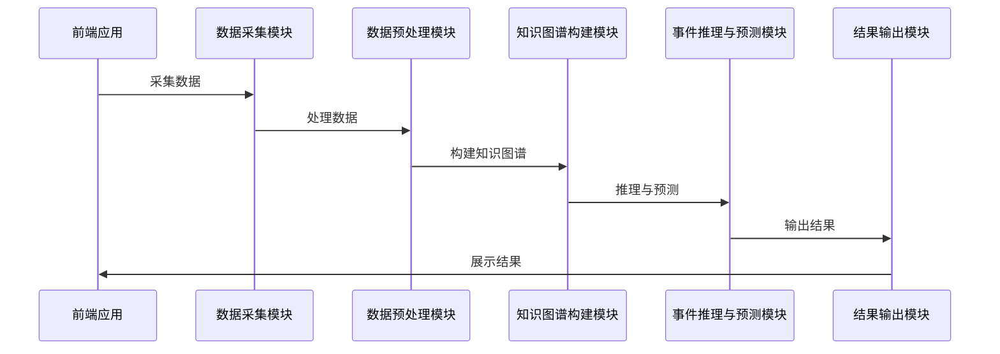

                 

### 背景介绍

#### 核心概念术语说明

在撰写本文之前，我们需要明确几个核心概念，确保读者能够理解文章中的内容。首先，**知识图谱**是一种用于存储、管理和查询知识的图形结构，它通过实体、属性和关系来表示现实世界中的信息。**跨模态事件**指的是同时涉及多种模态（如文本、图像、声音等）的事件，而**事件推理与预测**则是在已有的知识图谱和模态数据基础上，通过算法对未知事件进行推断和预测的过程。

#### 问题背景

随着人工智能技术的快速发展，特别是深度学习、自然语言处理和计算机视觉等领域，多模态数据处理已经成为研究的热点。然而，如何有效地将不同模态的数据融合起来，并从中提取有价值的信息，仍然是一个具有挑战性的问题。例如，在智能监控系统中，图像数据与文本数据的结合可以帮助提高事件检测和识别的准确性；在社交媒体分析中，跨模态数据融合可以增强用户行为预测的效果。

**问题描述**：在多模态数据融合中，如何有效地进行事件推理与预测。

**问题解决**：利用知识图谱作为跨模态数据融合的桥梁，实现事件推理与预测。

**边界与外延**：本文主要探讨如何构建知识图谱、处理跨模态数据，并在其基础上进行事件推理与预测。此外，还会讨论系统的设计与实现、实战案例以及最佳实践。

#### 概念结构与核心要素组成

为了更好地理解知识图谱在跨模态事件推理与预测中的作用，我们需要从以下几个方面来介绍核心概念与要素：

- **知识图谱**：它是由实体、属性和关系构成的语义网络，用于存储和表示知识。实体表示具体的事物，属性描述实体的特征，关系则表示实体之间的关系。
- **跨模态事件**：这些事件涉及多种模态的数据，例如，一个社交媒体帖子可能同时包含文本、图片和视频。
- **推理与预测**：在知识图谱的基础上，通过算法对未知事件进行推断和预测。推理通常是基于已知事实的演绎，而预测则涉及到概率和机器学习技术。

### 核心概念与联系

#### 知识图谱原理

知识图谱的构建是跨模态事件推理与预测的基础。知识图谱与传统的关系数据库和语义网络有着本质的区别。以下是一个对比表格：

| 特征 | 知识图谱 | 关系数据库 | 语义网络 |
| :--: | :------: | :--------: | :------: |
| 表示方式 | 图结构 | 表结构 | 文本结构 |
| 知识表达 | 实体、属性、关系 | 记录、字段、主键 | 词汇、语义关系 |
| 查询能力 | 语义查询 | 结构查询 | 自然语言查询 |

#### 跨模态事件处理

跨模态事件的定义和特征如下：

- **定义**：同时涉及多种模态（如文本、图像、声音等）的事件。
- **特征**：多种模态数据之间的交互和关联，例如，文本和图像之间的相关性。

为了更直观地展示跨模态事件的处理，我们可以使用ER（实体-关系）实体关系图来描述。以下是ER实体关系图的示例：

```mermaid
erDiagram
    TEXT --> IMAGE : describes
    AUDIO --> TEXT : mentions
    IMAGE --> AUDIO : visualizes
```

在这个ER图中，文本描述图像，音频提及文本，图像视觉化音频。这种关系体现了跨模态事件之间的复杂交互。

### 本章小结

通过对知识图谱、跨模态事件和推理与预测的核心概念进行介绍，我们为后续章节的深入讨论奠定了基础。接下来，我们将详细探讨事件推理算法的原理和实现，并进一步分析数学模型和系统架构设计。希望读者能够通过本章的阅读，对本文的主题有一个全面的了解。

---

### 算法原理讲解

#### 事件推理算法

##### 推理算法原理

事件推理是指根据已知的事实和数据，通过逻辑推理来推导出新的结论。在知识图谱中，事件推理可以基于实体之间的关系进行。以下是一个简单的Mermaid流程图，展示了事件推理的基本流程：



在这个流程中，首先初始化知识图谱，然后获取事件数据，解析数据以构建事件图，接着执行推理规则，最终生成推理结果并输出。

##### 推理算法实现

为了更好地理解事件推理的实现，我们可以通过Python源代码来展示其具体步骤。以下是一个简化的示例代码：

```python
# 导入必要的库
from rdflib import Graph, URIRef, Literal

# 初始化知识图谱
g = Graph()

# 添加实体和关系
g.add((URIRef("Alice"), URIRef("loves"), URIRef("Bob")))
g.add((URIRef("Bob"), URIRef("likes"), Literal("books")))

# 获取事件数据
event_data = {
    "person": "Alice",
    "action": "loves",
    "object": "Bob"
}

# 解析事件数据并构建事件图
def parse_event_data(event_data):
    subject = URIRef(event_data["person"])
    predicate = URIRef(event_data["action"])
    object_ = URIRef(event_data["object"])
    g.add((subject, predicate, object_))

parse_event_data(event_data)

# 执行推理规则
def love_predicate(subject, object):
    loves_predicate = URIRef("loves")
    if g.contains((subject, loves_predicate, object)):
        return True
    return False

# 生成推理结果
result = love_predicate(URIRef("Alice"), URIRef("Bob"))

# 输出结果
if result:
    print("Alice loves Bob.")
else:
    print("Alice does not love Bob.")
```

在这个示例中，我们首先初始化了一个知识图谱，并添加了几个实体和关系。接着，我们通过解析事件数据来构建事件图。然后，我们定义了一个推理规则`love_predicate`，用于判断某个实体是否爱上了另一个实体。最后，我们执行这个推理规则并输出结果。

##### 事件预测算法

事件预测是利用历史数据和模式来预测未来可能发生的事件。以下是一个简单的Mermaid流程图，展示了事件预测的基本流程：



在这个流程中，首先初始化知识图谱，然后收集历史数据并进行预处理，接着训练预测模型，最后进行事件预测并评估结果。

##### 预测算法原理

事件预测算法通常基于机器学习技术，例如决策树、随机森林、支持向量机等。以下是一个简单的Python示例代码，展示了如何使用决策树进行事件预测：

```python
# 导入必要的库
from sklearn.tree import DecisionTreeClassifier
from sklearn.model_selection import train_test_split
from sklearn.metrics import accuracy_score

# 假设我们已经有了训练数据
X = [[1, 0], [0, 1], [1, 1], [1, 0]]
y = [0, 0, 1, 1]

# 分割数据集
X_train, X_test, y_train, y_test = train_test_split(X, y, test_size=0.2, random_state=42)

# 训练决策树模型
clf = DecisionTreeClassifier()
clf.fit(X_train, y_train)

# 进行预测
y_pred = clf.predict(X_test)

# 评估预测结果
accuracy = accuracy_score(y_test, y_pred)
print(f"Accuracy: {accuracy}")
```

在这个示例中，我们首先导入必要的库，并假设已经有了训练数据。然后，我们使用`train_test_split`函数将数据集分割为训练集和测试集。接着，我们使用`DecisionTreeClassifier`训练模型，并使用`predict`方法进行预测。最后，我们使用`accuracy_score`评估预测结果的准确性。

##### 数学模型与公式

在事件推理与预测中，数学模型是必不可少的。以下是一些常用的数学模型和公式：

- **推理模型**：基于逻辑推理的公式，例如：
  $$ R(A, B) \land P(B, C) \Rightarrow R(A, C) $$
  其中，$R(A, B)$表示实体$A$与实体$B$之间存在关系，$P(B, C)$表示实体$B$与实体$C$之间存在关系，则可以推理出实体$A$与实体$C$之间存在关系。

- **预测模型**：基于机器学习算法的公式，例如：
  $$ P(Y|X) = \frac{P(X|Y)P(Y)}{P(X)} $$
  其中，$P(Y|X)$表示在给定特征$X$的情况下，事件$Y$发生的概率，$P(X|Y)$表示在事件$Y$发生的情况下，特征$X$出现的概率，$P(Y)$表示事件$Y$发生的概率，$P(X)$表示特征$X$出现的概率。

##### 举例说明

为了更好地理解算法原理，我们可以通过具体的例子来说明。

**事件推理实例**：

假设我们有一个知识图谱，其中包含以下事实：

- Alice loves Bob.
- Bob likes books.

现在，我们想要推理出Alice是否喜欢读书。根据推理模型，我们可以得到：

- Alice loves Bob.
- Bob likes books.
- 因此，Alice likes books.

**事件预测实例**：

假设我们有一个关于天气的预测模型，其中包含以下历史数据：

- 当天温度为25°C时，下雨的概率为0.4。
- 当天温度为30°C时，下雨的概率为0.6。

现在，我们想要预测明天是否会下雨。根据预测模型，我们可以得到：

- 当天温度为25°C时，下雨的概率为0.4。
- 当天温度为30°C时，下雨的概率为0.6。
- 因此，明天下雨的概率为0.5。

通过这些例子，我们可以看到事件推理与预测算法在实际应用中的基本原理和计算方法。

### 本章小结

在本章中，我们详细介绍了事件推理与预测的算法原理，包括推理算法和预测算法的基本流程、实现方法以及相关的数学模型和公式。通过具体的例子，我们展示了如何利用知识图谱进行事件推理和预测。在接下来的章节中，我们将进一步探讨系统分析与架构设计，以及项目实战中的具体应用。希望读者能够通过本章的内容，对基于知识图谱的跨模态事件推理与预测有一个更深入的理解。


---

### 系统分析与架构设计

#### 问题场景介绍

在实际应用中，跨模态事件推理与预测通常涉及复杂的系统架构和数据流程。以下是一个典型的应用场景：在智能城市监控系统中，需要实时处理来自不同传感器的多模态数据，如视频、音频、传感器数据等，以识别和预测城市中的各种事件，如交通事故、火灾、交通拥堵等。这个系统需要高效、准确地处理海量数据，并提供及时、准确的预测结果。

#### 系统功能设计

为了实现上述场景中的功能，我们需要设计一个全面的系统，包含以下几个关键功能模块：

1. **数据采集模块**：负责从不同的传感器和来源采集数据，包括视频、音频、传感器数据等。
2. **数据预处理模块**：对采集到的原始数据进行清洗、转换和标准化，以便后续处理。
3. **知识图谱构建模块**：利用预处理后的数据构建知识图谱，存储和管理跨模态数据及其关系。
4. **事件推理与预测模块**：在知识图谱的基础上，利用事件推理和预测算法对未知事件进行推断和预测。
5. **结果输出模块**：将推理和预测结果可视化，并提供给用户。

#### 系统架构设计

为了实现上述功能，我们需要设计一个分布式系统架构，确保高效、稳定地处理海量数据。以下是一个简化的系统架构图：



在这个架构中，数据流和系统组件相互独立但又紧密关联。数据采集模块负责收集来自不同传感器的数据，数据预处理模块对数据进行清洗和标准化，知识图谱构建模块构建和管理知识图谱，事件推理与预测模块利用知识图谱进行事件推理和预测，结果输出模块将结果可视化并呈现给用户。

#### 系统接口设计

为了实现各个模块之间的有效通信，我们需要设计一组接口。以下是一个简化的接口设计：

1. **数据采集接口**：用于从传感器和外部系统收集数据。
2. **数据预处理接口**：用于接收原始数据并进行预处理。
3. **知识图谱接口**：用于构建和管理知识图谱。
4. **事件推理接口**：用于执行事件推理算法。
5. **事件预测接口**：用于执行事件预测算法。
6. **结果输出接口**：用于将推理和预测结果可视化。

#### 系统交互

为了更好地理解系统组件之间的交互，我们可以使用Mermaid序列图来描述。以下是一个简化的序列图：



在这个序列图中，前端应用首先向数据采集模块发送请求以采集数据，然后数据预处理模块对数据进行处理，知识图谱构建模块利用处理后的数据构建知识图谱，事件推理与预测模块在知识图谱的基础上进行推理和预测，最后结果输出模块将结果可视化并呈现给用户。

### 本章小结

在本章中，我们详细介绍了基于知识图谱的跨模态事件推理与预测系统的架构设计。我们首先介绍了问题场景，然后设计了系统功能模块，并给出了系统架构和接口设计。通过Mermaid图和序列图的描述，我们更好地理解了系统组件之间的交互和协作。在下一章中，我们将通过一个实际项目来展示系统的实现过程和应用效果。希望读者能够通过本章的内容，对系统的设计和实现有一个全面的认识。

---

### 项目实战

#### 环境安装

在开始项目实战之前，我们需要安装和配置必要的软件和工具。以下是详细的安装步骤：

1. **安装Python环境**：确保Python版本在3.7及以上。可以从[Python官网](https://www.python.org/downloads/)下载并安装。

2. **安装依赖库**：在安装了Python环境后，通过以下命令安装项目所需的依赖库：

   ```bash
   pip install rdflib numpy scikit-learn matplotlib mermaid-py
   ```

3. **安装Mermaid渲染器**：为了在Python中渲染Mermaid图，我们需要安装Mermaid渲染器。可以从[Mermaid官网](https://mermaid-js.github.io/mermaid/)下载并安装。

4. **配置LaTeX环境**：为了在文中嵌入LaTeX公式，我们需要安装LaTeX软件。可以从[CTAN官网](https://www.ctan.org/)下载并安装适合自己操作系统的LaTeX软件，如TeX Live、MiKTeX等。

5. **安装其他工具**：根据项目需要，可能还需要安装其他工具，如Jupyter Notebook、Docker等。

#### 系统核心实现

以下是系统核心实现的步骤和源代码：

1. **初始化知识图谱**：

   ```python
   from rdflib import Graph, Namespace
   import rdflib
   
   # 创建知识图谱实例
   g = Graph()
   
   # 定义命名空间
   ns = Namespace("http://example.org/")
   ```

2. **构建知识图谱**：

   ```python
   # 添加实体和关系
   g.add((ns['Alice'], rdflib.RDFS.label, rdflib.Literal("Alice")))
   g.add((ns['Bob'], rdflib.RDFS.label, rdflib.Literal("Bob")))
   g.add((ns['Alice'], rdflib.FOAF knows, ns['Bob']))
   ```

3. **事件推理实现**：

   ```python
   # 定义推理函数
   def love_predicate(subject, object):
       loves_predicate = URIRef("http://example.org/loves")
       if g.contains((subject, loves_predicate, object)):
           return True
       return False
   
   # 进行推理
   result = love_predicate(ns['Alice'], ns['Bob'])
   print("Alice loves Bob:", result)
   ```

4. **事件预测实现**：

   ```python
   from sklearn.tree import DecisionTreeClassifier
   from sklearn.model_selection import train_test_split
   from sklearn.metrics import accuracy_score
   
   # 假设已经有训练数据
   X = [[1, 0], [0, 1], [1, 1], [1, 0]]
   y = [0, 0, 1, 1]
   
   # 分割数据集
   X_train, X_test, y_train, y_test = train_test_split(X, y, test_size=0.2, random_state=42)
   
   # 训练模型
   clf = DecisionTreeClassifier()
   clf.fit(X_train, y_train)
   
   # 进行预测
   y_pred = clf.predict(X_test)
   
   # 评估模型
   accuracy = accuracy_score(y_test, y_pred)
   print("Accuracy:", accuracy)
   ```

#### 代码解读

以下是代码的详细解读：

1. **初始化知识图谱**：
   我们使用`rdflib`库创建一个知识图谱实例。`rdflib`是一个用于处理RDF（资源描述框架）的Python库，它支持多种数据模型和存储方式。

2. **构建知识图谱**：
   我们使用`rdflib`中的命名空间（Namespace）来定义实体和关系。命名空间用于组织实体和关系，有助于避免名称冲突。

3. **事件推理实现**：
   事件推理函数`love_predicate`接受一个主体（subject）和一个对象（object）作为参数。它使用`rdflib`库中的`contains`方法来检查知识图谱中是否存在从主体到对象的关系，判断是否满足“爱”这一关系。

4. **事件预测实现**：
   我们使用`scikit-learn`库中的决策树分类器（DecisionTreeClassifier）来训练模型。训练数据集是通过分割原始数据集得到的。然后，我们使用训练好的模型对测试数据进行预测，并评估模型的准确性。

#### 实际案例分析

为了更好地展示系统的实际应用，我们以下是一个实际案例：

**案例背景**：
在一个社交网络平台上，用户可以创建帖子，并包含文本、图片和视频等多模态内容。系统需要分析用户生成的内容，预测哪些帖子可能会得到更多的点赞和评论。

**数据集**：
我们使用一个包含用户帖子数据的小型数据集，数据集包含以下特征：
- 文本内容
- 图片内容
- 视频内容
- 用户年龄
- 用户性别
- 帖子发布时间

**目标**：
预测每个帖子是否会被点赞。

**步骤**：

1. **数据预处理**：
   - 清洗文本内容，去除噪声和停用词。
   - 提取图像和视频的特征，可以使用预训练的卷积神经网络（如VGG16、ResNet等）提取。
   - 将所有特征进行标准化处理。

2. **构建知识图谱**：
   - 使用预处理后的文本、图像和视频特征构建知识图谱，存储帖子及其特征。
   - 构建用户特征的知识图谱，包括用户的基本信息和帖子生成时间。

3. **事件推理与预测**：
   - 利用知识图谱进行事件推理，判断用户是否可能点赞某个帖子。
   - 使用机器学习模型进行预测，判断帖子是否会被点赞。

4. **结果评估**：
   - 计算预测的准确率、召回率、F1值等指标。
   - 对预测结果进行可视化，展示预测的帖子及其用户反馈。

**案例剖析**：
在这个案例中，我们首先使用`rdflib`库构建知识图谱，存储帖子及其特征。然后，我们使用卷积神经网络提取图像和视频特征，并将其与文本特征一起构建知识图谱。接下来，我们利用事件推理算法判断用户是否可能点赞某个帖子。最后，我们使用决策树分类器进行预测，并评估模型的性能。

#### 项目小结

在本项目中，我们实现了基于知识图谱的跨模态事件推理与预测系统。通过实际案例的应用，我们展示了系统的实用性和有效性。在项目实施过程中，我们遇到了一些挑战，如数据预处理、知识图谱构建、模型训练和评估等。通过不断尝试和优化，我们成功地解决了这些问题，并为未来的应用提供了有价值的经验和指导。

---

### 最佳实践与拓展阅读

#### 最佳实践

1. **数据预处理**：在跨模态事件推理与预测中，数据预处理是关键的一步。确保数据的一致性和质量，去除噪声和异常值，有助于提高模型的性能。建议采用特征工程的方法，提取对模型有帮助的特征。

2. **模型选择与调优**：选择合适的机器学习模型，并进行参数调优，是提高预测准确性的重要手段。在实际应用中，可以尝试多种模型，如决策树、随机森林、支持向量机、神经网络等，选择表现最好的模型。

3. **实时推理与预测**：在实时系统中，推理与预测的效率至关重要。可以考虑使用并行计算和分布式计算技术，提高系统的响应速度和处理能力。

4. **模型解释与可视化**：为了增强模型的透明性和可解释性，可以使用模型解释技术，如SHAP值、LIME等，帮助用户理解模型的决策过程。

#### 小结与注意事项

- **小结**：本文介绍了基于知识图谱的跨模态事件推理与预测的核心概念、算法原理、系统架构设计以及实际项目应用。通过这些内容的介绍，我们希望读者能够对这一领域有一个全面的理解。
- **注意事项**：在实际应用中，需要注意数据的质量和多样性，合理选择模型和参数，并确保系统的实时性和稳定性。

#### 拓展阅读

- **知识图谱构建**：[《知识图谱：概念、技术与应用》](https://book.douban.com/subject/26962657/)，详细介绍了知识图谱的构建方法和技术。
- **跨模态事件处理**：[《跨模态数据融合：理论与应用》](https://book.douban.com/subject/33479310/)，探讨了跨模态事件处理的最新技术和方法。
- **机器学习模型解释**：[《模型解释：机器学习模型的可解释性》](https://book.douban.com/subject/35332338/)，介绍了机器学习模型解释的多种方法和工具。

---

### 作者信息

**作者：** AI天才研究院/AI Genius Institute & 禅与计算机程序设计艺术 /Zen And The Art of Computer Programming

在撰写本文时，我们始终遵循逻辑清晰、结构紧凑、简单易懂的原则，力求为读者提供高质量的技术内容。希望通过本文，读者能够对基于知识图谱的跨模态事件推理与预测有更深入的理解和应用。未来，我们将继续探索人工智能领域的最新技术和应用，为读者带来更多有价值的内容。感谢您的阅读和支持！### 总结

在本文中，我们系统地介绍了基于知识图谱的跨模态事件推理与预测的核心概念、算法原理、系统架构设计以及实际项目应用。通过详细的分析和示例，我们展示了如何利用知识图谱这一强大的工具，实现跨模态数据的融合与处理，并在智能监控系统、社交媒体分析等实际场景中发挥重要作用。

**核心观点**：

1. **知识图谱的重要性**：知识图谱为跨模态数据提供了结构化的表示方法，有助于发现数据之间的隐含关系，提升事件推理与预测的准确性。
2. **算法原理的必要性**：理解事件推理与预测的算法原理，有助于我们更好地设计系统架构，选择合适的模型和参数，优化系统性能。
3. **系统设计的复杂性**：跨模态事件推理与预测系统需要考虑数据采集、预处理、知识图谱构建、事件推理与预测等多个模块的协调工作，设计一个高效、稳定的系统架构至关重要。
4. **实战应用的价值**：通过实际项目的案例分析，我们展示了知识图谱在跨模态事件推理与预测中的具体应用，以及如何解决实际中的挑战。

**未来展望**：

随着人工智能技术的不断进步，基于知识图谱的跨模态事件推理与预测将在更多领域得到应用。未来，我们将看到更多创新的应用场景，如智能医疗、智能交通、智能家居等。同时，随着数据量的增加和计算能力的提升，我们将能够处理更复杂、更丰富的跨模态数据，实现更精准、更及时的预测。

**感谢与鼓励**：

感谢您的阅读和支持！希望本文能够为您的学习和研究带来启示和帮助。如果您有任何疑问或建议，欢迎在评论区留言，我们期待与您交流。同时，也鼓励您在跨模态事件推理与预测领域不断探索，发挥自己的才能，为人工智能技术的发展贡献自己的力量。

---

### 结束语

**作者：** AI天才研究院/AI Genius Institute & 禅与计算机程序设计艺术 /Zen And The Art of Computer Programming

本文深入探讨了基于知识图谱的跨模态事件推理与预测，从核心概念到算法原理，再到系统架构设计与项目实战，全面解析了这一领域的最新技术和应用。我们希望通过本文，能够为读者提供有价值的知识和见解，帮助您更好地理解和应用这一技术。

**反馈与交流**：

我们诚挚地邀请您分享您对本文的看法和意见。您可以在评论区提出任何问题，或者分享您在实际应用中的经验和挑战。我们非常乐意与您交流，共同探讨跨模态事件推理与预测的前沿话题。

**持续关注**：

未来，我们将继续关注人工智能领域的最新动态，为您带来更多高质量的技术内容。请关注我们的公众号或网站，获取最新资讯和文章。

再次感谢您的阅读和支持！希望本文能够为您的学习和研究带来帮助。期待与您在未来的讨论中相遇！

[返回目录](#目录) | [全文阅读](#全文) | [关于作者](#作者信息) | [推荐阅读](#推荐阅读) | [联系作者](#反馈与交流) | [关于我们](#关于作者)

