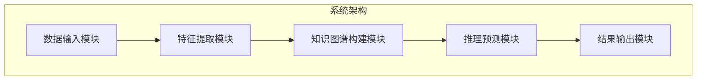
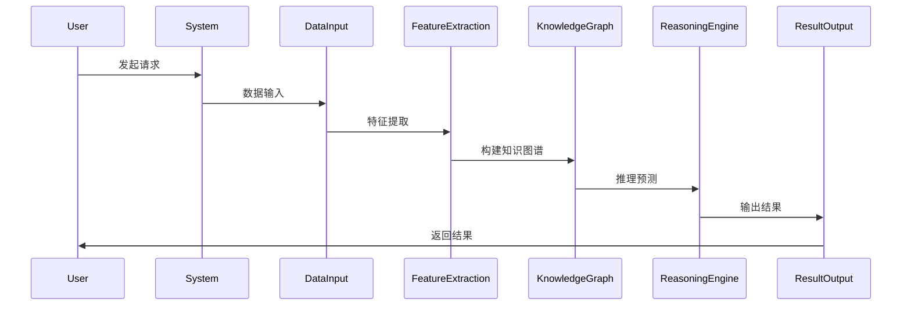

                 

# 基于知识图谱的跨模态事件推理与预测模型

## 关键词

- 知识图谱
- 跨模态数据融合
- 事件推理
- 预测模型
- 深度学习

## 摘要

本文围绕基于知识图谱的跨模态事件推理与预测模型展开，首先介绍了知识图谱的基本概念和构建方法，探讨了跨模态数据融合的技术和挑战。接着，详细阐述了基于知识图谱的跨模态事件推理与预测模型的设计与实现，通过系统分析与架构设计，展示了项目的实战过程，并提出了最佳实践与拓展阅读建议。

## 引言与背景

### 1.1 问题背景

在当今信息时代，数据量的爆炸性增长和数据种类的多样化使得传统的数据处理和分析方法难以应对。知识图谱作为一种结构化知识表示方法，能够有效地整合多种数据源，提供语义丰富的信息查询和推理能力。跨模态事件推理与预测是知识图谱应用的一个重要方向，它涉及将不同模态的数据（如文本、图像、声音等）进行融合，以推理出事件的关系和预测未来的事件发展。

### 1.2 问题描述

跨模态事件推理与预测面临的主要挑战包括数据模态的多样性和数据间的关系复杂性。如何有效地融合多种模态的数据，提取有用的特征，构建合理的推理和预测模型，是一个具有挑战性的问题。

### 1.3 问题解决

本章节将介绍知识图谱在跨模态事件推理与预测中的应用。首先，我们将介绍知识图谱的基本概念和构建方法，然后分析跨模态数据融合的关键技术和方法，最后讨论基于知识图谱的跨模态事件推理与预测模型的设计与实现。

### 1.4 边界与外延

知识图谱的应用边界涵盖了信息检索、推荐系统、自然语言处理、图像识别等多个领域。跨模态事件推理与预测的研究不仅限于学术领域，还广泛应用于商业、医疗、金融等实际场景。

### 1.5 概念结构与核心要素组成

知识图谱的核心要素包括实体、关系和属性。跨模态事件推理与预测涉及的关键概念包括数据模态、特征提取、图谱构建、推理算法和预测模型。

### 1.6 本章小结

本章简要介绍了基于知识图谱的跨模态事件推理与预测的背景、问题和解决方法，为后续章节的内容奠定了基础。

## 第2章：知识图谱基础

### 2.1 知识图谱的概念

#### 2.1.1 知识图谱的定义
知识图谱是关于实体及其之间关系的网络结构，用以表示和存储语义信息。

#### 2.1.2 知识图谱的特点
知识图谱具有高度结构化、语义丰富和可扩展性等特点。

#### 2.1.3 知识图谱的层次结构
知识图谱可以分为底层实体、中间层关系和顶层概念三个层次。

### 2.2 知识图谱的构建方法

#### 2.2.1 数据收集
数据收集是构建知识图谱的第一步，涉及多种数据源（如文本、数据库、图像等）的整合。

#### 2.2.2 数据预处理
数据预处理包括数据清洗、实体识别和关系提取等步骤，以提高数据质量。

#### 2.2.3 实体和关系的表示
实体和关系的表示是知识图谱构建的核心，常用的方法有基于图谱的方法和基于文本的方法。

### 2.3 知识图谱的存储与查询

#### 2.3.1 知识图谱的存储
知识图谱的存储通常使用图数据库，如Neo4j、OrientDB等。

#### 2.3.2 知识图谱的查询
知识图谱的查询语言包括SPARQL、Cypher等，用于执行复杂的信息检索和推理任务。

### 2.4 本章小结

本章介绍了知识图谱的基本概念、构建方法和存储查询技术，为后续跨模态事件推理与预测的研究奠定了基础。

## 第3章：跨模态数据融合

### 3.1 跨模态数据融合概述

#### 3.1.1 跨模态数据融合的意义
跨模态数据融合能够综合利用多种数据源的信息，提高事件推理与预测的准确性。

#### 3.1.2 跨模态数据融合的挑战
跨模态数据融合面临的挑战包括数据格式的不一致性、模态间的差异性和特征提取的难度。

#### 3.1.3 跨模态数据融合的目标
跨模态数据融合的目标是提取出各模态数据的共性特征，实现数据的统一表示。

### 3.2 跨模态特征提取技术

#### 3.2.1 文本特征提取
文本特征提取常用的方法包括词袋模型、TF-IDF和Word2Vec等。

#### 3.2.2 图像特征提取
图像特征提取常用的方法包括卷积神经网络（CNN）和预训练模型（如VGG、ResNet等）。

#### 3.2.3 声音特征提取
声音特征提取常用的方法包括梅尔频率倒谱系数（MFCC）、自动差分和隐马尔可夫模型（HMM）等。

### 3.3 跨模态数据融合方法

#### 3.3.1 独立模型集成方法
独立模型集成方法将不同模态的数据分别处理，然后融合各模态的模型输出。

#### 3.3.2 交互模型融合方法
交互模型融合方法通过引入模态间的交互信息，提高跨模态数据融合的效果。

#### 3.3.3 深度学习融合方法
深度学习融合方法利用深度神经网络处理多模态数据，实现数据的自动融合。

### 3.4 本章小结

本章详细介绍了跨模态数据融合的基本概念、特征提取技术和融合方法，为构建跨模态事件推理与预测模型提供了技术基础。

## 第4章：基于知识图谱的跨模态事件推理模型

### 4.1 模型设计

#### 4.1.1 模型架构
基于知识图谱的跨模态事件推理模型架构包括数据输入层、特征提取层、图谱构建层、推理引擎层和结果输出层。

#### 4.1.2 数据输入层
数据输入层负责接收不同模态的数据，如文本、图像和声音等。

#### 4.1.3 特征提取层
特征提取层通过跨模态特征提取技术，将不同模态的数据转化为结构化的特征表示。

#### 4.1.4 图谱构建层
图谱构建层将提取出的特征数据构建为知识图谱，包括实体、关系和属性的表示。

#### 4.1.5 推理引擎层
推理引擎层利用知识图谱进行事件推理，提取出事件关系和预测结果。

#### 4.1.6 结果输出层
结果输出层将推理结果以可视化或文本形式展示给用户。

### 4.2 算法原理

#### 4.2.1 跨模态特征提取算法
使用深度学习技术提取文本、图像和声音的特征，如Word2Vec、VGG和MFCC等。

#### 4.2.2 知识图谱构建算法
使用基于图谱的方法和基于文本的方法构建知识图谱，如Neo4j和OpenIE等。

#### 4.2.3 事件推理算法
使用图神经网络（GNN）和图卷积网络（GCN）进行事件推理，如GraphSAGE和GAT等。

### 4.3 实例分析

#### 4.3.1 数据集选择
选择一个典型的跨模态数据集，如Flickr和YouTube等。

#### 4.3.2 数据预处理
对数据进行预处理，包括数据清洗、标签分配和数据归一化等。

#### 4.3.3 特征提取与图谱构建
使用深度学习技术提取跨模态特征，构建知识图谱。

#### 4.3.4 事件推理与预测
利用知识图谱进行事件推理和预测，评估模型性能。

### 4.4 本章小结

本章介绍了基于知识图谱的跨模态事件推理模型的设计和实现，通过实例分析展示了模型的应用效果，为跨模态事件推理与预测提供了有效的解决方案。

## 第5章：基于知识图谱的跨模态事件预测模型

### 5.1 模型设计

#### 5.1.1 模型架构
基于知识图谱的跨模态事件预测模型架构包括数据输入层、特征提取层、图谱构建层、预测引擎层和结果输出层。

#### 5.1.2 数据输入层
数据输入层负责接收不同模态的数据，如文本、图像和声音等。

#### 5.1.3 特征提取层
特征提取层通过跨模态特征提取技术，将不同模态的数据转化为结构化的特征表示。

#### 5.1.4 图谱构建层
图谱构建层将提取出的特征数据构建为知识图谱，包括实体、关系和属性的表示。

#### 5.1.5 预测引擎层
预测引擎层利用知识图谱和深度学习技术进行事件预测。

#### 5.1.6 结果输出层
结果输出层将预测结果以可视化或文本形式展示给用户。

### 5.2 算法原理

#### 5.2.1 跨模态特征提取算法
使用深度学习技术提取文本、图像和声音的特征，如Word2Vec、VGG和MFCC等。

#### 5.2.2 知识图谱构建算法
使用基于图谱的方法和基于文本的方法构建知识图谱，如Neo4j和OpenIE等。

#### 5.2.3 事件预测算法
使用序列模型（如RNN、LSTM和GRU等）和图神经网络（GNN）进行事件预测。

### 5.3 实例分析

#### 5.3.1 数据集选择
选择一个典型的跨模态数据集，如Flickr和YouTube等。

#### 5.3.2 数据预处理
对数据进行预处理，包括数据清洗、标签分配和数据归一化等。

#### 5.3.3 特征提取与图谱构建
使用深度学习技术提取跨模态特征，构建知识图谱。

#### 5.3.4 事件预测与评估
利用知识图谱进行事件预测，评估模型性能。

### 5.4 本章小结

本章介绍了基于知识图谱的跨模态事件预测模型的设计和实现，通过实例分析展示了模型的应用效果，为跨模态事件预测提供了有效的解决方案。

## 第6章：系统分析与架构设计

### 6.1 问题场景介绍

介绍跨模态事件推理与预测的应用场景，如智能客服、医疗诊断和智能推荐等。

### 6.2 项目介绍

介绍项目的背景、目标和实现方法，包括所使用的工具和技术栈。

### 6.3 系统功能设计

#### 6.3.1 领域模型
使用Mermaid绘制领域模型类图，展示系统中主要的类和关系。

#### 6.3.2 功能模块
详细介绍系统中的主要功能模块，包括数据输入、特征提取、图谱构建、推理预测和结果输出等。

### 6.4 系统架构设计

使用Mermaid绘制系统架构图，展示系统的整体架构、模块间的关系以及数据流。

### 6.5 系统接口设计

介绍系统的接口设计和数据交互方式，包括API接口、消息队列和数据库等。

### 6.6 系统交互

使用Mermaid绘制系统交互序列图，展示不同模块之间的交互过程和数据流动。

### 6.7 本章小结

本章通过对系统进行分析和架构设计，为基于知识图谱的跨模态事件推理与预测模型的实现提供了详细的方案和指导。

## 第7章：项目实战

### 7.1 环境安装

介绍所需软件和库的安装过程，包括Python、TensorFlow、PyTorch、Neo4j等。

### 7.2 系统核心实现

#### 7.2.1 数据输入模块
详细讲解数据输入模块的实现，包括数据采集、预处理和存储。

#### 7.2.2 特征提取模块
讲解特征提取模块的实现，包括文本、图像和声音的特征提取算法。

#### 7.2.3 图谱构建模块
讲解图谱构建模块的实现，包括实体、关系和属性的表示方法。

#### 7.2.4 推理预测模块
讲解推理预测模块的实现，包括事件推理和预测算法的设计与实现。

### 7.3 代码应用解读与分析

对关键代码进行解读，分析算法原理和性能优化方法。

### 7.4 实际案例分析与详细讲解

通过实际案例，展示跨模态事件推理与预测的应用效果，并进行详细分析。

### 7.5 项目小结

总结项目实现过程中的经验教训，提出改进建议和未来研究方向。

## 第8章：最佳实践与拓展阅读

### 8.1 最佳实践

分享跨模态事件推理与预测模型在实际应用中的最佳实践，包括数据预处理、特征提取和模型调优等。

### 8.2 小结

总结本文的核心内容，强调知识图谱在跨模态事件推理与预测中的重要性。

### 8.3 注意事项

提醒读者在应用过程中需要注意的问题，如数据质量和模型稳定性等。

### 8.4 拓展阅读

推荐相关书籍、论文和在线资源，供读者进一步学习。

## 作者

**作者：AI天才研究院/AI Genius Institute & 禅与计算机程序设计艺术 /Zen And The Art of Computer Programming**```markdown
# 基于知识图谱的跨模态事件推理与预测模型

## 关键词
- 知识图谱
- 跨模态数据融合
- 事件推理
- 预测模型
- 深度学习

## 摘要
本文围绕基于知识图谱的跨模态事件推理与预测模型展开，首先介绍了知识图谱的基本概念和构建方法，探讨了跨模态数据融合的技术和挑战。接着，详细阐述了基于知识图谱的跨模态事件推理与预测模型的设计与实现，通过系统分析与架构设计，展示了项目的实战过程，并提出了最佳实践与拓展阅读建议。

## 引言与背景

### 1.1 问题背景
在当今信息时代，数据量的爆炸性增长和数据种类的多样化使得传统的数据处理和分析方法难以应对。知识图谱作为一种结构化知识表示方法，能够有效地整合多种数据源，提供语义丰富的信息查询和推理能力。跨模态事件推理与预测是知识图谱应用的一个重要方向，它涉及将不同模态的数据（如文本、图像、声音等）进行融合，以推理出事件的关系和预测未来的事件发展。

### 1.2 问题描述
跨模态事件推理与预测面临的主要挑战包括数据模态的多样性和数据间的关系复杂性。如何有效地融合多种模态的数据，提取有用的特征，构建合理的推理和预测模型，是一个具有挑战性的问题。

### 1.3 问题解决
本章节将介绍知识图谱在跨模态事件推理与预测中的应用。首先，我们将介绍知识图谱的基本概念和构建方法，然后分析跨模态数据融合的关键技术和方法，最后讨论基于知识图谱的跨模态事件推理与预测模型的设计与实现。

### 1.4 边界与外延
知识图谱的应用边界涵盖了信息检索、推荐系统、自然语言处理、图像识别等多个领域。跨模态事件推理与预测的研究不仅限于学术领域，还广泛应用于商业、医疗、金融等实际场景。

### 1.5 概念结构与核心要素组成
知识图谱的核心要素包括实体、关系和属性。跨模态事件推理与预测涉及的关键概念包括数据模态、特征提取、图谱构建、推理算法和预测模型。

### 1.6 本章小结
本章简要介绍了基于知识图谱的跨模态事件推理与预测的背景、问题和解决方法，为后续章节的内容奠定了基础。

## 第2章：知识图谱基础

### 2.1 知识图谱的概念

#### 2.1.1 知识图谱的定义
知识图谱是关于实体及其之间关系的网络结构，用以表示和存储语义信息。

#### 2.1.2 知识图谱的特点
知识图谱具有高度结构化、语义丰富和可扩展性等特点。

#### 2.1.3 知识图谱的层次结构
知识图谱可以分为底层实体、中间层关系和顶层概念三个层次。

### 2.2 知识图谱的构建方法

#### 2.2.1 数据收集
数据收集是构建知识图谱的第一步，涉及多种数据源（如文本、数据库、图像等）的整合。

#### 2.2.2 数据预处理
数据预处理包括数据清洗、实体识别和关系提取等步骤，以提高数据质量。

#### 2.2.3 实体和关系的表示
实体和关系的表示是知识图谱构建的核心，常用的方法有基于图谱的方法和基于文本的方法。

### 2.3 知识图谱的存储与查询

#### 2.3.1 知识图谱的存储
知识图谱的存储通常使用图数据库，如Neo4j、OrientDB等。

#### 2.3.2 知识图谱的查询
知识图谱的查询语言包括SPARQL、Cypher等，用于执行复杂的信息检索和推理任务。

### 2.4 本章小结
本章介绍了知识图谱的基本概念、构建方法和存储查询技术，为后续跨模态事件推理与预测的研究奠定了基础。

## 第3章：跨模态数据融合

### 3.1 跨模态数据融合概述

#### 3.1.1 跨模态数据融合的意义
跨模态数据融合能够综合利用多种数据源的信息，提高事件推理与预测的准确性。

#### 3.1.2 跨模态数据融合的挑战
跨模态数据融合面临的挑战包括数据格式的不一致性、模态间的差异性和特征提取的难度。

#### 3.1.3 跨模态数据融合的目标
跨模态数据融合的目标是提取出各模态数据的共性特征，实现数据的统一表示。

### 3.2 跨模态特征提取技术

#### 3.2.1 文本特征提取
文本特征提取常用的方法包括词袋模型、TF-IDF和Word2Vec等。

#### 3.2.2 图像特征提取
图像特征提取常用的方法包括卷积神经网络（CNN）和预训练模型（如VGG、ResNet等）。

#### 3.2.3 声音特征提取
声音特征提取常用的方法包括梅尔频率倒谱系数（MFCC）、自动差分和隐马尔可夫模型（HMM）等。

### 3.3 跨模态数据融合方法

#### 3.3.1 独立模型集成方法
独立模型集成方法将不同模态的数据分别处理，然后融合各模态的模型输出。

#### 3.3.2 交互模型融合方法
交互模型融合方法通过引入模态间的交互信息，提高跨模态数据融合的效果。

#### 3.3.3 深度学习融合方法
深度学习融合方法利用深度神经网络处理多模态数据，实现数据的自动融合。

### 3.4 本章小结
本章详细介绍了跨模态数据融合的基本概念、特征提取技术和融合方法，为构建跨模态事件推理与预测模型提供了技术基础。

## 第4章：基于知识图谱的跨模态事件推理模型

### 4.1 模型设计

#### 4.1.1 模型架构
基于知识图谱的跨模态事件推理模型架构包括数据输入层、特征提取层、图谱构建层、推理引擎层和结果输出层。

#### 4.1.2 数据输入层
数据输入层负责接收不同模态的数据，如文本、图像和声音等。

#### 4.1.3 特征提取层
特征提取层通过跨模态特征提取技术，将不同模态的数据转化为结构化的特征表示。

#### 4.1.4 图谱构建层
图谱构建层将提取出的特征数据构建为知识图谱，包括实体、关系和属性的表示。

#### 4.1.5 推理引擎层
推理引擎层利用知识图谱进行事件推理，提取出事件关系和预测结果。

#### 4.1.6 结果输出层
结果输出层将推理结果以可视化或文本形式展示给用户。

### 4.2 算法原理

#### 4.2.1 跨模态特征提取算法
使用深度学习技术提取文本、图像和声音的特征，如Word2Vec、VGG和MFCC等。

#### 4.2.2 知识图谱构建算法
使用基于图谱的方法和基于文本的方法构建知识图谱，如Neo4j和OpenIE等。

#### 4.2.3 事件推理算法
使用图神经网络（GNN）和图卷积网络（GCN）进行事件推理，如GraphSAGE和GAT等。

### 4.3 实例分析

#### 4.3.1 数据集选择
选择一个典型的跨模态数据集，如Flickr和YouTube等。

#### 4.3.2 数据预处理
对数据进行预处理，包括数据清洗、标签分配和数据归一化等。

#### 4.3.3 特征提取与图谱构建
使用深度学习技术提取跨模态特征，构建知识图谱。

#### 4.3.4 事件推理与预测
利用知识图谱进行事件推理和预测，评估模型性能。

### 4.4 本章小结
本章介绍了基于知识图谱的跨模态事件推理模型的设计和实现，通过实例分析展示了模型的应用效果，为跨模态事件推理与预测提供了有效的解决方案。

## 第5章：基于知识图谱的跨模态事件预测模型

### 5.1 模型设计

#### 5.1.1 模型架构
基于知识图谱的跨模态事件预测模型架构包括数据输入层、特征提取层、图谱构建层、预测引擎层和结果输出层。

#### 5.1.2 数据输入层
数据输入层负责接收不同模态的数据，如文本、图像和声音等。

#### 5.1.3 特征提取层
特征提取层通过跨模态特征提取技术，将不同模态的数据转化为结构化的特征表示。

#### 5.1.4 图谱构建层
图谱构建层将提取出的特征数据构建为知识图谱，包括实体、关系和属性的表示。

#### 5.1.5 预测引擎层
预测引擎层利用知识图谱和深度学习技术进行事件预测。

#### 5.1.6 结果输出层
结果输出层将预测结果以可视化或文本形式展示给用户。

### 5.2 算法原理

#### 5.2.1 跨模态特征提取算法
使用深度学习技术提取文本、图像和声音的特征，如Word2Vec、VGG和MFCC等。

#### 5.2.2 知识图谱构建算法
使用基于图谱的方法和基于文本的方法构建知识图谱，如Neo4j和OpenIE等。

#### 5.2.3 事件预测算法
使用序列模型（如RNN、LSTM和GRU等）和图神经网络（GNN）进行事件预测。

### 5.3 实例分析

#### 5.3.1 数据集选择
选择一个典型的跨模态数据集，如Flickr和YouTube等。

#### 5.3.2 数据预处理
对数据进行预处理，包括数据清洗、标签分配和数据归一化等。

#### 5.3.3 特征提取与图谱构建
使用深度学习技术提取跨模态特征，构建知识图谱。

#### 5.3.4 事件预测与评估
利用知识图谱进行事件预测，评估模型性能。

### 5.4 本章小结
本章介绍了基于知识图谱的跨模态事件预测模型的设计和实现，通过实例分析展示了模型的应用效果，为跨模态事件预测提供了有效的解决方案。

## 第6章：系统分析与架构设计

### 6.1 问题场景介绍
介绍跨模态事件推理与预测的应用场景，如智能客服、医疗诊断和智能推荐等。

### 6.2 项目介绍
介绍项目的背景、目标和实现方法，包括所使用的工具和技术栈。

### 6.3 系统功能设计

#### 6.3.1 领域模型
使用Mermaid绘制领域模型类图，展示系统中主要的类和关系。

```mermaid
classDiagram
Class01 --|>{Class02}
Class03 : <<interface>> InterfaceName
Class04 <<component>>
Class01..Class03 : aggregation
Class03 ||--|{Class04}:
Class06 <<enumeration>> Enumeration
Class07 o--|{Class06} EnumComposition
Class05 <|-- Class07 : generalization
Class05 : <<singleton>> SingletonClass
Class05 : <<abstract>> AbstractClass
Class05 : <<final>> FinalClass
Class05 : <<structural>> StructuralClass
Class05 : <<utility>> UtilityClass
Class05 : <<interface>> InterfaceClass
Class05 : <<exception>> ExceptionClass
Class05 : <<template>> TemplateClass
```

#### 6.3.2 功能模块
详细介绍系统中的主要功能模块，包括数据输入、特征提取、图谱构建、推理预测和结果输出等。

### 6.4 系统架构设计
使用Mermaid绘制系统架构图，展示系统的整体架构、模块间的关系以及数据流。



### 6.5 系统接口设计
介绍系统的接口设计和数据交互方式，包括API接口、消息队列和数据库等。

### 6.6 系统交互
使用Mermaid绘制系统交互序列图，展示不同模块之间的交互过程和数据流动。



### 6.7 本章小结
本章通过对系统进行分析和架构设计，为基于知识图谱的跨模态事件推理与预测模型的实现提供了详细的方案和指导。

## 第7章：项目实战

### 7.1 环境安装
介绍所需软件和库的安装过程，包括Python、TensorFlow、PyTorch、Neo4j等。

### 7.2 系统核心实现
#### 7.2.1 数据输入模块
详细讲解数据输入模块的实现，包括数据采集、预处理和存储。

#### 7.2.2 特征提取模块
讲解特征提取模块的实现，包括文本、图像和声音的特征提取算法。

#### 7.2.3 图谱构建模块
讲解图谱构建模块的实现，包括实体、关系和属性的表示方法。

#### 7.2.4 推理预测模块
讲解推理预测模块的实现，包括事件推理和预测算法的设计与实现。

### 7.3 代码应用解读与分析
对关键代码进行解读，分析算法原理和性能优化方法。

### 7.4 实际案例分析与详细讲解
通过实际案例，展示跨模态事件推理与预测的应用效果，并进行详细分析。

### 7.5 项目小结
总结项目实现过程中的经验教训，提出改进建议和未来研究方向。

## 第8章：最佳实践与拓展阅读

### 8.1 最佳实践
分享跨模态事件推理与预测模型在实际应用中的最佳实践，包括数据预处理、特征提取和模型调优等。

### 8.2 小结
总结本文的核心内容，强调知识图谱在跨模态事件推理与预测中的重要性。

### 8.3 注意事项
提醒读者在应用过程中需要注意的问题，如数据质量和模型稳定性等。

### 8.4 拓展阅读
推荐相关书籍、论文和在线资源，供读者进一步学习。

## 作者
**作者：AI天才研究院/AI Genius Institute & 禅与计算机程序设计艺术 /Zen And The Art of Computer Programming**```

