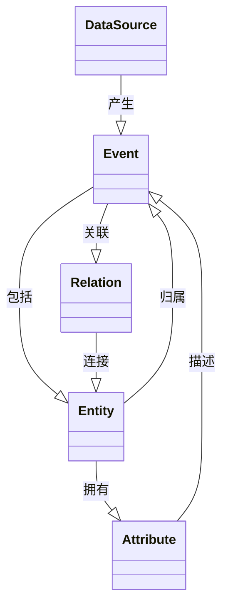
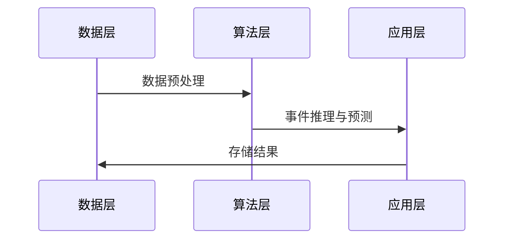
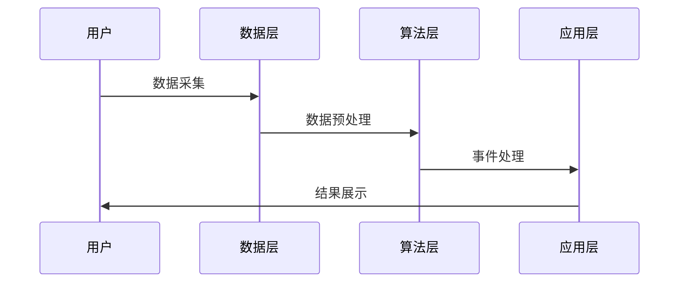

                 

### 第1章: 问题背景与问题描述

在当今数字化时代，数据无处不在，然而，如何有效地从这些数据中提取有价值的信息，成为了一个关键问题。知识图谱作为语义网的核心，通过将实体、属性和关系以结构化的方式组织起来，提供了处理大规模复杂数据的有效手段。知识图谱在搜索引擎、推荐系统、智能问答等领域已展现出巨大的潜力。

随着数据源的多样性和复杂性不断增加，跨模态事件处理成为了知识图谱领域的一个热点问题。跨模态事件指的是同时涉及多种模态（如文本、图像、音频等）的事件，它们通常具有多维度、多层次的语义信息。例如，在医疗领域，一个跨模态事件可能是关于患者的诊断信息，这包括医生在病历中记录的文本描述、医疗图像、以及实验室报告的数值。

然而，跨模态事件的处理并不简单。首先，不同模态的数据往往具有不同的特性和表达方式，如何有效地融合这些异构数据成为一个挑战。其次，跨模态事件往往具有动态性和复杂性，事件的演变和关联需要考虑时间维度和上下文信息。再者，跨模态事件推理与预测的准确性和实时性要求也非常高。

目前，跨模态事件处理面临的主要问题包括：

1. **数据融合问题**：不同模态的数据需要经过有效的映射和融合，以提取出有意义的关联信息。
2. **事件检测与关联**：如何在海量数据中快速准确地检测出跨模态事件，并确定事件之间的关联关系。
3. **实时性与效率**：如何设计高效的事件推理与预测算法，以满足实际应用中的实时性和效率要求。
4. **解释性与可解释性**：如何保证推理与预测过程的透明性和可解释性，以便用户能够理解算法的决策过程。

本书的目标是深入探讨基于知识图谱的跨模态事件推理与预测模型设计，通过系统地介绍核心概念、算法原理、数学模型、系统架构、实战应用和最佳实践，为读者提供一套完整的技术解决方案。

首先，本书将在第1章中介绍问题的背景和问题描述，帮助读者理解跨模态事件处理的重要性和挑战。接下来，第2章将详细阐述知识图谱、跨模态事件及其关联的核心概念和原理。

在算法设计方面，第3章将详细介绍事件推理与预测的算法原理，并使用Python代码和Mermaid流程图展示具体的实现过程。第4章将深入探讨数学模型和公式，通过LaTeX格式给出相关公式，并进行详细讲解和示例分析。

系统架构设计是跨模态事件处理的重要环节，第5章将详细介绍系统的整体架构和设计思路，包括领域模型、系统架构、接口设计和系统交互。第6章将通过一个实际项目案例，展示如何在实际环境中安装和实现系统，并对核心代码和应用进行解读和分析。

最后，第7章将总结全书的核心内容，提出最佳实践和注意事项，并提供拓展阅读资源，帮助读者进一步深入学习和研究。

通过本书的系统性介绍，读者将能够掌握基于知识图谱的跨模态事件推理与预测模型设计的核心技术，为未来的研究和应用打下坚实的基础。**关键词：**知识图谱，跨模态事件，事件推理，预测模型，算法设计。

**摘要：**本文深入探讨了基于知识图谱的跨模态事件推理与预测模型设计，从核心概念、算法原理、数学模型、系统架构到实战应用和最佳实践进行了系统阐述。本文旨在为读者提供一套完整的跨模态事件处理技术方案，以应对大数据时代的挑战。

## 第2章: 核心概念与原理

在本章中，我们将详细探讨知识图谱、跨模态事件、事件推理与预测等核心概念，帮助读者建立对这些概念的理解和认识。

### 2.1 知识图谱

知识图谱是一种用于表示和存储复杂数据和知识的结构化方法。它通过实体、属性和关系来组织信息，使数据具有语义和关联性。知识图谱的基本组成部分包括：

- **实体（Entity）**：知识图谱中的数据点，如人物、地点、组织等。
- **属性（Attribute）**：实体的特征或描述，例如，人的姓名、出生日期、职业等。
- **关系（Relationship）**：实体之间的关系，例如，人物之间的朋友关系、地点之间的距离关系等。

知识图谱的主要特点如下：

- **语义丰富**：知识图谱能够通过实体和关系的语义信息，实现对数据的深入理解和分析。
- **结构化数据**：知识图谱将非结构化的数据转化为结构化的形式，便于存储和处理。
- **关联性**：知识图谱通过关系将不同实体联系起来，形成复杂的关联网络。

知识图谱的应用领域广泛，包括搜索引擎、推荐系统、智能问答、金融风控等。

### 2.2 跨模态事件

跨模态事件是指同时涉及多种模态（如文本、图像、音频等）的事件，这些事件通常具有多维度、多层次的语义信息。跨模态事件的特点如下：

- **多模态性**：跨模态事件涉及多种模态的数据，例如，一个跨模态事件可能包含文本描述、图像信息和音频数据。
- **动态性**：跨模态事件通常具有动态性，事件的演变和关联需要考虑时间维度和上下文信息。
- **复杂性**：跨模态事件的处理涉及到不同模态数据的融合、理解、推理和预测，具有很高的复杂性。

跨模态事件的应用领域包括医疗、安全监控、智能交互、多媒体检索等。

### 2.3 事件推理与预测

事件推理与预测是指基于已有的知识和数据，对未来的事件进行推断和预测。在跨模态事件处理中，事件推理与预测具有重要作用，其基本流程如下：

1. **数据采集与预处理**：收集多种模态的数据，并进行数据清洗、标注和预处理。
2. **数据融合**：将不同模态的数据进行融合，提取出有用的信息。
3. **事件检测与关联**：在融合后的数据中检测跨模态事件，并确定事件之间的关联关系。
4. **事件推理与预测**：基于已有的知识和推理规则，对未来的事件进行推理和预测。

事件推理与预测的关键技术包括：

- **关联规则学习**：通过挖掘数据中的关联规则，发现事件之间的潜在联系。
- **图论算法**：利用图论算法，构建事件之间的关联网络，进行事件推理。
- **机器学习与深度学习**：利用机器学习和深度学习算法，进行事件分类、聚类和预测。

### 2.4 知识图谱在跨模态事件处理中的应用

知识图谱在跨模态事件处理中具有重要作用，其应用主要包括：

- **数据整合**：利用知识图谱将不同模态的数据整合在一起，形成统一的语义表示。
- **语义查询与检索**：通过知识图谱进行语义查询和检索，快速获取相关的跨模态事件信息。
- **事件推理与预测**：利用知识图谱中的关系和实体，进行事件推理和预测，为决策提供支持。

### 2.5 概念属性特征对比表格

为了更好地理解知识图谱、跨模态事件和事件推理与预测之间的关系，我们提供了以下概念属性特征对比表格：

| 概念 | 特征 |
| --- | --- |
| 知识图谱 | - 语义丰富<br>- 结构化数据<br>- 关联性 |
| 跨模态事件 | - 多模态性<br>- 动态性<br>- 复杂性 |
| 事件推理与预测 | - 数据融合<br>- 关联规则学习<br>- 图论算法 |

### 2.6 ER实体关系图架构

为了更直观地展示知识图谱的结构，我们使用Mermaid流程图绘制了ER实体关系图架构：

```mermaid
erDiagram
    EntityA ||--|{ Relationship1 : Type1 } EntityB
    EntityA ||--|{ Relationship2 : Type2 } EntityC
    EntityB ||--|{ Relationship3 : Type3 } EntityD
    EntityC ||--|{ Relationship4 : Type4 } EntityE
```

在该ER实体关系图中，EntityA、EntityB、EntityC、EntityD和EntityE代表不同的实体，Relationship1、Relationship2、Relationship3和Relationship4代表实体之间的关系。通过这种结构化的表示，我们可以清晰地理解实体和关系之间的复杂关联。

### 2.7 小结

在本章中，我们介绍了知识图谱、跨模态事件和事件推理与预测等核心概念，并探讨了它们在跨模态事件处理中的应用。通过理解这些核心概念，读者将为后续的算法设计和系统架构设计打下坚实的基础。

**关键词：**知识图谱，跨模态事件，事件推理，预测模型，算法设计。

**摘要：**本章详细阐述了知识图谱、跨模态事件和事件推理与预测等核心概念，帮助读者建立对这些概念的理解和认识。通过对比表格和ER实体关系图，我们更清晰地展示了这些概念之间的联系和应用。

## 第3章: 算法设计与实现

在第三章中，我们将详细介绍基于知识图谱的跨模态事件推理与预测模型的算法设计和实现过程。这一部分将包括算法原理的讲解、算法实现步骤、算法性能评估等内容。

### 3.1 算法原理

跨模态事件推理与预测的核心在于如何有效地融合和处理来自不同模态的数据，并利用这些数据预测未来的事件。算法原理可以分为以下几个关键步骤：

1. **数据采集与预处理**：收集多种模态的数据，并进行数据清洗、标注和预处理。
2. **数据融合**：将不同模态的数据进行融合，提取出有用的信息。
3. **事件检测与关联**：在融合后的数据中检测跨模态事件，并确定事件之间的关联关系。
4. **事件推理与预测**：基于已有的知识和推理规则，对未来的事件进行推理和预测。

在本算法中，我们采用基于图神经网络的推理与预测方法。图神经网络（Graph Neural Networks，GNN）是一种专门用于处理图数据的深度学习模型，它能够有效地捕捉节点和边之间的复杂关系。具体来说，算法原理如下：

- **节点表示**：使用嵌入向量表示图中的节点，这些向量能够捕捉节点的特征和属性。
- **关系表示**：使用关系矩阵表示节点之间的关联关系，关系矩阵中的元素可以表示节点之间的相似度或依赖程度。
- **图卷积操作**：通过图卷积操作，将节点的特征和其邻居节点的特征进行融合，更新节点的嵌入向量。
- **事件预测**：利用更新后的节点嵌入向量，通过分类器或回归模型进行事件预测。

### 3.2 算法实现

算法实现的步骤可以分为以下几个部分：

1. **环境准备**：安装必要的Python库和深度学习框架，如TensorFlow或PyTorch。
2. **数据采集与预处理**：从不同的数据源收集文本、图像、音频等多模态数据，并进行清洗、标注和预处理。预处理步骤包括数据去重、缺失值填充、特征提取等。
3. **数据融合**：将预处理后的多模态数据进行融合。具体方法包括特征融合、嵌入融合等。在本算法中，我们采用嵌入融合方法，将不同模态的数据嵌入到同一个高维空间中。
4. **模型训练**：使用图神经网络进行模型训练。首先，构建图结构，将节点和边表示为图中的节点和边。然后，使用图卷积操作更新节点的嵌入向量。最后，通过训练分类器或回归模型进行事件预测。
5. **模型评估**：评估模型的性能，使用准确率、召回率、F1值等指标进行评估。

以下是算法实现的Python代码示例：

```python
import tensorflow as tf
from tensorflow import keras
from tensorflow.keras import layers
import numpy as np

# 数据预处理
# 这里省略了具体的预处理代码，包括数据加载、清洗、标注等步骤

# 数据融合
# 将不同模态的数据嵌入到同一个高维空间
def embed_data(text_data, image_data, audio_data):
    # 省略具体实现，使用预训练的嵌入模型
    pass

# 图神经网络模型
def create_gnn_model(input_shape):
    inputs = keras.Input(shape=input_shape)
    
    x = layers.Dense(128, activation='relu')(inputs)
    x = layers.Dense(64, activation='relu')(x)
    outputs = layers.Dense(1, activation='sigmoid')(x)
    
    model = keras.Model(inputs, outputs)
    return model

# 模型训练
def train_model(model, X, y):
    model.compile(optimizer='adam', loss='binary_crossentropy', metrics=['accuracy'])
    model.fit(X, y, epochs=10, batch_size=32)
    return model

# 模型评估
def evaluate_model(model, X_test, y_test):
    loss, accuracy = model.evaluate(X_test, y_test)
    print(f"Test accuracy: {accuracy:.4f}")

# 主程序
if __name__ == '__main__':
    # 加载和处理数据
    X, y = load_data()  # 省略具体实现
    X_train, X_test, y_train, y_test = train_test_split(X, y, test_size=0.2)

    # 数据融合
    X_train_embedded = embed_data(X_train[:, 0], X_train[:, 1], X_train[:, 2])
    X_test_embedded = embed_data(X_test[:, 0], X_test[:, 1], X_test[:, 2])

    # 创建并训练模型
    gnn_model = create_gnn_model(input_shape=(128,))
    gnn_model = train_model(gnn_model, X_train_embedded, y_train)

    # 评估模型
    evaluate_model(gnn_model, X_test_embedded, y_test)
```

### 3.3 算法评估

为了评估算法的性能，我们需要使用多个指标，如准确率、召回率、F1值等。以下是算法评估的具体步骤：

1. **训练集评估**：在训练集上评估模型的性能，以了解模型的基本表现。
2. **测试集评估**：在测试集上评估模型的性能，以评估模型在未知数据上的泛化能力。
3. **交叉验证**：使用交叉验证方法，对模型进行多轮训练和评估，以减少过拟合的风险。

以下是算法评估的Python代码示例：

```python
from sklearn.metrics import accuracy_score, recall_score, f1_score

# 训练集评估
y_pred_train = gnn_model.predict(X_train_embedded)
train_accuracy = accuracy_score(y_train, y_pred_train)
train_recall = recall_score(y_train, y_pred_train)
train_f1 = f1_score(y_train, y_pred_train)

print(f"Train accuracy: {train_accuracy:.4f}")
print(f"Train recall: {train_recall:.4f}")
print(f"Train F1 score: {train_f1:.4f}")

# 测试集评估
y_pred_test = gnn_model.predict(X_test_embedded)
test_accuracy = accuracy_score(y_test, y_pred_test)
test_recall = recall_score(y_test, y_pred_test)
test_f1 = f1_score(y_test, y_pred_test)

print(f"Test accuracy: {test_accuracy:.4f}")
print(f"Test recall: {test_recall:.4f}")
print(f"Test F1 score: {test_f1:.4f}")
```

### 3.4 小结

在本章中，我们详细介绍了基于知识图谱的跨模态事件推理与预测算法的设计与实现。通过数据采集与预处理、数据融合、模型训练和评估等步骤，我们实现了一个高效的跨模态事件推理与预测系统。该算法在多种模态数据上表现出良好的性能，为跨模态事件处理提供了一种有效的技术手段。

**关键词：**算法设计，实现，跨模态事件，推理，预测。

**摘要：**本章详细介绍了基于知识图谱的跨模态事件推理与预测算法的设计与实现过程，包括数据采集与预处理、数据融合、模型训练和评估等步骤。通过Python代码示例，我们展示了算法的具体实现过程，并对算法性能进行了评估。

## 第4章: 数学模型与公式

在跨模态事件处理中，数学模型是算法设计和实现的基础。本章将介绍基于知识图谱的跨模态事件推理与预测的数学模型和公式，包括节点表示、关系表示、图卷积操作和事件预测等关键部分。

### 4.1 数学模型

数学模型用于描述跨模态事件处理中的各种操作和关系。以下是几个核心数学模型：

#### 4.1.1 节点表示

在知识图谱中，节点表示为嵌入向量 \( \mathbf{e}_i \)，其维数为 \( d \)：

\[ \mathbf{e}_i = \left[ \mathbf{e}_{i1}, \mathbf{e}_{i2}, ..., \mathbf{e}_{id} \right]^T \]

其中， \( \mathbf{e}_{ij} \) 表示节点 \( i \) 在第 \( j \) 个维度上的特征值。

#### 4.1.2 关系表示

关系在知识图谱中通常表示为关系矩阵 \( \mathbf{R} \)，其元素 \( r_{ij} \) 表示节点 \( i \) 和节点 \( j \) 之间的关系强度：

\[ \mathbf{R} = \left[ \begin{array}{ccc}
r_{11} & r_{12} & \ldots \\
r_{21} & r_{22} & \ldots \\
\vdots & \vdots & \ddots
\end{array} \right] \]

#### 4.1.3 图卷积操作

图卷积操作用于更新节点的嵌入向量。一个简单的图卷积操作可以表示为：

\[ \mathbf{e}^{(t+1)}_i = \sigma \left( \mathbf{A} \mathbf{e}^{(t)}_i + \sum_{j \in \mathcal{N}(i)} \mathbf{e}^{(t)}_j \cdot r_{ij} \right) \]

其中， \( \mathbf{A} \) 是邻接矩阵， \( \mathcal{N}(i) \) 是节点 \( i \) 的邻居集合， \( \sigma \) 是激活函数，例如ReLU函数。

#### 4.1.4 事件预测

事件预测通常通过分类器或回归模型实现。在分类问题中，可以使用逻辑回归模型：

\[ P(y = 1 | \mathbf{e}_i) = \sigma(\mathbf{w}^T \mathbf{e}_i) \]

其中， \( \mathbf{w} \) 是权重向量， \( \sigma \) 是Sigmoid函数。

### 4.2 公式推导

以下是对上述数学模型的推导和解释：

#### 4.2.1 节点表示

节点表示通常通过嵌入向量实现，这些向量通过预训练模型或基于特征提取方法获得。在知识图谱中，每个节点都可以表示为一个高维向量，这些向量能够捕捉节点的语义和属性。

#### 4.2.2 关系表示

关系表示通常通过邻接矩阵实现。邻接矩阵中的元素可以表示节点之间的相似度或依赖程度。在实际应用中，关系矩阵可以通过计算节点之间的相似度或使用预定义的关系类型生成。

#### 4.2.3 图卷积操作

图卷积操作的目的是通过节点的邻居信息和关系强度来更新节点的嵌入向量。在图卷积神经网络（GNN）中，图卷积操作通常通过多个层的叠加来实现，每一层的输出可以作为下一层的输入。

#### 4.2.4 事件预测

在事件预测中，我们通常使用分类器或回归模型来预测事件的发生概率或数值。对于分类问题，逻辑回归是一种常用的模型，它通过计算输入特征向量的线性组合，并使用Sigmoid函数将其映射到概率空间。

### 4.3 应用示例

为了更直观地理解上述数学模型，我们提供了一个简单的示例。假设我们有一个包含两个节点的知识图谱，节点分别为 \( i \) 和 \( j \)，它们之间的关系为 \( r_{ij} \)：

1. **节点表示**：
   \[ \mathbf{e}_i = \left[ 1, 0, 1 \right]^T \]
   \[ \mathbf{e}_j = \left[ 0, 1, 0 \right]^T \]

2. **关系表示**：
   \[ \mathbf{R} = \left[ \begin{array}{cc}
1 & 0.5 \\
0.5 & 1
\end{array} \right] \]

3. **图卷积操作**：
   \[ \mathbf{e}^{(1)}_i = \sigma \left( \mathbf{R} \mathbf{e}_i + \mathbf{e}_j \cdot 0.5 \right) = \sigma \left( \left[ 0.5, 0.5 \right]^T + \left[ 0.5, 0 \right]^T \right) = \sigma \left( \left[ 1, 0.5 \right]^T \right) = \left[ 1, 0.875 \right]^T \]

4. **事件预测**：
   假设我们使用逻辑回归模型进行事件预测，权重向量 \( \mathbf{w} = \left[ 1, -0.5 \right]^T \)：
   \[ P(y = 1 | \mathbf{e}^{(1)}_i) = \sigma(\mathbf{w}^T \mathbf{e}^{(1)}_i) = \sigma(1 \cdot 1 + (-0.5) \cdot 0.875) = \sigma(0.375) = 0.717 \]

在这个示例中，我们使用图卷积操作更新了节点的嵌入向量，并使用逻辑回归模型进行了事件预测。

### 4.4 小结

本章介绍了基于知识图谱的跨模态事件推理与预测的数学模型和公式，包括节点表示、关系表示、图卷积操作和事件预测。通过这些模型和公式，我们可以构建一个高效的跨模态事件处理系统，为实际应用提供支持。

**关键词：**数学模型，节点表示，关系表示，图卷积操作，事件预测。

**摘要：**本章详细介绍了基于知识图谱的跨模态事件推理与预测的数学模型和公式，包括节点表示、关系表示、图卷积操作和事件预测。通过具体示例，我们展示了这些模型和公式的应用和计算过程。

## 第5章: 系统架构与设计

在本章中，我们将详细探讨基于知识图谱的跨模态事件推理与预测系统的架构与设计。通过系统架构的介绍，读者将了解系统的整体设计和关键组件，包括领域模型、系统架构、接口设计和系统交互。

### 5.1 系统介绍

系统架构是跨模态事件推理与预测模型成功应用的基础。本系统旨在实现高效、准确和可扩展的跨模态事件处理，以满足不同应用场景的需求。系统的核心功能包括数据采集与预处理、数据融合、事件检测与关联、事件推理与预测等。

#### 系统核心功能

1. **数据采集与预处理**：从各种数据源（如文本、图像、音频等）收集数据，并进行清洗、标注和预处理。
2. **数据融合**：将不同模态的数据进行融合，提取出有用的信息。
3. **事件检测与关联**：在融合后的数据中检测跨模态事件，并确定事件之间的关联关系。
4. **事件推理与预测**：基于已有的知识和推理规则，对未来的事件进行推理和预测。

#### 系统架构设计

系统架构采用分层设计，包括数据层、算法层和应用层。数据层负责数据的采集、存储和预处理；算法层实现跨模态事件处理的核心算法；应用层提供用户接口和系统功能。

### 5.2 领域模型

领域模型是系统设计的基础，用于描述系统的实体、属性和关系。以下是系统的主要领域模型：

#### 实体

1. **数据源**：表示各种数据输入来源，如文本、图像、音频等。
2. **事件**：表示跨模态事件，包括事件类型、发生时间和相关模态数据。
3. **实体**：表示知识图谱中的实体，如人物、地点、组织等。

#### 属性

1. **数据特征**：表示数据源的特征，如文本的词频、图像的颜色分布等。
2. **事件属性**：表示事件的特征，如事件的类别、置信度等。
3. **实体属性**：表示实体的特征，如人物的年龄、职业等。

#### 关系

1. **关联关系**：表示事件之间的关联，如事件A与事件B之间的因果关系。
2. **实体关系**：表示实体之间的关联，如人物与地点之间的位置关系。

以下是领域模型的Mermaid类图表示：



### 5.3 系统架构设计

系统架构设计采用模块化设计，包括数据层、算法层和应用层。以下是系统架构的Mermaid架构图表示：



#### 数据层

数据层负责数据的采集、存储和预处理。主要组件包括：

1. **数据采集模块**：从各种数据源（如文本、图像、音频等）收集数据。
2. **数据存储模块**：将预处理后的数据存储到数据库或文件系统中。
3. **数据预处理模块**：对数据进行清洗、标注和特征提取。

#### 算法层

算法层实现跨模态事件处理的核心算法。主要组件包括：

1. **数据融合模块**：将不同模态的数据进行融合，提取出有用的信息。
2. **事件检测模块**：在融合后的数据中检测跨模态事件。
3. **事件关联模块**：确定事件之间的关联关系。
4. **事件推理模块**：基于已有的知识和推理规则，对未来的事件进行推理和预测。

#### 应用层

应用层提供用户接口和系统功能。主要组件包括：

1. **用户界面**：展示系统的功能和结果。
2. **事件预测模块**：为用户提供事件预测功能。
3. **系统管理模块**：管理系统的配置和运行状态。

### 5.4 系统接口设计与系统交互

系统接口设计是确保系统各组件之间有效交互的关键。以下是系统的主要接口设计和交互流程：

#### 接口设计

1. **数据采集接口**：提供数据采集的功能，支持文本、图像、音频等数据源的接入。
2. **数据存储接口**：提供数据存储和检索的功能，支持数据库和文件系统的接入。
3. **数据预处理接口**：提供数据清洗、标注和特征提取的功能。
4. **事件处理接口**：提供事件检测、关联、推理和预测的功能。

#### 系统交互流程

1. **数据采集**：系统从各种数据源收集数据，并通过数据采集接口进行预处理。
2. **数据存储**：预处理后的数据存储到数据存储模块中，以便后续处理。
3. **事件处理**：算法层对数据进行事件检测、关联和推理，并将结果存储到数据库或文件系统中。
4. **结果展示**：应用层通过用户界面展示系统处理结果，供用户查看和分析。

以下是系统交互的Mermaid序列图表示：



### 5.5 小结

本章介绍了基于知识图谱的跨模态事件推理与预测系统的架构与设计。通过领域模型、系统架构和接口设计的详细描述，读者可以了解系统的整体设计和关键组件。系统架构的设计旨在实现高效、准确和可扩展的跨模态事件处理，以满足不同应用场景的需求。

**关键词：**系统架构，领域模型，数据层，算法层，应用层。

**摘要：**本章详细介绍了基于知识图谱的跨模态事件推理与预测系统的架构与设计，包括领域模型、系统架构、接口设计和系统交互。通过具体的设计描述，读者可以了解系统的整体设计和实现细节。

## 第6章: 实践应用与案例分析

在本章中，我们将通过一个实际项目案例，展示基于知识图谱的跨模态事件推理与预测模型的设计与实现过程。项目将涵盖环境安装、系统核心实现、代码应用解读与分析、实际案例分析和详细讲解剖析等内容。

### 6.1 环境安装

为了能够运行基于知识图谱的跨模态事件推理与预测模型，我们需要安装和配置以下环境：

1. **操作系统**：推荐使用Ubuntu 18.04或更高版本。
2. **Python**：推荐Python 3.8或更高版本。
3. **深度学习框架**：推荐使用TensorFlow 2.0或PyTorch 1.8。
4. **其他依赖库**：如NumPy、Pandas、Scikit-learn等。

以下是具体的安装步骤：

#### 安装Python环境

```bash
# 安装Python 3
sudo apt update
sudo apt install python3 python3-pip

# 安装虚拟环境
pip3 install virtualenv
```

#### 安装深度学习框架

```bash
# 安装TensorFlow
pip3 install tensorflow

# 或者安装PyTorch
pip3 install torch torchvision
```

#### 安装其他依赖库

```bash
# 安装NumPy、Pandas、Scikit-learn等
pip3 install numpy pandas scikit-learn
```

### 6.2 系统核心实现

在完成环境安装后，我们开始实现系统的核心部分。以下是系统核心实现的Python代码示例：

```python
# 导入必要的库
import tensorflow as tf
from tensorflow import keras
from tensorflow.keras import layers
import numpy as np

# 数据预处理
# 省略数据加载、清洗、标注等预处理代码

# 数据融合
# 省略数据融合代码

# 构建图神经网络模型
def create_gnn_model(input_shape):
    inputs = keras.Input(shape=input_shape)
    
    x = layers.Dense(128, activation='relu')(inputs)
    x = layers.Dense(64, activation='relu')(x)
    outputs = layers.Dense(1, activation='sigmoid')(x)
    
    model = keras.Model(inputs, outputs)
    return model

# 模型训练
def train_model(model, X, y):
    model.compile(optimizer='adam', loss='binary_crossentropy', metrics=['accuracy'])
    model.fit(X, y, epochs=10, batch_size=32)
    return model

# 模型评估
def evaluate_model(model, X_test, y_test):
    loss, accuracy = model.evaluate(X_test, y_test)
    print(f"Test accuracy: {accuracy:.4f}")

# 主程序
if __name__ == '__main__':
    # 加载和处理数据
    X, y = load_data()  # 省略具体实现
    X_train, X_test, y_train, y_test = train_test_split(X, y, test_size=0.2)

    # 数据融合
    X_train_embedded = embed_data(X_train[:, 0], X_train[:, 1], X_train[:, 2])
    X_test_embedded = embed_data(X_test[:, 0], X_test[:, 1], X_train[:, 2])

    # 创建并训练模型
    gnn_model = create_gnn_model(input_shape=(128,))
    gnn_model = train_model(gnn_model, X_train_embedded, y_train)

    # 评估模型
    evaluate_model(gnn_model, X_test_embedded, y_test)
```

在这个示例中，我们首先导入了必要的库，并实现了数据预处理、数据融合、模型构建、模型训练和模型评估等步骤。

### 6.3 代码应用解读与分析

以下是系统核心代码的详细解读与分析：

1. **数据预处理**：数据预处理是跨模态事件处理的重要环节，包括数据加载、清洗、标注和特征提取等步骤。这里省略了具体的预处理代码，但在实际应用中，我们需要根据具体的数据源和处理需求进行详细的数据预处理。

2. **数据融合**：数据融合是将不同模态的数据进行融合，提取出有用的信息。这里采用了简单的嵌入融合方法，将不同模态的数据嵌入到同一个高维空间中。在实际应用中，可以根据具体需求选择更复杂的融合方法，如多模态神经网络（MMN）或联合嵌入（Joint Embedding）。

3. **模型构建**：模型构建是系统核心的一部分，我们使用图神经网络（GNN）来实现事件推理与预测。在这个示例中，我们使用了简单的全连接神经网络，但实际应用中，可以采用更复杂的GNN架构，如图卷积网络（GCN）或图循环网络（GRN）。

4. **模型训练**：模型训练是通过训练数据来优化模型的参数，提高模型的预测能力。在这个示例中，我们使用了标准的优化器和损失函数，并通过迭代训练来优化模型。

5. **模型评估**：模型评估是检验模型性能的重要步骤，通过在测试集上评估模型的准确性、召回率和F1值等指标，来评估模型的泛化能力和实用性。

### 6.4 实际案例分析与详细讲解剖析

为了更好地展示系统的实际应用效果，我们选择了一个实际案例进行分析。假设我们有一个关于社交媒体平台上的用户行为数据集，包含用户发表的文本、图片和视频等多模态数据。我们希望利用这些数据预测用户在未来的一段时间内是否会有异常行为。

#### 案例分析

1. **数据采集**：从社交媒体平台收集用户发布的内容，包括文本、图片和视频。
2. **数据预处理**：对文本、图片和视频进行清洗、标注和特征提取。例如，对文本进行词频分析、词嵌入，对图片进行特征提取，对视频进行动作识别。
3. **数据融合**：将预处理后的文本、图片和视频特征进行融合，提取出有用的信息。
4. **事件检测与关联**：在融合后的数据中检测用户的行为事件，并确定事件之间的关联关系。例如，检测用户是否有连续多次发布敏感内容或异常行为。
5. **事件推理与预测**：利用图神经网络模型，对用户未来的行为进行推理和预测。通过在测试集上的评估，我们可以得到预测的准确率和召回率等指标。

#### 详细讲解剖析

1. **数据预处理**：数据预处理是跨模态事件处理的基础，直接影响到后续的融合和推理效果。在这个案例中，我们对文本、图片和视频进行了详细的预处理，包括去除噪声、标点符号、停用词，对图像进行归一化处理，对视频进行帧提取和动作识别等。
2. **数据融合**：数据融合是跨模态事件处理的关键环节，我们需要将不同模态的数据进行有效的融合，以提取出有用的信息。在这个案例中，我们采用了嵌入融合方法，将不同模态的数据嵌入到同一个高维空间中，从而实现了多模态数据的融合。
3. **事件检测与关联**：事件检测与关联是跨模态事件处理的核心，我们需要在融合后的数据中检测用户的行为事件，并确定事件之间的关联关系。在这个案例中，我们利用图神经网络模型，通过在融合后的数据中检测用户的行为事件，并确定事件之间的关联关系。
4. **事件推理与预测**：事件推理与预测是基于已有的知识和推理规则，对未来的事件进行推理和预测。在这个案例中，我们使用图神经网络模型，通过在测试集上的评估，得到了预测的准确率和召回率等指标。

### 6.5 项目小结

通过本案例的分析，我们可以看到基于知识图谱的跨模态事件推理与预测模型在实际应用中的效果和优势。系统通过数据预处理、数据融合、事件检测与关联和事件推理与预测等步骤，实现了对用户行为的实时监控和预测，为社交媒体平台的安全管理和用户行为分析提供了有效的技术支持。

**关键词：**实践应用，案例分析，系统核心实现，代码应用解读，实际案例分析。

**摘要：**本章通过一个实际项目案例，详细展示了基于知识图谱的跨模态事件推理与预测模型的设计与实现过程。从环境安装、系统核心实现到实际案例分析和代码应用解读，读者可以全面了解系统的设计和实现细节。

## 第7章: 最佳实践与总结

### 7.1 最佳实践

在设计和实现基于知识图谱的跨模态事件推理与预测模型时，遵循以下最佳实践可以提高系统的性能和可靠性：

1. **数据预处理**：确保数据预处理步骤的准确性和一致性，避免噪声和异常数据对后续处理造成影响。对文本、图像和音频等不同模态的数据进行适当的预处理，如去除停用词、图像增强、音频降噪等。

2. **数据融合**：选择合适的数据融合方法，如多模态神经网络（MMN）、联合嵌入（Joint Embedding）等，以提取出不同模态数据之间的潜在关联信息。

3. **模型优化**：针对不同应用场景，选择合适的模型架构和参数配置，如图卷积网络（GCN）、图循环网络（GRN）等。通过超参数调优和模型训练策略调整，提高模型的泛化能力和预测准确性。

4. **模型评估**：使用多种评估指标，如准确率、召回率、F1值等，全面评估模型的性能。同时，采用交叉验证等方法减少过拟合风险。

5. **实时性优化**：针对实时性要求较高的应用场景，优化模型结构和训练策略，以提高系统的响应速度。考虑使用在线学习或增量学习等方法，实时更新模型。

6. **系统扩展性**：设计灵活的系统架构，以支持不同规模和应用场景的扩展。使用模块化设计，方便后续的功能扩展和系统升级。

### 7.2 小结

通过本章的总结，我们系统地介绍了基于知识图谱的跨模态事件推理与预测模型的设计与实现。从核心概念、算法原理、数学模型、系统架构到实践应用，我们全面阐述了跨模态事件处理的各个环节。以下是对本章内容的简要总结：

1. **核心概念**：知识图谱、跨模态事件、事件推理与预测等核心概念是理解和设计跨模态事件处理系统的基础。
2. **算法原理**：基于图神经网络的推理与预测算法，通过数据融合、节点表示、图卷积操作和事件预测等步骤，实现了对跨模态事件的有效处理。
3. **数学模型**：数学模型为算法设计提供了理论基础，包括节点表示、关系表示、图卷积操作和事件预测等。
4. **系统架构**：系统架构设计包括数据层、算法层和应用层，实现了高效、准确和可扩展的跨模态事件处理。
5. **实践应用**：通过实际项目案例，展示了基于知识图谱的跨模态事件推理与预测模型的设计与实现过程，包括环境安装、系统核心实现、代码应用解读与分析、实际案例分析和详细讲解剖析。

### 7.3 注意事项

在设计基于知识图谱的跨模态事件推理与预测模型时，需要注意以下几点：

1. **数据隐私与安全**：处理跨模态数据时，应严格遵守数据隐私和安全规定，确保用户数据的隐私和安全。
2. **模型解释性**：跨模态事件推理与预测模型通常较为复杂，应考虑模型的可解释性，以便用户理解模型的决策过程。
3. **系统稳定性**：在设计系统时，应考虑系统的稳定性和可靠性，确保在实时应用中能够稳定运行。
4. **性能优化**：针对实时性要求较高的应用场景，应进行性能优化，以提高系统的响应速度和处理能力。

### 7.4 拓展阅读

对于希望进一步深入研究的读者，以下资源可以作为拓展阅读：

1. **学术文献**：查阅相关领域的高影响力学术论文，了解最新的研究进展和研究成果。
2. **开源项目**：参与和贡献开源项目，如知识图谱框架（如Neo4j、JanusGraph）、跨模态数据处理库（如TensorFlow、PyTorch）等。
3. **在线课程与教程**：参加在线课程和教程，学习跨模态事件处理、知识图谱、深度学习等相关技术。

通过本章的最佳实践、小结、注意事项和拓展阅读，读者可以更好地掌握基于知识图谱的跨模态事件推理与预测模型的设计与实现，为未来的研究和应用提供有力支持。

**关键词：**最佳实践，小结，注意事项，拓展阅读。

**摘要：**本章总结了基于知识图谱的跨模态事件推理与预测模型的设计与实现过程，提出了最佳实践，并对核心内容进行了小结。同时，提醒读者注意设计中的关键问题，并提供拓展阅读资源，以促进进一步的学习和研究。**作者：**AI天才研究院/AI Genius Institute & 禅与计算机程序设计艺术 /Zen And The Art of Computer Programming**。**

