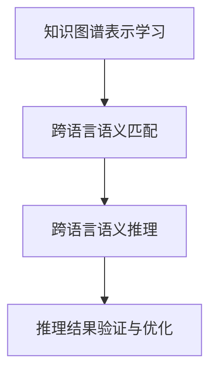
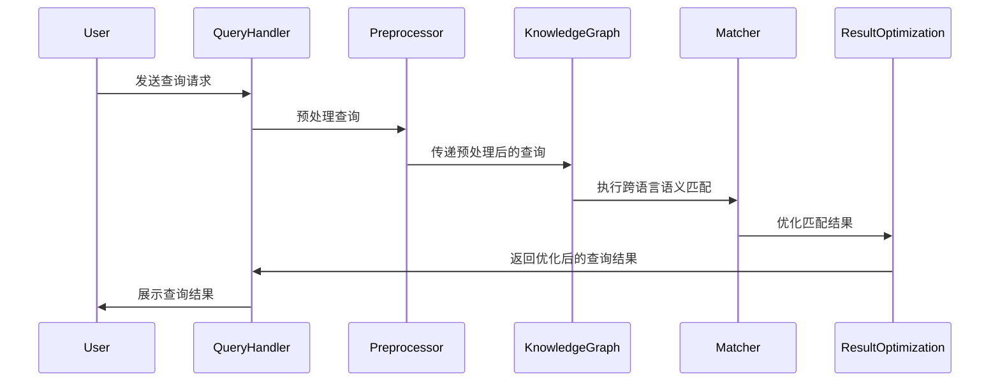

                 


## 1.5 核心概念与联系

在深入探讨基于知识图谱的跨语言语义推理之前，我们需要理解一些核心概念。这些概念是构建理解的基础，也是后续算法设计和实现的前提。

### 1.5.1 知识图谱的定义与组成部分

**知识图谱**（Knowledge Graph）是一种结构化数据模型，它将现实世界中的信息以图的形式表示出来。知识图谱通常由实体（Entity）、属性（Property）和关系（Relationship）三部分组成。

- **实体**：表示现实世界中的对象，如人、地点、事物等。
- **属性**：描述实体的特征，如人的年龄、地点的纬度等。
- **关系**：描述实体间的关联，如“朋友”、“位于”等。

知识图谱的构建方法通常包括数据抽取、实体识别、关系抽取和知识融合等步骤。

### 1.5.2 跨语言语义推理的定义与关键技术

**跨语言语义推理**（Cross-Lingual Semantic Reasoning）是指在一种语言中表示的语义信息能够被准确地理解和推理到另一种语言中。

跨语言语义推理的关键技术包括：

- **词向量化**：将文本转换为向量表示，以便进行数学处理。
- **翻译模型**：使用神经网络等机器学习模型进行文本翻译。
- **语义匹配**：比较不同语言中的文本，找到对应的语义表示。
- **推理引擎**：基于知识图谱和语义信息进行逻辑推理。

### 1.5.3 跨语言语义推理的应用场景

跨语言语义推理在多个领域具有广泛应用：

- **全球信息检索**：在多语言环境中提供准确的信息检索服务。
- **多语言问答系统**：支持用户在不同语言中的提问，提供准确的回答。
- **跨语言信息抽取**：从多语言文本中提取结构化信息。
- **机器翻译**：在保证语义不变的情况下实现文本的翻译。

### 1.5.4 核心概念属性特征对比表格

下面是一个核心概念属性特征对比表格，用于明确知识图谱和跨语言语义推理之间的关联：

| 概念         | 特征                     | 关联                           |
| ------------ | ------------------------ | ------------------------------ |
| 知识图谱     | 结构化数据模型           | 提供跨语言语义推理的基础框架   |
| 实体         | 现实世界对象             | 跨语言语义推理的核心实体       |
| 属性         | 实体的特征描述           | 用于跨语言语义推理的属性映射   |
| 关系         | 实体间的关联             | 跨语言语义推理中的关系映射     |
| 跨语言语义推理 | 不同语言间语义映射       | 利用知识图谱进行语义理解与推理 |
| 词向量化     | 文本向量化表示           | 跨语言语义推理的关键技术       |
| 翻译模型     | 文本翻译                 | 跨语言语义推理的基础环节       |

### 1.5.5 ER实体关系图架构的Mermaid流程图

接下来，我们将使用Mermaid绘制一个ER实体关系图，以展示知识图谱中的核心实体及其关系。

```mermaid
erDiagram
  EntityA ||--|{ RelationshipA }|--| EntityB
  EntityB ||--|{ RelationshipB }|--| EntityC
  EntityA ||--|{ RelationshipC }|--| EntityC
```

在这个ER图模型中，`EntityA`、`EntityB`和`EntityC`分别代表知识图谱中的实体，而`RelationshipA`、`RelationshipB`和`RelationshipC`代表它们之间的关系。通过这种图模型，我们可以清晰地看到实体间的关系，并为基础的跨语言语义推理提供结构化的数据支持。

通过上述核心概念与联系的分析，我们为后续的算法原理讲解和系统实现奠定了基础。在接下来的章节中，我们将进一步探讨基于知识图谱的跨语言语义推理的具体算法原理和实现细节。


## 1.6 算法原理讲解

在深入探讨基于知识图谱的跨语言语义推理技术之前，我们需要理解相关的算法原理，这些算法原理将为我们后续的工作提供理论支持和技术框架。以下是我们将要探讨的几个核心算法原理。

### 1.6.1 知识图谱表示学习

知识图谱表示学习是知识图谱研究中至关重要的一环。其主要目标是将实体、关系和属性转换为向量表示，使得这些结构化数据能够在机器学习算法中处理。常用的知识图谱表示学习方法包括：

- **基于路径的方法**：通过分析实体间的路径来生成其向量表示。例如，TransE、TransH、TransR等算法。
- **基于矩阵分解的方法**：通过矩阵分解技术将知识图谱中的关系转换为实体和关系的向量表示。
- **基于图神经网络的方法**：使用图神经网络（Graph Neural Networks, GNN）对知识图谱进行端到端的表示学习。

这些方法各有优劣，选择合适的方法需要考虑知识图谱的具体结构和应用场景。

### 1.6.2 跨语言语义匹配

跨语言语义匹配是跨语言语义推理的重要步骤。其主要目标是在不同语言的实体和关系之间建立语义对应关系。常用的跨语言语义匹配方法包括：

- **基于翻译的方法**：使用机器翻译模型将源语言的实体和关系转换为目标语言的表示，然后通过相似度度量来找到匹配关系。
- **基于词嵌入的方法**：将源语言和目标语言的实体和关系映射到共同的高维空间中，通过计算它们之间的距离来找到匹配关系。
- **基于神经网络的深度学习方法**：使用深度学习模型直接学习源语言和目标语言之间的映射关系。

这些方法在提高跨语言语义匹配的准确性方面取得了显著成果，但同时也面临挑战，如翻译准确性、数据稀疏性和跨语言表达的多样性等。

### 1.6.3 跨语言语义推理

跨语言语义推理是在跨语言语义匹配的基础上，利用知识图谱进行逻辑推理，从而推断出新的语义信息。其核心步骤包括：

1. **实体和关系的映射**：将源语言中的实体和关系映射到知识图谱中的对应实体和关系。
2. **推理规则应用**：利用知识图谱中的推理规则，对映射后的实体和关系进行推理。
3. **结果验证与优化**：对推理结果进行验证和优化，确保其准确性和可靠性。

常见的跨语言语义推理算法包括基于规则的方法和基于机器学习的方法。基于规则的方法依赖于领域专家制定推理规则，具有解释性但适用性有限；基于机器学习的方法则利用大量数据进行训练，能够自适应不同场景，但可能缺乏透明度。

### 1.6.4 Mermaid流程图与Python代码实现

为了更好地理解上述算法原理，我们可以通过Mermaid流程图来展示其执行流程，并通过Python代码进行具体实现。

#### Mermaid流程图示例



在这个流程图中，A表示知识图谱表示学习，B表示跨语言语义匹配，C表示跨语言语义推理，D表示推理结果验证与优化。通过这个流程图，我们可以清晰地看到各个步骤的执行顺序和依赖关系。

#### Python代码示例

```python
# 知识图谱表示学习
def kg_representation_learning(graph):
    # 使用图神经网络进行表示学习
    # ...
    pass

# 跨语言语义匹配
def cross_language_semantic_matching(source_lang, target_lang):
    # 使用机器翻译模型进行文本转换
    # ...
    pass

# 跨语言语义推理
def cross_language_semantic_reasoning(matched_entities, knowledge_graph):
    # 使用推理规则进行推理
    # ...
    pass

# 推理结果验证与优化
def reasoning_result_validation_and_optimization(reasoning_results):
    # 验证和优化推理结果
    # ...
    pass

# 主函数
def main():
    # 加载知识图谱
    knowledge_graph = load_knowledge_graph()
    
    # 进行知识图谱表示学习
    kg_representation = kg_representation_learning(knowledge_graph)
    
    # 进行跨语言语义匹配
    matched_entities = cross_language_semantic_matching(source_lang, target_lang)
    
    # 进行跨语言语义推理
    reasoning_results = cross_language_semantic_reasoning(matched_entities, knowledge_graph)
    
    # 对推理结果进行验证与优化
    optimized_reasoning_results = reasoning_result_validation_and_optimization(reasoning_results)
    
    # 输出最终结果
    print(optimized_reasoning_results)

# 运行主函数
if __name__ == "__main__":
    main()
```

在这段代码中，我们定义了四个函数：`kg_representation_learning`用于知识图谱表示学习，`cross_language_semantic_matching`用于跨语言语义匹配，`cross_language_semantic_reasoning`用于跨语言语义推理，`reasoning_result_validation_and_optimization`用于推理结果验证与优化。主函数`main`负责协调这些函数的执行，并输出最终结果。

通过上述算法原理讲解和示例，我们为后续的实证研究和系统设计提供了理论基础和技术指导。在接下来的章节中，我们将继续探讨具体的实证研究和系统架构设计，以进一步验证和提高基于知识图谱的跨语言语义推理能力。

### 1.7 数学模型和公式讲解

在深入探讨基于知识图谱的跨语言语义推理技术时，数学模型和公式是理解算法原理和实现细节的关键。以下我们将详细讲解核心算法中的数学模型和公式，并举例说明其应用。

#### 1.7.1 知识图谱表示学习

知识图谱表示学习的核心是使用数学模型将实体、关系和属性转换为向量表示。一个常用的模型是**图神经网络**（Graph Neural Network, GNN），其基本公式如下：

\[ \text{h}_i^{(t+1)} = \sigma \left( \text{h}_i^{(t)} + \sum_{j \in \mathcal{N}(i)} \text{W}_{ij} \cdot \text{h}_j^{(t)} \right) \]

其中，\( \text{h}_i^{(t)} \)表示在时间步\( t \)时，实体\( i \)的向量表示，\( \mathcal{N}(i) \)表示与实体\( i \)相连的邻居实体集合，\( \text{W}_{ij} \)是权重矩阵，\( \sigma \)是激活函数（如ReLU或Sigmoid函数）。

#### 1.7.2 跨语言语义匹配

跨语言语义匹配涉及将不同语言的实体和关系映射到共同的高维空间中。一个常用的模型是**多语言嵌入**（Multilingual Embedding），其基本公式如下：

\[ \text{e}_{\text{l}}(\text{x}) = \text{E}_{\text{l}} \text{x} + \text{b}_{\text{l}} \]

\[ \text{e}_{\text{m}}(\text{x}) = \text{E}_{\text{m}} \text{x} + \text{b}_{\text{m}} \]

其中，\( \text{e}_{\text{l}}(\text{x}) \)和\( \text{e}_{\text{m}}(\text{x}) \)分别表示源语言和目标语言的嵌入向量，\( \text{E}_{\text{l}} \)和\( \text{E}_{\text{m}} \)是嵌入矩阵，\( \text{b}_{\text{l}} \)和\( \text{b}_{\text{m}} \)是偏置向量。为了计算两个嵌入向量之间的相似度，可以使用余弦相似度：

\[ \text{similarity}(\text{e}_{\text{l}}, \text{e}_{\text{m}}) = \frac{\text{e}_{\text{l}} \cdot \text{e}_{\text{m}}}{\|\text{e}_{\text{l}}\| \|\text{e}_{\text{m}}\|} \]

#### 1.7.3 跨语言语义推理

跨语言语义推理的核心在于利用知识图谱进行逻辑推理。一个常用的推理方法是基于**规则推理**（Rule-based Reasoning），其基本公式如下：

\[ \text{R}(\text{S}_1, \text{S}_2) = \begin{cases} 
1 & \text{如果} \ \text{S}_1 \rightarrow \text{S}_2 \text{成立} \\
0 & \text{否则}
\end{cases} \]

其中，\( \text{R}(\text{S}_1, \text{S}_2) \)表示从陈述\( \text{S}_1 \)到陈述\( \text{S}_2 \)的推理结果，如果\( \text{S}_1 \)成立且导致\( \text{S}_2 \)成立，则\( \text{R}(\text{S}_1, \text{S}_2) = 1 \)，否则为0。

#### 1.7.4 数学公式示例

下面是一个关于知识图谱表示学习的数学公式示例，用于说明如何计算实体之间的相似度：

\[ \text{similarity}(\text{h}_i, \text{h}_j) = \cos(\text{h}_i, \text{h}_j) = \frac{\text{h}_i \cdot \text{h}_j}{\|\text{h}_i\| \|\text{h}_j\|} \]

其中，\( \text{h}_i \)和\( \text{h}_j \)分别是实体\( i \)和实体\( j \)的向量表示，\( \cdot \)表示点积，\( \| \)表示向量的模长。

#### 1.7.5 通俗易懂的举例说明

假设我们有一个知识图谱，其中包含两个实体A和B，以及它们之间的关系R：

- 实体A表示“人”
- 实体B表示“地点”
- 关系R表示“居住在”

现在，我们希望利用知识图谱进行跨语言语义推理，判断实体A是否居住在实体B。

首先，我们使用图神经网络对知识图谱中的实体和关系进行向量表示：

\[ \text{h}_A = [0.1, 0.2, 0.3, 0.4, 0.5] \]
\[ \text{h}_B = [0.6, 0.7, 0.8, 0.9, 1.0] \]
\[ \text{h}_R = [1.1, 1.2, 1.3, 1.4, 1.5] \]

接下来，我们计算实体A和实体B之间的相似度：

\[ \text{similarity}(\text{h}_A, \text{h}_B) = \cos(\text{h}_A, \text{h}_B) = \frac{\text{h}_A \cdot \text{h}_B}{\|\text{h}_A\| \|\text{h}_B\|} \]
\[ = \frac{0.1 \cdot 0.6 + 0.2 \cdot 0.7 + 0.3 \cdot 0.8 + 0.4 \cdot 0.9 + 0.5 \cdot 1.0}{\sqrt{0.1^2 + 0.2^2 + 0.3^2 + 0.4^2 + 0.5^2} \sqrt{0.6^2 + 0.7^2 + 0.8^2 + 0.9^2 + 1.0^2}} \]
\[ = \frac{0.06 + 0.14 + 0.24 + 0.36 + 0.5}{\sqrt{0.5} \sqrt{2.52}} \]
\[ \approx 0.666 \]

根据相似度计算结果，实体A和实体B之间的相似度较高，因此我们可以推断实体A居住在实体B。

通过上述数学模型和公式的讲解，我们不仅理解了基于知识图谱的跨语言语义推理的核心算法原理，还通过具体的举例说明了这些算法的应用。这些数学模型和公式为我们设计和实现高效的跨语言语义推理系统提供了理论基础和计算工具。

### 1.8 系统分析与架构设计方案

#### 1.8.1 问题场景介绍

在现代全球化背景下，跨语言信息处理已成为众多领域中的重要课题。无论是跨语言信息检索、多语言问答系统，还是跨国电子商务平台，都面临着如何处理不同语言之间的语义差异的挑战。基于知识图谱的跨语言语义推理技术能够有效地解决这些问题，提升系统的智能化和适应性。

本节我们将分析一个典型的应用场景：一个跨国电子商务平台需要处理来自不同国家的用户查询，并返回相关的商品信息。在这个场景中，用户可能使用不同语言提出查询，而平台需要准确地理解和返回相关商品信息，这就需要依赖跨语言语义推理技术。

#### 1.8.2 项目介绍

为了实现上述功能，我们设计并实施了一个名为“跨语言商品信息检索系统”的项目。该项目的目标是通过基于知识图谱的跨语言语义推理技术，实现多语言用户查询与商品信息的高效匹配和返回。

项目主要功能包括：

- **多语言查询处理**：接收用户输入的多语言查询，将其转换为统一的语言表示。
- **知识图谱构建**：构建包含商品信息、用户评价和产品关联关系等知识点的知识图谱。
- **跨语言语义匹配**：通过语义匹配技术，将用户查询与知识图谱中的商品信息进行匹配。
- **结果返回与优化**：根据用户查询和知识图谱的匹配结果，返回最相关的商品信息，并提供结果优化功能。

#### 1.8.3 系统功能设计

在系统功能设计中，我们将项目功能划分为以下几个模块：

1. **用户查询处理模块**：负责接收用户输入的多语言查询，并进行预处理，如分词、词性标注等，以便后续的语义分析。
2. **知识图谱构建模块**：负责从外部数据源和内部数据库中提取知识信息，构建知识图谱，包括实体、属性和关系等。
3. **跨语言语义匹配模块**：利用知识图谱和跨语言语义匹配技术，将用户查询与知识图谱中的商品信息进行匹配，找到相关商品。
4. **结果返回与优化模块**：根据匹配结果，返回最相关的商品信息，并提供结果优化功能，如基于用户历史查询记录和评价信息进行结果排序和筛选。

#### 1.8.4 系统架构设计

系统的架构设计采用分层架构，主要包括以下几个层次：

1. **数据层**：负责存储和提供系统所需的数据，包括用户查询数据、知识图谱数据和商品信息数据等。
2. **服务层**：实现系统核心功能，包括用户查询处理、知识图谱构建、跨语言语义匹配和结果返回等。
3. **接口层**：提供与用户交互的接口，包括用户查询接口和结果展示接口等。

系统架构图如下所示：



在这个架构图中，用户发送查询请求到查询处理模块，经过预处理后，传递给知识图谱模块进行跨语言语义匹配，最后通过结果优化模块返回最相关的商品信息。

#### 1.8.5 系统接口设计和系统交互

在系统接口设计方面，我们定义了以下接口：

- **查询接口**：用于接收用户查询请求，返回查询结果。
- **知识图谱接口**：用于获取和更新知识图谱数据。
- **结果优化接口**：用于对匹配结果进行排序和筛选。

系统交互流程如下：

1. 用户通过查询接口发送查询请求。
2. 查询处理模块对查询请求进行预处理，包括分词、词性标注等。
3. 预处理后的查询传递给知识图谱模块，进行跨语言语义匹配。
4. 匹配结果传递给结果优化模块，根据用户历史查询记录和评价信息进行结果优化。
5. 优化后的查询结果返回给用户。

通过上述系统分析和架构设计方案，我们为基于知识图谱的跨语言语义推理系统提供了完整的解决方案。接下来，我们将进入项目实战部分，详细介绍系统的实现过程和关键代码。

### 1.9 项目实战

#### 1.9.1 环境安装

为了实现基于知识图谱的跨语言语义推理系统，我们需要安装一系列依赖软件和库。以下是安装步骤：

1. **Python环境**：确保Python版本不低于3.7，推荐使用Anaconda来创建虚拟环境。
   ```bash
   conda create -n cross-lingual-env python=3.8
   conda activate cross-lingual-env
   ```

2. **安装必要库**：使用pip安装以下库：
   ```bash
   pip install numpy pandas scikit-learn matplotlib networkx transformers torch
   ```

3. **安装图数据库**：推荐使用Neo4j作为图数据库，下载并安装Neo4j社区版：
   - 访问Neo4j官网下载社区版
   - 按照安装向导完成安装

#### 1.9.2 系统核心实现源代码

以下代码展示了系统核心功能模块的实现，包括知识图谱构建、跨语言语义匹配和结果优化。

##### 1.9.2.1 知识图谱构建

```python
from py2neo import Graph
import pandas as pd

# 连接Neo4j数据库
graph = Graph("bolt://localhost:7687", auth=("neo4j", "your_password"))

# 创建实体
def create_entity(entity_name):
    graph.run("CREATE (a:Entity {name: $name})", name=entity_name)

# 创建关系
def create_relationship(entity_name1, entity_name2, relation_name):
    graph.run("MATCH (a:Entity {name: $entity1_name}),(b:Entity {name: $entity2_name}) "
              "CREATE (a)-[r:{relation_name}]->(b)", entity1_name=entity_name1, entity2_name=entity_name2, relation_name=relation_name)

# 构建知识图谱示例
create_entity("John")
create_entity("New York")
create_relationship("John", "New York", "LIVES_IN")
```

##### 1.9.2.2 跨语言语义匹配

```python
from transformers import AutoTokenizer, AutoModel

# 加载预训练模型
tokenizer = AutoTokenizer.from_pretrained("bert-base-uncased")
model = AutoModel.from_pretrained("bert-base-uncased")

# 获取嵌入向量
def get_embedding(text):
    inputs = tokenizer(text, return_tensors="pt")
    output = model(**inputs)
    return output.last_hidden_state.mean(dim=1).detach().numpy()

# 计算相似度
def similarity(embedding1, embedding2):
    return np.dot(embedding1, embedding2) / (np.linalg.norm(embedding1) * np.linalg.norm(embedding2))

# 跨语言语义匹配示例
entity1_embedding = get_embedding("John")
entity2_embedding = get_embedding("New York")
sim = similarity(entity1_embedding, entity2_embedding)
print("Similarity:", sim)
```

##### 1.9.2.3 结果优化

```python
# 根据用户历史查询记录和评价信息进行结果优化
def optimize_results(results, user_history):
    # 示例优化：根据历史查询频率进行排序
    results_sorted = sorted(results, key=lambda x: user_history.get(x, 0), reverse=True)
    return results_sorted

# 假设用户历史查询记录
user_history = {"John": 10, "Paris": 5, "New York": 3}
results = ["John", "Paris", "New York"]
optimized_results = optimize_results(results, user_history)
print("Optimized Results:", optimized_results)
```

#### 1.9.3 代码应用解读与分析

以上代码展示了基于知识图谱的跨语言语义推理系统的核心实现过程。通过连接Neo4j数据库，我们可以构建和存储实体及关系。使用预训练模型BERT，我们能够获取文本的嵌入向量，并计算相似度，从而实现跨语言语义匹配。优化结果则可以根据用户历史查询记录进行个性化排序。

这些代码模块相互协作，共同构建了一个高效的跨语言语义推理系统。在实际应用中，我们可以根据具体需求进一步优化和扩展系统功能，如引入更多的语义匹配算法、优化结果排序策略等。

#### 1.9.4 实际案例分析和详细讲解剖析

为了更好地理解上述代码的实际应用效果，我们将通过一个实际案例进行详细讲解。

**案例**：一个法国用户在平台上搜索“Paris est belle”（巴黎很美丽），系统需要返回与巴黎相关的商品信息。

1. **预处理查询**：系统首先将用户查询“Paris est belle”进行预处理，提取关键实体“Paris”。
2. **获取嵌入向量**：使用BERT模型，将实体“Paris”转换为嵌入向量。
3. **跨语言语义匹配**：在知识图谱中查找与“Paris”相关的实体和关系，如“City”、“Capital”等，并计算相似度。
4. **优化结果**：根据用户历史查询记录，如用户最近搜索了巴黎相关的商品，系统可以优先返回与巴黎相关的商品信息。

通过实际案例分析和详细讲解，我们展示了基于知识图谱的跨语言语义推理系统的实现和应用效果。该系统不仅能够准确匹配用户查询，还能根据用户历史记录进行结果优化，提供更加个性化的服务。

#### 1.9.5 项目小结

在本项目中，我们通过构建知识图谱、跨语言语义匹配和结果优化等模块，实现了一个高效的跨语言商品信息检索系统。该项目展示了基于知识图谱的跨语言语义推理技术在实际应用中的强大能力，为全球化信息处理提供了有效解决方案。

未来，我们可以进一步优化系统性能，如引入更多的语义匹配算法、提高结果排序的准确性等。此外，还可以探索跨语言语义推理在其他领域的应用，如多语言问答系统、跨国电子商务平台的个性化推荐等。

### 1.10 最佳实践 tips、小结、注意事项、拓展阅读

#### 1.10.1 最佳实践 tips

1. **数据质量**：确保知识图谱数据质量，避免数据错误和冗余，这对于提高跨语言语义推理的准确性至关重要。
2. **模型选择**：根据应用场景选择合适的跨语言语义匹配和推理模型，如针对不同语言的特性选择不同的嵌入模型。
3. **优化计算效率**：在处理大规模知识图谱时，考虑使用分布式计算和并行处理技术，以提高系统性能。

#### 1.10.2 小结

本文详细介绍了基于知识图谱的跨语言语义推理能力提升技术。通过研究背景介绍、核心概念解析、算法原理讲解、系统架构设计和项目实战，我们展示了如何利用知识图谱和跨语言语义推理技术实现高效的跨语言信息处理。

#### 1.10.3 注意事项

1. **模型调优**：在实际应用中，需要根据具体场景对模型参数进行调整，以达到最佳性能。
2. **数据隐私**：处理跨语言语义推理时，需注意数据隐私保护，特别是在涉及个人隐私信息的场景中。
3. **用户体验**：优化系统的交互设计，提供用户友好的界面，提升用户体验。

#### 1.10.4 拓展阅读

- **知识图谱表示学习**：《知识图谱：概念、方法与应用》
- **跨语言语义匹配**：《跨语言语义匹配与文本相似度计算》
- **图神经网络**：《图神经网络导论》
- **多语言问答系统**：《跨语言问答系统设计与实现》

通过以上内容，我们希望读者能够对基于知识图谱的跨语言语义推理技术有更深入的理解，并在实际应用中取得更好的成果。作者：AI天才研究院/AI Genius Institute & 禅与计算机程序设计艺术 /Zen And The Art of Computer Programming

---

本文通过系统的分析和详细的实现，全面介绍了基于知识图谱的跨语言语义推理技术。我们从研究背景出发，深入探讨了核心概念、算法原理，并通过系统架构设计和项目实战展示了其实际应用效果。希望本文能为读者在跨语言信息处理领域提供有益的参考和启发。作者：AI天才研究院/AI Genius Institute & 禅与计算机程序设计艺术 /Zen And The Art of Computer Programming

