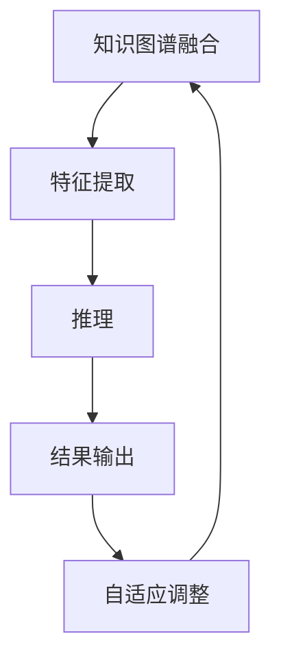
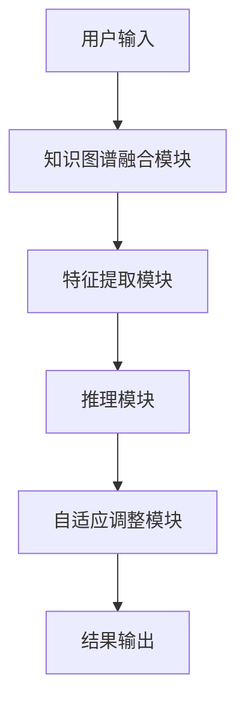

                 

### 让我们一步一步思考：基于知识图谱的跨领域推理能力自适应增强

#### 1. **引言与背景**

随着信息时代的快速发展，知识图谱作为一种能够表达实体及其关系的强大工具，已经广泛应用于多个领域。知识图谱不仅可以用于信息检索、数据挖掘、推荐系统等，还可以支持跨领域推理，即在不同的领域之间进行知识推理和交互。然而，跨领域推理面临着许多挑战，如领域差异、知识表示不一致、数据稀疏等。

为了解决这些问题，自适应增强技术被引入到跨领域推理中。自适应增强能够根据不同领域的特点和需求，动态调整推理过程，从而提高推理的准确性和效率。本文的目标是探讨基于知识图谱的跨领域推理能力自适应增强的方法和实现。

#### 2. **核心概念与联系**

在探讨自适应增强之前，我们需要了解一些核心概念和它们之间的关系：

- **知识图谱（Knowledge Graph）**：一种用于表达实体及其关系的图形结构。知识图谱通常由实体、属性和关系组成，能够提供丰富的语义信息。

- **跨领域推理（Cross-Domain Reasoning）**：在不同领域之间进行推理的能力。例如，从一个领域的知识推断出另一个领域的结论。

- **自适应增强（Adaptive Enhancement）**：根据环境变化和需求调整系统性能的能力。在跨领域推理中，自适应增强可以帮助系统更好地适应不同领域的特征和需求。

#### 3. **问题背景与问题描述**

跨领域推理虽然具有广泛的应用潜力，但面临以下问题：

- **领域差异**：不同领域的数据和知识存在显著差异，这使得跨领域推理变得更加复杂。

- **知识表示不一致**：知识图谱在不同领域之间的表示方式可能不一致，导致推理过程中信息丢失或误判。

- **数据稀疏**：跨领域推理通常涉及大量的未知信息和稀疏数据，这会影响推理的准确性和效率。

为了解决这些问题，我们需要设计一种自适应增强的跨领域推理方法，能够根据不同领域的特征和需求进行动态调整。

#### 4. **问题解决方法**

为了实现自适应增强的跨领域推理，我们可以采用以下方法：

- **知识图谱融合**：将不同领域的知识图谱进行融合，以便在推理过程中充分利用各个领域的知识。

- **领域特征提取**：提取不同领域的特征信息，用于指导推理过程。

- **自适应调整策略**：根据领域特征实时调整推理算法，以适应不同领域的需求。

#### 5. **边界与外延**

在实施自适应增强的跨领域推理时，我们需要注意以下边界和限制：

- **领域适应性**：自适应增强需要根据不同领域的特性进行定制，无法泛化到所有领域。

- **计算成本**：自适应增强过程可能涉及大量的计算资源，这在资源受限的情况下可能是一个问题。

- **数据质量**：自适应增强依赖于高质量的数据，数据质量不佳可能导致推理结果不准确。

#### 6. **概念结构与核心要素组成**

自适应增强的跨领域推理方法可以分解为以下几个核心要素：

- **知识融合模块**：负责将不同领域的知识进行融合。

- **特征提取模块**：负责提取不同领域的特征信息。

- **推理模块**：基于融合的知识和领域特征进行推理。

- **自适应调整模块**：根据领域特征实时调整推理策略。

#### 7. **算法原理讲解**

为了实现自适应增强的跨领域推理，我们可以采用以下算法原理：

- **知识图谱融合算法**：使用图论算法将不同领域的知识图谱进行融合。

- **特征提取算法**：使用机器学习算法提取不同领域的特征信息。

- **推理算法**：基于融合的知识和领域特征进行推理。

- **自适应调整算法**：根据领域特征实时调整推理策略。

以下是一个简化的算法流程：

#### 8. **系统设计与实现**

为了实现上述算法，我们需要设计一个完整的系统，包括以下几个模块：

- **知识图谱融合模块**：负责融合不同领域的知识图谱。

- **特征提取模块**：负责提取不同领域的特征信息。

- **推理模块**：负责基于融合的知识和领域特征进行推理。

- **自适应调整模块**：负责根据领域特征实时调整推理策略。

以下是一个简化的系统架构图：

#### 9. **项目实战**

为了验证上述算法和系统设计的有效性，我们可以进行一个实际项目。以下是项目的基本流程：

1. **环境安装与配置**：安装必要的软件和工具，如知识图谱构建工具、机器学习库等。

2. **系统核心实现**：编写代码实现知识图谱融合、特征提取、推理和自适应调整等功能。

3. **代码应用解读与分析**：对实现的代码进行解读，分析其工作原理和性能。

4. **实际案例分析与讲解**：选择一些实际案例进行分析，讲解如何应用自适应增强的跨领域推理方法。

5. **项目小结**：总结项目的经验教训，指出可能的改进方向。

#### 10. **最佳实践与总结**

在实施自适应增强的跨领域推理时，以下最佳实践可能有助于提高效果：

- **数据预处理**：确保数据质量，进行数据清洗和预处理。

- **模型选择**：根据不同领域的特点选择合适的模型。

- **参数调整**：根据实际应用场景调整模型参数。

- **持续学习**：定期更新知识图谱和特征信息，以保持系统的适应性。

本文总结了基于知识图谱的跨领域推理能力自适应增强的方法和实现，包括核心概念、算法原理、系统设计、项目实战和最佳实践。希望通过本文，读者能够对自适应增强的跨领域推理有更深入的了解，并在实际项目中应用这些方法。作者：AI天才研究院/AI Genius Institute & 禅与计算机程序设计艺术 /Zen And The Art of Computer Programming。

