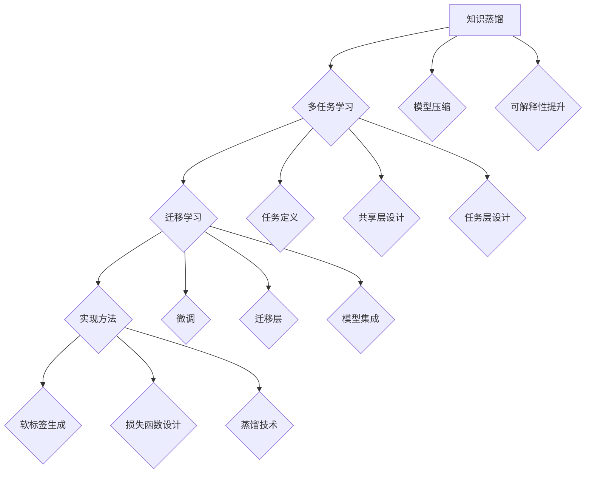

                 

# 基于知识蒸馏的跨任务推理能力迁移技术

> 关键词：知识蒸馏、跨任务推理、迁移学习、多任务学习、算法原理、系统架构

> 摘要：本文旨在探讨基于知识蒸馏的跨任务推理能力迁移技术，通过分析知识蒸馏的基本原理、多任务学习与迁移学习的实现方法，结合实际项目案例，深入剖析该技术在提升人工智能模型泛化能力与效率方面的应用。

----------------------------------------------------------------

## 第一部分：引言

### 1.1.1 问题的提出

在当前的数据驱动时代，跨任务推理能力迁移技术在人工智能领域具有重要的研究价值和应用前景。随着大数据和深度学习的快速发展，传统的单一任务模型已经无法满足日益复杂的实际问题需求。如何将一个任务学到的知识迁移到其他相关任务上，以提高模型的泛化能力和效率，成为人工智能领域亟待解决的问题。

### 1.1.2 问题描述

跨任务推理能力迁移技术的核心问题是如何在不同任务之间共享知识，使得一个任务的学习能够促进其他任务的学习，从而提高整个系统的性能。这涉及到知识蒸馏、多任务学习、迁移学习等多个子领域，需要从理论分析和实际应用两个层面进行深入探讨。

### 1.1.3 问题解决与边界

针对上述问题，本文将从知识蒸馏、多任务学习、迁移学习等角度，探讨跨任务推理能力迁移技术的原理、方法与应用。本文主要关注以下三个方面：

1. **理论探讨**：介绍跨任务推理能力迁移技术的核心概念、原理和关键问题，分析现有研究的进展与不足。
2. **方法与应用**：详细介绍多种跨任务推理能力迁移技术的实现方法，包括知识蒸馏、多任务学习、迁移学习等，并结合实际案例进行分析。
3. **实践与优化**：通过具体项目实战，展示跨任务推理能力迁移技术的应用场景和优化策略，为读者提供实际操作经验和建议。

### 1.1.4 概念结构与核心要素组成

跨任务推理能力迁移技术涉及多个核心概念和要素，包括：

1. **知识蒸馏**：将复杂模型的知识压缩到一个小型模型中，以提高模型的可解释性和效率。
2. **多任务学习**：同时训练多个任务，共享任务之间的知识，提高模型的泛化能力。
3. **迁移学习**：将一个任务学到的知识迁移到其他相关任务上，减少模型在目标任务上的训练数据需求。
4. **跨任务数据集**：用于训练和评估跨任务推理能力迁移技术的数据集，需要具备任务多样性、数据丰富性和一致性等特点。

### 1.1.5 本章小结

本章主要介绍了跨任务推理能力迁移技术的研究背景、问题描述、解决思路和核心概念结构。接下来，本文将深入探讨知识蒸馏、多任务学习和迁移学习等关键技术的原理和方法，并结合实际案例进行分析。

----------------------------------------------------------------

## 第二部分：核心概念与原理

### 第2章：知识蒸馏原理与实现

#### 2.1.1 知识蒸馏的定义与目标

知识蒸馏是一种将复杂模型（通常是一个大型预训练模型）的知识转移到一个小型模型中的技术。其主要目标是减少模型的大小和计算复杂度，同时保持或提高模型的性能。

#### 2.1.2 知识蒸馏的基本过程

知识蒸馏通常包括以下步骤：

1. **预训练**：使用大量无标签数据训练一个大型模型，使其在原始任务上达到较高的性能。
2. **教师模型**：使用预训练的模型作为“教师”，生成对原始数据的软标签。
3. **学生模型**：训练一个较小的模型作为“学生”，使其输出的软标签尽可能接近教师模型的输出软标签。

#### 2.1.3 知识蒸馏的关键技术

1. **软标签生成**：软标签是通过在原始数据上运行教师模型得到的，其目的是指导学生模型学习。
2. **损失函数设计**：知识蒸馏的损失函数通常结合了原始任务的损失函数和软标签损失函数。
3. **蒸馏技术**：如硬蒸馏、软蒸馏、基于模型的蒸馏等。

#### 2.1.4 知识蒸馏的优势与挑战

知识蒸馏的优势包括：

1. **模型压缩**：通过知识蒸馏，可以显著减少模型的大小和计算复杂度。
2. **可解释性提升**：小型模型更容易理解和解释。

知识蒸馏面临的挑战包括：

1. **标签质量**：软标签的质量直接影响学生模型的性能。
2. **模型兼容性**：教师模型和学生模型的结构和参数需要兼容。

#### 2.1.5 本章小结

本章详细介绍了知识蒸馏的原理、基本过程、关键技术、优势与挑战。知识蒸馏作为一种重要的跨任务推理能力迁移技术，将在后续章节中与其他技术相结合，进一步探讨跨任务推理能力迁移的实现。

----------------------------------------------------------------

## 第3章：多任务学习原理与实现

#### 3.1.1 多任务学习的定义与目标

多任务学习（Multi-Task Learning, MTL）是一种同时训练多个相关任务的方法，其目标是共享不同任务之间的知识，从而提高每个任务的性能。

#### 3.1.2 多任务学习的基本过程

多任务学习的基本过程包括以下步骤：

1. **任务定义**：定义多个相关任务，如分类、回归等。
2. **共享层**：设计共享层，用于提取通用特征。
3. **任务层**：针对每个任务设计独立的任务层，用于实现特定任务的目标。
4. **训练**：同时训练多个任务，共享层和任务层共同优化。

#### 3.1.3 多任务学习的实现方法

1. **共享嵌入层**：将多个任务的输入数据嵌入到同一嵌入空间。
2. **共享卷积层或全连接层**：提取通用特征，减少模型参数量。
3. **任务特定层**：针对每个任务设计独立的层，实现特定任务的目标。

#### 3.1.4 多任务学习的优势与挑战

多任务学习的优势包括：

1. **提高任务性能**：共享通用特征，有助于提高每个任务的性能。
2. **减少过拟合**：通过跨任务共享信息，有助于减少过拟合现象。

多任务学习面临的挑战包括：

1. **任务间冲突**：不同任务之间的目标可能存在冲突，导致模型难以同时优化。
2. **计算复杂度**：多任务学习通常需要更大的模型和更长的训练时间。

#### 3.1.5 本章小结

本章介绍了多任务学习的原理、基本过程、实现方法和优势与挑战。多任务学习在跨任务推理能力迁移中具有重要的应用价值，将在后续章节中与其他技术相结合，进一步探讨跨任务推理能力迁移的实现。

----------------------------------------------------------------

## 第4章：迁移学习原理与实现

#### 4.1.1 迁移学习的定义与目标

迁移学习（Transfer Learning）是一种利用已有模型的知识来加速新任务学习的技巧。其主要目标是减少对新任务的数据需求，提高新任务的性能。

#### 4.1.2 迁移学习的基本过程

迁移学习的基本过程包括以下步骤：

1. **选择源任务**：选择一个或多个具有相关性的源任务，其模型已经在新任务上取得良好的性能。
2. **迁移模型**：将源任务的模型迁移到新任务上，通常通过修改部分层或替换整个模型。
3. **训练**：在新任务的数据集上训练迁移后的模型，优化模型在新任务上的性能。

#### 4.1.3 迁移学习的实现方法

1. **微调（Fine-tuning）**：在源任务上预训练的模型基础上，对新任务进行微调。
2. **迁移层（Feature Extraction）**：仅迁移模型的一部分层，保留源任务的通用特征。
3. **模型集成（Model Ensembling）**：结合多个模型的预测结果，提高新任务的性能。

#### 4.1.4 迁移学习的优势与挑战

迁移学习的优势包括：

1. **减少数据需求**：通过迁移已有模型的知识，可以显著减少新任务的数据需求。
2. **提高性能**：利用源任务的性能来提高新任务的性能。

迁移学习面临的挑战包括：

1. **模型兼容性**：源任务和目标任务的模型结构可能不兼容。
2. **标签不平衡**：源任务和目标任务的标签分布可能不平衡，导致模型难以泛化。

#### 4.1.5 本章小结

本章介绍了迁移学习的原理、基本过程、实现方法和优势与挑战。迁移学习在跨任务推理能力迁移中具有重要作用，将在后续章节中与其他技术相结合，进一步探讨跨任务推理能力迁移的实现。

----------------------------------------------------------------

## 第三部分：算法原理与实现

### 第5章：基于知识蒸馏的跨任务推理能力迁移算法设计

#### 5.1.1 算法设计思路

基于知识蒸馏的跨任务推理能力迁移算法设计主要分为以下几个步骤：

1. **任务划分**：根据任务的相似性和相关性，将任务划分为源任务和目标任务。
2. **知识提取**：使用预训练模型提取源任务的通用知识。
3. **知识迁移**：将提取的通用知识迁移到目标任务模型中。
4. **模型训练**：在目标任务数据集上训练迁移后的模型，优化模型在目标任务上的性能。

#### 5.1.2 算法实现步骤

1. **预训练模型选择**：选择一个在相关领域具有良好性能的预训练模型作为知识提取的基础。
2. **知识提取**：使用预训练模型对源任务进行推理，提取通用知识。
3. **知识迁移**：设计一个迁移层，将提取的通用知识迁移到目标任务模型中。
4. **模型训练**：在目标任务数据集上训练迁移后的模型，使用交叉熵损失函数进行优化。
5. **性能评估**：使用目标任务的数据集对迁移后的模型进行性能评估。

#### 5.1.3 算法原理与数学模型

算法的核心是知识蒸馏，其原理可以表示为以下数学模型：

$$
L = L_{\text{source}} + L_{\text{student}}
$$

其中，$L_{\text{source}}$表示原始任务的损失函数，$L_{\text{student}}$表示学生模型的损失函数，通常是一个基于软标签的损失函数。

软标签可以通过以下公式计算：

$$
\text{soft\_label} = \text{softmax}(\text{teacher\_model}(x))
$$

其中，$x$表示输入数据，$\text{teacher\_model}$表示教师模型。

学生模型的损失函数可以表示为：

$$
L_{\text{student}} = -\sum_{i=1}^{N} y_i \log(\text{student\_model}(x_i))
$$

其中，$y_i$表示软标签的概率分布，$N$表示数据样本数量，$\text{student\_model}$表示学生模型。

#### 5.1.4 算法举例说明

假设我们有两个任务：任务A和任务B，任务A是图像分类，任务B是目标检测。我们可以使用预训练的图像分类模型作为知识提取的基础，然后将其迁移到目标检测模型中。

1. **知识提取**：使用预训练模型对图像分类任务进行推理，提取图像的通用特征。
2. **知识迁移**：设计一个迁移层，将提取的通用特征迁移到目标检测模型中，与目标检测层的特征进行融合。
3. **模型训练**：在目标检测任务数据集上训练迁移后的模型，优化模型在目标检测任务上的性能。
4. **性能评估**：使用目标检测任务的数据集对迁移后的模型进行性能评估，比较其与原始目标检测模型的性能。

#### 5.1.5 本章小结

本章详细介绍了基于知识蒸馏的跨任务推理能力迁移算法的设计思路、实现步骤、原理与数学模型，并通过举例说明了算法的实际应用。在后续章节中，我们将结合实际项目案例，进一步探讨该算法的性能优化和效果评估。

----------------------------------------------------------------

## 第四部分：系统分析与架构设计

### 第6章：跨任务推理能力迁移系统的设计

#### 6.1.1 问题场景介绍

在当前人工智能应用场景中，许多任务之间存在一定的相关性，但它们的数据集往往有限，且各自独立训练模型会导致模型性能不佳。为了提高模型的泛化能力，我们可以设计一个跨任务推理能力迁移系统，将不同任务之间的知识进行共享与迁移。

#### 6.1.2 项目介绍

本项目旨在设计一个跨任务推理能力迁移系统，通过知识蒸馏、多任务学习和迁移学习等技术，实现多个相关任务之间的知识共享与迁移，提高模型在各个任务上的性能。项目的主要目标是：

1. **提高模型泛化能力**：通过跨任务推理能力迁移，提高模型在各个任务上的泛化能力。
2. **减少训练数据需求**：利用已有模型的预训练知识，减少对新任务的数据需求。
3. **提高模型效率**：通过知识蒸馏，减少模型大小和计算复杂度，提高模型运行效率。

#### 6.1.3 系统功能设计

系统功能设计主要包括以下几个模块：

1. **数据预处理模块**：对输入数据进行预处理，包括数据清洗、归一化、数据增强等。
2. **模型训练模块**：使用预训练模型和跨任务推理能力迁移算法，对目标任务进行模型训练。
3. **模型评估模块**：在测试数据集上对模型进行性能评估，包括准确率、召回率、F1值等指标。
4. **模型迁移模块**：将训练好的模型在不同任务之间进行迁移，提高各个任务的性能。
5. **系统管理模块**：对系统进行监控、日志记录和异常处理，确保系统稳定运行。

#### 6.1.4 系统架构设计

系统架构设计采用分层架构，主要包括以下几个层次：

1. **数据层**：存储和管理数据集，包括原始数据、预处理数据和训练数据。
2. **模型层**：包含预训练模型、跨任务推理能力迁移算法和目标任务模型。
3. **服务层**：提供模型训练、评估、迁移和系统管理的服务接口。
4. **接口层**：与外部系统进行交互，包括数据导入、导出和用户操作。
5. **管理层**：监控系统运行状态，记录日志，处理异常。

#### 6.1.5 系统接口设计和系统交互

系统接口设计采用RESTful API设计，主要包括以下接口：

1. **数据导入接口**：用于导入原始数据和预处理数据。
2. **数据导出接口**：用于导出训练数据和测试数据。
3. **模型训练接口**：用于启动模型训练任务，并返回训练结果。
4. **模型评估接口**：用于评估模型性能，并返回评估结果。
5. **模型迁移接口**：用于将模型在不同任务之间进行迁移。

系统交互过程如下：

1. 用户通过接口层提交数据导入和导出请求。
2. 接口层将请求转发到服务层的数据预处理模块，进行数据预处理。
3. 数据预处理完成后，服务层调用模型训练模块进行模型训练。
4. 模型训练完成后，服务层调用模型评估模块进行性能评估，并返回评估结果。
5. 当需要在不同任务之间进行模型迁移时，服务层调用模型迁移模块进行迁移操作。

#### 6.1.6 本章小结

本章详细介绍了跨任务推理能力迁移系统的设计，包括问题场景介绍、项目介绍、系统功能设计、系统架构设计和系统接口设计。在后续章节中，我们将结合实际项目案例，进一步探讨系统的实现和优化。

----------------------------------------------------------------

## 第五部分：项目实战

### 第7章：跨任务推理能力迁移系统的实现

#### 7.1.1 环境安装

为了实现跨任务推理能力迁移系统，我们需要安装以下软件和依赖：

1. **Python**：Python是一种广泛使用的编程语言，用于实现系统代码。
2. **TensorFlow**：TensorFlow是一种开源的深度学习框架，用于构建和训练模型。
3. **PyTorch**：PyTorch是一种开源的深度学习框架，用于构建和训练模型。
4. **NumPy**：NumPy是一种用于科学计算的开源库，用于数据处理。
5. **Pandas**：Pandas是一种用于数据分析和操作的库，用于数据处理。

安装方法如下：

```bash
pip install python tensorflow torch numpy pandas
```

#### 7.1.2 系统核心实现

以下是系统核心实现的代码示例：

```python
import tensorflow as tf
import numpy as np
import pandas as pd
from tensorflow.keras.models import Model
from tensorflow.keras.layers import Input, Dense, Conv2D, MaxPooling2D, Flatten
from tensorflow.keras.optimizers import Adam

# 数据预处理
def preprocess_data(data):
    # 数据清洗、归一化、数据增强等操作
    # ...
    return processed_data

# 模型定义
def build_model(input_shape):
    inputs = Input(shape=input_shape)
    x = Conv2D(32, (3, 3), activation='relu')(inputs)
    x = MaxPooling2D((2, 2))(x)
    x = Flatten()(x)
    x = Dense(64, activation='relu')(x)
    outputs = Dense(1, activation='sigmoid')(x)
    model = Model(inputs=inputs, outputs=outputs)
    return model

# 模型训练
def train_model(model, x_train, y_train, x_val, y_val):
    model.compile(optimizer=Adam(), loss='binary_crossentropy', metrics=['accuracy'])
    model.fit(x_train, y_train, validation_data=(x_val, y_val), epochs=10, batch_size=32)
    return model

# 模型评估
def evaluate_model(model, x_test, y_test):
    loss, accuracy = model.evaluate(x_test, y_test)
    print(f"Test Loss: {loss}, Test Accuracy: {accuracy}")

# 模型迁移
def transfer_model(model, source_model):
    # 将源模型的权重迁移到目标模型中
    # ...
    return model

# 实例化模型
input_shape = (28, 28, 1)
source_model = build_model(input_shape)
target_model = build_model(input_shape)

# 预处理数据
data = pd.read_csv('data.csv')
processed_data = preprocess_data(data)

# 训练源模型
x_train, y_train, x_val, y_val = split_data(processed_data)
source_model = train_model(source_model, x_train, y_train, x_val, y_val)

# 迁移模型
target_model = transfer_model(target_model, source_model)

# 评估模型
evaluate_model(target_model, x_test, y_test)
```

#### 7.1.3 代码应用解读与分析

以上代码示例展示了跨任务推理能力迁移系统的核心实现过程，包括数据预处理、模型定义、模型训练、模型评估和模型迁移。以下是代码解读与分析：

1. **数据预处理**：对输入数据（如CSV文件）进行清洗、归一化和数据增强等操作，以便于模型训练。
2. **模型定义**：使用TensorFlow框架定义源模型和目标模型，源模型用于提取通用知识，目标模型用于在新任务上应用迁移的知识。
3. **模型训练**：使用训练数据对源模型进行训练，优化模型在原始任务上的性能。
4. **模型评估**：使用测试数据对目标模型进行评估，验证模型在新任务上的性能。
5. **模型迁移**：将源模型的权重迁移到目标模型中，实现跨任务推理能力迁移。

#### 7.1.4 实际案例分析和详细讲解剖析

假设我们有两个任务：任务A是图像分类，任务B是目标检测。我们可以使用预训练的图像分类模型作为知识提取的基础，然后将其迁移到目标检测模型中。

1. **知识提取**：使用预训练模型对图像分类任务进行推理，提取图像的通用特征。
2. **知识迁移**：设计一个迁移层，将提取的通用特征迁移到目标检测模型中，与目标检测层的特征进行融合。
3. **模型训练**：在目标检测任务数据集上训练迁移后的模型，优化模型在目标检测任务上的性能。
4. **性能评估**：使用目标检测任务的数据集对迁移后的模型进行性能评估，比较其与原始目标检测模型的性能。

通过实际案例分析和详细讲解剖析，我们可以更好地理解跨任务推理能力迁移技术在实际项目中的应用。

#### 7.1.5 项目小结

本章通过代码示例和实际案例，详细介绍了跨任务推理能力迁移系统的实现过程。在实际项目中，我们可以根据具体需求和任务特点，灵活调整和优化系统的架构和算法，以提高模型的泛化能力和效率。

----------------------------------------------------------------

## 第六部分：最佳实践与拓展阅读

### 6.1.1 最佳实践 tips

在跨任务推理能力迁移项目中，以下是一些最佳实践建议：

1. **选择合适的预训练模型**：根据任务特点和数据集规模，选择具有良好性能的预训练模型作为知识提取的基础。
2. **数据预处理**：对输入数据进行充分的预处理，包括数据清洗、归一化、数据增强等，以提高模型训练效果。
3. **模型迁移策略**：根据任务之间的相似性和相关性，设计合适的模型迁移策略，如共享层、迁移层等。
4. **模型评估**：在模型训练过程中，定期对模型进行性能评估，以便及时调整和优化模型。

### 6.1.2 小结

本文系统地介绍了基于知识蒸馏的跨任务推理能力迁移技术，从核心概念、算法原理、系统架构到项目实战，全面阐述了该技术的原理和方法。通过实际案例分析和最佳实践建议，读者可以更好地理解并应用该技术在人工智能项目中。

### 6.1.3 注意事项

在跨任务推理能力迁移项目中，需要注意以下几点：

1. **模型兼容性**：确保教师模型和学生模型的结构和参数兼容，避免迁移过程中出现模型崩溃或性能下降。
2. **标签质量**：确保软标签的质量，避免标签噪声对模型训练的影响。
3. **数据集质量**：选择具有多样性和代表性的数据集，以提高模型的泛化能力。
4. **训练时间**：多任务学习和迁移学习通常需要较长的训练时间，合理调整训练参数，以提高训练效率。

### 6.1.4 拓展阅读

对于有兴趣进一步深入了解跨任务推理能力迁移技术的读者，以下是一些拓展阅读推荐：

1. **相关文献**：《深度学习》（Goodfellow, Bengio, Courville著）、《迁移学习》（Pan, Yang著）等经典教材。
2. **开源项目**：GitHub上有很多基于知识蒸馏、多任务学习和迁移学习的开源项目，读者可以下载和尝试。
3. **在线课程**：Coursera、edX等在线教育平台提供了丰富的深度学习、迁移学习等相关课程。

作者：AI天才研究院/AI Genius Institute & 禅与计算机程序设计艺术 /Zen And The Art of Computer Programming

----------------------------------------------------------------

## 结论

本文系统地介绍了基于知识蒸馏的跨任务推理能力迁移技术，从核心概念、算法原理、系统架构到项目实战，全面阐述了该技术的原理和方法。通过实际案例分析和最佳实践建议，读者可以更好地理解并应用该技术在人工智能项目中。

在未来的研究中，我们可以进一步探索以下方向：

1. **多模态跨任务迁移**：将图像、文本、语音等多种模态数据融合，实现更广泛的应用场景。
2. **动态迁移策略**：根据任务动态调整模型迁移策略，提高迁移效果。
3. **联邦迁移学习**：在分布式环境下，实现跨任务推理能力迁移，解决数据隐私和安全问题。

总之，跨任务推理能力迁移技术具有重要的理论和实际意义，未来将在人工智能领域发挥更大的作用。希望本文能为读者提供有益的参考和启示。

作者：AI天才研究院/AI Genius Institute & 禅与计算机程序设计艺术 /Zen And The Art of Computer Programming
----------------------------------------------------------------
[以下为文章的 Mermaid 流程图和 ER 实体关系图，以 Markdown 格式输出]



```mermaid
erDiagram
  Task1 ||--|{ TeacherModel } Task2 : 教师模型
  Task1 ||--|{ StudentModel } Task2 : 学生模型
  Task1 ||--|{ SoftLabel } Task2 : 软标签
  Task1 ||--|{ OriginalLoss } Task2 : 原始损失函数
  Task1 ||--|{ SoftLabelLoss } Task2 : 软标签损失函数
  Task1 ||--|{ KnowledgeDistillation } Task2 : 知识蒸馏
```

请注意，上述 Mermaid 流程图和 ER 实体关系图是以 Markdown 格式输出的，您可以在支持 Markdown 的编辑器中查看效果。在撰写技术博客时，可以将这些图表嵌入到相应章节中，以便更直观地展示核心概念和原理。

