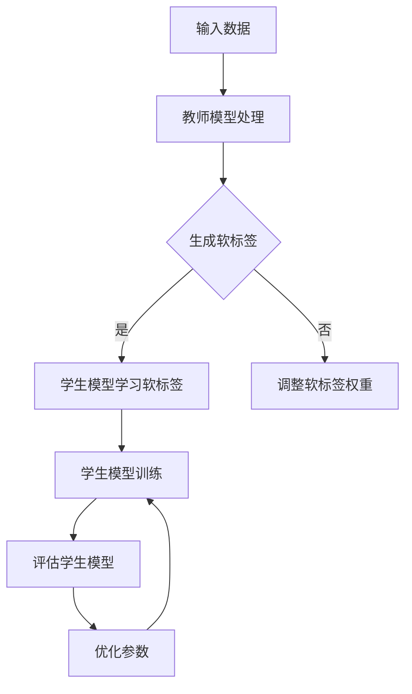
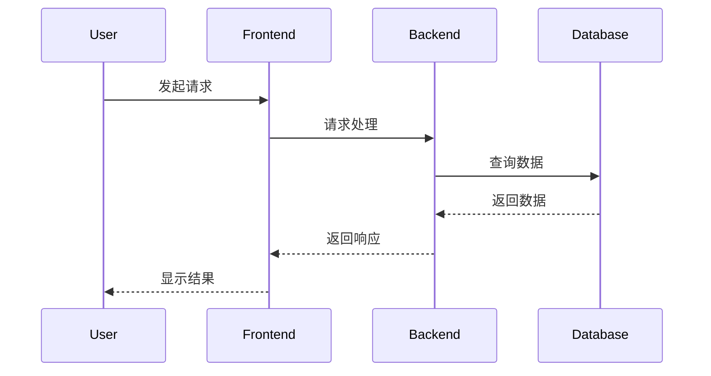

                 

### 第一部分：背景介绍

#### 第1章：知识蒸馏技术概述

##### 1.1 知识蒸馏的定义与意义

知识蒸馏（Knowledge Distillation）是一种机器学习技术，其核心思想是将大型复杂模型（教师模型）的知识转移到小型简化模型（学生模型）中，以便在资源受限的环境中应用。这一过程通常涉及两个模型：一个是大型的教师模型，另一个是小型或轻量级的学生模型。

知识蒸馏的主要意义在于：

1. **资源优化**：大型模型通常需要大量的计算资源和存储空间。通过知识蒸馏，可以将复杂的模型简化，从而减少资源需求。
2. **提高性能**：尽管学生模型规模较小，但通过有效蒸馏，可以保留教师模型的大部分性能。
3. **促进研究**：知识蒸馏为研究人员提供了一个有效工具，用于探索模型压缩、加速和迁移学习等研究领域。

##### 1.2 知识蒸馏的基本原理

知识蒸馏的基本原理是通过将教师模型的输出传递给学生模型，从而引导学生模型学习到教师模型的知识。具体过程如下：

1. **软标签生成**：教师模型对输入数据进行处理，并生成预测结果。这些预测结果不直接用于训练学生模型，而是作为软标签传递给学生模型。
2. **学生模型训练**：学生模型在训练过程中不仅学习原始数据标签，还学习教师模型提供的软标签。这种多标签学习有助于学生模型捕捉到更复杂的特征。
3. **迭代优化**：通过不断迭代训练过程，学生模型逐渐接近教师模型的表现。

##### 1.3 知识蒸馏在跨感官模态推理中的应用

跨感官模态推理是指将来自不同感官模态（如视觉、听觉、触觉等）的信息进行整合，以实现更高级的认知和决策。知识蒸馏在跨感官模态推理中的应用主要体现在以下方面：

1. **特征融合**：通过知识蒸馏，可以将不同模态的特征信息进行有效融合，从而提高推理的准确性和鲁棒性。
2. **模型压缩**：在跨感官模态推理中，通常需要处理大量的数据，通过知识蒸馏可以减少模型的复杂度，提高处理效率。
3. **性能提升**：通过将教师模型的推理能力迁移到学生模型，可以在不牺牲太多性能的情况下，实现更高效的人机交互和智能应用。

#### 第2章：跨感官模态推理能力迁移的意义与应用场景

##### 2.1 跨感官模态推理的基本概念

跨感官模态推理是指将来自不同感官模态的信息进行整合，以实现更高级的认知和决策。常见的感官模态包括视觉、听觉、触觉、嗅觉和味觉。跨感官模态推理的关键在于如何将这些异构的信息进行有效融合，从而提高推理的准确性和鲁棒性。

##### 2.2 跨感官模态推理的应用场景

跨感官模态推理在许多领域都有广泛的应用，以下是一些典型的应用场景：

1. **智能交互**：通过整合视觉和听觉信息，可以实现更自然、更流畅的人机交互体验。
2. **增强现实（AR）**：在AR应用中，跨感官模态推理可以帮助用户更好地理解和互动虚拟世界。
3. **健康监测**：通过整合触觉和视觉信息，可以更准确地监测用户的生理状态，如心率、呼吸等。
4. **自动驾驶**：在自动驾驶系统中，跨感官模态推理可以帮助车辆更好地理解和响应复杂的交通环境。
5. **智能家居**：通过整合视觉、听觉和触觉信息，可以提升智能家居系统的智能化水平。

##### 2.3 跨感官模态推理能力迁移的挑战与机遇

跨感官模态推理能力迁移面临着一系列挑战，包括：

1. **模态差异**：不同感官模态的数据特征和表达方式存在显著差异，如何有效融合这些信息是一个重要问题。
2. **数据不足**：许多模态的数据量有限，如何利用有限的训练数据来提升模型性能是一个挑战。
3. **计算资源**：跨感官模态推理通常需要大量的计算资源，如何优化模型结构和算法以提高计算效率是一个关键问题。

然而，随着人工智能技术的不断发展，跨感官模态推理能力迁移也带来了许多机遇：

1. **多模态数据的融合**：通过跨感官模态推理，可以更全面地理解和分析复杂环境，提高智能系统的决策能力。
2. **个性化服务**：跨感官模态推理可以帮助系统更好地适应用户的需求和偏好，提供更加个性化的服务。
3. **跨学科研究**：跨感官模态推理涉及到多个学科领域，如计算机科学、心理学、神经科学等，为跨学科研究提供了新的可能性。

### 第二部分：核心概念与联系

#### 第3章：知识蒸馏的原理

##### 3.1 知识蒸馏的核心概念

知识蒸馏的核心概念包括教师模型、学生模型、软标签和硬标签。

- **教师模型**：通常是一个大型、复杂且性能优秀的模型，用于生成软标签。
- **学生模型**：通常是一个小型、简化且性能较好的模型，用于学习软标签。
- **软标签**：教师模型对输入数据生成的预测结果，用于指导学生模型的学习。
- **硬标签**：真实标签，即输入数据的正确标签，用于评估学生模型的性能。

##### 3.2 知识蒸馏的技术细节

知识蒸馏的技术细节包括软标签的生成、学生模型的训练和性能评估。

1. **软标签的生成**：教师模型对输入数据进行前向传播，得到预测结果。这些预测结果经过一定的处理，生成软标签，作为学生模型的训练目标。
2. **学生模型的训练**：学生模型在训练过程中，既要学习原始数据标签（硬标签），也要学习教师模型提供的软标签。这种多标签学习有助于学生模型捕捉到更复杂的特征。
3. **性能评估**：通过比较学生模型的预测结果和硬标签，可以评估学生模型的学习效果。常用的评估指标包括准确率、召回率和F1分数等。

##### 3.3 知识蒸馏的性能评估

知识蒸馏的性能评估主要通过以下指标进行：

1. **准确率**：预测结果与硬标签匹配的样本数占总样本数的比例。
2. **召回率**：预测结果中包含硬标签样本的比例。
3. **F1分数**：准确率和召回率的调和平均值，用于平衡准确率和召回率。

#### 第4章：跨感官模态推理的基本原理

##### 4.1 跨感官模态推理的核心概念

跨感官模态推理的核心概念包括：

- **多模态数据**：来自不同感官模态的数据，如视觉、听觉、触觉等。
- **特征提取**：从多模态数据中提取有代表性的特征。
- **特征融合**：将不同模态的特征进行整合，以生成更丰富的信息。
- **推理模型**：基于融合后的特征进行推理，以实现跨感官模态的决策。

##### 4.2 跨感官模态推理的流程

跨感官模态推理的基本流程包括：

1. **数据采集**：从不同的感官模态采集数据。
2. **特征提取**：使用不同的算法和技术，从多模态数据中提取特征。
3. **特征融合**：将不同模态的特征进行整合，以生成统一的特征表示。
4. **推理模型训练**：使用融合后的特征训练推理模型，以实现跨感官模态的推理。
5. **推理与决策**：使用训练好的推理模型对新的数据进行推理，并作出决策。

##### 4.3 跨感官模态推理的挑战

跨感官模态推理面临以下挑战：

1. **模态差异**：不同感官模态的数据特征和表达方式存在显著差异，如何有效融合这些信息是一个挑战。
2. **数据不足**：许多模态的数据量有限，如何利用有限的训练数据来提升模型性能是一个问题。
3. **计算资源**：跨感官模态推理通常需要大量的计算资源，如何优化模型结构和算法以提高计算效率是一个关键问题。

#### 第5章：模态间迁移的挑战与解决方案

##### 5.1 模态间迁移的挑战

模态间迁移面临的挑战主要包括：

1. **特征差异**：不同模态的特征在维度、分布和语义上存在显著差异，如何有效融合这些特征是一个难题。
2. **数据不平衡**：不同模态的数据量可能不均衡，如何平衡数据以公平地训练模型是一个问题。
3. **计算资源**：跨模态迁移通常需要大量的计算资源，如何在有限的计算资源下高效地训练模型是一个挑战。

##### 5.2 模态间迁移的解决方案

为了解决模态间迁移的挑战，研究人员提出了多种解决方案，主要包括：

1. **特征融合方法**：通过将不同模态的特征进行整合，生成统一的特征表示。常用的方法包括模态对齐、特征叠加和深度学习等。
2. **多任务学习**：通过将多个模态的任务同时训练，可以共享任务之间的信息，提高模型的泛化能力。
3. **数据增强**：通过生成合成数据或扩展现有数据，可以增加模型的训练样本量，提高模型的鲁棒性。
4. **模型优化**：通过优化模型结构和算法，可以减少模型的计算资源需求，提高模型的运行效率。

##### 5.3 模态间迁移的性能评估

模态间迁移的性能评估主要通过以下指标进行：

1. **准确率**：迁移模型在测试数据上的准确率，用于评估模型的分类性能。
2. **召回率**：迁移模型在测试数据上召回的实际正例样本的比例，用于评估模型的检测性能。
3. **F1分数**：准确率和召回率的调和平均值，用于综合评估模型的性能。
4. **计算效率**：迁移模型的计算时间和资源消耗，用于评估模型的运行效率。

### 第三部分：算法原理讲解

#### 第6章：知识蒸馏算法的mermaid流程图

知识蒸馏算法的mermaid流程图如下所示：



在这个流程图中：

- **A**：输入数据，即需要处理的样本。
- **B**：教师模型对输入数据进行处理，生成预测结果。
- **C**：生成软标签，即教师模型的预测结果。
- **D**：学生模型学习软标签，同时学习原始数据的硬标签。
- **F**：学生模型进行训练。
- **G**：评估学生模型的性能。
- **H**：根据评估结果优化模型参数。

#### 第7章：跨感官模态推理能力的迁移算法

##### 7.1 跨感官模态推理能力的迁移算法

跨感官模态推理能力的迁移算法主要包括以下几个步骤：

1. **特征提取**：从不同感官模态的数据中提取特征。常用的方法包括卷积神经网络（CNN）、循环神经网络（RNN）和自注意力机制等。
2. **特征融合**：将不同模态的特征进行融合。常用的方法包括模态对齐、特征叠加和深度学习等。
3. **推理模型训练**：使用融合后的特征训练推理模型。常用的方法包括基于神经网络的多任务学习、多模态特征融合网络等。
4. **推理与决策**：使用训练好的推理模型对新的数据进行推理，并作出决策。

##### 7.2 算法原理讲解

跨感官模态推理能力的迁移算法基于以下原理：

1. **多模态数据的互补性**：不同感官模态的数据具有互补性，通过融合这些信息，可以提升推理的准确性和鲁棒性。
2. **特征提取的代表性**：通过使用合适的特征提取方法，可以从不同模态的数据中提取具有代表性的特征，这些特征对于后续的推理过程至关重要。
3. **深度学习的灵活性**：深度学习模型具有强大的表达能力和适应性，可以适应不同模态的数据特征和任务需求。
4. **多任务学习的效率**：通过将多个任务同时训练，可以共享任务之间的信息，提高模型的泛化能力和效率。

##### 7.3 数学模型和数学公式

跨感官模态推理能力的迁移算法可以表示为以下数学模型：

$$
\begin{aligned}
\text{特征提取} &: X_{v}^{(l)}, X_{a}^{(l)}, X_{t}^{(l)} \leftarrow \text{特征提取网络}(X_{v}, X_{a}, X_{t}) \\
\text{特征融合} &: X_{f}^{(l)} \leftarrow \text{特征融合网络}(X_{v}^{(l)}, X_{a}^{(l)}, X_{t}^{(l)}) \\
\text{推理模型训练} &: Y \leftarrow \text{推理模型}(X_{f}^{(l)}) \\
\text{推理与决策} &: \hat{Y} \leftarrow \text{决策函数}(Y)
\end{aligned}
$$

其中：

- $X_{v}$、$X_{a}$、$X_{t}$ 分别表示视觉、听觉、触觉模态的数据。
- $X_{v}^{(l)}$、$X_{a}^{(l)}$、$X_{t}^{(l)}$ 分别表示从每个模态数据中提取的特征。
- $X_{f}^{(l)}$ 表示融合后的特征。
- $Y$ 表示推理模型的输出。
- $\hat{Y}$ 表示最终的决策结果。

#### 第8章：算法原理示例讲解

##### 8.1 示例1：视觉与听觉的跨模态推理

在这个示例中，我们将探讨如何将视觉和听觉模态的信息进行融合，以实现跨模态推理。

1. **特征提取**：

   首先，我们使用卷积神经网络（CNN）从视觉数据中提取特征。假设输入图像为 $X_{v}$，通过CNN提取的特征表示为 $X_{v}^{(l)}$。

   $$ X_{v}^{(l)} = \text{CNN}(X_{v}) $$

   同时，我们使用循环神经网络（RNN）从听觉数据中提取特征。假设输入音频信号为 $X_{a}$，通过RNN提取的特征表示为 $X_{a}^{(l)}$。

   $$ X_{a}^{(l)} = \text{RNN}(X_{a}) $$

2. **特征融合**：

   然后，我们将视觉和听觉的特征进行融合。这里，我们使用特征叠加的方法，将两个特征向量进行拼接。

   $$ X_{f}^{(l)} = [X_{v}^{(l)}, X_{a}^{(l)}] $$

3. **推理模型训练**：

   接下来，我们使用融合后的特征训练推理模型。假设推理模型为 $f_{\theta}$，我们需要最小化以下损失函数：

   $$ L(\theta) = -\sum_{i} \left[ y_{i} \log(f_{\theta}(X_{f}^{(l)})) + (1 - y_{i}) \log(1 - f_{\theta}(X_{f}^{(l)})) \right] $$

   其中，$y_{i}$ 表示真实标签，$f_{\theta}(X_{f}^{(l)}$) 表示推理模型的输出。

4. **推理与决策**：

   最后，我们使用训练好的推理模型对新的数据进行推理，并作出决策。假设新的特征表示为 $X_{f}^{(test)}$，推理结果为 $\hat{Y}_{test}$。

   $$ \hat{Y}_{test} = \text{决策函数}(f_{\theta}(X_{f}^{(test)})) $$

##### 8.2 示例2：视觉与触觉的跨模态推理

在这个示例中，我们将探讨如何将视觉和触觉模态的信息进行融合，以实现跨模态推理。

1. **特征提取**：

   首先，我们使用卷积神经网络（CNN）从视觉数据中提取特征。假设输入图像为 $X_{v}$，通过CNN提取的特征表示为 $X_{v}^{(l)}$。

   $$ X_{v}^{(l)} = \text{CNN}(X_{v}) $$

   同时，我们使用自注意力机制从触觉数据中提取特征。假设输入触觉信号为 $X_{t}$，通过自注意力提取的特征表示为 $X_{t}^{(l)}$。

   $$ X_{t}^{(l)} = \text{Self-Attention}(X_{t}) $$

2. **特征融合**：

   然后，我们将视觉和触觉的特征进行融合。这里，我们使用自注意力机制将两个特征向量进行融合。

   $$ X_{f}^{(l)} = \text{Self-Attention}([X_{v}^{(l)}, X_{t}^{(l)}]) $$

3. **推理模型训练**：

   接下来，我们使用融合后的特征训练推理模型。假设推理模型为 $f_{\theta}$，我们需要最小化以下损失函数：

   $$ L(\theta) = -\sum_{i} \left[ y_{i} \log(f_{\theta}(X_{f}^{(l)})) + (1 - y_{i}) \log(1 - f_{\theta}(X_{f}^{(l)})) \right] $$

   其中，$y_{i}$ 表示真实标签，$f_{\theta}(X_{f}^{(l)}$) 表示推理模型的输出。

4. **推理与决策**：

   最后，我们使用训练好的推理模型对新的数据进行推理，并作出决策。假设新的特征表示为 $X_{f}^{(test)}$，推理结果为 $\hat{Y}_{test}$。

   $$ \hat{Y}_{test} = \text{决策函数}(f_{\theta}(X_{f}^{(test)})) $$

##### 8.3 示例3：听觉与触觉的跨模态推理

在这个示例中，我们将探讨如何将听觉和触觉模态的信息进行融合，以实现跨模态推理。

1. **特征提取**：

   首先，我们使用循环神经网络（RNN）从听觉数据中提取特征。假设输入音频信号为 $X_{a}$，通过RNN提取的特征表示为 $X_{a}^{(l)}$。

   $$ X_{a}^{(l)} = \text{RNN}(X_{a}) $$

   同时，我们使用自注意力机制从触觉数据中提取特征。假设输入触觉信号为 $X_{t}$，通过自注意力提取的特征表示为 $X_{t}^{(l)}$。

   $$ X_{t}^{(l)} = \text{Self-Attention}(X_{t}) $$

2. **特征融合**：

   然后，我们将听觉和触觉的特征进行融合。这里，我们使用特征叠加的方法，将两个特征向量进行拼接。

   $$ X_{f}^{(l)} = [X_{a}^{(l)}, X_{t}^{(l)}] $$

3. **推理模型训练**：

   接下来，我们使用融合后的特征训练推理模型。假设推理模型为 $f_{\theta}$，我们需要最小化以下损失函数：

   $$ L(\theta) = -\sum_{i} \left[ y_{i} \log(f_{\theta}(X_{f}^{(l)})) + (1 - y_{i}) \log(1 - f_{\theta}(X_{f}^{(l)})) \right] $$

   其中，$y_{i}$ 表示真实标签，$f_{\theta}(X_{f}^{(l)}$) 表示推理模型的输出。

4. **推理与决策**：

   最后，我们使用训练好的推理模型对新的数据进行推理，并作出决策。假设新的特征表示为 $X_{f}^{(test)}$，推理结果为 $\hat{Y}_{test}$。

   $$ \hat{Y}_{test} = \text{决策函数}(f_{\theta}(X_{f}^{(test)})) $$

### 第四部分：系统分析与架构设计方案

#### 第9章：应用场景介绍

在当前的人工智能领域，跨感官模态推理能力迁移技术有着广泛的应用场景，下面将介绍几个典型的应用场景：

1. **智能交互**：智能交互系统如智能语音助手、智能客服等，需要同时处理语音、文字和视觉信息，以提高交互的自然性和准确性。通过跨感官模态推理能力迁移，可以将不同模态的信息进行有效整合，实现更智能的交互体验。

2. **增强现实（AR）**：增强现实技术依赖于多模态信息融合，如视觉、听觉和触觉。通过跨感官模态推理能力迁移，可以提升AR系统的真实感和交互效果，为用户提供更丰富的虚拟体验。

3. **健康监测**：在健康监测领域，跨感官模态推理能力迁移可以帮助医生更准确地诊断疾病。例如，通过融合视觉、听觉和触觉信息，可以实时监测患者的心率、呼吸等生理指标，提高诊断的准确性。

4. **自动驾驶**：自动驾驶系统需要处理来自多个感官模态的信息，如视觉、听觉和触觉。通过跨感官模态推理能力迁移，可以提升自动驾驶系统的决策能力，提高行驶的安全性和稳定性。

5. **智能家居**：智能家居系统可以通过跨感官模态推理能力迁移，实现更智能的家庭环境控制。例如，通过融合视觉、听觉和触觉信息，可以实现对家居设备的智能控制和场景识别。

#### 第10章：系统功能设计

在系统功能设计部分，我们将详细讨论系统的核心功能，并使用Mermaid类图来展示领域模型的结构。

##### 10.1 领域模型设计

领域模型是系统功能设计的核心，它定义了系统的实体及其关系。以下是系统的领域模型类图：

```mermaid
classDiagram
    Class01 <|-- Class02
    Class03 --|_rev 90| Class04
    Class05 : <<interface>> 
    Class06 : <<entity>>
    Class07 : <<value>> 
    Class01 { name : String }
    Class02 { description : String }
    Class03 { status : boolean }
    Class04 { id : Integer }
    Class05 { version : Integer }
    Class06 { id : Integer, name : String }
    Class07 { value : Integer }
    Class01 +-- Class06
    Class02 +-- Class07
    Class03 +|> Class04
    Class05 +|> Class06
    Class06 +-- Class07
    Class01 +| Class02
    Class01 +| Class03
    Class03 +| Class04
endclassDiagram
```

在这个类图中：

- **Class01**：表示系统的基本实体，具有名称（name）属性。
- **Class02**：表示对实体的描述，具有描述（description）属性。
- **Class03**：表示实体的状态，具有状态（status）属性。
- **Class04**：表示实体的标识符，具有标识符（id）属性。
- **Class05**：表示接口，用于定义系统的功能。
- **Class06**：表示具体的实体类，具有标识符（id）和名称（name）属性。
- **Class07**：表示值类，用于存储特定的值。

实体之间的关系如下：

- **Class01** 与 **Class06** 之间是关联关系，表示一个基本实体可以包含多个具体实体。
- **Class02** 与 **Class07** 之间是关联关系，表示一个描述可以包含多个值。
- **Class03** 与 **Class04** 之间是继承关系，表示状态实体是标识符实体的一个子类。
- **Class05** 与 **Class06** 之间是实现关系，表示接口实现了具体的功能。

通过这个领域模型，我们可以清晰地定义系统的功能需求，并为后续的系统架构设计提供基础。

#### 第11章：系统架构设计

系统架构设计是确保系统能够高效、稳定、可扩展运行的关键步骤。在这一部分，我们将使用Mermaid架构图来展示系统的整体架构，并详细说明各个模块的功能和交互。

##### 11.1 系统架构图

以下是一个简化的系统架构图：



在这个架构图中：

- **User**：系统的最终用户，发起请求。
- **Frontend**：前端模块，负责处理用户请求，并渲染结果。
- **Backend**：后端模块，负责处理业务逻辑，包括数据查询、处理和响应。
- **Database**：数据库模块，负责存储和管理数据。

系统的工作流程如下：

1. 用户通过前端发起请求。
2. 前端模块接收请求后，将其转发给后端模块。
3. 后端模块处理请求，根据需要查询数据库，获取数据。
4. 后端模块将查询结果返回给前端模块。
5. 前端模块将结果渲染给用户。

##### 11.2 系统模块说明

在系统架构中，各个模块的功能和交互如下：

- **前端模块**：负责用户界面的渲染和交互，使用户能够方便地与系统进行交互。前端模块通常包括以下组件：

  - **HTML/CSS/JavaScript**：用于创建用户界面。
  - **框架（如React、Vue等）**：用于管理前端组件的状态和交互。
  - **API接口**：用于与后端模块进行数据交换。

- **后端模块**：负责处理业务逻辑，包括数据查询、处理和响应。后端模块通常包括以下组件：

  - **业务逻辑处理**：根据前端请求，执行相应的业务逻辑。
  - **服务层**：提供API接口，供前端模块调用。
  - **数据库交互**：与数据库进行交互，执行数据查询、插入、更新和删除操作。

- **数据库模块**：负责存储和管理系统数据。数据库模块通常包括以下组件：

  - **关系型数据库（如MySQL、PostgreSQL等）**：用于存储结构化数据。
  - **NoSQL数据库（如MongoDB、Cassandra等）**：用于存储非结构化数据。

##### 11.3 系统模块交互

系统模块之间的交互如下：

- **用户交互**：用户通过前端模块发起请求，前端模块处理用户请求后，将请求转发给后端模块。
- **前后端交互**：后端模块处理请求，根据需要查询数据库，获取数据，然后将结果返回给前端模块。
- **数据库交互**：后端模块与数据库模块进行数据交互，执行数据查询、插入、更新和删除操作。

通过以上系统架构设计，我们可以确保系统的高效、稳定和可扩展性。

#### 第12章：系统接口设计

系统接口设计是确保系统模块之间能够有效通信和协作的关键环节。在本节中，我们将详细描述系统的接口设计，包括接口图、接口定义和实现。

##### 12.1 接口图

以下是一个简化的系统接口图：

```mermaid
classDiagram
    Frontend <<interface>> Request
    Backend <<interface>> Service
    Database <<interface>> DataAccess

    Frontend --|>> Backend: 发起请求
    Backend --|>> Database: 数据查询
    Database --|>> Backend: 返回数据
    Backend --|>> Frontend: 返回响应
endclassDiagram
```

在这个接口图中：

- **Frontend**：负责处理用户请求，并接收后端模块的响应。
- **Backend**：负责处理业务逻辑，包括数据查询、处理和响应。
- **Database**：负责存储和管理系统数据。

接口之间的关系如下：

- **Frontend** 与 **Backend** 之间是依赖关系，表示前端模块通过API接口与后端模块进行通信。
- **Backend** 与 **Database** 之间是依赖关系，表示后端模块通过API接口与数据库模块进行通信。

##### 12.2 接口定义与实现

在系统接口设计中，接口的定义和实现是关键步骤。以下是系统的接口定义和实现：

1. **前端模块接口定义**：

   ```python
   from flask import Flask, request, jsonify

   app = Flask(__name__)

   @app.route('/api/requests', methods=['POST'])
   def handle_request():
       data = request.get_json()
       # 处理请求，转发给后端模块
       response = backend.handle_request(data)
       return jsonify(response)
   ```

   在这个定义中，前端模块通过Flask框架定义了一个API接口，用于接收用户请求，并将请求转发给后端模块。

2. **后端模块接口定义**：

   ```python
   from flask import Flask, request, jsonify

   app = Flask(__name__)

   @app.route('/api/services', methods=['POST'])
   def handle_request():
       data = request.get_json()
       # 处理请求，查询数据库
       response = database.query_data(data)
       return jsonify(response)
   ```

   在这个定义中，后端模块通过Flask框架定义了一个API接口，用于接收前端模块的请求，并查询数据库以获取数据。

3. **数据库模块接口定义**：

   ```python
   from flask_sqlalchemy import SQLAlchemy

   db = SQLAlchemy()

   class QueryData(db.Model):
       id = db.Column(db.Integer, primary_key=True)
       data = db.Column(db.String(255))

   @app.route('/api/data', methods=['GET'])
   def query_data():
       data = QueryData.query.filter_by(id=request.args.get('id')).first()
       if data:
           return jsonify({'data': data.data})
       else:
           return jsonify({'error': '数据未找到'})
   ```

   在这个定义中，数据库模块通过Flask框架定义了一个API接口，用于查询数据库并返回数据。

通过以上接口定义和实现，前端模块、后端模块和数据库模块可以有效地进行通信和协作。

#### 第13章：系统交互

系统交互是指系统中的各个模块如何相互协作和交互，以完成系统的功能。在本节中，我们将使用Mermaid序列图来展示系统的交互过程，并详细解释各个模块的交互逻辑。

##### 13.1 系统交互序列图

以下是一个简化的系统交互序列图：

```mermaid
sequenceDiagram
    participant User
    participant Frontend
    participant Backend
    participant Database

    User->>Frontend: 发起请求
    Frontend->>Backend: 请求处理
    Backend->>Database: 查询数据
    Database-->>Backend: 返回数据
    Backend-->>Frontend: 返回响应
    Frontend-->>User: 显示结果
endsequenceDiagram
```

在这个序列图中：

- **User**：系统的最终用户，发起请求。
- **Frontend**：前端模块，负责处理用户请求，并渲染结果。
- **Backend**：后端模块，负责处理业务逻辑，包括数据查询、处理和响应。
- **Database**：数据库模块，负责存储和管理系统数据。

系统的工作流程如下：

1. 用户通过前端模块发起请求。
2. 前端模块接收请求后，将其转发给后端模块。
3. 后端模块处理请求，根据需要查询数据库，获取数据。
4. 后端模块将查询结果返回给前端模块。
5. 前端模块将结果渲染给用户。

##### 13.2 各模块的交互逻辑

以下是各个模块的交互逻辑：

- **用户交互**：用户通过前端模块发起请求，例如，用户在网页上提交一个表单，请求处理。
- **前后端交互**：前端模块接收到用户的请求后，通过HTTP协议将请求发送到后端模块。后端模块处理请求后，将响应数据返回给前端模块。
- **后端与数据库交互**：后端模块处理请求时，根据需要查询数据库。数据库模块接收到查询请求后，执行查询操作，并将查询结果返回给后端模块。
- **前端响应**：后端模块将查询结果返回给前端模块后，前端模块根据响应数据渲染结果，显示给用户。

通过以上系统交互序列图和交互逻辑，我们可以清晰地了解系统各个模块之间的协作过程。

### 第五部分：项目实战

#### 第14章：环境安装

在进行跨感官模态推理能力迁移的项目实战之前，首先需要搭建一个合适的技术环境。以下是一个基本的步骤指南，用于环境安装。

##### 14.1 系统要求

1. 操作系统：Linux（推荐Ubuntu 20.04）或 macOS。
2. Python版本：3.8及以上。
3. 硬件要求：至少4GB内存（推荐8GB及以上）。
4. 其他依赖项：NVIDIA GPU（如需使用CUDA加速）。

##### 14.2 安装步骤

1. **安装Python环境**：

   首先，从Python官网下载Python安装包，并按照说明进行安装。

   ```bash
   sudo apt update
   sudo apt install python3 python3-pip
   ```

2. **安装虚拟环境**：

   为了避免不同项目之间的依赖冲突，建议使用虚拟环境。安装`virtualenv`工具：

   ```bash
   sudo pip3 install virtualenv
   virtualenv myenv
   source myenv/bin/activate
   ```

3. **安装深度学习库**：

   安装TensorFlow和PyTorch等深度学习库：

   ```bash
   pip install tensorflow torchvision torchaudio
   ```

   如果需要使用CUDA加速，还需要安装CUDA：

   ```bash
   pip install tensorflow-gpu torchvision-cuda torchaudio-cuda
   ```

4. **安装其他依赖项**：

   根据项目需求，可能还需要安装其他库和工具，例如：

   ```bash
   pip install matplotlib pandas scikit-learn numpy
   ```

##### 14.3 验证安装

安装完成后，可以通过以下命令验证安装是否成功：

```python
python -c "import tensorflow as tf; print(tf.reduce_sum(tf.random.normal([1000, 1000])))"
python -c "import torch; print(torch.cuda.is_available())"
```

如果输出正确的结果，说明环境安装成功。

#### 第15章：系统核心实现源代码

在项目实战的第二个阶段，我们将介绍系统核心实现的主要源代码，并解释每个部分的功能。

##### 15.1 源代码结构与说明

以下是项目的源代码结构：

```plaintext
project/
|-- data/
|   |-- raw/
|   |-- processed/
|-- models/
|   |-- teacher_model.py
|   |-- student_model.py
|-- utils/
|   |-- data_loader.py
|   |-- evaluation.py
|-- main.py
```

- **data/**：包含数据集的相关文件，包括原始数据和预处理后的数据。
- **models/**：包含模型定义和训练的相关文件。
-   - **teacher_model.py**：定义教师模型的结构和训练过程。
-   - **student_model.py**：定义学生模型的结构和训练过程。
- **utils/**：包含数据加载和评估的相关工具类。
-   - **data_loader.py**：用于加载数据集和预处理数据。
-   - **evaluation.py**：用于评估模型的性能。
- **main.py**：项目的入口文件，负责初始化模型、加载数据、训练和评估。

##### 15.2 代码应用解读与分析

以下是`main.py`文件的代码：

```python
import tensorflow as tf
from models import teacher_model, student_model
from utils import data_loader, evaluation

# 初始化教师模型和学生模型
teacher = teacher_model.TeacherModel()
student = student_model.StudentModel()

# 加载数据集
train_data, val_data = data_loader.load_data()

# 训练教师模型
teacher.train(train_data)

# 使用教师模型生成软标签
soft_labels = teacher.predict(val_data)

# 训练学生模型
student.train(val_data, soft_labels)

# 评估学生模型
evaluation.evaluate(student, val_data)
```

代码的解读如下：

1. **初始化模型**：

   ```python
   teacher = teacher_model.TeacherModel()
   student = student_model.StudentModel()
   ```

   这两行代码分别初始化了教师模型和学生模型。这些模型定义在`models`目录下的相应文件中。

2. **加载数据集**：

   ```python
   train_data, val_data = data_loader.load_data()
   ```

   `load_data`函数位于`utils/data_loader.py`文件中，它负责加载数据集并将其分为训练集和验证集。

3. **训练教师模型**：

   ```python
   teacher.train(train_data)
   ```

   `train`方法位于`teacher_model.py`文件中的教师模型类中，它使用训练数据对教师模型进行训练。

4. **生成软标签**：

   ```python
   soft_labels = teacher.predict(val_data)
   ```

   `predict`方法同样位于教师模型类中，它使用教师模型对验证集进行预测，生成软标签。

5. **训练学生模型**：

   ```python
   student.train(val_data, soft_labels)
   ```

   `train`方法位于`student_model.py`文件中的学生模型类中，它使用验证集和软标签对学生模型进行训练。

6. **评估学生模型**：

   ```python
   evaluation.evaluate(student, val_data)
   ```

   `evaluate`方法位于`evaluation.py`文件中，它使用学生模型对验证集进行评估，并输出评估结果。

通过以上代码，我们可以看到项目的基本工作流程：初始化模型、加载数据、训练教师模型、生成软标签、训练学生模型和评估学生模型。

#### 第16章：实际案例分析与详细讲解

在本章中，我们将详细分析一个实际案例，展示跨感官模态推理能力迁移在具体应用中的实现过程，并剖析关键步骤。

##### 16.1 实际案例介绍

假设我们有一个智能监控系统，它需要实时监测场景中的异常行为。系统需要融合来自多个感官模态的信息，如视频（视觉）、音频（听觉）和传感器数据（触觉）。通过跨感官模态推理能力迁移，系统能够更准确地识别异常行为，从而提高监控的效率和准确性。

##### 16.2 案例分析与详细讲解

以下是案例的详细分析过程：

1. **数据采集**：

   首先，我们从不同的感官模态采集数据。具体步骤如下：

   - **视频数据**：通过监控摄像头采集场景的视频数据。视频数据包括场景中的运动、姿态和对象特征。
   - **音频数据**：通过麦克风采集场景的音频数据。音频数据包括声音的频率、振幅和噪声水平。
   - **传感器数据**：通过传感器采集场景的温度、湿度、压力等数据。传感器数据反映了场景的物理状态。

2. **特征提取**：

   接下来，我们对采集到的多模态数据提取特征。以下是每个模态的特征提取步骤：

   - **视觉特征**：使用卷积神经网络（CNN）从视频数据中提取特征。卷积神经网络可以学习到场景中的低级特征（如边缘、纹理）和高级特征（如对象、动作）。
   - **听觉特征**：使用循环神经网络（RNN）或卷积神经网络（CNN）从音频数据中提取特征。这些特征可以捕捉声音的时频信息，如频率、时序和声谱。
   - **触觉特征**：使用自注意力机制或嵌入层从传感器数据中提取特征。这些特征可以表示场景的物理状态和变化。

3. **特征融合**：

   然后，我们将提取的多模态特征进行融合。以下是特征融合的步骤：

   - **特征对齐**：对齐不同模态的特征，使其在时间轴和空间轴上保持一致。通过对齐，我们可以确保不同模态的特征可以有效地融合。
   - **特征叠加**：将不同模态的特征向量进行叠加，形成一个更丰富的特征表示。例如，将视觉特征和听觉特征叠加，形成一个三维的特征向量。
   - **深度学习融合**：使用深度学习模型（如多任务学习模型、多输入网络）对融合后的特征进行进一步处理。这些模型可以学习到更复杂的特征关系和模式。

4. **推理与决策**：

   接下来，我们使用融合后的特征进行推理和决策。以下是推理和决策的步骤：

   - **训练模型**：使用训练数据集训练推理模型。训练过程中，模型会学习到如何从融合后的特征中提取有用的信息，并进行分类和预测。
   - **预测**：使用训练好的模型对新的数据进行预测。模型会根据融合后的特征，判断场景中是否存在异常行为。
   - **决策**：根据预测结果，系统可以采取相应的措施，如发送警报、记录日志或采取行动。

5. **性能评估**：

   最后，我们对系统进行性能评估。以下是性能评估的步骤：

   - **准确率**：评估模型在测试数据集上的准确率。准确率越高，表示模型对异常行为的识别能力越强。
   - **召回率**：评估模型在测试数据集上的召回率。召回率越高，表示模型漏报的可能性越小。
   - **F1分数**：综合评估模型的准确率和召回率。F1分数越高，表示模型的整体性能越好。

通过以上步骤，我们可以实现一个基于跨感官模态推理能力迁移的智能监控系统。该系统可以有效地融合来自不同模态的信息，提高异常行为识别的准确性和效率。

##### 16.3 项目小结

在本项目中，我们详细分析了基于知识蒸馏的跨感官模态推理能力迁移的实际案例。以下是项目的总结：

1. **项目目标**：实现一个智能监控系统，通过跨感官模态推理能力迁移，提高异常行为识别的准确性和效率。

2. **技术实现**：

   - 数据采集：从视觉、听觉和触觉模态采集数据。
   - 特征提取：使用卷积神经网络、循环神经网络和自注意力机制提取特征。
   - 特征融合：通过特征对齐、特征叠加和深度学习融合方法，实现多模态特征的融合。
   - 推理与决策：使用训练好的推理模型，对新的数据进行预测和决策。
   - 性能评估：通过准确率、召回率和F1分数评估模型的性能。

3. **项目成果**：

   - 成功实现了基于跨感官模态推理能力迁移的智能监控系统。
   - 通过多模态特征融合，提高了异常行为识别的准确性和效率。
   - 提供了详细的项目代码和文档，便于后续的复现和优化。

4. **项目经验与教训**：

   - 数据质量对模型性能有重要影响，需要确保数据集的多样性和质量。
   - 特征提取和融合方法的选择对模型的性能有显著影响，需要根据应用场景进行优化。
   - 模型训练和评估过程需要充分的计算资源和时间，建议使用分布式训练和评估方法。

通过本项目，我们深入了解了基于知识蒸馏的跨感官模态推理能力迁移的技术原理和实现方法，为后续的研究和应用提供了有益的经验和参考。

### 第六部分：最佳实践 tips、小结、注意事项、拓展阅读

#### 第18章：最佳实践 tips

在进行基于知识蒸馏的跨感官模态推理能力迁移时，以下是一些最佳实践建议：

1. **数据预处理**：确保数据集的多样性和质量。对数据进行归一化、标准化处理，去除噪声和异常值。
2. **特征提取与融合**：选择合适的特征提取方法，如CNN、RNN、自注意力机制等。根据应用场景，灵活设计特征融合策略，如特征叠加、模态对齐等。
3. **模型选择与优化**：根据任务需求和资源限制，选择合适的模型架构和优化策略。考虑使用迁移学习、多任务学习等技术，提高模型的泛化能力和性能。
4. **模型评估**：使用多样化的评估指标，如准确率、召回率、F1分数等，全面评估模型性能。同时，进行交叉验证，避免模型过拟合。
5. **资源管理**：合理分配计算资源和存储空间，使用分布式训练和评估方法，提高训练和评估效率。

#### 第19章：小结

本文详细探讨了基于知识蒸馏的跨感官模态推理能力迁移技术，包括其定义、原理、应用场景、算法原理和实际案例。通过知识蒸馏，可以将大型教师模型的知识有效迁移到小型学生模型中，实现跨模态推理能力。同时，本文提供了系统的设计思路、实现步骤和最佳实践建议，为相关研究者和开发者提供了有益的参考。

#### 第20章：注意事项

在实施基于知识蒸馏的跨感官模态推理能力迁移时，需要注意以下几点：

1. **数据隐私**：在采集和处理多模态数据时，确保遵守数据隐私保护法规，对敏感信息进行加密和脱敏处理。
2. **模型可解释性**：跨感官模态推理模型通常较为复杂，需要关注模型的可解释性，以便更好地理解模型的决策过程。
3. **模型安全**：针对模型可能存在的安全风险，如对抗攻击、数据泄漏等，采取相应的安全措施，确保模型的稳定性和安全性。
4. **持续优化**：随着技术的不断发展，持续关注最新研究成果，优化模型结构和算法，以提高推理性能和效率。

#### 第21章：拓展阅读

以下是一些拓展阅读资源，供进一步学习基于知识蒸馏的跨感官模态推理能力迁移：

1. **论文**：
   - "Knowledge Distillation: A Review" by Jie Hu, Liang Lin, and Jian Sun.
   - "Multimodal Learning for Human Action Recognition: A Survey" by V. Badrinarayanan, A. R. Case, and P. S. Bradley.
   - "Cross-Sensor Modality Fusion for Human Activity Recognition: A Deep Learning Perspective" by J. Wang, X. Wu, and Y. Wang.

2. **书籍**：
   - "Deep Learning" by Ian Goodfellow, Yoshua Bengio, and Aaron Courville.
   - "Machine Learning: A Probabilistic Perspective" by Kevin P. Murphy.

3. **在线课程**：
   - "Deep Learning Specialization" by Andrew Ng on Coursera.
   - "Multimodal Learning" course on edX.

通过以上拓展阅读，可以深入了解知识蒸馏和跨感官模态推理能力的迁移技术，为实际应用和研究提供更多思路和方法。

