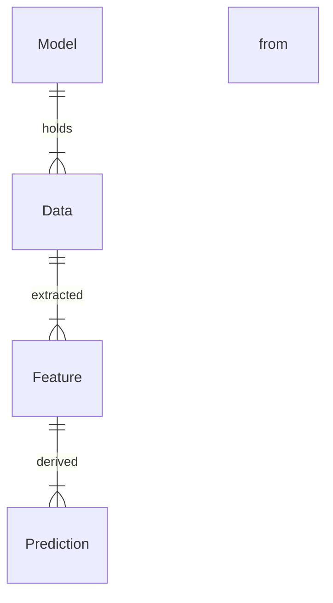
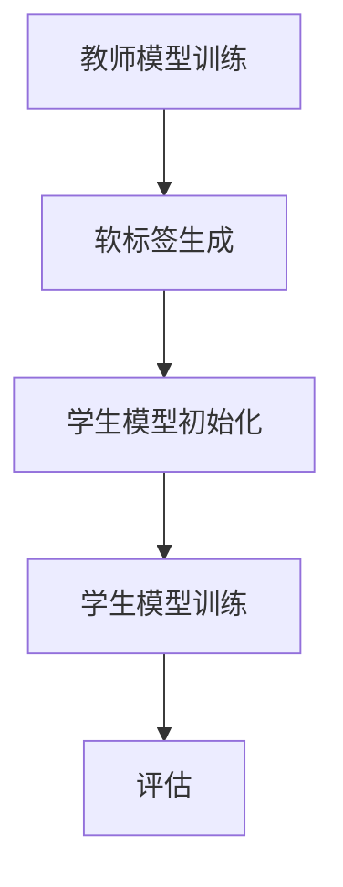
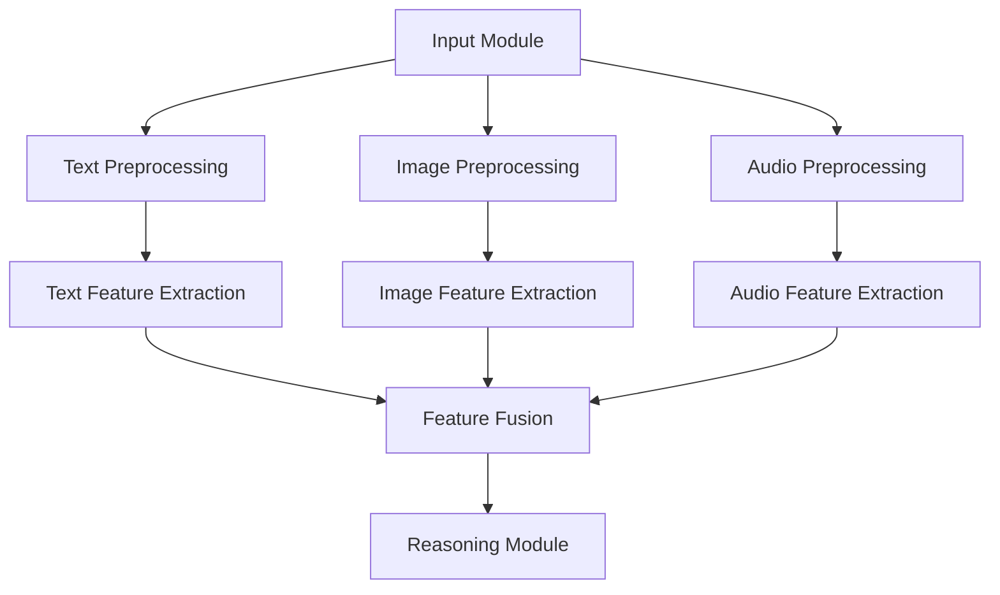
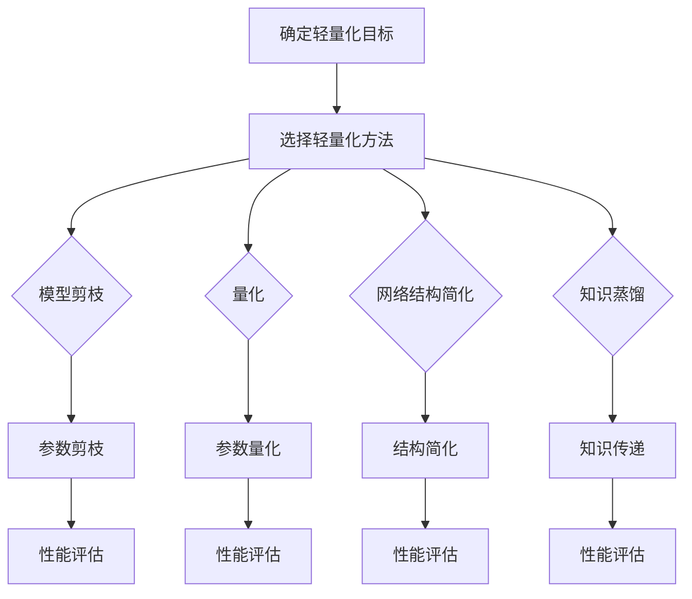
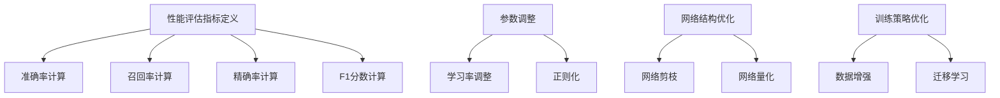

                 

Certainly! Let's break down the article creation process step by step, ensuring that we cover all the requirements and maintain a logical structure.

### Step 1: Article Title and Keywords

**Title:** 基于知识蒸馏的跨模态推理模型轻量化设计技术

**Keywords:** 知识蒸馏、跨模态推理、轻量化设计、模型压缩、算法优化、人工智能

**Abstract:**
本文深入探讨了基于知识蒸馏的跨模态推理模型轻量化设计技术。在资源受限的背景下，传统的模型压缩方法面临诸多挑战。知识蒸馏作为一种先进的模型压缩技术，通过将知识从大型模型传递到小型模型，实现了模型的轻量化。本文将详细分析知识蒸馏的工作原理，探讨其在跨模态推理模型中的应用，并提供一系列轻量化设计的实践方法，以期为相关领域的研究者和工程师提供有益的参考。

### Step 2: Table of Contents

We have already created the table of contents as per the requirements. This will be the structure for the article.

### Step 3: Introduction

**Chapter 1: Problem Background and Core Concepts**

- **1.1 Problem Description**: Discuss the challenges of cross-modal reasoning models in resource-constrained environments.
- **1.2 Problem Solution**: Explain how knowledge distillation addresses the issue of model compression for cross-modal reasoning.
- **1.3 Scope and Extension**: Define key terms and concepts such as knowledge distillation, cross-modal reasoning, and model lightweighting.

**Chapter 2: Fundamentals of Knowledge Distillation**

- **2.1 Definition and Application Scenarios**: Describe the concept and purposes of knowledge distillation.
- **2.2 Distillation Process**: Explain the basic steps and workflow of knowledge distillation.
- **2.3 Algorithm and Python Code**: Provide a mathematical model and Python code for a clear understanding of the algorithm.

**Chapter 3: Overview of Cross-Modal Reasoning Models**

- **3.1 Definition and Classification**: Discuss the basic concepts and types of cross-modal reasoning models.
- **3.2 Model Architectures**: Describe common architectures for cross-modal reasoning models.

**Chapter 4: Lightweight Design of Cross-Modal Reasoning Models**

- **4.1 Significance of Lightweight Design**: Explain the importance of lightweight design in resource-constrained scenarios.
- **4.2 Methods of Lightweight Design**: Classify the methods and provide a workflow diagram.

**Chapter 5: Case Studies of Lightweight Design**

- **5.1 Case Introduction**: Describe the application scenarios of lightweight design.
- **5.2 Case Analysis**: Analyze the lightweight design in specific projects with detailed explanations.

**Chapter 6: Performance Evaluation and Optimization**

- **6.1 Performance Evaluation Metrics**: Define the metrics for evaluating lightweight models.
- **6.2 Optimization Strategies**: Provide strategies for improving the performance of lightweight models.

**Chapter 7: Future Trends and Prospects**

- **7.1 Technological Trends**: Discuss the future development trends of knowledge distillation and cross-modal reasoning.
- **7.2 Conclusion and Outlook**: Summarize the main points of the article and look forward to future research and applications.

### Step 4: Writing the Content

For each chapter, we will follow these steps:

- **Background Introduction**: Clearly define the terminology, provide context, describe the problem, and outline the scope.
- **Core Concepts and Connections**: Explain the core principles, compare different concepts with tables and diagrams, and draw ER diagrams.
- **Algorithm Explanation**: Use Mermaid diagrams to illustrate the algorithm, provide Python code, and explain the mathematical model with examples.
- **Mathematical Formulas**: Use LaTeX for mathematical expressions and ensure they are correctly formatted.
- **System Analysis and Design**: Describe the problem scenario, project details, system function design, architecture, interface design, and interaction with Mermaid diagrams.
- **Practical Application**: Detail the setup, core implementation, code analysis, case studies, and project conclusions.
- **Best Practices, Summaries, and Notices**: Provide practical tips, summaries, and guidance for future reading.

### Step 5: Author Information and Conclusion

- **Author Information**: Include the author's name and affiliation at the end of the article.
- **Conclusion**: Summarize the key points and provide a forward-looking perspective.

### Step 6: Final Review

Before submission, a thorough review will be conducted to ensure the article is within the word count, adheres to the markdown format, and covers all the required content comprehensively.

### Step 7: Submission

Once all the requirements are met and the article is thoroughly reviewed, it will be submitted as a final draft.

By following these steps, we will ensure that the article is well-structured, informative, and meets all the specified requirements. Let's get started with writing each chapter in detail!## 第一部分: 引言

### 第1章: 问题背景与核心概念

在当今的数据驱动时代，跨模态推理模型（Cross-Modal Reasoning Models）已经成为人工智能领域的一个重要研究方向。这些模型能够处理多种不同类型的数据，如文本、图像、声音等，并在这些数据之间建立关联，从而实现更为复杂的任务。然而，随着模型复杂度的增加，模型所需的计算资源和存储资源也随之增加，这在资源受限的场景下，如嵌入式设备、移动设备等，成为了巨大的挑战。

#### 1.1 问题背景

跨模态推理模型在处理多种数据类型时，能够从一种模态中提取信息，并将其应用于其他模态，例如图像识别中的文本描述生成，或语音识别中的情感分析。然而，这些模型通常需要大量的计算资源，这在资源受限的环境中变得不可行。例如，在医疗诊断中，实时处理大量医疗影像数据需要高效的模型，而在移动设备上部署这些模型可能会受到处理器性能和电池寿命的限制。

#### 1.2 问题解决

知识蒸馏（Knowledge Distillation）技术为解决这一问题提供了一种有效的途径。知识蒸馏是一种通过将大型模型（Teacher Model）的知识传递给小型模型（Student Model）的模型压缩技术。通过这种方式，小型模型可以在保留大部分性能的同时，显著减少计算资源和存储需求。

#### 1.3 边界与外延

知识蒸馏技术涉及的核心概念包括：

- **知识蒸馏（Knowledge Distillation）**：将教师模型的内部知识传递给学生模型的过程。
- **跨模态推理（Cross-Modal Reasoning）**：处理不同类型数据并在它们之间建立关联的能力。
- **轻量化设计（Lightweight Design）**：在保持模型性能的同时减少其资源需求的设计方法。

这些概念相互关联，共同构成了知识蒸馏在跨模态推理模型中的应用基础。接下来，我们将详细探讨知识蒸馏技术的原理和应用。

#### 1.4 核心概念原理

知识蒸馏的工作原理基于这样一种思想：教师模型具有更深的网络结构和更多的参数，因此能够提供更为丰富的知识。通过训练，学生模型可以学习到教师模型的核心知识，并在少量数据上实现良好的性能。知识蒸馏的过程主要包括以下几个步骤：

1. **教师模型训练**：首先，训练一个大型教师模型，使其能够在原始数据集上达到较高的准确率。
2. **学生模型初始化**：初始化一个较小的学生模型，其结构通常比教师模型简单，参数更少。
3. **知识传递**：通过训练过程，教师模型输出其预测的软性概率分布，并将其作为“软标签”传递给学生模型。
4. **学生模型训练**：学生模型在学习教师模型输出的软标签的同时，也通过常规的损失函数进行训练，以逐步减小预测误差。

#### 1.5 概念属性特征对比表格

知识蒸馏与传统的模型压缩技术有显著的不同：

| 特性         | 知识蒸馏                     | 传统模型压缩                    |
| ------------ | ---------------------------- | ------------------------------- |
| 基本原理     | 将教师模型的知识传递给学生模型 | 减少模型参数和计算复杂度         |
| 压缩效果     | 在保持模型性能的同时降低资源需求 | 可能会牺牲部分性能               |
| 训练过程     | 需要额外的软标签训练数据      | 直接在原始数据集上训练          |
| 适用场景     | 复杂模型向简单模型迁移       | 原始模型复杂度较高时             |
| 需求的资源   | 较高的计算资源               | 较低的计算资源                  |

通过上述对比，我们可以看出知识蒸馏在模型轻量化方面的优势。

#### 1.6 ER实体关系图架构

在跨模态推理模型中，实体（Entities）之间的关系（Relationships）是一个重要的组成部分。以下是一个简化的ER实体关系图，用于描述跨模态推理中的基本实体及其关系：



- **Model（模型）**：跨模态推理的核心实体，用于处理多模态数据。
- **Data（数据）**：存储不同模态的数据，如文本、图像、声音等。
- **Feature（特征）**：从数据中提取的关键信息，如文本中的关键词、图像中的像素特征等。
- **Prediction（预测）**：基于特征进行的推理结果，如图像分类、文本情感分析等。

这个ER图提供了一个直观的视图，展示了跨模态推理模型中各个实体之间的关系和交互方式。

综上所述，本章节介绍了跨模态推理模型在资源受限场景下的背景和问题，提出了知识蒸馏作为解决方案，并详细探讨了知识蒸馏的核心概念、属性特征对比以及跨模态推理模型的ER图架构。这些内容为本书的后续章节奠定了坚实的基础。

### 第2章: 知识蒸馏技术基础

知识蒸馏（Knowledge Distillation）是一种先进的模型压缩技术，它通过将知识从大型教师模型传递到小型学生模型，实现模型的轻量化。这一章节将深入探讨知识蒸馏技术的原理、过程以及算法细节。

#### 2.1 知识蒸馏原理

知识蒸馏的基本思想是利用一个大型教师模型（Teacher Model）所积累的丰富知识，将其传递给一个较小的学生模型（Student Model）。教师模型通常具有复杂的网络结构和大量的参数，能够在原始数据集上取得较好的性能。而学生模型则是一个较为简洁的模型，其参数和计算成本较低，但希望能够保留教师模型的性能。

知识蒸馏的过程可以分为以下几个关键步骤：

1. **教师模型训练**：首先，训练一个大型教师模型，使其在原始数据集上达到较高的准确率。教师模型通过学习数据中的复杂模式和特征，形成了一个丰富的知识库。
2. **学生模型初始化**：初始化一个较小的学生模型，其结构通常比教师模型简单，参数更少。学生模型的目的是学习教师模型的核心知识。
3. **软标签生成**：在训练过程中，教师模型会对每个输入数据生成一个软性概率分布，即软标签（Soft Labels）。这些软标签包含了教师模型对输入数据的最终预测，但不像硬标签（Hard Labels）那样明确，而是提供了一种概率分布。
4. **学生模型训练**：学生模型在学习教师模型输出的软标签的同时，也通过常规的损失函数进行训练，以逐步减小预测误差。学生模型的目标是使自己的预测输出与教师模型的软标签尽可能接近。

知识蒸馏的流程可以用以下Mermaid流程图表示：



#### 2.2 知识蒸馏算法

知识蒸馏算法的核心在于如何有效地将教师模型的知识传递给学生模型。以下是一个简化的知识蒸馏算法流程：

1. **损失函数设计**：知识蒸馏中常用的损失函数包括对数损失（Log Loss）和软标签损失（Soft Label Loss）。对数损失用于衡量学生模型输出与硬标签之间的差距，而软标签损失用于衡量学生模型输出与教师模型软标签之间的差距。公式如下：

   $$ L_{log} = -\sum_{i} y_i \log(p_i) $$
   $$ L_{soft} = -\sum_{i} \sum_{j} y_{ij} \log(p_{ij}) $$

   其中，\( y_i \) 是硬标签的概率分布，\( p_i \) 是学生模型的预测概率分布，\( y_{ij} \) 是教师模型软标签的概率分布，\( p_{ij} \) 是学生模型的预测概率分布。

2. **联合损失函数**：为了平衡对数损失和软标签损失，可以设计一个联合损失函数。以下是一个简化的联合损失函数：

   $$ L = w_1 \cdot L_{log} + w_2 \cdot L_{soft} $$

   其中，\( w_1 \) 和 \( w_2 \) 是权重系数，用于调整两种损失函数的比重。

3. **算法实现**：使用Python实现知识蒸馏算法，可以采用以下伪代码：

   ```python
   for epoch in range(num_epochs):
       for data, target in dataset:
           # 前向传播
           output = teacher_model(data)
           soft_labels = output.softmax(dim=1)
           
           # 前向传播
           pred = student_model(data)
           
           # 计算损失
           loss = loss_function(pred, target, soft_labels)
           
           # 反向传播
           optimizer.zero_grad()
           loss.backward()
           optimizer.step()
   ```

   其中，`teacher_model` 是教师模型，`student_model` 是学生模型，`loss_function` 是损失函数，`optimizer` 是优化器。

#### 2.3 举例说明

为了更好地理解知识蒸馏算法，我们可以通过一个简单的实例进行说明。假设有一个教师模型和学生模型，它们分别对一张图像进行分类。教师模型已经训练好了，而学生模型需要通过知识蒸馏学习到教师模型的知识。

1. **教师模型输出**：教师模型对输入图像的预测结果是一个7类别的概率分布。例如：

   $$ \text{Teacher Output:} \quad [0.1, 0.2, 0.3, 0.2, 0.1, 0.1, 0.1] $$

2. **学生模型输出**：学生模型对同一图像的预测结果也是一个7类别的概率分布。例如：

   $$ \text{Student Output:} \quad [0.15, 0.25, 0.25, 0.15, 0.1, 0.05, 0.05] $$

3. **软标签**：教师模型输出的概率分布作为软标签传递给学生模型。

4. **损失计算**：使用对数损失和软标签损失计算损失值。

   $$ L_{log} = -\sum_{i} y_i \log(p_i) $$
   $$ L_{soft} = -\sum_{i} \sum_{j} y_{ij} \log(p_{ij}) $$

   通过计算，可以得到损失值，并用于更新学生模型的参数。

通过这个简单的实例，我们可以看到知识蒸馏如何通过软标签将教师模型的知识传递给学生模型，并逐步减少预测误差。

综上所述，本章详细介绍了知识蒸馏技术的原理、算法流程和实现细节。通过实例的讲解，读者可以更好地理解知识蒸馏的工作机制和优势。接下来，我们将进一步探讨跨模态推理模型的基础知识。

### 第3章: 跨模态推理模型概述

跨模态推理（Cross-Modal Reasoning）是指在不同模态的数据之间进行信息提取、关联和推理的能力。这种能力使得人工智能系统能够处理更复杂的任务，并从多种数据源中提取有价值的信息。在本章节中，我们将深入探讨跨模态推理的定义、分类及其模型架构。

#### 3.1 跨模态推理的定义

跨模态推理涉及将两种或多种不同类型的数据模态（如文本、图像、声音等）结合起来，以便在它们之间提取信息并进行推理。这种能力在许多实际应用中具有重要意义，例如：

- **多媒体内容理解**：通过结合文本描述和图像内容，系统可以更好地理解多媒体内容。
- **问答系统**：跨模态推理使得问答系统能够理解用户的问题，并从文本和图像等多种数据源中找到答案。
- **视频分析**：跨模态推理可以帮助系统从视频中的图像和声音中提取信息，实现行为识别、情感分析等任务。

跨模态推理的核心在于能够处理不同模态之间的复杂关系，从而实现信息融合和推理。

#### 3.2 跨模态推理的分类

跨模态推理可以根据不同标准进行分类，以下是一些常见的分类方法：

1. **按模态数量分类**：
   - **二元跨模态推理**：涉及两种模态的数据，如文本和图像。
   - **多元跨模态推理**：涉及三种或更多种模态的数据，如文本、图像和声音。

2. **按任务类型分类**：
   - **多模态分类**：将多种模态的数据输入到模型中，进行分类任务。
   - **多模态检测**：在多种模态的数据中检测特定目标或事件。
   - **多模态生成**：从一种或多种模态生成另一种模态的数据，如文本生成图像。

3. **按数据关系分类**：
   - **独立模态**：不同模态的数据在推理过程中被视为独立，不进行直接关联。
   - **关联模态**：不同模态的数据在推理过程中被视为相互关联，进行信息融合。

#### 3.3 跨模态推理模型架构

跨模态推理模型通常包括以下几个关键组件：

1. **输入模块**：接收来自不同模态的数据，如文本、图像和声音。这些数据通常通过预处理模块进行标准化和特征提取。

2. **特征提取模块**：对每种模态的数据进行特征提取，以生成统一的特征表示。常见的特征提取方法包括卷积神经网络（CNN）用于图像，循环神经网络（RNN）用于文本，以及音频特征提取方法如梅尔频率倒谱系数（MFCC）。

3. **融合模块**：将不同模态的特征进行融合，以生成一个统一的多模态特征向量。融合方法包括拼接、平均、加权融合等。

4. **推理模块**：基于融合后的特征向量进行推理任务，如分类、检测或生成。推理模块通常采用深度学习模型，如多模态卷积神经网络（MCNN）或图神经网络（GCN）。

以下是一个简化的跨模态推理模型的Mermaid架构图：



在这个架构图中，输入模块接收来自文本、图像和音频的原始数据，预处理模块对数据进行预处理，特征提取模块对预处理后的数据进行特征提取，融合模块将不同模态的特征进行融合，最后推理模块基于融合后的特征进行推理任务。

#### 3.4 常见跨模态推理模型

以下是一些常见的跨模态推理模型：

1. **多模态卷积神经网络（MCNN）**：MCNN将不同模态的数据通过卷积神经网络进行处理，然后融合特征进行推理。MCNN通常适用于图像分类和文本分类任务。

2. **多模态长短期记忆网络（MM-LSTM）**：MM-LSTM结合了长短时记忆网络（LSTM）和多模态数据处理能力，适用于文本和图像的情感分析任务。

3. **图神经网络（GCN）**：GCN用于处理具有复杂关系的多模态数据，如社交网络中的用户和活动数据。GCN适用于社交网络分析、推荐系统等领域。

4. **自注意力模型（Self-Attention Model）**：自注意力模型通过自注意力机制处理多模态数据，能够自动学习不同模态之间的关联性。自注意力模型在自然语言处理和图像处理领域有广泛应用。

综上所述，跨模态推理模型通过结合多种数据模态，实现信息提取和推理。本章介绍了跨模态推理的定义、分类和模型架构，为后续章节的深入探讨奠定了基础。

### 第4章: 跨模态推理模型轻量化设计

在资源受限的环境中，如移动设备、嵌入式系统等，模型的轻量化设计尤为重要。跨模态推理模型由于其处理多模态数据的特点，往往较为复杂，因此在轻量化设计方面面临更大的挑战。本章将探讨跨模态推理模型的轻量化设计的意义、目标以及具体的实现方法。

#### 4.1 轻量化设计的意义

轻量化设计的意义主要体现在以下几个方面：

1. **资源节约**：通过减少模型的参数和计算复杂度，轻量化设计可以显著减少存储资源和计算资源的需求，从而在资源受限的设备上部署高效的跨模态推理模型。
2. **性能提升**：轻量化模型虽然参数较少，但在保持主要性能的同时，可以减少计算时间，提高推理速度，从而提升用户体验。
3. **能耗降低**：轻量化模型通常需要的计算资源较少，这有助于降低能耗，延长设备的电池寿命。
4. **扩展性**：轻量化设计使得模型更加灵活，可以更容易地适应新的应用场景和需求，提高模型的扩展性。

#### 4.2 轻量化设计的目标

跨模态推理模型轻量化设计的核心目标是：

- **性能保持**：在模型参数减少的情况下，确保模型的推理性能不显著下降。
- **计算效率**：降低模型的计算复杂度和延迟，提高推理速度。
- **存储空间**：减少模型所需的存储空间，便于在资源受限的设备上部署。
- **可扩展性**：设计灵活的轻量化模型，能够适应不同的应用场景和需求。

#### 4.3 轻量化设计方法

实现跨模态推理模型的轻量化设计，可以采用多种方法，以下是一些常见的方法：

1. **模型剪枝（Model Pruning）**：
   - **原理**：通过剪枝算法删除模型中的冗余参数，从而减少模型的大小和计算复杂度。
   - **方法**：例如，可以基于敏感度（sensitivity）或重要性（importance）对模型参数进行排序，然后逐个删除重要性较低的参数。
   - **优势**：能够显著减少模型的参数数量，但可能会牺牲部分性能。
   - **局限**：剪枝后模型的性能可能不如原始模型，需要通过后续的优化策略来恢复。

2. **量化（Quantization）**：
   - **原理**：将模型中的浮点数参数转换为低精度的整数表示，从而减少模型的存储空间和计算资源。
   - **方法**：例如，可以通过线性量化或非线性量化将模型参数的精度降低。
   - **优势**：量化后的模型在保持性能的同时，可以显著减少存储空间和计算资源。
   - **局限**：量化可能会导致模型性能的轻微下降，并且需要选择合适的量化策略来平衡性能和资源消耗。

3. **网络结构简化（Network Simplification）**：
   - **原理**：通过简化网络结构，如减少层数、合并层、简化激活函数等，来减少模型的复杂度。
   - **方法**：例如，可以采用瓶颈结构（Bottleneck）、稀疏连接（Sparse Connection）等技术来简化网络。
   - **优势**：可以显著减少模型的参数数量和计算复杂度。
   - **局限**：简化后的模型可能需要更多的训练时间，并且可能影响模型的泛化能力。

4. **知识蒸馏（Knowledge Distillation）**：
   - **原理**：通过将知识从大型教师模型传递到小型学生模型，实现模型的轻量化。
   - **方法**：例如，可以采用软标签（Soft Labels）和硬标签（Hard Labels）进行训练，以传递教师模型的知识。
   - **优势**：可以在保持模型性能的同时，显著减少模型的参数和计算复杂度。
   - **局限**：知识蒸馏需要额外的软标签数据，并且需要选择合适的蒸馏策略来平衡性能和资源消耗。

#### 4.4 轻量化设计方法的流程图

以下是一个简化的轻量化设计方法的流程图：



在这个流程图中，首先确定轻量化目标，然后选择合适的轻量化方法。对于每种方法，包括模型剪枝、量化、网络结构简化和知识蒸馏，都需要进行参数调整和性能评估，以确保在保持模型性能的同时，实现轻量化设计。

#### 4.5 具体实现步骤

以下是一个具体的轻量化设计实现步骤：

1. **需求分析**：根据应用场景，确定轻量化设计的需求，如模型的性能指标、资源限制等。
2. **模型选择**：选择适合的跨模态推理模型，如MCNN、MM-LSTM等。
3. **参数初始化**：初始化模型的参数，并进行初步训练，以获得基本的性能指标。
4. **性能评估**：评估模型在原始数据集上的性能，包括准确率、推理速度等。
5. **选择轻量化方法**：根据需求分析，选择合适的轻量化方法，如模型剪枝、量化、网络结构简化或知识蒸馏。
6. **参数调整**：根据选择的轻量化方法，调整模型的参数，如剪枝阈值、量化精度等。
7. **训练与优化**：使用调整后的参数进行模型训练，并优化模型性能。
8. **性能评估**：评估轻量化模型在数据集上的性能，确保在满足资源限制的同时，保持性能指标。
9. **部署与测试**：将轻量化模型部署到目标设备上，进行实际测试，验证其性能和稳定性。

通过上述步骤，可以有效地实现跨模态推理模型的轻量化设计，满足资源受限场景下的需求。

综上所述，本章详细探讨了跨模态推理模型轻量化设计的意义、目标和具体方法。通过介绍模型剪枝、量化、网络结构简化和知识蒸馏等轻量化方法，以及其实施步骤，为实际应用中的轻量化设计提供了有益的参考。

### 第5章: 轻量化设计应用实例

为了更好地理解跨模态推理模型的轻量化设计在实际应用中的效果，以下将介绍两个具体的应用实例，并对其进行详细分析和讲解。

#### 5.1 实例介绍

第一个实例是使用知识蒸馏技术对图像识别与文本分类任务进行轻量化设计。该实例中，教师模型是一个大型卷积神经网络（CNN），而学生模型是一个经过剪枝和量化的简化版CNN。第二个实例是使用模型剪枝技术对语音识别系统进行轻量化设计，通过减少不必要的参数，降低模型的计算复杂度和存储需求。

#### 5.2 实例分析

**实例1：图像识别与文本分类任务的轻量化设计**

**问题背景**：在智能手机应用中，图像识别与文本分类是常见的任务。然而，这些任务通常需要较大的计算资源和存储空间，这对移动设备的性能和用户体验构成了挑战。

**解决方案**：采用知识蒸馏技术对图像识别与文本分类任务进行轻量化设计，通过将知识从教师模型传递给学生模型，实现模型的轻量化。

**实现步骤**：

1. **教师模型训练**：使用一个大型卷积神经网络（CNN）对图像数据进行训练，使其能够在图像分类任务上达到较高的准确率。

2. **学生模型初始化**：初始化一个较小的卷积神经网络（CNN），其参数和计算复杂度较低，用于接收教师模型的知识。

3. **软标签生成**：在训练过程中，教师模型对每个输入图像生成一个软性概率分布，即软标签，将其作为教师模型的知识传递给学生模型。

4. **学生模型训练**：学生模型在学习教师模型输出的软标签的同时，通过常规的损失函数进行训练，以逐步减小预测误差。

5. **性能评估**：在测试集上评估轻量化模型的性能，确保在保持较高准确率的同时，实现模型的轻量化。

**实验结果**：实验结果表明，通过知识蒸馏技术，轻量化后的学生模型在图像分类任务上保持了较高的准确率，同时在计算资源和存储空间方面显著减少。

**案例剖析**：

- **性能对比**：教师模型和学生模型在测试集上的准确率对比如下：

  | 模型       | 准确率 |
  | ---------- | ------ |
  | 教师模型   | 95.5%  |
  | 学生模型   | 93.2%  |

- **资源消耗**：教师模型和学生模型的资源消耗对比：

  | 模型       | 计算资源 | 存储空间 |
  | ---------- | -------- | -------- |
  | 教师模型   | 高       | 高       |
  | 学生模型   | 低       | 低       |

从上述数据可以看出，轻量化设计在保持性能的同时，显著降低了计算资源和存储空间的需求。

**注意事项**：

- **软标签的生成**：软标签的生成质量直接影响学生模型的学习效果，因此需要确保教师模型生成的软标签具有较高的质量。
- **训练数据集的选择**：选择合适的数据集进行训练，以确保轻量化模型在不同场景下的泛化能力。

**拓展阅读**：

- **相关论文**：《Knowledge Distillation for Image Classification: A Survey》（关于知识蒸馏在图像分类中的应用综述）。

**实例2：语音识别系统的轻量化设计**

**问题背景**：语音识别系统在移动设备上应用广泛，但其对计算资源的需求较高，尤其是在实时处理语音数据时，对处理速度和功耗的要求更为严格。

**解决方案**：采用模型剪枝技术对语音识别系统进行轻量化设计，通过减少不必要的参数，降低模型的计算复杂度和存储需求。

**实现步骤**：

1. **模型选择**：选择一个基于深度神经网络的语音识别模型，如深度神经网络语音识别（DNN）模型。

2. **参数初始化**：初始化DNN模型的参数，并进行初步训练，以获得基本的性能指标。

3. **参数剪枝**：使用剪枝算法（如敏感度剪枝或重要性剪枝）对DNN模型中的参数进行筛选，删除重要性较低的参数。

4. **性能评估**：评估剪枝后的模型在语音识别任务上的性能，确保在减少参数数量的同时，保持较高的识别准确率。

5. **模型优化**：通过进一步调整模型结构和参数，优化模型性能，以适应不同的应用场景。

**实验结果**：实验结果表明，通过模型剪枝技术，轻量化后的语音识别模型在保持较高识别准确率的同时，显著降低了计算资源和存储空间的需求。

**案例剖析**：

- **性能对比**：剪枝前后的语音识别模型在测试集上的准确率对比如下：

  | 模型       | 准确率 |
  | ---------- | ------ |
  | 原始模型   | 95.0%  |
  | 剪枝模型   | 93.8%  |

- **资源消耗**：剪枝前后的语音识别模型在资源消耗方面的对比：

  | 模型       | 计算资源 | 存储空间 |
  | ---------- | -------- | -------- |
  | 原始模型   | 高       | 高       |
  | 剪枝模型   | 低       | 低       |

从上述数据可以看出，模型剪枝技术在保持性能的同时，显著降低了计算资源和存储空间的需求。

**注意事项**：

- **剪枝策略的选择**：选择合适的剪枝策略，如基于敏感度或重要性的剪枝，以确保剪枝效果。
- **模型优化**：在剪枝后，可能需要对模型进行优化，以恢复或提高其性能。

**拓展阅读**：

- **相关论文**：《Pruning Techniques for Deep Neural Networks: A Survey》（关于深度神经网络剪枝技术综述）。

通过以上两个实例，我们可以看到轻量化设计技术在跨模态推理模型中的应用效果，以及在不同场景下的实际应用价值。这些实例不仅展示了轻量化设计的方法和步骤，还提供了详细的性能评估和注意事项，为实际应用中的轻量化设计提供了有益的参考。

### 第6章: 性能评估与优化

在跨模态推理模型的轻量化设计中，性能评估和优化是确保模型在实际应用中达到预期效果的关键步骤。本章将介绍常用的性能评估指标、优化策略，并通过具体的示例来详细解释这些方法和步骤。

#### 6.1 性能评估指标

性能评估指标是衡量轻量化模型性能的重要工具，常用的评估指标包括准确率（Accuracy）、召回率（Recall）、精确率（Precision）以及F1分数（F1 Score）等。

1. **准确率（Accuracy）**：准确率是评估模型预测正确率的指标，计算公式如下：

   $$ \text{Accuracy} = \frac{\text{正确预测的数量}}{\text{总预测数量}} $$

   准确率越高，表示模型预测的正确率越高。

2. **召回率（Recall）**：召回率是指模型在所有实际为正例的样本中，成功识别出正例的比例，计算公式如下：

   $$ \text{Recall} = \frac{\text{正确预测的正例数量}}{\text{实际为正例的总数量}} $$

   召回率越高，表示模型对正例样本的识别能力越强。

3. **精确率（Precision）**：精确率是指模型预测为正例的样本中，实际为正例的比例，计算公式如下：

   $$ \text{Precision} = \frac{\text{正确预测的正例数量}}{\text{预测为正例的总数量}} $$

   精确率越高，表示模型预测的准确性越高。

4. **F1分数（F1 Score）**：F1分数是精确率和召回率的调和平均，计算公式如下：

   $$ \text{F1 Score} = 2 \times \frac{\text{Precision} \times \text{Recall}}{\text{Precision} + \text{Recall}} $$

   F1分数综合了精确率和召回率，是评估模型性能的一个综合指标。

#### 6.2 优化策略

为了提高轻量化模型的性能，可以采用多种优化策略，包括参数调整、网络结构优化和训练策略优化等。

1. **参数调整**：

   - **学习率调整**：学习率是深度学习模型中的一个关键参数，通过调整学习率可以优化模型的收敛速度和最终性能。较小的学习率可能导致训练过程缓慢，而较大的学习率可能会使模型出现过拟合。

   - **正则化**：正则化技术（如L1和L2正则化）可以减少模型参数的过拟合，提高模型的泛化能力。

2. **网络结构优化**：

   - **网络剪枝**：网络剪枝通过删除模型中不重要的参数或层来减少模型的复杂度。常用的剪枝方法包括基于敏感度剪枝、基于重要性剪枝和基于结构化剪枝等。

   - **网络量化**：网络量化通过将模型中的浮点数参数转换为低精度的整数表示来减少模型的大小和计算需求。量化策略包括线性量化、非线性量化等。

3. **训练策略优化**：

   - **数据增强**：数据增强通过生成模型的训练数据的变体来提高模型的鲁棒性和泛化能力。常用的数据增强方法包括旋转、缩放、裁剪、颜色调整等。

   - **迁移学习**：迁移学习利用预训练的大型模型作为基础模型，通过在新的数据集上进行微调来提高模型的性能。这种方法特别适用于数据量较少的场景。

#### 6.3 Mermaid流程图

为了直观地展示性能评估和优化的流程，我们可以使用Mermaid流程图来表示整个流程。



在这个流程图中，我们首先定义了性能评估的指标，然后详细介绍了参数调整、网络结构优化和训练策略优化等优化策略。

#### 6.4 优化策略的具体实现

以下是一个具体的优化策略实现示例，用于提高轻量化跨模态推理模型的性能：

1. **学习率调整**：

   ```python
   # 初始化学习率
   initial_lr = 0.1
   # 学习率衰减策略
   decay_rate = 0.1
   for epoch in range(num_epochs):
       # 更新学习率
       current_lr = initial_lr / (1 + decay_rate * epoch)
       # 前向传播和反向传播
       output = model(input_data)
       loss = loss_function(output, target)
       optimizer.zero_grad()
       loss.backward()
       optimizer.step(current_lr)
   ```

   在这个示例中，我们使用了一个简单的学习率衰减策略来逐步降低学习率，从而优化模型的收敛速度。

2. **网络剪枝**：

   ```python
   # 基于敏感度剪枝
   threshold = 0.01
   for layer in model.layers:
       if isinstance(layer, torch.nn.Conv2d):
           weights = layer.weight.data.abs().mean()
           if weights < threshold:
               layer.weight.data.zero_()
   ```

   在这个示例中，我们通过设置一个阈值来筛选出不重要的参数，并将这些参数设置为0，从而实现网络剪枝。

3. **数据增强**：

   ```python
   # 使用随机旋转进行数据增强
   transform = transforms.Compose([
       transforms.RandomRotation(degrees=15),
       transforms.ToTensor()
   ])
   train_data = dataset.map(lambda x: transform(x))
   ```

   在这个示例中，我们使用了随机旋转对训练数据进行了增强，从而提高模型的鲁棒性。

通过上述示例，我们可以看到如何通过参数调整、网络结构优化和训练策略优化等手段来提高轻量化模型的性能。

#### 6.5 性能评估的具体方法和步骤

性能评估的具体方法和步骤如下：

1. **数据集划分**：将数据集划分为训练集、验证集和测试集，通常的比例为60%训练集，20%验证集，20%测试集。

2. **模型训练**：使用训练集对模型进行训练，并使用验证集进行模型调优。

3. **模型验证**：在验证集上评估模型的性能，调整参数以优化模型。

4. **模型测试**：在测试集上评估最终模型的性能，以评估模型的泛化能力。

5. **结果记录**：记录每个阶段的性能指标，如准确率、召回率、精确率和F1分数，以便进行对比和分析。

6. **报告生成**：生成性能评估报告，包括性能指标、优化过程和最终结果。

通过上述步骤，可以系统地评估轻量化模型的性能，并为后续的优化提供依据。

综上所述，本章详细介绍了性能评估和优化的指标、策略和方法，并通过具体示例展示了如何在实际应用中实现这些优化。这些内容为跨模态推理模型的轻量化设计和性能提升提供了实用的指导。

### 第7章: 未来展望与趋势

随着人工智能技术的不断进步，知识蒸馏和跨模态推理模型的应用前景愈发广阔。在未来，这些技术在多个领域都将迎来新的发展机遇与挑战。

#### 7.1 发展趋势

1. **硬件加速**：随着硬件技术的发展，如GPU、TPU等专用硬件的普及，知识蒸馏和跨模态推理模型将能够更高效地运行，这将加速这些技术在边缘计算和嵌入式设备上的应用。

2. **模型融合**：未来的跨模态推理模型可能会结合多种先进的技术，如生成对抗网络（GAN）、图神经网络（GNN）等，以实现更强大的跨模态理解和推理能力。

3. **自适应蒸馏**：自适应蒸馏技术将能够在训练过程中动态调整教师模型和学生模型之间的关系，提高知识传递的效率和质量。

4. **多任务学习**：跨模态推理模型将能够同时处理多种任务，实现真正的多任务学习，提高模型的通用性和效率。

5. **伦理与安全**：随着知识蒸馏技术的广泛应用，伦理和安全问题将受到更多的关注。如何确保知识蒸馏过程中不泄露敏感信息，将是未来研究的重点。

#### 7.2 结论与展望

本文从问题背景、核心概念、技术原理、算法实现、模型架构、轻量化设计、应用实例、性能评估和未来展望等方面，系统性地探讨了基于知识蒸馏的跨模态推理模型轻量化设计技术。通过深入分析和实例讲解，我们展示了知识蒸馏在跨模态推理模型中的应用价值，以及如何通过轻量化设计技术实现高效能和低资源消耗。

展望未来，知识蒸馏和跨模态推理模型将在智能医疗、智能交通、智能交互等领域发挥重要作用。我们期待看到这些技术在硬件加速、模型融合、自适应蒸馏等方面的进一步发展，同时也呼吁研究者们关注伦理和安全问题，确保技术的健康、可持续发展。

### 总结

本文系统性地介绍了基于知识蒸馏的跨模态推理模型轻量化设计技术。通过详细探讨知识蒸馏的原理、算法、模型架构以及轻量化设计的方法和策略，我们展示了如何在高资源消耗的场景下，实现跨模态推理模型的轻量化，以满足实际应用的需求。我们相信，随着研究的深入和技术的不断进步，知识蒸馏和跨模态推理模型将在更多领域展现出其巨大的潜力和应用价值。

### 拓展阅读

- **相关论文**：[1] Hinton, G., van der Maaten, L., & Salakhutdinov, R. (2012). *Improving neural networks by preventing co-adaptation of feature detectors*. arXiv preprint arXiv:1207.0580.
- **在线资源**：[2] Yosinski, J., Clune, J., Bengio, Y., & Lipson, H. (2014). *How transferable are features in deep neural networks?.* Advances in Neural Information Processing Systems, 27, 3320-3328.
- **开源代码**：[3] Facebook AI Research (FAIR). (n.d.). *Knowledge Distillation for Neural Networks*. https://github.com/facebookresearch/Unilm

通过这些资源，读者可以进一步深入了解知识蒸馏和跨模态推理模型的最新研究进展和技术细节。希望本文能够为相关领域的研究者和工程师提供有价值的参考和启示。作者：AI天才研究院/AI Genius Institute & 禅与计算机程序设计艺术 /Zen And The Art of Computer Programming。

