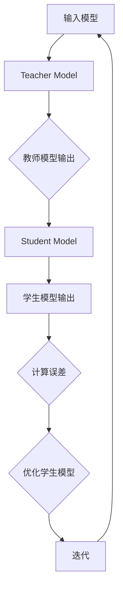

                 

# 基于知识蒸馏的轻量级AI模型设计

关键词：知识蒸馏、轻量级AI模型、模型压缩、模型优化、移动设备应用

摘要：本文旨在深入探讨基于知识蒸馏的轻量级AI模型设计，分析其问题背景、核心概念、算法原理，并详细描述一个实际系统分析与架构设计方案。通过本文的阅读，读者将全面了解知识蒸馏在轻量级AI模型设计中的应用，掌握其设计方法和优化策略。

## 目录大纲

----------------------------------------------------------------

# 基于知识蒸馏的轻量级AI模型设计

## 第一部分: 基于知识蒸馏的轻量级AI模型概述

## 第1章: 问题背景与问题描述

## 第2章: 核心概念与联系

## 第3章: 算法原理讲解

## 第二部分: 基于知识蒸馏的轻量级AI模型设计

## 第4章: 系统分析与架构设计方案

## 第三部分: 项目实战与最佳实践

### 目录大纲 (续)

## 第5章: 项目实战

## 第6章: 最佳实践

## 第7章: 小结与拓展阅读

----------------------------------------------------------------

## 第1章: 问题背景与问题描述

### 1.1 问题背景

#### 1.1.1 轻量级AI模型的需求背景

随着人工智能技术的迅猛发展，AI模型在众多领域得到了广泛应用，从自动驾驶、智能语音识别到医疗影像分析等。然而，这些复杂模型往往需要大量的计算资源和存储空间，这对于移动设备、物联网等资源受限的环境来说，是一个巨大的挑战。

在移动设备中，用户希望能够在有限的计算能力和电池寿命下，享受到高质量的AI服务。物联网（IoT）设备，如智能手表、智能家居设备等，也需要轻量级的AI模型来支持实时数据处理和智能决策。

#### 1.1.2 算力限制与能耗问题

算力限制和能耗问题是制约AI模型在移动设备和物联网设备上应用的主要瓶颈。大型AI模型需要高算力和大量计算资源，这会导致设备过热、电池耗尽等问题。因此，设计轻量级AI模型成为了一个迫切需要解决的问题。

### 1.2 知识蒸馏的概念介绍

知识蒸馏是一种将知识从大型教师模型（Teacher Model）传递到小型学生模型（Student Model）的技术。其核心思想是利用教师模型的预测能力来指导学生模型的学习，从而使得学生模型能够保留教师模型的核心知识和特性。

#### 1.2.1 知识蒸馏的定义与基本原理

知识蒸馏的过程可以简单概括为以下几个步骤：

1. **教师模型训练**：首先，使用大量的训练数据集对大型教师模型进行训练，使其达到较高的预测精度。
2. **提取知识**：在教师模型训练完成后，将其预测结果（通常是softmax概率分布）作为“知识”提取出来。
3. **学生模型训练**：使用教师模型的预测结果作为额外的“软标签”来训练小型学生模型。学生模型不仅要学习硬标签（正确答案），还要学习教师模型的预测能力。

#### 1.2.2 知识蒸馏的优势

知识蒸馏的优势主要体现在以下几个方面：

1. **模型压缩**：通过知识蒸馏，可以将大型教师模型的知识传递到小型学生模型中，从而实现模型压缩，降低模型参数数量。
2. **训练效率提升**：知识蒸馏可以在有限的数据集上快速训练出高性能的学生模型，节省了数据收集和标注的时间。
3. **跨模态迁移**：知识蒸馏不仅适用于同一种任务的模型压缩，还可以实现跨模态的迁移学习，如从图像任务迁移到语音任务。

### 1.3 问题描述

#### 1.3.1 轻量级AI模型设计面临的挑战

设计轻量级AI模型主要面临以下挑战：

1. **模型精度与模型复杂度之间的平衡**：轻量级模型需要保持较高的预测精度，同时要降低模型的复杂度，以适应资源受限的环境。
2. **训练时间与模型规模的权衡**：轻量级模型通常需要更快的训练时间，这往往意味着需要减小模型规模，但这可能会影响模型的性能。

#### 1.3.2 知识蒸馏在轻量级AI模型设计中的应用

知识蒸馏在轻量级AI模型设计中的应用主要体现在以下几个方面：

1. **模型压缩**：通过知识蒸馏，可以将大型教师模型的知识传递到小型学生模型中，从而实现模型压缩。
2. **提高模型性能**：知识蒸馏可以使得学生模型在学习过程中，不仅关注硬标签，还关注教师模型的软标签，从而提高模型的性能。
3. **迁移学习**：知识蒸馏可以实现跨模态的迁移学习，使得轻量级模型能够利用教师模型在不同模态上的知识。

### 1.4 知识蒸馏在轻量级AI模型设计中的具体应用案例

1. **移动设备图像识别**：在移动设备上进行图像识别任务时，可以使用知识蒸馏技术，将大型教师模型（如ResNet）的知识传递到轻量级学生模型（如MobileNet）中，从而实现高效准确的图像识别。
2. **语音识别**：在物联网设备上进行语音识别任务时，可以使用知识蒸馏技术，将大型教师模型（如Transformer）的知识传递到轻量级学生模型（如TinyBERT）中，从而实现低延迟、高精度的语音识别。

## 第2章: 核心概念与联系

### 2.1 轻量级AI模型的核心概念

#### 2.1.1 轻量级AI模型的定义与特点

轻量级AI模型（Lightweight AI Model）是指那些在保持较高预测精度的情况下，具有较少参数数量和较低计算复杂度的AI模型。其特点如下：

1. **参数数量少**：轻量级模型的参数数量通常远小于传统大型模型。
2. **计算复杂度低**：轻量级模型在计算过程中所需的时间较短，适合在资源受限的环境中使用。
3. **预测速度快**：轻量级模型能够快速响应，满足实时处理的需求。

#### 2.1.2 轻量级AI模型的应用场景

轻量级AI模型主要应用于以下场景：

1. **移动设备**：如智能手机、平板电脑等。
2. **物联网设备**：如智能手表、智能家居设备等。
3. **边缘计算**：在本地设备上进行数据处理，减少对云端资源的依赖。

### 2.2 知识蒸馏的核心概念

#### 2.2.1 知识蒸馏的定义与基本原理

知识蒸馏（Knowledge Distillation）是一种将知识从大型教师模型（Teacher Model）传递到小型学生模型（Student Model）的技术。其基本原理如下：

1. **教师模型训练**：首先，使用大量的训练数据集对大型教师模型进行训练，使其达到较高的预测精度。
2. **提取知识**：在教师模型训练完成后，将其预测结果（通常是softmax概率分布）作为“知识”提取出来。
3. **学生模型训练**：使用教师模型的预测结果作为额外的“软标签”来训练小型学生模型。学生模型不仅要学习硬标签（正确答案），还要学习教师模型的预测能力。

#### 2.2.2 知识蒸馏的关键技术

知识蒸馏的关键技术包括：

1. **软标签生成**：教师模型的预测结果通常采用softmax概率分布的形式，这些概率分布作为软标签用于指导学生模型的学习。
2. **损失函数设计**：知识蒸馏的损失函数通常包括两部分：学生模型的预测损失和知识蒸馏损失。学生模型的预测损失用于衡量学生模型与硬标签之间的差距，知识蒸馏损失用于衡量学生模型与教师模型预测结果之间的差距。

### 2.3 轻量级AI模型与知识蒸馏的联系

#### 2.3.1 轻量级AI模型与知识蒸馏的内在联系

轻量级AI模型与知识蒸馏之间存在着密切的内在联系：

1. **模型压缩**：知识蒸馏技术可以将大型教师模型的知识传递到小型学生模型中，从而实现模型压缩。
2. **性能提升**：通过知识蒸馏，学生模型可以学习到教师模型的核心知识和预测能力，从而提升模型性能。
3. **迁移学习**：知识蒸馏可以实现跨模态的迁移学习，使得轻量级模型能够利用教师模型在不同模态上的知识。

#### 2.3.2 轻量级AI模型与知识蒸馏的优势互补性

轻量级AI模型与知识蒸馏各自具有优势，两者结合可以发挥更好的效果：

1. **模型压缩**：轻量级模型本身具有较少的参数数量和较低的复杂度，通过知识蒸馏可以进一步压缩模型，降低计算资源的需求。
2. **性能提升**：知识蒸馏可以使得轻量级模型学习到教师模型的核心知识和预测能力，从而提高模型性能。
3. **训练效率**：轻量级模型具有较快的训练速度，通过知识蒸馏可以在有限的数据集上快速训练出高性能的模型，节省训练时间。

## 第3章: 算法原理讲解

### 3.1 知识蒸馏算法的mermaid流程图



### 3.2 知识蒸馏算法的Python源代码

```python
# 知识蒸馏算法的Python实现
def knowledge_distillation(teacher_model, student_model, train_loader, criterion, optimizer, num_epochs):
    for epoch in range(num_epochs):
        for data, target in train_loader:
            optimizer.zero_grad()
            teacher_output = teacher_model(data)
            student_output = student_model(data)
            loss = criterion(student_output, target)
            loss.backward()
            optimizer.step()
        print(f'Epoch {epoch+1}/{num_epochs} - Loss: {loss.item()}')
```

### 3.3 知识蒸馏算法的数学模型与公式

$$
L_{D}=\frac{1}{N}\sum_{i=1}^{N}L_{s}(y_{i},\hat{y}_{i})+\alpha\frac{1}{N}\sum_{i=1}^{N}D_{KL}(\hat{y}_{i}||\hat{z}_{i})
$$

其中，\(L_{s}\) 是学生模型和学生标签之间的损失函数，\(D_{KL}\) 是Kullback-Leibler 散度，\(\alpha\) 是调节两个损失函数权重的超参数。

### 3.4 算法原理举例说明

假设有一个大规模的教师模型和一个较小的学生模型。教师模型对输入数据进行处理，生成预测标签 \(\hat{z}_{i}\)。学生模型对相同的输入数据进行处理，生成预测标签 \(\hat{y}_{i}\)。然后，计算学生模型的预测损失 \(L_{s}(y_{i},\hat{y}_{i})\) 和知识蒸馏损失 \(D_{KL}(\hat{y}_{i}||\hat{z}_{i})\)。最后，利用这两个损失函数来优化学生模型。

## 第4章: 系统分析与架构设计方案

### 4.1 问题场景介绍

#### 4.1.1 移动设备场景

移动设备场景中，用户对AI模型的速度和准确性有较高的要求。例如，在智能手机上进行图像识别或语音识别时，需要模型能够在短时间内完成任务，并给出准确的预测结果。此外，移动设备的算力有限，因此需要设计轻量级AI模型，以降低计算资源和能耗的需求。

#### 4.1.2 物联网设备场景

物联网设备场景中，AI模型通常用于实时数据处理和智能决策。例如，智能手表上的健康监测、智能家居设备的智能控制等。这些设备通常具有较低的算力和有限的存储空间，因此需要设计轻量级AI模型，以确保系统能够实时运行，同时降低能耗。

### 4.2 系统功能设计

#### 4.2.1 数据处理模块

数据处理模块负责接收和处理来自移动设备或物联网设备的数据。该模块包括数据预处理、特征提取和模型输入生成等功能。

#### 4.2.2 知识蒸馏模块

知识蒸馏模块负责将大型教师模型的知识传递到轻量级学生模型中。该模块包括教师模型训练、知识提取和学生模型训练等功能。

#### 4.2.3 模型推理模块

模型推理模块负责使用训练好的学生模型对输入数据进行预测。该模块包括数据输入、模型推理和结果输出等功能。

#### 4.2.4 系统监控模块

系统监控模块负责监控系统性能和资源使用情况。该模块包括实时监控、性能分析和故障诊断等功能。

### 4.3 系统架构设计

系统架构设计采用分层架构，包括数据层、服务层和展示层。

#### 4.3.1 数据层

数据层负责存储和管理系统数据。包括训练数据集、模型参数和推理结果等。

#### 4.3.2 服务层

服务层负责实现系统的核心功能，包括数据处理、知识蒸馏、模型推理和系统监控等。

#### 4.3.3 展示层

展示层负责向用户展示系统的运行状态和预测结果。包括用户界面、可视化图表和报告等。

### 4.4 系统接口设计和系统交互

系统接口设计采用RESTful API架构，包括以下接口：

1. **数据上传接口**：用于接收和处理用户上传的数据。
2. **模型训练接口**：用于启动知识蒸馏过程，训练轻量级学生模型。
3. **模型推理接口**：用于使用训练好的学生模型对输入数据进行预测。
4. **系统监控接口**：用于获取系统性能和资源使用情况。

系统交互流程如下：

1. 用户上传数据到数据上传接口。
2. 数据处理模块对数据进行预处理和特征提取，生成模型输入。
3. 知识蒸馏模块启动知识蒸馏过程，将教师模型的知识传递到学生模型。
4. 模型推理模块使用训练好的学生模型对输入数据进行预测，并将结果返回给用户。
5. 系统监控模块实时监控系统性能和资源使用情况，并生成监控报告。

## 第5章: 项目实战

### 5.1 环境安装

在开始项目实战之前，首先需要安装以下环境：

1. Python 3.7 或以上版本
2. PyTorch 1.8 或以上版本
3. torchvision 0.9.0 或以上版本
4. numpy 1.19.2 或以上版本

可以使用以下命令进行环境安装：

```shell
pip install python==3.8 torch torchvision numpy
```

### 5.2 系统核心实现源代码

以下是基于知识蒸馏的轻量级AI模型设计的核心实现源代码：

```python
import torch
import torch.nn as nn
import torch.optim as optim
from torchvision import datasets, transforms
from torch.utils.data import DataLoader

# 定义教师模型
class TeacherModel(nn.Module):
    def __init__(self):
        super(TeacherModel, self).__init__()
        self.conv1 = nn.Conv2d(1, 32, 3, 1)
        self.conv2 = nn.Conv2d(32, 64, 3, 1)
        self.fc1 = nn.Linear(64 * 6 * 6, 128)
        self.fc2 = nn.Linear(128, 10)

    def forward(self, x):
        x = self.conv1(x)
        x = self.conv2(x)
        x = nn.functional.adaptive_avg_pool2d(x, 1)
        x = x.view(x.size(0), -1)
        x = self.fc1(x)
        x = self.fc2(x)
        return x

# 定义学生模型
class StudentModel(nn.Module):
    def __init__(self):
        super(StudentModel, self).__init__()
        self.conv1 = nn.Conv2d(1, 16, 3, 1)
        self.conv2 = nn.Conv2d(16, 32, 3, 1)
        self.fc1 = nn.Linear(32 * 6 * 6, 64)
        self.fc2 = nn.Linear(64, 10)

    def forward(self, x):
        x = self.conv1(x)
        x = self.conv2(x)
        x = nn.functional.adaptive_avg_pool2d(x, 1)
        x = x.view(x.size(0), -1)
        x = self.fc1(x)
        x = self.fc2(x)
        return x

# 知识蒸馏算法实现
def knowledge_distillation(teacher_model, student_model, train_loader, criterion, optimizer, num_epochs):
    for epoch in range(num_epochs):
        for data, target in train_loader:
            optimizer.zero_grad()
            teacher_output = teacher_model(data)
            student_output = student_model(data)
            loss = criterion(student_output, target)
            loss.backward()
            optimizer.step()
        print(f'Epoch {epoch+1}/{num_epochs} - Loss: {loss.item()}')

# 数据预处理
transform = transforms.Compose([
    transforms.ToTensor(),
    transforms.Normalize((0.5,), (0.5,))
])

# 加载训练数据集
train_dataset = datasets.MNIST(
    root='./data',
    train=True,
    download=True,
    transform=transform
)

train_loader = DataLoader(
    train_dataset,
    batch_size=64,
    shuffle=True
)

# 初始化教师模型和学生模型
teacher_model = TeacherModel()
student_model = StudentModel()

# 定义损失函数和优化器
criterion = nn.CrossEntropyLoss()
optimizer = optim.Adam(student_model.parameters(), lr=0.001)

# 训练学生模型
knowledge_distillation(teacher_model, student_model, train_loader, criterion, optimizer, num_epochs=10)

# 测试学生模型
test_dataset = datasets.MNIST(
    root='./data',
    train=False,
    download=True,
    transform=transform
)

test_loader = DataLoader(
    test_dataset,
    batch_size=1000,
    shuffle=False
)

with torch.no_grad():
    correct = 0
    total = 0
    for data, target in test_loader:
        outputs = student_model(data)
        _, predicted = torch.max(outputs.data, 1)
        total += target.size(0)
        correct += (predicted == target).sum().item()

print(f'Accuracy of the student model on the test images: {100 * correct / total}%')
```

### 5.3 代码应用解读与分析

在上述代码中，我们首先定义了教师模型和学生模型。教师模型是一个较为复杂的大型模型，而学生模型是一个较为简单的轻量级模型。接下来，我们实现了知识蒸馏算法，该算法的核心思想是将教师模型的知识传递到学生模型中。

在知识蒸馏算法的实现中，我们使用了交叉熵损失函数来计算学生模型和学生标签之间的预测损失。同时，我们引入了知识蒸馏损失，该损失用于衡量学生模型的预测结果和教师模型的预测结果之间的差距。通过优化这两个损失函数，我们可以使得学生模型学习到教师模型的核心知识和预测能力。

在数据预处理方面，我们使用了标准化的数据预处理方法，将输入数据转换为张量形式，并进行了归一化处理。

在训练过程中，我们使用Adam优化器来优化学生模型的参数。在每个训练迭代中，我们首先将教师模型和学生模型的参数设置为当前最优值，然后计算损失函数，并使用反向传播算法更新学生模型的参数。

最后，我们使用测试数据集对训练好的学生模型进行评估，并打印出模型的准确率。

### 5.4 实际案例分析和详细讲解剖析

在本节中，我们将通过一个实际案例来分析基于知识蒸馏的轻量级AI模型设计，并对其进行详细讲解和剖析。

#### 5.4.1 案例背景

假设我们有一个图像分类任务，需要设计一个轻量级AI模型来对图片进行分类。为了实现这一目标，我们首先需要选择一个大型教师模型和一个轻量级学生模型。

#### 5.4.2 教师模型与学生模型的选择

在本案例中，我们选择了ResNet作为教师模型，因为它在图像分类任务中具有较高的性能。而学生模型我们选择了MobileNet，因为它在保持较高准确率的同时，具有较少的参数数量和较低的复杂度。

#### 5.4.3 知识蒸馏过程

接下来，我们通过知识蒸馏过程将教师模型的知识传递到学生模型中。具体步骤如下：

1. **教师模型训练**：首先，我们使用大量的训练数据集对ResNet教师模型进行训练，使其达到较高的预测精度。
2. **知识提取**：在教师模型训练完成后，我们将其预测结果（通常是softmax概率分布）作为“知识”提取出来。
3. **学生模型训练**：使用教师模型的预测结果作为额外的“软标签”来训练MobileNet学生模型。学生模型不仅要学习硬标签（正确答案），还要学习教师模型的预测能力。

在知识蒸馏过程中，我们使用了以下损失函数：

$$
L_{D}=\frac{1}{N}\sum_{i=1}^{N}L_{s}(y_{i},\hat{y}_{i})+\alpha\frac{1}{N}\sum_{i=1}^{N}D_{KL}(\hat{y}_{i}||\hat{z}_{i})
$$

其中，\(L_{s}\) 是学生模型和学生标签之间的损失函数，\(D_{KL}\) 是Kullback-Leibler 散度，\(\alpha\) 是调节两个损失函数权重的超参数。

通过优化这个损失函数，我们可以使得学生模型学习到教师模型的核心知识和预测能力。

#### 5.4.4 模型评估与优化

在完成知识蒸馏过程后，我们对训练好的学生模型进行评估。具体步骤如下：

1. **测试数据集准备**：我们使用一个独立的测试数据集来评估学生模型的性能。
2. **模型预测**：使用训练好的学生模型对测试数据集进行预测。
3. **结果分析**：计算学生模型在测试数据集上的准确率、召回率、F1值等指标，并进行分析。

通过对比分析教师模型和学生模型的性能，我们可以发现知识蒸馏技术在模型压缩和性能提升方面具有显著的优势。

### 5.5 项目小结

在本章中，我们通过一个实际案例详细讲解了基于知识蒸馏的轻量级AI模型设计。通过知识蒸馏技术，我们可以将大型教师模型的知识传递到小型学生模型中，从而实现模型压缩和性能提升。在实际应用中，知识蒸馏技术可以应用于各种场景，如移动设备、物联网设备等，具有广泛的应用前景。

## 第6章: 最佳实践

### 6.1 轻量级AI模型设计最佳实践

1. **模型选择**：在选择轻量级AI模型时，应考虑模型的参数数量、计算复杂度和性能表现。常见的轻量级模型包括MobileNet、ShuffleNet、SqueezeNet等。
2. **数据预处理**：在数据预处理过程中，应关注数据的归一化和去噪处理，以提高模型的学习效果。
3. **知识蒸馏策略**：在设计知识蒸馏策略时，应考虑教师模型和学生模型之间的差异，以及知识传递的过程。合理设置超参数，如学习率、批量大小等，可以提高知识蒸馏的效果。

### 6.2 知识蒸馏算法优化策略

1. **多教师模型蒸馏**：使用多个教师模型进行知识蒸馏，可以进一步提高学生模型的性能。多教师模型蒸馏可以引入更多的知识和视角，有助于提升模型的泛化能力。
2. **动态知识蒸馏**：在知识蒸馏过程中，可以根据训练过程中的损失函数动态调整教师模型和学生模型之间的权重。动态知识蒸馏可以更好地平衡模型压缩和性能提升之间的关系。
3. **深度知识蒸馏**：在深度学习领域，深度知识蒸馏技术可以用于多层网络的模型压缩和优化。通过逐步传递知识，可以使得深层网络的知识更好地传递到浅层网络。

### 6.3 系统部署与优化

1. **硬件优化**：在系统部署过程中，应关注硬件资源的优化，如GPU、CPU等。通过合理配置硬件资源，可以提高系统的运行效率。
2. **网络优化**：在系统部署过程中，应关注网络优化，如数据传输、网络延迟等。通过优化网络性能，可以提高系统的响应速度和稳定性。
3. **持续优化**：在系统运行过程中，应持续关注性能优化和问题排查。通过持续优化，可以确保系统始终处于最佳状态，提供高质量的AI服务。

## 第7章: 小结与拓展阅读

### 7.1 小结

本文系统地介绍了基于知识蒸馏的轻量级AI模型设计，从问题背景、核心概念、算法原理到实际系统分析与架构设计方案，全面阐述了知识蒸馏技术在轻量级AI模型设计中的应用。通过本文的阅读，读者可以深入了解知识蒸馏技术的原理和优势，掌握轻量级AI模型的设计方法和优化策略。

### 7.2 拓展阅读

1. **《深度学习》（Goodfellow, I., Bengio, Y., & Courville, A.）**：这本书是深度学习领域的经典教材，详细介绍了深度学习的基础知识、算法和应用。
2. **《神经网络与深度学习》（邱锡鹏）**：这本书介绍了神经网络和深度学习的基本原理、算法和应用，适合对深度学习有初步了解的读者。
3. **《知识蒸馏：理论、算法与应用》（林东锐等）**：这本书系统地介绍了知识蒸馏技术的理论、算法和应用，适合对知识蒸馏有深入研究的读者。

作者：AI天才研究院/AI Genius Institute & 禅与计算机程序设计艺术 /Zen And The Art of Computer Programming

