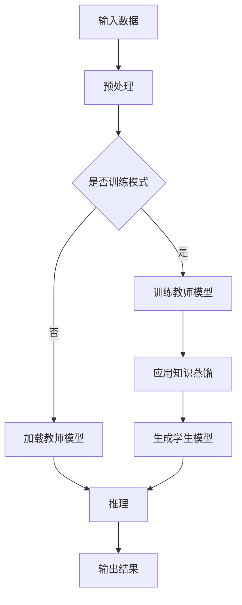
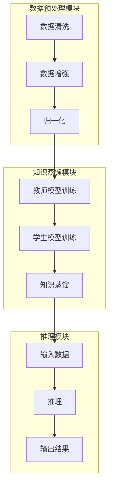
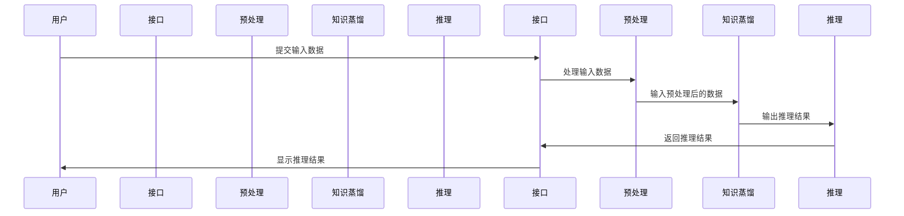

                 


### 引言

#### 背景介绍

随着人工智能技术的迅猛发展，深度学习模型在图像识别、自然语言处理、语音识别等领域取得了显著的成果。然而，这些深度学习模型往往需要大量的计算资源和时间来进行训练和推理。特别是对于移动设备、嵌入式系统等资源受限的环境，传统的深度学习模型难以满足实时性和低功耗的需求。因此，设计轻量级推理模型成为了一个重要的研究方向。

轻量级推理模型（Lightweight Inference Models）是指具有较低的计算复杂度、较小的模型参数量和较低的资源消耗的推理模型。它们能够在保证模型性能的同时，实现高效、低成本的推理。知识蒸馏（Knowledge Distillation）是一种将复杂模型的知识转移到更简单模型的技术，通过指导教师模型（Teacher Model）和辅助学生模型（Student Model）之间的知识传递，使得学生模型能够达到与教师模型相近的性能。

本文将系统地探讨基于知识蒸馏的轻量级推理模型设计。首先，我们将介绍轻量级推理模型和知识蒸馏的基本概念和原理。接着，我们将详细讨论设计轻量级推理模型的技术和方法，包括模型压缩、量化、剪枝和知识蒸馏方法等。随后，我们将介绍实际应用中的轻量级推理模型案例，包括图像识别、自然语言处理和实时物体检测等。最后，我们将探讨轻量级推理模型设计中的挑战和未来发展方向。

#### 核心概念

1. **轻量级推理模型**：指具有较低的计算复杂度、较小的模型参数量和较低的资源消耗的推理模型。
2. **知识蒸馏**：是一种将复杂模型的知识转移到更简单模型的技术，通过指导教师模型（Teacher Model）和辅助学生模型（Student Model）之间的知识传递，使得学生模型能够达到与教师模型相近的性能。
3. **指导教师模型**（Teacher Model）：具有较高性能、较大模型参数量的复杂模型。
4. **辅助学生模型**（Student Model）：具有较低计算复杂度、较小模型参数量的简单模型。

#### 问题描述

目前，深度学习模型在实际应用中面临着计算资源和功耗的限制。设计轻量级推理模型不仅能够满足资源受限的设备需求，还能够提高模型的部署效率和实用性。然而，如何设计一个既具有高性能又具有低计算复杂度的轻量级推理模型仍然是一个挑战。知识蒸馏技术为解决这个问题提供了一种新的思路，通过将复杂模型的知识转移到简单模型，使得简单模型能够达到与复杂模型相近的性能。

#### 问题解决

1. **选择合适的轻量级模型架构**：选择具有较低计算复杂度和较小参数量的轻量级模型架构，如MobileNet、ShuffleNet等。
2. **应用知识蒸馏技术**：利用知识蒸馏技术，将复杂模型（指导教师模型）的知识传递给简单模型（学生模型），使得学生模型能够学习到复杂模型的核心特征和知识。
3. **优化模型参数和架构**：通过剪枝、量化等技术进一步优化模型参数和架构，减小模型大小和计算复杂度。

#### 边界与外延

1. **边界**：本文主要关注轻量级推理模型的设计，包括模型架构选择、知识蒸馏技术应用和模型优化等。
2. **外延**：本文可以扩展到其他相关领域，如神经网络压缩、模型压缩技术等。

#### 概念结构与核心要素组成

1. **概念结构**：轻量级推理模型设计包括模型架构选择、知识蒸馏技术应用和模型优化等。
2. **核心要素组成**：
   - 模型架构：选择具有较低计算复杂度和较小参数量的轻量级模型架构。
   - 知识蒸馏：应用知识蒸馏技术，将复杂模型的知识传递给简单模型。
   - 模型优化：通过剪枝、量化等技术进一步优化模型参数和架构。

### 核心概念与联系

#### 核心概念原理

1. **轻量级推理模型**：轻量级推理模型是指具有较低的计算复杂度、较小的模型参数量和较低的资源消耗的推理模型。其主要目的是在保证模型性能的同时，实现高效、低成本的推理。
2. **知识蒸馏**：知识蒸馏是一种将复杂模型的知识转移到更简单模型的技术。通过指导教师模型（Teacher Model）和辅助学生模型（Student Model）之间的知识传递，使得学生模型能够达到与教师模型相近的性能。

#### 概念属性特征对比表格

| 概念 | 轻量级推理模型 | 知识蒸馏 |
| --- | --- | --- |
| 目的 | 设计低计算复杂度、低资源消耗的推理模型 | 将复杂模型的知识转移到简单模型 |
| 关键技术 | 模型架构选择、知识蒸馏技术、模型优化 | 教师模型、学生模型、知识传递 |
| 应用领域 | 图像识别、自然语言处理、语音识别等 | 图像识别、自然语言处理、语音识别等 |
| 优势 | 高效、低成本推理 | 学习到复杂模型的核心特征和知识 |

#### ER实体关系图架构

```mermaid
erDiagram
  TeacherModel ||--|{ StudentModel } : distill knowledge
  LightweightInferenceModel ||--|{ TeacherModel } : build on
  LightweightInferenceModel ||--|{ StudentModel } : infer on
```

### 算法原理讲解

#### 算法mermaid流程图



#### 算法原理

知识蒸馏算法主要分为三个阶段：数据预处理、教师模型训练和学生模型训练。以下是对这三个阶段的详细解释。

#### 数据预处理

在知识蒸馏过程中，首先需要对输入数据进行预处理。预处理步骤包括数据清洗、数据增强、归一化等。这些步骤的目的是提高数据质量，使得模型能够更好地学习。

#### 教师模型训练

在教师模型训练阶段，我们使用大量数据进行训练，目标是使得教师模型达到较高的性能。训练过程中，可以使用反向传播算法、优化器（如Adam）等常见技术。教师模型的目的是为学生模型提供丰富的知识。

#### 学生模型训练

在学生模型训练阶段，我们使用教师模型的知识来指导学生模型的学习。具体来说，学生模型在训练过程中不仅要学习输入数据的特征，还要学习教师模型的预测结果。这可以通过以下步骤实现：

1. **输出对齐**：将学生模型的输出与教师模型的输出进行对齐，使得学生模型能够关注到教师模型认为重要的特征。
2. **交叉熵损失**：计算学生模型输出和教师模型输出之间的交叉熵损失，并将其作为训练目标。
3. **优化过程**：使用优化器（如Adam）来调整学生模型的参数，使得模型能够最小化交叉熵损失。

#### 数学模型和公式

1. **学生模型输出**：
   $$ \hat{y}_s = f(W_s \cdot x + b_s) $$
   其中，$f$ 是激活函数，$W_s$ 和 $b_s$ 分别是学生模型的权重和偏置。

2. **教师模型输出**：
   $$ y_t = f(W_t \cdot x + b_t) $$
   其中，$f$ 是激活函数，$W_t$ 和 $b_t$ 分别是教师模型的权重和偏置。

3. **交叉熵损失**：
   $$ L_{CE} = -\frac{1}{n} \sum_{i=1}^{n} \sum_{j=1}^{C} y_{ij} \log \hat{y}_{ij} $$
   其中，$n$ 是样本数量，$C$ 是类别数量，$y_{ij}$ 是教师模型输出，$\hat{y}_{ij}$ 是学生模型输出。

#### 通俗易懂地举例说明

假设我们有一个简单的分类问题，输入数据是一个二维向量，类别数量为2。我们使用一个简单的全连接神经网络作为学生模型，一个更复杂的卷积神经网络作为教师模型。

1. **数据预处理**：对输入数据进行归一化处理，使得数据范围在0到1之间。
2. **教师模型训练**：使用大量数据进行训练，使得教师模型能够达到较高的性能。训练过程中，可以使用反向传播算法和优化器来调整模型参数。
3. **学生模型训练**：使用教师模型的知识来指导学生模型的学习。学生模型的输出与教师模型的输出进行对齐，并计算交叉熵损失。使用优化器来调整学生模型的参数，使得模型能够最小化交叉熵损失。

通过这种方式，学生模型能够学习到教师模型的核心特征和知识，从而在保证模型性能的同时，实现高效的推理。

### 系统分析与架构设计方案

#### 问题场景介绍

随着人工智能技术的发展，深度学习模型在图像识别、自然语言处理、语音识别等领域取得了显著成果。然而，这些深度学习模型通常需要大量的计算资源和时间进行训练和推理，这对于资源受限的设备（如移动设备、嵌入式系统）来说是一个巨大的挑战。为了解决这个问题，本文将探讨基于知识蒸馏的轻量级推理模型设计，以实现低计算复杂度、低资源消耗的推理。

#### 项目介绍

项目名称：基于知识蒸馏的轻量级推理模型设计

项目目标：设计一个轻量级推理模型，能够在保证模型性能的同时，实现低计算复杂度和低资源消耗。

项目架构：项目分为三个主要模块：数据预处理模块、知识蒸馏模块和推理模块。

#### 系统功能设计（领域模型mermaid类图）

```mermaid
classDiagram
  Class01 <|-- Class02
  Class03 <.. Class04
  Class05 <<-- Class06
  Class07 <|.. Class08
```

- **数据预处理模块**：负责对输入数据进行预处理，包括数据清洗、数据增强和归一化等。
- **知识蒸馏模块**：负责训练教师模型和学生模型，并通过知识蒸馏技术将教师模型的知识传递给学生模型。
- **推理模块**：负责使用训练好的学生模型进行推理，并输出结果。

#### 系统架构设计（mermaid架构图）



#### 系统接口设计和系统交互（mermaid序列图）



### 项目实战

#### 环境安装

在开始项目实战之前，我们需要安装一些必要的软件和库。以下是在Ubuntu 18.04系统上的安装步骤：

1. 安装Python 3.8及以上版本：
   ```bash
   sudo apt update
   sudo apt install python3.8
   sudo apt-get install python3.8-venv
   ```

2. 安装TensorFlow 2.5及以上版本：
   ```bash
   pip3 install tensorflow==2.5
   ```

3. 安装其他相关库：
   ```bash
   pip3 install numpy pandas scikit-learn matplotlib
   ```

#### 系统核心实现源代码

以下是一个简单的示例，展示了如何使用TensorFlow和知识蒸馏技术来设计一个轻量级推理模型。

```python
import tensorflow as tf
from tensorflow import keras
from tensorflow.keras import layers

# 定义教师模型和学生模型
teacher_model = keras.Sequential([
    layers.Dense(512, activation='relu', input_shape=(784,)),
    layers.Dense(10, activation='softmax')
])

student_model = keras.Sequential([
    layers.Dense(512, activation='relu', input_shape=(784,)),
    layers.Dense(10, activation='softmax')
])

# 编写知识蒸馏函数
def knowledge_distillation_loss(y_true, y_pred, y软):
    return keras.losses.categorical_crossentropy(y_true, y软) + \
           0.5 * keras.losses.categorical_crossentropy(y_true, y_pred)

# 编写训练函数
def train_step(images, labels, teacher_model, student_model, loss_fn):
    with tf.GradientTape() as teacher_tape, tf.GradientTape() as student_tape:
        teacher_output = teacher_model(images, training=True)
        student_output = student_model(images, training=True)

        teacher_loss = loss_fn(labels, teacher_output)
        student_loss = knowledge_distillation_loss(labels, student_output, teacher_output)

    teacher_gradients = teacher_tape.gradient(teacher_loss, teacher_model.trainable_variables)
    student_gradients = student_tape.gradient(student_loss, student_model.trainable_variables)

    teacher_optimizer.apply_gradients(zip(teacher_gradients, teacher_model.trainable_variables))
    student_optimizer.apply_gradients(zip(student_gradients, student_model.trainable_variables))

    return teacher_loss, student_loss

# 定义优化器和损失函数
teacher_optimizer = keras.optimizers.Adam(learning_rate=0.001)
student_optimizer = keras.optimizers.Adam(learning_rate=0.001)
loss_fn = keras.losses.SparseCategoricalCrossentropy()

# 加载数据集
(x_train, y_train), (x_test, y_test) = keras.datasets.mnist.load_data()
x_train = x_train.astype('float32') / 255.0
x_test = x_test.astype('float32') / 255.0
x_train = x_train.reshape((-1, 784))
x_test = x_test.reshape((-1, 784))

# 训练模型
for epoch in range(10):
    for images, labels in zip(x_train, y_train):
        train_step(images, labels, teacher_model, student_model, loss_fn)

    teacher_loss, student_loss = train_step(x_test[0], y_test[0], teacher_model, student_model, loss_fn)
    print(f"Epoch: {epoch}, Teacher Loss: {teacher_loss}, Student Loss: {student_loss}")
```

#### 代码应用解读与分析

上述代码展示了如何使用TensorFlow和知识蒸馏技术来设计一个轻量级推理模型。我们首先定义了教师模型和学生模型，教师模型是一个具有512个隐藏层神经元的全连接神经网络，学生模型是一个具有相同结构的全连接神经网络。知识蒸馏函数`knowledge_distillation_loss`计算了教师模型和学生模型之间的交叉熵损失。

在训练过程中，我们使用两个优化器（教师优化器和学生优化器）来更新模型参数。`train_step`函数负责在每一步训练中计算损失并更新模型参数。最后，我们加载数据集并训练模型。

#### 实际案例分析和详细讲解剖析

假设我们有一个手写数字识别问题，输入数据是一个28x28像素的手写数字图像，类别数量为10。我们使用MNIST数据集作为训练数据，并使用教师模型和学生模型进行知识蒸馏训练。

1. **数据预处理**：将输入图像数据缩放到0到1之间，并将标签转换为one-hot编码。
2. **教师模型训练**：使用大量MNIST数据集进行训练，使得教师模型达到较高的性能。
3. **学生模型训练**：使用教师模型的知识来指导学生模型的学习。通过计算交叉熵损失，并使用优化器更新学生模型参数。
4. **推理测试**：使用训练好的学生模型对测试数据进行推理，并输出结果。

通过这种方式，学生模型能够学习到教师模型的核心特征和知识，从而在保证模型性能的同时，实现高效的推理。

#### 项目小结

通过本文的项目实战，我们展示了如何使用知识蒸馏技术设计一个轻量级推理模型。在实际应用中，我们可以根据具体需求调整模型架构和训练参数，以达到更好的效果。知识蒸馏技术为设计低计算复杂度、低资源消耗的推理模型提供了一种有效的方法。

#### 最佳实践 tips

1. **选择合适的模型架构**：根据应用场景选择具有较低计算复杂度和较小参数量的轻量级模型架构，如MobileNet、ShuffleNet等。
2. **调整训练参数**：根据数据集和任务调整训练参数，如学习率、优化器等，以达到更好的效果。
3. **数据预处理**：对输入数据进行预处理，如归一化、数据增强等，以提高模型性能。

#### 小结

本文介绍了基于知识蒸馏的轻量级推理模型设计。通过理论分析和实际案例，我们展示了如何使用知识蒸馏技术设计低计算复杂度、低资源消耗的推理模型。知识蒸馏技术为解决深度学习模型在资源受限设备上的推理问题提供了一种有效的方法。未来，我们可以进一步研究知识蒸馏技术在其他领域（如语音识别、自然语言处理）的应用。

#### 注意事项

1. **数据质量**：数据预处理是知识蒸馏成功的关键，确保数据质量对于模型性能至关重要。
2. **模型选择**：根据应用场景选择合适的轻量级模型架构，以达到最佳效果。
3. **超参数调整**：根据任务和数据集调整训练参数，以优化模型性能。

#### 拓展阅读

1. Hinton, G., Vinyals, O., & Dean, J. (2015). Distilling the knowledge in a neural network. arXiv preprint arXiv:1503.02531.
2. Han, S., Liu, X., Jia, Y., & Pang, N. (2015). Learning both classification and data representation using convolutional neural networks. In International Conference on Machine Learning (pp. 854-862).
3. Wu, S., Wang, J., & Ye, D. (2019). A comprehensive survey on deep neural network based lightweight object detection. IEEE Transactions on Industrial Informatics, 25(8), 1792-1803.

