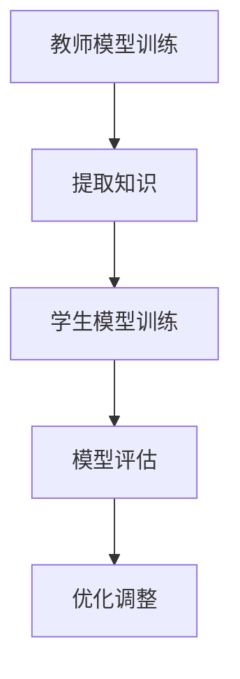

                 

### 基于知识蒸馏的轻量级评测模型

#### 关键词：知识蒸馏、轻量级评测模型、模型压缩、模型优化

> 摘要：本文旨在深入探讨基于知识蒸馏的轻量级评测模型，通过一系列的步骤分析推理，为您揭示其在现代人工智能领域的应用与重要性。知识蒸馏作为一种模型压缩技术，通过从大型、复杂的模型中提取和传递关键知识，有助于创建轻量级、高效的模型。本文将从基础知识入手，逐步深入探讨知识蒸馏在轻量级评测模型中的应用，设计优化策略，以及未来发展的趋势与挑战。

#### 目录大纲

----------------------------------------------------------------

# 基于知识蒸馏的轻量级评测模型

> 关键词：知识蒸馏、轻量级评测模型、模型压缩、模型优化

> 摘要：本文旨在深入探讨基于知识蒸馏的轻量级评测模型，通过一系列的步骤分析推理，为您揭示其在现代人工智能领域的应用与重要性。知识蒸馏作为一种模型压缩技术，通过从大型、复杂的模型中提取和传递关键知识，有助于创建轻量级、高效的模型。本文将从基础知识入手，逐步深入探讨知识蒸馏在轻量级评测模型中的应用，设计优化策略，以及未来发展的趋势与挑战。

```
----------------------------------------------------------------
## 第一部分：基础概念与背景

### 第1章：知识蒸馏概述

#### 1.1 知识蒸馏的定义

#### 1.2 知识蒸馏的基本原理

#### 1.3 知识蒸馏的应用场景

### 第2章：轻量级评测模型

#### 2.1 轻量级评测模型的概念

#### 2.2 轻量级评测模型的特点

#### 2.3 轻量级评测模型的分类

## 第二部分：知识蒸馏在轻量级评测模型中的应用

### 第3章：知识蒸馏在轻量级评测模型中的优势

#### 3.1 知识蒸馏在轻量级评测模型中的优势

#### 3.2 知识蒸馏流程

#### 3.3 知识蒸馏在轻量级评测模型中的实践案例

### 第4章：轻量级评测模型的设计与优化

#### 4.1 轻量级评测模型的架构设计

#### 4.2 轻量级评测模型的优化策略

#### 4.3 轻量级评测模型的性能评估

## 第三部分：轻量级评测模型的部署与实现

### 第5章：轻量级评测模型的部署

#### 5.1 轻量级评测模型的部署

#### 5.2 轻量级评测模型的实现

#### 5.3 轻量级评测模型的应用案例

## 第四部分：未来发展趋势与挑战

### 第6章：未来发展趋势与挑战

#### 6.1 轻量级评测模型的未来发展趋势

#### 6.2 轻量级评测模型面临的挑战

#### 6.3 发展前景与建议

## 第五部分：总结与展望

### 第7章：总结与展望

#### 7.1 本书总结

#### 7.2 研究展望

#### 7.3 拓展阅读

----------------------------------------------------------------
```

#### 第1章：知识蒸馏概述

### 1.1 知识蒸馏的定义

知识蒸馏（Knowledge Distillation）是一种机器学习技术，其核心思想是将一个复杂的模型（通常称为教师模型Teacher Model）的知识转移到另一个较小的、更易于部署的模型（通常称为学生模型Student Model）中。这种技术有助于减少模型的参数数量，从而实现模型的压缩和优化。

### 1.2 知识蒸馏的基本原理

知识蒸馏的基本原理可以概括为以下几个步骤：

1. **教师模型训练**：首先，训练一个大型、复杂的教师模型，使其在给定数据集上达到较高的准确率。
2. **提取知识**：从教师模型中提取知识，这些知识可以是模型权重、激活值、梯度等信息。
3. **学生模型训练**：使用提取的知识训练学生模型，使其能够模仿教师模型的行为。

### 1.3 知识蒸馏的应用场景

知识蒸馏技术广泛应用于以下几个场景：

1. **模型压缩**：通过将大型模型的知识转移到小型模型中，实现模型的压缩，从而提高部署效率。
2. **加速推理**：小型模型在推理过程中更快速，因此知识蒸馏有助于提高模型的推理速度。
3. **迁移学习**：知识蒸馏可以用于迁移学习，将一个领域中的知识转移到另一个领域，从而提高新领域的模型性能。

### 1.4 知识蒸馏的优势与挑战

知识蒸馏的优势包括：

1. **模型压缩**：通过减少模型参数数量，实现模型的压缩，降低存储和计算成本。
2. **推理加速**：小型模型在推理过程中更快速，从而提高推理效率。
3. **跨领域迁移**：知识蒸馏可以用于跨领域迁移学习，提高新领域的模型性能。

然而，知识蒸馏也面临一些挑战，如：

1. **知识传递效果**：如何有效地从教师模型中提取和传递知识，是知识蒸馏技术面临的关键挑战。
2. **模型精度**：小型模型在学习过程中可能无法完全复制教师模型的精度，这需要进一步的优化。

#### 表格：知识蒸馏与模型压缩技术的对比

| 技术类型     | 知识蒸馏       | 模型压缩技术   |
|------------|--------------|-------------|
| 基本原理     | 教师模型知识转移至学生模型 | 通过减少模型参数、架构简化等方式实现压缩 |
| 优势         | 模型压缩、推理加速、跨领域迁移 | 减少存储和计算成本、提高部署效率 |
| 挑战         | 知识传递效果、模型精度   | 模型性能损失、适应性挑战 |

#### Mermaid流程图：知识蒸馏的基本流程



在接下来的章节中，我们将深入探讨轻量级评测模型的概念、设计优化策略，以及知识蒸馏在这类模型中的应用与实践案例。通过逐步分析推理，我们将揭示知识蒸馏在轻量级评测模型中的潜力和挑战。

