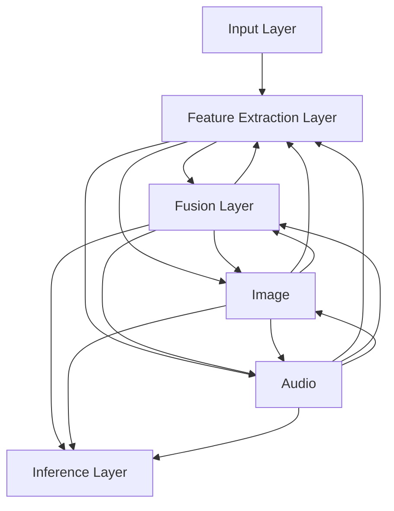

                 

### 核心概念与联系

#### 轻量级模型定义与特征

轻量级模型（Lightweight Model）是指在保证模型性能的前提下，尽可能减少模型参数数量、计算复杂度和模型体积的一种模型。其核心特征主要包括以下几点：

1. **参数数量少**：轻量级模型通过减少参数数量，降低模型的复杂性，从而提高模型训练和推理的效率。
2. **计算复杂度低**：轻量级模型通常采用深度可分离卷积（Depthwise Separable Convolution）等优化技术，使得计算量显著减少。
3. **模型体积小**：轻量级模型通常可以部署在资源受限的设备上，如移动设备、嵌入式设备等，因此模型体积必须尽可能小。

#### 知识蒸馏原理与类型

知识蒸馏（Knowledge Distillation）是一种将教师模型的“知识”转移到学生模型中的训练方法。教师模型通常是性能较好的大型模型，而学生模型则是性能较好的小型模型。知识蒸馏的核心原理和类型如下：

1. **原理**：
   - **软标签**：教师模型在训练过程中生成的软标签（Soft Label）作为额外的输入，传递给学生模型，辅助其学习。
   - **量化**：将教师模型的输出概率分布作为量化目标，使学生模型的学习目标与教师模型更接近。

2. **类型**：
   - **基于特征的蒸馏**：将教师模型的特征表示传递给学生模型，以帮助其学习更好的特征表示。
   - **基于概率的蒸馏**：将教师模型的输出概率分布传递给学生模型，以帮助其学习正确的分类概率。

#### 轻量级跨模态推理模型架构与设计

轻量级跨模态推理模型（Lightweight Cross-Modal Inference Model）是结合轻量级模型和知识蒸馏技术的跨模态推理模型。其架构和设计原则如下：

1. **架构**：
   - **输入层**：接收不同模态的数据（如文本、图像、音频等）。
   - **特征提取层**：利用轻量级模型提取各模态的特征表示。
   - **融合层**：将各模态的特征表示进行融合，形成统一的跨模态特征表示。
   - **推理层**：利用学生模型对跨模态特征进行推理，输出预测结果。

2. **设计原则**：
   - **参数共享**：在不同模态的特征提取层中使用参数共享，降低模型参数数量。
   - **深度可分离卷积**：采用深度可分离卷积等优化技术，降低计算复杂度。
   - **知识蒸馏**：利用知识蒸馏技术，将教师模型的“知识”传递给学生模型，提高学生模型性能。

### Mermaid 流程图

以下是一个简化的轻量级跨模态推理模型架构的 Mermaid 流程图：

### 概念属性特征对比表格

| 概念               | 轻量级模型               | 知识蒸馏                 | 轻量级跨模态推理模型               |
|------------------|----------------------|-----------------------|---------------------------|
| **定义**           | 参数数量少、计算复杂度低、模型体积小   | 将教师模型的“知识”传递给学生模型       | 结合轻量级模型和知识蒸馏技术的跨模态推理模型   |
| **主要特征**       | 参数数量、计算复杂度、模型体积       | 软标签、量化、特征表示、概率分布     | 轻量级模型特征、知识蒸馏特征、跨模态特征融合   |
| **优势**           | 提高训练和推理效率、适用于资源受限设备   | 提高模型性能、减少过拟合、降低计算复杂度 | 结合轻量级模型和知识蒸馏优势，提高跨模态推理性能 |

### 数学模型与公式

以下是一个简化的轻量级跨模态推理模型中的知识蒸馏数学模型：

$$
\begin{aligned}
\hat{y}^{(s)} &= \text{softmax}(W^{(s)} \cdot \phi^{(t)}(x)), \\
\hat{y}^{(t)} &= \text{softmax}(W^{(t)} \cdot \phi^{(t)}(x)), \\
L^{(s)} &= -\sum_{i=1}^{C} \hat{y}^{(s)}_i \cdot \log(y_i^{(s)}), \\
L^{(t)} &= -\sum_{i=1}^{C} \hat{y}^{(t)}_i \cdot \log(y_i^{(t)}),
\end{aligned}
$$

其中：
- $\hat{y}^{(s)}$ 和 $\hat{y}^{(t)}$ 分别为教师模型和学生模型的输出概率分布。
- $W^{(s)}$ 和 $W^{(t)}$ 分别为教师模型和学生模型的权重。
- $\phi^{(t)}(x)$ 为教师模型的特征提取函数。
- $L^{(s)}$ 和 $L^{(t)}$ 分别为教师模型和学生模型的损失函数。
- $y_i^{(s)}$ 和 $y_i^{(t)}$ 分别为学生模型的预测标签和真实标签。

### 概念联系与总结

轻量级模型通过减少参数数量、计算复杂度和模型体积，提高训练和推理效率，适用于资源受限的设备。知识蒸馏通过将教师模型的“知识”传递给学生模型，提高模型性能，减少过拟合。轻量级跨模态推理模型结合轻量级模型和知识蒸馏技术，提高跨模态推理性能。通过上述核心概念和原理的分析，我们可以更好地理解轻量级跨模态推理模型的设计思路和实现方法。

