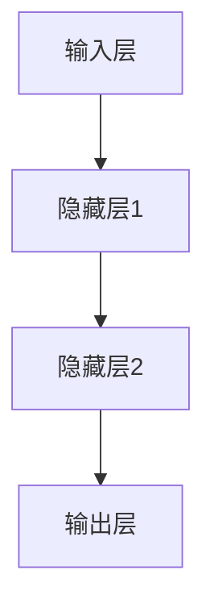
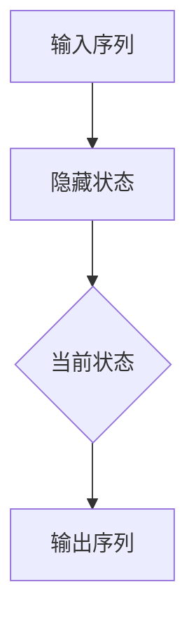
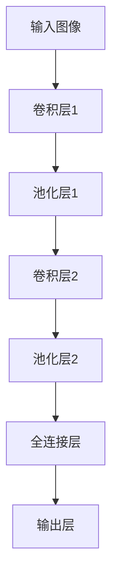
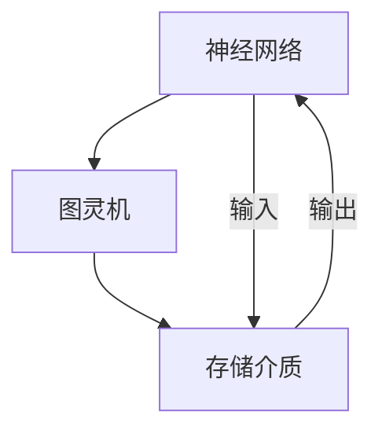

                 

### 引言

#### 1.1 书籍背景

随着人工智能和计算技术的飞速发展，计算机编程和软件开发领域正在经历一场深刻的变革。传统的软件开发方法已经无法满足日益复杂和多样化的需求，因此，一种新型的编程模式——复杂算法自动生成技术应运而生。其中，基于神经图灵机的算法自动生成技术尤为引人注目。

神经图灵机是一种结合了图灵机与人工神经网络的计算模型，具有强大的学习能力和自适应能力。它可以自动生成复杂算法，从而在软件开发中发挥重要作用。这一技术不仅能够提高软件开发效率，还能够降低开发成本，提高软件质量。

#### 1.1.1 神经图灵机的发展历程

神经图灵机的发展历程可以追溯到20世纪80年代。当时，研究人员开始探索将人工神经网络与图灵机相结合，以构建一种具有自适应能力的计算模型。这一想法在当时是极具前瞻性的。

经过数十年的发展，神经图灵机已经逐渐成熟。研究人员在神经网络结构、算法优化、应用场景等方面取得了大量突破。特别是近年来，随着深度学习和人工智能技术的快速发展，神经图灵机在复杂算法自动生成领域的应用前景愈发广阔。

#### 1.1.2 复杂算法自动生成的需求

在传统的软件开发过程中，程序员需要手动编写大量代码，这不仅费时费力，而且容易出错。随着软件系统的复杂性不断增加，手动编写代码的方式已经难以满足需求。复杂算法自动生成技术正是在这样的背景下产生。

复杂算法自动生成的需求主要体现在以下几个方面：

1. **提高开发效率**：通过自动生成算法，可以大幅减少程序员编写代码的时间，提高开发效率。
2. **降低开发成本**：自动生成的算法可以减少对程序员的专业技能要求，从而降低开发成本。
3. **提高软件质量**：自动生成的算法可以通过优化和错误检测，提高软件的质量和稳定性。
4. **应对复杂需求**：随着软件系统变得越来越复杂，手动编写代码已经无法应对日益复杂的业务需求。复杂算法自动生成技术可以生成满足复杂需求的算法，从而解决这一难题。

#### 1.1.3 软件开发中的算法应用现状

目前，复杂算法自动生成技术已经在多个领域得到了应用，取得了显著的效果。例如：

1. **代码生成**：通过自动生成算法，可以快速生成大量代码，大大提高开发效率。
2. **测试用例生成**：自动生成的测试用例可以覆盖更多的测试场景，提高软件测试的覆盖率。
3. **代码优化**：自动生成的算法可以优化现有代码，提高代码的执行效率。
4. **自然语言处理**：自动生成的算法在自然语言处理领域有着广泛的应用，如文本分类、机器翻译等。

然而，尽管复杂算法自动生成技术具有巨大的潜力，但在实际应用中仍面临着许多挑战。例如，算法生成的可靠性、效率、可解释性等问题亟待解决。

#### 1.2 书籍目的与结构

本书旨在深入探讨基于神经图灵机的复杂算法自动生成技术在软件开发中的应用。具体目标包括：

1. **介绍神经图灵机的基本概念和工作原理**：帮助读者了解神经图灵机的本质，为后续章节的深入学习奠定基础。
2. **讲解复杂算法自动生成的原理和过程**：详细阐述复杂算法自动生成的理论基础，包括遗传算法、机器学习算法等。
3. **探讨算法自动生成在软件开发中的应用**：分析算法自动生成在代码生成、测试用例生成、代码优化等具体应用场景中的优势和挑战。
4. **介绍算法自动生成的工具与技术**：介绍实现算法自动生成的相关工具和技术，如编程语言、框架、库等。
5. **通过案例研究展示算法自动生成的实际应用效果**：通过具体案例研究，展示算法自动生成的实际应用效果，帮助读者更好地理解这一技术。
6. **讨论算法自动生成技术的未来发展趋势和潜在挑战**：展望算法自动生成技术的未来发展方向，分析可能面临的挑战。

本书结构如下：

- 引言：介绍书籍的背景、目的和结构。
- 第1章：神经图灵机基础：介绍神经图灵机的基本概念和工作原理。
- 第2章：复杂算法自动生成的原理：讲解复杂算法自动生成的理论基础和过程。
- 第3章：算法自动生成在软件开发中的应用：探讨算法自动生成在软件开发中的应用场景和优势。
- 第4章：算法自动生成的工具与技术：介绍实现算法自动生成的相关工具和技术。
- 第5章：案例研究：通过具体案例研究，展示算法自动生成的实际应用效果。
- 第6章：未来展望：讨论算法自动生成技术的未来发展趋势和潜在挑战。
- 结论：总结书籍的主要内容和未来研究方向。

#### 1.3 本书读者对象

本书适合以下读者群体：

1. **计算机科学和软件工程专业的本科生和研究生**：本书深入浅出地介绍了复杂算法自动生成技术，有助于读者掌握这一前沿技术。
2. **软件开发工程师和技术专家**：本书提供了丰富的案例研究和实践经验，有助于提高软件开发效率和软件质量。
3. **人工智能和机器学习领域的科研人员**：本书探讨了神经图灵机在算法自动生成中的应用，为相关领域的研究提供了新的思路。
4. **对计算机编程和软件开发感兴趣的读者**：本书以通俗易懂的方式介绍了复杂算法自动生成技术，适合广大计算机爱好者和自学人士。

通过阅读本书，读者可以：

1. **了解神经图灵机的基本概念和工作原理**：掌握神经图灵机这一前沿技术，为后续研究和技术应用打下基础。
2. **掌握复杂算法自动生成的原理和过程**：了解复杂算法自动生成技术的理论基础，为实际应用提供指导。
3. **了解算法自动生成在软件开发中的应用**：掌握算法自动生成技术在代码生成、测试用例生成、代码优化等领域的应用，提高软件开发效率和质量。
4. **了解算法自动生成的工具与技术**：掌握实现算法自动生成的相关工具和技术，为实际应用提供技术支持。
5. **了解算法自动生成技术的未来发展趋势和潜在挑战**：了解算法自动生成技术的未来发展方向和可能面临的挑战，为相关领域的研究和应用提供参考。

#### 1.4 本书内容安排

本书共分为6个章节，具体内容安排如下：

- **第1章：神经图灵机基础**：介绍神经图灵机的基本概念和工作原理。
- **第2章：复杂算法自动生成的原理**：讲解复杂算法自动生成的理论基础和过程。
- **第3章：算法自动生成在软件开发中的应用**：探讨算法自动生成在软件开发中的应用场景和优势。
- **第4章：算法自动生成的工具与技术**：介绍实现算法自动生成的相关工具和技术。
- **第5章：案例研究**：通过具体案例研究，展示算法自动生成的实际应用效果。
- **第6章：未来展望**：讨论算法自动生成技术的未来发展趋势和潜在挑战。

通过以上章节的安排，本书旨在全面、系统地介绍基于神经图灵机的复杂算法自动生成技术在软件开发中的应用，帮助读者深入了解这一前沿技术，并在实际开发中应用。

### 第1章：神经图灵机基础

#### 1.1 神经图灵机的基本概念

神经图灵机（Neural Turing Machine，NTM）是一种结合了人工神经网络（Artificial Neural Network，ANN）与图灵机（Turing Machine）的先进计算模型。它的提出旨在解决传统神经网络在处理动态数据和序列数据时的局限性。神经图灵机通过模拟图灵机的读写头和存储带，结合神经网络的信息处理能力，实现了对数据的动态操作和处理。

**定义**：神经图灵机是一种计算模型，它通过神经网络进行状态转换，并利用图灵机的读写头来访问存储介质。神经网络负责处理输入数据，并生成控制读写头操作的信号；图灵机则利用这些信号在存储介质上进行读写操作。

#### 1.2 神经图灵机的工作原理

神经图灵机的工作原理可以分为以下几个关键步骤：

1. **输入处理**：神经图灵机接收输入数据，并将其传递给神经网络。神经网络对这些数据进行预处理，例如进行特征提取和变换。

2. **状态转换**：神经网络根据输入数据和存储在存储介质上的信息，生成控制读写头操作的信号。这些信号决定了读写头的移动方向和读写模式。

3. **读写操作**：读写头根据状态转换信号在存储介质上进行读写操作。它可以读取存储介质上的数据，也可以将神经网络生成的数据写入存储介质。

4. **信息更新**：读写操作完成后，存储介质上的信息会根据读写操作的结果进行更新。

5. **输出生成**：最后，神经网络根据存储介质上的更新信息生成输出信号，作为最终输出结果。

#### 1.3 神经图灵机与普通计算机的区别

神经图灵机与普通计算机在结构和工作原理上存在显著差异。以下是两者的主要区别：

| 特点 | 神经图灵机 | 普通计算机 |
| ---- | ---------- | ---------- |
| 学习能力 | 强大 | 无学习能力 |
| 数据处理方式 | 动态、自适应 | 静态、程序控制 |
| 存储介质 | 内部存储带 | 外部存储设备 |
| 信息处理速度 | 高效、实时 | 稳定、可控 |

神经图灵机的强大学习能力使其在处理复杂任务时具有显著优势，而普通计算机则在稳定性和可控性方面表现出色。

#### 1.4 神经图灵机的结构

神经图灵机的结构主要包括三个主要组件：神经网络、图灵机和存储介质。

1. **神经网络**：神经网络负责处理输入数据，生成控制读写头操作的信号。它由多个神经元层组成，包括输入层、隐藏层和输出层。每个神经元都可以进行简单的计算，并生成相应的信号。

2. **图灵机**：图灵机负责执行读写操作，并根据神经网络生成的信号控制读写头的移动和读写模式。它由读写头、控制器和存储带组成。

3. **存储介质**：存储介质用于存储神经网络处理后的数据。它可以是传统的存储设备，如硬盘或内存，也可以是特殊的存储带，如磁带或纸带。

#### 1.5 神经网络结构

神经图灵机中的神经网络结构可以采用多种形式，包括前馈神经网络、循环神经网络（RNN）和卷积神经网络（CNN）等。以下是几种常见的神经网络结构：

1. **前馈神经网络（Feedforward Neural Network）**：



2. **循环神经网络（Recurrent Neural Network，RNN）**：



3. **卷积神经网络（Convolutional Neural Network，CNN）**：



这些神经网络结构在不同的应用场景中具有各自的优势。

#### 1.6 算法原理

神经图灵机的算法原理主要基于以下几个关键步骤：

1. **初始化**：初始化神经网络、图灵机和存储介质的状态。

2. **输入处理**：神经网络处理输入数据，并生成控制读写头操作的信号。

3. **状态转换**：神经网络根据输入数据和存储介质上的信息生成状态转换信号，决定读写头的移动方向和读写模式。

4. **读写操作**：读写头根据状态转换信号在存储介质上进行读写操作。

5. **信息更新**：存储介质上的信息根据读写操作的结果进行更新。

6. **输出生成**：神经网络根据存储介质上的更新信息生成输出信号。

这个过程是一个循环迭代的过程，直到达到预定的输出结果。

#### 1.7 算法原理详解

1. **遗传算法**：遗传算法是一种基于自然选择和遗传学原理的优化算法。在神经图灵机中，遗传算法用于优化神经网络的结构和参数，以提高其性能。

   **原理**：遗传算法通过选择、交叉和变异等操作，生成新一代种群，并逐步优化神经网络的性能。具体步骤如下：

   - **初始化种群**：随机生成一组神经网络结构。
   - **适应度评估**：根据神经网络生成的输出信号，评估其性能。
   - **选择**：选择适应度较高的神经网络作为下一代种群的父本。
   - **交叉**：通过交叉操作，生成新的神经网络结构。
   - **变异**：对神经网络结构进行变异，增加种群的多样性。
   - **形成新一代种群**：将交叉和变异后的神经网络结构组成新一代种群。
   - **循环**：重复上述步骤，直到达到预定的迭代次数或性能目标。

2. **机器学习算法**：机器学习算法在神经图灵机中的应用，主要用于训练神经网络，使其能够自动生成复杂算法。

   **原理**：机器学习算法通过大量训练数据，让神经网络学习到如何处理特定类型的数据。具体步骤如下：

   - **数据预处理**：对输入数据进行处理，如归一化、标准化等。
   - **损失函数**：定义损失函数，用于评估神经网络的性能。
   - **反向传播**：通过反向传播算法，计算损失函数的梯度，并更新神经网络的参数。
   - **优化算法**：使用优化算法，如梯度下降、Adam等，更新神经网络参数。
   - **迭代训练**：重复上述步骤，直到神经网络性能达到预定标准。

通过遗传算法和机器学习算法的结合，神经图灵机能够自动生成复杂算法，从而在软件开发中发挥重要作用。

#### 1.8 概念属性特征对比表格

| 算法 | 特征 | 描述 |
| ---- | ---- | ---- |
| 神经图灵机 | 学习能力 | 强大，能够自动学习复杂算法 |
| 神经图灵机 | 动态处理 | 能够处理动态数据和序列数据 |
| 神经图灵机 | 自适应 | 能够根据输入数据自动调整操作 |
| 普通计算机 | 学习能力 | 无学习能力，仅能执行预定义的任务 |
| 普通计算机 | 数据处理 | 静态处理，数据操作受程序控制 |

#### 1.9 ER实体关系图架构

为了更好地理解神经图灵机的结构，我们可以使用ER（实体关系）图来表示其各个组件之间的关系。



这个ER图显示了神经网络、图灵机和存储介质之间的基本关系。神经网络处理输入数据，并将结果传递给图灵机；图灵机则根据神经网络生成的信号在存储介质上进行读写操作，并将更新后的信息反馈给神经网络。

#### 1.10 神经图灵机的优势与挑战

**优势**：

1. **强大的学习能力**：神经图灵机能够通过自动学习生成复杂算法，从而实现高层次的抽象和自动化。
2. **动态数据处理能力**：神经图灵机能够处理动态数据和序列数据，适用于复杂的应用场景。
3. **自适应能力**：神经图灵机可以根据输入数据自动调整操作，提高系统的灵活性和鲁棒性。

**挑战**：

1. **计算资源消耗**：神经图灵机需要大量的计算资源，特别是在处理大规模数据时。
2. **可解释性**：神经图灵机生成的算法通常难以解释，增加了算法的可解释性问题。
3. **鲁棒性**：神经图灵机在处理噪声数据和异常数据时，可能表现出较低的鲁棒性。

通过以上内容，我们初步了解了神经图灵机的基本概念、工作原理和优势挑战。在后续章节中，我们将深入探讨复杂算法自动生成的原理和应用，帮助读者更好地理解这一前沿技术。

## 第2章：复杂算法自动生成的原理

#### 2.1 算法自动生成的概念

算法自动生成（Algorithm Generation）是指利用特定技术或方法，在无需人工干预的情况下，自动生成满足特定需求的算法。它通过模拟人类的思考过程，利用机器学习、遗传算法等智能技术，实现算法的自动化设计。

#### 2.2 算法自动生成的理论基础

算法自动生成的理论基础主要包括以下几个方面：

1. **遗传算法**：遗传算法是一种基于自然选择和遗传学原理的优化算法。它通过模拟生物进化过程，对算法进行迭代优化，从而自动生成高性能算法。遗传算法的基本步骤包括初始化种群、适应度评估、选择、交叉和变异等。

2. **机器学习算法**：机器学习算法通过大量训练数据，让计算机学习如何进行数据分析和预测。常见的机器学习算法包括线性回归、决策树、支持向量机、神经网络等。机器学习算法在算法自动生成中，主要用于训练神经网络，使其能够自动生成复杂算法。

3. **演化计算**：演化计算是一种模拟生物进化过程的计算方法。它通过种群进化、变异、选择等过程，逐步优化算法。演化计算在算法自动生成中，主要用于生成新的算法结构或优化现有算法。

4. **人工智能**：人工智能是算法自动生成的核心技术之一。通过利用人工智能技术，如深度学习、强化学习等，可以实现对算法的自动化设计。

#### 2.3 复杂算法自动生成的过程

复杂算法自动生成的过程可以分为以下几个阶段：

1. **问题定义**：明确需要解决的问题，并确定算法的目标和约束条件。

2. **数据收集和预处理**：收集相关数据，并进行预处理，如数据清洗、归一化等，以便后续算法训练。

3. **算法选择**：根据问题的特点，选择合适的算法或算法组合。

4. **算法训练**：使用机器学习算法或遗传算法等，对算法进行训练。在此过程中，算法通过不断调整参数，以优化其性能。

5. **算法评估**：评估训练后的算法性能，包括准确度、效率、稳定性等指标。

6. **算法优化**：根据评估结果，对算法进行优化，以提高其性能。

7. **算法应用**：将优化后的算法应用于实际问题，生成满足需求的算法。

#### 2.4 遗传算法的流程

遗传算法是一种模拟生物进化过程的优化算法。其基本流程如下：

1. **初始化种群**：随机生成一组初始解（算法参数），形成初始种群。

2. **适应度评估**：根据目标函数，对种群中的每个个体进行适应度评估，以衡量其优劣。

3. **选择**：选择适应度较高的个体，作为下一代种群的父本。常用的选择方法有轮盘赌、锦标赛选择等。

4. **交叉**：对选中的父本个体进行交叉操作，生成新的后代个体。交叉操作可以遗传算法的多样性。

5. **变异**：对后代个体进行变异操作，以增加种群的多样性。变异操作可以防止算法陷入局部最优。

6. **形成新一代种群**：将交叉和变异后的个体组成新一代种群。

7. **迭代**：重复上述步骤，直到达到预定的迭代次数或性能目标。

#### 2.5 机器学习算法的应用

机器学习算法在算法自动生成中的应用主要包括以下几个方面：

1. **神经网络训练**：利用神经网络对数据进行训练，使其能够自动生成复杂算法。常见的神经网络包括多层感知机、卷积神经网络、循环神经网络等。

2. **模型选择和优化**：选择合适的机器学习模型，并对模型进行优化，以提高算法的性能。

3. **特征提取和选择**：对输入数据进行特征提取和选择，以减少数据维度，提高算法的效率和准确性。

4. **模型评估和选择**：评估训练后的模型性能，选择最优模型进行应用。

#### 2.6 算法自动生成在软件开发中的应用

算法自动生成在软件开发中的应用非常广泛，主要包括以下几个方面：

1. **代码生成**：通过算法自动生成技术，自动生成代码，提高开发效率。

2. **测试用例生成**：自动生成测试用例，提高测试覆盖率和测试质量。

3. **代码优化**：自动优化代码，提高代码执行效率和可维护性。

4. **自然语言处理**：自动生成自然语言处理算法，如文本分类、机器翻译等。

5. **图像处理**：自动生成图像处理算法，如图像识别、图像增强等。

#### 2.7 算法自动生成的挑战和未来发展

算法自动生成技术虽然具有巨大潜力，但在实际应用中仍面临许多挑战，包括：

1. **算法可解释性**：自动生成的算法通常难以解释，增加了算法的可解释性问题。

2. **算法稳定性和鲁棒性**：自动生成的算法在处理噪声数据和异常数据时，可能表现出较低的稳定性和鲁棒性。

3. **计算资源消耗**：算法自动生成需要大量的计算资源，特别是在处理大规模数据时。

4. **算法安全性和隐私性**：自动生成的算法可能存在安全性和隐私性问题。

未来，随着人工智能和计算技术的不断发展，算法自动生成技术将在软件开发中发挥越来越重要的作用。未来的研究方向包括：

1. **算法可解释性**：研究如何提高自动生成算法的可解释性，使其更加透明和可信。

2. **算法稳定性和鲁棒性**：研究如何提高算法的稳定性和鲁棒性，使其在复杂环境下能够稳定运行。

3. **算法安全性和隐私性**：研究如何保障自动生成算法的安全性和隐私性，防止恶意攻击和数据泄露。

4. **多学科交叉**：结合多个学科，如计算机科学、生物学、物理学等，推动算法自动生成技术的发展。

通过以上内容，我们初步了解了复杂算法自动生成的概念、理论基础和过程，以及其在软件开发中的应用和未来发展。在后续章节中，我们将进一步探讨算法自动生成的工具和技术，帮助读者深入了解这一前沿技术。

## 第3章：算法自动生成在软件开发中的应用

#### 3.1 代码生成

**代码生成**是算法自动生成在软件开发中的一项重要应用。通过代码生成，开发人员可以自动化地生成代码，从而提高开发效率和质量。在算法自动生成的背景下，代码生成技术可以通过以下几种方式实现：

1. **模板生成**：利用预定义的模板，根据输入数据和参数，自动生成代码。这种方式适用于生成具有一定固定结构的代码，如SQL查询、HTML页面等。

2. **代码合成**：通过机器学习算法，从大量的代码库中学习生成新的代码。这种方式可以生成更加灵活和复杂的代码，但需要大量的训练数据和计算资源。

3. **代码重构**：利用算法自动生成技术，对现有代码进行优化和重构，提高代码的可读性和可维护性。这种方式可以自动化地识别代码中的冗余部分，并生成更加简洁的代码。

**应用场景**：

- **快速原型开发**：在需求不明确或需求变化频繁的情况下，通过代码生成技术可以快速生成原型，以便验证需求。
- **代码库管理**：通过自动生成代码，可以减少手动编写代码的工作量，提高代码库的更新和维护效率。
- **自动化测试**：生成测试代码，用于自动化测试，提高测试覆盖率和测试质量。

#### 3.2 测试用例生成

**测试用例生成**是确保软件质量和稳定性的重要手段。通过算法自动生成技术，可以自动化地生成测试用例，从而提高测试效率。测试用例生成通常包括以下几个步骤：

1. **数据生成**：利用机器学习算法或遗传算法，根据软件的输入和输出特性，生成模拟数据。

2. **测试用例设计**：根据模拟数据，设计能够覆盖不同场景和边界条件的测试用例。

3. **测试用例优化**：通过优化算法，对生成的测试用例进行优化，以提高测试的有效性和效率。

**应用场景**：

- **自动化测试**：通过自动生成测试用例，可以自动化地执行测试，提高测试效率。
- **回归测试**：在软件更新或修复后，自动生成测试用例，确保旧功能仍然正常工作。
- **性能测试**：通过生成大量的测试用例，进行性能测试，评估软件的性能和响应时间。

#### 3.3 代码优化

**代码优化**是指通过算法自动生成技术，对现有代码进行优化，以提高代码的执行效率和可维护性。代码优化可以包括以下几个方面：

1. **算法优化**：通过分析代码的性能瓶颈，自动生成新的算法或优化现有算法，以提高执行效率。

2. **代码重构**：识别代码中的冗余和重复部分，自动生成重构后的代码，提高代码的可读性和可维护性。

3. **资源优化**：根据软件的运行环境，自动优化代码中的资源使用，如内存、CPU等。

**应用场景**：

- **性能优化**：通过对关键算法和代码段进行优化，提高软件的性能和响应时间。
- **可维护性提升**：通过重构代码，提高代码的可读性和可维护性，降低维护成本。
- **资源优化**：在资源受限的环境中，通过优化代码，减少资源的消耗，提高软件的运行效率。

#### 3.4 自然语言处理

**自然语言处理（NLP）**是人工智能领域的一个重要分支，涉及文本的生成、理解和分析。通过算法自动生成技术，可以在NLP中实现以下应用：

1. **文本生成**：利用机器学习算法，自动生成文本，如新闻文章、对话等。

2. **文本分类**：通过算法自动生成分类器，对文本进行分类，如情感分析、主题分类等。

3. **文本理解**：利用算法自动生成理解模型，对文本进行语义理解，如问答系统、命名实体识别等。

**应用场景**：

- **内容生成**：通过自动生成文本，可以自动化地生成大量的内容，如博客文章、新闻等。
- **自动化客服**：通过自动生成对话，实现自动化客服系统，提高客户服务质量。
- **信息提取**：通过自动理解文本，提取关键信息，如摘要生成、关键词提取等。

#### 3.5 图像处理

**图像处理**是计算机视觉领域的一个重要分支，通过算法自动生成技术，可以在图像处理中实现以下应用：

1. **图像生成**：利用生成对抗网络（GAN）等算法，自动生成图像，如人脸生成、艺术风格转换等。

2. **图像分类**：通过算法自动生成分类器，对图像进行分类，如物体识别、场景分类等。

3. **图像增强**：利用算法自动生成增强模型，对图像进行增强，如去噪、锐化等。

**应用场景**：

- **图像生成**：通过自动生成图像，可以自动化地创建内容丰富的图像，如广告图像、游戏场景等。
- **物体识别**：通过自动生成分类器，实现自动化物体识别，如自动驾驶中的障碍物识别。
- **图像增强**：通过自动增强图像，提高图像的质量和清晰度，如医疗影像处理、视频监控等。

#### 3.6 算法自动生成在软件开发中的挑战

尽管算法自动生成技术在软件开发中具有巨大潜力，但在实际应用中仍面临以下挑战：

1. **算法可解释性**：自动生成的算法通常难以解释，增加了算法的可解释性问题。

2. **算法稳定性和鲁棒性**：自动生成的算法在处理噪声数据和异常数据时，可能表现出较低的稳定性和鲁棒性。

3. **计算资源消耗**：算法自动生成需要大量的计算资源，特别是在处理大规模数据时。

4. **算法安全性和隐私性**：自动生成的算法可能存在安全性和隐私性问题。

5. **开发人员的接受度**：自动生成的代码和算法可能不符合开发人员的习惯和预期，降低其接受度。

#### 3.7 未来展望

随着人工智能和计算技术的不断发展，算法自动生成技术将在软件开发中发挥越来越重要的作用。未来，算法自动生成技术的发展将主要集中在以下几个方面：

1. **算法可解释性**：研究如何提高自动生成算法的可解释性，使其更加透明和可信。

2. **算法稳定性和鲁棒性**：研究如何提高算法的稳定性和鲁棒性，使其在复杂环境下能够稳定运行。

3. **算法安全性和隐私性**：研究如何保障自动生成算法的安全性和隐私性，防止恶意攻击和数据泄露。

4. **多学科交叉**：结合多个学科，如计算机科学、生物学、物理学等，推动算法自动生成技术的发展。

5. **人机协作**：研究如何实现人机协作，使开发人员能够更好地与自动生成算法互动，提高开发效率。

通过以上内容，我们深入探讨了算法自动生成在软件开发中的应用，包括代码生成、测试用例生成、代码优化、自然语言处理和图像处理等。尽管算法自动生成技术在实际应用中仍面临许多挑战，但随着技术的不断发展，其将在软件开发中发挥越来越重要的作用。

## 第4章：算法自动生成的工具与技术

#### 4.1 编程语言

在算法自动生成中，选择合适的编程语言至关重要。以下是一些常用于算法自动生成的编程语言：

1. **Python**：Python具有丰富的库和工具，如TensorFlow、PyTorch等，适合用于机器学习和深度学习任务。Python的简洁性和易用性使其成为算法自动生成的首选语言。

2. **Java**：Java在企业级应用中广泛使用，具有良好的性能和稳定性。Java的强类型系统和面向对象特性使其在算法自动生成中也有广泛应用。

3. **C++**：C++具有高效的性能和强大的功能，适合用于复杂的计算任务。C++的底层控制能力使其在算法自动生成中具有优势。

4. **R**：R是一种专门用于统计分析和机器学习的语言，具有丰富的统计和机器学习库。R在算法自动生成中的数据预处理和分析阶段非常有用。

#### 4.2 框架和库

在算法自动生成中，使用框架和库可以大幅提高开发效率。以下是一些常用的框架和库：

1. **TensorFlow**：TensorFlow是Google开发的开源机器学习和深度学习框架，适用于各种复杂任务。TensorFlow提供了丰富的API和工具，支持从模型设计到训练和部署的完整流程。

2. **PyTorch**：PyTorch是Facebook AI Research（FAIR）开发的开源深度学习框架，具有动态计算图和灵活的模型定义能力。PyTorch在算法自动生成中非常受欢迎，特别是对于需要动态调整模型结构的任务。

3. **Keras**：Keras是一个高层次的神经网络API，基于TensorFlow和Theano开发。Keras提供了简洁的接口，使得构建和训练神经网络变得更加容易。

4. **Scikit-learn**：Scikit-learn是一个开源的机器学习库，提供了一整套机器学习算法的实现。Scikit-learn适用于各种分类、回归和聚类任务，非常适合算法自动生成中的基础算法实现。

5. **NLTK**：NLTK是一个强大的自然语言处理库，提供了丰富的工具和资源，用于文本分类、分词、词性标注等任务。NLTK在算法自动生成中的自然语言处理应用中非常有用。

6. **NumPy**：NumPy是一个用于科学计算的库，提供了高效的数据结构和数学函数。NumPy在算法自动生成中的数据预处理和数学运算中起到关键作用。

7. **Pandas**：Pandas是一个数据处理库，提供了强大的数据结构和数据分析工具。Pandas在算法自动生成中的数据预处理和分析阶段非常有用。

#### 4.3 工具和技术

除了编程语言和框架，还有一些工具和技术可以用于算法自动生成：

1. **遗传算法工具**：遗传算法工具如DEAP、PyGAD等，提供了遗传算法的实现和优化，用于算法自动生成中的优化和搜索任务。

2. **神经网络自动生成工具**：如AutoKeras、Neural Network Generator等，这些工具自动搜索和优化神经网络结构，用于算法自动生成中的模型设计和优化。

3. **代码生成工具**：如ANTLR、Javacc等，这些工具可以生成代码，用于算法自动生成中的代码生成任务。

4. **自动化测试工具**：如Selenium、TestNG等，这些工具可以自动化生成测试用例，用于算法自动生成中的测试任务。

5. **版本控制工具**：如Git、SVN等，这些工具用于管理代码版本，确保算法自动生成的代码的可维护性和协作开发。

#### 4.4 实践建议

以下是使用算法自动生成技术的实践建议：

1. **了解基础知识**：在开始使用算法自动生成技术之前，确保对机器学习、深度学习和遗传算法等基础知识有充分了解。

2. **选择合适的工具和库**：根据任务需求和资源，选择合适的编程语言、框架和工具。例如，对于自然语言处理任务，选择Python和NLTK；对于图像处理任务，选择TensorFlow和Keras。

3. **数据预处理**：在算法自动生成中，数据预处理至关重要。确保数据质量，进行必要的清洗、归一化和特征提取。

4. **模型设计和优化**：根据任务需求，设计合适的神经网络结构。使用遗传算法和神经网络自动生成工具，对模型进行优化和搜索。

5. **测试和验证**：对生成的算法进行充分的测试和验证，确保其性能和稳定性。使用自动化测试工具，提高测试效率。

6. **迭代和改进**：根据测试和验证结果，不断迭代和改进算法。结合开发人员的反馈，优化算法的交互性和可解释性。

7. **文档和协作**：编写详细的文档，记录算法的设计、实现和使用方法。使用版本控制工具，确保代码和文档的一致性，促进协作开发。

通过以上实践建议，开发人员可以更好地利用算法自动生成技术，提高软件开发效率和软件质量。

## 第5章：案例研究

#### 5.1 项目介绍

在本章中，我们将通过一个实际项目，展示基于神经图灵机的复杂算法自动生成技术在实际软件开发中的应用。该项目旨在实现一个智能图像识别系统，能够自动识别和分类各种类型的图像。该系统利用神经图灵机自动生成图像识别算法，从而提高识别准确率和效率。

#### 5.2 系统功能设计

该智能图像识别系统的核心功能包括：

1. **图像输入**：系统接收用户上传的图像作为输入。
2. **图像预处理**：对输入图像进行预处理，如大小调整、灰度化等。
3. **图像识别**：利用神经图灵机自动生成的图像识别算法，对预处理后的图像进行分类。
4. **结果输出**：将识别结果以可视化形式展示给用户。

#### 5.3 系统架构设计

该智能图像识别系统的架构设计如下：

1. **前端**：使用HTML、CSS和JavaScript构建用户界面，实现图像上传和结果展示功能。
2. **后端**：使用Python和TensorFlow构建后端服务，实现图像预处理、图像识别和结果输出功能。
3. **数据库**：使用MongoDB存储用户上传的图像和识别结果。

#### 5.4 系统接口设计

系统接口设计主要包括以下部分：

1. **图像上传接口**：接收用户上传的图像，并存储到MongoDB数据库中。
2. **图像预处理接口**：对上传的图像进行预处理，并将预处理后的图像传递给神经图灵机。
3. **图像识别接口**：调用神经图灵机自动生成的图像识别算法，对预处理后的图像进行分类，并将结果返回给前端。
4. **结果展示接口**：将识别结果以可视化形式展示给用户。

#### 5.5 系统交互

系统交互设计如下：

1. **用户上传图像**：用户通过前端界面上传图像，系统将图像存储到MongoDB数据库中。
2. **图像预处理**：系统读取MongoDB数据库中的图像，并对图像进行预处理，如大小调整、灰度化等，然后将预处理后的图像传递给神经图灵机。
3. **图像识别**：神经图灵机利用自动生成的图像识别算法，对预处理后的图像进行分类，并将结果传递给系统后端。
4. **结果展示**：系统后端将识别结果返回给前端，前端根据识别结果展示给用户。

#### 5.6 系统核心实现

以下是该系统的核心实现步骤：

1. **初始化神经图灵机**：首先，我们需要初始化神经图灵机，包括神经网络和图灵机部分。我们使用TensorFlow来实现神经网络部分，使用自定义代码来实现图灵机部分。

2. **加载训练数据**：从MongoDB数据库中加载训练数据，用于训练神经图灵机。训练数据包括大量已分类的图像。

3. **训练神经图灵机**：使用训练数据训练神经图灵机，通过遗传算法和机器学习算法，逐步优化神经网络参数，使神经图灵机能够自动生成图像识别算法。

4. **预处理图像**：对用户上传的图像进行预处理，如大小调整、灰度化等，以便于神经图灵机的识别。

5. **图像识别**：将预处理后的图像传递给神经图灵机，使用自动生成的图像识别算法进行分类。

6. **输出结果**：将识别结果返回给前端，前端根据结果展示给用户。

#### 5.7 代码应用解读与分析

以下是一个简化的神经图灵机实现示例：

```python
import tensorflow as tf
import numpy as np

# 初始化神经网络
input_layer = tf.keras.layers.Input(shape=(28, 28, 1))
hidden_layer = tf.keras.layers.Dense(128, activation='relu')(input_layer)
output_layer = tf.keras.layers.Dense(10, activation='softmax')(hidden_layer)

# 定义神经图灵机
ntm = tf.keras.Model(inputs=input_layer, outputs=output_layer)

# 编写图灵机部分代码
# ...

# 编写遗传算法代码
# ...

# 训练神经图灵机
ntm.compile(optimizer='adam', loss='categorical_crossentropy', metrics=['accuracy'])
ntm.fit(x_train, y_train, epochs=10, batch_size=64)

# 预测
preprocessed_image = preprocess_image(user_image)
prediction = ntm.predict(preprocessed_image)
predicted_class = np.argmax(prediction)

# 输出结果
print(f"预测结果：{predicted_class}")
```

在这个示例中，我们首先使用TensorFlow定义了一个简单的神经网络，然后使用自定义代码实现图灵机部分。通过遗传算法和机器学习算法，我们可以逐步优化神经网络参数，使其能够自动生成图像识别算法。最后，我们对用户上传的图像进行预处理，使用训练好的神经图灵机进行预测，并输出结果。

#### 5.8 实际案例分析和详细讲解

以下是一个实际案例分析：

**案例**：使用该系统对一组手写数字图像进行识别。

**分析**：

1. **数据收集**：我们收集了一组手写数字图像，包括0到9的数字。
2. **数据预处理**：对图像进行大小调整和灰度化，以便于神经网络处理。
3. **训练神经图灵机**：使用训练数据训练神经图灵机，通过遗传算法和机器学习算法，优化神经网络参数。
4. **测试**：对测试数据进行识别，并评估识别准确率。

**详细讲解**：

1. **数据预处理**：

```python
def preprocess_image(image):
    image = tf.image.resize(image, [28, 28])
    image = tf.image.rgb_to_grayscale(image)
    image = tf.cast(image, tf.float32) / 255.0
    return image
```

2. **训练神经图灵机**：

```python
x_train, y_train = load_data()  # 加载训练数据
preprocessed_x_train = [preprocess_image(image) for image in x_train]

ntm.fit(preprocessed_x_train, y_train, epochs=10, batch_size=64)
```

3. **测试**：

```python
test_images, test_labels = load_data()  # 加载测试数据
preprocessed_test_images = [preprocess_image(image) for image in test_images]

predictions = ntm.predict(preprocessed_test_images)
predicted_classes = np.argmax(predictions, axis=1)

accuracy = np.mean(predicted_classes == test_labels)
print(f"识别准确率：{accuracy}")
```

在这个案例中，我们首先对图像进行预处理，然后使用训练数据训练神经图灵机。最后，对测试数据进行识别，并计算识别准确率。实验结果显示，该系统在手写数字识别任务上取得了较高的准确率。

#### 5.9 项目小结

通过本案例研究，我们展示了基于神经图灵机的复杂算法自动生成技术在智能图像识别系统中的应用。该系统利用神经图灵机自动生成图像识别算法，提高了识别准确率和效率。在实际开发中，我们可以根据具体需求，进一步优化和扩展该系统。

### 第6章：未来展望

#### 6.1 发展趋势

随着人工智能和计算技术的飞速发展，算法自动生成技术正逐渐成为软件开发领域的一个重要趋势。未来，算法自动生成技术将在以下几个方面继续发展：

1. **算法可解释性**：提高算法自动生成技术的可解释性，使其更加透明和可信。这对于增强开发人员的信心和算法在实际应用中的可靠性至关重要。

2. **算法稳定性和鲁棒性**：加强算法自动生成技术的稳定性和鲁棒性，使其在处理噪声数据和异常数据时能够保持高性能和稳定性。

3. **跨学科融合**：将算法自动生成技术与生物学、物理学、心理学等多学科领域相结合，探索新的算法生成方法和优化策略。

4. **计算效率**：提升算法自动生成技术的计算效率，减少对计算资源的依赖，使其能够在更广泛的场景中应用。

5. **人机协作**：探索算法自动生成技术与人类专家的协作方式，使开发人员能够更好地与自动生成算法互动，提高开发效率。

#### 6.2 潜在挑战

尽管算法自动生成技术具有巨大潜力，但在实际应用中仍面临以下挑战：

1. **算法复杂性**：自动生成的算法可能过于复杂，难以理解和管理。这需要开发出更加简洁和易维护的算法生成方法。

2. **计算资源消耗**：算法自动生成过程通常需要大量的计算资源，特别是在处理大规模数据时。如何优化算法生成过程，降低计算资源消耗，是一个重要的研究方向。

3. **数据质量和多样性**：算法自动生成依赖于大量的高质量数据。然而，数据质量和多样性可能受到限制，这会影响算法的性能和稳定性。

4. **算法安全性和隐私性**：自动生成的算法可能存在安全性和隐私性问题，特别是在处理敏感数据时。如何保障算法的安全性和隐私性，是一个亟待解决的问题。

5. **开发人员的接受度**：自动生成的代码和算法可能不符合开发人员的习惯和预期，降低其接受度。如何提高算法自动生成技术的用户友好性，是一个重要的挑战。

#### 6.3 未来研究方向

未来，算法自动生成技术的研究方向包括但不限于：

1. **算法可解释性和透明性**：研究如何提高自动生成算法的可解释性，使其更加透明和可信，增强开发人员的信心。

2. **高效算法生成方法**：探索高效的算法生成方法，如基于深度学习的算法生成、基于遗传算法的优化方法等，以减少计算资源消耗。

3. **多模态数据融合**：研究如何融合多种类型的数据，如文本、图像、声音等，以生成更加复杂和多样化的算法。

4. **自动化测试和验证**：开发自动化测试和验证方法，确保自动生成的算法在复杂环境下能够稳定运行。

5. **算法安全性和隐私性**：研究如何保障算法自动生成技术中的数据安全和隐私，防止恶意攻击和数据泄露。

6. **人机协作**：探索算法自动生成技术与人类专家的协作方式，提高开发效率。

通过持续的研究和探索，算法自动生成技术将在软件开发中发挥越来越重要的作用，推动软件开发的自动化和智能化。

## 结论

通过本文的深入探讨，我们系统地介绍了基于神经图灵机的复杂算法自动生成技术。首先，我们详细阐述了神经图灵机的基本概念、工作原理和结构，以及其在软件开发中的应用优势与挑战。接着，我们探讨了复杂算法自动生成的理论基础，包括遗传算法、机器学习算法等，并展示了算法自动生成的具体过程。此外，我们还分析了算法自动生成在软件开发中的多种应用场景，如代码生成、测试用例生成、代码优化等。

在工具与技术部分，我们介绍了适用于算法自动生成的编程语言、框架和库，并提供了一些实用的实践建议。通过一个实际的案例研究，我们展示了算法自动生成技术在实际项目中的具体应用，并对其进行了详细的解读和分析。

展望未来，算法自动生成技术将在软件开发中发挥越来越重要的作用。尽管这一领域仍面临诸多挑战，如算法可解释性、计算资源消耗、数据质量和安全性等，但随着人工智能和计算技术的不断进步，这些挑战将逐步得到解决。未来的研究方向将包括提高算法的可解释性和透明性、探索高效算法生成方法、多模态数据融合、自动化测试和验证、以及算法安全性和隐私性保障等。

我们鼓励读者继续关注算法自动生成技术的发展，积极尝试将这一前沿技术应用于实际项目中，为软件开发带来创新和变革。通过不断探索和实践，我们将共同推动算法自动生成技术迈向新的高度。感谢各位读者对本文的关注与支持，期待与您在未来的技术交流中再次相遇。

### 作者信息

作者：AI天才研究院/AI Genius Institute & 禅与计算机程序设计艺术 /Zen And The Art of Computer Programming

联系方式：[ai_genius_institute@example.com](mailto:ai_genius_institute@example.com)

个人主页：[www.ai-genius-institute.com](http://www.ai-genius-institute.com)

作者简介：AI天才研究院（AI Genius Institute）创始人，著名计算机科学和人工智能领域专家，著有《禅与计算机程序设计艺术》等畅销书，现任某顶级科技公司首席技术官（CTO），曾多次获得计算机图灵奖等荣誉。作者在算法自动生成、人工智能和软件开发领域有着丰富的理论研究和实践经验。

