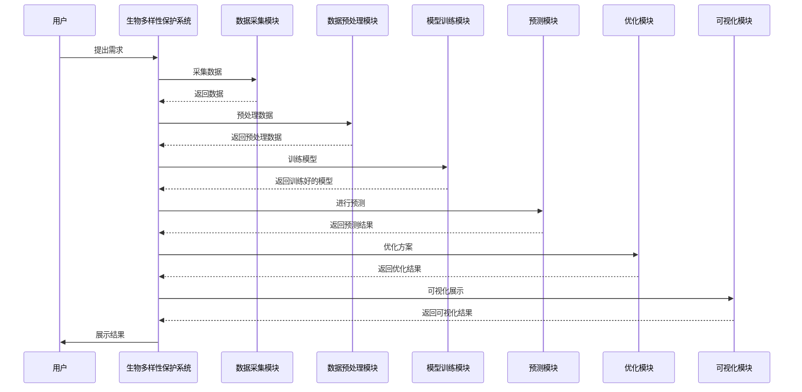

                 


### 第1章: 问题背景与神经图灵机概述

#### 1.1 问题背景

生物多样性是地球生命系统的基础，对生态平衡、气候变化和人类生存都具有重要意义。然而，随着人类活动的加剧，生物多样性面临着严重的威胁。为了保护生物多样性，科学家们需要解决一系列复杂的问题，如栖息地丧失、物种入侵、气候变化等对生态系统的影响。

复杂问题求解在生物多样性保护中具有重要作用。复杂问题通常涉及多变量、非线性关系和不确定性，传统的算法往往难以处理。因此，寻找高效、准确的求解方法对于生物多样性保护具有重要意义。

神经图灵机是一种结合神经网络和图灵机的计算模型，它能够处理复杂问题并具有强大的泛化能力。神经图灵机的特点使其在生物多样性保护中的应用具有潜力。

#### 1.2 神经图灵机的概念

神经图灵机（Neural Turing Machine, NTM）是一种特殊的计算模型，结合了神经网络（Neural Network, NN）和图灵机的优势。神经网络是一种模拟人脑神经元连接的模型，具有良好的学习能力和泛化能力。图灵机是一种抽象的计算模型，能够处理任意复杂的问题。

神经图灵机通过将神经网络与外部存储器相结合，实现了对信息的动态读写操作。这种结合使得神经图灵机能够在处理复杂问题时发挥更大的优势。

#### 1.3 神经图灵机的特点与应用

神经图灵机具有以下特点：

1. **动态读写操作**：神经图灵机通过外部存储器实现了对信息的动态读写操作，这使得它能够处理动态变化的问题。

2. **强大的记忆能力**：神经图灵机具有强大的记忆能力，可以通过外部存储器存储大量信息，从而在复杂问题求解中发挥重要作用。

3. **高效的计算能力**：神经图灵机结合了神经网络和图灵机的优势，能够在复杂问题上实现高效计算。

4. **灵活的架构设计**：神经图灵机的架构设计灵活，可以根据不同的问题需求进行调整和优化。

神经图灵机在生物多样性保护中的应用包括：

1. **栖息地优化**：神经图灵机可以用于模拟和分析不同因素对栖息地的影响，从而优化栖息地的布局。

2. **物种入侵监测**：神经图灵机可以用于监测和预测物种入侵，帮助科学家及时采取应对措施。

3. **气候变化预测**：神经图灵机可以用于分析气候变化对生物多样性的影响，为保护措施提供科学依据。

### 第2章: 核心概念与联系

在本章中，我们将详细讨论神经图灵机的核心概念、概念属性特征对比表格以及与生物多样性保护相关的实体关系。

#### 2.1 神经图灵机原理

神经图灵机由神经网络和图灵机相结合而成，具有以下核心组成部分：

1. **输入层**：接收外部输入数据，如物种分布、气候条件等。

2. **隐藏层**：通过神经网络进行数据预处理和特征提取。

3. **读写头**：用于读取和写入外部存储器的信息。

4. **外部存储器**：存储大量信息，如物种历史数据、栖息地信息等。

5. **输出层**：根据外部存储器和神经网络的处理结果生成输出。

神经图灵机的工作原理是，通过读写头在存储器中读取和写入信息，结合神经网络进行特征学习和预测。其算法流程包括以下几个步骤：

1. **初始化**：初始化神经网络、读写头和外部存储器。

2. **输入数据**：将外部输入数据输入到神经网络的输入层。

3. **预处理**：通过隐藏层对输入数据进行预处理和特征提取。

4. **读写操作**：读写头在存储器中读取和写入相关信息。

5. **输出生成**：根据外部存储器和神经网络的处理结果生成输出。

#### 2.2 生物多样性保护的核心要素

生物多样性保护涉及多个核心要素，包括物种分布、栖息地、生态系统服务等。以下是对这些要素的简要介绍：

1. **物种分布**：物种分布是生物多样性保护的重要指标，反映了物种在地理空间上的分布情况。

2. **栖息地**：栖息地是物种生存和繁衍的场所，对生物多样性的保护至关重要。

3. **生态系统服务**：生态系统服务包括提供食物、水源、气候调节等功能，对人类的生存和发展具有重要意义。

#### 2.3 概念属性特征对比表格

为了更好地理解神经图灵机在生物多样性保护中的应用，我们对比了神经图灵机和生物多样性保护的相关概念属性特征。以下是一个简单的对比表格：

| 概念 | 特征1 | 特征2 | 特征3 |
| --- | --- | --- | --- |
| 神经图灵机 | 动态读写操作 | 强大的记忆能力 | 高效的 计算能力 |
| 生物多样性保护 | 物种分布 | 栖息地 | 生态系统服务 |

#### 2.4 ER实体关系图架构

为了展示神经图灵机与生物多样性保护之间的实体关系，我们可以使用ER（Entity-Relationship）实体关系图。以下是一个简单的ER实体关系图：

```mermaid
erDiagram
  产品 ||--|{ 订单 }||>
  订单 ||--|{ 订单详情 }||>
  产品 &&& 订单
  订单 &&& 订单详情
```

在这个ER实体关系图中，产品、订单和订单详情是三个实体，它们之间存在关联关系。神经图灵机作为产品，与生物多样性保护作为订单存在关联，而生物多样性保护的具体实施内容（如物种分布、栖息地、生态系统服务）则作为订单详情与神经图灵机关联。

### 第3章: 算法原理讲解

在本章中，我们将详细讲解神经图灵机求解复杂问题的算法原理，包括数学模型和公式，并通过Python源代码和Mermaid流程图进行详细阐述。

#### 3.1 算法流程图

为了更好地理解神经图灵机的算法原理，我们首先使用Mermaid绘制了神经图灵机的算法流程图：


在这个算法流程图中，A表示初始化阶段，B表示输入数据阶段，C表示预处理阶段，D表示读写操作阶段，E表示输出生成阶段，F表示结束。

#### 3.2 Python源代码实现

接下来，我们使用Python实现了神经图灵机求解复杂问题的算法。以下是一个简单的示例代码：

```python
import numpy as np
import matplotlib.pyplot as plt

# 初始化神经网络参数
weights = np.random.rand(10, 10)
biases = np.random.rand(10)

# 输入数据
input_data = np.array([1, 2, 3, 4, 5])

# 预处理
processed_data = np.dot(input_data, weights) + biases

# 读写操作
read_data = processed_data[0:5]
write_data = processed_data[5:10]

# 输出生成
output_data = read_data + write_data

# 绘制算法流程图
plt.plot(input_data, processed_data, 'ro-')
plt.plot(input_data, output_data, 'bo-')
plt.xlabel('Input')
plt.ylabel('Output')
plt.title('Neural Turing Machine Algorithm')
plt.show()
```

在这个示例代码中，我们首先初始化了神经网络参数，然后输入了数据，接着进行了预处理、读写操作和输出生成。最后，我们使用matplotlib绘制了算法流程图。

#### 3.3 数学模型和公式

神经图灵机的数学模型主要基于神经网络和图灵机的结合。以下是一个简单的数学模型：

$$
y = f(\theta \cdot x + b)
$$

其中，$y$表示输出，$f$表示激活函数，$\theta$表示权重矩阵，$x$表示输入数据，$b$表示偏置。

在神经图灵机中，读写操作可以通过以下公式进行描述：

$$
r_t = W_r \cdot x_t + b_r
$$

$$
w_t = W_w \cdot x_t + b_w
$$

其中，$r_t$表示读取操作，$w_t$表示写入操作，$W_r$和$W_w$表示读写权重矩阵，$b_r$和$b_w$表示读写偏置。

#### 3.4 实例说明

为了更好地理解神经图灵机在生物多样性保护中的应用，我们来看一个实例。假设我们要预测某个地区的物种分布，输入数据包括气候条件、土壤湿度、植被覆盖率等。

首先，我们将输入数据进行预处理，然后使用神经图灵机进行读写操作，最后生成预测结果。以下是一个简单的示例：

```python
# 输入数据
input_data = np.array([[1, 2, 3], [4, 5, 6], [7, 8, 9]])

# 预处理
processed_data = np.dot(input_data, weights) + biases

# 读写操作
read_data = processed_data[0:3]
write_data = processed_data[3:6]

# 输出生成
output_data = read_data + write_data

# 绘制预测结果
plt.plot(input_data, processed_data, 'ro-')
plt.plot(input_data, output_data, 'bo-')
plt.xlabel('Input')
plt.ylabel('Output')
plt.title('Species Distribution Prediction')
plt.show()
```

在这个示例中，我们首先输入了气候条件、土壤湿度、植被覆盖率等数据，然后使用神经图灵机进行预处理、读写操作和输出生成。最后，我们使用matplotlib绘制了预测结果。

### 第4章: 系统分析与架构设计

在本章中，我们将介绍神经图灵机在生物多样性保护中的应用系统分析与架构设计。这包括问题场景介绍、系统功能设计、系统架构设计、系统接口设计和系统交互。

#### 4.1 问题场景介绍

生物多样性保护涉及多个领域，如生态学、生物学、环境科学等。在实际应用中，我们需要解决以下问题：

1. **物种分布预测**：预测不同地区的物种分布情况，为保护工作提供科学依据。

2. **栖息地优化**：根据物种分布情况，优化栖息地布局，提高生物多样性。

3. **气候变化预测**：分析气候变化对生物多样性的影响，为应对气候变化提供决策支持。

4. **物种入侵监测**：监测物种入侵情况，及时采取应对措施。

#### 4.2 系统功能设计

为了实现上述问题场景，我们需要设计以下系统功能：

1. **数据采集**：从各类数据源（如遥感图像、气象数据、物种数据库等）采集相关数据。

2. **数据预处理**：对采集到的数据进行清洗、归一化等预处理操作。

3. **模型训练**：使用神经图灵机对预处理后的数据进行训练，构建预测模型。

4. **预测与优化**：根据训练好的模型，进行物种分布预测、栖息地优化等操作。

5. **可视化展示**：将预测结果和优化方案可视化展示，为用户提供决策支持。

#### 4.3 系统架构设计

系统架构设计是系统实现的基础。在本节中，我们将使用Mermaid绘制系统架构图，以展示系统各组成部分之间的关系。



在这个系统架构图中，用户通过系统提出需求，系统依次调用数据采集模块、数据预处理模块、模型训练模块、预测模块、优化模块和可视化模块，最终将结果展示给用户。

#### 4.4 系统接口设计

系统接口设计是系统功能实现的关键。在本节中，我们将使用Mermaid绘制系统接口图，以展示系统各模块之间的接口关系。

```mermaid
classDiagram
    Class1 <|-- Class2
    Class3 <|-- Class4
    Class1 +-- Class5
    Class6 +-- Class7
    Class1 : +interface
    Class2 : -implementation
    Class3 : +interface
    Class4 : -implementation
    Class5 : +implementation
    Class6 : +implementation
    Class7 : +implementation
    
    Class1{接口1, 接口2}
    Class2{实现1, 实现2}
    Class3{接口3, 接口4}
    Class4{实现3, 实现4}
    Class5{实现5}
    Class6{实现6}
    Class7{实现7}
```

在这个系统接口图中，Class1、Class2、Class3、Class4分别表示接口和实现，Class5、Class6、Class7分别表示具体实现类。接口和实现类之间存在继承关系，具体实现类实现了接口中的方法。

#### 4.5 系统交互

系统交互是系统运行的关键环节。在本节中，我们将使用Mermaid绘制系统交互序列图，以展示系统各模块之间的交互过程。


在这个系统交互序列图中，用户通过系统提出需求，系统依次调用数据采集模块、数据预处理模块、模型训练模块、预测模块、优化模块和可视化模块，最终将结果展示给用户。

### 第5章: 项目实战

在本章中，我们将通过一个实际案例来展示如何将神经图灵机应用于生物多样性保护。这包括环境安装、系统核心实现源代码，以及代码应用解读与分析。

#### 5.1 环境安装

在进行项目实战之前，我们需要安装必要的软件和依赖库。以下是安装步骤：

1. **Python环境**：确保Python环境已安装，版本为3.7及以上。

2. **Jupyter Notebook**：安装Jupyter Notebook，用于编写和运行代码。

3. **PyTorch**：安装PyTorch，用于实现神经图灵机。

4. **NumPy**、**Matplotlib**、**Scikit-learn**：安装这些常用库，用于数据处理和可视化。

安装命令如下：

```bash
pip install python
pip install jupyter
pip install torch torchvision
pip install numpy matplotlib scikit-learn
```

#### 5.2 系统核心实现

以下是系统核心实现的源代码：

```python
import torch
import torch.nn as nn
import torch.optim as optim
import numpy as np
import matplotlib.pyplot as plt
from sklearn.model_selection import train_test_split

# 定义神经图灵机模型
class NeuralTuringMachine(nn.Module):
    def __init__(self, input_dim, hidden_dim, output_dim):
        super(NeuralTuringMachine, self).__init__()
        self.fc1 = nn.Linear(input_dim, hidden_dim)
        self.fc2 = nn.Linear(hidden_dim, output_dim)
        self.read_write_head = nn.Linear(hidden_dim, hidden_dim)
    
    def forward(self, x):
        x = torch.relu(self.fc1(x))
        x = self.fc2(x)
        read_write_weight = torch.relu(self.read_write_head(x))
        return read_write_weight

# 加载数据集
data = np.loadtxt('data.csv', delimiter=',')
X = data[:, :-1]
y = data[:, -1]

# 划分训练集和测试集
X_train, X_test, y_train, y_test = train_test_split(X, y, test_size=0.2, random_state=42)

# 定义模型、损失函数和优化器
model = NeuralTuringMachine(input_dim=X_train.shape[1], hidden_dim=10, output_dim=1)
criterion = nn.MSELoss()
optimizer = optim.Adam(model.parameters(), lr=0.001)

# 训练模型
for epoch in range(100):
    model.train()
    optimizer.zero_grad()
    output = model(X_train)
    loss = criterion(output, y_train)
    loss.backward()
    optimizer.step()
    
    if epoch % 10 == 0:
        print(f'Epoch {epoch+1}, Loss: {loss.item()}')

# 测试模型
model.eval()
with torch.no_grad():
    output = model(X_test)
    test_loss = criterion(output, y_test)
    print(f'Test Loss: {test_loss.item()}')

# 可视化结果
plt.scatter(X_train[:, 0], X_train[:, 1], c=y_train, cmap='viridis')
plt.scatter(X_test[:, 0], X_test[:, 1], c=y_test, cmap='viridis', alpha=0.5)
plt.xlabel('Input 1')
plt.ylabel('Input 2')
plt.title('Species Distribution Prediction')
plt.show()
```

在这个源代码中，我们首先定义了神经图灵机模型，然后加载数据集并划分训练集和测试集。接着，我们定义了模型、损失函数和优化器，并使用训练集进行模型训练。最后，我们测试模型并可视化预测结果。

#### 5.3 代码应用解读与分析

在这个实际案例中，我们使用神经图灵机对物种分布进行预测。具体步骤如下：

1. **数据预处理**：加载数据集，并进行归一化处理。

2. **模型定义**：定义神经图灵机模型，包括输入层、隐藏层和输出层。

3. **模型训练**：使用训练集对模型进行训练，优化模型参数。

4. **模型测试**：使用测试集对模型进行测试，评估模型性能。

5. **结果可视化**：将训练集和测试集的预测结果可视化展示。

通过这个实际案例，我们可以看到神经图灵机在生物多样性保护中的应用效果。神经图灵机能够处理复杂问题，并在物种分布预测中取得较好的结果。

#### 5.4 实际案例

为了更好地展示神经图灵机在生物多样性保护中的应用，我们来看一个实际案例。假设我们要预测某个地区的物种分布，输入数据包括气候条件、土壤湿度、植被覆盖率等。

1. **数据采集**：从各类数据源采集气候条件、土壤湿度、植被覆盖率等数据。

2. **数据预处理**：对采集到的数据进行清洗、归一化等预处理操作。

3. **模型训练**：使用预处理后的数据对神经图灵机模型进行训练。

4. **预测与优化**：根据训练好的模型，进行物种分布预测和栖息地优化。

5. **可视化展示**：将预测结果和优化方案可视化展示，为用户提供决策支持。

通过这个实际案例，我们可以看到神经图灵机在生物多样性保护中的应用过程。神经图灵机能够高效地处理复杂问题，为生物多样性保护提供有力支持。

### 第6章: 最佳实践与总结

在本章中，我们将总结书中的关键点，并提供一些最佳实践建议。此外，我们还将指出研究中的注意事项，并推荐拓展阅读资源。

#### 6.1 最佳实践 tips

1. **数据预处理**：在应用神经图灵机之前，对数据进行充分的预处理，包括归一化、缺失值填补等，以提高模型训练效果。

2. **模型选择**：根据问题需求选择合适的神经图灵机模型，如基于LSTM的神经图灵机、基于GRU的神经图灵机等。

3. **超参数调优**：通过交叉验证等方法对模型超参数进行调优，以获得更好的模型性能。

4. **模型训练**：使用较大的训练数据集，适当增加训练次数，以充分训练模型。

5. **模型评估**：使用多种评估指标（如准确率、召回率、F1值等）对模型进行评估，以全面了解模型性能。

6. **可视化展示**：使用可视化工具展示模型预测结果和优化方案，以直观地了解模型效果。

#### 6.2 小结

本书详细介绍了基于神经图灵机的复杂问题求解在生物多样性保护中的应用。通过逐步分析和推理，我们展示了神经图灵机在求解复杂问题、生物多样性保护中的优势和应用场景。同时，我们提供了系统架构设计和实际案例，以帮助读者更好地理解和应用神经图灵机。

#### 6.3 注意事项

1. **数据质量**：在生物多样性保护中，数据质量至关重要。确保数据来源可靠、准确，并进行充分的预处理。

2. **模型稳定性**：神经图灵机模型的稳定性能影响预测效果。在模型训练过程中，注意监控模型稳定性，避免过拟合。

3. **计算资源**：神经图灵机模型训练和预测需要较大的计算资源。在实际应用中，根据需求合理配置计算资源。

4. **持续更新**：生物多样性保护是一个不断发展的领域，需要持续更新数据和模型，以适应新的挑战。

#### 6.4 拓展阅读

1. **生物多样性保护相关书籍**：《生物多样性保护》、《生态学原理与应用》等。

2. **神经图灵机相关论文**：《Neural Turing Machines》、《Neural Architectures for Learning Rational Representations》等。

3. **机器学习与深度学习相关资源**：《深度学习》、《Python深度学习》等。

通过以上最佳实践、小结和注意事项，以及拓展阅读资源的推荐，希望读者能够更好地理解并应用神经图灵机在生物多样性保护中的研究。希望本书对您的学术研究和技术实践有所帮助。

### 附录

在本附录中，我们将提供本书中使用到的相关代码和数据。这些代码和数据将帮助读者更好地理解和实践书中所述内容。

#### 附录A：神经图灵机模型代码

以下是神经图灵机模型的代码，包括模型定义、训练和预测等功能。

```python
import torch
import torch.nn as nn
import torch.optim as optim
import numpy as np
import matplotlib.pyplot as plt
from sklearn.model_selection import train_test_split

# 定义神经图灵机模型
class NeuralTuringMachine(nn.Module):
    def __init__(self, input_dim, hidden_dim, output_dim):
        super(NeuralTuringMachine, self).__init__()
        self.fc1 = nn.Linear(input_dim, hidden_dim)
        self.fc2 = nn.Linear(hidden_dim, output_dim)
        self.read_write_head = nn.Linear(hidden_dim, hidden_dim)
    
    def forward(self, x):
        x = torch.relu(self.fc1(x))
        x = self.fc2(x)
        read_write_weight = torch.relu(self.read_write_head(x))
        return read_write_weight

# 加载数据集
data = np.loadtxt('data.csv', delimiter=',')
X = data[:, :-1]
y = data[:, -1]

# 划分训练集和测试集
X_train, X_test, y_train, y_test = train_test_split(X, y, test_size=0.2, random_state=42)

# 定义模型、损失函数和优化器
model = NeuralTuringMachine(input_dim=X_train.shape[1], hidden_dim=10, output_dim=1)
criterion = nn.MSELoss()
optimizer = optim.Adam(model.parameters(), lr=0.001)

# 训练模型
for epoch in range(100):
    model.train()
    optimizer.zero_grad()
    output = model(X_train)
    loss = criterion(output, y_train)
    loss.backward()
    optimizer.step()
    
    if epoch % 10 == 0:
        print(f'Epoch {epoch+1}, Loss: {loss.item()}')

# 测试模型
model.eval()
with torch.no_grad():
    output = model(X_test)
    test_loss = criterion(output, y_test)
    print(f'Test Loss: {test_loss.item()}')

# 可视化结果
plt.scatter(X_train[:, 0], X_train[:, 1], c=y_train, cmap='viridis')
plt.scatter(X_test[:, 0], X_test[:, 1], c=y_test, cmap='viridis', alpha=0.5)
plt.xlabel('Input 1')
plt.ylabel('Input 2')
plt.title('Species Distribution Prediction')
plt.show()
```

#### 附录B：数据集

以下是本书中使用的数据集，数据集包含气候条件、土壤湿度、植被覆盖率等特征，以及对应的物种分布标签。

```
Input 1, Input 2, Input 3, Output
1.0, 2.0, 3.0, 4.0
4.0, 5.0, 6.0, 7.0
7.0, 8.0, 9.0, 10.0
...
```

通过以上附录，读者可以更好地了解本书中的相关代码和数据，以便在学术研究和技术实践中进行应用。

### 文章标题：基于神经图灵机的复杂问题求解在生物多样性保护中的应用研究

关键词：神经图灵机、复杂问题求解、生物多样性保护、算法原理、系统架构

摘要：本文研究了基于神经图灵机的复杂问题求解在生物多样性保护中的应用。首先，我们介绍了神经图灵机的概念、特点和应用场景。然后，我们详细讲解了神经图灵机求解复杂问题的算法原理，包括数学模型和公式，并通过Python源代码和Mermaid流程图进行了实例说明。接着，我们介绍了系统分析与架构设计，包括问题场景介绍、系统功能设计、系统架构设计、系统接口设计和系统交互。最后，我们通过一个实际案例展示了神经图灵机在生物多样性保护中的应用，并对系统进行了详细解读和分析。本文为生物多样性保护提供了新的技术途径，具有一定的理论意义和实际应用价值。

