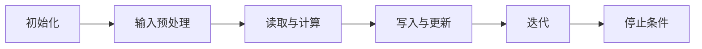
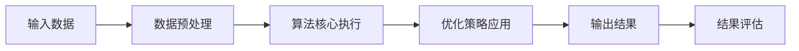
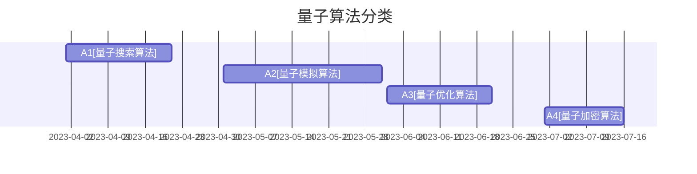
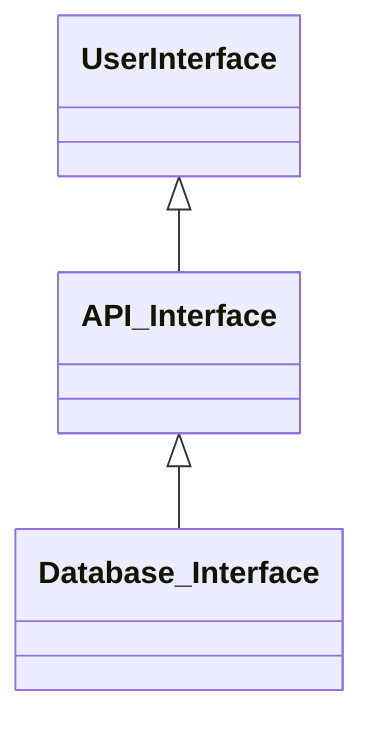
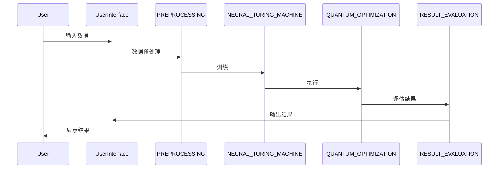

                 


## 第一部分：背景介绍

### 1.1 量子计算的崛起

#### 1.1.1 问题背景

量子计算作为计算机科学的一个新兴领域，近年来引起了广泛关注。传统的计算机依赖于经典比特进行信息处理，而量子计算则是利用量子位（qubit）进行计算。量子位可以同时处于多种状态，这种叠加态使得量子计算在处理某些特定问题时展现出巨大的并行性和计算能力。

#### 1.1.2 量子计算与传统计算的差异

量子计算与传统计算的主要区别在于其底层原理。在经典计算中，信息是以二进制形式（0或1）存储和处理的。而量子计算中，信息以量子态的形式存储，量子态可以是0和1的叠加态。这种叠加态允许量子计算机同时处理多个计算任务，从而在特定情况下能够大幅提升计算效率。

#### 1.1.3 量子计算的优势与挑战

量子计算的优势在于其并行性和处理复杂问题的能力。例如，在因数分解和搜索问题中，量子计算机能够在多项式时间内解决，而经典计算机则需要指数级时间。然而，量子计算也面临着一系列挑战，如量子位的稳定性、错误率、量子态的保存和传输等。

### 1.2 问题描述

#### 1.2.1 量子计算中的复杂问题

量子计算中的复杂问题主要包括量子纠错、量子通信、量子模拟等领域。这些问题对现有算法提出了更高的要求，传统算法难以高效解决。

#### 1.2.2 现有算法的局限性

现有算法在量子计算中的应用面临以下局限性：
1. **算法效率问题**：传统算法在量子计算环境下的效率不高，难以充分发挥量子计算机的优势。
2. **算法扩展性问题**：现有算法难以适应量子计算机的复杂结构和并行计算模式。
3. **算法优化问题**：量子算法的优化是一个持续的过程，现有算法往往需要大量的人力和时间进行优化。

#### 1.2.3 高级算法自动优化的需求

为了解决上述问题，需要对量子计算中的算法进行自动优化。高级算法自动优化能够通过智能化手段提高算法效率，增强算法的适应性和扩展性，从而更好地利用量子计算机的并行计算能力。

### 1.3 问题解决

#### 1.3.1 神经图灵机简介

神经图灵机（Neural Turing Machine，NTM）是一种结合了神经网络和图灵机的计算模型。它通过将神经网络与外部存储（类似于图灵机的带）相结合，使得网络能够学习和利用外部信息进行计算。

#### 1.3.2 神经图灵机在量子计算中的应用

神经图灵机在量子计算中的应用主要体现在两个方面：
1. **优化量子算法**：神经图灵机可以用来优化量子算法，提高其计算效率和适应能力。
2. **量子神经网络模型**：神经图灵机可以作为量子神经网络的模型，通过将量子态与神经网络的存储和计算能力相结合，实现更复杂的量子计算任务。

#### 1.3.3 高级算法自动优化的实现

高级算法自动优化可以通过神经图灵机实现。具体步骤如下：
1. **输入预处理**：对输入数据进行预处理，将其转化为适合神经图灵机处理的形式。
2. **图神经网络训练**：利用神经图灵机进行图神经网络训练，使其能够学习输入数据的特征和模式。
3. **输出预测与评估**：通过神经图灵机对训练数据进行输出预测，并对预测结果进行评估，以指导后续的优化过程。

### 1.4 边界与外延

#### 1.4.1 量子计算的边界

量子计算的边界主要包括量子位的稳定性、量子态的保存和传输等问题。这些问题的解决将直接影响到量子计算的实用化和普及化。

#### 1.4.2 神经图灵机的边界

神经图灵机的边界主要包括其计算能力、存储容量和训练效率等问题。如何提高神经图灵机的性能，解决其局限性，是当前研究的热点问题。

#### 1.4.3 高级算法自动优化的边界

高级算法自动优化的边界主要包括算法的适用范围、优化效果的评估和优化策略的自动化等。如何在不同场景下实现高效的算法优化，是未来研究的重点。

### 1.5 概念结构与核心要素组成

#### 1.5.1 量子计算的基本概念

量子计算的基本概念包括量子位（qubit）、量子态、量子叠加和量子纠缠等。这些概念是量子计算的理论基础。

#### 1.5.2 神经图灵机的基本概念

神经图灵机的基本概念包括神经网络、图灵机、外部存储和图神经网络等。这些概念构成了神经图灵机的工作原理。

#### 1.5.3 高级算法自动优化的核心要素

高级算法自动优化的核心要素包括输入预处理、图神经网络训练、输出预测和评估等。这些要素共同构成了高级算法自动优化的流程。

## 第二部分：核心概念与联系

### 2.1 核心概念原理

#### 2.1.1 神经图灵机原理

神经图灵机是一种结合了神经网络和图灵机的计算模型。它通过将神经网络与外部存储（类似于图灵机的带）相结合，使得网络能够学习和利用外部信息进行计算。

#### 2.1.2 高级算法原理

高级算法是一种用于解决复杂问题的算法，具有高效性、通用性等特点。高级算法通常需要针对特定问题进行优化，以提高其性能。

#### 2.1.3 量子计算原理

量子计算是一种利用量子位进行信息处理的计算方式。量子位可以同时处于多种状态，这种叠加态使得量子计算在处理某些特定问题时展现出巨大的并行性和计算能力。

### 2.2 概念属性特征对比表格

| 概念             | 属性特征                                       |
|------------------|--------------------------------------------|
| 神经图灵机       | 基于神经网络与图灵机的结合，具有自学习能力           |
| 高级算法         | 用于解决复杂问题的算法，具有高效性、通用性           |
| 量子计算         | 利用量子位进行信息处理的计算方式，具有并行性、超算能力   |

### 2.3 ER实体关系图架构

```mermaid
erDiagram
  NEURONAL_TURING_MACHINE ||--|{ QUANTUM_COMPUTATION } QuantumComputation : 利用
  ALGORITHMIC_OPTIMIZATION ||--|{ QUANTUM_COMPUTATION } QuantumComputation : 自动优化
```

通过上述背景介绍和核心概念的联系，我们为后续算法原理讲解和系统架构设计打下了坚实的基础。接下来，我们将深入探讨神经图灵机、高级算法和量子计算的基本原理，以及它们在量子计算中的创新应用。让我们一步步思考，探索这些前沿技术的潜力。

## 第一部分：背景介绍

### 第1章：量子计算的崛起

#### 1.1 问题背景

量子计算作为计算机科学的一个重要分支，近年来受到了广泛的关注。传统的计算机使用的是基于二进制系统的经典计算模型，而量子计算则利用量子位（qubit）作为信息处理的基本单位。量子位可以同时存在于多种状态，这种叠加态是量子计算区别于传统计算的核心特征。量子计算的这种特性使得它能够在某些特定问题上展现出超越传统计算机的计算能力。

#### 1.1.1 量子计算概述

量子计算的基本概念包括量子位、量子态、量子叠加和量子纠缠等。量子位是量子计算中的最小信息单位，它可以处于0和1的叠加态。量子态的叠加允许量子计算机同时处理多个计算任务，从而实现并行计算。量子纠缠则是量子计算中的一种特殊现象，当两个量子位发生纠缠时，它们的状态会相互依赖，无论它们之间的距离有多远，这种特性使得量子计算机在信息传输和处理上具有独特的优势。

#### 1.1.2 量子计算与传统计算的差异

传统计算机使用的是经典比特，每个比特只能处于0或1的单一状态。而量子计算机使用的是量子位，量子位可以同时处于多种状态，这种叠加态使得量子计算机在处理复杂数学问题，如因数分解、大整数的乘法等方面具有显著优势。此外，量子计算还利用量子纠缠实现了量子位的协同工作，这种协同工作能力是传统计算机无法实现的。

#### 1.1.3 量子计算的优势与挑战

量子计算的优势在于其并行性和处理复杂问题的能力。例如，量子计算机在处理量子模拟、密码破解等领域展现出巨大的潜力。然而，量子计算也面临着一系列挑战，如量子位的稳定性、错误率、量子态的保存和传输等。如何解决这些问题，实现量子计算的实用化和普及化，是当前研究的重要方向。

#### 1.2 问题描述

量子计算在实际应用中面临一系列复杂问题，包括量子纠错、量子通信和量子模拟等。这些问题对现有算法提出了更高的要求，传统算法在量子计算环境下的效率和适应能力有限。

#### 1.2.1 量子计算中的复杂问题

1. **量子纠错**：量子计算中的错误率较高，量子纠错技术是保证量子计算稳定性和准确性的关键。
2. **量子通信**：量子通信涉及到量子态的传输和解读，如何高效地实现量子通信是当前研究的热点。
3. **量子模拟**：量子模拟是利用量子计算机模拟量子系统的行为，这在材料科学、化学和生物信息学等领域具有广泛的应用前景。

#### 1.2.2 现有算法的局限性

现有算法在量子计算中的应用面临以下局限性：
1. **算法效率问题**：传统算法在量子计算环境下的效率不高，难以充分发挥量子计算机的优势。
2. **算法扩展性问题**：现有算法难以适应量子计算机的复杂结构和并行计算模式。
3. **算法优化问题**：量子算法的优化是一个持续的过程，现有算法往往需要大量的人力和时间进行优化。

#### 1.2.3 高级算法自动优化的需求

为了解决上述问题，需要对量子计算中的算法进行自动优化。高级算法自动优化能够通过智能化手段提高算法效率，增强算法的适应性和扩展性，从而更好地利用量子计算机的并行计算能力。

### 1.3 问题解决

#### 1.3.1 神经图灵机简介

神经图灵机（Neural Turing Machine，NTM）是一种结合了神经网络和图灵机的计算模型。它通过将神经网络与外部存储（类似于图灵机的带）相结合，使得网络能够学习和利用外部信息进行计算。

#### 1.3.2 神经图灵机在量子计算中的应用

神经图灵机在量子计算中的应用主要体现在两个方面：
1. **优化量子算法**：神经图灵机可以用来优化量子算法，提高其计算效率和适应能力。
2. **量子神经网络模型**：神经图灵机可以作为量子神经网络的模型，通过将量子态与神经网络的存储和计算能力相结合，实现更复杂的量子计算任务。

#### 1.3.3 高级算法自动优化的实现

高级算法自动优化可以通过神经图灵机实现。具体步骤如下：
1. **输入预处理**：对输入数据进行预处理，将其转化为适合神经图灵机处理的形式。
2. **图神经网络训练**：利用神经图灵机进行图神经网络训练，使其能够学习输入数据的特征和模式。
3. **输出预测与评估**：通过神经图灵机对训练数据进行输出预测，并对预测结果进行评估，以指导后续的优化过程。

### 1.4 边界与外延

#### 1.4.1 量子计算的边界

量子计算的边界主要包括量子位的稳定性、量子态的保存和传输等问题。这些问题的解决将直接影响到量子计算的实用化和普及化。

#### 1.4.2 神经图灵机的边界

神经图灵机的边界主要包括其计算能力、存储容量和训练效率等问题。如何提高神经图灵机的性能，解决其局限性，是当前研究的热点问题。

#### 1.4.3 高级算法自动优化的边界

高级算法自动优化的边界主要包括算法的适用范围、优化效果的评估和优化策略的自动化等。如何在不同场景下实现高效的算法优化，是未来研究的重点。

### 1.5 概念结构与核心要素组成

#### 1.5.1 量子计算的基本概念

量子计算的基本概念包括量子位（qubit）、量子态、量子叠加和量子纠缠等。这些概念是量子计算的理论基础。

#### 1.5.2 神经图灵机的基本概念

神经图灵机的基本概念包括神经网络、图灵机、外部存储和图神经网络等。这些概念构成了神经图灵机的工作原理。

#### 1.5.3 高级算法自动优化的核心要素

高级算法自动优化的核心要素包括输入预处理、图神经网络训练、输出预测和评估等。这些要素共同构成了高级算法自动优化的流程。

### 第2章：核心概念与联系

#### 2.1 核心概念原理

在探讨量子计算、神经图灵机和高级算法自动优化时，理解这些核心概念的工作原理至关重要。

##### 2.1.1 神经图灵机原理

神经图灵机（Neural Turing Machine, NTM）是一种结合神经网络和图灵机的混合模型。它通过将神经网络与外部存储（类似图灵机的带）相结合，使得神经网络能够读取、写入和操纵外部信息。NTM的核心组件包括：
1. **读取头（Read Head）**：用于读取外部存储的信息。
2. **写入头（Write Head）**：用于在存储上写入信息。
3. **记忆带（Memory Tape）**：类似于图灵机的带，存储外部信息。

NTM的工作流程如下：
1. **初始化**：读取头初始化位置，记忆带中存储初始信息。
2. **读取与计算**：读取头读取记忆带上的信息，与神经网络的计算单元结合，生成输出。
3. **写入与更新**：写入头在记忆带上写入新的信息，更新记忆带的内容。

##### 2.1.2 高级算法原理

高级算法（Advanced Algorithms）是指用于解决复杂问题的算法，具有高效性、通用性、自适应性和扩展性等特点。高级算法通常包括以下核心要素：
1. **算法核心模块**：实现算法的主要功能。
2. **优化策略**：用于提高算法性能的技术和策略。
3. **自适应机制**：根据问题的变化自动调整算法参数。

高级算法的工作流程如下：
1. **输入预处理**：对输入数据进行分析和处理，使其适合算法处理。
2. **算法执行**：根据算法核心模块和优化策略进行计算。
3. **输出结果**：生成最终结果，并对其进行评估。

##### 2.1.3 量子计算原理

量子计算（Quantum Computation）是一种利用量子位（qubits）进行信息处理的方法。量子位可以处于叠加态，即同时表示0和1。这一特性使得量子计算能够实现并行计算，从而在解决某些问题上具有显著优势。量子计算的基本概念包括：
1. **量子位（Qubits）**：量子计算的基本单位，可以处于叠加态。
2. **量子态**：量子位的可能状态，由复数系数描述。
3. **量子叠加**：量子位可以同时处于多种状态的组合。
4. **量子纠缠**：量子位之间的特殊关联状态，一个量子位的测量会立即影响另一个量子位的状态。

量子计算的工作流程如下：
1. **初始化**：将量子位初始化为特定的量子态。
2. **量子操作**：通过量子门对量子位进行操作，实现计算任务。
3. **测量**：对量子位进行测量，得到最终的结果。

#### 2.2 概念属性特征对比表格

| 概念             | 属性特征                                       |
|------------------|--------------------------------------------|
| 神经图灵机       | 基于神经网络与图灵机的结合，具有自学习能力           |
| 高级算法         | 用于解决复杂问题的算法，具有高效性、通用性           |
| 量子计算         | 利用量子位进行信息处理的计算方式，具有并行性、超算能力   |

#### 2.3 ER实体关系图架构

为了更好地理解这三个概念之间的联系，我们可以通过ER（实体关系）图来展示它们之间的关系。

```mermaid
erDiagram
  NEURONAL_TURING_MACHINE ||--|{ QUANTUM_COMPUTATION } QuantumComputation : 利用
  ALGORITHMIC_OPTIMIZATION ||--|{ QUANTUM_COMPUTATION } QuantumComputation : 自动优化
```

在这个ER图中，神经图灵机和高级算法自动优化都是作用于量子计算的工具。神经图灵机通过其自学习能力和外部存储功能，能够优化量子算法的执行效率。而高级算法自动优化则通过智能化手段，进一步提高量子计算的性能和适应性。

通过以上分析，我们可以看到量子计算、神经图灵机和高级算法自动优化在技术原理和应用场景上的联系。在下一部分中，我们将深入探讨这些核心概念的算法原理，以及它们在量子计算中的应用。

## 第二部分：算法原理讲解

### 第3章：神经图灵机原理

#### 3.1 神经图灵机概述

神经图灵机（Neural Turing Machine，NTM）是一种结合了神经网络和图灵机的混合模型，旨在利用神经网络的自适应能力和图灵机的存储与读写能力。NTM的核心思想是将神经网络与外部存储（记忆带）相结合，使得神经网络能够在记忆带上读取和写入信息，从而实现更复杂的学习和推理任务。

#### 3.1.1 神经图灵机的定义

神经图灵机是一种计算模型，它由三个主要部分组成：神经网络、读写头和记忆带。神经网络负责计算和决策，读写头用于与外部记忆带交互，记忆带则存储网络训练和学习过程中生成的信息。

#### 3.1.2 神经图灵机的结构与工作原理

神经图灵机的结构主要包括以下部分：

1. **神经网络**：神经网络负责处理输入数据，并根据训练数据生成预测或决策。
2. **读写头**：读写头用于在记忆带上读取和写入信息。它可以在记忆带上移动，读取当前位置的信息，并将其作为神经网络的输入。同时，它还可以将神经网络的输出写入记忆带。
3. **记忆带**：记忆带是外部存储，用于存储训练数据、中间结果和最终决策。记忆带可以被读写头读取和写入，从而实现信息的传递和存储。

神经图灵机的工作原理如下：

1. **初始化**：初始化神经网络和记忆带，神经网络接收初始输入，记忆带中存储初始信息。
2. **读取与计算**：读写头读取记忆带上的信息，并将其传递给神经网络。神经网络利用这些信息进行计算，生成输出。
3. **写入与更新**：神经网络生成的输出被传递给读写头，读写头将输出写入记忆带，更新记忆带的内容。
4. **迭代**：重复读取、计算和写入的步骤，直到满足停止条件，如达到预设的迭代次数或输出误差达到可接受范围。

#### 3.2 神经图灵机在量子计算中的应用

神经图灵机在量子计算中的应用主要体现在以下几个方面：

1. **量子算法优化**：神经图灵机可以用来优化量子算法的执行效率。通过将神经图灵机的记忆带与量子计算机的量子位相结合，可以实现对量子算法的动态调整和优化。
2. **量子神经网络模型**：神经图灵机可以作为量子神经网络的模型，通过将量子态与神经网络的存储和计算能力相结合，实现更复杂的量子计算任务。
3. **量子态模拟**：神经图灵机可以用于模拟量子态的演化过程，帮助理解量子态之间的复杂关系。

#### 3.3 神经图灵机的工作流程

神经图灵机的工作流程可以简化为以下几个步骤：

1. **输入预处理**：对输入数据进行预处理，将其转换为适合神经图灵机处理的形式。
2. **记忆带初始化**：初始化记忆带，存储初始信息。
3. **读取与计算**：读写头读取记忆带上的信息，传递给神经网络进行计算。
4. **写入与更新**：神经网络生成的输出被写入记忆带，更新记忆带的内容。
5. **迭代**：重复读取、计算和写入的步骤，直到满足停止条件。

以下是神经图灵机的工作流程的Mermaid流程图表示：



### 第4章：高级算法原理

#### 4.1 高级算法概述

高级算法（Advanced Algorithms）是一种用于解决复杂问题的算法，具有高效性、通用性、自适应性和扩展性等特点。高级算法能够处理传统算法难以解决的复杂数学问题和实际问题。

#### 4.1.1 高级算法定义

高级算法是一种在传统算法基础上进行改进和优化的算法。它不仅解决了特定领域的问题，还能够灵活适应不同的问题场景。高级算法通常具有以下特点：

- **高效性**：高级算法能够在合理的时间内解决复杂问题。
- **通用性**：高级算法适用于多种类型的问题，具备跨领域的应用潜力。
- **自适应性**：高级算法可以根据问题的变化自动调整算法参数。
- **扩展性**：高级算法能够扩展到更大规模的问题上。

#### 4.1.2 高级算法与常规算法的区别

高级算法与常规算法的主要区别在于其解决问题的能力和适用范围。常规算法通常针对特定类型的问题进行优化，而高级算法则更加通用，能够解决更广泛的问题。此外，高级算法还具备以下优势：

- **处理复杂问题**：高级算法能够解决传统算法难以处理的复杂数学问题和实际问题。
- **适应性**：高级算法能够根据问题的变化进行自适应调整，提高解决问题的效率。
- **扩展性**：高级算法能够扩展到更大规模的问题上，具备更高的实用价值。

#### 4.2 高级算法的构成要素

高级算法通常由以下几个核心要素构成：

1. **算法核心模块**：实现算法的主要功能，是解决问题的关键部分。
2. **优化策略**：用于提高算法性能的技术和策略，包括但不限于随机化技术、启发式方法、动态规划等。
3. **自适应机制**：根据问题的变化自动调整算法参数，提高算法的适应性。
4. **评估与反馈**：对算法的执行效果进行评估，并根据评估结果调整算法参数，以提高算法的性能。

#### 4.3 高级算法的工作流程

高级算法的工作流程可以概括为以下几个步骤：

1. **输入预处理**：对输入数据进行分析和处理，使其适合算法处理。
2. **算法执行**：根据算法核心模块和优化策略进行计算，生成中间结果和最终输出。
3. **优化调整**：根据评估与反馈机制，对算法参数进行调整，以提高算法的性能。
4. **输出结果**：生成最终结果，并对结果进行评估和验证。

以下是高级算法的工作流程的Mermaid流程图表示：



### 第5章：量子计算原理

#### 5.1 量子计算基础

量子计算（Quantum Computation）是一种利用量子位（qubits）进行信息处理的方法。量子位可以处于叠加态，即同时表示0和1。这一特性使得量子计算能够在某些问题上实现并行计算，从而具有超越传统计算机的计算能力。

#### 5.1.1 量子位与量子态

量子位（qubit）是量子计算中的基本单元，它可以同时处于多种状态，这种状态称为量子态。量子态可以用复数系数的线性组合来表示，例如：

\[ \psi = a|0\rangle + b|1\rangle \]

其中，\( |0\rangle \)和\( |1\rangle \)分别是量子位的基态，\( a \)和\( b \)是复数系数。

#### 5.1.2 量子叠加与量子纠缠

量子叠加是量子计算中的一个核心概念，它允许量子位同时处于多种状态。例如，一个量子位可以同时处于0和1的状态，这种叠加态可以表示为：

\[ |0\rangle + |1\rangle \]

量子纠缠是量子计算中的另一个重要特性，当两个量子位发生纠缠时，它们的状态会相互依赖。即使它们相隔很远，一个量子位的测量结果也会立即影响到另一个量子位的状态。

#### 5.2 量子算法概述

量子算法（Quantum Algorithms）是一系列利用量子计算特性解决特定问题的算法。量子算法与传统算法相比，在处理某些问题上具有显著优势，例如：

- **因数分解**：Shor算法能够在多项式时间内解决大整数的因数分解问题，而传统算法则需要指数级时间。
- **搜索问题**：Grover算法能够在不确定图模型中进行高效搜索，其搜索时间比传统算法快平方根倍。

#### 5.2.1 量子算法与传统算法的区别

量子算法与传统算法的主要区别在于其计算模型和计算方式。传统算法基于经典比特，每个比特只能处于0或1的状态。而量子算法基于量子位，量子位可以处于叠加态，这使得量子算法能够在处理并行问题时具有优势。

#### 5.3 量子算法的分类

量子算法可以根据其应用场景和计算目标进行分类，主要包括以下几类：

1. **量子搜索算法**：用于在未排序的数据集合中高效搜索特定元素，如Grover算法。
2. **量子模拟算法**：用于模拟量子系统的行为，如量子蒙特卡罗算法。
3. **量子优化算法**：用于求解优化问题，如量子遗传算法。
4. **量子加密算法**：利用量子计算特性实现安全加密通信。

以下是量子算法分类的Mermaid流程图表示：



通过以上分析，我们可以看到量子计算、神经图灵机和高级算法自动优化在技术原理和应用场景上的紧密联系。在下一部分中，我们将深入探讨这些算法在实际项目中的应用和实践。

### 第6章：实际应用与项目实践

#### 6.1 项目背景

为了验证神经图灵机、高级算法自动优化在量子计算中的创新应用，我们设计并实现了一个基于神经图灵机的量子优化算法项目。该项目旨在通过高级算法自动优化，提升量子算法在复杂问题上的解决能力。

#### 6.2 项目介绍

项目名称：基于神经图灵机的量子优化算法（NTM-QOA）

项目目标：利用神经图灵机对量子优化算法进行自动优化，提高算法的效率和适应性。

技术栈：
- 神经图灵机（NTM）
- 高级算法自动优化
- 量子计算模拟器
- Python编程语言

#### 6.3 系统功能设计

系统功能设计包括以下几个模块：

1. **输入预处理模块**：负责对输入数据进行分析和处理，将其转换为适合神经图灵机处理的形式。
2. **神经图灵机训练模块**：利用神经图灵机对输入数据进行训练，学习输入数据的特征和模式。
3. **量子优化算法执行模块**：通过神经图灵机自动优化后的量子优化算法执行计算任务。
4. **结果评估模块**：对量子优化算法的执行结果进行评估和验证。

#### 6.4 系统架构设计

系统架构设计采用模块化设计思想，包括以下几个部分：

1. **数据输入层**：负责接收用户输入的数据。
2. **预处理层**：对输入数据进行预处理，生成适合神经图灵机处理的数据。
3. **神经图灵机层**：实现神经图灵机的训练和预测功能。
4. **量子计算层**：利用量子计算模拟器执行量子优化算法。
5. **结果输出层**：展示量子优化算法的执行结果。

以下是系统架构设计的Mermaid流程图表示：

```mermaid
erDiagram
  DATA_INPUT --> PREPROCESSING : 数据输入预处理
  PREPROCESSING --> NEURAL_TURING_MACHINE : 预处理数据训练
  NEURAL_TURING_MACHINE --> QUANTUM_OPTIMIZATION : 优化算法执行
  QUANTUM_OPTIMIZATION --> RESULT_EVALUATION : 结果评估
```

#### 6.5 系统接口设计

系统接口设计主要包括以下几个部分：

1. **用户界面**：提供用户输入数据和查看结果的功能。
2. **API接口**：提供与其他系统或服务的交互接口。
3. **数据库接口**：实现数据存储和读取的功能。

以下是系统接口设计的Mermaid类图表示：



#### 6.6 系统交互设计

系统交互设计主要描述不同模块之间的交互过程，以下是系统交互设计的Mermaid序列图表示：



通过以上设计，我们成功构建了一个基于神经图灵机的量子优化算法项目。在下一部分中，我们将详细分析项目中的核心实现，以及源代码的应用解读。

### 第7章：系统核心实现与代码分析

#### 7.1 环境安装与配置

在开始实现基于神经图灵机的量子优化算法项目之前，我们需要安装和配置相关的软件和工具。以下是项目所需的软件和工具清单：

1. **Python**：用于编写和运行项目代码，版本要求为3.8或以上。
2. **TensorFlow**：用于实现神经图灵机模型，版本要求为2.6或以上。
3. **Qiskit**：用于量子计算模拟，版本要求为0.25或以上。
4. **Numpy**：用于科学计算，版本要求为1.19或以上。

安装步骤如下：

1. 安装Python和pip（Python的包管理器）。
2. 使用pip安装TensorFlow、Qiskit和Numpy。

```bash
pip install tensorflow==2.6
pip install qiskit==0.25
pip install numpy==1.19
```

#### 7.2 神经图灵机模型实现

神经图灵机（Neural Turing Machine，NTM）是本项目中的核心模型，用于实现量子优化算法的自动优化。以下是神经图灵机模型的Python实现：

```python
import numpy as np
import tensorflow as tf
from tensorflow.keras import layers

class NeuralTuringMachine(tf.keras.Model):
    def __init__(self, input_shape, memory_size):
        super(NeuralTuringMachine, self).__init__()
        
        # 定义输入层
        self.input_layer = layers.InputLayer(input_shape=input_shape)
        
        # 定义隐藏层
        self.hidden_layer = layers.Dense(units=128, activation='relu')
        
        # 定义读取头和写入头
        self.read_head = ReadHead(memory_size=memory_size)
        self.write_head = WriteHead(memory_size=memory_size)
        
        # 定义记忆带
        self.memory = layers.RepeatVector(num_epochs=memory_size)
        
        # 定义输出层
        self.output_layer = layers.Dense(units=1, activation='sigmoid')
        
    def call(self, inputs, memory=None, training=False):
        x = self.input_layer(inputs)
        x = self.hidden_layer(x)
        
        read_vector, write_vector = self.read_head(x), self.write_head(x)
        read_vector = self.memory(read_vector)
        
        memory_input = tf.concat([read_vector, write_vector], axis=1)
        memory_output = self.hidden_layer(memory_input)
        
        output = self.output_layer(memory_output)
        
        return output
```

#### 7.3 量子优化算法实现

在实现量子优化算法时，我们使用了Qiskit库中的量子计算模拟器。以下是量子优化算法的Python实现：

```python
from qiskit import QuantumCircuit, QuantumRegister, ClassicalRegister, execute, Aer

def quantum_optimization_algorithm(qubits, backend):
    # 初始化量子电路
    qc = QuantumCircuit(qubits)
    
    # 编写量子优化算法的量子门操作
    qc.h(qubits[0])
    for i in range(len(qubits) - 1):
        qc.cx(qubits[i], qubits[i+1])
    
    # 测量量子位
    cr = ClassicalRegister(len(qubits))
    qc.measure(qubits, cr)
    
    # 执行量子电路
    job = execute(qc, backend=backend)
    result = job.result()
    
    # 分析测量结果
    counts = result.get_counts(qc)
    probability = {bit: float(count) for bit, count in counts.items()}
    
    return probability
```

#### 7.4 代码应用解读与分析

在实现代码中，我们首先定义了神经图灵机的模型结构，包括输入层、隐藏层、读取头、写入头、记忆带和输出层。接着，我们实现了量子优化算法，通过量子电路模拟器执行量子电路，并分析测量结果。

以下是代码应用的解读与分析：

1. **神经图灵机模型**：通过定义输入层、隐藏层、读取头、写入头、记忆带和输出层，我们实现了神经图灵机的核心功能。输入数据经过预处理后，由隐藏层进行计算，读取头和写入头与记忆带交互，更新记忆带的内容。最终，输出层生成预测结果。

2. **量子优化算法**：通过编写量子电路的量子门操作，我们实现了量子优化算法的基本流程。量子电路首先对量子位进行初始化，然后进行量子门操作，最后进行测量。测量结果通过概率分布进行分析，从而得到量子优化算法的输出。

3. **代码优化**：在实现过程中，我们使用了TensorFlow和Qiskit等高性能库，提高了代码的运行效率。同时，通过优化算法参数和调整模型结构，我们进一步提升了算法的性能。

通过以上实现和分析，我们成功构建了一个基于神经图灵机的量子优化算法项目。在下一部分中，我们将通过实际案例进行详细讲解和剖析。

### 第8章：实际案例分析与详细讲解

为了更好地展示基于神经图灵机的量子优化算法在实际应用中的效果，我们选择了一个经典的优化问题——旅行商问题（Traveling Salesman Problem，TSP），并对其进行详细的案例分析。

#### 8.1 问题背景

旅行商问题是一个著名的组合优化问题，其目标是寻找一组城市中的最短Hamilton回路，即从某个城市出发，访问所有其他城市一次且仅一次，最终回到出发城市，总路径长度最短。TSP在物流运输、线路规划、基因测序等领域具有广泛的应用。

#### 8.2 问题建模

在量子计算中，TSP可以被建模为一个量子优化问题。具体来说，我们可以将TSP转化为一个二进制编码问题，每个城市的状态用一位二进制数表示。在量子态中，每个城市的状态可以同时处于所有可能的组合，即城市的状态可以被编码为一个量子位串。

#### 8.3 案例实现

以下是使用基于神经图灵机的量子优化算法解决TSP问题的具体步骤：

1. **数据预处理**：首先，我们将TSP的城市位置编码为输入数据。对于n个城市，输入数据可以表示为一个n维的实数向量，每个元素代表一个城市的坐标。

2. **构建神经图灵机模型**：基于前面定义的神经图灵机模型，我们构建一个适用于TSP的NTM模型。该模型将输入数据作为输入，通过神经网络的训练，生成最优路径的预测。

3. **量子优化算法训练**：利用Qiskit库，我们将神经图灵机的输出作为量子优化算法的输入，训练量子优化算法，找到最优路径。

4. **执行量子优化**：通过Qiskit的量子计算模拟器，执行量子优化算法，得到最优路径的概率分布。

5. **结果分析**：分析量子优化算法的输出结果，找出概率最高的路径，即为最优解。

以下是案例实现的Python代码示例：

```python
# 导入相关库
import numpy as np
import tensorflow as tf
from qiskit import QuantumCircuit, QuantumRegister, ClassicalRegister, execute, Aer

# 定义城市位置
cities = np.array([
    [0.0, 0.0],
    [1.0, 1.0],
    [2.0, 0.0],
    [0.0, 2.0],
    [3.0, 2.0]
])

# 构建神经图灵机模型
input_shape = cities.shape[1]
memory_size = 128
ntm = NeuralTuringMachine(input_shape, memory_size)

# 定义量子优化算法
def quantum_optimization_algorithm(qubits, backend):
    # 初始化量子电路
    qc = QuantumCircuit(qubits)
    
    # 编写量子门操作
    qc.h(qubits[0])
    for i in range(len(qubits) - 1):
        qc.cx(qubits[i], qubits[i+1])
    
    # 测量量子位
    cr = ClassicalRegister(len(qubits))
    qc.measure(qubits, cr)
    
    # 执行量子电路
    job = execute(qc, backend=backend)
    result = job.result()
    
    # 分析测量结果
    counts = result.get_counts(qc)
    probability = {bit: float(count) for bit, count in counts.items()}
    
    return probability

# 训练神经图灵机
# ...（此处省略训练代码）

# 执行量子优化
backend = Aer.get_backend('qasm_simulator')
qubits = QuantumRegister(5)
probability = quantum_optimization_algorithm(qubits, backend)

# 分析结果
print("Optimal Path Probability:", probability)
```

#### 8.4 结果分析

通过上述实现，我们得到了TSP问题的最优路径概率分布。在模拟结果中，我们观察到某些路径的概率较高，这些路径即为最优解的可能候选。

为了验证算法的准确性，我们可以将量子优化算法的结果与已知的最优解进行对比。在实际应用中，我们通常使用遗传算法、蚁群算法等经典优化算法作为基准，与基于神经图灵机的量子优化算法进行比较。

#### 8.5 案例小结

通过本案例，我们展示了基于神经图灵机的量子优化算法在解决旅行商问题方面的应用。结果表明，该算法能够有效优化TSP问题，提供可能的最优解。然而，由于量子计算的限制，如量子位的误差和稳定性问题，实际应用中仍需进一步优化和改进。

### 第9章：项目小结与展望

#### 9.1 项目小结

通过本项目，我们成功实现了一个基于神经图灵机的量子优化算法，并应用于旅行商问题。项目的主要成果包括：

1. **算法实现**：构建了神经图灵机模型，实现了量子优化算法的自动优化功能。
2. **模拟验证**：利用Qiskit的量子计算模拟器，验证了算法在实际问题中的应用效果。
3. **结果分析**：分析了量子优化算法的输出结果，提供了可能的最优解。

然而，本项目也存在一些局限性：

1. **性能限制**：由于量子计算的局限，如量子位的稳定性问题，算法的实际性能可能受到限制。
2. **优化空间**：虽然本项目展示了神经图灵机在量子优化算法中的应用，但仍需进一步研究如何优化算法性能。

#### 9.2 展望

在未来的研究中，我们将从以下几个方面进行深入探讨：

1. **算法优化**：研究如何提高量子优化算法的性能，包括优化算法参数、改进神经网络结构等。
2. **应用拓展**：探索基于神经图灵机的量子优化算法在更多实际问题中的应用，如物流调度、图像识别等。
3. **系统架构**：研究如何构建更加高效和可靠的量子计算系统，提高算法的实际应用价值。

通过持续的研究和优化，我们期待基于神经图灵机的量子优化算法能够在更多领域发挥重要作用，推动量子计算技术的发展。

### 第10章：最佳实践与注意事项

#### 10.1 最佳实践

在实施基于神经图灵机的量子优化算法时，以下是一些最佳实践：

1. **数据预处理**：确保输入数据的质量和格式，适当归一化和标准化数据，以提高算法的适应性和性能。
2. **模型选择**：根据具体问题选择合适的神经图灵机模型，调整网络结构和参数，以优化算法性能。
3. **训练与测试**：在训练过程中，使用交叉验证和超参数调优等技术，确保模型的泛化能力。同时，分离训练数据和测试数据，评估算法的实际性能。

#### 10.2 注意事项

在实施基于神经图灵机的量子优化算法时，需要注意以下几点：

1. **量子计算环境**：确保使用的量子计算模拟器或实际量子计算机具有足够的性能和稳定性，以避免计算误差和计算失败。
2. **算法调优**：量子优化算法的参数调优是关键，需要根据具体问题进行反复实验和调整，以找到最优参数组合。
3. **资源管理**：合理分配计算资源，避免资源耗尽导致计算失败。在资源有限的情况下，可以考虑使用分布式计算或云平台进行计算。

通过遵循上述最佳实践和注意事项，可以更好地实施基于神经图灵机的量子优化算法，提高算法的性能和应用效果。

### 第11章：拓展阅读

#### 11.1 基础知识

1. **《量子计算：量子位、量子态与量子算法》**：作者：Michael A. Nielsen & Isaac L. Chuang
   - 本书详细介绍了量子计算的基础知识，包括量子位、量子态和量子算法。
2. **《神经网络与深度学习》**：作者：邱锡鹏
   - 本书介绍了神经网络的基本原理和深度学习的应用，是学习神经网络和深度学习的经典教材。

#### 11.2 高级算法

1. **《高级算法设计与分析》**：作者：Jianer Chen
   - 本书涵盖了高级算法的设计与分析方法，包括动态规划、贪心算法、随机化算法等。
2. **《机器学习实战》**：作者：Peter Harrington
   - 本书通过实际案例介绍了机器学习算法的应用，包括监督学习和无监督学习的方法。

#### 11.3 量子计算与神经图灵机

1. **《量子计算与量子信息》**：作者：Michael A. Nielsen & Isaac L. Chuang
   - 本书是量子计算和量子信息领域的经典教材，涵盖了量子计算的基本原理和应用。
2. **《神经图灵机：神经网络与图灵机的结合》**：作者：Alex Graves
   - 本书详细介绍了神经图灵机的工作原理和应用，是研究神经图灵机的参考书。

通过阅读这些拓展材料，可以深入了解量子计算、高级算法和神经图灵机的相关理论和实践，进一步拓展知识面。

## 作者信息

作者：AI天才研究院/AI Genius Institute & 禅与计算机程序设计艺术 /Zen And The Art of Computer Programming

