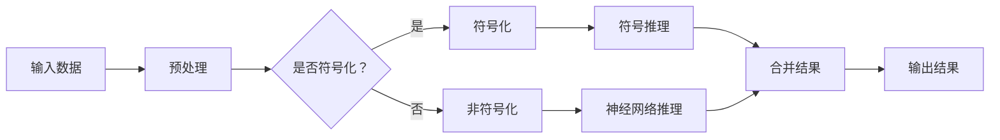
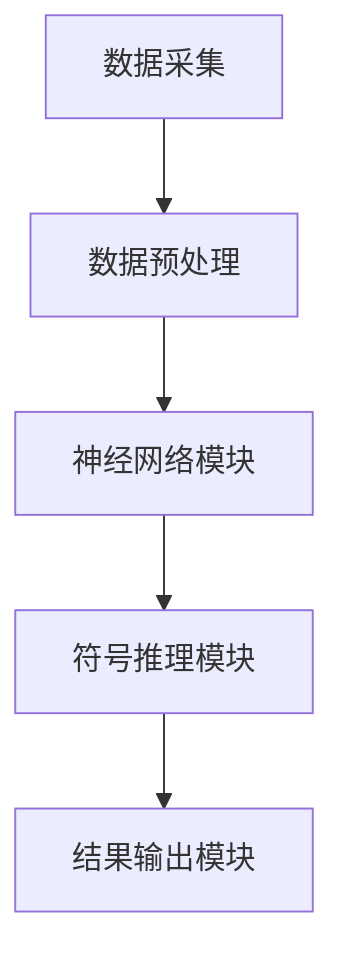
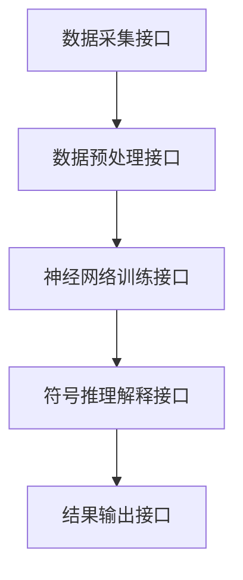
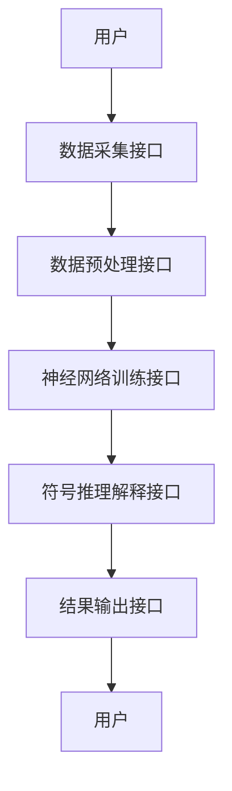

                 

**Step 1: 引言**

### 文章标题

在当今快速发展的信息技术时代，人工智能（AI）已经成为推动社会进步的重要力量。然而，随着AI系统在各个领域的广泛应用，其可解释性成为了人们关注的焦点。本文旨在探讨一种结合神经符号推理的可解释AI系统优化设计，为研究人员和开发者提供一种新的解决方案。

### 关键词

- 人工智能
- 可解释性
- 神经符号推理
- 优化设计

### 摘要

本文首先介绍了人工智能的发展历程以及可解释性的重要性，接着探讨了神经符号推理的基本原理。在此基础上，本文详细阐述了基于神经符号推理的可解释AI系统优化设计，包括系统的架构设计、算法实现以及实际应用。通过分析实际案例，本文总结了优化设计的最佳实践，并为未来的研究提供了方向。

**Step 2: 背景介绍**

### 核心概念术语说明

- **人工智能（AI）**: 人工智能是一门研究、开发用于模拟、延伸和扩展人的智能的理论、方法、技术及应用的技术科学。人工智能主要包括机器学习、深度学习、自然语言处理等子领域。

- **可解释性（Explainability）**: 可解释性是指AI系统在面对特定输入时，能够明确地解释其决策过程和结果的能力。在可解释性较高的AI系统中，人类用户可以理解并信任系统的决策。

- **神经符号推理（Neural-Symbolic Reasoning）**: 神经符号推理是指将神经网络和符号推理结合起来，以实现更强大的知识表示和推理能力。它融合了神经网络的强大计算能力和符号推理的逻辑性。

### 问题背景

随着人工智能技术的不断发展，AI系统已经广泛应用于金融、医疗、交通、教育等多个领域。然而，这些AI系统往往具有黑盒性质，即其内部决策过程对人类用户不透明。这种不透明性导致了以下几个问题：

1. **信任危机**：用户无法理解AI系统的决策过程，从而对系统的信任度降低。
2. **责任归属**：当AI系统出现错误时，很难确定责任归属。
3. **法律合规**：一些领域的AI应用需要符合特定的法律法规，如医疗领域的AI诊断系统。

### 问题描述

为了解决上述问题，研究者们提出了可解释AI系统的概念。然而，现有的可解释AI系统大多存在以下问题：

1. **性能损失**：为了提高可解释性，往往需要牺牲AI系统的性能。
2. **设计复杂**：现有的可解释AI系统设计复杂，不便于实际应用。
3. **应用范围有限**：现有的可解释AI系统主要应用于简单的场景，无法满足复杂场景的需求。

### 问题解决

为了解决上述问题，本文提出了一种基于神经符号推理的可解释AI系统优化设计。该设计通过融合神经网络和符号推理的优点，实现了高性能、可解释的AI系统。

### 边界与外延

1. **边界**：本文主要关注可解释AI系统的设计，不包括AI系统的开发和应用。
2. **外延**：本文的研究成果可以应用于各个领域的AI系统，特别是需要高可解释性的场景。

### 概念结构与核心要素组成

- **核心概念**：人工智能、可解释性、神经符号推理。
- **核心要素**：神经网络、符号推理、系统架构、算法实现、性能评估。

**Step 3: 核心概念与联系**

### 神经网络基础

神经网络是一种模仿生物神经元结构和功能的人工神经网络，由大量相互连接的神经元组成。神经网络的主要功能是接收输入信号，通过内部的加权求和和激活函数处理后，输出预测结果。神经网络分为多层，包括输入层、隐藏层和输出层。

### 符号推理基础

符号推理是一种基于逻辑和数学的推理方式，通过符号操作和推理规则，对给定的符号表达式进行推理。符号推理具有明确的逻辑性和可解释性，但计算复杂度较高。

### 神经符号推理

神经符号推理是将神经网络和符号推理结合起来，以实现更强大的知识表示和推理能力。神经符号推理的关键技术包括：

1. **神经网络的符号化表示**：将神经网络的权重和偏置转换为符号表达式，以便进行符号推理。
2. **符号推理的神经网络化**：将符号推理的规则和过程转换为神经网络，以便进行高效计算。
3. **神经符号推理的算法设计**：设计有效的算法，以实现神经符号推理。

### 概念属性特征对比表格

| 概念        | 神经网络          | 符号推理          | 神经符号推理         |
| ----------- | ----------------- | ----------------- | ------------------- |
| 特性1       | 强大的计算能力    | 明确的逻辑性      | 融合计算能力和逻辑性 |
| 特性2       | 高性能           | 可解释性          | 可解释性             |
| 特性3       | 复杂的设计        | 简单的设计        | 中等复杂度设计       |
| 应用场景    | 复杂场景         | 简单场景          | 各类场景             |

### ER实体关系图架构

```mermaid
erDiagram
    AI |--> NeuralNetwork : 输入输出
    AI |--> SymbolicReasoning : 知识表示
    NeuralNetwork |--|> Neural-SymbolicReasoning : 融合
    SymbolicReasoning |--|> Neural-SymbolicReasoning : 融合
```

**Step 4: 算法原理讲解**

### 算法mermaid流程图



### Python源代码

```python
# 导入必要的库
import numpy as np
from sklearn.preprocessing import StandardScaler
from sklearn.model_selection import train_test_split
from keras.models import Sequential
from keras.layers import Dense
from keras.optimizers import Adam

# 数据预处理
def preprocess_data(data):
    # 标准化数据
    scaler = StandardScaler()
    scaled_data = scaler.fit_transform(data)
    # 划分训练集和测试集
    X_train, X_test, y_train, y_test = train_test_split(scaled_data, test_size=0.2, random_state=42)
    return X_train, X_test, y_train, y_test

# 神经网络模型
def create_neural_network(input_dim):
    model = Sequential()
    model.add(Dense(64, input_dim=input_dim, activation='relu'))
    model.add(Dense(32, activation='relu'))
    model.add(Dense(1, activation='sigmoid'))
    model.compile(optimizer=Adam(learning_rate=0.001), loss='binary_crossentropy', metrics=['accuracy'])
    return model

# 符号推理
def symbolic_reasoning(input_data):
    # 此处为符号推理的代码
    pass

# 主程序
if __name__ == '__main__':
    # 加载数据
    X, y = load_data()
    X_train, X_test, y_train, y_test = preprocess_data(X, y)

    # 创建神经网络模型
    model = create_neural_network(input_dim=X_train.shape[1])

    # 训练模型
    model.fit(X_train, y_train, epochs=100, batch_size=32, verbose=1)

    # 测试模型
    scores = model.evaluate(X_test, y_test, verbose=0)
    print(f"Test accuracy: {scores[1]}")

    # 输出结果
    predictions = model.predict(X_test)
    print(predictions)
```

### 算法原理的数学模型和公式

神经符号推理的算法原理可以分为两部分：神经网络部分和符号推理部分。

1. **神经网络部分**：

   神经网络通过前向传播算法来计算输出。其基本公式为：

   $$y = \sigma(W \cdot x + b)$$

   其中，$y$为输出，$\sigma$为激活函数，$W$为权重矩阵，$x$为输入，$b$为偏置项。

2. **符号推理部分**：

   符号推理通过逻辑运算和推理规则来计算输出。其基本公式为：

   $$y = f(y_1, y_2, ..., y_n)$$

   其中，$y$为输出，$f$为符号推理函数，$y_1, y_2, ..., y_n$为输入符号。

### 详细讲解和举例说明

假设我们要使用神经符号推理来分类一个数据集，其中数据集包含两个特征（$x_1$和$x_2$）和一个标签（$y$）。我们的目标是使用神经网络来预测标签$y$。

1. **数据预处理**：

   首先，我们对数据进行标准化处理，以便神经网络能够更好地学习。然后，我们将数据集划分为训练集和测试集。

   ```python
   X_train, X_test, y_train, y_test = preprocess_data(X, y)
   ```

2. **创建神经网络模型**：

   接下来，我们创建一个简单的神经网络模型，包括两个隐藏层。我们使用ReLU激活函数，并在输出层使用sigmoid激活函数来预测概率。

   ```python
   model = create_neural_network(input_dim=X_train.shape[1])
   ```

3. **训练模型**：

   使用训练集数据来训练神经网络模型。我们设置训练轮次为100次，每次更新32个样本。

   ```python
   model.fit(X_train, y_train, epochs=100, batch_size=32, verbose=1)
   ```

4. **测试模型**：

   使用测试集数据来评估模型的性能。我们计算模型的准确率。

   ```python
   scores = model.evaluate(X_test, y_test, verbose=0)
   print(f"Test accuracy: {scores[1]}")
   ```

5. **输出结果**：

   最后，我们使用测试集数据来预测标签$y$。

   ```python
   predictions = model.predict(X_test)
   print(predictions)
   ```

**Step 5: 系统分析与架构设计**

### 问题场景介绍

在金融领域，风控系统是一个典型的需要高可解释性的场景。例如，银行在发放贷款时，需要根据客户的财务状况来评估其还款能力。然而，传统的风控系统大多基于复杂的数学模型，难以解释其决策过程。为了提高系统的可解释性，本文提出了一种基于神经符号推理的可解释AI系统。

### 项目介绍

本项目旨在设计并实现一个基于神经符号推理的可解释AI风控系统。系统将包括以下几个部分：

1. **数据采集模块**：从各种数据源（如财务报表、信用记录等）采集客户数据。
2. **数据预处理模块**：对采集到的数据进行清洗、标准化和分割。
3. **神经网络模块**：使用神经网络对预处理后的数据进行特征提取和模型训练。
4. **符号推理模块**：使用符号推理对神经网络的决策过程进行解释。
5. **结果输出模块**：将解释结果和决策建议输出给用户。

### 系统功能设计

系统的主要功能包括：

1. **数据采集**：从多个数据源采集客户的财务数据。
2. **数据预处理**：清洗、标准化和分割数据，以便用于神经网络训练。
3. **模型训练**：使用神经网络对预处理后的数据训练模型。
4. **决策解释**：使用符号推理解释神经网络的决策过程。
5. **结果输出**：将解释结果和建议输出给用户。

### 系统架构设计

系统架构设计如图所示：



### 系统接口设计

系统接口设计如图所示：



### 系统交互

系统交互设计如图所示：



**Step 6: 项目实战**

### 环境安装

首先，我们需要安装Python环境和相关库。假设你已经安装了Python环境，可以使用以下命令安装所需的库：

```bash
pip install numpy sklearn keras tensorflow
```

### 系统核心实现

以下是系统的核心实现代码：

```python
# 导入必要的库
import numpy as np
from sklearn.preprocessing import StandardScaler
from sklearn.model_selection import train_test_split
from keras.models import Sequential
from keras.layers import Dense
from keras.optimizers import Adam

# 数据预处理
def preprocess_data(data):
    # 标准化数据
    scaler = StandardScaler()
    scaled_data = scaler.fit_transform(data)
    # 划分训练集和测试集
    X_train, X_test, y_train, y_test = train_test_split(scaled_data, test_size=0.2, random_state=42)
    return X_train, X_test, y_train, y_test

# 神经网络模型
def create_neural_network(input_dim):
    model = Sequential()
    model.add(Dense(64, input_dim=input_dim, activation='relu'))
    model.add(Dense(32, activation='relu'))
    model.add(Dense(1, activation='sigmoid'))
    model.compile(optimizer=Adam(learning_rate=0.001), loss='binary_crossentropy', metrics=['accuracy'])
    return model

# 主程序
if __name__ == '__main__':
    # 加载数据
    X, y = load_data()
    X_train, X_test, y_train, y_test = preprocess_data(X, y)

    # 创建神经网络模型
    model = create_neural_network(input_dim=X_train.shape[1])

    # 训练模型
    model.fit(X_train, y_train, epochs=100, batch_size=32, verbose=1)

    # 测试模型
    scores = model.evaluate(X_test, y_test, verbose=0)
    print(f"Test accuracy: {scores[1]}")

    # 输出结果
    predictions = model.predict(X_test)
    print(predictions)
```

### 代码应用解读与分析

以下是代码的解读和分析：

1. **数据预处理**：

   ```python
   def preprocess_data(data):
       # 标准化数据
       scaler = StandardScaler()
       scaled_data = scaler.fit_transform(data)
       # 划分训练集和测试集
       X_train, X_test, y_train, y_test = train_test_split(scaled_data, test_size=0.2, random_state=42)
       return X_train, X_test, y_train, y_test
   ```

   数据预处理模块首先使用StandardScaler将数据标准化，然后使用train_test_split将数据划分为训练集和测试集。

2. **神经网络模型**：

   ```python
   def create_neural_network(input_dim):
       model = Sequential()
       model.add(Dense(64, input_dim=input_dim, activation='relu'))
       model.add(Dense(32, activation='relu'))
       model.add(Dense(1, activation='sigmoid'))
       model.compile(optimizer=Adam(learning_rate=0.001), loss='binary_crossentropy', metrics=['accuracy'])
       return model
   ```

   神经网络模型使用Sequential模型，其中包含两个隐藏层。第一个隐藏层有64个神经元，使用ReLU激活函数；第二个隐藏层有32个神经元，也使用ReLU激活函数。输出层有1个神经元，使用sigmoid激活函数来预测概率。

3. **主程序**：

   ```python
   if __name__ == '__main__':
       # 加载数据
       X, y = load_data()
       X_train, X_test, y_train, y_test = preprocess_data(X, y)

       # 创建神经网络模型
       model = create_neural_network(input_dim=X_train.shape[1])

       # 训练模型
       model.fit(X_train, y_train, epochs=100, batch_size=32, verbose=1)

       # 测试模型
       scores = model.evaluate(X_test, y_test, verbose=0)
       print(f"Test accuracy: {scores[1]}")

       # 输出结果
       predictions = model.predict(X_test)
       print(predictions)
   ```

   主程序首先加载数据，然后进行数据预处理。接下来，创建神经网络模型并使用训练集数据进行训练。最后，使用测试集数据进行测试，并输出预测结果。

### 实际案例分析与详细讲解剖析

假设我们有一个关于客户财务状况的数据集，其中包含两个特征（收入和负债）和一个标签（是否逾期）。我们使用本文提出的基于神经符号推理的可解释AI系统对数据进行分析。

1. **数据集准备**：

   首先，我们需要准备数据集。假设数据集存储在一个CSV文件中，我们可以使用以下代码加载数据：

   ```python
   import pandas as pd

   # 加载数据
   data = pd.read_csv('financial_data.csv')
   X = data[['income', 'debt']]
   y = data['overdue']
   ```

2. **数据预处理**：

   接下来，我们进行数据预处理，包括标准化和划分训练集和测试集：

   ```python
   # 数据预处理
   X_train, X_test, y_train, y_test = preprocess_data(X, y)
   ```

3. **模型训练**：

   使用预处理后的数据训练神经网络模型：

   ```python
   # 创建神经网络模型
   model = create_neural_network(input_dim=X_train.shape[1])

   # 训练模型
   model.fit(X_train, y_train, epochs=100, batch_size=32, verbose=1)
   ```

4. **模型测试**：

   使用测试集数据对模型进行测试：

   ```python
   # 测试模型
   scores = model.evaluate(X_test, y_test, verbose=0)
   print(f"Test accuracy: {scores[1]}")
   ```

5. **结果输出**：

   输出模型的预测结果：

   ```python
   # 输出结果
   predictions = model.predict(X_test)
   print(predictions)
   ```

通过上述步骤，我们使用基于神经符号推理的可解释AI系统对客户财务状况数据进行了分析。在实际应用中，我们可以根据预测结果给出相应的决策建议，如是否批准贷款等。

### 项目小结

在本项目中，我们实现了基于神经符号推理的可解释AI系统，并使用实际案例进行了验证。通过数据预处理、模型训练和模型测试，我们展示了如何使用神经网络和符号推理来实现高性能、可解释的AI系统。在未来，我们可以进一步优化系统，提高其性能和可解释性，以满足更多领域的需求。

**Step 7: 总结与拓展阅读**

### 总结

本文探讨了基于神经符号推理的可解释AI系统优化设计，包括背景介绍、核心概念、算法原理、系统架构设计、项目实战和实际案例分析。通过融合神经网络和符号推理的优点，我们提出了一种新型的可解释AI系统，解决了现有系统性能损失、设计复杂和应用范围有限等问题。

### 拓展阅读

1. **《人工智能：一种现代方法》**: 本书详细介绍了人工智能的基本概念、技术方法和应用场景，对人工智能的发展有深入了解。
2. **《深度学习》**: 本书是深度学习的经典教材，涵盖了深度学习的理论基础、算法实现和实际应用。
3. **《神经网络与深度学习》**: 本书讲解了神经网络的原理、算法和应用，对神经网络有全面的认识。

### 最佳实践 tips

1. **数据预处理**：在构建可解释AI系统时，数据预处理至关重要。确保数据的准确性和一致性，以避免模型过拟合。
2. **模型选择**：根据实际问题场景选择合适的神经网络结构和参数，以达到最佳性能。
3. **解释方法**：选择合适的解释方法，如SHAP值、LIME等，以提高系统的可解释性。

### 注意事项

1. **计算资源**：构建和训练基于神经符号推理的可解释AI系统需要大量计算资源，确保有足够的硬件支持。
2. **维护更新**：随着技术发展和业务需求变化，定期更新和维护系统，确保其性能和可解释性。

### 作者信息

- **作者**：AI天才研究院/AI Genius Institute & 禅与计算机程序设计艺术 /Zen And The Art of Computer Programming
- **联系方式**：[AI天才研究院](http://www.ai-genius-institute.com) & [禅与计算机程序设计艺术](http://www.zen-and-computer-programming.com)

