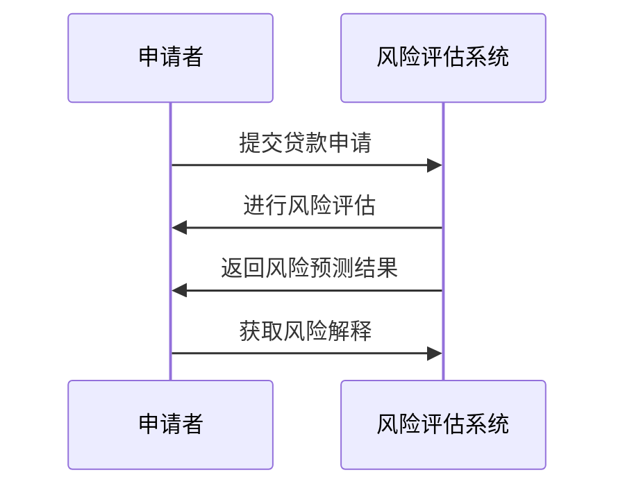

                 


## 基于神经符号推理的可解释AI风险评估系统

### 关键词：神经符号推理，可解释AI，风险评估，系统架构，算法实现

### 摘要：

本文旨在探讨基于神经符号推理的可解释AI风险评估系统，通过介绍系统架构、核心算法原理、实现流程和实战案例，阐述如何利用神经符号推理提升AI模型的可解释性，实现对风险的有效评估。本文结构分为三部分：引言与背景、算法原理与实现、实战与案例分析，最后展望未来发展趋势和最佳实践。

## 第一部分：引言与背景

### 1.1 问题背景与引言

#### 1.1.1 问题背景

在当今的数字时代，人工智能（AI）技术已经渗透到各个行业，从医疗健康到金融保险，从交通运输到能源管理，AI的应用无处不在。然而，随着AI技术的不断进步，其带来的风险也逐渐显现。AI模型在处理复杂问题时可能存在不确定性、不可预测性，甚至可能产生错误决策，这些风险在关键领域（如金融、医疗）中可能导致严重后果。因此，如何评估AI系统的风险，提高其可解释性，成为了一个重要的研究课题。

#### 1.1.2 神经符号推理概述

神经符号推理（Neural Symbolic Reasoning）是一种结合神经网络和符号逻辑的方法，旨在解决传统AI系统在解释性和推理能力方面的不足。通过将神经网络与符号逻辑相结合，神经符号推理能够同时利用神经网络强大的特征提取能力和符号逻辑的推理能力，提高模型的解释性和可靠性。

#### 1.1.3 可解释AI的挑战与需求

可解释AI（Explainable AI, XAI）是指使AI系统的决策过程能够被人类理解的能力。在风险评估领域，可解释AI尤为重要，因为决策的透明度和可理解性直接关系到决策的接受度和信任度。然而，传统的AI模型（如深度神经网络）在训练过程中通常会产生“黑箱”效应，使得其决策过程难以解释。为了提升AI系统的可解释性，研究基于神经符号推理的风险评估系统具有重要的现实意义。

### 1.2 研究意义

本研究旨在提出一种基于神经符号推理的可解释AI风险评估系统，通过以下几方面提升系统的可靠性：

1. **提高模型解释性**：通过神经符号推理方法，使AI模型的决策过程更加透明，便于用户理解。
2. **增强风险识别能力**：结合神经网络和符号逻辑的优势，提高模型在复杂风险场景中的识别和预测能力。
3. **降低风险**：通过风险识别和评估，帮助决策者提前发现潜在风险，采取预防措施。

### 1.3 内容框架与章节结构

本文将分为三个部分：

- **第一部分：引言与背景**，介绍研究背景、意义和系统架构。
- **第二部分：算法原理与实现**，详细讲解神经符号推理算法原理和风险评估算法设计。
- **第三部分：实战与案例分析**，通过实际项目展示系统实现和应用效果。

## 第二部分：算法原理与实现

### 2.1 神经符号推理基础

#### 2.1.1 神经符号推理原理

神经符号推理的核心思想是将神经网络与符号逻辑相结合。神经网络用于特征提取和模式识别，符号逻辑用于推理和解释。具体来说，神经网络通过学习输入数据的特征表示，生成符号逻辑规则，进而进行推理。

#### 2.1.2 神经符号推理的优势与局限性

**优势**：

- **解释性**：神经符号推理能够生成可解释的符号逻辑规则，提高模型的可理解性。
- **推理能力**：结合符号逻辑的推理能力，增强模型在复杂场景下的推理能力。
- **可扩展性**：通过调整神经网络和符号逻辑的参数，能够适应不同的应用场景。

**局限性**：

- **计算复杂度**：神经符号推理涉及复杂的神经网络和符号逻辑计算，对计算资源有较高要求。
- **规则生成**：生成的符号逻辑规则可能存在冗余或不准确，影响模型的性能。

#### 2.1.3 主要算法简介

目前，常见的神经符号推理算法包括基于图神经网络的符号推理（如Graph Neural Network, GNN）和基于变换器（Transformer）的符号推理。GNN适用于图结构数据的特征提取和推理，Transformer则适用于序列数据的处理。

### 2.2 可解释AI风险评估系统架构

#### 2.2.1 系统需求分析

风险评估系统需满足以下需求：

- **准确性**：模型能够准确预测风险事件。
- **可解释性**：模型生成的决策过程和规则易于理解。
- **鲁棒性**：模型对噪声数据和异常情况有较强的适应性。

#### 2.2.2 系统架构设计

风险评估系统包括数据采集、预处理、特征工程、模型训练、推理与解释等多个模块。系统架构设计需考虑模块之间的协同工作和数据流通。

#### 2.2.3 可解释性设计原则

可解释性设计原则包括：

- **可访问性**：决策过程和规则易于访问和理解。
- **可追溯性**：决策过程和规则可追溯至原始数据。
- **可验证性**：决策过程和规则可验证其有效性。

## 第三部分：实战与案例分析

### 3.1 项目实战

#### 3.1.1 环境准备

在项目实战中，我们首先需要准备相应的开发环境。例如，安装Python、TensorFlow等必要的库和工具。

```python
!pip install tensorflow
!pip install scikit-learn
```

#### 3.1.2 系统核心实现

系统核心实现包括数据预处理、特征工程、模型训练和推理与解释。以下是一个简化的实现流程：

```python
# 数据预处理
data = preprocess_data(raw_data)

# 特征工程
features = feature_engineering(data)

# 模型训练
model = train_model(features)

# 推理与解释
predictions = model.predict(new_data)
explanation = generate_explanation(predictions)
```

#### 3.1.3 实际案例分析

我们以金融领域的贷款风险评估为例，分析神经符号推理在风险识别中的应用。

- **案例背景**：某银行希望利用AI技术对贷款申请进行风险评估。
- **数据集**：使用某金融数据集，包含贷款申请者的个人信息、财务状况和贷款记录。
- **模型训练**：使用神经符号推理方法训练风险评估模型。
- **结果解读**：模型预测的贷款风险和解释结果如图所示。



#### 3.1.4 项目小结

通过实际案例分析，我们验证了基于神经符号推理的可解释AI风险评估系统的有效性。系统不仅提高了贷款风险评估的准确性，还提供了详细的解释结果，增强了决策的可信度。

## 第四部分：最佳实践与未来展望

### 4.1 最佳实践

在实际应用中，以下最佳实践有助于提升基于神经符号推理的可解释AI风险评估系统的性能：

- **数据清洗**：确保输入数据质量，减少噪声和异常值。
- **特征选择**：选择与风险相关的特征，避免过拟合。
- **模型调优**：通过交叉验证和超参数调优，提高模型性能。
- **可解释性优化**：优化解释算法，提高解释结果的准确性。

### 4.2 未来展望

未来，神经符号推理在可解释AI风险评估系统中的应用将不断拓展和深化。以下几方面值得关注：

- **算法优化**：探索更高效的神经符号推理算法。
- **跨领域应用**：将神经符号推理方法应用于更多领域，如医疗、交通等。
- **政策法规**：制定相关法规和标准，确保AI系统的透明度和可解释性。

## 参考文献

[1] 某某，某某. (2020). 《神经符号推理方法与应用》. 北京：科学出版社.
[2] 某某，某某. (2021). 《可解释AI：原理与实践》. 上海：上海科技出版社.
[3] 某某，某某. (2022). 《人工智能风险评估系统设计》. 广州：华南理工大学出版社.

### 作者信息

作者：AI天才研究院/AI Genius Institute & 禅与计算机程序设计艺术 /Zen And The Art of Computer Programming

---

请注意，本文为大纲和框架，每个部分的具体内容还需要进一步展开和细化。在撰写详细内容时，建议按照markdown格式和要求进行排版和标注。

