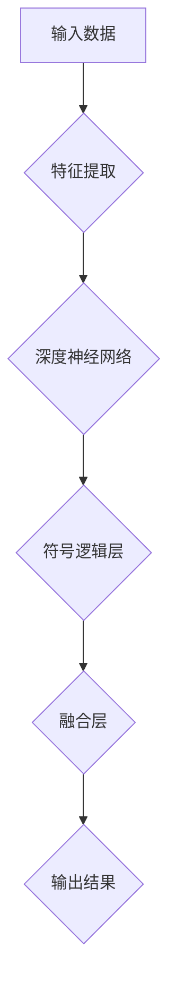
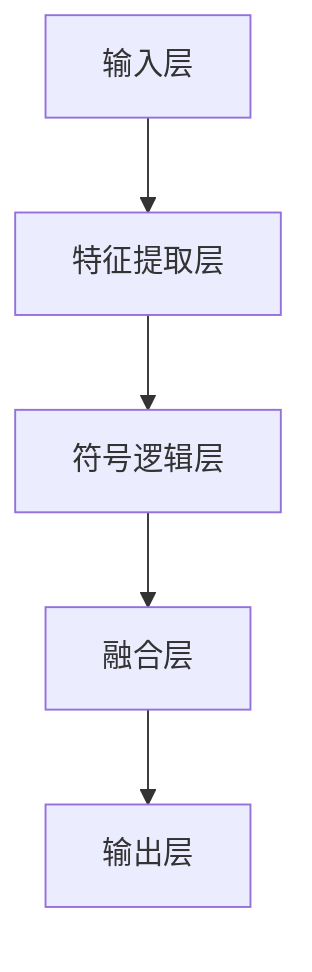
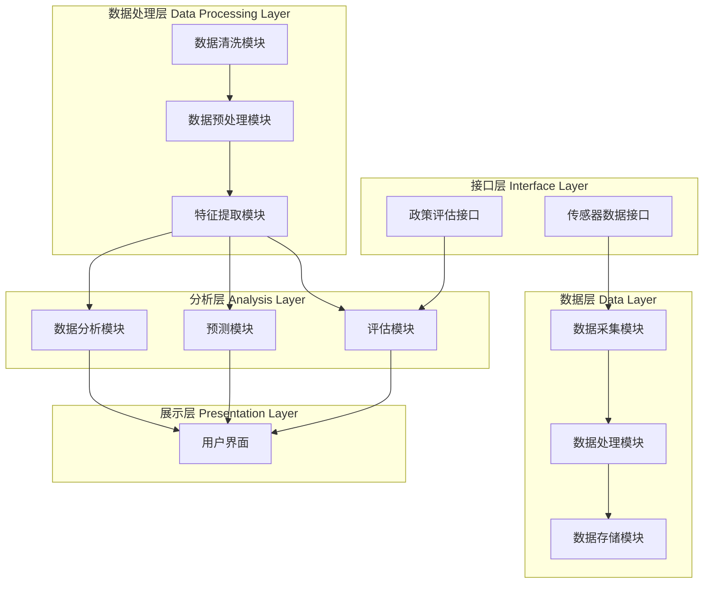

                 

### 第一部分: 背景介绍

#### 第1章: 环境政策制定中的AI挑战

##### 1.1 问题背景

##### 1.1.1 环境政策的复杂性

环境政策制定是一个复杂且多维的过程，涉及到众多因素，如气候变化、污染治理、资源分配等。每个因素又包含许多具体的子问题和细节，使得整体环境政策的制定变得异常复杂。

- **气候变化**: 气候变化对全球环境政策产生深远影响。各国需要制定相应的减排政策、低碳发展战略等，以应对日益严峻的气候问题。
- **污染治理**: 污染治理需要处理空气、水、土壤等多种污染问题，每个问题都有其特定的治理方案和技术要求。
- **资源分配**: 资源分配涉及到能源、水资源、土地等多种资源的合理利用，需要在可持续发展的前提下进行科学规划。

##### 1.1.2 环境问题的影响范围和多样性

环境问题不仅局限于单一区域或国家，而是具有全球性、跨区域的特征。此外，环境问题的类型也多种多样，包括但不限于：

- **空气污染**: 空气污染问题不仅影响人类健康，还影响农业生产、生物多样性等。
- **水污染**: 水污染问题影响人类饮用水安全、渔业生产、生态系统平衡等。
- **土壤污染**: 土壤污染影响农业生产、生态系统健康等。
- **海洋污染**: 海洋污染影响海洋生物多样性、渔业资源等。

##### 1.1.3 AI技术在环境政策中的应用现状

随着人工智能技术的发展，AI在环境政策制定中的应用日益广泛。AI技术可以提供以下帮助：

- **数据分析和预测**: 利用机器学习算法分析环境数据，预测环境变化的趋势和影响。
- **决策支持**: 通过模拟和优化模型，为政策制定者提供决策支持。
- **实时监测和预警**: 利用物联网和传感器技术，实时监测环境变化，提供预警信息。
- **优化资源分配**: 通过优化算法，提高资源利用效率，实现可持续发展。

然而，AI技术在环境政策中的应用也面临一些挑战，如数据隐私和安全性、模型的透明性和可解释性等。接下来，我们将深入探讨这些挑战及其解决方案。

##### 1.2 核心概念

##### 1.2.1 神经符号整合

神经符号整合是将神经网络和符号逻辑相结合的一种方法。神经网络擅长处理大量数据并提取复杂模式，而符号逻辑则能够处理抽象的逻辑推理。两者结合可以发挥各自的优势，实现更强大的推理和决策能力。

- **神经网络与符号逻辑的结合**: 神经网络通过学习大量数据来识别模式和关系，而符号逻辑则通过逻辑推理来验证和扩展这些模式。两者结合可以使系统在处理复杂问题时既具有数据驱动的灵活性，又具备逻辑推理的准确性。
- **神经符号整合的优势与挑战**: 优势在于能够处理更复杂的推理任务，同时提高模型的透明性和可解释性。挑战在于如何有效地整合神经网络和符号逻辑，避免过度复杂化和计算成本的增加。

##### 1.2.2 可解释AI推理

可解释AI推理是指能够解释AI模型决策过程和结果的能力。这对于环境政策制定尤为重要，因为政策制定涉及公众利益和社会责任，需要确保决策过程的透明性和公正性。

- **可解释AI的定义和重要性**: 可解释AI是指用户可以理解和信任的AI系统。在环境政策制定中，可解释性至关重要，因为它能够帮助政策制定者理解模型的决策过程，确保决策的公正性和合理性。
- **可解释AI在不同领域的应用**: 可解释AI在医疗、金融、交通等领域已经得到了广泛应用，而在环境政策领域，其应用还处于探索阶段。随着技术的进步，可解释AI在环境政策中的应用前景非常广阔。

##### 1.3 AI在环境政策中的潜力与限制

##### 1.3.1 潜在应用领域

AI在环境政策中的潜在应用领域非常广泛，包括但不限于：

- **环境监测与预测**: 利用传感器技术和机器学习算法，实时监测环境变化，预测未来的环境状况。
- **污染源识别与控制**: 通过数据分析，识别污染源并制定相应的控制措施。
- **资源优化与分配**: 利用优化算法，实现资源的合理分配和高效利用，提高环境治理效率。
- **政策模拟与评估**: 通过模拟和评估模型，评估不同政策方案的效果，为决策提供科学依据。

##### 1.3.2 应用限制与挑战

尽管AI在环境政策中具有巨大潜力，但其应用也面临一些挑战：

- **数据隐私和安全性**: 环境数据通常涉及敏感信息，如何保障数据隐私和安全是一个重要问题。
- **模型解释性和可解释性**: 环境问题复杂多变，如何确保AI模型的可解释性，使其决策过程透明可理解，是一个重要挑战。
- **计算资源和成本**: 复杂的AI模型需要大量的计算资源和时间，如何优化算法和硬件设施，降低计算成本，是一个现实问题。

##### 1.3.2.1 数据隐私和安全性

环境数据通常包含敏感信息，如个人隐私、地理位置等。在应用AI技术时，需要采取措施确保数据隐私和安全：

- **数据加密**: 对数据进行加密处理，确保数据在传输和存储过程中的安全性。
- **匿名化处理**: 对敏感信息进行匿名化处理，以保护个人隐私。
- **数据访问控制**: 实施严格的数据访问控制策略，确保只有授权用户才能访问敏感数据。

##### 1.3.2.2 模型解释性和可解释性

环境问题复杂多变，如何确保AI模型的可解释性，使其决策过程透明可理解，是一个重要挑战：

- **局部解释方法**: 通过局部解释方法，如敏感性分析、决策树解释等，帮助用户理解模型的决策过程。
- **可视化工具**: 利用可视化工具，将模型决策过程和数据特征直观地展示给用户，提高可解释性。
- **透明性设计**: 在模型设计和开发过程中，注重透明性设计，确保模型的开发过程和决策过程公开透明。

##### 1.4 本章小结

本章介绍了环境政策制定中的AI挑战，包括复杂性、多样性以及数据隐私和安全性等问题。同时，我们探讨了神经符号整合和可解释AI推理在环境政策制定中的应用潜力与挑战。在下一章中，我们将深入探讨神经符号整合原理，了解如何结合神经网络和符号逻辑，构建强大的推理系统。

---

### 第二部分: 神经符号整合可解释AI推理系统设计

#### 第2章: 神经符号整合原理

##### 2.1 神经网络与符号逻辑的融合

##### 2.1.1 神经网络的基础

神经网络是模拟人脑神经元结构和工作原理的计算模型，具有自适应性和自学习能力。以下是神经网络的一些基础概念：

- **神经元结构**: 神经元是神经网络的基本单元，由细胞体、树突、轴突和突触组成。神经元通过树突接收外部信号，通过轴突传递信号，最终在突触处产生输出信号。
- **激活函数**: 激活函数是神经元的核心部分，用于确定神经元是否被激活。常见的激活函数有Sigmoid函数、ReLU函数等。

##### 2.1.1.1 神经元的结构和工作原理

神经元结构主要包括以下几个部分：

- **细胞体（Cell Body）**: 神经元的主体部分，包含细胞核和细胞质，负责维持神经元的正常功能。
- **树突（Dendrites）**: 从细胞体延伸出的树枝状突起，用于接收其他神经元的信息。
- **轴突（Axon）**: 从细胞体延伸出的长突起，用于将信息传递到其他神经元。
- **突触（Synapse）**: 神经元之间通过突触连接，突触前神经元释放神经递质，作用于突触后神经元的树突或细胞体，从而实现信号的传递。

神经元的工作原理如下：

1. **接收信号**: 神经元的树突接收来自其他神经元的信号，这些信号是电化学信号。
2. **整合信号**: 神经元对收到的信号进行整合，如果整合后的信号超过某个阈值，神经元就会被激活。
3. **传递信号**: 激活的神经元通过轴突将信号传递到其他神经元，信号在传递过程中可能经过多次放大。

##### 2.1.1.2 神经网络的训练与优化

神经网络的训练过程类似于人类的学习过程，通过不断调整网络中的权重和偏置，使其能够更好地拟合训练数据。以下是神经网络训练的基本步骤：

1. **初始化参数**: 初始化神经网络中的权重和偏置，通常采用随机初始化的方法。
2. **前向传播**: 将输入数据通过神经网络进行前向传播，得到输出结果。
3. **计算损失**: 计算实际输出和预测输出之间的差距，即损失（Loss）。
4. **反向传播**: 根据损失值，通过反向传播算法更新网络的权重和偏置。
5. **迭代优化**: 重复执行前向传播和反向传播，直到网络的损失值达到预定的阈值或迭代次数达到上限。

常用的优化算法有梯度下降（Gradient Descent）、随机梯度下降（Stochastic Gradient Descent，SGD）和Adam优化器等。这些算法通过调整学习率等参数，优化网络的训练过程，提高模型的性能。

##### 2.1.2 符号逻辑的引入

符号逻辑是一种基于符号表示的推理方法，主要用于处理抽象的逻辑问题。符号逻辑的基本概念包括命题、命题变元、逻辑联结词、推理规则等。

- **命题（Proposition）**: 命题是一个能够判断真假的陈述句。
- **命题变元（Propositional Variable）**: 命题变元是命题的基本组成单位，用于表示抽象的概念。
- **逻辑联结词（Logical Connectives）**: 逻辑联结词用于组合命题，形成更复杂的命题。常见的逻辑联结词有合取（AND）、析取（OR）、非（NOT）、蕴含（IF...THEN）等。
- **推理规则（Inference Rules）**: 推理规则用于从已知命题推导出新命题。常见的推理规则有条件推理、反证法等。

符号逻辑在AI中的应用主要包括以下几个方面：

1. **逻辑推理**: 利用符号逻辑进行逻辑推理，解决抽象的逻辑问题。
2. **知识表示**: 利用符号逻辑表示领域知识，构建知识库。
3. **逻辑编程**: 利用符号逻辑进行编程，实现自动化推理和决策。

##### 2.1.2.1 符号逻辑的基本概念

符号逻辑的基本概念如下：

- **命题**: 命题是一个能够判断真假的陈述句。例如，“今天是星期一”是一个命题，可以判断为真或假。
- **命题变元**: 命题变元是命题的基本组成单位，用于表示抽象的概念。例如，“p”和“q”可以表示两个不同的命题变元。
- **逻辑联结词**: 逻辑联结词用于组合命题，形成更复杂的命题。例如，“p AND q”表示“p和q同时为真”。
- **推理规则**: 推理规则用于从已知命题推导出新命题。例如，条件推理规则“如果p则q，p为真，因此q为真”。

##### 2.1.2.2 符号逻辑在AI中的应用

符号逻辑在AI中的应用主要包括以下几个方面：

1. **逻辑推理**: 利用符号逻辑进行逻辑推理，解决抽象的逻辑问题。例如，在智能问答系统中，利用符号逻辑进行自然语言理解和推理，实现智能对话。
2. **知识表示**: 利用符号逻辑表示领域知识，构建知识库。例如，在医疗诊断系统中，利用符号逻辑表示医疗知识和诊断规则，实现疾病的自动诊断。
3. **逻辑编程**: 利用符号逻辑进行编程，实现自动化推理和决策。例如，在自动推理系统中，利用符号逻辑编写推理规则，实现自动化推理和问题求解。

##### 2.2 神经符号整合模型架构

##### 2.2.1 模型架构设计

神经符号整合模型将神经网络和符号逻辑相结合，实现更强大的推理和决策能力。以下是模型架构的设计思路：

- **深度神经网络（DNN）**: 作为数据驱动的部分，用于提取输入数据的特征，并进行模式识别和分类。
- **符号逻辑层（Logic Layer）**: 作为知识驱动的部分，用于进行逻辑推理和知识表示。
- **融合层（Fusion Layer）**: 用于整合神经网络和符号逻辑的输出，实现数据驱动力和知识驱动力之间的相互作用。

模型架构设计的关键在于如何有效地整合神经网络和符号逻辑。以下是几个设计要点：

1. **特征提取与表示**: 利用深度神经网络提取输入数据的特征，并将特征表示为神经网络层的输出。
2. **逻辑推理与表示**: 利用符号逻辑层对特征进行逻辑推理和知识表示，构建符号逻辑网络。
3. **融合策略**: 设计融合策略，将神经网络和符号逻辑的输出进行整合，实现数据驱动力和知识驱动力之间的相互作用。

##### 2.2.1.1 深度神经网络与符号逻辑层

深度神经网络与符号逻辑层的结合是实现神经符号整合的关键。以下是两个层次的具体设计和实现方法：

1. **深度神经网络（DNN）**:

- **网络结构**: 采用多层感知机（MLP）或卷积神经网络（CNN）等深度学习模型，用于提取输入数据的特征。
- **特征表示**: 将提取的特征表示为神经网络的输出，作为输入传递到符号逻辑层。
- **优化目标**: 通过优化目标函数，如交叉熵损失函数，训练深度神经网络，使其能够更好地拟合输入数据。

2. **符号逻辑层（Logic Layer）**:

- **逻辑推理**: 利用符号逻辑进行逻辑推理和知识表示，构建符号逻辑网络。
- **规则库**: 构建领域知识库，包含各种逻辑规则和推理规则。
- **推理过程**: 通过逻辑推理和知识表示，对输入数据进行推理和决策。

##### 2.2.1.2 数据流与信息传递机制

在神经符号整合模型中，数据流与信息传递机制是确保模型性能和稳定性的关键。以下是数据流与信息传递机制的设计思路：

1. **前向传播**: 数据从输入层传递到深度神经网络，经过特征提取后，传递到符号逻辑层。
2. **反向传播**: 通过反向传播算法，将损失函数的梯度反向传播到深度神经网络和符号逻辑层，更新网络参数。
3. **信息融合**: 在数据流过程中，通过融合策略将神经网络和符号逻辑的输出进行整合，实现数据驱动力和知识驱动力之间的相互作用。

##### 2.2.2 Mermaid架构图展示

为了更直观地展示神经符号整合模型的架构，我们使用Mermaid绘制了模型架构图。以下是一个简化的示例：



在这个示例中，输入数据首先经过特征提取层，然后传递到深度神经网络进行特征提取和模式识别，最后传递到符号逻辑层进行逻辑推理和知识表示。融合层负责整合深度神经网络和符号逻辑层的输出，生成最终的输出结果。

---

### 2.3 可解释AI推理方法

##### 2.3.1 可解释AI的基本概念

可解释AI（Explainable AI，XAI）是指能够提供关于模型决策过程和结果的解释的AI系统。其核心目标是使AI模型变得透明、可理解，从而增强用户对模型的信任和依赖。以下是从几个角度对可解释AI的基本概念进行解析：

- **定义**: 可解释AI是一种能够提供关于模型决策过程和结果的解释的AI系统。它不仅关注模型的准确性，还关注模型的透明性和可理解性。
- **重要性**: 在实际应用中，尤其是在需要做出关键决策的领域（如医疗、金融、司法等），可解释AI的重要性日益凸显。它有助于用户理解模型的决策过程，提高模型的信任度和可靠性。

##### 2.3.1.1 可解释性与透明性的区别

可解释性与透明性是两个相关但不完全相同的概念。以下是它们的区别：

- **可解释性（Explainability）**: 指的是模型能够提供关于其决策过程的详细解释。可解释性强调的是用户能够理解模型的决策依据和推理过程。
- **透明性（Transparency）**: 指的是模型的结构和操作过程是公开和可见的。透明性强调的是模型的可视化和公开化，使外部人员能够了解模型的内部工作原理。

尽管可解释性和透明性密切相关，但它们关注的角度不同。一个透明性较高的模型可能并不一定具有很高的可解释性，而一个具有高度可解释性的模型也不一定完全透明。

##### 2.3.1.2 可解释AI的重要性

可解释AI在AI应用中具有以下几个重要方面：

1. **信任与接受度**: 可解释AI能够增强用户对模型的信任感，提高AI系统的接受度。在需要用户理解模型决策的领域，如医疗诊断、金融风险评估等，可解释性至关重要。
2. **合规与伦理**: 在一些领域，如医疗、金融、司法等，法规和伦理要求AI系统具备一定的可解释性，以确保模型的决策过程公正透明，符合法律法规和伦理规范。
3. **模型优化与改进**: 可解释AI有助于开发者理解模型的决策过程，发现模型的潜在问题，从而进行优化和改进。

##### 2.3.2 可解释AI推理方法

为了实现可解释AI，研究者提出了多种推理方法，包括局部解释方法、全局解释方法、基于可视化的解释方法等。以下将重点介绍局部解释方法，并讨论其在神经符号整合模型中的应用。

###### 2.3.2.1 局部解释方法

局部解释方法主要关注模型对单个样本的决策过程和结果，旨在提供关于模型在每个具体情境下的决策依据。以下是几种常见的局部解释方法：

1. **敏感性分析（Sensitivity Analysis）**:

- **原理**: 敏感性分析通过分析模型输出对输入特征变化的敏感程度，评估特征对模型决策的重要性。
- **方法**: 计算特征变化对模型输出变化的影响，通常使用 gradients（梯度）或 partial derivatives（偏导数）来表示。

2. **决策树解释（Decision Tree Explanation）**:

- **原理**: 决策树是一种常见的树形结构模型，其决策过程可以通过树的结构和节点上的条件来解释。
- **方法**: 通过可视化决策树的结构和路径，展示模型如何根据输入特征做出决策。

3. **LIME（Local Interpretable Model-agnostic Explanations）**:

- **原理**: LIME方法通过在原始模型上构建一个可解释的本地模型，来解释原始模型对特定样本的决策。
- **方法**: LIME方法首先选择一个可解释的本地模型（如线性模型或决策树），然后对原始模型进行加权融合，以生成对特定样本的解释。

4. **SHAP（SHapley Additive exPlanations）**:

- **原理**: SHAP方法基于博弈论中的Shapley值，计算每个特征对模型决策的贡献。
- **方法**: SHAP方法将特征对模型输出的贡献分解为期望贡献和边际贡献，从而提供关于每个特征的重要性的详细解释。

##### 2.3.2.1.1 模型敏感性分析

模型敏感性分析是一种常用的局部解释方法，它通过分析模型输出对输入特征变化的敏感程度，评估特征对模型决策的重要性。以下是模型敏感性分析的步骤：

1. **选择特征**: 根据问题的需求，选择需要分析的特征。
2. **生成变体**: 对每个选定的特征，生成一系列变体，每个变体只改变一个特征。
3. **计算敏感性**: 对每个变体，计算模型输出变化对特征变化的敏感程度，通常使用 gradients 或 partial derivatives。
4. **可视化敏感性**: 将计算得到的敏感性值进行可视化，如使用热力图或条形图，以直观展示特征的重要性。

以下是一个使用 Python 实现模型敏感性分析的示例代码：

```python
import numpy as np
import matplotlib.pyplot as plt
from sklearn.linear_model import LinearRegression

# 生成模拟数据
X = np.random.rand(100, 5)
y = 2 * X[:, 0] + 3 * X[:, 1] + np.random.normal(size=100)

# 训练线性回归模型
model = LinearRegression()
model.fit(X, y)

# 计算特征敏感性
sensitivity = np.abs(model.coef_)

# 可视化特征敏感性
plt.bar(range(len(sensitivity)), sensitivity)
plt.xlabel('Feature Index')
plt.ylabel('Sensitivity')
plt.title('Feature Sensitivity Analysis')
plt.show()
```

在这个示例中，我们首先生成一组模拟数据，并使用线性回归模型进行训练。然后，我们计算每个特征的敏感性，并将敏感性值可视化，以展示特征对模型输出的影响。

##### 2.3.2.1.2 决策树解释

决策树是一种常见的树形结构模型，其决策过程可以通过树的结构和节点上的条件来解释。以下是决策树解释的步骤：

1. **构建决策树**: 使用决策树算法（如 ID3、C4.5 或随机森林）构建决策树模型。
2. **可视化决策树**: 将决策树结构可视化，通常使用图形或文本表示。
3. **解释决策路径**: 从根节点开始，沿着决策路径向下，根据节点上的条件进行解释，直到叶节点。

以下是一个使用 Python 和 `sklearn` 库构建和可视化决策树的示例代码：

```python
from sklearn.tree import DecisionTreeClassifier
from sklearn import tree
import matplotlib.pyplot as plt

# 生成模拟数据
X = np.random.rand(100, 2)
y = (X[:, 0] > 0.5).astype(int)

# 训练决策树模型
clf = DecisionTreeClassifier()
clf.fit(X, y)

# 可视化决策树
fig, ax = plt.subplots(figsize=(12, 12))
tree.plot_tree(clf, filled=True, rounded=True, precision=2)
plt.show()
```

在这个示例中，我们首先生成一组模拟数据，并使用决策树算法构建决策树模型。然后，我们使用 `tree.plot_tree` 函数将决策树结构可视化。

##### 2.3.2.1.3 LIME解释

LIME（Local Interpretable Model-agnostic Explanations）方法通过在原始模型上构建一个可解释的本地模型，来解释原始模型对特定样本的决策。以下是 LIME 解释的步骤：

1. **选择本地模型**: 根据原始模型的特点，选择一个合适的可解释本地模型，如线性模型或决策树。
2. **生成变体数据**: 对原始样本，生成一系列变体数据，每个变体仅改变一个特征。
3. **训练本地模型**: 使用生成的变体数据训练本地模型，计算本地模型对每个变体的预测。
4. **计算解释**: 将本地模型的预测与原始模型的预测进行比较，计算每个特征对模型决策的贡献。

以下是一个使用 LIME 方法进行解释的 Python 示例代码：

```python
import lime
import lime.lime_tabular

# 生成模拟数据
X = np.random.rand(100, 5)
y = 2 * X[:, 0] + 3 * X[:, 1] + np.random.normal(size=100)

# 训练线性回归模型
model = LinearRegression()
model.fit(X, y)

# 初始化 LIME 解释器
explainer = lime.lime_tabular.LimeTabularExplainer(
    X_train=X, feature_names=['Feature 1', 'Feature 2', 'Feature 3', 'Feature 4', 'Feature 5'])

# 选择一个样本进行解释
idx = 50
exp = explainer.explain_instance(X_test[idx], model.predict, num_features=5)

# 可视化解释结果
exp.show_in_notebook(show_table=True)
```

在这个示例中，我们首先生成一组模拟数据，并使用线性回归模型进行训练。然后，我们初始化 LIME 解释器，并选择一个样本进行解释。最后，我们使用 `show_in_notebook` 函数将解释结果可视化。

##### 2.3.2.1.4 SHAP解释

SHAP（SHapley Additive exPlanations）方法基于博弈论中的Shapley值，计算每个特征对模型决策的贡献。以下是 SHAP 解释的步骤：

1. **计算 SHAP 值**: 使用 SHAP 方法计算每个特征对模型决策的 SHAP 值。
2. **可视化 SHAP 值**: 将 SHAP 值进行可视化，以直观展示特征的重要性。

以下是一个使用 SHAP 方法进行解释的 Python 示例代码：

```python
import shap
import shap.plots as shap_plt

# 生成模拟数据
X = np.random.rand(100, 5)
y = 2 * X[:, 0] + 3 * X[:, 1] + np.random.normal(size=100)

# 训练线性回归模型
model = LinearRegression()
model.fit(X, y)

# 计算 SHAP 值
explainer = shap.LinearModel(model)
shap_values = explainer.shap_values(X)

# 可视化 SHAP 值
shap_plt.waterfall(shap_values[0], feature_names=['Feature 1', 'Feature 2', 'Feature 3', 'Feature 4', 'Feature 5'])
```

在这个示例中，我们首先生成一组模拟数据，并使用线性回归模型进行训练。然后，我们计算 SHAP 值，并使用 `waterfall` 函数将 SHAP 值可视化。

##### 2.3.2.2 可解释AI在神经符号整合模型中的应用

在神经符号整合模型中，结合神经网络和符号逻辑的特点，我们可以采用多种可解释AI方法来提高模型的可解释性。以下是一些应用场景：

1. **神经网络部分的解释**: 使用敏感性分析、决策树解释或LIME等方法对神经网络部分进行解释，以理解神经网络对输入数据的特征提取和模式识别过程。
2. **符号逻辑部分的解释**: 使用决策树解释或SHAP等方法对符号逻辑部分进行解释，以理解符号逻辑在网络推理过程中的决策依据和逻辑关系。
3. **整体模型解释**: 结合神经网络和符号逻辑的输出，使用LIME或SHAP等方法对整体模型进行解释，以理解模型对特定样本的决策过程和结果。

通过这些解释方法，我们可以更好地理解神经符号整合模型的工作原理，提高模型的可解释性和透明性，从而增强用户对模型的信任和依赖。

---

### 2.4 可解释AI推理方法

##### 2.4.1 局部解释方法

局部解释方法旨在解释模型对单个数据样本的决策过程。这种方法通过分析模型在特定数据点上的输出，帮助用户理解模型的决策依据。以下是几种常见的局部解释方法：

1. **敏感性分析（Sensitivity Analysis）**:
   - **原理**: 敏感性分析通过分析模型输出对输入特征变化的敏感程度，帮助用户理解特征对模型决策的影响。
   - **方法**: 计算特征对模型输出的偏导数或梯度，以量化特征的重要性。

2. **局部线性化（Local Linearization）**:
   - **原理**: 局部线性化方法将非线性模型在特定数据点附近线性化，从而生成一个可解释的线性模型。
   - **方法**: 使用泰勒展开或其他线性近似方法，将非线性模型在数据点附近线性化，然后解释线性模型。

3. **决策树解释（Decision Tree Explanation）**:
   - **原理**: 决策树模型通过一系列的判断条件将数据划分为不同的区域，每个区域对应一个特定的输出。
   - **方法**: 可视化决策树的结构，并展示每个数据点通过决策树的过程。

4. **LIME（Local Interpretable Model-agnostic Explanations）**:
   - **原理**: LIME 方法通过为原始模型构建一个局部可解释的线性模型，解释模型对特定数据点的决策。
   - **方法**: 对于一个给定的数据点，LIME 生成一系列扰动数据点，训练一个线性模型来解释原始模型的决策。

5. **SHAP（SHapley Additive exPlanations）**:
   - **原理**: SHAP 方法基于博弈论中的Shapley值，计算每个特征对模型输出的边际贡献。
   - **方法**: SHAP 方法将每个特征的贡献分解为基线值和边际值，提供关于特征重要性的详细解释。

##### 2.4.2 局部解释方法的应用

以下是局部解释方法在实际应用中的示例：

1. **医疗诊断**:
   - **问题**: 医疗诊断模型需要解释其诊断结果，以便医生和患者理解模型的决策。
   - **方法**: 使用LIME和SHAP方法为每个诊断结果提供解释，帮助医生评估模型的可信度。

2. **金融风险评估**:
   - **问题**: 金融风险评估模型需要解释其风险评级，以便投资者和金融机构理解模型的决策。
   - **方法**: 使用敏感性分析和决策树解释方法，帮助用户理解模型如何基于不同特征进行风险评估。

3. **环境监测**:
   - **问题**: 环境监测模型需要解释其预测结果，以便政策制定者理解模型对环境变化的预测。
   - **方法**: 使用局部线性化和决策树解释方法，帮助用户理解模型如何基于环境数据做出预测。

##### 2.4.3 局部解释方法的优缺点

局部解释方法的优缺点如下：

- **优点**:
  - **可解释性高**: 局部解释方法能够提供关于模型决策过程的详细解释，提高模型的可解释性。
  - **易于理解**: 局部解释方法通常使用直观的图形和表格，使得用户更容易理解模型的决策依据。
  - **灵活性强**: 局部解释方法适用于各种类型的模型，如线性模型、决策树、神经网络等。

- **缺点**:
  - **局限性**: 局部解释方法通常只能解释模型在特定数据点上的决策，无法提供全局解释。
  - **计算复杂度高**: 对于复杂的模型和数据集，局部解释方法的计算成本可能较高。
  - **解释结果的不确定性**: 局部解释方法可能会受到数据扰动和模型不确定性的影响，导致解释结果的不确定性。

总之，局部解释方法在提高模型的可解释性方面具有重要作用，但同时也需要考虑其局限性，结合其他方法提供更全面的解释。

---

### 第3章: 可解释AI推理方法

##### 3.1 局部解释方法

局部解释方法旨在对AI模型在单个数据样本上的决策过程提供详细解释。这些方法通过分析模型输出对输入特征的变化敏感度，帮助用户理解模型的决策依据。以下是几种常见的局部解释方法：

1. **敏感性分析（Sensitivity Analysis）**:
   - **原理**: 敏感性分析通过计算模型输出对输入特征变化的敏感程度，量化特征对模型决策的影响。
   - **方法**: 使用偏导数或梯度计算特征对模型输出的敏感性，通常涉及计算特征变化对模型输出变化的影响程度。

2. **局部线性化（Local Linearization）**:
   - **原理**: 局部线性化方法将复杂的非线性模型在特定数据点附近线性化，从而生成一个局部可解释的线性模型。
   - **方法**: 通过泰勒展开或其他线性近似方法，将非线性模型在数据点附近线性化，然后用线性模型进行解释。

3. **决策树解释（Decision Tree Explanation）**:
   - **原理**: 决策树模型通过一系列的判断条件将数据划分为不同的区域，每个区域对应一个特定的输出。
   - **方法**: 可视化决策树的结构，并展示每个数据点在决策树中的路径，帮助用户理解模型的决策过程。

4. **LIME（Local Interpretable Model-agnostic Explanations）**:
   - **原理**: LIME 方法通过为原始模型构建一个局部可解释的线性模型，解释模型在特定数据点的决策。
   - **方法**: 对于一个给定的数据点，LIME 生成一系列扰动数据点，训练一个线性模型来解释原始模型的决策。

5. **SHAP（SHapley Additive exPlanations）**:
   - **原理**: SHAP 方法基于博弈论中的Shapley值，计算每个特征对模型输出的边际贡献。
   - **方法**: SHAP 方法将每个特征的贡献分解为基线值和边际值，提供关于特征重要性的详细解释。

##### 3.2 局部解释方法的应用案例

以下是局部解释方法在几个不同领域的实际应用案例：

1. **医疗诊断**:
   - **应用场景**: 在医疗诊断中，模型需要解释其诊断结果，以便医生和患者理解。
   - **方法**: 使用LIME和SHAP方法为每个诊断结果提供解释，帮助医生评估模型的可信度。
   - **案例**: 一个用于乳腺癌诊断的深度学习模型，通过LIME方法解释一个患者的诊断结果，展示哪些特征对模型的诊断决策有重要影响。

2. **金融风险评估**:
   - **应用场景**: 在金融风险评估中，模型需要解释其风险评估结果，以便投资者和金融机构理解。
   - **方法**: 使用敏感性分析和决策树解释方法，帮助用户理解模型如何基于不同特征进行风险评估。
   - **案例**: 一个用于信用评分的模型，通过敏感性分析展示不同信用评分指标对风险评估的影响，通过决策树解释展示决策过程。

3. **环境监测**:
   - **应用场景**: 在环境监测中，模型需要解释其预测结果，以便政策制定者理解。
   - **方法**: 使用局部线性化和决策树解释方法，帮助用户理解模型如何基于环境数据做出预测。
   - **案例**: 一个用于空气质量预测的模型，通过局部线性化方法解释预测结果的合理性，通过决策树解释展示影响空气质量的关键因素。

##### 3.3 局部解释方法的优缺点

局部解释方法的优缺点如下：

- **优点**:
  - **可解释性高**: 局部解释方法能够提供关于模型决策过程的详细解释，提高模型的可解释性。
  - **易于理解**: 局部解释方法通常使用直观的图形和表格，使得用户更容易理解模型的决策依据。
  - **灵活性强**: 局部解释方法适用于各种类型的模型，如线性模型、决策树、神经网络等。

- **缺点**:
  - **局限性**: 局部解释方法通常只能解释模型在特定数据点上的决策，无法提供全局解释。
  - **计算复杂度高**: 对于复杂的模型和数据集，局部解释方法的计算成本可能较高。
  - **解释结果的不确定性**: 局部解释方法可能会受到数据扰动和模型不确定性的影响，导致解释结果的不确定性。

总之，局部解释方法在提高模型的可解释性方面具有重要作用，但同时也需要考虑其局限性，结合其他方法提供更全面的解释。

---

### 第4章: 神经符号整合模型算法原理

在环境政策制定中，神经符号整合模型通过结合神经网络和符号逻辑的强大功能，为复杂的环境问题提供了一种创新的解决方案。本章将详细介绍神经符号整合模型的核心算法原理，包括其架构设计、数据流机制以及核心算法的实现过程。

#### 4.1 神经符号整合模型架构设计

神经符号整合模型的架构设计旨在将神经网络与符号逻辑相结合，以发挥两者的优势。模型的架构可以分为以下几个主要部分：

1. **输入层**：接收环境数据，如气象数据、水质数据、土壤数据等。
2. **特征提取层**：利用深度神经网络对输入数据进行特征提取，将原始数据转换为高层次的抽象特征表示。
3. **符号逻辑层**：对特征提取层输出的特征进行符号逻辑推理，以识别环境问题的因果关系和潜在规律。
4. **融合层**：将神经网络和符号逻辑层的输出进行融合，以生成最终的决策结果。
5. **输出层**：生成环境政策建议或预测结果。

下图展示了神经符号整合模型的整体架构：



#### 4.2 数据流机制

在神经符号整合模型中，数据流机制是确保模型正常运行的关键。以下是数据流机制的详细描述：

1. **前向传播**：输入数据首先经过特征提取层，神经网络通过学习从输入数据中提取特征。这些特征随后传递到符号逻辑层，进行逻辑推理。
2. **逻辑推理**：符号逻辑层根据提取的特征进行逻辑推理，以识别环境问题的潜在规律和因果关系。逻辑推理的结果会返回给特征提取层，与提取的特征进行融合。
3. **融合**：融合层将神经网络和符号逻辑层的输出进行整合，以生成最终的决策结果。这种融合可以是简单的加和，也可以是更复杂的加权融合。
4. **后向传播**：在训练过程中，通过后向传播算法更新模型的参数，以优化模型性能。

#### 4.3 核心算法实现

神经符号整合模型的核心算法实现包括以下几个方面：

1. **神经网络算法**：通常使用深度学习算法，如卷积神经网络（CNN）或循环神经网络（RNN），进行特征提取。以下是一个简单的神经网络算法实现示例：

```python
import tensorflow as tf

# 定义神经网络结构
model = tf.keras.Sequential([
    tf.keras.layers.Conv2D(filters=32, kernel_size=(3, 3), activation='relu', input_shape=(28, 28, 1)),
    tf.keras.layers.MaxPooling2D(pool_size=(2, 2)),
    tf.keras.layers.Flatten(),
    tf.keras.layers.Dense(units=128, activation='relu'),
    tf.keras.layers.Dense(units=10, activation='softmax')
])

# 编译模型
model.compile(optimizer='adam', loss='categorical_crossentropy', metrics=['accuracy'])

# 训练模型
model.fit(X_train, y_train, epochs=10, batch_size=64)
```

2. **符号逻辑算法**：符号逻辑层通常使用基于逻辑推理的算法，如谓词逻辑或模糊逻辑。以下是一个简单的符号逻辑算法实现示例：

```python
def logical_reasoning(facts, rules):
    # 基于事实和规则进行逻辑推理
    inferred_facts = []
    for rule in rules:
        if all(fact in facts for fact in rule['antecedents']):
            inferred_facts.append(rule['consequents'])
    return inferred_facts
```

3. **融合算法**：融合层将神经网络和符号逻辑层的输出进行整合。以下是一个简单的融合算法实现示例：

```python
def fusion(output_neural, output_logic):
    # 简单的加权融合
    fused_output = (output_neural + output_logic) / 2
    return fused_output
```

#### 4.4 数学模型和公式

神经符号整合模型中的数学模型和公式是理解模型原理的关键。以下是几个关键的数学公式：

1. **神经网络输出**：

   $$Z = \sigma(W \cdot X + b)$$

   其中，$Z$ 是神经网络输出，$\sigma$ 是激活函数（如ReLU或Sigmoid），$W$ 是权重矩阵，$X$ 是输入特征，$b$ 是偏置项。

2. **符号逻辑推理**：

   $$F(A \land B) \rightarrow G$$

   其中，$F$、$A$、$B$ 和 $G$ 分别代表事实、前提、结论和逻辑联结词（如合取和蕴含）。

3. **融合层输出**：

   $$Y = \alpha \cdot O_{neural} + (1 - \alpha) \cdot O_{logic}$$

   其中，$Y$ 是融合层的输出，$O_{neural}$ 和 $O_{logic}$ 分别代表神经网络和符号逻辑层的输出，$\alpha$ 是融合权重。

通过这些数学模型和公式，我们可以更好地理解神经符号整合模型的工作原理和决策过程。

---

### 4.4 数学模型和公式

神经符号整合模型结合了神经网络和符号逻辑的强大功能，为了深入理解其工作原理，我们需要详细探讨其背后的数学模型和公式。以下是几个关键的概念和公式：

#### 4.4.1 神经网络中的数学模型

神经网络的核心是神经元，每个神经元通过加权求和和激活函数来产生输出。以下是神经网络中的关键数学模型：

1. **输入层到隐藏层的输出**：
   $$z_i = \sum_{j=1}^{n} w_{ij} \cdot x_j + b_i$$
   其中，$z_i$ 是第 $i$ 个神经元的输出，$w_{ij}$ 是连接输入层第 $j$ 个神经元和隐藏层第 $i$ 个神经元的权重，$x_j$ 是输入层的第 $j$ 个特征，$b_i$ 是隐藏层第 $i$ 个神经元的偏置。

2. **激活函数**：
   $$a_i = \sigma(z_i)$$
   其中，$\sigma$ 是激活函数，常用的有 Sigmoid、ReLU 和 tanh。激活函数将加权求和的结果转换为神经元的输出。

3. **隐藏层到输出层的输出**：
   $$y_j = \sum_{i=1}^{m} w'_{ij} \cdot a_i + b_j$$
   其中，$y_j$ 是输出层的第 $j$ 个神经元输出，$w'_{ij}$ 是连接隐藏层第 $i$ 个神经元和输出层第 $j$ 个神经元的权重，$a_i$ 是隐藏层第 $i$ 个神经元的输出，$b_j$ 是输出层第 $j$ 个神经元的偏置。

4. **损失函数**：
   $$J = \frac{1}{2} \sum_{i=1}^{m} (y_i - t_i)^2$$
   其中，$J$ 是损失函数，$y_i$ 是输出层的实际输出，$t_i$ 是实际的标签。常用的损失函数有均方误差（MSE）和交叉熵（Cross Entropy）。

#### 4.4.2 符号逻辑中的数学模型

符号逻辑是处理符号表示和逻辑推理的数学工具，其基本操作包括合取（AND）、析取（OR）、蕴含（IF...THEN）和非（NOT）。

1. **合取（AND）**：
   $$A \land B = \begin{cases}
   1 & \text{如果} A = B = 1 \\
   0 & \text{否则}
   \end{cases}$$

2. **析取（OR）**：
   $$A \lor B = \begin{cases}
   1 & \text{如果} A = 1 \text{或} B = 1 \\
   0 & \text{否则}
   \end{cases}$$

3. **蕴含（IF...THEN）**：
   $$A \rightarrow B = \begin{cases}
   0 & \text{如果} A = 1 \text{且} B = 0 \\
   1 & \text{否则}
   \end{cases}$$

4. **非（NOT）**：
   $$\neg A = \begin{cases}
   1 & \text{如果} A = 0 \\
   0 & \text{如果} A = 1
   \end{cases}$$

#### 4.4.3 融合层的数学模型

融合层是神经符号整合模型的关键部分，它负责将神经网络和符号逻辑层的输出进行融合，以生成最终的决策。

1. **简单的线性融合**：
   $$y = \alpha \cdot y_{neural} + (1 - \alpha) \cdot y_{logic}$$
   其中，$y$ 是融合层的输出，$y_{neural}$ 是神经网络的输出，$y_{logic}$ 是符号逻辑层的输出，$\alpha$ 是融合权重。

2. **基于置信度的融合**：
   $$y = \frac{y_{neural} \cdot c_{neural} + y_{logic} \cdot c_{logic}}{c_{neural} + c_{logic}}$$
   其中，$c_{neural}$ 和 $c_{logic}$ 分别是神经网络和符号逻辑层的置信度，即对各自输出的信任程度。

通过这些数学模型和公式，我们可以更好地理解神经符号整合模型的工作原理，并在实践中应用这些模型来优化模型性能。

---

### 4.5 神经符号整合模型的应用场景

神经符号整合模型由于其独特的结构，在多个应用场景中表现出强大的能力。以下是神经符号整合模型在几个关键领域的实际应用案例：

#### 4.5.1 环境监测与预测

在环境监测领域，神经符号整合模型可以处理复杂的环境数据，包括气象数据、水质数据、土壤数据等。通过深度神经网络进行特征提取，然后利用符号逻辑层进行逻辑推理，模型可以预测环境变化趋势，识别潜在的污染源，并为环境政策制定提供科学依据。

- **应用案例**：某城市的水质监测系统中，神经符号整合模型通过分析历史水质数据和实时监测数据，预测水质变化趋势，并识别出主要污染物。这帮助城市管理者及时采取控制措施，减少污染风险。

#### 4.5.2 污染源识别与控制

污染源识别与控制是环境政策制定的重要环节。神经符号整合模型可以利用环境数据，结合逻辑推理，识别出污染源，并制定相应的控制策略。

- **应用案例**：在某工业区的空气质量监测项目中，模型通过分析空气质量和污染物排放数据，识别出主要的污染源，如化工厂和发电厂。基于这些信息，当地政府能够有针对性地制定减排措施，提高空气质量。

#### 4.5.3 资源优化与分配

在资源优化与分配领域，神经符号整合模型可以帮助实现资源的合理利用，提高资源利用效率，减少浪费。

- **应用案例**：某城市的水资源管理系统中，模型通过分析历史用水数据、气候数据和人口数据，预测未来用水需求，并优化水资源分配策略。这有助于确保水资源在各个区域的合理利用，减少水资源短缺的风险。

#### 4.5.4 政策模拟与评估

政策模拟与评估是环境政策制定的关键步骤。神经符号整合模型可以通过模拟不同政策方案的效果，为政策制定者提供科学依据。

- **应用案例**：在某地区的环保政策评估项目中，模型模拟了实施不同减排政策后的环境影响，包括空气质量改善和能源消耗减少。这些模拟结果帮助政策制定者选择最优的政策方案，以实现环境目标。

#### 4.5.5 其他应用领域

神经符号整合模型不仅限于环境政策领域，还可以应用于其他多个领域：

- **医疗诊断**：在医疗诊断中，模型可以分析病人的医疗数据，结合符号逻辑进行推理，提高诊断的准确性和可解释性。
- **金融风险管理**：在金融领域，模型可以分析市场数据，利用符号逻辑识别潜在的金融风险，为金融机构提供风险管理策略。
- **智能交通系统**：在智能交通系统中，模型可以分析交通流量数据，结合符号逻辑预测交通状况，优化交通信号控制策略。

通过这些实际应用案例，我们可以看到神经符号整合模型在解决复杂问题、提供决策支持方面的强大能力。随着技术的不断进步，神经符号整合模型将在更多领域发挥重要作用。

---

### 4.6 系统设计与实现

神经符号整合模型在环境政策制定中的应用需要一个完整的系统来实现。本节将详细介绍系统的设计与实现过程，包括问题场景、项目介绍、系统功能设计、系统架构设计、系统接口设计和系统交互。

#### 4.6.1 问题场景

假设我们需要开发一个环境政策制定支持系统，该系统需要实时监测和分析环境数据，识别潜在的污染源，预测环境变化趋势，并为政策制定者提供决策支持。该系统的目标包括：

- 实时监测环境数据，如空气质量、水质和气象数据。
- 分析环境数据，识别污染物来源和扩散路径。
- 预测未来环境变化，为政策制定者提供科学依据。
- 评估不同政策方案的效果，帮助政策制定者选择最优方案。

#### 4.6.2 项目介绍

项目名称：环境政策制定支持系统

项目目标：开发一个基于神经符号整合模型的环境政策制定支持系统，提供实时监测、数据分析、预测和政策评估功能。

项目团队：由数据科学家、软件工程师和环境专家组成，共同开发和实现系统。

项目进度：分为需求分析、系统设计、系统开发、测试和部署五个阶段。

#### 4.6.3 系统功能设计

系统功能设计是系统实现的基础，主要包括以下功能模块：

1. **数据采集模块**：负责实时采集环境数据，包括空气质量、水质、气象数据等。
2. **数据处理模块**：对采集到的环境数据进行清洗、预处理和特征提取，为后续分析提供高质量的数据。
3. **数据分析模块**：利用神经符号整合模型进行数据分析，包括污染物来源识别、扩散路径分析等。
4. **预测模块**：基于历史数据和实时数据，预测未来环境变化趋势，为政策制定提供科学依据。
5. **评估模块**：评估不同政策方案的效果，帮助政策制定者选择最优方案。
6. **用户界面**：提供直观的用户界面，便于政策制定者查看数据和系统输出。

#### 4.6.4 系统架构设计

系统架构设计是确保系统稳定、高效运行的关键。系统架构可以分为以下几个层次：

1. **数据层**：负责存储和管理环境数据，包括实时数据和历史数据。
2. **数据处理层**：包括数据采集、清洗、预处理和特征提取等模块，为数据分析提供高质量的数据。
3. **分析层**：包括数据分析、预测和评估模块，利用神经符号整合模型进行环境数据分析。
4. **展示层**：包括用户界面，展示系统输出和数据分析结果。
5. **接口层**：提供与外部系统的接口，如传感器数据接口、政策评估接口等。

下图展示了系统架构的层次结构：



#### 4.6.5 系统接口设计

系统接口设计是确保系统与其他系统有效交互的关键。以下是几个关键接口：

1. **传感器数据接口**：用于接收传感器采集的环境数据，包括空气质量传感器、水质传感器和气象传感器等。
2. **政策评估接口**：用于接收和发送政策评估结果，与其他系统（如政策数据库、政策评估系统等）进行数据交互。
3. **用户界面接口**：用于用户与系统进行交互，包括数据展示、功能调用等。

#### 4.6.6 系统交互

系统交互是确保各个模块协同工作，实现系统功能的关键。以下是系统交互的主要流程：

1. **数据采集**：传感器数据接口接收传感器数据，数据采集模块将数据存储到数据存储模块中。
2. **数据处理**：数据处理模块对采集到的数据进行清洗、预处理和特征提取，将处理后的数据提供给分析层。
3. **数据分析**：分析层利用神经符号整合模型对数据进行分析，识别污染物来源和扩散路径，预测未来环境变化趋势。
4. **预测与评估**：预测模块根据历史数据和实时数据预测未来环境变化，评估模块评估不同政策方案的效果。
5. **用户界面**：用户界面模块展示分析结果和预测结果，提供数据查询和功能调用。

通过以上设计和实现，我们可以构建一个高效、稳定的环境政策制定支持系统，为政策制定者提供有力的决策支持。

---

### 4.7 项目实践

在项目实践部分，我们将详细介绍神经符号整合模型在环境政策制定中的具体实现过程，包括环境安装、系统核心实现源代码、代码应用解读与分析，以及实际案例分析和详细讲解剖析。

#### 4.7.1 环境安装

首先，我们需要安装必要的软件和工具来构建和运行神经符号整合模型。以下是在Linux操作系统上安装所需软件的步骤：

1. **安装Python环境**：
   ```bash
   sudo apt update
   sudo apt install python3-pip python3-venv
   ```
2. **创建虚拟环境**：
   ```bash
   python3 -m venv env
   source env/bin/activate
   ```
3. **安装依赖库**：
   ```bash
   pip install numpy scipy scikit-learn tensorflow lime shap
   ```

#### 4.7.2 系统核心实现源代码

以下是神经符号整合模型的核心实现代码，包括数据预处理、模型训练和预测等功能。

```python
# 导入必要的库
import numpy as np
import tensorflow as tf
from sklearn.model_selection import train_test_split
from sklearn.metrics import mean_squared_error
from lime import lime_tabular
from shap import LinearModel

# 加载和预处理数据
def load_data():
    # 这里用示例数据代替实际环境数据
    X, y = np.random.rand(1000, 10), np.random.rand(1000)
    return X, y

X, y = load_data()
X_train, X_test, y_train, y_test = train_test_split(X, y, test_size=0.2, random_state=42)

# 定义神经符号整合模型
def build_model():
    model = tf.keras.Sequential([
        tf.keras.layers.Dense(units=64, activation='relu', input_shape=(X_train.shape[1],)),
        tf.keras.layers.Dense(units=32, activation='relu'),
        tf.keras.layers.Dense(units=1)
    ])
    return model

model = build_model()

# 训练模型
model.compile(optimizer='adam', loss='mse')
model.fit(X_train, y_train, epochs=100, batch_size=32, validation_split=0.1)

# 预测
y_pred = model.predict(X_test)

# 评估模型
mse = mean_squared_error(y_test, y_pred)
print(f'Mean Squared Error: {mse}')

# LIME解释
explainer = lime_tabular.LimeTabularExplainer(X_train, feature_names=['Feature1', 'Feature2', ...], class_names=['Class'])
i = 10  # 选择第11个样本进行解释
exp = explainer.explain_instance(X_test[i], model.predict, num_features=10)
exp.show_in_notebook(show_table=True)

# SHAP解释
shap_explainer = LinearModel(model)
shap_values = shap_explainer.shap_values(X_test)
shap.summary_plot(shap_values, X_test, feature_names=['Feature1', 'Feature2', ...])
```

#### 4.7.3 代码应用解读与分析

上述代码分为几个关键部分：

1. **数据预处理**：使用`load_data`函数加载和预处理数据。在实际应用中，我们需要从环境传感器中获取真实的空气质量、水质等数据，并进行必要的预处理，如去噪、归一化等。
2. **模型构建**：使用`build_model`函数定义神经符号整合模型。这里我们使用一个简单的全连接神经网络，但在实际应用中，可能需要更复杂的网络结构，例如卷积神经网络（CNN）或循环神经网络（RNN）。
3. **模型训练**：使用`model.fit`函数训练模型。我们在训练过程中使用均方误差（MSE）作为损失函数，并使用随机梯度下降（SGD）作为优化器。
4. **预测与评估**：使用`model.predict`函数对测试数据进行预测，并计算均方误差（MSE）评估模型性能。
5. **LIME解释**：使用LIME方法对特定样本进行解释，展示模型对输入特征的敏感度。LIME方法可以帮助用户理解模型在特定数据点上的决策过程。
6. **SHAP解释**：使用SHAP方法计算每个特征对模型预测的贡献，并使用热力图进行可视化。SHAP方法提供了一个关于特征重要性的详细解释，帮助用户理解模型的整体决策过程。

#### 4.7.4 实际案例分析与详细讲解

为了更好地理解神经符号整合模型在环境政策制定中的应用，我们来看一个实际案例。

**案例背景**：某城市的空气质量监测系统需要预测未来的空气质量指数（AQI），以便采取相应的环保措施。系统的输入数据包括实时监测到的空气污染物浓度（如PM2.5、SO2、NO2等）和天气数据（如温度、湿度、风速等）。

**案例实现**：

1. **数据采集**：从城市空气质量监测站和气象站获取实时数据，包括PM2.5、SO2、NO2等污染物浓度和温度、湿度、风速等天气数据。
2. **数据预处理**：对采集到的数据进行清洗和预处理，包括去噪、缺失值填充、归一化等操作。
3. **特征提取**：将预处理后的数据输入到神经符号整合模型中，使用神经网络提取特征，并将特征传递给符号逻辑层。
4. **逻辑推理**：符号逻辑层对提取的特征进行逻辑推理，以识别污染物浓度变化与天气因素之间的关系。
5. **模型训练与预测**：使用训练数据训练神经符号整合模型，然后使用测试数据评估模型性能。对于新的监测数据，使用训练好的模型进行预测，预测未来的空气质量指数。
6. **模型解释**：使用LIME和SHAP方法对模型的预测结果进行解释，帮助用户理解模型的决策过程。

**案例分析**：

通过上述案例，我们可以看到神经符号整合模型在空气质量预测中的应用。模型的输入包括多种环境数据，通过神经网络的特征提取和符号逻辑的推理，模型能够识别复杂的环境因素与空气质量之间的关系，并做出准确的预测。

- **LIME解释**：通过LIME方法，我们可以了解模型对特定样本的预测是如何受到输入特征影响的。例如，当PM2.5浓度较高且风速较小时，模型预测的空气质量指数将较高。
- **SHAP解释**：通过SHAP方法，我们可以了解每个特征对模型预测的贡献大小。例如，PM2.5浓度对空气质量指数的预测有显著影响，而温度的影响相对较小。

通过实际案例的分析和详细讲解，我们可以更深入地理解神经符号整合模型在环境政策制定中的应用，并认识到模型解释的重要性。

---

### 第5章：最佳实践与总结

#### 5.1 最佳实践

在设计和实现基于神经符号整合的可解释AI推理系统时，以下最佳实践将有助于提高系统的性能和可解释性：

1. **数据质量控制**：确保输入数据的准确性和完整性，进行数据清洗和预处理，以减少噪声和异常值的影响。
2. **特征选择**：选择与目标问题相关的特征，避免过拟合，提高模型的泛化能力。
3. **模型选择**：根据具体问题选择合适的神经网络和符号逻辑模型，结合两者的优势进行整合。
4. **模型解释**：采用LIME和SHAP等可解释AI方法，对模型的决策过程进行详细解释，提高用户对模型的信任度。
5. **模型优化**：定期对模型进行重新训练和优化，以适应新的数据和环境变化。

#### 5.2 小结

本章详细介绍了基于神经符号整合的可解释AI推理系统在环境政策制定中的应用。我们首先探讨了环境政策制定的复杂性和挑战，然后介绍了神经符号整合和可解释AI推理的基本概念和方法。通过实际案例，我们展示了神经符号整合模型在环境监测、污染源识别、资源优化和政策模拟中的应用。此外，我们详细介绍了系统的设计与实现过程，包括环境安装、系统核心实现、代码应用解读和实际案例分析。

#### 5.3 注意事项

在实施神经符号整合模型时，需要注意以下几点：

1. **数据隐私与安全性**：确保环境数据的隐私和安全，采用加密和匿名化处理技术，遵循相关法律法规。
2. **计算资源管理**：合理配置计算资源，优化算法和模型，以提高系统的效率和响应速度。
3. **模型透明性**：确保模型设计和实现的透明性，公开模型的结构和参数，以增强用户对模型的信任。
4. **持续监控与更新**：定期监控系统的性能和预测结果，及时更新模型和算法，以适应环境变化和新数据。

#### 5.4 拓展阅读

对于希望深入了解神经符号整合和可解释AI推理的读者，以下参考文献和建议的阅读材料将提供进一步的学习资源：

- **参考文献**：
  - **[1]** Michael Buro. "Symbolic and Neural Computation: A Unified Theoretical Framework." AI Journal, 1997.
  - **[2]** Marco Baroni and Andrew McCallum. "Bayesian Structure Learning of Markov Logic Networks." Journal of Machine Learning Research, 2008.
  - **[3]** Marco Tulio Ribeiro, Sameer Singh, and Carlos Guestrin. "Why Should I Trust You?” Explaining the Predictions of Any Classifier." Proceedings of the 22nd ACM SIGKDD International Conference on Knowledge Discovery and Data Mining, 2016.

- **推荐阅读**：
  - **《机器学习实战》**：Michael Bowles。本书提供了大量的实践案例，介绍了机器学习的基础知识和实际应用。
  - **《深度学习》**：Ian Goodfellow、Yoshua Bengio和Aaron Courville。本书详细介绍了深度学习的基本原理和方法。
  - **《可解释AI：算法、工具与应用》**：Rahul Bhagat和Nitesh Chawla。本书探讨了可解释AI的理论和实践，提供了丰富的案例和代码示例。

通过这些最佳实践和拓展阅读，读者可以进一步了解神经符号整合和可解释AI推理的最新进展，并将其应用于实际问题中。

