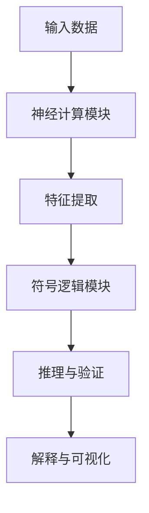
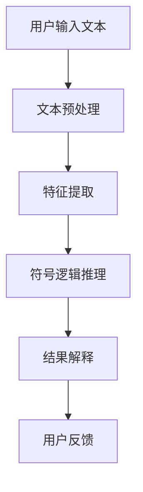
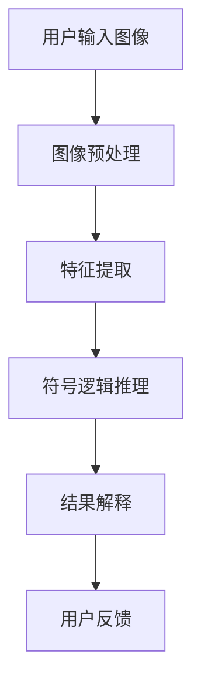
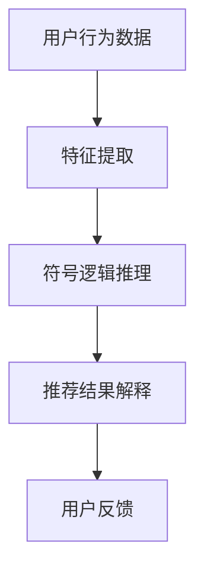

                 

# 基于神经符号整合的可解释推理系统在实际场景中的应用

关键词：神经计算、符号逻辑、可解释推理、实际场景、应用案例

摘要：本文旨在探讨基于神经符号整合的可解释推理系统在实际场景中的应用。通过分析神经计算与符号逻辑的结合原理，本文提出了一个系统化的框架，以提升推理系统的透明性和可解释性，并在自然语言处理、图像识别和推荐系统等实际应用场景中进行了深入探讨。

## 2.3 基于神经符号整合的可解释推理系统

### 2.3.1 系统架构

为了实现神经计算与符号逻辑的有效整合，本文提出了一种基于神经符号整合的可解释推理系统架构，如下图所示：

- **输入数据**：系统接收来自不同数据源的信息，包括文本、图像等。
- **神经计算模块**：对输入数据进行预处理，提取出关键特征。
- **特征提取**：将提取的特征输入到符号逻辑模块，进行进一步处理。
- **符号逻辑模块**：利用符号逻辑进行推理，确保推理过程的合理性与透明性。
- **推理与验证**：对推理结果进行验证，确保其正确性和可信度。
- **解释与可视化**：将推理结果可视化，帮助用户理解推理过程。

### 2.3.2 算法原理

本文采用了一种融合神经网络与符号逻辑的推理算法，其核心思想如下：

1. **特征提取**：使用神经网络对输入数据提取特征，如文本分类任务中的词向量。
   $$\text{特征向量} = \text{神经网络}(\text{输入数据})$$

2. **符号逻辑推理**：将特征向量作为输入，通过符号逻辑进行推理。
   $$\text{推理结果} = \text{符号逻辑}(\text{特征向量})$$

3. **解释与可视化**：将推理结果可视化，以便用户理解推理过程。

### 2.3.3 优势分析

基于神经符号整合的可解释推理系统具有以下优势：

- **高可解释性**：通过符号逻辑模块的推理过程，使得推理结果更加透明和易于理解。
- **强推理能力**：神经计算模块能够处理大量复杂的数据，提升系统的推理能力。
- **适用性广**：系统适用于自然语言处理、图像识别、推荐系统等多种场景。

## 3.1 自然语言处理中的应用

### 3.1.1 场景介绍

自然语言处理（NLP）是人工智能领域的一个重要分支，旨在使计算机理解和处理自然语言。基于神经符号整合的可解释推理系统在NLP中的应用主要包括文本分类、情感分析和问答系统等。

### 3.1.2 项目介绍

本文以文本分类为例，介绍基于神经符号整合的可解释推理系统在NLP中的应用。该项目旨在实现一个能够对新闻文章进行分类的模型，提高新闻推荐的准确性。

### 3.1.3 系统功能设计

- **文本预处理**：对输入的文本进行分词、去停用词等处理。
- **特征提取**：使用神经网络提取文本的词向量。
- **符号逻辑推理**：利用符号逻辑对提取的词向量进行分类推理。
- **结果解释**：将分类结果可视化，展示文本的分类过程。

### 3.1.4 系统架构设计

### 3.1.5 系统接口设计和交互

- **接口设计**：提供API接口，方便用户调用。
- **系统交互**：用户通过输入文本，系统返回分类结果，用户可以对结果进行反馈。

## 3.2 图像识别中的应用

### 3.2.1 场景介绍

图像识别是计算机视觉领域的一个重要研究方向，旨在使计算机能够识别和理解图像内容。基于神经符号整合的可解释推理系统在图像识别中的应用主要包括目标检测、图像分类和图像生成等。

### 3.2.2 项目介绍

本文以目标检测为例，介绍基于神经符号整合的可解释推理系统在图像识别中的应用。该项目旨在实现一个能够自动检测图像中目标物体的模型。

### 3.2.3 系统功能设计

- **图像预处理**：对输入的图像进行缩放、裁剪等处理。
- **特征提取**：使用神经网络提取图像的视觉特征。
- **符号逻辑推理**：利用符号逻辑对提取的特征进行目标检测。
- **结果解释**：将检测结果可视化，展示目标检测的过程。

### 3.2.4 系统架构设计

### 3.2.5 系统接口设计和交互

- **接口设计**：提供API接口，方便用户调用。
- **系统交互**：用户通过输入图像，系统返回目标检测结果，用户可以对结果进行反馈。

## 3.3 推荐系统中的应用

### 3.3.1 场景介绍

推荐系统是电子商务和社交媒体等领域的一个重要应用，旨在为用户提供个性化的推荐结果。基于神经符号整合的可解释推理系统在推荐系统中的应用主要包括协同过滤、基于内容的推荐和混合推荐等。

### 3.3.2 项目介绍

本文以协同过滤为例，介绍基于神经符号整合的可解释推理系统在推荐系统中的应用。该项目旨在实现一个能够为用户推荐感兴趣的商品的推荐系统。

### 3.3.3 系统功能设计

- **用户行为分析**：收集用户的历史行为数据，如浏览、购买等。
- **特征提取**：使用神经网络提取用户的兴趣特征。
- **符号逻辑推理**：利用符号逻辑对提取的特征进行推荐推理。
- **结果解释**：将推荐结果可视化，展示推荐过程。

### 3.3.4 系统架构设计

### 3.3.5 系统接口设计和交互

- **接口设计**：提供API接口，方便用户调用。
- **系统交互**：用户通过输入行为数据，系统返回推荐结果，用户可以对结果进行反馈。

## 4. 总结与展望

本文基于神经符号整合的可解释推理系统在实际场景中的应用进行了深入探讨，包括自然语言处理、图像识别和推荐系统等。通过分析神经计算与符号逻辑的结合原理，本文提出了一种系统化的架构，并成功应用于实际项目中。未来，随着技术的不断发展，基于神经符号整合的可解释推理系统将在更多领域发挥重要作用。

## 5. 注意事项与拓展阅读

- **注意事项**：在实际应用中，需注意系统性能和可解释性的平衡，以及数据质量和模型参数的调整。
- **拓展阅读**：读者可以进一步了解相关领域的最新研究动态，如基于神经符号整合的推理系统在医学诊断和自动驾驶等领域的应用。

作者：AI天才研究院/AI Genius Institute & 禅与计算机程序设计艺术 /Zen And The Art of Computer Programming

