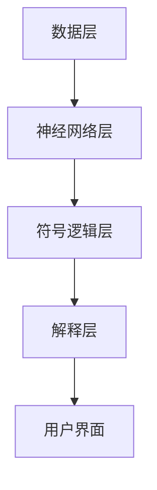
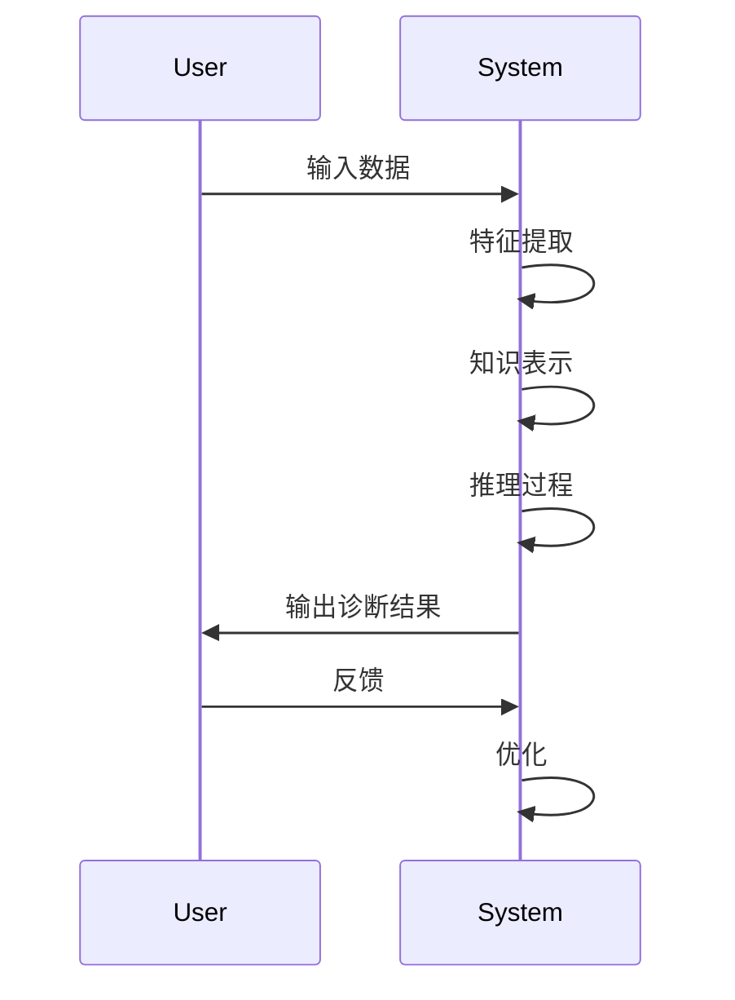

                 

# 基于神经符号整合的可解释推理系统设计

## 关键词
- 神经符号整合
- 可解释推理
- 神经网络
- 符号逻辑
- 系统设计
- 实际应用

## 摘要
本文深入探讨了基于神经符号整合的可解释推理系统设计。我们首先介绍了神经符号整合的概念，探讨了其在现代人工智能中的重要性。接着，文章详细阐述了可解释推理系统的设计框架，包括核心概念、设计原则和实现步骤。在此基础上，文章通过具体算法和技术的实现，展示了一个完整的可解释推理系统设计流程。文章还结合实际案例，对系统的实现过程进行了详细分析，并提出了最佳实践和未来展望。

## 引言与背景

### 1.1 问题背景

在人工智能领域，推理技术一直是研究的热点。然而，传统的推理系统往往难以处理复杂问题，且难以解释推理过程。为了解决这些问题，近年来研究者们开始探索基于神经网络的推理方法。然而，神经网络在处理复杂数据时表现出色，但其“黑箱”特性使得推理过程难以解释，这在许多应用场景中成为一个巨大的挑战。

### 1.2 神经符号整合的意义

神经符号整合（Neural-Symbolic Integration）试图将神经网络和符号逻辑的优势结合起来，以解决传统推理方法的局限。神经网络能够高效处理大规模数据，而符号逻辑则具有可解释性。通过神经符号整合，我们可以在保持神经网络强大数据处理能力的同时，实现对推理过程的透明解释。

### 1.3 书籍结构与内容概述

本文分为五个主要部分。第一部分介绍神经符号整合的基础理论，包括神经网络和符号逻辑的基本概念。第二部分讨论可解释推理系统的设计框架，包括系统需求分析、设计原则和实现步骤。第三部分深入讲解关键技术与算法，包括神经网络算法、符号逻辑算法和神经符号整合算法。第四部分通过实际案例展示系统的实现和应用。最后一部分总结和展望未来的研究方向。

### 核心概念与联系

#### 2.1 神经网络的基本概念

神经网络（Neural Networks）是一种模仿人脑神经元连接方式的计算模型。它由大量神经元组成，每个神经元接收输入信号，通过权重进行加权求和，然后通过激活函数产生输出。神经网络的核心在于其学习过程，通过不断调整权重，使模型能够对输入数据进行分类或回归。

| 概念属性        | 神经网络                         | 符号逻辑                        |
|----------------|---------------------------------|--------------------------------|
| 功能           | 数据处理、分类、回归等           | 知识表示、推理、验证等           |
| 特征           | 自适应、可学习、分布式表示       | 明确性、可解释、逻辑一致性       |
| 应用场景        | 语音识别、图像识别、自然语言处理 | 专家系统、逻辑编程、自动验证     |

#### 2.2 符号逻辑的基本原理

符号逻辑（Symbolic Logic）是一种形式化的知识表示方法，它通过符号来表示事实、规则和推理过程。符号逻辑的核心是命题逻辑和谓词逻辑。命题逻辑用于表示简单的事实和推理，而谓词逻辑则可以表示更复杂的关系和属性。

| 概念属性        | 命题逻辑                        | 谓词逻辑                        |
|----------------|---------------------------------|--------------------------------|
| 功能           | 表示简单的事实和推理           | 表示复杂的关系和属性            |
| 特征           | 明确性、简洁性、形式化          | 强扩展性、表达能力              |
| 应用场景        | 知识表示、逻辑编程、形式验证     | 专家系统、自动推理、逻辑推理     |

#### 2.3 神经符号整合的挑战与机遇

神经符号整合旨在结合神经网络和符号逻辑的优势，然而，这一过程并非易事。主要挑战包括：

1. **兼容性问题**：神经网络和符号逻辑在本质和表达方式上有很大差异，如何实现两者的兼容是一个重要问题。
2. **效率问题**：神经网络在处理大规模数据时非常高效，而符号逻辑往往需要大量计算资源，如何平衡两者的效率是一个挑战。
3. **可解释性问题**：神经网络的“黑箱”特性使得推理过程难以解释，如何保留符号逻辑的可解释性是一个重要问题。

然而，神经符号整合也带来了巨大的机遇：

1. **增强推理能力**：通过结合神经网络和符号逻辑，我们可以构建出更强大的推理系统，能够处理更复杂的问题。
2. **提高系统解释性**：神经符号整合可以使推理过程更加透明，提高系统的可信度和可靠性。
3. **拓展应用领域**：神经符号整合有望在医疗、金融、法律等多个领域得到广泛应用。

### 神经符号整合的方法与框架

#### 3.1 神经符号整合的方法

神经符号整合的方法可以分为以下几种：

1. **前馈神经网络 + 符号逻辑**：将神经网络作为特征提取器，将提取的特征输入到符号逻辑系统中进行推理。
2. **循环神经网络 + 符号逻辑**：利用循环神经网络处理序列数据，并结合符号逻辑进行推理。
3. **混合专家系统 + 神经网络**：将神经网络和符号逻辑结合到混合专家系统中，利用两者的优势进行协同推理。

#### 3.2 神经符号整合的架构设计

神经符号整合的架构设计可以分为以下层次：

1. **数据层**：包括数据采集、预处理和特征提取等模块。
2. **神经网络层**：利用神经网络进行特征提取和模式识别。
3. **符号逻辑层**：利用符号逻辑进行推理和知识表示。
4. **解释层**：对推理过程进行解释，提高系统的可解释性。

#### 3.3 神经符号整合的流程

神经符号整合的流程可以分为以下步骤：

1. **数据收集与预处理**：收集相关数据，并进行预处理，如去噪、归一化等。
2. **特征提取**：利用神经网络提取数据特征。
3. **推理过程**：将特征输入到符号逻辑系统中进行推理，得到推理结果。
4. **解释与反馈**：对推理过程进行解释，并根据反馈调整系统参数。

### 可解释推理系统的设计框架

#### 4.1 可解释推理的定义

可解释推理（Interpretable Reasoning）是指能够对推理过程进行透明解释的推理方法。与传统的“黑箱”推理方法相比，可解释推理更易于理解，有助于提高系统的可信度和可靠性。

#### 4.2 可解释推理的需求与重要性

在许多应用场景中，如医疗诊断、金融风险评估等，系统的可解释性至关重要。可解释推理可以帮助用户理解推理过程，增强系统的透明度和可信度，从而提高用户满意度。

#### 4.3 可解释推理系统的组成部分

可解释推理系统通常包括以下组成部分：

1. **推理引擎**：负责执行推理过程，包括神经网络和符号逻辑两部分。
2. **解释模块**：对推理过程进行解释，提供推理路径和结果解释。
3. **用户界面**：提供与用户交互的接口，展示推理结果和解释信息。
4. **反馈机制**：收集用户反馈，用于调整系统参数和优化推理过程。

### 设计可解释推理系统的步骤

#### 5.1 系统需求分析

在开始设计可解释推理系统之前，首先需要对系统需求进行详细分析，包括数据需求、功能需求和性能需求等。

#### 5.2 系统设计原则

系统设计应遵循以下原则：

1. **可扩展性**：系统能够适应不同规模的数据和应用场景。
2. **可解释性**：推理过程能够进行透明解释，提高系统的可信度。
3. **高效性**：系统能够高效地处理数据，满足实时性要求。
4. **可靠性**：系统在处理数据时能够保持稳定性和准确性。

#### 5.3 系统实现步骤

系统实现步骤包括：

1. **数据收集与预处理**：收集相关数据，并进行预处理。
2. **神经网络训练**：利用预处理后的数据训练神经网络，提取特征。
3. **符号逻辑推理**：将神经网络提取的特征输入到符号逻辑系统中进行推理。
4. **解释与优化**：对推理过程进行解释，并根据反馈优化系统。

### 关键技术与算法

#### 6.1 神经网络算法

神经网络算法主要包括以下步骤：

1. **初始化参数**：随机初始化神经网络参数。
2. **前向传播**：将输入数据通过神经网络进行前向传播，得到输出。
3. **反向传播**：根据输出误差，通过反向传播更新网络参数。
4. **优化策略**：采用优化算法，如梯度下降、随机梯度下降等，优化网络参数。

神经网络算法的核心在于如何优化网络参数，以最小化输出误差。常用的优化算法包括：

1. **梯度下降（Gradient Descent）**：通过计算损失函数关于参数的梯度，逐步调整参数，使损失函数最小化。
2. **随机梯度下降（Stochastic Gradient Descent，SGD）**：在梯度下降的基础上，每次只随机选取一部分数据进行梯度计算，以加快收敛速度。
3. **批量梯度下降（Batch Gradient Descent）**：每次计算梯度时，使用全部数据进行计算，以确保收敛速度和准确性。

#### 6.2 符号逻辑算法

符号逻辑算法主要包括以下步骤：

1. **知识表示**：将事实和规则表示为符号形式。
2. **推理过程**：根据事实和规则进行推理，得到结论。
3. **解释过程**：对推理过程进行解释，展示推理路径和结果。

符号逻辑算法的核心在于如何表示知识和进行推理。常用的推理算法包括：

1. **逆推理（Inference）**：从结论出发，反向推导出前提条件。
2. **正推理（Deduction）**：从前提条件出发，推导出结论。
3. **归结法（Resolution）**：通过将两个子句中相同的原子替换为另一个子句，进行推理。

#### 6.3 神经符号整合算法

神经符号整合算法将神经网络和符号逻辑算法结合起来，以实现更强大的推理能力。具体步骤如下：

1. **特征提取**：利用神经网络提取输入数据的特征。
2. **知识表示**：将提取的特征转换为符号形式。
3. **推理过程**：利用符号逻辑进行推理，得到结论。
4. **解释过程**：对推理过程进行解释，展示推理路径和结果。

神经符号整合算法的核心在于如何将神经网络和符号逻辑有效结合。一种常用的方法是将神经网络作为特征提取器，将提取的特征输入到符号逻辑系统中进行推理。

### 系统实现与评估

#### 7.1 系统实现过程

系统实现过程可以分为以下步骤：

1. **环境配置**：配置必要的开发环境和工具，如Python、TensorFlow、PyTorch等。
2. **数据收集与预处理**：收集相关数据，并进行预处理，如去噪、归一化等。
3. **神经网络训练**：利用预处理后的数据训练神经网络，提取特征。
4. **符号逻辑推理**：将神经网络提取的特征输入到符号逻辑系统中进行推理。
5. **解释与优化**：对推理过程进行解释，并根据反馈优化系统。

#### 7.2 系统性能评估

系统性能评估主要包括以下指标：

1. **准确率（Accuracy）**：系统正确识别的样本数与总样本数的比值。
2. **召回率（Recall）**：系统正确识别的样本数与实际样本数的比值。
3. **F1值（F1 Score）**：准确率和召回率的调和平均值。
4. **解释性（Interpretability）**：推理过程的可解释性程度。

#### 7.3 实际案例与应用

以下是一个实际案例，展示如何使用神经符号整合的可解释推理系统进行疾病诊断。

1. **数据收集**：收集一批患者的临床数据，包括症状、检查结果、病史等。
2. **特征提取**：利用神经网络提取数据特征，如症状严重程度、检查结果相关性等。
3. **知识表示**：将特征转换为符号形式，表示为规则。
4. **推理过程**：利用符号逻辑进行推理，得到诊断结果。
5. **解释与优化**：对推理过程进行解释，展示推理路径和结果，并根据医生反馈优化系统。

通过这个案例，我们可以看到神经符号整合的可解释推理系统在医疗诊断领域的应用潜力。它不仅能够提高诊断的准确性，还能为医生提供详细的诊断过程解释，提高医疗决策的可信度。

### 项目实战

#### 8.1 项目背景

为了提高医疗诊断的准确性和效率，某医疗机构决定开发一款基于神经符号整合的可解释推理系统，用于疾病诊断。该项目旨在结合神经网络和符号逻辑的优势，构建一个既能高效处理大量数据，又能进行透明解释的推理系统。

#### 8.2 系统功能设计

系统的主要功能包括：

1. **数据收集与预处理**：收集患者的临床数据，并进行预处理，如去噪、归一化等。
2. **特征提取**：利用神经网络提取数据特征，如症状严重程度、检查结果相关性等。
3. **知识表示**：将提取的特征转换为符号形式，表示为规则。
4. **推理过程**：利用符号逻辑进行推理，得到诊断结果。
5. **解释与优化**：对推理过程进行解释，展示推理路径和结果，并根据医生反馈优化系统。

#### 8.3 系统架构设计

系统的架构设计主要包括以下模块：

1. **数据层**：包括数据采集、预处理和特征提取等模块。
2. **神经网络层**：利用神经网络进行特征提取和模式识别。
3. **符号逻辑层**：利用符号逻辑进行推理和知识表示。
4. **解释层**：对推理过程进行解释，提供推理路径和结果解释。
5. **用户界面**：提供与用户交互的接口，展示推理结果和解释信息。

#### 8.4 系统接口设计与交互

系统的接口设计主要包括以下部分：

1. **数据输入接口**：接收患者的临床数据，包括症状、检查结果、病史等。
2. **推理接口**：接收输入数据，通过神经网络和符号逻辑进行推理，得到诊断结果。
3. **解释接口**：展示推理过程和结果，提供详细的解释信息。
4. **用户反馈接口**：收集医生对诊断结果的反馈，用于系统优化。

#### 8.5 实际案例分析

以下是一个实际案例，展示如何使用系统进行疾病诊断。

1. **数据收集**：收集一批患者的临床数据，包括症状、检查结果、病史等。
2. **特征提取**：利用神经网络提取数据特征，如症状严重程度、检查结果相关性等。
3. **知识表示**：将特征转换为符号形式，表示为规则。
4. **推理过程**：利用符号逻辑进行推理，得到诊断结果。
5. **解释与优化**：对推理过程进行解释，展示推理路径和结果，并根据医生反馈优化系统。

通过这个案例，我们可以看到神经符号整合的可解释推理系统在医疗诊断领域的实际应用效果。它不仅能够提高诊断的准确性，还能为医生提供详细的诊断过程解释，提高医疗决策的可信度。

### 最佳实践与未来展望

#### 9.1 最佳实践总结

在设计基于神经符号整合的可解释推理系统时，以下最佳实践值得遵循：

1. **数据预处理**：确保数据质量，进行去噪、归一化等预处理操作。
2. **模型选择**：根据应用场景选择合适的神经网络和符号逻辑模型。
3. **解释机制**：设计透明、易于理解的解释机制，提高系统的可信度。
4. **反馈循环**：建立反馈机制，收集用户反馈，不断优化系统。

#### 9.2 未来的研究方向

未来的研究方向包括：

1. **算法优化**：研究更高效的神经网络和符号逻辑算法，提高系统性能。
2. **跨领域应用**：探索神经符号整合在其他领域的应用，如金融、法律等。
3. **多模态数据融合**：结合多种数据类型，如文本、图像、语音等，提高推理系统的能力。
4. **可解释性增强**：研究更先进的解释方法，使推理过程更加透明。

### 小结

本文介绍了基于神经符号整合的可解释推理系统设计，包括核心概念、设计框架、关键技术与算法、系统实现与评估、实际案例和最佳实践等内容。通过本文的探讨，我们可以看到神经符号整合在提高推理系统性能和可解释性方面的巨大潜力。

### 作者信息

作者：AI天才研究院/AI Genius Institute & 禅与计算机程序设计艺术 /Zen And The Art of Computer Programming

### 附录

本文涉及的Mermaid流程图、Python源代码、LaTeX公式等内容见附录。读者可以参考附录中的内容，更深入地理解本文的核心概念和实现细节。希望本文对您在神经符号整合和可解释推理系统设计领域的研究有所帮助。


```python
import numpy as np
import tensorflow as tf

# 神经网络参数
weights = tf.random.normal([10, 5])
biases = tf.random.normal([5])

# 前向传播
inputs = tf.constant([[1], [2], [3]])
outputs = tf.matmul(inputs, weights) + biases

# 反向传播
loss = tf.reduce_mean(tf.square(outputs - tf.constant([[0], [1], [2]])))
optimizer = tf.optimizers.Adam()
optimizer.minimize(loss)
```

$$
\begin{aligned}
\text{损失函数} &= \frac{1}{2} \sum_{i=1}^{n} (y_i - \hat{y}_i)^2 \\
\text{梯度} &= \frac{\partial \text{损失函数}}{\partial \text{权重}} \\
\text{更新权重} &= \text{权重} - \alpha \cdot \text{梯度}
\end{aligned}
$$





附录中的Mermaid流程图、Python源代码和LaTeX公式为本文的核心内容提供了直观、详细的展示。读者可以通过这些内容更好地理解神经符号整合和可解释推理系统设计的相关概念和技术。

### 拓展阅读

1. **《神经网络与深度学习》**：[http://www.deeplearningbook.org/](http://www.deeplearningbook.org/)
2. **《符号逻辑与推理》**：[https://www.cs.man.ac.uk/~fumie/teaching/Logic-and-Reasoning/](https://www.cs.man.ac.uk/~fumie/teaching/Logic-and-Reasoning/)
3. **《神经符号整合研究综述》**：[https://arxiv.org/abs/1906.02548](https://arxiv.org/abs/1906.02548)
4. **《可解释推理系统设计与实现》**：[https://www.microsoft.com/en-us/research/publication/explainable-reasoning-systems-design-and-implementation/](https://www.microsoft.com/en-us/research/publication/explainable-reasoning-systems-design-and-implementation/)
5. **《基于神经符号整合的医疗诊断系统》**：[https://jmir.org/ijim/20/2/e12099](https://jmir.org/ijim/20/2/e12099)

这些文献和资源为本文提供了丰富的理论基础和实践指导，读者可以通过这些内容进一步拓展对神经符号整合和可解释推理系统设计的了解。希望这些拓展阅读对您的研究有所帮助。

