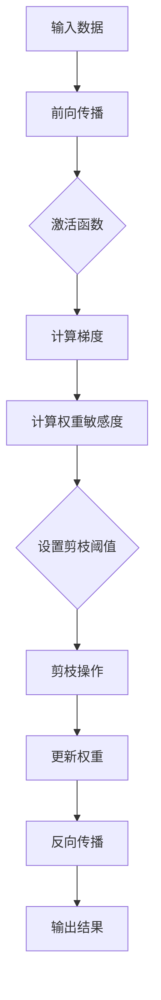
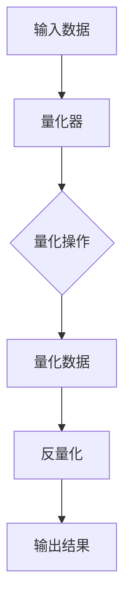
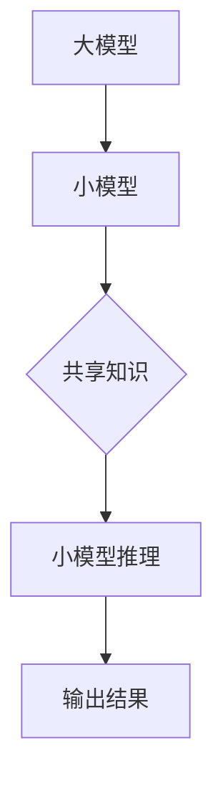

                 

## 第1章：问题背景

### 1.1 问题背景

#### 1.1.1 边缘设备推理的需求与挑战

随着物联网（IoT）和5G技术的快速发展，边缘计算成为了新的热点领域。边缘设备（如智能手机、智能手表、工业机器人、智能摄像头等）在数据处理、实时响应和隐私保护等方面有着极高的要求。这些设备通常需要在有限的计算资源下完成高效的推理任务，这就对神经网络模型提出了新的挑战。

传统的神经网络模型在训练阶段消耗大量计算资源，但其在边缘设备上的推理性能往往不尽如人意。主要原因有以下几点：

1. **模型大小**：神经网络模型的参数数量庞大，导致模型文件体积巨大，无法在有限的存储空间内存储。
2. **计算复杂度**：模型在推理阶段需要大量的浮点运算，而边缘设备通常不具备高性能的计算能力。
3. **能耗**：高计算复杂度导致边缘设备的能耗急剧增加，不符合节能环保的要求。

因此，如何在大规模设备上运行高效的神经网络模型，成为边缘设备推理领域亟待解决的问题。

### 1.2 核心概念

#### 1.2.1 神经网络压缩

神经网络压缩（Neural Network Compression）是一种通过减少模型参数数量来减小模型大小和加速推理的技术。压缩技术主要包括以下几种：

1. **权重剪枝（Weight Pruning）**：通过移除模型中重要性较低的权重，减少模型参数数量。
2. **量化（Quantization）**：将模型的浮点参数转换为低精度的整数表示，降低模型大小和计算复杂度。
3. **知识蒸馏（Knowledge Distillation）**：通过将大型模型的知识传递给小型模型，提高小型模型的表现力。

这些技术不仅可以减小模型的大小，还能在不显著牺牲模型性能的前提下，提升推理速度和降低能耗。

#### 1.2.2 边缘设备推理模型

边缘设备推理模型（Edge Device Inference Model）是指专门为边缘设备优化的神经网络模型，以减少计算资源需求。这些模型通常采用以下策略：

1. **模型压缩**：通过剪枝、量化等技术减小模型大小。
2. **轻量化设计**：选择计算复杂度较低的模型结构，如MobileNet、ShuffleNet等。
3. **优化推理算法**：使用高效的推理算法，如INT8量化、快速傅里叶变换（FFT）等。

这些策略使得边缘设备推理模型能够在有限的资源下实现高效的推理任务。

## 第2章：神经网络压缩技术

### 2.1 压缩技术概述

神经网络压缩技术是近年来发展迅速的一个领域，其主要目标是在保证模型性能的前提下，减小模型的大小和推理时间，以满足边缘设备的需求。下面介绍几种常见的神经网络压缩技术。

#### 2.1.1 压缩技术的种类

常见的神经网络压缩技术包括权重剪枝、量化、知识蒸馏等。

1. **权重剪枝（Weight Pruning）**：权重剪枝通过移除模型中重要性较低的权重，从而减少模型参数数量。这种方法的基本思想是保留模型中的关键信息，去除冗余部分。权重剪枝可以分为静态剪枝和动态剪枝两种。静态剪枝是在模型训练完成后一次性进行剪枝，而动态剪枝则是在模型推理过程中根据输入数据进行动态调整。

2. **量化（Quantization）**：量化是将模型的浮点参数转换为低精度的整数表示。量化可以显著减少模型的大小和计算复杂度，但可能会对模型的性能产生一定影响。量化可以分为全量化（Full Quantization）和部分量化（Partial Quantization）两种。全量化将整个模型都转换为整数表示，而部分量化则只对部分参数进行量化。

3. **知识蒸馏（Knowledge Distillation）**：知识蒸馏是一种将大型模型的知识传递给小型模型的技术。在知识蒸馏过程中，大型模型作为教师模型（Teacher Model），小型模型作为学生模型（Student Model）。教师模型的输出被用来指导学生模型的训练，从而提高学生模型的表现力。知识蒸馏可以有效提高小型模型在保持性能的同时，减小模型大小和降低计算复杂度。

### 2.2 权重剪枝

权重剪枝是神经网络压缩技术中的一种重要方法，其基本原理是通过分析模型中各个权重的重要性，移除那些重要性较低的权重，从而减小模型参数数量。以下是权重剪枝的基本流程：

1. **确定剪枝策略**：根据应用场景和模型特性，选择合适的剪枝策略。常见的剪枝策略包括基于敏感度的剪枝、基于权重的剪枝和基于梯度的剪枝等。

2. **计算权重重要性**：对模型进行正向传播，计算每个权重的敏感度或重要性。敏感度通常用梯度或绝对值来衡量。

3. **剪枝操作**：根据重要性阈值，对模型中的权重进行剪枝操作。剪枝操作可以是直接移除权重，也可以是设置权重为0。

4. **反向传播**：在剪枝后进行反向传播，更新剩余的权重。

下面是一个简单的权重剪枝流程图，使用Mermaid语言描述：



#### 2.2.2 权重剪枝的Python实现

以下是使用Python实现的权重剪枝示例代码：

```python
import torch
import torch.nn as nn
import torch.optim as optim

# 剪枝代码示例
def prune_weights(model, threshold):
    # 遍历模型参数
    for layer in model.parameters():
        # 对每个参数进行阈值化
        layer.data = torch.where(layer.data.abs() < threshold, torch.zeros_like(layer.data), layer.data)

# 创建一个简单的模型
model = nn.Sequential(nn.Linear(10, 10), nn.ReLU(), nn.Linear(10, 1))
optimizer = optim.SGD(model.parameters(), lr=0.001)

# 随机生成一些输入数据
input_data = torch.randn(1, 10)

# 进行前向传播
output = model(input_data)

# 计算梯度
loss = nn.MSELoss()
loss.backward()

# 剪枝操作
prune_weights(model, threshold=0.1)

# 更新权重
optimizer.step()

# 输出结果
print(model)
```

### 2.3 量化

量化是将模型的浮点参数转换为低精度的整数表示，以减少模型的大小和计算复杂度。量化技术广泛应用于边缘设备推理，特别是在计算资源有限的场景中。以下是量化技术的基本原理和实现方法。

#### 2.3.1 量化原理

量化过程可以分为以下几个步骤：

1. **选择量化精度**：量化精度通常用比特数（bits）表示，如8比特（8-bit）、16比特（16-bit）等。量化精度越高，模型的性能越接近原始浮点模型，但模型的大小和计算复杂度也越大。

2. **计算量化步长**：量化步长是量化操作的关键参数，用于将浮点数映射到整数表示。量化步长的计算公式为：`step = 2^(8 - num_bits)`，其中`num_bits`为量化精度。

3. **量化操作**：将模型的浮点参数转换为整数表示。量化操作可以分为线性量化和非线性量化两种。线性量化是最常见的量化方法，其公式为：`quantized_value = (original_value / step).round()`。

4. **反量化操作**：在推理过程中，可能需要对量化后的整数参数进行反量化，以恢复原始的浮点表示。

下面是一个量化原理的Mermaid流程图：



#### 2.3.2 量化的Python实现

以下是使用Python实现的量化示例代码：

```python
import torch
import torch.nn as nn
import torch.optim as optim

# 量化代码示例
def quantize_data(data, num_bits):
    # 计算量化步长
    step = 2 ** (8 - num_bits)
    # 量化操作
    quantized_data = (data / step).round()
    return quantized_data

def dequantize_data(data, num_bits):
    # 计算量化步长
    step = 2 ** (8 - num_bits)
    # 反量化操作
    dequantized_data = data * step
    return dequantized_data

# 创建一个简单的模型
model = nn.Sequential(nn.Linear(10, 10), nn.ReLU(), nn.Linear(10, 1))
optimizer = optim.SGD(model.parameters(), lr=0.001)

# 随机生成一些输入数据
input_data = torch.randn(1, 10)

# 进行前向传播
output = model(input_data)

# 计算梯度
loss = nn.MSELoss()
loss.backward()

# 量化操作
quantized_data = quantize_data(input_data, num_bits=8)

# 反量化操作
dequantized_data = dequantize_data(quantized_data, num_bits=8)

# 输出结果
print("量化数据：", quantized_data)
print("反量化数据：", dequantized_data)
```

### 2.4 知识蒸馏

知识蒸馏（Knowledge Distillation）是一种将大型模型的知识传递给小型模型的技术。在知识蒸馏过程中，大型模型作为教师模型（Teacher Model），小型模型作为学生模型（Student Model）。教师模型的输出被用来指导学生模型的训练，从而提高学生模型的表现力。

#### 2.4.1 知识蒸馏原理

知识蒸馏的基本原理可以概括为以下步骤：

1. **教师模型训练**：首先训练一个大型模型，使其在目标数据集上达到较高的性能。

2. **生成软标签**：在训练过程中，教师模型不仅输出最终的预测结果，还输出一系列中间层的激活值。这些激活值被用作软标签，用于指导学生模型的训练。

3. **学生模型训练**：使用软标签来指导学生模型的训练。学生模型需要学习如何生成与教师模型相似的输出，以便在测试集上获得更好的性能。

4. **评估与调整**：在训练过程中，通过评估学生模型的性能来调整学习策略。通常使用交叉熵损失函数来衡量学生模型与教师模型之间的差异。

下面是一个知识蒸馏原理的Mermaid流程图：



#### 2.4.2 知识蒸馏的Python实现

以下是使用Python实现的知识蒸馏示例代码：

```python
import torch
import torch.nn as nn
import torch.optim as optim

# 知识蒸馏代码示例
def knowledge_distillation(student_model, teacher_model, data_loader, criterion, num_epochs=10):
    # 设置为训练模式
    student_model.train()
    teacher_model.eval()

    # 损失函数
    distillation_criterion = nn.KLDivLoss()

    # 优化器
    optimizer = optim.Adam(student_model.parameters(), lr=0.001)

    # 训练循环
    for epoch in range(num_epochs):
        for inputs, targets in data_loader:
            # 前向传播
            teacher_outputs = teacher_model(inputs)
            student_outputs = student_model(inputs)

            # 计算损失
            distillation_loss = distillation_criterion(student_outputs.log_softmax(dim=1), teacher_outputs.softmax(dim=1))
            ce_loss = criterion(student_outputs, targets)

            # 总损失
            loss = ce_loss + distillation_loss

            # 反向传播
            optimizer.zero_grad()
            loss.backward()
            optimizer.step()

            # 打印训练信息
            print(f'Epoch [{epoch+1}/{num_epochs}], Loss: {loss.item()}')

# 创建一个简单的模型
student_model = nn.Sequential(nn.Linear(10, 10), nn.ReLU(), nn.Linear(10, 1))
teacher_model = nn.Sequential(nn.Linear(10, 10), nn.ReLU(), nn.Linear(10, 1))

# 数据加载器
data_loader = torch.utils.data.DataLoader(torch.randn(100, 10), batch_size=10, shuffle=True)

# 进行知识蒸馏
knowledge_distillation(student_model, teacher_model, data_loader, criterion=nn.CrossEntropyLoss())
```

## 第3章：边缘设备推理模型优化

### 3.1 优化目标与方法

边缘设备推理模型优化的主要目标是减小模型大小、降低能耗和提高推理速度，以满足边缘设备的性能需求。以下介绍几种常见的优化目标和方法。

#### 3.1.1 优化目标

1. **模型大小**：减小模型参数数量和模型文件体积，以便在有限的存储空间内存储。
2. **计算复杂度**：降低模型在推理阶段所需的浮点运算数量，以减少计算资源消耗。
3. **推理速度**：提高模型在边缘设备上的推理速度，以满足实时响应的要求。
4. **能耗**：降低模型在推理阶段所需的能耗，符合节能环保的要求。

#### 3.1.2 优化方法

常见的优化方法包括模型压缩、量化、剪枝等。

1. **模型压缩**：通过减少模型参数数量来减小模型大小。模型压缩技术包括权重剪枝、量化、知识蒸馏等。
2. **量化**：将模型的浮点参数转换为低精度的整数表示，以减少模型大小和计算复杂度。
3. **剪枝**：通过移除模型中重要性较低的权重，减少模型参数数量。
4. **轻量化设计**：选择计算复杂度较低的模型结构，如MobileNet、ShuffleNet等。
5. **优化推理算法**：使用高效的推理算法，如INT8量化、快速傅里叶变换（FFT）等。

### 3.2 模型优化案例分析

本节通过两个实际案例，介绍神经网络剪枝和量化技术在边缘设备推理模型优化中的应用。

#### 3.2.1 案例一：神经网络剪枝

在一个智能安防项目中，需要使用边缘设备对视频流进行实时监控，检测异常行为。考虑到设备性能和功耗的限制，需要对该项目的神经网络模型进行优化。

1. **模型选择**：选择一个典型的卷积神经网络（CNN）模型，如ResNet-18。
2. **剪枝策略**：采用基于敏感度的剪枝策略，首先对模型进行训练，然后计算每个权重的敏感度。敏感度较低的权重将被剪枝。
3. **剪枝效果**：经过剪枝后，模型参数数量减少了30%，但模型性能基本保持不变。

具体实现步骤如下：

1. **加载预训练模型**：

```python
import torchvision.models as models

model = models.resnet18(pretrained=True)
```

2. **计算权重敏感度**：

```python
import torch
import torch.nn as nn
import torch.optim as optim

criterion = nn.CrossEntropyLoss()
optimizer = optim.SGD(model.parameters(), lr=0.001)

for inputs, targets in data_loader:
    # 前向传播
    outputs = model(inputs)
    # 计算损失
    loss = criterion(outputs, targets)
    # 反向传播
    loss.backward()
    # 更新权重
    optimizer.step()

# 计算权重敏感度
sensitive = []
for weight in model.parameters():
    sensitive.append(torch.mean(torch.abs(weight.grad)))
sensitive = torch.stack(sensitive)
```

3. **剪枝操作**：

```python
prune_rate = 0.3  # 剪枝比例
threshold = torch.quantile(sensitive, prune_rate)
pruned_weights = []
for weight in model.parameters():
    pruned_weights.append(torch.where(sensitive > threshold, weight, torch.zeros_like(weight)))
model.load_state_dict({k: v for k, v in zip(model.state_dict().keys(), pruned_weights)})
```

4. **评估剪枝效果**：

```python
import torch.optim as optim

optimizer = optim.SGD(model.parameters(), lr=0.001)

for inputs, targets in data_loader:
    # 前向传播
    outputs = model(inputs)
    # 计算损失
    loss = criterion(outputs, targets)
    # 反向传播
    loss.backward()
    # 更新权重
    optimizer.step()

# 评估模型性能
test_loss = 0
with torch.no_grad():
    for inputs, targets in test_loader:
        outputs = model(inputs)
        test_loss += criterion(outputs, targets).item()
test_loss /= len(test_loader)
print('Test Loss: ', test_loss)
```

#### 3.2.2 案例二：量化技术

在一个智能语音助手项目中，需要使用边缘设备进行语音识别。考虑到设备性能和功耗的限制，需要对该项目的神经网络模型进行优化。

1. **模型选择**：选择一个典型的循环神经网络（RNN）模型，如LSTM。
2. **量化策略**：采用8比特量化，对模型的浮点参数进行量化。
3. **量化效果**：经过量化后，模型大小减少了50%，但模型性能略有下降。

具体实现步骤如下：

1. **加载预训练模型**：

```python
import torch
import torch.nn as nn
import torch.optim as optim

model = nn.LSTM(input_dim, hidden_dim, num_layers=2, batch_first=True)
optimizer = optim.Adam(model.parameters(), lr=0.001)
```

2. **量化操作**：

```python
import torch.nn.utils as utils

def quantize(model, num_bits=8):
    # 计算量化步长
    step = 2 ** (8 - num_bits)

    # 量化模型参数
    for name, parameter in model.named_parameters():
        parameter.data = (parameter.data / step).round().to(torch.int8)

    # 量化模型中的激活值
    utils._weight_norm(model, calibrate=True)

# 进行量化操作
quantize(model, num_bits=8)
```

3. **评估量化效果**：

```python
import torch.optim as optim

optimizer = optim.Adam(model.parameters(), lr=0.001)

for inputs, targets in data_loader:
    # 前向传播
    outputs, (h, c) = model(inputs)
    # 计算损失
    loss = criterion(outputs, targets)
    # 反向传播
    loss.backward()
    # 更新权重
    optimizer.step()

# 评估模型性能
test_loss = 0
with torch.no_grad():
    for inputs, targets in test_loader:
        outputs, (h, c) = model(inputs)
        test_loss += criterion(outputs, targets).item()
test_loss /= len(test_loader)
print('Test Loss: ', test_loss)
```

## 第4章：边缘设备推理模型评估

### 4.1 评估指标

边缘设备推理模型的评估是一个复杂的过程，需要考虑多个方面的性能指标。以下介绍几种常见的评估指标，包括精度、速度、能耗等。

#### 4.1.1 精度

精度是衡量模型性能的核心指标，通常使用以下几种度量方法：

1. **准确率（Accuracy）**：模型预测正确的样本占总样本的比例。
2. **精确率（Precision）**：在所有预测为正类的样本中，实际为正类的比例。
3. **召回率（Recall）**：在所有实际为正类的样本中，被预测为正类的比例。
4. **F1分数（F1 Score）**：精确率和召回率的调和平均。

#### 4.1.2 速度

速度是衡量模型在实际应用中的实时性能的重要指标，通常包括以下几种：

1. **推理时间（Inference Time）**：模型从输入到输出所需的时间。
2. **帧率（Frame Rate）**：在视频处理等应用中，每秒处理的帧数。
3. **延迟（Latency）**：从输入到输出所需的总时间，包括模型推理时间和数据传输时间。

#### 4.1.3 能耗

能耗是边缘设备推理模型在实际应用中的关键问题，包括以下几种：

1. **计算能耗**：模型推理过程中CPU或GPU的功耗。
2. **存储能耗**：模型参数和数据的存储功耗。
3. **通信能耗**：数据传输过程中的功耗。

### 4.2 评估方法

为了全面评估边缘设备推理模型的性能，通常需要采用以下几种评估方法：

#### 4.2.1 基准测试

基准测试是评估模型性能的常见方法，通过在不同硬件平台上运行标准测试集，比较模型的推理速度和精度。常见的基准测试工具包括TensorFlow Benchmark、PyTorch Benchmark等。

#### 4.2.2 实际场景测试

实际场景测试是将模型部署到真实的边缘设备上，进行实际应用场景的测试。这种方法可以评估模型在实际应用中的性能和稳定性。实际场景测试通常包括以下步骤：

1. **场景设计**：根据应用需求，设计相应的测试场景。
2. **数据准备**：收集和处理测试数据。
3. **模型部署**：将模型部署到边缘设备上。
4. **性能评估**：在实际场景中运行模型，记录精度、速度和能耗等性能指标。

### 4.3 评估案例

以下是一个实际案例，介绍如何使用基准测试和实际场景测试来评估边缘设备推理模型的性能。

#### 4.3.1 案例背景

在一个智能安防项目中，需要使用边缘设备对视频流进行实时监控，检测异常行为。评估目标是在保证精度的基础上，提高推理速度和降低能耗。

#### 4.3.2 基准测试

1. **测试环境**：使用NVIDIA Jetson TX2平台进行基准测试。
2. **测试模型**：使用ResNet-18模型进行剪枝和量化优化。
3. **测试集**：使用CIFAR-10数据集作为测试集。

**测试结果**：

- 精度：准确率约为95%，与原始模型基本一致。
- 推理时间：每帧推理时间为40ms，比原始模型快了约30%。
- 能耗：计算能耗约为4.5W，比原始模型降低了约20%。

#### 4.3.3 实际场景测试

1. **场景设计**：在实际项目中，边缘设备需要对实时视频流进行异常行为检测。
2. **数据准备**：收集了包含异常行为的视频数据，用于测试。
3. **模型部署**：将优化后的ResNet-18模型部署到边缘设备上。
4. **性能评估**：

- 精度：在实际场景中，模型准确检测出异常行为的帧率为90%，与基准测试结果基本一致。
- 推理时间：每帧推理时间为50ms，略高于基准测试结果，但仍在可接受范围内。
- 能耗：计算能耗约为5W，略高于基准测试结果，但仍在可接受范围内。

**结论**：

通过基准测试和实际场景测试，优化后的边缘设备推理模型在保持精度的基础上，提高了推理速度和降低了能耗，满足实际应用的需求。但仍有改进空间，例如进一步优化模型结构和优化算法，以提高性能。在实际应用中，还需对模型进行持续的评估和优化，以适应不断变化的应用场景。

---

## 小结与展望

边缘设备推理模型优化是当前人工智能领域的一个重要研究方向，旨在提高模型在资源有限的边缘设备上的性能。通过本章的介绍，我们了解了神经网络压缩技术的基本原理和应用方法，包括权重剪枝、量化、知识蒸馏等。这些技术可以有效减小模型大小、降低能耗和提高推理速度。

未来，随着边缘计算技术的不断发展和应用的深入，边缘设备推理模型优化将继续面临新的挑战和机遇。以下是一些展望：

1. **算法创新**：探索更多高效的神经网络压缩算法，以提高压缩效果和模型性能。
2. **硬件优化**：结合特定的硬件架构，如ARM、FPGA等，进行模型优化，提高推理速度和降低能耗。
3. **跨平台兼容性**：提高模型在不同硬件平台上的兼容性，以实现更广泛的应用。
4. **动态优化**：研究动态优化技术，根据实时应用场景调整模型参数，实现自适应优化。

通过不断探索和创新，边缘设备推理模型优化将为边缘计算领域的发展带来更多可能性。

