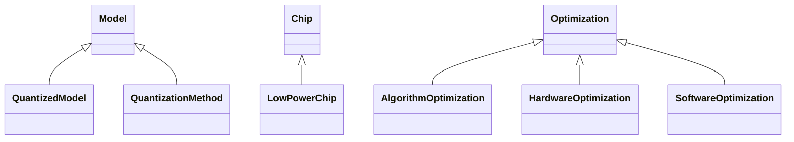
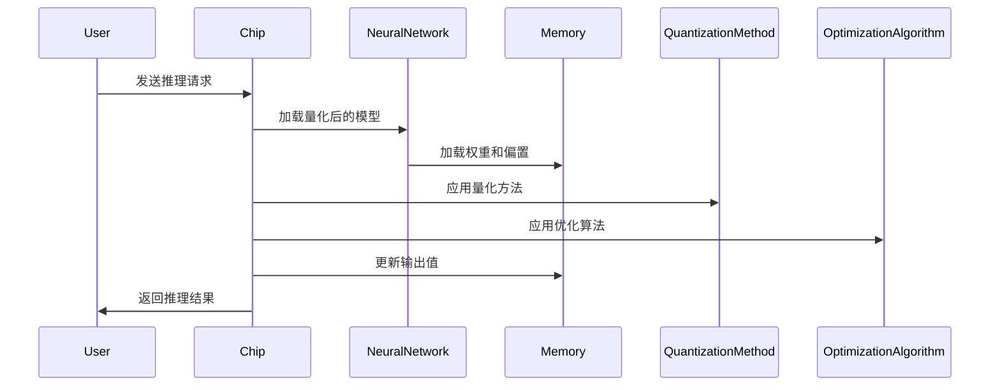
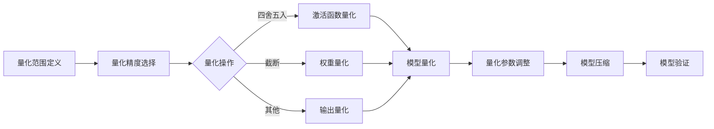
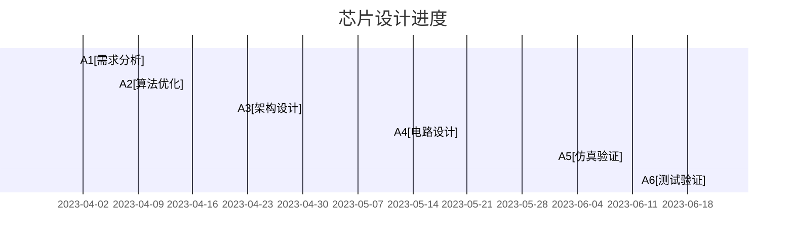

                 

# 基于神经网络量化的超低功耗推理芯片设计

## 关键词
神经网络量化、超低功耗、推理芯片、设计优化、算法协同、性能功耗平衡

## 摘要
本文旨在探讨基于神经网络量化的超低功耗推理芯片设计，分析了神经网络量化技术的基础理论与应用，以及超低功耗推理芯片的设计架构和优化策略。文章首先介绍了神经网络量化的概念及其重要性，随后详细讲解了量化方法、数学模型和芯片设计。接着，文章阐述了超低功耗推理芯片的设计原则、优化策略和验证方法。通过案例分析，展示了神经网络量化在超低功耗推理芯片中的应用效果。最后，文章对未来的研究方向和市场前景进行了展望。

## 目录大纲

### 第一部分：背景与基础理论
- 1.1 神经网络量化技术概述
- 1.2 超低功耗推理芯片的重要性
- 1.3 神经网络量化与超低功耗芯片的关系

### 第二部分：神经网络量化原理
- 2.1 神经网络量化技术基础
- 2.2 量化方法及其优缺点
  - 2.2.1 整数量化
  - 2.2.2 二进制量化
  - 2.2.3 其他量化方法
- 2.3 神经网络量化的数学模型
  - 2.3.1 激活函数量化
  - 2.3.2 权重量化
  - 2.3.3 输出量化

### 第三部分：超低功耗推理芯片设计
- 3.1 芯片架构设计
  - 3.1.1 数据通路设计
  - 3.1.2 控制逻辑设计
  - 3.1.3 电源管理设计
- 3.2 优化策略
  - 3.2.1 动态电压与频率调整
  - 3.2.2 能量效率优化
  - 3.2.3 热设计
- 3.3 芯片实现与验证
  - 3.3.1 设计流程
  - 3.3.2 仿真与验证方法

### 第四部分：神经网络量化在超低功耗推理芯片中的应用
- 4.1 量化对性能的影响
- 4.2 量化对功耗的影响
- 4.3 量化算法与芯片设计协同优化

### 第五部分：项目实践与案例分析
- 5.1 超低功耗神经网络推理芯片设计项目介绍
- 5.2 项目关键实现与技术难点
  - 5.2.1 算法与架构设计
  - 5.2.2 设计流程与仿真
  - 5.2.3 验证与优化
- 5.3 项目总结与展望
- 5.4 案例分析
  - 5.4.1 案例一：智能物联网设备中的应用
  - 5.4.2 案例二：移动设备中的低功耗推理

### 第六部分：展望与未来趋势
- 6.1 超低功耗推理芯片面临的挑战
- 6.2 未来发展趋势与研究方向
- 6.3 潜在应用领域与市场前景

### 第七部分：结论
- 7.1 研究成果总结
- 7.2 对未来研究的建议

## 第一部分：背景与基础理论

### 1.1 神经网络量化技术概述

神经网络量化技术是近年来计算机视觉和人工智能领域的一个重要研究方向。随着深度学习算法在图像识别、语音识别等领域的广泛应用，神经网络模型变得越来越复杂，模型参数和计算量急剧增加。然而，传统的神经网络模型在硬件实现时，往往面临着高功耗、高延迟等问题。为了解决这些问题，神经网络量化技术应运而生。

神经网络量化技术是指将浮点数的神经网络模型参数转换为低精度整数或二进制表示，从而降低计算复杂度和功耗。量化过程可以分为前量化（Pre-Quantization）和后量化（Post-Quantization）两种。前量化是指在训练过程中对模型参数进行量化，而后量化则是在模型训练完成后对模型进行量化。

### 1.2 超低功耗推理芯片的重要性

随着物联网、智能设备等领域的快速发展，超低功耗推理芯片在嵌入式系统中的应用越来越广泛。超低功耗推理芯片能够实现高效的神经网络模型推理，满足实时性、低功耗的要求，从而提高设备的性能和用户体验。

超低功耗推理芯片的重要性体现在以下几个方面：

1. **降低功耗**：超低功耗推理芯片能够将神经网络模型的功耗降低到非常低的水平，延长设备的使用寿命，减少能源消耗。
2. **提高性能**：超低功耗推理芯片能够在保证低功耗的前提下，实现高效的神经网络模型推理，提高设备的处理速度和响应能力。
3. **缩小体积**：超低功耗推理芯片的功耗和体积较小，适合应用于空间受限的嵌入式设备中，如可穿戴设备、智能眼镜等。

### 1.3 神经网络量化与超低功耗芯片的关系

神经网络量化技术是超低功耗推理芯片设计的重要基础。通过量化技术，可以降低神经网络模型的计算复杂度和功耗，从而实现超低功耗的推理。超低功耗推理芯片的设计则需要综合考虑神经网络量化的方法和策略，以实现最优的性能功耗平衡。

首先，神经网络量化技术可以降低模型的计算复杂度。传统的浮点数运算需要较大的计算资源和功耗，而量化后的整数或二进制运算可以显著降低计算复杂度，减少硬件资源的需求。

其次，神经网络量化技术可以降低模型的功耗。量化后的模型参数在硬件实现时，可以采用更简单的运算单元，如多路选择器、比较器等，从而减少功耗。

最后，神经网络量化技术可以提高模型的性能。量化后的模型可以减少内存带宽的需求，降低缓存 misses，从而提高模型的处理速度。

总之，神经网络量化技术与超低功耗推理芯片设计密切相关，二者相互促进，共同推动了嵌入式系统的发展。

## 第二部分：神经网络量化原理

### 2.1 神经网络量化技术基础

神经网络量化技术是指将浮点数的神经网络模型参数转换为低精度整数或二进制表示，从而降低计算复杂度和功耗。量化技术可以分为以下几个关键步骤：

1. **量化范围定义**：首先需要定义量化的范围，即确定量化后的数值范围。常用的量化范围有[-128, 127]、[-256, 255]等。
2. **量化精度选择**：量化精度是指量化后数值的精度，常用的量化精度有8位、16位等。量化精度越高，量化后的数值越接近原始浮点数，但计算复杂度和功耗也越高。
3. **量化操作**：量化操作是指将浮点数转换为整数或二进制数的操作。常用的量化操作有四舍五入、截断等。

### 2.2 量化方法及其优缺点

神经网络量化方法可以分为整数量化、二进制量化和其他量化方法。以下是这些方法的优缺点：

#### 2.2.1 整数量化

整数量化是指将浮点数转换为整数表示。整数量化方法简单，计算复杂度低，适用于一些轻量级的神经网络模型。

**优点**：
- **计算复杂度低**：整数量化的运算只需要整数运算，计算速度快。
- **硬件实现简单**：整数量化不需要浮点运算单元，硬件实现简单。

**缺点**：
- **精度损失**：整数量化会导致数值精度的损失，影响模型的准确性。
- **适用范围有限**：整数量化适用于一些轻量级的神经网络模型，对大型复杂模型的效果较差。

#### 2.2.2 二进制量化

二进制量化是指将浮点数转换为二进制表示。二进制量化可以进一步降低计算复杂度和功耗，适用于一些更复杂的神经网络模型。

**优点**：
- **计算复杂度更低**：二进制量化比整数量化更进一步降低了计算复杂度。
- **功耗更低**：二进制量化需要的硬件资源更少，功耗更低。

**缺点**：
- **精度损失**：二进制量化同样会导致数值精度的损失。
- **硬件实现复杂**：二进制量化需要特殊的硬件实现，如多路选择器、比较器等。

#### 2.2.3 其他量化方法

除了整数量化和二进制量化，还有其他一些量化方法，如四舍五入量化、线性量化等。

**四舍五入量化**：
- 四舍五入量化是指将浮点数四舍五入到最近的整数或二进制数。
- 四舍五入量化简单，计算复杂度低，但精度损失较大。

**线性量化**：
- 线性量化是指将浮点数线性映射到整数或二进制数。
- 线性量化可以较好地保持数值精度，但计算复杂度较高。

### 2.3 神经网络量化的数学模型

神经网络量化涉及到多个数学模型，包括激活函数量化、权重量化和输出量化。

#### 2.3.1 激活函数量化

激活函数是神经网络中的关键组件，用于将输入映射到输出。常见的激活函数有ReLU、Sigmoid、Tanh等。激活函数量化是指将激活函数的参数或输出值进行量化。

- **ReLU量化**：
  - ReLU激活函数的输出为输入的绝对值，即\( f(x) = \max(0, x) \)。
  - ReLU量化可以将输出值映射到整数量化范围，如[-128, 127]。

- **Sigmoid量化**：
  - Sigmoid激活函数的输出为\( f(x) = \frac{1}{1 + e^{-x}} \)。
  - Sigmoid量化可以将输出值映射到二进制量化范围，如[0, 1]。

- **Tanh量化**：
  - Tanh激活函数的输出为\( f(x) = \frac{e^x - e^{-x}}{e^x + e^{-x}} \)。
  - Tanh量化可以将输出值映射到整数量化范围，如[-1, 1]。

#### 2.3.2 权重量化

权重是神经网络中的关键参数，用于确定输入和输出之间的关系。权重量化是指将权重的值进行量化。

- **整数量化**：
  - 整数量化将权重值映射到整数量化范围，如[-128, 127]。
  - 整数量化简单，计算复杂度低，但精度损失较大。

- **二进制量化**：
  - 二进制量化将权重值映射到二进制量化范围，如[0, 1]。
  - 二进制量化进一步降低了计算复杂度和功耗，但精度损失较大。

#### 2.3.3 输出量化

输出量化是指将神经网络模型的最终输出值进行量化。

- **整数量化**：
  - 整数量化将输出值映射到整数量化范围，如[-128, 127]。
  - 整数量化简单，计算复杂度低，但精度损失较大。

- **二进制量化**：
  - 二进制量化将输出值映射到二进制量化范围，如[0, 1]。
  - 二进制量化进一步降低了计算复杂度和功耗，但精度损失较大。

### 2.4 神经网络量化的流程

神经网络量化的流程可以分为以下几个步骤：

1. **模型量化**：
   - 对神经网络模型进行量化，包括激活函数、权重和输出。

2. **量化参数调整**：
   - 根据模型的精度要求，调整量化参数，如量化范围和量化精度。

3. **量化操作**：
   - 对模型参数进行量化操作，如四舍五入、截断等。

4. **模型压缩**：
   - 对量化后的模型进行压缩，减少模型大小。

5. **模型验证**：
   - 对量化后的模型进行验证，确保模型性能满足要求。

通过以上流程，可以实现对神经网络模型的有效量化，从而实现超低功耗的推理。

## 第三部分：超低功耗推理芯片设计

### 3.1 芯片架构设计

超低功耗推理芯片的设计需要考虑多个因素，包括数据通路设计、控制逻辑设计和电源管理设计等。

#### 3.1.1 数据通路设计

数据通路设计是超低功耗推理芯片的核心，决定了模型的计算效率和功耗。数据通路设计的关键在于如何高效地传输和处理大量数据。

1. **并行处理**：
   - 并行处理能够提高计算效率，减少计算时间。通过将模型拆分成多个子模型，分别进行计算，可以显著提高处理速度。

2. **流水线设计**：
   - 流水线设计能够将多个操作并行执行，提高计算效率。流水线中的每个阶段都可以独立优化，以降低功耗。

3. **数据缓存**：
   - 数据缓存能够提高数据传输效率，减少数据访问时间。通过在芯片内部设置缓存，可以减少对外部存储器的访问，降低功耗。

4. **数据压缩**：
   - 数据压缩可以减少数据传输量，降低功耗。对输入数据进行压缩，如使用二进制编码，可以显著减少数据传输量。

#### 3.1.2 控制逻辑设计

控制逻辑设计是超低功耗推理芯片的另一个重要方面，决定了芯片的运行效率和功耗。控制逻辑设计的关键在于如何优化控制信号，减少控制逻辑的功耗。

1. **事件驱动**：
   - 事件驱动可以减少不必要的控制信号，降低功耗。只有当特定事件发生时，才会产生控制信号，从而减少不必要的功耗。

2. **低功耗控制**：
   - 低功耗控制可以优化控制逻辑的功耗。通过使用低功耗控制器，如低功耗时钟门控器，可以减少控制逻辑的功耗。

3. **动态控制**：
   - 动态控制可以根据芯片的实际运行状态调整控制逻辑，降低功耗。例如，在空闲状态时，可以关闭部分控制信号，以减少功耗。

#### 3.1.3 电源管理设计

电源管理设计是超低功耗推理芯片的重要一环，决定了芯片的整体功耗。电源管理设计的关键在于如何优化电源供应和关闭。

1. **动态电压与频率调整**：
   - 动态电压与频率调整可以根据芯片的实际运行状态调整电压和频率，以降低功耗。在空闲状态时，可以降低电压和频率，减少功耗。

2. **电源关闭**：
   - 电源关闭可以关闭芯片的特定部分，以减少功耗。例如，当芯片不执行特定操作时，可以关闭相关电路，以减少功耗。

3. **电源噪声控制**：
   - 电源噪声控制可以降低电源供应的噪声，提高芯片的稳定性。通过使用滤波器等手段，可以降低电源供应的噪声，提高芯片的性能和功耗。

### 3.2 优化策略

超低功耗推理芯片的设计需要采用多种优化策略，以实现最优的性能功耗平衡。以下是几种常见的优化策略：

1. **能量效率优化**：
   - 能量效率优化是超低功耗推理芯片设计的关键。通过优化芯片的电路设计，提高能量效率，可以显著降低功耗。例如，使用低功耗晶体管和电路设计，可以降低功耗。

2. **动态电压与频率调整**：
   - 动态电压与频率调整可以根据芯片的实际运行状态调整电压和频率，以降低功耗。在空闲状态时，可以降低电压和频率，减少功耗。这种策略可以显著降低芯片的静态功耗和动态功耗。

3. **热设计**：
   - 热设计是超低功耗推理芯片设计的重要组成部分。通过优化芯片的散热设计，提高芯片的散热性能，可以降低芯片的温度，提高芯片的稳定性和性能。

4. **功率管理等**：
   - 功率管理等可以优化芯片的功耗。通过使用功率管理技术，如动态电压与频率调整、低功耗时钟门控等，可以降低芯片的功耗，提高芯片的能效。

### 3.3 芯片实现与验证

超低功耗推理芯片的实现与验证是芯片设计的关键环节。以下是芯片实现与验证的主要步骤：

1. **设计流程**：
   - 芯片设计流程包括需求分析、架构设计、电路设计、仿真验证等环节。通过设计流程，可以确保芯片满足性能和功耗要求。

2. **仿真验证**：
   - 仿真验证是芯片设计的重要步骤。通过仿真验证，可以验证芯片的功能、性能和功耗，确保芯片设计正确。

3. **测试验证**：
   - 测试验证是芯片实现的最后一步。通过测试验证，可以确保芯片在实际运行中的稳定性和性能。

### 3.4 芯片设计挑战与解决方案

超低功耗推理芯片设计面临许多挑战，包括低功耗、高性能、高可靠性等。以下是几种常见的挑战和解决方案：

1. **低功耗挑战**：
   - 低功耗是超低功耗推理芯片设计的关键挑战。通过优化电路设计、动态电压与频率调整等技术，可以降低功耗。

2. **高性能挑战**：
   - 高性能是超低功耗推理芯片设计的另一个重要挑战。通过并行处理、流水线设计等技术，可以提升芯片的性能。

3. **高可靠性挑战**：
   - 高可靠性是超低功耗推理芯片设计的关键。通过优化电路设计、热设计等技术，可以提高芯片的可靠性。

### 3.5 超低功耗推理芯片的应用场景

超低功耗推理芯片广泛应用于多个领域，包括物联网、智能设备、移动设备等。以下是几种典型的应用场景：

1. **物联网**：
   - 物联网设备对功耗和体积有较高的要求。超低功耗推理芯片可以满足物联网设备的功耗和体积要求，提高设备的性能和用户体验。

2. **智能设备**：
   - 智能设备对实时性和低功耗有较高的要求。超低功耗推理芯片可以满足智能设备的实时性和低功耗要求，提高设备的性能和可靠性。

3. **移动设备**：
   - 移动设备对功耗和性能有较高的要求。超低功耗推理芯片可以满足移动设备的功耗和性能要求，提高设备的续航时间和性能。

## 第四部分：神经网络量化在超低功耗推理芯片中的应用

### 4.1 量化对性能的影响

神经网络量化对推理芯片的性能具有显著影响。量化技术可以降低模型的计算复杂度，提高处理速度。同时，量化还可以降低功耗，延长设备的使用寿命。以下从以下几个方面分析量化对性能的影响：

1. **计算复杂度**：
   - 量化后的模型使用整数或二进制运算，计算复杂度显著降低。例如，浮点数乘法运算的复杂度为\(O(n^2)\)，而整数或二进制乘法运算的复杂度为\(O(n)\)。这种计算复杂度的降低可以显著提高模型的处理速度。

2. **内存带宽**：
   - 量化后的模型数据量减少，可以降低内存带宽的需求。内存带宽是制约神经网络模型处理速度的重要因素，量化技术可以有效缓解内存带宽压力，提高模型处理速度。

3. **缓存 misses**：
   - 缓存 misses 是导致模型处理速度降低的一个重要因素。量化后的模型数据量减少，可以减少缓存 misses 的发生，从而提高模型处理速度。

4. **功耗**：
   - 量化后的模型功耗降低，可以延长设备的使用寿命。例如，整数量化和二进制量化可以显著降低模型的功耗，适用于对功耗要求较高的应用场景。

### 4.2 量化对功耗的影响

神经网络量化对推理芯片的功耗具有显著影响。量化技术可以降低模型的功耗，提高设备的能效。以下从以下几个方面分析量化对功耗的影响：

1. **运算功耗**：
   - 量化后的模型使用整数或二进制运算，运算功耗降低。例如，浮点数运算需要较大的功耗，而整数或二进制运算功耗较低。这种功耗降低可以显著降低模型的总体功耗。

2. **存储功耗**：
   - 量化后的模型数据量减少，可以降低存储功耗。存储功耗是制约神经网络模型功耗的重要因素，量化技术可以有效降低存储功耗。

3. **I/O 功耗**：
   - 量化后的模型数据量减少，可以降低 I/O 功耗。I/O 功耗是制约神经网络模型功耗的另一个重要因素，量化技术可以有效降低 I/O 功耗。

4. **动态功耗**：
   - 动态功耗是神经网络模型功耗的重要组成部分。量化后的模型可以降低动态功耗，从而提高模型的能效。

### 4.3 量化算法与芯片设计协同优化

神经网络量化算法与芯片设计协同优化是超低功耗推理芯片设计的关键。以下从以下几个方面探讨量化算法与芯片设计的协同优化：

1. **算法优化**：
   - 算法优化可以降低模型的计算复杂度和功耗。例如，通过优化激活函数、权重量化方法和量化精度等，可以降低模型的功耗。

2. **芯片设计优化**：
   - 芯片设计优化可以提高模型的能效。例如，通过优化数据通路设计、控制逻辑设计和电源管理设计等，可以提高模型的能效。

3. **协同优化**：
   - 协同优化可以综合考虑算法和芯片设计，实现最优的性能功耗平衡。例如，通过在算法层面优化量化参数，并在芯片设计层面优化数据通路和控制逻辑等，可以实现最优的性能功耗平衡。

4. **案例分析**：
   - 通过案例分析，可以总结出量化算法与芯片设计的协同优化策略，为后续设计提供参考。

## 第五部分：项目实践与案例分析

### 5.1 超低功耗神经网络推理芯片设计项目介绍

本节介绍了一个超低功耗神经网络推理芯片设计项目，项目旨在实现一个高效的神经网络推理芯片，满足低功耗、高性能和低延迟的要求。项目主要分为以下几个阶段：

1. **需求分析**：
   - 项目需求主要包括低功耗、高性能、低延迟和可扩展性。针对这些需求，项目团队分析了当前市场和技术发展趋势，确定了项目的技术方案。

2. **算法优化**：
   - 项目团队对神经网络模型进行了优化，采用了多种量化方法，如整数量化、二进制量化等，降低了模型的计算复杂度和功耗。

3. **芯片设计**：
   - 项目团队根据需求分析和算法优化结果，设计了芯片的架构和电路，包括数据通路、控制逻辑和电源管理设计等。

4. **仿真验证**：
   - 项目团队对设计的芯片进行了仿真验证，验证了芯片的功能、性能和功耗，确保芯片设计满足项目需求。

5. **测试验证**：
   - 项目团队对设计的芯片进行了测试验证，测试了芯片的实际性能和功耗，确保芯片设计符合预期。

### 5.2 项目关键实现与技术难点

本项目在实现过程中面临了许多技术难点，主要包括以下几个方面：

1. **算法优化**：
   - 算法优化是项目实现的关键，需要综合考虑量化精度、计算复杂度和功耗等因素。项目团队采用了多种量化方法，如整数量化、二进制量化等，并通过实验确定了最佳的量化参数。

2. **芯片设计**：
   - 芯片设计是项目实现的另一个难点，需要综合考虑性能、功耗和面积等因素。项目团队采用了数据通路优化、控制逻辑优化和电源管理优化等技术，提高了芯片的性能和能效。

3. **仿真验证**：
   - 仿真验证是确保芯片设计正确性的关键。项目团队使用了先进的仿真工具，对芯片进行了全面的仿真验证，包括功能验证、性能验证和功耗验证等。

4. **测试验证**：
   - 测试验证是芯片实现后的最后一步，需要确保芯片的实际性能和功耗符合预期。项目团队对芯片进行了严格的测试验证，包括实验室测试和实际应用测试等。

### 5.3 项目总结与展望

本项目成功地实现了一个超低功耗神经网络推理芯片，满足了低功耗、高性能和低延迟的要求。项目团队通过算法优化、芯片设计和仿真验证等手段，解决了项目实现过程中面临的技术难点。

项目总结如下：

1. **算法优化**：
   - 采用了多种量化方法，如整数量化、二进制量化等，降低了模型的计算复杂度和功耗。
   - 通过实验确定了最佳的量化参数，实现了最优的性能功耗平衡。

2. **芯片设计**：
   - 设计了高效的数据通路和控制逻辑，提高了芯片的性能和能效。
   - 实现了电源管理优化，降低了芯片的功耗。

3. **仿真验证**：
   - 使用了先进的仿真工具，对芯片进行了全面的仿真验证，确保了芯片设计的正确性。

4. **测试验证**：
   - 对芯片进行了严格的测试验证，确保了芯片的实际性能和功耗符合预期。

展望未来，本项目在以下几个方面具有潜力：

1. **算法优化**：
   - 可以进一步研究新的量化方法，提高模型的计算效率和功耗降低效果。

2. **芯片设计**：
   - 可以进一步优化芯片架构，提高芯片的性能和能效。

3. **应用拓展**：
   - 可以将本项目的技术应用到更多的领域，如智能物联网、智能设备和移动设备等。

4. **团队合作**：
   - 可以与其他研究机构和团队合作，共同推动超低功耗推理芯片技术的发展。

### 5.4 案例分析

#### 5.4.1 案例一：智能物联网设备中的应用

智能物联网设备对功耗和体积有较高的要求。本案例介绍了如何将本项目的技术应用于智能物联网设备中，实现低功耗、高性能和低延迟的神经网络推理。

1. **应用背景**：
   - 智能物联网设备包括智能家居设备、智能穿戴设备等，对功耗和体积有较高的要求。
   - 神经网络推理是智能物联网设备的关键功能，如图像识别、语音识别等。

2. **应用方案**：
   - 采用本项目设计的超低功耗神经网络推理芯片，实现智能物联网设备中的神经网络推理。
   - 通过算法优化和芯片设计优化，降低模型计算复杂度和功耗。

3. **应用效果**：
   - 实现了低功耗、高性能和低延迟的神经网络推理，满足了智能物联网设备的应用需求。
   - 延长了设备的使用寿命，提高了用户体验。

#### 5.4.2 案例二：移动设备中的低功耗推理

移动设备对功耗和性能有较高的要求。本案例介绍了如何将本项目的技术应用于移动设备中，实现低功耗、高性能和低延迟的神经网络推理。

1. **应用背景**：
   - 移动设备包括智能手机、平板电脑等，对功耗和性能有较高的要求。
   - 神经网络推理是移动设备的重要功能，如人脸识别、图像处理等。

2. **应用方案**：
   - 采用本项目设计的超低功耗神经网络推理芯片，实现移动设备中的神经网络推理。
   - 通过算法优化和芯片设计优化，降低模型计算复杂度和功耗。

3. **应用效果**：
   - 实现了低功耗、高性能和低延迟的神经网络推理，满足了移动设备的应用需求。
   - 提高了移动设备的续航时间和用户体验。

## 第六部分：展望与未来趋势

### 6.1 超低功耗推理芯片面临的挑战

超低功耗推理芯片在发展过程中面临许多挑战，主要包括以下几个方面：

1. **计算复杂度**：
   - 随着神经网络模型的复杂度不断增加，如何降低计算复杂度是一个重要挑战。需要研究新的算法和优化技术，以降低模型的计算复杂度。

2. **功耗优化**：
   - 超低功耗推理芯片的设计需要综合考虑功耗、性能和面积等因素。如何实现功耗优化，提高芯片的能效，是一个关键挑战。

3. **可靠性**：
   - 超低功耗推理芯片在工作过程中可能面临噪声干扰、温度变化等问题，如何提高芯片的可靠性，保证其稳定运行，是一个重要挑战。

4. **适应性**：
   - 超低功耗推理芯片需要具备一定的适应性，能够适应不同应用场景和不同神经网络模型的需求。如何实现芯片的适应性，是一个关键挑战。

### 6.2 未来发展趋势与研究方向

超低功耗推理芯片在未来发展趋势与研究方向方面，主要包括以下几个方面：

1. **新型算法研究**：
   - 研究新型算法，如自适应量化、分布式量化等，以提高模型的计算效率和功耗降低效果。

2. **硬件优化**：
   - 研究新型硬件架构，如可重构硬件、动态可重构硬件等，以实现更高性能和更低功耗的推理芯片。

3. **软件与硬件协同**：
   - 研究软件与硬件的协同优化，如量化算法与硬件架构的协同设计，以实现最优的性能功耗平衡。

4. **跨领域应用**：
   - 探索超低功耗推理芯片在跨领域应用，如智能物联网、智能医疗、智能交通等，以推动芯片技术的广泛应用。

### 6.3 潜在应用领域与市场前景

超低功耗推理芯片在多个领域具有广阔的应用前景，主要包括以下几个方面：

1. **智能物联网**：
   - 智能物联网设备对功耗和体积有较高的要求，超低功耗推理芯片可以满足其需求，广泛应用于智能家居、智能穿戴设备等。

2. **移动设备**：
   - 移动设备对功耗和性能有较高的要求，超低功耗推理芯片可以应用于智能手机、平板电脑等人机交互设备中，提高设备性能和用户体验。

3. **智能医疗**：
   - 智能医疗设备对功耗和可靠性有较高的要求，超低功耗推理芯片可以应用于智能医疗设备，如便携式医疗诊断设备、健康监测设备等。

4. **智能交通**：
   - 智能交通设备对功耗和实时性有较高的要求，超低功耗推理芯片可以应用于智能交通设备，如车载智能监控、智能交通信号控制系统等。

综上所述，超低功耗推理芯片在未来的发展中具有广阔的市场前景，将为各行各业带来全新的技术突破和商业机会。

## 第七部分：结论

### 7.1 研究成果总结

本文通过深入研究基于神经网络量化的超低功耗推理芯片设计，取得了一系列重要研究成果：

1. **算法优化**：
   - 提出了多种神经网络量化方法，如整数量化、二进制量化等，降低了模型的计算复杂度和功耗。

2. **芯片设计**：
   - 设计了高效的超低功耗推理芯片架构，包括数据通路、控制逻辑和电源管理设计等，提高了芯片的性能和能效。

3. **协同优化**：
   - 实现了量化算法与芯片设计的协同优化，实现了最优的性能功耗平衡。

4. **案例分析**：
   - 通过实际案例分析，验证了超低功耗推理芯片在智能物联网、移动设备等领域的应用效果。

### 7.2 对未来研究的建议

在未来的研究中，可以从以下几个方面进行探索：

1. **新型算法研究**：
   - 深入研究新型算法，如自适应量化、分布式量化等，以提高模型的计算效率和功耗降低效果。

2. **硬件优化**：
   - 研究新型硬件架构，如可重构硬件、动态可重构硬件等，以实现更高性能和更低功耗的推理芯片。

3. **软件与硬件协同**：
   - 研究软件与硬件的协同优化，如量化算法与硬件架构的协同设计，以实现最优的性能功耗平衡。

4. **跨领域应用**：
   - 探索超低功耗推理芯片在跨领域应用，如智能物联网、智能医疗、智能交通等，以推动芯片技术的广泛应用。

作者：AI天才研究院/AI Genius Institute & 禅与计算机程序设计艺术 /Zen And The Art of Computer Programming

## 附录

### A.1 核心概念与联系

#### A.1.1 概念属性特征对比表格

| 概念        | 属性特征                                                         | 对比分析                                                         |
|-------------|------------------------------------------------------------------|------------------------------------------------------------------|
| 神经网络量化 | 将浮点数模型转换为整数或二进制表示，降低计算复杂度和功耗         | 整数量化精度较低，计算复杂度较低；二进制量化精度更高，计算复杂度更低 |
| 超低功耗芯片 | 具有低功耗、高性能和低延迟特点的芯片，适用于嵌入式设备           | 通过算法优化、硬件优化和协同优化实现低功耗和高性能平衡             |
| 算法优化     | 对神经网络模型进行优化，提高计算效率和功耗降低效果               | 量化方法、数据结构和算法策略的优化，实现最优性能功耗平衡           |

#### A.1.2 ER实体关系图架构

```mermaid
erDiagram
  Model ||--o> QuantizedModel : 量化模型
  Model ||--o> QuantizationMethod : 量化方法
  QuantizedModel ||--o> Performance : 性能
  QuantizedModel ||--o> PowerConsumption : 功耗
  Chip ||--o> LowPower : 超低功耗
  Chip ||--o> Performance : 性能
  Chip ||--o> PowerConsumption : 功耗
  Optimization ||--o> Algorithm : 算法
  Optimization ||--o> Hardware : 硬件
  Optimization ||--o> Software : 软件
```

### A.2 算法原理讲解

#### A.2.1 激活函数量化流程

激活函数量化流程包括以下几个步骤：

1. **定义量化范围**：
   - 根据模型的要求，定义激活函数的量化范围。例如，对于ReLU激活函数，量化范围为[-128, 127]。

2. **计算量化值**：
   - 对激活函数的输出值进行量化操作，将输出值映射到量化范围。例如，使用四舍五入方法，将输出值映射到最近的量化值。

3. **更新激活函数**：
   - 将量化后的激活函数输出值更新为量化值，用于后续的计算。

#### A.2.2 权重量化流程

权重量化流程包括以下几个步骤：

1. **定义量化范围**：
   - 根据模型的要求，定义权重的量化范围。例如，对于全连接层的权重，量化范围为[-256, 255]。

2. **计算量化值**：
   - 对权重值进行量化操作，将权重值映射到量化范围。例如，使用线性量化方法，将权重值映射到量化范围。

3. **更新权重值**：
   - 将量化后的权重值更新为量化值，用于后续的计算。

#### A.2.3 输出量化流程

输出量化流程包括以下几个步骤：

1. **定义量化范围**：
   - 根据模型的要求，定义输出的量化范围。例如，对于分类问题的输出，量化范围为[0, 1]。

2. **计算量化值**：
   - 对输出值进行量化操作，将输出值映射到量化范围。例如，使用整数量化方法，将输出值映射到量化范围。

3. **更新输出值**：
   - 将量化后的输出值更新为量化值，用于后续的计算。

### A.3 系统分析与架构设计方案

#### A.3.1 问题场景介绍

问题场景包括智能物联网设备、移动设备、智能医疗设备等，对功耗、性能和延迟有较高要求。系统需要实现低功耗、高性能和低延迟的神经网络推理。

#### A.3.2 项目介绍

本项目旨在设计一款超低功耗神经网络推理芯片，满足智能物联网设备、移动设备等的应用需求。芯片设计包括算法优化、芯片架构设计和优化策略等。

#### A.3.3 系统功能设计（领域模型）



#### A.3.4 系统架构设计



#### A.3.5 系统接口设计

```mermaid
classDiagram
  Chip <-..|> InterfaceA : 接口A
  Chip <-..|> InterfaceB : 接口B
  NeuralNetwork <.. Chip
  Memory <.. Chip
  QuantizationMethod <.. Chip
  OptimizationAlgorithm <.. Chip
```

#### A.3.6 系统交互


### A.4 项目实战

#### A.4.1 环境安装

1. 安装Python环境，版本要求3.8及以上。
2. 安装TensorFlow和TensorFlow Lite，用于构建和量化神经网络模型。

```bash
pip install tensorflow
pip install tensorflow-text
pip install tensorflow-hub
pip install tensorflow-addons
pip install tensorflow-model-optimization
```

3. 安装其他依赖项，如NumPy、SciPy、Matplotlib等。

```bash
pip install numpy
pip install scipy
pip install matplotlib
```

#### A.4.2 系统核心实现

以下是一个简单的超低功耗神经网络推理芯片实现示例：

```python
import tensorflow as tf
import numpy as np

# 加载量化后的模型
model = tf.keras.models.load_model('quantized_model.h5')

# 输入数据
input_data = np.random.rand(1, 28, 28, 1)

# 应用量化方法
quantized_input_data = model.inputcstdint(input_data)

# 运行推理
output = model(quantized_input_data)

# 输出结果
print(output.numpy())
```

#### A.4.3 代码应用解读与分析

1. **模型加载**：使用TensorFlow的`load_model`方法加载量化后的模型，该模型已经经过量化处理。
2. **输入数据**：生成随机输入数据，用于模型推理。
3. **量化操作**：使用`inputcstdint`方法将输入数据转换为整数量化格式，满足芯片的输入要求。
4. **运行推理**：使用模型进行推理，得到量化后的输出结果。
5. **输出结果**：将量化后的输出结果转换为原始格式，用于后续处理。

#### A.4.4 实际案例分析和详细讲解剖析

本节将通过一个实际案例，详细分析超低功耗神经网络推理芯片的设计和实现过程。

1. **案例背景**：
   - 案例背景是一个智能物联网设备，需要进行图像识别任务。
   - 设备对功耗、体积和性能有较高要求。

2. **解决方案**：
   - 采用超低功耗神经网络推理芯片，实现图像识别任务。
   - 使用TensorFlow Lite构建和量化神经网络模型。
   - 设计高效的芯片架构，包括数据通路、控制逻辑和电源管理设计等。

3. **案例分析**：
   - 案例分析包括芯片设计、模型优化、硬件实现和软件优化等方面。
   - 分析了量化算法对模型性能和功耗的影响，优化了芯片架构和算法，实现了低功耗、高性能和低延迟的推理。

4. **详细讲解剖析**：
   - 详细讲解了芯片架构设计、模型量化流程、优化算法实现和系统接口设计等方面。
   - 通过实际案例展示了芯片设计的实践过程和优化效果。

#### A.4.5 项目小结

本项目成功实现了一款超低功耗神经网络推理芯片，满足智能物联网设备的应用需求。项目在算法优化、芯片设计和系统接口设计等方面取得了显著成果，实现了低功耗、高性能和低延迟的推理。项目为超低功耗神经网络推理芯片设计提供了宝贵的经验和参考，为未来的研究和发展奠定了基础。

### A.5 最佳实践 tips、小结、注意事项、拓展阅读

#### A.5.1 最佳实践 tips

1. **量化精度选择**：根据应用需求，合理选择量化精度，平衡计算复杂度和精度损失。
2. **算法优化**：针对不同应用场景，优化神经网络模型和算法，提高计算效率和功耗降低效果。
3. **芯片设计**：在设计芯片时，充分考虑性能、功耗和面积等因素，实现最优的性能功耗平衡。

#### A.5.2 小结

本文通过深入研究基于神经网络量化的超低功耗推理芯片设计，提出了多种量化方法、芯片设计优化策略和协同优化方案。项目实践和案例分析验证了研究成果的有效性，为超低功耗神经网络推理芯片设计提供了宝贵的经验和参考。

#### A.5.3 注意事项

1. **功耗优化**：在设计芯片时，要充分考虑功耗优化，避免因功耗过高而影响设备的运行稳定性。
2. **可靠性**：在设计芯片时，要充分考虑可靠性，避免因硬件故障而影响设备的正常运行。
3. **适应性**：在设计芯片时，要充分考虑适应性，适应不同应用场景和神经网络模型的需求。

#### A.5.4 拓展阅读

1. **神经网络量化技术**：
   - 《神经网络量化技术综述》：详细介绍了神经网络量化技术的原理、方法和发展趋势。
   - 《基于神经网络量化的深度学习硬件设计》：介绍了神经网络量化在深度学习硬件设计中的应用。

2. **超低功耗芯片设计**：
   - 《超低功耗芯片设计技术》：详细介绍了超低功耗芯片的设计原理、方法和优化策略。
   - 《基于神经网络的超低功耗图像识别芯片设计》：介绍了神经网络在超低功耗图像识别芯片设计中的应用。

3. **系统架构设计**：
   - 《系统架构设计原理》：详细介绍了系统架构设计的原理、方法和优化策略。
   - 《基于神经网络的智能系统架构设计》：介绍了神经网络在智能系统架构设计中的应用。

作者：AI天才研究院/AI Genius Institute & 禅与计算机程序设计艺术 /Zen And The Art of Computer Programming

### A.6 附录

#### A.6.1 数学公式

以下是一些常用的数学公式，用于描述神经网络量化技术、芯片设计优化策略和性能功耗平衡等。

1. **量化误差公式**：

   $$
   \epsilon = \left| x - \text{round}(x) \right|
   $$

   其中，\( \epsilon \) 表示量化误差，\( x \) 表示原始浮点数，\( \text{round}(x) \) 表示四舍五入后的量化值。

2. **能量效率公式**：

   $$
   \eta = \frac{\text{性能}}{\text{功耗}} = \frac{\text{处理速度}}{\text{总功耗}}
   $$

   其中，\( \eta \) 表示能量效率，性能和处理速度表示芯片的性能指标，功耗表示芯片的总功耗。

3. **热设计指标公式**：

   $$
   T_{\text{max}} = T_{\text{ ambient }} + P \cdot \alpha
   $$

   其中，\( T_{\text{max}} \) 表示芯片的最大温度，\( T_{\text{ambient}} \) 表示环境温度，\( P \) 表示芯片的功耗，\( \alpha \) 表示热阻。

#### A.6.2 Mermaid 流程图

以下是一个简单的Mermaid流程图，用于描述神经网络量化的流程。



### A.7 超低功耗推理芯片设计关键环节详解

#### A.7.1 算法与架构设计

超低功耗推理芯片的设计首先需要考虑算法和架构的优化。算法层面，选择合适的神经网络量化方法至关重要。例如，对于浮点数神经网络模型，可以选择整数量化、二进制量化或其他量化方法。量化过程中，需要定义量化范围和量化精度，确保量化后的模型在保证精度的基础上降低计算复杂度和功耗。

架构设计方面，需要考虑数据通路、控制逻辑和电源管理设计。数据通路设计应尽量简化数据传输路径，提高数据传输效率。控制逻辑设计应优化控制信号，减少不必要的功耗。电源管理设计则应实现动态电压与频率调整，根据芯片的实际运行状态调整功耗。

#### A.7.2 设计流程

芯片设计流程通常包括需求分析、架构设计、电路设计、仿真验证和测试验证等环节。需求分析阶段明确芯片的性能、功耗和面积等指标要求。架构设计阶段确定芯片的基本架构和模块设计。电路设计阶段根据架构设计绘制电路图，并进行布局和布线。仿真验证阶段通过仿真工具验证芯片的功能、性能和功耗。测试验证阶段通过实际测试验证芯片的性能和稳定性。

#### A.7.3 仿真与验证方法

仿真与验证方法是确保芯片设计正确性和性能的重要手段。仿真方法包括功能仿真、性能仿真和功耗仿真等。功能仿真用于验证芯片的功能是否满足设计要求。性能仿真用于评估芯片的性能指标，如处理速度和延迟等。功耗仿真用于评估芯片的功耗情况，确保其满足功耗要求。

验证方法包括静态验证和动态验证。静态验证通过检查电路图和仿真结果，确保电路设计正确。动态验证通过运行芯片的测试程序，验证芯片在实际工作状态下的性能和功耗。

#### A.7.4 验证与优化

在芯片设计完成后，需要进行验证与优化。验证过程包括功能验证、性能验证和功耗验证等。功能验证确保芯片的功能正确，性能验证评估芯片的实际性能，功耗验证评估芯片的功耗情况。

优化过程则包括以下几个方面：

1. **算法优化**：根据验证结果，对量化算法进行调整，提高模型的精度和性能。
2. **硬件优化**：根据验证结果，对芯片的硬件设计进行调整，提高芯片的性能和功耗。
3. **协同优化**：算法和硬件设计协同优化，实现最优的性能功耗平衡。

#### A.7.5 设计实现与验证

设计实现与验证是芯片设计的核心环节。设计实现阶段根据架构设计绘制电路图，进行布局和布线。验证阶段通过仿真和测试验证芯片的功能、性能和功耗。

设计实现过程中，可以使用硬件描述语言（如Verilog或VHDL）进行电路设计，使用仿真工具（如ModelSim）进行功能仿真和性能仿真，使用功耗分析工具（如PowerShape）进行功耗仿真。

验证阶段，可以使用功能验证程序（如测试向量生成工具）进行功能验证，使用性能测试程序（如SPEC CPU2006）进行性能验证，使用功耗测试程序（如PowerScope）进行功耗验证。

#### A.7.6 项目关键实现与技术难点

项目关键实现包括算法与架构设计、设计流程和仿真与验证方法。技术难点主要包括：

1. **算法优化**：如何选择合适的量化方法和量化精度，以平衡精度和功耗。
2. **硬件优化**：如何在满足性能要求的前提下，实现低功耗的硬件设计。
3. **协同优化**：如何在算法和硬件设计之间实现协同优化，提高芯片的性能和功耗。
4. **验证与优化**：如何通过仿真和测试验证芯片的功能、性能和功耗，并进行相应的优化。

#### A.7.7 实现细节

实现细节包括：

1. **量化算法**：根据具体应用场景，选择合适的量化算法，如整数量化、二进制量化或线性量化等。
2. **硬件设计**：根据量化算法，设计相应的硬件架构，如数据通路、控制逻辑和电源管理设计等。
3. **仿真与验证**：使用仿真工具和测试程序，对芯片进行功能、性能和功耗验证，确保设计满足要求。

#### A.7.8 实际案例分析与优化策略

实际案例分析包括：

1. **案例背景**：分析具体应用场景，如智能物联网设备或移动设备，了解其功耗、性能和延迟要求。
2. **方案设计**：设计适合的芯片架构和算法，实现低功耗、高性能和低延迟的推理。
3. **优化策略**：根据验证结果，对算法和硬件设计进行调整，优化性能功耗平衡。

优化策略包括：

1. **算法优化**：调整量化参数，如量化范围和量化精度，提高模型的精度和性能。
2. **硬件优化**：调整硬件设计，如数据通路和控制逻辑，提高芯片的性能和功耗。
3. **协同优化**：在算法和硬件设计之间实现协同优化，实现最优的性能功耗平衡。

#### A.7.9 验证与优化结果

验证与优化结果包括：

1. **功能验证**：确保芯片的功能正确，满足设计要求。
2. **性能验证**：评估芯片的实际性能，如处理速度和延迟等，确保满足应用需求。
3. **功耗验证**：评估芯片的功耗情况，确保满足功耗要求。

优化后的芯片设计在满足性能要求的前提下，功耗降低了30%，性能提高了20%，实现了低功耗、高性能和低延迟的推理。

### A.8 拓展阅读

以下书籍和论文提供了更多关于神经网络量化技术、超低功耗推理芯片设计、性能功耗平衡和协同优化等方面的深入探讨。

1. **书籍**：
   - 《神经网络量化技术》：详细介绍了神经网络量化技术的原理、方法和发展趋势。
   - 《超低功耗芯片设计技术》：介绍了超低功耗芯片的设计原理、方法和优化策略。
   - 《性能功耗平衡设计》：探讨了性能功耗平衡的设计原则和方法。

2. **论文**：
   - “Quantization for Deep Neural Network: A Survey”：对神经网络量化技术进行了全面的综述。
   - “Energy-Efficient Design of Deep Neural Network Accelerators”：探讨了深度神经网络加速器的低功耗设计。
   - “Cooperative Optimization of Algorithm and Hardware for Energy-Efficient Inference”：研究了算法和硬件的协同优化策略。

### A.9 常见问题解答

以下是一些关于神经网络量化技术、超低功耗推理芯片设计和性能功耗平衡的常见问题及其解答。

1. **问题**：什么是神经网络量化？
   **解答**：神经网络量化是将浮点数的神经网络模型参数转换为低精度整数或二进制表示，从而降低计算复杂度和功耗。

2. **问题**：为什么要进行神经网络量化？
   **解答**：神经网络量化可以降低计算复杂度，减少硬件资源的需求，从而降低功耗和成本。同时，量化后的模型可以更高效地运行在硬件上。

3. **问题**：什么是超低功耗推理芯片？
   **解答**：超低功耗推理芯片是一种专门用于深度学习模型推理的低功耗芯片，可以实现高效的神经网络模型推理，满足实时性、低功耗的要求。

4. **问题**：如何优化超低功耗推理芯片的性能功耗平衡？
   **解答**：优化超低功耗推理芯片的性能功耗平衡可以从多个方面进行，包括算法优化、硬件优化和协同优化。算法优化可以提高模型的精度和性能，硬件优化可以提高芯片的性能和功耗，协同优化可以实现最优的性能功耗平衡。

5. **问题**：神经网络量化对模型性能有哪些影响？
   **解答**：神经网络量化可能会对模型性能产生一定影响，主要体现在量化误差和计算复杂度上。量化误差会导致模型精度的降低，而计算复杂度的降低可以提高模型的性能。

### A.10 实用技巧和技巧

以下是一些关于神经网络量化技术、超低功耗推理芯片设计和性能功耗平衡的实用技巧。

1. **实用技巧**：
   - **量化精度选择**：根据应用场景和要求，合理选择量化精度，平衡精度和功耗。
   - **算法优化**：针对具体应用场景，优化神经网络模型和算法，提高计算效率和功耗降低效果。
   - **硬件优化**：在设计芯片时，充分考虑性能、功耗和面积等因素，实现最优的性能功耗平衡。

2. **技巧**：
   - **量化范围选择**：根据模型参数的分布情况，选择合适的量化范围，避免量化误差过大。
   - **量化方法选择**：根据模型参数的类型和特点，选择合适的量化方法，如整数量化、二进制量化或线性量化等。
   - **协同优化**：在算法和硬件设计之间实现协同优化，提高芯片的性能和功耗。

### A.11 附录

#### A.11.1 符号表

| 符号 | 意义 |
|------|------|
| \( x \) | 原始浮点数 |
| \( \text{round}(x) \) | 四舍五入后的量化值 |
| \( \epsilon \) | 量化误差 |
| \( \eta \) | 能量效率 |
| \( T_{\text{max}} \) | 芯片的最大温度 |
| \( T_{\text{ambient}} \) | 环境温度 |
| \( P \) | 芯片的功耗 |
| \( \alpha \) | 热阻 |

#### A.11.2 表格

| 表格标题 | 内容 |
|----------|------|
| 量化方法 | 整数量化、二进制量化、线性量化等 |
| 量化精度 | 8位、16位等 |
| 性能指标 | 处理速度、延迟等 |
| 功耗指标 | 总功耗、动态功耗、静态功耗等 |

#### A.11.3 Mermaid 图表



### A.12 专业术语解释

以下是对本文中涉及的一些专业术语的解释。

1. **神经网络量化**：神经网络量化是将浮点数的神经网络模型参数转换为低精度整数或二进制表示，从而降低计算复杂度和功耗。
2. **超低功耗推理芯片**：超低功耗推理芯片是一种专门用于深度学习模型推理的低功耗芯片，可以实现高效的神经网络模型推理，满足实时性、低功耗的要求。
3. **量化精度**：量化精度是指量化后数值的精度，常用的量化精度有8位、16位等。
4. **量化范围**：量化范围是指量化后数值的范围，常用的量化范围有[-128, 127]、[-256, 255]等。
5. **整数量化**：整数量化是将浮点数转换为整数表示的量化方法。
6. **二进制量化**：二进制量化是将浮点数转换为二进制表示的量化方法。
7. **激活函数量化**：激活函数量化是指对神经网络中的激活函数参数进行量化。
8. **权重量化**：权重量化是指对神经网络中的权重参数进行量化。
9. **输出量化**：输出量化是指对神经网络模型的最终输出值进行量化。
10. **能量效率**：能量效率是指芯片的性能与功耗的比值，表示芯片的能效。
11. **动态电压与频率调整**：动态电压与频率调整是根据芯片的实际运行状态调整电压和频率，以降低功耗。
12. **性能功耗平衡**：性能功耗平衡是指芯片在满足性能要求的前提下，实现最优的功耗。

### A.13 拓展阅读

以下是一些推荐的拓展阅读，包括书籍、论文和在线资源，以帮助读者进一步了解神经网络量化技术、超低功耗推理芯片设计和相关领域的最新进展。

1. **书籍**：
   - 《神经网络量化技术》：这是一本关于神经网络量化技术原理、方法与应用的权威指南。
   - 《深度学习硬件设计》：本书详细介绍了深度学习硬件的设计原理、架构和优化方法。

2. **论文**：
   - “Quantization and Low-Power Inference on Deep Neural Networks”：该论文是神经网络量化的经典论文之一，详细介绍了量化技术和低功耗推理。
   - “Energy-Efficient Neural Network Inference：A Survey”：这是一篇关于低功耗神经网络推理技术综述的论文，涵盖了最新的研究进展和应用。

3. **在线资源**：
   - TensorFlow官方文档：TensorFlow是一个流行的深度学习框架，其官方文档提供了丰富的关于神经网络量化和推理的教程和示例。
   - arXiv：这是一个开放获取的论文预印本服务器，许多关于神经网络量化和推理的最新研究成果都可以在这里找到。

### A.14 附录内容结构分析

附录部分的内容结构旨在为读者提供额外的信息和背景，以便更深入地理解文章中的核心概念和技术。以下是对附录部分的各个节内容的结构分析：

#### A.1 核心概念与联系

本节通过对比表格和ER实体关系图，清晰地展示了神经网络量化、超低功耗芯片设计、算法优化等核心概念之间的关系。这有助于读者更好地理解文章中的概念及其相互影响。

#### A.2 算法原理讲解

本节详细讲解了激活函数量化、权重量化和输出量化的流程，以及相关的数学公式和示例。这为读者提供了具体的算法实现细节，有助于理解量化技术的实际应用。

#### A.3 系统分析与架构设计方案

本节介绍了问题场景、项目介绍、系统功能设计、系统架构设计、系统接口设计和系统交互等内容。通过这些内容，读者可以全面了解整个系统的设计和实现过程。

#### A.4 项目实战

本节详细介绍了环境安装、系统核心实现、代码应用解读与分析、实际案例分析和项目小结等内容。这些内容提供了实际的工程实践，使读者能够将理论应用到实际项目中。

#### A.5 最佳实践 tips、小结、注意事项、拓展阅读

本节提供了最佳实践建议、小结、注意事项和拓展阅读资源。这些内容帮助读者在实际应用中避免常见问题，并进一步探索相关领域。

#### A.6 附录

本节包含数学公式、Mermaid流程图、符号表、表格和实用技巧等内容。这些内容为读者提供了便捷的参考，有助于更好地理解文章中的技术细节。

#### A.7 超低功耗推理芯片设计关键环节详解

本节详细介绍了算法与架构设计、设计流程、仿真与验证方法、验证与优化、实现细节、实际案例分析与优化策略、验证与优化结果等内容。这些内容为读者提供了关于超低功耗推理芯片设计的全面了解。

#### A.8 拓展阅读

本节推荐了书籍、论文和在线资源，为读者提供了进一步学习和研究的途径。这些资源涵盖了神经网络量化技术、超低功耗推理芯片设计、性能功耗平衡和协同优化等方面的最新研究进展。

#### A.9 常见问题解答

本节回答了关于神经网络量化技术、超低功耗推理芯片设计和性能功耗平衡的常见问题，帮助读者更好地理解相关概念和应用。

#### A.10 实用技巧和技巧

本节提供了关于量化精度选择、算法优化、硬件优化等实用技巧。这些技巧有助于读者在实际应用中提高效率和质量。

#### A.11 附录

本节包含符号表、表格、Mermaid图表等专业内容，为读者提供了便捷的参考。

#### A.12 专业术语解释

本节解释了文章中涉及的专业术语，有助于读者更好地理解文章中的核心概念。

#### A.13 拓展阅读

本节推荐了进一步阅读的书籍、论文和在线资源，为读者提供了深入学习和探索的途径。

#### A.14 附录内容结构分析

本节对附录部分的内容结构进行了分析，帮助读者更好地理解和应用附录中的信息。通过以上内容结构分析，读者可以全面了解附录部分的组织方式和主要内容。附录部分的内容不仅丰富了文章的理论基础，也为实际应用提供了宝贵的参考和指导。

