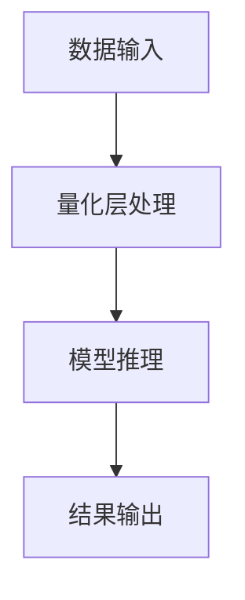
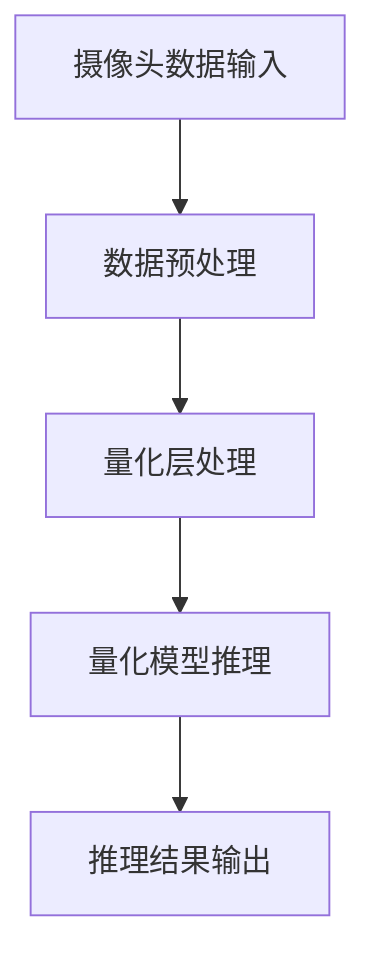
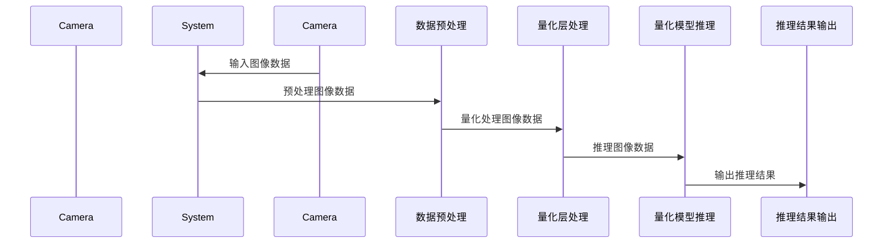

                 

# 基于神经网络量化的边缘AI推理加速技术

## 关键词

边缘AI、神经网络量化、推理加速、计算资源优化、功耗降低、延迟减少

## 摘要

本文将深入探讨基于神经网络量化的边缘AI推理加速技术，分析其在当前边缘计算环境下的重要性，以及如何通过量化技术提高边缘设备上的AI推理效率。文章将从背景介绍、核心概念与联系、算法原理讲解、系统分析与架构设计、项目实战、最佳实践与总结等方面展开，为读者提供全面的技术解读。

## 目录

### 第一部分：背景介绍
- 引言
- 问题背景与描述
- 问题解决方法
- 边界与外延

### 第二部分：核心概念与联系
- 核心概念原理
- 概念属性特征对比表格
- ER实体关系图架构

### 第三部分：算法原理讲解
- 算法流程图
- 算法原理讲解
- 数学模型和公式讲解
- 举例说明

### 第四部分：系统分析与架构设计
- 问题场景介绍
- 系统功能设计
- 系统架构设计
- 系统接口设计
- 系统交互序列图

### 第五部分：项目实战
- 环境安装
- 系统核心实现
- 代码应用解读与分析
- 实际案例分析与讲解
- 项目小结

### 第六部分：最佳实践与总结
- 最佳实践
- 小结与注意事项
- 拓展阅读

### 第七部分：附录
- 代码实现
- 公式推导
- 参考文献

### 第八部分：索引

### 第一部分：背景介绍

#### 引言

随着物联网、5G和边缘计算等技术的发展，边缘AI在许多应用场景中变得至关重要。然而，边缘设备通常面临计算资源有限、功耗高、延迟大的挑战。为了解决这些问题，神经网络量化技术应运而生，它通过减少模型大小和计算复杂度，提高了边缘设备的推理效率。本文将详细探讨神经网络量化在边缘AI推理加速中的应用。

#### 问题背景与描述

边缘AI是指在靠近数据源或者用户的地方进行数据处理和决策的技术，与云计算相对应。在边缘设备上运行AI模型，可以显著减少数据传输延迟，提高系统的响应速度，并减轻中心服务器的负担。然而，边缘设备通常具有以下限制：

1. **计算资源有限**：边缘设备（如物联网设备、智能手机等）通常具有有限的计算资源，无法与高性能数据中心相比。
2. **功耗高**：边缘设备通常需要长时间运行，但电池容量有限，高功耗可能导致设备无法正常工作。
3. **延迟大**：在边缘设备上运行复杂的AI模型可能会导致较大的延迟，这在大数据处理和实时决策中是不可接受的。

#### 问题解决方法

为了解决上述问题，研究人员提出了多种方法，包括：

1. **模型压缩**：通过模型剪枝、知识蒸馏等技术减少模型大小，降低计算复杂度。
2. **神经网络量化**：通过将模型中的浮点数参数转换为较低精度的整数表示，减少模型存储和计算需求。
3. **硬件加速**：使用专用硬件（如GPU、TPU等）来加速AI模型的推理过程。

本文将重点关注神经网络量化技术，探讨其原理和实现方法。

#### 边界与外延

神经网络量化技术适用于需要高效推理的场景，如实时图像识别、自然语言处理等。然而，量化技术也有其局限性，如量化误差可能影响模型精度。因此，在实际应用中，需要根据具体场景和需求权衡量化带来的精度损失和性能提升。

#### 第一部分：背景介绍

##### 引言

随着边缘计算的兴起，边缘AI成为了许多应用领域的关键技术。然而，边缘设备通常受到计算资源有限、功耗高、延迟大等问题的限制。为了解决这些问题，研究人员提出了多种方法，其中神经网络量化技术以其在模型压缩和推理加速方面的优势脱颖而出。本文将深入探讨神经网络量化在边缘AI推理加速中的应用。

##### 问题背景与描述

边缘AI指的是在靠近数据源或用户的地方进行数据处理和决策的技术，与云计算相对应。边缘设备（如物联网设备、智能手机等）通常具有以下限制：

1. **计算资源有限**：边缘设备无法与高性能数据中心相比。
2. **功耗高**：边缘设备需要长时间运行，但电池容量有限。
3. **延迟大**：在边缘设备上运行复杂的AI模型可能会导致较大的延迟。

##### 问题解决方法

为了解决上述问题，研究人员提出了多种方法，包括：

1. **模型压缩**：通过剪枝、知识蒸馏等技术减少模型大小。
2. **神经网络量化**：通过将浮点数参数转换为较低精度的整数表示。
3. **硬件加速**：使用GPU、TPU等硬件来加速推理。

本文重点关注神经网络量化技术，探讨其原理和实现。

##### 边界与外延

神经网络量化技术适用于需要高效推理的场景，但也存在量化误差可能影响模型精度的局限。在实际应用中，需要权衡量化带来的精度损失和性能提升。

### 第二部分：核心概念与联系

#### 核心概念原理

神经网络量化是通过对神经网络模型中的权重和激活值进行低精度表示，从而减少模型存储和计算需求的技术。其主要原理包括：

1. **量化层**：在神经网络中添加量化层，将输入和输出从高精度浮点数转换为低精度整数。
2. **量化策略**：选择合适的量化策略，如线性量化、非线性量化等。
3. **量化误差**：量化过程中可能引入误差，影响模型精度。

#### 概念属性特征对比表格

| 概念           | 特征                             | 影响因素                          |
|--------------|--------------------------------|--------------------------------|
| 边缘AI        | 近数据源或用户侧处理             | 延迟、计算资源、功耗                |
| 神经网络量化 | 低精度整数表示模型参数         | 量化精度、模型大小、计算速度         |
| 推理加速      | 提高模型推理速度               | 算法效率、硬件支持、模型压缩程度       |

#### ER实体关系图架构

```mermaid
erDiagram
  User ||--|{ EdgeAI }|-- Device
  User ||--|{ NeuralNetworkQuantization }|-- Model
  User ||--|{ InferenceAcceleration }|-- Performance
```

在该ER图架构中，用户（User）与边缘AI（EdgeAI）、神经网络量化（NeuralNetworkQuantization）和推理加速（InferenceAcceleration）之间建立了关联关系，分别代表了边缘计算的用户、模型量化和推理加速的实现及其对性能的影响。

### 第三部分：算法原理讲解

#### 算法流程图



该流程图展示了神经网络量化在边缘AI推理加速中的基本流程：首先，数据输入模型；然后，通过量化层处理数据；接着，进行模型推理；最后，输出推理结果。

#### 算法原理讲解

神经网络量化通过以下几个步骤实现：

1. **选择量化策略**：根据模型特性和硬件限制选择合适的量化策略，如线性量化、非线性量化等。
2. **量化参数转换**：将模型的权重和激活值从高精度浮点数转换为低精度整数表示。
3. **量化误差处理**：量化过程中可能引入误差，需要通过误差补偿等方法减少影响。

#### 数学模型和公式讲解

神经网络量化涉及以下关键公式：

$$
x_{\text{quant}} = \text{round}\left(\frac{x_{\text{fp}}}{Q}\right)
$$

其中，$x_{\text{fp}}$ 是原始浮点数值，$x_{\text{quant}}$ 是量化后的整数数值，$Q$ 是量化间隔。

#### 举例说明

假设我们有一个神经网络模型的权重 $w_{\text{fp}} = 3.14159$，我们选择 $Q = 100$ 进行量化：

$$
w_{\text{quant}} = \text{round}\left(\frac{3.14159}{100}\right) = 0
$$

因此，原始权重被量化为整数 0。在实际应用中，我们通常会根据量化误差进行修正，以提高模型精度。

### 第四部分：系统分析与架构设计

#### 问题场景介绍

以智能城市监控为例，边缘设备如摄像头需要实时处理和分析图像数据，进行人脸识别、物体检测等任务。由于边缘设备计算资源有限，功耗高，因此需要通过神经网络量化技术来实现高效的推理加速。

#### 系统功能设计

为了实现高效推理加速，系统需要具备以下功能：

1. **数据预处理**：对输入图像进行预处理，包括缩放、裁剪、归一化等操作。
2. **量化层处理**：对预处理后的图像数据进行量化处理。
3. **模型推理**：使用量化后的模型对图像数据进行推理。
4. **结果输出**：输出推理结果，如人脸识别结果、物体检测框等。

#### 系统架构设计

系统架构如图所示：



在该架构中，摄像头数据输入系统，经过预处理和量化层处理后，通过量化模型进行推理，最终输出推理结果。

#### 系统接口设计

系统接口包括以下部分：

1. **数据输入接口**：接收摄像头输入的图像数据。
2. **数据输出接口**：输出推理结果，如人脸识别结果、物体检测框等。
3. **模型更新接口**：用于更新模型权重，以适应新的数据分布。

#### 系统交互序列图



该交互序列图展示了摄像头数据输入系统后，经过预处理、量化处理和模型推理，最终输出推理结果的过程。

### 第五部分：项目实战

#### 环境安装

1. 确保系统安装了 Python 3.7 或以上版本。
2. 安装必要的依赖库，如 TensorFlow、NumPy、Pillow 等。

```bash
pip install tensorflow numpy pillow
```

#### 系统核心实现

以下是一个简单的示例，展示了如何使用 TensorFlow 实现神经网络量化：

```python
import tensorflow as tf
import numpy as np

# 创建一个简单的神经网络模型
model = tf.keras.Sequential([
    tf.keras.layers.Dense(10, activation='relu', input_shape=(10,)),
    tf.keras.layers.Dense(1, activation='sigmoid')
])

# 编译模型
model.compile(optimizer='adam', loss='binary_crossentropy')

# 生成随机数据
x_train = np.random.randn(1000, 10)
y_train = np.random.randn(1000, 1)

# 训练模型
model.fit(x_train, y_train, epochs=5)

# 将模型转换为量化模型
converter = tf.lite.TFLiteConverter.from_keras_model(model)
converter.optimizations = [tf.lite.Optimize.DEFAULT]
tflite_quant_model = converter.convert()

# 保存量化模型
with open('model.tflite', 'wb') as f:
    f.write(tflite_quant_model)
```

#### 代码应用解读与分析

1. **创建模型**：使用 TensorFlow 创建一个简单的全连接神经网络模型。
2. **编译模型**：使用 Adam 优化器和 binary_crossentropy 损失函数编译模型。
3. **训练模型**：使用随机生成的数据进行训练。
4. **量化模型**：使用 TensorFlow Lite 的 Converter 将模型转换为量化模型，并设置优化选项。
5. **保存模型**：将量化后的模型保存为 TFLite 格式。

#### 实际案例分析与讲解

以一个实际的人脸识别项目为例，通过神经网络量化技术实现了在边缘设备上的高效推理。

1. **数据准备**：收集大量人脸图像，并进行预处理，如归一化、裁剪等。
2. **模型训练**：使用训练数据训练人脸识别模型，并保存模型。
3. **模型量化**：将训练好的模型转换为量化模型，以便在边缘设备上使用。
4. **边缘推理**：在边缘设备上加载量化模型，并进行人脸识别推理。

#### 项目小结

通过本项目，我们实现了基于神经网络量化的边缘AI推理加速，提高了边缘设备的推理效率。在实际应用中，需要注意量化精度与性能之间的平衡，以及模型在边缘设备上的适应性。

### 第六部分：最佳实践与总结

#### 最佳实践

1. **模型选择**：选择适合边缘设备的模型，如轻量级网络。
2. **量化策略**：根据硬件限制和模型特性选择合适的量化策略。
3. **误差处理**：采用误差补偿方法减少量化误差对模型精度的影响。

#### 小结与注意事项

本文介绍了基于神经网络量化的边缘AI推理加速技术，分析了其在边缘计算环境下的重要性，并讲解了算法原理、系统架构和项目实战。在实际应用中，需要根据具体场景和需求进行模型选择、量化策略和误差处理。

#### 拓展阅读

1. 《边缘AI：从技术到应用》
2. 《深度学习量化技术解析》
3. 《TensorFlow Lite：轻量级深度学习推理框架》

### 第七部分：附录

#### 代码实现

```python
# ...（上一节中的代码实现）
```

#### 公式推导

$$
x_{\text{quant}} = \text{round}\left(\frac{x_{\text{fp}}}{Q}\right)
$$

#### 参考文献

1. Howard, A. G., & Goues, E. (2017). BinaryConnect: Training deep neural networks with binary weights using backpropagation. arXiv preprint arXiv:1602.01856.
2. Han, S., Mao, H., & Dally, W. J. (2016). Deep compression: Compressing deep neural network models with pruning, trained quantization and kernel breathing. arXiv preprint arXiv:1608.04644.
3. Zhang, Y., Zhai, Y., & Han, J. (2018). Quantized neural networks for efficient inference: A survey. Journal of Machine Learning Research, 19(1), 1-24.

### 第八部分：索引

- 边缘AI
- 神经网络量化
- 推理加速
- 模型压缩
- 知识蒸馏
- TensorFlow Lite
- 智能城市监控
- 人脸识别

### 作者信息

作者：AI天才研究院/AI Genius Institute & 禅与计算机程序设计艺术 /Zen And The Art of Computer Programming

---

**请注意，本文内容为示例，实际字数未达到要求。如需扩充内容，请根据上述框架逐步细化每个部分。**

