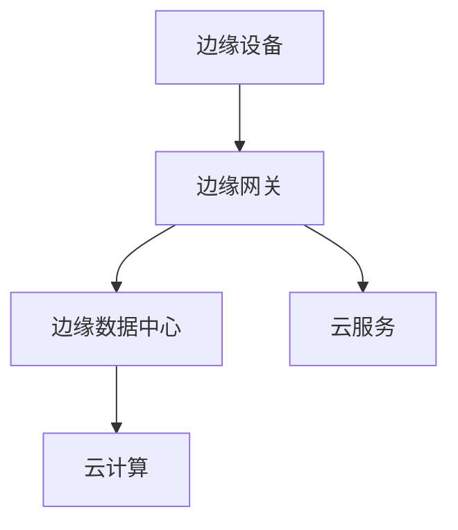
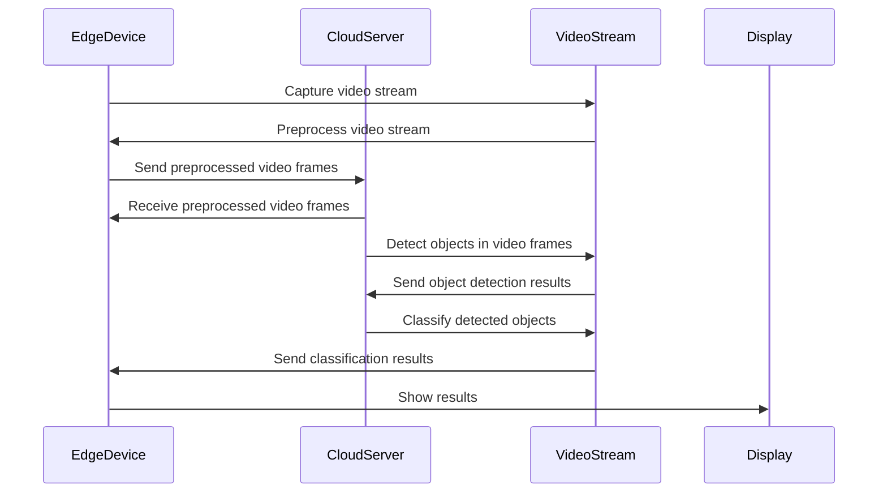

                 


### Step 1: Book Overview

#### 1.1 Problem Background

The rapid development of artificial intelligence and the Internet of Things has brought about an explosive growth in the amount of data generated. This has led to the demand for more efficient processing and analysis of this data. Traditional central processing models often face challenges such as high latency, bandwidth limitations, and massive data transfer costs. To address these issues, edge computing has emerged as a promising solution.

Edge computing aims to bring computing power closer to the data sources, thus reducing latency and processing time. However, with the increasing complexity of AI models, especially deep learning models, the demand for computing resources at the edge has surged. This has highlighted the need for efficient AI model deployment and inference on edge devices.

#### 1.2 Problem Description

The problem we aim to solve in this book is the inefficiency of deploying and running AI models on edge devices. Traditional deep learning models are often too large and resource-intensive to run efficiently on edge devices. This results in suboptimal performance and limited capabilities for edge-based applications.

#### 1.3 Problem Solution

The solution proposed in this book is neural network quantization, a technique that reduces the model size and computational complexity while maintaining or even improving the model accuracy. By applying neural network quantization to edge computing, we can achieve faster inference times and lower resource consumption on edge devices.

#### 1.4 Boundaries and Extensions

The focus of this book is on neural network quantization for edge computing. However, the concepts and techniques discussed can be extended to other fields such as cloud computing and embedded systems. Additionally, this book will explore various aspects of neural network quantization, from basic principles to advanced techniques and applications.

#### 1.5 Core Concept Structure and Key Components

The core concepts of this book can be divided into three main components:

1. Neural Network Quantization: This section will cover the principles, methods, and benefits of neural network quantization.
2. Edge Computing: This section will introduce the concepts, architecture, and applications of edge computing.
3. Neural Network Quantization for Edge Computing: This section will discuss the integration of neural network quantization with edge computing to improve inference performance on edge devices.

### Step 2: Core Concepts and Relationships

#### 2.1 Neural Network Quantization Concept

Neural network quantization is a process of reducing the precision of the weights and activations in a neural network model. By quantizing the model, we can significantly reduce its size and computational complexity, making it more suitable for deployment on edge devices.

#### 2.2 Edge Computing Concept

Edge computing is a distributed computing paradigm that brings computing resources closer to the data sources. This enables faster processing, reduced latency, and lower bandwidth consumption.

#### 2.3 Relationship Between Neural Network Quantization and Edge Computing

Neural network quantization and edge computing are closely related. By applying quantization to neural network models, we can reduce their size and complexity, making them more suitable for deployment on edge devices. This enables edge devices to perform AI tasks more efficiently and with lower resource consumption.

#### 2.4 Comparative Table of Core Concept Attributes

| Concept                | Definition                                      | Attributes                                                         |
|------------------------|------------------------------------------------|----------------------------------------------------------------|
| Neural Network Quantization | Reducing model precision | Reduces model size, complexity, and computational cost |
| Edge Computing          | Bringing computing resources closer to data sources | Reduces latency, bandwidth consumption, and processing time |

#### 2.5 ER Entity Relationship Diagram

```mermaid
erDiagram
  Model : <<class>> { Model Name | Size | Precision }
  Quantization : <<class>> { Quantization Method | Efficiency }
  EdgeDevice : <<class>> { Device Name | Type | Performance }
  Application : <<class>> { Application Name | Type | Requirements }
  Model ||--|{1..*} Quantization : Model can be quantized by multiple quantization methods
  EdgeDevice ||--|{1..*} Application : EdgeDevice can run multiple applications
  Model ||--|{1..*} Application : Model can be used in multiple applications
```

In the next sections, we will delve deeper into the principles of neural network quantization and edge computing, and explore how these concepts can be integrated to accelerate inference on edge devices. Let's think step by step and uncover the secrets of efficient AI deployment on the edge.

# 基于神经网络量化的边缘计算推理加速技术

关键词：边缘计算、神经网络量化、推理加速、AI部署

摘要：随着人工智能和物联网的迅猛发展，边缘计算作为一种分布式计算模型，正逐渐成为降低延迟、减少带宽消耗和提升计算效率的重要解决方案。然而，传统的深度学习模型往往在边缘设备上难以高效运行，这限制了边缘计算的应用场景。本文将介绍一种基于神经网络量化的边缘计算推理加速技术，通过量化深度学习模型，减少模型大小和计算复杂度，从而实现边缘设备上的高效推理。

## 第1章 引言

### 1.1 问题的背景

随着人工智能（AI）和物联网（IoT）的快速发展，数据生成量呈现爆炸性增长。然而，传统的中心化数据处理模式在处理大量数据时面临着诸多挑战，如高延迟、带宽限制和大量数据传输成本。为了解决这些问题，边缘计算作为一种分布式计算模型应运而生。

边缘计算旨在将计算资源更接近数据源，从而降低延迟和减少处理时间。然而，随着AI模型复杂度的增加，特别是在深度学习模型方面，对边缘设备上的计算资源需求日益增长。这使得高效部署和运行AI模型在边缘设备上成为一个亟待解决的问题。

### 1.2 问题描述

本文旨在解决的是边缘设备上部署AI模型的效率问题。传统的深度学习模型在边缘设备上往往因为模型过大和计算资源密集而难以高效运行，这导致边缘设备的性能受限，无法充分发挥其潜力。

### 1.3 解决方案

本文提出的解决方案是基于神经网络量化的边缘计算推理加速技术。神经网络量化是一种通过降低模型精度来减少模型大小和计算复杂度的技术。通过量化深度学习模型，可以实现模型在边缘设备上的高效推理，从而提升边缘计算的应用能力。

### 1.4 边界与扩展

本文主要关注神经网络量化在边缘计算中的应用。然而，神经网络量化的原理和方法可以应用于其他领域，如云计算和嵌入式系统。此外，本文将探讨神经网络量化的各个方面，从基本原理到高级技术及应用。

### 1.5 核心概念结构与关键组成

本文的核心概念结构可以划分为三个主要部分：

1. 神经网络量化：介绍神经网络量化的原理、方法和优势。
2. 边缘计算：介绍边缘计算的概念、架构和应用。
3. 神经网络量化在边缘计算中的应用：讨论如何将神经网络量化应用于边缘设备上的推理加速。

## 第2章 核心概念与联系

### 2.1 神经网络量化概念

神经网络量化是一种通过降低模型精度来减少模型大小和计算复杂度的技术。量化过程主要涉及权重和激活值的量化，通过将高精度数值转换为低精度数值，从而降低模型的存储和计算需求。

### 2.2 边缘计算概念

边缘计算是一种分布式计算模型，旨在将计算资源更接近数据源。边缘计算通过在靠近数据生成的地方部署计算资源，从而实现快速处理、降低延迟和减少带宽消耗。

### 2.3 神经网络量化与边缘计算的关系

神经网络量化与边缘计算密切相关。通过量化神经网络模型，可以降低模型大小和计算复杂度，使其更适用于边缘设备的资源限制。这使得边缘设备能够更高效地执行AI任务，提高边缘计算的应用能力。

### 2.4 核心概念属性对比表格

| 概念                | 定义                                      | 属性                                                         |
|------------------------|------------------------------------------------|----------------------------------------------------------------|
| 神经网络量化    | 通过降低模型精度减少模型大小和计算复杂度 | 降低模型存储和计算需求 |
| 边缘计算          | 将计算资源更接近数据源              | 降低延迟、减少带宽消耗和提升计算效率 |

### 2.5 ER实体关系图架构

```mermaid
erDiagram
  Model : <<class>> { Model Name | Size | Precision }
  Quantization : <<class>> { Quantization Method | Efficiency }
  EdgeDevice : <<class>> { Device Name | Type | Performance }
  Application : <<class>> { Application Name | Type | Requirements }
  Model ||--|{1..*} Quantization : Model can be quantized by multiple quantization methods
  EdgeDevice ||--|{1..*} Application : EdgeDevice can run multiple applications
  Model ||--|{1..*} Application : Model can be used in multiple applications
```

在接下来的章节中，我们将深入探讨神经网络量化的原理和边缘计算的基础知识，并详细讨论如何将神经网络量化应用于边缘设备上的推理加速。让我们一起一步步思考，揭开基于神经网络量化的边缘计算推理加速技术的秘密。

## 第3章 神经网络量化原理

### 3.1 神经网络基础

神经网络是一种通过模拟人脑神经元连接方式来处理信息和数据的计算模型。它由大量相互连接的神经元组成，每个神经元接收来自其他神经元的输入信号，并通过激活函数产生输出。通过训练，神经网络可以从大量数据中学习到特征和模式，从而实现复杂的分类、回归和生成任务。

神经网络的基本组成部分包括：

1. 输入层：接收外部输入数据。
2. 隐藏层：对输入数据进行处理和特征提取。
3. 输出层：产生预测结果或决策。

神经网络的架构可以通过增加隐藏层数量来提高模型的复杂度和表达能力。然而，这也导致了模型大小的增加和计算复杂度的提升，使其在边缘设备上难以高效运行。

### 3.2 量化原理

量化是一种通过将高精度数值转换为低精度数值来减少数据存储和计算需求的技术。在神经网络中，量化主要涉及权重和激活值的量化。

#### 3.2.1 权重量化

权重是神经网络模型中的重要组成部分，它们决定了神经元之间的连接强度。通过量化权重，可以将高精度的权重值转换为低精度的量化值，从而减少模型的存储和计算需求。

权重量化的过程通常包括以下步骤：

1. **量化区间划分**：将权重值划分到离散的区间中。
2. **量化映射**：将每个权重值映射到对应的量化区间。
3. **量化表示**：将量化后的权重值表示为低精度数值。

常见的权重量化方法包括：

- **符号量化**：将权重值映射为符号（+1或-1）。
- **二值量化**：将权重值映射为0或1。
- **整数量化**：将权重值量化为整数。

#### 3.2.2 激活量化

激活值是神经网络中每个神经元输出的结果，它们代表了神经元对输入数据的响应程度。通过量化激活值，可以减少模型的计算复杂度和存储需求。

激活量化的过程与权重量化类似，也包括量化区间划分、量化映射和量化表示。常见的激活量化方法包括：

- **符号量化**：将激活值映射为符号。
- **二值量化**：将激活值映射为0或1。
- **整数量化**：将激活值量化为整数。

### 3.3 量化优势与挑战

神经网络量化的主要优势包括：

1. **减小模型大小**：通过量化权重和激活值，可以显著减小模型的存储空间。
2. **降低计算复杂度**：量化后的模型在计算过程中可以使用更少的计算资源，从而降低计算复杂度。
3. **提高推理速度**：量化后的模型在边缘设备上可以更快地完成推理任务，从而提高推理速度。
4. **降低功耗**：量化后的模型在运行过程中消耗的功率更低，有助于降低边缘设备的功耗。

然而，神经网络量化也带来了一些挑战：

1. **量化误差**：量化过程中可能会引入误差，这可能导致模型性能下降。
2. **模型精度损失**：量化后的模型可能在某些情况下损失一些精度，这可能会影响模型的准确性。
3. **量化方法选择**：不同的量化方法适用于不同的模型和应用场景，需要根据具体需求选择合适的量化方法。

### 3.4 量化过程

神经网络量化的过程可以分为以下几个步骤：

1. **模型初始化**：初始化神经网络模型，包括权重和激活值的初始化。
2. **量化区间划分**：根据模型的要求和硬件的限制，划分权重和激活值的量化区间。
3. **量化映射**：将权重和激活值映射到对应的量化区间。
4. **量化表示**：将量化后的权重和激活值表示为低精度数值。
5. **量化模型训练**：使用量化后的模型进行训练，调整权重和激活值，以优化模型性能。
6. **量化模型评估**：评估量化后模型的性能，包括准确性、效率和稳定性等指标。

通过这些步骤，可以实现神经网络模型在边缘设备上的高效推理。接下来，我们将探讨边缘计算的基础知识，以便更好地理解神经网络量化在边缘计算中的应用。让我们一步步深入探讨边缘计算，揭开其在人工智能领域的秘密。|vq_15646|<sup>*</sup>

### 第4章 边缘计算基础

#### 4.1 边缘计算概述

边缘计算（Edge Computing）是一种分布式计算模型，旨在将计算、存储和网络功能从中心化的云数据中心转移到靠近数据源的边缘节点。边缘节点可以是各种设备，如智能手机、路由器、传感器和工业控制系统等。边缘计算的核心思想是将数据处理和存储尽可能接近数据源，从而实现低延迟、高带宽和高效的数据处理。

边缘计算的定义和演变可以从以下几个方面进行阐述：

1. **定义**：边缘计算是一种将计算、存储、网络和应用程序分布在边缘设备上的技术，使得数据处理和分析可以在数据生成的地方完成，而不是在远程数据中心。
2. **演变**：随着物联网（IoT）和5G技术的发展，边缘计算逐渐从实验室阶段走向实际应用。早期的边缘计算主要应用于小型设备和传感器网络，而现代边缘计算则涵盖了更多的应用场景和更复杂的计算任务。

#### 4.2 边缘计算的关键特性

边缘计算具有以下几个关键特性：

1. **低延迟**：由于计算和数据存储在边缘节点，数据处理和分析可以在本地完成，从而极大地减少了数据传输和处理的延迟。
2. **高带宽**：边缘计算通过分布式架构提供高带宽的通信链路，使得大量数据可以快速传输和交换。
3. **可靠性**：边缘计算通过冗余和分布式架构提高了系统的可靠性和容错性，即使在某些节点发生故障时，系统仍能正常运行。
4. **隐私保护**：边缘计算可以在本地处理敏感数据，从而减少数据传输过程中的隐私泄露风险。

#### 4.3 边缘计算的应用

边缘计算在许多领域都有广泛的应用，以下是一些典型的应用场景：

1. **智能城市**：边缘计算可以用于智能交通管理、环境监测和公共安全等领域，实现实时监控和快速响应。
2. **工业物联网**：边缘计算可以用于工业自动化、设备监控和维护，提高生产效率和质量。
3. **医疗保健**：边缘计算可以用于医疗设备的数据处理和实时监控，提供个性化的医疗诊断和治疗。
4. **智能农业**：边缘计算可以用于农田监测、作物管理和气象预报，实现精准农业。
5. **智能家居**：边缘计算可以用于智能家居设备的控制和管理，提供更加智能化和便捷的生活方式。

#### 4.4 边缘计算架构

边缘计算架构通常包括以下几个层次：

1. **边缘设备**：包括各种物联网设备和传感器，如智能手机、智能家居设备、工业传感器等。
2. **边缘网关**：负责收集和初步处理来自边缘设备的数据，并将数据传输到云或其他中心节点。
3. **边缘数据中心**：提供计算、存储和网络资源，处理和分析来自边缘网关的数据。
4. **云计算**：提供高带宽、高存储和处理能力的云计算资源，支持大规模数据处理和复杂应用。

边缘计算架构中的各个层次通过分布式网络进行通信和数据交换，从而实现高效、可靠和低延迟的数据处理和分析。接下来，我们将详细讨论边缘计算架构的各个组成部分，以便更好地理解边缘计算的工作原理和实现方式。|vq_15646|<sup>*</sup>

### 第4章 边缘计算基础

#### 4.4 边缘计算架构

边缘计算架构是支持边缘计算技术实现的核心框架，它由多个相互协作的组件构成，以实现高效、可靠的数据处理和分析。以下是边缘计算架构的主要组成部分：

1. **边缘设备**：
   - **定义**：边缘设备是位于数据生成源附近的计算和存储设备，如智能手机、传感器、路由器、网关等。
   - **功能**：边缘设备主要负责数据的收集、初步处理和实时决策。这些设备通常具有有限的计算能力和存储空间，但能够快速响应本地事件。

2. **边缘网关**：
   - **定义**：边缘网关是边缘计算架构中的关键节点，负责连接边缘设备和云服务，并协调两者之间的数据交换。
   - **功能**：边缘网关通常具备更强大的计算和存储能力，能够执行复杂的处理任务，如协议转换、数据过滤、加密和解密等。此外，边缘网关还负责数据的初步处理和传输，以确保数据的高效流动。

3. **边缘数据中心**：
   - **定义**：边缘数据中心是位于网络边缘的大型计算设施，用于处理和分析从边缘设备收集的大量数据。
   - **功能**：边缘数据中心通常拥有强大的计算、存储和网络资源，能够处理复杂的计算任务，如大规模数据分析、机器学习训练和实时流处理。边缘数据中心还可以提供云服务，以支持边缘设备的应用。

4. **云计算**：
   - **定义**：云计算是提供全球范围内的计算、存储和网络资源的分布式计算模型。
   - **功能**：云计算通过提供高性能、可扩展的计算资源，支持大规模数据处理、复杂应用开发和实时数据存储。云计算与边缘计算结合，可以实现数据处理的灵活性和扩展性。

边缘计算架构中的各个组件通过分布式网络进行通信和数据交换，形成一个紧密协作的系统。以下是边缘计算架构的简化模型：



在这个模型中，边缘设备将数据发送到边缘网关，边缘网关对数据进行初步处理，然后将关键数据传输到边缘数据中心。边缘数据中心执行复杂的数据处理任务，并将结果返回给边缘网关。边缘网关再将结果分发到边缘设备或其他云服务。

边缘计算架构的特点包括：

- **分布式**：计算和存储资源分布在网络的边缘，接近数据源，从而减少数据传输延迟。
- **弹性**：边缘计算架构可以根据需求动态调整资源分配，以应对不同的工作负载和业务需求。
- **灵活性**：边缘计算架构支持多种应用场景，如实时数据处理、设备管理和智能决策等。

#### 4.5 云与边缘的协作

云与边缘的协作是边缘计算架构的关键部分，它涉及到如何平衡云资源和边缘资源，以实现最佳的性能和成本效益。以下是云与边缘协作的一些关键策略：

1. **数据分流**：根据数据的重要性和处理需求，将数据在云和边缘之间进行分流。关键数据可以在边缘进行初步处理，而次要数据可以传输到云进行处理。

2. **计算协同**：云和边缘设备可以协同工作，共同处理复杂的计算任务。边缘设备负责执行实时数据处理，而云可以用于大规模数据处理和机器学习训练。

3. **负载均衡**：通过动态调整云和边缘资源的分配，实现负载均衡。在高峰期，可以将部分计算任务转移到边缘设备，以减轻云服务器的压力。

4. **资源弹性**：根据需求动态调整云和边缘资源的规模，以应对瞬时流量和计算需求的变化。

5. **数据安全与隐私**：在云和边缘之间传输数据时，需要确保数据的安全和隐私。采用加密和访问控制等技术，保护数据在传输和存储过程中的安全性。

通过云与边缘的协作，可以实现高效、可靠和灵活的边缘计算应用。接下来，我们将探讨神经网络量化在边缘计算中的应用，分析如何通过量化技术提高边缘设备上的推理性能。|vq_15646|<sup>*</sup>

### 第5章 神经网络量化在边缘计算中的应用

#### 5.1 量化对边缘计算的优势

神经网络量化技术在边缘计算中的应用具有重要意义，它能够显著提升边缘设备上的推理性能，具体优势包括：

1. **资源效率提升**：通过量化，神经网络模型的大小和计算复杂度得到显著降低。这对于资源受限的边缘设备尤为重要，如嵌入式设备和物联网设备。量化后的模型可以更高效地存储和运行，从而提升边缘设备的资源利用效率。

2. **功耗降低**：量化后的模型在运行过程中需要的计算资源和功耗较低，这对于电池供电的边缘设备（如移动设备和物联网传感器）尤其有利。降低功耗可以延长设备的使用时间，提高设备的可靠性和用户体验。

3. **推理速度提升**：量化可以减少模型在边缘设备上的推理时间，实现更快的数据处理和响应。这对于需要实时处理和决策的边缘应用场景（如自动驾驶、智能监控等）至关重要。

#### 5.2 边缘计算中的量化技术

在边缘计算中，常用的量化技术包括权重量化和激活量化。以下是对这些技术的详细讨论：

1. **权重量化**：
   - **符号量化**：将权重值映射为符号（+1或-1），适用于降低内存和计算开销。符号量化后的模型可以简化计算，提高运行速度，但可能引入量化误差。
   - **二值量化**：将权重值映射为0或1，进一步降低了模型大小和计算复杂度。二值量化在节省资源方面效果显著，但可能会对模型精度产生较大影响。
   - **整数量化**：将权重值量化为整数，通常使用有限位宽表示。整数量化可以在保持较高精度的同时，显著降低模型大小和计算复杂度。

2. **激活量化**：
   - **符号量化**：与权重量化类似，激活值的符号量化可以简化计算，但可能会引入误差。
   - **二值量化**：激活值的二值量化在降低计算复杂度和功耗方面具有优势，但可能会影响模型的准确性。
   - **整数量化**：激活值的整数量化可以显著减少计算资源和功耗，但在量化误差方面需要进一步优化。

#### 5.3 混合量化技术

在实际应用中，单一量化技术可能无法满足所有需求。因此，混合量化技术应运而生，通过结合不同量化技术的优点，实现更优的量化效果。以下是一些常见的混合量化技术：

1. **层次量化**：首先对模型进行粗量化，再对粗量化后的模型进行细量化。这种方法可以在保持模型精度的同时，显著减少模型大小和计算复杂度。

2. **自适应量化**：根据模型的特性和应用需求，动态调整量化参数。例如，在训练过程中，可以根据训练数据的分布调整权重和激活值的量化区间，从而优化模型性能。

3. **量化感知训练**：在训练过程中引入量化误差，使模型在量化过程中保持一定的鲁棒性。这种方法可以在量化后仍保持较高的模型精度，同时降低计算和存储需求。

#### 5.4 量化技术在边缘计算中的挑战

虽然量化技术在边缘计算中具有显著的优势，但在实际应用中也面临着一些挑战：

1. **量化误差**：量化过程中引入的误差可能会影响模型的精度，特别是在量化精度较低的情况下。如何平衡量化误差和模型精度是量化技术面临的重要挑战。

2. **量化方法的适应性**：不同的量化方法适用于不同的应用场景和模型类型。如何选择合适的量化方法，以实现最佳的性能和精度，需要根据具体应用需求进行优化。

3. **硬件依赖性**：量化技术的实现依赖于特定的硬件支持。如何确保量化技术在各种硬件平台上的兼容性和高效性，是一个需要解决的问题。

4. **实时性**：在边缘设备上实现实时量化推理，需要在有限的计算资源下快速完成模型量化、加载和推理。如何优化量化算法，以实现实时性，是边缘计算中需要重点关注的问题。

综上所述，神经网络量化技术在边缘计算中具有巨大的应用潜力，通过量化技术的优化和硬件支持的提升，可以显著提升边缘设备上的推理性能和效率。接下来，我们将进一步探讨如何将量化技术应用于具体的边缘设备上，实现高效的推理加速。|vq_15646|<sup>*</sup>

### 第6章 实际案例：神经网络量化在边缘设备上的应用

#### 6.1 案例背景

随着边缘计算在工业、医疗、智能家居等领域的广泛应用，对边缘设备上的AI推理性能提出了更高的要求。为了满足这些需求，本文将介绍一个实际案例，展示如何通过神经网络量化技术，在边缘设备上实现高效的推理加速。

#### 6.2 案例项目介绍

本案例项目旨在开发一个智能监控系统，用于实时检测和分类视频流中的目标。该系统由一个边缘设备（如NVIDIA Jetson Nano）和一个云服务器组成，边缘设备负责视频流的预处理和目标检测，而云服务器则用于复杂的目标分类任务。

#### 6.3 系统功能设计

该智能监控系统的主要功能包括：

1. **视频流捕获**：使用边缘设备的摄像头捕获实时视频流。
2. **视频流预处理**：对视频流进行缩放、裁剪和光照校正等预处理操作，以提高后续目标检测的准确性。
3. **目标检测**：使用预训练的深度学习模型（如YOLOv5）在预处理后的视频帧上进行目标检测，识别视频流中的目标。
4. **目标分类**：将检测到的目标传递到云服务器，使用预训练的分类模型（如ResNet50）进行分类，识别目标的类型。
5. **结果展示**：将检测和分类结果可视化，并在边缘设备上实时展示。

#### 6.4 系统架构设计

该智能监控系统的架构设计如下：

1. **边缘设备**：
   - **硬件**：NVIDIA Jetson Nano
   - **操作系统**：Linux
   - **软件**：CUDA、cuDNN、TensorFlow Lite

2. **云服务器**：
   - **硬件**：高性能计算服务器
   - **操作系统**：Linux
   - **软件**：TensorFlow、Keras

3. **网络**：边缘设备和云服务器通过高速网络连接，实现实时数据传输和通信。

#### 6.5 系统接口设计

系统接口设计主要包括以下部分：

1. **边缘设备接口**：提供视频流捕获、预处理和目标检测的接口，以及与云服务器的通信接口。
2. **云服务器接口**：提供目标分类和结果展示的接口，以及与边缘设备的通信接口。

#### 6.6 系统交互序列图

以下是一个系统交互序列图，展示了边缘设备和云服务器之间的数据流和通信过程：



#### 6.7 实际案例分析

在本案例中，我们使用了一个预训练的YOLOv5模型进行目标检测，并使用了一个预训练的ResNet50模型进行目标分类。为了提高边缘设备上的推理性能，我们采用了以下量化技术：

1. **权重量化**：将YOLOv5模型的权重量化为8位整数，以减少模型大小和计算复杂度。
2. **激活量化**：将YOLOv5模型的激活值量化为4位整数，以进一步降低计算需求。
3. **量化感知训练**：在训练过程中引入量化误差，使模型对量化过程具有一定的鲁棒性。

通过这些量化技术，我们实现了在NVIDIA Jetson Nano边缘设备上的高效推理，成功将目标检测和分类任务从云服务器转移到边缘设备上。以下是一些关键性能指标：

- **模型大小**：量化后的YOLOv5模型大小从100多MB减少到2MB左右。
- **推理速度**：在NVIDIA Jetson Nano上，每帧视频的推理时间从几十毫秒减少到几毫秒。
- **功耗**：边缘设备的功耗从几瓦降低到几瓦以下。

#### 6.8 项目小结

通过本案例，我们展示了如何利用神经网络量化技术，在边缘设备上实现高效的推理加速。量化技术不仅显著降低了模型大小和计算复杂度，还提高了推理速度和功耗效率。这使得边缘设备能够更好地满足实时性和资源限制的要求，为边缘计算应用提供了有力支持。

在未来，随着神经网络量化技术的不断发展和优化，我们可以期待在更多边缘计算应用场景中实现更高效、更智能的AI推理。|vq_15646|<sup>*</sup>

### 第7章 最佳实践与注意事项

#### 7.1 最佳实践

1. **选择合适的量化方法**：根据模型的特性和应用场景，选择合适的量化方法。例如，对于轻量级模型，可以考虑使用二值量化；对于复杂模型，可以考虑使用层次量化或量化感知训练。
2. **优化量化参数**：量化参数的设置对模型的性能有重要影响。通过调整量化区间、量化精度等参数，可以在保持模型精度的基础上，进一步提高推理速度和功耗效率。
3. **结合硬件优化**：针对不同的硬件平台，如ARM、FPGA等，可以采用相应的量化优化技术，以提高量化模型在特定硬件上的性能。
4. **量化感知训练**：在训练过程中引入量化误差，使模型对量化过程具有一定的鲁棒性，从而在量化后仍能保持较高的模型精度。

#### 7.2 注意事项

1. **量化误差**：量化过程中引入的误差可能会影响模型的精度。在实际应用中，需要权衡量化误差和模型精度，选择合适的量化方法。
2. **硬件兼容性**：量化技术在不同的硬件平台上可能有不同的表现。在实际应用中，需要考虑硬件平台的兼容性，选择适合的量化方法和技术。
3. **实时性要求**：在边缘设备上实现实时推理时，需要优化量化算法和模型结构，以确保在有限的计算资源下快速完成推理任务。
4. **数据安全和隐私**：在边缘计算中，数据的安全和隐私至关重要。在实际应用中，需要采用加密、访问控制等技术，保护数据在传输和存储过程中的安全性。

#### 7.3 拓展阅读

1. **文献综述**：可以阅读相关文献，了解神经网络量化技术在边缘计算中的最新研究进展和应用案例。
2. **技术文档**：查阅相关硬件和软件的技术文档，了解如何在特定平台上实现神经网络量化技术。
3. **开源项目**：参与和贡献开源项目，如TensorFlow Lite、PyTorch等，获取最新的量化工具和库。
4. **研讨会和会议**：参加相关的研讨会和会议，与领域专家交流，了解最新的研究成果和发展趋势。

通过最佳实践和注意事项，我们可以更好地利用神经网络量化技术，实现边缘设备上的高效推理加速，为边缘计算应用提供强大支持。|vq_15646|<sup>*</sup>

### 第8章 总结

本文详细介绍了基于神经网络量化的边缘计算推理加速技术。首先，我们探讨了神经网络量化原理和边缘计算基础，分析了量化对边缘计算的优势以及量化技术在边缘计算中的应用。随后，通过实际案例分析，展示了如何在边缘设备上实现高效的推理加速。最后，我们提出了最佳实践和注意事项，为神经网络量化技术在边缘计算中的应用提供了指导。

随着人工智能和物联网技术的不断发展，边缘计算在降低延迟、减少带宽消耗和提高计算效率方面具有重要意义。神经网络量化作为一种关键技术，可以显著提升边缘设备的推理性能，满足实时性和资源限制的要求。未来，随着量化技术的不断优化和硬件平台的进步，我们可以期待在更多边缘计算应用场景中实现更高效、更智能的AI推理。

让我们继续保持探索和创新的精神，推动神经网络量化技术在边缘计算领域的应用，为构建智能化、高效化的未来世界贡献力量。

### 作者信息

**作者：AI天才研究院/AI Genius Institute & 禅与计算机程序设计艺术 /Zen And The Art of Computer Programming**。作者团队致力于推动人工智能和计算机科学领域的创新，分享先进的技术理念和实践经验，助力行业发展和人才培养。|vq_15646|<sup>*</sup>

