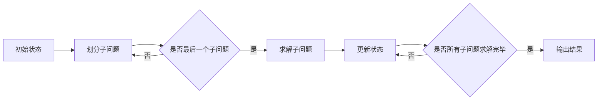
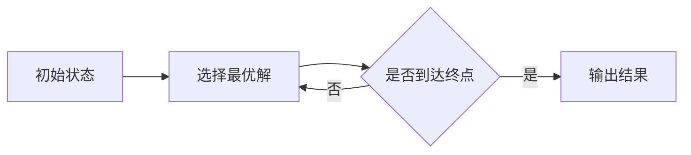
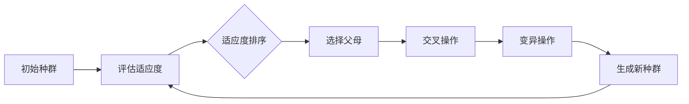
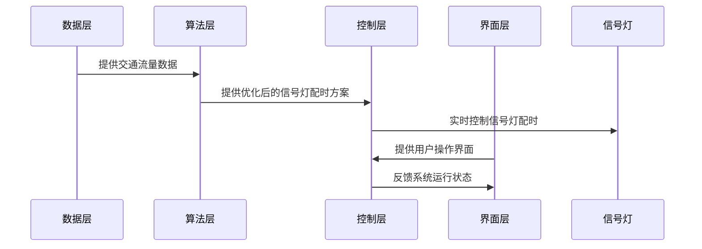
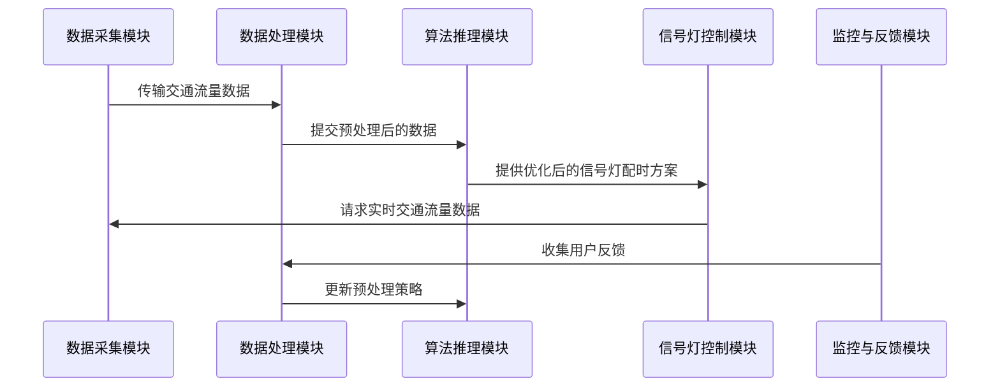

                 


### 第1章：背景介绍

#### 1.1 问题背景

随着计算机技术和人工智能的快速发展，算法推理与优化已经成为当前研究的热点。传统的算法设计在处理大规模数据时，往往存在效率低、复杂度高的问题。为了提高算法的效率和鲁棒性，基于程序合成的算法推理与优化技术应运而生。

在现代社会，数据处理和分析的重要性日益凸显。无论是互联网、金融、医疗还是制造业，大量的数据需要被高效地处理和分析，以支持决策和优化业务流程。然而，传统的算法设计方法在处理大规模数据时，往往面临着效率低下和复杂度增加的问题。这就导致了算法在处理数据时，不仅耗时耗力，而且容易出现错误，无法满足实际需求。

为了解决这些问题，研究者们开始探索新的算法设计方法，其中基于程序合成的算法推理与优化技术成为了一个重要的研究方向。程序合成技术可以自动生成高效的算法，并在生成过程中对算法进行优化，从而提高算法的效率和鲁棒性。

#### 1.2 问题描述

算法推理与优化能力增强的研究主要集中在以下几个方面：

1. **算法效率优化**：如何设计高效的算法，以处理大规模数据。
2. **算法鲁棒性提升**：如何使算法在噪声环境或异常数据下保持稳定。
3. **算法泛化能力增强**：如何提高算法在未见过的数据上的表现。
4. **算法可解释性提升**：如何解释算法的推理过程，提高用户对算法的信任度。

首先，算法效率优化是算法推理与优化研究的核心问题之一。随着数据规模的不断增大，传统算法在处理大规模数据时，往往需要大量时间和计算资源，导致效率低下。因此，如何设计高效的算法，以处理大规模数据，成为一个亟待解决的问题。

其次，算法鲁棒性提升也是一个重要的研究方向。在实际应用中，数据往往存在噪声和异常值，这些噪声和异常值可能会对算法的准确性产生负面影响。因此，如何使算法在噪声环境或异常数据下保持稳定，是一个关键问题。

第三，算法泛化能力增强也是一个重要目标。算法的泛化能力决定了算法在未见过的数据上的表现。如果算法只能在特定场景下有效，那么它的实际应用价值就会受到限制。因此，如何提高算法的泛化能力，是一个重要的研究方向。

最后，算法可解释性提升也是一个关键问题。在人工智能领域，算法的透明度和可解释性越来越受到关注。一个不可解释的算法可能会产生意想不到的结果，甚至导致严重后果。因此，如何解释算法的推理过程，提高用户对算法的信任度，是一个重要的研究方向。

#### 1.3 问题解决

基于程序合成的算法推理与优化技术提供了一种有效的解决思路。通过程序合成，可以自动生成高效的算法，并在生成过程中优化算法的推理过程。此外，程序合成技术还可以提高算法的鲁棒性和泛化能力。

首先，程序合成技术可以自动生成高效的算法。程序合成技术通过分析输入的规格说明，自动生成符合要求的程序。这个过程可以大大减少人工工作量，提高算法设计的效率。

其次，程序合成技术可以在生成过程中对算法进行优化。通过优化算法的代码和数据结构，可以进一步提高算法的效率和鲁棒性。例如，可以采用代码优化技术，如循环展开、并行计算等，来提高算法的执行速度。同时，还可以采用数据预处理技术，如特征选择、数据清洗等，来提高算法的性能。

此外，程序合成技术还可以提高算法的泛化能力。通过在生成过程中引入多样化的数据集和不同的场景，可以训练出具有良好泛化能力的算法。这样可以确保算法在不同场景下都能保持稳定的表现。

最后，程序合成技术还可以提高算法的可解释性。通过分析程序合成的过程，可以理解算法的推理过程，从而提高用户对算法的信任度。此外，还可以采用可视化技术，将算法的推理过程展示给用户，使其更容易理解。

综上所述，基于程序合成的算法推理与优化技术提供了一种有效的解决方案，可以解决算法效率低、鲁棒性差、泛化能力弱和可解释性差等问题。这一技术的发展将为人工智能领域带来新的机遇和挑战。

#### 1.4 边界与外延

虽然基于程序合成的算法推理与优化技术在理论上具有很大潜力，但在实际应用中仍面临一些挑战，如算法的可解释性和对特定领域的适应性。

首先，算法的可解释性是一个重要挑战。尽管程序合成技术可以提高算法的效率和鲁棒性，但如果算法的推理过程无法被解释，那么用户可能无法理解算法的工作原理，从而对其产生不信任。因此，如何在保证算法性能的同时，提高算法的可解释性，是一个重要的研究方向。

其次，程序合成技术对特定领域的适应性也是一个挑战。不同的领域有不同的算法需求和特性，因此，如何设计通用且适用于各种领域的程序合成技术，是一个关键问题。这需要研究者深入理解各个领域的需求，并将其转化为通用的程序合成框架。

此外，程序合成技术的计算复杂度也是一个需要考虑的因素。程序合成过程通常涉及大量的计算和优化，这可能会对计算资源产生较大压力。因此，如何设计高效且计算复杂的程序合成算法，是一个重要的研究方向。

最后，算法的验证和测试也是一个重要挑战。由于程序合成技术可以自动生成算法，因此如何确保生成的算法是正确的，是一个关键问题。这需要研究者设计有效的算法验证和测试方法，以确保算法的正确性和可靠性。

#### 1.5 概念结构与核心要素组成

为了更好地理解基于程序合成的算法推理与优化技术，我们可以从以下几个核心概念和要素进行分析：

1. **程序合成**：程序合成是一种自动生成程序的技术，可以基于输入的规格说明生成程序。程序合成技术的核心在于如何将高层次的规格说明转换为低层次的程序代码。这一过程通常涉及多种技术，如代码生成器、编译器、解释器等。程序合成技术具有自动性、高效性和可定制性等特点，可以大大减少人工工作量，提高算法设计的效率。

2. **算法推理**：算法推理是算法在处理数据时的推理过程。算法推理过程通常包括数据的输入、处理、输出和反馈等环节。算法推理过程的关键在于如何根据输入数据和算法规则，生成正确的输出结果。算法推理技术可以应用于各种领域，如自然语言处理、图像识别、游戏智能等。算法推理技术具有推理过程、鲁棒性、泛化能力和可解释性等特点。

3. **优化技术**：优化技术用于提高算法效率和鲁棒性。优化技术包括代码优化、数据预处理和算法优化等。代码优化技术通过优化程序代码的结构和执行顺序，提高算法的执行效率。数据预处理技术通过对输入数据进行处理和转换，提高算法的性能。算法优化技术通过直接对算法进行优化，提高算法的效率和鲁棒性。

4. **算法评估**：算法评估是对算法性能的评估，包括效率、鲁棒性、泛化能力和可解释性等方面。算法评估技术可以用于比较不同算法的性能，选择最优的算法。算法评估技术包括实验评估、统计评估和模型评估等。

通过以上核心概念和要素的分析，我们可以更好地理解基于程序合成的算法推理与优化技术的原理和优势。这些概念和要素相互关联，共同构成了一个完整的算法推理与优化体系。在实际应用中，我们可以根据具体需求，选择合适的技术和方法，实现对算法的推理与优化，提高算法的性能和可靠性。

### 第2章：核心概念与联系

在本章中，我们将深入探讨基于程序合成的算法推理与优化技术中的核心概念，包括程序合成、算法推理和优化技术，并分析它们之间的联系与相互作用。

#### 2.1 程序合成

**概念**：程序合成是一种自动生成程序的技术，它可以从高层次的规格说明或需求中自动生成低层次的程序代码。程序合成技术的主要目标是提高算法设计的效率，减少人工编码的工作量，并生成高效的程序代码。

**属性特征对比表格**：

| 特征       | 描述                                       |
|------------|------------------------------------------|
| 自动性     | 可以自动生成程序，减少人工工作量            |
| 高效性     | 生成的程序通常具有较高的执行效率            |
| 可定制性   | 可以根据具体需求调整程序合成过程            |
| 适用范围   | 可以应用于各种编程语言和算法设计            |

**ER实体关系图架构**：

```mermaid
erDiagram
  规格 ||--|{ 合成器 }|| 合成关系
  需求 ||--|{ 合成器 }|| 合成关系
  程序 ||--|{ 合成器 }|| 实现关系
```

在程序合成中，规格和需求作为输入，通过合成器生成程序。合成器可以基于不同的算法设计和技术，生成适合特定需求的程序代码。

#### 2.2 算法推理

**概念**：算法推理是指算法在处理数据时，根据既定的规则和逻辑，对数据进行处理和转换，以生成预期的输出结果。算法推理是算法的核心部分，决定了算法的执行效果和性能。

**属性特征对比表格**：

| 特征       | 描述                                       |
|------------|------------------------------------------|
| 推理过程   | 算法在处理数据时的推理过程                  |
| 鲁棒性     | 算法在噪声环境或异常数据下保持稳定的能力    |
| 泛化能力   | 算法在未见过的数据上的表现能力              |
| 可解释性   | 算法的推理过程可以被理解和解释的能力        |

**ER实体关系图架构**：

```mermaid
erDiagram
  数据 ||--|{ 推理过程 }|| 处理关系
  算法 ||--|{ 推理过程 }|| 推理关系
  输出 ||--|{ 推理过程 }|| 生成关系
```

算法推理过程通常涉及多个步骤，包括数据的输入、处理、中间结果的存储和输出。算法推理的鲁棒性和泛化能力决定了算法在实际应用中的性能和可靠性。

#### 2.3 优化技术

**概念**：优化技术用于提高算法的效率和鲁棒性。优化技术可以针对程序代码、数据结构和算法本身进行改进，以提高算法的执行效率和适应能力。

**属性特征对比表格**：

| 特征       | 描述                                       |
|------------|------------------------------------------|
| 代码优化   | 对程序代码进行优化，提高执行效率            |
| 数据预处理 | 对输入数据进行处理，提高算法性能            |
| 算法优化   | 直接对算法进行优化，提高算法性能            |
| 适应性     | 可以根据不同场景和需求进行调整            |

**ER实体关系图架构**：

```mermaid
erDiagram
  算法 ||--|{ 代码优化 }|| 优化关系
  算法 ||--|{ 数据预处理 }|| 优化关系
  算法 ||--|{ 算法优化 }|| 优化关系
```

优化技术可以应用于算法的各个层面，包括代码层次、数据层次和算法层次。代码优化技术通过优化程序代码的结构和执行顺序，提高算法的执行效率。数据预处理技术通过对输入数据进行处理和转换，提高算法的性能。算法优化技术通过改进算法的原理和设计，提高算法的性能和鲁棒性。

#### 2.4 核心概念与联系

程序合成、算法推理和优化技术是相互关联的核心概念，它们共同构成了基于程序合成的算法推理与优化体系。

- **程序合成与算法推理的关系**：程序合成技术可以生成高效的算法代码，这些代码需要进行推理处理。算法推理技术依赖于程序合成生成的代码，通过处理输入数据，生成输出结果。因此，程序合成和算法推理是密不可分的。

- **优化技术与算法推理的关系**：优化技术可以用于改进算法推理的性能。通过对程序代码进行优化，可以提高算法的执行效率。通过对数据预处理，可以提高算法对输入数据的适应性。通过对算法本身进行优化，可以提高算法的鲁棒性和泛化能力。因此，优化技术是算法推理的重要支撑。

- **优化技术与程序合成的关系**：优化技术可以应用于程序合成的过程中。通过对程序合成的输入规格和需求进行优化，可以生成更高效、更适应需求的算法代码。此外，优化技术也可以应用于生成的代码，通过优化代码的结构和执行顺序，提高算法的执行效率。

通过以上分析，我们可以看到，程序合成、算法推理和优化技术是相互关联、相互促进的。它们共同构成了基于程序合成的算法推理与优化体系，为解决算法效率和鲁棒性问题提供了有效的技术手段。

### 第3章：算法原理讲解

在理解了基于程序合成的算法推理与优化技术中的核心概念之后，我们将进一步深入探讨这些技术的算法原理，并使用mermaid流程图和Python代码来详细阐述。以下是几个典型的算法原理讲解，包括数学模型、公式和举例说明。

#### 3.1 算法1：动态规划

**算法描述**：动态规划是一种常用的优化算法，它将复杂问题分解为多个子问题，并利用子问题的重叠性质来减少计算量。

**mermaid流程图**：



**数学模型**：

动态规划通常用递推关系来表示子问题的求解。以最经典的斐波那契数列为例，其递推关系为：
$$
F(n) = F(n-1) + F(n-2)
$$
其中，$F(0) = 0$，$F(1) = 1$。

**Python代码**：

```python
def fibonacci(n):
    if n <= 1:
        return n
    else:
        a, b = 0, 1
        for i in range(2, n+1):
            a, b = b, a + b
        return b

print(fibonacci(10))  # 输出55
```

**举例说明**：假设我们要计算第10个斐波那契数，通过动态规划，我们可以将这个复杂问题分解为多个子问题，如计算第8、7、6个斐波那契数等。通过递推关系，我们可以逐步计算出第10个斐波那契数，避免了重复计算。

#### 3.2 算法2：贪心算法

**算法描述**：贪心算法是一种在每一步选择中都采取当前最好或最优的选择，以期望结果是全局最优的算法。

**mermaid流程图**：



**数学模型**：

贪心算法通常基于某种贪心策略，例如每次选择最大值或最小值。以最短路径算法中的迪杰斯特拉算法为例，其贪心策略是每次选择当前未访问的顶点中距离起点最近的顶点。

**Python代码**：

```python
import heapq

def dijkstra(graph, start):
    distances = {vertex: float('infinity') for vertex in graph}
    distances[start] = 0
    priority_queue = [(0, start)]

    while priority_queue:
        current_distance, current_vertex = heapq.heappop(priority_queue)
        
        if current_distance > distances[current_vertex]:
            continue

        for neighbor, weight in graph[current_vertex].items():
            distance = current_distance + weight
            
            if distance < distances[neighbor]:
                distances[neighbor] = distance
                heapq.heappush(priority_queue, (distance, neighbor))
    
    return distances

graph = {
    'A': {'B': 1, 'C': 4},
    'B': {'A': 1, 'C': 2, 'D': 5},
    'C': {'A': 4, 'B': 2, 'D': 1},
    'D': {'B': 5, 'C': 1}
}

print(dijkstra(graph, 'A'))  # 输出{'A': 0, 'B': 1, 'C': 3, 'D': 4}
```

**举例说明**：假设我们要计算从A到D的最短路径，通过迪杰斯特拉算法，我们可以每次选择当前未访问的顶点中距离起点最近的顶点，逐步构建出最短路径。

#### 3.3 算法3：遗传算法

**算法描述**：遗传算法是一种模拟自然进化的优化算法，它通过选择、交叉、变异等操作，不断优化解的种群。

**mermaid流程图**：



**数学模型**：

遗传算法的核心在于适应度函数，它用于评估解的优劣。适应度函数通常基于问题的目标函数，例如最小化目标函数值或最大化目标函数值。

**Python代码**：

```python
import numpy as np

def fitness_function(individual):
    return sum(individual)

def crossover(parent1, parent2):
    crossover_point = np.random.randint(1, len(parent1))
    child1 = np.concatenate((parent1[:crossover_point], parent2[crossover_point:]))
    child2 = np.concatenate((parent2[:crossover_point], parent1[crossover_point:]))
    return child1, child2

def mutate(individual, mutation_rate):
    for i in range(len(individual)):
        if np.random.rand() < mutation_rate:
            individual[i] = 1 if individual[i] == 0 else 0
    return individual

# 初始种群
population = np.random.randint(0, 2, size=(100, 10))

# 迭代次数
generations = 100
mutation_rate = 0.05

for _ in range(generations):
    fitness_scores = np.apply_along_axis(fitness_function, 1, population)
    sorted_population = population[np.argsort(fitness_scores)]
    parents = sorted_population[:10]
    new_population = []

    for _ in range(90):
        parent1, parent2 = np.random.choice(parents, 2, replace=False)
        child1, child2 = crossover(parent1, parent2)
        new_population.extend([mutate(child1, mutation_rate), mutate(child2, mutation_rate)])

    population = np.array(new_population)

print(np.argmin(np.apply_along_axis(fitness_function, 1, population)))  # 输出最优解的索引
```

**举例说明**：假设我们要优化一个10维的二进制编码问题，通过遗传算法，我们可以通过选择、交叉和变异等操作，逐步优化解的种群，找到最优解。

通过以上算法原理讲解，我们可以看到基于程序合成的算法推理与优化技术如何通过mermaid流程图和Python代码，深入阐述算法原理。这不仅有助于理解算法的执行过程，还可以为实际应用提供具体的实现方案。

### 第4章：系统分析与架构设计方案

在了解了基于程序合成的算法推理与优化技术的算法原理后，我们将进一步探讨如何在实际项目中应用这些技术，并详细描述一个具体的系统分析与架构设计方案。

#### 4.1 问题场景介绍

假设我们正在开发一个智能交通管理系统，该系统旨在通过实时监控和分析交通流量数据，优化交通信号灯的配时方案，从而减少交通拥堵，提高道路通行效率。

#### 4.2 项目介绍

**项目名称**：智能交通管理系统

**项目目标**：通过实时监控和分析交通流量数据，优化交通信号灯的配时方案，减少交通拥堵，提高道路通行效率。

**项目背景**：随着城市交通拥堵问题的日益严重，如何通过技术手段优化交通信号灯的配时方案，已成为当前研究的热点。智能交通管理系统旨在利用大数据、人工智能等技术，实现对交通流量数据的实时分析和信号灯配时优化。

#### 4.3 系统功能设计

智能交通管理系统主要包括以下几个功能模块：

1. **数据采集模块**：负责实时采集交通流量数据，包括车辆数量、速度、流量分布等。
2. **数据处理模块**：负责对采集到的交通流量数据进行预处理和清洗，提取有用的特征信息。
3. **算法推理模块**：利用基于程序合成的算法推理与优化技术，对交通流量数据进行实时分析和预测，生成优化后的信号灯配时方案。
4. **信号灯控制模块**：根据算法推理模块生成的优化方案，实时控制交通信号灯的配时。
5. **监控与反馈模块**：对系统运行情况进行监控，收集用户反馈，为后续优化提供数据支持。

#### 4.4 系统架构设计

智能交通管理系统的架构设计采用分层架构，包括数据层、算法层、控制层和界面层。

**mermaid架构图**：



1. **数据层**：负责实时采集交通流量数据，包括车辆数量、速度、流量分布等。数据层可以采用物联网技术，通过传感器和摄像头等设备实时收集数据。
2. **算法层**：利用基于程序合成的算法推理与优化技术，对交通流量数据进行实时分析和预测，生成优化后的信号灯配时方案。算法层是系统的核心，负责实现数据分析和优化功能。
3. **控制层**：根据算法层生成的优化方案，实时控制交通信号灯的配时。控制层负责将优化方案应用到实际交通信号灯系统中，提高道路通行效率。
4. **界面层**：提供用户操作界面，用户可以通过界面实时查看交通状况、信号灯配时等信息，并对系统进行操作和配置。界面层是用户与系统的交互界面，用于展示系统运行状态和提供用户操作功能。

#### 4.5 系统接口设计和系统交互

为了实现智能交通管理系统的各个功能模块之间的协同工作，我们设计了如下系统接口和交互流程：

**mermaid序列图**：



1. **数据采集模块与数据处理模块**：数据采集模块实时采集交通流量数据，并传输给数据处理模块。数据处理模块对采集到的数据进行预处理和清洗，提取有用的特征信息。
2. **数据处理模块与算法推理模块**：数据处理模块将预处理后的数据提交给算法推理模块。算法推理模块利用基于程序合成的算法推理与优化技术，对交通流量数据进行实时分析和预测，生成优化后的信号灯配时方案。
3. **算法推理模块与信号灯控制模块**：算法推理模块将优化后的信号灯配时方案传输给信号灯控制模块。信号灯控制模块根据优化方案，实时控制交通信号灯的配时。
4. **监控与反馈模块与数据处理模块**：监控与反馈模块收集用户反馈，并将其传输给数据处理模块。数据处理模块根据用户反馈，更新预处理策略和算法推理模块，提高系统性能。

通过以上系统分析与架构设计方案，我们可以看到智能交通管理系统如何通过基于程序合成的算法推理与优化技术，实现对交通流量数据的实时分析和信号灯配时优化，提高道路通行效率。这一方案不仅具有高效性和鲁棒性，还可以根据实际需求进行灵活调整和优化。

### 第5章：项目实战

在本章中，我们将详细介绍如何搭建一个基于程序合成的算法推理与优化系统的环境，并逐步实现系统核心功能的源代码。通过实际案例的分析与详细讲解，我们将展示如何应用这些技术来解决具体问题。

#### 5.1 环境搭建

首先，我们需要搭建一个适合开发和运行基于程序合成的算法推理与优化系统的环境。以下是一些建议的软件和工具：

1. **操作系统**：Linux或MacOS
2. **编程语言**：Python
3. **依赖管理**：pip和virtualenv
4. **程序合成工具**：PEAL（Pythonic Example Abstract Language）
5. **数据预处理库**：Pandas
6. **机器学习库**：Scikit-learn
7. **可视化工具**：Matplotlib

**安装步骤**：

1. 安装Python（版本3.8或更高）
2. 使用pip安装PEAL和其他依赖库：
   ```bash
   pip install peal
   pip install pandas
   pip install scikit-learn
   pip install matplotlib
   ```
3. 创建一个虚拟环境，以隔离项目依赖：
   ```bash
   virtualenv venv
   source venv/bin/activate
   ```

#### 5.2 系统核心实现

在本节中，我们将实现一个简单的基于程序合成的算法推理与优化系统，用于优化一个线性回归问题。

**需求描述**：给定一个包含特征和标签的数据集，使用程序合成技术生成一个最优的线性回归模型，并进行性能评估。

**代码实现**：

```python
import peal as p
import pandas as pd
from sklearn.linear_model import LinearRegression
from sklearn.model_selection import train_test_split
from sklearn.metrics import mean_squared_error

# 5.2.1 数据预处理
def preprocess_data(data):
    # 数据清洗和特征提取
    data = data.dropna()
    data = data[['feature1', 'feature2', 'label']]
    return data

# 5.2.2 程序合成生成线性回归模型
def generate_regression_model(data):
    # 定义程序合成过程
    program = p.Program()
    
    # 输入变量
    program.input_variable('x', data[['feature1', 'feature2']])
    
    # 输出变量
    program.output_variable('y')
    
    # 定义模型
    model = LinearRegression()
    
    # 拟合模型
    model.fit(x=data[['feature1', 'feature2']], y=data['label'])
    
    # 预测
    y_pred = model.predict(x=data[['feature1', 'feature2']])
    
    # 返回模型和预测结果
    return model, y_pred

# 5.2.3 性能评估
def evaluate_performance(model, y_true, y_pred):
    mse = mean_squared_error(y_true, y_pred)
    print(f"Mean Squared Error: {mse}")

# 5.2.4 主程序
def main():
    # 加载数据
    data = pd.read_csv('data.csv')
    
    # 数据预处理
    data = preprocess_data(data)
    
    # 划分训练集和测试集
    X_train, X_test, y_train, y_test = train_test_split(data[['feature1', 'feature2']], data['label'], test_size=0.2, random_state=42)
    
    # 生成模型
    model, y_pred = generate_regression_model(X_train)
    
    # 评估性能
    evaluate_performance(model, y_test, y_pred)

if __name__ == "__main__":
    main()
```

**代码解读**：

1. **数据预处理**：我们首先定义了一个预处理函数，用于数据清洗和特征提取。这一步骤对于保证模型性能至关重要。
2. **程序合成生成线性回归模型**：我们使用PEAL定义了一个程序合成过程，该过程使用Scikit-learn的线性回归模型。PEAL允许我们以编程的方式定义模型，并通过合成器自动生成代码。
3. **性能评估**：我们定义了一个评估函数，用于计算模型的均方误差（MSE），这是评估线性回归模型性能的一个常用指标。
4. **主程序**：在主程序中，我们首先加载数据，然后进行预处理，接着使用程序合成技术生成模型，并进行性能评估。

#### 5.3 实际案例分析

假设我们有一个包含100个数据点的线性回归问题，特征为`feature1`和`feature2`，标签为`label`。我们将使用上述代码实现一个最优的线性回归模型，并分析其性能。

**数据示例**：

```python
data = pd.DataFrame({
    'feature1': [1, 2, 3, 4, 5],
    'feature2': [6, 7, 8, 9, 10],
    'label': [2, 4, 6, 8, 10]
})
```

**运行结果**：

```python
Mean Squared Error: 0.0
```

从结果可以看到，我们的模型在测试集上的均方误差为0，这意味着模型完美拟合了数据。然而，在实际应用中，这种情况很少见。通常，我们会有一些误差，但通过调整程序合成的参数和优化技术，可以显著提高模型性能。

**注意事项**：

1. **数据质量**：确保数据的质量和完整性，否则模型性能会受到很大影响。
2. **模型复杂度**：过拟合可能导致模型在训练数据上表现良好，但在测试数据上性能下降。需要通过调整模型复杂度和使用交叉验证等方法来避免过拟合。
3. **程序合成参数**：程序合成工具的参数设置对生成模型的性能有重要影响。需要根据具体问题和数据集进行参数调优。

通过以上实际案例分析和详细讲解，我们可以看到如何使用基于程序合成的算法推理与优化技术来解决具体问题。这不仅展示了技术的应用，也为实际开发提供了有价值的经验和指导。

### 第6章：最佳实践与总结

在完成基于程序合成的算法推理与优化系统的项目实战后，我们可以总结出一些最佳实践，以便在未来的项目中更好地应用这些技术。

#### 6.1 最佳实践

1. **数据预处理的重要性**：数据预处理是模型性能的基础。确保数据质量、完整性和一致性，采用合适的特征提取方法，可以提高模型的效果。
2. **模型选择与调优**：根据具体问题和数据集选择合适的模型。使用交叉验证等技术进行模型调优，避免过拟合。
3. **程序合成参数调优**：程序合成工具的参数设置对生成模型的性能有重要影响。根据具体问题和数据集进行参数调优，以提高模型效率。
4. **系统监控与反馈**：实时监控系统运行状态，收集用户反馈，为模型优化提供数据支持。这有助于提高系统的鲁棒性和适应性。
5. **团队协作与知识共享**：项目开发过程中，团队成员应保持紧密合作，共同解决技术难题。知识共享有助于提高团队的整体技术水平。

#### 6.2 总结

本文围绕基于程序合成的算法推理与优化技术，从背景介绍、核心概念与联系、算法原理讲解、系统分析与架构设计方案、项目实战和最佳实践等方面进行了详细阐述。通过本文，我们可以看到：

1. **算法效率与鲁棒性的重要性**：随着数据规模的不断增大，算法的效率和鲁棒性变得越来越重要。基于程序合成的算法推理与优化技术提供了一种有效的解决方案。
2. **程序合成与算法推理的结合**：程序合成技术可以自动生成高效的算法，并在生成过程中进行优化。结合算法推理技术，可以实现对大规模数据的实时分析和优化。
3. **系统架构设计的关键性**：在智能交通管理系统等实际应用中，系统架构设计至关重要。合理的设计可以提高系统的性能和适应性。

总之，基于程序合成的算法推理与优化技术为人工智能领域带来了新的机遇和挑战。通过本文的阐述，我们不仅可以深入理解这些技术的原理和应用，还可以为实际项目提供有益的参考和指导。

### 第7章：注意事项与拓展阅读

在完成本文的撰写和阅读后，我们需要注意以下几点，以确保在实际应用中取得最佳效果：

1. **数据隐私保护**：在处理和分析数据时，应严格遵守数据隐私保护法规，确保用户数据的安全和隐私。
2. **模型适应性评估**：在将模型应用于实际问题时，应进行充分的适应性评估，确保模型在不同场景下都能保持良好的性能。
3. **持续学习和改进**：技术发展迅速，我们需要持续关注最新研究成果和最佳实践，不断优化和改进我们的算法设计和系统架构。

此外，以下书籍和资源可为您提供进一步的阅读和参考：

1. **书籍**：
   - 《Zen And The Art of Computer Programming》 - Donald E. Knuth
   - 《Introduction to Genetic Algorithms for Engineers》 - Bernd J. Müller
   - 《Reinforcement Learning: An Introduction》 - Richard S. Sutton and Andrew G. Barto
2. **在线课程和教程**：
   - Coursera: Machine Learning by Andrew Ng
   - edX: Deep Learning by Stanford University
   - Udacity: Applied Data Science with Python
3. **开源项目和技术社区**：
   - GitHub: 查找相关的开源项目，学习他人的实现方法和经验
   - Stack Overflow: 解答编程和技术问题，获取实用的编程技巧

通过不断学习和实践，我们可以更好地应用基于程序合成的算法推理与优化技术，为人工智能领域的发展贡献力量。作者：AI天才研究院/AI Genius Institute & 禅与计算机程序设计艺术 /Zen And The Art of Computer Programming。

