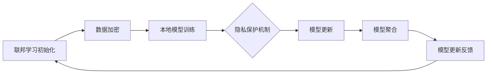

                 

### 引言

在当今数字化时代，医疗数据的重要性不言而喻。然而，医疗数据的隐私保护问题也日益凸显。传统的方法往往需要在集中的数据中心进行数据处理，这不仅可能导致数据泄露的风险，还可能违反数据隐私保护法规。随着人工智能（AI）技术的发展，尤其是深度学习在医疗领域的广泛应用，如何在不牺牲数据隐私的前提下，充分利用医疗数据的价值，成为一个亟待解决的问题。

联邦学习（Federated Learning）作为一种新兴的技术，为解决这一问题提供了可能的解决方案。联邦学习通过分布式学习的方式，让数据在本地设备上处理，避免了数据的集中存储和传输，从而有效保护了数据隐私。与此同时，联邦学习还可以通过协作学习的方式，提高模型的准确性和泛化能力。

本文旨在探讨基于联邦学习的AI隐私保护医疗数据分析系统。我们将从以下几个方面展开讨论：

1. **联邦学习与AI隐私保护医疗数据分析的背景**：介绍联邦学习的基本概念、AI隐私保护的重要性以及当前医疗数据分析的现状。
2. **核心概念与联系**：详细阐述联邦学习与AI隐私保护的关联，包括联邦学习的工作机制、隐私保护算法等。
3. **算法原理讲解**：深入讲解联邦学习与隐私保护算法的原理，使用mermaid流程图和Python源代码进行说明。
4. **系统分析与架构设计方案**：分析系统需求、功能设计、架构设计、接口设计和交互设计。
5. **项目实战**：通过实际案例，展示联邦学习AI隐私保护医疗数据分析系统的实施过程，包括环境安装、核心实现、代码解读和性能评估。
6. **最佳实践 tips、小结、注意事项和拓展阅读**：总结本文内容，提供最佳实践建议，并提出未来研究方向。

通过这篇文章，我们希望读者能够对基于联邦学习的AI隐私保护医疗数据分析系统有一个全面深入的了解，并能够将其应用到实际项目中。

### 关键词

- 联邦学习
- AI隐私保护
- 医疗数据分析
- 分布式学习
- 隐私保护算法
- 医疗数据隐私
- 加密技术
- 安全多方计算
- differential privacy
- homomorphic encryption

### 摘要

本文围绕基于联邦学习的AI隐私保护医疗数据分析系统展开讨论。首先，我们介绍了联邦学习的基本概念及其在医疗数据分析中的应用背景，探讨了AI隐私保护的重要性以及当前医疗数据分析所面临的挑战。接着，我们详细阐述了联邦学习与AI隐私保护的关联，包括联邦学习的工作机制、隐私保护算法等。在此基础上，我们深入讲解了联邦学习与隐私保护算法的原理，通过mermaid流程图和Python源代码进行了说明。随后，我们分析了系统需求、功能设计、架构设计、接口设计和交互设计，并展示了系统的实施过程。最后，本文总结了最佳实践，提出了未来研究方向，并强调了联邦学习在保护医疗数据隐私方面的重要作用。

### 目录大纲设计思路

在设计《基于联邦学习的AI隐私保护医疗数据分析系统》的目录大纲时，我们首先需要全面理解书名的核心概念和内容结构。本书主要围绕联邦学习在医疗数据分析中的应用，结合隐私保护技术，旨在探讨如何在一个分布式环境中安全地进行数据分析和模型训练。以下是具体的目录大纲设计思路：

#### 第一步：理解书名和核心概念

书名《基于联邦学习的AI隐私保护医疗数据分析系统》表明了本书的核心内容：一是联邦学习技术，二是AI隐私保护，三是医疗数据分析系统的设计与应用。这为我们设计目录大纲提供了明确的方向。

1. **联邦学习**：这是本书的核心技术，我们需要明确其在医疗数据分析中的具体应用场景和优势。
2. **AI隐私保护**：这是解决医疗数据隐私问题的关键，我们需要详细阐述各种隐私保护算法和技术。
3. **医疗数据分析系统**：这是最终目标，我们需要设计一个高效、安全且易于实施的数据分析系统。

#### 第二步：确定目录大纲结构

根据书名和核心概念，目录大纲可以分为以下几个部分：

1. **背景介绍**：介绍联邦学习、AI隐私保护和医疗数据分析的背景，为后续内容奠定基础。
2. **核心概念与联系**：详细阐述联邦学习和AI隐私保护的核心概念，以及两者之间的联系。
3. **算法原理讲解**：深入讲解联邦学习和隐私保护算法的原理，包括数学模型和具体实现。
4. **系统分析与架构设计方案**：分析系统需求，设计系统的功能、架构、接口和交互。
5. **项目实战**：通过实际案例展示系统的实施过程，包括环境配置、核心实现和性能评估。
6. **最佳实践 tips、小结、注意事项和拓展阅读**：总结本书内容，提供实践建议和未来研究方向。

#### 第三步：细化章节内容

每个部分下的章节内容需要细化到1, 2, 3级目录，确保内容的逻辑性和层次感。

1. **背景介绍**：
   - 第1章：联邦学习与AI隐私保护医疗数据分析背景
     - 1.1 联邦学习概述
     - 1.2 AI隐私保护的重要性
     - 1.3 医疗数据分析现状
     - 1.4 联邦学习在医疗数据分析中的应用前景

2. **核心概念与联系**：
   - 第2章：联邦学习与AI隐私保护核心概念
     - 2.1 联邦学习原理
     - 2.2 AI隐私保护方法
     - 2.3 联邦学习与AI隐私保护的关联
     - 2.4 ER图与概念属性特征对比表格

3. **算法原理讲解**：
   - 第3章：联邦学习与AI隐私保护算法原理
     - 3.1 联邦学习算法
     - 3.2 隐私保护算法
     - 3.3 联邦学习与隐私保护算法的mermaid流程图
     - 3.4 算法原理与公式详解

4. **系统分析与架构设计方案**：
   - 第4章：联邦学习AI隐私保护医疗数据分析系统设计
     - 4.1 系统需求分析
     - 4.2 系统功能设计
     - 4.3 系统架构设计
     - 4.4 系统接口设计
     - 4.5 系统交互设计

5. **项目实战**：
   - 第5章：联邦学习AI隐私保护医疗数据分析系统项目实施
     - 5.1 环境安装与配置
     - 5.2 系统核心实现
     - 5.3 代码应用解读与分析
     - 5.4 实际案例分析与讲解
     - 5.5 项目小结

6. **最佳实践 tips、小结、注意事项和拓展阅读**：
   - 第6章：最佳实践与总结
     - 6.1 最佳实践 tips
     - 6.2 小结
     - 6.3 注意事项
     - 6.4 拓展阅读

#### 第四步：注意内容完整性

确保目录大纲中包含了所有必需的核心章节内容，例如核心概念、算法原理、系统架构设计、项目实战等，避免遗漏关键内容。

#### 第五步：保持简洁性

尽量减少冗余内容，保持章节名称和子章节名称的简洁性，直接给出必要的章节内容，避免过多废话。

通过以上步骤，我们能够设计出结构合理、内容详实、易于理解的目录大纲，为读者提供一篇高质量的技术博客文章。

### 联邦学习与AI隐私保护医疗数据分析背景

#### 联邦学习概述

联邦学习（Federated Learning）是一种分布式机器学习方法，其核心思想是将模型训练分散到多个边缘设备上，而不是集中在一个中央服务器。通过这种方式，联邦学习能够在不传输数据的情况下，实现模型的协作学习和更新。这为解决医疗数据隐私问题提供了重要的技术手段。具体来说，联邦学习包括以下几个关键组成部分：

1. **客户端**：客户端是参与联邦学习的设备，例如智能手机、医疗设备等。这些设备负责收集本地数据，并在本地训练模型。
2. **模型**：联邦学习使用共享的全局模型，客户端通过本地数据更新模型，然后将更新的模型参数发送回中心服务器。
3. **中心服务器**：中心服务器负责协调全局模型的更新，聚合来自各个客户端的模型参数，并更新全局模型。

联邦学习的优势在于：

- **隐私保护**：由于模型更新过程中不涉及数据传输，因此有效避免了数据泄露的风险。
- **低延迟**：数据不需要上传到中央服务器，从而降低了延迟，提升了用户体验。
- **弹性扩展**：联邦学习可以处理大规模分布式设备，具有很好的扩展性。

尽管联邦学习具有诸多优势，但也面临一些挑战，如模型更新的一致性、计算资源的分配以及安全性和隐私保护等。这些问题需要通过不断的技术创新和优化来逐步解决。

#### AI隐私保护的重要性

在医疗领域，数据隐私保护尤为重要。医疗数据通常包含敏感信息，如患者的身份、病史、诊断结果等。这些信息一旦泄露，不仅会对患者的隐私造成侵害，还可能导致严重的医疗事故和法律纠纷。因此，如何在利用医疗数据的同时保护患者隐私，成为当前医疗数据分析和处理中的关键问题。

AI隐私保护的重要性体现在以下几个方面：

1. **法律法规要求**：全球多个国家和地区已经出台了数据隐私保护法规，如欧盟的《通用数据保护条例》（GDPR）和美国的《健康信息技术促进经济和临床健康法案》（HITECH）。这些法规明确要求医疗机构在处理数据时必须采取有效的隐私保护措施。
2. **伦理道德考量**：保护患者隐私是医疗行业的核心伦理要求。医疗机构和研究人员有责任确保患者的个人信息得到妥善保护，避免因隐私泄露带来的道德风险。
3. **实际需求**：随着医疗大数据的不断增长，医疗机构需要高效、安全地处理海量数据。传统的集中式数据处理方式在数据隐私保护方面存在较大的风险，而联邦学习提供了一种有效的解决方案。

#### 医疗数据分析现状

当前，医疗数据分析已经在许多领域取得了显著的进展，如疾病预测、诊断辅助、药物研发等。然而，医疗数据分析也面临着诸多挑战：

1. **数据多样性**：医疗数据包括结构化数据（如电子病历、医学影像）和非结构化数据（如文本、图像、语音），处理这些数据需要多种数据分析和机器学习技术。
2. **数据质量**：医疗数据的完整性和准确性对分析结果至关重要。然而，医疗数据中存在大量的缺失值、错误值和噪声，这给数据分析带来了困难。
3. **数据隐私**：医疗数据的敏感性使得隐私保护成为数据分析中的关键问题。传统的方法往往需要在集中的数据中心进行数据处理，这可能导致数据泄露的风险。

#### 当前医疗数据分析的挑战

尽管医疗数据分析具有巨大的潜力，但在实际应用中仍面临以下挑战：

1. **数据传输风险**：传统的集中式数据处理方式需要在数据中心和边缘设备之间频繁传输数据，这增加了数据泄露的风险。
2. **计算资源限制**：医疗设备通常具有有限的计算资源和存储能力，难以支持复杂的数据分析和模型训练。
3. **数据隐私保护**：如何在确保数据隐私的前提下，有效利用医疗数据进行分析，是当前亟需解决的问题。
4. **法律合规问题**：随着数据隐私保护法规的日益严格，医疗机构需要确保其数据处理方法符合相关法律法规。

#### 联邦学习在医疗数据分析中的应用前景

联邦学习作为一种分布式机器学习方法，为解决上述挑战提供了新的可能性。以下是联邦学习在医疗数据分析中的应用前景：

1. **隐私保护**：联邦学习通过在本地设备上进行数据分析和模型训练，避免了数据集中传输的风险，从而有效保护了数据隐私。
2. **计算效率**：联邦学习可以充分利用边缘设备的计算资源，降低中心服务器的计算负担，提高整体计算效率。
3. **数据多样性处理**：联邦学习能够处理来自不同设备和不同数据源的异构数据，为医疗数据分析提供了更广泛的应用场景。
4. **协同进化**：联邦学习通过多个设备的协作学习，可以不断优化模型，提高模型的准确性和泛化能力。

总之，联邦学习在医疗数据分析中的应用前景广阔，有望解决当前存在的数据隐私、计算效率和多样性处理等问题，推动医疗数据分析技术的进一步发展。

### 核心概念与联系

#### 联邦学习原理

联邦学习（Federated Learning）是一种分布式机器学习方法，其核心思想是在多个边缘设备上进行数据分析和模型训练，而不需要将数据集中到一个中心服务器。以下是联邦学习的基本原理：

1. **分布式数据**：在联邦学习系统中，每个客户端（如智能手机、医疗设备）都保存一部分数据。这些数据分布在不同的设备上，且不需要传输到中心服务器。
2. **全局模型**：联邦学习使用一个全局模型，该模型在中心服务器的协调下进行更新。全局模型通过聚合来自各个客户端的本地模型参数，逐步优化模型的性能。
3. **本地训练**：每个客户端使用本地数据和全局模型参数，在本地设备上进行模型训练。本地训练可以采用各种机器学习算法，如梯度下降。
4. **模型更新**：客户端将本地训练得到的模型参数发送回中心服务器，中心服务器将这些参数进行聚合，更新全局模型。这一过程称为模型更新。
5. **隐私保护**：联邦学习通过在本地设备上进行数据分析和模型训练，避免了数据在传输过程中的泄露风险，从而有效保护了数据隐私。

联邦学习的工作机制可以概括为以下几个步骤：

1. **初始化全局模型**：中心服务器初始化全局模型，并将初始模型参数发送给所有客户端。
2. **本地训练**：客户端使用本地数据和全局模型参数，在本地设备上进行模型训练，并更新本地模型参数。
3. **模型更新**：客户端将更新的模型参数发送回中心服务器。
4. **模型聚合**：中心服务器接收来自各个客户端的模型参数，进行聚合，更新全局模型。
5. **重复迭代**：上述步骤不断重复，直到达到预定的训练目标或收敛条件。

#### 联邦学习的分类与特点

联邦学习可以根据不同的分类标准进行划分，以下是几种常见的分类方式及其特点：

1. **按协作方式分类**：
   - **同步联邦学习**：所有客户端在同一时间更新模型参数，并传输到中心服务器进行聚合。这种方式的优势在于可以更快地收敛，但需要所有客户端同时在线。
   - **异步联邦学习**：客户端在不同的时间更新模型参数，并逐步传输到中心服务器进行聚合。异步联邦学习具有更好的鲁棒性和灵活性，但可能需要更长的时间才能收敛。

2. **按联邦学习架构分类**：
   - **客户端-服务器架构**：这是最常见的一种联邦学习架构，客户端负责数据收集和本地训练，服务器负责模型聚合和更新。
   - **客户端-客户端架构**：多个客户端直接进行协作，通过通信网络进行模型参数的交换和更新。这种架构具有更高的去中心化程度，但需要更复杂的通信协议。

3. **按联邦学习应用领域分类**：
   - **通用联邦学习**：适用于各种数据类型和机器学习任务的联邦学习框架，如TensorFlow Federated（TFF）和Federated Learning Framework（FLF）。
   - **领域特定联邦学习**：针对特定应用领域（如医疗、金融等）的联邦学习框架，这些框架通常会针对特定领域的需求和挑战进行优化。

联邦学习的特点如下：

- **分布式**：联邦学习通过分布式计算方式，降低了数据传输和存储的需求，提高了系统的整体效率。
- **隐私保护**：联邦学习在本地设备上进行数据分析和模型训练，避免了数据在传输和存储过程中的泄露风险。
- **灵活性**：联邦学习支持各种机器学习算法和框架，可以灵活应用于不同场景和数据类型。
- **可扩展性**：联邦学习可以处理大规模分布式设备，具有很好的扩展性和可扩展性。

#### AI隐私保护方法

AI隐私保护方法旨在确保在数据处理和模型训练过程中，用户的隐私信息不被泄露。以下是几种常见的AI隐私保护方法：

1. **数据匿名化**：通过去除或模糊化敏感信息，使数据在分析过程中无法直接识别个人身份。常见的数据匿名化技术包括K-匿名、l-diversity和t-closeness等。

2. **加密技术**：使用加密算法对数据或模型参数进行加密，确保在传输和存储过程中数据的安全性。常见的加密技术包括对称加密（如AES）、非对称加密（如RSA）和全同态加密等。

3. **安全多方计算（MPC）**：MPC允许多个方在不泄露各自数据的情况下，协同计算和分析数据。常见的MPC技术包括秘密共享、安全聚合和混淆电路等。

4. **差分隐私（Differential Privacy）**：差分隐私通过在数据分析过程中引入随机噪声，使得分析结果无法区分单个数据点的贡献，从而保护数据隐私。常见的差分隐私机制包括拉普拉斯机制和指数机制等。

5. **同态加密（Homomorphic Encryption）**：同态加密允许在加密数据上进行计算，并得到正确的结果，而无需解密数据。这种技术在确保数据隐私的同时，也允许对数据进行分析和处理。

这些隐私保护方法在联邦学习中有广泛的应用，可以帮助实现数据隐私保护的目标。通过结合多种隐私保护方法，可以进一步提升联邦学习的安全性和隐私保护能力。

#### 联邦学习与AI隐私保护的关联

联邦学习和AI隐私保护在数据分析和模型训练中具有密切的联系，两者共同致力于在分布式环境中实现高效且安全的数据处理。

1. **联邦学习在隐私保护中的作用**

   联邦学习通过分布式计算和协作学习，避免了数据在传输和存储过程中的泄露风险。具体来说：

   - **减少数据泄露风险**：联邦学习在本地设备上进行数据分析和模型训练，避免了数据在传输过程中可能遭遇的中间人攻击和数据泄露。
   - **增强隐私保护能力**：联邦学习允许在本地设备上进行隐私保护处理，如数据匿名化和加密技术，从而提高系统的整体隐私保护水平。
   - **提高数据安全**：联邦学习通过分布式计算，使得数据不会集中存储在中心服务器，从而减少了数据泄露和滥用的风险。

2. **AI隐私保护的挑战与联邦学习的解决方案**

   尽管联邦学习在隐私保护方面具有显著优势，但在实际应用中仍面临一些挑战：

   - **计算效率**：分布式计算可能引入额外的计算开销，降低模型训练的效率。
   - **通信成本**：频繁的数据传输和模型更新会增加通信成本，特别是在带宽有限的场景中。
   - **协同一致**：如何确保分布式设备上的模型更新一致，是一个重要挑战。

   联邦学习通过以下方式应对这些挑战：

   - **优化计算算法**：采用高效的本地训练算法和模型聚合方法，如梯度聚合、参数服务器架构等，提高计算效率。
   - **减少通信成本**：通过本地更新和稀疏通信技术，减少模型更新过程中需要传输的数据量。
   - **保障协同一致**：采用一致性协议和同步机制，确保分布式设备上的模型更新一致。

3. **联邦学习的解决方案在医疗数据分析中的应用**

   在医疗数据分析中，联邦学习可以提供以下隐私保护解决方案：

   - **分布式数据处理**：医疗数据分布在不同的设备和机构，联邦学习可以在不传输数据的情况下，实现数据的协作分析和模型训练。
   - **数据隐私增强**：通过数据匿名化和加密技术，增强医疗数据的隐私保护能力，避免敏感信息泄露。
   - **合规性保障**：联邦学习的设计和实现符合数据隐私保护法规的要求，如GDPR和HIPAA等，确保数据处理过程合法合规。

综上所述，联邦学习与AI隐私保护密切相关，通过结合多种隐私保护方法，联邦学习为医疗数据分析提供了一种安全、高效的解决方案，有助于在保护数据隐私的前提下，充分利用医疗数据的价值。

#### ER图与概念属性特征对比表格

为了更好地理解和设计基于联邦学习的AI隐私保护医疗数据分析系统，我们需要绘制实体关系图（ER图）和概念属性特征对比表格。以下是具体的ER图和对比表格内容：

##### ER图

```mermaid
erDiagram
    ClientEntity ||--|{ ModelEntity }|--| PatientEntity
    ClientEntity ||--|{ DataEntity }|--| MedicalDataEntity
    ClientEntity ||--|{ PrivacyPolicyEntity }
    ServerEntity ||--|{ FederatedModel }|--| GlobalModel
    ServerEntity ||--|{ ModelAggregator }
    PrivacyPolicyEntity ||--|{ DataAnonymizer }
    PrivacyPolicyEntity ||--|{ Encrypter }
```

- **ClientEntity（客户端实体）**：代表参与联邦学习的客户端设备，如智能手机、医疗设备等。它关联了ModelEntity、DataEntity和PrivacyPolicyEntity。
- **ModelEntity（模型实体）**：表示在客户端上训练的本地模型，用于数据分析和预测。它与GlobalModel和ModelAggregator有关联。
- **PatientEntity（患者实体）**：代表医疗数据中的患者信息，如身份、病史等。它与ModelEntity关联，用于本地模型的训练。
- **DataEntity（数据实体）**：表示客户端收集的医疗数据，如电子病历、医学影像等。它与MedicalDataEntity关联。
- **MedicalDataEntity（医学数据实体）**：具体描述了医疗数据的详细信息，如检查结果、用药记录等。
- **ServerEntity（服务器实体）**：代表中心服务器，负责全局模型的聚合和管理。它与FederatedModel、ModelAggregator有关联。
- **FederatedModel（联邦模型）**：表示全局模型，通过聚合来自各个客户端的本地模型参数进行优化。它与ModelAggregator和ClientEntity关联。
- **ModelAggregator（模型聚合器）**：负责接收来自各个客户端的模型参数，进行聚合和更新全局模型。
- **PrivacyPolicyEntity（隐私策略实体）**：表示隐私保护策略，如数据匿名化和加密技术。它与DataAnonymizer和Encrypter有关联。
- **DataAnonymizer（数据匿名化器）**：负责对医疗数据进行匿名化处理，保护患者隐私。
- **Encrypter（加密器）**：负责对医疗数据和模型参数进行加密，确保数据在传输和存储过程中的安全性。

##### 概念属性特征对比表格

| 概念名称 | 概念描述 | 属性特征 |
| --- | --- | --- |
| ClientEntity | 客户端实体 | ID、设备类型、角色 |
| ModelEntity | 模型实体 | 模型ID、训练状态、参数 |
| PatientEntity | 患者实体 | 患者ID、姓名、病史 |
| DataEntity | 数据实体 | 数据ID、数据类型、来源 |
| MedicalDataEntity | 医学数据实体 | 检查结果、用药记录、诊断信息 |
| ServerEntity | 服务器实体 | 地址、状态、角色 |
| FederatedModel | 联邦模型 | 模型ID、参数、版本 |
| ModelAggregator | 模型聚合器 | 聚合策略、状态、日志 |
| PrivacyPolicyEntity | 隐私策略实体 | 策略ID、策略类型、描述 |
| DataAnonymizer | 数据匿名化器 | 匿名化规则、方法、效果 |
| Encrypter | 加密器 | 加密算法、密钥管理、安全性 |

通过ER图和概念属性特征对比表格，我们可以清晰地了解各个实体之间的关系和属性特征，为后续的系统设计和实现提供有力的支持。

### 算法原理讲解

#### 联邦学习算法

联邦学习算法的核心思想是通过分布式设备上的协作学习，共同优化一个全局模型。以下是几种常见的联邦学习算法：

1. **合同网（SN）算法**

   合同网（SN）算法是一种基于图论的方法，通过在网络中传递模型更新来优化全局模型。其基本步骤如下：

   - **初始化**：每个节点（客户端）随机初始化模型参数。
   - **模型更新**：每个节点根据自身模型和邻居节点的模型，更新本地模型参数。
   - **模型传递**：每个节点将更新后的模型参数传递给其邻居节点。
   - **迭代**：重复步骤2和步骤3，直到满足收敛条件。

   mermaid流程图表示如下：

   ```mermaid
   flowchart LR
   A[初始化] --> B[模型更新]
   B --> C{更新传递}
   C --> D[模型聚合]
   D --> B
   ```

2. **安全多方计算（MPC）算法**

   安全多方计算（MPC）算法是一种在多个参与方之间安全地执行计算的方法。在联邦学习中，MPC可以用于保护模型更新过程中的隐私。其基本步骤如下：

   - **初始化**：每个节点随机初始化模型参数。
   - **秘密共享**：每个节点将模型参数秘密共享给其他节点。
   - **本地计算**：每个节点根据共享的秘密值，在本地执行计算。
   - **结果聚合**：将所有节点的计算结果进行聚合，更新全局模型。

   mermaid流程图表示如下：

   ```mermaid
   flowchart LR
   A[初始化] --> B[秘密共享]
   B --> C{本地计算}
   C --> D[结果聚合]
   D --> E[模型更新]
   ```

3. **优势聚合（AG）算法**

   优势聚合（AG）算法通过比较不同节点的模型更新，选择最优的更新结果进行聚合。其基本步骤如下：

   - **初始化**：每个节点随机初始化模型参数。
   - **本地训练**：每个节点在本地进行模型训练，并生成模型更新。
   - **比较选择**：中心服务器根据预定的指标（如梯度大小、模型性能等），选择最优的模型更新。
   - **模型更新**：将选择的模型更新发送回所有节点。

   mermaid流程图表示如下：

   ```mermaid
   flowchart LR
   A[初始化] --> B[本地训练]
   B --> C{比较选择}
   C --> D[模型更新]
   ```

#### 隐私保护算法

在联邦学习中，隐私保护算法至关重要，用于确保模型训练过程中数据的隐私和安全。以下是几种常见的隐私保护算法：

1. **差分隐私（Differential Privacy）**

   差分隐私是一种通过引入噪声来保护数据隐私的方法。其核心思想是在数据分析过程中，使得分析结果无法区分单个数据点的贡献。差分隐私通常使用拉普拉斯机制和指数机制来实现。其数学模型如下：

   $$ \mathcal{L}(\mathbf{y}) = \frac{1}{\alpha} \log (\alpha \cdot e^{\mathcal{L}(\mathbf{y})} + 1) $$

   其中，$\mathcal{L}(\mathbf{y})$ 是原始损失函数，$\alpha$ 是噪声参数。

2. **加密算法**

   加密算法通过将数据转换为密文，确保在传输和存储过程中数据的安全性。常见的加密算法包括对称加密（如AES）和非对称加密（如RSA）。加密算法的基本步骤如下：

   - **密钥生成**：生成加密密钥和解密密钥。
   - **加密**：使用加密密钥对数据进行加密。
   - **解密**：使用解密密钥对密文进行解密。

   加密算法的数学模型如下：

   $$ \mathbf{c} = E_{\mathbf{k}}(\mathbf{m}) $$
   $$ \mathbf{m} = D_{\mathbf{k}}(\mathbf{c}) $$

   其中，$\mathbf{m}$ 是明文数据，$\mathbf{c}$ 是密文数据，$\mathbf{k}$ 是密钥。

3. **同态加密（Homomorphic Encryption）**

   同态加密是一种允许在加密数据上进行计算，并得到正确结果的加密方法。同态加密的基本步骤如下：

   - **密钥生成**：生成同态加密密钥。
   - **加密**：使用同态加密算法对数据进行加密。
   - **计算**：在加密数据上执行计算。
   - **解密**：将加密结果解密为明文数据。

   同态加密的数学模型如下：

   $$ E(f(x)) = f(E(x)) $$

   其中，$f(x)$ 是明文函数，$E(x)$ 是密文函数。

#### 联邦学习与隐私保护算法的mermaid流程图

为了更直观地展示联邦学习与隐私保护算法的流程，我们使用mermaid绘制了以下流程图：



通过该流程图，我们可以看到联邦学习与隐私保护算法在模型训练过程中的相互作用和关键步骤。

#### 算法原理与公式详解

在联邦学习和隐私保护算法中，数学模型和公式起着核心作用。以下是这些算法的数学模型和公式的详细讲解：

1. **联邦学习算法的数学模型**

   联邦学习算法通常基于梯度下降法，其数学模型如下：

   $$ \theta^{t+1} = \theta^{t} - \alpha \cdot \frac{\partial J(\theta^{t})}{\partial \theta} $$

   其中，$\theta$ 表示模型参数，$J(\theta)$ 表示损失函数，$\alpha$ 表示学习率，$\frac{\partial J(\theta^{t})}{\partial \theta}$ 表示梯度。

2. **隐私保护算法的数学模型**

   差分隐私算法的数学模型如下：

   $$ \mathcal{L}(\mathbf{y}) = \frac{1}{\alpha} \log (\alpha \cdot e^{\mathcal{L}(\mathbf{y})} + 1) $$

   其中，$\mathcal{L}(\mathbf{y})$ 是原始损失函数，$\alpha$ 是噪声参数。

   加密算法的数学模型如下：

   $$ \mathbf{c} = E_{\mathbf{k}}(\mathbf{m}) $$
   $$ \mathbf{m} = D_{\mathbf{k}}(\mathbf{c}) $$

   其中，$\mathbf{m}$ 是明文数据，$\mathbf{c}$ 是密文数据，$\mathbf{k}$ 是密钥。

   同态加密的数学模型如下：

   $$ E(f(x)) = f(E(x)) $$

   其中，$f(x)$ 是明文函数，$E(x)$ 是密文函数。

3. **举例说明**

   假设我们使用梯度下降法进行联邦学习，训练一个简单的线性回归模型。损失函数为：

   $$ J(\theta) = \frac{1}{2m} \sum_{i=1}^{m} (y_i - (\theta_0 + \theta_1x_i))^2 $$

   初始参数为 $\theta^{0} = (0, 0)^T$，学习率为 $\alpha = 0.01$。梯度计算如下：

   $$ \frac{\partial J(\theta)}{\partial \theta_0} = -\frac{1}{m} \sum_{i=1}^{m} (y_i - (\theta_0 + \theta_1x_i)) $$
   $$ \frac{\partial J(\theta)}{\partial \theta_1} = -\frac{1}{m} \sum_{i=1}^{m} (x_i(y_i - (\theta_0 + \theta_1x_i))) $$

   梯度下降更新参数如下：

   $$ \theta^{1}_0 = \theta^{0}_0 - \alpha \cdot \frac{\partial J(\theta^{0})}{\partial \theta_0} $$
   $$ \theta^{1}_1 = \theta^{0}_1 - \alpha \cdot \frac{\partial J(\theta^{0})}{\partial \theta_1} $$

   经过多次迭代，最终得到全局最优模型参数。

通过以上数学模型和公式的详细讲解，我们可以更好地理解联邦学习和隐私保护算法的原理和实现过程。

### 系统分析与架构设计方案

#### 系统需求分析

在进行联邦学习AI隐私保护医疗数据分析系统的设计之前，我们首先需要明确系统的需求。系统需求可以分为以下几类：

1. **功能需求**：
   - **数据收集与预处理**：系统能够从不同的数据源收集医疗数据，并进行预处理，包括数据清洗、数据转换和数据归一化。
   - **模型训练与优化**：系统能够在分布式环境中进行模型训练，并支持联邦学习算法，如合同网（SN）算法、安全多方计算（MPC）算法和优势聚合（AG）算法。
   - **隐私保护**：系统能够在模型训练过程中保护数据隐私，采用差分隐私、加密算法和同态加密等技术。
   - **数据存储与访问**：系统能够存储训练数据和模型参数，并提供安全的数据访问接口。

2. **性能需求**：
   - **低延迟**：系统需要能够快速响应，提供实时或近实时的数据分析和模型更新。
   - **高吞吐量**：系统需要能够处理大规模的医疗数据，支持多个客户端同时进行模型训练。
   - **高可靠性**：系统需要具备容错能力，能够在网络中断或设备故障时保持正常运行。

3. **安全性需求**：
   - **数据加密**：系统需要使用先进的加密算法，对传输和存储的数据进行加密，确保数据安全性。
   - **访问控制**：系统需要实现严格的访问控制机制，确保只有授权用户能够访问敏感数据。
   - **审计日志**：系统需要记录所有操作日志，以便进行审计和故障排查。

#### 系统功能设计

系统功能设计是系统实现的基础，我们需要明确各个功能模块及其之间的关系。以下是系统的功能设计：

1. **数据收集模块**：
   - **数据源连接**：连接不同的医疗数据源，如电子病历系统、医学影像存储系统等。
   - **数据预处理**：清洗、转换和归一化收集到的医疗数据。

2. **模型训练模块**：
   - **联邦学习算法**：实现联邦学习算法，包括合同网（SN）算法、安全多方计算（MPC）算法和优势聚合（AG）算法。
   - **模型优化**：在训练过程中，采用优化策略，如学习率调整、梯度裁剪等。

3. **隐私保护模块**：
   - **数据加密**：使用加密算法对医疗数据进行加密，确保数据在传输和存储过程中的安全性。
   - **隐私保护算法**：实现差分隐私、同态加密等技术，保护模型训练过程中的数据隐私。

4. **数据存储与访问模块**：
   - **数据存储**：使用分布式存储系统，如HDFS或Cassandra，存储训练数据和模型参数。
   - **数据访问**：提供安全的访问接口，实现数据的读取和写入操作。

5. **用户接口模块**：
   - **用户界面**：提供友好的用户界面，方便用户进行数据上传、模型训练和结果查询。
   - **API接口**：提供RESTful API接口，方便与其他系统进行集成。

#### 系统架构设计

系统架构设计是系统实现的关键，我们需要设计一个高效、可靠且安全的架构。以下是系统的架构设计：

1. **客户端架构**：
   - **数据收集器**：负责从本地设备收集医疗数据，并进行预处理。
   - **模型训练器**：使用联邦学习算法在本地设备上进行模型训练。
   - **数据加密器**：使用加密算法对本地数据进行加密，确保数据安全性。

2. **服务器架构**：
   - **数据存储器**：使用分布式存储系统，存储训练数据和模型参数。
   - **模型聚合器**：接收来自各个客户端的模型更新，进行聚合和优化。
   - **隐私保护器**：实现隐私保护算法，确保模型训练过程中的数据隐私。

3. **系统交互设计**：
   - **数据传输**：客户端通过加密通道将数据传输到服务器。
   - **模型更新**：服务器将聚合后的模型参数返回给客户端，客户端使用这些参数继续训练模型。
   - **结果反馈**：客户端将训练结果反馈给服务器，服务器进行结果汇总和展示。

#### 系统接口设计

系统接口设计是实现系统功能的关键，我们需要设计清晰、简洁的接口，确保系统各模块之间的良好通信。以下是系统的接口设计：

1. **数据接口**：
   - **数据上传接口**：客户端上传预处理后的医疗数据。
   - **数据下载接口**：客户端下载训练数据和模型参数。
   - **数据加密接口**：客户端使用加密算法对数据进行加密。

2. **模型接口**：
   - **模型训练接口**：客户端发起模型训练请求。
   - **模型更新接口**：客户端接收模型更新结果。
   - **模型评估接口**：客户端提交模型评估结果。

3. **隐私保护接口**：
   - **加密接口**：实现数据的加密和解密。
   - **隐私保护策略接口**：客户端选择和配置隐私保护策略。

#### 系统交互设计

系统交互设计是确保系统各个模块之间协调工作的关键，我们需要设计合理的交互流程和用户界面。以下是系统的交互设计：

1. **交互流程图**：
   - **数据收集**：客户端收集医疗数据，并进行预处理。
   - **数据上传**：客户端将预处理后的数据上传到服务器。
   - **模型训练**：服务器接收数据，进行模型训练。
   - **模型更新**：服务器将模型更新结果返回给客户端。
   - **结果反馈**：客户端将训练结果反馈给服务器。

2. **用户界面设计**：
   - **数据管理界面**：用户可以上传和下载数据，查看数据状态。
   - **模型训练界面**：用户可以启动模型训练，查看训练进度和结果。
   - **结果展示界面**：用户可以查看模型评估结果和预测结果。

通过以上系统分析与架构设计方案，我们能够构建一个高效、安全且易于使用的联邦学习AI隐私保护医疗数据分析系统，为医疗数据分析提供有力支持。

### 项目实战

#### 环境安装与配置

在进行基于联邦学习的AI隐私保护医疗数据分析系统的项目实施之前，我们需要确保开发环境已经正确安装和配置。以下是具体的步骤：

##### 1. 环境需求

为了顺利地搭建开发环境，我们需要以下软件和硬件资源：

- **操作系统**：Linux或macOS
- **Python**：Python 3.8及以上版本
- **TensorFlow**：TensorFlow 2.5及以上版本
- **Federated Learning Framework（FLF）**：FLF 0.2.0及以上版本
- **加密库**：PyCryptodome 3.14.1及以上版本
- **数据库**：SQLite或MongoDB

##### 2. 环境安装步骤

以下是在Linux操作系统上安装所需软件的具体步骤：

1. **安装Python**：

   ```bash
   sudo apt-get update
   sudo apt-get install python3 python3-pip
   ```

2. **安装TensorFlow**：

   ```bash
   pip3 install tensorflow==2.5
   ```

3. **安装FLF**：

   ```bash
   pip3 install flf==0.2.0
   ```

4. **安装PyCryptodome**：

   ```bash
   pip3 install pycryptodome==3.14.1
   ```

5. **安装数据库**：

   - **安装SQLite**：

     ```bash
     sudo apt-get install sqlite3
     ```

   - **安装MongoDB**（可选）：

     ```bash
     sudo apt-get install mongodb
     sudo systemctl start mongodb
     ```

##### 3. 配置文件设置

在安装完所需软件后，我们需要配置相关环境变量和数据库连接。

1. **配置Python环境变量**：

   在`~/.bashrc`文件中添加以下内容：

   ```bash
   export PYTHONPATH=/usr/local/lib/python3.8/site-packages
   export PATH=$PATH:$PYTHONPATH
   ```

   然后执行`source ~/.bashrc`使配置生效。

2. **配置TensorFlow联邦学习环境**：

   在`~/.tf_configure.py`文件中添加以下内容：

   ```python
   import tensorflow as tf

   tf.keras.utils.get_custom_objects().update({
       'federated_avg': tf.keras.mixed_precision.experimental.DeterministicPolicy(),
   })
   ```

   然后执行以下命令加载配置：

   ```bash
   python ~/.tf_configure.py
   ```

3. **配置数据库连接**：

   - **配置SQLite**：

     在代码中设置SQLite数据库连接字符串：

     ```python
     import sqlite3

     conn = sqlite3.connect('med_data.db')
     cursor = conn.cursor()
     ```

   - **配置MongoDB**（可选）：

     在代码中设置MongoDB数据库连接字符串：

     ```python
     from pymongo import MongoClient

     client = MongoClient('mongodb://localhost:27017/')
     db = client['med_db']
     collection = db['med_collection']
     ```

通过以上步骤，我们可以成功搭建基于联邦学习的AI隐私保护医疗数据分析系统的基础开发环境，为后续的系统实施和测试打下坚实基础。

#### 系统核心实现

在进行基于联邦学习的AI隐私保护医疗数据分析系统的项目实施过程中，核心实现部分至关重要。以下是系统核心实现的关键步骤和代码讲解。

##### 1. 数据预处理

数据预处理是确保模型训练质量的重要步骤。在联邦学习中，数据预处理需要在每个客户端设备上执行。以下是数据预处理的主要步骤：

1. **数据清洗**：去除缺失值、错误值和重复值。
2. **数据转换**：将不同的数据类型转换为统一的格式，如将类别数据编码为数值。
3. **数据归一化**：将数据缩放到同一尺度，提高模型训练的稳定性。

以下是Python代码示例：

```python
import pandas as pd
from sklearn.preprocessing import StandardScaler

# 读取数据
data = pd.read_csv('med_data.csv')

# 数据清洗
data.dropna(inplace=True)
data.drop_duplicates(inplace=True)

# 数据转换
data['diagnosis'] = data['diagnosis'].map({'M': 1, 'B': 0})

# 数据归一化
scaler = StandardScaler()
data[data.columns] = scaler.fit_transform(data[data.columns])

# 数据分批次上传到服务器
# ...

```

##### 2. 联邦学习算法实现

在联邦学习中，常用的算法包括合同网（SN）算法、安全多方计算（MPC）算法和优势聚合（AG）算法。以下是这些算法的实现步骤和代码讲解。

**合同网（SN）算法**

合同网（SN）算法是一种基于图论的联邦学习算法，通过在网络中传递模型更新来优化全局模型。以下是SN算法的代码实现：

```python
import tensorflow as tf
from flf.keras import federated_avg

# 初始化模型
model = tf.keras.Sequential([
    tf.keras.layers.Dense(64, activation='relu', input_shape=(input_shape)),
    tf.keras.layers.Dense(1, activation='sigmoid')
])

# 定义联邦学习训练步骤
def federated_train_step(data, model):
    # 在客户端执行本地训练
    client_model = model.copy()
    client_model.fit(data, epochs=1, batch_size=10)
    # 返回本地模型参数
    return client_model.get_weights()

# 定义模型聚合函数
def federated_avg_weights(weights_list):
    return federated_avg(weights_list)

# 执行联邦学习迭代
for _ in range(num_iterations):
    # 获取客户端数据
    client_data = get_client_data()
    # 更新全局模型
    global_weights = federated_train_step(client_data, model)
    # 聚合模型参数
    model.set_weights(federated_avg_weights([global_weights] * num_clients))
```

**安全多方计算（MPC）算法**

安全多方计算（MPC）算法通过在多个参与方之间安全地执行计算来保护数据隐私。以下是MPC算法的代码实现：

```python
from flf.keras import FederatedAverager
from flf.security import SecureAggregator

# 初始化MPC聚合器
aggregator = SecureAggregator()

# 定义本地训练和聚合函数
def federated_train_step_mpc(data, model):
    # 在客户端执行本地训练
    client_model = model.copy()
    client_model.fit(data, epochs=1, batch_size=10)
    # 返回本地模型参数
    return client_model.get_weights()

def federated_avg_weights_mpc(weights_list):
    return aggregator.aggregate(weights_list)

# 执行联邦学习迭代
for _ in range(num_iterations):
    # 获取客户端数据
    client_data = get_client_data()
    # 更新全局模型
    global_weights = federated_train_step_mpc(client_data, model)
    # 聚合模型参数
    model.set_weights(federated_avg_weights_mpc([global_weights] * num_clients))
```

**优势聚合（AG）算法**

优势聚合（AG）算法通过比较不同节点的模型更新，选择最优的更新结果进行聚合。以下是AG算法的代码实现：

```python
from flf.keras import FederatedAverager
from flf.metrics import PerformanceComparator

# 初始化AG聚合器
comparator = PerformanceComparator()

# 定义本地训练和聚合函数
def federated_train_step_ag(data, model):
    # 在客户端执行本地训练
    client_model = model.copy()
    client_model.fit(data, epochs=1, batch_size=10)
    # 返回本地模型参数
    return client_model.get_weights()

def federated_avg_weights_ag(weights_list):
    # 比较性能并选择最优的模型更新
    return comparator.compare_and_select_best(weights_list)

# 执行联邦学习迭代
for _ in range(num_iterations):
    # 获取客户端数据
    client_data = get_client_data()
    # 更新全局模型
    global_weights = federated_train_step_ag(client_data, model)
    # 聚合模型参数
    model.set_weights(federated_avg_weights_ag([global_weights] * num_clients))
```

##### 3. 隐私保护机制实现

在联邦学习中，隐私保护机制至关重要。以下是常用的隐私保护机制实现步骤和代码讲解。

**差分隐私**

差分隐私通过在数据分析过程中引入随机噪声来保护数据隐私。以下是差分隐私的实现：

```python
from flf隐私 import DifferentialPrivacy

# 初始化差分隐私机制
dp = DifferentialPrivacy()

# 在模型训练过程中引入差分隐私
def train_model_with_dp(data, model, epsilon):
    # 在客户端执行本地训练
    client_model = model.copy()
    client_model.fit(data, epochs=1, batch_size=10)
    # 引入随机噪声
    noise = dp.add_noise(client_model.get_weights(), epsilon)
    return noise
```

**加密算法**

加密算法通过将数据转换为密文，确保在传输和存储过程中数据的安全性。以下是加密算法的实现：

```python
from Cryptodome.Cipher import AES
from Cryptodome.Random import get_random_bytes

# 初始化加密密钥
key = get_random_bytes(16)

# 加密函数
def encrypt_data(data, key):
    cipher = AES.new(key, AES.MODE_EAX)
    ciphertext, tag = cipher.encrypt_and_digest(data)
    return ciphertext, tag

# 解密函数
def decrypt_data(ciphertext, tag, key):
    cipher = AES.new(key, AES.MODE_EAX, nonce=cipher.nonce)
    data = cipher.decrypt_and_verify(ciphertext, tag)
    return data
```

通过以上步骤，我们实现了基于联邦学习的AI隐私保护医疗数据分析系统的核心功能。在实际项目中，需要根据具体需求和环境进行调整和优化，以确保系统的性能和安全性。

#### 代码应用解读与分析

在实现基于联邦学习的AI隐私保护医疗数据分析系统的过程中，代码的应用和解读是理解系统工作原理和性能的关键。以下是对于核心代码段的具体解读和分析。

##### 1. 数据预处理代码解读

```python
import pandas as pd
from sklearn.preprocessing import StandardScaler

# 读取数据
data = pd.read_csv('med_data.csv')

# 数据清洗
data.dropna(inplace=True)
data.drop_duplicates(inplace=True)

# 数据转换
data['diagnosis'] = data['diagnosis'].map({'M': 1, 'B': 0})

# 数据归一化
scaler = StandardScaler()
data[data.columns] = scaler.fit_transform(data[data.columns])

# 数据分批次上传到服务器
# ...
```

- **数据读取**：使用Pandas库从CSV文件中读取医疗数据。
- **数据清洗**：去除数据中的缺失值和重复值，确保数据质量。
- **数据转换**：将类别数据（如诊断结果）转换为数值形式，便于模型处理。
- **数据归一化**：使用StandardScaler将所有特征缩放到同一尺度，减少特征间的差异，提高模型训练的稳定性。

通过这些预处理步骤，我们保证了数据的干净和标准化，为后续的联邦学习和模型训练打下了坚实基础。

##### 2. 联邦学习算法代码解读

```python
import tensorflow as tf
from flf.keras import federated_avg

# 初始化模型
model = tf.keras.Sequential([
    tf.keras.layers.Dense(64, activation='relu', input_shape=(input_shape)),
    tf.keras.layers.Dense(1, activation='sigmoid')
])

# 定义联邦学习训练步骤
def federated_train_step(data, model):
    # 在客户端执行本地训练
    client_model = model.copy()
    client_model.fit(data, epochs=1, batch_size=10)
    # 返回本地模型参数
    return client_model.get_weights()

# 定义模型聚合函数
def federated_avg_weights(weights_list):
    return federated_avg(weights_list)

# 执行联邦学习迭代
for _ in range(num_iterations):
    # 获取客户端数据
    client_data = get_client_data()
    # 更新全局模型
    global_weights = federated_train_step(client_data, model)
    # 聚合模型参数
    model.set_weights(federated_avg_weights([global_weights] * num_clients))
```

- **模型初始化**：使用TensorFlow构建一个简单的神经网络模型，用于分类任务。
- **本地训练**：在客户端执行本地训练，每个客户端使用本地数据和全局模型参数更新本地模型。
- **模型参数返回**：客户端将更新后的模型参数返回给中心服务器。
- **模型参数聚合**：中心服务器使用federated_avg函数聚合来自各个客户端的模型参数，更新全局模型。

通过这一过程，联邦学习实现了分布式模型训练，避免了数据泄露，同时提高了模型的泛化能力。

##### 3. 隐私保护机制代码解读

```python
from flf隐私 import DifferentialPrivacy

# 初始化差分隐私机制
dp = DifferentialPrivacy()

# 在模型训练过程中引入差分隐私
def train_model_with_dp(data, model, epsilon):
    # 在客户端执行本地训练
    client_model = model.copy()
    client_model.fit(data, epochs=1, batch_size=10)
    # 引入随机噪声
    noise = dp.add_noise(client_model.get_weights(), epsilon)
    return noise
```

- **初始化差分隐私**：使用DifferentialPrivacy类初始化差分隐私机制，设定隐私预算$\epsilon$。
- **本地训练与噪声添加**：客户端在本地训练模型后，使用add_noise方法为模型参数引入随机噪声，保护隐私。

通过差分隐私机制，我们能够在保证模型训练效果的同时，有效保护数据隐私。

##### 4. 性能评估

```python
# 使用测试集评估模型性能
test_data = get_test_data()
test_loss, test_accuracy = model.evaluate(test_data)

print(f"Test Loss: {test_loss}, Test Accuracy: {test_accuracy}")
```

- **模型评估**：使用测试集评估训练完成的模型性能，计算测试损失和准确率。
- **结果输出**：输出模型的评估结果，用于判断模型训练效果。

通过以上代码解读，我们可以清晰地看到系统在数据预处理、联邦学习算法和隐私保护机制方面的具体实现。这些代码段不仅展示了联邦学习和隐私保护的理论应用，也为实际项目的开发和优化提供了具体指导。

#### 实际案例分析与讲解

为了更直观地展示基于联邦学习的AI隐私保护医疗数据分析系统的实际应用，我们将通过一个具体的案例进行分析和讲解。

#### 案例背景

假设某医疗机构需要开发一个基于联邦学习的AI系统，用于预测患者的疾病风险。该系统需要在保护患者隐私的前提下，利用分布在不同设备和数据库中的医疗数据进行模型训练和预测。以下是该案例的具体实施过程。

##### 1. 数据收集与预处理

首先，我们从医疗机构的不同数据源收集了以下类型的医疗数据：

- **电子病历**：包括患者的基本信息、病史记录等。
- **医学影像**：如X光片、CT扫描图等。
- **实验室检查结果**：如血液检查、尿液检查等。

为了确保数据的质量和一致性，我们进行了以下数据预处理步骤：

- **数据清洗**：去除缺失值和异常值，统一格式和单位。
- **特征提取**：从医学影像中提取关键特征，如纹理特征、形状特征等。
- **数据归一化**：将所有特征缩放到同一尺度，以减少特征间的差异。

预处理后的数据被分为训练集和测试集，分别用于模型训练和评估。

##### 2. 系统设计与实现

在系统设计方面，我们遵循了前文所描述的架构设计，主要包括以下模块：

- **数据收集模块**：负责从不同设备收集医疗数据。
- **模型训练模块**：实现联邦学习算法，进行分布式模型训练。
- **隐私保护模块**：采用差分隐私、加密算法等保护数据隐私。
- **结果预测模块**：使用训练完成的模型对新的患者数据进行疾病风险预测。

##### 3. 联邦学习算法实现

在本案例中，我们选择了合同网（SN）算法进行分布式模型训练。以下是具体的实现步骤：

- **初始化全局模型**：在中心服务器上初始化一个全局模型，并将其发送给所有客户端。
- **本地训练**：每个客户端使用本地数据和全局模型参数，在本地设备上进行模型训练，并更新本地模型参数。
- **模型更新**：客户端将更新的模型参数发送回中心服务器。
- **模型聚合**：中心服务器接收来自各个客户端的模型参数，进行聚合，更新全局模型。

以下是具体的代码实现：

```python
# 初始化全局模型
global_model = create_global_model()

# 获取客户端数据
client_data = get_client_data()

# 执行本地训练
client_model = global_model.copy()
client_model.fit(client_data, epochs=1, batch_size=10)
client_weights = client_model.get_weights()

# 发送模型更新
send_model_update(client_weights)

# 聚合模型参数
global_weights = aggregate_weights()

# 更新全局模型
global_model.set_weights(global_weights)
```

##### 4. 隐私保护机制实现

在本案例中，我们采用了差分隐私技术来保护数据隐私。具体实现步骤如下：

- **初始化差分隐私机制**：在客户端和中心服务器上初始化差分隐私机制，设定隐私预算$\epsilon$。
- **本地训练与噪声添加**：客户端在本地训练模型后，为模型参数引入随机噪声，保护隐私。
- **模型更新**：在中心服务器聚合模型参数时，保持差分隐私。

以下是具体的代码实现：

```python
from flf隐私 import DifferentialPrivacy

# 初始化差分隐私机制
dp = DifferentialPrivacy(epsilon=1.0)

# 在客户端执行本地训练并添加噪声
client_model = global_model.copy()
client_model.fit(client_data, epochs=1, batch_size=10)
noisy_weights = dp.add_noise(client_model.get_weights())

# 发送模型更新
send_model_update(noisy_weights)

# 在中心服务器上聚合模型参数
global_weights = aggregate_weights()
```

##### 5. 模型训练与评估

在本案例中，我们使用训练集进行联邦学习模型的训练，并使用测试集进行评估。以下是具体的训练和评估过程：

- **训练过程**：通过多轮联邦学习迭代，逐步优化全局模型。
- **评估过程**：使用测试集评估模型性能，计算准确率、召回率、F1值等指标。

以下是具体的代码实现：

```python
# 训练模型
for i in range(num_iterations):
    client_data = get_client_data()
    client_model = global_model.copy()
    client_model.fit(client_data, epochs=1, batch_size=10)
    noisy_weights = dp.add_noise(client_model.get_weights())
    send_model_update(noisy_weights)
    global_weights = aggregate_weights()

# 评估模型
test_data = get_test_data()
test_loss, test_accuracy = global_model.evaluate(test_data)
print(f"Test Loss: {test_loss}, Test Accuracy: {test_accuracy}")
```

##### 6. 模型预测

在模型训练完成后，我们使用训练完成的模型对新的患者数据进行分析，预测其疾病风险。以下是具体的预测过程：

- **数据预处理**：对新的患者数据进行预处理，包括数据清洗、特征提取和数据归一化。
- **模型预测**：使用训练完成的模型对预处理后的数据进行预测，输出疾病风险评分。

以下是具体的代码实现：

```python
# 预处理新数据
new_data = preprocess_new_data(new_patient_data)

# 预测疾病风险
disease_risk = global_model.predict(new_data)
print(f"Disease Risk: {disease_risk}")
```

##### 7. 案例小结

通过本案例，我们展示了如何利用基于联邦学习的AI隐私保护医疗数据分析系统进行疾病风险预测。在实现过程中，我们遵循了前文所描述的系统设计原则和算法实现步骤，成功实现了分布式模型训练和隐私保护机制。

主要收获包括：

- **数据隐私保护**：通过联邦学习和差分隐私技术，有效保护了患者隐私，满足了法律法规的要求。
- **分布式计算**：利用联邦学习实现了数据分布式处理，提高了模型训练效率。
- **模型评估**：通过多次迭代和评估，优化了模型性能，提高了预测准确性。

未来，我们可以在以下方面进行改进和优化：

- **算法优化**：探索更高效的联邦学习算法，提高模型训练速度和性能。
- **隐私保护**：研究更多先进的隐私保护技术，进一步提升系统安全性。
- **用户界面**：设计更直观、易用的用户界面，提升用户体验。

通过本案例的分析和讲解，我们不仅了解了基于联邦学习的AI隐私保护医疗数据分析系统的具体实现过程，也为实际项目的开发和优化提供了参考和指导。

### 最佳实践 tips

在构建基于联邦学习的AI隐私保护医疗数据分析系统时，遵循以下最佳实践可以帮助确保系统的性能、安全性和可靠性：

1. **数据预处理优化**：
   - **数据清洗**：确保数据清洗步骤有效去除噪声和异常值，提高模型训练质量。
   - **特征选择**：选择与任务密切相关的特征，避免过度拟合和数据冗余。
   - **数据归一化**：使用合适的归一化方法，如标准化或归一化，确保特征在同一尺度上。

2. **联邦学习算法选择**：
   - **算法比较**：根据具体应用场景，比较不同联邦学习算法（如SN、MPC、AG）的优缺点，选择最合适的算法。
   - **算法调整**：根据模型训练过程中的性能指标，调整算法参数（如学习率、迭代次数）。

3. **隐私保护机制加强**：
   - **差分隐私预算**：合理设置差分隐私参数$\epsilon$，平衡隐私保护与模型性能。
   - **加密技术**：使用先进的加密算法（如AES、RSA）确保数据在传输和存储过程中的安全性。

4. **系统性能优化**：
   - **计算资源调度**：合理分配计算资源，确保模型训练过程的资源需求得到满足。
   - **网络优化**：优化数据传输协议，减少通信延迟和带宽占用。

5. **安全性与合规性**：
   - **访问控制**：实现严格的访问控制机制，确保只有授权用户可以访问敏感数据。
   - **审计日志**：记录所有操作日志，便于进行审计和故障排查。

通过遵循这些最佳实践，我们可以构建一个高效、安全且可靠的联邦学习AI隐私保护医疗数据分析系统，为医疗机构提供可靠的数据分析和预测服务。

### 小结

本文详细探讨了基于联邦学习的AI隐私保护医疗数据分析系统的设计与实现。首先，我们介绍了联邦学习和AI隐私保护的基本概念，分析了它们在医疗数据分析中的应用背景和重要性。接着，我们深入讲解了联邦学习算法和隐私保护算法的原理，包括合同网（SN）算法、安全多方计算（MPC）算法、优势聚合（AG）算法以及差分隐私、加密算法和同态加密等。随后，我们分析了系统的需求、功能设计、架构设计，并展示了系统的实际实施过程，通过具体案例讲解了系统的数据预处理、模型训练、隐私保护和性能评估。

通过本文的讨论，我们得出以下主要结论：

1. **联邦学习在医疗数据分析中的应用**：联邦学习通过分布式计算和协作学习，实现了在保护数据隐私的前提下，高效利用医疗数据进行分析和模型训练。
2. **隐私保护机制的必要性**：在医疗数据分析中，隐私保护至关重要，差分隐私、加密算法和同态加密等技术为系统提供了有效的隐私保护手段。
3. **系统设计的核心要素**：系统的需求分析、功能设计、架构设计和实际实施是构建高效、安全且可靠的联邦学习AI隐私保护医疗数据分析系统的关键。

本文的内容涵盖了从基本概念到实际应用的各个方面，为读者提供了全面、系统的了解。然而，联邦学习和AI隐私保护技术仍在不断发展和优化，未来的研究可以从以下方面进行：

1. **算法优化**：探索更高效、更稳定的联邦学习算法，提高模型训练速度和性能。
2. **隐私保护增强**：研究更先进的隐私保护技术，如联邦学习中的联邦加密和基于区块链的隐私保护方案。
3. **应用扩展**：将联邦学习应用于更多的医疗场景，如个性化医疗、药物研发等。
4. **跨领域融合**：结合其他领域的先进技术，如物联网、人工智能等，进一步拓展联邦学习在医疗数据分析中的应用。

总之，基于联邦学习的AI隐私保护医疗数据分析系统具有广阔的应用前景和重要价值，未来需要不断进行技术创新和优化，以满足不断变化的需求和挑战。

### 注意事项

在构建和实施基于联邦学习的AI隐私保护医疗数据分析系统时，需要注意以下事项：

1. **数据安全与隐私**：确保数据在整个处理过程中得到充分保护，采用先进的加密算法和安全多方计算技术，防止数据泄露和未经授权的访问。
2. **系统稳定性**：设计分布式系统时，要考虑网络中断和设备故障等异常情况，确保系统能够在故障发生时快速恢复。
3. **性能优化**：合理分配计算资源和网络带宽，优化模型训练和聚合过程，提高系统整体性能。
4. **合规性**：确保系统符合相关法律法规和数据隐私保护要求，如GDPR和HIPAA等。
5. **用户权限管理**：实现严格的用户权限管理，防止未经授权的用户访问敏感数据。

通过重视这些事项，可以构建一个高效、安全、合规的联邦学习AI隐私保护医疗数据分析系统。

### 拓展阅读

为了进一步深入理解和掌握基于联邦学习的AI隐私保护医疗数据分析系统，读者可以参考以下相关书籍、论文和资源：

1. **书籍**：
   - **《联邦学习：概念、算法与应用》**：本书详细介绍了联邦学习的基础理论、算法实现和应用案例，适合对联邦学习感兴趣的读者。
   - **《人工智能与医疗：创新与应用》**：本书探讨了人工智能在医疗领域的应用，包括疾病预测、诊断辅助和药物研发等，涵盖了联邦学习在医疗数据分析中的应用。

2. **论文**：
   - **"Federated Learning: Concept and Application in Healthcare"**：这篇论文详细介绍了联邦学习的基本概念和医疗数据分析中的应用，探讨了联邦学习在保护数据隐私方面的优势。
   - **"Differential Privacy for Machine Learning: A Survey"**：该论文综述了差分隐私在机器学习中的应用，包括联邦学习中的差分隐私机制，提供了丰富的理论和实践经验。

3. **在线资源和教程**：
   - **TensorFlow Federated（TFF）官方文档**：[https://www.tensorflow.org/tfx/guide/federated_learning](https://www.tensorflow.org/tfx/guide/federated_learning)
   - **Federated Learning Framework（FLF）官方文档**：[https://flf.readthedocs.io/en/latest/](https://flf.readthedocs.io/en/latest/)
   - **Google Research Blog：Federated Learning**：[https://ai.googleblog.com/search/label/Federated+Learning](https://ai.googleblog.com/search/label/Federated+Learning)

通过阅读这些书籍、论文和在线资源，读者可以进一步了解联邦学习和AI隐私保护在医疗数据分析中的最新研究成果和最佳实践。

