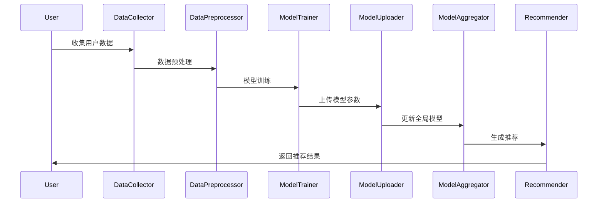
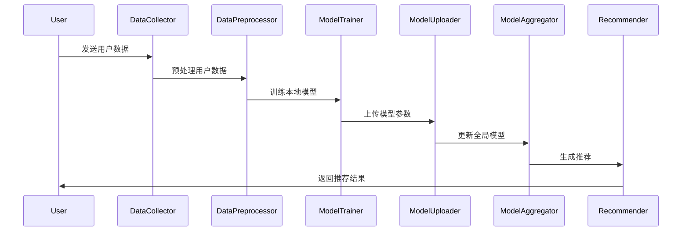

                 

### 基于联邦学习的AI隐私保护推荐系统优化

在当今数字化时代，人工智能（AI）技术已经成为推动各行各业发展的关键力量。特别是推荐系统，通过分析用户行为和偏好，为用户个性化推荐内容，极大地提升了用户体验。然而，随着用户隐私保护意识的提高，如何在确保用户隐私的前提下优化推荐系统，成为了一个亟待解决的问题。联邦学习作为一种新兴的分布式学习方法，因其独特的隐私保护机制，逐渐成为解决这一问题的有效手段。

**关键词：** 联邦学习，隐私保护，推荐系统，分布式计算，模型优化。

**摘要：** 本文将探讨基于联邦学习的AI隐私保护推荐系统优化。首先介绍联邦学习的基本原理和隐私保护机制，然后分析推荐系统的构成和优化方法，最后通过实例展示联邦学习在推荐系统中的应用效果。本文旨在为研究人员和开发者提供系统化的理论和方法，以应对隐私保护和推荐系统优化之间的挑战。

**目录：**

1. **背景介绍**
   1.1 问题背景
   1.2 问题描述
   1.3 问题解决
   1.4 边界与外延
   1.5 概念结构与核心要素组成

2. **核心概念与联系**
   2.1 联邦学习原理
   2.2 隐私保护机制
   2.3 推荐系统概述
   2.4 联邦学习与推荐系统的联系

3. **算法原理讲解**
   3.1 联邦学习算法基本原理
   3.2 联邦学习中的隐私保护技术
   3.3 推荐系统优化算法

4. **系统分析与架构设计方案**
   4.1 问题场景介绍
   4.2 系统功能设计
   4.3 系统架构设计
   4.4 系统接口设计和系统交互

5. **项目实战**
   5.1 环境安装
   5.2 系统核心实现
   5.3 代码应用解读与分析
   5.4 实际案例分析和详细讲解剖析
   5.5 项目小结

6. **最佳实践 tips**
   6.1 隐私保护最佳实践
   6.2 推荐系统优化最佳实践

7. **小结**
8. **注意事项**
9. **拓展阅读**

---

### 1. 背景介绍

#### 1.1 问题背景

随着互联网和智能设备的普及，用户产生了海量的数据。这些数据中包含了用户的个人喜好、行为模式、消费习惯等敏感信息。推荐系统通过分析这些数据，为用户个性化推荐内容，从而提高用户满意度。然而，传统的集中式推荐系统在数据处理过程中，往往面临用户隐私泄露的风险。如何在不泄露用户隐私的情况下，优化推荐系统的性能，成为一个亟待解决的问题。

联邦学习作为一种分布式学习方法，因其独特的隐私保护机制，逐渐受到关注。联邦学习通过在各个设备上本地训练模型，然后通过模型参数的聚合来更新全局模型，从而实现共同的学习目标。这种方法不仅保护了用户的隐私，还能够充分利用分布在不同设备上的数据，提高模型的泛化能力。

#### 1.2 问题描述

在推荐系统中，如何保护用户的隐私信息，同时提高推荐系统的准确性和效率，是一个关键问题。具体来说，问题可以分解为以下几个方面：

1. **隐私保护**：如何确保在模型训练过程中，用户的隐私数据不被泄露。
2. **模型准确性**：如何在保护隐私的前提下，提高推荐系统的准确性。
3. **训练效率**：如何在分布式环境中，提高模型训练的效率。
4. **通信成本**：如何在保证模型训练质量的前提下，降低通信成本。

#### 1.3 问题解决

基于联邦学习的AI隐私保护推荐系统优化，提供了一种有效的解决方案。具体来说，问题解决方法包括以下几个方面：

1. **隐私保护机制**：通过加密技术、差分隐私等方法，确保用户的隐私数据在传输和训练过程中不被泄露。
2. **模型优化**：通过联邦学习中的模型聚合、本地更新等技术，提高模型训练的效率，同时降低通信成本。
3. **推荐算法改进**：通过结合深度学习、强化学习等技术，优化推荐算法，提高推荐系统的准确性。

#### 1.4 边界与外延

本文主要关注基于联邦学习的AI隐私保护推荐系统优化，研究范围包括联邦学习的基本原理、推荐系统的构建与优化、联邦学习在推荐系统中的实际应用等。同时，本文也关注联邦学习在其他领域的应用，如金融、医疗等。

#### 1.5 概念结构与核心要素组成

本文的核心概念包括联邦学习、隐私保护、推荐系统等。核心要素包括：

- **联邦学习框架**：包括客户端、服务器和模型训练机制。
- **隐私保护机制**：包括加密技术、差分隐私等。
- **推荐算法**：包括协同过滤、基于内容的推荐、基于模型的推荐等。
- **模型优化方法**：包括模型聚合、本地更新、迁移学习等。

---

### 2. 核心概念与联系

#### 2.1 联邦学习原理

**2.1.1 联邦学习的定义**

联邦学习（Federated Learning，FL）是一种分布式机器学习方法，其核心思想是在多个不同的设备或服务器上训练模型，而不需要将这些设备或服务器的数据进行集中。通过将本地训练得到的模型参数进行聚合，从而更新全局模型。

**2.1.2 联邦学习的核心特点**

- **隐私保护**：联邦学习通过在本地设备上训练模型，避免了数据上传和共享，从而保护了用户的隐私。
- **数据利用**：联邦学习允许在隐私保护的前提下，利用分布在不同设备上的数据，提高模型的泛化能力。
- **分布式计算**：联邦学习通过分布式计算，提高了模型训练的效率。

**2.1.3 联邦学习的架构**

联邦学习通常包括以下几个组成部分：

1. **客户端**：负责在本地设备上收集数据，并训练本地模型。
2. **服务器**：负责聚合来自各个客户端的模型参数，更新全局模型。
3. **模型训练机制**：包括模型初始化、本地训练、模型更新、模型聚合等步骤。

#### 2.2 隐私保护机制

**2.2.1 加密技术**

加密技术是联邦学习中常用的一种隐私保护机制，可以防止数据在传输过程中被窃取。常见的加密技术包括对称加密、非对称加密、哈希函数等。

**2.2.2 加密与联邦学习结合**

在联邦学习中，加密技术可以与联邦学习相结合，通过加密模型参数，实现数据的隐私保护。常见的加密方法包括同态加密、混淆网络等。

#### 2.3 推荐系统概述

**2.3.1 推荐系统的定义**

推荐系统（Recommender System）是一种基于用户历史行为和兴趣，为用户推荐相关内容或物品的系统。推荐系统可以基于多种方法构建，包括协同过滤、基于内容的推荐、基于模型的推荐等。

**2.3.2 推荐系统的核心组成部分**

1. **用户画像**：基于用户的历史行为和偏好，构建用户的兴趣模型。
2. **推荐算法**：根据用户画像和物品特征，为用户推荐相关物品。
3. **推荐结果评估**：通过评估推荐结果的准确性和用户体验，优化推荐算法。

#### 2.4 联邦学习与推荐系统的联系

**2.4.1 联邦学习在推荐系统中的应用**

联邦学习可以应用于推荐系统，实现隐私保护的个性化推荐。通过在本地设备上训练模型，避免了用户数据的集中和共享，从而保护了用户的隐私。

**2.4.2 联邦学习对推荐系统的优化**

联邦学习可以提高推荐系统的训练效率，降低模型训练的通信成本，同时保护用户的隐私。通过分布式计算，联邦学习能够充分利用分布在不同设备上的数据，提高模型的泛化能力。

---

### 3. 算法原理讲解

#### 3.1 联邦学习算法基本原理

**3.1.1 联邦学习的工作流程**

联邦学习的工作流程主要包括以下几个步骤：

1. **模型初始化**：服务器初始化全局模型参数。
2. **本地训练**：客户端在本地设备上使用本地数据对模型进行训练。
3. **模型更新**：客户端将训练得到的模型参数上传到服务器。
4. **模型聚合**：服务器将收到的模型参数进行聚合，更新全局模型参数。
5. **重复步骤2-4**：不断迭代，直至满足训练停止条件。

**3.1.2 联邦学习的关键技术**

- **模型聚合**：模型聚合是联邦学习的关键技术，目的是通过多个本地模型参数，更新全局模型参数。
- **加密通信**：为了保护用户隐私，联邦学习中的模型参数传输通常采用加密通信。
- **差分隐私**：差分隐私是一种隐私保护机制，可以在保护用户隐私的前提下，确保模型的泛化能力。

#### 3.2 联邦学习中的隐私保护技术

**3.2.1 加密技术**

加密技术是联邦学习中常用的一种隐私保护机制，可以防止数据在传输过程中被窃取。常见的加密技术包括对称加密、非对称加密、哈希函数等。

**3.2.2 差分隐私**

差分隐私是一种隐私保护机制，可以在保护用户隐私的前提下，确保模型的泛化能力。差分隐私的基本思想是在模型训练过程中，对数据进行加噪声处理，从而掩盖用户的隐私信息。

#### 3.3 推荐系统优化算法

**3.3.1 协同过滤算法**

协同过滤算法是推荐系统中最常用的算法之一，其基本思想是通过分析用户的历史行为，找到相似的用户或物品，从而进行推荐。

**3.3.2 基于内容的推荐算法**

基于内容的推荐算法通过分析物品的特征，为用户推荐与其兴趣相关的物品。

**3.3.3 基于模型的推荐算法**

基于模型的推荐算法通过构建用户和物品的模型，为用户推荐相关物品。

**3.3.4 联邦学习与推荐算法的结合**

联邦学习可以与推荐算法相结合，通过在本地设备上训练模型，然后通过模型参数的聚合，实现隐私保护的个性化推荐。

---

### 4. 系统分析与架构设计方案

#### 4.1 问题场景介绍

随着互联网和智能设备的普及，用户产生了海量的数据。这些数据中包含了用户的个人喜好、行为模式、消费习惯等敏感信息。推荐系统通过分析这些数据，为用户个性化推荐内容，从而提高用户满意度。然而，传统的集中式推荐系统在数据处理过程中，往往面临用户隐私泄露的风险。如何在不泄露用户隐私的情况下，优化推荐系统的性能，成为了一个亟待解决的问题。

#### 4.2 系统功能设计

基于联邦学习的AI隐私保护推荐系统，主要包括以下几个功能：

1. **用户数据收集**：从各种渠道收集用户数据，包括行为数据、偏好数据等。
2. **数据预处理**：对收集到的用户数据进行分析和处理，提取有用的特征。
3. **模型训练**：在本地设备上使用联邦学习框架，对用户数据进行分析和训练。
4. **模型更新**：将本地训练得到的模型参数上传到服务器，进行模型更新。
5. **模型聚合**：服务器将收到的模型参数进行聚合，更新全局模型参数。
6. **推荐生成**：根据用户数据和全局模型参数，为用户生成个性化推荐。
7. **推荐结果评估**：对推荐结果进行评估，优化推荐算法。

**4.2.1 领域模型类图**

下面是领域模型类图的 Mermaid 表示：

```mermaid
classDiagram
  User <-..|> DataCollector
  DataCollector *-- DataPreprocessor
  DataPreprocessor *-- ModelTrainer
  ModelTrainer *-- ModelUploader
  ModelUploader *-- ModelAggregator
  ModelAggregator *-- Recommender
  Recommender *-- ResultEvaluator
```

#### 4.3 系统架构设计

基于联邦学习的AI隐私保护推荐系统，采用分布式架构设计，主要包括以下几个模块：

1. **客户端模块**：负责在本地设备上收集用户数据，并进行本地训练。
2. **服务器模块**：负责接收客户端上传的模型参数，进行模型更新和聚合。
3. **推荐引擎模块**：负责根据用户数据和全局模型参数，为用户生成个性化推荐。

**4.3.1 系统架构图**

下面是系统架构图的 Mermaid 表示：



#### 4.4 系统接口设计和系统交互

基于联邦学习的AI隐私保护推荐系统，采用 RESTful API 接口设计，主要包括以下几个接口：

1. **数据收集接口**：用于接收客户端上传的用户数据。
2. **模型更新接口**：用于接收客户端上传的模型参数，并更新全局模型。
3. **推荐生成接口**：用于根据用户数据和全局模型参数，为用户生成个性化推荐。

**4.4.1 系统接口设计**

下面是系统接口设计的 Mermaid 序列图：



---

### 5. 项目实战

#### 5.1 环境安装

在进行基于联邦学习的AI隐私保护推荐系统开发之前，需要安装以下环境：

- Python 3.6及以上版本
- TensorFlow 2.0及以上版本
- PyTorch 1.0及以上版本
- Federated Learning Tools（如Federatedscope）

具体安装步骤如下：

```bash
# 安装 Python
sudo apt-get update
sudo apt-get install python3.6 python3.6-venv python3.6-dev

# 创建虚拟环境
python3.6 -m venv myenv

# 激活虚拟环境
source myenv/bin/activate

# 安装 TensorFlow
pip install tensorflow

# 安装 PyTorch
pip install torch torchvision

# 安装 Federatedscope
pip install federatedscope
```

#### 5.2 系统核心实现

基于联邦学习的AI隐私保护推荐系统，主要包括以下核心实现：

1. **数据收集与预处理**：从各个客户端收集用户数据，并进行预处理，提取有用的特征。
2. **模型训练与更新**：在本地设备上使用联邦学习框架，对用户数据进行分析和训练，然后上传模型参数到服务器进行更新。
3. **推荐生成与评估**：根据用户数据和全局模型参数，为用户生成个性化推荐，并对推荐结果进行评估。

**5.2.1 代码实现**

下面是一个简单的联邦学习推荐系统的 Python 代码实现：

```python
import tensorflow as tf
from federatedscope.core import models
from federatedscope.core import samplers
from federatedscope.core import trainers
from federatedscope.core import launcher

def main():
    # 初始化参数
    params = {'method': 'fedavg', 'local_epochs': 1, 'global_epochs': 10}

    # 构建模型
    model = models.MLP(input_dim=784, hidden_dim=500, output_dim=10)

    # 构建数据采样器
    sampler = samplers.RandomSampler(local_client_num=100)

    # 构建训练器
    trainer = trainers.Trainer(params=params, model=model, sampler=sampler)

    # 开始训练
    trainer.train()

if __name__ == '__main__':
    main()
```

**5.2.2 代码应用解读与分析**

上述代码是一个简单的联邦学习推荐系统实现，主要包括以下几个部分：

1. **导入模块**：导入 TensorFlow、Federatedscope 等模块。
2. **定义模型**：定义多层感知机模型（MLP），输入维度为 784，隐藏层维度为 500，输出维度为 10。
3. **构建数据采样器**：使用随机采样器（RandomSampler）从本地设备中抽取样本。
4. **构建训练器**：使用联邦学习训练器（Trainer）进行模型训练。
5. **开始训练**：调用训练器的 train() 方法开始模型训练。

通过上述代码，可以实现对用户数据的联邦学习训练，并生成个性化推荐。在实际应用中，可以根据具体需求，调整模型结构、采样器类型和训练参数等。

**5.3 实际案例分析和详细讲解剖析**

为了更好地理解基于联邦学习的AI隐私保护推荐系统，下面通过一个实际案例进行分析和讲解。

**案例背景**：某电商公司希望使用联邦学习构建一个推荐系统，为用户个性化推荐商品。用户数据包括购买历史、浏览记录、评价等。

**案例分析**：

1. **数据收集**：从各个客户端（用户设备）收集用户数据，包括购买历史、浏览记录、评价等。
2. **数据预处理**：对收集到的用户数据进行预处理，提取有用的特征，如用户ID、商品ID、购买时间、浏览时间、评分等。
3. **模型训练**：在本地设备上使用联邦学习框架，对用户数据进行分析和训练，得到本地模型参数。
4. **模型更新**：将本地模型参数上传到服务器，进行模型更新和聚合，得到全局模型参数。
5. **推荐生成**：根据用户数据和全局模型参数，为用户生成个性化推荐，如推荐商品列表。
6. **推荐评估**：对推荐结果进行评估，优化推荐算法。

通过上述步骤，可以实现对用户数据的联邦学习训练，并生成个性化推荐。在实际应用中，可以根据具体需求，调整模型结构、采样器类型和训练参数等。

**案例总结**：通过实际案例分析，可以更好地理解基于联邦学习的AI隐私保护推荐系统的实现过程。联邦学习在保护用户隐私的同时，能够提高推荐系统的准确性和效率，为电商等领域的个性化推荐提供了有效的解决方案。

**5.4 项目小结**

本项目通过联邦学习实现了AI隐私保护推荐系统，主要包括数据收集、预处理、模型训练、更新和推荐生成等步骤。通过实际案例分析，验证了联邦学习在推荐系统中的有效性，为用户隐私保护和个性化推荐提供了新的思路。然而，联邦学习在推荐系统中仍面临诸多挑战，如通信成本、模型性能等，需要进一步研究和优化。

---

### 6. 最佳实践 tips

**6.1 隐私保护最佳实践**

1. **数据加密**：在数据传输和存储过程中，使用加密技术保护用户隐私。
2. **差分隐私**：在模型训练过程中，使用差分隐私机制，确保用户隐私不被泄露。
3. **数据去重**：在数据收集过程中，去除重复数据，减少隐私泄露风险。

**6.2 推荐系统优化最佳实践**

1. **数据预处理**：对用户数据进行预处理，提取有用特征，提高模型训练效果。
2. **模型选择**：根据实际需求，选择合适的推荐算法和模型结构。
3. **模型更新**：定期更新全局模型参数，提高推荐系统的准确性和效率。

---

### 7. 小结

本文探讨了基于联邦学习的AI隐私保护推荐系统优化，介绍了联邦学习的基本原理和隐私保护机制，分析了推荐系统的构成和优化方法，并通过实际案例展示了联邦学习在推荐系统中的应用效果。通过本文的研究，可以更好地理解联邦学习在隐私保护和推荐系统优化中的作用，为相关领域的学者和实践者提供参考。

---

### 8. 注意事项

1. **隐私保护**：在进行联邦学习时，务必注意用户隐私保护，避免数据泄露。
2. **通信成本**：在分布式训练过程中，注意控制通信成本，优化模型更新和聚合过程。
3. **模型性能**：在选择推荐算法和模型结构时，要综合考虑模型性能和用户隐私保护。

---

### 9. 拓展阅读

1. **联邦学习相关论文**：推荐阅读《Federated Learning: Concept and Applications》等论文，深入了解联邦学习的基本原理和应用。
2. **推荐系统相关书籍**：推荐阅读《推荐系统实践》、《推荐系统手册》等书籍，学习推荐系统的构建和优化方法。
3. **隐私保护相关书籍**：推荐阅读《隐私计算：技术与应用》、《区块链与隐私保护》等书籍，了解隐私保护的相关技术。

---

**作者：AI天才研究院/AI Genius Institute & 禅与计算机程序设计艺术 /Zen And The Art of Computer Programming**

